Ch. 5 The Many Variables & The Spurious Waffles
================
A Solomon Kurz
2019-01-02

The Many Variables & The Spurious Waffles
=========================================

McElreath's listed reasons for multivaraiable regression include:

-   statistical control for confounds
-   multiple causation
-   interactions

We'll approach the first two in this chapter. Interactions are reserved for Chapter 6.

Spurious associations
---------------------

Load the Waffle House data.

``` r
library(rethinking)
data(WaffleDivorce)
d <- WaffleDivorce
```

Unload rethinking and load brms and, while we're at it, the tidyverse.

``` r
rm(WaffleDivorce)
detach(package:rethinking, unload = T)
library(brms)
library(tidyverse)
```

I'm not going to show the output, but you might go ahead and investigate the data with the typical functions. E.g.,

``` r
head(d)
glimpse(d)
```

Now we have our data, we can reproduce Figure 5.1. One convenient way to get the handful of sate labels into the plot was with the `geom_text_repel()` function from the [ggrepel package](https://cran.r-project.org/web/packages/ggrepel/index.html). But first, we spent the last few chapters warming up with ggplot2. Going forward, each chapter will have its own plot theme. In this chapter, we’ll characterize the plots with `theme_bw() + theme(panel.grid = element_rect())` and coloring based off of `"firebrick"`.

``` r
# install.packages("ggrepel", depencencies = T)
library(ggrepel)

d %>%
  ggplot(aes(x = WaffleHouses/Population, y = Divorce)) +
  stat_smooth(method = "lm", fullrange = T, size = 1/2,
              color = "firebrick4", fill = "firebrick", alpha = 1/5) +
  geom_point(size = 1.5, color = "firebrick4", alpha = 1/2) +
  geom_text_repel(data = d %>% filter(Loc %in% c("ME", "OK", "AR", "AL", "GA", "SC", "NJ")),  
                  aes(label = Loc), 
                  size = 3, seed = 1042) +  # this makes it reproducible
  scale_x_continuous(limits = c(0, 55)) +
  coord_cartesian(xlim = 0:50, ylim = 5:15) +
  labs(x = "Waffle Houses per million", 
       y = "Divorce rate") +
  theme_bw() +
  theme(panel.grid = element_blank())  
```

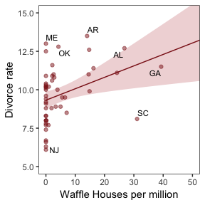

With `coord_map()` and help from the [fiftystater package](https://cran.r-project.org/web/packages/fiftystater/index.html) (which gives us access to lat/long data for all fifty states via `fifty_states`), we can plot our three major variables in a map format.

``` r
library(fiftystater)

d %>% 
  # first we'll standardize the three variables to put them all on the same scale
  mutate(Divorce_z           = (Divorce - mean(Divorce))                     / sd(Divorce),
         MedianAgeMarriage_z = (MedianAgeMarriage - mean(MedianAgeMarriage)) / sd(MedianAgeMarriage),
         Marriage_z          = (Marriage - mean(Marriage))                   / sd(Marriage),
         # need to make the state names lowercase to match with the map data
         Location            = str_to_lower(Location)) %>% 
  # here we select the relevant variables and put them in the long format to facet with `facet_wrap()`
  select(Divorce_z:Marriage_z, Location) %>% 
  gather(key, value, -Location) %>% 
  
  ggplot(aes(map_id = Location)) +
  geom_map(aes(fill = value), map = fifty_states, 
           color = "firebrick", size = 1/15) +
  expand_limits(x = fifty_states$long, y = fifty_states$lat) +
  scale_x_continuous(NULL, breaks = NULL) +
  scale_y_continuous(NULL, breaks = NULL) +
  scale_fill_gradient(low = "#f8eaea", high = "firebrick4") +
  coord_map() +
  theme_bw() +
  theme(panel.grid       = element_blank(),
        legend.position  = "none",
        strip.background = element_rect(fill = "transparent", color = "transparent")) +
  facet_wrap(~key)
```

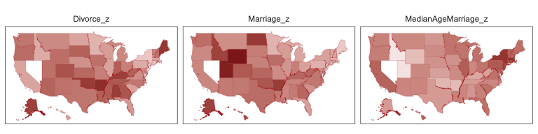

One of the advantages of this visualization method is it just became clear that Nevada is missing from the `WaffleDivorce` data. Execute `d %>% distinct(Location)` to see for yourself. Those missing data should motivate the skills we'll cover in Chapter 14. But let's get back on track. Here's the standard deviation for `MedianAgeMarriage` in its current metric.

``` r
sd(d$MedianAgeMarriage)
```

    ## [1] 1.24363

Here we'll officially standardize the predictor, `MedianAgeMarriage`, and our criterion, `Divorce`. Before we jump in, we should address a technicality. If we just use Base R `scale()` within our tidyverse framework, [it will cause down-the-road problems](https://stackoverflow.com/questions/35775696/trying-to-use-dplyr-to-group-by-and-apply-scale). In short, `scale()` expects a matrix and we're decidedly working within a data frame framework. We have a few options. One, you can always standardize by hand (e.g., `MedianAgeMarriage_s = (MedianAgeMarriage - mean(MedianAgeMarriage)) / sd(MedianAgeMarriage)`). Two, you can make your own custom scaling function. Three, you can make your own custom function Anticipating the next model on page 127, here we'll showcase all three.

``` r
scale_this <- function(x, center = TRUE, scale = TRUE) {
  as.vector(scale(x))
  }

d <-
  d %>%
  mutate(MedianAgeMarriage_s = (MedianAgeMarriage - mean(MedianAgeMarriage)) / sd(MedianAgeMarriage),
         Divorce_s           = scale_this(Divorce),
         Marriage_s          = scale(Marriage) %>% as.vector())
```

Our first statistical model follows the form

$$
\\begin{eqnarray}
\\text{Divorce\_s}\_i & \\sim & \\text{Normal}(\\mu\_i, \\sigma) \\\\
\\mu\_i & = & \\alpha + \\beta\_1 \\text{MedianAgeMarriage\_s}\_i \\\\
\\alpha & \\sim & \\text{Normal}(0, 0.2) \\\\
\\beta\_1 & \\sim & \\text{Normal}(0, 0.5) \\\\
\\sigma & \\sim & \\text{Exponential}(1)
\\end{eqnarray}
$$

Let's fit the first univariable model.

``` r
b5.1 <- 
  brm(data = d, family = gaussian,
      Divorce_s ~ 0 + Intercept + MedianAgeMarriage_s,
      prior = c(prior(normal(0, 0.2), class = b, coef = "Intercept"),
                prior(normal(0, 0.5), class = b, coef = "MedianAgeMarriage_s"),
                prior(exponential(1), class = sigma)),
      iter = 2000, warmup = 500, chains = 4, cores = 4,
      seed = 5,
      sample_prior = T)
```

Before we examine the model summary, let's simulate from the priors and make our version of Figure 5.3.

``` r
set.seed(10)
prior_samples(b5.1) %>% 
  sample_n(size = 50) %>% 
  rownames_to_column() %>% 
  expand(nesting(rowname, b_Intercept, b_MedianAgeMarriage_s),
         MedianAgeMarriage_s = c(-2, 2)) %>% 
  mutate(Divorce_s = b_Intercept + b_MedianAgeMarriage_s * MedianAgeMarriage_s) %>% 
  
  ggplot(aes(x = MedianAgeMarriage_s, y = Divorce_s)) +
  geom_line(aes(group = rowname),
            color = "firebrick", alpha = .4) +
  coord_cartesian(ylim = -2:2) +
  theme_bw() +
  theme(panel.grid = element_blank()) 
```

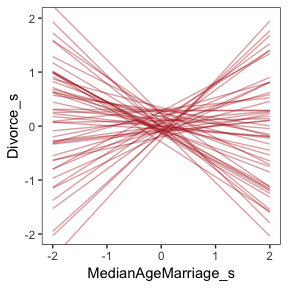

To get the posterior predictions from our brms model, we'll use `fitted()` in place of `link()`.

``` r
# Determine the range of `MedianAgeMarriage_s` values we'd like to feed into `fitted()`
nd <- tibble(MedianAgeMarriage_s = seq(from = -3, to = 3.2, length.out = 30))

# Now use `fitted()` to get the model-implied trajectories
fitted(b5.1,
       newdata = nd) %>% 
  as_tibble() %>% 
  bind_cols(nd) %>% 
  
  # Plot
  ggplot(aes(x = MedianAgeMarriage_s, y = Estimate)) +
  geom_smooth(aes(ymin = Q2.5, ymax = Q97.5),
              stat = "identity",
              fill = "firebrick", color = "firebrick4", alpha = 1/5, size = 1/4) +
  geom_point(data = d, 
             aes(x = MedianAgeMarriage_s, y = Divorce_s), 
             size = 2, color = "firebrick4") +
  labs(y = "Divorce") +
  coord_cartesian(xlim = range(d$MedianAgeMarriage_s), 
                  ylim = range(d$Divorce_s)) +
  theme_bw() +
  theme(panel.grid = element_blank()) 
```

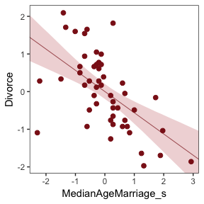

That'll serve as our version of Figure 5.2. To paraphrase McElreath, "if you inspect the \[`print()`\] output, you’ll see that posterior for \[*β*<sub>MedianAgeMarriage\_s</sub>\] is reliably negative" (p. 127).

``` r
print(b5.1)
```

    ##  Family: gaussian 
    ##   Links: mu = identity; sigma = identity 
    ## Formula: Divorce_s ~ 0 + Intercept + MedianAgeMarriage_s 
    ##    Data: d (Number of observations: 50) 
    ## Samples: 4 chains, each with iter = 2000; warmup = 500; thin = 1;
    ##          total post-warmup samples = 6000
    ## 
    ## Population-Level Effects: 
    ##                     Estimate Est.Error l-95% CI u-95% CI Eff.Sample Rhat
    ## Intercept               0.00      0.10    -0.20     0.20       5290 1.00
    ## MedianAgeMarriage_s    -0.56      0.11    -0.78    -0.34       5405 1.00
    ## 
    ## Family Specific Parameters: 
    ##       Estimate Est.Error l-95% CI u-95% CI Eff.Sample Rhat
    ## sigma     0.82      0.09     0.68     1.01       5620 1.00
    ## 
    ## Samples were drawn using sampling(NUTS). For each parameter, Eff.Sample 
    ## is a crude measure of effective sample size, and Rhat is the potential 
    ## scale reduction factor on split chains (at convergence, Rhat = 1).

If you recall, we've already made our standardized `Marriage` variable, `Marriage_s`.

We're ready to fit our second univariable model.

``` r
b5.2 <- 
  brm(data = d, family = gaussian,
      Divorce_s ~ 1 + Marriage_s,
      prior = c(prior(normal(0, 0.2), class = Intercept),
                prior(normal(0, 0.5), class = b),
                prior(exponential(1), class = sigma)),
      iter = 2000, warmup = 500, chains = 4, cores = 4,
      seed = 5)
```

Here's the summary.

``` r
print(b5.2)
```

    ##  Family: gaussian 
    ##   Links: mu = identity; sigma = identity 
    ## Formula: Divorce_s ~ 1 + Marriage_s 
    ##    Data: d (Number of observations: 50) 
    ## Samples: 4 chains, each with iter = 2000; warmup = 500; thin = 1;
    ##          total post-warmup samples = 6000
    ## 
    ## Population-Level Effects: 
    ##            Estimate Est.Error l-95% CI u-95% CI Eff.Sample Rhat
    ## Intercept      0.00      0.11    -0.22     0.22       5301 1.00
    ## Marriage_s     0.35      0.13     0.08     0.60       5261 1.00
    ## 
    ## Family Specific Parameters: 
    ##       Estimate Est.Error l-95% CI u-95% CI Eff.Sample Rhat
    ## sigma     0.95      0.10     0.78     1.17       4883 1.00
    ## 
    ## Samples were drawn using sampling(NUTS). For each parameter, Eff.Sample 
    ## is a crude measure of effective sample size, and Rhat is the potential 
    ## scale reduction factor on split chains (at convergence, Rhat = 1).

Now we'll wangle and plot our version of Figure 5.2.a.

``` r
nd <- tibble(Marriage_s = seq(from = -2.5, to = 3.5, length.out = 30))

fitted(b5.2, newdata = nd) %>%
  as_tibble() %>%
  bind_cols(nd) %>% 
  
  ggplot(aes(x = Marriage_s, y = Estimate)) +
  geom_smooth(aes(ymin = Q2.5, ymax = Q97.5),
              stat = "identity",
              fill = "firebrick", color = "firebrick4", alpha = 1/5, size = 1/4) +
  geom_point(data = d, 
             aes(x = Marriage_s, y = Divorce_s), 
             size = 2, color = "firebrick4") +
  coord_cartesian(xlim = range(d$Marriage_s), 
                  ylim = range(d$Divorce_s)) +
  labs(y = "Divorce") +
  theme_bw() +
  theme(panel.grid = element_blank())                   
```

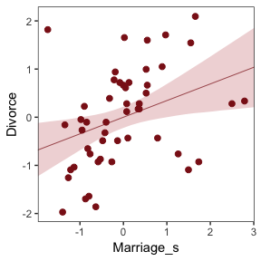

> But merely comparing parameter means between different bivariate regressions is no way to decide which predictor is better. Both of these predictors could provide independent value, or they could be redundant, or one could eliminate the value of the other.
>
> To make sense of this, we’re going to have to think causally. And then, only after we’ve done some thinking, a bigger regression model that includes both age at marriage and marriage rate will help us. (p. 127)

### Think before you regress.

If you're interested in making directed acyclic graphs (DAG) in R, [dagitty](https://cran.r-project.org/web/packages/dagitty/index.html) and [ggdag](https://cran.r-project.org/web/packages/ggdag/index.html) packages are handy.

``` r
# install.packages("dagitty", dependencies = T)
# install.packages("ggdag", dependencies = T)
# library(dagitty)
library(ggdag)
```

    ## 
    ## Attaching package: 'ggdag'

    ## The following object is masked from 'package:ggplot2':
    ## 
    ##     expand_scale

    ## The following object is masked from 'package:stats':
    ## 
    ##     filter

If all you want is a quick and dirty DAG, you can just do something like this.

``` r
set.seed(5)
dagify(M ~ A,
       D ~ A + M) %>%
  ggdag(node_size = 8)
```

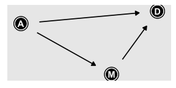

We can also pretty it up a little.

``` r
dag_coords <-
  tibble(name = c("A", "M", "D"),
         x    = c(1, 3, 2),
         y    = c(2, 2, 1))

dagify(M ~ A,
       D ~ A + M,
       coords = dag_coords) %>%
  
  ggplot(aes(x = x, y = y, xend = xend, yend = yend)) +
  geom_dag_point(color = "firebrick", alpha = 1/4, size = 10) +
  geom_dag_text(color = "firebrick") +
  geom_dag_edges(edge_color = "firebrick") +
  scale_x_continuous(NULL, breaks = NULL, expand = c(.1, .1)) +
  scale_y_continuous(NULL, breaks = NULL, expand = c(.1, .1)) +
  theme_bw() +
  theme(panel.grid = element_blank())
```

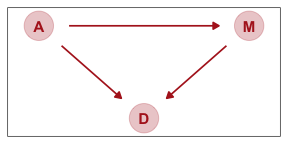

We could have left out the `coords` argument and let the `dagify()` function set the layout of the nodes on its own. But since we were picky and wanted to ape McElreath, we first specified our coordinates in a tibble and then included that tibble in the `coords` argument. For more on the topic, check out the Barrett’s [*An Introduction to ggdag*](https://cran.r-project.org/web/packages/ggdag/vignettes/intro-to-ggdag.html) vignette.

Buy anyway, our DAG

> represents a heuristic causal model. Like other models, it is an analytical assumption. The symbols A, M, and D are our observed variables. The arrows show directions of influence. What this DAG says is:
>
> 1.  A may directly influence D
> 2.  M may directly influence D
> 3.  A may also indirectly influence D through M
>
> In more human terms, age of marriage can influence divorce in two ways. First it can have a direct effect, perhaps because younger people change faster than older people and are therefore more likely to grow incompatible with a partner. Second, it can have an indirect effect by influencing the marriage rate. If people get married earlier, then the marriage rate may rise, because there are more young people. (p. 128)

Considering alternative models, "It could be that the association between M and D arises entirely from A’s influence on both M and D. Like this:" (p. 129)

``` r
dagify(M ~ A,
       D ~ A,
       coords = dag_coords) %>%
  
  ggplot(aes(x = x, y = y, xend = xend, yend = yend)) +
  geom_dag_point(color = "firebrick", alpha = 1/4, size = 10) +
  geom_dag_text(color = "firebrick") +
  geom_dag_edges(edge_color = "firebrick") +
  scale_x_continuous(NULL, breaks = NULL, expand = c(.1, .1)) +
  scale_y_continuous(NULL, breaks = NULL, expand = c(.1, .1)) +
  theme_bw() +
  theme(panel.grid = element_blank()) 
```

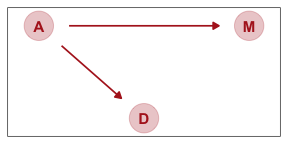

The question is

> Is there a direct effect of marriage rate, or rather is age at marriage just driving both, creating a spurious correlation between marriage rate and divorce rate?
>
> To find out, we need a model that "controls" for A while assessing the association between M and D. And that is what multiple regression helps with. The question we want to answered:
>
> > *Is there any additional value in knowing a variable, once I already know all of the other predictor variables?*
>
> So for example once you fit a multiple regression to predict divorce using both marriage rate and age at marriage, the model addresses the questions:
>
> 1.  After I already know marriage rate, what additional value is there in also knowing age at marriage?
> 2.  After I already know age at marriage, what additional value is there in also knowing marriage rate?
>
> The parameter estimates corresponding to each predictor are the (often opaque) answers to these questions. Next we’ll design the model that asks these questions. (p. 129 *emphasis* in the original)

### Multiple regression notation.

Now we'll get both predictors in there with our very first multivariable model. We can write the statistical model as

$$
\\begin{eqnarray}
\\text{Divorce\_s}\_i & \\sim & \\text{Normal}(\\mu\_i, \\sigma) \\\\
\\mu\_i & = & \\alpha + \\beta\_1 \\text{Marriage\_s}\_i + \\beta\_2 \\text{MedianAgeMarriage\_s}\_i \\\\
\\alpha & \\sim & \\text{Normal}(0, 0.2) \\\\
\\beta\_1 & \\sim & \\text{Normal}(0, 0.5) \\\\
\\beta\_2 & \\sim & \\text{Normal}(0, 0.5) \\\\
\\sigma & \\sim & \\text{Exponential}(1)
\\end{eqnarray}
$$

> It might help to read the + symbols as "or" and then say: *A State’s divorce rate can be a function of its marriage rate **or** its median age at marriage*. The "or" indicates independent associations, which may be purely statistical or rather causal. (p. 130, *emphasis* in the original)

### Approximating the posterior.

Much like we used the `+` operator to add single predictors to the intercept, we just use more `+` operators in the `formula` argument to add more predictors. Also notice we're using the same prior `prior(normal(0, 1), class = b)` for both predictors. Within the brms framework, they are both of `class = b`. But if we wanted their priors to differ, we'd make two `prior()` statements and differentiate them with the `coef` argument. You'll see examples of that later on.

``` r
b5.3 <- 
  brm(data = d, family = gaussian,
      Divorce_s ~ 1 + Marriage_s + MedianAgeMarriage_s,
      prior = c(prior(normal(0, 0.2), class = Intercept),
                prior(normal(0, 0.5), class = b),
                prior(exponential(1), class = sigma)),
      iter = 2000, warmup = 500, chains = 4, cores = 4,
      seed = 5)
```

Behold the summary.

``` r
print(b5.3)
```

    ##  Family: gaussian 
    ##   Links: mu = identity; sigma = identity 
    ## Formula: Divorce_s ~ 1 + Marriage_s + MedianAgeMarriage_s 
    ##    Data: d (Number of observations: 50) 
    ## Samples: 4 chains, each with iter = 2000; warmup = 500; thin = 1;
    ##          total post-warmup samples = 6000
    ## 
    ## Population-Level Effects: 
    ##                     Estimate Est.Error l-95% CI u-95% CI Eff.Sample Rhat
    ## Intercept              -0.00      0.10    -0.20     0.20       6002 1.00
    ## Marriage_s             -0.06      0.16    -0.37     0.25       4283 1.00
    ## MedianAgeMarriage_s    -0.61      0.16    -0.92    -0.29       4422 1.00
    ## 
    ## Family Specific Parameters: 
    ##       Estimate Est.Error l-95% CI u-95% CI Eff.Sample Rhat
    ## sigma     0.83      0.09     0.68     1.02       4589 1.00
    ## 
    ## Samples were drawn using sampling(NUTS). For each parameter, Eff.Sample 
    ## is a crude measure of effective sample size, and Rhat is the potential 
    ## scale reduction factor on split chains (at convergence, Rhat = 1).

The brms package doesn't have a convenience function like `rethinking::coeftab()`. However, we can make something similar with a little deft wrangling and ggplot2 code.

``` r
# first, extract and rename the necessary posterior parameters
bind_cols(
  posterior_samples(b5.1) %>% 
    transmute(`b5.1_beta[A]` = b_MedianAgeMarriage_s),
  posterior_samples(b5.2) %>% 
    transmute(`b5.2_beta[M]` = b_Marriage_s),
  posterior_samples(b5.3) %>% 
    transmute(`b5.3_beta[M]` = b_Marriage_s,
              `b5.3_beta[A]` = b_MedianAgeMarriage_s)
  ) %>% 
  # convert them to the long format, group, and get the posterior summaries
  gather() %>% 
  group_by(key) %>% 
  summarise(Estimate = mean(value),
            ll   = quantile(value, prob = .025),
            ul   = quantile(value, prob = .975)) %>% 
  # since the `key` variable is really two variables in one, here we split them up
  separate(key, into = c("fit", "parameter"), sep = "_") %>% 
  # now fill in the missing rows
  complete(fit, parameter) %>% 
  
  # plot!
  ggplot(aes(x = fit)) +
  geom_pointrange(aes(y = Estimate, ymin = ll, ymax = ul),
                  color = "firebrick") +
  geom_hline(yintercept = 0, color = "firebrick", alpha = 1/5) +
  xlab(NULL) +
  coord_flip() +
  theme_bw() +
  theme(panel.grid = element_blank(),
        strip.background = element_rect(fill = "transparent", color = "transparent")) +
  facet_wrap(~parameter, ncol = 1, labeller = label_parsed)
```

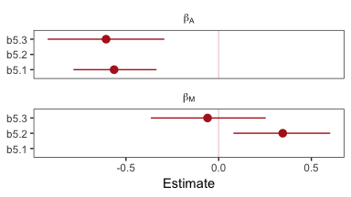

Don't worry, coefficient plots won't always be this complicated. We'll walk out simpler ones toward the end of the chapter.

The substantive interpretation of all those coefficient plots is: "*Once we know median age at marriage for a State, there is little or no additive predictive power in also knowing the rate of marriage in that State*" (p. 132, *emphasis* in the original).

#### Overthinking: Simulating the divorce example.

Okay, let's simulate our divorce data in a tidyverse sort of way.

``` r
# how many states would you like?
n <- 50 

set.seed(5)
sim_d <-
  tibble(age = rnorm(n, mean = 0,   sd = 1)) %>%  # sim A 
  mutate(mar = rnorm(n, mean = age, sd = 1),      # sim A -> M 
         div = rnorm(n, mean = age, sd = 1))      # sim A -> D

head(sim_d)
```

    ## # A tibble: 6 x 3
    ##       age    mar    div
    ##     <dbl>  <dbl>  <dbl>
    ## 1 -0.841   0.622 -2.84 
    ## 2  1.38    1.57   2.52 
    ## 3 -1.26   -0.233 -0.580
    ## 4  0.0701 -0.522  0.279
    ## 5  1.71    1.60   1.65 
    ## 6 -0.603  -1.53   0.291

If we use the `update()` function, we can refit the last models in haste.

``` r
b5.1_sim <- 
  update(b5.1, 
         newdata = sim_d, 
         formula = div ~ 0 + Intercept + age)

b5.2_sim <- 
  update(b5.2, 
         newdata = sim_d, 
         formula = div ~ 1 + mar)
      
 b5.3_sim <- 
  update(b5.3, 
         newdata = sim_d,
         formula = div ~ 1 + mar + age)
```

The steps for our homemade `coefplot()` plot are basically the same. Just switch out some of the names.

``` r
bind_cols(
  posterior_samples(b5.1_sim) %>% 
    transmute(`b5.1_beta[A]` = b_age),
  posterior_samples(b5.2_sim) %>% 
    transmute(`b5.2_beta[M]` = b_mar),
  posterior_samples(b5.3_sim) %>% 
    transmute(`b5.3_beta[M]` = b_mar,
              `b5.3_beta[A]` = b_age)
  ) %>% 
  gather() %>% 
  group_by(key) %>% 
  summarise(Estimate = mean(value),
            ll   = quantile(value, prob = .025),
            ul   = quantile(value, prob = .975)) %>% 
  separate(key, into = c("fit", "parameter"), sep = "_") %>% 
  complete(fit, parameter) %>% 
  
  ggplot(aes(x = fit)) +
  geom_pointrange(aes(y = Estimate, ymin = ll, ymax = ul),
                  color = "firebrick") +
  geom_hline(yintercept = 0, color = "firebrick", alpha = 1/5) +
  xlab(NULL) +
  coord_flip() +
  theme_bw() +
  theme(panel.grid = element_blank(),
        strip.background = element_rect(fill = "transparent", color = "transparent")) +
  facet_wrap(~parameter, ncol = 1, labeller = label_parsed)
```

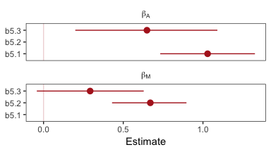

Well, okay. This is the same basic pattern, but with the signs switched and with a little simulation variability thrown in. But you get the picture.

### Plotting multivariate posteriors.

"Let’s pause for a moment, before moving on.There are a lot of moving parts here: three variables, some strange DAGs, and three models. If you feel at all confused, it is only because you are paying attention" (p. 133).

Preach, brother.

Down a little further, McElreath gave us this deflationary delight: "There is a huge literature detailing a variety of plotting techniques that all attempt to help one understand multiple linear regression. None of these techniques is suitable for all jobs, and most do not generalize beyond linear regression" (p. 133). Now you’re inspired, let’s learn three:

-   Predictor residual plots
-   Counterfactual plots
-   Posterior prediction plots

#### Predictor residual plots.

To get ready to make our residual plots, we'll predict `Marriage_s` with `MedianAgeMarriage_s`.

``` r
b5.4 <- 
  brm(data = d, family = gaussian,
      Marriage_s ~ 1 + MedianAgeMarriage_s,
      prior = c(prior(normal(0, 0.2), class = Intercept),
                prior(normal(0, 0.5), class = b),
                prior(exponential(1), class = sigma)),
      iter = 2000, warmup = 500, chains = 4, cores = 4,
      seed = 5)
```

``` r
print(b5.4)
```

    ##  Family: gaussian 
    ##   Links: mu = identity; sigma = identity 
    ## Formula: Marriage_s ~ 1 + MedianAgeMarriage_s 
    ##    Data: d (Number of observations: 50) 
    ## Samples: 4 chains, each with iter = 2000; warmup = 500; thin = 1;
    ##          total post-warmup samples = 6000
    ## 
    ## Population-Level Effects: 
    ##                     Estimate Est.Error l-95% CI u-95% CI Eff.Sample Rhat
    ## Intercept              -0.00      0.09    -0.18     0.17       5134 1.00
    ## MedianAgeMarriage_s    -0.69      0.10    -0.89    -0.49       5513 1.00
    ## 
    ## Family Specific Parameters: 
    ##       Estimate Est.Error l-95% CI u-95% CI Eff.Sample Rhat
    ## sigma     0.71      0.07     0.59     0.88       4138 1.00
    ## 
    ## Samples were drawn using sampling(NUTS). For each parameter, Eff.Sample 
    ## is a crude measure of effective sample size, and Rhat is the potential 
    ## scale reduction factor on split chains (at convergence, Rhat = 1).

With `fitted()`, we compute the expected values for each state (with the exception of Nevada). Since the `MedianAgeMarriage_s` values for each state are in the date we used to fit the model, we’ll omit the `newdata` argument.

``` r
f_b5.4 <- 
  fitted(b5.4) %>%
  as_tibble() %>%
  bind_cols(d)

head(f_b5.4)
```

    ## # A tibble: 6 x 20
    ##   Estimate Est.Error     Q2.5  Q97.5 Location   Loc   Population
    ##      <dbl>     <dbl>    <dbl>  <dbl> <fct>      <fct>      <dbl>
    ## 1    0.418    0.109   0.201    0.629 Alabama    AL          4.78
    ## 2    0.473    0.114   0.247    0.693 Alaska     AK          0.71
    ## 3    0.140    0.0916 -0.0410   0.316 Arizona    AZ          6.33
    ## 4    0.973    0.169   0.636    1.30  Arkansas   AR          2.92
    ## 5   -0.415    0.107  -0.626   -0.208 California CA         37.2 
    ## 6    0.196    0.0939  0.00883  0.377 Colorado   CO          5.03
    ## # ... with 13 more variables: MedianAgeMarriage <dbl>, Marriage <dbl>,
    ## #   Marriage.SE <dbl>, Divorce <dbl>, Divorce.SE <dbl>,
    ## #   WaffleHouses <int>, South <int>, Slaves1860 <int>,
    ## #   Population1860 <int>, PropSlaves1860 <dbl>, MedianAgeMarriage_s <dbl>,
    ## #   Divorce_s <dbl>, Marriage_s <dbl>

After a little data processing, we can make Figure 5.3.

``` r
f_b5.4 %>% 
  
  ggplot(aes(x = MedianAgeMarriage_s, y = Marriage_s)) +
  geom_point(size = 2, shape = 1, color = "firebrick4") +
  geom_segment(aes(xend = MedianAgeMarriage_s, yend = Estimate), 
               size = 1/4) +
  geom_line(aes(y = Estimate), 
            color = "firebrick4") +
  geom_text_repel(data = . %>% filter(Loc %in% c("WY", "ND", "ME", "HI", "DC")),  
                  aes(label = Loc), 
                  size = 3, seed = 14) +
  labs(x = "Age at marriage (std)",
       y = "Marriage rate (std)") +
  coord_cartesian(ylim = range(d$Marriage_s)) +
  theme_bw() +
  theme(panel.grid = element_blank())     
```

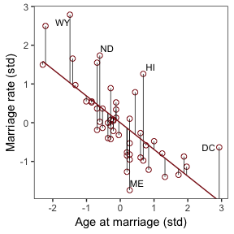

We get the residuals with the well-named `residuals()` function. Much like with `brms::fitted()`, `brms::residuals()` returns a four-vector matrix with the number of rows equal to the number of observations in the original data (by default, anyway). The vectors have the familiar names: `Estimate`, `Est.Error`, `Q2.5`, and `Q97.5`. See the [brms reference manual](https://cran.r-project.org/web/packages/brms/brms.pdf) for details.

With our residuals in hand, we just need a little more data processing to make Figure 5.4.a.

``` r
r_b5.4 <- 
  residuals(b5.4) %>%
  # To use this in ggplot2, we need to make it a tibble or data frame
  as_tibble() %>% 
  bind_cols(d)

r_b5.4 %>% 
  ggplot(aes(x = Estimate, y = Divorce_s)) +
  stat_smooth(method = "lm", fullrange = T,
              color = "firebrick4", fill = "firebrick4", 
              alpha = 1/5, size = 1/2) +
  geom_vline(xintercept = 0, linetype = 2, color = "grey50") +
  geom_point(size = 2, color = "firebrick4", alpha = 2/3) +
  geom_text_repel(data = . %>% filter(Loc %in% c("WY", "ND", "ME", "HI", "DC")),  
                  aes(label = Loc), 
                  size = 3, seed = 5) +
  scale_x_continuous(limits = c(-2, 2)) +
  coord_cartesian(xlim = range(r_b5.4$Estimate)) +
  labs(x = "Marriage rate residuals",
       y = "Divorce rate (std)") +
  theme_bw() +
  theme(panel.grid = element_blank())
```

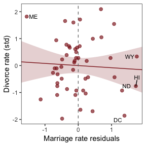

To get the `MedianAgeMarriage_s` residuals, we have to fit the corresponding model first.

``` r
b5.4b <- 
  brm(data = d, family = gaussian,
      MedianAgeMarriage_s ~ 1 + Marriage_s,
      prior = c(prior(normal(0, 0.2), class = Intercept),
                prior(normal(0, 0.5), class = b),
                prior(exponential(1), class = sigma)),
      iter = 2000, warmup = 500, chains = 4, cores = 4,
      seed = 5)
```

With `b5.4b` in hand, we're ready to make Figure 5.4.b.

``` r
fitted(b5.4b) %>%
  as_tibble() %>%
  bind_cols(d) %>% 
  
  ggplot(aes(x = Marriage_s, y = MedianAgeMarriage_s)) +
  geom_point(size = 2, shape = 1, color = "firebrick4") +
  geom_segment(aes(xend = Marriage_s, yend = Estimate), 
               size = 1/4) +
  geom_line(aes(y = Estimate), 
            color = "firebrick4") +
  geom_text_repel(data = . %>% filter(Loc %in% c("DC", "HI", "ID")),  
                  aes(label = Loc), 
                  size = 3, seed = 5) +
  labs(x = "Marriage rate (std)",
       y = "Age at marriage (std)") +
  coord_cartesian(ylim = range(d$MedianAgeMarriage_s)) +
  theme_bw() +
  theme(panel.grid = element_blank())     
```

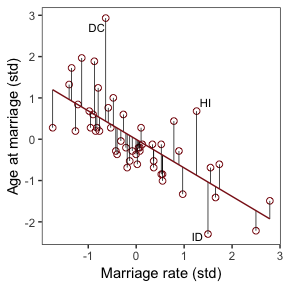

And now we'll get the new batch of residuals, do a little data processing, and make a plot corresponding to the final panel of Figure 5.4.

``` r
r_b5.4b <-
  residuals(b5.4b) %>%
  as_tibble() %>% 
  bind_cols(d)

r_b5.4b %>%
  ggplot(aes(x = Estimate, y = Divorce_s)) +
  stat_smooth(method = "lm", fullrange = T,
              color = "firebrick4", fill = "firebrick4", 
              alpha = 1/5, size = 1/2) +
  geom_vline(xintercept = 0, linetype = 2, color = "grey50") +
  geom_point(size = 2, color = "firebrick4", alpha = 2/3) +
  geom_text_repel(data = . %>% filter(Loc %in% c("ID", "HI", "DC")),  
                  aes(label = Loc), 
                  size = 3, seed = 5) +
  scale_x_continuous(limits = c(-2, 3)) +
  coord_cartesian(xlim = range(r_b5.4b$Estimate),
                  ylim = range(d$Divorce_s)) +
  labs(x = "Age at marriage residuals",
       y = "Divorce rate (std)") +
  theme_bw() +
  theme(panel.grid = element_blank())
```

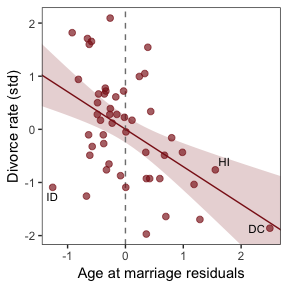

#### Counterfactual plots.

> A second sort of inferential plot displays the implied predictions of the model. I call these plots *counterfactual*, because they can be produced for any values of the predictor variables you like, even unobserved or impossible combinations like very high median age of marriage and very high marriage rate. There are no States with this combination, but in a counterfactual plot, you can ask the model for a prediction for such a State. (p. 136, *emphasis* in the original)

Making Figure 5.5.a requires a little more data wrangling than before.

``` r
# We need new `nd` data
nd <- 
  tibble(Marriage_s          = seq(from = -3, to = 3, length.out = 30),
         MedianAgeMarriage_s = rep(mean(d$MedianAgeMarriage_s), times = 30))
  
# Plud those `nd` data into `fitted()`
fitted(b5.3, newdata = nd) %>% 
  as_tibble() %>% 
  # Since `fitted()` and `predict()` name their intervals the same way, we'll need to
  # `rename()` then to keep them straight.
  rename(f_ll = Q2.5,
         f_ul = Q97.5) %>% 
  # Note how we're just nesting the `predict()` code right inside `bind_cols()`
  bind_cols(
    predict(b5.3, newdata = nd) %>% 
      as_tibble() %>% 
      # Since we only need the intervals, we'll use `transmute()` rather than `mutate()`
      transmute(p_ll = Q2.5,
                p_ul = Q97.5)
  ) %>%
  # here we convert the estimates from `Divorce_s` to the original `Divorce` metric
  mutate_all(funs(. * sd(d$Divorce) + mean(d$Divorce))) %>% 
  bind_cols(nd) %>% 
  
  # We're finally ready to plot
  ggplot(aes(x = Marriage_s, y = Estimate)) +
  geom_ribbon(aes(ymin = p_ll, ymax = p_ul),
              fill = "firebrick", alpha = 1/5) +
  geom_smooth(aes(ymin = f_ll, ymax = f_ul),
              stat = "identity",
              fill = "firebrick", color = "firebrick4", alpha = 1/5, size = 1/4) +
  coord_cartesian(xlim = range(d$Marriage_s)) +
  labs(subtitle = "Counterfactual plot for which\nMedianAgeMarriage_s = 0",
       y = "Divorce") +
  theme_bw() +
  theme(panel.grid = element_blank())     
```

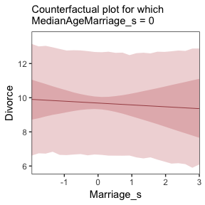

We follow the same process for Figure 5.5.b.

``` r
# new data
nd <- 
  tibble(MedianAgeMarriage_s = seq(from = -3, to = 3.5, length.out = 30),
         Marriage_s          = rep(mean(d$Marriage_s), times = 30))
  
# `fitted()` + `predict()`
fitted(b5.3, newdata = nd) %>% 
  as_tibble() %>% 
  rename(f_ll = Q2.5,
         f_ul = Q97.5) %>% 
  bind_cols(
    predict(b5.3, newdata = nd) %>% 
      as_tibble() %>% 
      transmute(p_ll = Q2.5,
                p_ul = Q97.5)
  ) %>% 
  mutate_all(funs(. * sd(d$Divorce) + mean(d$Divorce))) %>% 
  bind_cols(nd) %>% 
  
  # plot
  ggplot(aes(x = MedianAgeMarriage_s, y = Estimate)) +
  geom_ribbon(aes(ymin = p_ll, ymax = p_ul),
              fill = "firebrick", alpha = 1/5) +
  geom_smooth(aes(ymin = f_ll, ymax = f_ul),
              stat = "identity",
              fill = "firebrick", color = "firebrick4", alpha = 1/5, size = 1/4) +
  coord_cartesian(xlim = range(d$MedianAgeMarriage_s),
                  ylim = c(6, 14)) +
  labs(subtitle = "Counterfactual plot for which\nMarriage_s = 0",
       y = "Divorce") +
  theme_bw() +
  theme(panel.grid = element_blank())   
```

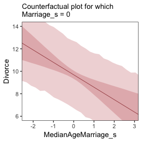

> A tension with such plots, however, lies in their counterfactual nature. In the small world of the model, it is possible to change median age of marriage without also changing the marriage rate. But is this also possible in the large world of reality? Probably not...
>
> ...If our goal is to intervene in the world, there may not be any realistic way to manipulate each predictor without also manipulating the others. This is a serious obstacle to applied science, whether you are an ecologist, an economist, or an epidemiologist \[or a psychologist\] (p. 138)

#### Posterior prediction plots.

"In addition to understanding the estimates, it’s important to check the model fit against the observed data" (p. 138). For more on the topic, check out Gabry and colleagues' [*Visualization in Bayesian workflow*](https://arxiv.org/abs/1709.01449) or Simpson's related blog post [*Touch me, I want to feel your data*](http://andrewgelman.com/2017/09/07/touch-want-feel-data/).

``` r
fitted(b5.3) %>%
  as_tibble() %>%
  mutate_all(funs(. * sd(d$Divorce) + mean(d$Divorce))) %>% 
  bind_cols(d) %>%
  
  ggplot(aes(x = Divorce, y = Estimate)) +
  geom_abline(linetype = 2, color = "grey50", size = .5) +
  geom_point(size = 1.5, color = "firebrick4", alpha = 3/4) +
  geom_linerange(aes(ymin = Q2.5, ymax = Q97.5),
                 size = 1/4, color = "firebrick4") +
  # Note our use of the dot placeholder, here: https://magrittr.tidyverse.org/reference/pipe.html
  geom_text(data = . %>% filter(Loc %in% c("ID", "UT")),
            aes(label = Loc), 
            hjust = 1, nudge_x = - 0.25) +
  labs(x = "Observed divorce", y = "Predicted divorce") +
  theme_bw() +
  theme(panel.grid = element_blank())
```

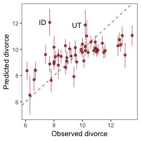

In order to make Figure 5.6.b, we need to clarify the relationships among `fitted()`, `predict()`, and `residuals()`. Here's my attempt in a table.

``` r
tibble(`brms function` = c("fitted", "predict", "residual"),
       mean  = c("same as the data", "same as the data", "in a deviance-score metric"),
       scale = c("excludes sigma", "includes sigma", "excludes sigma")) %>% 
  knitr::kable()
```

| brms function | mean                       | scale          |
|:--------------|:---------------------------|:---------------|
| fitted        | same as the data           | excludes sigma |
| predict       | same as the data           | includes sigma |
| residual      | in a deviance-score metric | excludes sigma |

Hopefully this clarifies that if we want to incorporate the prediction interval in a deviance metric, we'll need to first use `predict()` and then subtract the intervals from their corresponding `Divorce` values in the data.

``` r
residuals(b5.3) %>% 
  as_tibble() %>% 
  rename(f_ll = Q2.5,
         f_ul = Q97.5) %>% 
  bind_cols(
    predict(b5.3) %>% 
      as_tibble() %>% 
      transmute(p_ll = Q2.5,
                p_ul = Q97.5)
  ) %>% 
  bind_cols(d) %>%
  # here we put our `predict()` intervals into a deviance metric
  mutate(p_ll = Divorce_s - p_ll,
         p_ul = Divorce_s - p_ul) %>% 
  # note how we've left out the `+ mean(d$Divorce)` portion of the `funs()` function
  mutate_at(vars("Estimate", contains("_")), funs(. * sd(d$Divorce))) %>% 
  
  # The plot
  ggplot(aes(x = reorder(Loc, Estimate), y = Estimate)) +
  geom_hline(yintercept = 0, size = 1/2, 
             color = "firebrick4", alpha = 1/10) +
  geom_pointrange(aes(ymin = f_ll, ymax = f_ul),
                  size = 1/2, shape = 20, color = "firebrick4") + 
  geom_segment(aes(y    = p_ll, 
                   yend = p_ul,
                   x    = Loc, 
                   xend = Loc),
               size = 3.1, color = "firebrick4", alpha = 1/10) +
  labs(x = NULL, y = NULL) +
  coord_flip(ylim = c(-6, 5)) +
  theme_bw() +
  theme(panel.grid   = element_blank(),
        axis.ticks.y = element_blank(),
        axis.text.y  = element_text(hjust = 0))
```

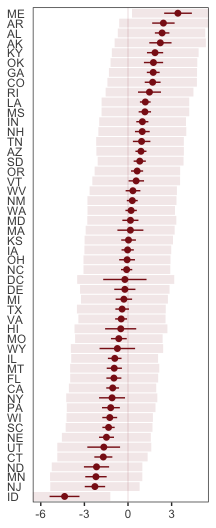

Compared to the last couple plots, Figure 5.6.c is pretty simple.

``` r
residuals(b5.3) %>% 
  as_tibble() %>% 
  mutate_all(funs(. * sd(d$Divorce))) %>%
  bind_cols(d) %>% 
  mutate(wpc = WaffleHouses / Population) %>% 
  
  ggplot(aes(x = wpc, y = Estimate)) +
  geom_point(size = 1.5, color = "firebrick4", alpha = 1/2) +
  stat_smooth(method = "lm", fullrange = T,
              color  = "firebrick4", size = 1/2, 
              fill   = "firebrick", alpha = 1/5) + 
  geom_text_repel(data = . %>% filter(Loc %in% c("ME", "AR", "MS", "AL", "GA", "SC", "ID")),
                  aes(label = Loc),
                  seed = 5) +
  scale_x_continuous(limits = c(0, 45)) +
  coord_cartesian(xlim = range(0, 40),
                  ylim = c(-5.5, 4)) +
  labs(x = "Waffles per capita",
       y = "Divorce error") +
  theme_bw() +
  theme(panel.grid = element_blank())
```


More McElreath inspiration: "No matter how many predictors you’ve already included in a regression, it’s still possible to find spurious correlations with the remaining variation" (p. 141).

##### Rethinking: Stats, huh, yeah what is it good for?

> Often people want statistical modeling to do things that statistical modeling cannot do. For example, we’d like to know whether an effect is "real" or rather spurious. Unfortunately, modeling merely quantifies uncertainty in the precise way that the model understands the problem. Usually answers to large world questions about truth and causation depend upon information not included in the model. For example, any observed correlation between an outcome and predictor could be eliminated or reversed once another predictor is added to the model. But if we cannot think of another predictor, we might never notice this. Therefore all statistical models are vulnerable to and demand critique, regardless of the precision of their estimates and apparent accuracy of their predictions. (p. 141)

##### Overthinking: Simulating spurious association.

``` r
n <- 100                             # number of cases

set.seed(5)                          # setting the seed makes the results reproducible
d <- 
  tibble(x_real = rnorm(n),          # x_real as Gaussian with mean 0 and SD 1 (i.e., the defaults)
         x_spur = rnorm(n, x_real),  # x_spur as Gaussian with mean = x_real
         y =      rnorm(n, x_real))  # y as Gaussian with mean = x_real
```

Here are the quick `pairs()` plots.

``` r
pairs(d, col = "firebrick4")
```

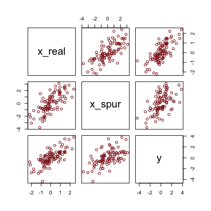

We may as well fit a model.

``` r
brm(data = d, family = gaussian,
    y ~ 1 + x_real + x_spur,
    prior = c(prior(normal(0, 0.2), class = Intercept),
              prior(normal(0, 0.5), class = b),
              prior(exponential(1), class = sigma)),
    iter = 2000, warmup = 500, chains = 4, cores = 4) %>% 
  
  fixef() %>% 
  round(digits = 2)
```

    ##           Estimate Est.Error  Q2.5 Q97.5
    ## Intercept    -0.01      0.09 -0.18  0.17
    ## x_real        0.93      0.14  0.65  1.20
    ## x_spur        0.08      0.09 -0.09  0.26

Masked relationship
-------------------

Let's load those tasty `milk` data.

``` r
library(rethinking)
data(milk)
d <- milk
```

Unload rethinking and load brms.

``` r
rm(milk)
detach(package:rethinking, unload = T)
library(brms)
```

You might inspect the data like this.

``` r
d %>% 
  select(kcal.per.g, mass, neocortex.perc) %>% 
  pairs(col = "firebrick4")
```

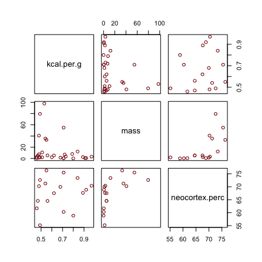

By just looking at that mess, do you think you could describe the associations of `mass` and `neocortex.perc` with the criterion, `kcal.per.g`? I couldn't. It's a good thing we have math.

Let's standardize our variables with our custom `scale_this()` function.

``` r
d <-
  d %>% 
  mutate(kcal.per.g_s     = scale_this(kcal.per.g), 
         log_mass_s       = log(mass) %>% scale_this(), 
         neocortex.perc_s = scale_this(neocortex.perc))
```

McElreath has us starting off our first `milk` model with more permissive priors than we've used in the past. Although we should note that from a historical perspective, these priors are pretty informative. Times keep changing.

``` r
b5.5_draft <- 
  brm(data = d, family = gaussian,
      kcal.per.g_s ~ 0 + Intercept + neocortex.perc_s,
      prior = c(prior(normal(0, 1), class = b, coef = "Intercept"),
                prior(normal(0, 1), class = b, coef = "neocortex.perc_s"),
                prior(exponential(1), class = sigma)),
      iter = 2000, warmup = 500, chains = 4, cores = 4,
      seed = 5,
      sample_prior = T)
```

Similar to the rethinking example in the text, brms warned that "Rows containing NAs were excluded from the model." This isn't necessarily a problem; the model fit just fine. But we should be ashamed of ourselves and look eagerly forward to Chapter 14 where we'll learn how to do better.

To compliment how McElreath removed cases with missing values on our variables of interest with Base R `complete.cases()`, here we'll do so with `tidyr::drop_na()` and a little help with `ends_with()`.

``` r
dcc <- 
  d %>%
  drop_na(ends_with("_s"))              
```

We'll use `update()` to refit the model with the altered data.

``` r
b5.5_draft <- 
  update(b5.5_draft,
         newdata = dcc)
```

"Before considering the posterior predictions, let’s consider those priors. As in many simple linear regression problems, these priors are harmless. But are they reasonable?" (p. 144). Let's find out with our version of Figure 5.7.a.

``` r
set.seed(5)
prior_samples(b5.5_draft) %>% 
  sample_n(size = 50) %>% 
  rownames_to_column() %>% 
  expand(nesting(rowname, b_Intercept, b_neocortex.perc_s),
         neocortex.perc_s = c(-2, 2)) %>% 
  mutate(kcal.per.g_s = b_Intercept + b_neocortex.perc_s * neocortex.perc_s) %>% 
  
  ggplot(aes(x = neocortex.perc_s, y = kcal.per.g_s)) +
  geom_line(aes(group = rowname),
            color = "firebrick", alpha = .4) +
  coord_cartesian(ylim = -2:2) +
  labs(x = "neocortex percent (std)",
       y = "kilocal per g (std)",
       subtitle = "a ~ dnorm(0, 1)\nbN ~ dnorm(0, 1)") +
  theme_bw() +
  theme(panel.grid = element_blank()) 
```

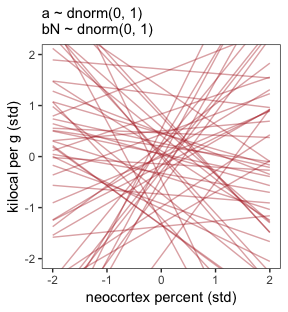

That's a mess. How'd the posterior turn out?

``` r
print(b5.5_draft)
```

    ##  Family: gaussian 
    ##   Links: mu = identity; sigma = identity 
    ## Formula: kcal.per.g_s ~ 0 + Intercept + neocortex.perc_s 
    ##    Data: dcc (Number of observations: 17) 
    ## Samples: 4 chains, each with iter = 2000; warmup = 500; thin = 1;
    ##          total post-warmup samples = 6000
    ## 
    ## Population-Level Effects: 
    ##                  Estimate Est.Error l-95% CI u-95% CI Eff.Sample Rhat
    ## Intercept            0.10      0.27    -0.44     0.65       4442 1.00
    ## neocortex.perc_s     0.16      0.27    -0.37     0.69       5387 1.00
    ## 
    ## Family Specific Parameters: 
    ##       Estimate Est.Error l-95% CI u-95% CI Eff.Sample Rhat
    ## sigma     1.14      0.21     0.81     1.64       4336 1.00
    ## 
    ## Samples were drawn using sampling(NUTS). For each parameter, Eff.Sample 
    ## is a crude measure of effective sample size, and Rhat is the potential 
    ## scale reduction factor on split chains (at convergence, Rhat = 1).

Let's tighten up our priors and fit `b5.5`.

``` r
b5.5 <- 
  brm(data = dcc, family = gaussian,
      kcal.per.g_s ~ 0 + Intercept + neocortex.perc_s,
      prior = c(prior(normal(0, 0.2), class = b, coef = "Intercept"),
                prior(normal(0, 0.5), class = b, coef = "neocortex.perc_s"),
                prior(exponential(1), class = sigma)),
      iter = 2000, warmup = 500, chains = 4, cores = 4,
      seed = 5,
      sample_prior = T)
```

Now make our version of Figure 5.7.b.

``` r
set.seed(5)
prior_samples(b5.5) %>% 
  sample_n(size = 50) %>% 
  rownames_to_column() %>% 
  expand(nesting(rowname, b_Intercept, b_neocortex.perc_s),
         neocortex.perc_s = c(-2, 2)) %>% 
  mutate(kcal.per.g_s = b_Intercept + b_neocortex.perc_s * neocortex.perc_s) %>% 
  
  ggplot(aes(x = neocortex.perc_s, y = kcal.per.g_s)) +
  geom_line(aes(group = rowname),
            color = "firebrick", alpha = .4) +
  coord_cartesian(ylim = -2:2) +
  labs(x = "neocortex percent (std)",
       y = "kilocal per g (std)",
       subtitle = "a ~ dnorm(0, 0.2)\nbN ~ dnorm(0, 0.5)") +
  theme_bw() +
  theme(panel.grid = element_blank()) 
```

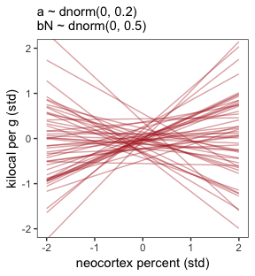

Now let's inspect the parameter summary.

``` r
print(b5.5)
```

    ##  Family: gaussian 
    ##   Links: mu = identity; sigma = identity 
    ## Formula: kcal.per.g_s ~ 0 + Intercept + neocortex.perc_s 
    ##    Data: dcc (Number of observations: 17) 
    ## Samples: 4 chains, each with iter = 2000; warmup = 500; thin = 1;
    ##          total post-warmup samples = 6000
    ## 
    ## Population-Level Effects: 
    ##                  Estimate Est.Error l-95% CI u-95% CI Eff.Sample Rhat
    ## Intercept            0.03      0.16    -0.29     0.34       5083 1.00
    ## neocortex.perc_s     0.13      0.24    -0.37     0.61       5074 1.00
    ## 
    ## Family Specific Parameters: 
    ##       Estimate Est.Error l-95% CI u-95% CI Eff.Sample Rhat
    ## sigma     1.11      0.20     0.79     1.58       4846 1.00
    ## 
    ## Samples were drawn using sampling(NUTS). For each parameter, Eff.Sample 
    ## is a crude measure of effective sample size, and Rhat is the potential 
    ## scale reduction factor on split chains (at convergence, Rhat = 1).

The results are very similar to those returned earlier from `print(b5.5_draft)`. It's not in the text, but let's compare the parameter estimates between the two models with another version of our homemade `coeftab()` plot.

``` r
# wrangle
bind_rows(
  posterior_samples(b5.5_draft) %>% 
    select(b_Intercept:sigma) %>% 
    mutate(fit = "b5.5_draft"),
  posterior_samples(b5.5) %>% 
    select(b_Intercept:sigma) %>% 
    mutate(fit = "b5.5")
  ) %>% 
  gather(key, value, -fit) %>% 
  group_by(key, fit) %>% 
  summarise(Estimate = mean(value),
            ll   = quantile(value, prob = .025),
            ul   = quantile(value, prob = .975)) %>% 
  mutate(fit = factor(fit, levels = c("b5.5_draft", "b5.5"))) %>% 
  
  # plot
  ggplot(aes(x = fit)) +
  geom_pointrange(aes(y = Estimate, ymin = ll, ymax = ul),
                  color = "firebrick") +
  geom_hline(yintercept = 0, color = "firebrick", alpha = 1/5) +
  xlab(NULL) +
  coord_flip() +
  theme_bw() +
  theme(panel.grid   = element_blank(),
        axis.ticks.y = element_blank(),
        axis.text.y  = element_text(hjust = 0),
        strip.background = element_rect(fill = "transparent", color = "transparent")) +
  facet_wrap(~key, ncol = 1)
```

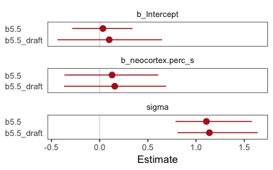

The results were quite similar, but the estimates from `b5.5` are more precise. Let's get back on track with the text and make the top left panel of Figure 5.8.

Just for kicks, we'll superimpose 50% intervals atop 95% intervals for the next few plots. Here's Figure 5.8, top left.

``` r
nd <- tibble(neocortex.perc_s = seq(from = -2.5, to = 2, length.out = 30))

fitted(b5.5, 
       newdata = nd,
       probs = c(.025, .975, .25, .75)) %>%
  as_tibble() %>%
  bind_cols(nd) %>% 
  
  ggplot(aes(x = neocortex.perc_s, y = Estimate)) +
  geom_ribbon(aes(ymin = Q2.5, ymax = Q97.5),
              fill = "firebrick", alpha = 1/5) +
  geom_smooth(aes(ymin = Q25, ymax = Q75),
              stat = "identity",
              fill = "firebrick4", color = "firebrick4", alpha = 1/5, size = 1/2) +
  geom_point(data = dcc, 
             aes(x = neocortex.perc_s, y = kcal.per.g_s),
             size = 2, color = "firebrick4") +
  coord_cartesian(xlim = range(dcc$neocortex.perc_s), 
                  ylim = range(dcc$kcal.per.g_s)) +
  labs(x = "neocortex percent (std)",
       y = "kilocal per g (std)") +
  theme_bw() +
  theme(panel.grid = element_blank())
```

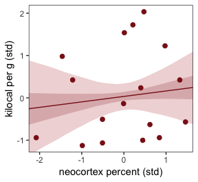

Do note the `probs` argument in the `fitted()` code, above.

Now we use `log_mass_s` as the new sole predictor.

``` r
b5.6 <- 
  brm(data = dcc, family = gaussian,
      kcal.per.g_s ~ 0 + Intercept + log_mass_s,
      prior = c(prior(normal(0, 0.2), class = b, coef = "Intercept"),
                prior(normal(0, 0.5), class = b, coef = "log_mass_s"),
                prior(exponential(1), class = sigma)),
      iter = 2000, warmup = 500, chains = 4, cores = 4,
      seed = 5,
      sample_prior = T)
```

``` r
print(b5.6)
```

    ##  Family: gaussian 
    ##   Links: mu = identity; sigma = identity 
    ## Formula: kcal.per.g_s ~ 0 + Intercept + log_mass_s 
    ##    Data: dcc (Number of observations: 17) 
    ## Samples: 4 chains, each with iter = 2000; warmup = 500; thin = 1;
    ##          total post-warmup samples = 6000
    ## 
    ## Population-Level Effects: 
    ##            Estimate Est.Error l-95% CI u-95% CI Eff.Sample Rhat
    ## Intercept      0.04      0.16    -0.27     0.35       6029 1.00
    ## log_mass_s    -0.28      0.21    -0.69     0.16       4687 1.00
    ## 
    ## Family Specific Parameters: 
    ##       Estimate Est.Error l-95% CI u-95% CI Eff.Sample Rhat
    ## sigma     1.06      0.20     0.77     1.52       3996 1.00
    ## 
    ## Samples were drawn using sampling(NUTS). For each parameter, Eff.Sample 
    ## is a crude measure of effective sample size, and Rhat is the potential 
    ## scale reduction factor on split chains (at convergence, Rhat = 1).

Make Figure 5.8, top right.

``` r
nd <- tibble(log_mass_s = seq(from = -2.5, to = 2.5, length.out = 30))

fitted(b5.6, 
       newdata = nd,
       probs = c(.025, .975, .25, .75)) %>%
  as_tibble() %>%
  bind_cols(nd) %>% 
  
  ggplot(aes(x = log_mass_s, y = Estimate)) +
  geom_ribbon(aes(ymin = Q2.5, ymax = Q97.5),
              fill = "firebrick", alpha = 1/5) +
  geom_smooth(aes(ymin = Q25, ymax = Q75),
              stat = "identity",
              fill = "firebrick4", color = "firebrick4", alpha = 1/5, size = 1/2) +
  geom_point(data = dcc, 
             aes(x = log_mass_s, y = kcal.per.g_s),
             size = 2, color = "firebrick4") +
  coord_cartesian(xlim = range(dcc$log_mass_s), 
                  ylim = range(dcc$kcal.per.g_s)) +
  labs(x = "log body mass (std)",
       y = "kilocal per g (std)") +
  theme_bw() +
  theme(panel.grid = element_blank())
```

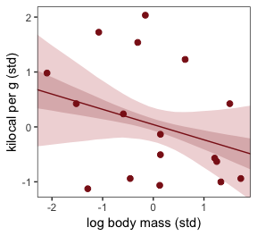

Finally, we're ready to fit with both predictors included in a multivariable model. Here's the statistical formula.

$$
\\begin{eqnarray}
\\text{kcal.per.g\_s}\_i & \\sim & \\text{Normal}(\\mu\_i, \\sigma) \\\\
\\mu\_i & = & \\alpha + \\beta\_1 \\text{neocortex.perc\_s}\_i + \\beta\_2 \\text{log\_mass\_s} \\\\
\\alpha  & \\sim & \\text{Normal}(0, 0.2) \\\\
\\beta\_1 & \\sim & \\text{Normal}(0, 0.5) \\\\
\\beta\_2 & \\sim & \\text{Normal}(0, 0.5) \\\\
\\sigma  & \\sim & \\text{Exponential}(1)
\\end{eqnarray}
$$

Note, the HMC chains required a longer `warmup` period and a higher `adapt_delta` setting for the model to converge properly. Life will be much better once we ditch the uniform prior for good.

``` r
b5.7 <- 
  brm(data = dcc, family = gaussian,
      kcal.per.g_s ~ 1 + neocortex.perc_s + log_mass_s,
      prior = c(prior(normal(0, 0.2), class = Intercept),
                prior(normal(0, 0.5), class = b),
                prior(exponential(1), class = sigma)),
      iter = 2000, warmup = 500, chains = 4, cores = 4,
      seed = 5)
```

``` r
print(b5.7)
```

    ##  Family: gaussian 
    ##   Links: mu = identity; sigma = identity 
    ## Formula: kcal.per.g_s ~ 1 + neocortex.perc_s + log_mass_s 
    ##    Data: dcc (Number of observations: 17) 
    ## Samples: 4 chains, each with iter = 2000; warmup = 500; thin = 1;
    ##          total post-warmup samples = 6000
    ## 
    ## Population-Level Effects: 
    ##                  Estimate Est.Error l-95% CI u-95% CI Eff.Sample Rhat
    ## Intercept            0.07      0.15    -0.21     0.35       5580 1.00
    ## neocortex.perc_s     0.61      0.28     0.02     1.13       3527 1.00
    ## log_mass_s          -0.65      0.25    -1.11    -0.13       3620 1.00
    ## 
    ## Family Specific Parameters: 
    ##       Estimate Est.Error l-95% CI u-95% CI Eff.Sample Rhat
    ## sigma     0.86      0.18     0.59     1.27       3493 1.00
    ## 
    ## Samples were drawn using sampling(NUTS). For each parameter, Eff.Sample 
    ## is a crude measure of effective sample size, and Rhat is the potential 
    ## scale reduction factor on split chains (at convergence, Rhat = 1).

Once again, let's roll out our homemade `coefplot()` plot code.

``` r
bind_cols(
  posterior_samples(b5.5) %>% 
    transmute(`b5.5_beta[N]` = b_neocortex.perc_s),
  posterior_samples(b5.6) %>% 
    transmute(`b5.6_beta[M]` = b_log_mass_s),
  posterior_samples(b5.7) %>% 
    transmute(`b5.7_beta[N]` = b_neocortex.perc_s,
              `b5.7_beta[M]` = b_log_mass_s)
  ) %>% 
  gather() %>% 
  group_by(key) %>% 
  summarise(Estimate = mean(value),
            ll   = quantile(value, prob = .025),
            ul   = quantile(value, prob = .975)) %>% 
  separate(key, into = c("fit", "parameter"), sep = "_") %>% 
  complete(fit, parameter) %>% 
  
  ggplot(aes(x = fit)) +
  geom_pointrange(aes(y = Estimate, ymin = ll, ymax = ul),
                  color = "firebrick") +
  geom_hline(yintercept = 0, color = "firebrick", alpha = 1/5) +
  xlab(NULL) +
  coord_flip() +
  theme_bw() +
  theme(panel.grid = element_blank(),
        strip.background = element_rect(fill = "transparent", color = "transparent")) +
  facet_wrap(~parameter, ncol = 1, labeller = label_parsed)
```


McElreath suggested we look at a pairs plot to get a sense of the zero-order corrleations. We did that once with the raw data. Here it is, again, but with the transformed varaibles.

``` r
dcc %>% 
  select(ends_with("_s")) %>% 
  pairs(col = "firebrick4")
```

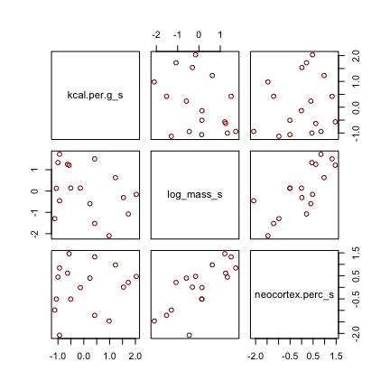

Have you noticed how un-tidyverse-like those `pairs()` plots are? I have. Within the tidyverse, you can make custom pairs plots with [GGalley](https://cran.r-project.org/web/packages/GGally/index.html), which will also compute the point estimates for the bivariate correlations. Here's a fairly default-style plot.

``` r
#install.packages("GGally", dependencies = T)
library(GGally)

dcc %>% 
  select(ends_with("_s")) %>% 
  ggpairs() + 
  theme_bw()
```


But you can customize [these](http://ggobi.github.io/ggally/), too. E.g.,

``` r
my_diag <- function(data, mapping, ...){
  ggplot(data = data, mapping = mapping) + 
    geom_density(fill = "firebrick4", size = 0)
}

my_lower <- function(data, mapping, ...){
  ggplot(data = data, mapping = mapping) + 
    geom_smooth(method = "lm", color = "firebrick4", size = 1/3, 
                fill = "firebrick", alpha = 1/5) +
    geom_point(color = "firebrick", alpha = .8, size = 1/3)
  }

# Then plug those custom functions into `ggpairs()`
dcc %>% 
  select(ends_with("_s")) %>% 
  ggpairs(diag  = list(continuous = my_diag),
          lower = list(continuous = my_lower)) + 
  theme_bw() +
  theme(strip.background = element_rect(fill = "white", color = "white"),
        axis.text        = element_blank(),
        axis.ticks       = element_blank(),
        panel.grid       = element_blank())
```

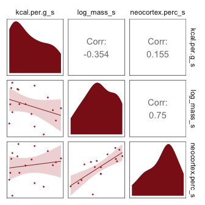

And those correlation coefficients and regression lines and corresponding 95% intervals are all default frequentist ones, by the way. But anyways,

> What the regression model does is ask if species that have high neocortex percent *for their body mass* have higher milk energy. Likewise, the model asks if species with high body mass *for their neocortex percent* have higher milk energy. Bigger species, like apes, have milk with less energy. But species with more neocortex tend to have richer milk. The fact that these two variables, body size and neocortex, are correlated across species makes it hard to see these relationships, unless we statistically account for both.
>
> Some DAGs will help. (p. 148, *emphasis* in the original)

Here are three. I'm not aware we can facet `dagify()` objects. But we can take cues from Chapter 4 to link our three DAGs like McElreath did his. first, we'll recognize the ggplot2 code will be identical for each DAG. So we can just wrap the ggplot2 code into a compact function, like so.

``` r
my_dag <- function(d){
  d %>% 
    ggplot(aes(x = x, y = y, xend = xend, yend = yend)) +
    geom_dag_point(color = "firebrick", alpha = 1/4, size = 10) +
    geom_dag_text(color = "firebrick") +
    geom_dag_edges(edge_color = "firebrick") +
    scale_x_continuous(NULL, breaks = NULL, expand = c(.1, .1)) +
    scale_y_continuous(NULL, breaks = NULL, expand = c(.1, .1)) +
    theme_bw() +
    theme(panel.grid = element_blank())
}
```

Now we’ll make the three individual DAGs, saving each.

``` r
# left DAG
dag_coords <-
  tibble(name = c("M", "N", "K"),
         x    = c(1, 3, 2),
         y    = c(2, 2, 1))

p1 <-
  dagify(N ~ M,
         K ~ M + N,
         coords = dag_coords) %>%
  my_dag()

# middle DAG
p2 <-
  dagify(M ~ N,
         K ~ M + N,
         coords = dag_coords) %>%
  my_dag()

# right DAG
dag_coords <-
  tibble(name = c("M", "N", "K", "U"),
         x    = c(1, 3, 2, 2),
         y    = c(2, 2, 1, 2))
p3 <-
  dagify(M ~ U,
         N ~ U,
         K ~ M + N,
         coords = dag_coords) %>%
  my_dag()
```

Now we stitch our three plot objects together with `gridExtra::grid.arrange()`.

``` r
library(gridExtra)

grid.arrange(p1, p2, p3, ncol = 3)
```

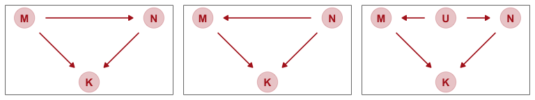

"Which of these graphs is right? We don’t know" (p. 149). Welcome to the applied data analysis.

But at least we can make the counterfactual plots at the bottom of Figure 5.8. Here's the one on the left.

``` r
nd <- tibble(neocortex.perc_s = seq(from = -2.5, to = 2, length.out = 30),
             log_mass_s = 0)

fitted(b5.7, 
       newdata = nd,
       probs = c(.025, .975, .25, .75)) %>%
  as_tibble() %>%
  bind_cols(nd) %>% 
  
  ggplot(aes(x = neocortex.perc_s, y = Estimate)) +
  geom_ribbon(aes(ymin = Q2.5, ymax = Q97.5),
              fill = "firebrick", alpha = 1/5) +
  geom_smooth(aes(ymin = Q25, ymax = Q75),
              stat = "identity",
              fill = "firebrick4", color = "firebrick4", alpha = 1/5, size = 1/2) +
  coord_cartesian(xlim = range(dcc$neocortex.perc_s), 
                  ylim = range(dcc$kcal.per.g_s)) +
  labs(subtitle = "Counterfactual holding M = 0", 
       x = "neocortex percent (std)",
       y = "kilocal per g (std)") +
  theme_bw() +
  theme(panel.grid = element_blank())
```

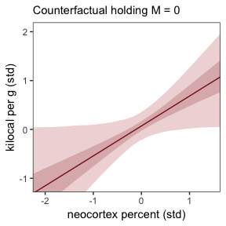

And now make Figure 5.8, bottom right.

``` r
nd <- tibble(log_mass_s = seq(from = -2.5, to = 2.5, length.out = 30),
             neocortex.perc_s = 0)

fitted(b5.7, 
       newdata = nd,
       probs = c(.025, .975, .25, .75)) %>%
  as_tibble() %>%
  bind_cols(nd) %>% 
  
  ggplot(aes(x = log_mass_s, y = Estimate)) +
  geom_ribbon(aes(ymin = Q2.5, ymax = Q97.5),
              fill = "firebrick", alpha = 1/5) +
  geom_smooth(aes(ymin = Q25, ymax = Q75),
              stat = "identity",
              fill = "firebrick4", color = "firebrick4", alpha = 1/5, size = 1/2) +
  coord_cartesian(xlim = range(dcc$log_mass_s), 
                  ylim = range(dcc$kcal.per.g_s)) +
  labs(subtitle = "Counterfactual holding N = 0",
       x = "log body mass (std)",
       y = "kilocal per g (std)") +
  theme_bw() +
  theme(panel.grid = element_blank())
```


#### Overthinking: Simulating a masking relationship.

``` r
# how many cases would you like?
n <- 100

set.seed(5)
d <- 
  tibble(m = rnorm(n, mean = 0, sd = 1)) %>% 
  mutate(n = rnorm(n, mean = m, sd = 1)) %>% 
  mutate(k = rnorm(n, mean = n - m, sd = 1))
```

Use `ggpairs()` to get a sense of what we just simulated.

``` r
d %>% 
  ggpairs(diag  = list(continuous = my_diag),
          lower = list(continuous = my_lower)) + 
  theme_bw() +
  theme(strip.background = element_rect(fill = "white", color = "white"),
        axis.text        = element_blank(),
        axis.ticks       = element_blank(),
        panel.grid       = element_blank())
```

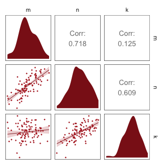

Here we fit the simulation models with a little help from the `update()` function.

``` r
b5.7_sim <- 
  update(b5.7,
         newdata = d,
         formula = k ~ 1 + n + m)

b5.5_sim <- 
  update(b5.7_sim,
         formula = k ~ 1 + n)

b5.6_sim <- 
  update(b5.7_sim,
         formula = k ~ 1 + m)
```

Compare the coefficients.

``` r
fixef(b5.5_sim) %>% round(digits = 2)
```

    ##           Estimate Est.Error  Q2.5 Q97.5
    ## Intercept    -0.01      0.10 -0.21  0.18
    ## n             0.58      0.08  0.43  0.74

``` r
fixef(b5.6_sim) %>% round(digits = 2)
```

    ##           Estimate Est.Error  Q2.5 Q97.5
    ## Intercept     0.00      0.12 -0.23  0.24
    ## m             0.17      0.15 -0.12  0.47

``` r
fixef(b5.7_sim) %>% round(digits = 2)
```

    ##           Estimate Est.Error  Q2.5 Q97.5
    ## Intercept    -0.01      0.09 -0.18  0.17
    ## n             0.98      0.09  0.80  1.15
    ## m            -0.88      0.14 -1.15 -0.60

Due to space considerations, I'm not going to show the code corresponding to the other two DAGs. Rather, I'll leave that as an exercise for the interested reader.

Categorical varaibles
---------------------

> Many readers will already know that variables like this, routinely called *factors*, can easily be included in linear models. But what is not widely understood is how these variables are included in a model... Knowing how the machine works removes a lot of this difficulty. (p. 150, *emphasis* in the original)

### Binary categories.

Reload the `Howell1` data.

``` r
library(rethinking)
data(Howell1)
d <- Howell1
```

Unload rethinking and load brms.

``` r
rm(Howell1)
detach(package:rethinking, unload = T)
library(brms)
```

If you forgot what these data were like, take a `glimpse()`.

``` r
d %>%
  glimpse()
```

    ## Observations: 544
    ## Variables: 4
    ## $ height <dbl> 151.7650, 139.7000, 136.5250, 156.8450, 145.4150, 163.8...
    ## $ weight <dbl> 47.82561, 36.48581, 31.86484, 53.04191, 41.27687, 62.99...
    ## $ age    <dbl> 63.0, 63.0, 65.0, 41.0, 51.0, 35.0, 32.0, 27.0, 19.0, 5...
    ## $ male   <int> 1, 0, 0, 1, 0, 1, 0, 1, 0, 1, 0, 1, 0, 0, 0, 1, 1, 0, 1...

> The `male` variable is our new predictor, an example of a indicator variable. Indicator variables—sometimes also called "dummy" variables—are devices for encoding unordered categories into quantitative models. There is no sense here in which "male" is one more than "female." The purpose of the `male` variable is to indicate when a person in the sample is "male." So it takes the value 1 whenever the person is male, but it takes the value 0 when the person is female (or any other category). It doesn’t matter which category—"male" or "female"—is indicated by the 1. The model won’t care. But correctly interpreting the model will demand that you remember, so it’s a good idea to name the variable after the category assigned the 1 value. (p. 151)

Here we simulate from our priors and `summarise()` the results.

``` r
set.seed(5)

tibble(mu_female = rnorm(1e4, mean = 178, sd = 20)) %>% 
  mutate(mu_male = mu_female + rnorm(1e4, mean = 0, sd = 10)) %>% 
  
  gather() %>% 
  group_by(key) %>% 
  summarise(mean = mean(value),
            sd   = sd(value),
            ll   = quantile(value, prob = .025),
            ul   = quantile(value, prob = .975)) %>% 
  mutate_if(is.double, round, digits = 2)
```

    ## # A tibble: 2 x 5
    ##   key        mean    sd    ll    ul
    ##   <chr>     <dbl> <dbl> <dbl> <dbl>
    ## 1 mu_female  178.  20.2  138.  219.
    ## 2 mu_male    178.  22.5  133.  222.

Make the `sex` variable.

``` r
d <-
  d %>% 
  mutate(sex = ifelse(male == 1, 2, 1))

head(d)
```

    ##    height   weight age male sex
    ## 1 151.765 47.82561  63    1   2
    ## 2 139.700 36.48581  63    0   1
    ## 3 136.525 31.86484  65    0   1
    ## 4 156.845 53.04191  41    1   2
    ## 5 145.415 41.27687  51    0   1
    ## 6 163.830 62.99259  35    1   2

For our version of this model, we will continue using the simple *μ* = 1 exponential prior on *σ*, rather than the uniform. The exponential is just much easier on Stan than the uniform. But if you prefer to go uniform, have at it.

``` r
b5.8 <- 
  brm(data = d %>% mutate(sex = factor(sex)), 
      family = gaussian,
      height ~ 0 + sex,
      prior = c(prior(normal(178, 20), class = b),
                prior(exponential(1), class = sigma)),
      iter = 2000, warmup = 500, chains = 4, cores = 4,
      seed = 5)
```

Behold the summary.

``` r
print(b5.8)
```

    ##  Family: gaussian 
    ##   Links: mu = identity; sigma = identity 
    ## Formula: height ~ 0 + sex 
    ##    Data: d %>% mutate(sex = factor(sex)) (Number of observations: 544) 
    ## Samples: 4 chains, each with iter = 2000; warmup = 500; thin = 1;
    ##          total post-warmup samples = 6000
    ## 
    ## Population-Level Effects: 
    ##      Estimate Est.Error l-95% CI u-95% CI Eff.Sample Rhat
    ## sex1   134.87      1.64   131.74   138.05       5432 1.00
    ## sex2   142.55      1.69   139.29   145.86       5688 1.00
    ## 
    ## Family Specific Parameters: 
    ##       Estimate Est.Error l-95% CI u-95% CI Eff.Sample Rhat
    ## sigma    26.77      0.80    25.26    28.37       4854 1.00
    ## 
    ## Samples were drawn using sampling(NUTS). For each parameter, Eff.Sample 
    ## is a crude measure of effective sample size, and Rhat is the potential 
    ## scale reduction factor on split chains (at convergence, Rhat = 1).

Note that for us, there was no `depth=2` argument to get all the model output. Rather, if you looked closely in the `brm()` function, we augmented the model data so that `sex` was used as a factor. When you fit a model in brms that excludes the typical intercept parameter (i.e., with the `0 + ...` syntax), you'll get a separate intercept for each of your factor variables. The `brm()` function noticed there were two levels for our `sex` factor, and therefore gave use two intercepts: `sex1` and `sex2`. Here's how you might compute the difference score.

``` r
library(tidybayes)

posterior_samples(b5.8) %>% 
  mutate(diff_fm = b_sex1 - b_sex2) %>% 
  gather(key, value, -`lp__`) %>% 
  group_by(key) %>% 
  mean_qi(value, .width = .89)
```

    ## # A tibble: 4 x 7
    ##   key       value .lower  .upper .width .point .interval
    ##   <chr>     <dbl>  <dbl>   <dbl>  <dbl> <chr>  <chr>    
    ## 1 b_sex1   135.    132.   137.     0.89 mean   qi       
    ## 2 b_sex2   143.    140.   145.     0.89 mean   qi       
    ## 3 diff_fm   -7.67  -11.4   -3.86   0.89 mean   qi       
    ## 4 sigma     26.8    25.5   28.1    0.89 mean   qi

Note how we used `tidybayes::mean_qi()` to summarize our difference variable, `diff`.

### Many categories.

> Binary categories are easy, whether you use an indicator variable or instead an index variable. But when there are more than two categories, the indicator variable approach explodes. You’ll need a new indicator variable for each new category. If you have k unique categories, you need *k* − 1 indicator variables. Automated tools like R’s lm do in fact go this route, constructing *k* − 1 indicator variables for you and returning *k* − 1 parameter estimates.
>
> But we’ll instead stick with the index variable approach. It does not change at all when you add more categories. You do get more parameters, of course, just as many as in the indicator variable approach. But the model specification looks just like it does in the binary case. (p. 153)

We'll practice with `milk`.

``` r
library(rethinking)
data(milk)
d <- milk
```

Unload rethinking and load brms.

``` r
rm(milk)
detach(package:rethinking, unload = T)
library(brms)
```

With the tidyverse, we can peek at `clade` with `distinct()` in the place of base R `unique()`.

``` r
d %>%
  distinct(clade)
```

    ##              clade
    ## 1    Strepsirrhine
    ## 2 New World Monkey
    ## 3 Old World Monkey
    ## 4              Ape

Rather than make the `clade_id` index variable, like McElreath did in the text, we'll just use the `clade` factor. It will actually work easier within the brms framework. We will, however, standardize the `kcal.per.g` variable, again.

``` r
d <-
  d %>% 
  mutate(kcal.per.g_s = scale_this(kcal.per.g))
```

Our statistical model follows the form

$$
\\begin{eqnarray}
\\text{kcal.per.g\_s}\_i & \\sim & \\text{Normal}(\\mu\_i, \\sigma) \\\\
\\mu\_i & = & \\alpha\_\\text{clade}\[i\] \\\\
\\alpha & \\sim & \\text{Normal}(0, 0.5), \\text{for} j = 1..4 \\\\
\\sigma & \\sim & \\text{Exponential}(1)
\\end{eqnarray}
$$

Now fit that model.

``` r
b5.9 <- 
  brm(data = d, 
      family = gaussian,
      kcal.per.g_s ~ 0 + clade,
      prior = c(prior(normal(0, 0.5), class = b),
                prior(exponential(1), class = sigma)),
      iter = 2000, warmup = 500, chains = 4, cores = 4,
      seed = 5)
```

``` r
print(b5.9)
```

    ##  Family: gaussian 
    ##   Links: mu = identity; sigma = identity 
    ## Formula: kcal.per.g_s ~ 0 + clade 
    ##    Data: d (Number of observations: 29) 
    ## Samples: 4 chains, each with iter = 2000; warmup = 500; thin = 1;
    ##          total post-warmup samples = 6000
    ## 
    ## Population-Level Effects: 
    ##                     Estimate Est.Error l-95% CI u-95% CI Eff.Sample Rhat
    ## cladeApe               -0.46      0.24    -0.92     0.03       6928 1.00
    ## cladeNewWorldMonkey     0.35      0.24    -0.12     0.80       7207 1.00
    ## cladeOldWorldMonkey     0.64      0.28     0.07     1.17       6267 1.00
    ## cladeStrepsirrhine     -0.55      0.30    -1.11     0.05       7082 1.00
    ## 
    ## Family Specific Parameters: 
    ##       Estimate Est.Error l-95% CI u-95% CI Eff.Sample Rhat
    ## sigma     0.80      0.12     0.61     1.07       4357 1.00
    ## 
    ## Samples were drawn using sampling(NUTS). For each parameter, Eff.Sample 
    ## is a crude measure of effective sample size, and Rhat is the potential 
    ## scale reduction factor on split chains (at convergence, Rhat = 1).

Up to this point, all of our coefficient plots have been of a rather complicated type. We tried to mimic McElreath’s `coeftab()` plots without the aid of the rethinking convenience function. But now the coefficient plot from McElreath’s R code 5.42 is of a much simpler type. As such, we can finally take it easy and use some of the convenience functions available to us within our framework.

The `stanplot()` function is an easy way to get a default coefficient plot. You just put the brmsfit object into the function.

``` r
stanplot(b5.9, pars = "^b_")
```

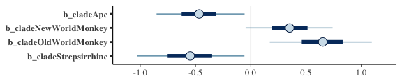

There are numerous ways to make a coefficient plot. Another is with the `mcmc_intervals()` function from the [bayesplot package](https://cran.r-project.org/web/packages/bayesplot/index.html). A nice feature of the bayesplot package is its convenient way to alter the color scheme with the `color_scheme_set()` function. Here, for example, we'll make the theme `red`. But note how the `mcmc_intervals()` function requires you to work with the `posterior_samples()` instead of the brmsfit object.

``` r
# install.packages("bayesplot", dependencies = T)
library(bayesplot)

color_scheme_set("red")

post <- posterior_samples(b5.9)

post %>% 
  select(starts_with("b_")) %>% 
  mcmc_intervals(prob = .5,
                 point_est = "median") +
  labs(title = "My fancy bayesplot-based coefficient plot") +
  theme_bw() +
  theme(axis.text.y  = element_text(hjust = 0),
        axis.ticks.y = element_blank(),
        panel.grid   = element_blank())
```

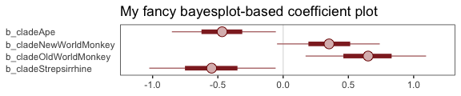

Because bayesplot produces a ggplot2 object, the plot was adjustable with familiar ggplot2 syntax. For more ideas, check out [this vignette](https://cran.r-project.org/web/packages/bayesplot/vignettes/plotting-mcmc-draws.html).

The `tidybaes::stat_pointintervalh()` function offers a third way, this time with a more ground-up ggplot2 workflow.

``` r
library(tidybayes)

post %>% 
  select(starts_with("b")) %>% 
  set_names(distinct(d, clade) %>% arrange(clade) %>% pull()) %>% 
  gather() %>% 
  
  ggplot(aes(x = value, y = reorder(key, value))) +  # note how we used `reorder()` to arrange the coefficients
  geom_vline(xintercept = 0, color = "firebrick4", alpha = 1/10) +
  stat_pointintervalh(point_interval = mode_hdi, .width = .89, 
                      size = 1, color = "firebrick4") +
  labs(title = "My tidybayes-based coefficient plot",
       x = "expected kcal (std)", 
       y = NULL) +
  theme_bw() +
  theme(panel.grid   = element_blank(),
        panel.grid.major.y = element_line(color = alpha("firebrick4", 1/4), linetype = 3),
        axis.text.y  = element_text(hjust = 0),
        axis.ticks.y = element_blank())
```

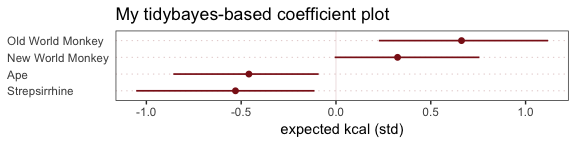

Okay, let's simulate some `houses`. We'll use names rather than numeric indices.

``` r
houses <- c("Gryffindor", "Hufflepuff", "Ravenclaw", "Slytherin")

set.seed(63)
d <-
  d %>% 
  mutate(house = sample(rep(houses, each = 8), size = n()))
```

Fit the model.

``` r
b5.10 <- 
  brm(data = d, 
      family = gaussian,
      kcal.per.g_s ~ 0 + clade + house,
      prior = c(prior(normal(0, 0.5), class = b),
                prior(exponential(1), class = sigma)),
      iter = 2000, warmup = 500, chains = 4, cores = 4,
      seed = 5)
```

Yep, Slytherin stood out.

``` r
print(b5.10)
```

    ##  Family: gaussian 
    ##   Links: mu = identity; sigma = identity 
    ## Formula: kcal.per.g_s ~ 0 + clade + house 
    ##    Data: d (Number of observations: 29) 
    ## Samples: 4 chains, each with iter = 2000; warmup = 500; thin = 1;
    ##          total post-warmup samples = 6000
    ## 
    ## Population-Level Effects: 
    ##                     Estimate Est.Error l-95% CI u-95% CI Eff.Sample Rhat
    ## cladeApe               -0.36      0.26    -0.88     0.16       5601 1.00
    ## cladeNewWorldMonkey     0.51      0.25    -0.00     0.98       6388 1.00
    ## cladeOldWorldMonkey     0.65      0.30     0.06     1.21       6723 1.00
    ## cladeStrepsirrhine     -0.52      0.29    -1.08     0.05       8094 1.00
    ## houseHufflepuff        -0.06      0.29    -0.61     0.50       5969 1.00
    ## houseRavenclaw          0.14      0.28    -0.41     0.69       6646 1.00
    ## houseSlytherin         -0.53      0.29    -1.08     0.06       5766 1.00
    ## 
    ## Family Specific Parameters: 
    ##       Estimate Est.Error l-95% CI u-95% CI Eff.Sample Rhat
    ## sigma     0.75      0.12     0.55     1.02       5212 1.00
    ## 
    ## Samples were drawn using sampling(NUTS). For each parameter, Eff.Sample 
    ## is a crude measure of effective sample size, and Rhat is the potential 
    ## scale reduction factor on split chains (at convergence, Rhat = 1).

#### Rethinking: Differences and statistical significance.

> A common error in interpretation of parameter estimates is to suppose that because one parameter is sufficiently far from zero—is "significant"—and another parameter is not—is "not significant"—that the difference between the parameters is also significant. This is not necessarily so. This isn’t just an issue for non-Bayesian analysis: If you want to know the distribution of a difference, then you must compute that difference, a *contrast*. (p. 155, *emphasis* in the original)

This reminds me of a paper by Gelman and Stern, [*The Difference Between "Significant" and "Not Significant" is not Itself Statistically Significant*](http://www.stat.columbia.edu/~gelman/research/published/signif4.pdf).

Reference
---------

[McElreath, R. (2016). *Statistical rethinking: A Bayesian course with examples in R and Stan.* Chapman & Hall/CRC Press.](https://xcelab.net/rm/statistical-rethinking/)

Session info
------------

``` r
sessionInfo()
```

    ## R version 3.5.1 (2018-07-02)
    ## Platform: x86_64-apple-darwin15.6.0 (64-bit)
    ## Running under: macOS High Sierra 10.13.6
    ## 
    ## Matrix products: default
    ## BLAS: /Library/Frameworks/R.framework/Versions/3.5/Resources/lib/libRblas.0.dylib
    ## LAPACK: /Library/Frameworks/R.framework/Versions/3.5/Resources/lib/libRlapack.dylib
    ## 
    ## locale:
    ## [1] en_US.UTF-8/en_US.UTF-8/en_US.UTF-8/C/en_US.UTF-8/en_US.UTF-8
    ## 
    ## attached base packages:
    ## [1] parallel  stats     graphics  grDevices utils     datasets  methods  
    ## [8] base     
    ## 
    ## other attached packages:
    ##  [1] bayesplot_1.6.0      tidybayes_1.0.3      gridExtra_2.3       
    ##  [4] GGally_1.4.0         ggdag_0.1.0          fiftystater_1.0.1   
    ##  [7] bindrcpp_0.2.2       ggrepel_0.8.0        forcats_0.3.0       
    ## [10] stringr_1.3.1        dplyr_0.7.6          purrr_0.2.5         
    ## [13] readr_1.1.1          tidyr_0.8.1          tibble_1.4.2        
    ## [16] tidyverse_1.2.1      brms_2.7.0           Rcpp_1.0.0          
    ## [19] rstan_2.18.2         StanHeaders_2.18.0-1 ggplot2_3.1.0       
    ## 
    ## loaded via a namespace (and not attached):
    ##   [1] readxl_1.1.0              backports_1.1.2          
    ##   [3] plyr_1.8.4                igraph_1.2.1             
    ##   [5] lazyeval_0.2.1            svUnit_0.7-12            
    ##   [7] crosstalk_1.0.0           rstantools_1.5.0         
    ##   [9] inline_0.3.15             digest_0.6.18            
    ##  [11] htmltools_0.3.6           viridis_0.5.1            
    ##  [13] rsconnect_0.8.8           magrittr_1.5             
    ##  [15] modelr_0.1.2              matrixStats_0.54.0       
    ##  [17] xts_0.10-2                prettyunits_1.0.2        
    ##  [19] colorspace_1.3-2          rvest_0.3.2              
    ##  [21] haven_1.1.2               callr_3.1.0              
    ##  [23] crayon_1.3.4              jsonlite_1.5             
    ##  [25] bindr_0.1.1               zoo_1.8-2                
    ##  [27] glue_1.3.0                gtable_0.2.0             
    ##  [29] V8_1.5                    pkgbuild_1.0.2           
    ##  [31] maps_3.3.0                abind_1.4-5              
    ##  [33] scales_1.0.0              mvtnorm_1.0-8            
    ##  [35] miniUI_0.1.1.1            viridisLite_0.3.0        
    ##  [37] xtable_1.8-2              units_0.6-0              
    ##  [39] HDInterval_0.2.0          ggstance_0.3             
    ##  [41] foreign_0.8-70            mapproj_1.2.6            
    ##  [43] stats4_3.5.1              DT_0.4                   
    ##  [45] htmlwidgets_1.2           httr_1.3.1               
    ##  [47] threejs_0.3.1             arrayhelpers_1.0-20160527
    ##  [49] RColorBrewer_1.1-2        pkgconfig_2.0.1          
    ##  [51] reshape_0.8.7             loo_2.0.0                
    ##  [53] farver_1.1.0              utf8_1.1.4               
    ##  [55] tidyselect_0.2.4          labeling_0.3             
    ##  [57] rlang_0.3.0.1             reshape2_1.4.3           
    ##  [59] later_0.7.3               LaplacesDemon_16.1.1     
    ##  [61] munsell_0.5.0             dagitty_0.2-2            
    ##  [63] cellranger_1.1.0          tools_3.5.1              
    ##  [65] cli_1.0.1                 broom_0.4.5              
    ##  [67] ggridges_0.5.0            evaluate_0.10.1          
    ##  [69] yaml_2.1.19               processx_3.2.1           
    ##  [71] knitr_1.20                tidygraph_1.1.1          
    ##  [73] ggraph_1.0.2              nlme_3.1-137             
    ##  [75] mime_0.5                  xml2_1.2.0               
    ##  [77] compiler_3.5.1            shinythemes_1.1.1        
    ##  [79] rstudioapi_0.7            curl_3.2                 
    ##  [81] tweenr_1.0.1              stringi_1.2.3            
    ##  [83] highr_0.7                 ps_1.2.1                 
    ##  [85] Brobdingnag_1.2-5         lattice_0.20-35          
    ##  [87] Matrix_1.2-14             psych_1.8.4              
    ##  [89] markdown_0.8              shinyjs_1.0              
    ##  [91] pillar_1.2.3              bridgesampling_0.4-0     
    ##  [93] httpuv_1.4.4.2            R6_2.3.0                 
    ##  [95] promises_1.0.1            codetools_0.2-15         
    ##  [97] boot_1.3-20               colourpicker_1.0         
    ##  [99] MASS_7.3-50               gtools_3.8.1             
    ## [101] assertthat_0.2.0          rprojroot_1.3-2          
    ## [103] withr_2.1.2               shinystan_2.5.0          
    ## [105] mnormt_1.5-5              hms_0.4.2                
    ## [107] grid_3.5.1                coda_0.19-2              
    ## [109] rmarkdown_1.10            ggforce_0.1.3            
    ## [111] shiny_1.1.0               lubridate_1.7.4          
    ## [113] base64enc_0.1-3           dygraphs_1.1.1.5
