Ch. 6 The Haunted DAG & The Causal Terror
================
A Solomon Kurz
2019-01-20

The Haunted DAG & The Causal Terror
===================================

Read this opening and cry:

> It seems like the most newsworthy scientific studies are the least trustworthy. The more likely it is to kill you, if true, the less likely it is to be true. The more boring the topic, the more rigorous the results. How could this widely believed negative correlation exist? There doesn’t seem to be any reason for studies of topics that people care about to produce less reliable results. Maybe popular topics attract more and worse researchers, like flies drawn to the smell of honey?
>
> Actually all that is necessary for such a negative correlation to arise is that peer reviewers care about both newsworthiness and trustworthiness. Whether it is grant review or journal review, if editors and reviewers care about both, then the act of selection itself is enough to make the most newsworthy studies the least trustworthy....
>
> Strong selection induces a negative correlation among the criteria used in selection. Why? If the only way to cross the threshold is to score high, it is more common to score high on one item than on both. Therefore among funded proposals, the most newsworthy studies can actually have less than average trustworthiness (less than 0 in the figure). Similarly the most trustworthy studies can actually be less newsworthy than average.
>
> This general phenomenon has been recognized for a long time. It is sometimes called Berkson’s paradox. But it is easier to remember if we call it the *selection-distortion effect*. Once you appreciate this effect, you’ll see it everywhere....
>
> The selection-distortion effect can happen inside of a multiple regression, because the act of adding a predictor in- duces statistical selection within the model, a phenomenon that goes by the unhelpful name collider bias. This can mislead us into believing, for example, that there is a negative association between newsworthiness and trustworthiness in general, when in fact it is just a consequence of conditioning on some variable. This is both a deeply confusing fact and one that is important to understand in order to regress responsibly.
>
> This chapter and the next are both about terrible things that can happen when we simply add variables to a regression, without a clear idea of a causal model. (pp. 159--160, *emphasis* in the original)

The three hazards we'll explore are:

1.  multicollinearity
2.  post-treatment bias
3.  collider bias

#### Overthinking: Simulated science distortion.

First let's run the simulation.

``` r
library(tidyverse)

set.seed(1914)
n <- 200 # num grant proposals
p <- 0.1 # proportion to select

d <-
  # uncorrelated newsworthiness and trustworthiness
  tibble(newsworthiness  = rnorm(n, mean = 0, sd = 1),
         trustworthiness = rnorm(n, mean = 0, sd = 1)) %>% 
  # total_score
  mutate(total_score = newsworthiness + trustworthiness) %>% 
  # select top 10% of combined scores
  mutate(selected = ifelse(total_score >= quantile(total_score, 1 - p), TRUE, FALSE))

head(d)
```

    ## # A tibble: 6 x 4
    ##   newsworthiness trustworthiness total_score selected
    ##            <dbl>           <dbl>       <dbl> <lgl>   
    ## 1         -0.379         -1.20        -1.58  FALSE   
    ## 2          0.130          0.504        0.634 FALSE   
    ## 3          0.334          0.532        0.866 FALSE   
    ## 4         -1.89          -0.594       -2.48  FALSE   
    ## 5          2.05           0.0672       2.12  TRUE    
    ## 6          2.54           1.02         3.56  TRUE

Here's the correlation among those cases for which `selected == TRUE`.

``` r
d %>% 
  filter(selected == TRUE) %>% 
  select(newsworthiness, trustworthiness) %>% 
  cor()
```

    ##                 newsworthiness trustworthiness
    ## newsworthiness       1.0000000      -0.7680083
    ## trustworthiness     -0.7680083       1.0000000

For the plots in this chapter, we'll take some aesthetic cues from Aki Vehtari's great [*Bayesian Data Analysis demos for R*](https://github.com/avehtari/BDA_R_demos).

``` r
theme_set(theme_minimal())
```

Okay, let's make Figure 6.1.

``` r
# we'll need this for the annotation
text <-
  tibble(newsworthiness  = c(2, 1), 
         trustworthiness = c(2.25, -2.5),
         selected = c(TRUE, FALSE),
         label    = c("selected", "rejected"))

d %>% 
  ggplot(aes(x = newsworthiness, y = trustworthiness, color = selected)) +
  geom_point(alpha = 2/3) +
  geom_text(data = text,
            aes(label = label)) +
  geom_smooth(data = d %>% filter(selected == TRUE),
              method = "lm", fullrange = T,
              fill = "orange", color = "orange", alpha = 1/4, size = 1/5) +
  scale_color_manual(values = c("black", "orange")) +
  scale_x_continuous(limits = c(-3, 3.9), expand = c(0, 0)) +
  coord_cartesian(ylim = range(d$trustworthiness)) +
  theme(legend.position = "none")
```

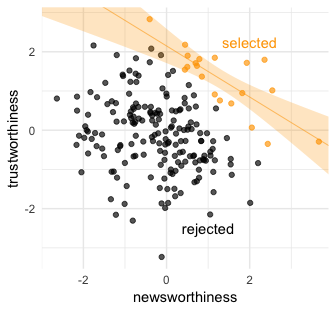

Multicollinearity
-----------------

> Multicollinearity means very strong correlation between two or more predictor variables. The consequence of it is that the posterior distribution will seem to suggest that none of the variables is reliably associated with the outcome, even if all of the variables are in reality strongly associated with the outcome. This frustrating phenomenon arises from the details of how multiple regression works. So once you understand multicollinearity, you will better understand regression models in general. (p. 161)

### Multicollinear legs.

Let's simulate some leg data.

``` r
n <- 100
set.seed(909)

d <- 
  tibble(height    = rnorm(n, mean = 10, sd = 2),
         leg_prop  = runif(n, min = 0.4, max = 0.5)) %>% 
  mutate(leg_left  = leg_prop * height + rnorm(n, mean = 0, sd = 0.02),
         leg_right = leg_prop * height + rnorm(n, mean = 0, sd = 0.02))
```

`leg_left` and `leg_right` are **highly** correlated.

``` r
d %>%
  select(leg_left:leg_right) %>%
  cor() %>%
  round(digits = 4)
```

    ##           leg_left leg_right
    ## leg_left    1.0000    0.9997
    ## leg_right   0.9997    1.0000

Have you ever even seen a *ρ* = .9995 correlation, before? Here it is in a plot.

``` r
d %>%
  ggplot(aes(x = leg_left, y = leg_right)) +
  geom_point(alpha = 1/2, color = "darkgreen")
```

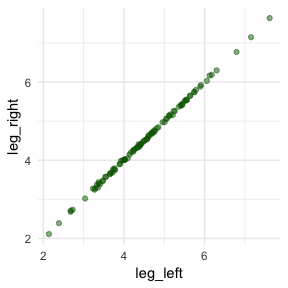

Load brms.

``` r
library(brms)
```

Here's our attempt to predict `height` with both legs.

``` r
b6.1 <- 
  brm(data = d, family = gaussian,
      height ~ 1 + leg_left + leg_right,
      prior = c(prior(normal(10, 100), class = Intercept),
                prior(normal(2, 10), class = b),
                prior(exponential(1), class = sigma)),
      iter = 2000, warmup = 500, chains = 4, cores = 4,
      seed = 6)
```

Let's inspect the damage.

``` r
print(b6.1)
```

    ##  Family: gaussian 
    ##   Links: mu = identity; sigma = identity 
    ## Formula: height ~ 1 + leg_left + leg_right 
    ##    Data: d (Number of observations: 100) 
    ## Samples: 4 chains, each with iter = 2000; warmup = 500; thin = 1;
    ##          total post-warmup samples = 6000
    ## 
    ## Population-Level Effects: 
    ##           Estimate Est.Error l-95% CI u-95% CI Eff.Sample Rhat
    ## Intercept     0.98      0.30     0.41     1.55       5672 1.00
    ## leg_left      0.24      2.56    -4.93     5.21       2273 1.00
    ## leg_right     1.76      2.56    -3.19     6.93       2271 1.00
    ## 
    ## Family Specific Parameters: 
    ##       Estimate Est.Error l-95% CI u-95% CI Eff.Sample Rhat
    ## sigma     0.64      0.05     0.55     0.74       3436 1.00
    ## 
    ## Samples were drawn using sampling(NUTS). For each parameter, Eff.Sample 
    ## is a crude measure of effective sample size, and Rhat is the potential 
    ## scale reduction factor on split chains (at convergence, Rhat = 1).

That 'Est.Error' column isn't looking too good. But it's easy to miss that, which is why McElreath suggested "a graphical view of the \[output\] is more useful because it displays the posterior means and \[intervals\] in a way that allows us with a glance to see that something has gone wrong here" (p. 143).

Here's our coefficient plot using `brms::stanplot()` with a little help from `bayesplot::color_scheme_set()`.

``` r
library(bayesplot)

color_scheme_set("orange")

stanplot(b6.1, 
         type = "intervals", 
         prob = .5, 
         prob_outer = .95,
         point_est = "mean") +
  labs(title = "The coefficient plot for the two-leg model",
       subtitle = "Holy smokes; look at the widths of those betas!") +
  theme_bw() +
  theme(text = element_text(size = 14),
        panel.grid   = element_blank(),
        axis.ticks.y = element_blank(),
        axis.text.y  = element_text(hjust = 0))
```


Now you can use the `brms::stanplot()` function without explicitly loading the bayesplot package. But loading bayesplot allows you to set the color scheme with `color_scheme_set()`.

This is perhaps the simplest way to plot the bivariate posterior of our two predictor coefficients, Figure 5.8.a.

``` r
pairs(b6.1, pars = parnames(b6.1)[2:3])
```

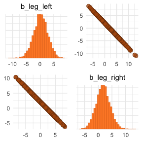

If you'd like a nicer and more focused attempt, you might have to revert to the `posterior_samples()` function and a little ggplot2 code.

``` r
post <- posterior_samples(b6.1)
  
post %>% 
  ggplot(aes(x = b_leg_left, y = b_leg_right)) +
  geom_point(color = "darkgreen", alpha = 1/10, size = 1/2)
```


While we're at it, you can make a similar plot with the [`mcmc_scatter()` function](https://cran.r-project.org/web/packages/bayesplot/vignettes/plotting-mcmc-draws.html).

``` r
color_scheme_set("green")

post %>% 
  mcmc_scatter(pars = c("b_leg_left", "b_leg_right"),
               size = 1/2, 
               alpha = 1/10)
```

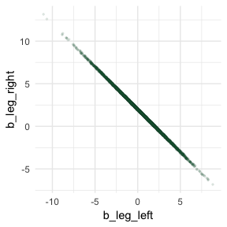

But wow, those coefficients look about as highly correlated as the predictors, just with the reversed sign.

``` r
post %>% 
  select(b_leg_left:b_leg_right) %>% 
  cor()
```

    ##             b_leg_left b_leg_right
    ## b_leg_left   1.0000000  -0.9996909
    ## b_leg_right -0.9996909   1.0000000

On page 165, McElreath clarified that "from the computer's perspective, this model is simply:"

$$
\\begin{eqnarray}
y\_i & \\sim & \\text{Normal}(\\mu\_i, \\sigma) \\\\
\\mu\_i & = & \\alpha + (\\beta\_1 + \\beta\_2) x\_i
\\end{eqnarray}
$$

Accordingly, here's the posterior of the sum of the two regression coefficients, Figure 6.2.b. We'll use `tidybayes::geom_halfeyeh()` to both plot the density and mark off the posterior median and percentile-based 95% probability intervals at its base.

``` r
library(tidybayes)

post %>% 
  ggplot(aes(x = b_leg_left + b_leg_right, y = 0)) +
  geom_halfeyeh(fill = "steelblue", 
                point_interval = median_qi, .width = .95) +
  scale_y_continuous(NULL, breaks = NULL) +
  labs(title    = "Sum the multicollinear coefficients",
       subtitle = "Marked by the median and 95% PIs")
```

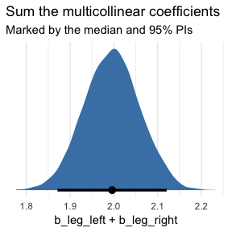

Now we fit the model after ditching one of the leg lengths.

``` r
b6.2 <- 
  brm(data = d, family = gaussian,
      height ~ 1 + leg_left,
      prior = c(prior(normal(10, 100), class = Intercept),
                prior(normal(2, 10), class = b),
                prior(exponential(1), class = sigma)),
      iter = 2000, warmup = 500, chains = 4, cores = 4,
      seed = 6)
```

``` r
print(b6.2)
```

    ##  Family: gaussian 
    ##   Links: mu = identity; sigma = identity 
    ## Formula: height ~ 1 + leg_left 
    ##    Data: d (Number of observations: 100) 
    ## Samples: 4 chains, each with iter = 2000; warmup = 500; thin = 1;
    ##          total post-warmup samples = 6000
    ## 
    ## Population-Level Effects: 
    ##           Estimate Est.Error l-95% CI u-95% CI Eff.Sample Rhat
    ## Intercept     1.00      0.29     0.42     1.56       5225 1.00
    ## leg_left      1.99      0.06     1.87     2.11       5332 1.00
    ## 
    ## Family Specific Parameters: 
    ##       Estimate Est.Error l-95% CI u-95% CI Eff.Sample Rhat
    ## sigma     0.63      0.05     0.55     0.73       4859 1.00
    ## 
    ## Samples were drawn using sampling(NUTS). For each parameter, Eff.Sample 
    ## is a crude measure of effective sample size, and Rhat is the potential 
    ## scale reduction factor on split chains (at convergence, Rhat = 1).

That posterior *S**D* looks much better. Compare this density to the one in Figure 6.1.b.

``` r
posterior_samples(b6.2) %>% 
  
  ggplot(aes(x = b_leg_left, y = 0)) +
  geom_halfeyeh(fill = "steelblue", 
                point_interval = median_qi, .width = .95) +
  scale_y_continuous(NULL, breaks = NULL) +
  labs(title    = "Just one coefficient needed",
       subtitle = "Marked by the median and 95% PIs",
       x        = "only b_leg_left, this time")
```

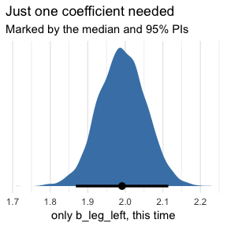

> *When two predictor variables are very strongly correlated, including both in a model may lead to confusion.* The posterior distribution isn’t wrong, in such a case. It’s telling you that the question you asked cannot be answered with these data. And that’s a great thing for a model to say, that it cannot answer your question. (p. 165, *emphasis* in the original)

### Multicollinear `milk`.

Multicollinearity arises in real data, too.

``` r
library(rethinking)
data(milk)
d <- milk
```

Unload rethinking and load brms.

``` r
rm(milk)
detach(package:rethinking, unload = T)
library(brms)
```

Here we standardize our three focal variables.

``` r
d <-
  d %>% 
  mutate(k = (kcal.per.g   - mean(kcal.per.g))   / sd(kcal.per.g),
         f = (perc.fat     - mean(perc.fat))     / sd(perc.fat),
         l = (perc.lactose - mean(perc.lactose)) / sd(perc.lactose))
```

We'll follow the text and fit the two univariable models, first. Note our use of `update()`.

``` r
# k regressed on f
b6.3 <- 
  brm(data = d, family = gaussian,
      k ~ 1 + f,
      prior = c(prior(normal(0, 0.2), class = Intercept),
                prior(normal(0, 0.5), class = b),
                prior(exponential(1), class = sigma)),
      iter = 2000, warmup = 500, chains = 4, cores = 4,
      seed = 6)

# k regressed on l
b6.4 <- 
  update(b6.3,
         newdata = d,
         formula = k ~ 1 + l)
```

``` r
posterior_summary(b6.3) %>% round(digits = 2)
```

    ##             Estimate Est.Error   Q2.5  Q97.5
    ## b_Intercept     0.00      0.08  -0.17   0.15
    ## b_f             0.86      0.09   0.67   1.04
    ## sigma           0.49      0.07   0.38   0.64
    ## lp__          -22.10      1.28 -25.43 -20.66

``` r
posterior_summary(b6.4) %>% round(digits = 2)
```

    ##             Estimate Est.Error   Q2.5  Q97.5
    ## b_Intercept     0.00      0.07  -0.15   0.14
    ## b_l            -0.90      0.08  -1.05  -0.74
    ## sigma           0.41      0.06   0.32   0.54
    ## lp__          -17.40      1.29 -20.81 -15.93

Now "watch what happens when we place both predictor varaibles in the same regression model" (p. 166).

``` r
b6.5 <- 
  update(b6.4,
         newdata = d,
         formula = k ~ 1 + f + l)
```

``` r
posterior_summary(b6.5) %>% round(digits = 2)
```

    ##             Estimate Est.Error   Q2.5  Q97.5
    ## b_Intercept     0.00      0.07  -0.15   0.14
    ## b_f             0.25      0.20  -0.13   0.64
    ## b_l            -0.67      0.20  -1.05  -0.27
    ## sigma           0.41      0.06   0.32   0.54
    ## lp__          -17.31      1.50 -21.11 -15.41

You can make custom pairs plots with [GGalley](https://cran.r-project.org/web/packages/GGally/index.html), which will also compute the point estimates for the bivariate correlations. Here's a default plot.

``` r
#install.packages("GGally", dependencies = T)
library(GGally)

ggpairs(data = d, columns = c(3:4, 6))
```

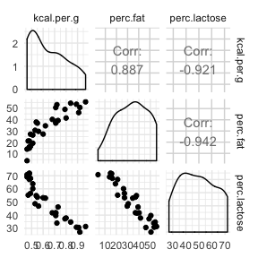

But you can customize [these](http://ggobi.github.io/ggally/), too. E.g.,

``` r
my_diag <- function(data, mapping, ...){
  ggplot(data = data, mapping = mapping) + 
    geom_density(fill = "steelblue", color = "black")
}

my_lower <- function(data, mapping, ...){
  ggplot(data = data, mapping = mapping) + 
    geom_smooth(method = "lm", color = "orange", size = 1/3, 
                fill = "orange", alpha = 1/4) +
    geom_point(alpha = .8, size = 1/4)
  }

# Then plug those custom functions into `ggpairs()`
ggpairs(data  = d, columns = c(3:4, 6),
        diag  = list(continuous = my_diag),
        lower = list(continuous = my_lower)) + 
  theme_bw() +
  theme(strip.background = element_rect(fill = "white", color = "white"),
        axis.text        = element_blank(),
        axis.ticks       = element_blank())
```

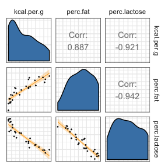

Our two predictor "variables are negatively correlated, and so strongly so that they are nearly redundant. Either helps in predicting `kcal.per.g`, but neither helps much *once you already know the other*" (p. 168, *emphasis* in the original). You can really see that on the lower two scatter plots. You'll note the `ggpairs()` plot also showed the Pearson's correlation coefficients.

Making a DAG might help us make sense of this.

``` r
library(ggdag)

dag_coords <-
  tibble(name = c("L", "D", "F", "K"),
         x    = c(1, 2, 3, 2),
         y    = c(2, 2, 2, 1))

dagify(L ~ D,
       F ~ D,
       K ~ L + F,
       coords = dag_coords) %>%
  
  ggplot(aes(x = x, y = y, xend = xend, yend = yend)) +
  geom_dag_point(color = "steelblue", alpha = 1/2, size = 10) +
  geom_dag_text(color = "black") +
  geom_dag_edges() +
  scale_x_continuous(NULL, breaks = NULL, expand = c(.1, .1)) +
  scale_y_continuous(NULL, breaks = NULL, expand = c(.1, .1))
```

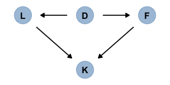

> The central tradeoff decides how dense, D, the milk needs to be. Then fat, F, and lactose, L, are determined. Finally, the composition of F and L determines the kilocalories, K. If we could measure D, or had an evolutionary and economic model to predict it based upon other aspects of a species, that would be better than stumbling through regressions. (p. 167)

### How bad is correlation?

``` r
d %>% 
  select(perc.fat, perc.lactose) %>% 
  cor()
```

    ##                perc.fat perc.lactose
    ## perc.fat      1.0000000   -0.9416373
    ## perc.lactose -0.9416373    1.0000000

> What can be done about multicollinearity? The best thing to do is be aware of it. You can anticipate this problem by checking the predictor variables against one another in a pairs plot. Any pair or cluster of variables with very large correlations, over about 0.9, may be problematic, once included in the same model. However, it isn’t always true that highly correlated variables are completely redundant—other predictors might be correlated with only one of the pair, and so help extract the unique information each predictor provides. So you can’t know just from a table of correlations nor from a matrix of scatterplots whether multicollinearity will prevent you from including sets of variables in the same model. We always need conceptual models, based upon scientific background, to do useful statistics. The data themselves just aren’t enough. (p. 168)

#### Overthinking: Simulating collinearity.

First we'll get the data and define the functions. You'll note I've defined my `sim_coll()` a little differently from `sim.coll()` in the text. I've omitted `rep.sim.coll()` as an independent function altogether, but computed similar summary information with the `summarise()` code at the bottom of the block.

``` r
sim_coll <- function(seed, rho){
  set.seed(seed)
  d <-
    d %>% 
    mutate(x = rnorm(n(), 
                     mean = perc.fat * rho,
                     sd   = sqrt((1 - rho^2) * var(perc.fat))))
    
  m <- lm(kcal.per.g ~ perc.fat + x, data = d)
  
  sqrt(diag(vcov(m)))[2]  # parameter SD
}

# how many simulations per `rho`-value would you like?
n_seed <- 100
# how many `rho`-values from 0 to .99 would you like to evaluate the process over?
n_rho  <- 30

d <-
  tibble(seed = 1:n_seed) %>% 
  expand(seed, rho = seq(from = 0, to = .99, length.out = n_rho)) %>% 
  mutate(parameter_sd = purrr::map2_dbl(seed, rho, sim_coll)) %>% 
  group_by(rho) %>% 
  # we'll `summarise()` our output by the mean and 95% intervals
  summarise(mean = mean(parameter_sd),
            ll   = quantile(parameter_sd, prob = .025),
            ul   = quantile(parameter_sd, prob = .975))
```

We've added 95% interval bands to our version of Figure 5.10.

``` r
d %>% 
  ggplot(aes(x = rho, y = mean)) +
  geom_smooth(aes(ymin = ll, ymax = ul),
              stat = "identity",
              fill = "orange", color = "orange", alpha = 1/3, size = 2/3) +
  labs(x = expression(rho),
       y = "parameter SD") +
  coord_cartesian(ylim = c(0, .0072))
```

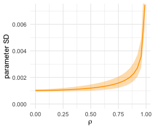

Did you notice we used the base R `lm()` function to fit the models? As McElreath rightly pointed out, `lm()` presumes flat priors. Proper Bayesian modeling could improve on that. But then we’d have to wait for a whole lot of HMC chains to run and until our personal computers or the algorithms we use to fit our Bayesian models become orders of magnitude faster, we just don’t have time for that.

Post-treatment bias.
--------------------

It helped me understand the next example by mapping out the sequence of events McElreath described in the second paragraph:

-   seed and sprout plants
-   measure heights
-   apply different antifungal soil treatments (i.e., the experimental manipulation)
-   measure (a) the heights and (b) the presence of fungus

Based on the design, let's simulate our data.

``` r
# how many plants would you like?
n <- 100

set.seed(71)
d <- 
  tibble(h0        = rnorm(n, mean = 10, sd = 2), 
         treatment = rep(0:1, each = n / 2),
         fungus    = rbinom(n, size = 1, prob = .5 - treatment * 0.4),
         h1        = h0 + rnorm(n, mean = 5 - 3 * fungus, sd = 1))
```

We'll use `head()` to peek at the data.

``` r
d %>%
  head()
```

    ## # A tibble: 6 x 4
    ##      h0 treatment fungus    h1
    ##   <dbl>     <int>  <int> <dbl>
    ## 1  9.14         0      0  14.3
    ## 2  9.11         0      0  15.6
    ## 3  9.04         0      0  14.4
    ## 4 10.8          0      0  15.8
    ## 5  9.16         0      1  11.5
    ## 6  7.63         0      0  11.1

And here's a quick summary with `tidybayes::mean_qi()`.

``` r
d %>% 
  gather() %>% 
  group_by(key) %>% 
  mean_qi(.width = .89) %>% 
  mutate_if(is.double, round, digits = 2)
```

    ## # A tibble: 4 x 7
    ##   key       value .lower .upper .width .point .interval
    ##   <chr>     <dbl>  <dbl>  <dbl>  <dbl> <chr>  <chr>    
    ## 1 fungus     0.23   0       1     0.89 mean   qi       
    ## 2 h0         9.96   6.57   13.1   0.89 mean   qi       
    ## 3 h1        14.4   10.6    17.9   0.89 mean   qi       
    ## 4 treatment  0.5    0       1     0.89 mean   qi

### A prior is born.

Let's take a look at the *p* ∼ Log-Normal(0, 0.25) prior distribution.

``` r
set.seed(6)

# simulate
sim_p <-
  tibble(sim_p = rlnorm(1e4, meanlog = 0, sdlog = 0.25)) 

# wrangle
sim_p %>% 
  mutate(`exp(sim_p)` = exp(sim_p)) %>%
  gather() %>% 
  
  # plot
  ggplot(aes(x = value)) +
  geom_density(fill = "steelblue") +
  scale_x_continuous(breaks = c(0, .5, 1, 1.5, 2, 3, 5)) +
  scale_y_continuous(NULL, breaks = NULL) +
  coord_cartesian(xlim = 0:6) +
  theme(panel.grid.minor.x = element_blank()) +
  facet_wrap(~key, scale = "free_y", ncol = 1)
```

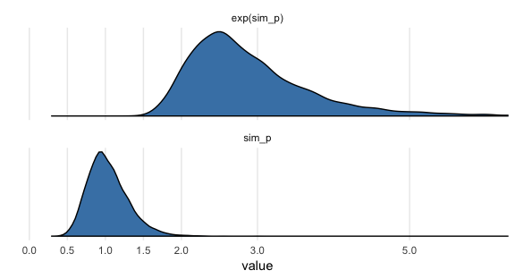

``` r
sim_p %>% 
  mutate(`exp(sim_p)` = exp(sim_p)) %>%
  gather() %>%
  group_by(key) %>% 
  mean_qi(.width = .89) %>% 
  mutate_if(is.double, round, digits = 2)
```

    ## # A tibble: 2 x 7
    ##   key        value .lower .upper .width .point .interval
    ##   <chr>      <dbl>  <dbl>  <dbl>  <dbl> <chr>  <chr>    
    ## 1 exp(sim_p)  2.92   1.96   4.49   0.89 mean   qi       
    ## 2 sim_p       1.03   0.67   1.5    0.89 mean   qi

So then, our initial statistical model follows the form

$$
\\begin{eqnarray}
h\_{1i} & \\sim & \\text{Normal} (\\mu\_i, \\sigma)\\\\
\\mu\_i & = & h\_{0i} \\times p\\\\
p & \\sim & \\text{Log-Normal}(0, 0.25) \\\\
\\sigma & \\sim & \\text {Exponential} (1)
\\end{eqnarray}
$$

Let's fit the model.

``` r
b6.6 <- 
  brm(data = d, family = gaussian,
      h1 ~ 0 + h0,
      prior = c(prior(lognormal(0, 0.25), class = b),
                prior(exponential(1), class = sigma)),
      iter = 2000, warmup = 1000, chains = 4, cores = 4,
      seed = 6)
```

Behold the summary.

``` r
print(b6.6)
```

    ##  Family: gaussian 
    ##   Links: mu = identity; sigma = identity 
    ## Formula: h1 ~ 0 + h0 
    ##    Data: d (Number of observations: 100) 
    ## Samples: 4 chains, each with iter = 2000; warmup = 1000; thin = 1;
    ##          total post-warmup samples = 4000
    ## 
    ## Population-Level Effects: 
    ##    Estimate Est.Error l-95% CI u-95% CI Eff.Sample Rhat
    ## h0     1.43      0.02     1.39     1.46       3137 1.00
    ## 
    ## Family Specific Parameters: 
    ##       Estimate Est.Error l-95% CI u-95% CI Eff.Sample Rhat
    ## sigma     1.82      0.13     1.59     2.09       3441 1.00
    ## 
    ## Samples were drawn using sampling(NUTS). For each parameter, Eff.Sample 
    ## is a crude measure of effective sample size, and Rhat is the potential 
    ## scale reduction factor on split chains (at convergence, Rhat = 1).

So then, the expectation is an increase of about 43 percent relative to *h*<sub>0</sub>. But this isn't the best model. We're leaving important predictors on the table. Our updated model follows the form

$$
\\begin{eqnarray}
h\_{1i} & \\sim & \\text{Normal} (\\mu\_i, \\sigma)\\\\
\\mu\_i & = & h\_{0i} \\times p\\\\
p & = & \\alpha + \\beta\_1 \\text{treatment}\_i + \\beta\_2 \\text{fungus}\_i \\\\
\\alpha & \\sim & \\text{Log-Normal}(0, 0.25) \\\\
\\beta\_1 & \\sim & \\text{Normal} (0, 0.5) \\\\
\\beta\_2 & \\sim & \\text{Normal} (0, 0.5) \\\\
\\sigma & \\sim & \\text {Exponential} (1)
\\end{eqnarray}
$$

That is, now the "proportion of growth *p* is now a function of the predictor variables" (p. 172).

Although we will fit the equivalent of McElreath's model in brms, I'm not aware that we can translate it directly into brms syntax. But take a look at the critical two lines from above.

$$
\\begin{eqnarray}
\\mu\_i & = & h\_{0i} \\times p\\\\
p & = & \\alpha + \\beta\_1 \\text{treatment}\_i + \\beta\_2 \\text{fungus}\_i \\\\
\\end{eqnarray}
$$

With just a little algebra, we can re-express that as

*μ*<sub>*i*</sub> = *h*<sub>0*i*</sub> × (*α* + *β*<sub>1</sub>treatment<sub>*i*</sub> + *β*<sub>2</sub>fungus<sub>*i*</sub>)

And that’s something we can do within brms if we’re willing to use the [nonlinear syntax](https://cran.r-project.org/web/packages/brms/vignettes/brms_nonlinear.html). Here it is.

``` r
b6.7 <- 
  brm(data = d, family = gaussian,
      bf(h1 ~ h0 * (a + t * treatment + f * fungus),
         a + t + f ~ 1,
         nl = TRUE),
      prior = c(prior(lognormal(0, 0.2), nlpar = a),
                prior(normal(0, 0.5), nlpar = t),
                prior(normal(0, 0.5), nlpar = f),
                prior(exponential(1), class = sigma)),
      iter = 2000, warmup = 500, chains = 4, cores = 4,
      seed = 6)
```

To explain what's going on with our `formula`syntax, it's probably best to quote [Bürkner's vignette](https://cran.r-project.org/web/packages/brms/vignettes/brms_nonlinear.html) at length:

> When looking at the above code, the first thing that becomes obvious is that we changed the `formula` syntax to display the non-linear formula including predictors (i.e., \[`h0`, `treatment`, and `fungus`\]) and parameters (i.e., \[`a`, `t`, and `f`\]) wrapped in a call to \[the `bf()` function\]. This stands in contrast to classical **R** formulas, where only predictors are given and parameters are implicit. The argument \[`a + t + f ~ 1`\] serves two purposes. First, it provides information, which variables in `formula` are parameters, and second, it specifies the linear predictor terms for each parameter. In fact, we should think of non-linear parameters as placeholders for linear predictor terms rather than as parameters themselves (see also the following examples). In the present case, we have no further variables to predict \[`a`, `t`, and `f`\] and thus we just fit intercepts that represent our estimates of \[*α*, *t*, and *f*\]. The formula \[`a + t + f ~ 1`\] is a short form of \[`a ~ 1, t ~ 1, f ~ 1`\] that can be used if multiple non-linear parameters share the same formula. Setting `nl = TRUE` tells **brms** that the formula should be treated as non-linear.
>
> In contrast to generalized linear models, priors on population-level parameters (i.e., 'fixed effects') are often mandatory to identify a non-linear model. Thus, **brms** requires the user to explicitely specify these priors. In the present example, we used a \[`lognormal(0, 0.2)` prior on (the population-level intercept of) `a`, while we used a `normal(0, 0.5)` prior on both (population-level intercepts of) `t` and `f`\]. Setting priors is a non-trivial task in all kinds of models, especially in non-linear models, so you should always invest some time to think of appropriate priors. Quite often, you may be forced to change your priors after fitting a non-linear model for the first time, when you observe different MCMC chains converging to different posterior regions. This is a clear sign of an idenfication problem and one solution is to set stronger (i.e., more narrow) priors. (**emphasis** in the original)

Let's see what we've done.

``` r
print(b6.7)
```

    ##  Family: gaussian 
    ##   Links: mu = identity; sigma = identity 
    ## Formula: h1 ~ h0 * (a + t * treatment + f * fungus) 
    ##          a ~ 1
    ##          t ~ 1
    ##          f ~ 1
    ##    Data: d (Number of observations: 100) 
    ## Samples: 4 chains, each with iter = 2000; warmup = 500; thin = 1;
    ##          total post-warmup samples = 6000
    ## 
    ## Population-Level Effects: 
    ##             Estimate Est.Error l-95% CI u-95% CI Eff.Sample Rhat
    ## a_Intercept     1.48      0.03     1.43     1.53       2759 1.00
    ## t_Intercept     0.00      0.03    -0.06     0.06       3004 1.00
    ## f_Intercept    -0.27      0.04    -0.34    -0.19       3442 1.00
    ## 
    ## Family Specific Parameters: 
    ##       Estimate Est.Error l-95% CI u-95% CI Eff.Sample Rhat
    ## sigma     1.45      0.11     1.26     1.68       4834 1.00
    ## 
    ## Samples were drawn using sampling(NUTS). For each parameter, Eff.Sample 
    ## is a crude measure of effective sample size, and Rhat is the potential 
    ## scale reduction factor on split chains (at convergence, Rhat = 1).

All in all, it looks like we did a good job matching up McElreath's results. The posterior doesn't, however, match up well with the way we generated the data...

### Blocked by consequence.

To measure the treatment effect properly, we should omit `fungus` from the model. This leaves us with the equation

$$
\\begin{eqnarray}
h\_{1i} & \\sim & \\text{Normal} (\\mu\_i, \\sigma)\\\\
\\mu\_i & = & h\_{0i} \\times (\\alpha + \\beta\_1 \\text{treatment}\_i) \\\\
\\alpha & \\sim & \\text{Log-Normal}(0, 0.25) \\\\
\\beta\_1 & \\sim & \\text{Normal} (0, 0.5) \\\\
\\sigma & \\sim & \\text {Exponential} (1)
\\end{eqnarray}
$$

Fit the model.

``` r
b6.8 <- 
  brm(data = d, family = gaussian,
      bf(h1 ~ h0 * (a + t * treatment),
         a + t ~ 1,
         nl = TRUE),
      prior = c(prior(lognormal(0, 0.2), nlpar = a),
                prior(normal(0, 0.5), nlpar = t),
                prior(exponential(1), class = sigma)),
      iter = 2000, warmup = 500, chains = 4, cores = 4,
      seed = 6)
```

Did we do better?

``` r
print(b6.8)
```

    ##  Family: gaussian 
    ##   Links: mu = identity; sigma = identity 
    ## Formula: h1 ~ h0 * (a + t * treatment) 
    ##          a ~ 1
    ##          t ~ 1
    ##    Data: d (Number of observations: 100) 
    ## Samples: 4 chains, each with iter = 2000; warmup = 500; thin = 1;
    ##          total post-warmup samples = 6000
    ## 
    ## Population-Level Effects: 
    ##             Estimate Est.Error l-95% CI u-95% CI Eff.Sample Rhat
    ## a_Intercept     1.38      0.03     1.33     1.43       3299 1.00
    ## t_Intercept     0.08      0.03     0.02     0.15       3227 1.00
    ## 
    ## Family Specific Parameters: 
    ##       Estimate Est.Error l-95% CI u-95% CI Eff.Sample Rhat
    ## sigma     1.79      0.13     1.55     2.06       4073 1.00
    ## 
    ## Samples were drawn using sampling(NUTS). For each parameter, Eff.Sample 
    ## is a crude measure of effective sample size, and Rhat is the potential 
    ## scale reduction factor on split chains (at convergence, Rhat = 1).

Yes, now we have a positive treatment effect.

### Fungus and *d*-separation.

Let's make a DAG.

``` r
# define our coordinates
dag_coords <-
  tibble(name = c("H0", "T", "F", "H1"),
         x    = c(1, 5, 4, 3),
         y    = c(2, 2, 1.5, 1))

# save our DAG
dag <-
  dagify(F ~ T,
         H1 ~ H0 + F,
         coords = dag_coords)

# plot 
dag %>%
  ggplot(aes(x = x, y = y, xend = xend, yend = yend)) +
  geom_dag_point(color = "steelblue", alpha = 1/2, size = 10) +
  geom_dag_text(color = "black") +
  geom_dag_edges() +
  scale_x_continuous(NULL, breaks = NULL, expand = c(.1, .1)) +
  scale_y_continuous(NULL, breaks = NULL, expand = c(.1, .1))
```

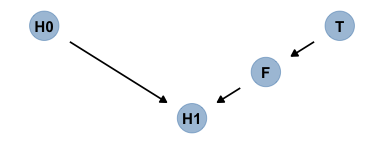

The DAG clarifies

> that learning the treatment tells us nothing about the outcome, once we know the fungus status.
>
> An even more DAG way to say this is that conditioning on **F** induces d-separation. The "d" stands for *dependence*. *d*-separation means that some variables are independent of others, given that we condition on some other set of variables. In this case, **H1** is *d*-separated from **T** when we condition on **F**. If we do not condition on **F**, then they are not *d*-separated. (p. 174, *emphasis* and **emphasis** in the original)

Note that our ggdag object, `dag`, will also work with the `dagitty::dseparated()` function.

``` r
library(dagitty)

dag %>% 
  dseparated("T", "H1")
```

    ## [1] FALSE

``` r
dag %>% 
  dseparated("T", "H1", "F")
```

    ## [1] TRUE

The descriptively-named `dagitty::mpliedConditionalIndependencies()` function will work, too.

``` r
impliedConditionalIndependencies(dag)
```

    ## F _||_ H0
    ## H0 _||_ T
    ## H1 _||_ T | F

Notice that last line. "Final height is independent of treatment, when conditioning on fungus" (p. 175)

#### Rethinking: Model selection doesn’t help.

> In the next chapter, you’ll learn about model selection using information criteria. Like other model comparison and selection schemes, these criteria help in contrasting and choosing model structure. But such approaches are no help in the example presented just above, since the model that includes `fungus` both fits the sample better and would make better out-of-sample predictions. Model \[`b6.7`\] misleads because it asks the wrong question, not because it would make poor predictions. No statistical procedure can substitute for scientific knowledge and attention to it. We need multiple models because they help us understand causal paths, not just so we can choose one or another for prediction. (p. 175)

Brutal.

Collider bias
-------------

Make the collider bias DAG of the trustworthiness/newsworthiness example.

``` r
dag_coords <-
  tibble(name = c("T", "S", "N"),
         x    = 1:3,
         y    = 1)

dagify(S ~ T + N,
       coords = dag_coords) %>%
  
  ggplot(aes(x = x, y = y, xend = xend, yend = yend)) +
  geom_dag_point(color = "steelblue", alpha = 1/2, size = 10) +
  geom_dag_text(color = "black") +
  geom_dag_edges() +
  scale_x_continuous(NULL, breaks = NULL, expand = c(.1, .1)) +
  scale_y_continuous(NULL, breaks = NULL, expand = c(.1, .1))
```

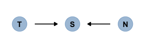

> The fact that two arrows enter S means it is a collider. This is perhaps an unhelpful label. But the core concept is easy to understand: When you condition on a collider, it creates statistical—but not necessarily causal—associations among its causes. In this case, once you learn that a proposal has been selected (S), then learning its trustworthiness (T) also provides information about its newsworthiness (N). Why? Because if, for example, a selected proposal has low trustworthiness, then it must have high newsworthiness. Otherwise it wouldn’t have been funded. The same works in reverse: If a proposal has low newsworthiness, we’d infer that it must have higher than average trustworthiness. Otherwise it would not have been selected for funding. (p. 175)

### Collider of false sorrow.

All it takes is a single `mutate()` line in the `dagify()` function to amend our previous DAG.

``` r
dagify(M ~ H + A,
       coords = dag_coords %>%
         mutate(name = c("H", "M", "A"))) %>%
  
  ggplot(aes(x = x, y = y, xend = xend, yend = yend)) +
  geom_dag_point(color = "steelblue", alpha = 1/2, size = 10) +
  geom_dag_text(color = "black") +
  geom_dag_edges() +
  scale_x_continuous(NULL, breaks = NULL, expand = c(.1, .1)) +
  scale_y_continuous(NULL, breaks = NULL, expand = c(.1, .1))
```

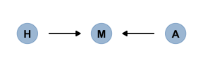

In this made-up example,

> happiness (H) and age (A) both cause marriage (M). Marriage is therefore a collider. Even though there is no causal association between happiness and age, if we condition on marriage— which means here, if we include it as a predictor in a regression—then it will induce a statis- tical association between age and happiness. And this can mislead us to think that happiness changes with age, when in fact it is constant.
>
> To convince you of this, let’s do another simulation. (p. 177)

Here's the code for McElreath's `rethinking::sim_happiness()` function.

``` r
rethinking::sim_happiness
```

    ## function (seed = 1977, N_years = 1000, max_age = 65, N_births = 20, 
    ##     aom = 18) 
    ## {
    ##     set.seed(seed)
    ##     H <- M <- A <- c()
    ##     for (t in 1:N_years) {
    ##         A <- A + 1
    ##         A <- c(A, rep(1, N_births))
    ##         H <- c(H, seq(from = -2, to = 2, length.out = N_births))
    ##         M <- c(M, rep(0, N_births))
    ##         for (i in 1:length(A)) {
    ##             if (A[i] >= aom & M[i] == 0) {
    ##                 M[i] <- rbern(1, inv_logit(H[i] - 4))
    ##             }
    ##         }
    ##         deaths <- which(A > max_age)
    ##         if (length(deaths) > 0) {
    ##             A <- A[-deaths]
    ##             H <- H[-deaths]
    ##             M <- M[-deaths]
    ##         }
    ##     }
    ##     d <- data.frame(age = A, married = M, happiness = H)
    ##     return(d)
    ## }
    ## <bytecode: 0x7f9cf2d29140>
    ## <environment: namespace:rethinking>

Quite frankly, I can’t make sense of it. So we’ll just have to move forward and use the convenience function rather than practicing a tidyverse alternative. If you have a handle on what's going on and have a tidyverse alternative, [please share your code](https://github.com/ASKurz/Statistical_Rethinking_with_brms_ggplot2_and_the_tidyverse_2_ed/issues).

``` r
d <- rethinking::sim_happiness(seed = 1977, N_years = 1000)

head(d)
```

    ##   age married  happiness
    ## 1  65       0 -2.0000000
    ## 2  65       0 -1.7894737
    ## 3  65       1 -1.5789474
    ## 4  65       0 -1.3684211
    ## 5  65       0 -1.1578947
    ## 6  65       0 -0.9473684

Here's our version of Figure 6.5.

``` r
d %>% 
  mutate(married = factor(married,
                          labels = c("unmarried", "married"))) %>% 
  
  ggplot(aes(x = age, y = happiness)) +
  geom_point(aes(color = married), size = 1.75) +
  scale_color_manual(NULL, values = c("grey80", "darkgreen")) +
  scale_x_continuous(expand = c(.015, .015)) +
  theme(panel.grid = element_blank())
```

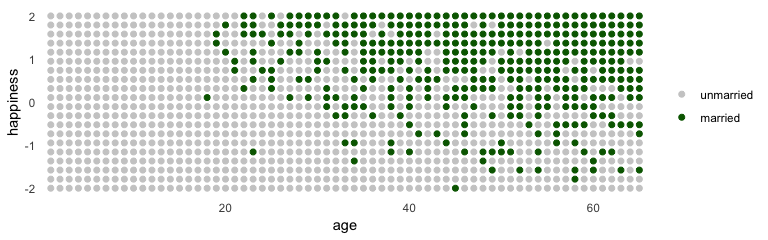

Here's the simple multivariable model predicting happiness

$$
\\begin{eqnarray}
\\text{happiness}\_i & \\sim & \\text{Normal} (\\mu\_i, \\sigma)\\\\
\\mu\_i & = & \\alpha\_{\\text{married} \[i\]} + \\beta\_1 \\text{age}\_i \\\\
\\end{eqnarray}
$$

where married\[*i*\] is the marriage status of individual *i*.

Here we make `d2`, the subset of `d` containing only those 18 and up. We then make a new `age` variable, `a`, which is scaled such that 18 = 0, 65 = 1, and so on.

``` r
d2 <-
  d %>% 
  filter(age > 17) %>% 
  mutate(a = (age - 18) / (65 - 18))

head(d2)
```

    ##   age married  happiness a
    ## 1  65       0 -2.0000000 1
    ## 2  65       0 -1.7894737 1
    ## 3  65       1 -1.5789474 1
    ## 4  65       0 -1.3684211 1
    ## 5  65       0 -1.1578947 1
    ## 6  65       0 -0.9473684 1

With respect to priors,

> Happiness is on an arbitrary scale, in these data, from −2 to +2. So our imaginary strongest relationship, taking happiness from maximum to minimum, has a slope with rise over run of (2 − ( − 2))/1 = 4. Remember that 95% of the mass of a normal distribution is contained within 2 standard deviations. So if we set the standard deviation of the prior to half of 4, we are saying that we expect 95% of plausible slopes to be less than maximally strong. That isn’t a very strong prior, but again, it at least helps bound inference to realistic ranges. Now for the intercepts. Each *α* is the value of *μ*<sub>*i*</sub> when $\\text a\_i = 0$. In this case, that means at age 18. So we need to allow α to cover the full range of happiness scores. Normal(0, 1) will put 95% of the mass in the −2 to +2 interval. (p. 177)

``` r
d2 <-
  d2 %>% 
  mutate(mid = factor(married + 1, labels = c("single", "married")))

head(d2)
```

    ##   age married  happiness a     mid
    ## 1  65       0 -2.0000000 1  single
    ## 2  65       0 -1.7894737 1  single
    ## 3  65       1 -1.5789474 1 married
    ## 4  65       0 -1.3684211 1  single
    ## 5  65       0 -1.1578947 1  single
    ## 6  65       0 -0.9473684 1  single

Fit the model.

``` r
b6.9 <- 
  brm(data = d2, family = gaussian,
      happiness ~ 0 + mid + a,
      prior = c(prior(normal(0, 1), class = b, coef = midmarried),
                prior(normal(0, 1), class = b, coef = midsingle),
                prior(normal(0, 2), class = b, coef = a),
                prior(exponential(1), class = sigma)),
      iter = 2000, warmup = 500, chains = 4, cores = 4,
      seed = 6)
```

``` r
print(b6.9)
```

    ##  Family: gaussian 
    ##   Links: mu = identity; sigma = identity 
    ## Formula: happiness ~ 0 + mid + a 
    ##    Data: d2 (Number of observations: 960) 
    ## Samples: 4 chains, each with iter = 2000; warmup = 500; thin = 1;
    ##          total post-warmup samples = 6000
    ## 
    ## Population-Level Effects: 
    ##            Estimate Est.Error l-95% CI u-95% CI Eff.Sample Rhat
    ## midsingle     -0.23      0.06    -0.36    -0.11       2142 1.00
    ## midmarried     1.26      0.08     1.10     1.43       2219 1.00
    ## a             -0.75      0.11    -0.97    -0.53       2008 1.00
    ## 
    ## Family Specific Parameters: 
    ##       Estimate Est.Error l-95% CI u-95% CI Eff.Sample Rhat
    ## sigma     0.99      0.02     0.95     1.04       4143 1.00
    ## 
    ## Samples were drawn using sampling(NUTS). For each parameter, Eff.Sample 
    ## is a crude measure of effective sample size, and Rhat is the potential 
    ## scale reduction factor on split chains (at convergence, Rhat = 1).

Now drop marriage status, `mid`.

``` r
b6.10 <- 
  brm(data = d2, family = gaussian,
      happiness ~ 0 + intercept + a,
      prior = c(prior(normal(0, 1), class = b, coef = intercept),
                prior(normal(0, 2), class = b, coef = a),
                prior(exponential(1), class = sigma)),
      iter = 2000, warmup = 500, chains = 4, cores = 4,
      seed = 6)
```

``` r
print(b6.10)
```

    ##  Family: gaussian 
    ##   Links: mu = identity; sigma = identity 
    ## Formula: happiness ~ 0 + intercept + a 
    ##    Data: d2 (Number of observations: 960) 
    ## Samples: 4 chains, each with iter = 2000; warmup = 500; thin = 1;
    ##          total post-warmup samples = 6000
    ## 
    ## Population-Level Effects: 
    ##           Estimate Est.Error l-95% CI u-95% CI Eff.Sample Rhat
    ## intercept    -0.00      0.08    -0.16     0.14       2544 1.00
    ## a             0.01      0.13    -0.25     0.27       2568 1.00
    ## 
    ## Family Specific Parameters: 
    ##       Estimate Est.Error l-95% CI u-95% CI Eff.Sample Rhat
    ## sigma     1.22      0.03     1.16     1.28       3279 1.00
    ## 
    ## Samples were drawn using sampling(NUTS). For each parameter, Eff.Sample 
    ## is a crude measure of effective sample size, and Rhat is the potential 
    ## scale reduction factor on split chains (at convergence, Rhat = 1).

Wow. So when we take out `mid`, the coefficient for `a` drops to zero.

> The pattern above is exactly what we should expect when we condition on a collider. The collider is marriage status. It a common consequence of age and happiness. As a result, when we condition on it, we induce a spurious association between the two causes. So it looks like, to model `b6.9`, that age is negatively associated with happiness. But this is just a statistical association, not a causal association. Once we know whether someone is married or not, then their age does provide information about how happy they are. (p. 178)

### The haunted DAG.

"I’m sorry to say that we also have to consider the possibility that our DAG may be haunted" (p. 179).

Here's the unhaunted DAG.

``` r
dag_coords <-
  tibble(name = c("G", "P", "C"),
         x    = c(1, 2, 2),
         y    = c(2, 2, 1))

dagify(P ~ G,
       C ~ P + G,
       coords = dag_coords) %>%
  
  ggplot(aes(x = x, y = y, xend = xend, yend = yend)) +
  geom_dag_point(color = "steelblue", alpha = 1/2, size = 10) +
  geom_dag_text(color = "black") +
  geom_dag_edges() +
  scale_x_continuous(NULL, breaks = NULL, expand = c(.1, .1)) +
  scale_y_continuous(NULL, breaks = NULL, expand = c(.1, .1))
```

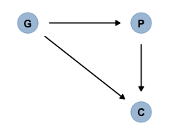

Now we add the haunting variable, `U`.

``` r
dag_coords <-
  tibble(name = c("G", "P", "C", "U"),
         x    = c(1, 2, 2, 2.5),
         y    = c(2, 2, 1, 1.5))

dagify(P ~ G + U,
       C ~ P + G + U,
       coords = dag_coords) %>%
  
  ggplot(aes(x = x, y = y, xend = xend, yend = yend)) +
  geom_dag_point(color = "steelblue", alpha = 1/2, size = 10) +
  geom_dag_text(color = "black") +
  geom_dag_edges() +
  scale_x_continuous(NULL, breaks = NULL, expand = c(.1, .1)) +
  scale_y_continuous(NULL, breaks = NULL, expand = c(.1, .1))
```

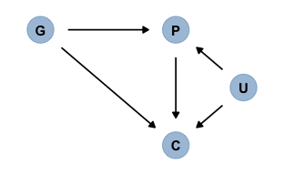

Let's simulate our data.

``` r
# How many grandparent-parent-child triads would you like?
n    <- 200 
b_gp <- 1  # direct effect of G on P
b_gc <- 0  # direct effect of G on C
b_pc <- 1  # direct effect of P on C
b_u  <- 2  # direct effect of U on P and C

# simulate triads
set.seed(1)
d <-
  tibble(U = 2 * rbinom(n, size = 1, prob = .5) - 1,
         G = rnorm(n, mean = 0, sd = 1)) %>% 
  mutate(P = rnorm(n, mean = b_gp * G + b_u * U, sd = 1)) %>% 
  mutate(C = rnorm(n, mean = b_pc * P + b_gc * G + b_u * U, sd = 1)) %>%
  mutate_at(vars(G, P, C), funs(as.vector(scale(.))))

head(d)
```

    ## # A tibble: 6 x 4
    ##       U       G      P      C
    ##   <dbl>   <dbl>  <dbl>  <dbl>
    ## 1    -1 -0.619  -0.743 -0.840
    ## 2    -1  0.0464 -1.28  -1.22 
    ## 3     1 -0.912   1.27   0.912
    ## 4     1  0.163   0.728  0.890
    ## 5    -1 -0.654  -0.438 -0.458
    ## 6     1  1.78    2.20   2.07

"Now P is a common consequence of G and U, so if we condition on P, it will bias inference about G → C, *even if we never get to measure* U" (p. 179, *emphasis* in the original).

Fit the model without `U`.

``` r
b0 <- 
  brm(data = d, family = gaussian,
      C ~ 1 + P + G,
      prior = c(prior(normal(0, 1), class = Intercept),
                prior(normal(0, 1), class = b),
                prior(exponential(1), class = sigma)),
      iter = 2000, warmup = 500, chains = 4, cores = 4,
      seed = 6)
```

``` r
print(b0)
```

    ##  Family: gaussian 
    ##   Links: mu = identity; sigma = identity 
    ## Formula: C ~ 1 + P + G 
    ##    Data: d (Number of observations: 200) 
    ## Samples: 4 chains, each with iter = 2000; warmup = 500; thin = 1;
    ##          total post-warmup samples = 6000
    ## 
    ## Population-Level Effects: 
    ##           Estimate Est.Error l-95% CI u-95% CI Eff.Sample Rhat
    ## Intercept     0.00      0.02    -0.05     0.05       5573 1.00
    ## P             0.99      0.03     0.94     1.04       5695 1.00
    ## G            -0.20      0.03    -0.25    -0.15       5696 1.00
    ## 
    ## Family Specific Parameters: 
    ##       Estimate Est.Error l-95% CI u-95% CI Eff.Sample Rhat
    ## sigma     0.33      0.02     0.30     0.37       5462 1.00
    ## 
    ## Samples were drawn using sampling(NUTS). For each parameter, Eff.Sample 
    ## is a crude measure of effective sample size, and Rhat is the potential 
    ## scale reduction factor on split chains (at convergence, Rhat = 1).

Now fit the model including `U`.

``` r
b1 <- 
  update(b0,
         newdata = d,
         formula = C ~ 1 + P + G + U)
```

``` r
print(b1)
```

    ##  Family: gaussian 
    ##   Links: mu = identity; sigma = identity 
    ## Formula: C ~ P + G + U 
    ##    Data: d (Number of observations: 200) 
    ## Samples: 4 chains, each with iter = 2000; warmup = 500; thin = 1;
    ##          total post-warmup samples = 6000
    ## 
    ## Population-Level Effects: 
    ##           Estimate Est.Error l-95% CI u-95% CI Eff.Sample Rhat
    ## Intercept    -0.01      0.02    -0.04     0.02       4490 1.00
    ## P             0.55      0.04     0.48     0.63       2532 1.00
    ## G            -0.01      0.02    -0.05     0.04       3246 1.00
    ## U             0.47      0.04     0.40     0.54       2539 1.00
    ## 
    ## Family Specific Parameters: 
    ##       Estimate Est.Error l-95% CI u-95% CI Eff.Sample Rhat
    ## sigma     0.24      0.01     0.22     0.27       4582 1.00
    ## 
    ## Samples were drawn using sampling(NUTS). For each parameter, Eff.Sample 
    ## is a crude measure of effective sample size, and Rhat is the potential 
    ## scale reduction factor on split chains (at convergence, Rhat = 1).

Now the posterior for $\\beta\_\\text G$ is hovering around 0, where it belongs.

### Primate collider. `x`

6.4. Instrumental variables
---------------------------

Reference
---------

[McElreath, R. (2016). *Statistical rethinking: A Bayesian course with examples in R and Stan.* Chapman & Hall/CRC Press.](https://xcelab.net/rm/statistical-rethinking/)

Session info
------------

``` r
sessionInfo()
```

    ## R version 3.5.1 (2018-07-02)
    ## Platform: x86_64-apple-darwin15.6.0 (64-bit)
    ## Running under: macOS High Sierra 10.13.6
    ## 
    ## Matrix products: default
    ## BLAS: /Library/Frameworks/R.framework/Versions/3.5/Resources/lib/libRblas.0.dylib
    ## LAPACK: /Library/Frameworks/R.framework/Versions/3.5/Resources/lib/libRlapack.dylib
    ## 
    ## locale:
    ## [1] en_US.UTF-8/en_US.UTF-8/en_US.UTF-8/C/en_US.UTF-8/en_US.UTF-8
    ## 
    ## attached base packages:
    ## [1] parallel  stats     graphics  grDevices utils     datasets  methods  
    ## [8] base     
    ## 
    ## other attached packages:
    ##  [1] dagitty_0.2-2        ggdag_0.1.0          GGally_1.4.0        
    ##  [4] rstan_2.18.2         StanHeaders_2.18.0-1 tidybayes_1.0.3     
    ##  [7] bayesplot_1.6.0      brms_2.7.0           Rcpp_1.0.0          
    ## [10] bindrcpp_0.2.2       forcats_0.3.0        stringr_1.3.1       
    ## [13] dplyr_0.7.6          purrr_0.2.5          readr_1.1.1         
    ## [16] tidyr_0.8.1          tibble_1.4.2         ggplot2_3.1.0       
    ## [19] tidyverse_1.2.1     
    ## 
    ## loaded via a namespace (and not attached):
    ##   [1] colorspace_1.3-2          ggridges_0.5.0           
    ##   [3] rsconnect_0.8.8           rprojroot_1.3-2          
    ##   [5] ggstance_0.3              markdown_0.8             
    ##   [7] rethinking_1.80           base64enc_0.1-3          
    ##   [9] rstudioapi_0.7            farver_1.1.0             
    ##  [11] ggrepel_0.8.0             svUnit_0.7-12            
    ##  [13] DT_0.4                    mvtnorm_1.0-8            
    ##  [15] lubridate_1.7.4           xml2_1.2.0               
    ##  [17] codetools_0.2-15          bridgesampling_0.4-0     
    ##  [19] mnormt_1.5-5              knitr_1.20               
    ##  [21] shinythemes_1.1.1         jsonlite_1.5             
    ##  [23] broom_0.4.5               ggforce_0.1.3            
    ##  [25] shiny_1.1.0               compiler_3.5.1           
    ##  [27] httr_1.3.1                backports_1.1.2          
    ##  [29] assertthat_0.2.0          Matrix_1.2-14            
    ##  [31] lazyeval_0.2.1            cli_1.0.1                
    ##  [33] tweenr_1.0.1              later_0.7.3              
    ##  [35] htmltools_0.3.6           prettyunits_1.0.2        
    ##  [37] tools_3.5.1               igraph_1.2.1             
    ##  [39] coda_0.19-2               gtable_0.2.0             
    ##  [41] glue_1.3.0                reshape2_1.4.3           
    ##  [43] V8_1.5                    cellranger_1.1.0         
    ##  [45] nlme_3.1-137              crosstalk_1.0.0          
    ##  [47] ggraph_1.0.2              psych_1.8.4              
    ##  [49] ps_1.2.1                  rvest_0.3.2              
    ##  [51] mime_0.5                  miniUI_0.1.1.1           
    ##  [53] gtools_3.8.1              MASS_7.3-50              
    ##  [55] zoo_1.8-2                 scales_1.0.0             
    ##  [57] tidygraph_1.1.1           colourpicker_1.0         
    ##  [59] hms_0.4.2                 promises_1.0.1           
    ##  [61] Brobdingnag_1.2-5         inline_0.3.15            
    ##  [63] RColorBrewer_1.1-2        shinystan_2.5.0          
    ##  [65] curl_3.2                  yaml_2.1.19              
    ##  [67] gridExtra_2.3             loo_2.0.0                
    ##  [69] reshape_0.8.7             stringi_1.2.3            
    ##  [71] dygraphs_1.1.1.5          boot_1.3-20              
    ##  [73] pkgbuild_1.0.2            rlang_0.3.0.1            
    ##  [75] pkgconfig_2.0.1           matrixStats_0.54.0       
    ##  [77] evaluate_0.10.1           lattice_0.20-35          
    ##  [79] bindr_0.1.1               rstantools_1.5.0         
    ##  [81] htmlwidgets_1.2           labeling_0.3             
    ##  [83] tidyselect_0.2.4          processx_3.2.1           
    ##  [85] plyr_1.8.4                magrittr_1.5             
    ##  [87] R6_2.3.0                  pillar_1.2.3             
    ##  [89] haven_1.1.2               foreign_0.8-70           
    ##  [91] withr_2.1.2               units_0.6-0              
    ##  [93] xts_0.10-2                abind_1.4-5              
    ##  [95] modelr_0.1.2              crayon_1.3.4             
    ##  [97] arrayhelpers_1.0-20160527 utf8_1.1.4               
    ##  [99] rmarkdown_1.10            viridis_0.5.1            
    ## [101] grid_3.5.1                readxl_1.1.0             
    ## [103] callr_3.1.0               threejs_0.3.1            
    ## [105] digest_0.6.18             xtable_1.8-2             
    ## [107] httpuv_1.4.4.2            stats4_3.5.1             
    ## [109] munsell_0.5.0             viridisLite_0.3.0        
    ## [111] shinyjs_1.0
