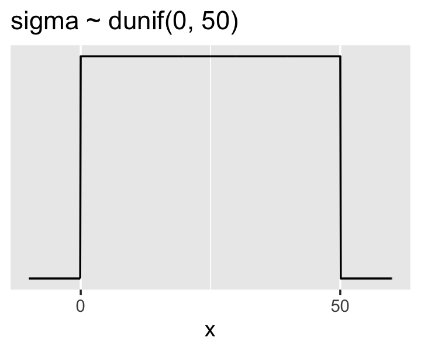
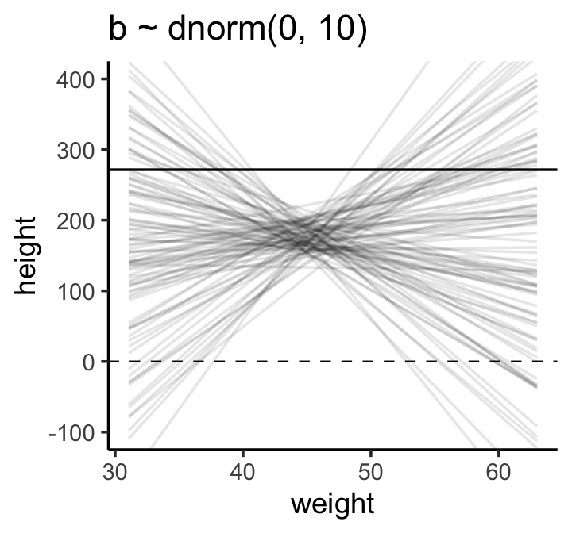
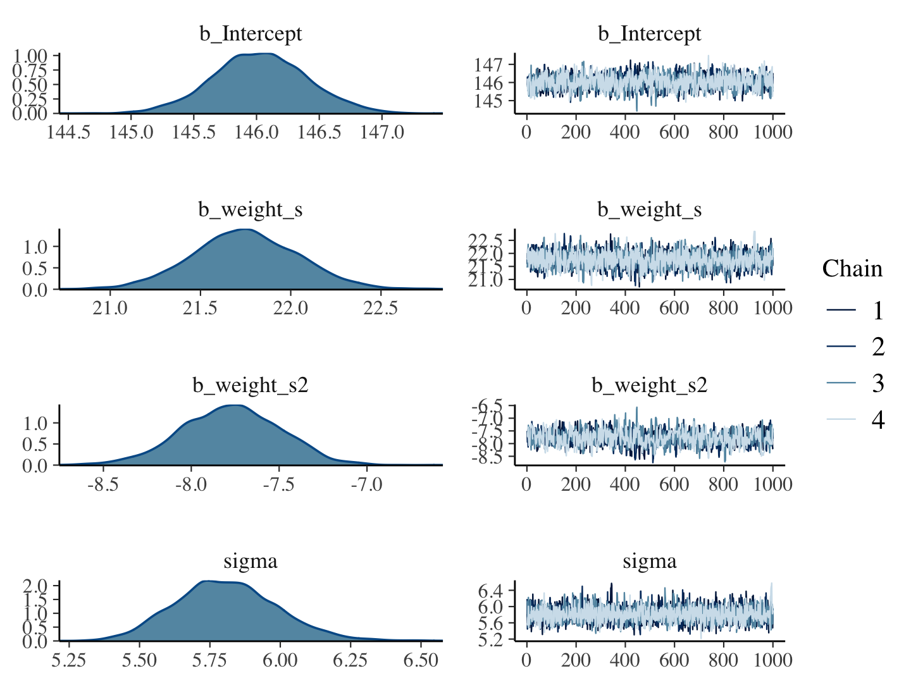
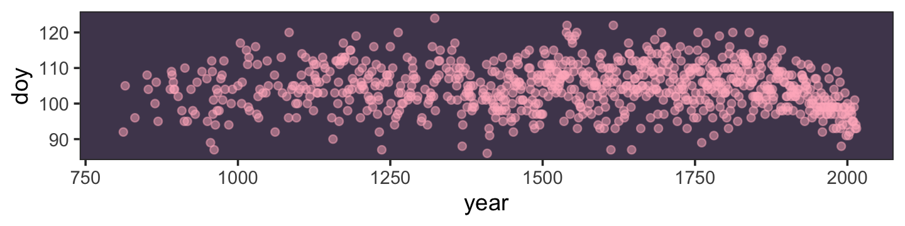

# Geocentric Models

> **Linear regression** is the geocentric model of applied statistics. By "linear regression," we will mean a family of simple statistical golems that attempt to learn about the mean and variance of some measurement, using an additive combination of other measurements. Like geocentrism, linear regression can usefully describe a very large variety of natural phenomena. Like geocentrism, linear regression is a descriptive model that corresponds to many different process models. If we read its structure too literally, we're likely to make mistakes. But used wisely, these little linear golems continue to be useful. [@mcelreathStatisticalRethinkingBayesian2020, p. 71, **emphasis**, in the original]

## Why normal distributions are normal

After laying out his soccer field coin toss shuffle premise, McElreath wrote:

> It's hard to say where any individual person will end up, but you can say with great confidence what the collection of positions will be. The distances will be distributed in approximately normal, or Gaussian, fashion. This is true even though the underlying distribution is binomial. It does this because there are so many more possible ways to realize a sequence of left-right steps that sums to zero. There are slightly fewer ways to realize a sequence that ends up one step left or right of zero, and so on, with the number of possible sequences declining in the characteristic bell curve of the normal distribution. (p. 72)

### Normal by addition.

Here's a way to do the simulation necessary for the plot in the top panel of Figure 4.2.


```r
library(tidyverse)

# we set the seed to make the results of `runif()` reproducible.
set.seed(4)

pos <- 
  # make data with 100 people, 16 steps each with a starting point of `step == 0` (i.e., 17 rows per person)
  crossing(person = 1:100,
           step   = 0:16) %>% 
  # for all steps above `step == 0` simulate a `deviation`
  mutate(deviation = map_dbl(step, ~if_else(. == 0, 0, runif(1, -1, 1)))) %>% 
  # after grouping by `person`, compute the cumulative sum of the deviations, then `ungroup()`
  group_by(person) %>%
  mutate(position = cumsum(deviation)) %>% 
  ungroup() 
```

That `map_dbl()` code within the first `mutate()` line might look odd. Go [here](https://purrr.tidyverse.org/reference/map.html) to learn more about iterating with `purrr::map_dbl()`.

We might `glimpse()` at the data.


```r
glimpse(pos)
```

```
## Rows: 1,700
## Columns: 4
## $ person    <int> 1, 1, 1, 1, 1, 1, 1, 1, 1, 1, 1, 1, 1, 1, 1, 1, 1, 2, 2, 2, 2, 2, 2, 2, 2, 2, 2…
## $ step      <int> 0, 1, 2, 3, 4, 5, 6, 7, 8, 9, 10, 11, 12, 13, 14, 15, 16, 0, 1, 2, 3, 4, 5, 6, …
## $ deviation <dbl> 0.00000000, -0.98210841, -0.41252078, -0.44525008, 0.62714843, -0.47914446, 0.4…
## $ position  <dbl> 0.0000000, -0.9821084, -1.3946292, -1.8398793, -1.2127308, -1.6918753, -1.24306…
```

Here's the code to make the top panel of Figure 4.2.


```r
ggplot(data = pos, 
       aes(x = step, y = position, group = person)) +
  geom_vline(xintercept = c(4, 8, 16), linetype = 2) +
  geom_line(aes(color = person < 2, alpha  = person < 2)) +
  scale_color_manual(values = c("skyblue4", "black")) +
  scale_alpha_manual(values = c(1/5, 1)) +
  scale_x_continuous("step number", breaks = c(0, 4, 8, 12, 16)) +
  theme(legend.position = "none")
```


Here's the code for the bottom three plots of Figure 4.2.


```r
# Figure 4.2.a.
p1 <-
  pos %>%
  filter(step == 4) %>%
  ggplot(aes(x = position)) +
  geom_line(stat = "density", color = "dodgerblue1") +
  labs(title = "4 steps")

# Figure 4.2.b.
p2 <-
  pos %>%
  filter(step == 8) %>%
  ggplot(aes(x = position)) +
  geom_density(color = "dodgerblue2", outline.type = "full") +
  labs(title = "8 steps")

# this is an intermediary step to get an SD value
pos %>%
  filter(step == 16) %>%
  summarise(sd = sd(position))
```

```
## # A tibble: 1 x 1
##      sd
##   <dbl>
## 1  2.36
```

```r
# Figure 4.2.c.
p3 <-
  pos %>%
  filter(step == 16) %>%
  ggplot(aes(x = position)) +
  stat_function(fun = dnorm, 
                args = list(mean = 0, sd = 2.180408),
                linetype = 2) +  # 2.180408 came from the previous code block
  geom_density(color = "transparent", fill = "dodgerblue3", alpha = 1/2) +
  labs(title = "16 steps",
       y = "density")

library(patchwork)

# combine the ggplots
(p1 | p2 | p3) & coord_cartesian(xlim = c(-6, 6))
```


While we were at it, we explored a few ways to express densities. The main action was with the `geom_line()`, `geom_density()`, and `stat_function()` functions, respectively.

### Normal by multiplication.

Here's McElreath's simple random growth rate.


```r
set.seed(4)

prod(1 + runif(12, 0, 0.1))
```

```
## [1] 1.774719
```

In the `runif()` part of that code, we generated 12 random draws from the uniform distribution with bounds $[0, 0.1]$. Within the `prod()` function, we first added `1` to each of those values and then computed their product. Consider a more explicit variant of the code.


```r
set.seed(4)

tibble(a = 1,
       b = runif(12, 0, 0.1)) %>% 
  mutate(c = a + b) %>% 
  summarise(p = prod(c))
```

```
## # A tibble: 1 x 1
##       p
##   <dbl>
## 1  1.77
```

Same result. Rather than using base **R** `replicate()` to do this many times, let's practice with `purrr::map_dbl()` like before.


```r
set.seed(4)

growth <- 
  tibble(growth = map_dbl(1:10000, ~ prod(1 + runif(12, 0, 0.1))))

ggplot(data = growth, aes(x = growth)) +
  geom_density()
```


"The smaller the effect of each locus, the better this additive approximation will be" (p. 74). Let's compare big and small.


```r
# simulate
set.seed(4)

samples <-
  tibble(big   = map_dbl(1:10000, ~ prod(1 + runif(12, 0, 0.5))),
         small = map_dbl(1:10000, ~ prod(1 + runif(12, 0, 0.01))))

# wrangle
samples %>% 
  pivot_longer(everything(),
               values_to = "samples") %>% 
  
  # plot
  ggplot(aes(x = samples)) +
  geom_density(fill = "black") +
  facet_wrap(~name, scales = "free") 
```


Yep, the `small` samples were more Gaussian.

### Normal by log-multiplication.

Instead of saving our tibble, we'll just feed it directly into our plot.


```r
samples %>% 
  mutate(log_big = log(big)) %>% 
  
  ggplot(aes(x = log_big)) +
  geom_density(fill = "gray33") +
  xlab("the log of the big")
```


> Yet another Gaussian distribution. We get the Gaussian distribution back, because adding logs is equivalent to multiplying the original numbers. So even multiplicative interactions of large deviations can produce Gaussian distributions, once we measure the outcomes on the log scale. (p. 75)

### Using Gaussian distributions.

"The justifications for using the Gaussian distribution fall into two broad categories: (1) ontological and (2) epistemological" (p. 75). I'm a fan of the justifications to follow.

#### Ontological justification.

The Gaussian is

> a widespread pattern, appearing again and again at different scales and in different domains. Measurement errors, variations in growth, and the velocities of molecules all tend towards Gaussian distributions. These processes do this because at their heart, these processes add together fluctuations. And repeatedly adding finite fluctuations results in a distribution of sums that have shed all information about the underlying process, aside from mean and spread.
>
> [However,] one consequence of this is that statistical models based on Gaussian distributions cannot reliably identify micro-process. (p. 75)

But like Ptolemy’s circles within circles, the Gaussian can still be useful even if it sheds information.

#### Epistemological justification.

> By the epistemological justification, the Gaussian represents a particular state of ignorance. When all we know or are willing to say about a distribution of measures (measures are continuous values on the real number line) is their mean and variance, then the Gaussian distribution arises as the most consistent with our assumptions.
>
> That is to say that the Gaussian distribution is the most natural expression of our state of ignorance, because if all we are willing to assume is that a measure has finite variance, the Gaussian distribution is the shape that can be realized in the largest number of ways and does not introduce any new assumptions. It is the least surprising and least informative assumption to make. In this way, the Gaussian is the distribution most consistent with our assumptions. Or rather, it is the most consistent with our golem's assumptions. If you don't think the distribution should be Gaussian, then that implies that you know something else that you should tell your golem about, something that would improve inference. (p. 75)

We'll dive deeper into why the Gaussian is such a natural expression of ignorance in these contexts when we cover maximum entropy in Chapter 7.

#### Rethinking: Heavy tails. 

> The Gaussian distribution is common in nature and has some nice properties. But there are some risks in using it as a default data model. The extreme ends of a distribution are known as its tails. And the Gaussian distribution has some very thin tails--there is very little probability in them. Instead most of the mass in the Gaussian lies within one standard deviation of the mean. Many natural (and unnatural) processes have much heavier tails. (p. 76)

You have no idea how excited I am that we'll be covering some of these heavy-tailed alternatives!

#### Overthinking: Gaussian distribution.

In this section McElreath gave the formula for the Gaussian probability density function. Let $y$ be the criterion, $\mu$ be the mean, and $\sigma$ be the standard deviation. Then the probability density of some Gaussian value $y$ is

$$p(y|\mu, \sigma) = \frac{1}{\sqrt{2 \pi \sigma^2}} \exp \left (- \frac{(y - \mu)^2}{2 \sigma^2} \right)$$

McElreath's right. "This looks monstrous" (p. 76). Why not demystify that monster with a little **R** code? For simplicity, we'll compute $p(y|\mu, \sigma)$ for a series of $y$-values ranging from -1 to 1, holding $\mu = 0$ and $\sigma = 0.1$. Then we'll plot.


```r
tibble(y     = seq(from = -1, to = 1, by = .01),
       mu    = 0,
       sigma = 0.1) %>% 
  # compute p(y) with a hand-made Gaussian probability density function
  mutate(p = (1 / sqrt(2 * pi * sigma^2)) * exp(-((y - mu)^2 / (2 * sigma^2)))) %>% 
  
  ggplot(aes(x = y, y = p)) +
  geom_line() + 
  ylab(expression(italic(p)(italic("y|")*mu==0*","~sigma==0.1)))
```


Notice how $p(y|\mu, \sigma)$ peaks around 4 when $y = 0$. We can also get that value with the `dnorm()` function, which will return the $p(y)$ value for a given combination of $y$, $\mu$, and $\sigma$.


```r
dnorm(0, mean = 0, sd = 0.1)
```

```
## [1] 3.989423
```

> The answer, about 4, is no mistake. Probability *density* is the rate of change in cumulative probability. So where cumulative probability is increasing rapidly, density can easily exceed 1. But if we calculate the area under the density function, it will never exceed 1. Such areas are also called *probability mass*. You can usually ignore these density/mass details while doing computational work. But it's good to be aware of the distinction. (p. 76, *emphasis* in the original)

## A language for describing models

Our mathy ways of summarizing models will be something like

\begin{align*}
\text{criterion}_i & \sim \operatorname{Normal}(\mu_i, \sigma) \\
\mu_i  & = \beta \times \text{predictor}_i \\
\beta  & \sim \operatorname{Normal}(0, 10) \\
\sigma & \sim \operatorname{Exponential}(0, 1) \\
x_i    & \sim \operatorname{Normal}(0, 1).
\end{align*}

"If that doesn't make much sense, good. That indicates that you are holding the right textbook" (p. 77). Welcome applied statistics!

### Re-describing the globe tossing model.

For the globe tossing model, the probability $p$ of a count of water $w$ based on $n$ trials was

\begin{align*}
w & \sim \operatorname{Binomial}(n, p) \\
p & \sim \operatorname{Uniform}(0, 1),
\end{align*}

where the top line indicates we're using the Binomial likelihood function to model $w$ given unique combinations of $n$ and $p$. In our example, $w$ and $n$ were already defined in the data, so all we need to do is compute $p$. Since $p$ is the only parameter, it's the only element that gets a prior, which is what that second line was.

#### Overthinking: From model definition to Bayes' theorem.

We can use grid aproximation to work through our globe tossing model.


```r
# how many `p_grid` points would you like?
n_points <- 100

d <-
  tibble(p_grid = seq(from = 0, to = 1, length.out = n_points),
         w      = 6, 
         n      = 9) %>% 
  mutate(prior      = dunif(p_grid, 0, 1),
         likelihood = dbinom(w, n, p_grid)) %>% 
  mutate(posterior = likelihood * prior / sum(likelihood * prior))

head(d)
```

```
## # A tibble: 6 x 6
##   p_grid     w     n prior likelihood posterior
##    <dbl> <dbl> <dbl> <dbl>      <dbl>     <dbl>
## 1 0          6     9     1   0.        0.      
## 2 0.0101     6     9     1   8.65e-11  8.74e-12
## 3 0.0202     6     9     1   5.37e- 9  5.43e-10
## 4 0.0303     6     9     1   5.93e- 8  5.99e- 9
## 5 0.0404     6     9     1   3.23e- 7  3.26e- 8
## 6 0.0505     6     9     1   1.19e- 6  1.21e- 7
```

In case you were curious, here's what they look like:


```r
d %>% 
  pivot_longer(prior:posterior) %>% 
  # this line allows us to dictate the order in which the panels will appear
  mutate(name = factor(name, levels = c("prior", "likelihood", "posterior"))) %>% 
  
  ggplot(aes(x = p_grid, ymin = 0, ymax = value, fill = name)) +
  geom_ribbon() +
  scale_fill_manual(values = c("blue", "red", "purple")) +
  scale_y_continuous(NULL, breaks = NULL) +
  theme(legend.position = "none") +
  facet_wrap(~name, scales = "free")
```


The posterior is a combination of the prior and the likelihood. When the prior is flat across the parameter space, the posterior is just the likelihood re-expressed as a probability. As we go along, you'll see we almost never use flat priors in practice.

## A Gaussian model of height

> There are an infinite number of possible Gaussian distributions. Some have small means. Others have large means. Some are wide, with a large $\sigma$. Others are narrow. We want our Bayesian machine to consider every possible distribution, each defined by a combination of $\mu$ and $\sigma$, and rank them by posterior plausibility. Posterior plausibility provides a measure of the logical compatibility of each possible distribution with the data and model. (p. 79)

### The data.

Let's load the Howell [-@howell2001demography; -@howell2010life] data from McElreath's [-@R-rethinking] [**rethinking** package](https://xcelab.net/rm/software/).


```r
library(rethinking)
data(Howell1)
d <- Howell1
```

Here we open our focal statistical package, Bürkner's [**brms**](https://github.com/paul-buerkner/brms). But before we do, we'll need to detach the **rethinking** package. **R** will not allow us to use a function from one package that shares the same name as a different function from another package if both packages are open at the same time. The **rethinking** and **brms** packages are designed for similar purposes and, unsurprisingly, overlap in some of their function names. To prevent problems, we will always make sure **rethinking** is detached before using **brms**. To learn more on the topic, see [this R-bloggers post](https://www.r-bloggers.com/r-and-package-masking-a-real-life-example/).


```r
rm(Howell1)
detach(package:rethinking, unload = T)
library(brms)
```

Go ahead and investigate the data with `str()`, the **tidyverse** analogue for which is `glimpse()`.


```r
d %>%
  str()
```

```
## 'data.frame':	544 obs. of  4 variables:
##  $ height: num  152 140 137 157 145 ...
##  $ weight: num  47.8 36.5 31.9 53 41.3 ...
##  $ age   : num  63 63 65 41 51 35 32 27 19 54 ...
##  $ male  : int  1 0 0 1 0 1 0 1 0 1 ...
```

The **brms** package does not have a function that works like `rethinking::precis()` for providing numeric and graphical summaries of variables, as see in McElreath's **R** code 4.9. We can get some of that information with `summary()`.


```r
d %>%
  summary()
```

```
##      height           weight            age             male       
##  Min.   : 53.98   Min.   : 4.252   Min.   : 0.00   Min.   :0.0000  
##  1st Qu.:125.09   1st Qu.:22.008   1st Qu.:12.00   1st Qu.:0.0000  
##  Median :148.59   Median :40.058   Median :27.00   Median :0.0000  
##  Mean   :138.26   Mean   :35.611   Mean   :29.34   Mean   :0.4724  
##  3rd Qu.:157.48   3rd Qu.:47.209   3rd Qu.:43.00   3rd Qu.:1.0000  
##  Max.   :179.07   Max.   :62.993   Max.   :88.00   Max.   :1.0000
```

We might make the histograms like this.


```r
d %>%
  pivot_longer(everything()) %>% 
  mutate(name = factor(name, levels = c("height", "weight", "age", "male"))) %>% 
  
  ggplot(aes(x = value)) +
  geom_histogram(bins = 10) +
  facet_wrap(~name, scales = "free", ncol = 1)
```


If you're curious, McElreath made those tiny histograms with help from Wickham's [`histospark()` function](https://github.com/hadley/precis/blob/master/R/histospark.R). Here's the code.


```r
sparks <- c("\u2581", "\u2582", "\u2583", "\u2585", "\u2587")

histospark <- function(x, width = 10) {
  bins <- graphics::hist(x, breaks = width, plot = FALSE)

  factor <- cut(
    bins$counts / max(bins$counts),
    breaks = seq(0, 1, length = length(sparks) + 1),
    labels = sparks,
    include.lowest = TRUE
  )

  paste0(factor, collapse = "")
}
```

Here's how it works.


```r
histospark(d$weight)
```

```
## [1] "▁▂▃▂▂▂▂▅▇▇▃▂▁"
```

One of the neat things about the `histospark()` function is you can insert the output right in your R Markdown prose. For example, we can use is to casually show how left skewed the our `height` variable is: ▁▁▁▁▁▁▁▂▁▇▇▅▁. But it's time to get back on track. You can isolate `height` values with the `dplyr::select()` function.


```r
d %>%
  select(height) %>% 
  glimpse()
```

```
## Rows: 544
## Columns: 1
## $ height <dbl> 151.7650, 139.7000, 136.5250, 156.8450, 145.4150, 163.8300, 149.2250, 168.9100, 14…
```

If you want the values in a numeric vector rather than in a data fame, try `pull(d, height)`.

We can use the `dplyr::filter()` function to make an adults-only data frame.


```r
d2 <- 
  d %>%
  filter(age >= 18)
```

#### Overthinking: Data frames and indexes.

For more on indexing, check out [Chapter 9](https://bookdown.org/rdpeng/rprogdatascience/subsetting-r-objects.html) of Peng's [-@pengProgrammingDataScience2019] *R programming for data science* or even the [Subsetting](http://r4ds.had.co.nz/vectors.html#subsetting-1) subsection from *R4DS*.

This probably reflects my training history, but the structure of a data frame seems natural and inherently appealing, to me. If you're in the other camp, do check out either of these two data wrangling talks ([here](https://www.youtube.com/watch?v=4MfUCX_KpdE&t=23s&frags=pl%2Cwn) and [here](https://www.youtube.com/watch?v=GapSskrtUzU&t=1249s&frags=pl%2Cwn)) by the ineffable [Jenny Bryan](https://twitter.com/JennyBryan?ref_src=twsrc%5Egoogle%7Ctwcamp%5Eserp%7Ctwgr%5Eauthor).

### The model. 

Please head McElreath's warnings:

> be careful about choosing the Gaussian distribution only when the plotted outcome variable looks Gaussian to you. Gawking at the raw data, to try to decide how to model them, is usually not a good idea. The data could be a mixture of different Gaussian distributions, for example, and in that case you won’t be able to detect the underlying normality just by eyeballing the outcome distribution. Furthermore, as mentioned earlier in this chapter, the empirical distribution needn't be actually Gaussian in order to justify using a Gaussian probability distribution. (p. 81)

Anyway, the likelihood for our model is 

$$\text{heights}_i \sim \operatorname{Normal}(\mu, \sigma),$$

where the $i$ subscript indexes the individual cases in the data. Our two parameters are $\mu$ and $\sigma$, which we will estimate using Bayes' formula. Our prior for $\mu$ will be

$$\mu \sim \operatorname{Normal}(178, 20)$$

and our prior for $\sigma$ will be

$$\sigma \sim \operatorname{Uniform}(0, 50).$$

Here's the shape of the prior for $\mu$, $\operatorname N(178, 20)$.


```r
p1 <-
  tibble(x = seq(from = 100, to = 250, by = .1)) %>% 
  
  ggplot(aes(x = x, y = dnorm(x, mean = 178, sd = 20))) +
  geom_line() +
  scale_x_continuous(breaks = seq(from = 100, to = 250, by = 75)) +
  labs(title = "mu ~ dnorm(178, 20)",
       y = "density")

p1
```


And here's the **ggplot2** code for our prior for $\sigma$, a uniform distribution with a minimum value of 0 and a maximum value of 50. We don't really need the $y$-axis when looking at the shapes of a density, so we'll just remove it with `scale_y_continuous()`.


```r
p2 <-
  tibble(x = seq(from = -10, to = 60, by = .1)) %>%
  
  ggplot(aes(x = x, y = dunif(x, min = 0, max = 50))) +
  geom_line() +
  scale_x_continuous(breaks = c(0, 50)) +
  scale_y_continuous(NULL, breaks = NULL) +
  ggtitle("sigma ~ dunif(0, 50)")

p2
```


We can simulate from both priors at once to get a prior probability distribution of `heights`.


```r
n <- 1e4

set.seed(4)

sim <-
  tibble(sample_mu    = rnorm(n, mean = 178, sd  = 20),
         sample_sigma = runif(n, min = 0, max = 50)) %>% 
  mutate(height = rnorm(n, mean = sample_mu, sd = sample_sigma))
  
p3 <- sim %>% 
  ggplot(aes(x = height)) +
  geom_density(fill = "grey33") +
  scale_x_continuous(breaks = c(0, 73, 178, 283)) +
  scale_y_continuous(NULL, breaks = NULL) +
  ggtitle("height ~ dnorm(mu, sigma)") +
  theme(panel.grid = element_blank())

p3
```



If you look at the $x$-axis breaks on the plot in McElreath's lower left panel in Figure 4.3, you'll notice they're intentional. To compute the mean and 3 standard deviations above and below, you might do this.


```r
sim %>% 
  summarise(ll   = mean(height) - sd(height) * 3,
            mean = mean(height),
            ul   = mean(height) + sd(height) * 3) %>% 
  mutate_all(round, digits = 1)
```

```
## # A tibble: 1 x 3
##      ll  mean    ul
##   <dbl> <dbl> <dbl>
## 1  73.9  177.  281.
```

Our values are very close to his, but are off by just a bit due to simulation variation.

Here's the work to make the lower right panel of Figure 4.3. Watch out; we're starting to get fancy.


```r
# simulate
set.seed(4)

sim <-
  tibble(sample_mu    = rnorm(n, mean = 178, sd = 100),
         sample_sigma = runif(n, min = 0, max = 50)) %>% 
  mutate(height = rnorm(n, mean = sample_mu, sd = sample_sigma))

# compute the values we'll use to break on our x axis
breaks <-
  c(mean(sim$height) - 3 * sd(sim$height), 0, mean(sim$height), mean(sim$height) + 3 * sd(sim$height)) %>% 
  round(digits = 0)

# this is just for aesthetics
text <-
  tibble(height = 272 - 25,
         y      = .0013,
         label  = "tallest man",
         angle  = 90)

# plot
p4 <-
  sim %>% 
  ggplot(aes(x = height)) +
  geom_density(fill = "black", size = 0) +
  geom_vline(xintercept = 0, color = "grey92") +
  geom_vline(xintercept = 272, color = "grey92", linetype = 3) +
  geom_text(data = text,
            aes(y = y, label = label, angle = angle),
            color = "grey92") +
  scale_x_continuous(breaks = breaks) +
  scale_y_continuous(NULL, breaks = NULL) +
  ggtitle("height ~ dnorm(mu, sigma)\nmu ~ dnorm(178, 100)") +
  theme(panel.grid = element_blank())

p4
```


You may have noticed how we were saving each of the four last plots as `p1` through `p4`. Let’s combine the four to make our version of McElreath's Figure 4.3.


```r
(p1 + xlab("mu") | p2 + xlab("sigma")) / (p3 | p4)
```


On page 84, McElreath said his prior simulation indicated 4% of the heights would be below zero. Here's how we might determe that percentage for our simulation.


```r
sim %>% 
  count(height < 0) %>% 
  mutate(percent = 100 * n / sum(n))
```

```
## # A tibble: 2 x 3
##   `height < 0`     n percent
##   <lgl>        <int>   <dbl>
## 1 FALSE         9571   95.7 
## 2 TRUE           429    4.29
```

Here's the break down compared to the tallest man on record, [Robert Pershing Wadlow](https://en.wikipedia.org/wiki/Robert_Wadlow) (1918--1940).


```r
sim %>% 
  count(height < 272) %>% 
  mutate(percent = 100 * n / sum(n))
```

```
## # A tibble: 2 x 3
##   `height < 272`     n percent
##   <lgl>          <int>   <dbl>
## 1 FALSE           1761    17.6
## 2 TRUE            8239    82.4
```

#### Rethinking: A farewell to epsilon.

> Some readers will have already met an alternative notation for a Gaussian linear model:
>
> \begin{align*}
> h_i & = \mu + \epsilon_i \\
> \epsilon_i & \sim \operatorname{Normal}(0, \sigma)
> \end{align*}
> 
> This is equivalent to the $h_i \sim \operatorname{Normal}(\mu, \sigma)$ form, with the $\epsilon$ standing in for the Gaussian density. But this $\epsilon$ form is poor form. The reason is that it does not usually generalize to other types of models. This means it won't be possible to express non-Gaussian models using tricks like $\epsilon$. Better to learn one system that does generalize. (p. 84)

### Grid approximation of the posterior distribution. 

As McElreath explained, you'll never use this for practical data analysis. But I found this helped me better understanding what exactly we're doing with Bayesian estimation. So let's play along.


```r
n <- 200

d_grid <-
  # we'll accomplish with `tidyr::crossing()` what McElreath did with base R `expand.grid()`
  crossing(mu    = seq(from = 140, to = 160, length.out = n),
           sigma = seq(from = 4, to = 9, length.out = n))

glimpse(d_grid)
```

```
## Rows: 40,000
## Columns: 2
## $ mu    <dbl> 140, 140, 140, 140, 140, 140, 140, 140, 140, 140, 140, 140, 140, 140, 140, 140, 140…
## $ sigma <dbl> 4.000000, 4.025126, 4.050251, 4.075377, 4.100503, 4.125628, 4.150754, 4.175879, 4.2…
```

`d_grid` contains every combination of `mu` and `sigma` across their specified values. Instead of base **R** `sapply()`, we'll do the computations by making a custom function which we'll then plug into `purrr::map2()`.


```r
grid_function <- function(mu, sigma) {
  
  dnorm(d2$height, mean = mu, sd = sigma, log = T) %>% 
    sum()
  
}
```

Now we're ready to complete the tibble.


```r
d_grid <-
  d_grid %>% 
  mutate(log_likelihood = map2(mu, sigma, grid_function)) %>%
  unnest(log_likelihood) %>% 
  mutate(prior_mu    = dnorm(mu,    mean = 178, sd  = 20, log = T),
         prior_sigma = dunif(sigma, min  = 0,   max = 50, log = T)) %>% 
  mutate(product = log_likelihood + prior_mu + prior_sigma) %>% 
  mutate(probability = exp(product - max(product)))
  
head(d_grid)
```

```
## # A tibble: 6 x 7
##      mu sigma log_likelihood prior_mu prior_sigma product probability
##   <dbl> <dbl>          <dbl>    <dbl>       <dbl>   <dbl>       <dbl>
## 1   140  4            -3813.    -5.72       -3.91  -3822.           0
## 2   140  4.03         -3778.    -5.72       -3.91  -3787.           0
## 3   140  4.05         -3743.    -5.72       -3.91  -3753.           0
## 4   140  4.08         -3709.    -5.72       -3.91  -3719.           0
## 5   140  4.10         -3676.    -5.72       -3.91  -3686.           0
## 6   140  4.13         -3644.    -5.72       -3.91  -3653.           0
```

In the final `d_grid`, the `probability` vector contains the posterior probabilities across values of `mu` and `sigma`. We can make a contour plot with `geom_contour()`.


```r
d_grid %>% 
  ggplot(aes(x = mu, y = sigma, z = probability)) + 
  geom_contour() +
  labs(x = expression(mu),
       y = expression(sigma)) +
  coord_cartesian(xlim = range(d_grid$mu),
                  ylim = range(d_grid$sigma)) +
  theme(panel.grid = element_blank())
```


We'll make our heat map with `geom_raster()`.


```r
d_grid %>% 
  ggplot(aes(x = mu, y = sigma, fill = probability)) + 
  geom_raster(interpolate = T) +
  scale_fill_viridis_c(option = "B") +
  labs(x = expression(mu),
       y = expression(sigma)) +
  theme(panel.grid = element_blank())
```


### Sampling from the posterior.

We can use `dplyr::sample_n()` to sample rows, with replacement, from `d_grid`.


```r
set.seed(4)

d_grid_samples <- 
  d_grid %>% 
  sample_n(size = 1e4, replace = T, weight = probability)

d_grid_samples %>% 
  ggplot(aes(x = mu, y = sigma)) + 
  geom_point(size = .9, alpha = 1/15) +
  scale_fill_viridis_c() +
  labs(x = expression(mu[samples]),
       y = expression(sigma[samples])) +
  theme(panel.grid = element_blank())
```


We can use `pivot_longer()` and then `facet_wrap()` to plot the densities for both `mu` and `sigma` at once.


```r
d_grid_samples %>% 
  pivot_longer(mu:sigma) %>% 

  ggplot(aes(x = value)) + 
  geom_density(fill = "grey33") +
  scale_y_continuous(NULL, breaks = NULL) +
  xlab(NULL) +
  theme(panel.grid = element_blank()) +
  facet_wrap(~name, scales = "free",
             labeller = label_parsed)
```


We'll use the **tidybayes** package to compute their posterior modes and 95% HDIs.


```r
library(tidybayes)

d_grid_samples %>% 
  pivot_longer(mu:sigma) %>% 
  group_by(name) %>% 
  mode_hdi(value)
```

```
## # A tibble: 2 x 7
##   name   value .lower .upper .width .point .interval
##   <chr>  <dbl>  <dbl>  <dbl>  <dbl> <chr>  <chr>    
## 1 mu    155.   154.   155.     0.95 mode   hdi      
## 2 sigma   7.82   7.14   8.30   0.95 mode   hdi
```

Let's say you wanted their posterior medians and 50% quantile-based intervals, instead. Just switch out the last line for `median_qi(value, .width = .5)`.

#### Overthinking: Sample size and the normality of $\sigma$'s posterior.

Since we'll be fitting models with **brms** almost exclusively from here on out, this section is largely mute. But we'll do it anyway for the sake of practice. I'm going to break the steps up like before rather than compress the code together. Here's `d3`.


```r
set.seed(4)
(d3 <- sample(d2$height, size = 20))
```

```
##  [1] 147.3200 154.9400 168.9100 156.8450 165.7350 151.7650 165.7350 156.2100 144.7800 154.9400
## [11] 151.1300 147.9550 149.8600 162.5600 161.9250 164.4650 160.9852 151.7650 163.8300 149.8600
```

For our first step using `d3`, we'll redefine `d_grid`.


```r
n <- 200

# note we've redefined the ranges of `mu` and `sigma`
d_grid <-
  crossing(mu    = seq(from = 150, to = 170, length.out = n),
           sigma = seq(from = 4, to = 20, length.out = n))
```

Second, we'll redefine our custom `grid_function()` function to operate over the `height` values of `d3`.


```r
grid_function <- function(mu, sigma) {
  
  dnorm(d3, mean = mu, sd = sigma, log = T) %>% 
    sum()
  
}
```

Now we'll use the amended `grid_function()` to make the posterior.


```r
d_grid <-
  d_grid %>% 
  mutate(log_likelihood = map2_dbl(mu, sigma, grid_function)) %>% 
  mutate(prior_mu    = dnorm(mu, mean = 178, sd  = 20, log = T),
         prior_sigma = dunif(sigma, min = 0, max = 50, log = T)) %>% 
  mutate(product = log_likelihood + prior_mu + prior_sigma) %>% 
  mutate(probability = exp(product - max(product)))
```

Did you catch our use of `purrr::map2_dbl()`, there, in place of `purrr::map2()`? It turns out that `purrr::map()` and `purrr::map2()` always return a list (see [here](https://purrr.tidyverse.org/reference/map.html) and [here](https://purrr.tidyverse.org/reference/map2.html)). But as [Phil Straforelli](https://twitter.com/PStrafo) kindly [pointed out](https://twitter.com/PStrafo/status/1046853175917961217), we can add the `_dbl` suffix to those functions, which will instruct the purrr package to return a double vector (i.e., a [common kind of numeric vector](http://r4ds.had.co.nz/vectors.html#important-types-of-atomic-vector)). The advantage of that approach is we no longer need to follow our `map()` or `map2()` lines with `unnest()`. To learn more about the ins and outs of the `map()` family, check out [this section](http://r4ds.had.co.nz/iteration.html#the-map-functions) from *R4DS* or Jenny Bryan's [*purrr tutorial*](https://jennybc.github.io/purrr-tutorial/).

Next we'll `sample_n()` and plot.


```r
set.seed(4)

d_grid_samples <- 
  d_grid %>% 
  sample_n(size = 1e4, replace = T, weight = probability)

d_grid_samples %>% 
  ggplot(aes(x = mu, y = sigma)) + 
  geom_point(size = .9, alpha = 1/15) +
  scale_fill_viridis_c() +
  labs(x = expression(mu[samples]),
       y = expression(sigma[samples])) +
  theme(panel.grid = element_blank())
```


Behold the updated densities.


```r
d_grid_samples %>% 
  pivot_longer(mu:sigma) %>% 

  ggplot(aes(x = value)) + 
  geom_density(fill = "grey33", size = 0) +
  scale_y_continuous(NULL, breaks = NULL) +
  xlab(NULL) +
  theme(panel.grid = element_blank()) +
  facet_wrap(~name, scales = "free", labeller = label_parsed)
```


That `labeller = label_parsed` bit in the `facet_wrap()` function is what converted our subplot strip labels into Greek. You can learn more about `labeller` [here](https://ggplot2.tidyverse.org/reference/labeller.html). Anyway, our posterior for $\sigma$ isn't so Gaussian with that small $n$.

This is the point in the project where we hop off the grid-approximation train. On the one hand, I think this is a great idea. Most of y'all reading this will never use grid approximation in a real-world applied data analysis. On the other hand, there is some pedagogical utility in practicing with it. It can help you grasp what it is we're dong when we apply Bayes' theorem. If you'd like more practice, check out the first several chapters in John Kruschke's [-@kruschkeDoingBayesianData2015] [textbook](https://sites.google.com/site/doingbayesiandataanalysis/) and the corresponding chapters in my [-@kurzDoingBayesianData2020] [ebook](https://bookdown.org/content/3686/) translating it into **brms** and **tidyverse**.

### Finding the posterior distribution with ~~`quap`~~ `brm()`.

We won't actually use `rethinking::quap()`, but will jump straight to the primary **brms** modeling function, `brm()`. In the text, McElreath indexed his models with names like `m4.1`. I will largely follow that convention, but will replace the *m* with a *b* to stand for the **brms** package. Here's the first model for this chapter.


```r
b4.1 <- 
  brm(data = d2, 
      family = gaussian,
      height ~ 1,
      prior = c(prior(normal(178, 20), class = Intercept),
                prior(uniform(0, 50), class = sigma)),
      iter = 31000, warmup = 30000, chains = 4, cores = 4,
      seed = 4,
      file = "fits/b04.01")
```

McElreath's uniform prior for $\sigma$ was rough on **brms**. It took an unusually-large number of warmup iterations before the chains sampled properly. As McElreath covered in Chapter 9, Hamiltonian Monte Carlo (HMC) tends to work better when you default to an exponential or half Cauchy for $\sigma$. Here's how to do so with the half Cauchy [^1].


```r
b4.1_hc <- 
  brm(data = d2, 
      family = gaussian,
      height ~ 1,
      prior = c(prior(normal(178, 20), class = Intercept),
                # the magic lives here
                prior(cauchy(0, 1), class = sigma)),
      iter = 2000, warmup = 1000, chains = 4, cores = 4,
      seed = 4,
      file = "fits/b04.01_hc")
```

This leads to an important point. After running a model fit with HMC, it's a good idea to inspect the chains. As we'll see, McElreath coverd this in Chapter 9. Here's a typical way to do so with **brms**.


```r
plot(b4.1_hc)
```


If you want detailed diagnostics for the HMC chains, call `launch_shinystan(b4.1)`. That'll keep you busy for a while. But anyway, the chains look good. We can reasonably trust the results. Here's how to get the model summary of our `brm()` object.


```r
print(b4.1_hc)
```

```
##  Family: gaussian 
##   Links: mu = identity; sigma = identity 
## Formula: height ~ 1 
##    Data: d2 (Number of observations: 352) 
## Samples: 4 chains, each with iter = 2000; warmup = 1000; thin = 1;
##          total post-warmup samples = 4000
## 
## Population-Level Effects: 
##           Estimate Est.Error l-95% CI u-95% CI Rhat Bulk_ESS Tail_ESS
## Intercept   154.61      0.41   153.81   155.40 1.00     3277     2424
## 
## Family Specific Parameters: 
##       Estimate Est.Error l-95% CI u-95% CI Rhat Bulk_ESS Tail_ESS
## sigma     7.74      0.29     7.21     8.34 1.00     3525     2627
## 
## Samples were drawn using sampling(NUTS). For each parameter, Bulk_ESS
## and Tail_ESS are effective sample size measures, and Rhat is the potential
## scale reduction factor on split chains (at convergence, Rhat = 1).
```

The `summary()` function works in a similar way. You can also get a Stan-like summary [see the [*RStan: the R interface to Stan*](https://CRAN.R-project.org/package=rstan/vignettes/rstan.html) vignette; @standevelopmentteamRStanInterfaceStan2020] with a little indexing.


```r
b4.1_hc$fit
```

```
## Inference for Stan model: 1df58279fc244ef48da72e5429624e43.
## 4 chains, each with iter=2000; warmup=1000; thin=1; 
## post-warmup draws per chain=1000, total post-warmup draws=4000.
## 
##                 mean se_mean   sd     2.5%      25%      50%      75%    97.5% n_eff Rhat
## b_Intercept   154.61    0.01 0.41   153.81   154.34   154.61   154.88   155.40  3247    1
## sigma           7.74    0.00 0.29     7.21     7.54     7.74     7.93     8.34  3500    1
## lp__        -1227.49    0.02 0.95 -1230.00 -1227.88 -1227.21 -1226.81 -1226.54  1743    1
## 
## Samples were drawn using NUTS(diag_e) at Fri May 22 14:26:33 2020.
## For each parameter, n_eff is a crude measure of effective sample size,
## and Rhat is the potential scale reduction factor on split chains (at 
## convergence, Rhat=1).
```

Whereas **rethinking** defaults to 89% intervals, using `print()` or `summary()` with **brms** models defaults to 95% intervals. Unless otherwise specified, I will stick with 95% intervals throughout. However, if you really want those 89% intervals, an easy way is with the `prob` argument within `brms::summary()` or `brms::print()`.


```r
summary(b4.1_hc, prob = .89)
```

```
##  Family: gaussian 
##   Links: mu = identity; sigma = identity 
## Formula: height ~ 1 
##    Data: d2 (Number of observations: 352) 
## Samples: 4 chains, each with iter = 2000; warmup = 1000; thin = 1;
##          total post-warmup samples = 4000
## 
## Population-Level Effects: 
##           Estimate Est.Error l-89% CI u-89% CI Rhat Bulk_ESS Tail_ESS
## Intercept   154.61      0.41   153.96   155.24 1.00     3277     2424
## 
## Family Specific Parameters: 
##       Estimate Est.Error l-89% CI u-89% CI Rhat Bulk_ESS Tail_ESS
## sigma     7.74      0.29     7.29     8.23 1.00     3525     2627
## 
## Samples were drawn using sampling(NUTS). For each parameter, Bulk_ESS
## and Tail_ESS are effective sample size measures, and Rhat is the potential
## scale reduction factor on split chains (at convergence, Rhat = 1).
```

Anyways, here's the very-narrow-$\mu$-prior model.


```r
b4.2 <- 
  brm(data = d2, 
      family = gaussian,
      height ~ 1,
      prior = c(prior(normal(178, 0.1), class = Intercept),
                prior(uniform(0, 50), class = sigma)),
      iter = 3000, warmup = 2000, chains = 4, cores = 4,
      seed = 4,
      file = "fits/b04.02")
```


```r
plot(b4.2)
```


I had to increase the `warmup` due to convergence issues. After doing so, everything looks to be on the up and up. The chains look great. Here's the model `summary()`.


```r
summary(b4.2)
```

```
##  Family: gaussian 
##   Links: mu = identity; sigma = identity 
## Formula: height ~ 1 
##    Data: d2 (Number of observations: 352) 
## Samples: 4 chains, each with iter = 3000; warmup = 2000; thin = 1;
##          total post-warmup samples = 4000
## 
## Population-Level Effects: 
##           Estimate Est.Error l-95% CI u-95% CI Rhat Bulk_ESS Tail_ESS
## Intercept   177.87      0.10   177.67   178.06 1.00     3860     2504
## 
## Family Specific Parameters: 
##       Estimate Est.Error l-95% CI u-95% CI Rhat Bulk_ESS Tail_ESS
## sigma    24.66      0.93    22.91    26.52 1.00     1512     1443
## 
## Samples were drawn using sampling(NUTS). For each parameter, Bulk_ESS
## and Tail_ESS are effective sample size measures, and Rhat is the potential
## scale reduction factor on split chains (at convergence, Rhat = 1).
```

Subsetting the `summary()` output with `$fixed` provides a convenient way to compare the `Intercept` summaries between `b4.1_hc` and `b4.2`.


```r
rbind(summary(b4.1_hc)$fixed,
      summary(b4.2)$fixed)
```

```
##           Estimate  Est.Error l-95% CI u-95% CI      Rhat Bulk_ESS Tail_ESS
## Intercept 154.6076 0.40763440 153.8064 155.3959 1.0009335     3277     2424
## Intercept 177.8665 0.09898651 177.6732 178.0592 0.9999747     3860     2504
```

### Sampling from a ~~`quap()`~~ `brm()` fit.

**brms** doesn't seem to have a convenience function that works the way `vcov()` does for **rethinking**. For example:


```r
vcov(b4.1_hc)
```

```
##           Intercept
## Intercept 0.1661658
```

This only returns the first element in the matrix it did for **rethinking**. That is, it appears `brms::vcov()` only returns the variance/covariance matrix for the single-level $\beta$ parameters. However, if you really wanted this information, you could get it after putting the HMC chains in a data frame. We do that with the `posterior_samples()`, which we'll be using a lot of as we go along.


```r
post <- posterior_samples(b4.1_hc)

head(post)
```

```
##   b_Intercept    sigma      lp__
## 1    154.6786 8.051124 -1227.133
## 2    155.1678 7.460777 -1227.938
## 3    154.8059 7.492012 -1226.967
## 4    154.5193 8.035891 -1227.089
## 5    154.8931 7.316433 -1227.847
## 6    155.1126 7.900020 -1227.420
```

Now `select()` the columns containing the draws from the desired parameters and feed them into `cov()`.


```r
select(post, b_Intercept:sigma) %>% 
  cov()
```

```
##               b_Intercept         sigma
## b_Intercept  0.1661658018 -0.0007004767
## sigma       -0.0007004767  0.0832359724
```

That was "(1) a vector of variances for the parameters and (2) a correlation matrix" for them (p. 90). Here are just the variances (i.e., the diagonal elements) and the correlation matrix.


```r
# variances
select(post, b_Intercept:sigma) %>%
  cov() %>%
  diag()
```

```
## b_Intercept       sigma 
##  0.16616580  0.08323597
```

```r
# correlation
post %>%
select(b_Intercept, sigma) %>%
  cor()
```

```
##              b_Intercept        sigma
## b_Intercept  1.000000000 -0.005956173
## sigma       -0.005956173  1.000000000
```

With our `post <- posterior_samples(b4.1_hc)` code from a few lines above, we've already done the **brms** version of what McElreath did with `extract.samples()` on page 90. However, what happened under the hood was different. Whereas rethinking used the `mvnorm()` function from the [**MASS** package](https://cran.r-project.org/package=MASS) [@R-MASS; @MASS2002], with **brms** we just extracted the iterations of the HMC chains and put them in a data frame. 


```r
str(post)
```

```
## 'data.frame':	4000 obs. of  3 variables:
##  $ b_Intercept: num  155 155 155 155 155 ...
##  $ sigma      : num  8.05 7.46 7.49 8.04 7.32 ...
##  $ lp__       : num  -1227 -1228 -1227 -1227 -1228 ...
```

Notice how our data frame, `post`, includes a third vector named `lp__`. That's the log posterior. See the [**brms** reference manual](https://CRAN.R-project.org/package=brms/brms.pdf) [@brms2020RM] or the "The Log-Posterior (function and gradient)" section of the Stan Development Team's [*RStan: the R interface to Stan*](https://cran.r-project.org/package=rstan/vignettes/rstan.html#the-log-posterior-function-and-gradient) for details. The log posterior will largely be outside of our focus in this project.

The `summary()` function doesn't work for **brms** posterior data frames quite the way `precis()` does for posterior data frames from the **rethinking package**. Behold the results.


```r
summary(post[, 1:2])
```

```
##   b_Intercept        sigma      
##  Min.   :152.8   Min.   :6.838  
##  1st Qu.:154.3   1st Qu.:7.537  
##  Median :154.6   Median :7.738  
##  Mean   :154.6   Mean   :7.743  
##  3rd Qu.:154.9   3rd Qu.:7.932  
##  Max.   :156.1   Max.   :8.832
```

Here's one option using the transpose of a `quantile()` call nested within `apply()`, which is a very general function you can learn more about [here](https://www.datacamp.com/community/tutorials/r-tutorial-apply-family#gs.f7fyw2s) or [here](https://www.r-bloggers.com/r-tutorial-on-the-apply-family-of-functions/).


```r
t(apply(post[, 1:2], 2, quantile, probs = c(.5, .025, .75)))
```

```
##                    50%       2.5%        75%
## b_Intercept 154.605262 153.806385 154.881238
## sigma         7.738411   7.205024   7.931603
```

The base **R** code is compact, but somewhat opaque. Here's how to do something similar with more explicit **tidyverse** code.


```r
post %>%
  pivot_longer(-lp__) %>% 
  group_by(name) %>%
  summarise(mean = mean(value),
            sd   = sd(value),
            `2.5_percentile`  = quantile(value, probs = .025),
            `97.5_percentile` = quantile(value, probs = .975)) %>%
  mutate_if(is.numeric, round, digits = 2)
```

```
## `summarise()` ungrouping output (override with `.groups` argument)
```

```
## # A tibble: 2 x 5
##   name          mean    sd `2.5_percentile` `97.5_percentile`
##   <chr>        <dbl> <dbl>            <dbl>             <dbl>
## 1 b_Intercept 155.   0.41            154.              155.  
## 2 sigma         7.74 0.290             7.21              8.34
```

You can always get pretty similar information by just putting the `brm()` fit object into `posterior_summary()`.


```r
posterior_summary(b4.1_hc)
```

```
##                 Estimate Est.Error         Q2.5        Q97.5
## b_Intercept   154.607579 0.4076344   153.806385   155.395943
## sigma           7.743143 0.2885065     7.205024     8.335414
## lp__        -1227.492023 0.9523241 -1230.000431 -1226.541784
```

And if you're willing to drop the posterior $SD$s, you can use `tidybayes::mean_hdi()`, too.


```r
post %>% 
  pivot_longer(-lp__) %>% 
  group_by(name) %>%
  mean_qi(value)
```

```
## # A tibble: 2 x 7
##   name         value .lower .upper .width .point .interval
##   <chr>        <dbl>  <dbl>  <dbl>  <dbl> <chr>  <chr>    
## 1 b_Intercept 155.   154.   155.     0.95 mean   qi       
## 2 sigma         7.74   7.21   8.34   0.95 mean   qi
```

Though none of these solutions get you those sweet little histograms, you can always make those for your HMC models by inserting the desired posterior draws into `histospark()`.


```r
rbind(histospark(post$b_Intercept),
      histospark(post$sigma))
```

```
##      [,1]         
## [1,] "▁▁▁▅▇▂▁▁"   
## [2,] "▁▁▂▅▇▇▃▁▁▁▁"
```

Hell, you can even tack those onto the output from our verbose **tidyverse** code from a few blocks up.


```r
post %>%
  pivot_longer(-lp__) %>% 
  group_by(name) %>%
  summarise(mean = mean(value),
            sd   = sd(value),
            `2.5 %`  = quantile(value, probs = .025),
            `97.5 %` = quantile(value, probs = .975)) %>%
  mutate_if(is.numeric, round, digits = 2) %>% 
  mutate(histospark = c(histospark(post$b_Intercept), histospark(post$sigma)))
```

```
## `summarise()` ungrouping output (override with `.groups` argument)
```

```
## # A tibble: 2 x 6
##   name          mean    sd `2.5 %` `97.5 %` histospark 
##   <chr>        <dbl> <dbl>   <dbl>    <dbl> <chr>      
## 1 b_Intercept 155.   0.41   154.     155.   ▁▁▁▅▇▂▁▁   
## 2 sigma         7.74 0.290    7.21     8.34 ▁▁▂▅▇▇▃▁▁▁▁
```

#### Overthinking: Under the hood with multivariate sampling.

Again, `brms::posterior_samples()` is not the same as `rethinking::extract.samples()`. Rather than use the `MASS::mvnorm()`, **brms** takes the draws from the HMC chains. McElreath coverd all of this in Chapter 9 and we will too. You might also look at the [**brms** reference manual](https://cran.r-project.org/package=brms/brms.pdf) or [GitHub page](https://github.com/paul-buerkner/brms) for details. To get documentation in a hurry, you could also just execute `?posterior_samples`.

## Linear prediction

Here's our scatter plot of `weight` and `height`.


```r
ggplot(data = d2, 
       aes(x = weight, y = height)) +
  geom_point(shape = 1, size = 2) +
  theme_bw() +
  theme(panel.grid = element_blank())
```


> There's obviously a relationship: Knowing a person’s weight helps you predict height.
>
> To make this vague observation into a more precise quantitative model that relates values of `weight` to plausible values of `height`, we need some more technology. How do we take our Gaussian model from the previous section and incorporate predictor variables? (p. 92)

### The linear model strategy.

> The strategy is to make the parameter for the mean of a Gaussian distribution, $\mu$, into a linear function of the predictor variable and other, new parameters that we invent. This strategy is often simply called the **linear model**. The linear model strategy instructs the golem to assume that the predictor variable has a constant and additive relationship to the mean of the outcome. The golem then computes the posterior distribution of this constant relationship. (p. 92, **emphasis** in the original)

In our new univariable model,

\begin{align*}
\text{height}_i    & \sim \operatorname{Normal}(\mu_i, \sigma) \\
\mu_i  & = \alpha + \beta (\text{weight}_i - \overline{\text{weight}}) \\
\alpha & \sim \operatorname{Normal}(178, 20) \\
\beta  & \sim \operatorname{Normal}(0, 10) \\
\sigma & \sim \operatorname{Uniform}(0, 50).
\end{align*}

Do note that $(\text{weight}_i - \overline{\text{weight}})$ part. As we'll see, it's often advantageous to mean center our predictors.

#### Probability of the data

> Let's begin with just the probability of the observed height, the first line of the model. This is nearly identical to before, except now there is a little index $i$ on the $\mu$ as well as the [$\text{height}$]. You can read [$\text{height}_i$] as "each [$\text{height}$]" and $\mu_i$ as "each $\mu$." The mean $\mu$ now depends upon unique values on each row $i$. So the little $i$ on $\mu_i$ indicates that *the mean depends upon the row*. (p. 93, *emphasis* in the original)

#### Linear model

> The mean $\mu$ is no longer a parameter to be estimated. Rather, as seen in the second line of the model, $\mu_i$ is constructed from other parameters, $\alpha$ and $\beta$, and the observed variable [$\text{weight}$]. This line is not a stochastic relationship—there is no $\sim$ in it, but rather an $=$ in it--because the definition of $\mu_i$ is deterministic. That is to say that, once we know $\alpha$ and $\beta$ and [$\text{weight}_i$], we know $\mu_i$ with certainty.
>
> The value [$\text{weight}_i$] is just the weight value on row $i$. It refers to the same individual as the height value, [$\text{height}_i$], on the same row. The parameters $\alpha$ and $\beta$ are more mysterious. Where did they come from? We made them up....
>
> You’ll be making up all manner of parameters as your skills improve. (p. 93)

##### Rethinking: Nothing special or natural about linear models. 

> Note that there’s nothing special about the linear model, really. You can choose a different relationship between $\alpha$ and $\beta$ and $\mu$. For example, the following is a perfectly legitimate definition for $\mu_i$:
>
> $$\mu_i = \alpha \exp(- \beta x_i)$$
>
> This does not define a linear regression, but it does define a regression model. The linear relationship we are using instead is conventional, but nothing requires that you use it. (p. 94)

#### Priors

> The remaining lines in the model define distributions for the unobserved variables. These variables are commonly known as parameters, and their distributions as priors. There are three parameters: $\alpha$, $\beta$, and $\sigma$. You've seen priors for $\alpha$ and $\sigma$ before, although $\alpha$ was called $\mu$ back then.
>
> The prior for $\beta$ deserves explanation. Why have a Gaussian prior with mean zero? (p. 94)

We'll simulate to find out. Instead of using a loop to make our data for Figure 4.5, we'll stay within the **tidyverse**.


```r
set.seed(4)
# how many lines would you like?
n_lines <- 100

lines <-
  tibble(n = 1:n_lines,
         a = rnorm(n_lines, mean = 178, sd = 20),
         b = rnorm(n_lines, mean = 0,   sd = 10)) %>% 
  expand(nesting(n, a, b), weight = range(d2$weight)) %>% 
  mutate(height = a + b * (weight - mean(d2$weight)))

head(lines)
```

```
## # A tibble: 6 x 5
##       n     a     b weight height
##   <int> <dbl> <dbl>  <dbl>  <dbl>
## 1     1  182.  6.85   31.1   87.0
## 2     1  182.  6.85   63.0  306. 
## 3     2  167. -1.15   31.1  183. 
## 4     2  167. -1.15   63.0  146. 
## 5     3  196. -3.56   31.1  245. 
## 6     3  196. -3.56   63.0  132.
```

Now we'll plot the left panel from Figure 4.5.


```r
lines %>% 
  ggplot(aes(x = weight, y = height, group = n)) +
  geom_hline(yintercept = c(0, 272), linetype = 2:1, size = 1/3) +
  geom_line(alpha = 1/10) +
  coord_cartesian(ylim = c(-100, 400)) +
  ggtitle("b ~ dnorm(0, 10)") +
  theme_classic()
```


> The pattern doesn't look like any human population at all. It essentially says that the relationship between weight and height could be absurdly positive or negative. Before we've even seen the data, this is a bad model. Can we do better?
>
> We can do better immediately. (pp. 95--96)

One thing we know from the outset is that the correlation between human height and weight is positive. We might not be sure of the magnitude, but it's definitely the case that, on average, taller people heavier people. Within the univariable regression context, this implies that the regression coefficient for `weight` predicting `height` will be positive. It might be unclear how large that coefficient will be, but it will certainly be above zero. One way we might encode this information in our data is by using the lognormal distribution for our $\beta$ prior. Here's what $\operatorname{Log-Normal}(0, 1)$ looks like.


```r
set.seed(4)

tibble(b = rlnorm(1e4, mean = 0, sd = 1)) %>% 
  ggplot(aes(x = b)) +
  geom_density(fill = "grey92") +
  coord_cartesian(xlim = c(0, 5)) +
  theme_classic()
```



If you're unfamiliar with the log-normal distribution, it is the distribution whose logarithm is normally distributed. For example, here's what happens when we compare $\operatorname{Normal}(0, 1)$ with $\log \big ( \operatorname{Log-Normal}(0, 1) \big)$.


```r
set.seed(4)

tibble(rnorm           = rnorm(1e5, mean = 0, sd = 1),
       `log(rlognorm)` = log(rlnorm(1e5, mean = 0, sd = 1))) %>% 
  pivot_longer(everything()) %>% 

  ggplot(aes(x = value)) +
  geom_density(fill = "grey92") +
  coord_cartesian(xlim = c(-3, 3)) +
  theme_classic() +
  facet_wrap(~name, nrow = 2)
```


They are the same within simulation variance. Also, did you notice how we simulated those log-normal data with `mean = 0, sd = 1`? Those values are what the mean and standard deviation of the output from the `rlnorm()` function **after** they are log transformed. The formulas for the actual mean and standard deviation for the log-normal distribution itself are complicated (see [here](https://en.wikipedia.org/wiki/Log-normal_distribution)). They are

\begin{align*}
\text{mean}               & = \exp \left (\mu + \frac{\sigma^2}{2} \right) \\
\text{standard deviation} & = \sqrt{[\exp(\sigma ^{2})-1]\exp(2\mu +\sigma ^{2})}.
\end{align*}

If we follow those formulas through, there are the mean and standard deviation for $\operatorname{Log-Normal}(0, 1)$.


```r
mu    <- 0
sigma <- 1

# mean
exp(mu + (sigma^2) / 2)
```

```
## [1] 1.648721
```

```r
# sd
sqrt((exp(sigma^2) - 1) * exp(2 * mu + sigma^2))
```

```
## [1] 2.161197
```

Let's confirm with simulated draws from `rlnorm()`.


```r
set.seed(4)

tibble(x = rlnorm(1e7, mean = 0, sd = 1)) %>% 
  summarise(mean = mean(x),
            sd   = sd(x))
```

```
## # A tibble: 1 x 2
##    mean    sd
##   <dbl> <dbl>
## 1  1.65  2.17
```


But okay, "so what [do all these complications] earn us? Do the prior predictive simulation again, now with the Log-Normal prior:" (p. 96).


```r
# make a tibble to annotate the plot
text <-
  tibble(weight = c(34, 43),
         height = c(0 - 25, 272 + 25),
         label  = c("Embryo", "World's tallest person (272 cm)"))

# simulate
set.seed(4)

tibble(n = 1:n_lines,
       a = rnorm(n_lines, mean = 178, sd = 20),
       b = rlnorm(n_lines, mean = 0, sd = 1)) %>% 
  expand(nesting(n, a, b), weight = range(d2$weight)) %>% 
  mutate(height = a + b * (weight - mean(d2$weight))) %>%
  
  # plot
  ggplot(aes(x = weight, y = height, group = n)) +
  geom_hline(yintercept = c(0, 272), linetype = 2:1, size = 1/3) +
  geom_line(alpha = 1/10) +
  geom_text(data = text,
            aes(label = label),
            size = 3) +
  coord_cartesian(ylim = c(-100, 400)) +
  ggtitle("log(b) ~ dnorm(0, 1)") +
  theme_classic()
```


"This is much more sensible. There is still a rare impossible relationship. But nearly all lines in the joint prior for $\alpha$ and $\beta$ are now within human reason" (p. 96)

##### Rethinking: What's the correct prior?

Good luck with that question. Hang around on academic Twitter long enough and you'll see folks debating this. 

> This is a mistake. There is no more a uniquely correct prior than there is a uniquely correct likelihood. Statistical models are machines for inference. Many machines will work, but some work better than others. Priors can be wrong, but only in the same sense that a kind of hammer can be wrong for building a table. (p. 96)

##### Rethinking: Prior predictive simulation and $p$-hacking

"We don't pay any attention to $p$-values in this book" (p. 97). Off hand, I'm not sure of the exact origin of the term $p$-hacking. But the paper by Simmons, Nelson and Simonsohn [-@simmonsFalsepositivePsychologyUndisclosed2011], [*False-positive psychology: Undisclosed flexibility in data collection and analysis allows presenting anything as significant*](https://doi.org/10.1177/0956797611417632), is often cited as an introduction to the problem.

### Finding the posterior distribution.

Unlike with McElreath's `quap()` formula syntax, I’m not aware that you can just specify something like `weight – xbar` in the `formula` argument in `brm()`. However, the alternative is easy: Just make a new variable in the data that is equivalent to `weight – mean(weight)`. We'll call it `weight_c`.


```r
d2 <-
  d2 %>% 
  mutate(weight_c = weight - mean(weight))
```

The `brms::brm()` syntax doesn't mirror the statistical notation. But here are the analogues to the exposition at the bottom of page 97:

* $\text{height}_i \sim \operatorname{Normal}(\mu_i, \sigma)$: `family = gaussian`,
* $\mu_i = \alpha + \beta \text{weight}_i$: `height ~ 1 + weight_c`,
* $\alpha \sim \operatorname{Normal}(178, 20)$: `prior(normal(178, 20), class = Intercept`,
* $\beta \sim \operatorname{Log-Normal}(0, 1)$: ` prior(lognormal(0, 1), class = b)`, and
* $\sigma \sim \operatorname{Uniform}(0, 50)$: `prior(uniform(0, 50), class = sigma)`.

Thus, to add a predictor you just the `+` operator in the model `formula`.
      

```r
b4.3 <- 
  brm(data = d2, 
      family = gaussian,
      height ~ 1 + weight_c,
      prior = c(prior(normal(178, 20), class = Intercept),
                prior(lognormal(0, 1), class = b),
                prior(uniform(0, 50), class = sigma)),
      iter = 28000, warmup = 27000, chains = 4, cores = 4,
      seed = 4,
      file = "fits/b04.03")
```

This was another example of how using a uniform prior for $\sigma$ was a major pain. As you'll see in later chapters, you usually only need to set `iter = 2000, warmup = 1000` when using even moderately better priors. But for now, we'll continue to find ways to stick close to the text. Here are the trace plots.


```r
plot(b4.3)
```


### Interpreting the posterior distribution.

"One trouble with statistical models is that they are hard to understand" (p. 99). Welcome to the world of applied statistics, friends. 😅

##### Rethinking: What do parameters mean? 

> A basic issue with interpreting model-based estimates is in knowing the meaning of parameters. There is no consensus about what a parameter means, however, because different people take different philosophical stances towards models, probability, and prediction. The perspective in this book is a common Bayesian perspective: *Posterior probabilities of parameter values describe the relative compatibility of different states of the world with the data, according to the model*. (p. 99, *emphasis* in the original)

#### Tables of marginal distributions.

With a little `[]` subsetting we can exclude the log posterior from the summary.


```r
posterior_summary(b4.3)[1:3, ] %>% 
  round(digits = 2)
```

```
##             Estimate Est.Error   Q2.5  Q97.5
## b_Intercept   154.61      0.27 154.08 155.14
## b_weight_c      0.90      0.04   0.81   0.98
## sigma           5.10      0.20   4.73   5.52
```

If we put our **brms** fit into the `vcov()` function, we'll get the variance/covariance matrix of the intercept and `weight_c` coefficient.


```r
vcov(b4.3) %>% 
  round(3)
```

```
##           Intercept weight_c
## Intercept     0.072    0.000
## weight_c      0.000    0.002
```

No $\sigma$, however. To get that, we'll have to extract the posterior draws and use the `cov()` function, instead.


```r
posterior_samples(b4.3) %>%
  select(-lp__) %>%
  cov() %>%
  round(digits = 3)
```

```
##             b_Intercept b_weight_c sigma
## b_Intercept       0.072      0.000  0.00
## b_weight_c        0.000      0.002  0.00
## sigma             0.000      0.000  0.04
```

The `pairs()` function will work for a **brms** fit much like it would one from **rethinking**. It will show "both the marginal posteriors and the covariance" (p. 100).


```r
pairs(b4.3)
```


#### Plotting posterior inference against the data.

"It's almost always much more useful to plot the posterior inference against the data. Not only does plotting help in interpreting the posterior, but it also provides an informal check on model assumptions" (p. 100).

Here is the code for Figure 4.6. Note our use of the `fixef()` function.


```r
d2 %>%
  ggplot(aes(x = weight_c, y = height)) +
  geom_abline(intercept = fixef(b4.3)[1], 
              slope     = fixef(b4.3)[2]) +
  geom_point(shape = 1, size = 2, color = "royalblue") +
  theme_classic()
```


Note how the breaks on our $x$-axis look off. That's because we fit the model with `weight_c` and we plotted the points in that metric, too. Since we computed `weight_c` by subtracting the mean of `weight` from the data, we can adjust the $x$-axis break point labels by simply adding that value back.


```r
labels <-
  c(-10, 0, 10) + mean(d2$weight) %>% 
  round(digits = 0)

d2 %>%
  ggplot(aes(x = weight_c, y = height)) +
  geom_abline(intercept = fixef(b4.3)[1], 
              slope     = fixef(b4.3)[2]) +
  geom_point(shape = 1, size = 2, color = "royalblue") +
  scale_x_continuous("weight",
                     breaks = c(-10, 0, 10),
                     labels = labels) +
  theme_bw() +
  theme(panel.grid = element_blank())
```


#### Adding uncertainty around the mean.

Be default, we extract all the posterior iterations with `posterior_samples()`.


```r
post <- posterior_samples(b4.3)

post %>%
  slice(1:5)  # this serves a similar function as `head()`
```

```
##   b_Intercept b_weight_c    sigma      lp__
## 1    154.6848  0.9005105 5.116295 -1078.789
## 2    154.6200  0.8753695 5.068664 -1078.948
## 3    154.5150  0.9009567 5.072314 -1078.775
## 4    154.7389  0.8978787 5.197296 -1079.035
## 5    154.0583  0.8978242 4.979772 -1080.962
```

Here are the four models leading up to McElreath's Figure 4.7.


```r
N <- 10

b4.3_010 <- 
  brm(data = d2 %>%
        slice(1:N),  # note our tricky use of `N` and `slice()`
      family = gaussian,
      height ~ 1 + weight_c,
      prior = c(prior(normal(178, 20), class = Intercept),
                prior(lognormal(0, 1), class = b),
                prior(uniform(0, 50), class = sigma)),
      iter = 28000, warmup = 27000, chains = 4, cores = 4,
      seed = 4,
      file = "fits/b04.03_010")

N <- 50

b4.3_050 <- 
  brm(data = d2 %>%
        slice(1:N), 
      family = gaussian,
      height ~ 1 + weight_c,
      prior = c(prior(normal(178, 20), class = Intercept),
                prior(lognormal(0, 1), class = b),
                prior(uniform(0, 50), class = sigma)),
      iter = 28000, warmup = 27000, chains = 4, cores = 4,
      seed = 4,
      file = "fits/b04.03_050")

N <- 150

b4.3_150 <- 
  brm(data = d2 %>%
        slice(1:N), 
      family = gaussian,
      height ~ 1 + weight_c,
      prior = c(prior(normal(178, 20), class = Intercept),
                prior(lognormal(0, 1), class = b),
                prior(uniform(0, 50), class = sigma)),
      iter = 28000, warmup = 27000, chains = 4, cores = 4,
      seed = 4,
      file = "fits/b04.03_150")

N <- 352

b4.3_352 <- 
  brm(data = d2 %>%
        slice(1:N), 
      family = gaussian,
      height ~ 1 + weight_c,
      prior = c(prior(normal(178, 20), class = Intercept),
                prior(lognormal(0, 1), class = b),
                prior(uniform(0, 50), class = sigma)),
      iter = 28000, warmup = 27000, chains = 4, cores = 4,
      seed = 4,
      file = "fits/b04.03_352")
```

I'm not going to clutter up the document with all the trace plots and coefficient summaries from these four models. But here's how to get that information.


```r
plot(b4.3_010)
print(b4.3_010)

plot(b4.3_050)
print(b4.3_050)

plot(b4.3_150)
print(b4.3_150)

plot(b4.3_352)
print(b4.3_352)
```

We'll need to put the chains of each model into data frames.


```r
post010 <- posterior_samples(b4.3_010)
post050 <- posterior_samples(b4.3_050)
post150 <- posterior_samples(b4.3_150)
post352 <- posterior_samples(b4.3_352)
```

Here is the code for the four individual plots.


```r
p1 <- 
  ggplot(data =  d2[1:10 , ], 
         aes(x = weight_c, y = height)) +
  geom_abline(intercept = post010[1:20, 1], 
              slope     = post010[1:20, 2],
              size = 1/3, alpha = .3) +
  geom_point(shape = 1, size = 2, color = "royalblue") +
  coord_cartesian(xlim = range(d2$weight_c),
                  ylim = range(d2$height)) +
  labs(subtitle = "N = 10")

p2 <-
  ggplot(data =  d2[1:50 , ], 
         aes(x = weight_c, y = height)) +
  geom_abline(intercept = post050[1:20, 1], 
              slope     = post050[1:20, 2],
              size = 1/3, alpha = .3) +
  geom_point(shape = 1, size = 2, color = "royalblue") +
  coord_cartesian(xlim = range(d2$weight_c),
                  ylim = range(d2$height)) +
  labs(subtitle = "N = 50")

p3 <-
  ggplot(data =  d2[1:150 , ], 
         aes(x = weight_c, y = height)) +
  geom_abline(intercept = post150[1:20, 1], 
              slope     = post150[1:20, 2],
              size = 1/3, alpha = .3) +
  geom_point(shape = 1, size = 2, color = "royalblue") +
  coord_cartesian(xlim = range(d2$weight_c),
                  ylim = range(d2$height)) +
  labs(subtitle = "N = 150")

p4 <- 
  ggplot(data =  d2[1:352 , ], 
         aes(x = weight_c, y = height)) +
  geom_abline(intercept = post352[1:20, 1], 
              slope     = post352[1:20, 2],
              size = 1/3, alpha = .3) +
  geom_point(shape = 1, size = 2, color = "royalblue") +
  coord_cartesian(xlim = range(d2$weight_c),
                  ylim = range(d2$height)) +
  labs(subtitle = "N = 352")
```

Note how we used the good old bracket syntax (e.g., ` d2[1:10 , ]`) to index rows from our `d2` data. With **tidyverse**-style syntax, we could have done `slice(d2, 1:10)` or `d2 %>% slice(1:10)` instead.

Now we can combine the ggplots with **patchwork** syntax to make the full version of Figure 4.7.


```r
(p1 + p2 + p3 + p4) &
  scale_x_continuous("weight",
                     breaks = c(-10, 0, 10),
                     labels = labels) &
  theme_classic()
```


"Notice that the cloud of regression lines grows more compact as the sample size increases. This is a result of the model growing more confident about the location of the mean" (p. 102).

#### Plotting regression intervals and contours.

Since we used `weight_c` to fit our model, we might first want to understand what exactly the mean value is for `weight`.


```r
mean(d2$weight)
```

```
## [1] 44.99049
```

Just a hair under 45. If we're interested in $\mu$ at `weight` = 50, that implies we're also interested in $\mu$ at `weight_c` + 5.01.


```r
mu_at_50 <- 
  post %>% 
  transmute(mu_at_50 = b_Intercept + b_weight_c + 5.01)
 
head(mu_at_50)
```

```
##   mu_at_50
## 1 160.5953
## 2 160.5054
## 3 160.4260
## 4 160.6467
## 5 159.9661
## 6 159.7895
```

And here is a version McElreath's Figure 4.8 density plot.


```r
mu_at_50 %>%
  ggplot(aes(x = mu_at_50)) +
  geom_density(size = 0, fill = "royalblue") +
  scale_y_continuous(NULL, breaks = NULL) +
  xlab(expression(mu["height | weight = 50"])) +
  theme_classic()
```


We'll use `mean_hdi()` to get both 89% and 95% HPDIs along with the mean.


```r
mean_hdi(mu_at_50[, 1], .width = c(.89, .95))
```

```
##          y     ymin     ymax .width .point .interval
## 1 160.5187 160.0604 160.9381   0.89   mean       hdi
## 2 160.5187 159.9934 161.0466   0.95   mean       hdi
```

If you wanted to express those sweet 95% HPDIs on your density plot, you might use `tidybayes::stat_halfeye()`. Since `stat_halfeye()` also returns a point estimate, we'll throw in the mode.


```r
mu_at_50 %>%
  ggplot(aes(x = mu_at_50, y = 0)) +
  stat_halfeye(point_interval = mode_hdi, .width = .95,
               fill = "royalblue") +
  scale_y_continuous(NULL, breaks = NULL) +
  xlab(expression(mu["height | weight = 50"])) +
  theme_classic()
```


With **brms**, you would use `fitted()` to do what McElreath accomplished with `link()`.


```r
mu <- fitted(b4.3, summary = F)

str(mu)
```

```
##  num [1:4000, 1:352] 157 157 157 157 157 ...
```

When you specify `summary = F`, `fitted()` returns a matrix of values with as many rows as there were post-warmup iterations across your HMC chains and as many columns as there were cases in your analysis. Because we had 4,000 post-warmup iterations and $n = 352$, `fitted()` returned a matrix of 4,000 rows and 352 vectors. If you omitted the `summary = F` argument, the default is `TRUE` and `fitted()` will return summary information instead. 

Much like **rethinking**'s `link()`, `brms::fitted()` can accommodate custom predictor values with its `newdata` argument.


```r
weight_seq <- 
  tibble(weight = 25:70) %>% 
  mutate(weight_c = weight - mean(d2$weight))

mu <-
  fitted(b4.3,
         summary = F,
         newdata = weight_seq) %>%
  data.frame() %>%
  # here we name the columns after the `weight` values from which they were computed
  set_names(25:70) %>% 
  mutate(iter = 1:n())
```

Anticipating **ggplot2**, we went ahead and converted the output to a data frame. But we might do a little more data processing with the aid of `tidyr::pivot_longer()`, which will convert the data from the wide format to the long format. If you are new to the distinction between wide and long data, you can learn more from the [*Pivot data from wide to long*](https://tidyr.tidyverse.org/reference/pivot_longer.html) vignette from the **tidyverse** team [-@PivotDataWide2020]; Simon Ejdemyr's blog post, [*Wide & long data*](https://sejdemyr.github.io/r-tutorials/basics/wide-and-long/); or Karen Grace-Martin's blog post, [*The wide and long data format for repeated measures data*](https://www.theanalysisfactor.com/wide-and-long-data/).


```r
mu <- 
  mu %>%
  pivot_longer(-iter,
               names_to = "weight",
               values_to = "height") %>% 
  # we might reformat `weight` to numerals
  mutate(weight = as.numeric(weight))

head(mu)
```

```
## # A tibble: 6 x 3
##    iter weight height
##   <int>  <dbl>  <dbl>
## 1     1     25   137.
## 2     1     26   138.
## 3     1     27   138.
## 4     1     28   139.
## 5     1     29   140.
## 6     1     30   141.
```

Now our data processing is done, here we reproduce McElreath's Figure 4.9.a.


```r
d2 %>%
  ggplot(aes(x = weight, y = height)) +
  geom_point(data = mu %>% filter(iter < 101),
             alpha = .1)
```


```r
# or prettied up a bit
d2 %>%
  ggplot(aes(x = weight, y = height)) +
  geom_point(data = mu %>% filter(iter < 101), 
             color = "navyblue", alpha = .05) +
  coord_cartesian(xlim = c(30, 65)) +
  theme(text = element_text(family = "Times"),
        panel.grid = element_blank())
```


With `fitted()`, it's quite easy to plot a regression line and its intervals. Just omit the `summary = T` argument.


```r
mu_summary <-
  fitted(b4.3, 
         newdata = weight_seq) %>%
  data.frame() %>%
  bind_cols(weight_seq)

head(mu_summary)
```

```
##   Estimate Est.Error     Q2.5    Q97.5 weight  weight_c
## 1 136.5949 0.8888205 134.9290 138.4137     25 -19.99049
## 2 137.4960 0.8484359 135.8936 139.2215     26 -18.99049
## 3 138.3971 0.8082632 136.8699 140.0392     27 -17.99049
## 4 139.2981 0.7683357 137.8328 140.8514     28 -16.99049
## 5 140.1992 0.7286935 138.8041 141.6748     29 -15.99049
## 6 141.1003 0.6893861 139.7754 142.4988     30 -14.99049
```

Here it is, our analogue to Figure 4.9.b.


```r
d2 %>%
  ggplot(aes(x = weight, y = height)) +
  geom_smooth(data = mu_summary,
              aes(y = Estimate, ymin = Q2.5, ymax = Q97.5),
              stat = "identity",
              fill = "grey70", color = "black", alpha = 1, size = 1/2) +
  geom_point(color = "navyblue", shape = 1, size = 1.5, alpha = 2/3) +
  coord_cartesian(xlim = range(d2$weight)) +
  theme(text = element_text(family = "Times"),
        panel.grid = element_blank())
```


if you wanted to use intervals other than the default 95% ones, you'd enter a `probs` argument like this: `fitted(b4.3, newdata = weight.seq, probs = c(.25, .75))`. The resulting third and fourth vectors from the `fitted()` object would be named `Q25` and `Q75` instead of the default `Q2.5` and `Q97.5`. The [`Q` prefix](https://github.com/paul-buerkner/brms/issues/425) stands for quantile.

##### Rethinking: Overconfident intervals. 

> The compatibility interval for the regression line in Figure 4.9 clings tightly to the MAP line. Thus there is very little uncertainty about the average height as a function of average weight. But you have to keep in mind that these inferences are always conditional on the model. Even a very bad model can have very tight compatibility intervals. It may help if you think of the regression line in Figure 4.9 as saying: *Conditional on the assumption that height and weight are related by a straight line, then this is the most plausible line, and these are its plausible bounds*. (p. 107, *emphasis* in the original)


##### Overthinking: How ~~link~~ `fitted()` works.

Similar to `rethinking::link()`, `brms::fitted()` uses the formula from your model to compute the model expectations for a given set of predictor values. I use it a lot in this project. If you follow along, you'll get a good handle on it. But to dive deeper, you can go [here](https://www.rdocumentation.org/packages/brms/versions/0.6.0/topics/fitted.brmsfit) for the documentation.

#### Prediction intervals.

Even though our full statistical model (omitting priors for the sake of simplicity) is

$$\text{height}_i \sim \operatorname{Normal}(\mu_i = \alpha + \beta x_, \sigma),$$

we've only been plotting the $\mu$ part. In order to bring in the variability expressed by $\sigma$, we'll have to switch to the `predict()` function. Much as `brms::fitted()` was our analogue to `rethinking::link()`, `brms::predict()` is our analogue to `rethinking::sim()`. 

We can reuse our `weight_seq` data from before. But in case you forgot, here's that code again.


```r
weight_seq <- 
  tibble(weight = 25:70) %>% 
  mutate(weight_c = weight - mean(d2$weight))
```

The `predict()` code looks a lot like what we used for `fitted()`.


```r
pred_height <-
  predict(b4.3,
          newdata = weight_seq) %>%
  data.frame() %>%
  bind_cols(weight_seq)
  
pred_height %>%
  slice(1:6)
```

```
##   Estimate Est.Error     Q2.5    Q97.5 weight  weight_c
## 1 136.6068  5.104287 126.6582 146.5048     25 -19.99049
## 2 137.3620  5.243447 127.0573 147.5435     26 -18.99049
## 3 138.3175  5.178013 127.8296 148.1751     27 -17.99049
## 4 139.2898  5.205640 129.1539 149.6666     28 -16.99049
## 5 140.1875  5.181564 130.1367 150.3700     29 -15.99049
## 6 141.0460  5.148812 131.0539 151.0445     30 -14.99049
```

This time the summary information in our data frame is for, as McElreath put it, "simulated heights, not distributions of plausible average height, $\mu$" (p. 108). Another way of saying that is that these simulations are the joint consequence of both $\mu$ and $\sigma$, unlike the results of `fitted()`, which only reflect $\mu$. Our plot for Figure 4.8:


```r
d2 %>%
  ggplot(aes(x = weight)) +
  geom_ribbon(data = pred_height, 
              aes(ymin = Q2.5, ymax = Q97.5),
              fill = "grey83") +
  geom_smooth(data = mu_summary,
              aes(y = Estimate, ymin = Q2.5, ymax = Q97.5),
              stat = "identity",
              fill = "grey70", color = "black", alpha = 1, size = 1/2) +
  geom_point(aes(y = height),
             color = "navyblue", shape = 1, size = 1.5, alpha = 2/3) +
  coord_cartesian(xlim = range(d2$weight),
                  ylim = range(d2$height)) +
  theme(text = element_text(family = "Times"),
        panel.grid = element_blank())
```


> Notice that the outline for the wide shaded interval is a little rough. This is the simulation variance in the tails of the sampled Gaussian values. If it really bothers you, increase the number of samples you take from the posterior distribution. (p. 109)

With our **brms** model fitting approach, that would mean we'd have to refit `b4.3` after specifying a larger number of post-warmup iterations with alterations to the `iter` and `warmup` parameters.

##### Overthinking: Rolling your own ~~sim~~ `predict()`.

Here we follow McElreath's example and do our model-based predictions by hand. Instead of relying on base **R** `apply()` and `sapply()`, here the main action is in `expand()`, the second `mutate()` line and the `group_by()` + `summarise()` combination.


```r
# `predict()` by hand
post %>% 
  expand(nesting(b_Intercept, b_weight_c, sigma),
         weight = 25:70) %>% 
  mutate(weight_c = weight - mean(d2$weight)) %>% 
  mutate(sim_height = rnorm(n(),
                            mean = b_Intercept + b_weight_c * weight_c,
                            sd   = sigma)) %>% 
  group_by(weight) %>% 
  summarise(mean = mean(sim_height),
            ll   = quantile(sim_height, prob = .025),
            ul   = quantile(sim_height, prob = .975)) %>% 
  
  # plot
  ggplot(aes(x = weight)) +
  geom_smooth(aes(y = mean, ymin = ll, ymax = ul),
              stat = "identity",
              fill = "grey83", color = "black", alpha = 1, size = 1/2) +
  geom_point(data = d2,
             aes(y = height),
             color = "navyblue", shape = 1, size = 1.5, alpha = 2/3) +
  coord_cartesian(xlim = range(d2$weight),
                  ylim = range(d2$height)) +
  theme(text = element_text(family = "Times"),
        panel.grid = element_blank())
```


We specifically left out the `fitted()` intervals to make it more apparent what we were simulating. You might also note that we could have easily replaced that three-line `summarise()` code with a single line of `tidybayes::mean_qi(sim_height)`, or whatever combination of central tendency and interval type you wanted (e.g., `mode_hdi(sim_height, .width = .89)`).

## Curves from lines

"The models so far all assume that a straight line describes the relationship. But there’s nothing special about straight lines, aside from their simplicity" (p. 110).

### Polynomial regression

Remember `d`?


```r
d %>%
  glimpse()
```

```
## Rows: 544
## Columns: 4
## $ height <dbl> 151.7650, 139.7000, 136.5250, 156.8450, 145.4150, 163.8300, 149.2250, 168.9100, 14…
## $ weight <dbl> 47.82561, 36.48581, 31.86484, 53.04191, 41.27687, 62.99259, 38.24348, 55.47997, 34…
## $ age    <dbl> 63.0, 63.0, 65.0, 41.0, 51.0, 35.0, 32.0, 27.0, 19.0, 54.0, 47.0, 66.0, 73.0, 20.0…
## $ male   <int> 1, 0, 0, 1, 0, 1, 0, 1, 0, 1, 0, 1, 0, 0, 0, 1, 1, 0, 1, 0, 0, 1, 0, 1, 0, 1, 0, 0…
```

McElreath suggested we plot `height` against `weight` using the full sample.


```r
d %>% 
  ggplot(aes(x = weight, y = height)) +
  geom_point(color = "navyblue", shape = 1, size = 1.5, alpha = 2/3) +
  theme(text = element_text(family = "Times"),
        panel.grid = element_blank())
```


Those variables two appear to follow an orderly relation, but whatever it is, it's clearly not a simple straight line. The quadratic model is probably the most commonly used polynomial regression model. It follows the generic form

$$\mu = \alpha + \beta_1 x_i + \beta_2 x_i^2.$$

McElreath warned: "Fitting these models to data is easy. Interpreting them can be hard" (p. 111). Standardizing will help `brm()` fit the model. We might standardize our `weight` variable like so.


```r
d <-
  d %>%
  mutate(weight_s  = (weight - mean(weight)) / sd(weight)) %>% 
  mutate(weight_s2 = weight_s^2)
```

While we were at it, we just went ahead and computed the `weight_s2` variable. We can express our statistical model as

\begin{align*}
\text{height}_i & \sim \operatorname{Normal}(\mu_i, \sigma) \\
\mu_i & = \alpha + \beta_1 \text{weight_s}_i + \beta_2 \text{weight_s}^2_i \\
\alpha & \sim \operatorname{Normal}(178, 20) \\
\beta_1 & \sim \operatorname{Log-Normal}(0, 1) \\
\beta_2 & \sim \operatorname{Normal}(0, 1) \\
\sigma & \sim \operatorname{Uniform}(0, 50).
\end{align*}

Here's how we might fit the quadratic model with **brms**.


```r
b4.5 <- 
  brm(data = d, 
      family = gaussian,
      height ~ 1 + weight_s + weight_s2,
      prior = c(prior(normal(178, 20), class = Intercept),
                prior(lognormal(0, 1), class = b, coef = "weight_s"),
                prior(normal(0, 1), class = b, coef = "weight_s2"),
                prior(uniform(0, 50), class = sigma)),
      iter = 30000, warmup = 29000, chains = 4, cores = 4,
      seed = 4,
      file = "fits/b04.05")
```


Note our use of the `coef` argument within our prior statements. Since $\beta_1$ and $\beta_2$ are both parameters of `class = b` within the **brms** set-up, we need to use the `coef` argument in cases when we want their priors to differ.


```r
plot(b4.5)
```


```r
print(b4.5)
```

```
##  Family: gaussian 
##   Links: mu = identity; sigma = identity 
## Formula: height ~ 1 + weight_s + weight_s2 
##    Data: d (Number of observations: 544) 
## Samples: 4 chains, each with iter = 30000; warmup = 29000; thin = 1;
##          total post-warmup samples = 4000
## 
## Population-Level Effects: 
##           Estimate Est.Error l-95% CI u-95% CI Rhat Bulk_ESS Tail_ESS
## Intercept   146.05      0.37   145.32   146.76 1.00     1374     2170
## weight_s     21.74      0.29    21.20    22.32 1.00     1745     1966
## weight_s2    -7.80      0.27    -8.33    -7.29 1.01      815     1290
## 
## Family Specific Parameters: 
##       Estimate Est.Error l-95% CI u-95% CI Rhat Bulk_ESS Tail_ESS
## sigma     5.81      0.18     5.47     6.18 1.00     2916     2507
## 
## Samples were drawn using sampling(NUTS). For each parameter, Bulk_ESS
## and Tail_ESS are effective sample size measures, and Rhat is the potential
## scale reduction factor on split chains (at convergence, Rhat = 1).
```

Our quadratic plot requires new `fitted()`- and `predict()`-oriented wrangling.


```r
weight_seq <- 
  tibble(weight_s = seq(from = -2.5, to = 2.5, length.out = 30)) %>% 
  mutate(weight_s2 = weight_s^2)

fitd_quad <-
  fitted(b4.5, 
         newdata = weight_seq) %>%
  data.frame() %>%
  bind_cols(weight_seq)

pred_quad <-
  predict(b4.5, 
          newdata = weight_seq) %>%
  data.frame() %>%
  bind_cols(weight_seq)  
```

Behold the code for our version of Figure 4.11.b.


```r
p2 <-
  ggplot(data = d, 
       aes(x = weight_s)) +
  geom_ribbon(data = pred_quad, 
              aes(ymin = Q2.5, ymax = Q97.5),
              fill = "grey83") +
  geom_smooth(data = fitd_quad,
              aes(y = Estimate, ymin = Q2.5, ymax = Q97.5),
              stat = "identity",
              fill = "grey70", color = "black", alpha = 1, size = 1/2) +
  geom_point(aes(y = height),
             color = "navyblue", shape = 1, size = 1.5, alpha = 1/3) +
  labs(subtitle = "quadratic",
       y = "height") +
  coord_cartesian(xlim = range(d$weight_s),
                  ylim = range(d$height)) +
  theme(text = element_text(family = "Times"),
        panel.grid = element_blank())

p2
```



From a formula perspective, the cubic model is a simple extenstion of the quadratic:

$$\mu = \alpha + \beta_1 x_i + \beta_2 x_i^2 + \beta_3 x_i^3.$$

Before we fit the model, we need to wrangle the data again.


```r
d <-
  d %>% 
  mutate(weight_s3 = weight_s^3)
```

Now fit the model like so.


```r
b4.6 <- 
  brm(data = d, 
      family = gaussian,
      height ~ 1 + weight_s + weight_s2 + weight_s3,
      prior = c(prior(normal(178, 20), class = Intercept),
                prior(lognormal(0, 1), class = b, coef = "weight_s"),
                prior(normal(0, 1), class = b, coef = "weight_s2"),
                prior(normal(0, 1), class = b, coef = "weight_s3"),
                prior(uniform(0, 50), class = sigma)),
      iter = 40000, warmup = 39000, chains = 4, cores = 4,
      seed = 4,
      file = "fits/b04.06")
```


And now we'll fit the good old linear model.


```r
b4.7 <- 
  brm(data = d, 
      family = gaussian,
      height ~ 1 + weight_s,
      prior = c(prior(normal(178, 20), class = Intercept),
                prior(lognormal(0, 1), class = b, coef = "weight_s"),
                prior(uniform(0, 50), class = sigma)),
      iter = 40000, warmup = 39000, chains = 4, cores = 4,
      seed = 4,
      file = "fits/b04.07")
```


Here's the `fitted()`, `predict()`, and **ggplot2** code for Figure 4.9.c, the cubic model.


```r
weight_seq <- 
  weight_seq %>% 
  mutate(weight_s3 = weight_s^3)

fitd_cub <-
  fitted(b4.6, 
         newdata = weight_seq) %>%
  as_tibble() %>%
  bind_cols(weight_seq)

pred_cub <-
  predict(b4.6, 
          newdata = weight_seq) %>%
  as_tibble() %>%
  bind_cols(weight_seq) 

p3 <-
  ggplot(data = d, 
       aes(x = weight_s)) +
  geom_ribbon(data = pred_cub, 
              aes(ymin = Q2.5, ymax = Q97.5),
              fill = "grey83") +
  geom_smooth(data = fitd_cub,
              aes(y = Estimate, ymin = Q2.5, ymax = Q97.5),
              stat = "identity",
              fill = "grey70", color = "black", alpha = 1, size = 1/4) +
  geom_point(aes(y = height),
             color = "navyblue", shape = 1, size = 1.5, alpha = 1/3) +
  labs(subtitle = "cubic",
       y = "height") +
  coord_cartesian(xlim = range(d$weight_s),
                  ylim = range(d$height)) +
  theme(text = element_text(family = "Times"),
        panel.grid = element_blank())

p3
```


And here's the `fitted()`, `predict()`, and **ggplot2** code for Figure 4.9.a, the linear model.


```r
fitd_line <-
  fitted(b4.7, 
         newdata = weight_seq) %>%
  as_tibble() %>%
  bind_cols(weight_seq)

pred_line <-
  predict(b4.7, 
          newdata = weight_seq) %>%
  as_tibble() %>%
  bind_cols(weight_seq) 

p1 <-
  ggplot(data = d, 
       aes(x = weight_s)) +
  geom_ribbon(data = pred_line, 
              aes(ymin = Q2.5, ymax = Q97.5),
              fill = "grey83") +
  geom_smooth(data = fitd_line,
              aes(y = Estimate, ymin = Q2.5, ymax = Q97.5),
              stat = "identity",
              fill = "grey70", color = "black", alpha = 1, size = 1/4) +
  geom_point(aes(y = height),
             color = "navyblue", shape = 1, size = 1.5, alpha = 1/3) +
  labs(subtitle = "linear",
       y = "height") +
  coord_cartesian(xlim = range(d$weight_s),
                  ylim = range(d$height)) +
  theme(text = element_text(family = "Times"),
        panel.grid = element_blank())

p1
```


Did you notice how we labeled each of the past three plots as `p1`, `p2`, and `p3`? Here we use those names to plot them all together with **patchwork** syntax.


```r
p1 | p2 | p3
```


As fun as this all has been,

> it's not clear that any of these models make a lot of sense. They are good geocentric descriptions of the sample, yes. But there are two problems. First, a better fit to the sample might not actually be a better model. That's the subject of Chapter 7. Second, the model contains no biological information. We aren't learning any causal relationship between height and weight. We'll deal with this second problem much later, in Chapter 16. (p. 113)

##### Overthinking: Converting back to natural scale.

You can apply McElreath's conversion trick within the **ggplot2** environment, too. Here it is with the cubic model.


```r
at <- c(-2, -1, 0, 1, 2)

ggplot(data = d, 
       aes(x = weight_s)) +
  geom_ribbon(data = pred_cub, 
              aes(ymin = Q2.5, ymax = Q97.5),
              fill = "grey83") +
  geom_point(aes(y = height),
             color = "navyblue", shape = 1, size = 1.5, alpha = 1/3) +
  coord_cartesian(xlim = range(d$weight_s)) +
  theme(text = element_text(family = "Times"),
        panel.grid = element_blank()) +
  
  # here it is!
  scale_x_continuous("standardized weight converted back",
                     breaks = at,
                     labels = round(at*sd(d$weight) + mean(d$weight), 1))
```


### Splines.

Load the `cherry_blossoms` data.


```r
library(rethinking)

data(cherry_blossoms)
d <- cherry_blossoms
rm(cherry_blossoms)
```

Minus the mini histograms, here is ourground-up **tidyverse** way to summarize our new `d` data the way McElreath did with his `precis()`.


```r
d %>% 
  gather() %>% 
  group_by(key) %>% 
  summarise(mean = mean(value, na.rm = T),
            sd   = sd(value, na.rm = T),
            ll   = quantile(value, prob = .055, na.rm = T),
            ul   = quantile(value, prob = .945, na.rm = T)) %>% 
  mutate_if(is.double, round, digits = 2)
```

```
## # A tibble: 5 x 5
##   key           mean     sd     ll      ul
##   <chr>        <dbl>  <dbl>  <dbl>   <dbl>
## 1 doy         105.     6.41  94.4   115   
## 2 temp          6.14   0.66   5.15    7.29
## 3 temp_lower    5.1    0.85   3.79    6.37
## 4 temp_upper    7.19   0.99   5.9     8.9 
## 5 year       1408    351.   868.   1948.
```

McElreath encouraged us to plot `doy` against `year`.


```r
d %>% 
  ggplot(aes(x = year, y = doy)) +
  # color from here: https://www.colorhexa.com/ffb7c5
  geom_point(color = "#ffb7c5", alpha = 1/2) +
  theme_bw() +
  theme(panel.grid = element_blank(),
        # color from here: https://www.colordic.org/w/, inspired by https://chichacha.netlify.com/2018/11/29/plotting-traditional-colours-of-japan/
        panel.background = element_rect(fill = "#4f455c"))
```



It looks like there are some wiggly trends, but it's hard to tell with a scatter plot.

> Our goal is to approximate the blossom trend with a wiggly function. With B-splines, just like with polynomial regression, we do this by generating new predictor variables and using those in the linear model, $\mu_i$. Unlike polynomial regression, B-splines do not directly transform the predictor by squaring or cubing it. Instead they invent a series of entirely new, synthetic predictor variables. Each of these synthetic variables exists only to gradually turn a specific parameter on and off within a specific range of the real predictor variable. Each of the synthetic variables is called a **basis function**. The linear model ends up looking very familiar:
>
> $$\mu_i = \alpha + w_1 B_{i, 1} + w_2 B_{i, 2} + w_3 B_{i, 3} + ...$$
>
> where $B_{i,n}$ is the $n$-th basis function's value on row $i$, and the $w$ parameters are corresponding weights for each. The parameters act like slopes, adjusting the influence of each basis function on the mean $\mu_i$. So really this is just another linear regression, but with some fancy, synthetic predictor variables.

It turns out there are cases with missing data for the `doy` variable.


```r
d %>% 
  count(is.na(doy)) %>% 
  mutate(percent = 100 * n / sum(n))
```

```
##   is.na(doy)   n  percent
## 1      FALSE 827 68.06584
## 2       TRUE 388 31.93416
```

Let's follow McElreath and make a subset of the data that excludes cases with missing data in `doy`. Within the **tidyverse**, we might do so with the `tidyr::drop_na()` function.


```r
d2 <-
  d %>% 
  drop_na(doy)
```

In the text, McElreath indirectly explained how to make Figure 4.12 by walking through the workflow for making Figure 4.13. Here we mimic that ordering. 

> First, we choose the knots. Remember, the knots are just values of year that serve as pivots for our spline. Where should the knots go? There are different ways to answer this question. You can, in principle, put the knots wherever you like. Their locations are part of the model, and you are responsible for them. Let's do what we did in the simple example above, place the knots at different evenly-spaced quantiles of the predictor variable. This gives you more knots where there are more observations. We used only 5 knots in the first example. Now let's go for 15: (p. 117)


```r
num_knots <- 15
knot_list <- quantile(d2$year, probs = seq(from = 0, to = 1, length.out = num_knots))
```

Our `knot_list` contains 15 `year` values.


```r
knot_list
```

```
##        0% 7.142857% 14.28571% 21.42857% 28.57143% 35.71429% 42.85714%       50% 57.14286% 64.28571% 
##       812      1036      1174      1269      1377      1454      1518      1583      1650      1714 
## 71.42857% 78.57143% 85.71429% 92.85714%      100% 
##      1774      1833      1893      1956      2015
```

Here's what it looks like if we use those `knot_list` values to chop up our `year`/`doy` scatter plot, from above.


```r
d %>% 
  ggplot(aes(x = year, y = doy)) +
  geom_vline(xintercept = knot_list, color = "white", alpha = 1/2) +
  geom_point(color = "#ffb7c5", alpha = 1/2) +
  theme_bw() +
  theme(panel.background = element_rect(fill = "#4f455c"),
        panel.grid = element_blank())
```


> The next choice is polynomial degree. This determines how basis functions combine,
which determines how the parameters interact to produce the spline. For degree 1, as in Figure 4.12, two basis functions combine at each point. For degree 2, three functions combine at each point. For degree 3, four combine. R already has a nice function that will build basis functions for any list of knots and degree. This code will construct the necessary basis functions for a degree 3 (cubic) spline: (p. 117)


```r
library(splines)

B <- bs(d2$year,
        knots = knot_list[-c(1, num_knots)], 
        degree = 3, 
        intercept = TRUE)
```

Look closely at McElreath's tricky `knot_list[-c(1, num_knots)]` code. Whereas `knot_list` contains 15 ordered `year` values, McElreath shaved off the first and last `year` values with `knot_list[-c(1, num_knots)]`, leaving 13. This is because, by default, the `bs()` function places knots at the boundaries. Since the first and 15^th^ values in `knot_list` were boundary values for `year`, we removed them to avoid redundancies. We can confirm this with the code, below.


```r
B %>% str()
```

```
##  'bs' num [1:827, 1:17] 1 0.96 0.767 0.563 0.545 ...
##  - attr(*, "dimnames")=List of 2
##   ..$ : NULL
##   ..$ : chr [1:17] "1" "2" "3" "4" ...
##  - attr(*, "degree")= int 3
##  - attr(*, "knots")= Named num [1:13] 1036 1174 1269 1377 1454 ...
##   ..- attr(*, "names")= chr [1:13] "7.142857%" "14.28571%" "21.42857%" "28.57143%" ...
##  - attr(*, "Boundary.knots")= int [1:2] 812 2015
##  - attr(*, "intercept")= logi TRUE
```

Look at the second to last line, `- attr(*, "Boundary.knots")= int [1:2] 812 2015`. Those defualt `"Boundary.knots"` are the same as `knot_list[c(1, num_knots)]`. Let's confirm.


```r
knot_list[c(1, num_knots)]
```

```
##   0% 100% 
##  812 2015
```

By the `degree = 3` argument, we indicated we wanted a cubic spline. McElreath used `degree = 1` for Figure 4.12. For reasons I'm not prepared to get into, here, splines don't always include intercept parameters. Indeed, the `bs()` default is `intercept = FALSE`. McElreath's code indicated he wanted to fit a B-spline that included an intercept. Thus: `intercept = TRUE`.

Here's how we might make our version of the top panel of Figure 4.13.


```r
# wrangle a bit
b <-
  B %>% 
  data.frame() %>% 
  set_names(str_c(0, 1:9), 10:17) %>%  
  bind_cols(select(d2, year)) %>% 
  pivot_longer(-year,
               names_to = "bias_function",
               values_to = "bias")

# plot
b %>% 
  ggplot(aes(x = year, y = bias, group = bias_function)) +
  geom_vline(xintercept = knot_list, color = "white", alpha = 1/2) +
  geom_line(color = "#ffb7c5", alpha = 1/2, size = 1.5) +
  ylab("bias value") +
  theme_bw() +
  theme(panel.background = element_rect(fill = "#4f455c"),
        panel.grid = element_blank())
```


In order two elucidate what's going on in that plot, we might breaks it up with `facet_wrap()`.


```r
b %>% 
  mutate(bias_function = str_c("bias function ", bias_function)) %>% 
  
  ggplot(aes(x = year, y = bias)) +
  geom_vline(xintercept = knot_list, color = "white", alpha = 1/2) +
  geom_line(color = "#ffb7c5", size = 1.5) +
  ylab("bias value") +
  theme_bw() +
  theme(panel.background = element_rect(fill = "#4f455c"),
        panel.grid = element_blank(),
        strip.background = element_rect(fill = alpha("#ffb7c5", .25), color = "transparent"),
        strip.text = element_text(size = 8)) +
  facet_wrap(~bias_function, ncol = 1)
```


We have come to a point in the text where we need to address a difficulty in the aim of this project. We're trying to translate McElreath's **rethinking** and base **R** code into a more **brms**/**tidyverse** oriented workflow. It's usually quite feasible to switch out the data manipulation and plotting steps from base **R** to their **tidyverse** counterparts. As for the statistical modeling part, **rethinking** and **brms** both function as user-friendly interfaces with the [Stan probabilistic programming language](https://mc-stan.org/) [@carpenterStanProbabilisticProgramming2017] and they share a lot of overlap in their functionality [for a somewhat outdated comparison, see @burknerBrmsPackageBayesian2017]. But they differ in important ways, too. For example, **brms** was not designed to fit models with the quadratic approximation the way McElreath can with `rethinking::quap()`. That's why we just jumped right to using HMC. This section in the book reveals another important difference. Whereas McElreath showcased the use of B-splines with functionality based on the **splines** package, which [is a part of base **R**](https://www.rdocumentation.org/packages/splines/versions/3.6.2), **brms** offers spines and other smoothing approaches using functions for the [**mgcv** package](https://CRAN.R-project.org/package=mgcv) [@R-mgcv; @mgcv2003; @mgcv2004; @mgcv2011; @mgcv2017; @mgcv2016].

Another important detail concerns how **brms** implements splines. From the "Splines" subsection of the `set_prior` section of the [**brms** reference manual](https://CRAN.R-project.org/package=brms/brms.pdf) [@brms2020RM, p. 181], we read: "Splines are implemented in brms using the 'random effects' formulation." As we are many chapters before McElreath introduces us to exciting world of random effects, the main point to get here is that **brms** does not implement splines like **rethinking** does. In the grand scheme of things, this is all fine. I like it that different packages afford us different options. But in the short term, this is going to break up our flow. Although we will retain our **tidyverse**-oriented workflow, we are going to fit the B-spline models in this section using **rethinking**. At the end of the chapter, we'll fit them again with **brms** and talk a little bit about the differences.

> Now to get the parameter weights for each basis function, we need to actually define the model and make it run. The model is just a linear regression. The synthetic basis functions do all the work. We'll use each column of the matrix `B` as a variable. We'll also have an intercept to capture the average blossom day. This will make it easier to define priors on the basis weights, because then we can just conceive of each as a deviation from the intercept. (p. 117)

That last line is another indication for why we set `intercept = TRUE`. Our model will follow the form

\begin{align*}
\text{day in year}_i & \sim \operatorname{Normal} (\mu_i, \sigma) \\
\mu_i  & = \alpha + \sum_{k=1}^K w_k B_{k, i} \\
\alpha & \sim \operatorname{Normal}(100, 100) \\
w_j    & \sim \operatorname{Normal}(0, 10) \\
\sigma & \sim \operatorname{Exponential}(1),
\end{align*}

where $\alpha$ is the intercept, $B_{k, i}$ is the value of the $k^\text{th}$ bias function on the $i^\text{th}$ row of the data, and $w_k$ is the estimated weight for the corresponding $k^\text{th}$ bias function. 

Throughout this chapter, I've griped a bit about using the uniform prior for $\sigma$. Now that McElreath has introduced the exponential distribution as an alternative, those gripes are coming to an end. The exponential distribution is controlled by a single parameter, $\lambda$, which is also called the rate. As it turns out, the mean of the exponential distribution is the inverse of the rate, $1 / \lambda$. Here we use the `dexp()` function to get a sense of what that prior looks like.
      

```r
tibble(x = seq(from = 0, to = 10, by = 0.1)) %>% 
  mutate(d = dexp(x, rate = 1)) %>% 
  
  ggplot(aes(x = x, ymin = 0, ymax = d)) +
  geom_ribbon(fill = "#ffb7c5") +
  scale_y_continuous(NULL, breaks = NULL) +
  theme_bw() +
  theme(panel.background = element_rect(fill = "#4f455c"),
        panel.grid = element_blank())
```


"We'll use exponential priors for the rest of the book, in place of uniform priors. It is much more common to have a sense of the average deviation than of the maximum" (p. 119). 🎉

Fit the model with `quap()`.


```r
m4.7 <- quap( 
  alist(
    D ~ dnorm( mu , sigma ), 
    mu <- a + B %*% w ,
    a ~ dnorm(100, 10),
    w ~ dnorm(0, 10),
    sigma ~ dexp(1)
  ), 
  data = list(D = d2$doy, B = B), 
  start = list(w = rep(0 , ncol(B)))
)
```

Here's the summary.


```r
precis(m4.7, depth = 2)
```

```
##              mean        sd         5.5%       94.5%
## w[1]   -3.0223065 3.8612264  -9.19329205   3.1486791
## w[2]   -0.8295790 3.8702041  -7.01491271   5.3557547
## w[3]   -1.0551066 3.5849748  -6.78458875   4.6743756
## w[4]    4.8428591 2.8771359   0.24464025   9.4410780
## w[5]   -0.8354712 2.8743468  -5.42923252   3.7582901
## w[6]    4.3232726 2.9148726  -0.33525674   8.9818019
## w[7]   -5.3182854 2.8002253  -9.79358631  -0.8429845
## w[8]    7.8447491 2.8020891   3.36646957  12.3230287
## w[9]   -1.0004227 2.8810576  -5.60490917   3.6040638
## w[10]   3.0350274 2.9101224  -1.61591028   7.6859651
## w[11]   4.6668117 2.8917333   0.04526331   9.2883600
## w[12]  -0.1506611 2.8694256  -4.73655746   4.4352352
## w[13]   5.5622918 2.8874399   0.94760513  10.1769784
## w[14]   0.7148680 2.9993348  -4.07864826   5.5083843
## w[15]  -0.8014034 3.2935320  -6.06510371   4.4622969
## w[16]  -6.9640761 3.3758008 -12.35925786  -1.5688944
## w[17]  -7.6657809 3.2227746 -12.81639707  -2.5151647
## a     103.3479036 2.3697262  99.56062351 107.1351838
## sigma   5.8767128 0.1437594   5.64695757   6.1064680
```

The weights are indexed as `w[1]` through `w[17]`. McElreath's comments are in line with the general consensus on spline modes: the parameter estimates are very difficult to interpret directly. It's often easier to just plot the results. First we'll use `extract.samples()`.


```r
post <- extract.samples(m4.7)

glimpse(post)
```

```
## List of 3
##  $ a    : num [1:10000] 103 102 102 102 105 ...
##  $ sigma: num [1:10000] 6.1 5.83 5.98 5.91 6.01 ...
##  $ w    : num [1:10000, 1:17] -7.57 -7.96 3.83 -5.08 -2.16 ...
##  - attr(*, "source")= chr "quap posterior: 10000 samples from m4.7"
```

With a little wrangling, we can use summary information from `post` to make our version of the middle panel of Figure 4.13.


```r
# wrangle
tibble(bias_function = c(str_c(0, 1:9), 10:17),
       weight        = apply(post$w, 2, mean)) %>% 
  full_join(b, by = "bias_function") %>% 
  
  # plot
  ggplot(aes(x = year, y = bias * weight, group = bias_function)) +
  geom_vline(xintercept = knot_list, color = "white", alpha = 1/2) +
  geom_line(color = "#ffb7c5", alpha = 1/2, size = 1.5) +
  theme_bw() +
  theme(panel.background = element_rect(fill = "#4f455c"),
        panel.grid = element_blank())
```


In case you missed it, the main action in the **ggplot2** code was `y = bias * weight`, where we defined the $y$-axis as the produce of `bias` and `weight`. This is fulfillment of the $w_k B_{k, i}$ parts of the model. Now here's how we might make the lower plot of Figure 4.13.


```r
mu <- link(m4.7)

apply(mu, 2, PI, .95) %>% 
  t() %>% 
  data.frame() %>% 
  set_names("lower", "upper") %>% 
  bind_cols(select(d2, year, doy)) %>% 
  
  ggplot(aes(x = year, y = doy, ymin = lower, ymax = upper)) +
  geom_vline(xintercept = knot_list, color = "white", alpha = 1/2) +
  geom_hline(yintercept = precis(m4.7)["a", "mean"], color = "white", linetype = 2) +
  geom_point(color = "#ffb7c5", alpha = 1/2) +
  geom_ribbon(fill = "white", alpha = 2/3) +
  ylab("day in year") +
  theme_bw() +
  theme(panel.background = element_rect(fill = "#4f455c"),
        panel.grid = element_blank())
```


If it wasn't clear, the dashed horizontal line intersecting a little above 100 on the $y$-axis is the poster mean for the $\alpha$ parameter. Here's how to pull that value with `precis()`.


```r
precis(m4.7)["a", "mean"]
```

```
## [1] 103.3479
```

Now let's use our skills to remake the simpler model expressed in Figure 4.12. This model, recall, is based on 5 knots.


```r
num_knots <- 5
knot_list <- quantile(d2$year, probs = seq(from = 0, to = 1, length.out = num_knots))

B <- bs(d2$year,
        knots = knot_list[-c(1, num_knots)], 
        # this makes the splines liner rater than cubic
        degree = 1, 
        intercept = TRUE)

m4.8 <- quap( 
  alist(
    D ~ dnorm( mu , sigma ), 
    mu <- a + B %*% w ,
    a ~ dnorm(100, 10),
    w ~ dnorm(0, 10),
    sigma ~ dexp(1)
  ), 
  data = list(D = d2$doy, B = B), 
  start = list(w = rep(0 , ncol(B)))
)
```

Review the new model summary.


```r
precis(m4.8, depth = 2)
```

```
##               mean        sd       5.5%      94.5%
## w[1]    0.05879552 4.1767912  -6.616523   6.734115
## w[2]    1.88611487 4.1285489  -4.712104   8.484333
## w[3]    1.95580292 4.1146957  -4.620275   8.531881
## w[4]    4.38040968 4.1232164  -2.209286  10.970106
## w[5]   -5.19726417 4.1415049 -11.816189   1.421661
## a     103.07263790 4.0880168  96.539198 109.606078
## sigma   6.06919262 0.1484185   5.831991   6.306394
```

Here we do all the work to make and save the three subplots for Figure 4.12 in bulk.


```r
# wrangle a bit
b <-
  B %>% 
  data.frame() %>% 
  set_names(str_c(0, 1:5)) %>%  
  bind_cols(select(d2, year)) %>% 
  pivot_longer(-year,
               names_to = "bias_function",
               values_to = "bias")

# plot
p1 <-
  b %>% 
  ggplot(aes(x = year, y = bias, group = bias_function)) +
  geom_vline(xintercept = knot_list, color = "white", alpha = 1/2) +
  geom_line(color = "#ffb7c5", alpha = 1/2, size = 1.5) +
  scale_x_continuous(NULL, breaks = NULL) +
  ylab("bias value")

post <- extract.samples(m4.8)

p2 <-
  tibble(bias_function = str_c(0, 1:5),
       weight        = apply(post$w, 2, mean)) %>% 
  full_join(b, by = "bias_function") %>% 
  
  ggplot(aes(x = year, y = bias * weight, group = bias_function)) +
  geom_vline(xintercept = knot_list, color = "white", alpha = 1/2) +
  geom_line(color = "#ffb7c5", alpha = 1/2, size = 1.5) +
  scale_x_continuous(NULL, breaks = NULL)

p3 <-
  link(m4.8) %>% 
  apply(2, PI, .95) %>% 
  t() %>% 
  data.frame() %>% 
  set_names("lower", "upper") %>% 
  bind_cols(select(d2, year, doy)) %>% 
  
  ggplot(aes(x = year, y = doy, ymin = lower, ymax = upper)) +
  geom_vline(xintercept = knot_list, color = "white", alpha = 1/2) +
  geom_hline(yintercept = precis(m4.8)["a", "mean"], color = "white", linetype = 2) +
  geom_point(color = "#ffb7c5", alpha = 1/2) +
  geom_ribbon(fill = "white", alpha = 2/3) +
  ylab("day in year")
```

Now combine the subplots with **patchwork** syntax and plot.


```r
(p1 / p2 / p3) &
  theme_bw() &
  theme(panel.background = element_rect(fill = "#4f455c"),
        panel.grid = element_blank())
```


### Smooth functions for a rough world. 

> The splines in the previous section are just the beginning. A entire class of models, **generalized additive models** (GAMs), focuses on predicting an outcome variable using smooth functions of some predictor variables. The topic is deep enough to deserve its own book. (p. 120, **emphasis** in the original)

McElreath ended that block quote with a reference to his endnote #78. On page 562, we read: "A very popular and comprehensive text is Wood [-@woodGeneralizedAdditiveModels2017]." Simon Wood, as it turns out, is the author/maintainer of the **mgcv** package.

## ~~Summary~~ B-splines with **brms**

It's convenient for use how McElreath ended that last section with a reference to Simon Wood's work because **brms**, recall, employs his **mgcv** package for computing smooths, of which B-splines are a special case. The two smooth functions **brms** imports from **mgcv** are `s()` and `t2()`. We'll be using `s()`. We might use the `brms::get_prior()` function to get a sense of how to set up the priors when using `s()`.


```r
get_prior(data = d2,
          family = gaussian,
          doy ~ 1 + s(year))
```

```
##                    prior     class    coef group resp dpar nlpar bound
## 1                                b                                    
## 2                                b syear_1                            
## 3 student_t(3, 105, 5.9) Intercept                                    
## 4   student_t(3, 0, 5.9)       sds                                    
## 5                              sds s(year)                            
## 6   student_t(3, 0, 5.9)     sigma
```

We have an overall intercept (`class = Intercept`), a single $\beta$ parameter for `year` (`class = b`), a $\sigma$ parameter (`class = sigma`), and an unfamiliar parameter of `class = sds`. I'm not going to go into that last parameter in any detail, here. We'll need to work our way up through Chapter 13 and the multilevel model to get a full picture of what it means. The important thing to note here is that the priors for our **brms** version of McElreath's `m4.7` are going to be a little different. Here's how we might fit our **brms**-based `b4.8`.


```r
b4.8 <-
  brm(data = d2,
      family = gaussian,
      doy ~ 1 + s(year),
      prior = c(prior(normal(100, 10), class = Intercept),
                prior(normal(0, 10), class = b),
                prior(student_t(3, 0, 10), class = sds),
                prior(exponential(1), class = sigma)),
      iter = 2000, warmup = 1000, chains = 4, cores = 4,
      seed = 4,
      control = list(adapt_delta = .99),
      file = "fits/b04.08")
```

Check out the model summary.


```r
print(b4.8)
```

```
##  Family: gaussian 
##   Links: mu = identity; sigma = identity 
## Formula: doy ~ 1 + s(year) 
##    Data: d2 (Number of observations: 827) 
## Samples: 4 chains, each with iter = 2000; warmup = 1000; thin = 1;
##          total post-warmup samples = 4000
## 
## Smooth Terms: 
##              Estimate Est.Error l-95% CI u-95% CI Rhat Bulk_ESS Tail_ESS
## sds(syear_1)    24.21      8.01    12.80    44.45 1.00     1127     1568
## 
## Population-Level Effects: 
##           Estimate Est.Error l-95% CI u-95% CI Rhat Bulk_ESS Tail_ESS
## Intercept   104.54      0.21   104.12   104.96 1.00     5568     2703
## syear_1      -9.58      9.32   -27.95     9.27 1.00     3458     2435
## 
## Family Specific Parameters: 
##       Estimate Est.Error l-95% CI u-95% CI Rhat Bulk_ESS Tail_ESS
## sigma     6.04      0.15     5.76     6.33 1.00     4512     2931
## 
## Samples were drawn using sampling(NUTS). For each parameter, Bulk_ESS
## and Tail_ESS are effective sample size measures, and Rhat is the potential
## scale reduction factor on split chains (at convergence, Rhat = 1).
```

Our intercept and $\sigma$ summaries are similar to those we get from `rethinking::precis(m4.7)`. But the rest is a bit different. Here's what happens when we use `brms::fitted()` to plot the implications of the model.


```r
fitted(b4.8) %>% 
  data.frame() %>% 
  bind_cols(select(d2, year, doy)) %>% 
  
  ggplot(aes(x = year, y = doy, ymin = Q2.5, ymax = Q97.5)) +
  geom_hline(yintercept = fixef(b4.8)[1, 1], color = "white", linetype = 2) +
  geom_point(color = "#ffb7c5", alpha = 1/2) +
  geom_ribbon(fill = "white", alpha = 2/3) +
  labs(subtitle = "b4.7 useing s(year)",
       y = "day in year") +
  theme_bw() +
  theme(panel.grid = element_blank(),
        panel.background = element_rect(fill = "#4f455c"))
```


The smooth isn't quite the same as when we used **rethinking**. Hopefully this isn't terribly surprising. We used different packages and a different underlying statistical model. One of the reasons is we didn't even use a B-spline. The default for `s()` is to use what's called a thin plate regression spline. If we'd like to fit a B-spline, we have to set `bs = bs`. Here's an example.


```r
b4.8_bs <-
  brm(data = d2,
      family = gaussian,
      doy ~ 1 + s(year, bs = "bs"),
      prior = c(prior(normal(100, 10), class = Intercept),
                prior(normal(0, 10), class = b),
                prior(normal(0, 10), class = sds),
                prior(exponential(1), class = sigma)),
      iter = 2000, warmup = 1000, chains = 4, cores = 4,
      seed = 4,
      control = list(adapt_delta = .999),
      file = "fits/b04.08_bs")
```


```r
print(b4.8_bs)
```

```
##  Family: gaussian 
##   Links: mu = identity; sigma = identity 
## Formula: doy ~ 1 + s(year, bs = "bs") 
##    Data: d2 (Number of observations: 827) 
## Samples: 4 chains, each with iter = 2000; warmup = 1000; thin = 1;
##          total post-warmup samples = 4000
## 
## Smooth Terms: 
##              Estimate Est.Error l-95% CI u-95% CI Rhat Bulk_ESS Tail_ESS
## sds(syear_1)     3.29      1.45     1.45     7.02 1.01     1001     1418
## 
## Population-Level Effects: 
##           Estimate Est.Error l-95% CI u-95% CI Rhat Bulk_ESS Tail_ESS
## Intercept   104.54      0.21   104.12   104.95 1.00     3552     2750
## syear_1      -1.20      1.67    -4.86     1.96 1.00     1685     1832
## 
## Family Specific Parameters: 
##       Estimate Est.Error l-95% CI u-95% CI Rhat Bulk_ESS Tail_ESS
## sigma     6.03      0.15     5.73     6.33 1.00     3286     2525
## 
## Samples were drawn using sampling(NUTS). For each parameter, Bulk_ESS
## and Tail_ESS are effective sample size measures, and Rhat is the potential
## scale reduction factor on split chains (at convergence, Rhat = 1).
```

Now here's the depiction of our **brms**-based B-spline model.


```r
fitted(b4.8_bs) %>% 
  data.frame() %>% 
  bind_cols(select(d2, year, doy)) %>% 
  
  ggplot(aes(x = year, y = doy, ymin = Q2.5, ymax = Q97.5)) +
  geom_hline(yintercept = fixef(b4.8_bs)[1, 1], color = "white", linetype = 2) +
  geom_point(color = "#ffb7c5", alpha = 1/2) +
  geom_ribbon(fill = "white", alpha = 2/3) +
  labs(subtitle = 'b4.7_bs useing s(year, bs = "bs")',
       y = "day in year") +
  theme_bw() +
  theme(panel.grid = element_blank(),
        panel.background = element_rect(fill = "#4f455c"))
```


This model differs from both `m4.7` and `b4.8`. There are still other important differences between the underlying statistical model for `b4.8_bs` and McElreath’s `m4.7` that I'm just not going to go into, here. However, this may well change in future updates to this ebook. In the meantime, you might check out the [Setting custom knots with a B-spline (bs = “bs”)](https://discourse.mc-stan.org/t/setting-custom-knots-with-a-b-spline-bs-bs/15380) thread on the Stan Forums or the recent blog post by the great [Gavin Simpson](https://twitter.com/ucfagls), [*Extrapolating with B splines and GAMs*](https://fromthebottomoftheheap.net/2020/06/03/extrapolating-with-gams/). Also, for a nice high-level introduction to the models you can fit with **mgcv**, check out the nice talk by [Noam Ross](https://twitter.com/noamross), [*Nonlinear models in R: The wonderful world of mgcv*](https://www.youtube.com/watch?v=q4_t8jXcQgc).

## Session info {-}


```r
sessionInfo()
```

```
## R version 3.6.3 (2020-02-29)
## Platform: x86_64-apple-darwin15.6.0 (64-bit)
## Running under: macOS Catalina 10.15.3
## 
## Matrix products: default
## BLAS:   /Library/Frameworks/R.framework/Versions/3.6/Resources/lib/libRblas.0.dylib
## LAPACK: /Library/Frameworks/R.framework/Versions/3.6/Resources/lib/libRlapack.dylib
## 
## locale:
## [1] en_US.UTF-8/en_US.UTF-8/en_US.UTF-8/C/en_US.UTF-8/en_US.UTF-8
## 
## attached base packages:
## [1] splines   parallel  stats     graphics  grDevices utils     datasets  methods   base     
## 
## other attached packages:
##  [1] rethinking_2.01      tidybayes_2.1.1      brms_2.13.0          Rcpp_1.0.5          
##  [5] dagitty_0.2-2        rstan_2.19.3         StanHeaders_2.21.0-1 patchwork_1.0.1.9000
##  [9] forcats_0.5.0        stringr_1.4.0        dplyr_1.0.1          purrr_0.3.4         
## [13] readr_1.3.1          tidyr_1.1.1          tibble_3.0.3         ggplot2_3.3.2       
## [17] tidyverse_1.3.0     
## 
## loaded via a namespace (and not attached):
##   [1] TH.data_1.0-10       colorspace_1.4-1     ellipsis_0.3.1       ggridges_0.5.2      
##   [5] rsconnect_0.8.16     estimability_1.3     markdown_1.1         base64enc_0.1-3     
##   [9] fs_1.4.1             rstudioapi_0.11      farver_2.0.3         svUnit_1.0.3        
##  [13] DT_0.13              fansi_0.4.1          mvtnorm_1.1-0        lubridate_1.7.8     
##  [17] xml2_1.3.1           codetools_0.2-16     bridgesampling_1.0-0 knitr_1.28          
##  [21] shinythemes_1.1.2    bayesplot_1.7.1      jsonlite_1.7.0       broom_0.5.5         
##  [25] dbplyr_1.4.2         ggdist_2.1.1         shiny_1.5.0          compiler_3.6.3      
##  [29] httr_1.4.1           emmeans_1.4.5        backports_1.1.8      assertthat_0.2.1    
##  [33] Matrix_1.2-18        fastmap_1.0.1        cli_2.0.2            later_1.1.0.1       
##  [37] htmltools_0.5.0      prettyunits_1.1.1    tools_3.6.3          igraph_1.2.5        
##  [41] coda_0.19-3          gtable_0.3.0         glue_1.4.1           reshape2_1.4.4      
##  [45] V8_3.0.2             cellranger_1.1.0     vctrs_0.3.2          nlme_3.1-144        
##  [49] crosstalk_1.1.0.1    xfun_0.13            ps_1.3.4             rvest_0.3.5         
##  [53] miniUI_0.1.1.1       mime_0.9             lifecycle_0.2.0      gtools_3.8.2        
##  [57] MASS_7.3-51.5        zoo_1.8-7            scales_1.1.1         colourpicker_1.0    
##  [61] hms_0.5.3            promises_1.1.1       Brobdingnag_1.2-6    sandwich_2.5-1      
##  [65] inline_0.3.15        shinystan_2.5.0      yaml_2.2.1           curl_4.3            
##  [69] gridExtra_2.3        loo_2.2.0            stringi_1.4.6        dygraphs_1.1.1.6    
##  [73] boot_1.3-24          pkgbuild_1.1.0       shape_1.4.4          rlang_0.4.7         
##  [77] pkgconfig_2.0.3      matrixStats_0.56.0   HDInterval_0.2.0     evaluate_0.14       
##  [81] lattice_0.20-38      rstantools_2.0.0     htmlwidgets_1.5.1    labeling_0.3        
##  [85] processx_3.4.3       tidyselect_1.1.0     plyr_1.8.6           magrittr_1.5        
##  [89] bookdown_0.18        R6_2.4.1             generics_0.0.2       multcomp_1.4-13     
##  [93] DBI_1.1.0            mgcv_1.8-31          pillar_1.4.6         haven_2.2.0         
##  [97] withr_2.2.0          xts_0.12-0           survival_3.1-12      abind_1.4-5         
## [101] modelr_0.1.6         crayon_1.3.4         arrayhelpers_1.1-0   utf8_1.1.4          
## [105] rmarkdown_2.1        emo_0.0.0.9000       isoband_0.2.2        grid_3.6.3          
## [109] readxl_1.3.1         callr_3.4.3          threejs_0.3.3        reprex_0.3.0        
## [113] digest_0.6.25        xtable_1.8-4         httpuv_1.5.4         stats4_3.6.3        
## [117] munsell_0.5.0        viridisLite_0.3.0    shinyjs_1.1
```


[^1]: In the first edition of his text, McElreath [-@mcelreathStatisticalRethinkingBayesian2015] started out with the uniform prior for $\sigma$ and transitioned to the half Cauchy when he introduced HMC in Chapter 8. In this edition, he largely replaced the half Cauchy with the exponential distribution. Both are fine. If you'd like to learn more about the half Cauchy, you might check out [Section 8.4.3.1](https://bookdown.org/content/3890/markov-chain-monte-carlo.html#taming-a-wild-chain.) of my [-@kurzStatisticalRethinkingBrms2020] translation of his first edition.

