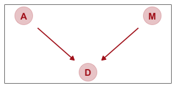
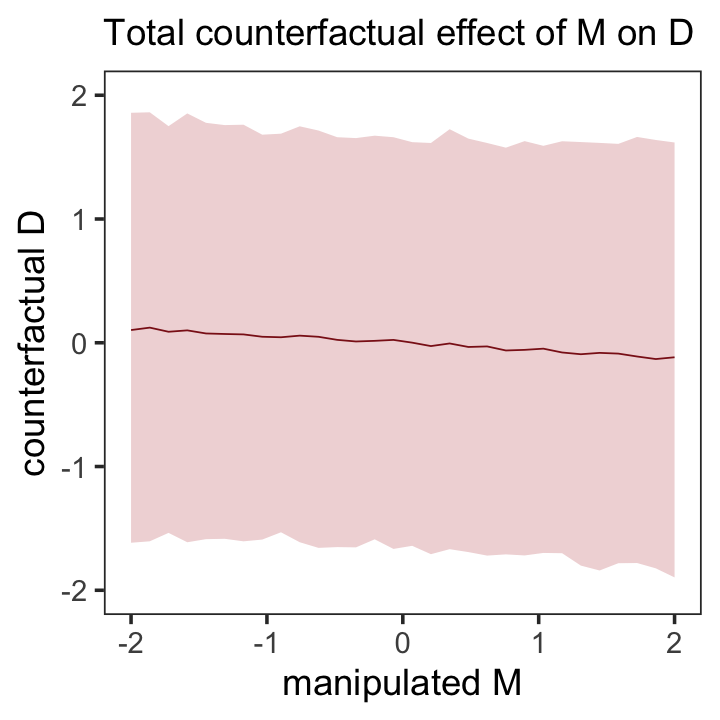
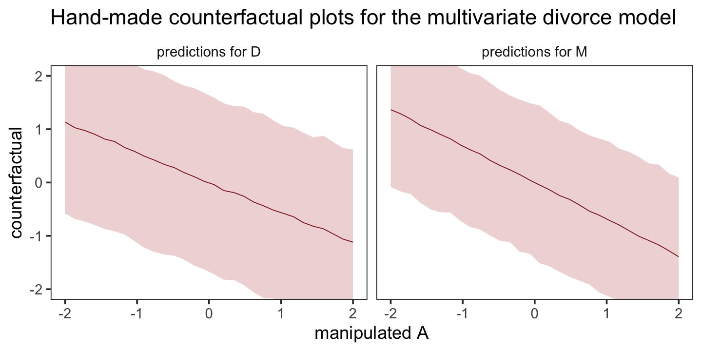
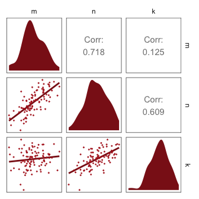
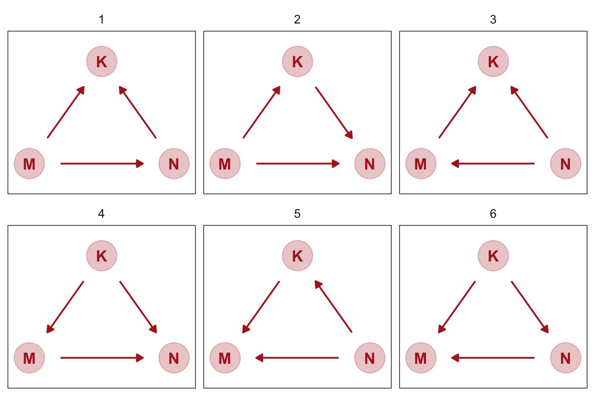
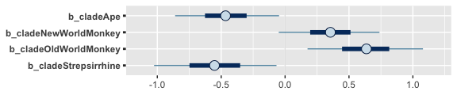
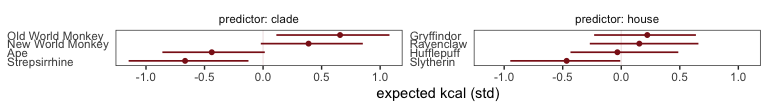
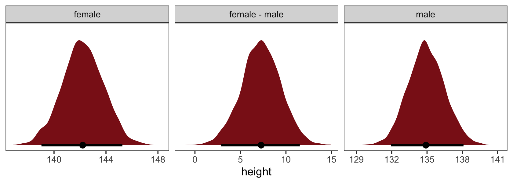
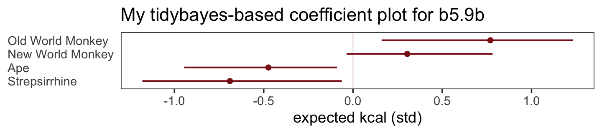

# The Many Variables & The Spurious Waffles

> Correlation in general is not surprising. In large data sets, every pair of variables has a statistically discernible non-zero correlation. But since most correlations do not indicate causal relationships, we need tools for distinguishing mere association from evidence of causation. This is why so much effort is devoted to **multiple regression**, using more than one predictor variable to simultaneously model an outcome. [@mcelreathStatisticalRethinkingBayesian2020, p. 123, **emphasis** in the original]

In his endnote #80 (p. 562), McElreath wrote: "See @meehlWhySummariesResearch1990, in particular the 'crud factor' described on page 204." For a fun look at some dubious correlations, check out the examples at [https://www.tylervigen.com/spurious-correlations](https://www.tylervigen.com/spurious-correlations).

But back to the text, McElreath's listed reasons for multivariable regression include:

* statistical control for confounds
* multiple/complex causation
* interactions

We'll approach the first two in this chapter. Interactions are reserved for [Chapter 7][Ulysses' Compass].

#### Rethinking: Causal inference.

"Despite its central importance, there is no unified approach to causal inference yet in the sciences" (p. 124).  To dip into the topic, you might check out the recent blog post by Finn Lattimore and David Rohde, [*Causal inference with Bayes rule*](https://gradientinstitute.org/blog/6/).

## Spurious associations

Load the [Waffle House](https://www.snopes.com/fact-check/fema-waffle-house-index/) data.


```r
library(tidyverse)

data(WaffleDivorce, package = "rethinking")
d <- WaffleDivorce
```

Did you notice how we used the `package` argument within the `data()` function, there? That allowed us to load the `WaffleDivorce` without actually loading the **rethinking** package. Since we generally don't want to have both **rethinking** and **brms** loaded up at the same time, using the `package` function will save us a line of code.

Now standardize the focal variables with the `rethinking::standardize()` function.


```r
d <-
  d %>% 
  mutate(d = rethinking::standardize(Divorce),
         m = rethinking::standardize(Marriage),
         a = rethinking::standardize(MedianAgeMarriage))
```

Because we avoided directly loading the **rethinking** package, we did not have immediate access to McElreath's handy `standardize()` function. If you want to use a function from a package without loading that package, you can use the double colon operator `::`. You can learn more about the double colon operator [here](https://stat.ethz.ch/R-manual/R-devel/library/base/html/ns-dblcolon.html). Now load **brms**.


```r
rm(WaffleDivorce)
library(brms)
```

I'm not going to show the output, but you might go ahead and investigate the data with the typical functions. E.g.,


```r
head(d)
glimpse(d)
```

Now we have our data, we can reproduce Figure 5.1. One convenient way to get the handful of sate labels into the plot was with the `geom_text_repel()` function from the [**ggrepel** package](https://CRAN.R-project.org/package=ggrepel) [@R-ggrepel]. But first, we spent the last few chapters warming up with **ggplot2**. Going forward, each chapter will have its own plot theme. In this chapter, we’ll characterize the plots with `theme_bw() + theme(panel.grid = element_rect())` and coloring based off of `"firebrick"`.


```r
# install.packages("ggrepel", depencencies = T)
library(ggrepel)

d %>%
  ggplot(aes(x = WaffleHouses/Population, y = Divorce)) +
  stat_smooth(method = "lm", fullrange = T, size = 1/2,
              color = "firebrick4", fill = "firebrick", alpha = 1/5) +
  geom_point(size = 1.5, color = "firebrick4", alpha = 1/2) +
  geom_text_repel(data = d %>% filter(Loc %in% c("ME", "OK", "AR", "AL", "GA", "SC", "NJ")),  
                  aes(label = Loc), 
                  size = 3, seed = 1042) +  # this makes it reproducible
  scale_x_continuous("Waffle Houses per million", limits = c(0, 55)) +
  ylab("Divorce rate") +
  coord_cartesian(xlim = c(0, 50), ylim = c(5, 15)) +
  theme_bw() +
  theme(panel.grid = element_blank())
```


Since these are geographically-based data, we might plot our three major variables in a map format. The [**urbnmapr** package](https://github.com/UrbanInstitute/urbnmapr) [@R-urbnmapr] provides latitude and longitude data for the 50 states and the `geom_sf()` function for plotting them. We'll use the `left_join()` function to combine those data with our primary data `d`.


```r
# devtools::install_github("UrbanInstitute/urbnmapr")
library(urbnmapr)

left_join(
  # get the map data
  get_urbn_map(map = "states", sf = TRUE),
  # add the primary data
  d %>% 
    mutate(state_name = Location %>% as.character()) %>% 
    select(d:a, state_name),
  by = "state_name"
) %>%
  # convert to the long format for faceting
  pivot_longer(d:a) %>% 
  
  # plot!
  ggplot() +
  geom_sf(aes(fill = value, geometry = geometry),
          size = 0) +
  scale_fill_gradient(low = "#f8eaea", high = "firebrick4") +
  theme_void() +
  theme(legend.position = "none",
        strip.text = element_text(margin = margin(0, 0, .5, 0))) +
  facet_wrap(~name) 
```


One of the advantages of this visualization method is it just became clear that Nevada is missing from the WaffleDivorce data. Execute `d %>% distinct(Location)` to see for yourself and click [here](https://github.com/rmcelreath/rethinking/issues/62) to find out why it's missing. Those missing data should motivate the skills we'll cover in Chapter 15. But let's get back on track.

Here's the standard deviation for `MedianAgeMarriage` in its current metric.


```r
sd(d$MedianAgeMarriage)
```

```
## [1] 1.24363
```


Our first statistical model follows the form

\begin{align*}
\text{divorce_std}_i & \sim \operatorname{Normal}(\mu_i, \sigma) \\
\mu_i   & = \alpha + \beta_1 \text{median_age_at_marriage_std}_i \\
\alpha  & \sim \operatorname{Normal}(0, 0.2) \\
\beta_1 & \sim \operatorname{Normal}(0, 0.5) \\
\sigma  & \sim \operatorname{Exponential}(1),
\end{align*}

where the `_std` suffix indicates the variables are standardized (i.e., zero centered, with a standard deviation of one). Let's fit the first univariable model.


```r
b5.1 <- 
  brm(data = d, 
      family = gaussian,
      d ~ 1 + a,
      prior = c(prior(normal(0, 0.2), class = Intercept),
                prior(normal(0, 0.5), class = b),
                prior(exponential(1), class = sigma)),
      iter = 2000, warmup = 1000, chains = 4, cores = 4,
      seed = 5,
      sample_prior = T,
      file = "fits/b05.01")
```

Did you notice the `sample_prior = T` line? This told **brms** to take draws from both the posterior distribution (as usual) and from the prior predictive distribution. If you look at McElreath's **R** code 5.4, you'll see he plotted 50 draws from the prior predictive distribution of his `m5.1`. For our **brms** workflow, our first step is the extract our prior draws with `prior_samples()`.


```r
prior <- prior_samples(b5.1)

prior %>% glimpse()
```

```
## Rows: 4,000
## Columns: 3
## $ Intercept <dbl> 0.262235852, 0.435592131, -0.294742095, -0.007232040, 0.058308258, 0.050358902,…
## $ b         <dbl> 0.01116464, -0.18996254, 0.43071360, -0.60435682, -0.31401810, 0.22439532, -0.0…
## $ sigma     <dbl> 2.20380842, 0.57847121, 1.00816092, 2.94427170, 0.30736807, 0.94694471, 0.66062…
```

We ended up with 4,000 draws from the prior predictive distribution, much like `posterior_samples()` would return 4,000 draws from the posterior. Next we'll use `sample_n()` to take a ransom sample from our `prior` object. After just a little more wrangling, we’ll be in good shape to plot our version of Figure 5.3.


```r
set.seed(5)

prior %>% 
  sample_n(size = 50) %>% 
  rownames_to_column("draw") %>% 
  expand(nesting(draw, Intercept, b),
         a = c(-2, 2)) %>% 
  mutate(d = Intercept + b * a) %>% 
  
  ggplot(aes(x = a, y = d)) +
  geom_line(aes(group = draw),
            color = "firebrick", alpha = .4) +
  labs(x = "Median age marriage (std)",
       y = "Divorce rate (std)") +
  coord_cartesian(ylim = c(-2, 2)) +
  theme_bw() +
  theme(panel.grid = element_blank()) 
```


To get the posterior predictions from our **brms** model, we'll use `fitted()` in place of `link()`.


```r
# determine the range of `a` values we'd like to feed into `fitted()`
nd <- tibble(a = seq(from = -3, to = 3.2, length.out = 30))

# now use `fitted()` to get the model-implied trajectories
fitted(b5.1,
       newdata = nd) %>% 
  data.frame() %>% 
  bind_cols(nd) %>% 
  
  # plot
  ggplot(aes(x = a)) +
  geom_smooth(aes(y = Estimate, ymin = Q2.5, ymax = Q97.5),
              stat = "identity",
              fill = "firebrick", color = "firebrick4", alpha = 1/5, size = 1/4) +
  geom_point(data = d, 
             aes(y = d), 
             size = 2, color = "firebrick4") +
  labs(x = "Median age marriage (std)",
       y = "Divorce rate (std)") +
  coord_cartesian(xlim = range(d$a), 
                  ylim = range(d$d)) +
  theme_bw() +
  theme(panel.grid = element_blank()) 
```


That'll serve as our version of the right panel of Figure 5.2. To paraphrase McElreath, "if you inspect the [`print()`] output, you’ll see that posterior for $[\beta_\text{a}]$ is reliably negative" (p. 127). Let's see.


```r
print(b5.1)
```

```
##  Family: gaussian 
##   Links: mu = identity; sigma = identity 
## Formula: d ~ 1 + a 
##    Data: d (Number of observations: 50) 
## Samples: 4 chains, each with iter = 2000; warmup = 1000; thin = 1;
##          total post-warmup samples = 4000
## 
## Population-Level Effects: 
##           Estimate Est.Error l-95% CI u-95% CI Rhat Bulk_ESS Tail_ESS
## Intercept    -0.00      0.10    -0.19     0.19 1.00     3996     2866
## a            -0.57      0.11    -0.79    -0.34 1.00     3262     2655
## 
## Family Specific Parameters: 
##       Estimate Est.Error l-95% CI u-95% CI Rhat Bulk_ESS Tail_ESS
## sigma     0.82      0.09     0.68     1.01 1.00     3512     2309
## 
## Samples were drawn using sampling(NUTS). For each parameter, Bulk_ESS
## and Tail_ESS are effective sample size measures, and Rhat is the potential
## scale reduction factor on split chains (at convergence, Rhat = 1).
```

On the standardized scale, -0.57 95% CI [-0.79, -0.34] is pretty negative, indeed.

We're ready to fit our second univariable model.


```r
b5.2 <- 
  brm(data = d, 
      family = gaussian,
      d ~ 1 + m,
      prior = c(prior(normal(0, 0.2), class = Intercept),
                prior(normal(0, 0.5), class = b),
                prior(exponential(1), class = sigma)),
      iter = 2000, warmup = 1000, chains = 4, cores = 4,
      seed = 5,
      file = "fits/b05.02")
```

The summary suggests $\beta_\text{m}$ is of a smaller magnitude.


```r
print(b5.2)
```

```
##  Family: gaussian 
##   Links: mu = identity; sigma = identity 
## Formula: d ~ 1 + m 
##    Data: d (Number of observations: 50) 
## Samples: 4 chains, each with iter = 2000; warmup = 1000; thin = 1;
##          total post-warmup samples = 4000
## 
## Population-Level Effects: 
##           Estimate Est.Error l-95% CI u-95% CI Rhat Bulk_ESS Tail_ESS
## Intercept    -0.00      0.11    -0.22     0.22 1.00     4140     3154
## m             0.35      0.13     0.09     0.61 1.00     3307     2899
## 
## Family Specific Parameters: 
##       Estimate Est.Error l-95% CI u-95% CI Rhat Bulk_ESS Tail_ESS
## sigma     0.95      0.10     0.79     1.17 1.00     4091     2703
## 
## Samples were drawn using sampling(NUTS). For each parameter, Bulk_ESS
## and Tail_ESS are effective sample size measures, and Rhat is the potential
## scale reduction factor on split chains (at convergence, Rhat = 1).
```

Now we'll wangle and plot our version of the left panel in Figure 5.2.


```r
nd <- tibble(m = seq(from = -2.5, to = 3.5, length.out = 30))

fitted(b5.2, newdata = nd) %>%
  data.frame() %>%
  bind_cols(nd) %>% 
  
  ggplot(aes(x = m)) +
  geom_smooth(aes(y = Estimate, ymin = Q2.5, ymax = Q97.5),
              stat = "identity",
              fill = "firebrick", color = "firebrick4", alpha = 1/5, size = 1/4) +
  geom_point(data = d, 
             aes(y = d), 
             size = 2, color = "firebrick4") +
  labs(x = "Marriage rate (std)",
       y = "Divorce rate (std)") +
  coord_cartesian(xlim = range(d$m), 
                  ylim = range(d$d)) +
  theme_bw() +
  theme(panel.grid = element_blank())                   
```


> But merely comparing parameter means between different bivariate regressions is no way to decide which predictor is better. Both of these predictors could provide independent value, or they could be redundant, or one could eliminate the value of the other.
>
> To make sense of this, we're going to have to think causally. And then, only after we've done some thinking, a bigger regression model that includes both age at marriage and marriage rate will help us. (pp. 127--128)

### Think before you regress.

> It is helpful to introduce a particular type of causal graph known as a **DAG**, short for **directed acyclic graph**. *Graph* means it is nodes and connections. *Directed* means the connections have arrows that indicate directions of causal influence. And *acyclic* means that causes do not eventually flow back on themselves. A DAG is a way of describing qualitative causal relationships among variables. It isn't as detailed as a full model description, but it contains information that a purely statistical model does not. Unlike a statistical model, a DAG will tell you the consequences of intervening to change a variable. But only if the DAG is correct. There is no inference without assumption. (p. 128, **emphasis** in the original)

If you're interested in making directed acyclic graphs (DAG) in **R**, the [**dagitty**](https://CRAN.R-project.org/package=dagitty) [@R-dagitty] and [**ggdag**](https://CRAN.R-project.org/package=ggdag) [@R-ggdag] packages are handy. Our approach will focus on **ggdag**.


```r
# install.packages("dagitty", dependencies = T)
# install.packages("ggdag", dependencies = T)
# library(dagitty)
library(ggdag)
```

If all you want is a quick and dirty DAG for our three variables, you can execute something like this.


```r
set.seed(5)

dagify(M ~ A,
       D ~ A + M) %>%
  ggdag(node_size = 8)
```


We can pretty it up a little, too.


```r
dag_coords <-
  tibble(name = c("A", "M", "D"),
         x    = c(1, 3, 2),
         y    = c(2, 2, 1))

p1 <-
  dagify(M ~ A,
       D ~ A + M,
       coords = dag_coords) %>%
  
  ggplot(aes(x = x, y = y, xend = xend, yend = yend)) +
  geom_dag_point(color = "firebrick", alpha = 1/4, size = 10) +
  geom_dag_text(color = "firebrick") +
  geom_dag_edges(edge_color = "firebrick") +
  scale_x_continuous(NULL, breaks = NULL, expand = c(.1, .1)) +
  scale_y_continuous(NULL, breaks = NULL, expand = c(.1, .1)) +
  theme_bw() +
  theme(panel.grid = element_blank())

p1
```


We could have left out the `coords` argument and let the `dagify()` function set the layout of the nodes on its own. But since we were picky and wanted to ape McElreath, we first specified our coordinates in a tibble and then included that tibble in the `coords` argument. For more on the topic, check out the Barrett's [-@barrettAnIntroduction2020] vignette, [*An Introduction to ggdag*](https://CRAN.R-project.org/package=ggdag/vignettes/intro-to-ggdag.html).

Buy anyway, our DAG

> represents a heuristic causal model. Like other models, it is an analytical assumption. The symbols $A$, $M$, and $D$ are our observed variables. The arrows show directions of influence. What this DAG says is:
>
> 1. $A$ directly influences $D$
> 2. $M$ directly influences $D$
> 3. $A$ directly influences $M$
>
> These statements can then have further implications. In this case, age of marriage influences divorce in two ways. First it has a direct effect, $A \rightarrow D$. Perhaps a direct effect would arise because younger people change faster than older people and are therefore more likely to grow incompatible with a partner. Second, it has an indirect effect by influencing the marriage rate, which then influences divorce, $A \rightarrow M \rightarrow D$. If people get married earlier, then the marriage rate may rise, because there are more young people. (p. 128)

Considering alternative models, "It could be that the association between $M$ and $D$ arises entirely from $A$'s influence on both $M$ and $D$. Like this:" (p. 129)


```r
p2 <-
  dagify(M ~ A,
         D ~ A,
         coords = dag_coords) %>%
  
  ggplot(aes(x = x, y = y, xend = xend, yend = yend)) +
  geom_dag_point(color = "firebrick", alpha = 1/4, size = 10) +
  geom_dag_text(color = "firebrick") +
  geom_dag_edges(edge_color = "firebrick") +
  scale_x_continuous(NULL, breaks = NULL, expand = c(.1, .1)) +
  scale_y_continuous(NULL, breaks = NULL, expand = c(.1, .1)) +
  theme_bw() +
  theme(panel.grid = element_blank()) 

p2
```


> This DAG is also consistent with the posterior distributions of models [`b5.1`] and [`b5.2`]. Why? Because both $M$ and $D$ "listen" to $A$. They have information from $A$. So when you inspect the association between $D$ and $M$, you pick up that common information that they both got from listening to $A$. You’ll see a more formal way to deduce this, in the next chapter.
>
> So which is it? Is there a direct effect of marriage rate, or rather is age at marriage just driving both, creating a spurious correlation between marriage rate and divorce rate? To find out, we need to consider carefully what each DAG implies. That's what's next. (p. 129)

#### Rethinking: What's a cause? 

> Questions of causation can become bogged down in philosophical debates. These debates are worth having. But they don’t usually intersect with statistical concerns. Knowing a cause in statistics means being able to correctly predict the consequences of an intervention. There are contexts in which even this is complicated. (p. 129)

### Testable implications.

So far, we have entertained two DAGs. Here we use **patchwork** to combine them into one plot.


```r
library(patchwork)

p1 | p2
```


McElreath encouraged us to examine the correlations among these three variables with `cor()`.


```r
d %>% 
  select(d:a) %>% 
  cor()
```

```
##            d          m          a
## d  1.0000000  0.3737314 -0.5972392
## m  0.3737314  1.0000000 -0.7210960
## a -0.5972392 -0.7210960  1.0000000
```

If you just want the lower triangle, you can use the `lowerCor()` function from the [**psych** package](https://CRAN.R-project.org/package=psych) [@R-psych]. 


```r
library(psych)

d %>% 
  select(d:a) %>% 
  lowerCor(digits = 3)
```

```
##   d      m      a     
## d  1.000              
## m  0.374  1.000       
## a -0.597 -0.721  1.000
```

Our second DAG, above, suggests "that $D$ is independent of $M$, conditional on $A$" (p. 130). We can use the `dagitty::impliedConditionalIndependencies()` function to express that conditional independence in formal notation.


```r
library(dagitty)

dagitty('dag{ D <- A -> M }') %>% 
  impliedConditionalIndependencies()
```

```
## D _||_ M | A
```

The lack of conditional dependencies in the first DAG may be expressed this way.


```r
dagitty('dag{D <- A -> M -> D}') %>% 
  impliedConditionalIndependencies()
```

Okay, that was a bit of a tease. "There are no conditional independencies, so there is no output to display" (p. 131). To close out this section,

> once you fit a multiple regression to predict divorce using both marriage rate and age at marriage, the model addresses the questions:
>
> 1. After I already know marriage rate, what additional value is there in also knowing age at marriage?
> 2. After I already know age at marriage, what additional value is there in also knowing marriage rate?
>
> The parameter estimates corresponding to each predictor are the (often opaque) answers to these questions. The questions above are descriptive, and the answers are also descriptive. It is only the derivation of the testable implications above that gives these descriptive results a causal meaning. But that meaning is still dependent upon believing the DAG. (p. 131)

### Multiple regression notation.

We can write the statistical formula for our first multivariable model as

\begin{align*}
\text{Divorce_std}_i & \sim \operatorname{Normal}(\mu_i, \sigma) \\
\mu_i   & = \alpha + \beta_1 \text{Marriage_std}_i + \beta_2 \text{MedianAgeMarriage_std}_i \\
\alpha  & \sim \operatorname{Normal}(0, 0.2) \\
\beta_1 & \sim \operatorname{Normal}(0, 0.5) \\
\beta_2 & \sim \operatorname{Normal}(0, 0.5) \\
\sigma  & \sim \operatorname{Exponential}(1).
\end{align*}

### Approximating the posterior.

Much like we used the `+` operator to add single predictors to the intercept, we just use more `+` operators in the `formula` argument to add more predictors. Also notice we're using the same prior `prior(normal(0, 1), class = b)` for both predictors. Within the **brms** framework, they are both of `class = b`. But if we wanted their priors to differ, we'd make two `prior()` statements and differentiate them with the `coef` argument. You'll see examples of that later on.
      

```r
b5.3 <- 
  brm(data = d, 
      family = gaussian,
      d ~ 1 + m + a,
      prior = c(prior(normal(0, 0.2), class = Intercept),
                prior(normal(0, 0.5), class = b),
                prior(exponential(1), class = sigma)),
      iter = 2000, warmup = 1000, chains = 4, cores = 4,
      seed = 5,
      file = "fits/b05.03")
```

Behold the summary.


```r
print(b5.3)
```

```
##  Family: gaussian 
##   Links: mu = identity; sigma = identity 
## Formula: d ~ 1 + m + a 
##    Data: d (Number of observations: 50) 
## Samples: 4 chains, each with iter = 2000; warmup = 1000; thin = 1;
##          total post-warmup samples = 4000
## 
## Population-Level Effects: 
##           Estimate Est.Error l-95% CI u-95% CI Rhat Bulk_ESS Tail_ESS
## Intercept    -0.00      0.10    -0.19     0.20 1.00     4036     2610
## m            -0.06      0.16    -0.37     0.25 1.00     2532     2536
## a            -0.61      0.16    -0.91    -0.30 1.00     2522     2486
## 
## Family Specific Parameters: 
##       Estimate Est.Error l-95% CI u-95% CI Rhat Bulk_ESS Tail_ESS
## sigma     0.83      0.09     0.68     1.02 1.00     3601     2653
## 
## Samples were drawn using sampling(NUTS). For each parameter, Bulk_ESS
## and Tail_ESS are effective sample size measures, and Rhat is the potential
## scale reduction factor on split chains (at convergence, Rhat = 1).
```

The **brms** package doesn't have a convenience function like `rethinking::coeftab()`. However, we can make something similar with a little deft wrangling and **ggplot2** code.


```r
# first, extract and rename the necessary posterior parameters
bind_cols(
  posterior_samples(b5.1) %>% 
    transmute(`b5.1_beta[A]` = b_a),
  posterior_samples(b5.2) %>% 
    transmute(`b5.2_beta[M]` = b_m),
  posterior_samples(b5.3) %>% 
    transmute(`b5.3_beta[M]` = b_m,
              `b5.3_beta[A]` = b_a)
  ) %>% 
  # convert them to the long format, group, and get the posterior summaries
  pivot_longer(everything()) %>% 
  group_by(name) %>% 
  summarise(mean = mean(value),
            ll   = quantile(value, prob = .025),
            ul   = quantile(value, prob = .975)) %>% 
  # since the `key` variable is really two variables in one, here we split them up
  separate(name, into = c("fit", "parameter"), sep = "_") %>% 
  
  # plot!
  ggplot(aes(x = mean, xmin = ll, xmax = ul, y = fit)) +
  geom_vline(xintercept = 0, color = "firebrick", alpha = 1/5) +
  geom_pointrange(color = "firebrick") +
  labs(x = "posterior", y = NULL) +
  theme_bw() +
  theme(panel.grid = element_blank(),
        strip.background = element_rect(fill = "transparent", color = "transparent")) +
  facet_wrap(~parameter, ncol = 1, labeller = label_parsed)
```


Don't worry, coefficient plots won't always be this complicated. We'll walk out simpler ones toward the end of the chapter.

The substantive interpretation of all those coefficients is: "*Once we know median age at marriage for a State, there is little or no additional predictive power in also knowing the rate of marriage in that State*" (p. 134, *emphasis* in the original). This coheres well with one of our `impliedConditionalIndependencies()` statements, from above.


```r
dagitty('dag{ D <- A -> M }') %>% 
  impliedConditionalIndependencies()
```

```
## D _||_ M | A
```

#### Overthinking: Simulating the divorce example.

Okay, let's simulate our divorce data in a **tidyverse** sort of way.


```r
# how many states would you like?
n <- 50 

set.seed(5)
sim_d <-
  tibble(age = rnorm(n, mean = 0, sd = 1)) %>%  # sim A 
  mutate(mar = rnorm(n, mean = -age, sd = 1),   # sim A -> M 
         div = rnorm(n, mean =  age, sd = 1))   # sim A -> D

head(sim_d)
```

```
## # A tibble: 6 x 3
##       age    mar    div
##     <dbl>  <dbl>  <dbl>
## 1 -0.841   2.30  -2.84 
## 2  1.38   -1.20   2.52 
## 3 -1.26    2.28  -0.580
## 4  0.0701 -0.662  0.279
## 5  1.71   -1.82   1.65 
## 6 -0.603  -0.322  0.291
```

We simulated those data based on this formulation.


```r
dagitty('dag{divorce <- age -> marriage}') %>% 
  impliedConditionalIndependencies()
```

```
## divorce _||_ marriage | age
```

Here are the quick `pairs()` plots.


```r
pairs(sim_d, col = "firebrick4")
```


If we use the `update()` function, we can refit the last models in haste.


```r
b5.1_sim <- 
  update(b5.1, 
         newdata = sim_d, 
         formula = div ~ 1 + age,
         seed = 5,
         file = "fits/b05.01_sim")

b5.2_sim <- 
  update(b5.2, 
         newdata = sim_d, 
         formula = div ~ 1 + mar,
         seed = 5,
         file = "fits/b05.02_sim")
      
 b5.3_sim <- 
  update(b5.3, 
         newdata = sim_d,
         formula = div ~ 1 + mar + age,
         seed = 5,
         file = "fits/b05.03_sim")
```

The steps for our homemade `coefplot()` plot are basically the same. Just switch out some of the names.


```r
bind_cols(
  posterior_samples(b5.1_sim) %>% 
    transmute(`b5.1_beta[A]` = b_age),
  posterior_samples(b5.2_sim) %>% 
    transmute(`b5.2_beta[M]` = b_mar),
  posterior_samples(b5.3_sim) %>% 
    transmute(`b5.3_beta[M]` = b_mar,
              `b5.3_beta[A]` = b_age)
  ) %>% 
  pivot_longer(everything()) %>% 
  group_by(name) %>% 
  summarise(mean = mean(value),
            ll   = quantile(value, prob = .025),
            ul   = quantile(value, prob = .975)) %>% 
  # since the `key` variable is really two variables in one, here we split them up
  separate(name, into = c("fit", "parameter"), sep = "_") %>% 
  
  # plot!
  ggplot(aes(x = mean, xmin = ll, xmax = ul, y = fit)) +
  geom_vline(xintercept = 0, color = "firebrick", alpha = 1/5) +
  geom_pointrange(color = "firebrick") +
  labs(x = "posterior", y = NULL) +
  theme_bw() +
  theme(panel.grid = element_blank(),
        strip.background = element_blank()) +
  facet_wrap(~parameter, ncol = 1, labeller = label_parsed)
```


Well, okay. This is the same basic pattern, but with the signs switched and with a little simulation variability thrown in. But you get the picture.

### Plotting multivariate posteriors.

"Let's pause for a moment, before moving on. There are a lot of moving parts here: three variables, some strange DAGs, and three models. If you feel at all confused, it is only because you are paying attention" (p. 133).

Preach, brother.

Down a little further, McElreath gave us this deflationary delight: "There is a huge literature detailing a variety of plotting techniques that all attempt to help one understand multiple linear regression. None of these techniques is suitable for all jobs, and most do not generalize beyond linear regression" (pp. 134--135). Now you're inspired, let's learn three:

* predictor residual plots
* posterior prediction plots
* counterfactual plots

#### Predictor residual plots.

To get ready to make our residual plots, we'll predict  one predictor, `m`, with another one, `a`.


```r
b5.4 <- 
  brm(data = d, 
      family = gaussian,
      m ~ 1 + a,
      prior = c(prior(normal(0, 0.2), class = Intercept),
                prior(normal(0, 0.5), class = b),
                prior(exponential(1), class = sigma)),
      iter = 2000, warmup = 1000, chains = 4, cores = 4,
      seed = 5,
      file = "fits/b05.04")
```


```r
print(b5.4)
```

```
##  Family: gaussian 
##   Links: mu = identity; sigma = identity 
## Formula: m ~ 1 + a 
##    Data: d (Number of observations: 50) 
## Samples: 4 chains, each with iter = 2000; warmup = 1000; thin = 1;
##          total post-warmup samples = 4000
## 
## Population-Level Effects: 
##           Estimate Est.Error l-95% CI u-95% CI Rhat Bulk_ESS Tail_ESS
## Intercept    -0.00      0.09    -0.18     0.18 1.00     3699     3022
## a            -0.69      0.10    -0.89    -0.50 1.00     3628     2808
## 
## Family Specific Parameters: 
##       Estimate Est.Error l-95% CI u-95% CI Rhat Bulk_ESS Tail_ESS
## sigma     0.71      0.07     0.59     0.87 1.00     3316     2683
## 
## Samples were drawn using sampling(NUTS). For each parameter, Bulk_ESS
## and Tail_ESS are effective sample size measures, and Rhat is the potential
## scale reduction factor on split chains (at convergence, Rhat = 1).
```

With `fitted()`, we compute the expected values for each state (with the exception of Nevada). Since the `a` values for each state are in the date we used to fit the model, we'll omit the `newdata` argument.


```r
f <- 
  fitted(b5.4) %>%
  data.frame() %>%
  bind_cols(d)

glimpse(f)
```

```
## Rows: 50
## Columns: 20
## $ Estimate          <dbl> 0.41910637, 0.47479957, 0.14064036, 0.97603837, -0.41629164, 0.19633356…
## $ Est.Error         <dbl> 0.10921357, 0.11410274, 0.09208704, 0.16994304, 0.10790150, 0.09434686,…
## $ Q2.5              <dbl> 0.20609178, 0.25056245, -0.04056262, 0.64629944, -0.62775040, 0.0123522…
## $ Q97.5             <dbl> 0.63362431, 0.69624957, 0.32271400, 1.30996611, -0.20523617, 0.38152568…
## $ Location          <fct> Alabama, Alaska, Arizona, Arkansas, California, Colorado, Connecticut, …
## $ Loc               <fct> AL, AK, AZ, AR, CA, CO, CT, DE, DC, FL, GA, HI, ID, IL, IN, IA, KS, KY,…
## $ Population        <dbl> 4.78, 0.71, 6.33, 2.92, 37.25, 5.03, 3.57, 0.90, 0.60, 18.80, 9.69, 1.3…
## $ MedianAgeMarriage <dbl> 25.3, 25.2, 25.8, 24.3, 26.8, 25.7, 27.6, 26.6, 29.7, 26.4, 25.9, 26.9,…
## $ Marriage          <dbl> 20.2, 26.0, 20.3, 26.4, 19.1, 23.5, 17.1, 23.1, 17.7, 17.0, 22.1, 24.9,…
## $ Marriage.SE       <dbl> 1.27, 2.93, 0.98, 1.70, 0.39, 1.24, 1.06, 2.89, 2.53, 0.58, 0.81, 2.54,…
## $ Divorce           <dbl> 12.7, 12.5, 10.8, 13.5, 8.0, 11.6, 6.7, 8.9, 6.3, 8.5, 11.5, 8.3, 7.7, …
## $ Divorce.SE        <dbl> 0.79, 2.05, 0.74, 1.22, 0.24, 0.94, 0.77, 1.39, 1.89, 0.32, 0.58, 1.27,…
## $ WaffleHouses      <int> 128, 0, 18, 41, 0, 11, 0, 3, 0, 133, 381, 0, 0, 2, 17, 0, 6, 64, 66, 0,…
## $ South             <int> 1, 0, 0, 1, 0, 0, 0, 0, 0, 1, 1, 0, 0, 0, 0, 0, 0, 1, 1, 0, 0, 0, 0, 0,…
## $ Slaves1860        <int> 435080, 0, 0, 111115, 0, 0, 0, 1798, 0, 61745, 462198, 0, 0, 0, 0, 0, 2…
## $ Population1860    <int> 964201, 0, 0, 435450, 379994, 34277, 460147, 112216, 75080, 140424, 105…
## $ PropSlaves1860    <dbl> 4.5e-01, 0.0e+00, 0.0e+00, 2.6e-01, 0.0e+00, 0.0e+00, 0.0e+00, 1.6e-02,…
## $ d                 <dbl> 1.6542053, 1.5443643, 0.6107159, 2.0935693, -0.9270579, 1.0500799, -1.6…
## $ m                 <dbl> 0.02264406, 1.54980162, 0.04897436, 1.65512283, -0.26698927, 0.89154405…
## $ a                 <dbl> -0.6062895, -0.6866993, -0.2042408, -1.4103870, 0.5998567, -0.2846505, …
```

After a little data processing, we can make the upper left panel of Figure 5.4.


```r
p1 <-
  f %>% 
  ggplot(aes(x = a, y = m)) +
  geom_point(size = 2, shape = 1, color = "firebrick4") +
  geom_segment(aes(xend = a, yend = Estimate), 
               size = 1/4) +
  geom_line(aes(y = Estimate), 
            color = "firebrick4") +
  geom_text_repel(data = . %>% filter(Loc %in% c("WY", "ND", "ME", "HI", "DC")),  
                  aes(label = Loc), 
                  size = 3, seed = 14) +
  labs(x = "Age at marriage (std)",
       y = "Marriage rate (std)") +
  coord_cartesian(ylim = range(d$m)) +
  theme_bw() +
  theme(panel.grid = element_blank()) 

p1
```


We get the residuals with the well-named `residuals()` function. Much like with `brms::fitted()`, `brms::residuals()` returns a four-vector matrix with the number of rows equal to the number of observations in the original data (by default, anyway). The vectors have the familiar names: `Estimate`, `Est.Error`, `Q2.5`, and `Q97.5`. See the [**brms** reference manual](https://CRAN.R-project.org/package=brms/brms.pdf) [@brms2020RM] for details.

With our residuals in hand, we just need a little more data processing to make lower left panel of Figure 5.4.


```r
r <- 
  residuals(b5.4) %>%
  # To use this in ggplot2, we need to make it a tibble or data frame
  as_tibble() %>% 
  bind_cols(d)

p3 <-
  r %>% 
  ggplot(aes(x = Estimate, y = d)) +
  stat_smooth(method = "lm", fullrange = T,
              color = "firebrick4", fill = "firebrick4", 
              alpha = 1/5, size = 1/2) +
  geom_vline(xintercept = 0, linetype = 2, color = "grey50") +
  geom_point(size = 2, color = "firebrick4", alpha = 2/3) +
  geom_text_repel(data = . %>% filter(Loc %in% c("WY", "ND", "ME", "HI", "DC")),  
                  aes(label = Loc), 
                  size = 3, seed = 5) +
  scale_x_continuous(limits = c(-2, 2)) +
  coord_cartesian(xlim = range(r$Estimate)) +
  labs(x = "Marriage rate residuals",
       y = "Divorce rate (std)") +
  theme_bw() +
  theme(panel.grid = element_blank())

p3
```


To get the `MedianAgeMarriage_s` residuals, we have to fit the corresponding model where `m` predicts `a`.


```r
b5.4b <- 
  brm(data = d, 
      family = gaussian,
      a ~ 1 + m,
      prior = c(prior(normal(0, 0.2), class = Intercept),
                prior(normal(0, 0.5), class = b),
                prior(exponential(1), class = sigma)),
      iter = 2000, warmup = 1000, chains = 4, cores = 4,
      seed = 5,
      file = "fits/b05.04b")
```

With `b5.4b` in hand, we're ready to make the upper right panel of Figure 5.4.


```r
p2 <-
  fitted(b5.4b) %>%
  data.frame() %>%
  bind_cols(d) %>% 
  
  ggplot(aes(x = m, y = a)) +
  geom_point(size = 2, shape = 1, color = "firebrick4") +
  geom_segment(aes(xend = m, yend = Estimate), 
               size = 1/4) +
  geom_line(aes(y = Estimate), 
            color = "firebrick4") +
  geom_text_repel(data = . %>% filter(Loc %in% c("DC", "HI", "ID")),  
                  aes(label = Loc), 
                  size = 3, seed = 5) +
  labs(x = "Marriage rate (std)",
       y = "Age at marriage (std)") +
  coord_cartesian(ylim = range(d$a)) +
  theme_bw() +
  theme(panel.grid = element_blank())   

p2
```


And now we'll get the new batch of residuals, do a little data processing, and make a plot corresponding to the final panel of Figure 5.4.


```r
r <-
  residuals(b5.4b) %>%
  data.frame() %>% 
  bind_cols(d)

p4 <-
  r %>%
  ggplot(aes(x = Estimate, y = d)) +
  stat_smooth(method = "lm", fullrange = T,
              color = "firebrick4", fill = "firebrick4", 
              alpha = 1/5, size = 1/2) +
  geom_vline(xintercept = 0, linetype = 2, color = "grey50") +
  geom_point(size = 2, color = "firebrick4", alpha = 2/3) +
  geom_text_repel(data = . %>% filter(Loc %in% c("ID", "HI", "DC")),  
                  aes(label = Loc), 
                  size = 3, seed = 5) +
  scale_x_continuous(limits = c(-2, 3)) +
  coord_cartesian(xlim = range(r$Estimate),
                  ylim = range(d$d)) +
  labs(x = "Age at marriage residuals",
       y = "Divorce rate (std)") +
  theme_bw() +
  theme(panel.grid = element_blank())

p4
```


Here we close out the section by combining our four subplots into one glorious whole with a little **patchwork** syntax.


```r
p1 + p2 + p3 + p4 + plot_annotation(title = "Understanding multiple regression through residuals")
```


##### Rethinking: Residuals are parameters, not data. 

> There is a tradition, especially in parts of biology, of using residuals from one model as data in another model. For example, a biologist might regress brain size on body size and then use the brain size residuals as data in another model. This procedure is always a mistake. Residuals are not known. They are parameters, variables with unobserved values. Treating them as known values throws away uncertainty. (p. 137)

Let's hammer this point home. Recall how `brms::residuals()` returns four columns: `Estimate`, `Est.Error`, `Q2.5`, and `Q97.5`.


```r
r %>% 
  glimpse()
```

```
## Rows: 50
## Columns: 20
## $ Estimate          <dbl> -0.58902924, 0.38776286, -0.16875288, -0.26301441, 0.41661319, 0.334121…
## $ Est.Error         <dbl> 0.08768933, 0.17676818, 0.08778774, 0.18591313, 0.09165187, 0.12435474,…
## $ Q2.5              <dbl> -0.75889766, 0.03461877, -0.33885619, -0.63501083, 0.23443209, 0.082321…
## $ Q97.5             <dbl> -0.4185013025, 0.7310140636, 0.0006765707, 0.0975187886, 0.5958362565, …
## $ Location          <fct> Alabama, Alaska, Arizona, Arkansas, California, Colorado, Connecticut, …
## $ Loc               <fct> AL, AK, AZ, AR, CA, CO, CT, DE, DC, FL, GA, HI, ID, IL, IN, IA, KS, KY,…
## $ Population        <dbl> 4.78, 0.71, 6.33, 2.92, 37.25, 5.03, 3.57, 0.90, 0.60, 18.80, 9.69, 1.3…
## $ MedianAgeMarriage <dbl> 25.3, 25.2, 25.8, 24.3, 26.8, 25.7, 27.6, 26.6, 29.7, 26.4, 25.9, 26.9,…
## $ Marriage          <dbl> 20.2, 26.0, 20.3, 26.4, 19.1, 23.5, 17.1, 23.1, 17.7, 17.0, 22.1, 24.9,…
## $ Marriage.SE       <dbl> 1.27, 2.93, 0.98, 1.70, 0.39, 1.24, 1.06, 2.89, 2.53, 0.58, 0.81, 2.54,…
## $ Divorce           <dbl> 12.7, 12.5, 10.8, 13.5, 8.0, 11.6, 6.7, 8.9, 6.3, 8.5, 11.5, 8.3, 7.7, …
## $ Divorce.SE        <dbl> 0.79, 2.05, 0.74, 1.22, 0.24, 0.94, 0.77, 1.39, 1.89, 0.32, 0.58, 1.27,…
## $ WaffleHouses      <int> 128, 0, 18, 41, 0, 11, 0, 3, 0, 133, 381, 0, 0, 2, 17, 0, 6, 64, 66, 0,…
## $ South             <int> 1, 0, 0, 1, 0, 0, 0, 0, 0, 1, 1, 0, 0, 0, 0, 0, 0, 1, 1, 0, 0, 0, 0, 0,…
## $ Slaves1860        <int> 435080, 0, 0, 111115, 0, 0, 0, 1798, 0, 61745, 462198, 0, 0, 0, 0, 0, 2…
## $ Population1860    <int> 964201, 0, 0, 435450, 379994, 34277, 460147, 112216, 75080, 140424, 105…
## $ PropSlaves1860    <dbl> 4.5e-01, 0.0e+00, 0.0e+00, 2.6e-01, 0.0e+00, 0.0e+00, 0.0e+00, 1.6e-02,…
## $ d                 <dbl> 1.6542053, 1.5443643, 0.6107159, 2.0935693, -0.9270579, 1.0500799, -1.6…
## $ m                 <dbl> 0.02264406, 1.54980162, 0.04897436, 1.65512283, -0.26698927, 0.89154405…
## $ a                 <dbl> -0.6062895, -0.6866993, -0.2042408, -1.4103870, 0.5998567, -0.2846505, …
```

In the residual plots from the lower two panels of Figure 5.4, we focused on the means of the residuals (i.e., `Estimate`). However, we can express the uncertainty in the residuals by including error bars for the 95% intervals. Here's what that might look like with a slight reworking of the lower right panel of Figure 5.4.


```r
r %>%
  ggplot(aes(x = Estimate, y = d)) +
  stat_smooth(method = "lm", fullrange = T,
              color = "firebrick4", fill = "firebrick4", 
              alpha = 1/5, size = 1/2) +
  geom_vline(xintercept = 0, linetype = 2, color = "grey50") +
  # the only change is here
  geom_pointrange(aes(xmin = Q2.5, xmax = Q97.5),
                  color = "firebrick4", alpha = 2/3) +
  geom_text_repel(data = . %>% filter(Loc %in% c("ID", "HI", "DC")),  
                  aes(label = Loc), 
                  size = 3, seed = 5) +
  scale_x_continuous(limits = c(-2, 3)) +
  coord_cartesian(xlim = range(r$Estimate),
                  ylim = range(d$d)) +
  labs(x = "Age at marriage residuals",
       y = "Divorce rate (std)") +
  theme_bw() +
  theme(panel.grid = element_blank())
```


Look at that. If you were to fit a follow-up model based on only the point estimates (posterior means) of those residuals, you'd be ignoring a lot of uncertainty.

#### Posterior prediction plots.

"It's important to check the model's implied predictions against the observed data" (p. 137). For more on the topic, check out Gabry and colleagues' [-@gabry2019visualization] [*Visualization in Bayesian workflow*](https://arxiv.org/abs/1709.01449) or Simpson's related blog post, [*Touch me, I want to feel your data*](http://andrewgelman.com/2017/09/07/touch-want-feel-data/).

The code below will make our version of Figure 5.5.


```r
fitted(b5.3) %>%
  data.frame() %>%
  # unstandardize the model predictions
  mutate_all(~. * sd(d$Divorce) + mean(d$Divorce)) %>% 
  bind_cols(d) %>%
  
  ggplot(aes(x = Divorce, y = Estimate)) +
  geom_abline(linetype = 2, color = "grey50", size = .5) +
  geom_point(size = 1.5, color = "firebrick4", alpha = 3/4) +
  geom_linerange(aes(ymin = Q2.5, ymax = Q97.5),
                 size = 1/4, color = "firebrick4") +
  geom_text(data = . %>% filter(Loc %in% c("ID", "UT", "RI", "ME")),
            aes(label = Loc), 
            hjust = 1, nudge_x = - 0.25) +
  labs(x = "Observed divorce", y = "Predicted divorce") +
  theme_bw() +
  theme(panel.grid = element_blank())
```


> It's easy to see from this arrangement of the simulations that the model under-predicts for States with very high divorce rates while it over-predicts for States with very low divorce rates. That's normal. This is what regression does--it is skeptical of extreme values, so it expects regression towards the mean. But beyond this general regression to the mean, some States are very frustrating to the model, lying very far from the diagonal. (p. 139)

##### Rethinking: Stats, huh, yeah what is it good for?

> Often people want statistical modeling to do things that statistical modeling cannot do. For example, we'd like to know whether an effect is "real" or rather spurious. Unfortunately, modeling merely quantifies uncertainty in the precise way that the model understands the problem. Usually answers to large world questions about truth and causation depend upon information not included in the model. For example, any observed correlation between an outcome and predictor could be eliminated or reversed once another predictor is added to the model. But if we cannot think of the right variable, we might never notice. Therefore all statistical models are vulnerable to and demand critique, regardless of the precision of their estimates and apparent accuracy of their predictions. (p. 139)

##### Overthinking: Simulating spurious association.


```r
n <- 100                             # number of cases

set.seed(5)                          # setting the seed makes the results reproducible
d_spur <- 
  tibble(x_real = rnorm(n),          # x_real as Gaussian with mean 0 and SD 1 (i.e., the defaults)
         x_spur = rnorm(n, x_real),  # x_spur as Gaussian with mean = x_real
         y =      rnorm(n, x_real))  # y as Gaussian with mean = x_real
```

Here are the quick `pairs()` plots. 


```r
pairs(d_spur, col = "firebrick4")
```


We may as well fit and evaluate a model.


```r
b5.0_spur <-
  brm(data = d_spur, 
      family = gaussian,
      y ~ 1 + x_real + x_spur,
      prior = c(prior(normal(0, 0.2), class = Intercept),
                prior(normal(0, 0.5), class = b),
                prior(exponential(1), class = sigma)),
      iter = 2000, warmup = 1000, chains = 4, cores = 4,
      seed = 5,
      file = "fits/b05.00_spur")
```


```r
fixef(b5.0_spur) %>% 
  round(digits = 2)
```

```
##           Estimate Est.Error  Q2.5 Q97.5
## Intercept    -0.01      0.09 -0.18  0.17
## x_real        0.93      0.14  0.65  1.20
## x_spur        0.08      0.09 -0.09  0.26
```

If we let "r" stand for `x_rel` and "s" stand for `x_spur`, here's how we might depict that our simulation in a DAG.


```r
dag_coords <-
  tibble(name = c("r", "s", "y"),
         x    = c(1, 3, 2),
         y    = c(2, 2, 1))

dagify(s ~ r,
       y ~ r,
       coords = dag_coords) %>%
  
  ggplot(aes(x = x, y = y, xend = xend, yend = yend)) +
  geom_dag_point(color = "firebrick", alpha = 1/4, size = 10) +
  geom_dag_text(color = "firebrick") +
  geom_dag_edges(edge_color = "firebrick") +
  scale_x_continuous(NULL, breaks = NULL, expand = c(.1, .1)) +
  scale_y_continuous(NULL, breaks = NULL, expand = c(.1, .1)) +
  theme_bw() +
  theme(panel.grid = element_blank()) 
```


#### Counterfactual plots.

> A second sort of inferential plot displays the causal implications of the model. I call these plots **counterfactual**, because they can be produced for any values of the predictor variables you like, even unobserved combinations like very high median age of marriage and very high marriage rate. There are no States with this combination, but in a counterfactual plot, you can ask the model for a prediction for such a State. (p. 140, **emphasis** in the original)

Take another look at one of the DAGs from back in Section 5.1.2.


```r
dag_coords <-
  tibble(name = c("A", "M", "D"),
         x    = c(1, 3, 2),
         y    = c(2, 2, 1))

dagify(M ~ A,
       D ~ A + M,
       coords = dag_coords) %>%
  
  ggplot(aes(x = x, y = y, xend = xend, yend = yend)) +
  geom_dag_point(color = "firebrick", alpha = 1/4, size = 10) +
  geom_dag_text(color = "firebrick") +
  geom_dag_edges(edge_color = "firebrick") +
  scale_x_continuous(NULL, breaks = NULL, expand = c(.1, .1)) +
  scale_y_continuous(NULL, breaks = NULL, expand = c(.1, .1)) +
  theme_bw() +
  theme(panel.grid = element_blank())
```


The full statistical model implied in this DAG requires we have two criterion variables, $D$ and $M$. To simultaneously model the effects of $A$ on $M$ and $D$ AND the effects of $A$ on $M$ with **brms**, we'll need to invoke the multivariate syntax. There are several ways to do this with **brms**, which Bürkner outlines in his [-@Bürkner2020Multivariate] vignette, [*Estimating multivariate models with brms*](https://CRAN.R-project.org/package=brms/vignettes/brms_multivariate.html). At this point, it's important to recognize we have two regression models. As a first step, we might specify each model separately in a `bf()` function and save them as objects.


```r
d_model <- bf(d ~ 1 + a + m)
m_model <- bf(m ~ 1 + a)
```

Next we will combine our `bf()` objects with the `+` operator within the `brm()` function. For a model like this, we also specify `set_rescor(FALSE)` to prevent **brms** from adding a residual correlation between `d` and `m`. Also, notice how each prior statement includes a `resp` argument. This clarifies which sub-model the prior refers to.


```r
b5.3_A <-
  brm(data = d, 
      family = gaussian,
      d_model + m_model + set_rescor(FALSE),
      prior = c(prior(normal(0, 0.2), class = Intercept, resp = d),
                prior(normal(0, 0.5), class = b, resp = d),
                prior(exponential(1), class = sigma, resp = d),
                
                prior(normal(0, 0.2), class = Intercept, resp = m),
                prior(normal(0, 0.5), class = b, resp = m),
                prior(exponential(1), class = sigma, resp = m)),
      iter = 2000, warmup = 1000, chains = 4, cores = 4,
      seed = 5,
      file = "fits/b05.03_A")
```

Look at the summary.


```r
print(b5.3_A)
```

```
##  Family: MV(gaussian, gaussian) 
##   Links: mu = identity; sigma = identity
##          mu = identity; sigma = identity 
## Formula: d ~ 1 + a + m 
##          m ~ 1 + a 
##    Data: d (Number of observations: 50) 
## Samples: 4 chains, each with iter = 2000; warmup = 1000; thin = 1;
##          total post-warmup samples = 4000
## 
## Population-Level Effects: 
##             Estimate Est.Error l-95% CI u-95% CI Rhat Bulk_ESS Tail_ESS
## d_Intercept    -0.00      0.10    -0.20     0.19 1.00     6100     3001
## m_Intercept     0.00      0.09    -0.17     0.17 1.00     5988     3295
## d_a            -0.60      0.16    -0.91    -0.30 1.00     3350     3309
## d_m            -0.06      0.15    -0.36     0.24 1.00     3575     3316
## m_a            -0.69      0.10    -0.88    -0.50 1.00     5653     3081
## 
## Family Specific Parameters: 
##         Estimate Est.Error l-95% CI u-95% CI Rhat Bulk_ESS Tail_ESS
## sigma_d     0.82      0.09     0.68     1.01 1.00     6052     2843
## sigma_m     0.71      0.07     0.58     0.87 1.00     6475     3141
## 
## Samples were drawn using sampling(NUTS). For each parameter, Bulk_ESS
## and Tail_ESS are effective sample size measures, and Rhat is the potential
## scale reduction factor on split chains (at convergence, Rhat = 1).
```

Note our parameters now all have either a `d_` or an `m_` prefix to help clarify which sub-model they were for. The `m_a` row shows how strongly and negatively associated `a` is to `m`. Here's how we might use `predict()` to make our version of the counterfactual plot in the left panel of Figure 5.6.


```r
nd <- tibble(a = seq(from = -2, to = 2, length.out = 30),
             m = 0)

p1 <-
  predict(b5.3_A,
          resp = "d",
          newdata = nd) %>% 
  data.frame() %>% 
  bind_cols(nd) %>% 
  
  ggplot(aes(x = a, y = Estimate, ymin = Q2.5, ymax = Q97.5)) +
  geom_smooth(stat = "identity",
              fill = "firebrick", color = "firebrick4", alpha = 1/5, size = 1/4) +
  labs(subtitle = "Total counterfactual effect of A on D",
       x = "manipulated A",
       y = "counterfactual D") +
  coord_cartesian(ylim = c(-2, 2)) +
  theme_bw() +
  theme(panel.grid = element_blank()) 

p1
```


Because the plot is based on a multivariate model, we used the `resp` argument within `predict()` to tell **brms** which of our two criterion variables (`d` or `m`) we were interested in. Unlike McElreath's **R** code 5.20, we included predictor values for both `a` and `m`. This is because **brms** requires we provide values for all predictors in a model when using `predict()`. Even though we set all the `m` values to 0 for the counterfactual, it was necessary to tell `predict()` that's exactly what we wanted.

Let's do that all again, this time making the counterfactual for `d`. While we're at it, we'll combine this subplot with the last one to make the full version of Figure 5.6.


```r
nd <- tibble(a = seq(from = -2, to = 2, length.out = 30))

p2 <-
  predict(b5.3_A,
          resp = "m",
          newdata = nd) %>% 
  data.frame() %>% 
  bind_cols(nd) %>% 
  
  ggplot(aes(x = a, y = Estimate, ymin = Q2.5, ymax = Q97.5)) +
  geom_smooth(stat = "identity",
              fill = "firebrick", color = "firebrick4", alpha = 1/5, size = 1/4) +
  labs(subtitle = "Counterfactual effect of A on M",
       x = "manipulated A",
       y = "counterfactual M") +
  coord_cartesian(ylim = c(-2, 2)) +
  theme_bw() +
  theme(panel.grid = element_blank()) 

p1 + p2 + plot_annotation(title = "Counterfactual plots for the multivariate divorce model")
```



With our **brms**\**tidyverse** paradigm, we might compute "the expected causal effect of increasing median age at marriage from 20 to 30" (p. 142) like this.


```r
# new data frame, standardized to mean 26.1 and std dev 1.24 
nd <- tibble(a = (c(20, 30) - 26.1) / 1.24,
             m = 0)

predict(b5.3_A,
        resp = "d",
        newdata = nd,
        summary = F) %>% 
  data.frame() %>% 
  set_names("a20", "a30") %>% 
  mutate(difference = a30 - a20) %>% 
  summarise(mean = mean(difference))
```

```
##        mean
## 1 -4.860737
```

> The trick with simulating counterfactuals is to realize that when we manipulate some variable $X$, we break the causal influence of other variables on $X$. This is the same as saying we modify the DAG so that no arrows enter $X$. Suppose for example that we now simulate the effect of manipulating $M$. (p. 143)

Here's how to plot that DAG.


```r
dag_coords <-
  tibble(name = c("A", "M", "D"),
         x    = c(1, 3, 2),
         y    = c(2, 2, 1))

dagify(D ~ A + M,
       coords = dag_coords) %>%
  
  ggplot(aes(x = x, y = y, xend = xend, yend = yend)) +
  geom_dag_point(color = "firebrick", alpha = 1/4, size = 10) +
  geom_dag_text(color = "firebrick") +
  geom_dag_edges(edge_color = "firebrick") +
  scale_x_continuous(NULL, breaks = NULL, expand = c(.1, .1)) +
  scale_y_continuous(NULL, breaks = NULL, expand = c(.1, .1)) +
  theme_bw() +
  theme(panel.grid = element_blank()) 
```


Here's the new counterfactual plot focusing on $M \rightarrow D$, holding $A = 0$, Figure 5.7.


```r
nd <- tibble(m = seq(from = -2, to = 2, length.out = 30),
             a = 0)

predict(b5.3_A,
        resp = "d",
        newdata = nd) %>% 
  data.frame() %>% 
  bind_cols(nd) %>% 
  
  ggplot(aes(x = m, y = Estimate, ymin = Q2.5, ymax = Q97.5)) +
  geom_smooth(stat = "identity",
              fill = "firebrick", color = "firebrick4", alpha = 1/5, size = 1/4) +
  labs(subtitle = "Total counterfactual effect of M on D",
       x = "manipulated M",
       y = "counterfactual D") +
  coord_cartesian(ylim = c(-2, 2)) +
  theme_bw() +
  theme(panel.grid = element_blank()) 
```



##### Overthinking: Simulating counterfactuals. 

Just like McElreath showed how to compute the counterfactuals without his `sim()` function, we can make ours without `brms::predict()`. First we'll start out extracting the posterior draws.


```r
post <-
  posterior_samples(b5.3_A) %>% 
  mutate(iter = 1:n())
```

Here we use `expand()` elongate the output from above by a factor of thirty, each time corresponding to one of the levels of `a = seq(from = -2, to = 2, length.out = 30)`. In the two `mutate()` lines that follow, we plug the model formulas into the `rnorm()` function to take random draws from posterior predictive distribution. The rest is just wrangling and summarizing.


```r
post <-
  post %>% 
  expand(nesting(iter, b_m_Intercept, b_m_a, sigma_m, b_d_Intercept, b_d_a, b_d_m, sigma_d),
         a = seq(from = -2, to = 2, length.out = 30)) %>% 
  mutate(m_sim = rnorm(n(), mean = b_m_Intercept + b_m_a * a, sd = sigma_m)) %>% 
  mutate(d_sim = rnorm(n(), mean = b_d_Intercept + b_d_a * a + b_d_m * m_sim, sd = sigma_d)) %>% 
  pivot_longer(ends_with("sim")) %>% 
  group_by(a, name) %>% 
  summarise(mean = mean(value),
            ll = quantile(value, prob = .025),
            ul = quantile(value, prob = .975))

# what did we do?
head(post)
```

```
## # A tibble: 6 x 5
## # Groups:   a [3]
##       a name   mean      ll    ul
##   <dbl> <chr> <dbl>   <dbl> <dbl>
## 1 -2    d_sim 1.13  -0.580   2.87
## 2 -2    m_sim 1.37  -0.0851  2.84
## 3 -1.86 d_sim 1.03  -0.684   2.72
## 4 -1.86 m_sim 1.29  -0.170   2.75
## 5 -1.72 d_sim 0.973 -0.732   2.71
## 6 -1.72 m_sim 1.19  -0.216   2.63
```

Now we plot.


```r
post %>% 
  mutate(dv = if_else(name == "d_sim", "predictions for D", "predictions for M")) %>% 
  
  ggplot(aes(x = a, y = mean, ymin = ll, ymax = ul)) +
  geom_smooth(stat = "identity",
              fill = "firebrick", color = "firebrick4", alpha = 1/5, size = 1/4) +
  labs(title = "Hand-made counterfactual plots for the multivariate divorce model",
       x = "manipulated A",
       y = "counterfactual") +
  coord_cartesian(ylim = c(-2, 2)) +
  theme_bw() +
  theme(panel.grid = element_blank(),
        strip.background = element_blank()) +
  facet_wrap(~dv)
```



## Masked relationship

> A second reason to use more than one predictor variable is to measure the direct influences of multiple factors on an outcome, when none of those influences is apparent from bivariate relationships. This kind of problem tends to arise when there are two predictor variables that are correlated with one another. However, one of these is positively correlated with the outcome and the other is negatively correlated with it. (p. 144)

Let's load the @hindePrimateMilkProximate2011 milk data.


```r
data(milk, package = "rethinking")
d <- milk
rm(milk)

glimpse(d)
```

```
## Rows: 29
## Columns: 8
## $ clade          <fct> Strepsirrhine, Strepsirrhine, Strepsirrhine, Strepsirrhine, Strepsirrhine,…
## $ species        <fct> Eulemur fulvus, E macaco, E mongoz, E rubriventer, Lemur catta, Alouatta s…
## $ kcal.per.g     <dbl> 0.49, 0.51, 0.46, 0.48, 0.60, 0.47, 0.56, 0.89, 0.91, 0.92, 0.80, 0.46, 0.…
## $ perc.fat       <dbl> 16.60, 19.27, 14.11, 14.91, 27.28, 21.22, 29.66, 53.41, 46.08, 50.58, 41.3…
## $ perc.protein   <dbl> 15.42, 16.91, 16.85, 13.18, 19.50, 23.58, 23.46, 15.80, 23.34, 22.33, 20.8…
## $ perc.lactose   <dbl> 67.98, 63.82, 69.04, 71.91, 53.22, 55.20, 46.88, 30.79, 30.58, 27.09, 37.8…
## $ mass           <dbl> 1.95, 2.09, 2.51, 1.62, 2.19, 5.25, 5.37, 2.51, 0.71, 0.68, 0.12, 0.47, 0.…
## $ neocortex.perc <dbl> 55.16, NA, NA, NA, NA, 64.54, 64.54, 67.64, NA, 68.85, 58.85, 61.69, 60.32…
```

You might inspect the primary variables in the data with the `pairs()` function.


```r
d %>% 
  select(kcal.per.g, mass, neocortex.perc) %>% 
  pairs(col = "firebrick4")
```


By just looking at that mess, do you think you could describe the associations of `mass` and `neocortex.perc` with the criterion, `kcal.per.g`? I couldn't. It's a good thing we have math.

Let's standardize our variables by hand.


```r
d <-
  d %>% 
  mutate(kcal.per.g_s     = (kcal.per.g - mean(kcal.per.g)) / sd(kcal.per.g), 
         log_mass_s       = (log(mass) - mean(log(mass))) / sd(log(mass)), 
         neocortex.perc_s = (neocortex.perc - mean(neocortex.perc, na.rm = T)) / sd(neocortex.perc, na.rm = T))
```

McElreath has us starting off our first `milk` model with more permissive priors than we've used in the past. Although we should note that from a historical perspective, these priors are pretty informative. Times keep changing.


```r
b5.5_draft <- 
  brm(data = d, 
      family = gaussian,
      kcal.per.g_s ~ 1 + neocortex.perc_s,
      prior = c(prior(normal(0, 1), class = Intercept),
                prior(normal(0, 1), class = b),
                prior(exponential(1), class = sigma)),
      iter = 2000, warmup = 1000, chains = 4, cores = 4,
      seed = 5,
      sample_prior = T,
      file = "fits/b05.05_draft")
```

Similar to the **rethinking** example in the text, **brms** warned that "Rows containing NAs were excluded from the model." This isn't necessarily a problem; the model fit just fine. But we should be ashamed of ourselves and look eagerly forward to Chapter 14 where we'll learn how to do better.

To compliment how McElreath removed cases with missing values on our variables of interest with base **R** `complete.cases()`, here we'll do so with `tidyr::drop_na()` and a little help with `ends_with()`.


```r
dcc <- 
  d %>%
  drop_na(ends_with("_s"))

# how many rows did we drop?
nrow(d) - nrow(dcc)
```

```
## [1] 12
```

We'll use `update()` to refit the model with the altered data.


```r
b5.5_draft <- 
  update(b5.5_draft,
         newdata = dcc,
         seed = 5)
```

"Before considering the posterior predictions, let's consider those priors. As in many simple linear regression problems, these priors are harmless. But are they reasonable?" (p. 146). Let's find out with our version of Figure 5.8.a.


```r
set.seed(5)

prior_samples(b5.5_draft) %>% 
  sample_n(size = 50) %>% 
  rownames_to_column() %>% 
  expand(nesting(rowname, Intercept, b),
         neocortex.perc_s = c(-2, 2)) %>% 
  mutate(kcal.per.g_s = Intercept + b * neocortex.perc_s) %>% 
  
  ggplot(aes(x = neocortex.perc_s, y = kcal.per.g_s)) +
  geom_line(aes(group = rowname),
            color = "firebrick", alpha = .4) +
  coord_cartesian(ylim = c(-2, 2)) +
  labs(x = "neocortex percent (std)",
       y = "kilocal per g (std)",
       subtitle = "Intercept ~ dnorm(0, 1)\nb ~ dnorm(0, 1)") +
  theme_bw() +
  theme(panel.grid = element_blank()) 
```


That's a mess. How'd the posterior turn out?


```r
print(b5.5_draft)
```

```
##  Family: gaussian 
##   Links: mu = identity; sigma = identity 
## Formula: kcal.per.g_s ~ 1 + neocortex.perc_s 
##    Data: dcc (Number of observations: 17) 
## Samples: 4 chains, each with iter = 2000; warmup = 1000; thin = 1;
##          total post-warmup samples = 4000
## 
## Population-Level Effects: 
##                  Estimate Est.Error l-95% CI u-95% CI Rhat Bulk_ESS Tail_ESS
## Intercept            0.10      0.27    -0.44     0.63 1.00     3332     2518
## neocortex.perc_s     0.16      0.27    -0.40     0.71 1.00     3075     2077
## 
## Family Specific Parameters: 
##       Estimate Est.Error l-95% CI u-95% CI Rhat Bulk_ESS Tail_ESS
## sigma     1.14      0.21     0.81     1.61 1.00     2952     2747
## 
## Samples were drawn using sampling(NUTS). For each parameter, Bulk_ESS
## and Tail_ESS are effective sample size measures, and Rhat is the potential
## scale reduction factor on split chains (at convergence, Rhat = 1).
```

Let's tighten up our priors and fit `b5.5`.


```r
b5.5 <- 
  brm(data = dcc, 
      family = gaussian,
      kcal.per.g_s ~ 1 + neocortex.perc_s,
      prior = c(prior(normal(0, 0.2), class = Intercept),
                prior(normal(0, 0.5), class = b),
                prior(exponential(1), class = sigma)),
      iter = 2000, warmup = 1000, chains = 4, cores = 4,
      seed = 5,
      sample_prior = T,
      file = "fits/b05.05")
```

Now make our version of Figure 5.8.b.


```r
set.seed(5)
prior_samples(b5.5) %>% 
  sample_n(size = 50) %>% 
  rownames_to_column() %>% 
  expand(nesting(rowname, Intercept, b),
         neocortex.perc_s = c(-2, 2)) %>% 
  mutate(kcal.per.g_s = Intercept + b * neocortex.perc_s) %>% 
  
  ggplot(aes(x = neocortex.perc_s, y = kcal.per.g_s, group = rowname)) +
  geom_line(color = "firebrick", alpha = .4) +
  coord_cartesian(ylim = c(-2, 2)) +
  labs(subtitle = "Intercept ~ dnorm(0, 0.2)\nb ~ dnorm(0, 0.5)",
       x = "neocortex percent (std)",
       y = "kilocal per g (std)") +
  theme_bw() +
  theme(panel.grid = element_blank()) 
```


Look at the posterior summary.


```r
print(b5.5)
```

```
##  Family: gaussian 
##   Links: mu = identity; sigma = identity 
## Formula: kcal.per.g_s ~ 1 + neocortex.perc_s 
##    Data: dcc (Number of observations: 17) 
## Samples: 4 chains, each with iter = 2000; warmup = 1000; thin = 1;
##          total post-warmup samples = 4000
## 
## Population-Level Effects: 
##                  Estimate Est.Error l-95% CI u-95% CI Rhat Bulk_ESS Tail_ESS
## Intercept            0.04      0.16    -0.27     0.35 1.00     3606     2670
## neocortex.perc_s     0.13      0.24    -0.35     0.59 1.00     3510     2316
## 
## Family Specific Parameters: 
##       Estimate Est.Error l-95% CI u-95% CI Rhat Bulk_ESS Tail_ESS
## sigma     1.10      0.20     0.79     1.58 1.00     3002     2584
## 
## Samples were drawn using sampling(NUTS). For each parameter, Bulk_ESS
## and Tail_ESS are effective sample size measures, and Rhat is the potential
## scale reduction factor on split chains (at convergence, Rhat = 1).
```

The results are very similar to those returned earlier from `print(b5.5_draft)`. It's not in the text, but let's compare the parameter estimates between the two models with another version of our homemade `coeftab()` plot.


```r
# wrangle
bind_rows(
  posterior_samples(b5.5_draft) %>% select(b_Intercept:sigma),
  posterior_samples(b5.5) %>% select(b_Intercept:sigma)
  )  %>% 
  mutate(fit = rep(c("b5.5_draft", "b5.5"), each = n() / 2)) %>% 
  pivot_longer(-fit) %>% 
  group_by(name, fit) %>% 
  summarise(mean = mean(value),
            ll = quantile(value, prob = .025),
            ul = quantile(value, prob = .975)) %>% 
  mutate(fit = factor(fit, levels = c("b5.5_draft", "b5.5"))) %>% 
  
  # plot
  ggplot(aes(x = mean, y = fit, xmin = ll, xmax = ul)) +
  geom_pointrange(color = "firebrick") +
  geom_hline(yintercept = 0, color = "firebrick", alpha = 1/5) +
  labs(x = "posterior", 
       y = NULL) +
  theme_bw() +
  theme(axis.text.y = element_text(hjust = 0),
        axis.ticks.y = element_blank(),
        panel.grid = element_blank(),
        strip.background = element_blank()) +
  facet_wrap(~name, ncol = 1)
```


The results were quite similar, but the estimates from `b5.5` are more precise. Let's get back on track with the text and make the top left panel of Figure 5.9. Just for kicks, we'll superimpose 50% intervals atop 95% intervals for the next few plots. Here's Figure 5.9, top left.


```r
nd <- tibble(neocortex.perc_s = seq(from = -2.5, to = 2, length.out = 30))

fitted(b5.5, 
       newdata = nd,
       probs = c(.025, .975, .25, .75)) %>%
  data.frame() %>%
  bind_cols(nd) %>% 
  
  ggplot(aes(x = neocortex.perc_s, y = Estimate)) +
  geom_ribbon(aes(ymin = Q2.5, ymax = Q97.5),
              fill = "firebrick", alpha = 1/5) +
  geom_smooth(aes(ymin = Q25, ymax = Q75),
              stat = "identity",
              fill = "firebrick4", color = "firebrick4", alpha = 1/5, size = 1/2) +
  geom_point(data = dcc, 
             aes(x = neocortex.perc_s, y = kcal.per.g_s),
             size = 2, color = "firebrick4") +
  coord_cartesian(xlim = range(dcc$neocortex.perc_s), 
                  ylim = range(dcc$kcal.per.g_s)) +
  labs(x = "neocortex percent (std)",
       y = "kilocal per g (std)") +
  theme_bw() +
  theme(panel.grid = element_blank())
```


Do note the `probs` argument in the `fitted()` code, above. 

Now we use `log_mass_s` as the new sole predictor.


```r
b5.6 <- 
  brm(data = dcc, 
      family = gaussian,
      kcal.per.g_s ~ 1 + log_mass_s,
      prior = c(prior(normal(0, 0.2), class = Intercept),
                prior(normal(0, 0.5), class = b),
                prior(exponential(1), class = sigma)),
      iter = 2000, warmup = 1000, chains = 4, cores = 4,
      seed = 5,
      sample_prior = T,
      file = "fits/b05.06")
```


```r
print(b5.6)
```

```
##  Family: gaussian 
##   Links: mu = identity; sigma = identity 
## Formula: kcal.per.g_s ~ 1 + log_mass_s 
##    Data: dcc (Number of observations: 17) 
## Samples: 4 chains, each with iter = 2000; warmup = 1000; thin = 1;
##          total post-warmup samples = 4000
## 
## Population-Level Effects: 
##            Estimate Est.Error l-95% CI u-95% CI Rhat Bulk_ESS Tail_ESS
## Intercept      0.04      0.15    -0.26     0.34 1.00     4160     2389
## log_mass_s    -0.27      0.21    -0.68     0.17 1.00     3708     2578
## 
## Family Specific Parameters: 
##       Estimate Est.Error l-95% CI u-95% CI Rhat Bulk_ESS Tail_ESS
## sigma     1.05      0.19     0.75     1.47 1.00     3106     2655
## 
## Samples were drawn using sampling(NUTS). For each parameter, Bulk_ESS
## and Tail_ESS are effective sample size measures, and Rhat is the potential
## scale reduction factor on split chains (at convergence, Rhat = 1).
```

Make Figure 5.9, top right.


```r
nd <- tibble(log_mass_s = seq(from = -2.5, to = 2.5, length.out = 30))

fitted(b5.6, 
       newdata = nd,
       probs = c(.025, .975, .25, .75)) %>%
  as_tibble() %>%
  bind_cols(nd) %>% 
  
  ggplot(aes(x = log_mass_s, y = Estimate)) +
  geom_ribbon(aes(ymin = Q2.5, ymax = Q97.5),
              fill = "firebrick", alpha = 1/5) +
  geom_smooth(aes(ymin = Q25, ymax = Q75),
              stat = "identity",
              fill = "firebrick4", color = "firebrick4", alpha = 1/5, size = 1/2) +
  geom_point(data = dcc, 
             aes(x = log_mass_s, y = kcal.per.g_s),
             size = 2, color = "firebrick4") +
  coord_cartesian(xlim = range(dcc$log_mass_s), 
                  ylim = range(dcc$kcal.per.g_s)) +
  labs(x = "log body mass (std)",
       y = "kilocal per g (std)") +
  theme_bw() +
  theme(panel.grid = element_blank())
```


Finally, we're ready to fit with both predictors included in a multivariable model. The statistical formula is

\begin{align*}
\text{kcal.per.g_s}_i & \sim \operatorname{Normal}(\mu_i, \sigma) \\
\mu_i & = \alpha + \beta_1 \text{neocortex.perc_s}_i + \beta_2 \text{log_mass_s} \\
\alpha  & \sim \operatorname{Normal}(0, 0.2) \\
\beta_1 & \sim \operatorname{Normal}(0, 0.5) \\
\beta_2 & \sim \operatorname{Normal}(0, 0.5) \\
\sigma  & \sim \operatorname{Exponential}(1).
\end{align*}

Fit the model.


```r
b5.7 <- 
  brm(data = dcc, 
      family = gaussian,
      kcal.per.g_s ~ 1 + neocortex.perc_s + log_mass_s,
      prior = c(prior(normal(0, 0.2), class = Intercept),
                prior(normal(0, 0.5), class = b),
                prior(exponential(1), class = sigma)),
      iter = 2000, warmup = 1000, chains = 4, cores = 4,
      seed = 5,
      file = "fits/b05.07")
```


```r
print(b5.7)
```

```
##  Family: gaussian 
##   Links: mu = identity; sigma = identity 
## Formula: kcal.per.g_s ~ 1 + neocortex.perc_s + log_mass_s 
##    Data: dcc (Number of observations: 17) 
## Samples: 4 chains, each with iter = 2000; warmup = 1000; thin = 1;
##          total post-warmup samples = 4000
## 
## Population-Level Effects: 
##                  Estimate Est.Error l-95% CI u-95% CI Rhat Bulk_ESS Tail_ESS
## Intercept            0.07      0.15    -0.23     0.35 1.00     3492     2495
## neocortex.perc_s     0.60      0.28    -0.00     1.12 1.00     2331     1968
## log_mass_s          -0.64      0.25    -1.11    -0.11 1.00     2412     2618
## 
## Family Specific Parameters: 
##       Estimate Est.Error l-95% CI u-95% CI Rhat Bulk_ESS Tail_ESS
## sigma     0.87      0.18     0.59     1.28 1.00     2337     2059
## 
## Samples were drawn using sampling(NUTS). For each parameter, Bulk_ESS
## and Tail_ESS are effective sample size measures, and Rhat is the potential
## scale reduction factor on split chains (at convergence, Rhat = 1).
```

Once again, let's roll out our homemade `coefplot()` plot code.


```r
bind_cols(
  posterior_samples(b5.5) %>% 
    transmute(`b5.5_beta[N]` = b_neocortex.perc_s),
  posterior_samples(b5.6) %>% 
    transmute(`b5.6_beta[M]` = b_log_mass_s),
  posterior_samples(b5.7) %>% 
    transmute(`b5.7_beta[N]` = b_neocortex.perc_s,
              `b5.7_beta[M]` = b_log_mass_s)
  ) %>% 
  pivot_longer(everything()) %>% 
  group_by(name) %>% 
  summarise(mean = mean(value),
            ll   = quantile(value, prob = .025),
            ul   = quantile(value, prob = .975)) %>% 
  separate(name, into = c("fit", "parameter"), sep = "_") %>% 
  # complete(fit, parameter) %>% 
  
  ggplot(aes(x = mean, y = fit, xmin = ll, xmax = ul)) +
  geom_pointrange(color = "firebrick") +
  geom_hline(yintercept = 0, color = "firebrick", alpha = 1/5) +
  ylab(NULL) +
  theme_bw() +
  theme(panel.grid = element_blank(),
        strip.background = element_rect(fill = "transparent", color = "transparent")) +
  facet_wrap(~parameter, ncol = 1, labeller = label_parsed)
```


On page 151, McElreath suggested we look at a pairs plot to get a sense of the zero-order correlations. We did that once with the raw data. Here it is, again, but with the transformed variables.


```r
dcc %>% 
  select(ends_with("_s")) %>% 
  pairs(col = "firebrick4")
```


Have you noticed how un-**tidyverse**-like those `pairs()` plots are? I have. Within the **tidyverse**, you can make custom pairs plots with the [**GGally** package](https://CRAN.R-project.org/package=GGally) [@R-GGally], which will also compute the point estimates for the bivariate correlations. Here's a default-style plot.


```r
#install.packages("GGally", dependencies = T)
library(GGally)

dcc %>% 
  select(ends_with("_s")) %>% 
  ggpairs()
```


But you can customize [these](http://ggobi.github.io/ggally/), too. E.g.,


```r
my_diag <- function(data, mapping, ...) {
  ggplot(data = data, mapping = mapping) + 
    geom_density(fill = "firebrick4", size = 0)
}

my_lower <- function(data, mapping, ...) {
  ggplot(data = data, mapping = mapping) + 
    geom_smooth(method = "lm", color = "firebrick4", size = 1, 
                se = F) +
    geom_point(color = "firebrick", alpha = .8, size = 1/3)
  }

dcc %>% 
  select(ends_with("_s")) %>% 
  ggpairs(upper = list(continuous = wrap("cor", family = "sans", color = "black")),
          # plug those custom functions into `ggpairs()`
          diag  = list(continuous = my_diag),
          lower = list(continuous = my_lower)) + 
  theme_bw() +
  theme(axis.text = element_blank(),
        axis.ticks = element_blank(),
        panel.grid = element_blank(),
        strip.background = element_rect(fill = "white", color = "white"))
```


> What the regression model does is ask if species that have high neocortex percent *for their body mass* have higher milk energy. Likewise, the model asks if species with high body mass *for their neocortex percent* have higher milk energy. Bigger species, like apes, have milk with less energy. But species with more neocortex tend to have richer milk. The fact that these two variables, body size and neocortex, are correlated across species makes it hard to see these relationships, unless we account for both.
>
> Some DAGs will help. (p. 148, *emphasis* in the original)

Here are three. I'm not aware we can facet `dagify()` objects. But we can take cues from [Chapter 4][Geocentric Models] to link our three DAGs like McElreath did his. first, we'll recognize the **ggplot2** code will be nearly identical for each DAG. So we can just wrap the **ggplot2** code into a compact function, like so.


```r
gg_dag <- function(d) {
  
  d %>% 
    ggplot(aes(x = x, y = y, xend = xend, yend = yend)) +
    geom_dag_point(color = "firebrick", alpha = 1/4, size = 10) +
    geom_dag_text(color = "firebrick") +
    geom_dag_edges(edge_color = "firebrick") +
    scale_x_continuous(NULL, breaks = NULL, expand = c(.1, .1)) +
    scale_y_continuous(NULL, breaks = NULL, expand = c(.1, .1)) +
    theme_bw() +
    theme(panel.grid = element_blank())
  
}
```

Now we'll make the three individual DAGs, saving each.


```r
# left DAG
dag_coords <-
  tibble(name = c("M", "N", "K"),
         x    = c(1, 3, 2),
         y    = c(2, 2, 1))

p1 <-
  dagify(N ~ M,
         K ~ M + N,
         coords = dag_coords) %>%
  gg_dag()

# middle DAG
p2 <-
  dagify(M ~ N,
         K ~ M + N,
         coords = dag_coords) %>%
  gg_dag()

# right DAG
dag_coords <-
  tibble(name = c("M", "N", "K", "U"),
         x    = c(1, 3, 2, 2),
         y    = c(2, 2, 1, 2))
p3 <-
  dagify(M ~ U,
         N ~ U,
         K ~ M + N,
         coords = dag_coords) %>%
  gg_dag() +
  geom_point(x = 2, y = 2,
             shape = 1, size = 10, stroke = 1.25, color = "firebrick4")
```

Now we combine our `gg_dag()` plots together with **patchwork** syntax.


```r
p1 + p2 + p3
```


> Which of these graphs is right? We can't tell from the data alone, because these graphs imply the same set of **conditional independencies**. In this case, there are no conditional independencies--each DAG above implies that all pairs of variables are associated, regardless of what we condition on. A set of DAGs with the same conditional independencies is known as a **Markov equivalence** set. (p. 151, **emphasis** in the original).

Let's make the counterfactual plots at the bottom of Figure 5.9. Here's the one on the left.


```r
nd <- tibble(neocortex.perc_s = seq(from = -2.5, to = 2, length.out = 30),
             log_mass_s = 0)

p1 <-
  fitted(b5.7, 
         newdata = nd,
         probs = c(.025, .975, .25, .75)) %>%
  as_tibble() %>%
  bind_cols(nd) %>% 
  
  ggplot(aes(x = neocortex.perc_s, y = Estimate)) +
  geom_ribbon(aes(ymin = Q2.5, ymax = Q97.5),
              fill = "firebrick", alpha = 1/5) +
  geom_smooth(aes(ymin = Q25, ymax = Q75),
              stat = "identity",
              fill = "firebrick4", color = "firebrick4", alpha = 1/5, size = 1/2) +
  coord_cartesian(xlim = range(dcc$neocortex.perc_s), 
                  ylim = range(dcc$kcal.per.g_s)) +
  labs(subtitle = "Counterfactual holding M = 0", 
       x = "neocortex percent (std)",
       y = "kilocal per g (std)")
```

Now make Figure 5.9, bottom right, and combine the two.


```r
nd <- tibble(log_mass_s = seq(from = -2.5, to = 2.5, length.out = 30),
             neocortex.perc_s = 0)

p2 <-
  fitted(b5.7, 
         newdata = nd,
         probs = c(.025, .975, .25, .75)) %>%
  as_tibble() %>%
  bind_cols(nd) %>% 
  
  ggplot(aes(x = log_mass_s, y = Estimate)) +
  geom_ribbon(aes(ymin = Q2.5, ymax = Q97.5),
              fill = "firebrick", alpha = 1/5) +
  geom_smooth(aes(ymin = Q25, ymax = Q75),
              stat = "identity",
              fill = "firebrick4", color = "firebrick4", alpha = 1/5, size = 1/2) +
  coord_cartesian(xlim = range(dcc$log_mass_s), 
                  ylim = range(dcc$kcal.per.g_s)) +
  labs(subtitle = "Counterfactual holding N = 0",
       x = "log body mass (std)",
       y = "kilocal per g (std)")

# combine
p1 + p2 + 
  plot_annotation(title = "Figure 5.9 [bottom row]. Milk energy and neocortex among primates.") &
  theme_bw() &
  theme(panel.grid = element_blank())
```


#### Overthinking: Simulating a masking relationship.

As a refresher, here's our focal DAG.


```r
dag_coords <-
  tibble(name = c("M", "N", "K"),
         x    = c(1, 3, 2),
         y    = c(2, 2, 1))

dagify(N ~ M,
       K ~ M + N,
       coords = dag_coords) %>%
  gg_dag()
```



Now simulate data consistent with that DAG.


```r
# how many cases would you like?
n <- 100

set.seed(5)
d_sim <- 
  tibble(m = rnorm(n, mean = 0, sd = 1)) %>% 
  mutate(n = rnorm(n, mean = m, sd = 1)) %>% 
  mutate(k = rnorm(n, mean = n - m, sd = 1))
```

Use `ggpairs()` to get a sense of what we just simulated.


```r
d_sim %>% 
  ggpairs(upper = list(continuous = wrap("cor", family = "sans", color = "firebrick4")),
          diag  = list(continuous = my_diag),
          lower = list(continuous = my_lower)) + 
  theme_bw() +
  theme(axis.text = element_blank(),
        axis.ticks = element_blank(),
        panel.grid = element_blank(),
        strip.background = element_rect(fill = "white", color = "white"))
```


Here we fit the simulation models with a little help from the `update()` function.


```r
b5.7_sim <- 
  update(b5.7,
         newdata = d_sim,
         formula = k ~ 1 + n + m,
         seed = 5,
         file = "fits/b05.07_sim")

b5.5_sim <- 
  update(b5.7_sim,
         formula = k ~ 1 + n,
         seed = 5,
         file = "fits/b05.05_sim")

b5.6_sim <- 
  update(b5.7_sim,
         formula = k ~ 1 + m,
         seed = 5,
         file = "fits/b05.06_sim")
```

Compare the coefficients.


```r
fixef(b5.5_sim) %>% round(digits = 2)
```

```
##           Estimate Est.Error  Q2.5 Q97.5
## Intercept    -0.02      0.10 -0.22  0.17
## n             0.58      0.08  0.43  0.74
```

```r
fixef(b5.6_sim) %>% round(digits = 2)
```

```
##           Estimate Est.Error  Q2.5 Q97.5
## Intercept     0.01      0.12 -0.23  0.24
## m             0.18      0.15 -0.12  0.48
```

```r
fixef(b5.7_sim) %>% round(digits = 2)
```

```
##           Estimate Est.Error  Q2.5 Q97.5
## Intercept    -0.01      0.09 -0.17  0.17
## n             0.98      0.09  0.80  1.16
## m            -0.88      0.14 -1.16 -0.61
```

Due to space considerations, I'm not going to show the code corresponding to the other two DAGs from the **R** code 5.43 block. Rather, I'll leave that as an exercise for the interested reader. 

Let's do the preliminary work to making our DAGs.


```r
dag5.7 <- dagitty("dag{ M -> K <- N M -> N }" )

coordinates(dag5.7) <- list(x = c(M = 0, K = 1, N = 2), 
                            y = c(M = 0.5, K = 1, N = 0.5)) 
```

If you just want a quick default plot, `ggdag::ggdag_equivalent_dags()` is the way to go.


```r
ggdag_equivalent_dags(dag5.7)
```


However, if you'd like to customize your DAGs, start with the `ggdag::node_equivalent_dags()` function and build from there.


```r
dag5.7 %>% 
  node_equivalent_dags() %>% 
  ggplot(aes(x = x, y = y, xend = xend, yend = yend)) + 
  geom_dag_point(color = "firebrick", alpha = 1/4, size = 10) +
  geom_dag_text(color = "firebrick") +
  geom_dag_edges(edge_color = "firebrick") +
  scale_x_continuous(NULL, breaks = NULL, expand = c(.1, .1)) +
  scale_y_continuous(NULL, breaks = NULL, expand = c(.1, .1)) +
  theme_bw() +
  theme(panel.grid = element_blank(),
        strip.background = element_blank()) +
  facet_wrap(~dag)
```



These all demonstrate Markov equivalence. I should note that I [got help](https://github.com/malcolmbarrett/ggdag/issues/41) from the great [Malcolm Barrett](https://twitter.com/malco_barrett) on how to make this plot with **ggdag**.

## Categorical varaibles

> Many readers will already know that variables like this, routinely called **factors**, can easily be included in linear models. But what is not widely understood is how these variables are represented in a model... Knowing how the machine (golem) works both helps you interpret the posterior distribution and gives you additional power in building the model. (p. 153, **emphasis** in the original)

### Binary categories.

Reload the `Howell1` data.


```r
data(Howell1, package = "rethinking")
d <- Howell1
rm(Howell1)
```

If you forgot what these data were like, take a `glimpse()`.


```r
d %>%
  glimpse()
```

```
## Rows: 544
## Columns: 4
## $ height <dbl> 151.7650, 139.7000, 136.5250, 156.8450, 145.4150, 163.8300, 149.2250, 168.9100, 14…
## $ weight <dbl> 47.82561, 36.48581, 31.86484, 53.04191, 41.27687, 62.99259, 38.24348, 55.47997, 34…
## $ age    <dbl> 63.0, 63.0, 65.0, 41.0, 51.0, 35.0, 32.0, 27.0, 19.0, 54.0, 47.0, 66.0, 73.0, 20.0…
## $ male   <int> 1, 0, 0, 1, 0, 1, 0, 1, 0, 1, 0, 1, 0, 0, 0, 1, 1, 0, 1, 0, 0, 1, 0, 1, 0, 1, 0, 0…
```

> The `male` variable is our new predictor, an example of a **indicator variable**. Indicator variables—sometimes also called "dummy" variables--are devices for encoding unordered categories into quantitative models. There is no sense here in which "male" is one more than "female." The purpose of the `male` variable is to indicate when a person in the sample is "male." So it takes the value 1 whenever the person is male, but it takes the value 0 when the person belongs to any other category. It doesn't matter which category is indicated by the 1. The model won't care. But correctly interpreting the model demands that you remember, so it's a good idea to name the variable after the category assigned the 1 value. (p. 154, **emphasis** in the original)

The statistical model including a `male` dummy might follow the form

\begin{align*}
\text{height}_i & \sim \operatorname{Normal}(\mu_i, \sigma) \\
\mu_i   & = \alpha + \beta_1 \text{male}_i \\
\alpha  & \sim \operatorname{Normal}(178, 20) \\
\beta_1 & \sim \operatorname{Normal}(0, 10) \\
\sigma  & \sim \operatorname{Exponential}(1),
\end{align*}

where $\beta_1$ is the expected (i.e., average) difference between males and females for `height`. Note we're deviating from the text a little and entertaining an $\operatorname{Exponential}(1)$ prior on $\sigma$ rather than the uniform prior McElreath reverted to. As we saw in the last chapter, **brms** can accommodate uniform priors on $\sigma$, but it often causes problems for HMC and, IMO, is more trouble that it's worth. Anyway, here we simulate from our priors and `summarise()` the results.


```r
set.seed(5)

prior <-
  tibble(mu_female = rnorm(1e4, mean = 178, sd = 20)) %>% 
  mutate(mu_male = mu_female + rnorm(1e4, mean = 0, sd = 10))

prior %>% 
  pivot_longer(everything()) %>% 
  group_by(name) %>% 
  summarise(mean = mean(value),
            sd   = sd(value),
            ll   = quantile(value, prob = .025),
            ul   = quantile(value, prob = .975)) %>% 
  mutate_if(is.double, round, digits = 2)
```

```
## # A tibble: 2 x 5
##   name       mean    sd    ll    ul
##   <chr>     <dbl> <dbl> <dbl> <dbl>
## 1 mu_female  178.  20.2  138.  219.
## 2 mu_male    178.  22.5  133.  222.
```

We might visualize the two prior predictive distributions as overlapping densities.


```r
prior %>% 
  pivot_longer(everything()) %>% 
  ggplot(aes(x = value, fill = name, color = name)) +
  geom_density(size = 3/4, alpha = 2/3) +
  scale_fill_manual(NULL, values = c("firebrick4", "black")) +
  scale_color_manual(NULL, values = c("firebrick4", "black")) +
  scale_y_continuous(NULL, breaks = NULL) +
  xlab("prior predictive distribution for our dummy groups") +
  theme_bw() +
  theme(panel.grid = element_blank(),
        legend.position = c(.84, .84))
```


Yep, this parameterization makes $\alpha + \beta_1$ more uncertain than $\alpha$. A nice alternative is to make an index variable. We'll call it `sex`, for which 1 = *female* and 2 = *male.* "No order is implied. These are just labels" (p. 155).


```r
d <-
  d %>% 
  mutate(sex = ifelse(male == 1, 2, 1))

head(d)
```

```
##    height   weight age male sex
## 1 151.765 47.82561  63    1   2
## 2 139.700 36.48581  63    0   1
## 3 136.525 31.86484  65    0   1
## 4 156.845 53.04191  41    1   2
## 5 145.415 41.27687  51    0   1
## 6 163.830 62.99259  35    1   2
```

We can update our statistical model to include `sex` with the formula

\begin{align*}
\text{height}_i & \sim \operatorname{Normal}(\mu_i, \sigma) \\
\mu_i    & = \alpha_{\text{sex}[i]} \\
\alpha_j & \sim \operatorname{Normal}(178, 20) & \text{for } j = 1 \; \& \; 2 \\
\sigma   & \sim \operatorname{Exponential}(1),
\end{align*}

where now we have rows indexed by $i$ and two levels of `sex` indexed by $j$. Again, for our version of this model, we will continue using the simple $\lambda = 1$ exponential prior on $\sigma$, rather than the uniform. The exponential is just much easier on Stan than the uniform. But if you prefer to go uniform, have at it.

One more thing before we fit our model: Notice McElreath's `a[sex]` notation in his **R** code 5.48. I'm not aware that **brms** will accommodate this notation. The fix is easy. Just save `sex` as a factor.


```r
d <-
  d %>% 
  mutate(sex = factor(sex))
```

We're ready to fit the model.


```r
b5.8 <- 
  brm(data = d, 
      family = gaussian,
      height ~ 0 + sex,
      prior = c(prior(normal(178, 20), class = b),
                prior(exponential(1), class = sigma)),
      iter = 2000, warmup = 1000, chains = 4, cores = 4,
      seed = 5,
      file = "fits/b05.08")
```

Behold the summary.


```r
print(b5.8)
```

```
##  Family: gaussian 
##   Links: mu = identity; sigma = identity 
## Formula: height ~ 0 + sex 
##    Data: d (Number of observations: 544) 
## Samples: 4 chains, each with iter = 2000; warmup = 1000; thin = 1;
##          total post-warmup samples = 4000
## 
## Population-Level Effects: 
##      Estimate Est.Error l-95% CI u-95% CI Rhat Bulk_ESS Tail_ESS
## sex1   134.85      1.58   131.82   137.92 1.00     4036     3015
## sex2   142.61      1.71   139.29   145.91 1.00     3244     2615
## 
## Family Specific Parameters: 
##       Estimate Est.Error l-95% CI u-95% CI Rhat Bulk_ESS Tail_ESS
## sigma    26.79      0.77    25.33    28.38 1.00     3510     2929
## 
## Samples were drawn using sampling(NUTS). For each parameter, Bulk_ESS
## and Tail_ESS are effective sample size measures, and Rhat is the potential
## scale reduction factor on split chains (at convergence, Rhat = 1).
```

Note that for us, there was no `depth=2` argument to get all the model output. When you fit a model with **brms** that excludes the typical intercept parameter--when you use the `0 + ...` syntax--, you'll get a separate intercept for each of your factor variables. The `brm()` function noticed there were two levels for our `sex` factor, and therefore gave use two intercepts: `sex1` and `sex2`. Here's how you might compute the difference score.


```r
library(tidybayes)

posterior_samples(b5.8) %>% 
  mutate(diff_fm = b_sex1 - b_sex2) %>% 
  gather(key, value, -`lp__`) %>% 
  group_by(key) %>% 
  mean_qi(value, .width = .89)
```

```
## # A tibble: 4 x 7
##   key      value .lower .upper .width .point .interval
##   <chr>    <dbl>  <dbl>  <dbl>  <dbl> <chr>  <chr>    
## 1 b_sex1  135.    132.  137.     0.89 mean   qi       
## 2 b_sex2  143.    140.  145.     0.89 mean   qi       
## 3 diff_fm  -7.76  -11.5  -3.89   0.89 mean   qi       
## 4 sigma    26.8    25.6  28.1    0.89 mean   qi
```

Note how we used `tidybayes::mean_qi()` to summarize our difference variable, `diff_fm`. Anyway, "this kind of calculation is called a **contrast**. No matter how many categories you have, you can use samples from the posterior to compute the contrast between any two" (p. 156, **emphasis** in the original).

### Many categories.

> Binary categories are easy, whether you use an indicator variable or instead an index variable. But when there are more than two categories, the indicator variable approach explodes. You'll need a new indicator variable for each new category. If you have $k$ unique categories, you need $k - 1$ indicator variables. Automated tools like R's `lm` do in fact go this route, constructing $k - 1$ indicator variables for you and returning $k - 1$ parameters (in addition to the intercept).
>
> But we'll instead stick with the index variable approach. It does not change at all when you add more categories. You do get more parameters, of course, just as many as in the indicator variable approach. But the model specification looks just like it does in the binary case. (p. 156)

We'll practice with `milk`.


```r
data(milk, package = "rethinking")
d <- milk
rm(milk)
```

With the **tidyverse**, we can peek at `clade` with `distinct()` in the place of base **R** `unique()`.


```r
d %>%
  distinct(clade)
```

```
##              clade
## 1    Strepsirrhine
## 2 New World Monkey
## 3 Old World Monkey
## 4              Ape
```

Rather than make the `clade_id` index variable, like McElreath did in the text, we'll just use the `clade` factor. It will actually work easier within the **brms** framework. We will, however, standardize the `kcal.per.g` variable, again.


```r
d <-
  d %>% 
  mutate(kcal.per.g_s = (kcal.per.g - mean(kcal.per.g)) / sd(kcal.per.g))
```

Our statistical model follows the form

\begin{align*}
\text{kcal.per.g_s}_i & \sim \operatorname{Normal}(\mu_i, \sigma) \\
\mu_i    & = \alpha_{\text{clade}[i]} \\
\alpha_j & \sim \operatorname{Normal}(0, 0.5), & \text{for } j = 1, \dots, 4 \\
\sigma   & \sim \operatorname{Exponential}(1).
\end{align*}

Now fit that model.


```r
b5.9 <- 
  brm(data = d, 
      family = gaussian,
      kcal.per.g_s ~ 0 + clade,
      prior = c(prior(normal(0, 0.5), class = b),
                prior(exponential(1), class = sigma)),
      iter = 2000, warmup = 1000, chains = 4, cores = 4,
      seed = 5,
      file = "fits/b05.09")
```


```r
print(b5.9)
```

```
##  Family: gaussian 
##   Links: mu = identity; sigma = identity 
## Formula: kcal.per.g_s ~ 0 + clade 
##    Data: d (Number of observations: 29) 
## Samples: 4 chains, each with iter = 2000; warmup = 1000; thin = 1;
##          total post-warmup samples = 4000
## 
## Population-Level Effects: 
##                     Estimate Est.Error l-95% CI u-95% CI Rhat Bulk_ESS Tail_ESS
## cladeApe               -0.46      0.25    -0.93     0.03 1.00     4699     2968
## cladeNewWorldMonkey     0.35      0.24    -0.14     0.79 1.00     4923     2929
## cladeOldWorldMonkey     0.63      0.27     0.07     1.15 1.00     4212     2878
## cladeStrepsirrhine     -0.55      0.29    -1.11     0.02 1.00     4735     2564
## 
## Family Specific Parameters: 
##       Estimate Est.Error l-95% CI u-95% CI Rhat Bulk_ESS Tail_ESS
## sigma     0.80      0.12     0.60     1.08 1.00     3960     2649
## 
## Samples were drawn using sampling(NUTS). For each parameter, Bulk_ESS
## and Tail_ESS are effective sample size measures, and Rhat is the potential
## scale reduction factor on split chains (at convergence, Rhat = 1).
```

Up to this point, all of our coefficient plots have been of a rather complicated type. We tried to mimic McElreath’s `coeftab()` plots without the aid of the **rethinking** convenience function. But now the coefficient plot from McElreath's **R** code 5.42 is of a much simpler type. We can finally take it easy and use some of the convenience functions available to us within our framework.

The `mcmc_plot()` function is an easy way to get a default coefficient plot. You just put the **brms** fit object into the function.


```r
mcmc_plot(b5.9, pars = "^b_")
```



There are numerous ways to make a coefficient plot. Another is with the `mcmc_intervals()` function from the [**bayesplot** package](https://mc-stan.org/bayesplot/) [@R-bayesplot; @gabry2019visualization]. A nice feature of the **bayesplot** package is its convenient way to alter the color scheme with the `color_scheme_set()` function. Here, for example, we'll make the theme `red`. But note how the `mcmc_intervals()` function requires you to work with the `posterior_samples()` instead of the brmsfit object. 


```r
# install.packages("bayesplot", dependencies = T)
library(bayesplot)

color_scheme_set("red")

post <- posterior_samples(b5.9)

post %>% 
  select(starts_with("b_")) %>% 
  mcmc_intervals(prob = .5,
                 point_est = "median") +
  labs(title = "My fancy bayesplot-based coefficient plot") +
  theme_bw() +
  theme(axis.text.y = element_text(hjust = 0),
        axis.ticks.y = element_blank(),
        panel.grid = element_blank())
```


Because **bayesplot** returns a **ggplot2** object, the plot was adjustable with familiar **ggplot2** syntax. For more ideas, check out Gabry's [-@gabryPlottingMCMCDraws2019] vignette, [*Plotting MCMC draws using the bayesplot package*](https://CRAN.R-project.org/package=bayesplot/vignettes/plotting-mcmc-draws.html).

The `tidybayes::stat_pointinterval()` function offers a third way, this time with a more ground-up **ggplot2** workflow.


```r
library(tidybayes)

post %>% 
  select(starts_with("b")) %>% 
  set_names(distinct(d, clade) %>% arrange(clade) %>% pull()) %>% 
  pivot_longer(everything()) %>% 
  
  ggplot(aes(x = value, y = reorder(name, value))) +  # note how we used `reorder()` to arrange the coefficients
  geom_vline(xintercept = 0, color = "firebrick4", alpha = 1/10) +
  stat_pointinterval(point_interval = mode_hdi, .width = .89, 
                     size = 1, color = "firebrick4") +
  labs(title = "My tidybayes-based coefficient plot",
       x = "expected kcal (std)", 
       y = NULL) +
  theme_bw() +
  theme(axis.text.y = element_text(hjust = 0),
        axis.ticks.y = element_blank(),
        panel.grid = element_blank())
```


Okay, let's simulate some "made up categories" (p. 157). We'll use names rather than numeric indices.


```r
houses <- c("Gryffindor", "Hufflepuff", "Ravenclaw", "Slytherin")

set.seed(63)
d <-
  d %>% 
  mutate(house = sample(rep(houses, each = 8), size = n()))
```

Here we attempt to fit the model with **brms** using the naïve approach. ⚠️


```r
b5.10 <- 
  brm(data = d, 
      family = gaussian,
      kcal.per.g_s ~ 0 + clade + house,
      prior = c(prior(normal(0, 0.5), class = b),
                prior(exponential(1), class = sigma)),
      iter = 2000, warmup = 1000, chains = 4, cores = 4,
      seed = 5,
      file = "fits/b05.10")
```

Yep, the parameter summary suggests Slytherin stood out.


```r
print(b5.10)
```

```
##  Family: gaussian 
##   Links: mu = identity; sigma = identity 
## Formula: kcal.per.g_s ~ 0 + clade + house 
##    Data: d (Number of observations: 29) 
## Samples: 4 chains, each with iter = 2000; warmup = 1000; thin = 1;
##          total post-warmup samples = 4000
## 
## Population-Level Effects: 
##                     Estimate Est.Error l-95% CI u-95% CI Rhat Bulk_ESS Tail_ESS
## cladeApe               -0.44      0.26    -0.96     0.09 1.00     3977     3335
## cladeNewWorldMonkey     0.33      0.26    -0.16     0.84 1.00     4054     3259
## cladeOldWorldMonkey     0.50      0.29    -0.09     1.06 1.00     4328     2808
## cladeStrepsirrhine     -0.51      0.30    -1.08     0.09 1.00     4519     2982
## houseHufflepuff        -0.16      0.29    -0.71     0.39 1.00     4670     3556
## houseRavenclaw         -0.12      0.27    -0.65     0.41 1.00     3989     3025
## houseSlytherin          0.49      0.30    -0.09     1.08 1.00     3764     2918
## 
## Family Specific Parameters: 
##       Estimate Est.Error l-95% CI u-95% CI Rhat Bulk_ESS Tail_ESS
## sigma     0.77      0.11     0.59     1.02 1.00     3984     2942
## 
## Samples were drawn using sampling(NUTS). For each parameter, Bulk_ESS
## and Tail_ESS are effective sample size measures, and Rhat is the potential
## scale reduction factor on split chains (at convergence, Rhat = 1).
```

Even though that last model fit well and is a fine and valid way to examine the relevant variables, it's a bit misleading. If you look closely at the output, you'll see there are rows for all four of the `clade` levels, but only rows for three of the four levels of `house`. This is easy to miss because McElreath didn't show the `precis()` output from his `m5.10`, but if you run and inspect his code for yourself you'll see it returns all rows for all four of the `house` variable.

What gives?

**brms** syntax is flexible in that it provided multiple ways to fit and post-process models. The `formula` syntax we use most of the type with **brms** is called the *design formula* syntax. In the first edition of his text (2015, pp. 159--161), McElreath contrasted design formula syntax, which is widely used in base **R** `lm()`, the **lme4** package, and **brms**, with the more explicit syntax he uses in his **rethinking** package.

I bring this all up because the **rethinking** package has no problem handling multiple index variables. Just use McElreath's slick bracket code like he did with his `m5.10` (i.e., `mu <- a[clade_id] + h[house]`). In such a model, there is no default intercept. That is, McElreath's `m5.10` followed the statistical formula of

\begin{align*}
\text{kcal.per.g_s}_i & \sim \operatorname{Normal}(\mu_i, \sigma) \\
\mu_i    & = \alpha_{\color{#8B1A1A}{\text{clade}[i]}} + \alpha_{\color{#8B1A1A}{\text{house}[i]}} \\
\alpha_{\color{#8B1A1A}{\text{clade}, j}} & \sim \operatorname{Normal}(0, 0.5), && \color{#8B1A1A}{\text{for } j = 1, \dots, 4} \\
\alpha_{\color{#8B1A1A}{\text{house}, k}} & \sim \operatorname{Normal}(0, 0.5), && \color{#8B1A1A}{\text{for } k = 1, \dots, 4} \\
\sigma   & \sim \operatorname{Exponential}(1),
\end{align*}

where there is an $\alpha_\text{clade}$ "intercept" for each of the four levels of `clade` and an $\alpha_\text{house}$ "intercept" for each of the four levels of `house`. But there is no **overall** intercept, $\alpha$, that stands for the expected value when all the predictors are set to 0.

When we use the typical `formula` syntax with **brms**, we can suppress the overall intercept when for a single index variable with the `<criterion> ~ 0 + <index variable>` syntax. That's exactly what we did with our `b5.9` model. The catch is this approach only works with one index variable within **brms**. Even though we suppressed the default intercept with our `b5.10` formula, `kcal.per.g_s ~ 0 + clade + house`, we ended up loosing the first category of the second variable, `house`.

Fortunately, we have a fix, which I learned about from one of Bürkner's [answers](https://discourse.mc-stan.org/t/indexing-approach-to-predictors/7898/9) to [Paul Dong](https://discourse.mc-stan.org/u/paul_dong)'s thread in the Stan Forums, [*Indexing approach to predictors*](https://discourse.mc-stan.org/t/indexing-approach-to-predictors/7898). The solution is the use the non-linear syntax. If you recall, our first encounter with the **brms** non-linear syntax was with model `b4.3b` in [Section 4.4.2.1][Overthinking: Logs and exps, oh my.] where we used it to model the exponent of a parameter. Here we'll use it to model our two index variables while excluding an overall or reference-category intercept. I'm still going to wait until [Section 6.2.1][A prior is born.] before walking out the non-linear syntax in detail. But if you're burning with curiosity, check out Bürkner's [-@Bürkner2020Non_linear] vignette, [*Estimating non-linear models with brms*](https://CRAN.R-project.org/package=brms/vignettes/brms_nonlinear.html). For now, we focus on how to faithfully replicate McElreath's `m510` with `brms::brm()`. In the code below, we defined our two model parameters, `a` and `h`, in the first `bf()` line, connected each to a index variable in the next two lines, and closed out the `bf()` statement with `nl = TRUE` to alert `brm()` we were using the non-linear syntax.


```r
b5.11 <- 
  brm(data = d, 
      family = gaussian,
      bf(kcal.per.g_s ~ 0 + a + h, 
         a ~ 0 + clade, 
         h ~ 0 + house,
         nl = TRUE),
      prior = c(prior(normal(0, 0.5), nlpar = a),
                prior(normal(0, 0.5), nlpar = h),
                prior(exponential(1), class = sigma)),
      iter = 2000, warmup = 1000, chains = 4, cores = 4,
      seed = 5,
      file = "fits/b05.11")
```

Here's the summary of the correct model.


```r
print(b5.11)
```

```
##  Family: gaussian 
##   Links: mu = identity; sigma = identity 
## Formula: kcal.per.g_s ~ 0 + a + h 
##          a ~ 0 + clade
##          h ~ 0 + house
##    Data: d (Number of observations: 29) 
## Samples: 4 chains, each with iter = 2000; warmup = 1000; thin = 1;
##          total post-warmup samples = 4000
## 
## Population-Level Effects: 
##                       Estimate Est.Error l-95% CI u-95% CI Rhat Bulk_ESS Tail_ESS
## a_cladeApe               -0.39      0.28    -0.93     0.17 1.00     2770     2860
## a_cladeNewWorldMonkey     0.36      0.29    -0.22     0.91 1.00     3073     3273
## a_cladeOldWorldMonkey     0.53      0.32    -0.10     1.15 1.00     3827     2986
## a_cladeStrepsirrhine     -0.46      0.32    -1.07     0.17 1.00     3413     3272
## h_houseGryffindor        -0.10      0.28    -0.65     0.45 1.00     2677     3061
## h_houseHufflepuff        -0.19      0.30    -0.77     0.40 1.00     3111     3259
## h_houseRavenclaw         -0.15      0.29    -0.74     0.41 1.00     3114     3163
## h_houseSlytherin          0.45      0.32    -0.16     1.07 1.00     3898     3290
## 
## Family Specific Parameters: 
##       Estimate Est.Error l-95% CI u-95% CI Rhat Bulk_ESS Tail_ESS
## sigma     0.78      0.12     0.59     1.06 1.00     3643     2636
## 
## Samples were drawn using sampling(NUTS). For each parameter, Bulk_ESS
## and Tail_ESS are effective sample size measures, and Rhat is the potential
## scale reduction factor on split chains (at convergence, Rhat = 1).
```

Finally, here's how we might visualize the results in a faceted coefficient plot.


```r
posterior_samples(b5.11) %>% 
  pivot_longer(starts_with("b_")) %>% 
  mutate(name = str_remove(name, "b_") %>% 
           str_remove(., "clade") %>% 
           str_remove(., "house") %>% 
           str_replace(., "World", " World ")) %>% 
  separate(name, into = c("predictor", "level"), sep = "_") %>% 
  mutate(predictor = if_else(predictor == "a", "predictor: clade", "predictor: house")) %>% 
  
  ggplot(aes(x = value, y = reorder(level, value))) +  # note how we used `reorder()` to arrange the coefficients
  geom_vline(xintercept = 0, color = "firebrick4", alpha = 1/10) +
  stat_pointinterval(point_interval = mode_hdi, .width = .89, 
                     size = 1, color = "firebrick4") +
  labs(x = "expected kcal (std)", 
       y = NULL) +
  theme_bw() +
  theme(axis.text.y = element_text(hjust = 0),
        axis.ticks.y = element_blank(),
        panel.grid = element_blank(),
        strip.background = element_blank()) +
  facet_wrap(~predictor, scales = "free_y")
```



Just for fun, we used 89% intervals.

#### Rethinking: Differences and statistical significance.

> A common error in interpretation of parameter estimates is to suppose that because one parameter is sufficiently far from zero--is "significant"--and another parameter is not--is "not significant"--that the difference between the parameters is also significant. This is not necessarily so. This isn't just an issue for non-Bayesian analysis: If you want to know the distribution of a difference, then you must compute that difference, a **contrast**. (p. 158, **emphasis** in the original)

This reminds me of a paper by Gelman and Stern [-@gelman2006difference], [*The difference between "significant" and "not significant" is not itself statistically significant*](https://www.tandfonline.com/doi/pdf/10.1198/000313006X152649?needAccess=true).

## ~~Summary~~ Bonus: We can model categorical variables in more ways than one

One of the noteworthy changes in the second edition of *Statistical rethinking* is McElreath's consistent use of the index variable approach. It's a fine approach and I'm glad he emphasized it. But as McElreath alluded to in the early part of [Section 5.3.1][Binary categories.], we have other modeling options at our disposal. I'd like to briefly walk through three more.

### You can use a dummy.

The first alternative is the one McElreath mentioned directly at the top of page 154. If you have $K$ categories in a nominal variable, you can depict the categories in the model with $K - 1$ dummy variables. To start simple, consider the case of the $K = 2$ variable `sex` we used in `b5.8`. 


```r
b5.8$data %>% 
  head()
```

```
##    height sex
## 1 151.765   2
## 2 139.700   1
## 3 136.525   1
## 4 156.845   2
## 5 145.415   1
## 6 163.830   2
```

We can convert our index variable `sex` into two dummy variables, which we might call `male` and `female`.


```r
d <-
  b5.8$data %>% 
  mutate(male   = if_else(sex == "1", 1, 0),
         female = if_else(sex == "2", 1, 0))

head(d)
```

```
##    height sex male female
## 1 151.765   2    0      1
## 2 139.700   1    1      0
## 3 136.525   1    1      0
## 4 156.845   2    0      1
## 5 145.415   1    1      0
## 6 163.830   2    0      1
```

As with the index variable `sex`, no order is implied by the 0's and 1's in our `male` and `female` dummies. But remember, we only need $K - 1$ dummies, not both. If we wanted to fit the model using the `female` dummy variable, we might express the statistical model as

\begin{align*}
\text{height}_i & \sim \operatorname{Normal}(\mu_i, \sigma) \\
\mu_i   & = \alpha + \beta_1 \text{female}_i \\
\alpha  & \sim \operatorname{Normal}(178, 20) \\
\beta_1 & \sim \operatorname{Normal}(0, 10) \\
\sigma  & \sim \operatorname{Exponential}(1),
\end{align*}

where $\alpha$ would be the intercept (i.e., the mean) for males and $\beta_1$ would be the expected change in the mean for females, relative to males. This parameterization makes males the reference category. Here's how to fit the model with **brms**.


```r
b5.8b <- 
  brm(data = d, 
      family = gaussian,
      height ~ 1 + female,
      prior = c(prior(normal(178, 20), class = Intercept),
                prior(normal(0, 10), class = b),
                prior(exponential(1), class = sigma)),
      iter = 2000, warmup = 1000, chains = 4, cores = 4,
      seed = 5,
      file = "fits/b05.08b")
```


```r
print(b5.8b)
```

```
##  Family: gaussian 
##   Links: mu = identity; sigma = identity 
## Formula: height ~ 1 + female 
##    Data: d (Number of observations: 544) 
## Samples: 4 chains, each with iter = 2000; warmup = 1000; thin = 1;
##          total post-warmup samples = 4000
## 
## Population-Level Effects: 
##           Estimate Est.Error l-95% CI u-95% CI Rhat Bulk_ESS Tail_ESS
## Intercept   134.95      1.57   131.95   138.10 1.00     3739     2802
## female        7.27      2.18     2.88    11.52 1.00     3785     3111
## 
## Family Specific Parameters: 
##       Estimate Est.Error l-95% CI u-95% CI Rhat Bulk_ESS Tail_ESS
## sigma    26.77      0.77    25.31    28.28 1.00     3689     2990
## 
## Samples were drawn using sampling(NUTS). For each parameter, Bulk_ESS
## and Tail_ESS are effective sample size measures, and Rhat is the potential
## scale reduction factor on split chains (at convergence, Rhat = 1).
```

I'm not going to show it, here, but this approach generalizes to instances where you have 3 or more categories. In the case of the monkey model `b5.9`, we had a $K = 4$ variable `clade`, which could have been entered in the model with three dummy variables instead. Whichever of the four levels of `clade` that is not entered into the model as a dummy, that's the level that would become the reference category.

### Consider contrast coding.

Contrast coding offers something of a blend between the index and dummy approach. Consider out new contrast variable, `sex_c`.


```r
d <-
  d %>% 
  mutate(sex_c = if_else(sex == "1", -0.5, 0.5))

head(d)
```

```
##    height sex male female sex_c
## 1 151.765   2    0      1   0.5
## 2 139.700   1    1      0  -0.5
## 3 136.525   1    1      0  -0.5
## 4 156.845   2    0      1   0.5
## 5 145.415   1    1      0  -0.5
## 6 163.830   2    0      1   0.5
```

`sex_c == -0.5` for males and `sex_c == 0.5` for females. We might express our revised statistical model as

\begin{align*}
\text{height}_i & \sim \operatorname{Normal}(\mu_i, \sigma) \\
\mu_i   & = \alpha + \beta_1 \text{sex_c}_i \\
\alpha  & \sim \operatorname{Normal}(178, 20) \\
\beta_1 & \sim \operatorname{Normal}(0, 10) \\
\sigma  & \sim \operatorname{Exponential}(1),
\end{align*}

where $\alpha$ is now the average of the mean heights of males and females and $\beta_1$ is the difference when subtracting the mean `height` of males from the mean `height` of females. Fit the model.


```r
b5.8c <- 
  brm(data = d, 
      family = gaussian,
      height ~ 1 + sex_c,
      prior = c(prior(normal(178, 20), class = Intercept),
                prior(normal(0, 10), class = b),
                prior(exponential(1), class = sigma)),
      iter = 2000, warmup = 1000, chains = 4, cores = 4,
      seed = 5,
      file = "fits/b05.08c")
```

Inspect the summary.


```r
print(b5.8c)
```

```
##  Family: gaussian 
##   Links: mu = identity; sigma = identity 
## Formula: height ~ 1 + sex_c 
##    Data: d (Number of observations: 544) 
## Samples: 4 chains, each with iter = 2000; warmup = 1000; thin = 1;
##          total post-warmup samples = 4000
## 
## Population-Level Effects: 
##           Estimate Est.Error l-95% CI u-95% CI Rhat Bulk_ESS Tail_ESS
## Intercept   138.59      1.15   136.38   140.85 1.00     3734     2878
## sex_c         7.27      2.18     2.88    11.52 1.00     3785     3111
## 
## Family Specific Parameters: 
##       Estimate Est.Error l-95% CI u-95% CI Rhat Bulk_ESS Tail_ESS
## sigma    26.77      0.77    25.31    28.28 1.00     3689     2990
## 
## Samples were drawn using sampling(NUTS). For each parameter, Bulk_ESS
## and Tail_ESS are effective sample size measures, and Rhat is the potential
## scale reduction factor on split chains (at convergence, Rhat = 1).
```

If you take a look, you'll discover that posterior summary for $\beta_1$ is basically the same, here, as it was for `b5.8b`. The intercept $\alpha$ is a little more complicated. To build a sense of what it means, first consider the simple mean for `height`, ignoring `sex`, computed directly from the data.


```r
d %>% 
  summarise(mean_height = mean(height))
```

```
##   mean_height
## 1    138.2636
```

Now here is the average of the mean of `height` when first computed separately by levels of `sex`.


```r
d %>% 
  group_by(sex) %>% 
  summarise(group_mean = mean(height)) %>% 
  summarise(average_of_the_group_means_in_height = mean(group_mean))
```

```
## # A tibble: 1 x 1
##   average_of_the_group_means_in_height
##                                  <dbl>
## 1                                 138.
```

Our posterior for $\alpha$, above, is designed to capture the `average_of_the_group_means_in_height`, not `mean_height`. In cases where the sample sizes in the two groups were equal, these two would be same. Since we have different numbers of males and females in our data, the two values differ a bit.


```r
d %>% 
  count(sex) %>% 
  mutate(percent = 100 * n / sum(n))
```

```
##   sex   n  percent
## 1   1 287 52.75735
## 2   2 257 47.24265
```

Anyway, here's how we might wrangle the posterior samples to make our marginal posteriors for males, females, and their difference.


```r
posterior_samples(b5.8c) %>% 
  mutate(male            = b_Intercept - b_sex_c * 0.5,
         female          = b_Intercept + b_sex_c * 0.5,
         `female - male` = b_sex_c) %>% 
  pivot_longer(male:`female - male`) %>% 
  
  ggplot(aes(x = value, y = 0)) +
  stat_halfeye(.width = .95,
               fill = "firebrick4", normalize = "panels") +
  scale_y_continuous(NULL, breaks = NULL) +
  theme_bw() +
  xlab("height") +
  theme(panel.grid = element_blank()) +
  facet_wrap(~name, scales = "free")
```



This approach can also be generalized to contexts where you have three or more groups. I'm not going to show you how to do so, here. It's a deep rabbit hole and I'm just not interested in shoveling that hard, today. For those who want more, I'll provide some references at the end.

### There's always the multilevel ANOVA approach.

It's a little absurd I'm covering this, here, because (a) I'm not a fan of the ANOVA framework and (b) McElreath didn't properly introduce the multilevel framework until [Chapter 13][Models With Memory]. But we'll throw this in, anyway. For those of you who are new to the multilevel model, make a mental note of this section and then back away slowly and come back after you've worked through the later chapters in this text. For those of y'all who have some experience with the multilevel model, perhaps this will offer an application you hadn't considered.

For this approach, let's consider our $K = 4$ variable `clade` from back in `b5.9`. We used `clade` as an index variable to model four means for standardized kilocalories per gram of milk `kcal.per.g_s`.


```r
d <-
  b5.9$data

head(d)
```

```
##   kcal.per.g_s            clade
## 1   -0.9400408    Strepsirrhine
## 2   -0.8161263    Strepsirrhine
## 3   -1.1259125    Strepsirrhine
## 4   -1.0019980    Strepsirrhine
## 5   -0.2585112    Strepsirrhine
## 6   -1.0639553 New World Monkey
```

Our multilevel ANOVA approach will give us an overall intercept (mean) for `kcal.per.g_s` as well as four `clade`-specific deviations from that overall intercept. One way to express this might be

\begin{align*}
\text{kcal.per.g_s} & \sim \operatorname{Normal}(\mu_i, \sigma) \\
\mu_i & = \alpha + \color{#8B1A1A}{u_{j[i]}} \\
\alpha & \sim \operatorname{Normal}(0, 0.5) \\
\sigma   & \sim \operatorname{Exponential}(1) \\
\color{#8B1A1A}{u_j} & \color{#8B1A1A}\sim \color{#8B1A1A}{\operatorname{Normal}(0, \sigma_\text{clade})}, & \color{#8B1A1A}{\text{for } j = 1, \dots, 4}  \\
\color{#8B1A1A}{\sigma_\text{clade}} & \color{#8B1A1A}\sim \color{#8B1A1A}{\operatorname{Exponential}(1)},
\end{align*}

where $\alpha$ is the overall intercept (mean) and the four `clade`-specific deviations from that mean are captures by the four levels of $u_j$, which are themselves modeled as normally distributed with a mean of zero (because they are deviations, after all) and a standard deviation $\sigma_\text{clade}$. Here's how to fit such a model with **brms**.


```r
b5.9b <- 
  brm(data = d, 
      family = gaussian,
      kcal.per.g_s ~ 1 + (1 | clade),
      prior = c(prior(normal(0, 0.5), class = Intercept),
                prior(exponential(1), class = sigma),
                prior(exponential(1), class = sd)),
      iter = 2000, warmup = 1000, chains = 4, cores = 4,
      seed = 5,
      file = "fits/b05.09b")
```

Check the results.


```r
print(b5.9b)
```

```
##  Family: gaussian 
##   Links: mu = identity; sigma = identity 
## Formula: kcal.per.g_s ~ 1 + (1 | clade) 
##    Data: d (Number of observations: 29) 
## Samples: 4 chains, each with iter = 2000; warmup = 1000; thin = 1;
##          total post-warmup samples = 4000
## 
## Group-Level Effects: 
## ~clade (Number of levels: 4) 
##               Estimate Est.Error l-95% CI u-95% CI Rhat Bulk_ESS Tail_ESS
## sd(Intercept)     0.82      0.40     0.26     1.82 1.00     1093     1251
## 
## Population-Level Effects: 
##           Estimate Est.Error l-95% CI u-95% CI Rhat Bulk_ESS Tail_ESS
## Intercept     0.01      0.32    -0.64     0.65 1.00     1524     1782
## 
## Family Specific Parameters: 
##       Estimate Est.Error l-95% CI u-95% CI Rhat Bulk_ESS Tail_ESS
## sigma     0.80      0.12     0.61     1.09 1.00     1970     2134
## 
## Samples were drawn using sampling(NUTS). For each parameter, Bulk_ESS
## and Tail_ESS are effective sample size measures, and Rhat is the potential
## scale reduction factor on split chains (at convergence, Rhat = 1).
```

The 'Group-Level Effects:' section in that output won't make much sense until we cover the material in Chapter 13. Here's how one might wrangle the posterior samples to make a coefficient plot similar to the one we made for the original `b5.9`.


```r
posterior_samples(b5.9b) %>% 
  mutate(Ape                = b_Intercept + `r_clade[Ape,Intercept]`,
         `New World Monkey` = b_Intercept + `r_clade[New.World.Monkey,Intercept]`,
         `Old World Monkey` = b_Intercept + `r_clade[Old.World.Monkey,Intercept]`,
         Strepsirrhine      = b_Intercept + `r_clade[Strepsirrhine,Intercept]`) %>% 
  pivot_longer(Ape:Strepsirrhine) %>% 
  
  ggplot(aes(x = value, y = reorder(name, value))) +
  geom_vline(xintercept = 0, color = "firebrick4", alpha = 1/10) +
  stat_pointinterval(point_interval = mode_hdi, .width = .89, 
                     size = 1, color = "firebrick4") +
  labs(title = "My tidybayes-based coefficient plot for b5.9b",
       x = "expected kcal (std)", 
       y = NULL) +
  theme_bw() +
  theme(axis.text.y = element_text(hjust = 0),
        axis.ticks.y = element_blank(),
        panel.grid = element_blank())
```



As we will learn, an advantage of this approach is we get improved estimates due to multilevel partial pooling. Technically, you can apply this approach to cases with as few as $K = 2$ categories. In practice, you'll probably want to use this only when $K \geq 3$.

### Would you like to learn more?

To learn more about the dummy coding approach, McElreath covered it in Chapter 5 of his first [-@mcelreathStatisticalRethinkingBayesian2015], Hayes covered it in Chapter 2 of his [-@hayes2017introduction] text, and it's been covered in many other texts, such as the modern classic by @cohenAppliedMultipleRegression2013. I have ebook translations for the first of those two (@kurzStatisticalRethinkingBrms2020; @kurzRecodingIntroductionMediation2019). If you like learning by video, the great [Erin Buchanan](https://twitter.com/aggieerin) has a video or two (e.g., [here](https://www.youtube.com/watch?v=Zv19sslm-S4)) on her [Statistics of DOOM chanel](https://www.youtube.com/channel/UCMdihazndR0f9XBoSXWqnYg).

The specific type of contrast coding we used is part of a more general approach. You can learn more about that in Cohen et al [-@cohenAppliedMultipleRegression2013, Chapter 8] or from [this vignette](https://stats.idre.ucla.edu/r/library/r-library-contrast-coding-systems-for-categorical-variables/) by the good folks at the UCLA Institute for Digital Research and Education [@LibraryContrastCoding].

In addition to waiting for [Chapter 13][Models With Memory] in this ebook, you can learn more about the multilevel ANOVA approach in Chapters 19 and 24 of Kruschke's [-@kruschkeDoingBayesianData2015], in the corresponding chapters in my [-@kurzDoingBayesianData2020] ebook translation of the same, and in some of Gelman's peer-reviewed work [@gelmanAnalysisVarianceWhy2005; @gelmanPriorDistributionsVariance2006].

## Session info {-}


```r
sessionInfo()
```

```
## R version 3.6.3 (2020-02-29)
## Platform: x86_64-apple-darwin15.6.0 (64-bit)
## Running under: macOS Catalina 10.15.3
## 
## Matrix products: default
## BLAS:   /Library/Frameworks/R.framework/Versions/3.6/Resources/lib/libRblas.0.dylib
## LAPACK: /Library/Frameworks/R.framework/Versions/3.6/Resources/lib/libRlapack.dylib
## 
## locale:
## [1] en_US.UTF-8/en_US.UTF-8/en_US.UTF-8/C/en_US.UTF-8/en_US.UTF-8
## 
## attached base packages:
## [1] stats     graphics  grDevices utils     datasets  methods   base     
## 
## other attached packages:
##  [1] bayesplot_1.7.2      tidybayes_2.1.1      GGally_2.0.0         dagitty_0.2-2       
##  [5] psych_2.0.9          patchwork_1.0.1.9000 ggdag_0.2.2          urbnmapr_0.0.0.9002 
##  [9] ggrepel_0.8.2        brms_2.14.4          Rcpp_1.0.5           forcats_0.5.0       
## [13] stringr_1.4.0        dplyr_1.0.2          purrr_0.3.4          readr_1.3.1         
## [17] tidyr_1.1.1          tibble_3.0.4         ggplot2_3.3.2        tidyverse_1.3.0     
## 
## loaded via a namespace (and not attached):
##   [1] readxl_1.3.1         backports_1.2.0      plyr_1.8.6           igraph_1.2.5        
##   [5] svUnit_1.0.3         splines_3.6.3        crosstalk_1.1.0.1    TH.data_1.0-10      
##   [9] rstantools_2.1.1     inline_0.3.16        digest_0.6.27        htmltools_0.5.0     
##  [13] viridis_0.5.1        rethinking_2.01      rsconnect_0.8.16     fansi_0.4.1         
##  [17] magrittr_1.5         graphlayouts_0.7.0   modelr_0.1.6         RcppParallel_5.0.2  
##  [21] matrixStats_0.57.0   xts_0.12.1           sandwich_2.5-1       prettyunits_1.1.1   
##  [25] colorspace_1.4-1     rvest_0.3.5          ggdist_2.1.1         haven_2.2.0         
##  [29] xfun_0.19            callr_3.5.1          crayon_1.3.4         jsonlite_1.7.1      
##  [33] lme4_1.1-23          survival_3.1-12      zoo_1.8-8            glue_1.4.2          
##  [37] polyclip_1.10-0      gtable_0.3.0         emmeans_1.4.5        V8_3.4.0            
##  [41] pkgbuild_1.1.0       rstan_2.21.2         shape_1.4.4          abind_1.4-5         
##  [45] scales_1.1.1         mvtnorm_1.1-1        emo_0.0.0.9000       DBI_1.1.0           
##  [49] miniUI_0.1.1.1       viridisLite_0.3.0    xtable_1.8-4         HDInterval_0.2.0    
##  [53] units_0.6-6          stats4_3.6.3         StanHeaders_2.21.0-6 DT_0.13             
##  [57] htmlwidgets_1.5.1    httr_1.4.1           threejs_0.3.3        arrayhelpers_1.1-0  
##  [61] RColorBrewer_1.1-2   ellipsis_0.3.1       reshape_0.8.8        pkgconfig_2.0.3     
##  [65] loo_2.3.1            farver_2.0.3         dbplyr_1.4.2         utf8_1.1.4          
##  [69] tidyselect_1.1.0     labeling_0.4.2       rlang_0.4.8          reshape2_1.4.4      
##  [73] later_1.1.0.1        munsell_0.5.0        cellranger_1.1.0     tools_3.6.3         
##  [77] cli_2.1.0            generics_0.1.0       broom_0.5.5          ggridges_0.5.2      
##  [81] evaluate_0.14        fastmap_1.0.1        yaml_2.2.1           processx_3.4.4      
##  [85] knitr_1.30           fs_1.4.1             tidygraph_1.2.0      ggraph_2.0.3        
##  [89] nlme_3.1-144         mime_0.9             projpred_2.0.2       xml2_1.3.1          
##  [93] compiler_3.6.3       shinythemes_1.1.2    rstudioapi_0.11      curl_4.3            
##  [97] gamm4_0.2-6          e1071_1.7-3          reprex_0.3.0         tweenr_1.0.1        
## [101] statmod_1.4.34       stringi_1.5.3        ps_1.4.0             Brobdingnag_1.2-6   
## [105] lattice_0.20-38      Matrix_1.2-18        classInt_0.4-3       nloptr_1.2.2.1      
## [109] markdown_1.1         shinyjs_1.1          vctrs_0.3.4          pillar_1.4.6        
## [113] lifecycle_0.2.0      bridgesampling_1.0-0 estimability_1.3     httpuv_1.5.4        
## [117] R6_2.5.0             bookdown_0.18        promises_1.1.1       KernSmooth_2.23-16  
## [121] gridExtra_2.3        codetools_0.2-16     boot_1.3-24          colourpicker_1.0    
## [125] MASS_7.3-51.5        gtools_3.8.2         assertthat_0.2.1     withr_2.3.0         
## [129] mnormt_1.5-6         shinystan_2.5.0      multcomp_1.4-13      mgcv_1.8-31         
## [133] parallel_3.6.3       hms_0.5.3            grid_3.6.3           coda_0.19-4         
## [137] class_7.3-15         minqa_1.2.4          rmarkdown_2.5        ggforce_0.3.1       
## [141] sf_0.9-1             shiny_1.5.0          lubridate_1.7.8      base64enc_0.1-3     
## [145] dygraphs_1.1.1.6
```


