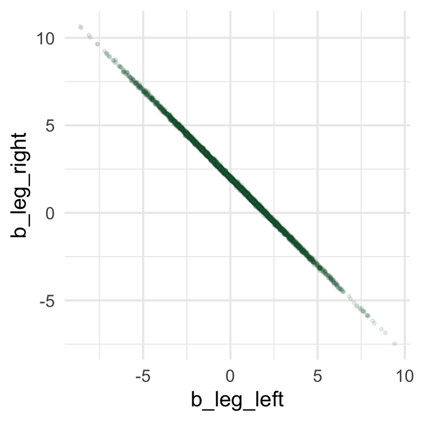
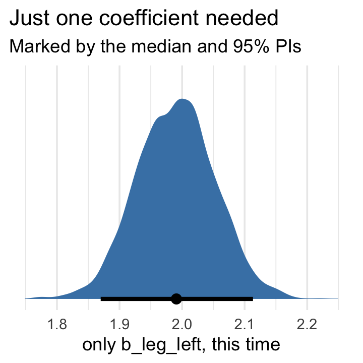

# The Haunted DAG & The Causal Terror

Read this opening and cry:

> It seems like the most newsworthy scientific studies are the least trustworthy. The more likely it is to kill you, if true, the less likely it is to be true. The more boring the topic, the more rigorous the results. How could this widely believed negative correlation exist? There doesn't seem to be any reason for studies of topics that people care about to produce less reliable results. Maybe popular topics attract more and worse researchers, like flies drawn to the smell of honey?
>
> Actually all that is necessary for such a negative correlation to arise is that peer reviewers care about both newsworthiness and trustworthiness. Whether it is grant review or journal review, if editors and reviewers care about both, then the act of selection itself is enough to make the most newsworthy studies the least trustworthy....
>
> Strong selection induces a negative correlation among the criteria used in selection. Why? If the only way to cross the threshold is to score high, it is more common to score high on one item than on both. Therefore among funded proposals, the most newsworthy studies can actually have less than average trustworthiness (less than 0 in the figure). Similarly the most trustworthy studies can be less newsworthy than average.
>
> This general phenomenon has been recognized for a long time. It is sometimes called **Berkson's paradox**. But it is easier to remember if we call it the *selection-distortion effect*. Once you appreciate this effect, you'll see it everywhere....
>
> The selection-distortion effect can happen inside of a multiple regression, because the act of adding a predictor induces statistical selection within the model, a phenomenon that goes by the unhelpful name collider bias. This can mislead us into believing, for example, that there is a negative association between newsworthiness and trustworthiness in general, when in fact it is just a consequence of conditioning on some variable. This is both a deeply confusing fact and one that is important to understand in order to regress responsibly.
>
> This chapter and the next are both about terrible things that can happen when we simply add variables to a regression, without a clear idea of a causal model. [@mcelreathStatisticalRethinkingBayesian2020, pp. 159--160, **emphasis** in the original]

#### Overthinking: Simulated science distortion.

First let's run the simulation.


```r
library(tidyverse)

set.seed(1914)
n <- 200  # num grant proposals
p <- 0.1  # proportion to select

d <-
  # uncorrelated newsworthiness and trustworthiness
  tibble(newsworthiness  = rnorm(n, mean = 0, sd = 1),
         trustworthiness = rnorm(n, mean = 0, sd = 1)) %>% 
  # total_score
  mutate(total_score = newsworthiness + trustworthiness) %>% 
  # select top 10% of combined scores
  mutate(selected = ifelse(total_score >= quantile(total_score, 1 - p), TRUE, FALSE))

head(d)
```

```
## # A tibble: 6 x 4
##   newsworthiness trustworthiness total_score selected
##            <dbl>           <dbl>       <dbl> <lgl>   
## 1         -0.379         -1.20        -1.58  FALSE   
## 2          0.130          0.504        0.634 FALSE   
## 3          0.334          0.532        0.866 FALSE   
## 4         -1.89          -0.594       -2.48  FALSE   
## 5          2.05           0.0672       2.12  TRUE    
## 6          2.54           1.02         3.56  TRUE
```

Here's the correlation among those cases for which `selected == TRUE`.


```r
d %>% 
  filter(selected == TRUE) %>% 
  select(newsworthiness, trustworthiness) %>% 
  cor()
```

```
##                 newsworthiness trustworthiness
## newsworthiness       1.0000000      -0.7680083
## trustworthiness     -0.7680083       1.0000000
```

For the plots in this chapter, we'll take some aesthetic cues from Aki Vehtari's great GitHub repo, [*Bayesian Data Analysis R Demos*](https://github.com/avehtari/BDA_R_demos).


```r
theme_set(theme_minimal())
```

Okay, let's make Figure 6.1.


```r
# we'll need this for the annotation
text <-
  tibble(newsworthiness  = c(2, 1), 
         trustworthiness = c(2.25, -2.5),
         selected        = c(TRUE, FALSE),
         label           = c("selected", "rejected"))

d %>% 
  ggplot(aes(x = newsworthiness, y = trustworthiness, color = selected)) +
  geom_point(aes(shape = selected), alpha = 3/4) +
  geom_text(data = text,
            aes(label = label)) +
  geom_smooth(data = . %>% filter(selected == TRUE),
              method = "lm", fullrange = T,
              color = "lightblue", se = F, size = 1/2) +
  scale_color_manual(values = c("black", "lightblue")) +
  scale_shape_manual(values = c(1, 19)) +
  scale_x_continuous(limits = c(-3, 3.9), expand = c(0, 0)) +
  coord_cartesian(ylim = range(d$trustworthiness)) +
  theme(legend.position = "none")
```


## Multicollinearity

> Multicollinearity means a very strong association between two or more predictor variables. *The raw correlation isn’t what matters. Rather what matters is the association, conditional on the other variables in the model.* The consequence of multicollinearity is that the posterior distribution will seem to suggest that none of the variables is reliably associated with the outcome, even if all of the variables are in reality strongly associated with the outcome.
>
> This frustrating phenomenon arises from the details of how multiple regression works. In fact, there is nothing wrong with multicollinearity. The model will work fine for prediction. You will just be frustrated trying to understand it. The hope is that once you understand multicollinearity, you will better understand regression models in general. (p. 163, *emphasis* added)

For more on this topic, check out [Jan VanHove](https://twitter.com/janhove)'s interesting blog post, [*Collinearity isn't a disease that needs curing*](https://janhove.github.io/analysis/2019/09/11/collinearity).

### Multicollinear legs.

Let's simulate some leg data.


```r
n <- 100
set.seed(909)

d <- 
  tibble(height   = rnorm(n, mean = 10, sd = 2),
         leg_prop = runif(n, min = 0.4, max = 0.5)) %>% 
  mutate(leg_left  = leg_prop * height + rnorm(n, mean = 0, sd = 0.02),
         leg_right = leg_prop * height + rnorm(n, mean = 0, sd = 0.02))
```

`leg_left` and `leg_right` are **highly** correlated.


```r
d %>%
  select(leg_left:leg_right) %>%
  cor() %>%
  round(digits = 4)
```

```
##           leg_left leg_right
## leg_left    1.0000    0.9997
## leg_right   0.9997    1.0000
```

Have you ever even seen a $\rho = .9997$ correlation, before? Here it is in a plot.


```r
d %>%
  ggplot(aes(x = leg_left, y = leg_right)) +
  geom_point(alpha = 1/2, color = "forestgreen")
```


Load **brms**.


```r
library(brms)
```

Here's our attempt to predict `height` with both legs.


```r
b6.1 <- 
  brm(data = d, 
      family = gaussian,
      height ~ 1 + leg_left + leg_right,
      prior = c(prior(normal(10, 100), class = Intercept),
                prior(normal(2, 10), class = b),
                prior(exponential(1), class = sigma)),
      iter = 2000, warmup = 1000, chains = 4, cores = 4,
      seed = 6,
      file = "fits/b06.01")
```

Let's inspect the damage.


```r
print(b6.1)
```

```
##  Family: gaussian 
##   Links: mu = identity; sigma = identity 
## Formula: height ~ 1 + leg_left + leg_right 
##    Data: d (Number of observations: 100) 
## Samples: 4 chains, each with iter = 2000; warmup = 1000; thin = 1;
##          total post-warmup samples = 4000
## 
## Population-Level Effects: 
##           Estimate Est.Error l-95% CI u-95% CI Rhat Bulk_ESS Tail_ESS
## Intercept     0.99      0.30     0.40     1.58 1.00     4350     2694
## leg_left      0.29      2.50    -4.68     5.31 1.00     1377     1717
## leg_right     1.71      2.51    -3.30     6.69 1.00     1376     1690
## 
## Family Specific Parameters: 
##       Estimate Est.Error l-95% CI u-95% CI Rhat Bulk_ESS Tail_ESS
## sigma     0.64      0.05     0.55     0.73 1.00     2188     2159
## 
## Samples were drawn using sampling(NUTS). For each parameter, Bulk_ESS
## and Tail_ESS are effective sample size measures, and Rhat is the potential
## scale reduction factor on split chains (at convergence, Rhat = 1).
```

That 'Est.Error' column isn't looking too good. But it's easy to miss that, which is why McElreath suggested "a graphical view of the [output] is more useful because it displays the posterior means and [intervals] in a way that allows us with a glance to see that something has gone wrong here" (p. 164).

Here's our coefficient plot using `brms::mcmc_plot()` with a little help from `bayesplot::color_scheme_set()`.


```r
library(bayesplot)

color_scheme_set("orange")

mcmc_plot(b6.1, 
         type = "intervals", 
         prob = .5, 
         prob_outer = .95,
         point_est = "mean") +
  labs(title = "The coefficient plot for the two-leg model",
       subtitle = "Holy smokes; look at the widths of those betas!") +
  theme(axis.text.y = element_text(hjust = 0),
        panel.grid.minor = element_blank(),
        strip.text = element_text(hjust = 0)) 
```


Now you can use the `brms::mcmc_plot()` function without explicitly loading the **bayesplot** package. But loading **bayesplot** allows you to set the color scheme with `color_scheme_set()`.

In the middle of page 164, McElreath suggested we might try this again with different seeds. This might be a good place to iteration. Our first step will be to make a custom function that will simulate new data of the same form as above and then immediately fit a model based on `b6.1` to those new data. To speed up the process, we’ll use the `update()` function to avoid recompiling the model. Our custom function, sim_and_fit()`, will take two arguments. The `seed` argument will allow us to keep the results reproducible by setting a seed for the data simulation. The `n` argument will allow us, should we wish, to change the sample size. 


```r
sim_and_fit <- function(seed, n = 100) {
  
  # set up the parameters
  n <- n
  set.seed(seed)
  
  # simulate the new data
  d <- 
    tibble(height   = rnorm(n, mean = 10, sd = 2),
           leg_prop = runif(n, min = 0.4, max = 0.5)) %>% 
    mutate(leg_left  = leg_prop * height + rnorm(n, mean = 0, sd = 0.02),
           leg_right = leg_prop * height + rnorm(n, mean = 0, sd = 0.02))
  
  # update b6.1 to the new data
  fit <- update(b6.1, newdata = d, seed = 6) 
  
}
```

Now use `sim_and_fit()` to make our simulations which correspond to seed values `1:4`. By nesting the `seed` values and the `sim_and_fit()` function within `purrr::map()`, the results will be saved within our tibble, `sim`.


```r
sim <-
  tibble(seed = 1:4) %>% 
  mutate(post = map(seed, ~sim_and_fit(.) %>% 
                      posterior_samples()))
```


Take a look at what we did.


```r
head(sim)
```

```
## # A tibble: 4 x 2
##    seed post                
##   <int> <list>              
## 1     1 <df[,5] [4,000 × 5]>
## 2     2 <df[,5] [4,000 × 5]>
## 3     3 <df[,5] [4,000 × 5]>
## 4     4 <df[,5] [4,000 × 5]>
```

We have a tibble with four rows and two columns. Hopefully it's unsurprising the first column shows our four `seed` values. The second column, `post`, might look odd. If you look back up at the code we used to make `sim`, you'll notice we fed the results form `sim_and_fit()` into the `brms::posterior_samples()` function. Each model contained 4,000 poster draws. There are four parameters in the model and, by **brms** default, the `posterior_samples()` function also returns the `lp__`, which we generally ignore in this project. Anyway, that's why you see each of the four rows of `post` containing `<data.frame [4,000 × 5]>`. Each cell contains an entire $4,000 × 5$ data frame--the results of `posterior_samples()`. When you have a data frames nested within data frames, this is called a nested data structure. To unpack the contents of those four nested data frames, you simply call `nest(d, post)`. In the next code block, we'll do that within the context of a larger work low designed to plot the results of each in a faceted coefficient plot. For data of this kind of structure, the `tidybayes::stat_pointintervalh()` function will be particularly useful.


```r
library(tidybayes)

sim %>% 
  unnest(post) %>% 
  pivot_longer(b_Intercept:sigma) %>% 
  mutate(seed = str_c("seed ", seed)) %>% 
  
  ggplot(aes(x = value, y = name)) +
  stat_pointinterval(.width = .95, color = "forestgreen") +
  labs(x = "posterior", y = NULL) +
  theme(axis.text.y = element_text(hjust = 0),
        panel.grid.minor = element_blank(),
        strip.text = element_text(hjust = 0)) +
  facet_wrap(~seed, ncol = 1)
```


Though the results varied across iterations, the overall pattern was massive uncertainty in the two $\beta$ parameters. You may be wondering, 

> Did the posterior approximation work correctly?
>
> It did work correctly, and the posterior distribution here is the right answer to the ques- tion we asked. The problem is the question. Recall that a multiple linear regression answers the question: *What is the value of knowing each predictor, after already knowing all of the other predictors? So in this case, the question becomes: What is the value of knowing each leg's length, after already knowing the other leg's length?*
>
> The answer to this weird question is equally weird, but perfectly logical. (p. 164, *emphasis* in the original)

To further answer this weird question, we might start making the panels from Figure 6.2. Starting with the left panel, this is perhaps the simplest way to plot the bivariate posterior of our two predictor coefficients.


```r
pairs(b6.1, pars = parnames(b6.1)[2:3])
```


If you'd like a nicer and more focused attempt, you might have to revert to the `posterior_samples()` function and a little **ggplot2** code.


```r
post <- posterior_samples(b6.1)
  
post %>% 
  ggplot(aes(x = b_leg_left, y = b_leg_right)) +
  geom_point(color = "forestgreen", alpha = 1/10, size = 1/2)
```


While we're at it, you can make a similar plot with the `mcmc_scatter()` function [see @gabryPlottingMCMCDraws2019, [*Plotting MCMC draws using the bayesplot package*](https://CRAN.R-project.org/package=bayesplot/vignettes/plotting-mcmc-draws.html)].


```r
color_scheme_set("green")

post %>% 
  mcmc_scatter(pars = c("b_leg_left", "b_leg_right"),
               size = 1/2, 
               alpha = 1/10)
```



But wow, those coefficients look about as highly correlated as the predictors, just with the reversed sign.


```r
post %>% 
  select(b_leg_left:b_leg_right) %>% 
  cor()
```

```
##             b_leg_left b_leg_right
## b_leg_left   1.0000000  -0.9996662
## b_leg_right -0.9996662   1.0000000
```

On page 165, McElreath clarified that from the perspective of **brms**, this model may as well be

$$
\begin{align*}
y_i   & \sim \operatorname{Normal}(\mu_i, \sigma) \\
\mu_i & = \alpha + (\beta_1 + \beta_2) x_i.
\end{align*}
$$

Accordingly, here's the posterior of the sum of the two regression coefficients, Figure 6.2.b. We'll use `tidybayes::geom_halfeyeh()` to both plot the density and mark off the posterior median and percentile-based 95% probability intervals at its base.


```r
library(tidybayes)

post %>% 
  ggplot(aes(x = b_leg_left + b_leg_right, y = 0)) +
  geom_halfeyeh(point_interval = median_qi, 
                fill = "steelblue", .width = .95) +
  scale_y_continuous(NULL, breaks = NULL) +
  labs(title = "Sum the multicollinear coefficients",
       subtitle = "Marked by the median and 95% PIs")
```


Now we fit the model after ditching one of the leg lengths.


```r
b6.2 <- 
  brm(data = d, 
      family = gaussian,
      height ~ 1 + leg_left,
      prior = c(prior(normal(10, 100), class = Intercept),
                prior(normal(2, 10), class = b),
                prior(exponential(1), class = sigma)),
      iter = 2000, warmup = 1000, chains = 4, cores = 4,
      seed = 6,
      file = "fits/b06.02")
```


```r
print(b6.2)
```

```
##  Family: gaussian 
##   Links: mu = identity; sigma = identity 
## Formula: height ~ 1 + leg_left 
##    Data: d (Number of observations: 100) 
## Samples: 4 chains, each with iter = 2000; warmup = 1000; thin = 1;
##          total post-warmup samples = 4000
## 
## Population-Level Effects: 
##           Estimate Est.Error l-95% CI u-95% CI Rhat Bulk_ESS Tail_ESS
## Intercept     1.00      0.29     0.43     1.56 1.00     3721     2696
## leg_left      1.99      0.06     1.87     2.12 1.00     3742     2681
## 
## Family Specific Parameters: 
##       Estimate Est.Error l-95% CI u-95% CI Rhat Bulk_ESS Tail_ESS
## sigma     0.63      0.04     0.55     0.73 1.00     3514     2866
## 
## Samples were drawn using sampling(NUTS). For each parameter, Bulk_ESS
## and Tail_ESS are effective sample size measures, and Rhat is the potential
## scale reduction factor on split chains (at convergence, Rhat = 1).
```

That posterior $SD$ looks much better. Compare this density to the one in Figure 6.2.b.


```r
posterior_samples(b6.2) %>% 
  
  ggplot(aes(x = b_leg_left, y = 0)) +
  stat_halfeye(point_interval = median_qi, 
               fill = "steelblue", .width = .95) +
  scale_y_continuous(NULL, breaks = NULL) +
  labs(title = "Just one coefficient needed",
       subtitle = "Marked by the median and 95% PIs",
       x = "only b_leg_left, this time")
```



> The basic lesson is only this: When two predictor variables are very strongly correlated (conditional on other variables in the model), including both in a model may lead to confusion. The posterior distribution isn't wrong, in such cases. It's telling you that the question you asked cannot be answered with these data. And that's a great thing for a model to say, that it cannot answer your question. And if you are just interested in prediction, you'll find that this leg model makes fine predictions. It just doesn’t make any claims about which leg is more important. (p. 166)

### Multicollinear `milk`.

Multicollinearity arises in real data, too.


```r
library(rethinking)
data(milk)
d <- milk
```

Now use `rethinking::standardize()` to standardize our focal variables.


```r
d <-
  d %>% 
  mutate(k = standardize(kcal.per.g),
         f = standardize(perc.fat),
         l = standardize(perc.lactose))
```

Unload **rethinking** and load **brms**.


```r
rm(milk)
detach(package:rethinking, unload = T)
library(brms)
```

We'll follow the text and fit the two univariable models, first. Note our use of `update()`.


```r
# k regressed on f
b6.3 <- 
  brm(data = d, 
      family = gaussian,
      k ~ 1 + f,
      prior = c(prior(normal(0, 0.2), class = Intercept),
                prior(normal(0, 0.5), class = b),
                prior(exponential(1), class = sigma)),
      iter = 2000, warmup = 1000, chains = 4, cores = 4,
      seed = 6,
      file = "fits/b06.03")

# k regressed on l
b6.4 <- 
  update(b6.3,
         newdata = d,
         formula = k ~ 1 + l,
         seed = 6,
         file = "fits/b06.04")
```


```r
posterior_summary(b6.3) %>% round(digits = 2)
```

```
##             Estimate Est.Error   Q2.5  Q97.5
## b_Intercept     0.00      0.08  -0.16   0.17
## b_f             0.85      0.09   0.67   1.02
## sigma           0.49      0.07   0.37   0.65
## lp__          -22.14      1.30 -25.42 -20.64
```

```r
posterior_summary(b6.4) %>% round(digits = 2)
```

```
##             Estimate Est.Error   Q2.5  Q97.5
## b_Intercept     0.00      0.07  -0.14   0.14
## b_l            -0.90      0.08  -1.05  -0.74
## sigma           0.41      0.06   0.32   0.54
## lp__          -17.34      1.23 -20.53 -15.93
```

Now "watch what happens when we place both predictor varaibles in the same regression model" (p. 167).


```r
b6.5 <- 
  update(b6.4,
         newdata = d,
         formula = k ~ 1 + f + l,
         seed = 6,
         file = "fits/b06.05")
```

Now the $\beta$'s are smaller and less certain.


```r
posterior_summary(b6.5) %>% round(digits = 2)
```

```
##             Estimate Est.Error   Q2.5  Q97.5
## b_Intercept     0.00      0.07  -0.14   0.15
## b_f             0.25      0.19  -0.12   0.64
## b_l            -0.67      0.19  -1.03  -0.27
## sigma           0.42      0.06   0.32   0.56
## lp__          -17.31      1.53 -21.16 -15.41
```

Here's a quick `paris()` plot.


```r
d %>% 
  select(kcal.per.g, perc.fat, perc.lactose) %>% 
  pairs(col = "forestgreen")
```


Now here's the custom **GGally** version.


```r
library(GGally)

my_diag <- function(data, mapping, ...) {
  ggplot(data = data, mapping = mapping) + 
    geom_density(fill = "steelblue", color = "black")
}

my_lower <- function(data, mapping, ...) {
  ggplot(data = data, mapping = mapping) + 
    geom_smooth(method = "lm", color = "orange", size = 1/3, 
                fill = "orange", alpha = 1/4) +
    geom_point(alpha = .8, size = 1/4, color = "blue")
  }

# plug those custom functions into `ggpairs()`
ggpairs(data = d, columns = c(3:4, 6),
        diag = list(continuous = my_diag),
        lower = list(continuous = my_lower))
```


Our two predictor "variables are negatively correlated, and so strongly so that they are nearly redundant. Either helps in predicting `kcal.per.g`, but neither helps much *once you already know the other*" (p. 169, *emphasis* in the original). You can really see that on the lower two scatter plots. You'll note the `ggpairs()` plot also returned the Pearson's correlation coefficients.

Making a DAG might help us make sense of this.


```r
library(ggdag)

dag_coords <-
  tibble(name = c("L", "D", "F", "K"),
         x    = c(1, 2, 3, 2),
         y    = c(2, 2, 2, 1))

dagify(L ~ D,
       F ~ D,
       K ~ L + F,
       coords = dag_coords) %>%
  
  ggplot(aes(x = x, y = y, xend = xend, yend = yend)) +
  geom_dag_point(aes(color = name == "D"),
                 alpha = 1/2, size = 6.5, show.legend = F) +
  geom_point(x = 2, y = 2, 
             size = 6.5, shape = 1, stroke = 1, color = "orange") +
  geom_dag_text(color = "black") +
  geom_dag_edges() +
  scale_color_manual(values = c("steelblue", "orange")) +
  scale_x_continuous(NULL, breaks = NULL, expand = c(.1, .1)) +
  scale_y_continuous(NULL, breaks = NULL, expand = c(.1, .1))
```


> The central tradeoff decides how dense, $D$, the milk needs to be. We haven't observed this variable, so it's shown circled. Then fat, $F$, and lactose, $L$, are determined. Finally, the composition of $F$ and $L$ determines the kilocalories, $K$. If we could measure $D$, or had an evolutionary and economic model to predict it based upon other aspects of a species, that would be better than stumbling through regressions. (p. 167)

#### Rethinking: Identification guaranteed; comprehension up to you. 

If you come from a frequentist background, this may jar you, but

> technically speaking, *identifiability* is not a concern for Bayesian models. The reason is that as long as the posterior distribution is proper--which just means that it integrates to 1--then all of the parameters are identified. But this technical fact doesn't also mean that you can make sense of the posterior distribution. So it's probably better to speak of *weakly identified* parameters in a Bayesian context. (pp. 169--170, *emphasis* in the original)

#### Overthinking: Simulating collinearity.

First we'll get the data and define the functions. You'll note I've defined my `sim_coll()` a little differently from `sim.coll()` in the text. I've omitted `rep.sim.coll()` as an independent function altogether, but computed similar summary information with the `summarise()` code at the bottom of the block.


```r
sim_coll <- function(seed, rho) {
  
  # simulate the data
  set.seed(seed)
  
  d <-
    d %>% 
    mutate(x = rnorm(n(), 
                     mean = perc.fat * rho,
                     sd = sqrt((1 - rho^2) * var(perc.fat))))
    
  # fit an OLS model
  m <- lm(kcal.per.g ~ perc.fat + x, data = d)
  
  # extract the parameter SD
  sqrt(diag(vcov(m)))[2]
  
}

# how many simulations per `rho`-value would you like?
n_seed <- 100
# how many `rho`-values from 0 to .99 would you like to evaluate the process over?
n_rho  <- 30

d <-
  crossing(seed = 1:n_seed,
           rho  = seq(from = 0, to = .99, length.out = n_rho))  %>% 
  mutate(parameter_sd = purrr::map2_dbl(seed, rho, sim_coll)) %>% 
  group_by(rho) %>% 
  # we'll `summarise()` our output by the mean and 95% intervals
  summarise(mean = mean(parameter_sd),
            ll   = quantile(parameter_sd, prob = .025),
            ul   = quantile(parameter_sd, prob = .975))
```

We've added 95% interval bands to our version of Figure 5.10.


```r
d %>% 
  ggplot(aes(x = rho, y = mean)) +
  geom_smooth(aes(ymin = ll, ymax = ul),
              stat = "identity",
              fill = "orange", color = "orange", alpha = 1/3, size = 2/3) +
  labs(x = expression(rho),
       y = "parameter SD") +
  coord_cartesian(ylim = c(0, .0072))
```


## Post-treatment bias

It helped me understand the next example by mapping out the sequence of events McElreath described in the second paragraph:

* seed and sprout plants
* measure heights
* apply different antifungal soil treatments (i.e., the experimental manipulation)
* measure (a) the heights and (b) the presence of fungus

Based on the design, let's simulate our data.


```r
# how many plants would you like?
n <- 100

set.seed(71)
d <- 
  tibble(h0        = rnorm(n, mean = 10, sd = 2), 
         treatment = rep(0:1, each = n / 2),
         fungus    = rbinom(n, size = 1, prob = .5 - treatment * 0.4),
         h1        = h0 + rnorm(n, mean = 5 - 3 * fungus, sd = 1))
```

We'll use `head()` to peek at the data.


```r
d %>%
  head()
```

```
## # A tibble: 6 x 4
##      h0 treatment fungus    h1
##   <dbl>     <int>  <int> <dbl>
## 1  9.14         0      0  14.3
## 2  9.11         0      0  15.6
## 3  9.04         0      0  14.4
## 4 10.8          0      0  15.8
## 5  9.16         0      1  11.5
## 6  7.63         0      0  11.1
```

And here's a quick summary with `tidybayes::mean_qi()`.


```r
d %>% 
  gather() %>% 
  group_by(key) %>% 
  mean_qi(.width = .89) %>% 
  mutate_if(is.double, round, digits = 2)
```

```
## # A tibble: 4 x 7
##   key       value .lower .upper .width .point .interval
##   <chr>     <dbl>  <dbl>  <dbl>  <dbl> <chr>  <chr>    
## 1 fungus     0.23   0       1     0.89 mean   qi       
## 2 h0         9.96   6.57   13.1   0.89 mean   qi       
## 3 h1        14.4   10.6    17.9   0.89 mean   qi       
## 4 treatment  0.5    0       1     0.89 mean   qi
```

### A prior is born.

Let's take a look at the $p \sim \operatorname{Log-Normal}(0, 0.25)$ prior distribution.


```r
set.seed(6)

# simulate
sim_p <-
  tibble(sim_p = rlnorm(1e4, meanlog = 0, sdlog = 0.25)) 

# wrangle
sim_p %>% 
  mutate(`exp(sim_p)` = exp(sim_p)) %>%
  gather() %>% 
  
  # plot
  ggplot(aes(x = value)) +
  geom_density(fill = "steelblue") +
  scale_x_continuous(breaks = c(0, .5, 1, 1.5, 2, 3, 5)) +
  scale_y_continuous(NULL, breaks = NULL) +
  coord_cartesian(xlim = c(0, 6)) +
  theme(panel.grid.minor.x = element_blank()) +
  facet_wrap(~key, scale = "free_y", ncol = 1)
```


Summarize.


```r
sim_p %>% 
  mutate(`exp(sim_p)` = exp(sim_p)) %>%
  gather() %>%
  group_by(key) %>% 
  mean_qi(.width = .89) %>% 
  mutate_if(is.double, round, digits = 2)
```

```
## # A tibble: 2 x 7
##   key        value .lower .upper .width .point .interval
##   <chr>      <dbl>  <dbl>  <dbl>  <dbl> <chr>  <chr>    
## 1 exp(sim_p)  2.92   1.96   4.49   0.89 mean   qi       
## 2 sim_p       1.03   0.67   1.5    0.89 mean   qi
```

So then, our initial statistical model follows the form

$$
\begin{align*}
h_{1i} & \sim \operatorname{Normal}(\mu_i, \sigma) \\
\mu_i  & = h_{0i} \times p \\
p      & \sim \operatorname{Log-Normal}(0, 0.25) \\
\sigma & \sim \operatorname{Exponential}(1).
\end{align*}
$$

Let's fit the model.


```r
b6.6 <- 
  brm(data = d, 
      family = gaussian,
      h1 ~ 0 + h0,
      prior = c(prior(lognormal(0, 0.25), class = b),
                prior(exponential(1), class = sigma)),
      iter = 2000, warmup = 1000, chains = 4, cores = 4,
      seed = 6,
      file = "fits/b06.06")
```

Behold the summary.


```r
print(b6.6)
```

```
##  Family: gaussian 
##   Links: mu = identity; sigma = identity 
## Formula: h1 ~ 0 + h0 
##    Data: d (Number of observations: 100) 
## Samples: 4 chains, each with iter = 2000; warmup = 1000; thin = 1;
##          total post-warmup samples = 4000
## 
## Population-Level Effects: 
##    Estimate Est.Error l-95% CI u-95% CI Rhat Bulk_ESS Tail_ESS
## h0     1.43      0.02     1.39     1.46 1.00     3543     2357
## 
## Family Specific Parameters: 
##       Estimate Est.Error l-95% CI u-95% CI Rhat Bulk_ESS Tail_ESS
## sigma     1.82      0.13     1.58     2.10 1.00     3052     2478
## 
## Samples were drawn using sampling(NUTS). For each parameter, Bulk_ESS
## and Tail_ESS are effective sample size measures, and Rhat is the potential
## scale reduction factor on split chains (at convergence, Rhat = 1).
```

So then, the expectation is an increase of about 43 percent relative to $h_0$. But this isn't the best model. We're leaving important predictors on the table. Our updated model follows the form

$$
\begin{align*}
h_{1i}  & \sim  \operatorname{Normal}(\mu_i, \sigma) \\
\mu_i   & = h_{0,i} \times p \\
p       & = \alpha + \beta_1 \text{treatment}_i + \beta_2 \text{fungus}_i \\
\alpha  & \sim \operatorname{Log-Normal}(0, 0.25) \\
\beta_1 & \sim \operatorname{Normal}(0, 0.5) \\
\beta_2 & \sim \operatorname{Normal}(0, 0.5) \\
\sigma  & \sim \operatorname{Exponential}(1).
\end{align*}
$$

That is, now the "proportion of growth $p$ is now a function of the predictor variables" (p. 172). Although we will fit the equivalent of McElreath's model in **brms**, I'm not aware that we can translate it directly into **brms** syntax. But take a look at the critical two lines from above:

$$
\begin{align*}
\mu_i & = h_{0,i} \times p \\
p     & = \alpha + \beta_1 \text{treatment}_i + \beta_2 \text{fungus}_i. \\
\end{align*}
$$

With just a little algebra, we can re-express that as

$$
\mu_i = h_{0i} \times (\alpha + \beta_1 \text{treatment}_i + \beta_2 \text{fungus}_i).
$$

With **brms**, we fit models like that using the [non-linear syntax](https://CRAN.R-project.org/package=brms/vignettes/brms_nonlinear.html) [@Bürkner2020Non_linear], which we introduced at the end of Chapter 5. Here it is for `b6.7`.


```r
b6.7 <- 
  brm(data = d, 
      family = gaussian,
      bf(h1 ~ h0 * (a + t * treatment + f * fungus),
         a + t + f ~ 1,
         nl = TRUE),
      prior = c(prior(lognormal(0, 0.2), nlpar = a),
                prior(normal(0, 0.5), nlpar = t),
                prior(normal(0, 0.5), nlpar = f),
                prior(exponential(1), class = sigma)),
      iter = 2000, warmup = 1000, chains = 4, cores = 4,
      seed = 6,
      file = "fits/b06.07")
```

To explain what's going on with our `formula `syntax, it's probably best to quote Bürkner's [-@Bürkner2020Non_linear] [vignette](https://CRAN.R-project.org/package=brms/vignettes/brms_nonlinear.html) at length:

> When looking at the above code, the first thing that becomes obvious is that we changed the `formula` syntax to display the non-linear formula including predictors (i.e., [`h0`, `treatment`, and `fungus`]) and parameters (i.e., [`a`, `t`, and `f`]) wrapped in a call to [the `bf()` function]. This stands in contrast to classical **R** formulas, where only predictors are given and parameters are implicit. The argument [`a + t + f ~ 1`] serves two purposes. First, it provides information, which variables in `formula` are parameters, and second, it specifies the linear predictor terms for each parameter. In fact, we should think of non-linear parameters as placeholders for linear predictor terms rather than as parameters themselves (see also the following examples). In the present case, we have no further variables to predict [`a`,  `t`, and `f`] and thus we just fit intercepts that represent our estimates of [$\alpha$, $t$, and  $f$]. The formula [`a + t + f ~ 1`] is a short form of [`a ~ 1, t ~ 1, f ~ 1`] that can be used if multiple non-linear parameters share the same formula. Setting `nl = TRUE` tells **brms** that the formula should be treated as non-linear.
>
> In contrast to generalized linear models, priors on population-level parameters (i.e., 'fixed effects') are often mandatory to identify a non-linear model. Thus, **brms** requires the user to explicitely specify these priors. In the present example, we used a [`lognormal(0, 0.2)` prior on (the population-level intercept of) `a`, while we used a `normal(0, 0.5)` prior on both (population-level intercepts of) `t` and `f`]. Setting priors is a non-trivial task in all kinds of models, especially in non-linear models, so you should always invest some time to think of appropriate priors. Quite often, you may be forced to change your priors after fitting a non-linear model for the first time, when you observe different MCMC chains converging to different posterior regions. This is a clear sign of an idenfication problem and one solution is to set stronger (i.e., more narrow) priors. (**emphasis** in the original)

Let's see what we've done.


```r
print(b6.7)
```

```
##  Family: gaussian 
##   Links: mu = identity; sigma = identity 
## Formula: h1 ~ h0 * (a + t * treatment + f * fungus) 
##          a ~ 1
##          t ~ 1
##          f ~ 1
##    Data: d (Number of observations: 100) 
## Samples: 4 chains, each with iter = 2000; warmup = 1000; thin = 1;
##          total post-warmup samples = 4000
## 
## Population-Level Effects: 
##             Estimate Est.Error l-95% CI u-95% CI Rhat Bulk_ESS Tail_ESS
## a_Intercept     1.48      0.03     1.43     1.53 1.00     1664     1797
## t_Intercept     0.00      0.03    -0.06     0.07 1.00     1764     1713
## f_Intercept    -0.27      0.04    -0.34    -0.19 1.00     2167     2201
## 
## Family Specific Parameters: 
##       Estimate Est.Error l-95% CI u-95% CI Rhat Bulk_ESS Tail_ESS
## sigma     1.44      0.10     1.26     1.67 1.00     2722     2599
## 
## Samples were drawn using sampling(NUTS). For each parameter, Bulk_ESS
## and Tail_ESS are effective sample size measures, and Rhat is the potential
## scale reduction factor on split chains (at convergence, Rhat = 1).
```

All in all, it looks like we did a good job matching up McElreath's results. The posterior doesn't, however, match up well with the way we generated the data...

### Blocked by consequence.

To measure the treatment effect properly, we should omit `fungus` from the model. This leaves us with the equation

$$
\begin{align*}
h_{1i}  & \sim \operatorname{Normal}(\mu_i, \sigma) \\
\mu_i   & = h_{0i} \times (\alpha + \beta_1 \text{treatment}_i) \\
\alpha  & \sim \operatorname{Log-Normal}(0, 0.25) \\
\beta_1 & \sim \operatorname{Normal}(0, 0.5) \\
\sigma  & \sim \operatorname{Exponential}(1).
\end{align*}
$$

Fit the model.


```r
b6.8 <- 
  brm(data = d, 
      family = gaussian,
      bf(h1 ~ h0 * (a + t * treatment),
         a + t ~ 1,
         nl = TRUE),
      prior = c(prior(lognormal(0, 0.2), nlpar = a),
                prior(normal(0, 0.5), nlpar = t),
                prior(exponential(1), class = sigma)),
      iter = 2000, warmup = 1000, chains = 4, cores = 4,
      seed = 6,
      file = "fits/b06.08")
```

Did we do better?


```r
print(b6.8)
```

```
##  Family: gaussian 
##   Links: mu = identity; sigma = identity 
## Formula: h1 ~ h0 * (a + t * treatment) 
##          a ~ 1
##          t ~ 1
##    Data: d (Number of observations: 100) 
## Samples: 4 chains, each with iter = 2000; warmup = 1000; thin = 1;
##          total post-warmup samples = 4000
## 
## Population-Level Effects: 
##             Estimate Est.Error l-95% CI u-95% CI Rhat Bulk_ESS Tail_ESS
## a_Intercept     1.38      0.03     1.33     1.43 1.00     2012     2414
## t_Intercept     0.09      0.03     0.02     0.15 1.00     1886     2108
## 
## Family Specific Parameters: 
##       Estimate Est.Error l-95% CI u-95% CI Rhat Bulk_ESS Tail_ESS
## sigma     1.79      0.13     1.55     2.06 1.00     2375     2212
## 
## Samples were drawn using sampling(NUTS). For each parameter, Bulk_ESS
## and Tail_ESS are effective sample size measures, and Rhat is the potential
## scale reduction factor on split chains (at convergence, Rhat = 1).
```

Yes, now we have a positive treatment effect.

### Fungus and $d$-separation.

Let's make a DAG.


```r
# define our coordinates
dag_coords <-
  tibble(name = c("H0", "T", "F", "H1"),
         x    = c(1, 5, 4, 3),
         y    = c(2, 2, 1.5, 1))

# save our DAG
dag <-
  dagify(F ~ T,
         H1 ~ H0 + F,
         coords = dag_coords)

# plot 
dag %>%
  ggplot(aes(x = x, y = y, xend = xend, yend = yend)) +
  geom_dag_point(color = "steelblue", alpha = 1/2, size = 6.5) +
  geom_dag_text(color = "black") +
  geom_dag_edges() + 
  theme_dag()
```


We'll be making a lot of simple DAGs following this format over this chapter. To streamline out plotting code, let’s make a custom plotting function. I'll call it `gg_simple_dag()`.


```r
gg_simple_dag <- function(d) {
  
  d %>% 
    ggplot(aes(x = x, y = y, xend = xend, yend = yend)) +
    geom_dag_point(color = "steelblue", alpha = 1/2, size = 6.5) +
    geom_dag_text(color = "black") +
    geom_dag_edges() + 
    theme_dag()
  
}

# try it out!
dag %>% 
  gg_simple_dag()
```


Anyway, the DAG clarifies 

> that learning the treatment tells us nothing about the outcome, once we know the fungus status.
>
> An even more DAG way to say this is that conditioning on $F$ induces **d-separation**. The "d" stands for *directional*. D-separation means that some variables on a directed graph are independent of others. There is no path connecting them. In this case, $H_1$ is d-separated from $T$, but only when we condition on $F$. Conditioning on $F$ effectively blocks the directed path $T \rightarrow F \rightarrow H_1$, making $T$ and $H_1$ independent (d-separated). 

Note that our ggdag object, `dag`, will also work with the `dagitty::dseparated()` function.


```r
library(dagitty)

dag %>% 
  dseparated("T", "H1")
```

```
## [1] FALSE
```

```r
dag %>% 
  dseparated("T", "H1", "F")
```

```
## [1] TRUE
```

The descriptively-named `dagitty::mpliedConditionalIndependencies()` function will work, too.


```r
impliedConditionalIndependencies(dag)
```

```
## F _||_ H0
## H0 _||_ T
## H1 _||_ T | F
```

Notice that last line. "Final height is independent of treatment, when conditioning on fungus" (p. 175). Now consider a DAG of a different kind of causal structure.


```r
# define our coordinates
dag_coords <-
  tibble(name = c("H0", "H1", "M", "F", "T"),
         x    = c(1, 2, 2.5, 3, 4),
         y    = c(2, 2, 1, 2, 2))

# save our DAG
dag <-
  dagify(F ~ M + T,
         H1 ~ H0 + M,
         coords = dag_coords)

# plot 
dag %>%
  ggplot(aes(x = x, y = y, xend = xend, yend = yend)) +
  geom_dag_point(aes(color = name == "M"),
                 alpha = 1/2, size = 6.5, show.legend = F) +
  geom_point(x = 2.5, y = 1, 
             size = 6.5, shape = 1, stroke = 1, color = "orange") +
  geom_dag_text(color = "black") +
  geom_dag_edges() + 
  scale_color_manual(values = c("steelblue", "orange")) +
  theme_dag()
```


Our custom `gg_simple_dag()` was a little too brittle to accommodate DAGs that mark of unobserved variables. Since we'll be making a few more DADs of this kind, we'll make one more custom plotting function. We'll call this one `gg_fancy_dag()`.


```r
gg_fancy_dag <- function(d, x = 1, y = 1, circle = "U") {
  
  d %>% 
    ggplot(aes(x = x, y = y, xend = xend, yend = yend)) +
    geom_dag_point(aes(color = name == circle),
                   alpha = 1/2, size = 6.5, show.legend = F) +
    geom_point(x = x, y = y, 
               size = 6.5, shape = 1, stroke = 1, color = "orange") +
    geom_dag_text(color = "black") +
    geom_dag_edges() + 
    scale_color_manual(values = c("steelblue", "orange")) +
    theme_dag()
  
}

# check it out
dag %>% 
  gg_fancy_dag(x = 2.5, y = 1, circle = "M")
```


Here we simulate some data based on the new DAG.


```r
set.seed(71)
n <- 1000

d2 <- 
  tibble(h0        = rnorm(n, mean = 10, sd = 2),
         treatment = rep(0:1, each = n / 2),
         m         = rbinom(n, size = 1, prob = .5),
         fungus    = rbinom(n, size = 1, prob = .5 - treatment * 0.4 + 0.4 * m),
         h1        = h0 + rnorm(n, 5 + 3 * m))

head(d2)
```

```
## # A tibble: 6 x 5
##      h0 treatment     m fungus    h1
##   <dbl>     <int> <int>  <int> <dbl>
## 1  9.14         0     0      0  14.8
## 2  9.11         0     0      0  15.3
## 3  9.04         0     1      1  16.4
## 4 10.8          0     1      1  19.1
## 5  9.16         0     1      1  17.2
## 6  7.63         0     0      0  13.4
```

Use `update()` to refit `b6.7` and `b6.8` to the new data.


```r
b6.7b <-
  update(b6.7,
         newdata = d2,
         seed = 6,
         file = "fits/b06.07b")

b6.8b <-
  update(b6.8,
         newdata = d2,
         seed = 6,
         file = "fits/b06.08b")
```

Check the results.


```r
posterior_summary(b6.7b) %>% round(digits = 2)
```

```
##               Estimate Est.Error     Q2.5    Q97.5
## b_a_Intercept     1.52      0.01     1.50     1.55
## b_t_Intercept     0.05      0.01     0.02     0.08
## b_f_Intercept     0.14      0.01     0.12     0.17
## sigma             2.11      0.05     2.02     2.20
## lp__          -2168.96      1.38 -2172.38 -2167.21
```

```r
posterior_summary(b6.8b) %>% round(digits = 2)
```

```
##               Estimate Est.Error     Q2.5    Q97.5
## b_a_Intercept     1.62      0.01     1.61     1.64
## b_t_Intercept    -0.01      0.01    -0.04     0.02
## sigma             2.21      0.05     2.11     2.31
## lp__          -2216.68      1.25 -2219.96 -2215.29
```

"Including fungus again confounds inference about the treatment, this time by making it seem like it helped the plants, even though it had no effect" (p. 175).

#### Rethinking: Model selection doesn't help. 

> In the next chapter, you'll learn about model selection using information criteria. Like other model comparison and selection schemes, these criteria help in contrasting and choosing model structure. But such approaches are no help in the example presented just above, since the model that includes fungus both fits the sample better and would make better out-of-sample predictions. Model [`b6.7`] misleads because it asks the wrong question, not because it would make poor predictions. As argued in Chapter 1, prediction and causal inference are just not the same task. No statistical procedure can substitute for scientific knowledge and attention to it. We need multiple models because they help us understand causal paths, not just so we can choose one or another for prediction. (p. 175)

Brutal.

## Collider bias

Make the collider bias DAG of the trustworthiness/newsworthiness example.


```r
dag_coords <-
  tibble(name = c("T", "S", "N"),
         x    = 1:3,
         y    = 1)

dagify(S ~ T + N,
       coords = dag_coords) %>%
  gg_simple_dag()
```


> The fact that two arrows enter $S$ means it is a **collider**. The core concept is easy to understand: When you condition on a collider, it creates statistical--but not necessarily causal--associations among its causes. In this case, once you learn that a proposal has been selected ($S$), then learning its trustworthiness ($T$) also provides information about its newsworthiness ($N$). Why? Because if, for example, a selected proposal has low trustworthiness, then it must have high newsworthiness. Otherwise it wouldn't have been funded. The same works in reverse: If a proposal has low newsworthiness, we'd infer that it must have higher than average trustworthiness. Otherwise it would not have been selected for funding. (p. 176. **emphasis** in the original)

### Collider of false sorrow.

All it takes is a  single `mutate()` line in the `dagify()` function to amend our previous DAG.


```r
dagify(M ~ H + A,
       coords = dag_coords %>%
         mutate(name = c("H", "M", "A"))) %>%
  gg_simple_dag()
```


In this made-up example,

> happiness ($H$) and age ($A$) both cause marriage ($M$). Marriage is therefore a collider. Even though there is no causal association between happiness and age, if we condition on marriage--which means here, if we include it as a predictor in a regression--then it will induce a statistical association between age and happiness. And this can mislead us to think that happiness changes with age, when in fact it is constant.
>
> To convince you of this, let’s do another simulation. (pp. 176--177)

Here's the code for McElreath's `rethinking::sim_happiness()` function.


```r
rethinking::sim_happiness
```

```
## function (seed = 1977, N_years = 1000, max_age = 65, N_births = 20, 
##     aom = 18) 
## {
##     set.seed(seed)
##     H <- M <- A <- c()
##     for (t in 1:N_years) {
##         A <- A + 1
##         A <- c(A, rep(1, N_births))
##         H <- c(H, seq(from = -2, to = 2, length.out = N_births))
##         M <- c(M, rep(0, N_births))
##         for (i in 1:length(A)) {
##             if (A[i] >= aom & M[i] == 0) {
##                 M[i] <- rbern(1, inv_logit(H[i] - 4))
##             }
##         }
##         deaths <- which(A > max_age)
##         if (length(deaths) > 0) {
##             A <- A[-deaths]
##             H <- H[-deaths]
##             M <- M[-deaths]
##         }
##     }
##     d <- data.frame(age = A, married = M, happiness = H)
##     return(d)
## }
## <bytecode: 0x7f91a4fb7d58>
## <environment: namespace:rethinking>
```

Quite frankly, I can't make sense of it. So we'll just have to move forward and use the convenience function rather than practicing a **tidyverse** alternative. If you have a handle on what's going on and have a **tidyverse** alternative, [please share your code](https://github.com/ASKurz/Statistical_Rethinking_with_brms_ggplot2_and_the_tidyverse_2_ed/issues).


```r
d <- rethinking::sim_happiness(seed = 1977, N_years = 1000)

head(d)
```

```
##   age married  happiness
## 1  65       0 -2.0000000
## 2  65       0 -1.7894737
## 3  65       1 -1.5789474
## 4  65       0 -1.3684211
## 5  65       0 -1.1578947
## 6  65       0 -0.9473684
```

Summarize the variables.


```r
d %>% 
  pivot_longer(everything()) %>% 
  group_by(name) %>% 
  mean_qi(value) %>% 
  mutate_if(is.double, round, digits = 2)
```

```
## # A tibble: 3 x 7
##   name      value .lower .upper .width .point .interval
##   <chr>     <dbl>  <dbl>  <dbl>  <dbl> <chr>  <chr>    
## 1 age        33        2     64   0.95 mean   qi       
## 2 happiness   0       -2      2   0.95 mean   qi       
## 3 married     0.3      0      1   0.95 mean   qi
```

Here's our version of Figure 6.5.


```r
d %>% 
  mutate(married = factor(married,
                          labels = c("unmarried", "married"))) %>% 
  
  ggplot(aes(x = age, y = happiness)) +
  geom_point(aes(color = married), size = 1.75) +
  scale_color_manual(NULL, values = c("grey85", "forestgreen")) +
  scale_x_continuous(expand = c(.015, .015)) +
  theme(panel.grid = element_blank())
```


Here's the simple Gaussian multivariable model predicting happiness:

$$
\begin{align*}
\text{happiness}_i & \sim \operatorname{Normal}(\mu_i, \sigma) \\
\mu_i              & = \alpha_{\text{married} [i]} + \beta_1 \text{age}_i ,\\
\end{align*}
$$

where $\text{married}[i]$ is the marriage status of individual $i$. Here we make `d2`, the subset of `d` containing only those 18 and up. We then make a new `age` variable, `a`, which is scaled such that $18 = 0$, $65 = 1$, and so on. 


```r
d2 <-
  d %>% 
  filter(age > 17) %>% 
  mutate(a = (age - 18) / (65 - 18))

head(d2)
```

```
##   age married  happiness a
## 1  65       0 -2.0000000 1
## 2  65       0 -1.7894737 1
## 3  65       1 -1.5789474 1
## 4  65       0 -1.3684211 1
## 5  65       0 -1.1578947 1
## 6  65       0 -0.9473684 1
```

With respect to priors,

> Happiness is on an arbitrary scale, in these data, from −2 to +2. So our imaginary strongest relationship, taking happiness from maximum to minimum, has a slope with rise over run of $(2 − (−2))/1 = 4$. Remember that 95% of the mass of a normal distribution is contained within 2 standard deviations. So if we set the standard deviation of the prior to half of 4, we are saying that we expect 95% of plausible slopes to be less than maximally strong. That isn't a very strong prior, but again, it at least helps bound inference to realistic ranges. Now for the intercepts. Each $\alpha$ is the value of $\mu_i$ when $A_i = 0$. In this case, that means at age 18. So we need to allow $\alpha$ to cover the full range of happiness scores. $\operatorname{Normal}(0, 1)$ will put 95% of the mass in the −2 to +2 interval. (p. 178)

Here we'll take one last step before fitting our model with **brms**. Saving `mid` as a factor will make it easier to interpret the model results.


```r
d2 <-
  d2 %>% 
  mutate(mid = factor(married + 1, labels = c("single", "married")))

head(d2)
```

```
##   age married  happiness a     mid
## 1  65       0 -2.0000000 1  single
## 2  65       0 -1.7894737 1  single
## 3  65       1 -1.5789474 1 married
## 4  65       0 -1.3684211 1  single
## 5  65       0 -1.1578947 1  single
## 6  65       0 -0.9473684 1  single
```

Fit the model.


```r
b6.9 <- 
  brm(data = d2, 
      family = gaussian,
      happiness ~ 0 + mid + a,
      prior = c(prior(normal(0, 1), class = b, coef = midmarried),
                prior(normal(0, 1), class = b, coef = midsingle),
                prior(normal(0, 2), class = b, coef = a),
                prior(exponential(1), class = sigma)),
      iter = 2000, warmup = 1000, chains = 4, cores = 4,
      seed = 6,
      file = "fits/b06.09")
```


```r
print(b6.9)
```

```
##  Family: gaussian 
##   Links: mu = identity; sigma = identity 
## Formula: happiness ~ 0 + mid + a 
##    Data: d2 (Number of observations: 960) 
## Samples: 4 chains, each with iter = 2000; warmup = 1000; thin = 1;
##          total post-warmup samples = 4000
## 
## Population-Level Effects: 
##            Estimate Est.Error l-95% CI u-95% CI Rhat Bulk_ESS Tail_ESS
## midsingle     -0.24      0.07    -0.37    -0.11 1.00     1453     1811
## midmarried     1.26      0.09     1.09     1.43 1.00     1580     1931
## a             -0.75      0.12    -0.98    -0.52 1.00     1375     1756
## 
## Family Specific Parameters: 
##       Estimate Est.Error l-95% CI u-95% CI Rhat Bulk_ESS Tail_ESS
## sigma     0.99      0.02     0.95     1.04 1.00     2750     2436
## 
## Samples were drawn using sampling(NUTS). For each parameter, Bulk_ESS
## and Tail_ESS are effective sample size measures, and Rhat is the potential
## scale reduction factor on split chains (at convergence, Rhat = 1).
```

Now drop marriage status, `mid`.


```r
b6.10 <- 
  brm(data = d2, 
      family = gaussian,
      happiness ~ 0 + Intercept + a,
      prior = c(prior(normal(0, 1), class = b, coef = Intercept),
                prior(normal(0, 2), class = b, coef = a),
                prior(exponential(1), class = sigma)),
      iter = 2000, warmup = 1000, chains = 4, cores = 4,
      seed = 6,
      file = "fits/b06.10")
```


```r
print(b6.10)
```

```
##  Family: gaussian 
##   Links: mu = identity; sigma = identity 
## Formula: happiness ~ 0 + Intercept + a 
##    Data: d2 (Number of observations: 960) 
## Samples: 4 chains, each with iter = 2000; warmup = 1000; thin = 1;
##          total post-warmup samples = 4000
## 
## Population-Level Effects: 
##           Estimate Est.Error l-95% CI u-95% CI Rhat Bulk_ESS Tail_ESS
## Intercept    -0.00      0.08    -0.15     0.15 1.00     1319     1646
## a             0.00      0.13    -0.26     0.26 1.00     1317     1621
## 
## Family Specific Parameters: 
##       Estimate Est.Error l-95% CI u-95% CI Rhat Bulk_ESS Tail_ESS
## sigma     1.22      0.03     1.17     1.27 1.00     2573     2213
## 
## Samples were drawn using sampling(NUTS). For each parameter, Bulk_ESS
## and Tail_ESS are effective sample size measures, and Rhat is the potential
## scale reduction factor on split chains (at convergence, Rhat = 1).
```

Wow. So when we take out `mid`, the coefficient for `a` drops to zero.

> The pattern above is exactly what we should expect when we condition on a collider. The collider is marriage status. It is a common consequence of age and happiness. As a result, when we condition on it, we induce a spurious association between the two causes. So it looks like, to model [`b6.9`], that age is negatively associated with happiness. But this is just a statistical association, not a causal association. Once we know whether someone is married or not, then their age does provide information about how happy they are. (p. 179)

A little further down, McElreath gets rough:

> It's easy to plead with this example. Shouldn't marriage also influence happiness? What if happiness does change with age? But this misses the point. *If you don't have a causal model, you can't make inferences from a multiple regression*. And the regression itself does not provide the evidence you need to justify a causal model. Instead, you need some science. (pp. 179--180, *emphasis* added)

### The haunted DAG.

It gets worse. "Unmeasured causes can still induce collider bias. So I'm sorry to say that we also have to consider the possibility that our DAG may be haunted" (p. 180).

Here's the unhaunted DAG.


```r
dag_coords <-
  tibble(name = c("G", "P", "C"),
         x    = c(1, 2, 2),
         y    = c(2, 2, 1))

dagify(P ~ G,
       C ~ P + G,
       coords = dag_coords) %>%
  gg_simple_dag()
```


Now we add the haunting variable, `U`.


```r
dag_coords <-
  tibble(name = c("G", "P", "C", "U"),
         x    = c(1, 2, 2, 2.5),
         y    = c(2, 2, 1, 1.5))

dagify(P ~ G + U,
       C ~ P + G + U,
       coords = dag_coords) %>%
  gg_fancy_dag(x = 2.5, y = 1.5, circle = "U")
```


This is a mess. Let's simulate some data.


```r
# how many grandparent-parent-child triads would you like?
n    <- 200 

b_gp <- 1  # direct effect of G on P
b_gc <- 0  # direct effect of G on C
b_pc <- 1  # direct effect of P on C
b_u  <- 2  # direct effect of U on P and C

# simulate triads
set.seed(1)
d <-
  tibble(u = 2 * rbinom(n, size = 1, prob = .5) - 1,
         g = rnorm(n, mean = 0, sd = 1)) %>% 
  mutate(p = rnorm(n, mean = b_gp * g + b_u * u, sd = 1)) %>% 
  mutate(c = rnorm(n, mean = b_pc * p + b_gc * g + b_u * u, sd = 1))

head(d)
```

```
## # A tibble: 6 x 4
##       u       g     p     c
##   <dbl>   <dbl> <dbl> <dbl>
## 1    -1 -0.620  -1.73 -3.65
## 2    -1  0.0421 -3.01 -5.30
## 3     1 -0.911   3.06  3.88
## 4     1  0.158   1.77  3.79
## 5    -1 -0.655  -1.00 -2.01
## 6     1  1.77    5.28  8.87
```

Fit the model without `U`.


```r
b6.11 <- 
  brm(data = d, 
      family = gaussian,
      c ~ 0 + Intercept + p + g,
      prior = c(prior(normal(0, 1), class = b),
                prior(exponential(1), class = sigma)),
      iter = 2000, warmup = 1000, chains = 4, cores = 4,
      seed = 6,
      file = "fits/b06.11")
```


```r
print(b6.11)
```

```
##  Family: gaussian 
##   Links: mu = identity; sigma = identity 
## Formula: c ~ 0 + Intercept + p + g 
##    Data: d (Number of observations: 200) 
## Samples: 4 chains, each with iter = 2000; warmup = 1000; thin = 1;
##          total post-warmup samples = 4000
## 
## Population-Level Effects: 
##           Estimate Est.Error l-95% CI u-95% CI Rhat Bulk_ESS Tail_ESS
## Intercept    -0.12      0.10    -0.32     0.08 1.00     4195     3063
## p             1.79      0.04     1.70     1.87 1.00     3240     2968
## g            -0.84      0.11    -1.05    -0.63 1.00     3377     2692
## 
## Family Specific Parameters: 
##       Estimate Est.Error l-95% CI u-95% CI Rhat Bulk_ESS Tail_ESS
## sigma     1.43      0.07     1.30     1.57 1.00     4177     3169
## 
## Samples were drawn using sampling(NUTS). For each parameter, Bulk_ESS
## and Tail_ESS are effective sample size measures, and Rhat is the potential
## scale reduction factor on split chains (at convergence, Rhat = 1).
```

Here's our version of Figure 6.5.


```r
d %>% 
  mutate(centile = ifelse(p >= quantile(p, prob = .45) & p <= quantile(p, prob = .60), "a", "b"),
         u = factor(u)) %>% 
  
  ggplot(aes(x = g, y = c)) +
  geom_point(aes(shape = centile, color = u),
             size = 2.5, stroke = 1/4) +
  stat_smooth(data = . %>% filter(centile == "a"),
              method = "lm", se = F, size = 1/2, color = "black", fullrange = T) +
  scale_shape_manual(values = c(19, 1)) +
  scale_color_manual(values = c("black", "lightblue")) +
  theme(legend.position = "none")
```


Now fit the model including `u`.


```r
b6.12 <- 
  update(b6.11,
         newdata = d,
         formula = c ~ 0 + Intercept + p + g + u,
         seed = 6,
         file = "fits/b06.12")
```

Check the results.


```r
print(b6.12)
```

```
##  Family: gaussian 
##   Links: mu = identity; sigma = identity 
## Formula: c ~ Intercept + p + g + u - 1 
##    Data: d (Number of observations: 200) 
## Samples: 4 chains, each with iter = 2000; warmup = 1000; thin = 1;
##          total post-warmup samples = 4000
## 
## Population-Level Effects: 
##           Estimate Est.Error l-95% CI u-95% CI Rhat Bulk_ESS Tail_ESS
## Intercept    -0.12      0.07    -0.26     0.02 1.00     2949     2454
## p             1.01      0.07     0.88     1.15 1.00     1938     2311
## g            -0.05      0.10    -0.24     0.15 1.00     2223     2592
## u             1.99      0.15     1.69     2.29 1.00     1939     2545
## 
## Family Specific Parameters: 
##       Estimate Est.Error l-95% CI u-95% CI Rhat Bulk_ESS Tail_ESS
## sigma     1.04      0.05     0.94     1.14 1.00     2866     2733
## 
## Samples were drawn using sampling(NUTS). For each parameter, Bulk_ESS
## and Tail_ESS are effective sample size measures, and Rhat is the potential
## scale reduction factor on split chains (at convergence, Rhat = 1).
```

Now the posterior for $\beta_\text g$ is hovering around 0, where it belongs.

## Confronting confounding

"Let's define **confounding** as any context in which the association between an outcome $Y$ and a predictor of interest $X$ is not the same as it would be, if we had experimentally determined the values of $X$" (p. 183, **emphasis** in the original)

Here's the $E$-$U$-$W$ DAG to help us sort this out.


```r
dag_coords <-
  tibble(name = c("E", "U", "W"),
         x    = c(1, 2, 3),
         y    = c(1, 2, 1))

dagify(E ~ U,
       W ~ E + U,
       coords = dag_coords) %>%
  gg_simple_dag()
```


Here's the alternative is we randomly assign $E$.


```r
dagify(W ~ E + U,
       coords = dag_coords) %>%
  gg_simple_dag()
```


"Manipulation removes the confounding, because it blocks the other path between $E$ and $W$" (p. 184).

### Shutting the backdoor.

> Blocking confounding paths between some predictor $X$ and some outcome $Y$ is known as shutting the **backdoor**. We don't want any spurious association sneaking in through a non-causal path that enters the back of the predictor $X$. In the example above, the path $E \leftarrow U \rightarrow W$ is a backdoor path, because it enters $E$ with an arrow and also connects $E$ to $W$. This path is non-causal—intervening on $E$ will not cause a change in $W$ through this path—but it still produces an association between $E$ and $W$.
>
> Now for some good news. Given a causal DAG, it is always possible to say which, if any, variables one must control for in order to shut all the backdoor paths. It is also possible to say which variables one must *not* control for, in order to avoid making new confounds. And--some more good news—there are only four types of variable relations that combine to form all possible paths. (p. 184, **emphasis** in the original)

Here are the representations for our four types of variable relations: the fork, pipe, collider, and descendant.


```r
d1 <- 
  dagify(X ~ Z,
         Y ~ Z,
         coords = tibble(name = c("X", "Y", "Z"),
                         x = c(1, 3, 2),
                         y = c(2, 2, 1)))

d2 <- 
  dagify(Z ~ X,
         Y ~ Z,
         coords = tibble(name = c("X", "Y", "Z"),
                         x = c(1, 3, 2),
                         y = c(2, 1, 1.5)))

d3 <- 
  dagify(Z ~ X + Y,
         coords = tibble(name = c("X", "Y", "Z"),
                         x = c(1, 3, 2),
                         y = c(1, 1, 2)))

d4 <- 
  dagify(Z ~ X + Y,
         D ~ Z,
         coords = tibble(name = c("X", "Y", "Z", "D"),
                         x = c(1, 3, 2, 2),
                         y = c(1, 1, 2, 1.05)))

p1 <- gg_simple_dag(d1) + labs(subtitle = "The Fork")
p2 <- gg_simple_dag(d2) + labs(subtitle = "The Pipe")
p3 <- gg_simple_dag(d3) + labs(subtitle = "The Collider")
p4 <- gg_simple_dag(d4) + labs(subtitle = "The Descendant")
```

Outside of the DAGs produced by the `node_equivalent_dags()`, the **ggdag** package does not simultaneously plot multiple DAGs the way one might with `ggplot::facet_wrap()`. For details, see GitHub issues [#41](https://github.com/malcolmbarrett/ggdag/issues/41) and [#42](https://github.com/malcolmbarrett/ggdag/issues/42). However, a simple way around that is to make each plot separately, save them, and then combine the individual plots with **patchwork**. Here it is, our DAGgy Figure 6.6.


```r
library(patchwork)

(p1 | p2 | p3 | p4) + plot_annotation(title = "The four elemental confounds")
```


> No matter how complicated a causal DAG appears, it is always built out of these four types of relations. And since you know how to open and close each, you (or your computer) can figure out which variables you need to include or not include. Here's the recipe:
>
> * 1 List all of the paths connecting $X$ (the potential cause of interest) and $Y$ (the outcome).
> * 2 Classify each path by whether it is open or closed. A path is open unless it contains a collider.
> * 3 Classify each path by whether it is a backdoor path. A backdoor path has an arrow entering $X$.
> * 4 If there are any open backdoor paths, decide which variable(s) to condition on to close it (if possible). (p. 185)

### Two roads.

"The DAG below contains an exposure of interest $X$, an outcome of interest $Y$, an unobserved variable $U$, and three observed covariates ($A$, $B$, and $C$)" (p. 186).


```r
dag_coords <-
  tibble(name = c("A", "B", "C", "U", "X", "Y"),
         x    = c(2, 2, 3, 1, 1, 3),
         y    = c(4, 2, 3, 3, 1, 1))

dagify(B ~ C + U,
       C ~ A,
       U ~ A,
       X ~ U,
       Y ~ C + X,
       coords = dag_coords) %>%
  gg_fancy_dag(x = 1, y = 3, circle = "U")
```


In this DAG, there are two indirect (backdoor) paths from $X$ to $Y$, which are

* $X \leftarrow U \leftarrow A \rightarrow C \rightarrow Y$, which is open; and 
* $X \leftarrow U \rightarrow B \leftarrow C \rightarrow Y$, which is closed.

Conditioning on either $C$ or $A$ will close the open backdoor.


```r
dag_6.1 <- 
  dagitty("dag {
  U [unobserved]
  X -> Y
  X <- U <- A -> C -> Y 
  U -> B <- C
           }"
  )

adjustmentSets(dag_6.1, exposure = "X", outcome = "Y")
```

```
##  { C }
##  { A }
```

### Backdoor waffles. 


```r
dag_coords <-
  tibble(name = c("A", "D", "M", "S", "W"),
         x    = c(1, 3, 2, 1, 3),
         y    = c(1, 1, 2, 3, 3))

dagify(A ~ S,
       D ~ A + M + W,
       M ~ A + S,
       W ~ S,
       coords = dag_coords) %>%
  gg_simple_dag()
```


> In this graph, $S$ is whether or not a State is in the southern United States, $A$ is median age at marriage, $M$ is marriage rate, $W$ is number of Waffle Houses, and $D$ is divorce rate. This graph assumes that southern States have lower ages of marriage ($S \rightarrow A$), higher rates of marriage both directly ($S \rightarrow M$) and mediated through age of marriage ($S \rightarrow A \rightarrow M$), as well as more waffles ($S \rightarrow W$). Age of marriage and marriage rate both influence divorce.
>
> There are three open backdoor paths between $W$ and $D$. (p. 187)


```r
dag_6.2 <- 
  dagitty("dag {
  A -> D
  A -> M -> D
  A <- S -> M
  S -> W -> D
           }"
  )

adjustmentSets(dag_6.2, exposure = "W", outcome = "D")
```

```
##  { A, M }
##  { S }
```

The first line of output indicates we'd have to condition on $A$ and $M$ simultaneously. As an alternative, we could just condition on $S$. Here are the conditional independencies implied in that DAG.


```r
impliedConditionalIndependencies(dag_6.2)
```

```
## A _||_ W | S
## D _||_ S | A, M, W
## M _||_ W | S
```

## Summary [and a little more practice]

> Multiple regression is no oracle, but only a golem. It is logical, but the relationships it describes are conditional associations, not causal influences. Therefore additional information, from outside the model, is needed to make sense of it. This chapter presented introductory examples of some common frustrations: multicollinearity, post-treatment bias, and collider bias. Solutions to these frustrations can be organized under a coherent framework in which hypothetical causal relations among variables are analyzed to cope with confounding. (p. 189)

In the last section, we used a DAG to explore how including/excluding different covariates might influence our estimate of the causal relationship between the number of Waffle Houses and the divorce rate ($W \rightarrow D$). To finish that example out, we might explore some of the possible models informed by the DAG. First we load the [Waffle House](https://www.snopes.com/fact-check/fema-waffle-house-index/) data.


```r
library(rethinking)
data(WaffleDivorce)
d <- WaffleDivorce

# standardize the continuous focal variables.
d <-
  d %>% 
  mutate(a = standardize(MedianAgeMarriage),
         d = standardize(Divorce),
         m = standardize(Marriage),
         s = factor(South),
         w = standardize(WaffleHouses))

# tidy up
rm(WaffleDivorce)
detach(package:rethinking, unload = T)
library(brms)
```

The only focal variable we did not standardize was `South`, which is binary. Technically, you can standardize binary variables and not break the regression model. However, my preference it so leave them in their 0/1 metric. To do otherwise would complicate how you'd interpret the result of any model including them. Here is our `ggpairs()` of all five focal variables. Remember, the central issue is the causal relation between `w` and `d`.


```r
ggpairs(data = d, columns = c(14:16, 18, 17),
        diag = list(continuous = my_diag),
        lower = list(continuous = my_lower))
```


Let's fit a series of models. The priors are based on those we used the last time we saw the `WaffleHouses` data ([Chapter 5][Spurious associations]).


```r
b6.13 <- 
  brm(data = d, 
      family = gaussian,
      d ~ 1 + w,
      prior = c(prior(normal(0, 0.2), class = Intercept),
                prior(normal(0, 0.5), class = b),
                prior(exponential(1), class = sigma)),
      iter = 2000, warmup = 1000, chains = 4, cores = 4,
      seed = 6,
      file = "fits/b06.13")

b6.14 <- 
  brm(data = d, 
      family = gaussian,
      d ~ 1 + w + s,
      prior = c(prior(normal(0, 0.2), class = Intercept),
                prior(normal(0, 0.5), class = b),
                prior(exponential(1), class = sigma)),
      iter = 2000, warmup = 1000, chains = 4, cores = 4,
      seed = 6,
      file = "fits/b06.14")

b6.15 <- 
  brm(data = d, 
      family = gaussian,
      d ~ 1 + w + a + m,
      prior = c(prior(normal(0, 0.2), class = Intercept),
                prior(normal(0, 0.5), class = b),
                prior(exponential(1), class = sigma)),
      iter = 2000, warmup = 1000, chains = 4, cores = 4,
      seed = 6,
      file = "fits/b06.15")

b6.16 <- 
  brm(data = d, 
      family = gaussian,
      d ~ 1 + w + a,
      prior = c(prior(normal(0, 0.2), class = Intercept),
                prior(normal(0, 0.5), class = b),
                prior(exponential(1), class = sigma)),
      iter = 2000, warmup = 1000, chains = 4, cores = 4,
      seed = 6,
      file = "fits/b06.16")

b6.17 <- 
  brm(data = d, 
      family = gaussian,
      d ~ 1 + w + m,
      prior = c(prior(normal(0, 0.2), class = Intercept),
                prior(normal(0, 0.5), class = b),
                prior(exponential(1), class = sigma)),
      iter = 2000, warmup = 1000, chains = 4, cores = 4,
      seed = 6,
      file = "fits/b06.17")
```

If we extract the posterior draws from each model, the column corresponding to $W \rightarrow D$ will be `b_w`. Here we extract those columns, wrangle, and compare the posteriors in a coefficient plot.


```r
formula <- c("d ~ 1 + w", 
             "d ~ 1 + w + s", 
             "d ~ 1 + w + a + m", 
             "d ~ 1 + w + a", 
             "d ~ 1 + w + m")

tibble(fit = str_c("b6.1", 3:7)) %>% 
  mutate(y    = str_c(fit, " (", formula, ")"),
         post = purrr::map(fit, ~get(.) %>% 
                               posterior_samples() %>% 
                               select(b_w))) %>% 
  unnest(post) %>% 
  
  ggplot(aes(x = b_w, y = y, color = fit %in% c("b6.14", "b6.15"))) +
  stat_pointinterval(.width = .95) +
  scale_color_manual(values = c("grey50", "forestgreen")) +
  labs(x = expression(beta[w]),
       y = NULL) +
  coord_cartesian(xlim = c(-0.4, 0.6)) +
  theme(axis.text.y = element_text(hjust = 0),
        legend.position = "none")
```


The two $\beta_w$ posteriors corresponding to those endorsed by our DAG are in green. Frustratingly, the results from a real-world data analysis aren't as conclusive as we may have naïvely supposed. Why? Well, McElreath left us with some words of wisdom back a few pages back:

> This DAG is obviously not satisfactory--it assumes there are no unobserved confounds, which is very unlikely for this sort of data. But we can still learn something by analyzing it. While the data cannot tell us whether a graph is correct, it can sometimes suggest how a graph is wrong. (p. 187)

DAGs are nice tool for informing our data analytic strategy. But just as our multivariable predictor models are no fail-safes, our DAGs aren't either. Models, theories, data-collection procedures--they all work together (or not) to determine the quality of our posteriors. To the extent any of those components are off, watch out.

## Session info {-}


```r
sessionInfo()
```

```
## R version 3.6.3 (2020-02-29)
## Platform: x86_64-apple-darwin15.6.0 (64-bit)
## Running under: macOS Catalina 10.15.3
## 
## Matrix products: default
## BLAS:   /Library/Frameworks/R.framework/Versions/3.6/Resources/lib/libRblas.0.dylib
## LAPACK: /Library/Frameworks/R.framework/Versions/3.6/Resources/lib/libRlapack.dylib
## 
## locale:
## [1] en_US.UTF-8/en_US.UTF-8/en_US.UTF-8/C/en_US.UTF-8/en_US.UTF-8
## 
## attached base packages:
## [1] parallel  stats     graphics  grDevices utils     datasets  methods   base     
## 
## other attached packages:
##  [1] patchwork_1.0.1.9000 ggdag_0.2.2          GGally_1.5.0         dagitty_0.2-2       
##  [5] rstan_2.19.3         StanHeaders_2.21.0-1 tidybayes_2.1.1      bayesplot_1.7.1     
##  [9] brms_2.13.0          Rcpp_1.0.5           forcats_0.5.0        stringr_1.4.0       
## [13] dplyr_1.0.1          purrr_0.3.4          readr_1.3.1          tidyr_1.1.1         
## [17] tibble_3.0.3         ggplot2_3.3.2        tidyverse_1.3.0     
## 
## loaded via a namespace (and not attached):
##   [1] readxl_1.3.1         backports_1.1.8      plyr_1.8.6           igraph_1.2.5        
##   [5] splines_3.6.3        svUnit_1.0.3         crosstalk_1.1.0.1    TH.data_1.0-10      
##   [9] rstantools_2.0.0     inline_0.3.15        digest_0.6.25        htmltools_0.5.0     
##  [13] viridis_0.5.1        rsconnect_0.8.16     fansi_0.4.1          magrittr_1.5        
##  [17] graphlayouts_0.7.0   modelr_0.1.6         matrixStats_0.56.0   xts_0.12-0          
##  [21] sandwich_2.5-1       prettyunits_1.1.1    colorspace_1.4-1     ggrepel_0.8.2       
##  [25] rvest_0.3.5          ggdist_2.1.1         haven_2.2.0          xfun_0.13           
##  [29] callr_3.4.3          crayon_1.3.4         jsonlite_1.7.0       survival_3.1-12     
##  [33] zoo_1.8-7            glue_1.4.1           polyclip_1.10-0      gtable_0.3.0        
##  [37] emmeans_1.4.5        V8_3.0.2             pkgbuild_1.1.0       shape_1.4.4         
##  [41] abind_1.4-5          scales_1.1.1         mvtnorm_1.1-0        DBI_1.1.0           
##  [45] miniUI_0.1.1.1       viridisLite_0.3.0    xtable_1.8-4         stats4_3.6.3        
##  [49] DT_0.13              htmlwidgets_1.5.1    httr_1.4.1           threejs_0.3.3       
##  [53] arrayhelpers_1.1-0   RColorBrewer_1.1-2   ellipsis_0.3.1       pkgconfig_2.0.3     
##  [57] reshape_0.8.8        loo_2.2.0            farver_2.0.3         dbplyr_1.4.2        
##  [61] utf8_1.1.4           tidyselect_1.1.0     labeling_0.3         rlang_0.4.7         
##  [65] reshape2_1.4.4       later_1.1.0.1        munsell_0.5.0        cellranger_1.1.0    
##  [69] tools_3.6.3          cli_2.0.2            generics_0.0.2       broom_0.5.5         
##  [73] ggridges_0.5.2       evaluate_0.14        fastmap_1.0.1        yaml_2.2.1          
##  [77] processx_3.4.3       knitr_1.28           fs_1.4.1             tidygraph_1.2.0     
##  [81] ggraph_2.0.3         nlme_3.1-144         mime_0.9             xml2_1.3.1          
##  [85] compiler_3.6.3       shinythemes_1.1.2    rstudioapi_0.11      curl_4.3            
##  [89] reprex_0.3.0         tweenr_1.0.1         stringi_1.4.6        ps_1.3.4            
##  [93] Brobdingnag_1.2-6    lattice_0.20-38      Matrix_1.2-18        markdown_1.1        
##  [97] shinyjs_1.1          vctrs_0.3.2          pillar_1.4.6         lifecycle_0.2.0     
## [101] bridgesampling_1.0-0 estimability_1.3     httpuv_1.5.4         R6_2.4.1            
## [105] bookdown_0.18        promises_1.1.1       gridExtra_2.3        codetools_0.2-16    
## [109] boot_1.3-24          colourpicker_1.0     MASS_7.3-51.5        gtools_3.8.2        
## [113] assertthat_0.2.1     withr_2.2.0          shinystan_2.5.0      multcomp_1.4-13     
## [117] mgcv_1.8-31          hms_0.5.3            grid_3.6.3           coda_0.19-3         
## [121] rmarkdown_2.1        ggforce_0.3.1        shiny_1.5.0          lubridate_1.7.8     
## [125] base64enc_0.1-3      dygraphs_1.1.1.6
```


