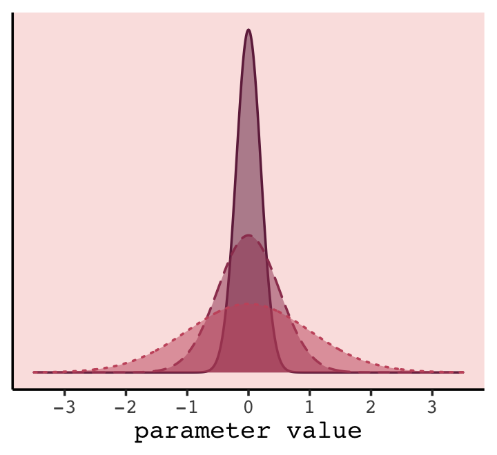
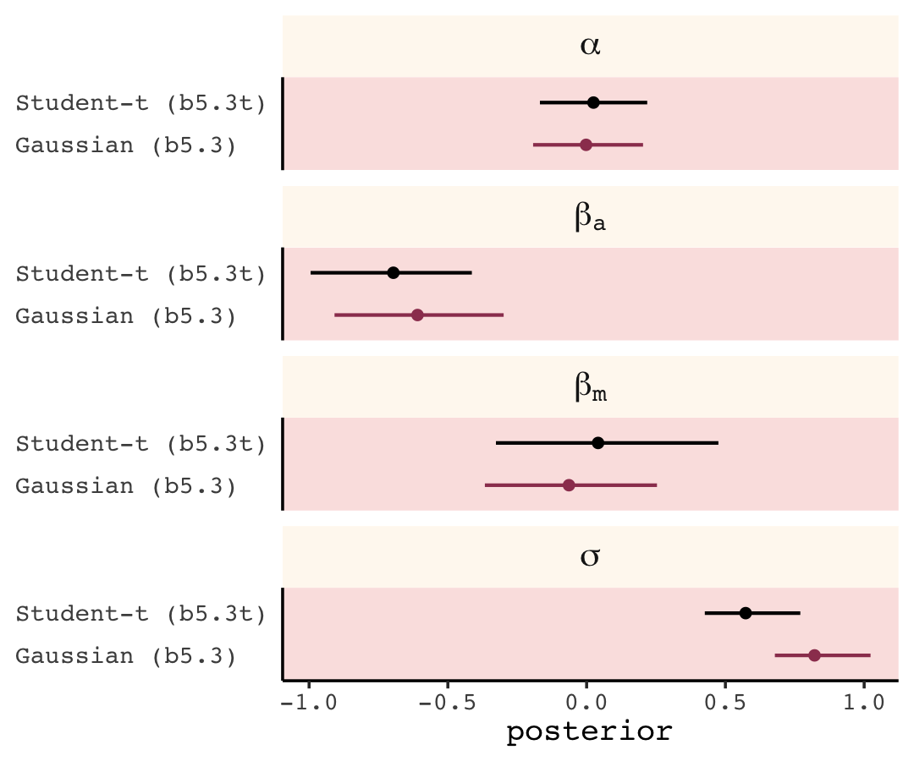

# Ulysses' Compass

In this chapter we contend with two contrasting kinds of statistical error:

* overfitting, "which leads to poor prediction by learning too *much* from the data"
* underfitting, "which leads to poor prediction by learning too *little* from the data" [@mcelreathStatisticalRethinkingBayesian2020, p. 192, *emphasis* added]

> Our job is to carefully navigate among these monsters. There are two common families of approaches. The first approach is to use a **regularizing prior** to tell the model not to get too excited by the data. This is the same device that non-Bayesian methods refer to as "penalized likelihood." The second approach is to use some scoring device, like **information criteria** or **cross-validation**, to model the prediction task and estimate predictive accuracy. Both families of approaches are routinely used in the natural and social sciences. Furthermore, they can be--maybe should be--used in combination. So it's worth understanding both, as you're going to need both at some point. (p. 192, **emphasis** in the original)

There's a lot going on in this chapter. More more practice with these ideas, check out @yarkoniChoosingPredictionExplanation2017, [*Choosing prediction over explanation in psychology: Lessons from machine learning*](https://www.ncbi.nlm.nih.gov/pmc/articles/PMC6603289/).

#### Rethinking stargazing.

> The most common form of model selection among practicing scientists is to search for a model in which every coefficient is statistically significant. Statisticians sometimes call this **stargazing**, as it is embodied by scanning for asterisks ($^{\star \star}$) trailing after estimates....
>
> Whatever you think about null hypothesis significance testing in general, using it to select among structurally different models is a mistake--$p$-values are not designed to help you navigate between underfitting and overfitting. (p. 193, **emphasis** in the original). 

McElreath spent little time discussing $p$-values and null hypothesis testing in the text. If you'd like to learn more from a Bayesian perspective, you might check out the first several chapters (particularly 10--13) in Kruschke's [-@kruschkeDoingBayesianData2015] [text](https://sites.google.com/site/doingbayesiandataanalysis/) and my [-@kurzDoingBayesianData2020] [ebook translating it to **brms** and the tidyverse](https://bookdown.org/content/3686/). The great [Frank Harrell](https://twitter.com/f2harrell) has complied [*A Litany of Problems With p-values*](https://www.fharrell.com/post/pval-litany/).
Also, don't miss the statement on $p$-values released by the [American Statistical Association](https://www.amstat.org/) [@wassersteinASAStatementPvalues2016].

## The problem with parameters

The $R^2$ is a popular way to measure how well you can retrodict the data. It traditionally follows the form

$$R^2 = \frac{\text{var(outcome)} - \text{var(residuals)}}{\text{var(outcome)}} = 1 - \frac{\text{var(residuals)}}{\text{var(outcome)}}.$$

By $\operatorname{var}()$, of course, we meant variance (i.e., what you get from the `var()` function in **R**). McElreath is not a fan of the $R^2$. But it's important in my field, so instead of a summary at the end of the chapter, we will cover the Bayesian version of $R^2$ and how to use it in **brms**.

### More parameters (almost) always improve fit.

We'll start off by making the data with brain size and body size for seven `species`.


```r
library(tidyverse)

(
  d <- 
  tibble(species = c("afarensis", "africanus", "habilis", "boisei", "rudolfensis", "ergaster", "sapiens"), 
         brain   = c(438, 452, 612, 521, 752, 871, 1350), 
         mass    = c(37.0, 35.5, 34.5, 41.5, 55.5, 61.0, 53.5))
  )
```

```
## # A tibble: 7 x 3
##   species     brain  mass
##   <chr>       <dbl> <dbl>
## 1 afarensis     438  37  
## 2 africanus     452  35.5
## 3 habilis       612  34.5
## 4 boisei        521  41.5
## 5 rudolfensis   752  55.5
## 6 ergaster      871  61  
## 7 sapiens      1350  53.5
```

Let's get ready for Figure 7.2. The plots in this chapter will be characterized by `theme_classic() + theme(text = element_text(family = "Courier"))`. Our color palette will come from the [**rcartocolor** package](https://CRAN.R-project.org/package=rcartocolor) [@R-rcartocolor], which provides color schemes [designed by 'CARTO'](https://carto.com/carto-colors/).


```r
# install.packages("rcartocolor", dependencies = T)
library(rcartocolor)
```

The specific palette we'll be using is "BurgYl." In addition to palettes, the **rcartocolor** package offers a few convenience functions which make it easier to use their palettes. The `carto_pal()` function will return the HEX numbers associated with a given palette's colors and the `display_carto_pal()` function will display the actual colors.


```r
carto_pal(7, "BurgYl")
```

```
## [1] "#fbe6c5" "#f5ba98" "#ee8a82" "#dc7176" "#c8586c" "#9c3f5d" "#70284a"
```

```r
display_carto_pal(7, "BurgYl")
```


We'll be using a diluted version of the third color for the panel background (i.e., `theme(panel.background = element_rect(fill = alpha(carto_pal(7, "BurgYl")[3], 1/4)))`) and the darker purples for other plot elements. Here's the plot.


```r
library(ggrepel)

theme_set(
  theme_classic() +
    theme(text = element_text(family = "Courier"),
          panel.background = element_rect(fill = alpha(carto_pal(7, "BurgYl")[3], 1/4)))
)

d %>%
  ggplot(aes(x =  mass, y = brain, label = species)) +
  geom_point(color = carto_pal(7, "BurgYl")[5]) +
  geom_text_repel(size = 3, color = carto_pal(7, "BurgYl")[7], family = "Courier", seed = 438) +
  labs(subtitle = "Average brain volume by body\nmass for six hominin species",
       x = "body mass (kg)",
       y = "brain volume (cc)") +
  xlim(30, 65)
```


Before fitting our models,

> we want to standardize body mass--give it mean zero and standard deviation one--and rescale the outcome, brain volume, so that the largest observed value is 1. Why not standardize brain volume as well? Because we want to preserve zero as a reference point: No brain at all. You can't have negative brain. I don't think. (p. 195)


```r
d <-
  d %>% 
  mutate(mass_std  = (mass - mean(mass)) / sd(mass),
         brain_std = brain / max(brain))
```

Our first statistical model will follow the form

\begin{align*}
\text{brain_std}_i & \sim \operatorname{Normal}(\mu_i, \sigma) \\
\mu_i              & = \alpha + \beta \text{mass_std}_i \\
\alpha             & \sim \operatorname{Normal}(0.5, 1) \\
\beta              & \sim \operatorname{Normal}(0, 10) \\
\sigma             & \sim \operatorname{Log-Normal}(0, 1).
\end{align*}

> This simply says that the average brain volume $b_i$ of species $i$ is a linear function of its body mass $m_i$. Now consider what the priors imply. The prior for $\alpha$ is just centered on the mean brain volume (rescaled) in the data. So it says that the average species with an average body mass has a brain volume with an 89% credible interval from about −1 to 2. That is ridiculously wide and includes impossible (negative) values. The prior for $\beta$ is very flat and centered on zero. It allows for absurdly large positive and negative relationships. These priors allow for absurd inferences, especially as the model gets more complex. And that's part of the lesson. (p. 196)

Instead of jumping into **brms**, we're going to practice fitting these initial models with **rethinking**. **brms** does fine with the first five models (`m7.1` through `m7.5`), but has major issues with the sixth-order polynomial model, `m7.6`. Given that I ~~suspect~~ hope you would not want to fit such a model for a real-world application, it's not worth the effort to try to fight **brms** to make it work. However, if any of my readers are actually able to get `m7.6` to work with **brms**, I'd be grateful if you [shared your code on GitHub](https://github.com/ASKurz/Statistical_Rethinking_with_brms_ggplot2_and_the_tidyverse_2_ed/issues).


```r
library(rethinking)

m7.1 <- quap( 
  alist(
    brain_std ~ dnorm(mu, exp(log_sigma)), 
    mu <- a + b * mass_std,
    a ~ dnorm(0.5, 1),
    b ~ dnorm(0, 10),
    log_sigma ~ dnorm(0, 1)
  ), 
  data = d)
```

Check the summary.


```r
precis(m7.1)
```

```
##                 mean         sd       5.5%      94.5%
## a          0.5285430 0.06842565  0.4191856  0.6379004
## b          0.1671092 0.07407970  0.0487155  0.2855028
## log_sigma -1.7067065 0.29378011 -2.1762239 -1.2371892
```

Although **rethinking** does not contain a convenience function for computing the $R^2$ directly, McElreath showed us how to make a function for that purpose ourselves. Because part of his `R2_is_bad()` function contains the `rethinking:sim()` function, I'm going to add a `seed` argument to make the results more reproducible.


```r
R2_is_bad <- function(quap_fit, seed = 7, ...) {
  set.seed(seed)
  s <- sim(quap_fit, refresh = 0, ...)
  r <- apply(s, 2, mean) - d$brain_std
  1 - var2(r) / var2(d$brain_std)
}
```

Here's the estimate for our $R^2$.


```r
R2_is_bad(m7.1)
```

```
## [1] 0.4616474
```

Do note that,

> in principle, the Bayesian approach mandates that we do this for each sample from the posterior. But $R^2$ is traditionally computed only at the mean prediction. So we'll do that as well here. Later in the chapter you'll learn a properly Bayesian score that uses the entire posterior distribution. (p. 197)

Now fit the quadratic through sixth-order polynomial models.


```r
# quadratic
m7.2 <- quap( 
  alist(
    brain_std ~ dnorm(mu, exp(log_sigma)), 
    mu <- a + b[1] * mass_std + b[2] * mass_std^2,
    a ~ dnorm(0.5, 1),
    b ~ dnorm(0, 10),
    log_sigma ~ dnorm(0, 1)
  ), 
  data = d, start = list(b = rep(0, 2)))

# cubic
m7.3 <- quap( 
  alist(
    brain_std ~ dnorm(mu, exp(log_sigma)), 
    mu <- a + b[1] * mass_std + b[2] * mass_std^2 + b[3] * mass_std^3,
    a ~ dnorm(0.5, 1),
    b ~ dnorm(0, 10),
    log_sigma ~ dnorm(0, 1)
  ), 
  data = d, start = list(b = rep(0, 3)))

# fourth-order
m7.4 <- quap( 
  alist(
    brain_std ~ dnorm(mu, exp(log_sigma)), 
    mu <- a + b[1] * mass_std + b[2] * mass_std^2 + b[3] * mass_std^3 + b[4] * mass_std^4,
    a ~ dnorm(0.5, 1),
    b ~ dnorm(0, 10),
    log_sigma ~ dnorm(0, 1)
  ), 
  data = d, start = list(b = rep(0, 4)))

# fifth-order
m7.5 <- quap( 
  alist(
    brain_std ~ dnorm(mu, exp(log_sigma)), 
    mu <- a + b[1] * mass_std + b[2] * mass_std^2 + b[3] * mass_std^3 + b[4] * mass_std^4 + b[5] * mass_std^5,
    a ~ dnorm(0.5, 1),
    b ~ dnorm(0, 10),
    log_sigma ~ dnorm(0, 1)
  ), 
  data = d, start = list(b = rep(0, 5)))

# sixth-order
m7.6 <- quap( 
  alist(
    brain_std ~ dnorm(mu, 0.001), 
    mu <- a + b[1] * mass_std + b[2] * mass_std^2 + b[3] * mass_std^3 + b[4] * mass_std^4 + b[5] * mass_std^5 + b[6] * mass_std^6,
    a ~ dnorm(0.5, 1),
    b ~ dnorm(0, 10)
  ), 
  data = d, start = list(b = rep(0, 6)))
```

Here's how we might plot the result for the first model, `m7.1`.


```r
library(tidybayes)

mass_seq <- seq(from = -2, to = 2, length.out = 100) 

link(m7.1, data = list(mass_std = mass_seq)) %>% 
  data.frame() %>% 
  pivot_longer(everything()) %>% 
  mutate(mass_std = rep(mass_seq, times = 1000)) %>% 
  group_by(mass_std) %>% 
  mean_qi(value, .width = .89) %>% 
  
  ggplot(aes(x = mass_std, y = value)) +
  geom_lineribbon(aes(ymin = .lower, ymax = .upper),
                  color = carto_pal(7, "BurgYl")[7], size = 1/2, 
                  fill = alpha(carto_pal(7, "BurgYl")[6], 1/3)) +
  geom_point(data = d,
             aes(y = brain_std),
             color = carto_pal(7, "BurgYl")[7]) +
  labs(subtitle = bquote(italic(R)^2==.(round(R2_is_bad(m7.1), digits = 2))),
       x = "body mass (standardized)",
       y = "brain volume (standardized)") +
  coord_cartesian(xlim = range(d$mass_std))
```


To slightly repurpose a quote from McElreath:

> We'll want to do this for the next several models, so let's write a function to make it repeatable. If you find yourself writing code more than once, it is usually saner to write a function and call the function more than once instead. (p. 197)

Our `make_figure7.3()` function will wrap the simulation, data wrangling, and plotting code all in one. It takes two arguments, the first of which defines which fit object we'd like to plot. If you look closely at Figure 7.3 in the text, you'll notice that the range of the $y$-axis changes in the last three plots. Our second argument, `ylim`, will allow us to vary those parameters across subplots.


```r
make_figure7.3 <- function(quap_fit, ylim = range(d$brain_std)) {
  
  # compute the R2
  r2 <- R2_is_bad(quap_fit)
  
  # define the mass_seq 
  mass_seq <- seq(from = -2, to = 2, length.out = 100) 
  
  # simulate and wrangle
  link(quap_fit, data = list(mass_std = mass_seq)) %>% 
    data.frame() %>% 
    pivot_longer(everything()) %>% 
    mutate(mass_std = rep(mass_seq, times = 1000)) %>% 
    group_by(mass_std) %>% 
    mean_qi(value, .width = .89) %>% 
    
    # plot!  
    ggplot(aes(x = mass_std, y = value)) +
    geom_lineribbon(aes(ymin = .lower, ymax = .upper),
                    color = carto_pal(7, "BurgYl")[7], size = 1/2, 
                    fill = alpha(carto_pal(7, "BurgYl")[6], 1/3)) +
    geom_point(data = d,
               aes(y = brain_std),
               color = carto_pal(7, "BurgYl")[7]) +
    labs(subtitle = bquote(italic(R)^2==.(round(r2, digits = 2))),
         x = "body mass (std)",
         y = "brain volume (std)") +
    coord_cartesian(xlim = c(-1.2, 1.5),
                    ylim = ylim)
}
```

Here we make and save the six subplots in bulk.


```r
p1 <- make_figure7.3(m7.1)
p2 <- make_figure7.3(m7.2)
p3 <- make_figure7.3(m7.3)
p4 <- make_figure7.3(m7.4, ylim = c(.25, 1.1))
p5 <- make_figure7.3(m7.5, ylim = c(.1, 1.4))
p6 <- make_figure7.3(m7.6, ylim = c(-0.25, 1.5)) +
  geom_hline(yintercept = 0, color = carto_pal(7, "BurgYl")[2], linetype = 2) 
```

Now use **patchwork** syntax to bundle them all together.


```r
library(patchwork)

((p1 | p2) / (p3 | p4) / (p5 | p6)) +
  plot_annotation(title = "Figure7.3. Polynomial linear models of increasing\ndegree for the hominin data.")
```


If you really what the axes scaled in the original metrics of the variables rather than their standardized form, you can use the re-scaling techniques from back in [Section 4.5.1.0.1][Overthinking: Converting back to natural scale.].

"This is a general phenomenon: If you adopt a model family with enough parameters, you can fit the data exactly. But such a model will make rather absurd predictions for yet-to-be-observed cases" (pp. 199--201).

#### Rethinking: Model fitting as compression.

> Another perspective on the absurd model just above is to consider that model fitting can be considered a form of **data compression**. Parameters summarize relationships among the data. These summaries compress the data into a simpler form, although with loss of information ("lossy" compression) about the sample. The parameters can then be used to generate new data, effectively decompressing the data. (p. 201, **emphasis** in the original)

### Too few parameters hurts, too.

> The overfit polynomial models fit the data extremely well, but they suffer for this within-sample accuracy by making nonsensical out-of-sample predictions. In contrast, **underfitting** produces models that are inaccurate both within and out of sample. They learn too little, failing to recover regular features of the sample. (p. 201, **emphasis** in the original)

To explore the distinctions between overfitting and underfitting, we'll need to refit `m7.1` and `m7.4` several times after serially dropping one of the rows in the data. You can `filter()` by `row_number()` to drop rows in a [**tidyverse** kind of way](https://dplyr.tidyverse.org/reference/slice.html). For example, we can drop the second row of `d` like this.


```r
 d %>%
  mutate(row = 1:n()) %>% 
  filter(row_number() != 2)
```

```
## # A tibble: 6 x 6
##   species     brain  mass mass_std brain_std   row
##   <chr>       <dbl> <dbl>    <dbl>     <dbl> <int>
## 1 afarensis     438  37     -0.779     0.324     1
## 2 habilis       612  34.5   -1.01      0.453     3
## 3 boisei        521  41.5   -0.367     0.386     4
## 4 rudolfensis   752  55.5    0.917     0.557     5
## 5 ergaster      871  61      1.42      0.645     6
## 6 sapiens      1350  53.5    0.734     1         7
```

In his **Overthinking: Dropping rows** box (p. 202), McElreath encouraged us to take a look at the `brain_loo_plot()` function to get a sense of how he made his Figure 7.4. Here it is.


```r
brain_loo_plot
```

```
## function (fit, atx = c(35, 47, 60), aty = c(450, 900, 1300), 
##     xlim, ylim, npts = 100) 
## {
##     post <- extract.samples(fit)
##     n <- dim(post$b)[2]
##     if (is.null(n)) 
##         n <- 1
##     if (missing(xlim)) 
##         xlim <- range(d$mass_std)
##     else xlim <- (xlim - mean(d$mass))/sd(d$mass)
##     if (missing(ylim)) 
##         ylim <- range(d$brain_std)
##     else ylim <- ylim/max(d$brain)
##     plot(d$brain_std ~ d$mass_std, xaxt = "n", yaxt = "n", xlab = "body mass (kg)", 
##         ylab = "brain volume (cc)", col = rangi2, pch = 16, xlim = xlim, 
##         ylim = ylim)
##     axis_unscale(1, atx, d$mass)
##     axis_unscale(2, at = aty, factor = max(d$brain))
##     d <- as.data.frame(fit@data)
##     for (i in 1:nrow(d)) {
##         di <- d[-i, ]
##         m_temp <- quap(fit@formula, data = di, start = list(b = rep(0, 
##             n)))
##         xseq <- seq(from = xlim[1] - 0.2, to = xlim[2] + 0.2, 
##             length.out = npts)
##         l <- link(m_temp, data = list(mass_std = xseq), refresh = 0)
##         mu <- apply(l, 2, mean)
##         lines(xseq, mu, lwd = 2, col = col.alpha("black", 0.3))
##     }
##     model_name <- deparse(match.call()[[2]])
##     mtext(model_name, adj = 0)
## }
## <bytecode: 0x7fea21b06710>
## <environment: namespace:rethinking>
```

Though we'll be taking a slightly different route than the one outlined in McElreath's `brain_loo_plot()` function, we can glean some great insights. For example, here's a tricky way to update a `quap()` model.


```r
m7.1.1 <- quap(m7.1@formula,
               data = filter(d, row_number() != 1))

precis(m7.1.1)
```

```
##                 mean         sd        5.5%      94.5%
## a          0.5423856 0.08033785  0.41399022  0.6707810
## b          0.1544354 0.08500937  0.01857405  0.2902968
## log_sigma -1.6318773 0.32047814 -2.14406327 -1.1196914
```

You can see by the `data` statement that `m7.1.1` is fit on the `d` data after dropping the first row. Here's how we might amend out plotting strategy from before to visualize the posterior mean for the model-implied trajectory.


```r
link(m7.1.1, data = list(mass_std = mass_seq)) %>% 
  data.frame() %>% 
  pivot_longer(everything()) %>% 
  mutate(mass_std = rep(mass_seq, times = 1000)) %>% 
  group_by(mass_std) %>% 
  summarise(mean = mean(value)) %>% 
  
  ggplot(aes(x = mass_std, y = mean)) +
  geom_line(color = carto_pal(7, "BurgYl")[7], size = 1/2, alpha = 1/2) +
  geom_point(data = d,
             aes(y = brain_std),
             color = carto_pal(7, "BurgYl")[7]) +
  labs(subtitle = "m7.1.1",
       x = "body mass (std)",
       y = "brain volume (std)") +
  coord_cartesian(xlim = range(d$mass_std),
                  ylim = range(d$brain_std))
```


Now we can build off of those sensibilities to make an alternative to McElreath's `brain_loo_plot`. Our `brain_loo_lines()` function will refit a model after dropping the row we define in the `row` argument. After fitting the model, it then extracts the fitted line over the previously-defined values of `mass_seq`.


```r
brain_loo_lines <- function(quap_fit, row) {
  
  # determine the order of the polynomial
  n <- extract.samples(quap_fit)$b %>% ncol()
  if (is.null(n)) 
    n <- 1
  
  # refit the model
  fit <- quap(quap_fit@formula,
              data = filter(d, row_number() != row),
              start = list(b = rep(0, times = n)))
  
  # pull the lines values
  link(fit, data = list(mass_std = mass_seq)) %>% 
    data.frame() %>% 
    pivot_longer(everything()) %>% 
    mutate(mass_std = rep(mass_seq, times = 1000)) %>% 
    group_by(mass_std) %>% 
    summarise(mean = mean(value))
  
}
```

Here's how `brain_loo_lines()` works.


```r
brain_loo_lines(m7.1, row = 1) %>% 
  glimpse()
```

```
## Rows: 100
## Columns: 2
## $ mass_std <dbl> -2.0000000, -1.9595960, -1.9191919, -1.8787879, -1.8383838, -1.7979798, -1.75757…
## $ mean     <dbl> 0.2303865, 0.2366386, 0.2428908, 0.2491429, 0.2553951, 0.2616472, 0.2678994, 0.2…
```

Working within the **tidyverse** paradigm, we'll make a tibble with the predefined `row` values. We will then use `purrr::map()` to plug those `row` values into `brain_loo_lines()`, which will return the desired posterior `mean` values for each corresponding value of `mass_std`. Then we pump those values into `ggplot()` and customize the appearance of our plots from there.


```r
p1 <-
  tibble(row = 1:7) %>% 
  mutate(post = purrr::map(row, ~brain_loo_lines(quap_fit = m7.1, row = .))) %>% 
  unnest(post) %>%  
  
  ggplot(aes(x = mass_std, y = mean)) +
  geom_line(aes(group = row),
            color = carto_pal(7, "BurgYl")[7], size = 1/2, alpha = 1/2) +
  geom_point(data = d,
             aes(y = brain_std),
             color = carto_pal(7, "BurgYl")[7]) +
  labs(subtitle = "m7.1",
       x = "body mass (standardized)",
       y = "brain volume (standardized)") +
  coord_cartesian(xlim = range(d$mass_std),
                  ylim = range(d$brain_std))

p2 <-
  tibble(row = 1:7) %>% 
  mutate(post = purrr::map(row, ~brain_loo_lines(quap_fit = m7.4, row = .))) %>% 
  unnest(post) %>%  
  
  ggplot(aes(x = mass_std, y = mean)) +
  geom_line(aes(group = row),
            color = carto_pal(7, "BurgYl")[7], size = 1/2, alpha = 1/2) +
  geom_point(data = d,
             aes(y = brain_std),
             color = carto_pal(7, "BurgYl")[7]) +
  labs(subtitle = "m7.4",
       x = "body mass (standardized)",
       y = "brain volume (standardized)") +
  coord_cartesian(xlim = range(d$mass_std),
                  ylim = c(-0.1, 1.6))

p1 + p2
```


"Notice that the straight lines hardly vary, while the curves fly about wildly. This is a general contrast between underfit and overfit models: sensitivity to the exact composition of the sample used to fit the model" (p. 201).

#### Rethinking: Bias and variance. 

> The underfitting/overfitting dichotomy is often described as the **bias-variance trade-off**. While not exactly the same distinction, the bias-variance trade-off addresses the same problem. "Bias" is related to underfitting, while "variance" is related to overfitting. These terms are confusing, because they are used in many different ways in different contexts, even within statistics. The term "bias" also sounds like a bad thing, even though increasing bias often leads
to better predictions. (p. 201, **emphasis** in the original)

Take a look at @yarkoniChoosingPredictionExplanation2017 for more on the bias-variance trade-off. As McElreath indicated in his endnote #104 (p. 563), Hastie, Tibshirani and Friedman [-@hastie2009elements] broadly cover these ideas in their freely-downloadable text, [*The elements of statistical learning*](https://link.springer.com/book/10.1007%2F978-0-387-84858-7).

## Entropy and accuracy

> So how do we navigate between the hydra of overfitting and the vortex of underfitting? Whether you end up using regularization or information criteria or both, the first thing you must do is pick a criterion of model performance. What do you want the model to do well at? We'll call this criterion the *target*, and in this section you'll see how information theory provides a common and useful target. (p. 202, *emphasis* in the original)

### Firing the weatherperson.

If you let rain = 1 and sun = 0, here's a way to make a plot of the first table of page 203, the weatherperson's predictions.


```r
weatherperson <-
  tibble(day        = 1:10,
         prediction = rep(c(1, 0.6), times = c(3, 7)),
         observed   = rep(c(1, 0), times = c(3, 7))) 

weatherperson %>% 
  pivot_longer(-day) %>%
  
  ggplot(aes(x = day, y = name, fill = value)) +
  geom_tile(color = "white") +
  geom_text(aes(label = value, color = value == 0)) +
  scale_x_continuous(breaks = 1:10, expand = c(0, 0)) +
  scale_y_discrete(NULL, expand = c(0, 0)) +
  scale_fill_viridis_c(direction = -1) +
  scale_color_manual(values = c("white", "black")) +
  theme(legend.position = "none",
        axis.ticks.y = element_blank())
```


Here's how the newcomer fared:


```r
newcomer <-
  tibble(day        = 1:10,
         prediction = 0,
         observed   = rep(c(1, 0), times = c(3, 7)))

newcomer %>% 
  pivot_longer(-day) %>%
  
  ggplot(aes(x = day, y = name, fill = value)) +
  geom_tile(color = "white") +
  geom_text(aes(label = value, color = value == 0)) +
  scale_x_continuous(breaks = 1:10, expand = c(0, 0)) +
  scale_y_discrete(NULL, expand = c(0, 0)) +
  scale_fill_viridis_c(direction = -1) +
  scale_color_manual(values = c("white", "black")) +
  theme(legend.position = "none",
        axis.ticks.y = element_blank())
```


If we do the math entailed in the tibbles, we'll see why the newcomer could boast "I'm the best person for the job" (p. 203).


```r
weatherperson %>% 
  bind_rows(newcomer) %>% 
  mutate(person = rep(c("weatherperson", "newcomer"), each = n()/2),
         hit    = ifelse(prediction == observed, 1, 1 - prediction - observed)) %>% 
  group_by(person) %>% 
  summarise(hit_rate = mean(hit))
```

```
## # A tibble: 2 x 2
##   person        hit_rate
##   <chr>            <dbl>
## 1 newcomer          0.7 
## 2 weatherperson     0.58
```

#### Costs and benefits.

Our new `points` variable doesn't fit into the nice color-based `geom_tile()` plots from above, but we can still do the math.


```r
bind_rows(weatherperson,
          newcomer) %>% 
  mutate(person = rep(c("weatherperson", "newcomer"), each = n()/2),
         points = ifelse(observed == 1 & prediction != 1, -5,
                         ifelse(observed == 1 & prediction == 1, -1,
                                -1 * prediction))) %>% 
  group_by(person) %>% 
  summarise(happiness = sum(points))
```

```
## # A tibble: 2 x 2
##   person        happiness
##   <chr>             <dbl>
## 1 newcomer          -15  
## 2 weatherperson      -7.2
```

#### Measuring accuracy.

> Consider computing the probability of predicting the exact sequence of days. This means computing the probability of a correct prediction for each day. Then multiply all of these probabilities together to get the joint probability of correctly predicting the observed sequence. This is the same thing as the joint likelihood, which you've been using up to this point to fit models with Bayes' theorem. This is the definition of accuracy that is maximized by the correct model.
>
> In this light, the newcomer looks even worse. (p. 204)


```r
bind_rows(weatherperson,
          newcomer) %>% 
  mutate(person = rep(c("weatherperson", "newcomer"), each = n() / 2),
         hit    = ifelse(prediction == observed, 1, 1 - prediction - observed)) %>% 
  count(person, hit) %>% 
  mutate(power = hit ^ n,
         term  = rep(letters[1:2], times = 2)) %>% 
  select(person, term, power) %>% 
  pivot_wider(names_from = term,
              values_from = power) %>% 
  mutate(probability_correct_sequence = a * b)
```

```
## # A tibble: 2 x 4
##   person              a     b probability_correct_sequence
##   <chr>           <dbl> <dbl>                        <dbl>
## 1 newcomer      0           1                      0      
## 2 weatherperson 0.00164     1                      0.00164
```

### Information and uncertainty.

Within the context of information theory [@shannonMathematicalTheoryCommunication1948; also @cover2006elements], information is "the reduction in uncertainty when we learn an outcome" (p. 205). **Information entropy** is a way of measuring that uncertainty in a way that is (a) continuous, (b) increases as the number of possible events increases, and (c) is additive. The formula for information entropy is:

$$H(p) = - \text E \log (p_i) = - \sum_{i = 1}^n p_i \log (p_i)$$

McElreath put it in words as: "The uncertainty contained in a probability distribution is the average log-probability of an event." (p. 206). We'll compute the information entropy for weather at the first unnamed location, which we'll call `McElreath's house`, and `Abu Dhabi` at once.


```r
tibble(place  = c("McElreath's house", "Abu Dhabi"),
       p_rain = c(.3, .01)) %>% 
  mutate(p_shine = 1 - p_rain) %>% 
  group_by(place) %>% 
  mutate(h_p = (p_rain * log(p_rain) + p_shine * log(p_shine)) %>% mean() * -1)
```

```
## # A tibble: 2 x 4
## # Groups:   place [2]
##   place             p_rain p_shine    h_p
##   <chr>              <dbl>   <dbl>  <dbl>
## 1 McElreath's house   0.3     0.7  0.611 
## 2 Abu Dhabi           0.01    0.99 0.0560
```

Did you catch how we used the equation $H(p) = - \sum_{i = 1}^n p_i \log (p_i)$ in our `mutate()` code, there? Our computation indicated the uncertainty is less in Abu Dhabi because it rarely rains, there. If you have sun, rain and snow, the entropy for weather is:


```r
p <- c(.7, .15, .15)
-sum(p * log(p))
```

```
## [1] 0.8188085
```

"These entropy values by themselves don’t mean much to us, though. Instead we can use them to build a measure of accuracy. That comes next" (p. 206).

### From entropy to accuracy.

> How can we use information entropy to say how far a model is from the target? The key lies in **divergence**:
>
>> **Divergence**: The additional uncertainty induced by using probabilities from one distribution to describe another distribution.
>
> This is often known as *Kullback-Leibler divergence* or simply KL divergence. [p. 207, **emphasis** in the original,  see @kullbackInformationSufficiency1951]

The formula for the KL divergence is

$$D_\text{KL} (p, q) = \sum_i p_i \big ( \log (p_i) - \log (q_i) \big ) = \sum_i p_i \log \left ( \frac{p_i}{q_i} \right ),$$

which is what McElreath described in plainer language as "the average difference in log probability between the target ($p$) and model ($q$)" (p. 207).

In McElreath's initial example

* $p_1 = .3$,
* $p_2 = .7$,
* $q_1 = .25$, and
* $q_2 = .75$.

With those values, we can compute $D_\text{KL} (p, q)$ within a tibble like so:


```r
tibble(p_1 = .3,
       p_2 = .7,
       q_1 = .25,
       q_2 = .75) %>%
  mutate(d_kl = (p_1 * log(p_1 / q_1)) + (p_2 * log(p_2 / q_2)))
```

```
## # A tibble: 1 x 5
##     p_1   p_2   q_1   q_2    d_kl
##   <dbl> <dbl> <dbl> <dbl>   <dbl>
## 1   0.3   0.7  0.25  0.75 0.00640
```

Our systems in this section are binary (e.g., $q = \{ q_i, q_2 \}$). Thus if you know $q_1 = .3$ you know of a necessity $q_2 = 1 - q_1$. Therefore we can code the tibble for the next example, for when $p = q$, like this.


```r
tibble(p_1 = .3) %>% 
  mutate(p_2 = 1 - p_1,
         q_1 = p_1) %>% 
  mutate(q_2 = 1 - q_1) %>%
  mutate(d_kl = (p_1 * log(p_1 / q_1)) + (p_2 * log(p_2 / q_2)))
```

```
## # A tibble: 1 x 5
##     p_1   p_2   q_1   q_2  d_kl
##   <dbl> <dbl> <dbl> <dbl> <dbl>
## 1   0.3   0.7   0.3   0.7     0
```

Building off of that, you can make the data required for Figure 7.6 like this.


```r
t <- 
  tibble(p_1 = .3,
         p_2 = .7,
         q_1 = seq(from = .01, to = .99, by = .01)) %>% 
  mutate(q_2 = 1 - q_1) %>%
  mutate(d_kl = (p_1 * log(p_1 / q_1)) + (p_2 * log(p_2 / q_2)))

head(t)
```

```
## # A tibble: 6 x 5
##     p_1   p_2   q_1   q_2  d_kl
##   <dbl> <dbl> <dbl> <dbl> <dbl>
## 1   0.3   0.7  0.01  0.99 0.778
## 2   0.3   0.7  0.02  0.98 0.577
## 3   0.3   0.7  0.03  0.97 0.462
## 4   0.3   0.7  0.04  0.96 0.383
## 5   0.3   0.7  0.05  0.95 0.324
## 6   0.3   0.7  0.06  0.94 0.276
```

Now we have the data, plotting Figure 7.6 is a just `geom_line()` with stylistic flourishes.


```r
t %>% 
  ggplot(aes(x = q_1, y = d_kl)) +
  geom_vline(xintercept = .3, color = carto_pal(7, "BurgYl")[5], linetype = 2) +
  geom_line(color = carto_pal(7, "BurgYl")[7], size = 1.5) +
  annotate(geom = "text", x = .4, y = 1.5, label = "q = p",
           color = carto_pal(7, "BurgYl")[5], family = "Courier", size = 3.5) +
  labs(x = "q[1]",
       y = "Divergence of q from p")
```


> What divergence can do for us now is help us contrast different approximations to $p$. As an approximating function $q$ becomes more accurate, $D_\text{KL} (p, q)$ will shrink. So if we have a pair of candidate distributions, then the candidate that minimizes the divergence will be closest to the target. Since predictive models specify probabilities of events (observations), we can use divergence to compare the accuracy of models. (p. 208)

#### Rethinking: Divergence depends upon direction.

Here we see $H(p, q) \neq H(q, p)$. That is, direction matters.


```r
tibble(direction = c("Earth to Mars", "Mars to Earth"),
       p_1       = c(.01, .7),
       q_1       = c(.7, .01)) %>% 
  mutate(p_2 = 1 - p_1,
         q_2 = 1 - q_1) %>%
  mutate(d_kl = (p_1 * log(p_1 / q_1)) + (p_2 * log(p_2 / q_2)))
```

```
## # A tibble: 2 x 6
##   direction       p_1   q_1   p_2   q_2  d_kl
##   <chr>         <dbl> <dbl> <dbl> <dbl> <dbl>
## 1 Earth to Mars  0.01  0.7   0.99  0.3   1.14
## 2 Mars to Earth  0.7   0.01  0.3   0.99  2.62
```

The $D_\text{KL}$ was double when applying Martian estimates to Terran estimates. 

> An important practical consequence of this asymmetry, in a model fitting context, is that if we use a distribution with high entropy to approximate an unknown true distribution of events, we will reduce the distance to the truth and therefore the error. This fact will help us build generalized linear models, later on in [Chapter 10][Big Entropy and the Generalized Linear Model]. (p. 209)

### Estimating divergence.

> The point of all the preceding material about information theory and divergence is to establish both:
>
> 1. How to measure the distance of a model from our target. Information theory gives us the distance measure we need, the KL divergence.
>
> 2. How to estimate the divergence. Having identified the right measure of distance, we now need a way to estimate it in real statistical modeling tasks. (p. 209)

Now we'll start working on item #2.

Within the context of science, say we've labeled the true model for our topic of interest as $p$. We don't actually know what $p$ is--we wouldn't need the scientific method if we did. But say what we do have are two candidate models $q$ and $r$. We would at least like to know which is closer to $p$. It turns out we don't even need to know the absolute value of $p$ to achieve this. Just the relative values of $q$ and $r$ will suffice. We express model $q$'s average log-probability as $\text E \log (q_i)$. Extrapolating, the difference $\text E \log (q_i) - \text E \log (r_i)$ gives us a sense about the divergence of both $q$ and $r$ from the target $p$. That is, "we can compare the average log-probability from each model to get an estimate of the relative distance of each model from the target" (p. 210). **Deviance** and related statistics can help us towards this end. We define deviance as

$$D(q) = -2 \sum_i \log (q_i),$$

where $i$ indexes each case and $q_i$ is the likelihood for each case. Here's the deviance from the OLS version of model `m7.1`.


```r
lm(data = d, brain_std ~ mass_std) %>% 
  logLik() * -2
```

```
## 'log Lik.' -5.985049 (df=3)
```

In our $D(q)$ formula, did you notice how we ended up multiplying $\sum_i \log (p_i)$ by $-2$? Frequentists and Bayesians alike make use of information theory, KL divergence, and deviance. It turns out that the differences between two $D(q)$ values follows a $\chi^2$ distribution [@wilksLargesampleDistributionLikelihood1938], which frequentists like to reference for the purpose of null-hypothesis significance testing. Many Bayesians, however, are not into all that significance-testing stuff and they aren't as inclined to multiply $\sum_i \log (p_i)$ by $-2$ for the simple purpose of scaling the associated difference distribution to follow the $\chi^2$. If we leave that part out of the equation, we end up with

$$S(q) = \sum_i \log (q_i),$$

which we can think of as a log-probability score which is "the gold standard way to compare the predictive accuracy of different models. It is an estimate of $\text E \log (q_i)$, just without the final step of dividing by the number of observations" (p. 210). When Bayesians compute $S(q)$, they do so over the entire posterior distribution. "Doing this calculation correctly requires a little subtlety. The **rethinking** package has a function called `lppd`--**log-pointwise-predictive-density**--to do this calculation for quap models" (p. 210, **emhasis** in the original for the second time, but not the first). Here's the `rethinking::lppd()` function in action for `m7.1`.


```r
set.seed(1)
l <- lppd(m7.1, n = 1e4)
l
```

```
## [1]  0.6098668  0.6483438  0.5496093  0.6234934  0.4648143  0.4347605 -0.8444632
```

Our `l` object contained the seven case-specific values for $\log(q_i)$. Here we sum them up to compute $S(q)$.


```r
sum(l)
```

```
## [1] 2.486425
```

Here's how to take the last step if you would like to express that as $D(q)$.


```r
-2 * sum(l)
```

```
## [1] -4.97285
```

#### Overthinking: Computing the lppd.

We can follow along with both our **rethinking** model `m7.1` and a counterpart fit with **brms**.


```r
library(brms)

b7.1 <- 
  brm(data = d, 
      family = gaussian(),
      brain_std ~ 1 + mass_std,
      prior = c(prior(normal(0.5, 1), class = Intercept),
                prior(normal(0, 10), class = b),
                prior(exponential(4.189324), class = sigma)),
      iter = 2000, warmup = 1000, chains = 4, cores = 4,
      seed = 7,
      file = "fits/b07.01")
```

Before we move on, we should clarify where that `exponential(4.189324)` prior on $\sigma$ came from. Recall that the parameter in the exponential distribution is the rate, $\lambda$. To get the mean of the exponential distribution, you take the reciprocal of the rate.

$$\mu_y = \frac{1}{\lambda}$$

Since I wanted a diffuse prior for sigma with the mean centered around `sd(d$brain_std)`, a quick computation revealed that the appropriate $\lambda$ would be about 4.2.


```r
1 / sd(d$brain_std)
```

```
## [1] 4.189324
```

Anyway, here's our summary for `b7.1`.


```r
print(b7.1)
```

```
##  Family: gaussian 
##   Links: mu = identity; sigma = identity 
## Formula: brain_std ~ 1 + mass_std 
##    Data: d (Number of observations: 7) 
## Samples: 4 chains, each with iter = 2000; warmup = 1000; thin = 1;
##          total post-warmup samples = 4000
## 
## Population-Level Effects: 
##           Estimate Est.Error l-95% CI u-95% CI Rhat Bulk_ESS Tail_ESS
## Intercept     0.53      0.09     0.34     0.70 1.00     2392     1187
## mass_std      0.17      0.09    -0.04     0.34 1.00     2611     1787
## 
## Family Specific Parameters: 
##       Estimate Est.Error l-95% CI u-95% CI Rhat Bulk_ESS Tail_ESS
## sigma     0.22      0.08     0.12     0.43 1.00     1339     1584
## 
## Samples were drawn using sampling(NUTS). For each parameter, Bulk_ESS
## and Tail_ESS are effective sample size measures, and Rhat is the potential
## scale reduction factor on split chains (at convergence, Rhat = 1).
```

The **brms** package contains a `log_lik()` function, which returns a matrix. Each occasion gets a column and each HMC chain iteration gets a row.


```r
log_lik(b7.1) %>%
  glimpse()
```

```
##  num [1:4000, 1:7] 0.586 1.161 0.742 0.877 0.442 ...
##  - attr(*, "dimnames")=List of 2
##   ..$ : NULL
##   ..$ : NULL
```

In just a bit, we'll see that this output is very similar to what we get from **rethinking**. For now, focus back to the text. On page 210, McElreath clarified that the Bayesian version of the log-probability score, what we've been calling the lppd, has to account for the data and the posterior distribution. It follows the form

$$\text{lppd}(y, \Theta) = \sum_i \log \frac{1}{S} \sum_s p (y_i | \Theta_s),$$

> where $S$ is the number of samples and $\Theta_s$ is the $s$-th set of sampled parameter values in the posterior distribution. While in principle this is easy--you just need to compute the probability (density) of each observation $i$ for each sample $s$, take the average, and then the logarithm--in practice it is not so easy. The reason is that doing arithmetic in a computer often requires some tricks to retain precision. (p. 210)

We can wrap a mild reworking of McElreath's **R** code 7.14 code into a custom `lppd_r()` function.


```r
lppd_r <- function(quap_fit, seed = 1, n = 1e4) {
  
  set.seed(seed)
  
  lp <- sim(quap_fit, ll = TRUE, n = n)
  ni <- ncol(lp)
  ns <- nrow(lp)
  
  f <- function(i) {log_sum_exp(lp[, i]) - log(ns)}
  
  sapply(1:ni, f)
  
}
```

The `lppd_r()` function is designed to work with models fit with `rethinking::quap()`. It works like this.


```r
lppd_r(m7.1)
```

```
## [1]  0.6098668  0.6483438  0.5496093  0.6234934  0.4648143  0.4347605 -0.8444632
```

Happily, it returned the same results as McElreath's **R** code 7.13 (p. 210). Our **brms** analogue to the output from `sim(quap_fit, ll = TRUE, n = 1e4)` is to inset a `brm()` model fit into the `log_lik()` function. Although the way those two functions compute their output differs, the format is largely the same. With that in mind, here's a mild reworking of our `lppd_r()` function designed to work with **brms** fits.


```r
lppd_b <- function(brm_fit) {
  
  lp <- log_lik(brm_fit)
  
  ni <- ncol(lp)
  ns <- nrow(lp)
  
  f <- function(i) {log_sum_exp(lp[, i]) - log(ns)}
  
  sapply(1:ni, f)
  
}
```

Here's what it returns for `b7.1`.


```r
lppd_b(b7.1)
```

```
## [1]  0.5261533  0.5627924  0.4642181  0.5349419  0.3768194  0.3423058 -0.7249722
```

Given we fit the model with a different prior on $\sigma$ and with a different algorithm (HMC versus using the quadratic approximation), we might expect the results would differ a bit. Happily, the overall pattern is very similar. Here we compare the results from the two packages in a plot.


```r
tibble(rethinking = lppd_r(m7.1),
       brms       = lppd_b(b7.1),
       i          = factor(1:7)) %>% 
  pivot_longer(-i) %>% 
  
  ggplot(aes(x = value, y = i)) +
  geom_line(aes(group = i),
            color = carto_pal(7, "BurgYl")[2], linetype = 3) +
  geom_point(aes(color = name),
             size = 2.5) +
  scale_color_manual("package", values = carto_pal(7, "BurgYl")[c(4, 7)]) +
  labs(x = "lppd",
       y = expression(italic(i)))
```


### Scoring the right data.

Here's a **tidyverse**-style approach for computing the lppd for each of our six **rethinking** models.


```r
set.seed(1)

tibble(name = str_c("m7.", 1:6)) %>% 
  mutate(fit = purrr::map(name, get)) %>% 
  mutate(lppd = purrr::map_dbl(fit, ~sum(lppd(.))))
```

```
## # A tibble: 6 x 3
##   name  fit     lppd
##   <chr> <list> <dbl>
## 1 m7.1  <map>   2.49
## 2 m7.2  <map>   2.57
## 3 m7.3  <map>   3.71
## 4 m7.4  <map>   5.33
## 5 m7.5  <map>  14.1 
## 6 m7.6  <map>  39.4
```

> When we usually have data and use it to fit a statistical model, the data comprise a **training sample**. Parameters are estimated from it, and then we can imagine using those estimates to predict outcomes in a new sample, called the **test sample**. R is going to do all of this for you. But here's the full procedure, in outline:
>
> 1. Suppose there's a training sample of size $N$.
> 2. Compute the posterior distribution of a model for the training sample, and compute the score on the training sample. Call this score $D_\text{train}$.
> 3. Suppose another sample of size $N$ from the same process. This is the test sample.
> 4. Compute the score on the test sample, using the posterior trained on the training
sample. Call this new score $D_\text{test}$.
>
> The above is a thought experiment. It allows us to explore the distinction between accuracy measured in and out of sample, using a simple prediction scenario. (p. 211, **emphasis** in the original)

We'll see how to carry out such a thought experiment in the next section.

#### Overthinking: Simulated training and testing.

McElreath plotted the results of such a thought experiment in implemented in **R** with the aid of his `sim_train_test()` function. If you're interested in how the function pulls this off, execute the code below.


```r
sim_train_test
```

For the sake of brevity, I am going to show the results of a simulation based on 1,000 simulations rather than McElreath's 10,000. 


```r
# I've reduced this number by one order of magnitude to reduce computation time
n_sim   <- 1e3
n_cores <- 8
kseq    <- 1:5

# define the simulation function
my_sim <- function(k) {
  
  print(k);
  r <- mcreplicate(n_sim, sim_train_test(N = n, k = k), mc.cores = n_cores);
  c(mean(r[1, ]), mean(r[2, ]), sd(r[1, ]), sd(r[2, ]))
  
}

# here's our dev object based on `N <- 20`
n      <- 20
dev_20 <-
  sapply(kseq, my_sim)

# here's our dev object based on N <- 100
n       <- 100
dev_100 <- 
  sapply(kseq, my_sim)
```


If you didn't quite catch it, the simulation yields `dev_20` and `dev_100`. We'll want to convert them to tibbles, bind them together, and wrangle extensively before we're ready to plot.


```r
dev_tibble <-
  rbind(dev_20, dev_100) %>% 
  data.frame() %>% 
  mutate(statistic = rep(c("mean", "sd"), each = 2) %>% rep(., times = 2),
         sample    = rep(c("in", "out"), times = 2) %>% rep(., times = 2),
         n         = rep(c("n = 20", "n = 100"), each = 4)) %>% 
  pivot_longer(-(statistic:n)) %>% 
  pivot_wider(names_from = statistic,
              values_from = value) %>%
  mutate(n     = factor(n, levels = c("n = 20", "n = 100")),
         n_par = str_extract(name, "\\d+") %>% as.double()) %>% 
  mutate(n_par = ifelse(sample == "in", n_par - .075, n_par + .075))

head(dev_tibble)
```

```
## # A tibble: 6 x 6
##   sample n      name   mean    sd n_par
##   <chr>  <fct>  <chr> <dbl> <dbl> <dbl>
## 1 in     n = 20 X1     55.8  5.77 0.925
## 2 in     n = 20 X2     54.7  5.50 1.92 
## 3 in     n = 20 X3     51.6  4.24 2.92 
## 4 in     n = 20 X4     51.2  3.87 3.92 
## 5 in     n = 20 X5     51.1  3.54 4.92 
## 6 out    n = 20 X1     57.5  6.79 1.08
```

Now we're ready to make Figure 7.6.


```r
# for the annotation
text <-
  dev_tibble %>% 
  filter(n_par > 1.5, 
         n_par < 2.5) %>% 
  mutate(n_par = ifelse(sample == "in", n_par - 0.2, n_par + 0.29))
  
# plot!
dev_tibble %>% 
  ggplot(aes(x = n_par, y = mean,
             ymin = mean - sd, ymax = mean + sd,
             group = sample, color = sample, fill  = sample)) +
  geom_pointrange(shape = 21) +
  geom_text(data = text,
            aes(label = sample)) +
  scale_fill_manual(values  = carto_pal(7, "BurgYl")[c(5, 7)]) +
  scale_color_manual(values = carto_pal(7, "BurgYl")[c(7, 5)]) +
  labs(title = "Figure 7.6. Deviance in and out of sample.",
       x = "number of parameters",
       y = "deviance") +
  theme(legend.position = "none",
        strip.background = element_rect(fill = alpha(carto_pal(7, "BurgYl")[1], 1/4), color = "transparent")) +
  facet_wrap(~n, scale = "free_y")
```



Even with a substantially smaller $N$, our simulation results matched up well with those in the text.

> Deviance is an assessment of predictive accuracy, not of truth. The true model, in terms of which predictors are included, is not guaranteed to produce the best predictions. Likewise a false model, in terms of which predictors are included, is not guaranteed to produce poor predictions.
>
> The point of this thought experiment is to demonstrate how deviance behaves, in theory. While deviance on training data always improves with additional predictor variables, deviance on future data may or may not, depending upon both the true data-generating process and how much data is available to precisely estimate the parameters. These facts form the basis for understanding both regularizing priors and information criteria. (p. 213)

## Golem taming: regularization

> The root of overfitting is a model's tendency to get overexcited by the training sample. When the priors are flat or nearly flat, the machine interprets this to mean that every parameter value is equally plausible. As a result, the model returns a posterior that encodes as much of the training sample--as represented by the likelihood function--as possible.
>
> One way to prevent a model from getting too excited by the training sample is to use a skeptical prior. By "skeptical," I mean a prior that slows the rate of learning from the sample. The most common skeptical prior is a **regularizing prior**. Such a prior, when tuned properly, reduces overfitting while still allowing the model to learn the regular features of a sample. (p. 214, **emphasis** in the original)

In case you were curious, here's how you might make a version Figure 7.7 with **ggplot2**.


```r
tibble(x = seq(from = - 3.5, to = 3.5, by = 0.01)) %>%
  mutate(a = dnorm(x, mean = 0, sd = 0.2),
         b = dnorm(x, mean = 0, sd = 0.5),
         c = dnorm(x, mean = 0, sd = 1.0)) %>% 
  pivot_longer(-x) %>% 
  
  ggplot(aes(x = x)) +
  geom_line(aes(y = value, color = name, linetype = name), 
            size = 1/2) +
  geom_ribbon(aes(ymin = 0, ymax = value, fill = name),
              alpha = 1/2) +
  scale_fill_manual(values = carto_pal(7, "BurgYl")[7:5]) +
  scale_color_manual(values = carto_pal(7, "BurgYl")[7:5]) +
  scale_linetype_manual(values = 1:3) +
  scale_x_continuous("parameter value", breaks = -3:3) +
  scale_y_continuous(NULL, breaks = NULL) +
  theme(legend.position = "none")
```


In our version of the plot, darker purple = more regularizing.

To prepare for Figure 7.8, we need to simulate. This time we'll wrap the basic simulation code we used before into a function we'll call `make_sim()`. Our `make_sim()` function has two parameters, `n` and `b_sigma`, both of which come from McElreath's simulation code. So you'll note that instead of hard coding the values for `n` and `b_sigma` within the simulation, we're leaving them adjustable (i.e., `sim_train_test(N = n, k = k, b_sigma = b_sigma)`). Also notice that instead of saving the simulation results as objects, like before, we're just converting them to a data frame with the `data.frame()` function at the bottom. Our goal is to use `make_sim()` within a `purrr::map2()` statement. The result will be a nested data frame into which we've saved the results of 6 simulations based off of two sample sizes (i.e., `n = c(20, 100)`) and three values of $\sigma$ for our Gaussian $\beta$ prior (i.e., `b_sigma = c(1, .5, .2)`).


```r
library(rethinking)

# I've reduced this number by one order of magnitude to reduce computation time
n_sim   <- 1e3
n_cores <- 8

make_sim <- function(n, b_sigma) {
  sapply(kseq, function(k) {
    print(k);
    r <- mcreplicate(n_sim, sim_train_test(N = n, k = k, b_sigma = b_sigma),  # this is an augmented line of code
                     mc.cores = n_cores);
    c(mean(r[1, ]), mean(r[2, ]), sd(r[1, ]), sd(r[2, ])) 
    }
    ) %>% 
    
    # this is a new line of code
    data.frame()
}

s <-
  crossing(n       = c(20, 100),
           b_sigma = c(1, 0.5, 0.2)) %>% 
  mutate(sim = map2(n, b_sigma, make_sim)) %>% 
  unnest(sim)
```


We'll follow the same principles for wrangling these data as we did those from the previous simulation, `dev_tibble`. After wrangling, we'll feed the data directly into the code for our version of Figure 7.8.


```r
# wrangle the simulation data
s %>% 
  mutate(statistic = rep(c("mean", "sd"), each = 2) %>% rep(., times = 3 * 2),
         sample    = rep(c("in", "out"), times = 2) %>% rep(., times = 3 * 2)) %>% 
  pivot_longer(-c(n:b_sigma, statistic:sample)) %>% 
  pivot_wider(names_from = statistic,
              values_from = value) %>%
  mutate(n     = str_c("n = ", n) %>% factor(., levels = c("n = 20", "n = 100")),
         n_par = str_extract(name, "\\d+") %>% as.double()) %>% 
  
  # plot
  ggplot(aes(x = n_par, y = mean,
             group = interaction(sample, b_sigma))) +
  geom_line(aes(color = sample, size = b_sigma %>% as.character())) +
  # this function contains the data from the previous simulation
  geom_point(data = dev_tibble, 
             aes(group = sample, fill = sample),
             color = "black", shape = 21, size = 2.5, stroke = .1) +
  scale_size_manual(values = c(1, 0.5, 0.2)) +
  scale_fill_manual(values = carto_pal(7, "BurgYl")[c(7, 5)]) +
  scale_color_manual(values = carto_pal(7, "BurgYl")[c(7, 5)]) +
  labs(x = "number of parameters",
       y = "deviance") +
  theme(legend.position  = "none",
        strip.background = element_rect(fill = alpha(carto_pal(7, "BurgYl")[1], 1/4), 
                                        color = "transparent")) +
  facet_wrap(~n, scale = "free_y")
```


Our results don't perfectly align with those in the text. I suspect his is because we used `1e3` iterations, rather than the `1e4` of the text. If you'd like to wait all night long for the simulation to yield more stable results, be my guest.

> Regularizing priors are great, because they reduce overfitting. But if they are too skeptical, they prevent the model from learning from the data. When you encounter multilevel models in [Chapter 13][Models With Memory], you'll see that their central device is to learn the strength of the prior from the data itself. So you can think of multilevel models as adaptive regularization, where the model itself tries to learn how skeptical it should be. (p. 216)

I found this connection difficult to grasp for a long time. Practice now and hopefully it'll sink in for you faster than it did me.

#### Rethinking: Ridge regression.

Within the **brms** framework, you can do something like this with the horseshoe prior via the `horseshoe()` function. You can learn all about it from the `horseshoe` section of the [**brms** reference manual](https://cran.r-project.org/package=brms/brms.pdf) [@brms2020RM]. Here's an extract from the section:

> The horseshoe prior is a special shrinkage prior initially proposed by @carvalho2009handling. It is symmetric around zero with fat tails and an infinitely large spike at zero. This makes it ideal for sparse models that have many regression coefficients, although only a minority of them is non-zero. The horseshoe prior can be applied on all population-level effects at once (excluding the intercept) by using `set_prior("horseshoe(1)")`. (p. 93)

To dive even deeper into the horseshoe prior, check out Michael Betancourt's [-@betancourtBayesSparse2018] tutorial, [*Bayes sparse regression*](https://betanalpha.github.io/assets/case_studies/bayes_sparse_regression.html#35_the_horseshoe). I also have an example of the horseshoe prior (`fit18.5`) in [Section 18.3](https://bookdown.org/content/3686/metric-predicted-variable-with-multiple-metric-predictors.html#shrinkage-of-regression-coefficients) of my [-@kurzDoingBayesianData2020] ebook translation of Kruschke's [-@kruschkeDoingBayesianData2015] text.

## Predicting predictive accuracy

> All of the preceding suggests one way to navigate overfitting and underfitting: Evaluate our models out-of-sample. But we do not have the out-of-sample, by definition, so how can we evaluate our models on it? There are two families of strategies: **cross-validation** and **information criteria**. These strategies try to guess how well models will perform, on average, in predicting new data. (p. 217, **emphasis** in the original)

### Cross-validation.

> A popular strategy for estimating predictive accuracy is to actually test the model's predictive accuracy on another sample. This is known as **cross-validation**, leaving out a small chunk of observations from our sample and evaluating the model on the observations that were left out. Of course we don't want to leave out data. So what is usually done is to divide the sample in a number of chunks, called "folds." The model is asked to predict each fold, after training on all the others. We then average over the score for each fold to get an estimate of out-of-sample accuracy. The minimum number of folds is 2. At the other extreme, you could make each point observation a fold and fit as many models as you have individual observations. (p. 217, **emphasis** in the original)

Folds are typically equivalent in size and we often denote the total number of folds by $k$, which means that the number of cases will get smaller as $k$ increases. In the extreme $k = N$. **Leave-one-out cross-validation** (LOO-CV) is the name for this popular type of cross-validation which uses the largest number of folds possible by including a single case in each fold [see @zhangCrossvalidationSelectingModel2015; @derooijCrossvalidationMethodEvery2020]. This will be our approach.

A practical difficulty with LOO-CV is it's costly in terms of the time and memory required to refit the model $k = N$ times. Happily, we have an approximation to pure LOO-CV. Vehtari, Gelman, and Gabry [-@vehtariPracticalBayesianModel2017] proposed Pareto smoothed importance-sampling leave-one-out cross-validation (PSIS-LOO-CV) as an efficient way to approximate true LOO-CV. 

## Information criteria

> The second approach is the use of **information criteria** to compute an expected score out of sample. Information criteria construct a theoretical estimate of the relative out-of-sample KL divergence. (p. 219, **emphasis** in the original)

The frequentist Akaike information criterion [AIC, @akaike1998information] is the oldest and most restrictive. Among Bayesians, the deviance information criterion [DIC, @spiegelhalterBayesianMeasuresModel2002] has been widely used for some time, now. For a great talk on the DIC, check out the authoritative David Spiegelhalter's [*Retrospective read paper: Bayesian measure of model complexity and fit*](https://www.youtube.com/watch?v=H-59eqmHuuQ&frags=pl%2Cwn). However, the DIC is limited in that it presumes the posterior is multivariate Gaussian, which is not always the case.

In this book, our focus will be on the widely applicable information criterion [WAIC, @watanabeAsymptoticEquivalenceBayes2010], which does not impose assumptions on the shape of the posterior distribution. The WAIC both provides an estimate of out-of-sample deviance and converges with LOO-CV as $N \rightarrow \infty$. The WAIC follows the formula

$$\text{WAIC}(y, \Theta) = -2 \big (\text{lppd} - \underbrace{\sum_i \operatorname{var}_\theta \log p(y_i | \theta)}_\text{penalty term} \big),$$

where $y$ is the data, $\Theta$ is the posterior distribution, and $\text{lppd}$ is the log-posterior-predictive-density from before. The penalty term is also referred to at the effective number of parameters, $p_\text{WAIC}$. There are a few ways to compute the WAIC with **brms**, including with the `waic()` function.

#### Overthinking: WAIC calculation. 

Here is how to fit the pre-WAIC model with **brms**.


```r
data(cars)

b7.m <- 
  brm(data = cars, 
      family = gaussian,
      dist ~ 1 + speed,
      prior = c(prior(normal(0, 100), class = Intercept),
                prior(normal(0, 10), class = b),
                prior(exponential(1), class = sigma)),
      iter = 2000, warmup = 1000, chains = 4, cores = 4,
      seed = 7,
      file = "fits/b07.0m")
```

Behold the posterior summary.


```r
print(b7.m)
```

```
##  Family: gaussian 
##   Links: mu = identity; sigma = identity 
## Formula: dist ~ 1 + speed 
##    Data: cars (Number of observations: 50) 
## Samples: 4 chains, each with iter = 2000; warmup = 1000; thin = 1;
##          total post-warmup samples = 4000
## 
## Population-Level Effects: 
##           Estimate Est.Error l-95% CI u-95% CI Rhat Bulk_ESS Tail_ESS
## Intercept   -17.54      6.14   -29.45    -5.13 1.00     3878     2503
## speed         3.93      0.38     3.16     4.67 1.00     3872     2895
## 
## Family Specific Parameters: 
##       Estimate Est.Error l-95% CI u-95% CI Rhat Bulk_ESS Tail_ESS
## sigma    13.82      1.22    11.66    16.40 1.00     3662     2650
## 
## Samples were drawn using sampling(NUTS). For each parameter, Bulk_ESS
## and Tail_ESS are effective sample size measures, and Rhat is the potential
## scale reduction factor on split chains (at convergence, Rhat = 1).
```

Now use the `brms::log_lik()` function to return the log-likelihood for each observation $i$ at each posterior draw $s$, where $S = 4,000$.


```r
n_cases <- nrow(cars)

ll <-
  log_lik(b7.m) %>%
  data.frame() %>%
  set_names(c(str_c(0, 1:9), 10:n_cases))

dim(ll)
```

We have a $4,000 \times 50$ (i.e., $S \times N$) data frame with posterior draws in rows and cases in columns. Computing the $\text{lppd}$, the "Bayesian deviance", takes a bit of leg work. Recall the formula for $\text{lppd}$,

$$\text{lppd}(y, \Theta) = \sum_i \log \frac{1}{S} \sum_s p (y_i | \Theta_s),$$

where $p (y_i | \Theta_s)$ is the likelihood of case $i$ on posterior draw $s$. Since `log_lik()` returns the pointwise log-likelihood, our first step is to exponentiate those values. For each case $i$ (i.e., $\sum_i$), we then take the average likelihood value [i.e., $\frac{1}{S} \sum_s p (y_i | \Theta_s)$] and transform the result by taking its log [i.e., $\log \left (\frac{1}{S} \sum_s p (y_i | \Theta_s) \right )$]. Here we'll save the pointwise solution as `log_mu_l`.


```r
log_mu_l <-
  ll %>% 
  pivot_longer(everything(),
               names_to = "i",
               values_to = "loglikelihood") %>% 
  mutate(likelihood = exp(loglikelihood)) %>% 
  group_by(i) %>% 
  summarise(log_mean_likelihood = mean(likelihood) %>% log())

(
  lppd <-
  log_mu_l %>% 
  summarise(lppd = sum(log_mean_likelihood)) %>% 
  pull(lppd) 
)
```

```
## [1] -206.6265
```

It's a little easier to compute the effective number of parameters, $p_\text{WAIC}$. First, let's use a shorthand notation and define $V(y_i)$ as the variance in log-likelihood for the $i^\text{th}$ case across all $S$ samples. We define $p_\text{WAIC}$ as their sum

$$p_\text{WAIC} = \sum_{i=1}^N V (y_i).$$

We'll save the pointwise results [i.e., $V (y_i)$] as `v_i` and their sum [i.e., $\sum_{i=1}^N V (y_i)$] as `pwaic`.


```r
v_i <-
  ll %>% 
  pivot_longer(everything(),
               names_to = "i",
               values_to = "loglikelihood") %>% 
  group_by(i) %>% 
  summarise(var_loglikelihood = var(loglikelihood))

pwaic <-
  v_i %>%
  summarise(pwaic = sum(var_loglikelihood)) %>% 
  pull()

pwaic
```

```
## [1] 4.111924
```

Now we can finally plug our hand-made `lppd` and `pwaic` values into the formula $-2 (\text{lppd} - p_\text{WAIC})$ to compute the WAIC. Compare it to the value returned by the **brms** `waic()` function.


```r
-2 * (lppd - pwaic)
```

```
## [1] 421.4769
```

```r
waic(b7.m)
```

```
## 
## Computed from 4000 by 50 log-likelihood matrix
## 
##           Estimate   SE
## elpd_waic   -210.7  8.2
## p_waic         4.1  1.6
## waic         421.5 16.4
## 
## 2 (4.0%) p_waic estimates greater than 0.4. We recommend trying loo instead.
```

Before we move on, did you notice the `elpd_waic` row in the tibble returned by the`waic()` function? That value is the `lppd` minus the `pwaic`, but without multiplying the result by -2. E.g., 


```r
(lppd - pwaic)
```

```
## [1] -210.7384
```

Finally, here's how we compute the WAIC standard error.


```r
tibble(lppd   = pull(log_mu_l, log_mean_likelihood),
       p_waic = pull(v_i, var_loglikelihood)) %>% 
  mutate(waic_vec = -2 * (lppd - p_waic)) %>% 
  summarise(waic_se = sqrt(n_cases * var(waic_vec)))
```

```
## # A tibble: 1 x 1
##   waic_se
##     <dbl>
## 1    16.4
```

If you'd like the pointwise values from `brms::waic()`, just index.


```r
waic(b7.m)$pointwise %>% 
  head()
```

```
##      elpd_waic     p_waic     waic
## [1,] -3.649870 0.02182091 7.299741
## [2,] -4.023347 0.09214764 8.046694
## [3,] -3.684137 0.02150916 7.368275
## [4,] -3.995993 0.05840990 7.991986
## [5,] -3.588907 0.01056900 7.177814
## [6,] -3.741526 0.02125830 7.483051
```

### Comparing CV, PSIS, and WAIC.

Here we update our `make_sim()` to accommodate the simulation for Figure 7.9.


```r
make_sim <- function(n, k, b_sigma) {
  
  r <- mcreplicate(n_sim, 
                   sim_train_test(N       = n,
                                  k       = k,
                                  b_sigma = b_sigma,
                                  WAIC    = T,
                                  LOOCV   = T, 
                                  LOOIC   = T),
                   mc.cores = n_cores)
  
  t <- 
    tibble(
      deviance_os = mean(unlist(r[2, ])),
      deviance_w  = mean(unlist(r[3, ])),
      deviance_p  = mean(unlist(r[11, ])),
      deviance_c  = mean(unlist(r[19, ])),
      error_w     = mean(unlist(r[7, ])),
      error_p     = mean(unlist(r[15, ])),
      error_c     = mean(unlist(r[20, ]))
      )
  
  return(t)

}
```

Computing all three WAIC, PSIS-LOO-CV, and actual LOO-CV for many models across multiple combinations of `k` and `b_sigma` takes a long time--many hours. If you plan on running this code to replicate the figure on your own, take it for a spin first with `n_sim` set to something small like `10` to get a sense of the speed of your machine and the nature of the output. Alternatively, consider running the simulation for one combination of `k` and `b_sigma` at a time.


```r
n_sim <- 1e3
n_cores <- 8

s <-
  crossing(n       = c(20, 100),
           k       = 1:5,
           b_sigma = c(0.5, 100)) %>%
  mutate(sim = pmap(list(n, k, b_sigma), make_sim)) %>% 
  unnest(sim)
```

Now we have our results saved as `s`, we're ready to make our version of Figure 7.9. I'm going to deviate from McElreath's version a bit and express the two average deviance plots on the left column into two columns. To my eyes, the reduced clutter makes it easier to track what I'm looking at.


```r
s %>% 
  pivot_longer(deviance_w:deviance_c) %>% 
  mutate(criteria = ifelse(name == "deviance_w", "WAIC",
                           ifelse(name == "deviance_p", "PSIS", "CV"))) %>% 
  mutate(n       = factor(str_c("N = ", n), 
                          levels = str_c("N = ", c(20, 100))),
         b_sigma = factor(str_c("sigma = ", b_sigma),
                          levels = (str_c("sigma = ", c(0.5, 100))))) %>% 
  
  ggplot(aes(x = k)) +
  geom_point(aes(y = deviance_os, shape = b_sigma),
             show.legend = F) +
  geom_line(aes(y = value, color = criteria)) +
  scale_shape_manual(values = c(19, 1)) +
  scale_color_manual(values = carto_pal(7, "BurgYl")[c(3, 5, 7)]) +
  labs(x = "number of parameters (k)",
       y = "average deviance") +
  theme(strip.background = element_rect(fill = alpha(carto_pal(7, "BurgYl")[1], 1/4), color = "transparent")) +
  facet_grid(n~b_sigma, scales = "free_y")
```


Although our specific values vary, the overall patterns in our simulations are well aligned with those in the text. The CV, PSIS, and WAIC all did a reasonable job approximating out-of-sample deviance. Now we'll follow the same sensibilities to make our version of the right column of McElreath's Figure 7.9.


```r
s %>% 
  pivot_longer(error_w:error_c) %>% 
  mutate(criteria = ifelse(name == "error_w", "WAIC",
                           ifelse(name == "error_p", "PSIS", "CV"))) %>% 
  mutate(n       = factor(str_c("N = ", n),
                          levels = str_c("N = ", c(20, 100))),
         b_sigma = factor(str_c("sigma = ", b_sigma),
                          levels = (str_c("sigma = ", c(0.5, 100))))) %>% 
  
  ggplot(aes(x = k)) +
  geom_line(aes(y = value, color = criteria)) +
  scale_shape_manual(values = c(19, 1)) +
  scale_color_manual(values = carto_pal(7, "BurgYl")[c(3, 5, 7)]) +
  labs(x = "number of parameters (k)",
       y = "average error (test deviance)") +
  theme(strip.background = element_rect(fill = alpha(carto_pal(7, "BurgYl")[1], 1/4), color = "transparent")) +
  facet_grid(n~b_sigma, scales = "free_y")
```


As in the text, the mean error was very similar across the three criteria. When $N = 100$, they were nearly identical. When $N = 20$, the WAIC was slightly better than the PSIS, which was slightly better than the CV. As we will see, the PSIS-LOO-CV has the advantage of a built-in diagnostic.

## Model comparison

In the sections to follow, we'll practice the model comparison approach, as opposed to the widely-used model selection approach.

### Model mis-selection.

> We must keep in mind the lessons of the previous chapters: Inferring cause and making predictions are different tasks. Cross-validation and WAIC aim to find models that make good predictions. They don't solve any causal inference problem. If you select a model based only on expected predictive accuracy, you could easily be confounded. The reason is that backdoor paths do give us valid information about statistical associations in the data. So they can improve prediction, as long as we don't intervene in the system and the future is like the past. But recall that our working definition of knowing a cause is that we can predict the consequences of an intervention. So a good PSIS or WAIC score does not in general indicate a good causal model. (p. 226)

If you have been following along and fitting the model on your own and saving them as external `.rds` files the way I have, you can use the `readRDS()` to retrieve them.


```r
b6.6 <- readRDS("fits/b06.06.rds")
b6.7 <- readRDS("fits/b06.07.rds")
b6.8 <- readRDS("fits/b06.08.rds")
```

With our **brms** paradigm, we also use the `waic()` function. Both the **rethinking** and **brms** packages get their functionality for the `waic()` and related functions from the [**loo** package](https://CRAN.R-project.org/package=loo) [@R-loo; @vehtariPracticalBayesianModel2017; @yaoUsingStackingAverage2018]. Since the `brms::brm()` function fits the models with HMC, we don't need to set a seed before calling `waic()` the way McElreath did with his `rethinking::quap()` model. We're already drawn from the posterior.


```r
waic(b6.7)
```

```
## 
## Computed from 4000 by 100 log-likelihood matrix
## 
##           Estimate   SE
## elpd_waic   -180.7  6.7
## p_waic         3.5  0.5
## waic         361.5 13.4
```

The WAIC estimate and its standard error are on the bottom row. The $p_\text{WAIC}$--what McElreath's output called the `penalty`--and its SE are stacked atop that. And look there on the top row. Remember how we pointed out, above, that we get the WAIC by multiplying `(lppd - pwaic)` by -2? Well, if you just do the subtraction without multiplying the result by -2, you get the `elpd_waic`. File that away. It'll become important in a bit. In McElreath's output, that was called the `lppd`.

Following the version 2.8.0 update, part of the suggested workflow for using information criteria with **brms** (i.e., execute `?loo.brmsfit`) is to add the estimates to the `brm()` fit object itself. You do that with the `add_criterion()` function. Here's how we'd do so with `b6.7`.


```r
b6.7 <- add_criterion(b6.7, "waic", file = "fits/b06.07.rds") 
```

With that in place, here's how you'd extract the WAIC information from the fit object.


```r
b6.7$criteria$waic
```

```
## 
## Computed from 4000 by 100 log-likelihood matrix
## 
##           Estimate   SE
## elpd_waic   -180.7  6.7
## p_waic         3.5  0.5
## waic         361.5 13.4
```

*Why would I go through all that trouble?*, you might ask. Well, two reasons. First, now your WAIC information is saved with all the rest of your fit output, which can be convenient. But second, it sets you up to use the `loo_compare()` function to compare models by their information criteria. To get a sense of that workflow, here we use `add_criterion()` for the next three models. Then we'll use `loo_compare()`.


```r
# compute and save the WAIC information for the next three models
b6.6 <- add_criterion(b6.6, "waic", file = "fits/b06.06.rds")
b6.8 <- add_criterion(b6.8, "waic", file = "fits/b06.08.rds")

# compare the WAIC estimates
w <- loo_compare(b6.6, b6.7, b6.8,
                 criterion = "waic")

print(w)
```

```
##      elpd_diff se_diff
## b6.7   0.0       0.0  
## b6.8 -20.5       4.9  
## b6.6 -22.1       5.8
```

```r
print(w, simplify = F)
```

```
##      elpd_diff se_diff elpd_waic se_elpd_waic p_waic se_p_waic waic   se_waic
## b6.7    0.0       0.0  -180.7       6.7          3.5    0.5     361.5   13.4 
## b6.8  -20.5       4.9  -201.2       5.4          2.5    0.3     402.5   10.8 
## b6.6  -22.1       5.8  -202.9       5.7          1.5    0.2     405.7   11.3
```

You don't have to save those results as an object like we just did with `w`. But that'll serve some pedagogical purposes in just a bit. With respect to the output, notice the `elpd_diff` column and the adjacent `se_diff` column. Those are our WAIC differences in the elpd metric. The models have been rank ordered from the highest (i.e., `b6.7`) to the highest (i.e., `b6.6`). The scores listed are the differences of `b6.7` minus the comparison model. Since `b6.7` is the comparison model in the top row, the values are naturally 0 (i.e., $x - x = 0$). But now here's another critical thing to understand: Since the **brms** version 2.8.0 update, WAIC and LOO differences are no longer reported in the $-2 \times x$ metric. Remember how multiplying `(lppd - pwaic)` by -2 is a historic artifact associated with the frequentist $\chi^2$ test? We'll, the makers of the **loo** package aren't fans and they no longer support the conversion.

So here's the deal. The substantive interpretations of the differences presented in an `elpd_diff` metric will be the same as if presented in a WAIC metric. But if we want to compare our `elpd_diff` results to those in the text, we will have to multiply them by -2. And also, if we want the associated standard error in the same metric, we'll need to multiply the `se_diff` column by 2. You wouldn't multiply by -2 because that would return a negative standard error, which would be silly. Here's a quick way to do those conversions.


```r
cbind(waic_diff = w[, 1] * -2,
      se        = w[, 2] * 2)
```

```
##      waic_diff        se
## b6.7   0.00000  0.000000
## b6.8  41.03941  9.832777
## b6.6  44.28358 11.564703
```

Now those match up reasonably well with the values in McElreath's `dWAIC` and `dSE` columns.

One more thing. On page 227, and on many other pages to follow in the text, McElreath used the `rethinking::compare()` function to return a rich table of information about the WAIC information for several models. If we're tricky, we can do something similar with `loo_compare`. To learn how, let's peer further into the structure of our `w` object. 


```r
str(w)
```

```
##  'compare.loo' num [1:3, 1:8] 0 -20.52 -22.14 0 4.92 ...
##  - attr(*, "dimnames")=List of 2
##   ..$ : chr [1:3] "b6.7" "b6.8" "b6.6"
##   ..$ : chr [1:8] "elpd_diff" "se_diff" "elpd_waic" "se_elpd_waic" ...
```

When we used `print(w)`, a few code blocks earlier, it only returned two columns. It appears we actually have eight. We can see the full output with the `simplify = F` argument.


```r
print(w, simplify = F)
```

```
##      elpd_diff se_diff elpd_waic se_elpd_waic p_waic se_p_waic waic   se_waic
## b6.7    0.0       0.0  -180.7       6.7          3.5    0.5     361.5   13.4 
## b6.8  -20.5       4.9  -201.2       5.4          2.5    0.3     402.5   10.8 
## b6.6  -22.1       5.8  -202.9       5.7          1.5    0.2     405.7   11.3
```

The results are quite analogous to those from `rethinking::compare()`. Again, the difference estimates are in the metric of the $\text{elpd}$. But the interpretation is the same and we can convert them to the traditional information criteria metric with simple multiplication. As we'll see later, this basic workflow also applies to the PSIS-LOO.

Okay, we've deviated a bit from the text. Let's reign things back in and note that right after McElreath's **R** code 7.26, he wrote: "PSIS will give you almost identical values. You can add `func=PSIS` to the `compare` call to check" (p. 227). Our `brms::loo_compare()` function has a similar argument, but it's called `criterion`. We set it to `criterion = "waic"` to compare the models by the WAIC. What McElreath is calling `func=PSIS`, we'd call `criterion = "loo"`. Either way, we're asking the software the compare the models using leave-one-out cross-validation with Pareto-smoothed importance sampling.


```r
b6.6 <- add_criterion(b6.6, "loo", file = "fits/b06.06.rds")
b6.7 <- add_criterion(b6.7, "loo", file = "fits/b06.07.rds")
b6.8 <- add_criterion(b6.8, "loo", file = "fits/b06.08.rds")

# compare the WAIC estimates
loo_compare(b6.6, b6.7, b6.8, criterion = "loo") %>% 
  print(simplify = F)
```

```
##      elpd_diff se_diff elpd_loo se_elpd_loo p_loo  se_p_loo looic  se_looic
## b6.7    0.0       0.0  -180.7      6.7         3.5    0.5    361.5   13.4  
## b6.8  -20.5       4.9  -201.3      5.4         2.5    0.3    402.5   10.8  
## b6.6  -22.1       5.8  -202.9      5.7         1.5    0.2    405.7   11.3
```

Yep, the LOO values are very similar to those from the WAIC. Anyway, at the bottom of page 227, McElreath showed how to compute the standard error of the WAIC difference for models `m6.7` and `m6.8`. Here's the procedure for us.


```r
n <- length(b6.7$criteria$waic$pointwise[, "waic"])

tibble(waic_b6.7 = b6.7$criteria$waic$pointwise[, "waic"],
       waic_b6.8 = b6.8$criteria$waic$pointwise[, "waic"]) %>% 
  mutate(diff = waic_b6.7 - waic_b6.8) %>% 
  summarise(diff_se = sqrt(n * var(diff)))
```

```
## # A tibble: 1 x 1
##   diff_se
##     <dbl>
## 1    9.83
```

Since we used different estimation methods (HMC versus the quadratic approximation) via different software (`brms::brm()` versus `rethinking::quap()`), we shouldn't be surprised our values are a little different from those in the text. But we're in the ballpark, for sure. For us, this value was in the second row of the second column in our `w` object. But remember we have to multiply that value by 2 to convert it from the $\text{elpd}$ metric to that of the WAIC.


```r
w[2, 2] * 2
```

```
## [1] 9.832777
```

Presuming the difference is Gaussian distributed, here's our 99% interval.


```r
(w[2, 1] * -2) + c(-1, 1) * (w[2, 2] * 2) * 2.6
```

```
## [1] 15.47419 66.60463
```

With our **brms** paradigm, we won't get a comparison plot by inserting `loo_compare(b6.6, b6.7, b6.8, criterion = "waic")` within `plot()`. But with a little `[]` subsetting and light wrangling, we can convert the contents of our `w` object to a format suitable for plotting the WAIC estimates with **ggplot2**.


```r
w[, 7:8] %>% 
  data.frame() %>% 
  rownames_to_column("model_name") %>% 
  mutate(model_name = fct_reorder(model_name, waic, .desc = T)) %>% 
  
  ggplot(aes(x = waic, y = model_name, 
             xmin = waic - se_waic, 
             xmax = waic + se_waic)) +
  geom_pointrange(color = carto_pal(7, "BurgYl")[7], 
                  fill = carto_pal(7, "BurgYl")[5], shape = 21) +
  labs(title = "My custom WAIC plot",
       x = NULL, y = NULL) +
  theme(axis.ticks.y = element_blank())
```


We don't get the deviance points with this method, but that's okay. Our primary focus is on the WAIC and its standard errors. Here's how to hand-compute the standard error for the difference between `b6.6` and `b6.8`.


```r
tibble(waic_b6.6 = waic(b6.6)$pointwise[, "waic"],
       waic_b6.8 = waic(b6.8)$pointwise[, "waic"]) %>% 
  mutate(diff = waic_b6.6 - waic_b6.8) %>% 
  summarise(diff_se = sqrt(n * var(diff)))
```

```
## # A tibble: 1 x 1
##   diff_se
##     <dbl>
## 1    4.74
```

Unlike `rethinking::compare()`, the `loo_compare()` function will not allow us to so easily pull this value by indexing with `@dSE`.


```r
loo_compare(b6.6, b6.7, b6.8,
                 criterion = "waic") %>% str()
```

```
##  'compare.loo' num [1:3, 1:8] 0 -20.52 -22.14 0 4.92 ...
##  - attr(*, "dimnames")=List of 2
##   ..$ : chr [1:3] "b6.7" "b6.8" "b6.6"
##   ..$ : chr [1:8] "elpd_diff" "se_diff" "elpd_waic" "se_elpd_waic" ...
```

However, if you really want that value, make a simple WAIC comparison between `b6.6` and `b6.8`.


```r
loo_compare(b6.6, b6.8, criterion = "waic")
```

```
##      elpd_diff se_diff
## b6.8  0.0       0.0   
## b6.6 -1.6       2.4
```

The value we're looking for is in the second row of the `se_diff` column. But remember this is in the $\text{elpd}$ metric. Here's the conversion.


```r
loo_compare(b6.6, b6.8, criterion = "waic")[2, 2] * 2
```

```
## [1] 4.743149
```

Unlike `rethinking::compare()`, our `brms::loo_compare()` (even when we `print(simplify = T)`) does not contain a `weight` column. Don't worry; we can still compute them. We'll just have to do so with a different function. Before we do, here's the equation they're based on:

$$w_i = \frac{\exp(-0.5 \Delta_i)}{\sum_j \exp(-0.5 \Delta_j)},$$

where $w_i$ is the weight for the $i^\text{th}$ model and $\Delta_i$ is the difference between that model and the WAIC for the best one in the comparison set. If you want to get those WAIC weights, you can use the `brms::model_weights()` function like so.


```r
model_weights(b6.6, b6.7, b6.8, 
              weights = "waic") %>% 
  round(digits = 2)
```

```
## b6.6 b6.7 b6.8 
##    0    1    0
```

In his endnote #130, McElreath discussed how these WAIC weights can be used for model averaging. From the endnote, we read:

> The first edition had a section on model averaging, but the topic has been dropped in this edition to save space. The approach is really focused on prediction, not inference, and so it doesn't fit the flow of the second edition. But it is an important approach. (p. 565)

A variety of approaches to model averaging are available with **brms** and I covered them in my [-@kurzStatisticalRethinkingBrms2020] ebook translation of the first edition of McElreath's text.

#### Rethinking: WAIC metaphors. 

> Think of models as race horses. In any particular race, the best horse may not win. But it's more likely to win than is the worst horse. And when the winning horse finishes in half the time of the second-place horse, you can be pretty sure the winning horse is also the best. But if instead it's a photo-finish, with a near tie between first and second place, then it is much harder to be confident about which is the best horse. (p. 230)

### Outliers and other illusions.

Time to bring back the `WaffleDivorce` data.


```r
data(WaffleDivorce, package = "rethinking")

d <-
  WaffleDivorce %>% 
  mutate(d = rethinking::standardize(Divorce),
         m = rethinking::standardize(Marriage),
         a = rethinking::standardize(MedianAgeMarriage))

rm(WaffleDivorce)
```

Refit the divorce models from [Section 5.1][Spurious associations].


```r
b5.1 <- 
  brm(data = d, 
      family = gaussian,
      d ~ 1 + a,
      prior = c(prior(normal(0, 0.2), class = Intercept),
                prior(normal(0, 0.5), class = b),
                prior(exponential(1), class = sigma)),
      iter = 2000, warmup = 1000, chains = 4, cores = 4,
      seed = 5,
      sample_prior = T,
      file = "fits/b05.01")

b5.2 <- 
  brm(data = d, 
      family = gaussian,
      d ~ 1 + m,
      prior = c(prior(normal(0, 0.2), class = Intercept),
                prior(normal(0, 0.5), class = b),
                prior(exponential(1), class = sigma)),
      iter = 2000, warmup = 1000, chains = 4, cores = 4,
      seed = 5,
      file = "fits/b05.02")

b5.3 <- 
  brm(data = d, 
      family = gaussian,
      d ~ 1 + m + a,
      prior = c(prior(normal(0, 0.2), class = Intercept),
                prior(normal(0, 0.5), class = b),
                prior(exponential(1), class = sigma)),
      iter = 2000, warmup = 1000, chains = 4, cores = 4,
      seed = 5,
      file = "fits/b05.03")
```

Compute and save the LOO estimates for each.


```r
b5.1 <- add_criterion(b5.1, "loo", file = "fits/b05.01")
b5.2 <- add_criterion(b5.2, "loo", file = "fits/b05.02")
b5.3 <- add_criterion(b5.3, "loo", file = "fits/b05.03")
```

Now compare the models by the PSIS-LOO-CV.


```r
loo_compare(b5.1, b5.2, b5.3, criterion = "loo") %>% 
  print(simplify = F)
```

```
##      elpd_diff se_diff elpd_loo se_elpd_loo p_loo se_p_loo looic se_looic
## b5.1   0.0       0.0   -62.9      6.4         3.6   1.8    125.7  12.8   
## b5.3  -1.0       0.4   -63.8      6.4         4.8   1.9    127.7  12.9   
## b5.2  -6.8       4.6   -69.7      4.9         3.0   0.9    139.3   9.9
```

Like in the text, our `b5.1` has the best LOO estimate, but only by a little bit when compared to `b5.3`. Unlike McElreath reported in the text, we did not get a warning message from `loo_compare()`. Let's investigate more carefully with the `loo()` function.


```r
loo(b5.3)
```

```
## 
## Computed from 4000 by 50 log-likelihood matrix
## 
##          Estimate   SE
## elpd_loo    -63.8  6.4
## p_loo         4.8  1.9
## looic       127.7 12.9
## ------
## Monte Carlo SE of elpd_loo is 0.1.
## 
## Pareto k diagnostic values:
##                          Count Pct.    Min. n_eff
## (-Inf, 0.5]   (good)     49    98.0%   901       
##  (0.5, 0.7]   (ok)        1     2.0%   127       
##    (0.7, 1]   (bad)       0     0.0%   <NA>      
##    (1, Inf)   (very bad)  0     0.0%   <NA>      
## 
## All Pareto k estimates are ok (k < 0.7).
## See help('pareto-k-diagnostic') for details.
```

One of the observations was in the `(ok)` range, but none were in the `(bad)` or `(very bad)` ranges. By opening the **loo** package directly, we gain access to the `pareto_k_ids()` function, which will help us identify which observation crossed out of the `(good)` range into the `(ok)`.


```r
library(loo)

loo(b5.3) %>% 
  pareto_k_ids(threshold = 0.5)
```

```
## [1] 13
```

The number `13` refers to the corresponding row in the data used to fit the model. We can access that row directly with the `dplyr::slice()` function.


```r
d %>% 
  slice(13) %>% 
  select(Location:Loc)
```

```
##   Location Loc
## 1    Idaho  ID
```

Here we subset the 13^th^ cell in the `loo::pareto_k_values()` output to see what that value was.


```r
pareto_k_values(loo(b5.3))[13]
```

```
## [1] 0.6813662
```

Alternatively, we could have extracted that value from our `b5.3` fit object like so.


```r
b5.3$criteria$loo$diagnostics$pareto_k[13]
```

```
## [1] 0.6813662
```

0.68 is a little high, but not high enough to cause `loo()` to return a warning message. Once a Pareto $k$ value crosses the 0.7 threshold, though, the **loo** package will bark. Before we make our version of Figure 7.10, we’ll want to compute the WAIC for `b5.3`. That will give us access to the $p_\text{WAIC}$.


```r
b5.3 <- add_criterion(b5.3, "waic", file = "fits/b05.03")
```

We're ready to make our version of Figure 7.10.


```r
tibble(pareto_k = b5.3$criteria$loo$diagnostics$pareto_k,
       p_waic   = b5.3$criteria$waic$pointwise[, "p_waic"],
       Loc      = pull(d, Loc)) %>% 
  
  ggplot(aes(x = pareto_k, y = p_waic, color = Loc == "ID")) +
  geom_vline(xintercept = .5, linetype = 2, color = "black", alpha = 1/2) +
  geom_point(aes(shape = Loc == "ID")) +
  geom_text(data = . %>% filter(p_waic > 0.5),
            aes(x = pareto_k - 0.03, label = Loc),
            hjust = 1) +
  scale_color_manual(values = carto_pal(7, "BurgYl")[c(5, 7)]) +
  scale_shape_manual(values = c(1, 19)) +
  labs(subtitle = "Gaussian model (b5.3)") +
  theme(legend.position = "none")
```


For both the Pareto $k$ and the $p_\text{WAIC}$, our values are not as extreme as those McElreath reported in the text. I'm not sure if this is a consequence of us using HMC or due to recent algorithmic changes for the Stan/**loo** teams. But at least the overall pattern is the same. Idaho is the most extreme/influential case.

In the text (p. 232), McElreath reported the effective number of parameters for `b5.3` was nearly 6. We can look at this with the `waic()` function.


```r
waic(b5.3)
```

```
## 
## Computed from 4000 by 50 log-likelihood matrix
## 
##           Estimate   SE
## elpd_waic    -63.7  6.3
## p_waic         4.6  1.8
## waic         127.3 12.7
## 
## 2 (4.0%) p_waic estimates greater than 0.4. We recommend trying loo instead.
```

Our $p_\text{WAIC}$ was about 4.6, which is still a little high due to Idaho but not quite as high as in the text. There is some concern that Idaho is putting us at risk of overfitting due to the large influence it has on the posterior.

> What can be done about this? There is a tradition of dropping outliers. People sometimes drop outliers even before a model is fit, based only on standard deviations from the mean outcome value. You should never do that--a point can only be unexpected and highly influential in light of a model. After you fit a model, the picture changes. If there are only a few outliers, and you are sure to report results both with and without them, dropping outliers might be okay. But if there are several outliers and we really need to model them, what then?
>
> A basic problem here is that the Gaussian error model is easily surprised. (p. 232)

This surprise has to do with the thinness of its tails relative to those of the Student's $t$-distribution. We can get a sense of this with Figure 7.11.


```r
tibble(x = seq(from = -6, to = 6, by = 0.01)) %>% 
  mutate(Gaussian    = dnorm(x),
         `Student-t` = dstudent(x)) %>% 
  pivot_longer(-x,
               names_to = "likelihood",
               values_to = "density") %>% 
  mutate(`minus log density` = -log(density)) %>% 
  pivot_longer(contains("density")) %>% 
  
  ggplot(aes(x = x, y = value, group = likelihood, color = likelihood)) +
  geom_line() +
  scale_color_manual(values = c(carto_pal(7, "BurgYl")[6], "black")) +
  ylim(0, NA) +
  labs(x = "value", y = NULL) +
  theme(strip.background = element_blank()) +
  facet_wrap(~name, scales = "free_y")
```


I'm a little baffled as to why our curves don't quite match up with those in the text. The Gaussian curves were made using the `dnorm()` function with the default settings, which are $\operatorname{Normal}(0, 1)$. The Student-$t$ curves were made with McElreath's `rethinking::dstudent()`function with the default settings, which are $\operatorname{Student-t}(2, 0, 1)$--you get the same results is you use `dt(x, df = 2)`. Discrepancies aside, the main point in the text still stands. The $t$ distribution, especially as $\nu \rightarrow 1$, has thicker tails than the Gaussian. As a consequence, it is more robust to extreme values.

The **brms** package will allow us to fit a Student $t$ model. Just set `family = student`. We are at liberty to estimate $nu$ along with the other parameters in the model or to set it to a constant. We'll follow McElreath and fix `nu = 2`. Note that **brms** syntax requires we do so within a `bf()` statement. 


```r
b5.3t <- 
  brm(data = d, 
      family = student,
      bf(d ~ 1 + m + a, nu = 2),
      prior = c(prior(normal(0, 0.2), class = Intercept),
                prior(normal(0, 0.5), class = b),
                prior(exponential(1), class = sigma)),
      iter = 2000, warmup = 1000, chains = 4, cores = 4,
      seed = 5,
      file = "fits/b05.03t")
```

Check the summary.


```r
print(b5.3t)
```

```
##  Family: student 
##   Links: mu = identity; sigma = identity; nu = identity 
## Formula: d ~ 1 + m + a 
##          nu = 2
##    Data: d (Number of observations: 50) 
## Samples: 4 chains, each with iter = 2000; warmup = 1000; thin = 1;
##          total post-warmup samples = 4000
## 
## Population-Level Effects: 
##           Estimate Est.Error l-95% CI u-95% CI Rhat Bulk_ESS Tail_ESS
## Intercept     0.02      0.10    -0.17     0.22 1.00     4082     3105
## m             0.05      0.21    -0.33     0.47 1.00     3413     2675
## a            -0.70      0.15    -0.99    -0.41 1.00     3531     3041
## 
## Family Specific Parameters: 
##       Estimate Est.Error l-95% CI u-95% CI Rhat Bulk_ESS Tail_ESS
## sigma     0.58      0.09     0.43     0.77 1.00     4379     2728
## nu        2.00      0.00     2.00     2.00 1.00     4000     4000
## 
## Samples were drawn using sampling(NUTS). For each parameter, Bulk_ESS
## and Tail_ESS are effective sample size measures, and Rhat is the potential
## scale reduction factor on split chains (at convergence, Rhat = 1).
```

Here we use the `add_criterion()` function compute both the LOO-CV and the WAIC and add them to the model fit object.


```r
b5.3t <- add_criterion(b5.3t, c("loo", "waic"), file = "fits/b05.03t")
```

Now we might remake the plot from Figure 7.10, this time based on the $t$ model.


```r
tibble(pareto_k = b5.3t$criteria$loo$diagnostics$pareto_k,
       p_waic   = b5.3t$criteria$waic$pointwise[, "p_waic"],
       Loc      = pull(d, Loc)) %>% 
  
  ggplot(aes(x = pareto_k, y = p_waic, color = Loc == "ID")) +
  geom_point(aes(shape = Loc == "ID")) +
  geom_text(data = . %>% filter(Loc %in% c("ID", "ME")),
            aes(x = pareto_k - 0.01, label = Loc),
            hjust = 1) +
  scale_color_manual(values = carto_pal(7, "BurgYl")[c(5, 7)]) +
  scale_shape_manual(values = c(1, 19)) +
  labs(subtitle = "Student-t model (b5.3t)") +
  theme(legend.position = "none")
```


The high points in both the Pareto $k$ and $p_\text{WAIC}$ are much smaller and both ID and ME are now closer to the center of the bivariate distribution. We can formally compare the models with the WAIC and the LOO.


```r
loo_compare(b5.3, b5.3t, criterion = "waic") %>% print(simplify = F)
```

```
##       elpd_diff se_diff elpd_waic se_elpd_waic p_waic se_p_waic waic  se_waic
## b5.3    0.0       0.0   -63.7       6.3          4.6    1.8     127.3  12.7  
## b5.3t  -2.8       2.9   -66.5       5.8          6.3    1.0     133.0  11.6
```

```r
loo_compare(b5.3, b5.3t, criterion = "loo") %>% print(simplify = F)
```

```
##       elpd_diff se_diff elpd_loo se_elpd_loo p_loo se_p_loo looic se_looic
## b5.3    0.0       0.0   -63.8      6.4         4.8   1.9    127.7  12.9   
## b5.3t  -2.6       3.0   -66.5      5.8         6.2   1.0    132.9  11.6
```

For both criteria, the standard error for the difference was about the same size as the difference itself. This suggests the models were close and hard to distinguish with respect to their fit to the data. This will not always be the case.

Just for kicks and giggles, let's compare the parameter summaries for the two models in a coefficient plot.


```r
bind_rows(posterior_samples(b5.3),
          posterior_samples(b5.3t)) %>% 
  mutate(fit = rep(c("Gaussian (b5.3)", "Student-t (b5.3t)"), each = n() / 2)) %>% 
  pivot_longer(b_Intercept:sigma) %>% 
  mutate(name = factor(name,
                       levels = c("b_Intercept", "b_a", "b_m", "sigma"),
                       labels = c("alpha", "beta[a]", "beta[m]", "sigma"))) %>% 
  
  ggplot(aes(x = value, y = fit, color = fit)) +
  stat_pointinterval(.width = .95, size = 1) +
  scale_color_manual(values = c(carto_pal(7, "BurgYl")[6], "black")) +
  labs(x = "posterior", y = NULL) +
  theme(axis.text.y = element_text(hjust = 0),
        axis.ticks.y = element_blank(),
        legend.position = "none",
        strip.background = element_rect(fill = alpha(carto_pal(7, "BurgYl")[1], 1/4), color = "transparent"),
        strip.text = element_text(size = 12)) +
  facet_wrap(~name, ncol = 1, labeller = label_parsed)
```



Overall, the coefficients are very similar between the two models. The most notable difference is in $\sigma$. This is, in part, because $\sigma$ has a slightly different meaning for Student-$t$ models than it does for the Gaussian. For both, we can refer to $\sigma$ as the *scale* parameter, with is a measure of spread or variability around the mean. However, the scale is the same thing as the standard deviation only for the Gaussian. Kruschke walked this out nicely: 

> It is important to understand that the scale parameter $\sigma$ in the $t$ distribution is not the standard deviation of the distribution. (Recall that the standard deviation is the square root of the variance, which is the expected value of the squared deviation from the mean, as defined back in Equation 4.8, p. 86.) The standard deviation is actually larger than $\sigma$ because of the heavy tails. In fact, when $\nu$drops below 2 (but is still $\geq 1$), the standard deviation of the mathematical $t$ distribution goes to infinity. [-@kruschkeDoingBayesianData2015, p. 159]


The variance for $\operatorname{Student-t}(\nu, 0, 1)$ is 

$$\frac{\nu}{\nu-2} \text{ for }  \nu >2, \;\;\; \infty \text{ for } 1 < \nu \leq 2,$$

and the standard deviation is the square of that. To give a sense of how that formula works, here are the standard deviation values when $\nu$ ranges from 2.1 to 20.


```r
# for the annotation
text <-
  tibble(nu = c(1.35, 20),
         sd = c(sqrt(2.1 / (2.1 - 2)), 0.875),
         angle = c(90, 0),
         hjust = 1,
         label = "asymptote")

# wrangle
tibble(nu = seq(from = 2.1, to = 20, by = 0.01)) %>% 
  mutate(var = nu / (nu - 2)) %>% 
  mutate(sd = sqrt(var)) %>% 
  
  # plot
  ggplot(aes(x = nu, y = sd)) +
  geom_hline(yintercept = 1, color = carto_pal(7, "BurgYl")[2], linetype = 2) +
  geom_vline(xintercept = 2, color = carto_pal(7, "BurgYl")[2], linetype = 2) +
  geom_text(data = text,
            aes(label = label, angle = angle, hjust = hjust),
            color = carto_pal(7, "BurgYl")[3]) +
  geom_line(color = carto_pal(7, "BurgYl")[7]) +
  scale_x_continuous(expression(nu), breaks = c(2, 1:4 * 5)) +
  labs(subtitle = expression(Student-t(nu*', '*0*', '*1)),
       y = expression(standard~deviation*", "*~sqrt(nu/(nu-2))))
```


As $\nu \rightarrow \infty$, the standard deviation approaches the scale, $\sigma$. We'll have more practice with robust Student's $t$ regression later on. In the mean time, you might check out chapters [16](https://bookdown.org/content/3686/metric-predicted-variable-on-one-or-two-groups.html#outliers-and-robust-estimation-the-t-distribution), [17](https://bookdown.org/content/3686/metric-predicted-variable-with-one-metric-predictor.html#robust-linear-regression), [18](https://bookdown.org/content/3686/metric-predicted-variable-with-multiple-metric-predictors.html#the-model-and-implementation.), [19](https://bookdown.org/content/3686/metric-predicted-variable-with-one-nominal-predictor.html#the-two-group-case.), and [20](https://bookdown.org/content/3686/metric-predicted-variable-with-multiple-nominal-predictors.html#heterogeneous-variances-and-robustness-against-outliers-1) from my [-@kurzDoingBayesianData2020] ebook translation of Kruschke's text. I've also blogged on using the robust Student's $t$ for [regression](https://solomonkurz.netlify.app/post/robust-linear-regression-with-the-robust-student-s-t-distribution/) and [correlations](https://solomonkurz.netlify.app/post/bayesian-robust-correlations-with-brms-and-why-you-should-love-student-s-t/).

#### Rethinking: The Curse of Tippecanoe.
> One concern with model comparison is, if we try enough combinations and transformations of predictors, we might eventually find a model that fits any sample very well. But this fit will be badly overfit, unlikely to generalize....
>
> Fiddling with and constructing many predictor variables is a great way to find coincidences, but not necessarily a great way to evaluate hypotheses. However, fitting many possible models isn't always a dangerous idea, provided some judgment is exercised in weeding down the list of variables at the start. There are two scenarios in which this strategy appears defensible. First, sometimes all one wants to do is explore a set of data, because there are no clear hypotheses to evaluate. This is rightly labeled pejoratively as **data dredging**, when one does not admit to it. But when used together with model averaging, and freely admitted, it can be a way to stimulate future investigation. Second, sometimes we need to convince an audience that we have tried all of the combinations of predictors, because none of the variables seem to help much in prediction. (p. 234, **emphasis** in the original)

## ~~Summary~~ Bonus: $R^2$ talk

At the beginning of the chapter (pp. 193--201), McElreath introduced $R^2$ as a popular way to assess the variance explained in a model. He pooh-poohed it because of its tendency to overfit. It's also limited in that it doesn't generalize well outside of the single-level Gaussian framework, which will be a big deal for us starting in [Chapter 10][Big Entropy and the Generalized Linear Model]. However, if you should find yourself in a situation where $R^2$ suits your purposes, the **brms** `bayes_R2()` function might be of use. Simply feeding a model `brm()` fit object into `bayes_R2()` will return the posterior mean, $SD$, and 95% intervals. For example:


```r
bayes_R2(b5.3) %>% round(digits = 3)
```

```
##    Estimate Est.Error  Q2.5 Q97.5
## R2    0.332     0.088 0.147 0.481
```

With just a little data processing, you can get a tibble table of each of models' $R^2$ 'Estimate'.


```r
rbind(bayes_R2(b5.1), 
      bayes_R2(b5.2), 
      bayes_R2(b5.3)) %>%
  as_tibble() %>%
  mutate(model                   = c("b5.1", "b5.2", "b5.3"),
         r_square_posterior_mean = round(Estimate, digits = 3)) %>%
  select(model, r_square_posterior_mean)
```

```
## # A tibble: 3 x 2
##   model r_square_posterior_mean
##   <chr>                   <dbl>
## 1 b5.1                    0.327
## 2 b5.2                    0.129
## 3 b5.3                    0.332
```

If you want the full distribution of the $R^2$, you'll need to add a `summary = F` argument. Note how this returns a numeric vector.


```r
r2_b5.1 <- bayes_R2(b5.1, summary = F)

r2_b5.1 %>%
  glimpse()
```

```
##  num [1:4000, 1] 0.258 0.281 0.217 0.225 0.463 ...
##  - attr(*, "dimnames")=List of 2
##   ..$ : NULL
##   ..$ : chr "R2"
```

If you want to use these in **ggplot2**, you'll need to put them in tibbles or data frames. Here we do so for two of our model fits.


```r
r2 <-
  cbind(bayes_R2(b5.1, summary = F),
        bayes_R2(b5.2, summary = F)) %>% 
  data.frame() %>% 
  set_names(str_c("b5.", 1:2)) 
  
r2 %>% 
  ggplot() +
  geom_density(aes(x = b5.1),
               alpha = 3/4, size = 0, fill = carto_pal(7, "BurgYl")[4]) +
  geom_density(aes(x = b5.2),
               alpha = 3/4, size = 0, fill = carto_pal(7, "BurgYl")[6]) +
  annotate(geom = "text", 
           x = c(.1, .34), y = 3.5, 
           label = c("b5.2", "b5.1"), 
           color = alpha("white", 3/4), family = "Courier") +
  scale_x_continuous(NULL, limits = c(0, 1)) +
  scale_y_continuous(NULL, breaks = NULL) +
  ggtitle(expression(italic(R)^2~distributions))
```


If you do your work in a field where folks use $R^2$ change, you might do that with a simple difference score. Here's the $\Delta R^2$ plot.


```r
r2 %>%
  mutate(diff = b5.2 - b5.1) %>% 
  
  ggplot(aes(x = diff, y = 0)) +
  stat_halfeye(point_interval = median_qi, .width = .95,
               fill = carto_pal(7, "BurgYl")[5], 
               color = carto_pal(7, "BurgYl")[7]) +
  scale_y_continuous(NULL, breaks = NULL) +
  labs(subtitle = expression(Turns~out~b5.2~had~a~lower~italic(R)^2~than~b5.1),
       x = expression(Delta*italic(R)^2))
```


The **brms** package did not get these $R^2$ values by traditional method used in, say, ordinary least squares estimation. To learn more about how the Bayesian $R^2$ sausage is made, check out the paper by @gelmanRsquaredBayesianRegression2019, [*R-squared for Bayesian regression models*](https://www.tandfonline.com/doi/abs/10.1080/00031305.2018.1549100?journalCode=utas20).

## Session info {-}


```r
sessionInfo()
```

```
## R version 3.6.3 (2020-02-29)
## Platform: x86_64-apple-darwin15.6.0 (64-bit)
## Running under: macOS Catalina 10.15.3
## 
## Matrix products: default
## BLAS:   /Library/Frameworks/R.framework/Versions/3.6/Resources/lib/libRblas.0.dylib
## LAPACK: /Library/Frameworks/R.framework/Versions/3.6/Resources/lib/libRlapack.dylib
## 
## locale:
## [1] en_US.UTF-8/en_US.UTF-8/en_US.UTF-8/C/en_US.UTF-8/en_US.UTF-8
## 
## attached base packages:
## [1] parallel  stats     graphics  grDevices utils     datasets  methods   base     
## 
## other attached packages:
##  [1] loo_2.3.1            brms_2.14.4          Rcpp_1.0.5           patchwork_1.0.1.9000
##  [5] tidybayes_2.1.1      rethinking_2.01      dagitty_0.2-2        rstan_2.21.2        
##  [9] StanHeaders_2.21.0-6 ggrepel_0.8.2        rcartocolor_2.0.0    forcats_0.5.0       
## [13] stringr_1.4.0        dplyr_1.0.2          purrr_0.3.4          readr_1.3.1         
## [17] tidyr_1.1.1          tibble_3.0.4         ggplot2_3.3.2        tidyverse_1.3.0     
## 
## loaded via a namespace (and not attached):
##   [1] readxl_1.3.1         backports_1.2.0      plyr_1.8.6           igraph_1.2.5        
##   [5] splines_3.6.3        svUnit_1.0.3         crosstalk_1.1.0.1    TH.data_1.0-10      
##   [9] rstantools_2.1.1     inline_0.3.16        digest_0.6.27        htmltools_0.5.0     
##  [13] rsconnect_0.8.16     fansi_0.4.1          checkmate_2.0.0      magrittr_1.5        
##  [17] modelr_0.1.6         RcppParallel_5.0.2   matrixStats_0.57.0   sandwich_2.5-1      
##  [21] xts_0.12.1           prettyunits_1.1.1    colorspace_1.4-1     rvest_0.3.5         
##  [25] ggdist_2.1.1         haven_2.2.0          xfun_0.19            callr_3.5.1         
##  [29] crayon_1.3.4         jsonlite_1.7.1       lme4_1.1-23          survival_3.1-12     
##  [33] zoo_1.8-8            glue_1.4.2           gtable_0.3.0         emmeans_1.4.5       
##  [37] V8_3.4.0             pkgbuild_1.1.0       shape_1.4.4          abind_1.4-5         
##  [41] scales_1.1.1         mvtnorm_1.1-1        DBI_1.1.0            miniUI_0.1.1.1      
##  [45] viridisLite_0.3.0    xtable_1.8-4         stats4_3.6.3         DT_0.13             
##  [49] htmlwidgets_1.5.1    httr_1.4.1           threejs_0.3.3        arrayhelpers_1.1-0  
##  [53] ellipsis_0.3.1       pkgconfig_2.0.3      farver_2.0.3         dbplyr_1.4.2        
##  [57] utf8_1.1.4           tidyselect_1.1.0     labeling_0.4.2       rlang_0.4.8         
##  [61] reshape2_1.4.4       later_1.1.0.1        munsell_0.5.0        cellranger_1.1.0    
##  [65] tools_3.6.3          cli_2.1.0            generics_0.1.0       broom_0.5.5         
##  [69] ggridges_0.5.2       evaluate_0.14        fastmap_1.0.1        yaml_2.2.1          
##  [73] processx_3.4.4       knitr_1.30           fs_1.4.1             nlme_3.1-144        
##  [77] mime_0.9             projpred_2.0.2       xml2_1.3.1           compiler_3.6.3      
##  [81] bayesplot_1.7.2      shinythemes_1.1.2    rstudioapi_0.11      curl_4.3            
##  [85] gamm4_0.2-6          reprex_0.3.0         statmod_1.4.34       stringi_1.5.3       
##  [89] ps_1.4.0             Brobdingnag_1.2-6    lattice_0.20-38      Matrix_1.2-18       
##  [93] nloptr_1.2.2.1       markdown_1.1         shinyjs_1.1          vctrs_0.3.4         
##  [97] pillar_1.4.6         lifecycle_0.2.0      bridgesampling_1.0-0 estimability_1.3    
## [101] httpuv_1.5.4         R6_2.5.0             bookdown_0.18        promises_1.1.1      
## [105] gridExtra_2.3        codetools_0.2-16     boot_1.3-24          colourpicker_1.0    
## [109] MASS_7.3-51.5        gtools_3.8.2         assertthat_0.2.1     withr_2.3.0         
## [113] shinystan_2.5.0      multcomp_1.4-13      mgcv_1.8-31          hms_0.5.3           
## [117] grid_3.6.3           coda_0.19-4          minqa_1.2.4          rmarkdown_2.5       
## [121] shiny_1.5.0          lubridate_1.7.8      base64enc_0.1-3      dygraphs_1.1.1.6
```


