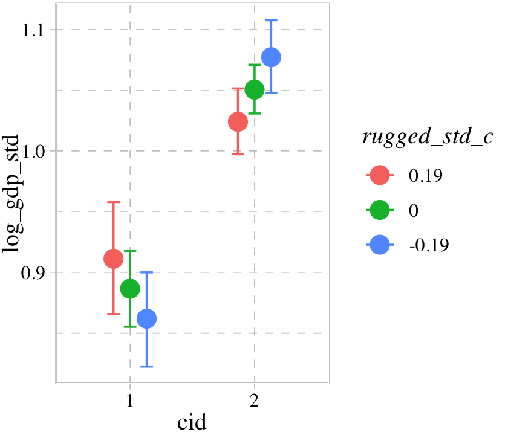

# Conditional Manatees

> Every model so far in this [McElreath's text] has assumed that each predictor has an independent association with the mean of the outcome. What if we want to allow the association to be conditional?...
>
> To model deeper conditionality--where the importance of one predictor depends upon another predictor--we need **interaction** (also known as **moderation**). Interaction is a kind of conditioning, a way of allowing parameters (really their posterior distributions) to be conditional on further aspects of the data. The simplest kind of interaction, a linear interaction, is built by extending the linear modeling strategy to parameters within the linear model. So it is akin to placing epicycles on epicycles in the Ptolemaic and Kopernikan models. It is descriptive, but very powerful.
>
> More generally, interactions are central to most statistical models beyond the cozy world of Gaussian outcomes and linear models of the mean. In generalized linear models (GLMs, Chapter 10 and onwards), even when one does not explicitly define variables as interacting, they will always interact to some degree. Multilevel models induce similar effects. [@mcelreathStatisticalRethinkingBayesian2020, p. 238, **emphasis** in the original]

## Building an interaction.

"Africa is special" (p. 238). Let's load the `rugged` data [@nunn2012ruggedness] to see one of the reasons why.


```r
library(rethinking)
data(rugged)
d <- rugged
```

And here we switch out rethinking for **brms**.


```r
detach(package:rethinking, unload = T)
library(brms)
rm(rugged)
```

For this chapter, we'll take our plot theme from the [**ggthemes** package](https://cran.r-project.org/package=ggthemes) [@R-ggthemes].


```r
# install.packages("ggthemes", dependencies = T)
library(ggthemes)

theme_set(
  theme_pander() +
    theme(text = element_text(family = "Times"),
          panel.background = element_rect(color = "black")) 
)
```

We'll use the `pander` color scheme to help us make our first DAG.


```r
library(tidyverse)
library(ggdag)

dag_coords <-
  tibble(name = c("R", "G", "C", "U"),
         x    = c(1, 2, 3, 2),
         y    = c(2, 2, 2, 1))

dagify(R ~ U,
       G ~ R + U + C,
       coords = dag_coords) %>%
  
  ggplot(aes(x = x, y = y, xend = xend, yend = yend)) +
  geom_dag_point(aes(color = name == "U"),
                 alpha = 1/2, size = 6, show.legend = F) +
  geom_point(x = 2, y = 1, 
             size = 6, shape = 1, stroke = 3/4, color = palette_pander(n = 2)[2]) +
  geom_dag_text(color = "black", family = "Times") +
  geom_dag_edges() +
  scale_colour_pander() +
  theme_dag()
```


> Let's ignore $U$ for now.... Focus instead on the implication that $R$ and $C$ both influence $G$. This could mean that they are independent influences or rather that they interact (one moderates the influence of the other). The DAG does not display an interaction. That's because DAGs do not specify how variables combine to influence other variables. The DAG above implies only that there is some function that uses $R$ and $C$ to generate $G$. In typical notation, $G = f(R, C)$. (p. 240)

It's generally not a good idea to split up your data and run separate analyses when examining an interaction. McElreath listed four reasons why:

1. "There are usually some parameters, such as $\sigma$, that the model says do not depend in any way upon continent. By splitting the data table, you are hurting the accuracy of the estimates for these parameters" (p. 241).
2. "In order to acquire probability statements about the variable you used to split the data, `cont_africa`, in this case, you need to include it in the model" (p. 241).
3. "We many want to use information criteria or another method to compare models" (p. 241).
4. "Once you begin using multilevel models (Chapter 13), you'll see that there are advantages to borrowing information across categories like 'Africa' and 'not Africa'" (p. 241).

#### Overthinking: Not so simple causation.

Here's the DAG for a fuller model for the data.


```r
dag_coords <-
  tibble(name = c("G", "R", "H", "C", "U"),
         x    = c(1, 1.5, 2.5, 3.5, 1),
         y    = c(3, 2, 2, 2, 1))

dagify(G ~ R + U + H,
       R ~ U,
       H ~ R + U + C,
       coords = dag_coords) %>%
  
  ggplot(aes(x = x, y = y, xend = xend, yend = yend)) +
  geom_dag_point(aes(color = name == "U"),
                 alpha = 1/2, size = 6, show.legend = F) +
  geom_point(x = 1, y = 1, 
             size = 6, shape = 1, stroke = 3/4, color = palette_pander(n = 2)[2]) +
  geom_dag_text(color = "black", family = "Times") +
  geom_dag_edges() +
  scale_colour_pander() +
  theme_dag()
```


"The data contain a large number of potential confounds that you might consider. Natural systems like this are terrifyingly complex" (p. 241).

### Making a rugged model.

We'll continue to use **tidyverse**-style syntax to wrangle the data.


```r
# make the log version of criterion
d <- 
  d %>%
  mutate(log_gdp = log(rgdppc_2000))

# extract countries with GDP data
dd <-
  d %>%
  filter(complete.cases(rgdppc_2000)) %>% 
  # rescale variables
  mutate(log_gdp_std = log_gdp / mean(log_gdp), 
         rugged_std  = rugged / max(rugged))
```

Before we fit our first Bayesian models, let's back track a bit and make our version of Figure 8.2. In the title, McElreath indicated it was a depiction of two linear regressions separated by whether the nations were African. A fairly simple way to make those plots is to simultaneously fit and plot the two regression models using OLS via the `geom_smooth()` function using the `method = "lm"` argument. After dividing the data with `cont_africa`, make each plot separately and then combine them with **patchwork** syntax.


```r
library(ggrepel)
library(patchwork)

# African nations
p1 <-
  dd %>% 
  filter(cont_africa == 1) %>% 
  ggplot(aes(x = rugged_std, y = log_gdp_std)) +
  geom_smooth(method = "lm", formula = y ~ x,
              fill = palette_pander(n = 2)[1],
              color = palette_pander(n = 2)[1]) +
  geom_point(color = palette_pander(n = 2)[1]) +
  geom_text_repel(data = . %>% 
                    filter(country %in% c("Lesotho", "Seychelles")),  
                  aes(label = country), 
                  size = 3, family = "Times", seed = 8) +
  labs(subtitle = "African nations",
       x = "ruggedness (standardized)",
       y = "log GDP (as proportion of mean)")

# Non-African nations
p2 <-
  dd %>% 
  filter(cont_africa == 0) %>% 
  ggplot(aes(x = rugged_std, y = log_gdp_std)) +
  geom_smooth(method = "lm", formula = y ~ x,
              fill = palette_pander(n = 2)[2],
              color = palette_pander(n = 2)[2]) +
  geom_point(color = palette_pander(n = 2)[2]) +
  geom_text_repel(data = . %>% 
                    filter(country %in% c("Switzerland", "Tajikistan")),  
                  aes(label = country), 
                  size = 3, family = "Times", seed = 8) +
  xlim(0, 1) +
  labs(subtitle = "Non-African nations",
       x = "ruggedness (standardized)",
       y = "log GDP (as proportion of mean)")

# combine
p1 + p2
```


Our first Bayesian model will follow the form

\begin{align*}
\text{log_gdp_std}_i & \sim \operatorname{Normal} (\mu_i, \sigma) \\
\mu_i  & = \alpha + \beta \left (\text{rugged_std}_i - \overline{\text{rugged_std}} \right ) \\
\alpha & \sim \operatorname{Normal}(1, 1) \\
\beta  & \sim \operatorname{Normal}(0, 1) \\
\sigma & \sim \operatorname{Exponential}(1).
\end{align*}

Here we compute $\overline{\text{rugged_std}}$.


```r
mean(dd$rugged_std)
```

```
## [1] 0.2149601
```

A naïve translation of McElreath's **rethinking** code into a `brms::brm()` `formula` argument might be `log_gdp_std ~ 1 + (rugged_std - 0.215 )`. However, this kind of syntax will not work outside of the non-linear syntax. Our approach will be to make a mean-centered version of `rugged_std`.


```r
dd <-
  dd %>%
  mutate(rugged_std_c  = rugged_std - mean(rugged_std))
```

Now fit the model.


```r
b8.1 <-
  brm(data = dd, 
      family = gaussian,
      log_gdp_std ~ 1 + rugged_std_c,
      prior = c(prior(normal(1, 1), class = Intercept),
                prior(normal(0, 1), class = b),
                prior(exponential(1), class = sigma)),
      iter = 2000, warmup = 1000, chains = 4, cores = 4,
      seed = 8,
      sample_prior = T,
      file = "fits/b08.01")
```

Did you notice the `sample_prior = T` argument? Because of that, we can now use the `prior_samples()` function to help us plot the prior predictive distribution for `m8.1` and make our version of the left panel of Figure 8.3.


```r
prior <- prior_samples(b8.1)

set.seed(8)

p1 <-
  prior %>% 
  sample_n(size = 50) %>% 
  rownames_to_column() %>% 
  expand(nesting(rowname, Intercept, b),
         rugged_std_c = c(-2, 2)) %>% 
  mutate(log_gdp_std = Intercept + b * rugged_std_c,
         rugged_std  = rugged_std_c + mean(dd$rugged_std)) %>% 
  
  ggplot(aes(x = rugged_std, y = log_gdp_std, group = rowname)) +
  geom_hline(yintercept = range(dd$log_gdp_std), linetype = 2) +
  geom_line(color = palette_pander(n = 2)[2], alpha = .4) +
  geom_abline(intercept = 1.3, slope = -0.6,
              color = palette_pander(n = 2)[1], size = 2) +
  labs(subtitle = "Intercept ~ dnorm(1, 1)\nb ~ dnorm(0, 1)",
       x = "ruggedness",
       y = "log GDP (prop of mean)") +
  coord_cartesian(xlim = c(0, 1),
                  ylim = c(0.5, 1.5))

p1
```


Toward the bottom of page 244, McElreath wrote: "The slope of such a line must be about $1.3 − 0.7 = 0.6$, the difference between the maximum and minimum observed proportional log GDP." The math appears backwards, there. Rather, the slope of our solid blue line is $0.7 - 1.3 = -0.6$. But anyway, "under the $\beta \sim \operatorname{Normal}(0, 1)$ prior, more than half of all slopes will have absolute value greater than [$|-0.6|$]" (p. 244).


```r
prior %>%
  summarise(a = sum(abs(b) > abs(-0.6)) / nrow(prior))
```

```
##         a
## 1 0.54875
```

Our updated model is 

\begin{align*}
\text{log_gdp_std}_i & \sim \operatorname{Normal} (\mu_i, \sigma) \\
\mu_i  & = \alpha + \beta \left (\text{rugged_std}_i - \overline{\text{rugged_std}} \right ) \\
\alpha & \sim \operatorname{Normal}(1, 0.1) \\
\beta  & \sim \operatorname{Normal}(0, 0.3) \\
\sigma & \sim \operatorname{Exponential}(1).
\end{align*}

Fit the model.


```r
b8.1b <-
  brm(data = dd, 
      family = gaussian,
      log_gdp_std ~ 1 + rugged_std_c,
      prior = c(prior(normal(1, 0.1), class = Intercept),
                prior(normal(0, 0.3), class = b),
                prior(exponential(1), class = sigma)),
      iter = 2000, warmup = 1000, chains = 4, cores = 4,
      seed = 8,
      sample_prior = T,
      file = "fits/b08.01b")
```

Now we'll use `prior_samples(b8.1b)` to make the left panel of Figure 8.3 and present both panels together with a little **patchwork** syntax.


```r
set.seed(8)

p2 <-
  prior_samples(b8.1b) %>% 
  sample_n(size = 50) %>% 
  rownames_to_column() %>% 
  expand(nesting(rowname, Intercept, b),
         rugged_std_c = c(-2, 2)) %>% 
  mutate(log_gdp_std = Intercept + b * rugged_std_c,
         rugged_std  = rugged_std_c + mean(dd$rugged_std)) %>% 
  
  ggplot(aes(x = rugged_std, y = log_gdp_std, group = rowname)) +
  geom_hline(yintercept = range(dd$log_gdp_std), linetype = 2) +
  geom_line(color = palette_pander(n = 2)[2], alpha = .4) +
  scale_y_continuous("", breaks = NULL) +
  labs(subtitle = "Intercept ~ dnorm(1, 0.1)\nb ~ dnorm(0, 0.3)",
       x = "ruggedness") +
  coord_cartesian(xlim = c(0, 1),
                  ylim = c(0.5, 1.5))

p1 + p2 + 
  plot_annotation(title = "Simulating in search of reasonable priors for the terrain ruggedness example.",
                  theme = theme(plot.title = element_text(size = 12)))
```


Now check the summary for `b8.1b`.


```r
print(b8.1b)
```

```
##  Family: gaussian 
##   Links: mu = identity; sigma = identity 
## Formula: log_gdp_std ~ 1 + rugged_std_c 
##    Data: dd (Number of observations: 170) 
## Samples: 4 chains, each with iter = 2000; warmup = 1000; thin = 1;
##          total post-warmup samples = 4000
## 
## Population-Level Effects: 
##              Estimate Est.Error l-95% CI u-95% CI Rhat Bulk_ESS Tail_ESS
## Intercept        1.00      0.01     0.98     1.02 1.00     4232     2593
## rugged_std_c     0.00      0.06    -0.11     0.11 1.00     4326     2942
## 
## Family Specific Parameters: 
##       Estimate Est.Error l-95% CI u-95% CI Rhat Bulk_ESS Tail_ESS
## sigma     0.14      0.01     0.12     0.15 1.00     3711     2907
## 
## Samples were drawn using sampling(NUTS). For each parameter, Bulk_ESS
## and Tail_ESS are effective sample size measures, and Rhat is the potential
## scale reduction factor on split chains (at convergence, Rhat = 1).
```

### Adding an indicator variable isn't enough.

When you'd like to allow a model intercept and slope to differ by levels of a dichotomous variable, a typical approach is to use a 0/1 coded dummy variable. In this section, McElreath opted to highlight the index variable approach, instead. We'll follow along. But if you'd like to practice using **brms** to fit interaction models with dummy variables, see [Section 7.1](https://bookdown.org/content/3890/interactions.html#building-an-interaction.) of my [-@kurzStatisticalRethinkingBrms2020] translation of McElreath's [-@mcelreathStatisticalRethinkingBayesian2015] first edition or [Chapters 7](https://bookdown.org/ajkurz/recoding_Hayes_2018/fundamentals-of-moderation-analysis.html) and beyond in my [-@kurzRecodingIntroductionMediation2019] translation of Andrew Hayes's [-@hayes2017introduction] text on mediation and moderation.

Make the index variable.


```r
dd <- 
  dd %>% 
  mutate(cid = if_else(cont_africa == 1, "1", "2"))
```

In case you were curious, here's a plot showing how the `cid` index works.


```r
dd %>% 
  mutate(cid = str_c("cid: ", cid)) %>% 
  arrange(cid, country) %>% 
  group_by(cid) %>% 
  mutate(rank = 1:n()) %>% 
  
  ggplot(aes(x = cid, y = rank, label = country)) +
  geom_text(size = 2, hjust = 0, family = "Times") +
  scale_y_reverse() +
  theme_void() +
  facet_wrap(~cid, scales = "free_x")
```


If you recall from the latter sections of Chapter 5, the conventional **brms** syntax can accommodate an index variable by simply suppressing the default intercept via the `0 + ...`. syntax. That will be our approach, here.


```r
b8.2 <-
  brm(data = dd, 
      family = gaussian,
      log_gdp_std ~ 0 + cid + rugged_std_c,
      prior = c(prior(normal(1, 0.1), class = b, coef = cid1),
                prior(normal(1, 0.1), class = b, coef = cid2),
                prior(normal(0, 0.3), class = b, coef = rugged_std_c),
                prior(exponential(1), class = sigma)),
      iter = 2000, warmup = 1000, chains = 4, cores = 4,
      seed = 8,
      file = "fits/b08.02")
```

Use `add_criterion()` and `loo_compare()` to compare `b8.1b` and `b8.2` with the WAIC.


```r
b8.1b <- add_criterion(b8.1b, "waic")
b8.2 <- add_criterion(b8.2, "waic")

loo_compare(b8.1b, b8.2, criterion = "waic") %>% print(simplify = F)
```

```
##       elpd_diff se_diff elpd_waic se_elpd_waic p_waic se_p_waic waic   se_waic
## b8.2     0.0       0.0   126.1       7.4          4.2    0.8    -252.1   14.9 
## b8.1b  -31.6       7.4    94.5       6.5          2.5    0.3    -188.9   13.0
```

Here are the WAIC weights.


```r
model_weights(b8.1b, b8.2, weights = "waic") %>% round(digits = 3)
```

```
## b8.1b  b8.2 
##     0     1
```

Here is the summary for the model with all the weight, `b8.2`.


```r
print(b8.2)
```

```
##  Family: gaussian 
##   Links: mu = identity; sigma = identity 
## Formula: log_gdp_std ~ 0 + cid + rugged_std_c 
##    Data: dd (Number of observations: 170) 
## Samples: 4 chains, each with iter = 2000; warmup = 1000; thin = 1;
##          total post-warmup samples = 4000
## 
## Population-Level Effects: 
##              Estimate Est.Error l-95% CI u-95% CI Rhat Bulk_ESS Tail_ESS
## cid1             0.88      0.02     0.85     0.91 1.00     4749     3053
## cid2             1.05      0.01     1.03     1.07 1.00     4146     3134
## rugged_std_c    -0.05      0.05    -0.14     0.04 1.00     4193     3234
## 
## Family Specific Parameters: 
##       Estimate Est.Error l-95% CI u-95% CI Rhat Bulk_ESS Tail_ESS
## sigma     0.11      0.01     0.10     0.13 1.00     4332     3118
## 
## Samples were drawn using sampling(NUTS). For each parameter, Bulk_ESS
## and Tail_ESS are effective sample size measures, and Rhat is the potential
## scale reduction factor on split chains (at convergence, Rhat = 1).
```

Now extract the posterior draws, make a difference score for the two intercepts, and use `tidybayes::qi()` to compute the percentile-based 89% intervals for the difference.


```r
post <- 
  posterior_samples(b8.2) %>% 
  mutate(diff = b_cid1 - b_cid2)

library(tidybayes)

qi(post$diff, .width = .89)
```

```
##            [,1]       [,2]
## [1,] -0.1996385 -0.1382392
```

Now it's time to use `fitted()` to prepare to plot the implications of the model in Figure 8.4.


```r
nd <- 
  crossing(cid        = 1:2,
           rugged_std = seq(from = -0.2, to = 1.2, length.out = 30)) %>% 
  mutate(rugged_std_c = rugged_std - mean(dd$rugged_std))

f <-
  fitted(b8.2, 
         newdata = nd,
         probs = c(.015, .985)) %>%
  data.frame() %>%
  bind_cols(nd) %>%
  mutate(cont_africa = ifelse(cid == 1, "Africa", "not Africa"))

# what did we do?
head(f)
```

```
##    Estimate  Est.Error      Q1.5     Q98.5 cid   rugged_std rugged_std_c cont_africa
## 1 0.8995421 0.02396262 0.8478753 0.9510474   1 -0.200000000   -0.4149601      Africa
## 2 0.8973001 0.02233856 0.8490517 0.9459253   1 -0.151724138   -0.3666842      Africa
## 3 0.8950580 0.02083117 0.8505024 0.9406853   1 -0.103448276   -0.3184083      Africa
## 4 0.8928159 0.01946758 0.8510632 0.9352752   1 -0.055172414   -0.2701325      Africa
## 5 0.8905739 0.01828000 0.8511771 0.9305795   1 -0.006896552   -0.2218566      Africa
## 6 0.8883318 0.01730470 0.8511623 0.9258231   1  0.041379310   -0.1735808      Africa
```

Behold our Figure 8.4.


```r
dd %>%
  mutate(cont_africa = ifelse(cont_africa == 1, "Africa", "not Africa")) %>%
  
  ggplot(aes(x = rugged_std, fill = cont_africa, color = cont_africa)) +
  geom_smooth(data = f,
              aes(y = Estimate, ymin = Q1.5, ymax = Q98.5),
              stat = "identity",
              alpha = 1/4, size = 1/2) +
  geom_point(aes(y = log_gdp_std),
             size = 2/3) +
  scale_fill_pander() +
  scale_colour_pander() +
  labs(subtitle = "b8.2",
       x = "ruggedness (standardized)",
       y = "log GDP (as proportion of mean)") +
  coord_cartesian(xlim = c(0, 1)) +
  theme(legend.background = element_blank(),
        legend.direction = "horizontal",
        legend.position = c(.67, .93),
        legend.title = element_blank())
```


Though adding our index variable `cid` to `b8.2` allowed us to give the African nations a different intercept than the non-African nations, it did nothing for the slope. We need a better method.

#### Rethinking: Why 97%?

Did you notice the `probs = c(.015, .985)` argument in our `fitted()` code, above? This is one of those rare moments when we went along with McElreath and used intervals other than the conventional 95%.

> In the code block just above, and therefore also in Figure 8.4, I used 97% intervals of the expected mean. This is a rather non-standard percentile interval. So why use 97%? In this book, I use non-standard percents to constantly remind the reader that conventions like 95% and 5% are arbitrary. Furthermore, boundaries are meaningless. There is continuous change in probability as we move away from the expected value. So one side of the boundary is almost equally probable as the other side. (p. 247)

Building off of McElreath's "boundaries are meaningless" point, here we use a combination of `summary = F` within `fitted()` and a little `tidybayes::stat_lineribbon()` magic to reimagine Figure 8.4. This time we use a sequence of overlapping semitransparent credible intervals to give the posterior a 3D-like appearance.


```r
fitted(b8.2, 
       newdata = nd,
       summary = F) %>%
  data.frame() %>%
  pivot_longer(everything()) %>% 
  bind_cols(
    expand(nd, 
           iter = 1:4000,
           nesting(cid, rugged_std))
  ) %>%
  mutate(cont_africa = ifelse(cid == 1, "Africa", "not Africa")) %>% 
  
  ggplot(aes(x = rugged_std, y = value, fill = cont_africa, color = cont_africa)) +
  stat_lineribbon(.width = seq(from = .03, to = .99, by = .03),
                  alpha = .1, size = 0) +
  geom_point(data = dd %>% 
               mutate(cont_africa = ifelse(cont_africa == 1, "Africa", "not Africa")),
             aes(y = log_gdp_std),
             size = 2/3) +
  scale_fill_pander() +
  scale_colour_pander() +
  labs(subtitle = "b8.2",
       x = "ruggedness (standardized)",
       y = "log GDP (as proportion of mean)") +
  coord_cartesian(xlim = c(0, 1)) +
  theme(legend.background = element_blank(),
        legend.direction = "horizontal",
        legend.position = c(.67, .93),
        legend.title = element_blank())
```


### Adding an interaction does work. 

The `0 + ...` syntax works fine when we just want to use an index variable to fit a model with multiple intercepts, this approach will not work for fitting **brms** models that apply the index variable to slopes. Happily, we have alternatives. If we'd like to use the `cid` index to make intercepts and slopes as in McElreath's `m8.3`, we can use the **brms** [non-linear syntax](https://CRAN.R-project.org/package=brms/vignettes/brms_nonlinear.html) [@Bürkner2020Non_linear], which we introduced at the end of Chapter 5. Here it is for `b8.3`.


```r
b8.3 <- 
  brm(data = dd, 
      family = gaussian,
      bf(log_gdp_std ~ 0 + a + b * rugged_std_c, 
         a ~ 0 + cid, 
         b ~ 0 + cid,
         nl = TRUE),
      prior = c(prior(normal(1, 0.1), class = b, coef = cid1, nlpar = a),
                prior(normal(1, 0.1), class = b, coef = cid2, nlpar = a),
                prior(normal(0, 0.3), class = b, coef = cid1, nlpar = b),
                prior(normal(0, 0.3), class = b, coef = cid2, nlpar = b),
                prior(exponential(1), class = sigma)),
      iter = 2000, warmup = 1000, chains = 4, cores = 4,
      seed = 8,
      file = "fits/b08.03")
```

Check the summary of the marginal distributions.


```r
print(b8.3)
```

```
##  Family: gaussian 
##   Links: mu = identity; sigma = identity 
## Formula: log_gdp_std ~ 0 + a + b * rugged_std_c 
##          a ~ 0 + cid
##          b ~ 0 + cid
##    Data: dd (Number of observations: 170) 
## Samples: 4 chains, each with iter = 2000; warmup = 1000; thin = 1;
##          total post-warmup samples = 4000
## 
## Population-Level Effects: 
##        Estimate Est.Error l-95% CI u-95% CI Rhat Bulk_ESS Tail_ESS
## a_cid1     0.89      0.02     0.85     0.92 1.00     4994     2901
## a_cid2     1.05      0.01     1.03     1.07 1.00     4902     3011
## b_cid1     0.13      0.07    -0.01     0.28 1.00     4686     2868
## b_cid2    -0.14      0.06    -0.26    -0.03 1.00     5006     3028
## 
## Family Specific Parameters: 
##       Estimate Est.Error l-95% CI u-95% CI Rhat Bulk_ESS Tail_ESS
## sigma     0.11      0.01     0.10     0.12 1.00     5002     3187
## 
## Samples were drawn using sampling(NUTS). For each parameter, Bulk_ESS
## and Tail_ESS are effective sample size measures, and Rhat is the potential
## scale reduction factor on split chains (at convergence, Rhat = 1).
```

Success! Our results look just like McElreath's. Now make haste with `add_criterion()` so we can compare the models by the PSIS-LOO-CV.


```r
b8.1b <- add_criterion(b8.1b, "loo")
b8.2 <- add_criterion(b8.2, "loo")
b8.3 <- add_criterion(b8.3, c("loo", "waic"))

loo_compare(b8.1b, b8.2, b8.3, criterion = "loo") %>% print(simplify = F)
```

```
##       elpd_diff se_diff elpd_loo se_elpd_loo p_loo  se_p_loo looic  se_looic
## b8.3     0.0       0.0   129.5      7.3         5.1    0.9   -259.0   14.7  
## b8.2    -3.4       3.3   126.1      7.4         4.2    0.8   -252.1   14.9  
## b8.1b  -35.0       7.5    94.5      6.5         2.6    0.3   -188.9   13.0
```

Here are the LOO weights.


```r
model_weights(b8.1b, b8.2, b8.3, weights = "loo") %>% round(digits = 2)
```

```
## b8.1b  b8.2  b8.3 
##  0.00  0.03  0.97
```

We can get a Pareto $k$ diagnostic plot for `b8.3` by feeding the results of the `loo()` function into `plot()`.


```r
loo(b8.3) %>% 
  plot(label_points = T)
```


The `label_points = T` argument is how we instructed the plot to include the row number for the influential case crossing the 0.5 threshold. We can use `slice()` to get a sense of case 145.


```r
dd %>% 
  slice(145) %>% 
  select(country, cont_africa)
```

```
##      country cont_africa
## 1 Seychelles           1
```

It turns out Seychelles is our influential country. 

#### Bonus: Give me Student-t.

McElreath remarked: "This is possibly a good context for robust regression, like the Student-t regression we did in Chapter 7" (p. 249). Let's practice fitting the alternative model using the Student-t likelihood for which $\nu = 2$.


```r
b8.3t <- 
  brm(data = dd, 
      family = student,
      bf(log_gdp_std ~ 0 + a + b * rugged_std_c, 
         a ~ 0 + cid, 
         b ~ 0 + cid,
         nu = 2,
         nl = TRUE),
      prior = c(prior(normal(1, 0.1), class = b, coef = cid1, nlpar = a),
                prior(normal(1, 0.1), class = b, coef = cid2, nlpar = a),
                prior(normal(0, 0.3), class = b, coef = cid1, nlpar = b),
                prior(normal(0, 0.3), class = b, coef = cid2, nlpar = b),
                prior(exponential(1), class = sigma)),
      iter = 2000, warmup = 1000, chains = 4, cores = 4,
      seed = 8,
      file = "fits/b08.03t")
```

Use the LOO to compare this with the Gaussian model.


```r
b8.3t <- add_criterion(b8.3t, c("loo", "waic"))

loo_compare(b8.3, b8.3t, criterion = "loo") %>% print(simplify = F)
```

```
##       elpd_diff se_diff elpd_loo se_elpd_loo p_loo  se_p_loo looic  se_looic
## b8.3     0.0       0.0   129.5      7.3         5.1    0.9   -259.0   14.7  
## b8.3t  -19.0       2.7   110.5      8.8         6.2    0.7   -221.0   17.5
```

Here we might make our own diagnostic plot to compare the two likelihoods by the Pareto $k$ values. To get a nice fine-grain sense of the distributions, we'll employ the handy `tidybayes::stat_dots()` function which will display each value as an individual dot.


```r
tibble(Normal      = b8.3$criteria$loo$diagnostics$pareto_k,
       `Student-t` = b8.3t$criteria$loo$diagnostics$pareto_k) %>% 
  pivot_longer(everything(),
               values_to = "pareto_k") %>% 
  
  ggplot(aes(x = pareto_k, y = name)) +
  geom_vline(xintercept = .5, linetype = 2, color = palette_pander(n = 5)[5]) +
  stat_dots(slab_fill = palette_pander(n = 4)[4], 
            slab_color = palette_pander(n = 4)[4]) + 
  annotate(geom = "text",
           x = .485, y = 1.5, label = "threshold", angle = 90, 
           family = "Times", color = palette_pander(n = 5)[5]) +
  ylab(NULL) +
  coord_cartesian(ylim = c(1.5, 2.4))
```


To close this exercise out, compare the $\alpha$ and $\beta$ parameters of the two models using `fixef()`.


```r
fixef(b8.3) %>% round(digits = 2)
```

```
##        Estimate Est.Error  Q2.5 Q97.5
## a_cid1     0.89      0.02  0.85  0.92
## a_cid2     1.05      0.01  1.03  1.07
## b_cid1     0.13      0.07 -0.01  0.28
## b_cid2    -0.14      0.06 -0.26 -0.03
```

```r
fixef(b8.3t) %>% round(digits = 2)
```

```
##        Estimate Est.Error  Q2.5 Q97.5
## a_cid1     0.87      0.02  0.83  0.90
## a_cid2     1.05      0.01  1.02  1.07
## b_cid1     0.13      0.09 -0.02  0.32
## b_cid2    -0.21      0.07 -0.32 -0.07
```

### Plotting the interaction.

The code for Figure 8.5 is a minor extension of the code we used for Figure 8.4. Other than which fit we use, the code we use for `fitted()` is the same for both plots. Two of the largest changes are the addition of labels with `ggrepel::geom_text_repel()` and using `facet_wrap()` to split the plot into two panels.


```r
countries <- c("Equatorial Guinea", "South Africa", "Seychelles", "Swaziland", "Lesotho", "Rwanda", "Burundi", "Luxembourg", "Greece", "Switzerland", "Lebanon", "Yemen", "Tajikistan", "Nepal")

f <-
  fitted(b8.3, 
         # we already defined `nd`, above
         newdata = nd,
         probs = c(.015, .985)) %>%
  data.frame() %>%
  bind_cols(nd) %>%
  mutate(cont_africa = ifelse(cid == 1, "African nations", "Non-African nations"))

dd %>%
  mutate(cont_africa = ifelse(cont_africa == 1, "African nations", "Non-African nations")) %>%
  
  ggplot(aes(x = rugged_std, y = log_gdp_std, fill = cont_africa, color = cont_africa)) +
  geom_smooth(data = f,
              aes(y = Estimate, ymin = Q1.5, ymax = Q98.5),
              stat = "identity",
              alpha = 1/4, size = 1/2) +
  geom_text_repel(data = . %>% filter(country %in% countries),  
                  aes(label = country), 
                  size = 3, seed = 8, 
                  segment.color = "grey25", min.segment.length = 0) +
  geom_point(aes(y = log_gdp_std),
             size = 2/3) +
  scale_fill_pander() +
  scale_colour_pander() +
  labs(x = "ruggedness (standardized)",
       y = "log GDP (as proportion of mean)") +
  coord_cartesian(xlim = c(0, 1)) +
  theme(legend.position = "none") +
  facet_wrap(~cont_africa)
```


"Finally, the slope reverses direction inside and outside of Africa. And because we achieved this inside a single model, we could statistically evaluate the value of this reversal" (p. 250).

## Symmetry of interactions

If you're unfamiliar with Buridan's ass, here's a [brief clip](https://www.youtube.com/watch?v=bOp1_LIYvmk) to catch up up to speed. With Buridan's ass still on your mind, recall the model for $\mu_i$ from the last example,

$$\mu_i  = \alpha_{\text{cid}[i]} + \beta_{\text{cid}[i]} \left (\text{rugged_std}_i - \overline{\text{rugged_std}} \right ).$$

With this model, it is equally true that that slope is conditional on the intercept as it is that the intercept is conditional on the slope. Another way to express the model is

\begin{align*}
\mu_i & = \underbrace{(2 - \text{cid}_{i}) \left (\alpha_1 + \beta_1 \left (\text{rugged_std}_i - \overline{\text{rugged_std}} \right ) \right )}_{\text{cid}[i] = 1} \\
      & \;\;\; + \underbrace{(\text{cid}_{i} - 1) \left (\alpha_2 + \beta_2 \left (\text{rugged_std}_i - \overline{\text{rugged_std}} \right ) \right )}_{\text{cid}[i] = 2},
\end{align*}

where the first term vanishes when $\text{cid}_i = 2$ and the second term vanishes when $\text{cid}_i = 1$. In contrast to the plots above, we can re-express this equation as saying "*The association of being in Africa with log GDP depends upon terrain ruggedness*" (p. 251, *emphasis* in the original). Here we follow McElreath and plot the difference between a nation in Africa and outside Africa, conditional on ruggedness.


```r
fitted(b8.3, 
       newdata = nd,
       summary = F) %>%
  data.frame() %>%
  pivot_longer(everything()) %>% 
  bind_cols(expand(nd,
                   iter = 1:4000,
                   nesting(cid, rugged_std))) %>% 
  select(-name) %>% 
  pivot_wider(names_from = cid, values_from = value) %>% 
  mutate(delta = `1` - `2`) %>% 
  
  ggplot(aes(x = rugged_std, y = delta)) +
  stat_lineribbon(.width = .95, fill = palette_pander(n = 8)[8], alpha = 3/4) +
  geom_hline(yintercept = 0, linetype = 2) +
  annotate(geom = "text",
           x = .2, y = 0,
           label = "Africa higher GDP\nAfrica lower GDP",
           family = "Times") +
  labs(x = "ruggedness (standardized)",
       y = "expected difference log GDP") +
  coord_cartesian(xlim = c(0, 1),
                  ylim = c(-0.3, 0.2))
```


> This perspective on the GDP and terrain ruggedness is completely consistent with the previous perspective. It's simultaneously true in these data (and with this model) that (1) the influence of ruggedness depends upon continent and (2) the influence of continent depends upon ruggedness. 
>
> Simple interactions are symmetric, just like the choice facing Buridan's ass. Within the model, there's no basis to prefer one interpretation over the other, because in fact they are the same interpretation. But when we reason causally about models, our minds tend to prefer one interpretation over the other, because it's usually easier to imagine manipulating one of the predictor variables instead of the other. (pp. 251--252)

## Continuous interactions

> It's one thing to make a slope conditional upon a *category.* In such a context, the model reduces to estimating a different slope for each category. But it's quite a lot harder to understand that a slope varies in a continuous fashion with a continuous variable. Interpretation is much harder in this case, even though the mathematics of the model are essentially the same. (p. 252, *emphasis* in the original)

### A winter flower.

Look at the `tulips` data, which were adapted from @grafenModernStatisticsLife2002.


```r
library(rethinking)
data(tulips)
d <- tulips
glimpse(d)
```

```
## Rows: 27
## Columns: 4
## $ bed    <fct> a, a, a, a, a, a, a, a, a, b, b, b, b, b, b, b, b, b, c, c, c, c, c, c, c, c, c
## $ water  <int> 1, 1, 1, 2, 2, 2, 3, 3, 3, 1, 1, 1, 2, 2, 2, 3, 3, 3, 1, 1, 1, 2, 2, 2, 3, 3, 3
## $ shade  <int> 1, 2, 3, 1, 2, 3, 1, 2, 3, 1, 2, 3, 1, 2, 3, 1, 2, 3, 1, 2, 3, 1, 2, 3, 1, 2, 3
## $ blooms <dbl> 0.00, 0.00, 111.04, 183.47, 59.16, 76.75, 224.97, 83.77, 134.95, 80.10, 85.95, 19.…
```

### The models.

Wrangle a little.


```r
d <-
  d %>% 
  mutate(blooms_std = blooms / max(blooms),
         water_cent = water - mean(water),
         shade_cent = shade - mean(shade))
```

With the variables in hand, the basic model is $B = f(W, S)$, where $B$ = `blooms`, $W$ = `water`, $S$ = `shade`, and $f(\cdot)$ indicates a function. We can also express this as $W \rightarrow B \leftarrow S$. Neither expression clarifies whether the effects of $W$ and $S$ are additive or conditional on each other in some way. We might express an unconditional (additive) model as

\begin{align*}
\text{blooms_std}_i & \sim \operatorname{Normal} (\mu_i, \sigma) \\
\mu_i   & = \alpha + \beta_1 \text{water_cent}_i + \beta_2 \text{shade_cent}_i \\
\alpha  & \sim \operatorname{Normal} (0.5, 1) \\
\beta_1 & \sim \operatorname{Normal} (0, 1) \\
\beta_2 & \sim \operatorname{Normal} (0, 1) \\
\sigma  & \sim \operatorname{Exponential} (1),
\end{align*}

where $\text{water_cent}_i = \left (\text{water}_i - \overline{\text{water}}  \right )$ and $\text{shade_cent}_i = \left (\text{shade}_i - \overline{\text{shade}}  \right )$. Even though "the intercept $\alpha$ must be greater than zero and less than one,... this prior assigns most of the probability outside that range" (p. 254).


```r
set.seed(8)

tibble(a = rnorm(1e4, mean = 0.5, sd = 1)) %>% 
  summarise(proportion_outside_of_the_range = sum(a < 0 | a > 1) / n())
```

```
## # A tibble: 1 x 1
##   proportion_outside_of_the_range
##                             <dbl>
## 1                           0.621
```

Tightening up the prior to $\operatorname{Normal}(0, 0.25)$ helps.


```r
set.seed(8)

tibble(a = rnorm(1e4, mean = 0.5, sd = 0.25)) %>% 
  summarise(proportion_outside_of_the_range = sum(a < 0 | a > 1) / n())
```

```
## # A tibble: 1 x 1
##   proportion_outside_of_the_range
##                             <dbl>
## 1                          0.0501
```

Here are the ranges for our two predictors.


```r
range(d$water_cent)
```

```
## [1] -1  1
```

```r
range(d$shade_cent)
```

```
## [1] -1  1
```

Putting the same $\operatorname{Normal}(0, 0.25)$ prior on each would indicate a .95 probability each coefficient would be within -0.5 to 0.5. Since the total range for both is $1 - (-1) = 2$, that would imply either could account for the full range of `blooms_std` because $0.5 \cdot 2 = 1$, which is the full range of `blooms_std`. Our first model, then, will be

\begin{align*}
\text{blooms_std}_i & \sim \operatorname{Normal} (\mu_i, \sigma) \\
\mu_i   & = \alpha + \beta_1 \text{water_cent}_i + \beta_2 \text{shade_cent}_i \\
\alpha  & \sim \operatorname{Normal} (0.5, 0.25) \\
\beta_1 & \sim \operatorname{Normal} (0, 0.25) \\
\beta_2 & \sim \operatorname{Normal} (0, 0.25) \\
\sigma  & \sim \operatorname{Exponential} (1),
\end{align*}

Detach **rethinking** and reload **brms**.


```r
detach(package:rethinking, unload = T)
library(brms)
rm(tulips)
```

Now fit the model.


```r
b8.4 <-
  brm(data = d, 
      family = gaussian,
      blooms_std ~ 1 + water_cent + shade_cent,
      prior = c(prior(normal(0.5, 0.25), class = Intercept),
                prior(normal(0, 0.25), class = b, coef = water_cent),
                prior(normal(0, 0.25), class = b, coef = shade_cent),
                prior(exponential(1), class = sigma)),
      iter = 2000, warmup = 1000, chains = 4, cores = 4,
      seed = 8,
      file = "fits/b08.04")
```

Check the model summary.


```r
print(b8.4)
```

```
##  Family: gaussian 
##   Links: mu = identity; sigma = identity 
## Formula: blooms_std ~ 1 + water_cent + shade_cent 
##    Data: d (Number of observations: 27) 
## Samples: 4 chains, each with iter = 2000; warmup = 1000; thin = 1;
##          total post-warmup samples = 4000
## 
## Population-Level Effects: 
##            Estimate Est.Error l-95% CI u-95% CI Rhat Bulk_ESS Tail_ESS
## Intercept      0.36      0.03     0.29     0.43 1.00     3736     2527
## water_cent     0.20      0.04     0.12     0.28 1.00     3738     2344
## shade_cent    -0.11      0.04    -0.19    -0.03 1.00     3684     2248
## 
## Family Specific Parameters: 
##       Estimate Est.Error l-95% CI u-95% CI Rhat Bulk_ESS Tail_ESS
## sigma     0.18      0.03     0.13     0.24 1.00     3005     2622
## 
## Samples were drawn using sampling(NUTS). For each parameter, Bulk_ESS
## and Tail_ESS are effective sample size measures, and Rhat is the potential
## scale reduction factor on split chains (at convergence, Rhat = 1).
```

Using the $\gamma$ notation, we can express an interaction between `water_cent` and `shade_cent` by

\begin{align*}
\mu_i   & = \alpha + \gamma_{1, i} \text{water_cent}_i + \beta_2 \text{shade_cent}_i \\
\gamma_{1, i} & = \beta_1 + \beta_3 \text{shade_cent}_i,
\end{align*}

where both $\mu_i$ and $\gamma_{1, i}$ get a linear model. We could do the converse by switching the positions of `water_cent` and `shade_cent`. If we substitute the equation for $\gamma_{1, i}$ into the equation for $\mu_i$, we get

\begin{align*}
\mu_i   & = \alpha + \underbrace{(\beta_1 + \beta_3 \text{shade_cent}_i)}_{\gamma_{1, i}} \text{water_cent}_i + \beta_2 \text{shade_cent}_i \\
        & = \alpha + \beta_1  \text{water_cent}_i + (\beta_3 \text{shade_cent}_i \cdot \text{water_cent}_i) + \beta_2 \text{shade_cent}_i \\
        & = \alpha + \beta_1  \text{water_cent}_i + \beta_2 \text{shade_cent}_i  + \beta_3 (\text{shade_cent}_i \cdot \text{water_cent}_i),
\end{align*}

where $\beta_3$ is the interaction term which makes `water_cent` and `shade_cent` conditional on each other. If we use the same priors as before, we might write the full equation for our interaction model as

\begin{align*}
\text{blooms_std}_i & \sim \operatorname{Normal} (\mu_i, \sigma) \\
\mu_i   & = \alpha + \beta_1 \text{water_cent}_i + \beta_2 \text{shade_cent}_i + \beta_3 \text{shade_cent}_i \cdot \text{water_cent}_i\\
\alpha  & \sim \operatorname{Normal} (0.5, 0.25) \\
\beta_1 & \sim \operatorname{Normal} (0, 0.25) \\
\beta_2 & \sim \operatorname{Normal} (0, 0.25) \\
\beta_3 & \sim \operatorname{Normal} (0, 0.25) \\
\sigma  & \sim \operatorname{Exponential} (1).
\end{align*}

Fit the model.


```r
b8.5 <-
  brm(data = d, 
      family = gaussian,
      blooms_std ~ 1 + water_cent + shade_cent + water_cent:shade_cent,
      prior = c(prior(normal(0.5, 0.25), class = Intercept),
                prior(normal(0, 0.25), class = b, coef = water_cent),
                prior(normal(0, 0.25), class = b, coef = shade_cent),
                prior(normal(0, 0.25), class = b, coef = "water_cent:shade_cent"),
                prior(exponential(1), class = sigma)),
      iter = 2000, warmup = 1000, chains = 4, cores = 4,
      seed = 8,
      file = "fits/b08.05")
```

Check the summary.


```r
print(b8.5)
```

```
##  Family: gaussian 
##   Links: mu = identity; sigma = identity 
## Formula: blooms_std ~ 1 + water_cent + shade_cent + water_cent:shade_cent 
##    Data: d (Number of observations: 27) 
## Samples: 4 chains, each with iter = 2000; warmup = 1000; thin = 1;
##          total post-warmup samples = 4000
## 
## Population-Level Effects: 
##                       Estimate Est.Error l-95% CI u-95% CI Rhat Bulk_ESS Tail_ESS
## Intercept                 0.36      0.03     0.30     0.41 1.00     4805     2695
## water_cent                0.21      0.03     0.14     0.27 1.00     4846     2919
## shade_cent               -0.11      0.03    -0.18    -0.04 1.00     5168     2703
## water_cent:shade_cent    -0.14      0.04    -0.22    -0.06 1.00     4423     2769
## 
## Family Specific Parameters: 
##       Estimate Est.Error l-95% CI u-95% CI Rhat Bulk_ESS Tail_ESS
## sigma     0.14      0.02     0.11     0.20 1.00     3315     2707
## 
## Samples were drawn using sampling(NUTS). For each parameter, Bulk_ESS
## and Tail_ESS are effective sample size measures, and Rhat is the potential
## scale reduction factor on split chains (at convergence, Rhat = 1).
```

The row for the interaction term, `water_cent:shade_cent`, indicates the marginal posterior is negative.

### Plotting posterior predictions.

Now we're ready for the top row of Figure 8.8. Here's our variation on McElreath's triptych loop code, adjusted for **brms** and **ggplot2**.


```r
# loop over values of `water_c` and plot predictions
for(s in -1:1) {
  # define the subset of the original data
  dt <- d[d$shade_cent == s, ]
  # defining our new data
  nd <- tibble(shade_cent = s, water_cent = c(-1, 1))
  # use our sampling skills, like before
  f <- 
    fitted(b8.4, 
           newdata = nd,
           summary = F) %>%
    data.frame() %>%
    set_names("-1", "1") %>% 
    sample_n(20) %>% 
    mutate(row = 1:n()) %>% 
    pivot_longer(-row,
                 names_to = "water_cent",
                 values_to = "blooms_std") %>% 
    mutate(water_cent = as.double(water_cent))
  
  # specify our custom plot
  fig <- 
    ggplot(data = dt,
           aes(x = water_cent, y = blooms_std)) +
    geom_line(data = f,
              aes(group = row),
              color = palette_pander(n = 6)[6], alpha = 1/5, size = 1/2) +
    geom_point(color = palette_pander(n = 6)[6]) +
    scale_x_continuous("Water (centered)", breaks = c(-1, 0, 1)) +
    labs(title = paste("Shade (centered) =", s),
         y = "Blooms (standardized)") +
    coord_cartesian(xlim = c(-1, 1), 
                    ylim = c(0, 1))
  
  # plot that joint
  plot(fig)
}
```


We don't necessarily need a loop. We can achieve all of McElreath's Figure 8.8 with `fitted()`, some data wrangling, and a little help from `ggplot2::facet_grid()`.


```r
# augment the data
points <-
  d %>%
  expand(fit = c("b8.4", "b8.5"),
         nesting(shade_cent, water_cent, blooms_std)) %>%
  mutate(x_grid = str_c("shade_cent = ", shade_cent),
         y_grid = fit)

# redefine `nd`
nd <- crossing(shade_cent = -1:1, 
               water_cent = c(-1, 1))

# use `fitted()`
set.seed(8)

rbind(fitted(b8.4, newdata = nd, summary = F, nsamples = 20),
      fitted(b8.5, newdata = nd, summary = F, nsamples = 20)) %>%
  # wrangle
  data.frame() %>%
  set_names(mutate(nd, name = str_c(shade_cent, water_cent, sep = "_")) %>% pull()) %>%
  mutate(row = 1:n(),
         fit = rep(c("b8.4", "b8.5"), each = n() / 2)) %>%
  pivot_longer(-c(row:fit),
               values_to = "blooms_std") %>%
  separate(name, into = c("shade_cent", "water_cent"), sep = "_") %>%
  mutate(shade_cent = shade_cent %>% as.double(),
         water_cent = water_cent %>% as.double()) %>%
  # these will come in handy for `ggplot2::facet_grid()`
  mutate(x_grid = str_c("shade_cent = ", shade_cent),
         y_grid = fit) %>%
  
  # plot!
  ggplot(aes(x = water_cent, y = blooms_std)) +
  geom_line(aes(group = row),
            color = palette_pander(n = 6)[6], alpha = 1/5, size = 1/2) +
  geom_point(data = points,
             color = palette_pander(n = 6)[6]) +
  scale_x_continuous("Water (centered)", breaks = c(-1, 0, 1)) +
  scale_y_continuous("Blooms (standardized)", breaks = c(0, .5, 1)) +
  ggtitle("Posterior predicted blooms") +
  coord_cartesian(xlim = c(-1, 1),
                  ylim = c(0, 1)) +
  theme(strip.background = element_rect(fill = alpha(palette_pander(n = 2)[2], 1/3))) +
  facet_grid(y_grid ~ x_grid)
```


### Plotting prior predictions.

In some of the earlier models in this book, we used the `sample_prior = T` argument within `brm()` to simultaneously sample from the posterior and prior distributions. As far as the priors go, we could then retrieve their draws from the `prior_samples()` function and plot as desired. And to be clear, we could use this method to remake Figure 8.8 with our **brms** fits. 

However, a limitation of the `sample_prior = T` method is it will not work if you're trying to use a `fitted()`-oriented work flow. Happily, we have an alternative. Within `brm()`, set `sample_prior = "only"`. The resulting fit object will be based solely on the priors. Here we'll use this method within `update()` to refit the last two models.


```r
b8.4p <-
  update(b8.4,
         sample_prior = "only",
         iter = 2000, warmup = 1000, chains = 4, cores = 4,
         seed = 8,
         file = "fits/b08.04p")

b8.5p <-
  update(b8.5,
         sample_prior = "only",
         iter = 2000, warmup = 1000, chains = 4, cores = 4,
         seed = 8,
         file = "fits/b08.05p")
```

Now we can insert `b8.4p` and `b8.5p` into the `fitted()` function and plot the prior predictions we desire.


```r
set.seed(8)

rbind(fitted(b8.4p, newdata = nd, summary = F, nsamples = 20),
      fitted(b8.5p, newdata = nd, summary = F, nsamples = 20)) %>%
  # wrangle
  data.frame() %>%
  set_names(mutate(nd, name = str_c(shade_cent, water_cent, sep = "_")) %>% pull()) %>%
  mutate(row = rep(1:20, times = 2),
         fit = rep(c("b8.4", "b8.5"), each = n() / 2)) %>%
  pivot_longer(-c(row:fit),
               values_to = "blooms_std") %>%
  separate(name, into = c("shade_cent", "water_cent"), sep = "_") %>%
  mutate(shade_cent = shade_cent %>% as.double(),
         water_cent = water_cent %>% as.double()) %>%
  # these will come in handy for `ggplot2::facet_grid()`
  mutate(x_grid = str_c("shade_cent = ", shade_cent),
         y_grid = fit) %>%
  
  # plot!
  ggplot(aes(x = water_cent, y = blooms_std, group = row)) +
  geom_hline(yintercept = 0:1, linetype = 2) +
  geom_line(aes(alpha = row == 1, size = row == 1),
            color = palette_pander(n = 6)[6]) +
  scale_size_manual(values = c(1/2, 1)) +
  scale_alpha_manual(values = c(1/3, 1)) +
  scale_x_continuous("Water (centered)", breaks = c(-1, 0, 1)) +
  scale_y_continuous("Blooms (standardized)", breaks = c(0, .5, 1)) +
  ggtitle("Prior predicted blooms") +
  coord_cartesian(xlim = c(-1, 1),
                  ylim = c(-0.5, 1.5)) +
  theme(legend.position = "none",
        strip.background = element_rect(fill = alpha(palette_pander(n = 2)[2], 1/3))) +
  facet_grid(y_grid ~ x_grid)
```


It was the `aes()` statement within `geom_line()` and the `scale_size_manual()` and `scale_alpha_manual()` lines that followed that allowed us to bold the one line in each panel. Relatedly, it was the `set.seed()` line at the top of the code block that made the results reproducible.

> What can we say about these priors, overall? They are harmless, but only weakly realistic. Most of the lines stay within the valid outcome space. But silly trends are not rare. We could do better. We could also do a lot worse, such as flat priors which would consider plausible that even a tiny increase in shade would kill all the tulips. If you displayed these priors to your colleagues, a reasonable summary might be, "These priors contain no bias towards positive or negative effects, and at the same time they very weakly bound the effects to realistic ranges." (p. 260)

## ~~Summary~~ Bonus: `conditional_effects()`

The **brms** package includes the `conditional_effects()` function as a convenient way to look at simple effects and two-way interactions. Recall the simple univariable model, `b8.1b`.


```r
b8.1b$formula
```

```
## log_gdp_std ~ 1 + rugged_std_c
```

We can look at the regression line and its percentile-based intervals like so.


```r
conditional_effects(b8.1b)
```


If we feed the `conditional_effects()` output into the `plot()` function with a `points = T` argument, we can add the original data to the figure.


```r
conditional_effects(b8.1b) %>% 
  plot(points = T)
```


We can further customize the plot. For example, we can replace the intervals with a spaghetti plot. While we're at it, we can use `point_args` to adjust the `geom_jitter()` parameters and `line_args()` to adjust the line marking off the posterior median.


```r
conditional_effects(b8.1b,
                    spaghetti = T, 
                    nsamples = 200) %>% 
  plot(points = T,
       point_args = c(alpha = 1/2, size = 1),
       line_args = c(colour = "black"))
```


With multiple predictors, things get more complicated. Consider our multivariable, non-interaction model, `b8.2`.


```r
b8.2$formula
```

```
## log_gdp_std ~ 0 + cid + rugged_std_c
```

```r
conditional_effects(b8.2)
```


We got one plot for each predictor, controlling the other predictor at zero. Note how the plot for `cid` treated it as a categorical variable. This is because the variable was saved as a character in the original data set.


```r
b8.2$data %>% 
  glimpse()
```

```
## Rows: 170
## Columns: 3
## $ log_gdp_std  <dbl> 0.8797119, 0.9647547, 1.1662705, 1.1044854, 0.9149038, 1.0816501, 1.1909183,…
## $ cid          <chr> "1", "2", "2", "2", "2", "2", "2", "2", "2", "1", "2", "1", "1", "2", "2", "…
## $ rugged_std_c <dbl> -0.07661760, 0.33760362, -0.09096781, -0.09000038, 0.21844851, -0.21399264, …
```

The results would have been similar had we saved `cid` as a factor. Things get more complicated with the non-linear interaction model, `b8.3`.


```r
b8.3$formula
```

```
## log_gdp_std ~ 0 + a + b * rugged_std_c 
## a ~ 0 + cid
## b ~ 0 + cid
```

```r
conditional_effects(b8.3)
```



The `conditional_effects()` function correctly picked up on how we used the `a` parameter to make two intercepts according to the two levels of `cid`. However, it did not pick up our intent to use the `b` parameter as a stand-in for the two levels of the slope for `rugged_std_c`. Instead, it only showed the slope for `rugged_std_c == 1`. In GitHub [issue #925](https://github.com/paul-buerkner/brms/issues/925#issuecomment-641840494), Bürkner clarified this is because "brms will only display interactions by default if the interactions are explictely provided within linear formulas. brms has no way of knowing what variables in non-linear models actually interact." However, the `effects` argument provides a workaround.


```r
conditional_effects(b8.3, effects = "rugged_std_c:cid")
```


The `conditional_effects()` function defaults to expressing interactions such that the first variable in the term--in this case, `rugged_std_c`--is on the $x$-axis and the second variable in the term--`cid`, treated as an integer--is treated as a factor using different values for the `fill` and `color` of the trajectories. See what happens when we change the ordering.


```r
conditional_effects(b8.3, effects = "cid:rugged_std_c")
```


Now our binary index variable `cid` is on the $x$-axis and the error bars for the effects are now depicted by three levels of the continuous variable `rugged_std_c`. By default, those are the mean $\pm$ one standard deviation. We might confirm those values like this.


```r
b8.3$data %>% 
  summarize(mean          = mean(rugged_std_c),
            `mean + 1 sd` = mean(rugged_std_c) + sd(rugged_std_c),
            `mean - 1 sd` = mean(rugged_std_c) - sd(rugged_std_c)) %>% 
  mutate_all(round, digits = 2)
```

```
##   mean mean + 1 sd mean - 1 sd
## 1    0        0.19       -0.19
```

Now we might use `b8.5`, our interaction model with two continuous variables, to get a sense of how this behavior works in that context.


```r
b8.5$formula
```

```
## blooms_std ~ 1 + water_cent + shade_cent + water_cent:shade_cent
```

```r
conditional_effects(b8.5, effects = "water_cent:shade_cent")
```


Once again, the three levels of the second variable in the interactino term, `shade_cent`, are the mean $\pm$ one standard deviation. If you'd like to set these to different values, such as -1, 0, and 1, define those within a list and feed that list into the `int_conditions` argument within `conditional_effects()`. We'll do that in the next plot in a bit.

Though the paradigm of using the `conditional_effects()` and `plot()` functions allows users to augment the results with a variety of options, users to not have the full flexibility of **ggplot2** with this approach. If you're picky and want to augment the plot further with other **ggplot2** settings, you need to:

* save the settings from `conditional_effects()` as an object,
* feed that object into `plot()`,
* set the `plot` argument to `FALSE` within the `plot()` function,
* index using bracket, and finally
* customize away with other **ggplot2** functions.

Here's an example of what that might look like.


```r
p1 <-
  conditional_effects(b8.5, 
                      effects = "water_cent:shade_cent",
                      int_conditions = list(shade_cent = -1:1))

plot(p1,
     points = T,
     plot = F)[[1]] +
  scale_fill_pander() +
  scale_colour_pander() +
  scale_x_continuous(breaks = -1:1) +
  theme(legend.position = "none",
        panel.grid.minor = element_blank()) +
  facet_wrap(~shade_cent, labeller = label_both)
```


I tend to prefer using other plotting methods when visualizing models, so we won’t be seeing much more from the `conditional_effects()` function in this ebook. But if you like method, you can find more ideas by checking out the `conditional_effects` section of the [**brms** reference manual](https://cran.r-project.org/package=brms/brms.pdf) [@brms2020RM, p. 55] or searching for "conditional_effects" under the ["brms" tag on the Stan Forums](https://discourse.mc-stan.org/c/interfaces/brms/36).

## Session info {-}


```r
sessionInfo()
```

```
## R version 3.6.3 (2020-02-29)
## Platform: x86_64-apple-darwin15.6.0 (64-bit)
## Running under: macOS Catalina 10.15.3
## 
## Matrix products: default
## BLAS:   /Library/Frameworks/R.framework/Versions/3.6/Resources/lib/libRblas.0.dylib
## LAPACK: /Library/Frameworks/R.framework/Versions/3.6/Resources/lib/libRlapack.dylib
## 
## locale:
## [1] en_US.UTF-8/en_US.UTF-8/en_US.UTF-8/C/en_US.UTF-8/en_US.UTF-8
## 
## attached base packages:
## [1] parallel  stats     graphics  grDevices utils     datasets  methods   base     
## 
## other attached packages:
##  [1] tidybayes_2.1.1      patchwork_1.0.1.9000 ggrepel_0.8.2        ggdag_0.2.2         
##  [5] forcats_0.5.0        stringr_1.4.0        dplyr_1.0.1          purrr_0.3.4         
##  [9] readr_1.3.1          tidyr_1.1.1          tibble_3.0.3         tidyverse_1.3.0     
## [13] ggthemes_4.2.0       brms_2.13.0          Rcpp_1.0.5           dagitty_0.2-2       
## [17] rstan_2.19.3         ggplot2_3.3.2        StanHeaders_2.21.0-1
## 
## loaded via a namespace (and not attached):
##   [1] readxl_1.3.1         backports_1.1.8      plyr_1.8.6           igraph_1.2.5        
##   [5] svUnit_1.0.3         splines_3.6.3        crosstalk_1.1.0.1    TH.data_1.0-10      
##   [9] rstantools_2.0.0     inline_0.3.15        digest_0.6.25        htmltools_0.5.0     
##  [13] viridis_0.5.1        rsconnect_0.8.16     fansi_0.4.1          magrittr_1.5        
##  [17] graphlayouts_0.7.0   modelr_0.1.6         matrixStats_0.56.0   xts_0.12-0          
##  [21] sandwich_2.5-1       prettyunits_1.1.1    colorspace_1.4-1     rvest_0.3.5         
##  [25] ggdist_2.1.1         haven_2.2.0          xfun_0.13            callr_3.4.3         
##  [29] crayon_1.3.4         jsonlite_1.7.0       survival_3.1-12      zoo_1.8-7           
##  [33] glue_1.4.1           polyclip_1.10-0      gtable_0.3.0         emmeans_1.4.5       
##  [37] V8_3.0.2             pkgbuild_1.1.0       shape_1.4.4          abind_1.4-5         
##  [41] scales_1.1.1         mvtnorm_1.1-0        DBI_1.1.0            miniUI_0.1.1.1      
##  [45] viridisLite_0.3.0    xtable_1.8-4         stats4_3.6.3         DT_0.13             
##  [49] htmlwidgets_1.5.1    httr_1.4.1           threejs_0.3.3        arrayhelpers_1.1-0  
##  [53] ellipsis_0.3.1       pkgconfig_2.0.3      loo_2.2.0            farver_2.0.3        
##  [57] dbplyr_1.4.2         utf8_1.1.4           labeling_0.3         tidyselect_1.1.0    
##  [61] rlang_0.4.7          reshape2_1.4.4       later_1.1.0.1        munsell_0.5.0       
##  [65] cellranger_1.1.0     tools_3.6.3          cli_2.0.2            generics_0.0.2      
##  [69] broom_0.5.5          ggridges_0.5.2       evaluate_0.14        fastmap_1.0.1       
##  [73] yaml_2.2.1           processx_3.4.3       knitr_1.28           fs_1.4.1            
##  [77] tidygraph_1.2.0      pander_0.6.3         ggraph_2.0.3         nlme_3.1-144        
##  [81] mime_0.9             xml2_1.3.1           compiler_3.6.3       bayesplot_1.7.1     
##  [85] shinythemes_1.1.2    rstudioapi_0.11      curl_4.3             reprex_0.3.0        
##  [89] tweenr_1.0.1         stringi_1.4.6        ps_1.3.4             Brobdingnag_1.2-6   
##  [93] lattice_0.20-38      Matrix_1.2-18        markdown_1.1         shinyjs_1.1         
##  [97] vctrs_0.3.2          pillar_1.4.6         lifecycle_0.2.0      bridgesampling_1.0-0
## [101] estimability_1.3     httpuv_1.5.4         R6_2.4.1             bookdown_0.18       
## [105] promises_1.1.1       gridExtra_2.3        codetools_0.2-16     boot_1.3-24         
## [109] colourpicker_1.0     MASS_7.3-51.5        gtools_3.8.2         assertthat_0.2.1    
## [113] withr_2.2.0          shinystan_2.5.0      multcomp_1.4-13      mgcv_1.8-31         
## [117] hms_0.5.3            grid_3.6.3           coda_0.19-3          rmarkdown_2.1       
## [121] ggforce_0.3.1        shiny_1.5.0          lubridate_1.7.8      base64enc_0.1-3     
## [125] dygraphs_1.1.1.6
```


