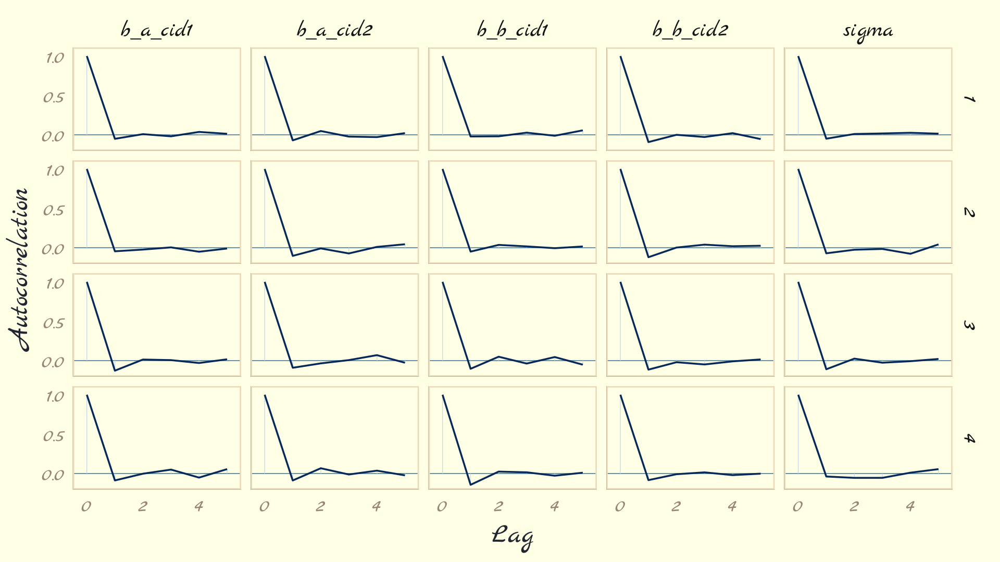
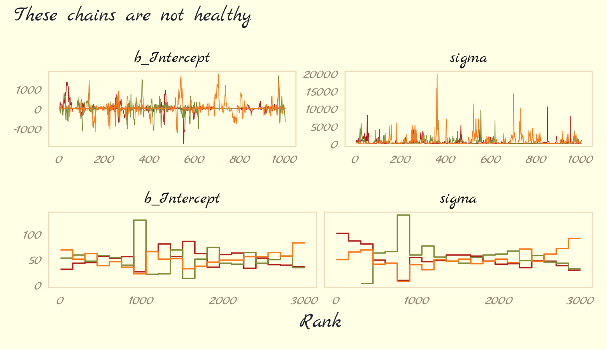

# Markov Chain Monte Carlo

This chapter introduces one commonplace example of [Fortuna](https://en.wikipedia.org/wiki/Rota_Fortunae#/media/File:Lydgate-siege-troy-wheel-fortune-detail.jpg) and [Minerva](https://en.wikipedia.org/wiki/Minerva#/media/File:Minerva-Vedder-Highsmith-detail-1.jpeg)'s cooperation: the estimation of posterior probability distributions using a stochastic process known as **Markov chain Monte Carlo** (**MCMC**)" [@mcelreathStatisticalRethinkingBayesian2020, p. 263, **emphasis** in the original]. Though we've been using MCMC via the **brms** package for chapters, now, this chapter should clarify some of the questions you might have about the details.

#### Rethinking: Stan was a man.

> The Stan programming language is not an abbreviation or acronym. Rather, it is named after [Stanisław Ulam](https://en.wikipedia.org/wiki/Stanislaw_Ulam). Ulam is credited as one of the inventors of Markov chain Monte Carlo. Together with Ed Teller, Ulam applied it to designing fusion bombs. But he and others soon applied the general Monte Carlo method to diverse problems of less monstrous nature. Ulam made important contributions in pure mathematics, chaos theory, and molecular and theoretical biology, as well. (p. 264)

## Good King Markov and his island kingdom

Here we simulate King Markov’s journey. In this version of the code, we've added `set.seed()`, which helps make the exact results reproducible.


```r
set.seed(9)

num_weeks <- 1e5
positions <- rep(0, num_weeks) 
current   <- 10

for (i in 1:num_weeks) {
  
  # record current position 
  positions[i] <- current
  # flip coin to generate proposal
  proposal <- current + sample(c(-1, 1), size = 1)
  # now make sure he loops around the archipelago 
  if (proposal < 1) proposal <- 10
  if (proposal > 10) proposal <- 1
  # move?
  prob_move <- proposal/current
  current <- ifelse(runif(1) < prob_move, proposal, current)
  
}  
```

In this chapter, we'll take our plotting theme from the [**ggpomological** package](https://github.com/gadenbuie/ggpomological) [@R-ggpomological].


```r
# devtools::install_github("gadenbuie/ggpomological")
library(ggpomological)
```

To get the full benefits from **ggpomological**, you may need to download some fonts. Throughout this chapter, I make extensive use of Marck Script, which you find at [https://fonts.google.com/specimen/Marck+Script](https://fonts.google.com/specimen/Marck+Script). Once you've installed the font on your computer, you may also have to execute `extrafont::font_import()`. Here we get a sense of the colors we'll be using with our dots and lines and so on.


```r
scales::show_col(ggpomological:::pomological_palette)
```


This will make it easier to access those colors.


```r
pomological_palette <- ggpomological:::pomological_palette
```

Now make Figure 8.2.a.


```r
library(tidyverse)

tibble(week   = 1:1e5,
       island = positions) %>%
  ggplot(aes(x = week, y = island)) +
  geom_point(shape = 1, color = pomological_palette[1]) +
  scale_x_continuous(breaks = seq(from = 0, to = 100, by = 20)) +
  scale_y_continuous(breaks = seq(from = 0, to = 10, by = 2)) +
  coord_cartesian(xlim = c(0, 100)) +
  labs(title = "Behold the Metropolis algorithm in action!",
       subtitle = "The dots show the king's path over the first 100 weeks.") +
  theme_pomological_fancy(base_family = "Marck Script")
```


Figure 8.2.b.


```r
tibble(week   = 1:1e5,
       island = positions) %>%
  mutate(island = factor(island)) %>%
  ggplot(aes(x = island)) +
  geom_bar(fill = pomological_palette[2]) +
  scale_y_continuous("number of weeks", expand = expansion(mult = c(0, 0.05))) +
  labs(title = "Old Metropolis shines in the long run.",
       subtitle = "Sure enough, the time the king spent on each island\nwas proportional to its population size.") +
  theme_pomological_fancy(base_family = "Marck Script")
```


## Metropolis algorithms

"The Metropolis algorithm is the grandparent of several different strategies for getting samples from unknown posterior distributions" (p. 267). If you're interested, @robertShortHistoryMarkov2011 wrote a [good historical overview of MCMC](https://arxiv.org/pdf/0808.2902.pdf).

### Gibbs sampling.

The Gibbs sampler [@gemanStochasticRelaxationGibbs1984; @casellaExplainingGibbsSampler1992] uses *conjugate* pairs (i.e., pairs of priors and likelihoods that have analytic solutions for the posterior of an individual parameter) to efficiently sample from the posterior. Gibbs was the workhorse algorithm during the rise of Bayesian computation in the 1990s and it was highlighted in Bayesian software like BUGS [@bugs2003UM] and JAGS [@plummerJAGSProgramAnalysis2003]. We will not be using the Gibbs sampler in this project. It's available for use in **R**. For an extensive applied introduction, check out Kruschke's [-@kruschkeDoingBayesianData2015] [text](https://sites.google.com/site/doingbayesiandataanalysis/).

### High-dimensional problems.

The Gibbs sampler is limited in that (a) you might not want to use conjugate priors and (b) it can be quite inefficient with complex hierarchical models, which we'll be fitting soon. McElreath gave a visual example of the pathology high autocorrelations can create when using the Metropolis algorithm. However, the Metropolis algorithm is beyond the scope of this project and we will not be reproducing those plots at this time. However, if any enthusiastic readers happen to reproduce those plots on their own, I would be [interested in seeing your code](https://github.com/ASKurz/Statistical_Rethinking_with_brms_ggplot2_and_the_tidyverse_2_ed/issues).

We may as well make a version of Figure 9.4, however. McElreath threw us a bone and gave us the code in his **R** code 9.4. Here we'll warp his code into a function called `concentration_sim()` which adds a `seed` argument for reproducibility. 


```r
concentration_sim <- function(d = 1, t = 1e3, seed = 9) {
  
  set.seed(seed)
  
  y <- rethinking::rmvnorm(t, rep(0, d), diag(d))
  rad_dist <- function(y) sqrt(sum(y^2))
  rd <- sapply(1:t, function(i) rad_dist( y[i, ])) 
  
}
```

Now run the simulation four times and plot.


```r
d <-
  tibble(d = c(1, 10, 100, 1000)) %>% 
  mutate(con = map(d, concentration_sim)) %>% 
  unnest(con) %>% 
  mutate(`# dimensions` = factor(d)) 

d  %>% 
  ggplot(aes(x = con, fill = `# dimensions`)) +
  geom_density(size = 0, alpha = 3/4) +
  scale_fill_pomological() +
  xlab("Radial distance from mode") +
  theme_pomological_fancy(base_family = "Marck Script") +
  theme(legend.position = c(.7, .625))
```


With high-dimensional posteriors, 

> sampled points are in a thin, high-dimensional shell very far from the mode. This shell can create very hard paths for a sampler to follow.
>
> This is why we need MCMC algorithms that focus on the entire posterior at once, instead of one or a few dimensions at a time like Metropolis and Gibbs. Otherwise we get stuck in a narrow, highly curving region of parameter space. (p. 270)

## Hamiltonian Monte Carlo

Hamiltonian Monte Carlo (HMC) is more computationally costly and more efficient than Gibbs at sampling from the posterior. It needs fewer samples, especially when fitting models with many parameters. To learn more about how HMC works, check out McElreath's [lecture on the topic from January 2019](https://www.youtube.com/watch?v=v-j0UmWf3Us); his blog post, [*Markov chains: Why walk when you can flow?*](https://elevanth.org/blog/2017/11/28/build-a-better-markov-chain/); or one of these lectures ([here](https://www.youtube.com/watch?v=jUSZboSq1zg), [here](https://www.youtube.com/watch?v=_fnDz2Bz3h8), or [here](https://www.youtube.com/watch?v=pHsuIaPbNbY)) by Michael Betancourt.

### Another parable.

This section is beyond the scope of this project.


### Particles in space.

This section is beyond the scope of this project.

### Limitations. 

> As always, there are some limitations. HMC requires continuous parameters. It can't glide through a discrete parameter. In practice, this means that certain techniques, like the imputation of discrete missing data, have to be done differently with HMC. HMC can certainly sample from such models, often much more efficiently than a Gibbs sampler could. But you have to change how you code them. (p. 278)

## Easy HMC: ~~ulam~~ `brm()`

Much like McElreath's **rethinking** package, **brms** provides a convenient interface to HMC via Stan. Other packages providing Stan interfaces include [**rstanarm**](https://mc-stan.org/rstanarm/) [@R-rstanarm; @rstanarm2018] and [**blavaan**](https://faculty.missouri.edu/~merklee/blavaan/) [@R-blavaan; @Merkle2018blavaan]. I'm not aware of any up-to-date comparisons across the packages. If you're ever inclined to make one, [let the rest of us know](https://github.com/ASKurz/Statistical_Rethinking_with_brms_ggplot2_and_the_tidyverse_2_ed/issues)!

Here we load the `rugged` data and **brms**.


```r
library(brms)
data(rugged, package = "rethinking")
d <- rugged
rm(rugged)
```

It takes just a sec to do a little data manipulation. 


```r
d <- 
  d %>%
  mutate(log_gdp = log(rgdppc_2000))

dd <-
  d %>%
  drop_na(rgdppc_2000) %>% 
  mutate(log_gdp_std = log_gdp / mean(log_gdp),
         rugged_std  = rugged / max(rugged),
         cid         = ifelse(cont_africa == 1, "1", "2")) %>% 
  mutate(rugged_std_c = rugged_std - mean(rugged_std))
```

In the context of this chapter, it doesn't make sense to translate McElreath's `m8.3` `quap()` code to `brm()` code. Below, we'll just go directly to the `brm()` variant of his `m9.1`.

### Preparation.

When working with **brms**, you don't need to do the data processing McElreath did on page 280. If you wanted to, however, here's how you might do it within the **tidyverse**.


```r
dat_slim <-
  dd %>%
  mutate(cid = as.integer(cid)) %>% 
  select(log_gdp_std, rugged_std, cid, rugged_std_c) %>% 
  list()

str(dat_slim)
```

### Sampling from the posterior.

Finally, we get to work that sweet HMC via `brms::brm()`.


```r
b9.1 <- 
  brm(data = dd, 
      family = gaussian,
      bf(log_gdp_std ~ 0 + a + b * (rugged_std - 0.215), 
         a ~ 0 + cid, 
         b ~ 0 + cid,
         nl = TRUE),
      prior = c(prior(normal(1, 0.1), class = b, coef = cid1, nlpar = a),
                prior(normal(1, 0.1), class = b, coef = cid2, nlpar = a),
                prior(normal(0, 0.3), class = b, coef = cid1, nlpar = b),
                prior(normal(0, 0.3), class = b, coef = cid2, nlpar = b),
                prior(exponential(1), class = sigma)),
      chains = 1, cores = 1,
      seed = 9,
      file = "fits/b09.01")
```

This was another instance of the **brms** non-linear syntax, We've already introduced this in [Section 4.4.2.1][Overthinking: Logs and exps, oh my.], [Section 5.3.2][Many categories.], and [Section 6.2.1][A prior is born.]. For even more details, you can always peruse Bürkner's [-@Bürkner2020Non_linear] vignette, [*Estimating non-linear models with brms*](https://CRAN.R-project.org/package=brms/vignettes/brms_nonlinear.html).

Here is a summary of the posterior.


```r
print(b9.1)
```

```
##  Family: gaussian 
##   Links: mu = identity; sigma = identity 
## Formula: log_gdp_std ~ 0 + a + b * (rugged_std - 0.215) 
##          a ~ 0 + cid
##          b ~ 0 + cid
##    Data: dd (Number of observations: 170) 
## Samples: 1 chains, each with iter = 2000; warmup = 1000; thin = 1;
##          total post-warmup samples = 1000
## 
## Population-Level Effects: 
##        Estimate Est.Error l-95% CI u-95% CI Rhat Bulk_ESS Tail_ESS
## a_cid1     0.89      0.02     0.86     0.92 1.00     1114      721
## a_cid2     1.05      0.01     1.03     1.07 1.00     1106      658
## b_cid1     0.13      0.08    -0.01     0.29 1.00     1015      773
## b_cid2    -0.14      0.06    -0.26    -0.03 1.01     1241      712
## 
## Family Specific Parameters: 
##       Estimate Est.Error l-95% CI u-95% CI Rhat Bulk_ESS Tail_ESS
## sigma     0.11      0.01     0.10     0.13 1.00      997      720
## 
## Samples were drawn using sampling(NUTS). For each parameter, Bulk_ESS
## and Tail_ESS are effective sample size measures, and Rhat is the potential
## scale reduction factor on split chains (at convergence, Rhat = 1).
```

Unlike McElreath's `precis()` output, our output has an `Rhat` instead of `Rhat4`. McElreath's documentation indicated his `Rhat4` values are based on the $\widehat R$ from @gelman2013bayesian. To my knowledge, **brms** uses the same formula. McElreath also remarked he expected to update to an `Rhat5` in the near future. I believe he was referencing @vehtariRanknormalizationFoldingLocalization2019. I am under the impression this will be implemented at the level of the underlying Stan code, which means **brms** will get the update, too. To learn more, check out the [New R-hat and ESS](https://discourse.mc-stan.org/t/new-r-hat-and-ess/8165) thread on the Stan Forums.

Also of note, McElreath's `rethinking::precis()` returns highest posterior density intervals (HPDIs) when summarizing `ulam()` models. Not so with **brms**. If you want HPDIs, you might use the convenience functions from the **tidybayes** package. Here's an example.


```r
library(tidybayes)

post <- posterior_samples(b9.1)

post %>% 
  pivot_longer(-lp__) %>% 
  group_by(name) %>% 
  mean_hdi(value, .width = .89)  # note our rare use of 89% intervals
```

```
## # A tibble: 5 x 7
##   name      value  .lower  .upper .width .point .interval
##   <chr>     <dbl>   <dbl>   <dbl>  <dbl> <chr>  <chr>    
## 1 b_a_cid1  0.887  0.858   0.910    0.89 mean   hdi      
## 2 b_a_cid2  1.05   1.03    1.07     0.89 mean   hdi      
## 3 b_b_cid1  0.132  0.0101  0.245    0.89 mean   hdi      
## 4 b_b_cid2 -0.144 -0.228  -0.0505   0.89 mean   hdi      
## 5 sigma     0.112  0.102   0.123    0.89 mean   hdi
```

There's one more important difference in our **brms** summary output compared to McElreath's `rethinking::precis()` output. In the text we learn `precis()` returns `n_eff` values for each parameter. Earlier versions of **brms** used to have a direct analogue named `Eff.Sample`. Both were estimates of the effective number of samples (a.k.a. the effective sample size) for each parameter. As with typical sample size, the more the merrier. Starting with version 2.10.0, **brms** now returns two columns: `Bulk_ESS` and `Tail_ESS`. These originate from the same @vehtariRanknormalizationFoldingLocalization2019 paper that introduced the upcoming change to the $\widehat R$. From the paper, we read:

> If you plan to report quantile estimates or posterior intervals, we strongly suggest assessing the convergence of the chains for these quantiles. In Section 4.3 we show that convergence of Markov chains is not uniform across the parameter space and propose diagnostics and effective sample sizes specifically for extreme quantiles. This is *different* from the standard ESS estimate (which we refer to as the "bulk-ESS"), which mainly assesses how well the centre of the distribution is resolved. Instead, these "tail-ESS" measures allow the user to estimate the MCSE for interval estimates. (p. 5, *emphasis* in the original)

For more technical details, see the paper. In short, `Bulk_ESS` in the output from **brms** 2.10.0+ is what was previously referred to as `Eff.Sample` in earlier versions. It's also what corresponds to what McElreath calls `n_eff`. This indexed the number of effective samples in 'the center of the' posterior distribution (i.e., the posterior mean or median). But since we also care about uncertainty in our parameters, we care about stability in the 95% intervals and such. The new `Tail_ESS` in **brms** output allows us to gauge the effective sample size for those intervals.

### Sampling again, in parallel.

> You can easily parallelize those chains... They can all run at the same time, instead of in sequence. So as long as your computer has four cores (it probably does), it won't take longer to run four chains than one chain. To run four independent Markov chains for the model above, and to distribute them across separate cores in your computer, just increase the number of chains and add a cores argument. (p. 281)

If you don't know how many cores you have on your computer, you can always check with the `parallel::detectCores()` function. My current laptop has 16.


```r
parallel::detectCores()
```

```
## [1] 16
```

Here we sample from four HMC chains in parallel by adding `cores = 4`.


```r
b9.1b <- 
  update(b9.1, 
         chains = 4, cores = 4,
         seed = 9,
         file = "fits/b09.01b")
```

This model sampled so fast that it really didn't matter if we sampled in parallel or not. It will for others.


```r
print(b9.1b)
```

```
##  Family: gaussian 
##   Links: mu = identity; sigma = identity 
## Formula: log_gdp_std ~ 0 + a + b * (rugged_std - 0.215) 
##          a ~ 0 + cid
##          b ~ 0 + cid
##    Data: dd (Number of observations: 170) 
## Samples: 4 chains, each with iter = 2000; warmup = 1000; thin = 1;
##          total post-warmup samples = 4000
## 
## Population-Level Effects: 
##        Estimate Est.Error l-95% CI u-95% CI Rhat Bulk_ESS Tail_ESS
## a_cid1     0.89      0.02     0.86     0.92 1.00     4613     2993
## a_cid2     1.05      0.01     1.03     1.07 1.00     4782     3058
## b_cid1     0.13      0.07    -0.01     0.28 1.00     4397     2724
## b_cid2    -0.14      0.06    -0.25    -0.03 1.00     5029     3104
## 
## Family Specific Parameters: 
##       Estimate Est.Error l-95% CI u-95% CI Rhat Bulk_ESS Tail_ESS
## sigma     0.11      0.01     0.10     0.12 1.00     4693     3152
## 
## Samples were drawn using sampling(NUTS). For each parameter, Bulk_ESS
## and Tail_ESS are effective sample size measures, and Rhat is the potential
## scale reduction factor on split chains (at convergence, Rhat = 1).
```

The `show()` function does not work for **brms** models the same way it does with those from **rethinking**. Rather, `show()` returns the same information we'd get from `print()` or `summary()`.


```r
show(b9.1b)
```

```
##  Family: gaussian 
##   Links: mu = identity; sigma = identity 
## Formula: log_gdp_std ~ 0 + a + b * (rugged_std - 0.215) 
##          a ~ 0 + cid
##          b ~ 0 + cid
##    Data: dd (Number of observations: 170) 
## Samples: 4 chains, each with iter = 2000; warmup = 1000; thin = 1;
##          total post-warmup samples = 4000
## 
## Population-Level Effects: 
##        Estimate Est.Error l-95% CI u-95% CI Rhat Bulk_ESS Tail_ESS
## a_cid1     0.89      0.02     0.86     0.92 1.00     4613     2993
## a_cid2     1.05      0.01     1.03     1.07 1.00     4782     3058
## b_cid1     0.13      0.07    -0.01     0.28 1.00     4397     2724
## b_cid2    -0.14      0.06    -0.25    -0.03 1.00     5029     3104
## 
## Family Specific Parameters: 
##       Estimate Est.Error l-95% CI u-95% CI Rhat Bulk_ESS Tail_ESS
## sigma     0.11      0.01     0.10     0.12 1.00     4693     3152
## 
## Samples were drawn using sampling(NUTS). For each parameter, Bulk_ESS
## and Tail_ESS are effective sample size measures, and Rhat is the potential
## scale reduction factor on split chains (at convergence, Rhat = 1).
```

You can get a focused look at the `formula` and prior information from a **brms** fit object by subsetting them directly.


```r
b9.1b$formula
```

```
## log_gdp_std ~ 0 + a + b * (rugged_std - 0.215) 
## a ~ 0 + cid
## b ~ 0 + cid
```

```r
b9.1b$prior
```

```
##           prior class coef group resp dpar nlpar bound    source
##          (flat)     b                          a       (unknown)
##  normal(1, 0.1)     b cid1                     a       (unknown)
##  normal(1, 0.1)     b cid2                     a       (unknown)
##          (flat)     b                          b       (unknown)
##  normal(0, 0.3)     b cid1                     b       (unknown)
##  normal(0, 0.3)     b cid2                     b       (unknown)
##  exponential(1) sigma                                  (unknown)
```

You can get that information on the model priors with the `prior_summary()` function.


```r
prior_summary(b9.1b)
```

```
##           prior class coef group resp dpar nlpar bound    source
##          (flat)     b                          a       (unknown)
##  normal(1, 0.1)     b cid1                     a       (unknown)
##  normal(1, 0.1)     b cid2                     a       (unknown)
##          (flat)     b                          b       (unknown)
##  normal(0, 0.3)     b cid1                     b       (unknown)
##  normal(0, 0.3)     b cid2                     b       (unknown)
##  exponential(1) sigma                                  (unknown)
```

I am not aware of a convenient way to pull the information on how long each chain ran for. As to the sample size, our output is a little different than McElreath's. The **brms** default is to run 4 chains, each containing 2,000 total samples, the first 1,000 of which are warmups. Since we used those defaults, we ended up with $(2{,}000 - 1{,}000) \times 4 = 4{,}000$ post-warmup HMC samples. But anyways, just like all of McElreath's `n_eff` values were above 2,000, most of our `Bulk_ESS` values were above 4,000, which is

> no mistake. The adaptive sampler that Stan uses is so good, it can actually produce sequential samples that are better than uncorrelated. They are anti-correlated. This means it can explore the posterior distribution so efficiently that it can beat random. (p. 282)

In addition to sampling HMC chains in parallel, the Stan team have been working on within-chain parallelization, too. This is a new development and was just made available to **brms** users with the release of **brms** version 2.14.0. I don't plan on covering within-chain parallelization in this ebook, but you can learn more in Weber and Bürkner's [-@Weber2020WithinChainParallelization] vignette, [*Running brms models with within-chain parallelization*](https://CRAN.R-project.org/package=brms/vignettes/brms_threading.html), or Weber's guest post on Gelman's blog, [*Stan's within-chain parallelization now available with brms*](https://statmodeling.stat.columbia.edu/2020/10/14/stans-within-chain-parallelization-in-brms/#comments). If you have some large rough model that's taking hours upon hours to fit, it might be worth your while.

### Visualization.

As with McElreath's **rethinking**, **brms** allows users to put the fit object directly into the `pairs()` function.


```r
pairs(b9.1b,
      off_diag_args = list(size = 1/5, alpha = 1/5))
```


Our output is a little different in that we don't get a lower-triangle of Pearson's correlation coefficients. If you'd like those values, use `vcov().`


```r
vcov(b9.1b, correlation = T) %>% round(digits = 2)
```

```
##        a_cid1 a_cid2 b_cid1 b_cid2
## a_cid1   1.00  -0.03   0.17   0.05
## a_cid2  -0.03   1.00   0.01  -0.09
## b_cid1   0.17   0.01   1.00  -0.03
## b_cid2   0.05  -0.09  -0.03   1.00
```

Note, however, that this will only return the correlations among the 'Population-Level Effects'. Within **brms**, $\sigma$ is classified among the 'Family Specific Parameters'. We have more options still. As a first step, use the `brms::posterior_samples()` function to extract the posterior samples within a data frame.


```r
post <- posterior_samples(b9.1b)

glimpse(post)
```

```
## Rows: 4,000
## Columns: 6
## $ b_a_cid1 <dbl> 0.9064987, 0.8718809, 0.9012252, 0.8977892, 0.8703916, 0.9253578, 0.9209231, 0.8…
## $ b_a_cid2 <dbl> 1.050241, 1.060212, 1.044918, 1.047780, 1.041505, 1.035713, 1.045927, 1.058108, …
## $ b_b_cid1 <dbl> 0.05395168, 0.17354574, 0.10481150, 0.12121863, 0.24473996, 0.20813709, 0.234830…
## $ b_b_cid2 <dbl> -0.12886759, -0.12364289, -0.19158438, -0.18779887, -0.17745017, -0.09887813, -0…
## $ sigma    <dbl> 0.11045080, 0.11337407, 0.10222348, 0.10314139, 0.09620476, 0.12221787, 0.116598…
## $ lp__     <dbl> 133.1505, 133.4317, 132.5007, 133.3072, 128.2402, 129.3591, 131.5271, 132.3988, …
```

Another nice way to customize your pairs plot is with the [**GGally** package](https://cran.r-project.org/package=GGally). For this approach, you feed the `post` data into the `ggpairs()` function.


```r
library(GGally)

post %>%
  select(-lp__ ) %>%
  ggpairs()
```


Now we get the pairs plot on the lower triangle and the Pearson's correlation coefficients in the upper. Since `GGally::ggpairs()` returns a **ggplot2** object, you can customize it as you please.


```r
my_diag <- function(data, mapping, ...) {
  ggplot(data = data, mapping = mapping) + 
    geom_density(fill = pomological_palette[7],
                 color = pomological_palette[6])
}

my_upper <- function(data, mapping, ...) {
  ggplot(data = data, mapping = mapping) + 
    geom_bin2d() +
    scale_fill_gradient(low = pomological_palette[4], 
                        high = pomological_palette[1])
}

post %>%
  select(-lp__ ) %>%
  ggpairs(lower = list(continuous = wrap("cor", family = "Marck Script", color = "black")),
          diag = list(continuous = my_diag),
          upper = list(continuous = my_upper)) +
  labs(subtitle = "My custom pairs plot") +
  theme_pomological_fancy(base_family = "Marck Script")
```


For more ideas on customizing a `ggpairs()` plot, go [here](https://ggobi.github.io/ggally/articles/ggpairs.html).

### Checking the chain.

Using `plot()` for a `brm()` fit returns both density and trace lots for the parameters.


```r
plot(b9.1b)
```


The [**bayesplot**](https://cran.r-project.org/package=bayesplot) package allows a little more control. Here, we use the `bayesplot::mcmc_trace()` function to show only trace plots with our custom theme. Note that `mcmc_trace()` works with data frames, not brmfit objects. There's a further complication. Recall how we made `post` (i.e., `post <- posterior_samples(b8.1)`). Our `post` data frame carries no information on chains. To retain that information, we'll need to add an `add_chain = T` argument to our `posterior_samples()` function.


```r
library(bayesplot)

post <- posterior_samples(b9.1b, add_chain = T)

mcmc_trace(post[, c(1:5, 7)],  # we need to include column 7 because it contains the chain info 
           facet_args = list(ncol = 3), 
           size = .15) +
  scale_color_pomological() +
  labs(title = "My custom trace plots") +
  theme_pomological_fancy(base_family = "Marck Script") +
  theme(legend.position = c(.95, .2))
```


The **bayesplot** package offers a variety of diagnostic plots. Here we make autocorrelation plots for all model parameters, one for each HMC chain.


```r
post %>% 
  mcmc_acf(pars = vars(b_a_cid1:sigma),
           lags = 5) +
  theme_pomological_fancy(base_family = "Marck Script") 
```



That's just what we like to see--nice L-shaped autocorrelation plots. Those are the kinds of shapes you'd expect when you have reasonably large effective samples.
Before we move on, there's an important difference between the trace plots McElreath showed in the text and the ones we just made. McElreath's trace plots include the warmup iterations. Ours did not. To my knowledge, neither the `brms::plot()` nor the `bayesplot::mcmc_trace()` functions support including warmups in their trace plots. One quick way to get them is with the [**ggmcmc** package](https://cran.rstudio.com/package=ggmcmc) [@R-ggmcmc; @marinGgmcmcAnalysisMCMC2016]. 


```r
# install.packages("ggmcmc", dependencies = T)
library(ggmcmc)
```

The **ggmcmc** package has a variety of convenience functions for working with MCMC chains. The `ggs()` function extracts the posterior draws, including `warmup`, and arranges them in a tidy tibble.


```r
ggs(b9.1b) %>% 
  str()
```

```
## tibble [40,000 × 4] (S3: tbl_df/tbl/data.frame)
##  $ Iteration: int [1:40000] 1 2 3 4 5 6 7 8 9 10 ...
##  $ Chain    : int [1:40000] 1 1 1 1 1 1 1 1 1 1 ...
##  $ Parameter: Factor w/ 5 levels "b_a_cid1","b_a_cid2",..: 1 1 1 1 1 1 1 1 1 1 ...
##  $ value    : num [1:40000] 0.771 0.771 0.771 0.771 0.836 ...
##  - attr(*, "nChains")= int 4
##  - attr(*, "nParameters")= int 5
##  - attr(*, "nIterations")= int 2000
##  - attr(*, "nBurnin")= num 1000
##  - attr(*, "nThin")= num 1
##  - attr(*, "description")= chr "c5510a14f5524d8f0be80b18d0fe9c3e"
```

With this in hand, we can now include those warmup draws in our trace plots. Here's how to do so without convenience functions like `bayesplot::mcmc_trace()`.


```r
ggs(b9.1b) %>%
  mutate(chain = factor(Chain)) %>% 
  
  ggplot(aes(x = Iteration, y = value)) +
  # this marks off the warmups
  annotate(geom = "rect", 
           xmin = 0, xmax = 1000, ymin = -Inf, ymax = Inf,
           fill = pomological_palette[9], alpha = 1/6, size = 0) +
  geom_line(aes(color = chain),
            size = .15) +
  scale_color_pomological() +
  labs(title = "My custom trace plots with warmups via ggmcmc::ggs()",
       x = NULL, y = NULL) +
  theme_pomological_fancy(base_family = "Marck Script") +
  theme(legend.position = c(.95, .18)) +
  facet_wrap(~Parameter, scales = "free_y")
```


Following **brms** defaults, we won't include warmup iterations in the trace plots for other models in this book. A nice thing about plots that do contain them, though, is they reveal how quickly our HMC chains transition away from their start values into the posterior. To get a better sense of this, let's make those trace plots once more, but this time zooming in on the first 50 iterations.


```r
ggs(b9.1b) %>%
  mutate(chain = factor(Chain)) %>% 
  
  ggplot(aes(x = Iteration, y = value, color = chain)) +
  annotate(geom = "rect", 
           xmin = 0, xmax = 1000, ymin = -Inf, ymax = Inf,
           fill = pomological_palette[9], alpha = 1/6, size = 0) +
  geom_line(size = .5) +
  scale_color_pomological() +
  labs(title = "Another custom trace plots with warmups via ggmcmc::ggs()",
       x = NULL, y = NULL) +
  coord_cartesian(xlim = c(1, 50)) +
  theme_pomological_fancy(base_family = "Marck Script") +
  theme(legend.position = c(.95, .18)) +
  facet_wrap(~Parameter, scales = "free_y")
```


For each parameter, the all four chains had moved away from their starting values to converge on the marginal posteriors by the 30^th^ iteration or so.

But anyway, we've veered a bit from the text. McElreath pointed out a second way to visualize the chains is by the distribution of the ranked samples, which he called a **trank plot** (short for trace rank plot). I'm not aware that **brms** has a built-in function for that. Happily, we can make them with `mcmc_rank_overlay()`.


```r
post %>% 
  mcmc_rank_overlay(pars = vars(b_a_cid1:sigma)) +
  scale_color_pomological() +
  labs(title = "My custom trank plots") +
  coord_cartesian(ylim = c(25, NA)) +
  theme_pomological_fancy(base_family = "Marck Script") +
  theme(legend.position = c(.95, .2))
```


> What this means is to take all the samples for each individual parameter and rank them. The lowest sample gets rank 1. The largest gets the maximum rank (the number of samples across all chains). Then we draw a histogram of these ranks for each individual chain. Why do this? Because if the chains are exploring the same space efficiently, the histograms should be similar to one another and largely overlapping.
>
> ...The horizontal is rank, from 1 to the number of samples across all chains (2000 in this example). The vertical axis is the frequency of ranks in each bin of the histogram. This trank plot is what we hope for: Histograms that overlap and stay within the same range. (pp. 284--285)

#### Overthinking: Raw Stan model code.

The `stancode()` function works with **brms** much like it does with **rethinking**.


```r
brms::stancode(b9.1b)
```

```
## // generated with brms 2.14.0
## functions {
## }
## data {
##   int<lower=1> N;  // total number of observations
##   vector[N] Y;  // response variable
##   int<lower=1> K_a;  // number of population-level effects
##   matrix[N, K_a] X_a;  // population-level design matrix
##   int<lower=1> K_b;  // number of population-level effects
##   matrix[N, K_b] X_b;  // population-level design matrix
##   // covariate vectors for non-linear functions
##   vector[N] C_1;
##   int prior_only;  // should the likelihood be ignored?
## }
## transformed data {
## }
## parameters {
##   vector[K_a] b_a;  // population-level effects
##   vector[K_b] b_b;  // population-level effects
##   real<lower=0> sigma;  // residual SD
## }
## transformed parameters {
## }
## model {
##   // likelihood including all constants
##   if (!prior_only) {
##     // initialize linear predictor term
##     vector[N] nlp_a = X_a * b_a;
##     // initialize linear predictor term
##     vector[N] nlp_b = X_b * b_b;
##     // initialize non-linear predictor term
##     vector[N] mu;
##     for (n in 1:N) {
##       // compute non-linear predictor values
##       mu[n] = 0 + nlp_a[n] + nlp_b[n] * (C_1[n] - 0.215);
##     }
##     target += normal_lpdf(Y | mu, sigma);
##   }
##   // priors including all constants
##   target += normal_lpdf(b_a[1] | 1, 0.1);
##   target += normal_lpdf(b_a[2] | 1, 0.1);
##   target += normal_lpdf(b_b[1] | 0, 0.3);
##   target += normal_lpdf(b_b[2] | 0, 0.3);
##   target += exponential_lpdf(sigma | 1);
## }
## generated quantities {
## }
```

You can also get that information by executing `b9.1b$model` or `b9.1b$fit@stanmodel`.

## Care and feeding of your Markov chain.

> Markov chain Monte Carlo is a highly technical and usually automated procedure. You might write your own MCMC code, for the sake of learning. But it is very easy to introduce subtle biases. A package like Stan, in contrast, is continuously tested against expected output. Most people who use Stan don't really understand what it is doing, under the hood. That's okay. Science requires division of labor, and if every one of us had to write our own Markov chains from scratch, a lot less research would get done in the aggregate. (p. 287)

If you do want to learn more about HMC, McElreath has some nice introductory lectures on the topic (see [here](https://www.youtube.com/watch?v=v-j0UmWf3Us) and [here](https://www.youtube.com/watch?v=BWEtS3HuU5A)). To dive even deeper, [Michael Betancourt]( https://twitter.com/betanalpha) from the Stan team has given many lectures on the topic (e.g., [here](https://www.youtube.com/watch?v=_fnDz2Bz3h8) and [here](https://www.youtube.com/watch?v=jUSZboSq1zg)).

### How many samples do you need?

The **brms** defaults are `iter = 2000` and `warmup = 1000`, which are twice the number as in McElreath's **rethinking** package.

> If all you want are posterior means, it doesn't take many samples at all to get very good estimates. Even a couple hundred samples will do. But if you care about the exact shape in the extreme tails of the posterior, the 99th percentile or so, then you'll need many more. So there is no universally useful number of samples to aim for. In most typical regression applications, you can get a very good estimate of the posterior mean with as few as 200 effective samples. And if the posterior is approximately Gaussian, then all you need in addition is a good estimate of the variance, which can be had with one order of magnitude more, in most cases. For highly skewed posteriors, you'll have to think more about which region of the distribution interests you. Stan will sometimes warn you about "tail ESS," the effective sample size (similar to `n_eff`) in the tails of the posterior. In those cases, it is nervous about the quality of extreme intervals, like 95%. Sampling more usually helps. (pp. 287-288)

And remember, with changes from **brms** version 2.10.0, we now have both `Bulk_ESS` and `Tail_ESS` to consult when thinking about the effective sample size. What McElreath referred to as `n_eff` is what we now think of as `Bulk_ESS` when using **brms**. When McElreath referred to the "tail ESS" in the end of that block quote, that's our **brms** `Tail_ESS` number.

#### Rethinking: Warmup is not burn-in. 

> Other MCMC algorithms and software often discuss **burn-in**....
>
> But Stan’s sampling algorithms use a different approach. What Stan does during warmup is quite different from what it does after warmup. The warmup samples are used to adapt sampling, to find good values for the step size and the number of steps. Warmup samples are not representative of the target posterior distribution, no matter how long warmup continues. They are not burning in, but rather more like cycling the motor to heat things up and get ready for sampling. When real sampling begins, the samples will be immediately from the target distribution, assuming adaptation was successful. (p. 288)

### How many chains do you need?

> It is very common to run more than one Markov chain, when estimating a single model. To do this with [**brms**], the `chains` argument specifies the number of independent Markov chains to sample from. And the optional `cores` argument lets you distribute the chains across different processors, so they can run simultaneously, rather than sequentially....
>
> for typical regression models, you can live by the motto *one short chain to debug, four chains for verification and inference*. (pp. 288--289, *emphasis* in the original)

#### Rethinking: Convergence diagnostics. 

We've already covered how **brms** has expanded the traditional notion of effective samples (i.e., `n_eff`) to `Bulk_ESS` and `Tail_ESS`. Times are changing for the $\widehat R$, too. However, it turns out the Stan team has found some deficiencies with the $\widehat R$, for which they've made recommendations that will be implemented in the Stan ecosystem sometime soon (see [here](https://discourse.mc-stan.org/t/new-r-hat-and-ess/8165) for a related thread on the Stan Forums). In the meantime, you can read all about it in @vehtariRanknormalizationFoldingLocalization2019 and in one of Dan Simpson's [blog posts](https://statmodeling.stat.columbia.edu/2019/03/19/maybe-its-time-to-let-the-old-ways-die-or-we-broke-r-hat-so-now-we-have-to-fix-it/). If you learn best by sassy twitter banter, [click through this interchange](https://twitter.com/betanalpha/status/1108185746870030336) among some of our Stan team all-stars.

For more on these topics, you might also check out Gabry and Modrák's [-@gabryVisualMCMCDiagnostics2020] vignette, [*Visual MCMC diagnostics using the bayesplot package*](https://CRAN.R-project.org/package=bayesplot/vignettes/visual-mcmc-diagnostics.html).

### Taming a wild chain.

As with **rethinking**, **brms** can take data in the form of a list. Recall however, that in order to specify starting values, you need to specify a list of lists with an `inits` argument rather than with `start`.


```r
b9.2 <-
  brm(data = list(y = c(-1, 1)), 
      family = gaussian,
      y ~ 1,
      prior = c(prior(normal(0, 1000), class = Intercept),
                prior(exponential(0.0001), class = sigma)),
      iter = 2000, warmup = 1000, chains = 3,
      seed = 9,
      file = "fits/b09.02")
```

Let's peek at the summary.


```r
print(b9.2)
```

```
## Warning: Parts of the model have not converged (some Rhats are > 1.05). Be careful when analysing
## the results! We recommend running more iterations and/or setting stronger priors.
```

```
## Warning: There were 393 divergent transitions after warmup. Increasing adapt_delta above 0.8 may
## help. See http://mc-stan.org/misc/warnings.html#divergent-transitions-after-warmup
```

```
##  Family: gaussian 
##   Links: mu = identity; sigma = identity 
## Formula: y ~ 1 
##    Data: list(y = c(-1, 1)) (Number of observations: 2) 
## Samples: 3 chains, each with iter = 2000; warmup = 1000; thin = 1;
##          total post-warmup samples = 3000
## 
## Population-Level Effects: 
##           Estimate Est.Error l-95% CI u-95% CI Rhat Bulk_ESS Tail_ESS
## Intercept    10.68    270.90  -579.92   700.75 1.05      475      297
## 
## Family Specific Parameters: 
##       Estimate Est.Error l-95% CI u-95% CI Rhat Bulk_ESS Tail_ESS
## sigma   453.49   1148.02     7.77  3254.50 1.06       63       50
## 
## Samples were drawn using sampling(NUTS). For each parameter, Bulk_ESS
## and Tail_ESS are effective sample size measures, and Rhat is the potential
## scale reduction factor on split chains (at convergence, Rhat = 1).
```

Much like in the text, this summary is a disaster. Note the warning about <span style="color: red;">divergent transitions</span>. The `brms::nuts_params()` function allows use to pull a wealth of diagnostic information for the chains from a **brms** fit. The different kinds of diagnostics are listed in the `Parameter` column.


```r
nuts_params(b9.2) %>% 
  distinct(Parameter)
```

```
##       Parameter
## 1 accept_stat__
## 2    stepsize__
## 3   treedepth__
## 4  n_leapfrog__
## 5   divergent__
## 6      energy__
```

Our interest is for when `Parameter == "divergent__"`.


```r
nuts_params(b9.2) %>% 
  filter(Parameter == "divergent__") %>% 
  count(Value)
```

```
##   Value    n
## 1     0 2607
## 2     1  393
```

This indicates that among the 3,000 post-warmup draws, 393 were classified as divergent transitions. We can use the `np` argument within `brms::pairs()` to include this information in the `pairs()` plot.


```r
pairs(b9.2, 
      np = nuts_params(b9.2),
      off_diag_args = list(size = 1/4))
```


That `np = nuts_params(b9.2)` trick will work in a similar way with **bayesplot** functions like `mcmc_pairs()` and `mcmc_trace()`. The red x marks show us where the divergent transitions are within the bivariate posterior. To my eye, the pattern in this plot isn't very strong. Sometimes the pattern of divergent transitions can give you clear clues about where the problems are in the model.

Let's further inspect the damage by making the top two rows of Figure 9.9.


```r
post <- posterior_samples(b9.2, add_chain = T)

p1 <-
  post %>% 
  mcmc_trace(pars = vars(b_Intercept:sigma),
             size = .25)

p2 <-
  post %>% 
  mcmc_rank_overlay(pars = vars(b_Intercept:sigma))

library(patchwork)

(
  (p1 / p2) &
    scale_color_pomological() &
    theme_pomological_fancy(base_family = "Marck Script") &
    theme(legend.position = "none")
) +
  plot_annotation(subtitle = "These chains are not healthy")
```



Okay, that's enough disaster. Let's try a model that adds just a little information by way of weakly-regularizing priors:

\begin{align*}
y_i & \sim \operatorname{Normal}(\mu, \sigma) \\
\mu    & = \alpha \\
\alpha & \sim \operatorname{Normal}(1, 10) \\
\sigma & \sim \operatorname{Exponential}(1).
\end{align*}

Watch our new priors save the day.


```r
b9.3 <-
  brm(data = list(y = c(-1, 1)), 
      family = gaussian,
      y ~ 1,
      prior = c(prior(normal(1, 10), class = Intercept),
                prior(exponential(1), class = sigma)),
      iter = 2000, warmup = 1000, chains = 3,
      seed = 9,
      file = "fits/b09.03")
```


```r
print(b9.3)
```

```
##  Family: gaussian 
##   Links: mu = identity; sigma = identity 
## Formula: y ~ 1 
##    Data: list(y = c(-1, 1)) (Number of observations: 2) 
## Samples: 3 chains, each with iter = 2000; warmup = 1000; thin = 1;
##          total post-warmup samples = 3000
## 
## Population-Level Effects: 
##           Estimate Est.Error l-95% CI u-95% CI Rhat Bulk_ESS Tail_ESS
## Intercept     0.04      1.18    -2.55     2.43 1.00     1126     1158
## 
## Family Specific Parameters: 
##       Estimate Est.Error l-95% CI u-95% CI Rhat Bulk_ESS Tail_ESS
## sigma     1.54      0.78     0.59     3.60 1.00      961      994
## 
## Samples were drawn using sampling(NUTS). For each parameter, Bulk_ESS
## and Tail_ESS are effective sample size measures, and Rhat is the potential
## scale reduction factor on split chains (at convergence, Rhat = 1).
```

As in the text, no more warning signs and no more silly estimates. The trace and trank plots look better, too.


```r
post <- posterior_samples(b9.3, add_chain = T)

p1 <-
  post %>% 
  mcmc_trace(pars = vars(b_Intercept:sigma),
             size = .25)

p2 <-
  post %>% 
  mcmc_rank_overlay(pars = vars(b_Intercept:sigma)) +
  ylim(35, NA)

(
  (p1 / p2) &
    scale_color_pomological() &
    theme_pomological_fancy(base_family = "Marck Script") &
    theme(legend.position = "none")
) +
  plot_annotation(subtitle = "Weakly informative priors cleared up the condition right away")
```


Now behold our version of Figure 9.10.


```r
# left
p1 <-
  post %>%
  select(b_Intercept) %>%
  
  ggplot(aes(x = b_Intercept)) +
  geom_density(trim = T) +
  geom_line(data = tibble(x = seq(from = -15, to = 15, length.out = 50)),
            aes(x = x, y = dnorm(x = x, mean = 0, sd = 10)),
            color = pomological_palette[5], linetype = 2) +
  xlab(expression(alpha))

# right
p2 <-
  post %>%
  select(sigma) %>%
  
  ggplot(aes(x = sigma)) +
  geom_density(trim = T) +
  geom_line(data = tibble(x = seq(from = 0, to = 10, length.out = 50)),
            aes(x = x, y = dexp(x = x, rate = 1)),
            color = pomological_palette[9], linetype = 2) +
  labs(x = expression(sigma),
       y = NULL) +
  coord_cartesian(xlim = c(0, 10),
                  ylim = c(0, 0.7))

# combine
(
  (p1 + p2) &
    theme_pomological_fancy(base_family = "Marck Script")
) + plot_annotation(subtitle = "Prior (dashed) and posterior (solid) distributions for the\nmodel with weakly-informative priors, b9.3")
```


> These weakly informative priors have helped by providing a very gentle nudge towards reasonable values of the parameters. Now values like 30 million are no longer equally plausible as small values like 1 or 2. Lots of problematic chains want subtle priors like these, designed to tune estimation by assuming a tiny bit of prior information about each parameter. And even though the priors end up getting washed out right away--two observations were enough here--they still have a big effect on inference, by allowing us to get an answer. (pp. 292--293)

#### Rethinking: The folk theorem of statistical computing. 

> The example above illustrates [Andrew Gelman's **folk theorem of statistical computing**](https://andrewgelman.com/2008/05/13/the_folk_theore/): When you have computational problems, often there's a problem with your model. Before we begin to tune the software and pour more computer power into a problem, it can be useful to go over the model specification again, and the data itself, to make sure the problem isn't in the pre-sampling stage. (p. 293)

#### Overthinking: Divergent transitions are your friend. 

> You'll see divergent transition warnings often in using [`brms::brm()`] and Stan. They are your friend, providing a helpful warning. These warnings arise when the numerical simulation that HMC uses is inaccurate. HMC can detect these inaccuracies. That is one of its major advantages over other sampling approaches, most of which provide few automatic ways to discover bad chains. (p. 293)

This is an issue that comes up frequently on the Stan Forums (here's a link to the [**brms** section](https://discourse.mc-stan.org/c/interfaces/brms/36)). It's a good idea to take divergent transitions seriously. Reaching out to others in the community is a great way to get guidance. But before you start a new post, make sure you look through the previous threads to keep from posting redundant questions.

### Non-identifiable parameters.

It appears that the [only way](https://github.com/ASKurz/Statistical_Rethinking_with_brms_ggplot2_and_the_tidyverse/issues/3) to get a **brms** version of McElreath's `m9.4` and `m9.5` is to augment the data. In addition to the Gaussian `y` vector, we'll add two constants to the data, `intercept_1 = 1` and `intercept_2 = 1`.


```r
set.seed(9)
y <- rnorm(100, mean = 0, sd = 1)
```


```r
b9.4 <-
  brm(data = list(y  = y,
                  a1 = 1,
                  a2 = 1), 
      family = gaussian,
      y ~ 0 + a1 + a2,
      prior = c(prior(normal(0, 1000), class = b),
                prior(exponential(1), class = sigma)),
      iter = 2000, warmup = 1000, chains = 3,
      seed = 9,
      file = "fits/b09.04")
```

Our model results don't perfectly mirror McElreath's, but they're identical in spirit.


```r
print(b9.4)
```

```
## Warning: Parts of the model have not converged (some Rhats are > 1.05). Be careful when analysing
## the results! We recommend running more iterations and/or setting stronger priors.
```

```
##  Family: gaussian 
##   Links: mu = identity; sigma = identity 
## Formula: y ~ 0 + a1 + a2 
##    Data: list(y = y, a1 = 1, a2 = 1) (Number of observations: 100) 
## Samples: 3 chains, each with iter = 2000; warmup = 1000; thin = 1;
##          total post-warmup samples = 3000
## 
## Population-Level Effects: 
##    Estimate Est.Error l-95% CI u-95% CI Rhat Bulk_ESS Tail_ESS
## a1   113.93    563.81  -599.69  1303.63 1.87        5       17
## a2  -113.99    563.81 -1303.73   599.49 1.87        5       17
## 
## Family Specific Parameters: 
##       Estimate Est.Error l-95% CI u-95% CI Rhat Bulk_ESS Tail_ESS
## sigma     1.00      0.08     0.86     1.13 1.41        6       28
## 
## Samples were drawn using sampling(NUTS). For each parameter, Bulk_ESS
## and Tail_ESS are effective sample size measures, and Rhat is the potential
## scale reduction factor on split chains (at convergence, Rhat = 1).
```

Note the frightening warning message. Those results are a mess! Let's try again.


```r
b9.5 <-
  brm(data = list(y  = y,
                  a1 = 1,
                  a2 = 1), 
      family = gaussian,
      y ~ 0 + a1 + a2,
      prior = c(prior(normal(0, 10), class = b),
                prior(exponential(1), class = sigma)),
      iter = 2000, warmup = 1000, chains = 3,
      seed = 9,
      file = "fits/b09.05")
```


```r
print(b9.5)
```

```
##  Family: gaussian 
##   Links: mu = identity; sigma = identity 
## Formula: y ~ 0 + a1 + a2 
##    Data: list(y = y, a1 = 1, a2 = 1) (Number of observations: 100) 
## Samples: 3 chains, each with iter = 2000; warmup = 1000; thin = 1;
##          total post-warmup samples = 3000
## 
## Population-Level Effects: 
##    Estimate Est.Error l-95% CI u-95% CI Rhat Bulk_ESS Tail_ESS
## a1    -0.09      7.46   -14.99    14.38 1.00      574      576
## a2     0.04      7.47   -14.46    14.92 1.00      574      568
## 
## Family Specific Parameters: 
##       Estimate Est.Error l-95% CI u-95% CI Rhat Bulk_ESS Tail_ESS
## sigma     0.97      0.07     0.85     1.11 1.00     1065     1077
## 
## Samples were drawn using sampling(NUTS). For each parameter, Bulk_ESS
## and Tail_ESS are effective sample size measures, and Rhat is the potential
## scale reduction factor on split chains (at convergence, Rhat = 1).
```

"The estimates for `a1` and `a2` are better identified now. Well, they still aren't individually identified. But their sum is identified" (p. 296). Now it's time to make our version of Figure 9.11. Before we do, one of the challenges we'll have to overcome is the `bayesplot::mcmc_rank_overlay()` doesn't seem to give users an easy way to control the faceting behavior of the plotting function. If you try to simultaneously plot all three model parameters with `mcmc_rank_overlay()`, you'll end up with the one row and three columns. But I want the reverse. One solution is to make a custom plotting function. Since we're juggling both `mcmc_trace()` and `mcmc_rank_overlay()`, we'll make the function do both at once. The trick will be to set the function and workflow up so that we only enter in one parameter at a time. Here's the function.


```r
trace_rank <- function(data, var, subtitle = NULL, ymin = NA) {
  
  p1 <-
    data %>% 
    mcmc_trace(pars = var,
               size = .25,
               facet_args = list(ncol = 1)) +
    labs(subtitle = subtitle,
         y = NULL) +
    facet_wrap(~parameter)
  
  p2 <-
    data %>%
    mcmc_rank_overlay(pars = var) +
    coord_cartesian(ylim = c(ymin, NA)) +
    xlab(NULL)
  
  tr <- p1 + p2
  
  tr
  
}
```

Now use our custom `trace_rank()` function to make the six rows one at a time and then combine them with a little **patchwork** at the end to make our version of Figure 9.11.


```r
# b9.4
post <- posterior_samples(b9.4, add_chain = T)

p1 <-  trace_rank(data = post, var = "b_a1", subtitle = "b9.4 (bad priors)")
p2 <-  trace_rank(data = post, var = "b_a2")
p3 <-  trace_rank(data = post, var = "sigma")

# b9.5
post <- posterior_samples(b9.5, add_chain = T)

p4 <-  trace_rank(data = post, var = "b_a1", subtitle = "b9.5 (good priors)", ymin = 30)
p5 <-  trace_rank(data = post, var = "b_a2", ymin = 30)
p6 <-  trace_rank(data = post, var = "sigma", ymin = 30)

# combine!
(p1 / p2 / p3 / p4 / p5 / p6) &
  scale_color_pomological() &
  theme_pomological_fancy(base_family = "Marck Script") &
  theme(legend.position = "none")
```


The central message in the text, default to weakly-regularizing priors, holds for **brms** just as it does for **rethinking**. For more on the topic, see the [recommendations from the Stan team](https://github.com/stan-dev/stan/wiki/Prior-Choice-Recommendations). If you want to dive deeper, check out Simpson's post on Gelman's blog, [*(It's never a) total eclipse of the prior*](https://statmodeling.stat.columbia.edu/2017/09/05/never-total-eclipse-prior/) and their corresponding [-@gelmanPriorCanOften2017] paper with Betancourt, [*The prior can often only be understood in the context of the likelihood*](https://www.mdpi.com/1099-4300/19/10/555).

## Session info {-}


```r
sessionInfo()
```

```
## R version 3.6.3 (2020-02-29)
## Platform: x86_64-apple-darwin15.6.0 (64-bit)
## Running under: macOS Catalina 10.15.3
## 
## Matrix products: default
## BLAS:   /Library/Frameworks/R.framework/Versions/3.6/Resources/lib/libRblas.0.dylib
## LAPACK: /Library/Frameworks/R.framework/Versions/3.6/Resources/lib/libRlapack.dylib
## 
## locale:
## [1] en_US.UTF-8/en_US.UTF-8/en_US.UTF-8/C/en_US.UTF-8/en_US.UTF-8
## 
## attached base packages:
## [1] stats     graphics  grDevices utils     datasets  methods   base     
## 
## other attached packages:
##  [1] patchwork_1.0.1.9000 ggmcmc_1.4.1         bayesplot_1.7.2      GGally_2.0.0        
##  [5] tidybayes_2.1.1      brms_2.14.4          Rcpp_1.0.5           forcats_0.5.0       
##  [9] stringr_1.4.0        dplyr_1.0.2          purrr_0.3.4          readr_1.3.1         
## [13] tidyr_1.1.1          tibble_3.0.4         tidyverse_1.3.0      ggpomological_0.1.2 
## [17] ggplot2_3.3.2       
## 
## loaded via a namespace (and not attached):
##   [1] readxl_1.3.1         backports_1.2.0      plyr_1.8.6           igraph_1.2.5        
##   [5] splines_3.6.3        svUnit_1.0.3         crosstalk_1.1.0.1    TH.data_1.0-10      
##   [9] rstantools_2.1.1     inline_0.3.16        digest_0.6.27        htmltools_0.5.0     
##  [13] rethinking_2.01      rsconnect_0.8.16     fansi_0.4.1          magrittr_1.5        
##  [17] modelr_0.1.6         extrafont_0.17       RcppParallel_5.0.2   matrixStats_0.57.0  
##  [21] xts_0.12.1           sandwich_2.5-1       extrafontdb_1.0      prettyunits_1.1.1   
##  [25] colorspace_1.4-1     rvest_0.3.5          ggdist_2.1.1         haven_2.2.0         
##  [29] xfun_0.19            callr_3.5.1          crayon_1.3.4         jsonlite_1.7.1      
##  [33] lme4_1.1-23          survival_3.1-12      zoo_1.8-8            glue_1.4.2          
##  [37] gtable_0.3.0         emmeans_1.4.5        V8_3.4.0             pkgbuild_1.1.0      
##  [41] Rttf2pt1_1.3.8       rstan_2.21.2         shape_1.4.4          abind_1.4-5         
##  [45] scales_1.1.1         mvtnorm_1.1-1        DBI_1.1.0            miniUI_0.1.1.1      
##  [49] xtable_1.8-4         HDInterval_0.2.0     stats4_3.6.3         StanHeaders_2.21.0-6
##  [53] DT_0.13              htmlwidgets_1.5.1    httr_1.4.1           threejs_0.3.3       
##  [57] RColorBrewer_1.1-2   arrayhelpers_1.1-0   ellipsis_0.3.1       reshape_0.8.8       
##  [61] pkgconfig_2.0.3      loo_2.3.1            farver_2.0.3         dbplyr_1.4.2        
##  [65] utf8_1.1.4           tidyselect_1.1.0     labeling_0.4.2       rlang_0.4.8         
##  [69] reshape2_1.4.4       later_1.1.0.1        munsell_0.5.0        cellranger_1.1.0    
##  [73] tools_3.6.3          cli_2.1.0            generics_0.1.0       broom_0.5.5         
##  [77] ggridges_0.5.2       evaluate_0.14        fastmap_1.0.1        yaml_2.2.1          
##  [81] processx_3.4.4       knitr_1.30           fs_1.4.1             nlme_3.1-144        
##  [85] mime_0.9             projpred_2.0.2       xml2_1.3.1           compiler_3.6.3      
##  [89] shinythemes_1.1.2    rstudioapi_0.11      curl_4.3             gamm4_0.2-6         
##  [93] reprex_0.3.0         statmod_1.4.34       stringi_1.5.3        ps_1.4.0            
##  [97] Brobdingnag_1.2-6    lattice_0.20-38      Matrix_1.2-18        nloptr_1.2.2.1      
## [101] markdown_1.1         shinyjs_1.1          vctrs_0.3.4          pillar_1.4.6        
## [105] lifecycle_0.2.0      bridgesampling_1.0-0 estimability_1.3     httpuv_1.5.4        
## [109] R6_2.5.0             bookdown_0.18        promises_1.1.1       gridExtra_2.3       
## [113] codetools_0.2-16     boot_1.3-24          colourpicker_1.0     MASS_7.3-51.5       
## [117] gtools_3.8.2         assertthat_0.2.1     withr_2.3.0          shinystan_2.5.0     
## [121] multcomp_1.4-13      mgcv_1.8-31          parallel_3.6.3       hms_0.5.3           
## [125] grid_3.6.3           coda_0.19-4          minqa_1.2.4          rmarkdown_2.5       
## [129] shiny_1.5.0          lubridate_1.7.8      base64enc_0.1-3      dygraphs_1.1.1.6
```


