# God Spiked the Integers

> The most common and useful generalized linear models are models for counts. Counts are non-negative integers--0, 1, 2, and so on. They are the basis of all mathematics, the first bits that children learn. But they are also intoxicatingly complicated to model--hence the apocryphal slogan that titles this chapter. The essential problem is this: When what we wish to predict is a count, the scale of the parameters is never the same as the scale of the outcome. A count golem, like a tide prediction engine, has a whirring machinery underneath that doesn’t resemble the output. Keeping the tide engine in mind, you can master these models and use them responsibly.
>
> We will engineer complete examples of the two most common types of count model. **Binomial regression** is the name we'll use for a family of related procedures that all model a binary classification--alive/dead, accept/reject, left/right--for which the total of both categories is known. This is like the marble and globe tossing examples from Chapter 2. But now you get to incorporate predictor variables. **Poisson regression** is a GLM that models a count with an unknown maximum—number of elephants in Kenya, number of applications to a PhD program, number of significance tests in an issue of *Psychological Science*. As described in Chapter 10, the Poisson model is a special case of binomial. At the end, the chapter describes some other count regressions. [@mcelreathStatisticalRethinkingBayesian2020, p. 323, **emphasis** in the original]

In this chapter, we focus on the two most common types of count models: the binomial and the Poisson.

## Binomial regression

The basic binomial model follows the form

$$y \sim \operatorname{Binomial} (n, p),$$

where $y$ is some count variable, $n$ is the number of trials, and $p$ it the probability a given trial was a 1, which is sometimes termed a *success*. When $n = 1$, then $y$ is a vector of 0s and 1s. Presuming the logit link, which we just covered in [Chapter 10][Linking linear models to distributions.], models of this type are commonly termed logistic regression. When $n > 1$, and still presuming the logit link, we might call our model an aggregated logistic regression model, or more generally an aggregated binomial regression model.

### Logistic regression: Prosocial chimpanzees.

Load the @silkChimpanzeesAreIndifferent2005 `chimpanzees` data.


```r
library(rethinking)
data(chimpanzees)
d <- chimpanzees
```

The data include two experimental conditions, `prosoc_left` and `condition`, each of which has two levels. This results in four combinations.


```r
library(tidyverse)

d %>% 
  distinct(prosoc_left, condition) %>% 
  mutate(description = c("Two food items on right and no partner",
                         "Two food items on left and no partner",
                         "Two food items on right and partner present",
                         "Two food items on left and partner present")) %>% 
  knitr::kable()
```


 prosoc_left   condition  description                                 
------------  ----------  --------------------------------------------
           0           0  Two food items on right and no partner      
           1           0  Two food items on left and no partner       
           0           1  Two food items on right and partner present 
           1           1  Two food items on left and partner present  

It would be conventional to include these two variables and their interaction using dummy variables. We're going to follow McElreath and use an index variable approach, instead. If you'd like to see what this would look like using the dummy variable approach, check out my [-@kurzStatisticalRethinkingBrms2020] [translation of the corresponding section](https://bookdown.org/content/3890/counting-and-classification.html#logistic-regression-prosocial-chimpanzees.) from McElreath's first edition [@mcelreathStatisticalRethinkingBayesian2015]. For now, make the index, which we'll be saving as a factor.


```r
d <-
  d %>% 
  mutate(treatment = factor(1 + prosoc_left + 2 * condition)) %>% 
  # this will come in handy, later
  mutate(labels = factor(treatment,
                         levels = 1:4,
                         labels = c("r/n", "l/n", "r/p", "l/p")))
```

We can use the `dplyr::count()` function to get a sense of the distribution of the conditions in the data.


```r
d %>% 
  count(condition, treatment, prosoc_left)
```

```
## # A tibble: 4 x 4
##   condition treatment prosoc_left     n
##       <int> <fct>           <int> <int>
## 1         0 1                   0   126
## 2         0 2                   1   126
## 3         1 3                   0   126
## 4         1 4                   1   126
```
 
Before we go further, switch from **rethinking** to **brms**.


```r
detach(package:rethinking, unload = T)
library(brms)
rm(chimpanzees)
```
 
We start with the simple intercept-only logistic regression model, which follows the statistical formula

\begin{align*}
\text{pulled_left}_i & \sim \operatorname{Binomial} (1, p_i) \\
\operatorname{logit} (p_i)    & = \alpha \\
\alpha                & \sim \operatorname{Normal} (0, w),
\end{align*}

where $w$ is the hyperparameter for $\sigma$ the value for which we have yet to choose. To start things off, we'll set $w = 10$, fit a model with where we set `sample_prior = T`, and get a sense of the prior on a plot.

In the `brm()` `formula` syntax, including a `|` bar on the left side of a formula indicates we have extra supplementary information about our criterion. In this case, that information is that each `pulled_left` value corresponds to a single trial (i.e., `trials(1)`), which itself corresponds to the $n = 1$ portion of the statistical formula, above.


```r
b11.1 <-
  brm(data = d, 
      family = binomial,
      pulled_left | trials(1) ~ 1,
      prior(normal(0, 10), class = Intercept),
      seed = 11,
      sample_prior = T,
      file = "fits/b11.01")
```

Before we go any further, let's discuss the plot theme. For this chapter, we'll take our color scheme from the `"Moonrise2"` palette from the [**wesanderson** package](https://cran.r-project.org/package=wesanderson) [@R-wesanderson].


```r
# install.packages("wesanderson", dependencies = T)
library(wesanderson)
wes_palette("Moonrise2")
```


```r
wes_palette("Moonrise2")[1:4]
```

```
## [1] "#798E87" "#C27D38" "#CCC591" "#29211F"
```

We'll also take a few formatting cues from Edward Tufte [-@tufteVisualDisplayQuantitative2001], courtesy of the [**ggthemes package**](https://cran.r-project.org/package=ggthemes). The `theme_tufte()` function will change the default font and remove some chart junk. The `theme_set()` function, below, will make these adjustments the default for all subsequent ggplot2 plots. To undo this, just execute `theme_set(theme_default())`.


```r
library(ggthemes)

theme_set(
  theme_default() + 
    theme_tufte() +
    theme(plot.background = element_rect(fill = wes_palette("Moonrise2")[3],
                                         color = wes_palette("Moonrise2")[3]))
)
```

Now we're ready to plot. We'll extract the prior draws with `prior_samples()`, convert them from the log-odds metric to the probability metric with the `brms::inv_logit_scaled()` function, and adjust the bandwidth of the density plot with the `adjust` argument within `geom_density()`.


```r
prior_samples(b11.1) %>% 
  mutate(p = inv_logit_scaled(Intercept)) %>% 
  
  ggplot(aes(x = p)) +
  geom_density(fill  = wes_palette("Moonrise2")[4], 
               size = 0, adjust = 0.1) +
  scale_y_continuous(NULL, breaks = NULL) +
  xlab("prior prob pull left")
```


At this point in the analysis, we were only able to make part of the left panel of McElreath's Figure 11.3. We'll add to it in a bit. Now update the model so that $w = 1.5$


```r
b11.1b <-
  brm(data = d, 
      family = binomial,
      pulled_left | trials(1) ~ 1,
      prior(normal(0, 1.5), class = Intercept),
      seed = 11,
      sample_prior = T,
      file = "fits/b11.01b")
```

Now we can make the full version of the left panel of Figure 11.3.


```r
# wrangle
bind_rows(prior_samples(b11.1),
          prior_samples(b11.1b)) %>% 
  mutate(p = inv_logit_scaled(Intercept),
         w = factor(rep(c(10, 1.5), each = n() / 2),
                    levels = c(10, 1.5))) %>% 
  
  # plot
  ggplot(aes(x = p, fill = w)) +
  geom_density(size = 0, alpha = 3/4, adjust = 0.1) +
  scale_fill_manual(expression(italic(w)), values = wes_palette("Moonrise2")[c(4, 1)]) +
  scale_y_continuous(NULL, breaks = NULL) +
  labs(title = expression(alpha%~%Normal(0*", "*italic(w))),
       x = "prior prob pull left")
```

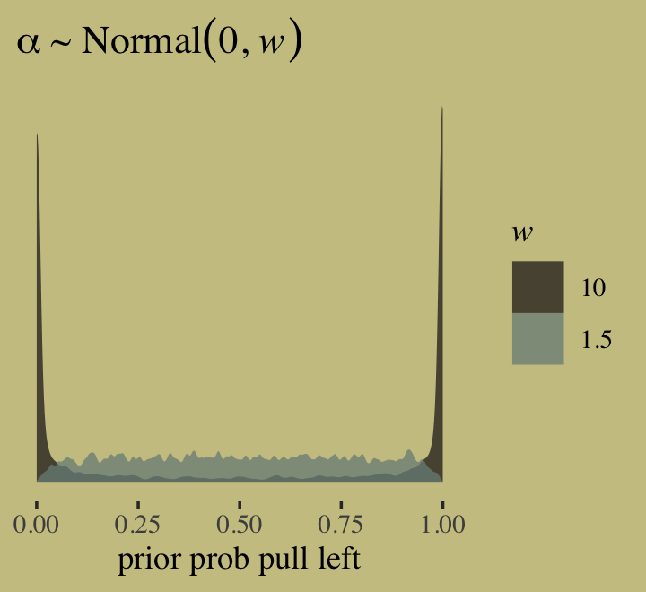

If we'd like to fit a model that includes an onverall intercept and uses McElreath'd index variable approach for the predictor variable `treatment`, we'll have to switch to the **brms** non-linear syntax. Here it is for the models using $w = 10$ and then $w = 0.5$.


```r
# w = 10
b11.2 <- 
  brm(data = d, 
      family = binomial,
      bf(pulled_left | trials(1) ~ a + b,
         a ~ 1, 
         b ~ 0 + treatment,
         nl = TRUE),
      prior = c(prior(normal(0, 1.5), nlpar = a),
                prior(normal(0, 10), nlpar = b, coef = treatment1),
                prior(normal(0, 10), nlpar = b, coef = treatment2),
                prior(normal(0, 10), nlpar = b, coef = treatment3),
                prior(normal(0, 10), nlpar = b, coef = treatment4)),
      iter = 2000, warmup = 1000, chains = 4, cores = 4,
      seed = 11,
      sample_prior = T,
      file = "fits/b11.02")

# w = 0.5
b11.3 <- 
  brm(data = d, 
      family = binomial,
      bf(pulled_left | trials(1) ~ a + b,
         a ~ 1, 
         b ~ 0 + treatment,
         nl = TRUE),
      prior = c(prior(normal(0, 1.5), nlpar = a),
                prior(normal(0, 0.5), nlpar = b, coef = treatment1),
                prior(normal(0, 0.5), nlpar = b, coef = treatment2),
                prior(normal(0, 0.5), nlpar = b, coef = treatment3),
                prior(normal(0, 0.5), nlpar = b, coef = treatment4)),
      iter = 2000, warmup = 1000, chains = 4, cores = 4,
      seed = 11,
      sample_prior = T,
      file = "fits/b11.03")
```

If all you want to do is fit the models, you wouldn’t have to add a separate `prior()` statement for each level of `treatment`. You could have just included a single line, `prior(normal(0, 0.5), nlpar = b)`, that did not  include a `coef` argument. The problem with this approach is we’d only get one column for `treatment` when using the `prior_samples()` function to retrieve the prior samples. To get separate columns for the prior samples of each of the levels of `treatment`, you need to take the verbose approach, above. 

Anyway, here’s how to make a version of the right panel of Figure 11.3.


```r
# wrangle
prior <-
  bind_rows(prior_samples(b11.2),
            prior_samples(b11.3)) %>% 
  mutate(w = factor(rep(c(10, 0.5), each = n() / 2),
                    levels = c(10, 0.5)),
         p1 = inv_logit_scaled(b_a + b_b_treatment1),
         p2 = inv_logit_scaled(b_a + b_b_treatment2)) %>% 
  mutate(diff = abs(p1 - p2)) 

# plot
prior %>% 
  ggplot(aes(x = diff, fill = w)) +
  geom_density(size = 0, alpha = 3/4, adjust = 0.1) +
  scale_fill_manual(expression(italic(w)), values = wes_palette("Moonrise2")[c(4, 2)]) +
  scale_y_continuous(NULL, breaks = NULL) +
  labs(title = expression(alpha%~%Normal(0*", "*italic(w))),
       x = "prior diff between treatments")
```


Here are the averages of the two prior-predictive difference distributions.


```r
prior %>% 
  group_by(w) %>% 
  summarise(mean = mean(diff))
```

```
## # A tibble: 2 x 2
##   w       mean
##   <fct>  <dbl>
## 1 10    0.483 
## 2 0.5   0.0973
```

Before we move on to fit the full model, it might be useful to linger here and examine the nature of the model we just fit. Here's the parameter summary for `b11.3`.


```r
print(b11.3)
```

```
##  Family: binomial 
##   Links: mu = logit 
## Formula: pulled_left | trials(1) ~ a + b 
##          a ~ 1
##          b ~ 0 + treatment
##    Data: d (Number of observations: 504) 
## Samples: 4 chains, each with iter = 2000; warmup = 1000; thin = 1;
##          total post-warmup samples = 4000
## 
## Population-Level Effects: 
##              Estimate Est.Error l-95% CI u-95% CI Rhat Bulk_ESS Tail_ESS
## a_Intercept      0.33      0.26    -0.18     0.83 1.01      995     1113
## b_treatment1    -0.12      0.29    -0.68     0.44 1.01     1212     1755
## b_treatment2     0.29      0.29    -0.27     0.87 1.00     1266     1398
## b_treatment3    -0.37      0.29    -0.94     0.18 1.00     1152     1682
## b_treatment4     0.21      0.29    -0.35     0.77 1.01     1192     1450
## 
## Samples were drawn using sampling(NUTS). For each parameter, Bulk_ESS
## and Tail_ESS are effective sample size measures, and Rhat is the potential
## scale reduction factor on split chains (at convergence, Rhat = 1).
```

Now focus on the likelihood portion of the model formula,

\begin{align*}
\text{pulled_left}_i & \sim \operatorname{Binomial} (1, p_i) \\
\operatorname{logit} (p_i) & = \alpha+ \beta_\text{treatment} .
\end{align*}

When you have one overall intercept $\alpha$ and then use the non-linear approach for the `treatment` index, you end up with as many $\beta$ parameters as there levels for `treatment`. This means the formula for `treatment == 1` is $\alpha + \beta_{\text{treatment}[1]}$, the formula for `treatment == 2` is $\alpha + \beta_{\text{treatment}[2]}$, and so on. This also effectively makes $\alpha$ the grand mean. Here's the empirical grand mean.


```r
d %>% 
  summarise(grand_mean = mean(pulled_left))
```

```
##   grand_mean
## 1  0.5793651
```

Now here’s the summary of $\alpha$ after transforming it back into the probability metric with the `inv_logit_scaled()` function.


```r
library(tidybayes)

posterior_samples(b11.3) %>% 
  transmute(alpha = inv_logit_scaled(b_a_Intercept)) %>% 
  mean_qi()
```

```
##       alpha    .lower    .upper .width .point .interval
## 1 0.5793642 0.4559913 0.6969244   0.95   mean        qi
```

Here are the empirical probabilities for each of the four levels of `treatment`.


```r
d %>% 
  group_by(treatment) %>% 
  summarise(mean = mean(pulled_left))
```

```
## # A tibble: 4 x 2
##   treatment  mean
##   <fct>     <dbl>
## 1 1         0.548
## 2 2         0.659
## 3 3         0.476
## 4 4         0.635
```

Here are the corresponding posteriors.


```r
posterior_samples(b11.3) %>% 
  pivot_longer(b_b_treatment1:b_b_treatment4) %>% 
  mutate(treatment = str_remove(name, "b_b_treatment"),
         mean      = inv_logit_scaled(b_a_Intercept + value)) %>%
  group_by(treatment) %>% 
  mean_qi(mean)
```

```
## # A tibble: 4 x 7
##   treatment  mean .lower .upper .width .point .interval
##   <chr>     <dbl>  <dbl>  <dbl>  <dbl> <chr>  <chr>    
## 1 1         0.551  0.467  0.628   0.95 mean   qi       
## 2 2         0.649  0.566  0.726   0.95 mean   qi       
## 3 3         0.489  0.409  0.571   0.95 mean   qi       
## 4 4         0.629  0.546  0.704   0.95 mean   qi
```

Okay, let's get back on track with the text. Now we're ready to fit the full model, which follows the form

\begin{align*}
\text{pulled_left}_i      & \sim \operatorname{Binomial} (1, p_i) \\
\operatorname{logit}(p_i) & = \alpha_{\text{actor}[i]} + \beta_{\text{treatment}[i]} \\
\alpha_j                  & \sim \operatorname{Normal} (0, 1.5) \\
\beta_k                   & \sim \operatorname{Normal} (0, 0.5).
\end{align*}

Before fitting the model, we should save `actor` as a factor.


```r
d <-
  d %>% 
  mutate(actor = factor(actor))
```

Now fit the model.


```r
b11.4 <- 
  brm(data = d, 
      family = binomial,
      bf(pulled_left | trials(1) ~ a + b,
         a ~ 0 + actor, 
         b ~ 0 + treatment,
         nl = TRUE),
      prior = c(prior(normal(0, 1.5), nlpar = a),
                prior(normal(0, 0.5), nlpar = b)),
      iter = 2000, warmup = 1000, chains = 4, cores = 4,
      seed = 11,
      file = "fits/b11.04")
```

Inspect the parameter summary.


```r
print(b11.4)
```

```
##  Family: binomial 
##   Links: mu = logit 
## Formula: pulled_left | trials(1) ~ a + b 
##          a ~ 0 + actor
##          b ~ 0 + treatment
##    Data: d (Number of observations: 504) 
## Samples: 4 chains, each with iter = 2000; warmup = 1000; thin = 1;
##          total post-warmup samples = 4000
## 
## Population-Level Effects: 
##              Estimate Est.Error l-95% CI u-95% CI Rhat Bulk_ESS Tail_ESS
## a_actor1        -0.45      0.33    -1.08     0.20 1.00     1403     2472
## a_actor2         3.90      0.75     2.56     5.48 1.00     3862     2528
## a_actor3        -0.75      0.33    -1.42    -0.10 1.00     1335     2318
## a_actor4        -0.74      0.33    -1.40    -0.11 1.00     1309     2457
## a_actor5        -0.45      0.33    -1.09     0.19 1.01     1330     2290
## a_actor6         0.48      0.34    -0.17     1.15 1.00     1441     2622
## a_actor7         1.96      0.42     1.17     2.81 1.00     2001     2700
## b_treatment1    -0.04      0.28    -0.60     0.52 1.00     1239     2256
## b_treatment2     0.48      0.29    -0.07     1.05 1.00     1191     1943
## b_treatment3    -0.39      0.28    -0.96     0.17 1.00     1154     2195
## b_treatment4     0.37      0.28    -0.19     0.91 1.00     1195     2217
## 
## Samples were drawn using sampling(NUTS). For each parameter, Bulk_ESS
## and Tail_ESS are effective sample size measures, and Rhat is the potential
## scale reduction factor on split chains (at convergence, Rhat = 1).
```

Here's how we might make our version of McElreath's coefficient plot of the $\alpha$ parameters.


```r
library(tidybayes)

post <- posterior_samples(b11.4)

post %>% 
  pivot_longer(contains("actor")) %>%
  mutate(probability = inv_logit_scaled(value),
         actor       = factor(str_remove(name, "b_a_actor"),
                              levels = 7:1)) %>% 
  
  ggplot(aes(x = probability, y = actor)) +
  geom_vline(xintercept = .5, color = wes_palette("Moonrise2")[1], linetype = 3) +
  stat_pointinterval(.width = .95, size = 1/2,
                     color = wes_palette("Moonrise2")[4]) +
  labs(x = expression(alpha[actor]),
       y = NULL) +
  xlim(0, 1) +
  theme(axis.ticks.y = element_blank())
```


```r
tx <- c("R/N", "L/N", "R/P", "L/P")

post %>% 
  select(contains("treatment")) %>% 
  set_names("R/N","L/N","R/P","L/P") %>% 
  pivot_longer(everything()) %>%
  mutate(probability = inv_logit_scaled(value),
         treatment   = factor(name, levels = tx)) %>% 
  mutate(treatment = fct_rev(treatment)) %>% 
  
  ggplot(aes(x = value, y = treatment)) +
  geom_vline(xintercept = 0, color = wes_palette("Moonrise2")[2], linetype = 3) +
  stat_pointinterval(.width = .95, size = 1/2,
                     color = wes_palette("Moonrise2")[4]) +
  labs(x = expression(beta[treatment]),
       y = NULL) +
  theme(axis.ticks.y = element_blank())
```


Now make the coefficient plot for the primary contrasts of interest.


```r
post %>% 
  mutate(db13 = b_b_treatment1 - b_b_treatment3,
         db24 = b_b_treatment2 - b_b_treatment4) %>% 
  pivot_longer(db13:db24) %>%
  mutate(diffs = factor(name, levels = c("db24", "db13"))) %>% 
  
  ggplot(aes(x = value, y = diffs)) +
  geom_vline(xintercept = 0, color = wes_palette("Moonrise2")[2], linetype = 3) +
  stat_pointinterval(.width = .95, size = 1/2,
                     color = wes_palette("Moonrise2")[4]) +
  labs(x = "difference",
       y = NULL) +
  theme(axis.ticks.y = element_blank())
```

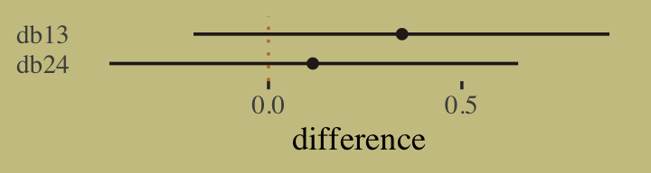

"These are the contrasts between the no-partner/partner treatments" (p. 331). Next, we prepare for the posterior predictive check. McElreath showed how to compute empirical proportions by the levels of `actor` and `treatment` with the `by()` function. Our approach will be with a combination of `group_by()` and `summarise()`. Here's what that looks like for `actor == 1`.


```r
d %>%
  group_by(actor, treatment) %>%
  summarise(proportion = mean(pulled_left)) %>% 
  filter(actor == 1)
```

```
## # A tibble: 4 x 3
## # Groups:   actor [1]
##   actor treatment proportion
##   <fct> <fct>          <dbl>
## 1 1     1              0.333
## 2 1     2              0.5  
## 3 1     3              0.278
## 4 1     4              0.556
```

Now we'll follow that through to make the top panel of Figure 11.4. Instead of showing the plot, we'll save it for the next code block.


```r
p1 <-
  d %>%
  group_by(actor, treatment) %>%
  summarise(proportion = mean(pulled_left)) %>% 
  left_join(d %>% distinct(actor, treatment, labels, condition, prosoc_left),
            by = c("actor", "treatment")) %>% 
  mutate(condition = factor(condition)) %>% 
  
  ggplot(aes(x = labels, y = proportion)) +
  geom_hline(yintercept = .5, color = wes_palette("Moonrise2")[3]) +
  geom_line(aes(group = prosoc_left),
            size = 1/4, color = wes_palette("Moonrise2")[4]) +
  geom_point(aes(color = condition),
             size = 2.5, show.legend = F) + 
  labs(subtitle = "observed proportions")
```

Next we use `brms()` fitted to get the posterior predictive distributions for each unique combination of `actor` and `treatment`, wrangle, and plot. First, we save the plot as `p2` and then we use **patchwork** syntax to combine the two subplots.


```r
nd <- 
  d %>% 
  distinct(actor, treatment, labels, condition, prosoc_left)

p2 <-
  fitted(b11.4,
         newdata = nd) %>% 
  data.frame() %>% 
  bind_cols(nd) %>% 
  mutate(condition = factor(condition)) %>% 
  
  ggplot(aes(x = labels, y = Estimate, ymin = Q2.5, ymax = Q97.5)) +
  geom_hline(yintercept = .5, color = wes_palette("Moonrise2")[3]) +
  geom_line(aes(group = prosoc_left),
            size = 1/4, color = wes_palette("Moonrise2")[4]) +
  geom_pointrange(aes(color = condition),
                  fatten = 2.5, show.legend = F) + 
  labs(subtitle = "posterior predictions")

# combine the to subplots
library(patchwork)

(p1 / p2) &
  scale_color_manual(values = wes_palette("Moonrise2")[c(2:1)]) &
  scale_y_continuous("proportion left lever", 
                     breaks = c(0, .5, 1), limits = c(0, 1)) &
  xlab(NULL) &
  theme(axis.ticks.x = element_blank(),
        panel.background = element_rect(fill = alpha("white", 1/10), size = 0)) &
  facet_wrap(~actor, nrow = 1, labeller = label_both)
```


Let's make two more index variables.


```r
d <-
  d %>% 
  mutate(side = factor(prosoc_left + 1),  # right 1, left 2
         cond = factor(condition + 1))    # no partner 1, partner 2
```

Now fit the model without the interaction between `prosoc_left` and `condition`.


```r
b11.5 <- 
  brm(data = d, 
      family = binomial,
      bf(pulled_left | trials(1) ~ a + bs + bc,
         a ~ 0 + actor, 
         bs ~ 0 + side, 
         bc ~ 0 + cond,
         nl = TRUE),
      prior = c(prior(normal(0, 1.5), nlpar = a),
                prior(normal(0, 0.5), nlpar = bs),
                prior(normal(0, 0.5), nlpar = bc)),
      iter = 2000, warmup = 1000, chains = 4, cores = 4,
      seed = 11,
      file = "fits/b11.05")
```

Compare `b11.4` and `b11.5` by the PSIS-LOO and the WAIC.


```r
b11.4 <- add_criterion(b11.4, c("loo", "waic"))
b11.5 <- add_criterion(b11.5, c("loo", "waic"))

loo_compare(b11.4, b11.5, criterion = "loo") %>% print(simplify = F)
```

```
##       elpd_diff se_diff elpd_loo se_elpd_loo p_loo  se_p_loo looic  se_looic
## b11.5    0.0       0.0  -265.4      9.6         7.8    0.4    530.8   19.1  
## b11.4   -0.6       0.6  -266.0      9.5         8.4    0.4    532.0   19.0
```

```r
loo_compare(b11.4, b11.5, criterion = "waic") %>% print(simplify = F)
```

```
##       elpd_diff se_diff elpd_waic se_elpd_waic p_waic se_p_waic waic   se_waic
## b11.5    0.0       0.0  -265.4       9.6          7.7    0.4     530.8   19.1 
## b11.4   -0.6       0.6  -266.0       9.5          8.4    0.4     531.9   19.0
```

Here are the weights.


```r
model_weights(b11.4, b11.5, weights = "loo") %>% round(digits = 2)
```

```
## b11.4 b11.5 
##  0.36  0.64
```

```r
model_weights(b11.4, b11.5, weights = "waic") %>% round(digits = 2)
```

```
## b11.4 b11.5 
##  0.36  0.64
```

Here's a quick check of the parameter summary for the non-interaction model, `b11.5`.


```r
print(b11.5)
```

```
##  Family: binomial 
##   Links: mu = logit 
## Formula: pulled_left | trials(1) ~ a + bs + bc 
##          a ~ 0 + actor
##          bs ~ 0 + side
##          bc ~ 0 + cond
##    Data: d (Number of observations: 504) 
## Samples: 4 chains, each with iter = 2000; warmup = 1000; thin = 1;
##          total post-warmup samples = 4000
## 
## Population-Level Effects: 
##          Estimate Est.Error l-95% CI u-95% CI Rhat Bulk_ESS Tail_ESS
## a_actor1    -0.64      0.44    -1.50     0.23 1.00      962     1563
## a_actor2     3.76      0.81     2.29     5.52 1.00     1941     2090
## a_actor3    -0.95      0.44    -1.80    -0.08 1.00      898     1693
## a_actor4    -0.94      0.44    -1.79    -0.08 1.00      923     1348
## a_actor5    -0.65      0.44    -1.53     0.22 1.00     1059     1638
## a_actor6     0.28      0.44    -0.59     1.18 1.00     1025     1401
## a_actor7     1.77      0.51     0.82     2.78 1.00     1123     1969
## bs_side1    -0.19      0.33    -0.83     0.42 1.00     1572     2369
## bs_side2     0.50      0.33    -0.16     1.14 1.00     1581     2053
## bc_cond1     0.28      0.34    -0.40     0.92 1.00     1340     1885
## bc_cond2     0.03      0.34    -0.66     0.66 1.00     1331     2136
## 
## Samples were drawn using sampling(NUTS). For each parameter, Bulk_ESS
## and Tail_ESS are effective sample size measures, and Rhat is the potential
## scale reduction factor on split chains (at convergence, Rhat = 1).
```

Because it's good practice, here's the `b11.5` version of the bottom panel of Figure 11.4.


```r
nd <- 
  d %>% 
  distinct(actor, treatment, labels, cond, side)

fitted(b11.5,
       newdata = nd) %>% 
  data.frame() %>% 
  bind_cols(nd) %>% 
  
  ggplot(aes(x = labels, y = Estimate, ymin = Q2.5, ymax = Q97.5)) +
  geom_hline(yintercept = .5, color = wes_palette("Moonrise2")[3]) +
  geom_line(aes(group = side),
            size = 1/4, color = wes_palette("Moonrise2")[4]) +
  geom_pointrange(aes(color = cond),
                  fatten = 2.5, show.legend = F) + 
  scale_color_manual(values = wes_palette("Moonrise2")[c(2:1)]) +
  scale_y_continuous("proportion left lever", 
                     breaks = c(0, .5, 1), limits = c(0, 1)) +
  labs(subtitle = "posterior predictions for b11.5",
       x = NULL) +
  theme(axis.ticks.x = element_blank(),
        panel.background = element_rect(fill = alpha("white", 1/10), size = 0)) +
  facet_wrap(~actor, nrow = 1, labeller = label_both)
```

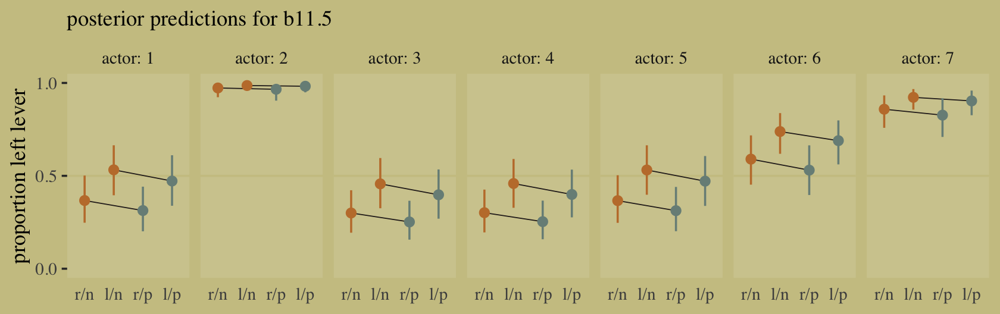

#### Overthinking: Adding log-probability calculations to a Stan model. 

Our approach with **brms** is a little different than the one you might take with McElreath's **rethinking**. Rather than adding a `log_lik=TRUE` argument within `rethinking::ulam()`, we just use the `log_lik()` after fitting a **brms** model. You may recall we already practiced this way back in Chapter 7. Here's a quick example of what that looks like for `b11.5`.


```r
log_lik(b11.5) %>% str()
```

```
##  num [1:4000, 1:504] -0.418 -0.419 -0.453 -0.366 -0.324 ...
##  - attr(*, "dimnames")=List of 2
##   ..$ : NULL
##   ..$ : NULL
```

### Relative shark and absolute deer.

Based on the full model, `b11.4`, here's how you might compute the posterior mean and 95% intervals for the proportional odds of switching from `treatment == 2` to `treatment == 4`.


```r
posterior_samples(b11.4) %>% 
  mutate(proportional_odds = exp(b_b_treatment4 - b_b_treatment2)) %>% 
  mean_qi(proportional_odds)
```

```
##   proportional_odds    .lower   .upper .width .point .interval
## 1         0.9269721 0.5243428 1.508919   0.95   mean        qi
```

> On average, the switch multiplies the odds of pulling the left lever by 0.92, an 8% reduction in odds. This is what is meant by proportional odds. The new odds are calculated by taking the old odds and multiplying them by the proportional odds, which is 0.92 in this example. (p. 336)

A limitation of relative measures measures like proportional odds is they ignore what you might think of as the reference or the baseline. 

> Consider for example a rare disease which occurs in 1 per 10-million people. Suppose also that reading this textbook increased the odds of the disease 5-fold. That would mean approximately 4 more cases of the disease per 10-million people. So only 5-in-10-million chance now. The book is safe. (p. 336)

Here that is in code.


```r
tibble(disease_rate  = 1/1e7,
       fold_increase = 5) %>% 
  mutate(new_disease_rate = disease_rate * fold_increase)
```

```
## # A tibble: 1 x 3
##   disease_rate fold_increase new_disease_rate
##          <dbl>         <dbl>            <dbl>
## 1    0.0000001             5        0.0000005
```

The hard part, though, is that "neither absolute nor relative risk is sufficient for all purposes" (p. 337). Each provides it's own unique perspective on the data. Again, welcome to applied statistics. 🤷‍♂

### Aggregated binomial: Chimpanzees again, condensed.

With the **tidyverse**, we can use `group_by()` and `summarise()` to achieve what McElreath did with `aggregate()`.


```r
d_aggregated <-
  d %>%
  group_by(treatment, actor, side, cond) %>%
  summarise(left_pulls = sum(pulled_left)) %>% 
  ungroup()

d_aggregated %>%
  head(n = 8)
```

```
## # A tibble: 8 x 5
##   treatment actor side  cond  left_pulls
##   <fct>     <fct> <fct> <fct>      <int>
## 1 1         1     1     1              6
## 2 1         2     1     1             18
## 3 1         3     1     1              5
## 4 1         4     1     1              6
## 5 1         5     1     1              6
## 6 1         6     1     1             14
## 7 1         7     1     1             14
## 8 2         1     2     1              9
```

To fit an aggregated binomial model with **brms**, we augment the `<criterion> | trials()` syntax where the value that goes in `trials()` is either a fixed number, as in this case, or variable in the data indexing $n$. Either way, at least some of those trials will have an $n > 1$. Here we'll use the hard-code method, just like McElreath did in the text.


```r
b11.6 <- 
  brm(data = d_aggregated, 
      family = binomial,
      bf(left_pulls | trials(18) ~ a + b,
         a ~ 0 + actor, 
         b ~ 0 + treatment,
         nl = TRUE),
      prior = c(prior(normal(0, 1.5), nlpar = a),
                prior(normal(0, 0.5), nlpar = b)),
      iter = 2000, warmup = 1000, chains = 4, cores = 4,
      seed = 11,
      file = "fits/b11.06")
```

Check the posterior summary.


```r
print(b11.6)
```

```
##  Family: binomial 
##   Links: mu = logit 
## Formula: left_pulls | trials(18) ~ a + b 
##          a ~ 0 + actor
##          b ~ 0 + treatment
##    Data: d_aggregated (Number of observations: 28) 
## Samples: 4 chains, each with iter = 2000; warmup = 1000; thin = 1;
##          total post-warmup samples = 4000
## 
## Population-Level Effects: 
##              Estimate Est.Error l-95% CI u-95% CI Rhat Bulk_ESS Tail_ESS
## a_actor1        -0.45      0.33    -1.10     0.17 1.00     1079     1806
## a_actor2         3.88      0.74     2.54     5.49 1.00     3629     2936
## a_actor3        -0.76      0.35    -1.45    -0.09 1.00     1195     1904
## a_actor4        -0.75      0.34    -1.43    -0.08 1.00     1332     2150
## a_actor5        -0.45      0.34    -1.11     0.21 1.00     1167     1924
## a_actor6         0.48      0.33    -0.18     1.13 1.00     1191     2096
## a_actor7         1.96      0.42     1.17     2.80 1.00     1620     2574
## b_treatment1    -0.04      0.29    -0.61     0.53 1.00     1049     1700
## b_treatment2     0.48      0.29    -0.07     1.08 1.00     1021     2003
## b_treatment3    -0.38      0.29    -0.93     0.20 1.00     1101     2010
## b_treatment4     0.37      0.28    -0.17     0.92 1.00     1041     1521
## 
## Samples were drawn using sampling(NUTS). For each parameter, Bulk_ESS
## and Tail_ESS are effective sample size measures, and Rhat is the potential
## scale reduction factor on split chains (at convergence, Rhat = 1).
```

It might be easiest to compare `b11.4` and `b11.6` with a coefficient plot.


```r
# this is just for fancy annotation
text <-
  tibble(value = c(1.4, 2.6),
         name  = "b_a_actor7",
         fit   = c("b11.6", "b11.4"))

# rope in the posterior draws and wrangle
bind_rows(posterior_samples(b11.4),
          posterior_samples(b11.6)) %>% 
  mutate(fit = rep(c("b11.4", "b11.6"), each = n() / 2)) %>% 
  pivot_longer(b_a_actor1:b_b_treatment4) %>% 
  
  # plot
  ggplot(aes(x = value, y = name, color = fit)) +
  stat_pointinterval(.width = .95, size = 2/3,
                     position = position_dodge(width = 0.5)) +
  scale_color_manual(values = wes_palette("Moonrise2")[c(2:1)]) +
  geom_text(data = text,
            aes(label = fit),
            family = "Times", position = position_dodge(width = 2.25)) +
  labs(x = "posterior (log-odds scale)",
       y = NULL) +
  theme(axis.ticks.y = element_blank(),
        legend.position = "none")
```


Did you catch our `position = position_dodge()` tricks? Try executing the plot without those parts of the code to get a sense of what they did. Now compute and save the PSIS-LOO estimates for the two models so we might compare them.


```r
b11.4 <- add_criterion(b11.4, "loo")
b11.6 <- add_criterion(b11.6, "loo")
```

Here's how we might attempt the comparison.


```r
loo_compare(b11.4, b11.6, criterion = "loo") %>% print(simplify = F)
```

Unlike with McElreath's `compare()` code in the text, `loo_compare()` wouldn't even give us the results. All we get is the warning message that because these two models are not based on the same data, comparing them with the LOO is invalid and **brms** refuses to let us do it. We can, however, look at their LOO summaries separately. 


```r
loo(b11.4)
```

```
## 
## Computed from 4000 by 504 log-likelihood matrix
## 
##          Estimate   SE
## elpd_loo   -266.0  9.5
## p_loo         8.4  0.4
## looic       532.0 19.0
## ------
## Monte Carlo SE of elpd_loo is 0.0.
## 
## All Pareto k estimates are good (k < 0.5).
## See help('pareto-k-diagnostic') for details.
```

```r
loo(b11.6)
```

```
## Warning: Found 1 observations with a pareto_k > 0.7 in model 'b11.6'. It is recommended to set 'reloo = TRUE'
## in order to calculate the ELPD without the assumption that these observations are negligible. This will refit
## the model 1 times to compute the ELPDs for the problematic observations directly.
```

```
## 
## Computed from 4000 by 28 log-likelihood matrix
## 
##          Estimate  SE
## elpd_loo    -57.5 4.4
## p_loo         8.8 1.7
## looic       115.0 8.7
## ------
## Monte Carlo SE of elpd_loo is NA.
## 
## Pareto k diagnostic values:
##                          Count Pct.    Min. n_eff
## (-Inf, 0.5]   (good)     18    64.3%   1359      
##  (0.5, 0.7]   (ok)        9    32.1%   539       
##    (0.7, 1]   (bad)       1     3.6%   118       
##    (1, Inf)   (very bad)  0     0.0%   <NA>      
## See help('pareto-k-diagnostic') for details.
```

To understand why, consider how you might describe six 1's out of nine trials in the aggregated form,

$$\text{Pr}(6|9, p) = \frac{6!}{6!(9 - 6)!} p^6 (1 - p)^{9 - 6}.$$

If we still stick with the same data, but this time re-express those as nine dichotomous data points, we now describe their joint probability as

$$\text{Pr}(1, 1, 1, 1, 1, 1, 0, 0, 0 | p) = p^6 (1 - p)^{9 - 6}.$$

Let's work this out in code.


```r
# deviance of aggregated 6-in-9 
-2 * dbinom(6, size = 9, prob = 0.2, log = TRUE)
```

```
## [1] 11.79048
```

```r
# deviance of dis-aggregated 
-2 * sum(dbinom(c(1, 1, 1, 1, 1, 1, 0, 0, 0), size = 1, prob = 0.2, log = TRUE))
```

```
## [1] 20.65212
```

> But this difference is entirely meaningless. It is just a side effect of how we organized the data. The posterior distribution for the probability of success on each trial will end up the same, either way. (p. 339)

This is what our coefficient plot showed us, above. The posterior distribution was the same within simulation variance for `b11.4` and `b11.6`. Just like McElreath reported in the text, we also got a warning about high Pareto $k$ values from the aggregated binomial model, `b11.6`. To access the message and its associated table directly, we can feed the results of `loo()` into the `loo::pareto_k_table` function.


```r
loo(b11.6) %>% 
  loo::pareto_k_table()
```

```
## Warning: Found 1 observations with a pareto_k > 0.7 in model 'b11.6'. It is recommended to set 'reloo = TRUE'
## in order to calculate the ELPD without the assumption that these observations are negligible. This will refit
## the model 1 times to compute the ELPDs for the problematic observations directly.
```

```
## Pareto k diagnostic values:
##                          Count Pct.    Min. n_eff
## (-Inf, 0.5]   (good)     18    64.3%   1359      
##  (0.5, 0.7]   (ok)        9    32.1%   539       
##    (0.7, 1]   (bad)       1     3.6%   118       
##    (1, Inf)   (very bad)  0     0.0%   <NA>
```

> Before looking at the Pareto $k$ values, you might have noticed already that we didn’t get a similar warning before in the disaggregated logistic models of the same data. Why not? Because when we aggregated the data by actor-treatment, we forced PSIS (and WAIC) to imagine cross-validation that leaves out all 18 observations in each actor-treatment combination. So instead of leave-one-out cross-validation, it is more like leave-eighteen-out. This makes some observations more influential, because they are really now 18 observations.
>
> What's the bottom line? If you want to calculate WAIC or PSIS, you should use a logistic regression data format, not an aggregated format. (p. 340)

### Aggregated binomial: Graduate school admissions.

Load the infamous `UCBadmit` data [see @bickelSexBiasGraduate1975].


```r
# detach(package:brms)
library(rethinking)
data(UCBadmit)
d <- UCBadmit
```

Switch from **rethinking** to **brms**.


```r
detach(package:rethinking, unload = T)
library(brms)
rm(UCBadmit)
d
```

```
##    dept applicant.gender admit reject applications
## 1     A             male   512    313          825
## 2     A           female    89     19          108
## 3     B             male   353    207          560
## 4     B           female    17      8           25
## 5     C             male   120    205          325
## 6     C           female   202    391          593
## 7     D             male   138    279          417
## 8     D           female   131    244          375
## 9     E             male    53    138          191
## 10    E           female    94    299          393
## 11    F             male    22    351          373
## 12    F           female    24    317          341
```

Now compute our new index variable, `gid`. We'll also slip in a `case` variable that saves the row numbers as a factor. That'll come in handy later when we plot.


```r
d <- 
  d %>%  
  mutate(gid  = factor(applicant.gender, levels = c("male", "female")),
         case = factor(1:n()))
```

Note the difference in how we defined out `gid`. Whereas McElreath used numeral indices, we retained the text within an ordered factor. **brms** can handle either approach just fine. The advantage of the factor approach is it will be easier to understand the output. You'll see in just a bit.

The univariable logistic model with `male` as the sole predictor of `admit` follows the form

\begin{align*}
\text{admit}_i    & \sim \operatorname{Binomial} (n_i, p_i) \\
\text{logit}(p_i) & = \alpha_{\text{gid}[i]} \\
\alpha_j          & \sim \operatorname{Normal} (0, 1.5),
\end{align*}

where $n_i = \text{applications}_i$, the rows are indexed by $i$, and the two levels of $\text{gid}$ are indexed by $j$. Since we're only using our index variable `gid` to model two intercepts with no further complications, we don't need to use the verbose non-linear syntax to fit this model with **brms**.


```r
b11.7 <-
  brm(data = d, 
      family = binomial,
      admit | trials(applications) ~ 0 + gid,
      prior(normal(0, 1.5), class = b),
      iter = 2000, warmup = 1000, cores = 4, chains = 4,
      seed = 11,
      file = "fits/b11.07") 
```


```r
print(b11.7)
```

```
##  Family: binomial 
##   Links: mu = logit 
## Formula: admit | trials(applications) ~ 0 + gid 
##    Data: d (Number of observations: 12) 
## Samples: 4 chains, each with iter = 2000; warmup = 1000; thin = 1;
##          total post-warmup samples = 4000
## 
## Population-Level Effects: 
##           Estimate Est.Error l-95% CI u-95% CI Rhat Bulk_ESS Tail_ESS
## gidmale      -0.22      0.04    -0.30    -0.14 1.00     2684     2468
## gidfemale    -0.83      0.05    -0.94    -0.73 1.00     3289     2318
## 
## Samples were drawn using sampling(NUTS). For each parameter, Bulk_ESS
## and Tail_ESS are effective sample size measures, and Rhat is the potential
## scale reduction factor on split chains (at convergence, Rhat = 1).
```

Our results are very similar to those in the text. But notice how our two rows have more informative row names than `a[1]` and `a[2]`. This is why you might consider using the ordered factor approach rather than using numeral indices. 

Anyway, here we'll compute the difference score in two metrics and summarize them with a little help from `mean_qi()`.


```r
posterior_samples(b11.7) %>% 
  mutate(diff_a = b_gidmale - b_gidfemale,
         diff_p = inv_logit_scaled(b_gidmale) - inv_logit_scaled(b_gidfemale)) %>% 
  pivot_longer(contains("diff")) %>% 
  group_by(name) %>% 
  mean_qi(value, .width = .89)
```

```
## # A tibble: 2 x 7
##   name   value .lower .upper .width .point .interval
##   <chr>  <dbl>  <dbl>  <dbl>  <dbl> <chr>  <chr>    
## 1 diff_a 0.609  0.504  0.715   0.89 mean   qi       
## 2 diff_p 0.141  0.118  0.165   0.89 mean   qi
```

**brms** doesn't have a convenience function that works quite like `rethinking::postcheck()`. But we have options, the most handy of which in this case is probably `predict()`.


```r
p <- 
  predict(b11.7) %>% 
  data.frame() %>% 
  bind_cols(d)

text <-
  d %>%
  group_by(dept) %>%
  summarise(case  = mean(as.numeric(case)),
            admit = mean(admit / applications) + .05)

p %>% 
  ggplot(aes(x = case, y = admit / applications)) +
  geom_pointrange(aes(y    = Estimate / applications,
                      ymin = Q2.5     / applications ,
                      ymax = Q97.5    / applications),
                  color = wes_palette("Moonrise2")[1],
                  shape = 1, alpha = 1/3) +
  geom_point(color = wes_palette("Moonrise2")[2]) +
  geom_line(aes(group = dept),
            color = wes_palette("Moonrise2")[2]) +
  geom_text(data = text,
            aes(y = admit, label = dept),
            color = wes_palette("Moonrise2")[2],
            family = "serif") +
  labs(title = "Posterior validation check",
       y = "Proportion admitted") +
  ylim(0, 1) +
  theme(axis.ticks.x = element_blank())
```

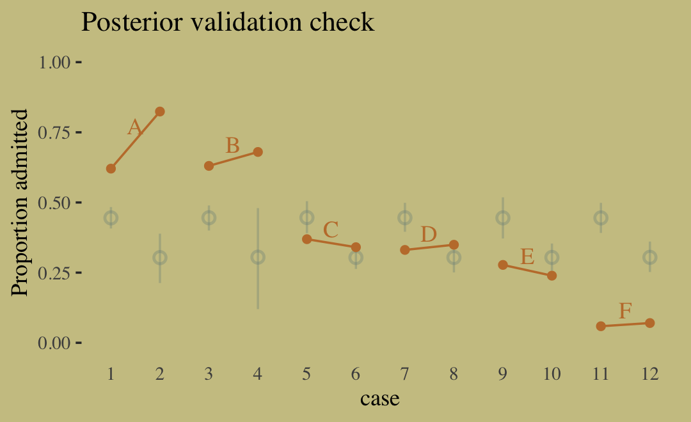

> Sometimes a fit this bad is the result of a coding mistake. In this case, it is not. The model did correctly answer the question we asked of it: *What are the average probabilities of admission for women and men, across all departments?* The problem in this case is that men and women did not apply to the same departments, and departments vary in their rates of admission. This makes the answer misleading....
>
> Instead of asking *"What are the average probabilities of admission for women and men across all departments?"* we want to ask *"What is the average difference in probability of admission between women and men within departments?"* (pp. 342--343, *emphasis* in the original).

The model better suited to answer that question follows the form

\begin{align*}
\text{admit}_i    & \sim \operatorname{Binomial} (n_i, p_i) \\
\text{logit}(p_i) & = \alpha_{\text{gid}[i]} + \delta_{\text{dept}[i]} \\
\alpha_j          & \sim \operatorname{Normal} (0, 1.5) \\
\delta_k          & \sim \operatorname{Normal} (0, 1.5),
\end{align*}

where departments are indexed by $k$. To fit a model including two index variables like this in **brms**, we'll need to switch back to the non-linear syntax. Though if you'd like to see an analogous approach using conventional **brms** syntax, check out model `b10.9` in [Section 10.1.3](https://bookdown.org/content/3890/counting-and-classification.html#aggregated-binomial-graduate-school-admissions.) of my translation of McElreath's first edition. 


```r
b11.8 <-
  brm(data = d, 
      family = binomial,
      bf(admit | trials(applications) ~ a + d,
         a ~ 0 + gid, 
         d ~ 0 + dept,
         nl = TRUE),
      prior = c(prior(normal(0, 1.5), nlpar = a),
                prior(normal(0, 1.5), nlpar = d)),
      iter = 4000, warmup = 1000, cores = 4, chains = 4,
      seed = 11,
      file = "fits/b11.08") 
```


```r
print(b11.8)
```

```
##  Family: binomial 
##   Links: mu = logit 
## Formula: admit | trials(applications) ~ a + d 
##          a ~ 0 + gid
##          d ~ 0 + dept
##    Data: d (Number of observations: 12) 
## Samples: 4 chains, each with iter = 4000; warmup = 1000; thin = 1;
##          total post-warmup samples = 12000
## 
## Population-Level Effects: 
##             Estimate Est.Error l-95% CI u-95% CI Rhat Bulk_ESS Tail_ESS
## a_gidmale      -0.52      0.55    -1.59     0.57 1.00      920      905
## a_gidfemale    -0.43      0.55    -1.50     0.69 1.00      923      850
## d_deptA         1.10      0.56    -0.00     2.19 1.00      932      831
## d_deptB         1.06      0.56    -0.06     2.14 1.00      936      853
## d_deptC        -0.16      0.56    -1.27     0.91 1.00      927      815
## d_deptD        -0.19      0.56    -1.29     0.89 1.00      928      854
## d_deptE        -0.63      0.56    -1.75     0.44 1.00      937      860
## d_deptF        -2.19      0.57    -3.33    -1.10 1.00      966      907
## 
## Samples were drawn using sampling(NUTS). For each parameter, Bulk_ESS
## and Tail_ESS are effective sample size measures, and Rhat is the potential
## scale reduction factor on split chains (at convergence, Rhat = 1).
```

Like with the earlier model, here we compute the difference score for $\alpha$ in two metrics.


```r
posterior_samples(b11.8) %>% 
  mutate(diff_a = b_a_gidmale - b_a_gidfemale,
         diff_p = inv_logit_scaled(b_a_gidmale) - inv_logit_scaled(b_a_gidfemale)) %>% 
  pivot_longer(contains("diff")) %>% 
  group_by(name) %>% 
  mean_qi(value, .width = .89)
```

```
## # A tibble: 2 x 7
##   name     value  .lower  .upper .width .point .interval
##   <chr>    <dbl>   <dbl>   <dbl>  <dbl> <chr>  <chr>    
## 1 diff_a -0.0966 -0.225  0.0303    0.89 mean   qi       
## 2 diff_p -0.0216 -0.0513 0.00668   0.89 mean   qi
```

> Why did adding departments to the model change the inference about gender so much? The earlier figure gives you a hint--the rates of admission vary a lot across departments. Furthermore, women and men applied to different departments. Let's do a quick tabulation
to show that: (p. 344)

Here's our **tidyverse**-style tabulation of the proportions of applicants in each department by `gid`.


```r
d %>% 
  group_by(dept) %>% 
  mutate(proportion = applications / sum(applications)) %>% 
  select(dept, gid, proportion) %>% 
  pivot_wider(names_from = dept,
              values_from = proportion) %>% 
  mutate_if(is.double, round, digits = 2)
```

```
## # A tibble: 2 x 7
##   gid        A     B     C     D     E     F
##   <fct>  <dbl> <dbl> <dbl> <dbl> <dbl> <dbl>
## 1 male    0.88  0.96  0.35  0.53  0.33  0.52
## 2 female  0.12  0.04  0.65  0.47  0.67  0.48
```

To make it even easier to see, we'll depict it in a tile plot.


```r
d %>% 
  group_by(dept) %>% 
  mutate(proportion = applications / sum(applications)) %>% 
  mutate(label = round(proportion, digits = 2),
         gid   = fct_rev(gid)) %>% 
  
  ggplot(aes(x = dept, y = gid, fill = proportion, label = label)) +
  geom_tile() +
  geom_text(aes(color = proportion > .25),
            family = "serif") +
  scale_fill_gradient(low = wes_palette("Moonrise2")[4],
                      high = wes_palette("Moonrise2")[1],
                      limits = c(0, 1)) +
  scale_color_manual(values = wes_palette("Moonrise2")[c(1, 4)]) +
  scale_x_discrete(NULL, position = "top") +
  ylab(NULL) +
  theme(axis.ticks = element_blank(),
        axis.text.y = element_text(hjust = 0),
        legend.position = "none")
```


As it turns out, "the departments with a larger proportion of women applicants are also those with lower overall admissions rates" (p. 344). If we presume gender influences both choice of department and admission rates, we might depict that in a simple DAG where $G$ is applicant gender, $D$ is department, and $A$ is acceptance into grad school.


```r
library(ggdag)

dag_coords <-
  tibble(name = c("G", "D", "A"),
         x    = c(1, 2, 3),
         y    = c(1, 2, 1))

dagify(D ~ G,
       A ~ D + G,
       coords = dag_coords) %>%
  
  ggplot(aes(x = x, y = y, xend = xend, yend = yend)) +
  geom_dag_text(color = wes_palette("Moonrise2")[4], family = "serif") +
  geom_dag_edges(edge_color = wes_palette("Moonrise2")[4]) + 
  scale_x_continuous(NULL, breaks = NULL) +
  scale_y_continuous(NULL, breaks = NULL)
```

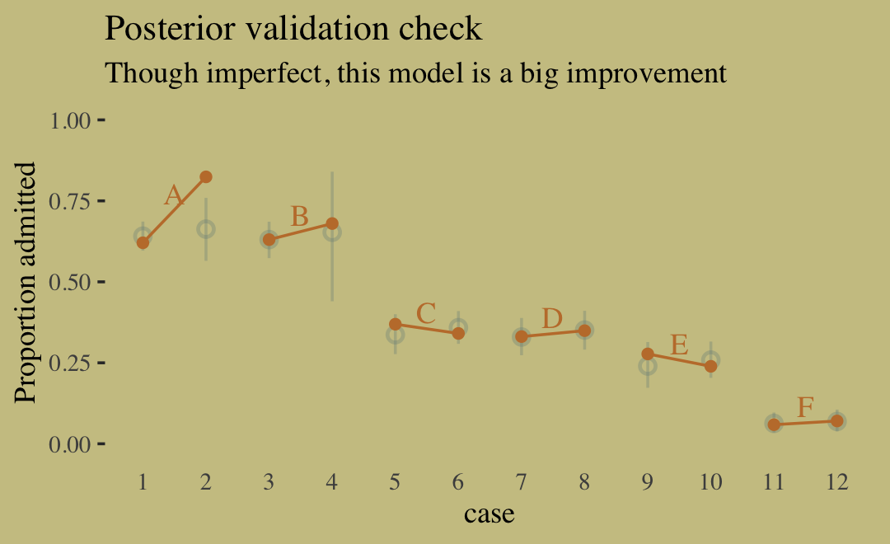

Although our `b11.8` model did not contain a parameter corresponding to the $G \rightarrow D$ pathway, it did condition on both $G$ and $D$. If we make another Figure like 11.5, we'll see conditioning on both substantially improved the posterior predictive distribution.


```r
predict(b11.8) %>% 
  data.frame() %>% 
  bind_cols(d) %>% 
  
  ggplot(aes(x = case, y = admit / applications)) +
  geom_pointrange(aes(y = Estimate / applications,
                      ymin = Q2.5 / applications ,
                      ymax = Q97.5 / applications),
                  color = wes_palette("Moonrise2")[1],
                  shape = 1, alpha = 1/3) +
  geom_point(color = wes_palette("Moonrise2")[2]) +
  geom_line(aes(group = dept),
            color = wes_palette("Moonrise2")[2]) +
  geom_text(data = text,
            aes(y = admit, label = dept),
            color = wes_palette("Moonrise2")[2],
            family = "serif") +
  labs(title = "Posterior validation check",
       subtitle = "Though imperfect, this model is a big improvement",
       y = "Proportion admitted") +
  ylim(0, 1) +
  theme(axis.ticks.x = element_blank())
```

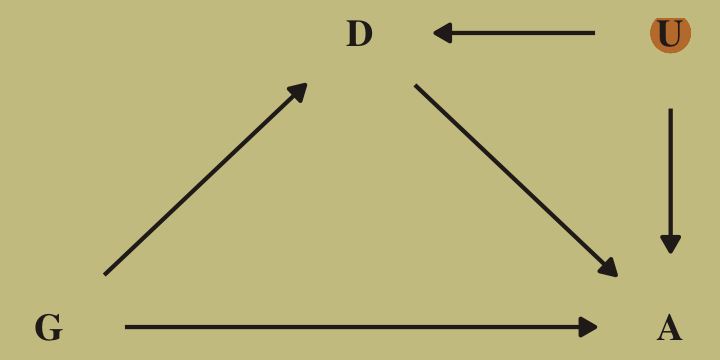

Here's the DAG that proposes an unobserved confound, $U$, that might better explain the $D \rightarrow A$ pathway.


```r
dag_coords <-
  tibble(name = c("G", "D", "A", "U"),
         x    = c(1, 2, 3, 3),
         y    = c(1, 2, 1, 2))

dagify(D ~ G + U,
       A ~ D + G + U,
       coords = dag_coords) %>%
  
  ggplot(aes(x = x, y = y, xend = xend, yend = yend)) +
  geom_point(x = 3, y = 2, 
             size = 5, color = wes_palette("Moonrise2")[2]) +
  geom_dag_text(color = wes_palette("Moonrise2")[4], family = "serif") +
  geom_dag_edges(edge_color = wes_palette("Moonrise2")[4]) + 
  scale_x_continuous(NULL, breaks = NULL) +
  scale_y_continuous(NULL, breaks = NULL)
```


McElreath recommended we look at the `pairs()` plot to get a sense of how highly correlated the parameters in our `b11.8` model are. Why not get a little extra about it and use custom settings the upper triangle, the diagonal, and the lower triangle with a `GGally::ggpairs()` plot? First we save our custom settings.


```r
my_upper <- function(data, mapping, ...) {
  
  # get the x and y data to use the other code
  x <- eval_data_col(data, mapping$x)
  y <- eval_data_col(data, mapping$y)
  
  r  <- unname(cor.test(x, y)$estimate)
  rt <- format(r, digits = 2)[1]
  tt <- as.character(rt)
  
  # plot the cor value
  ggally_text(
    label = tt, 
    mapping = aes(),
    size = 4,
    color = wes_palette("Moonrise2")[4], 
    alpha = 4/5,
    family = "Times") +
    theme_void()
}

my_diag <- function(data, mapping, ...) {
  ggplot(data = data, mapping = mapping) + 
    geom_density(fill = wes_palette("Moonrise2")[2], size = 0) +
    theme_void()
}

my_lower <- function(data, mapping, ...) {
  ggplot(data = data, mapping = mapping) + 
    geom_point(color = wes_palette("Moonrise2")[1], 
               size = 1/10, alpha = 1/10) +
    theme_void()
}
```

To learn more about the nature of the code for the `my_upper()` function, check out [Issue #139](https://github.com/ggobi/ggally/issues/139) in the [GGally GitHub repository](https://github.com/ggobi/ggally). Here is the plot.


```r
library(GGally)

posterior_samples(b11.8) %>% 
  select(-lp__) %>% 
  set_names(c("alpha[male]", "alpha[female]", str_c("delta[", LETTERS[1:6], "]"))) %>%
  ggpairs(upper = list(continuous = my_upper),
          diag  = list(continuous = my_diag),
          lower = list(continuous = my_lower),
          labeller = "label_parsed") +
  labs(title = "Model: b11.8",
       subtitle = "The parameters are highly correlated") +
  theme(strip.text = element_text(size = 11))
```


> Why might we want to over-parameterize the model? Because it makes it easier to assign priors. If we made one of the genders baseline and measured the other as a deviation from it, we would stumble into the issue of assuming that the acceptance rate for one of the genders is pre-data more uncertain than the other. This isn’t to say that over-parameterizing a model is always a good idea. But it isn’t a violation of any statistical principle. You can always convert the posterior, post sampling, to any alternative parameterization. The only limitation is whether the algorithm we use to approximate the posterior can handle the high correlations. In this case, it can. (p. 345)

#### Rethinking: Simpson's paradox is not a paradox. 

> This empirical example is a famous one in statistical teaching. It is often used to illustrate a phenomenon known as **Simpson’s paradox**. Like most paradoxes, there is no violation of logic, just of intuition. And since different people have different intuition, Simpson’s paradox means different things to different people. The poor intuition being violated in this case is that a positive association in the entire population should also hold within each department. (p. 345, **emphasis** in the original)

In my field of clinical psychology, Simpson's paradox is an important, if under-appreciated, phenomenon. If you're in the social sciences as well, I highly recommend spending more time thinking about it. To get you started, I blogged about it [here](https://solomonkurz.netlify.com/post/individuals-are-not-small-groups-i-simpson-s-paradox/) and @kievitSimpsonParadoxPsychological2013 wrote a great tutorial paper called [*Simpson's paradox in psychological science: a practical guide*](https://www.frontiersin.org/articles/10.3389/fpsyg.2013.00513/full).

## Poisson regression

> When a binomial distribution has a very small probability of an event $p$ and a very large number of trials $N$, then it takes on a special shape. The expected value of a binomial distribution is just $Np$, and its variance is $Np(1 - p)$. But when $N$ is very large and $p$ is very small, then these are approximately the same. (p. 346)

Data of this kind are often called count data. Here we simulate some.


```r
set.seed(11)

tibble(y = rbinom(1e5, 1000, 1/1000)) %>% 
  summarise(y_mean     = mean(y),
            y_variance = var(y))
```

```
## # A tibble: 1 x 2
##   y_mean y_variance
##    <dbl>      <dbl>
## 1   1.00       1.01
```

Yes, those statistics are virtually the same. When dealing with pure Poisson data, $\mu = \sigma^2$. When you have a number of trials for which $n$ is unknown or much larger than seen in the data, the Poisson likelihood is a useful tool. We define it as

$$y_i \sim \text{Poisson} (\lambda).$$

As $\lambda$ expresses both mean and variance because within this model, the variance scales right along with the mean. Since $\lambda$ is constrained to be positive, we typically use the log link. Thus the basic Poisson regression model is

\begin{align*}
y_i             & \sim \operatorname{Poisson} (\lambda_i) \\
\log(\lambda_i) & = \alpha + \beta (x_i - \bar x),
\end{align*}

where all model parameters receive priors following the forms we've been practicing.

### Example: Oceanic tool complexity.

Load the `Kline` data [see @klinePopulationSizePredicts2010].


```r
library(rethinking)
data(Kline)
d <- Kline
```

Switch from **rethinking** to **brms**.


```r
detach(package:rethinking, unload = T)
library(brms)
rm(Kline)
d
```

```
##       culture population contact total_tools mean_TU
## 1    Malekula       1100     low          13     3.2
## 2     Tikopia       1500     low          22     4.7
## 3  Santa Cruz       3600     low          24     4.0
## 4         Yap       4791    high          43     5.0
## 5    Lau Fiji       7400    high          33     5.0
## 6   Trobriand       8000    high          19     4.0
## 7       Chuuk       9200    high          40     3.8
## 8       Manus      13000     low          28     6.6
## 9       Tonga      17500    high          55     5.4
## 10     Hawaii     275000     low          71     6.6
```

Here are our new columns.


```r
d <-
  d %>%
  mutate(log_pop_std = (log(population) - mean(log(population))) / sd(log(population)),
         cid         = contact)
```

Our statistical model will follow the form

\begin{align*}
\text{total_tools}_i  & \sim \operatorname{Poisson} (\lambda_i) \\
\text{log}(\lambda_i) & = \alpha_{\text{cid}[i]} + \beta_{\text{cid}[i]} \text{log_pop_std}_i \\
\alpha_j              & \sim \; ? \\
\beta_j               & \sim \; ?, 
\end{align*}

where the priors for $\alpha_j$ and $\beta_j$ have yet be defined. If we continue our convention of using a Normal prior on the $\alpha$ parameters, we should recognize those will be log-Normal distributed on the outcome scale. Why? Because we're modeling $\lambda$ with the log link. Here's our version of Figure 11.7, depicting the two log-Normal priors considered in the text. 


```r
tibble(x       = c(3, 22),
       y       = c(0.055, 0.04),
       meanlog = c(0, 3),
       sdlog   = c(10, 0.5)) %>% 
  expand(nesting(x, y, meanlog, sdlog),
         number = seq(from = 0, to = 100, length.out = 200)) %>% 
  mutate(density = dlnorm(number, meanlog, sdlog),
         group   = str_c("alpha%~%Normal(", meanlog, ", ", sdlog, ")")) %>% 
  
  ggplot(aes(ymin = 0, ymax = density, 
             fill = group, color = group)) +
  geom_ribbon(aes(x = number, ), 
              alpha = 3/4, size = 0) +
  geom_text(data = . %>% group_by(group) %>% slice(1),
            aes(x = x, y = y, label = group),
            family = "Times", parse = T,  hjust = 0) +
  scale_fill_manual(values = wes_palette("Moonrise2")[1:2]) +
  scale_color_manual(values = wes_palette("Moonrise2")[1:2]) +
  scale_y_continuous(NULL, breaks = NULL) +
  xlab("mean number of tools") +
  theme(legend.position = "none")
```

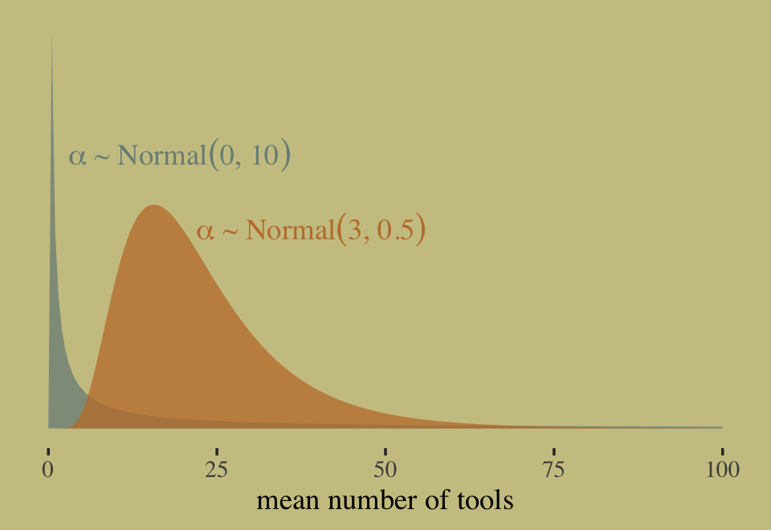

In this context, $\alpha \sim \operatorname{Normal} (0, 10)$ has a very long tail on the outcome scale. The mean of the log-Normal distribution, recall, is $\exp (\mu + \sigma^2/2)$. Here that is in code.


```r
exp(0 + 10^2 / 2)
```

```
## [1] 5.184706e+21
```

That is very large. Here's the same thing in a simulation.


```r
set.seed(11)

rnorm(1e4, 0, 10) %>% 
  exp() %>% 
  mean()
```

```
## [1] 1.61276e+12
```

Now compute the mean for the other prior under consiteration, $\alpha \sim \operatorname{Normal} (3, 0.5)$. 


```r
exp(3 + 0.5^2 / 2)
```

```
## [1] 22.7599
```

This is much smaller and more reasonable. In case you were curious, here are the same priors, this time on the scale of $\lambda$.


```r
tibble(x    = c(10, 4),
       y    = c(0.05, 0.5),
       mean = c(0, 3),
       sd   = c(10, 0.5)) %>% 
  expand(nesting(x, y, mean, sd),
         number = seq(from = -25, to = 25, length.out = 500)) %>% 
  mutate(density = dnorm(number, mean, sd),
         group   = str_c("alpha%~%Normal(", mean, ", ", sd, ")")) %>% 
  
  ggplot(aes(ymin = 0, ymax = density, 
             fill = group, color = group)) +
  geom_ribbon(aes(x = number, ), 
              alpha = 3/4, size = 0) +
  geom_text(data = . %>% group_by(group) %>% slice(1),
            aes(x = x, y = y, label = group),
            family = "Times", parse = T,  hjust = 0) +
  scale_fill_manual(values = wes_palette("Moonrise2")[1:2]) +
  scale_color_manual(values = wes_palette("Moonrise2")[1:2]) +
  scale_y_continuous(NULL, breaks = NULL) +
  xlab(expression(lambda~scale)) +
  theme(legend.position = "none")
```


Now let's prepare to make the top row of Figure 11.8. In this portion of the figure, we consider the implications of two competing priors for $\beta$ while holding the prior for $\alpha$ at $\operatorname{Normal}(3, 0.5)$. The two $\beta$ priors under consideration are $\operatorname{Normal}(0, 10)$ and $\operatorname{Normal}(0, 0.2)$.


```r
set.seed(11)

# how many lines would you like?
n <- 100

# simulate and wrangle
tibble(i = 1:n,
       a = rnorm(n, mean = 3 , sd = 0.5)) %>% 
  mutate(`beta%~%Normal(0*', '*10)`  = rnorm(n, mean = 0 , sd = 10),
         `beta%~%Normal(0*', '*0.2)` = rnorm(n, mean = 0 , sd = 0.2)) %>% 
  pivot_longer(contains("beta"),
               values_to = "b",
               names_to = "prior") %>% 
  expand(nesting(i, a, b, prior),
         x = seq(from = -2, to = 2, length.out = 100)) %>% 
  
  # plot
  ggplot(aes(x = x, y = exp(a + b * x), group = i)) +
  geom_line(size = 1/4, alpha = 2/3,
            color = wes_palette("Moonrise2")[4]) +
  labs(x = "log population (std)",
       y = "total tools") +
  coord_cartesian(ylim = c(0, 100)) +
  facet_wrap(~prior, labeller = label_parsed)
```

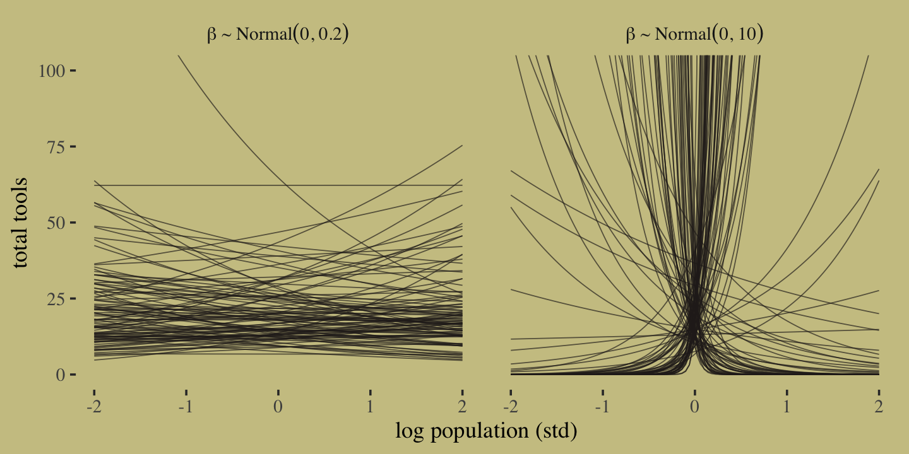

It turns out that many of the lines considered plausible under $\operatorname{Normal}(0, 10)$ are disturbingly extreme. Here is what $\alpha \sim \operatorname{Normal}(3, 0.5)$ and $\beta \sim \operatorname{Normal}(0, 0.2)$ would mean when the $x$-axis is on the log population scale and the population scale.


```r
set.seed(11)

prior <-
  tibble(i = 1:n,
         a = rnorm(n, mean = 3, sd = 0.5),
         b = rnorm(n, mean = 0, sd = 0.2)) %>% 
  expand(nesting(i, a, b),
         x = seq(from = log(100), to = log(200000), length.out = 100))

# plot
p1 <-
  prior %>% 
  ggplot(aes(x = x, y = exp(a + b * x), group = i)) +
  geom_line(size = 1/4, alpha = 2/3,
            color = wes_palette("Moonrise2")[4]) +
  labs(subtitle = expression(beta%~%Normal(0*', '*0.2)),
       x = "log population",
       y = "total tools") +
  coord_cartesian(xlim = c(log(100), log(200000)),
                  ylim = c(0, 500))
p2 <-
  prior %>% 
  ggplot(aes(x = exp(x), y = exp(a + b * x), group = i)) +
  geom_line(size = 1/4, alpha = 2/3,
            color = wes_palette("Moonrise2")[4]) +
  labs(subtitle = expression(beta%~%Normal(0*', '*0.2)),
       x = "population",
       y = "total tools") +
  coord_cartesian(xlim = c(100, 200000),
                  ylim = c(0, 500))

p1 | p2
```


Okay, after settling on our two priors, the updated model formula is

\begin{align*}
y_i              & \sim \operatorname{Poisson} (\lambda_i) \\
\log (\lambda_i) & = \alpha + \beta (x_i - \bar x) \\
\alpha           & \sim \operatorname{Normal}(3, 0.5) \\
\beta            & \sim \operatorname{Normal}(0, 0.2).
\end{align*}

We're finally ready to fit the model. The only new thing in our model code is `family = poisson`. In this case, **brms** defaults to the `log()` link.


```r
d <-
  d %>% 
  mutate(total_tools_std = (total_tools - mean(total_tools)) / sd(total_tools))
```


```r
b11.9 <-
  brm(data = d, 
      family = poisson,
      total_tools ~ 1,
      prior(normal(3, 0.5), class = Intercept),
      iter = 2000, warmup = 1000, chains = 4, cores = 4,
      seed = 11,
      file = "fits/b11.09") 

b11.10 <-
  brm(data = d, 
      family = poisson,
      bf(total_tools ~ a + b * log_pop_std,
         a + b ~ 0 + cid,
         nl = TRUE),
      prior = c(prior(normal(3, 0.5), nlpar = a),
                prior(normal(0, 0.2), nlpar = b)),
      iter = 2000, warmup = 1000, chains = 4, cores = 4,
      seed = 11,
      file = "fits/b11.10") 
```

Check the model summaries.


```r
print(b11.9)
```

```
##  Family: poisson 
##   Links: mu = log 
## Formula: total_tools ~ 1 
##    Data: d (Number of observations: 10) 
## Samples: 4 chains, each with iter = 2000; warmup = 1000; thin = 1;
##          total post-warmup samples = 4000
## 
## Population-Level Effects: 
##           Estimate Est.Error l-95% CI u-95% CI Rhat Bulk_ESS Tail_ESS
## Intercept     3.54      0.05     3.44     3.64 1.00     1734     1855
## 
## Samples were drawn using sampling(NUTS). For each parameter, Bulk_ESS
## and Tail_ESS are effective sample size measures, and Rhat is the potential
## scale reduction factor on split chains (at convergence, Rhat = 1).
```

```r
print(b11.10)
```

```
##  Family: poisson 
##   Links: mu = log 
## Formula: total_tools ~ a + b * log_pop_std 
##          a ~ 0 + cid
##          b ~ 0 + cid
##    Data: d (Number of observations: 10) 
## Samples: 4 chains, each with iter = 2000; warmup = 1000; thin = 1;
##          total post-warmup samples = 4000
## 
## Population-Level Effects: 
##           Estimate Est.Error l-95% CI u-95% CI Rhat Bulk_ESS Tail_ESS
## a_cidhigh     3.61      0.07     3.47     3.75 1.00     3477     2989
## a_cidlow      3.32      0.08     3.15     3.48 1.00     3636     3191
## b_cidhigh     0.19      0.16    -0.12     0.50 1.00     4144     2768
## b_cidlow      0.38      0.05     0.28     0.48 1.00     3088     3137
## 
## Samples were drawn using sampling(NUTS). For each parameter, Bulk_ESS
## and Tail_ESS are effective sample size measures, and Rhat is the potential
## scale reduction factor on split chains (at convergence, Rhat = 1).
```


```r
b11.9  <- add_criterion(b11.9, "loo")
b11.10 <- add_criterion(b11.10, "loo")
```

```
## Warning: Found 3 observations with a pareto_k > 0.7 in model 'b11.10'. It is recommended to set 'reloo = TRUE'
## in order to calculate the ELPD without the assumption that these observations are negligible. This will refit
## the model 3 times to compute the ELPDs for the problematic observations directly.
```

```r
loo_compare(b11.9, b11.10, criterion = "loo") %>% print(simplify = F)
```

```
##        elpd_diff se_diff elpd_loo se_elpd_loo p_loo se_p_loo looic se_looic
## b11.10   0.0       0.0   -42.8      6.6         7.1   2.7     85.6  13.3   
## b11.9  -27.8      16.3   -70.6     16.7         8.2   3.5    141.2  33.5
```

Here's the LOO weight.


```r
model_weights(b11.9, b11.10, weights = "loo") %>% round(digits = 2)
```

```
##  b11.9 b11.10 
##      0      1
```

McElreath reported getting a warning from his `rethinking::compare()`. Our warning came from the `add_criterion()` function. We can inspect the Pareto $k$ values with `loo::pareto_k_table()`.


```r
loo(b11.10) %>% loo::pareto_k_table()
```

```
## Warning: Found 3 observations with a pareto_k > 0.7 in model 'b11.10'. It is recommended to set 'reloo = TRUE'
## in order to calculate the ELPD without the assumption that these observations are negligible. This will refit
## the model 3 times to compute the ELPDs for the problematic observations directly.
```

```
## Pareto k diagnostic values:
##                          Count Pct.    Min. n_eff
## (-Inf, 0.5]   (good)     6     60.0%   663       
##  (0.5, 0.7]   (ok)       1     10.0%   192       
##    (0.7, 1]   (bad)      2     20.0%   85        
##    (1, Inf)   (very bad) 1     10.0%   24
```

Wow. Let's take a closer look.


```r
tibble(culture = d$culture,
       k       = b11.10$criteria$loo$diagnostics$pareto_k) %>% 
  arrange(desc(k)) %>% 
  mutate_if(is.double, round, digits = 2)
```

```
## # A tibble: 10 x 2
##    culture        k
##    <fct>      <dbl>
##  1 Hawaii      1.2 
##  2 Tonga       0.8 
##  3 Malekula    0.7 
##  4 Trobriand   0.67
##  5 Tikopia     0.49
##  6 Yap         0.44
##  7 Santa Cruz  0.4 
##  8 Manus       0.35
##  9 Lau Fiji    0.31
## 10 Chuuk       0.16
```

It turns out Hawaii is very influential. Figure 11.9 will clarify why. Here we make the left panel.


```r
cultures <- c("Hawaii", "Tonga", "Trobriand", "Yap")

library(ggrepel)

nd <-
  distinct(d, cid) %>% 
  expand(cid, 
         log_pop_std = seq(from = -4.5, to = 2.5, length.out = 100))
f <- 
  fitted(b11.10,
         newdata = nd,
         probs = c(.055, .945)) %>%
  data.frame() %>%
  bind_cols(nd)

p1 <-
  f %>%
  ggplot(aes(x = log_pop_std, group = cid, color = cid)) +
  geom_smooth(aes(y = Estimate, ymin = Q5.5, ymax = Q94.5, fill = cid),
              stat = "identity",
              alpha = 1/4, size = 1/2) +
  geom_point(data = bind_cols(d, b11.10$criteria$loo$diagnostics),
             aes(y = total_tools, size = pareto_k),
             alpha = 4/5) +
  geom_text_repel(data = 
                    bind_cols(d, b11.10$criteria$loo$diagnostics) %>% 
                    filter(culture %in% cultures) %>% 
                    mutate(label = str_c(culture, " (", round(pareto_k, digits = 2), ")")),
                  aes(y = total_tools, label = label), 
                  size = 3, seed = 11, color = "black", family = "Times") +
  labs(x = "log population (std)",
       y = "total tools") +
  coord_cartesian(xlim = range(b11.10$data$log_pop_std),
                  ylim = c(0, 80))
```

Now make the right panel of Figure 11.9.


```r
p2 <-
  f %>%
  mutate(population = exp((log_pop_std * sd(log(d$population))) + mean(log(d$population)))) %>% 

  ggplot(aes(x = population, group = cid, color = cid)) +
  geom_smooth(aes(y = Estimate, ymin = Q5.5, ymax = Q94.5, fill = cid),
              stat = "identity",
              alpha = 1/4, size = 1/2) +
  geom_point(data = bind_cols(d, b11.10$criteria$loo$diagnostics),
             aes(y = total_tools, size = pareto_k),
             alpha = 4/5) +
  scale_x_continuous("population", breaks = c(0, 50000, 150000, 250000)) +
  ylab("total tools") +
  coord_cartesian(xlim = range(d$population),
                  ylim = c(0, 80))
```

Combine the two subplots with **patchwork** and adjust the settings a little.


```r
(p1 | p2) &
  scale_fill_manual(values = wes_palette("Moonrise2")[1:2]) &
  scale_color_manual(values = wes_palette("Moonrise2")[1:2]) &
  scale_size(range = c(2, 5)) &
  theme(legend.position = "none")
```

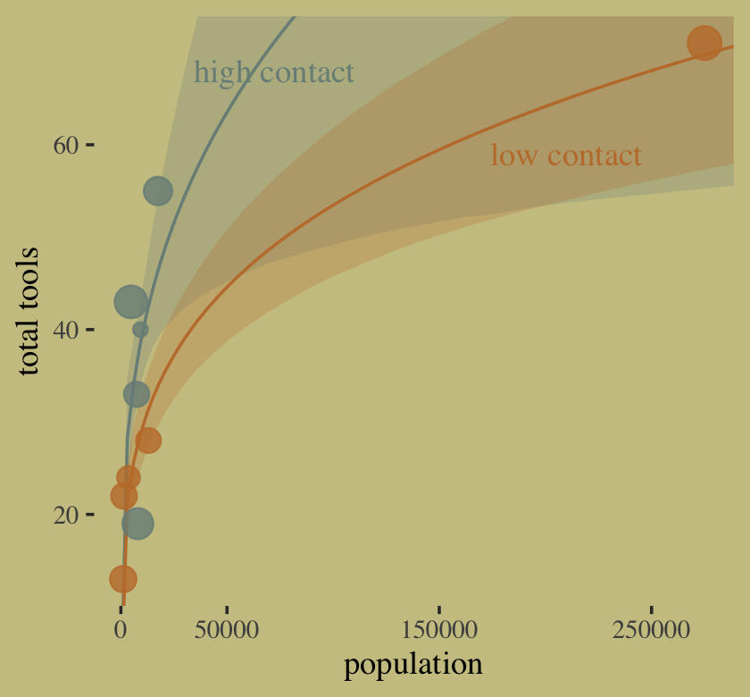

Hawaii is influential in that it has a very large population relative to the other islands. 

#### Overthinking: Modeling tool innovation.

McElreath's theoretical, or scientific, model for `total_tools` is

$$\widehat{\text{total_tools}} = \frac{\alpha_{\text{cid}[i]} \: \text{population}^{\beta_{\text{cid}[i]}}}{\gamma}.$$

We can use the Poisson likelihood to express this in a Bayesian model as

$$
\begin{align*}
\text{total_tools} & \sim \operatorname{Poisson}(\lambda_i) \\
\lambda_i & = \left( \exp (\alpha_{\text{cid}[i]}) \text{population}_i^{\beta_{\text{cid}[i]}} \right) / \gamma \\
\alpha_j  & \sim \operatorname{Normal}(1, 1) \\
\beta_j   & \sim \operatorname{Exponential}(1) \\
\gamma    & \sim \operatorname{Exponential}(1),
\end{align*}
$$

where we exponentiate $\alpha_{\text{cid}[i]}$ to restrict the posterior to zero and above. Here's how we might fit that model with **brms**.


```r
b11.11 <-
  brm(data = d, 
      family = poisson(link = "identity"),
      bf(total_tools ~ exp(a) * population^b / g,
         a + b ~ 0 + cid,
         g ~ 1,
         nl = TRUE),
      prior = c(prior(normal(1, 1), nlpar = a),
                prior(exponential(1), nlpar = b, lb = 0),
                prior(exponential(1), nlpar = g, lb = 0)),
      iter = 2000, warmup = 1000, chains = 4, cores = 4,
      seed = 11,
      control = list(adapt_delta = .95),
      file = "fits/b11.11") 
```

Did you notice the `family = poisson(link = "identity")` part of the code? Yes, it's possible to use the Poisson likelihood without the log link. However, if you're going to buck tradition and use some other link, make sure you know what you're doing.

Check the model summary.


```r
print(b11.11)
```

```
##  Family: poisson 
##   Links: mu = identity 
## Formula: total_tools ~ exp(a) * population^b/g 
##          a ~ 0 + cid
##          b ~ 0 + cid
##          g ~ 1
##    Data: d (Number of observations: 10) 
## Samples: 4 chains, each with iter = 2000; warmup = 1000; thin = 1;
##          total post-warmup samples = 4000
## 
## Population-Level Effects: 
##             Estimate Est.Error l-95% CI u-95% CI Rhat Bulk_ESS Tail_ESS
## a_cidhigh       1.16      0.69     0.08     2.69 1.00     1463      989
## a_cidlow        1.05      0.54     0.09     2.17 1.00     1107      869
## b_cidhigh       0.28      0.09     0.09     0.44 1.00     1122     1248
## b_cidlow        0.26      0.03     0.19     0.33 1.00     1647     1459
## g_Intercept     1.26      0.73     0.39     3.15 1.00     1163     1838
## 
## Samples were drawn using sampling(NUTS). For each parameter, Bulk_ESS
## and Tail_ESS are effective sample size measures, and Rhat is the potential
## scale reduction factor on split chains (at convergence, Rhat = 1).
```

Compute and check the PSIS-LOO estimates along with their diagnostic Pareto $k$ values.


```r
b11.11 <- add_criterion(b11.11, "loo")
```

```
## Warning: Found 1 observations with a pareto_k > 0.7 in model 'b11.11'. It is recommended to set 'reloo = TRUE'
## in order to calculate the ELPD without the assumption that these observations are negligible. This will refit
## the model 1 times to compute the ELPDs for the problematic observations directly.
```

```r
loo(b11.11)
```

```
## Warning: Found 1 observations with a pareto_k > 0.7 in model 'b11.11'. It is recommended to set 'reloo = TRUE'
## in order to calculate the ELPD without the assumption that these observations are negligible. This will refit
## the model 1 times to compute the ELPDs for the problematic observations directly.
```

```
## 
## Computed from 4000 by 10 log-likelihood matrix
## 
##          Estimate   SE
## elpd_loo    -40.6  6.0
## p_loo         5.4  1.8
## looic        81.1 12.0
## ------
## Monte Carlo SE of elpd_loo is NA.
## 
## Pareto k diagnostic values:
##                          Count Pct.    Min. n_eff
## (-Inf, 0.5]   (good)     7     70.0%   498       
##  (0.5, 0.7]   (ok)       2     20.0%   273       
##    (0.7, 1]   (bad)      1     10.0%   39        
##    (1, Inf)   (very bad) 0      0.0%   <NA>      
## See help('pareto-k-diagnostic') for details.
```


We still have Pareto high $k$ values. Recall that due to the very small sample size, this isn't entirely surprising. Okay, it's time to make Figure 11.10.


```r
# for the annotation
text <-
  distinct(d, cid) %>% 
  mutate(population  = c(210000, 72500),
         total_tools = c(59, 68),
         label       = str_c(cid, " contact"))

# redifine the new data
nd <-
  distinct(d, cid) %>% 
  expand(cid, 
         population = seq(from = 0, to = 300000, length.out = 100))

# compute the poster predictions for lambda
fitted(b11.11,
       newdata = nd,
       probs = c(.055, .945)) %>%
  data.frame() %>%
  bind_cols(nd) %>%
  
  # plot!
  ggplot(aes(x = population, group = cid, color = cid)) +
  geom_smooth(aes(y = Estimate, ymin = Q5.5, ymax = Q94.5, fill = cid),
              stat = "identity",
              alpha = 1/4, size = 1/2) +
  geom_point(data = bind_cols(d, b11.11$criteria$loo$diagnostics),
             aes(y = total_tools, size = pareto_k),
             alpha = 4/5) +
  geom_text(data = text,
            aes(y = total_tools, label = label),
            family = "serif") +
  scale_fill_manual(values = wes_palette("Moonrise2")[1:2]) +
  scale_color_manual(values = wes_palette("Moonrise2")[1:2]) +
  scale_size(range = c(2, 5)) +
  scale_x_continuous("population", breaks = c(0, 50000, 150000, 250000)) +
  ylab("total tools") +
  coord_cartesian(xlim = range(d$population),
                  ylim = range(d$total_tools)) +
  theme(legend.position = "none")
```

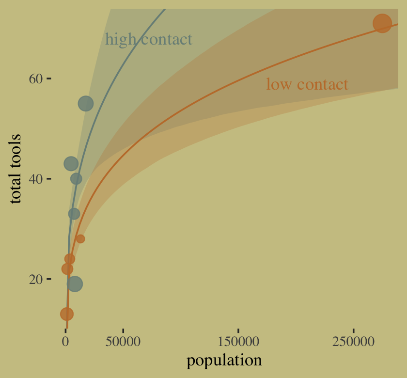

In case you were curious, here are the results if we compare `b11.10` and `b11.11` by the PSIS-LOO.


```r
loo_compare(b11.10, b11.11, criterion = "loo") %>% print(simplify = F)
```

```
##        elpd_diff se_diff elpd_loo se_elpd_loo p_loo se_p_loo looic se_looic
## b11.11   0.0       0.0   -40.6      6.0         5.4   1.8     81.1  12.0   
## b11.10  -2.2       2.6   -42.8      6.6         7.1   2.7     85.6  13.3
```

```r
model_weights(b11.10, b11.11, weights = "loo") %>% round(digits = 3)
```

```
## b11.10 b11.11 
##  0.097  0.903
```

Finally, here's a comparison of the two models by the Pareto $k$ values.


```r
tibble(b11.10 = b11.10$criteria$loo$diagnostics$pareto_k,
       b11.11 = b11.11$criteria$loo$diagnostics$pareto_k) %>% 
  pivot_longer(everything()) %>% 
  
  ggplot(aes(x = value, y = name)) +
  geom_vline(xintercept = c(.5, .7, 1), linetype = 3, color = wes_palette("Moonrise2")[2]) +
  stat_dots(slab_fill = wes_palette("Moonrise2")[1], 
            slab_color = wes_palette("Moonrise2")[1]) + 
  scale_x_continuous(expression(Pareto~italic(k)), breaks = c(.5, .7, 1)) +
  ylab(NULL) +
  coord_cartesian(ylim = c(1.5, 2.4))
```

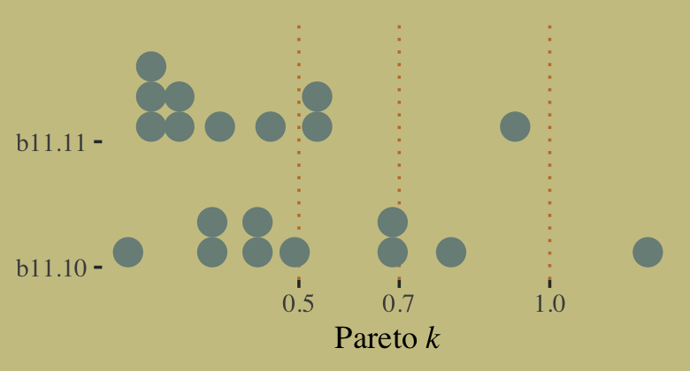

### Negative binomial (gamma-Poisson) models.

> Typically there is a lot of unexplained variation in Poisson models. Presumably this additional variation arises from unobserved influences that vary from case to case, generating variation in the true $\lambda$'s. Ignoring this variation, or *rate heterogeneity*, can cause confounds just like it can for binomial models. So a very common extension of Poisson GLMs is to swap the Poisson distribution for something called the **negative binomial** distribution. This is really a Poisson distribution in disguise, and it is also sometimes called the **gamma-Poisson** distribution for this reason. It is a Poisson in disguise, because it is a mixture of different Poisson distributions. This is the Poisson analogue of the Student-t model, which is a mixture of different normal distributions. We'll work with mixtures in the next chapter. (p. 357, *emphasis* in the original)

### Example: Exposure and the offset.

> For the last Poisson example, we'll look at a case where the exposure varies across observations. When the length of observation, area of sampling, or intensity of sampling varies, the counts we observe also naturally vary. Since a Poisson distribution assumes that the rate of events is constant in time (or space), it's easy to handle this. All we need to do, as explained above, is to add the logarithm of the exposure to the linear model. The term we add is typically called an *offset*. (p. 357, *emphasis* in the original)

Here we simulate our data.


```r
set.seed(11)

num_days <- 30
y        <- rpois(num_days, lambda = 1.5)

num_weeks <- 4
y_new     <- rpois(num_weeks, lambda = 0.5 * 7)
```

Now tidy the data and add `log_days`.


```r
(
  d <- 
  tibble(y         = c(y, y_new), 
         days      = rep(c(1, 7), times = c(num_days, num_weeks)),  # this is the exposure
         monastery = rep(0:1, times = c(num_days, num_weeks))) %>%
  mutate(log_days = log(days))
)
```

```
## # A tibble: 34 x 4
##        y  days monastery log_days
##    <int> <dbl>     <int>    <dbl>
##  1     1     1         0        0
##  2     0     1         0        0
##  3     1     1         0        0
##  4     0     1         0        0
##  5     0     1         0        0
##  6     4     1         0        0
##  7     0     1         0        0
##  8     1     1         0        0
##  9     3     1         0        0
## 10     0     1         0        0
## # … with 24 more rows
```

Within the context of the Poisson likelihood, we can decompose $\lambda$ into two parts, $\mu$ (mean) and $\tau$ (exposure), like this:

$$
y_i \sim \operatorname{Poisson}(\lambda_i) \\
\log \lambda_i = \log \frac{\mu_i}{\tau_i} = \log \mu_i - \log \tau_i.
$$

Therefore, you can rewrite the equation if the exposure ($\tau$) varies in your data and you still want to model the mean ($\mu$). Using the model we're about to fit as an example, here's what that might look like:

\begin{align*}
y_i & \sim \operatorname{Poisson}(\mu_i) \\
\log \mu_i & = \log \tau_i + \alpha + \beta \text{monastery}_i \\
\alpha     & \sim \operatorname{Normal}(0, 1) \\
\beta      & \sim \operatorname{Normal}(0, 1),
\end{align*}

where the offset does not get a prior. In this context, its value is added directly to the right side of the formula. With the **brms** package, you use the `offset()` function in the `formula` syntax. You just insert a pre-processed variable like `log_days` or the log of a variable, such as `log(days)`. Fit the model.


```r
b11.12 <-
  brm(data = d, 
      family = poisson,
      y ~ 1 + offset(log_days) + monastery,
      prior = c(prior(normal(0, 1), class = Intercept),
                prior(normal(0, 1), class = b)),
      iter = 2000, warmup = 1000, cores = 4, chains = 4,
      seed = 11,
      file = "fits/b11.12")
```

As we look at the model summary, keep in mind that the parameters are on the per-one-unit-of-time scale. Since we simulated the data based on summary information from two units of time--one day and seven days--, this means the parameters are in the scale of $\log (\lambda)$ per one day.


```r
print(b11.12)
```

```
##  Family: poisson 
##   Links: mu = log 
## Formula: y ~ 1 + offset(log_days) + monastery 
##    Data: d (Number of observations: 34) 
## Samples: 4 chains, each with iter = 2000; warmup = 1000; thin = 1;
##          total post-warmup samples = 4000
## 
## Population-Level Effects: 
##           Estimate Est.Error l-95% CI u-95% CI Rhat Bulk_ESS Tail_ESS
## Intercept    -0.01      0.17    -0.36     0.33 1.00     2438     2558
## monastery    -0.88      0.33    -1.56    -0.26 1.00     2486     2050
## 
## Samples were drawn using sampling(NUTS). For each parameter, Bulk_ESS
## and Tail_ESS are effective sample size measures, and Rhat is the potential
## scale reduction factor on split chains (at convergence, Rhat = 1).
```

The model summary helps clarify that when you use `offset()`, `brm()` fixes the value. Thus there is no parameter estimate for the `offset()`. It's a fixed part of the model not unlike the $\nu$ parameter of the Student-$t$ distribution gets fixed to infinity when you use the Gaussian likelihood.

To get the posterior distributions for average daily outputs for the old and new monasteries, respectively, we'll use use the formulas

\begin{align*}
\lambda_\text{old} & = \exp (\alpha) \;\;\; \text{and} \\
\lambda_\text{new} & = \exp (\alpha + \beta_\text{monastery}).
\end{align*}

Following those transformations, we'll summarize the $\lambda$ distributions with medians and 89% HDIs with help from the `tidybayes::mean_hdi()` function.


```r
posterior_samples(b11.12) %>%
  mutate(lambda_old = exp(b_Intercept),
         lambda_new = exp(b_Intercept + b_monastery)) %>%
  pivot_longer(contains("lambda")) %>% 
  mutate(name = factor(name, levels = c("lambda_old", "lambda_new"))) %>%
  group_by(name) %>%
  mean_hdi(value, .width = .89) %>% 
  mutate_if(is.double, round, digits = 2)
```

```
## # A tibble: 2 x 7
##   name       value .lower .upper .width .point .interval
##   <fct>      <dbl>  <dbl>  <dbl>  <dbl> <chr>  <chr>    
## 1 lambda_old  1.01   0.73   1.27   0.89 mean   hdi      
## 2 lambda_new  0.43   0.25   0.61   0.89 mean   hdi
```

Because we don't know what seed McElreath used to simulate his data, our simulated data differed a little from his and, as a consequence, our results differ a little.

## Multinomial and categorical models

> When more than two types of unordered events are possible, and the probability of each type of event is constant across trials, then the maximum entropy distribution is the **multinomial distribution**. [We] already met the multinomial, implicitly, in [Chapter 10][Big Entropy and the Generalized Linear Model] when we tossed pebbles into buckets as an introduction to maximum entropy. The binomial is really a special case of this distribution. And so its distribution formula resembles the binomial, just extrapolated out to three or more types of events. If there are $K$ types of events with probabilities $p_1, ..., p_K$, then the probability of observing $y_1, ..., y_K$ events of each type out of $n$ total trials is:
>
> $$\operatorname{Pr} (y_1, ..., y_K | n, p_1, ..., p_K) = \frac{n!}{\prod_i y_i!} \prod_{i = 1}^K p_i^{y_i}$$
>
> The fraction with $n!$ on top just expresses the number of different orderings that give the same counts $y_1, ..., y_K$. It's the famous multiplicity from the previous chapter....
>
> The conventional and natural link is this context is the **multinomial logit**, also known as the **softmax** function. This link function takes a vector of *scores*, one for each $K$ event types, and computes the probability of a particular type of event $k$ as
>
> $$\text{Pr} (k |s_1, s_2, ..., s_K) = \frac{\exp (s_k)}{\sum_{i = 1}^K \exp (s_i)}$$
> (p. 359, **emphasis** in the original)

McElreath then went on to explain how multinomial logistic regression models are among the more difficult of the GLMs to master. He wasn't kidding. To get a grasp on these, we'll cover them in a little more detail than he did in the text. Before we begin, I'd like to give a big shout out to [Adam Bear](https://adambear.me/), whose initial comment on a [GitHub issue](https://github.com/ASKurz/Statistical_Rethinking_with_brms_ggplot2_and_the_tidyverse/issues/5) turned into a friendly and productive email collaboration on what, exactly, is going on with this section. Hopefully we got it.

To begin, let's simulate the data just like McElreath did in the **R** code 11.55 block.


```r
library(rethinking)

# simulate career choices among 500 individuals
n      <- 500           # number of individuals
income <- c(1, 2, 5)    # expected income of each career
score  <- 0.5 * income  # scores for each career, based on income

# next line converts scores to probabilities
p <- softmax(score[1], score[2], score[3])

# now simulate choice
# outcome career holds event type values, not counts
career <- rep(NA, n)  # empty vector of choices for each individual

# sample chosen career for each individual
set.seed(34302)
# sample chosen career for each individual
for(i in 1:n) career[i] <- sample(1:3, size = 1, prob = p)
```

Before moving on, it might be useful to examine what we just did. With the three lines below the "# simulate career choices among 500 individuals" comment, we defined the formulas for three scores. Those were

$$
\begin{align*}
s_1 & = 0.5 \times \text{income}_1 \\
s_2 & = 0.5 \times \text{income}_2 \\ 
s_3 & = 0.5 \times \text{income}_3,
\end{align*}
$$

where $\text{income}_1 = 1$, $\text{income}_2 = 2$, and $\text{income}_3 = 5$. What's a little odd about this setup and conceptually important to get is that although $\text{income}_i$ varies across the three levels of $s$, the $\text{income}_i$ value is constant within each level of $s$. E.g., $\text{income}_1$ is not a variable within the context of $s_1$. Therefore, we could also write the above as

$$
\begin{align*}
s_1 & = 0.5 \cdot 1 = 0.5 \\
s_2 & = 0.5 \cdot 2 = 1.0 \\ 
s_3 & = 0.5 \cdot 5 = 2.5.
\end{align*}
$$

Let's confirm.


```r
print(score)
```

```
## [1] 0.5 1.0 2.5
```

We then converted those `score` values to probabilities with the `softmax()` function. This will become important when we set up the model code. For now, here's what the data look like.


```r
# put them in a tibble
d <-
  tibble(career = career) %>% 
  mutate(career_income = ifelse(career == 3, 5, career))

# plot 
d %>%
  ggplot(aes(x = career)) +
  geom_bar(size = 0, fill = wes_palette("Moonrise2")[2])
```

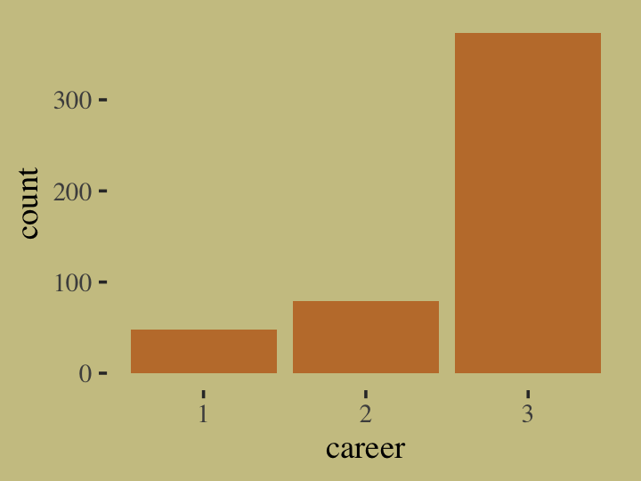

Our `career` variable is composed of three categories, `1:3`, with each category more likely than the one before. Here's a breakdown of the counts, percentages, and probabilities of each category.


```r
d %>% 
  count(career) %>% 
  mutate(percent     = (100 * n / sum(n)),
         probability =        n / sum(n))
```

```
## # A tibble: 3 x 4
##   career     n percent probability
##    <int> <int>   <dbl>       <dbl>
## 1      1    48     9.6       0.096
## 2      2    79    15.8       0.158
## 3      3   373    74.6       0.746
```

To further build an appreciation for how we simulated data with these proportions and how the process links in with the formulas, above, we'll retrace the first few simulation steps within a **tidyverse**-centric workflow. Recall how in those first few steps we defined values for `income`, `score`, and `p`. Here they are again in a tibble.


```r
tibble(income = c(1, 2, 5)) %>% 
  mutate(score = 0.5 * income) %>% 
  mutate(p = exp(score) / sum(exp(score)))
```

```
## # A tibble: 3 x 3
##   income score      p
##    <dbl> <dbl>  <dbl>
## 1      1   0.5 0.0996
## 2      2   1   0.164 
## 3      5   2.5 0.736
```

Notice how the values in the `p` column match up well with the `probability` values from the output from the block just above. Our simulation successfully produces data corresponding to the data-generating values. Woot! Also note how the code we just used to compute those `p` values, `p = exp(score) / sum(exp(score))`, corresponds nicely with the formula from above,

$$\text{Pr} (k |s_1, s_2, ..., s_K) = \frac{\exp (s_k)}{\sum_{i = 1}^K \exp (s_i)}.$$

What still might seem mysterious is what those $s$ values in the equation are. In the simulation and in the prose, McElreath called them *scores*. Another way to think about them is as weights. The thing to get is that their exact values aren't important so much as their difference one from another. You'll note that `score` for `income == 2` was 0.5 larger than that of `income == 1`. The same was true for `income == 3` and `income == 2`. So if we add an arbitrary constant to each of those `score` values, like 11, we'll get the same `p` values.


```r
tibble(income        = c(1, 2, 5), 
       some_constant = 11) %>% 
  mutate(score = (0.5 * income) + some_constant) %>% 
  mutate(p = exp(score) / sum(exp(score)))
```

```
## # A tibble: 3 x 4
##   income some_constant score      p
##    <dbl>         <dbl> <dbl>  <dbl>
## 1      1            11  11.5 0.0996
## 2      2            11  12   0.164 
## 3      5            11  13.5 0.736
```

Now keeping that in mind, recall how McElreath said that though we have $K$ categories, $K = 3$ in this case, we only estimate $K - 1$ linear models. "In a multinomial (or categorical) GLM, you need $K - 1$ linear models for $K$ types of events. One of the outcome values is chosen as a "pivot" and the others are modeled relative to it." (p. 360). You could also think of the pivot category as the reference category.

Before we practice fitting multinomial models with **brms**, it'll be helpful if we first follow along with the text and fit the model directly in Stan. We will be working directly with Stan very infrequently in this ebook. If you're interested in learning more about modeling directly with Stan, you might check out the [*Stan user's guide, Version 2.23*](https://mc-stan.org/docs/2_23/stan-users-guide/index.html) [@standevelopmentteamStanUserGuide2020], the [*Stan reference manual, Version 2.23*](https://mc-stan.org/docs/2_23/reference-manual/) [@standevelopmentteamStanReferenceManual2020], and the [*Stan functions reference*](https://mc-stan.org/docs/2_23/functions-reference/index.html) [@standevelopmentteamStanFunctionsReference2020]. Fit the model with Stan.


```r
# define the model
code_m11.13 <- "
data{
  int N; // number of individuals
  int K; // number of possible careers 
  int career[N]; // outcome
  vector[K] career_income;
}
parameters{
  vector[K - 1] a; // intercepts
  real<lower=0> b; // association of income with choice
}
model{
  vector[K] p;
  vector[K] s;
  a ~ normal(0, 1);
  b ~ normal(0, 0.5);
  s[1] = a[1] + b * career_income[1]; 
  s[2] = a[2] + b * career_income[2]; 
  s[3] = 0; // pivot
  p = softmax(s);
  career ~ categorical(p);
} 
"

# wrangle the data
dat_list <- 
  list(N = n, 
       K = 3, 
       career = career, 
       career_income = income)

# fit the model
m11.13 <- 
  stan(data = dat_list,
       model_code = code_m11.13,
       chains = 4)
```

Check the summary.


```r
precis(m11.13, depth = 2) %>% round(digits = 2)
```

```
##       mean   sd  5.5% 94.5%  n_eff Rhat4
## a[1] -2.13 0.19 -2.46 -1.85 101.27  1.04
## a[2] -1.79 0.27 -2.32 -1.45  63.93  1.07
## b     0.13 0.12  0.01  0.37  56.88  1.07
```

One of the primary reasons we went through this exercise is to show that McElreath's **R** code 11.56 and 11.57 do not return the results he reported on page 361. The plot thickens when we attempt the counterfactual simulation on page 362, as reported in **R** code 11.58.


```r
post <- extract.samples(m11.13)

# set up logit scores
s1      <- with(post, a[, 1] + b * income[1])
s2_orig <- with(post, a[, 2] + b * income[2])
s2_new  <- with(post, a[, 2] + b * income[2] * 2)

# compute probabilities for original and counterfactual 
p_orig <- sapply(1:length(post$b), function(i)
  softmax(c(s1[i], s2_orig[i], 0)))

p_new <- sapply(1:length(post$b), function(i)
  softmax(c(s1[i], s2_new[i], 0)))

# summarize
p_diff <- p_new[2, ] - p_orig[2, ] 
precis(p_diff)
```

```
##              mean        sd        5.5%     94.5%     histogram
## p_diff 0.04258541 0.0429278 0.002595453 0.1274182 ▇▅▂▂▁▁▁▁▁▁▁▁▁
```

Even though we used the same code, our counterfactual simulation doesn't match up with the results McElreath reported in the text, either. Keep this all in mind as we switch to **brms**. But before we move on to **brms**, check this out.


```r
data.frame(s1 = score[3] + s1, 
           s2 = score[3] + s2_orig, 
           s3 = score[3] + 0) %>% 
  pivot_longer(everything()) %>% 
  group_by(name) %>% 
  mean_qi(value) %>% 
  mutate_if(is.double, round, digits = 2)
```

```
## # A tibble: 3 x 7
##   name  value .lower .upper .width .point .interval
##   <chr> <dbl>  <dbl>  <dbl>  <dbl> <chr>  <chr>    
## 1 s1     0.5    0.21   0.78   0.95 mean   qi       
## 2 s2     0.98   0.74   1.21   0.95 mean   qi       
## 3 s3     2.5    2.5    2.5    0.95 mean   qi
```

In his Stan code (**R** code 11.56), you'll see McElreath chose the third category to be his pivot and that he used zero as a constant value. As it turns out, it is common practice to set the score value for the reference category to zero. It's also a common practice to use the first event type as the reference category. Importantly, in his [-@Bürkner2020Parameterization] vignette, [*Parameterization of response distributions in brms*](https://cran.r-project.org/package=brms/vignettes/brms_families.html#ordinal-and-categorical-models), Bürkner clarified the **brms** default is to use the first response category as the reference and set it to a zero as well. However, we can control this behavior with the `refcat` argument. In the examples to follow, we'll follow McElreath and use the third event type as the reference category by setting `refcat = 3`.

In addition to the discrepancies with the code and results in the text, one of the things I don’t care for in this section is how fast McElreath covered the material. Our approach will be to slow down a little and start off by fitting a intercepts-only model before adding the covariate. Before we fit the model, we might take a quick look at the prior structure with `brms::get_prior()`.


```r
get_prior(data = d, 
          family = categorical(link = logit, refcat = 3),
          career ~ 1)
```

```
##                  prior     class coef group resp dpar nlpar bound
## 1                      Intercept                                 
## 2 student_t(3, 3, 2.5) Intercept                  mu1            
## 3 student_t(3, 3, 2.5) Intercept                  mu2
```

We have two "intercepts", which are differentiated in the `dpar` column. We'll talk more about what these are in just a bit; don't worry. I show this here because as of **brms** 2.12.0, "specifying global priors for regression coefficients in categorical models is deprecated." The upshot is even if we want to use the same prior for both, we need to use the `dpar` argument for each. With that in mind, here's our multinomial model in **brms**. Do note the specification `family = categorical(link = logit, refcat = 3)`. The `categorical` part is what instructs **brms** to use the multinomial likelihood and the `refcat = 3` part will allow us to use the third event type as the pivot.


```r
b11.13io <-
  brm(data = d, 
      family = categorical(link = logit, refcat = 3),
      career ~ 1,
      prior = c(prior(normal(0, 1), class = Intercept, dpar = mu1),
                prior(normal(0, 1), class = Intercept, dpar = mu2)),
      iter = 2000, warmup = 1000, cores = 4, chains = 4,
      seed = 11,
      file = "fits/b11.13io")
```

The summary can be difficult to interpret.


```r
print(b11.13io)
```

```
##  Family: categorical 
##   Links: mu1 = logit; mu2 = logit 
## Formula: career ~ 1 
##    Data: d (Number of observations: 500) 
## Samples: 4 chains, each with iter = 2000; warmup = 1000; thin = 1;
##          total post-warmup samples = 4000
## 
## Population-Level Effects: 
##               Estimate Est.Error l-95% CI u-95% CI Rhat Bulk_ESS Tail_ESS
## mu1_Intercept    -2.01      0.15    -2.31    -1.73 1.00     3226     2560
## mu2_Intercept    -1.53      0.12    -1.77    -1.29 1.00     2768     2628
## 
## Samples were drawn using sampling(NUTS). For each parameter, Bulk_ESS
## and Tail_ESS are effective sample size measures, and Rhat is the potential
## scale reduction factor on split chains (at convergence, Rhat = 1).
```

`brms::brm()` referred to the $K$ categories as `mu1`, `mu2`, and `mu3`. Since `career == 3` is the reference category, the score for which was set to zero, there is no parameter for `mu3_Intercept`. That's a zero. Now notice how `mu1_Intercept` is about -2 and `mu2_Intercept` is about -1.5. If we double back to the `income` and `score` values we played with at the beginning of this section, you'll notice that the score for the reference category was 2.5. Here's what happens if we rescale the three scores such that the `score` value for the reference category is 0.


```r
tibble(income = c(1, 2, 5)) %>% 
  mutate(score = 0.5 * income) %>% 
  mutate(rescaled_score = score - 2.5)
```

```
## # A tibble: 3 x 3
##   income score rescaled_score
##    <dbl> <dbl>          <dbl>
## 1      1   0.5           -2  
## 2      2   1             -1.5
## 3      5   2.5            0
```

Now see how the `rescaled_score` values for the first two rows correspond nicely to `mu1_Intercept` and `mu2_Intercept` from our model. What I hope this clarifies is that our statistical model returned the scores. But recall these are not quite probabilities. Why? Because the weights are all relative to one another. The easiest way to get what we want, the probabilities for the three categories, is with `brms::fitted()`. Since this model has no predictors, only intercepts, we won’t specify any `newdata`. In such a case, `fitted()` will return fitted values for each case in the data. Going slow, let’s take a look at the structure of the output.


```r
fitted(b11.13io) %>% str()
```

```
##  num [1:500, 1:4, 1:3] 0.0998 0.0998 0.0998 0.0998 0.0998 ...
##  - attr(*, "dimnames")=List of 3
##   ..$ : NULL
##   ..$ : chr [1:4] "Estimate" "Est.Error" "Q2.5" "Q97.5"
##   ..$ : chr [1:3] "P(Y = 1)" "P(Y = 2)" "P(Y = 3)"
```

Just as expected, we have 500 rows--one for each case in the original data. We have four summary columns, the typical `Estimate`, `Est.Error`, `Q2.5`, and `Q97.5`. We also have third dimension composed of three levels, `P(Y = 1)`, `P(Y = 2)`, and `P(Y = 3)`. Those index which of the three career categories each probability summary is for. Since the results are identical for each row, we’ll simplify the output by only keeping the first row.


```r
fitted(b11.13io)[1, , ] %>% 
  round(digits = 2)
```

```
##           P(Y = 1) P(Y = 2) P(Y = 3)
## Estimate      0.10     0.16     0.74
## Est.Error     0.01     0.02     0.02
## Q2.5          0.07     0.13     0.70
## Q97.5         0.13     0.19     0.78
```

If we take the transpose of that, it will put the results in the format we're more accustomed to.


```r
fitted(b11.13io)[1, , ] %>% 
  round(digits = 2) %>% 
  t()
```

```
##          Estimate Est.Error Q2.5 Q97.5
## P(Y = 1)     0.10      0.01 0.07  0.13
## P(Y = 2)     0.16      0.02 0.13  0.19
## P(Y = 3)     0.74      0.02 0.70  0.78
```

Now compare those summaries with the empirically-derived percent and probability values we computed earlier.


```r
tibble(income = c(1, 2, 5)) %>% 
  mutate(score = 0.5 * income) %>% 
  mutate(p = exp(score) / sum(exp(score)))
```

```
## # A tibble: 3 x 3
##   income score      p
##    <dbl> <dbl>  <dbl>
## 1      1   0.5 0.0996
## 2      2   1   0.164 
## 3      5   2.5 0.736
```

How here's how to make use of the formula from the last `mutate()` line, $\frac{\exp (s_k)}{\sum_{i = 1}^K \exp (s_i)}$, to compute the marginal probabilities from `b11.13io` by hand.


```r
posterior_samples(b11.13io) %>% 
  mutate(b_mu3_Intercept = 0) %>% 
  mutate(p1 = exp(b_mu1_Intercept) / (exp(b_mu1_Intercept) + exp(b_mu2_Intercept) + exp(b_mu3_Intercept)),
         p2 = exp(b_mu2_Intercept) / (exp(b_mu1_Intercept) + exp(b_mu2_Intercept) + exp(b_mu3_Intercept)),
         p3 = exp(b_mu3_Intercept) / (exp(b_mu1_Intercept) + exp(b_mu2_Intercept) + exp(b_mu3_Intercept))) %>% 
  pivot_longer(p1:p3) %>% 
  group_by(name) %>% 
  mean_qi(value) %>% 
  mutate_if(is.double, round, digits = 2)
```

```
## # A tibble: 3 x 7
##   name  value .lower .upper .width .point .interval
##   <chr> <dbl>  <dbl>  <dbl>  <dbl> <chr>  <chr>    
## 1 p1     0.1    0.07   0.13   0.95 mean   qi       
## 2 p2     0.16   0.13   0.19   0.95 mean   qi       
## 3 p3     0.74   0.7    0.78   0.95 mean   qi
```

Hurray; we did it! Not only did we fit a simple multinomial model with **brms**, we actually made sense of the parameters by connecting them to the original data-generating values. We're almost ready to contend with the model McElreath fit with `stan()`. But before we do, it'll be helpful to show alternative ways to fit these models. We used conventional style syntax when we fit `b11.13io`. There are at least two alternative ways to fit the model:


```r
# verbose syntax
b11.13io_verbose <-
  brm(data = d, 
      family = categorical(link = logit, refcat = 3),
      bf(career ~ 1,
         mu1 ~ 1,
         mu2 ~ 1),
      prior = c(prior(normal(0, 1), class = Intercept, dpar = mu1),
                prior(normal(0, 1), class = Intercept, dpar = mu2)),
      iter = 2000, warmup = 1000, cores = 4, chains = 4,
      seed = 11)

# nonlinear syntax
b11.13io_nonlinear <-
  brm(data = d, 
      family = categorical(link = logit, refcat = 3),
      bf(career ~ 1,
         nlf(mu1 ~ a1),
         nlf(mu2 ~ a2),
         a1 + a2 ~ 1),
      prior = c(prior(normal(0, 1), class = b, nlpar = a1),
                prior(normal(0, 1), class = b, nlpar = a2)),
      iter = 2000, warmup = 1000, cores = 4, chains = 4,
      seed = 11)
```

For the sake of space, I'm not going to show the results for those two models. If you fit them yourself, you'll see the results for `b11.13io` and `b11.13io_verbose` are exactly the same and `b11.13io_nonlinear` differs from them only within simulation variation. I point this out because it's the nonlinear approach that will allow us to fit a model like McElreath's `m11.13`. My hope is the syntax we used in the `b11.13io_verbose` model will help clarify what's going on with the non-linear syntax. When we fit multinomial models with **brms**, the terse conventional `formula` syntax might not make clear how there are actually $K - 1$ formulas. The more verbose syntax of our `b11.13io_verbose` model shows how we can specify those models directly. In our case, that was with those `mu1 ~ 1, mu2 ~ 1` lines. Had we used the **brms** default and used the first level of `career` as the pivot, those lines would have instead been `mu2 ~ 1, mu3 ~ 1`. So anyway, when we switch to the non-linear syntax, we explicitly model `mu1` and `mu2` and, as is typical of the non-linear syntax, we name our parameters. You can see another comparison of these three ways of fitting a multinomial model at the [Nonlinear syntax with a multinomial model?](https://discourse.mc-stan.org/t/nonlinear-syntax-with-a-multinomial-model/16122) thread on the Stan Forums.

Now it's time to focus on the **brms** version of McElreath’s `m11.13`. To my eye, McElreath's model has two odd features. First, though he has two intercepts, he only has one $\beta$ parameter. Second, if you look at McElreath's `parameters` block, you'll see that he restricted his $\beta$ parameter to be zero and above (`real<lower=0> b;`). 

With the **brms** non-linear syntax, we can fit the model with one $\beta$ parameter or allow the one $\beta$ parameter to differ for `mu1` and `mu2`. As to setting a lower bound to the `b` parameter[s], we can do that with the `lb` argument within the `prior()` function. If we fit our version of `m11.13` by systemically varying these two features, we'll end up with the four versions listed in the table below. 


```r
crossing(b  = factor(c("b1 + b2", "b"), levels = c("b1 + b2", "b")),
         lb = factor(c("NA", 0), levels = c("NA", 0))) %>% 
  mutate(fit = str_c("b11.13", letters[1:n()])) %>% 
  select(fit, everything()) %>% 
  knitr::kable()
```


fit       b         lb 
--------  --------  ---
b11.13a   b1 + b2   NA 
b11.13b   b1 + b2   0  
b11.13c   b         NA 
b11.13d   b         0  

Fit `b11.13a` through `b11.13d`, the four variants on the model.


```r
b11.13a <-
  brm(data = d, 
      family = categorical(link = logit, refcat = 3),
      bf(career ~ 1,
         nlf(mu1 ~ a1 + b1 * 1),
         nlf(mu2 ~ a2 + b2 * 2),
         a1 + a2 + b1 + b2 ~ 1),
      prior = c(prior(normal(0, 1), class = b, nlpar = a1),
                prior(normal(0, 1), class = b, nlpar = a2),
                prior(normal(0, 0.5), class = b, nlpar = b1),
                prior(normal(0, 0.5), class = b, nlpar = b2)),
      iter = 2000, warmup = 1000, cores = 4, chains = 4,
      seed = 11,
      file = "fits/b11.13a")

b11.13b <-
  brm(data = d, 
      family = categorical(link = logit, refcat = 3),
      bf(career ~ 1,
         nlf(mu1 ~ a1 + b1 * 1),
         nlf(mu2 ~ a2 + b2 * 2),
         a1 + a2 + b1 + b2 ~ 1),
      prior = c(prior(normal(0, 1), class = b, nlpar = a1),
                prior(normal(0, 1), class = b, nlpar = a2),
                prior(normal(0, 0.5), class = b, nlpar = b1, lb = 0),
                prior(normal(0, 0.5), class = b, nlpar = b2, lb = 0)),
      iter = 2000, warmup = 1000, cores = 4, chains = 4,
      seed = 11,
      control = list(adapt_delta = .99),
      file = "fits/b11.13b")

b11.13c <-
  brm(data = d, 
      family = categorical(link = logit, refcat = 3),
      bf(career ~ 1,
         nlf(mu1 ~ a1 + b * 1),
         nlf(mu2 ~ a2 + b * 2),
         a1 + a2 + b ~ 1),
      prior = c(prior(normal(0, 1), class = b, nlpar = a1),
                prior(normal(0, 1), class = b, nlpar = a2),
                prior(normal(0, 0.5), class = b, nlpar = b)),
      iter = 2000, warmup = 1000, cores = 4, chains = 4,
      seed = 11,
      file = "fits/b11.13c")

b11.13d <-
  brm(data = d, 
      family = categorical(link = logit, refcat = 3),
      bf(career ~ 1,
         nlf(mu1 ~ a1 + b * 1),
         nlf(mu2 ~ a2 + b * 2),
         a1 + a2 + b ~ 1),
      prior = c(prior(normal(0, 1), class = b, nlpar = a1),
                prior(normal(0, 1), class = b, nlpar = a2),
                prior(normal(0, 0.5), class = b, nlpar = b, lb = 0)),
      iter = 2000, warmup = 1000, cores = 4, chains = 4,
      seed = 11,
      control = list(adapt_delta = .99),
      file = "fits/b11.13d")
```

I'm not going to exhaustively show the `print()` output for each. If you check, you'll see they all fit reasonably well. Here we'll look at their parameter summaries in bulk with a coefficient plot.


```r
tibble(fit = str_c("b11.13", letters[1:4])) %>% 
  mutate(fixef = purrr::map(fit, ~get(.) %>% 
                              fixef() %>%
                              data.frame() %>% 
                              rownames_to_column("parameter"))) %>% 
  unnest(fixef) %>% 
  mutate(parameter = str_remove(parameter, "_Intercept"),
         fit       = factor(fit, levels = str_c("b11.13", letters[4:1]))) %>% 
  
  ggplot(aes(x = Estimate, xmin = Q2.5, xmax = Q97.5, y = fit)) +
  geom_vline(xintercept = 0, color = wes_palette("Moonrise2")[3]) +
  geom_pointrange(fatten = 3/2, color = wes_palette("Moonrise2")[4]) +
  ylab(NULL) +
  theme(axis.ticks.y = element_blank(),
        panel.background = element_rect(fill = alpha("white", 1/8), size = 0)) +
  facet_wrap(~parameter, nrow = 1)
```

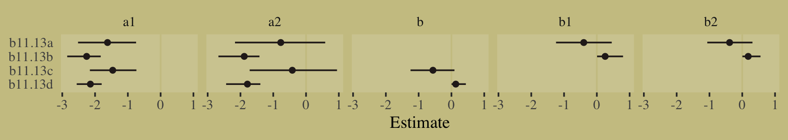

The results differed across models. None of them match up with the results McElreath reported in the text. However, the parameters from `b11.13d` are very close to those from our `m11.13`.


```r
precis(m11.13, depth = 2)
```

```
##            mean        sd         5.5%      94.5%     n_eff    Rhat4
## a[1] -2.1341458 0.1927525 -2.457427970 -1.8543986 101.26816 1.039573
## a[2] -1.7888544 0.2662395 -2.315997996 -1.4486228  63.92879 1.065868
## b     0.1345084 0.1201704  0.009794993  0.3711676  56.87836 1.073703
```

```r
fixef(b11.13d) %>% round(digits = 2)
```

```
##              Estimate Est.Error  Q2.5 Q97.5
## a1_Intercept    -2.14      0.19 -2.56 -1.80
## a2_Intercept    -1.79      0.26 -2.44 -1.39
## b_Intercept      0.13      0.12  0.00  0.44
```

It might be instructive to compare `b11.13a` through `b11.13d` with the PSIS-LOO.


```r
b11.13a <- add_criterion(b11.13a, "loo")
b11.13b <- add_criterion(b11.13b, "loo")
b11.13c <- add_criterion(b11.13c, "loo")
b11.13d <- add_criterion(b11.13d, "loo")

loo_compare(b11.13a, b11.13b, b11.13c, b11.13d, criterion = "loo") %>% 
  print(simplify = F)
```

```
##         elpd_diff se_diff elpd_loo se_elpd_loo p_loo  se_p_loo looic  se_looic
## b11.13c    0.0       0.0  -369.5     17.1         1.9    0.1    738.9   34.2  
## b11.13a   -0.1       0.0  -369.5     17.1         2.0    0.1    739.1   34.1  
## b11.13d   -0.1       0.2  -369.6     16.9         1.9    0.1    739.1   33.8  
## b11.13b   -0.2       0.2  -369.6     16.9         2.0    0.1    739.3   33.8
```

```r
model_weights(b11.13a, b11.13b, b11.13c, b11.13d, weights = "loo") %>% 
  round(digits = 2)
```

```
## b11.13a b11.13b b11.13c b11.13d 
##    0.25    0.23    0.27    0.25
```

Two things pop out, here. First, all models are essentially equivalent in terms of LOO estimates and LOO weights. Second, the effective number of parameters ($p_\text{LOO}$) is about 2 for each model. At first glance, this might be surprising given that `b11.13a` and `b11.13b` both have 4 parameters and `b11.13c` and `b11.13d` both have three parameters. But recall that none of these models contain predictor variables from the data. All those $\beta$ parameters, whether they’re held equal or allowed to vary across $s_1$ and $s_2$, are just constants. In the absence of actual `income` values that vary within the data, those $\beta$ parameters are kinda like extra intercepts. For context, go back and review our multicollinear legs from [Section 6.1.1][Multicollinear legs.] or our double intercepts from [Section 9.5.4][Non-identifiable parameters.].

Now see what happens when we compare these four models with our intercepts-only model, `b11.13io`.


```r
b11.13io <- add_criterion(b11.13io, "loo")

loo_compare(b11.13io, b11.13a, b11.13b, b11.13c, b11.13d, criterion = "loo") %>% 
  print(simplify = F)
```

```
##          elpd_diff se_diff elpd_loo se_elpd_loo p_loo  se_p_loo looic  se_looic
## b11.13c     0.0       0.0  -369.5     17.1         1.9    0.1    738.9   34.2  
## b11.13a    -0.1       0.0  -369.5     17.1         2.0    0.1    739.1   34.1  
## b11.13io   -0.1       0.2  -369.6     16.9         1.9    0.1    739.1   33.9  
## b11.13d    -0.1       0.2  -369.6     16.9         1.9    0.1    739.1   33.8  
## b11.13b    -0.2       0.2  -369.6     16.9         2.0    0.1    739.3   33.8
```

```r
model_weights(b11.13io, b11.13a, b11.13b, b11.13c, b11.13d, weights = "loo") %>% 
  round(digits = 2)
```

```
## b11.13io  b11.13a  b11.13b  b11.13c  b11.13d 
##     0.20     0.20     0.18     0.22     0.20
```

They're all the same. Each model effectively has 2 parameters. Though it doesn't do much by way of cross-validation, McElreath's extra $\beta$ parameter will let us perform a counterfactual simulation. Here is a **brms**/**tidyverse** workflow to make a counterfactual simulation for two levels of `income` based on our `b11.13d`, the **brms** model most closely corresponding to our **rethinking**-based `m11.13`.


```r
posterior_samples(b11.13d) %>% 
  transmute(s1      = b_a1_Intercept + b_b_Intercept * income[1],
            s2_orig = b_a2_Intercept + b_b_Intercept * income[2],
            s2_new  = b_a2_Intercept + b_b_Intercept * income[2] * 2) %>% 
  mutate(p_orig = purrr::map2_dbl(s1, s2_orig, ~softmax(.x, .y, 0)[2]),
         p_new  = purrr::map2_dbl(s1, s2_new, ~softmax(.x, .y, 0)[2])) %>% 
  mutate(p_diff = p_new - p_orig) %>% 
  mean_qi(p_diff) %>% 
  mutate_if(is.double, round, digits = 2)
```

```
##   p_diff .lower .upper .width .point .interval
## 1   0.04      0   0.16   0.95   mean        qi
```

Now let's build.

### Predictors matched to observations.

> Now consider an example in which each observed outcome has unique predictor values. Suppose you are still modeling career choice. But now you want to estimate the association between each person's family income and which career they choose. So the predictor variable must have the same value in each linear model, for each row in the data. But now there is a unique parameter multiplying it in each linear model. This provides an estimate of the impact of family income on choice, for each type of career. (p. 362)


```r
n <- 500
set.seed(11)

# simulate family incomes for each individual
family_income <- runif(n)

# assign a unique coefficient for each type of event
b      <- c(-2, 0, 2)
career <- rep(NA, n)  # empty vector of choices for each individual
for (i in 1:n) {
    score     <- 0.5 * (1:3) + b * family_income[i]
    p         <- softmax(score[1], score[2], score[3])
    career[i] <- sample(1:3, size = 1, prob = p)
}
```

In effect, we now have three data-generating equations:

$$
\begin{align*}
s_1 & = 0.5 + -2 \cdot \text{family_income}_i \\
s_2 & = 1.0 +  0 \cdot \text{family_income}_i \\ 
s_3 & = 1.5 +  2 \cdot \text{family_income}_i,
\end{align*}
$$

where, because `family_income` is an actual variable that can take on unique values for each row in the data, we can call the first term in each equation the $\alpha$ parameter and the second term in each equation the $\beta$ parameter AND those $\beta$ parameters will be more than odd double intercepts.

We might examine what the `family_income` distributions look like across the three levels of `career`. We'll do it in two plots and combine them with the patchwork syntax. The first will be overlapping densities. For the second, we'll display the proportions of `career` across a discretized version of `family_income` in a stacked area plot.


```r
# put the data in a tibble
d <-
  tibble(career = career) %>% 
  mutate(family_income = family_income)

p1 <-
  d %>% 
  mutate(career = as.factor(career)) %>% 
  
  ggplot(aes(x = family_income, fill = career)) +
  geom_density(size = 0, alpha = 3/4) +
  scale_fill_manual(values = wes_palette("Moonrise2")[c(4, 2, 1)]) +
  theme(legend.position = "none")
  
p2 <-
  d %>% 
  mutate(career = as.factor(career)) %>%
  
  mutate(fi = santoku::chop_width(family_income, width = .1, start = 0, labels = 1:10)) %>% 
  count(fi, career) %>% 
  group_by(fi) %>% 
  mutate(proportion = n / sum(n)) %>% 
  mutate(f = as.double(fi)) %>% 
  
  ggplot(aes(x = (f - 1) / 9, y = proportion, fill = career)) +
  geom_area() +
  scale_fill_manual(values = wes_palette("Moonrise2")[c(4, 2, 1)]) +
  xlab("family_income, descritized")

p1 + p2
```

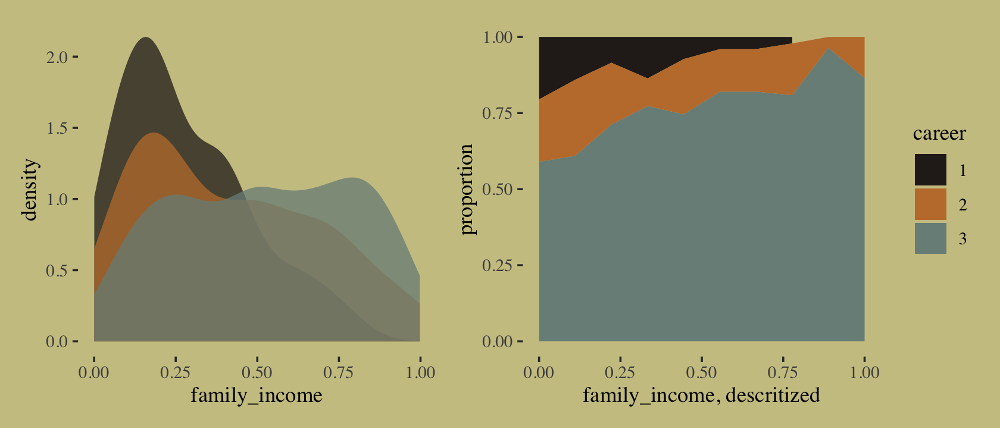

Since Mcelreath's simulation code in McElreath's **R** code 11.59 did not contain a `set.seed()` line, it won't be possible to exactly reproduce his results. Happily, though, it appears that this time the results he reported in the text to cohere reasonably well with I ran the code on my computer. They weren't identical, but there were much closer that for `m11.13` from the last section. Since things are working more smoothly, here, I'm going to jump directly to **brms** code.


```r
b11.14 <-
  brm(data = d, 
      family = categorical(link = logit, refcat = 3),
      bf(career ~ 1,
         nlf(mu1 ~ a1 + b1 * family_income),
         nlf(mu2 ~ a2 + b2 * family_income),
         a1 + a2 + b1 + b2 ~ 1),
      prior = c(prior(normal(0, 1.5), class = b, nlpar = a1),
                prior(normal(0, 1.5), class = b, nlpar = a2),
                prior(normal(0, 1), class = b, nlpar = b1),
                prior(normal(0, 1), class = b, nlpar = b2)),
      iter = 2000, warmup = 1000, cores = 4, chains = 4,
      seed = 11,
      file = "fits/b11.14")
```


```r
print(b11.14)
```

```
##  Family: categorical 
##   Links: mu1 = logit; mu2 = logit 
## Formula: career ~ 1 
##          mu1 ~ a1 + b1 * family_income
##          mu2 ~ a2 + b2 * family_income
##          a1 ~ 1
##          a2 ~ 1
##          b1 ~ 1
##          b2 ~ 1
##    Data: d (Number of observations: 500) 
## Samples: 4 chains, each with iter = 2000; warmup = 1000; thin = 1;
##          total post-warmup samples = 4000
## 
## Population-Level Effects: 
##              Estimate Est.Error l-95% CI u-95% CI Rhat Bulk_ESS Tail_ESS
## a1_Intercept    -1.29      0.26    -1.80    -0.79 1.00     2410     2255
## a2_Intercept    -1.01      0.22    -1.47    -0.59 1.00     2130     2133
## b1_Intercept    -2.49      0.57    -3.64    -1.36 1.00     2207     2143
## b2_Intercept    -1.21      0.43    -2.04    -0.37 1.00     2093     2006
## 
## Samples were drawn using sampling(NUTS). For each parameter, Bulk_ESS
## and Tail_ESS are effective sample size measures, and Rhat is the potential
## scale reduction factor on split chains (at convergence, Rhat = 1).
```

Check the PSIS-LOO.


```r
b11.14 <- add_criterion(b11.14, "loo")

loo(b11.14)
```

```
## 
## Computed from 4000 by 500 log-likelihood matrix
## 
##          Estimate   SE
## elpd_loo   -330.4 17.0
## p_loo         3.3  0.3
## looic       660.9 33.9
## ------
## Monte Carlo SE of elpd_loo is 0.0.
## 
## All Pareto k estimates are good (k < 0.5).
## See help('pareto-k-diagnostic') for details.
```

Now that we actually have predictor variables with which we might estimate conventional $\beta$ parameters, we finally have more than 2 effective parameters ($p_\text{LOO}$).

"Again, computing implied predictions is the safest way to interpret these models. They do a great job of classifying discrete, unordered events. But the parameters are on a scale that is very hard to interpret" (p. 325). Like before, we'll do that with `fitted()`. Now we have a predictor, this time we will use the `newdata` argument.


```r
nd <- tibble(family_income = seq(from = 0, to = 1, length.out = 60))

f <-
  fitted(b11.14,
        newdata = nd)
```

First we'll plot the fitted probabilities for each `career` level across the full range of `family_income` values.


```r
# wrangle
rbind(f[, , 1],
      f[, , 2],
      f[, , 3]) %>% 
  data.frame() %>% 
  bind_cols(nd %>% expand(career = 1:3, family_income)) %>% 
  mutate(career = str_c("career: ", career)) %>% 
  
  # plot
  ggplot(aes(x = family_income, y = Estimate,
             ymin = Q2.5, ymax = Q97.5,
             fill = career, color = career)) +
  geom_ribbon(alpha = 2/3, size = 0) +
  geom_line(size = 3/4) +
  scale_fill_manual(values = wes_palette("Moonrise2")[c(4, 2, 1)]) +
  scale_color_manual(values = wes_palette("Moonrise2")[c(4, 2, 1)]) +
  scale_x_continuous(breaks = 0:2 / 2) +
  scale_y_continuous("probability", limits = c(0, 1),
                     breaks = 0:3 / 3, labels = c("0", ".33", ".67", "1")) +
  theme(axis.text.y = element_text(hjust = 0),
        legend.position = "none") +
  facet_wrap(~career)
```


If we're willing to summarize those fitted lines by their posterior means, we could also make a model-implied version of the stacked area plot from above.


```r
# annotation
text <-
  tibble(family_income = c(.45, .3, .15),
         proportion    = c(.65, .8, .95),
         label         = str_c("career: ", 3:1),
         color         = c("a", "a", "b"))

# wrangle
rbind(f[, , 1],
      f[, , 2],
      f[, , 3]) %>% 
  data.frame() %>% 
  bind_cols(nd %>% expand(career = 1:3, family_income)) %>% 
  group_by(family_income) %>% 
  mutate(proportion = Estimate / sum(Estimate),
         career     = factor(career)) %>% 
  
  # plot!
  ggplot(aes(x = family_income, y = proportion)) +
  geom_area(aes(fill = career)) +
  geom_text(data = text,
            aes(label = label, color = color),
            family = "Times", size = 4.25) +
  scale_color_manual(values = wes_palette("Moonrise2")[4:3]) +
  scale_fill_manual(values = wes_palette("Moonrise2")[c(4, 2, 1)]) +
  theme(legend.position = "none")
```


For more practice fitting multinomial models with **brms**, check out [Chapter 22](https://bookdown.org/content/3686/nominal-predicted-variable.html) of my [-@kurzDoingBayesianData2020] translation of Kruschke's [-@kruschkeDoingBayesianData2015] text.

#### Multinomial in disguise as Poisson.

Here we fit a multinomial likelihood by refactoring it to a series of Poissons. Let's retrieve the Berkeley data.


```r
library(rethinking)
data(UCBadmit)
d <- UCBadmit
rm(UCBadmit)
detach(package:rethinking, unload = T)
library(brms)
```

Fit the models.


```r
# binomial model of overall admission probability
b11.binom <-
  brm(data = d, 
      family = binomial,
      admit | trials(applications) ~ 1,
      prior(normal(0, 1.5), class = Intercept),
      iter = 2000, warmup = 1000, cores = 3, chains = 3,
      seed = 11,
      file = "fits/b11.binom")

# Poisson model of overall admission rate and rejection rate
b11.pois <-
  brm(data = d %>%
        mutate(rej = reject),  # 'reject' is a reserved word
      family = poisson,
      mvbind(admit, rej) ~ 1,
      prior(normal(0, 1.5), class = Intercept),
      iter = 2000, warmup = 1000, cores = 3, chains = 3,
      seed = 11,
      file = "fits/b11.pois")
```

Note, the `mvbind()` syntax made `b11.pois` a multivariate Poisson model. Starting with version 2.0.0, **brms** supports a variety of multivariate models, which you might learn more about with Bürkner's [-@Bürkner2020Multivariate] vignette, [*Estimating multivariate models with brms*](https://cran.r-project.org/package=brms/vignettes/brms_multivariate.html). Anyway, here are the implications of `b11.pois`.


```r
# extract the samples
post <- posterior_samples(b11.pois)
# wrangle
post %>%
  mutate(admit  = exp(b_admit_Intercept), 
         reject = exp(b_rej_Intercept)) %>% 
  pivot_longer(admit:reject) %>% 
  
  # plot
  ggplot(aes(x = value, y = name, fill = name)) +
  stat_halfeye(point_interval = median_qi, .width = .95,
               color = wes_palette("Moonrise2")[4]) +
  scale_fill_manual(values = wes_palette("Moonrise2")[1:2]) +
  labs(title = " Mean admit/reject rates across departments",
       x = "# applications",
       y = NULL) +
  theme(axis.ticks.y = element_blank(),
        legend.position = "none")
```


We might compare the model summaries.


```r
summary(b11.binom)$fixed
```

```
##             Estimate Est.Error   l-95% CI   u-95% CI     Rhat Bulk_ESS Tail_ESS
## Intercept -0.4554727  0.030408 -0.5131503 -0.3933352 1.002252     1207     1601
```

```r
summary(b11.pois)$fixed
```

```
##                 Estimate  Est.Error l-95% CI u-95% CI     Rhat Bulk_ESS Tail_ESS
## admit_Intercept 4.984362 0.02362118 4.937529 5.028207 1.001698     2675     1651
## rej_Intercept   5.441076 0.01881634 5.404090 5.478881 1.000537     2994     2209
```

Here's the posterior mean for the probability of admission, based on `b11.binom`.


```r
fixef(b11.binom)[ ,"Estimate"] %>%
  inv_logit_scaled()
```

```
## [1] 0.3880604
```

Happily, we get the same value within simulation error from model `b11.pois`.


```r
k <- 
  fixef(b11.pois) %>%
  as.numeric()

exp(k[1]) / (exp(k[1]) + exp(k[2]))
```

```
## [1] 0.3877655
```

The formula for what we just did in code is

$$p_\text{admit} = \frac{\lambda_1}{\lambda_1 + \lambda_2} = \frac{\exp (\alpha_1)}{\exp (\alpha_1) + \exp (\alpha_2)}.$$

To get a better appreciation on how well the two model types converge on the same solution, we might plot the full poster for admissions probability from each.


```r
# wrangle
bind_cols(
  posterior_samples(b11.pois) %>% 
    mutate(`the Poisson`  = exp(b_admit_Intercept) / (exp(b_admit_Intercept) + exp(b_rej_Intercept))),
  posterior_samples(b11.binom) %>% 
    mutate(`the binomial` = inv_logit_scaled(b_Intercept))
  ) %>% 
  pivot_longer(starts_with("the")) %>% 
  
  # plot
  ggplot(aes(x = value, y = name, fill = name)) +
  stat_halfeye(point_interval = median_qi, .width = c(.95, .5),
               color = wes_palette("Moonrise2")[4]) +
  scale_fill_manual(values = c(wes_palette("Moonrise2")[2:1])) +
  labs(title = "Two models, same marginal posterior",
       x = "admissions probability",
       y = NULL) +
  coord_cartesian(ylim = c(1.5, 2.25)) +
  theme(axis.text.y = element_text(hjust = 0),
        axis.ticks.y = element_blank(),
        legend.position = "none")
```

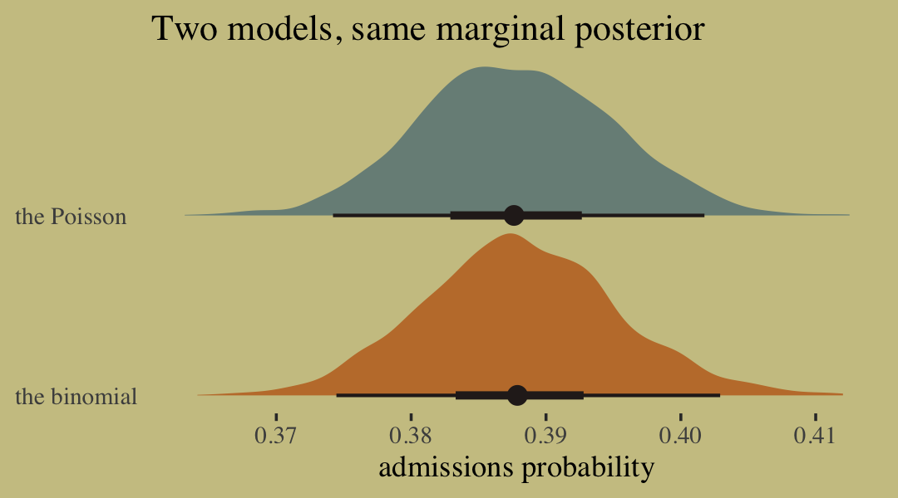

## Summary

> This chapter described some of the most common generalized linear models, those used to model counts. It is important to never convert counts to proportions before analysis, because doing so destroys information about sample size. A fundamental difficulty with these models is that parameters are on a different scale, typically log-odds (for binomial) or log-rate (for Poisson), than the outcome variable they describe. Therefore computing implied predictions is even more important than before. (p. 365)

## Session info {-}


```r
sessionInfo()
```

```
## R version 3.6.3 (2020-02-29)
## Platform: x86_64-apple-darwin15.6.0 (64-bit)
## Running under: macOS Catalina 10.15.3
## 
## Matrix products: default
## BLAS:   /Library/Frameworks/R.framework/Versions/3.6/Resources/lib/libRblas.0.dylib
## LAPACK: /Library/Frameworks/R.framework/Versions/3.6/Resources/lib/libRlapack.dylib
## 
## locale:
## [1] en_US.UTF-8/en_US.UTF-8/en_US.UTF-8/C/en_US.UTF-8/en_US.UTF-8
## 
## attached base packages:
## [1] parallel  stats     graphics  grDevices utils     datasets  methods   base     
## 
## other attached packages:
##  [1] ggrepel_0.8.2        GGally_1.5.0         ggdag_0.2.2          patchwork_1.0.0      tidybayes_2.1.1     
##  [6] ggthemes_4.2.0       wesanderson_0.3.6    brms_2.13.0          Rcpp_1.0.4.6         forcats_0.5.0       
## [11] stringr_1.4.0        dplyr_0.8.5          purrr_0.3.4          readr_1.3.1          tidyr_1.0.2         
## [16] tibble_3.0.1         tidyverse_1.3.0      dagitty_0.2-2        rstan_2.19.3         ggplot2_3.3.1       
## [21] StanHeaders_2.21.0-1
## 
## loaded via a namespace (and not attached):
##   [1] readxl_1.3.1         backports_1.1.7      plyr_1.8.6           igraph_1.2.5         splines_3.6.3       
##   [6] svUnit_1.0.3         crosstalk_1.1.0.1    TH.data_1.0-10       rstantools_2.0.0     inline_0.3.15       
##  [11] digest_0.6.25        htmltools_0.4.0      viridis_0.5.1        rsconnect_0.8.16     fansi_0.4.1         
##  [16] magrittr_1.5         graphlayouts_0.7.0   modelr_0.1.6         matrixStats_0.56.0   xts_0.12-0          
##  [21] sandwich_2.5-1       prettyunits_1.1.1    colorspace_1.4-1     rvest_0.3.5          ggdist_2.1.1        
##  [26] haven_2.2.0          xfun_0.13            callr_3.4.3          crayon_1.3.4         jsonlite_1.6.1      
##  [31] survival_3.1-12      zoo_1.8-7            glue_1.4.1           polyclip_1.10-0      gtable_0.3.0        
##  [36] emmeans_1.4.5        V8_3.0.2             pkgbuild_1.0.8       shape_1.4.4          abind_1.4-5         
##  [41] scales_1.1.1         mvtnorm_1.1-0        emo_0.0.0.9000       DBI_1.1.0            miniUI_0.1.1.1      
##  [46] viridisLite_0.3.0    xtable_1.8-4         HDInterval_0.2.0     stats4_3.6.3         DT_0.13             
##  [51] htmlwidgets_1.5.1    httr_1.4.1           threejs_0.3.3        RColorBrewer_1.1-2   arrayhelpers_1.1-0  
##  [56] ellipsis_0.3.1       santoku_0.3.0        reshape_0.8.8        pkgconfig_2.0.3      loo_2.2.0           
##  [61] farver_2.0.3         dbplyr_1.4.2         utf8_1.1.4           tidyselect_1.0.0     labeling_0.3        
##  [66] rlang_0.4.6          reshape2_1.4.4       later_1.0.0          munsell_0.5.0        cellranger_1.1.0    
##  [71] tools_3.6.3          cli_2.0.2            generics_0.0.2       broom_0.5.5          ggridges_0.5.2      
##  [76] evaluate_0.14        fastmap_1.0.1        yaml_2.2.1           processx_3.4.2       knitr_1.28          
##  [81] fs_1.4.1             tidygraph_1.2.0      ggraph_2.0.3         nlme_3.1-144         mime_0.9            
##  [86] xml2_1.3.1           compiler_3.6.3       bayesplot_1.7.1      shinythemes_1.1.2    rstudioapi_0.11     
##  [91] curl_4.3             reprex_0.3.0         tweenr_1.0.1         stringi_1.4.6        highr_0.8           
##  [96] ps_1.3.3             Brobdingnag_1.2-6    lattice_0.20-38      Matrix_1.2-18        markdown_1.1        
## [101] shinyjs_1.1          vctrs_0.3.1          pillar_1.4.4         lifecycle_0.2.0      bridgesampling_1.0-0
## [106] estimability_1.3     httpuv_1.5.2         R6_2.4.1             bookdown_0.18        promises_1.1.0      
## [111] gridExtra_2.3        codetools_0.2-16     boot_1.3-24          colourpicker_1.0     MASS_7.3-51.5       
## [116] gtools_3.8.2         assertthat_0.2.1     withr_2.2.0          shinystan_2.5.0      multcomp_1.4-13     
## [121] hms_0.5.3            grid_3.6.3           coda_0.19-3          rmarkdown_2.1        ggforce_0.3.1       
## [126] shiny_1.4.0.2        lubridate_1.7.8      base64enc_0.1-3      dygraphs_1.1.1.6
```


