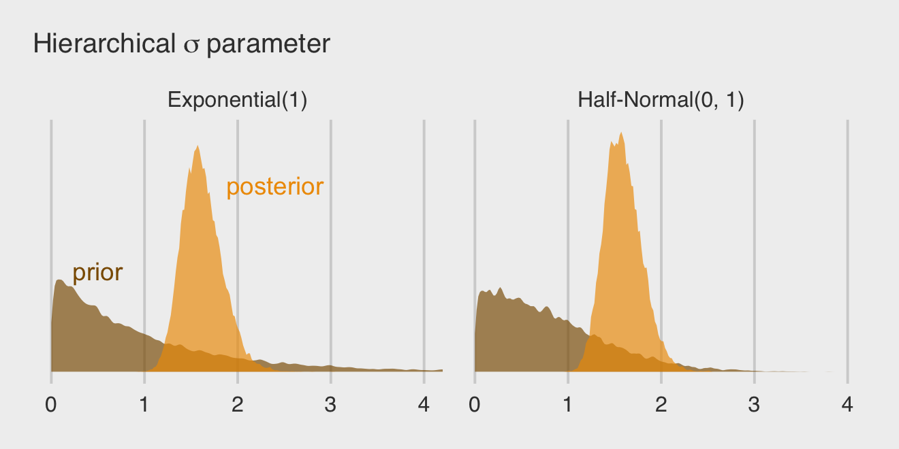
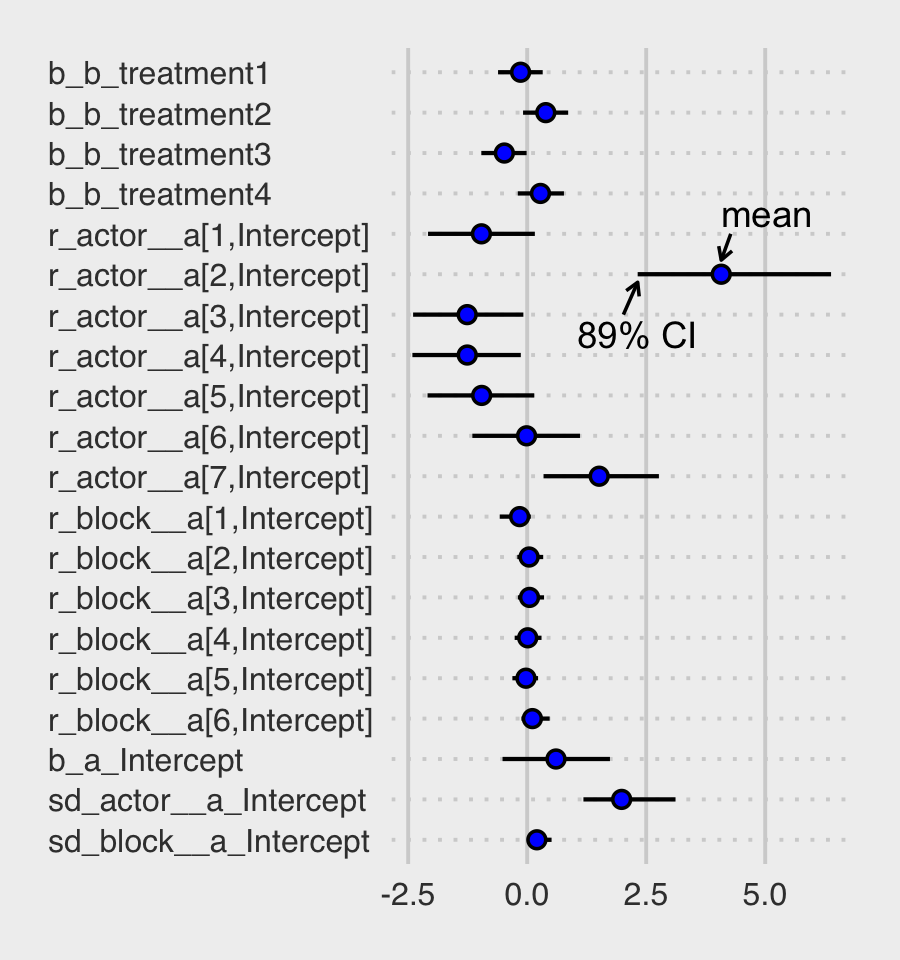
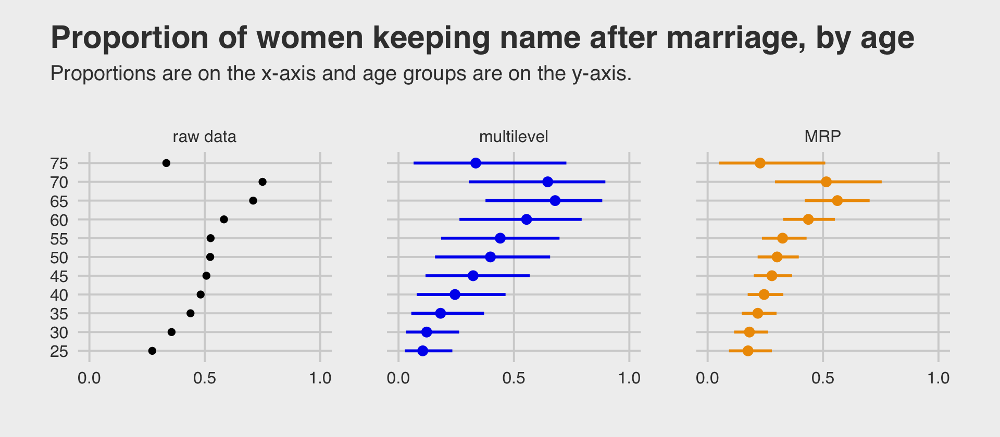

# Models With Memory

> **Multilevel models**... remember features of each cluster in the data as they learn about all of the clusters. Depending upon the variation among clusters, which is learned from the data as well, the model pools information across clusters. This pooling tends to improve estimates about each cluster. This improved estimation leads to several, more pragmatic sounding, benefits of the multilevel approach. [@mcelreathStatisticalRethinkingBayesian2020, p. 400, **emphasis** in the original]

These benefits include:

* better estimates for repeated sampling (i.e., in longitudinal data),
* better estimates when there are imbalances among subsamples,
* estimates of the variation across subsamples, and
* avoiding simplistic averaging by retaining variation across subsamples.

> All of these benefits flow out of the same strategy and model structure. You learn one basic design and you get all of this for free.
>
> When it comes to regression, multilevel regression deserves to be the default approach. There are certainly contexts in which it would be better to use an old-fashioned single-level model. But the contexts in which multilevel models are superior are much more numerous. It is better to begin to build a multilevel analysis, and then realize it's unnecessary, than to overlook it. And once you grasp the basic multilevel strategy, it becomes much easier to incorporate related tricks such as allowing for measurement error in the data and even modeling missing data itself ([Chapter 15][Missing Data and Other Opportunities]). (p. 400)

I'm totally on board with this. After learning about the multilevel model, I see it everywhere. For more on the sentiment it should be the default, check out McElreath's blog post, [*Multilevel regression as default*](https://elevanth.org/blog/2017/08/24/multilevel-regression-as-default/).

## Example: Multilevel tadpoles

Let's load the `reedfrogs` data [see @voneshCompensatoryLarvalResponses2005] and fire up **brms**.


```r
library(brms)
data(reedfrogs, package = "rethinking")
d <- reedfrogs
rm(reedfrogs)
```

Go ahead and acquaint yourself with the `reedfrogs`.


```r
library(tidyverse)

d %>%
  glimpse()
```

```
## Rows: 48
## Columns: 5
## $ density  <int> 10, 10, 10, 10, 10, 10, 10, 10, 10, 10, 10, 10, 10, 10, 10, 10, 25, 25, 25, 25, 25, 25, 25…
## $ pred     <fct> no, no, no, no, no, no, no, no, pred, pred, pred, pred, pred, pred, pred, pred, no, no, no…
## $ size     <fct> big, big, big, big, small, small, small, small, big, big, big, big, small, small, small, s…
## $ surv     <int> 9, 10, 7, 10, 9, 9, 10, 9, 4, 9, 7, 6, 7, 5, 9, 9, 24, 23, 22, 25, 23, 23, 23, 21, 6, 13, …
## $ propsurv <dbl> 0.9000000, 1.0000000, 0.7000000, 1.0000000, 0.9000000, 0.9000000, 1.0000000, 0.9000000, 0.…
```

Making the `tank` cluster variable is easy.


```r
d <- 
  d %>%
  mutate(tank = 1:nrow(d))
```

Here's the formula for the un-pooled model in which each `tank` gets its own intercept:

\begin{align*}
\text{surv}_i             & \sim \operatorname{Binomial}(n_i, p_i) \\
\operatorname{logit}(p_i) & = \alpha_{\text{tank}[i]} \\
\alpha_j                  & \sim \operatorname{Normal} (0, 1.5) & \text{for } j = 1, \dots, 48,
\end{align*}

where $n_i$ is indexed by the `density` column. Its values are distributed like so.


```r
d %>% 
  count(density)
```

```
##   density  n
## 1      10 16
## 2      25 16
## 3      35 16
```

Now fit this simple aggregated binomial model much like we practiced in [Chapter 11][Aggregated binomial: Chimpanzees again, condensed.].


```r
b13.1 <- 
  brm(data = d, 
      family = binomial,
      surv | trials(density) ~ 0 + factor(tank),
      prior(normal(0, 1.5), class = b),
      iter = 2000, warmup = 1000, chains = 4, cores = 4,
      seed = 13,
      file = "fits/b13.01")
```

We don't need a `depth=2` argument to discover we have 48 different intercepts. The default `print()` behavior will do.


```r
print(b13.1)
```

```
##  Family: binomial 
##   Links: mu = logit 
## Formula: surv | trials(density) ~ 0 + factor(tank) 
##    Data: d (Number of observations: 48) 
## Samples: 4 chains, each with iter = 2000; warmup = 1000; thin = 1;
##          total post-warmup samples = 4000
## 
## Population-Level Effects: 
##              Estimate Est.Error l-95% CI u-95% CI Rhat Bulk_ESS Tail_ESS
## factortank1      1.71      0.76     0.35     3.32 1.00     5968     2690
## factortank2      2.41      0.90     0.77     4.38 1.00     4900     2558
## factortank3      0.76      0.63    -0.40     2.04 1.00     6092     2689
## factortank4      2.41      0.89     0.81     4.36 1.00     6258     3082
## factortank5      1.71      0.77     0.34     3.36 1.00     4940     2499
## factortank6      1.72      0.77     0.39     3.38 1.00     6044     3061
## factortank7      2.41      0.91     0.88     4.40 1.00     5596     2867
## factortank8      1.72      0.76     0.35     3.37 1.00     5477     2615
## factortank9     -0.36      0.60    -1.56     0.82 1.00     6323     2826
## factortank10     1.72      0.78     0.34     3.40 1.00     5799     2853
## factortank11     0.76      0.62    -0.42     2.01 1.00     5467     2858
## factortank12     0.35      0.63    -0.87     1.61 1.00     5133     3110
## factortank13     0.76      0.65    -0.44     2.10 1.00     6180     2641
## factortank14     0.01      0.59    -1.16     1.20 1.00     5359     3277
## factortank15     1.72      0.79     0.31     3.41 1.00     6558     2823
## factortank16     1.74      0.78     0.34     3.37 1.00     5035     2706
## factortank17     2.55      0.69     1.36     4.06 1.00     4771     2989
## factortank18     2.14      0.62     1.05     3.48 1.00     5673     2708
## factortank19     1.82      0.55     0.84     3.00 1.00     6580     2789
## factortank20     3.09      0.81     1.67     4.89 1.00     5512     2629
## factortank21     2.16      0.63     1.06     3.56 1.00     4868     2438
## factortank22     2.13      0.61     1.03     3.45 1.00     5752     2526
## factortank23     2.14      0.58     1.11     3.36 1.00     5812     2941
## factortank24     1.55      0.52     0.62     2.69 1.00     5606     2728
## factortank25    -1.11      0.46    -2.05    -0.25 1.01     5548     2758
## factortank26     0.07      0.41    -0.73     0.90 1.00     5360     2584
## factortank27    -1.55      0.50    -2.60    -0.63 1.00     5138     2886
## factortank28    -0.54      0.41    -1.35     0.24 1.00     5783     2878
## factortank29     0.08      0.39    -0.67     0.84 1.00     5349     3120
## factortank30     1.30      0.46     0.46     2.24 1.00     5681     2730
## factortank31    -0.72      0.41    -1.58     0.04 1.00     5584     2848
## factortank32    -0.39      0.41    -1.21     0.39 1.00     5755     3148
## factortank33     2.84      0.65     1.70     4.18 1.00     4913     2760
## factortank34     2.45      0.57     1.41     3.67 1.00     5085     2773
## factortank35     2.48      0.59     1.41     3.73 1.00     6235     3034
## factortank36     1.91      0.48     1.03     2.92 1.00     6056     3296
## factortank37     1.91      0.48     1.03     2.91 1.00     5467     2841
## factortank38     3.36      0.78     1.99     5.05 1.00     5907     2908
## factortank39     2.44      0.59     1.40     3.73 1.00     6059     2850
## factortank40     2.15      0.52     1.21     3.27 1.00     5156     2828
## factortank41    -1.90      0.48    -2.93    -1.02 1.00     6242     2527
## factortank42    -0.63      0.35    -1.34     0.03 1.00     6081     2929
## factortank43    -0.52      0.34    -1.20     0.15 1.00     5480     2523
## factortank44    -0.39      0.34    -1.08     0.25 1.00     6721     2985
## factortank45     0.51      0.35    -0.16     1.20 1.00     6432     3238
## factortank46    -0.63      0.35    -1.33     0.06 1.00     6303     2560
## factortank47     1.91      0.49     1.04     2.93 1.00     5039     2543
## factortank48    -0.06      0.34    -0.73     0.63 1.00     4892     3202
## 
## Samples were drawn using sampling(NUTS). For each parameter, Bulk_ESS
## and Tail_ESS are effective sample size measures, and Rhat is the potential
## scale reduction factor on split chains (at convergence, Rhat = 1).
```

This is much like the models we've fit in earlier chapters using McElreath's index approach, but on steroids. It'll be instructive to take a look at distribution of the $\alpha_j$ parameters in density plots. We'll plot them in both their log-odds and probability metrics.

For kicks and giggles, let's use a [FiveThirtyEight-like theme](https://github.com/alex23lemm/theme_fivethirtyeight) for this chapter's plots. An easy way to do so is with help from the [**ggthemes** package](https://cran.r-project.org/package=ggthemes).


```r
library(ggthemes) 
library(tidybayes)

# change the default
theme_set(theme_gray() + theme_fivethirtyeight())

tibble(estimate = fixef(b13.1)[, 1]) %>% 
  mutate(p = inv_logit_scaled(estimate)) %>% 
  pivot_longer(estimate:p) %>% 
  mutate(name = if_else(name == "p", "expected survival probability", "expected survival log-odds")) %>% 
  
  ggplot(aes(x = value, fill = name)) +
  stat_dots(size = 0) +
  scale_fill_manual(values = c("orange1", "orange4")) +
  scale_y_continuous(breaks = NULL) +
  labs(title = "Tank-level intercepts from the no-pooling model",
       subtitle = "Notice now inspecting the distributions of the posterior means can offer insights you\nmight not get if you looked at them one at a time.") +
  theme(legend.position = "none",
        panel.grid = element_blank()) +
  facet_wrap(~name, scales = "free_x")
```


Even though it seems like we can derive important insights from how the `tank`-level intercepts are distributed, that information is not explicitly encoded in the statistical model. Keep that in mind as we now consider the multilevel alternative. Its formula is

\begin{align*}
\text{surv}_i             & \sim \operatorname{Binomial}(n_i, p_i) \\
\operatorname{logit}(p_i) & = \alpha_{\text{tank}[i]} \\
\alpha_j                  & \sim \operatorname{Normal}(\color{#CD8500}{\bar \alpha}, \color{#CD8500} \sigma) \\
\color{#CD8500}{\bar \alpha} & \color{#CD8500} \sim \color{#CD8500}{\operatorname{Normal}(0, 1.5)} \\
\color{#CD8500} \sigma       & \color{#CD8500} \sim \color{#CD8500}{\operatorname{Exponential}(1)},
\end{align*}

where

> the prior for the tank intercepts is now a function of two parameters, $\bar \alpha$ and $\sigma$. You can say $\bar \alpha$ like "bar alpha." The bar means average. These two parameters inside the prior is where the "multi" in multilevel arises. The Gaussian distribution with mean $\bar \alpha$ standard deviation $\sigma$ is the prior for each tank’s intercept. But that prior itself has priors for $\bar \alpha$ and $\sigma$. So there are two levels in the model, each resembling a simpler model. (p. 403, *emphasis* in the original)

With **brms**, you might specify the corresponding multilevel model like this.


```r
b13.2 <- 
  brm(data = d, 
      family = binomial,
      surv | trials(density) ~ 1 + (1 | tank),
      prior = c(prior(normal(0, 1.5), class = Intercept),  # bar alpha
                prior(exponential(1), class = sd)),        # sigma
      iter = 5000, warmup = 1000, chains = 4, cores = 4,
      sample_prior = "yes",
      seed = 13,
      file = "fits/b13.02")
```

The syntax for the varying effects follows the [**lme4** style](https://cran.r-project.org/package=brms/vignettes/brms_overview.pdf), `( <varying parameter(s)> | <grouping variable(s)> )`. In this case `(1 | tank)` indicates only the intercept, `1`, varies by `tank`. The extent to which parameters vary is controlled by the prior, `prior(exponential(1), class = sd)`, which is <u>parameterized in the standard deviation metric</u>. Do note that last part. It's common in multilevel software to model in the variance metric, instead. For technical reasons we won't really get into until [Chapter 14][Adventures in Covariance], Stan parameterizes this as a standard deviation.

Let's compute the WAIC comparisons.


```r
b13.1 <- add_criterion(b13.1, "waic")
b13.2 <- add_criterion(b13.2, "waic")

w <- loo_compare(b13.1, b13.2, criterion = "waic")

print(w, simplify = F)
```

```
##       elpd_diff se_diff elpd_waic se_elpd_waic p_waic se_p_waic waic   se_waic
## b13.2    0.0       0.0  -100.3       3.6         21.2    0.8     200.6    7.2 
## b13.1   -7.5       1.8  -107.7       2.4         26.0    1.3     215.5    4.7
```

The `se_diff` is small relative to the `elpd_diff`. If we convert the $\text{elpd}$ difference to the WAIC metric, the message stays the same.


```r
cbind(waic_diff = w[, 1] * -2,
      se        = w[, 2] *  2)
```

```
##       waic_diff       se
## b13.2   0.00000 0.000000
## b13.1  14.92095 3.663999
```

Here are the WAIC weights.


```r
model_weights(b13.1, b13.2, weights = "waic") %>% 
  round(digits = 2)
```

```
## b13.1 b13.2 
##     0     1
```

I'm not going to show it here, but if you'd like a challenge, try comparing the models with the PSIS-LOO. You'll get some great practice with high `pareto_k` values and the moment matching for problematic observations [see @paananenMomentMatching2020; @paananenImplicitlyAdaptiveImportance2020].


But back on track, McElreath commented on the number of effective parameters for the two models. This, recall, is listed in the column for $p_\text{WAIC}$.


```r
w[, "p_waic"]
```

```
##    b13.2    b13.1 
## 21.15522 25.97493
```

And indeed, even though out multilevel model (`b13.2`) technically had two more parameters than the conventional single-level model (`b13.1`), its $p_\text{WAIC}$ is substantially smaller, due to the regularizing level-2 $\sigma$ parameter. Speaking of which, let's examine the model summary.


```r
print(b13.2)
```

```
##  Family: binomial 
##   Links: mu = logit 
## Formula: surv | trials(density) ~ 1 + (1 | tank) 
##    Data: d (Number of observations: 48) 
## Samples: 4 chains, each with iter = 5000; warmup = 1000; thin = 1;
##          total post-warmup samples = 16000
## 
## Group-Level Effects: 
## ~tank (Number of levels: 48) 
##               Estimate Est.Error l-95% CI u-95% CI Rhat Bulk_ESS Tail_ESS
## sd(Intercept)     1.62      0.21     1.25     2.08 1.00     4165     7331
## 
## Population-Level Effects: 
##           Estimate Est.Error l-95% CI u-95% CI Rhat Bulk_ESS Tail_ESS
## Intercept     1.35      0.26     0.85     1.87 1.00     2713     5723
## 
## Samples were drawn using sampling(NUTS). For each parameter, Bulk_ESS
## and Tail_ESS are effective sample size measures, and Rhat is the potential
## scale reduction factor on split chains (at convergence, Rhat = 1).
```

This time we don't get a list of 48 separate `tank`-level parameters. However, we do get a description of their distribution in terms of $\bar \alpha$ (i.e., `Intercept`) and $\sigma$ (i.e., `sd(Intercept)`). If you'd like the actual `tank`-level parameters, don't worry; they're coming in Figure 13.1. We'll need to do a little prep work, though.


```r
post <- posterior_samples(b13.2)

post_mdn <- 
  coef(b13.2, robust = T)$tank[, , ] %>% 
  data.frame() %>% 
  bind_cols(d) %>%
  mutate(post_mdn = inv_logit_scaled(Estimate))

head(post_mdn)
```

```
##    Estimate Est.Error       Q2.5    Q97.5 density pred  size surv propsurv tank  post_mdn
## 1 2.0710149 0.8489633  0.6199451 4.004548      10   no   big    9      0.9    1 0.8880539
## 2 2.9601418 1.0788371  1.2017427 5.518909      10   no   big   10      1.0    2 0.9507406
## 3 0.9772195 0.6680379 -0.2359327 2.383979      10   no   big    7      0.7    3 0.7265562
## 4 2.9822519 1.0820401  1.1683675 5.623650      10   no   big   10      1.0    4 0.9517659
## 5 2.0677622 0.8479876  0.5778758 4.078550      10   no small    9      0.9    5 0.8877301
## 6 2.0775342 0.8428334  0.6163349 4.021300      10   no small    9      0.9    6 0.8887004
```

Here's the **ggplot2** code to reproduce Figure 13.1.


```r
post_mdn %>%
  ggplot(aes(x = tank)) +
  geom_hline(yintercept = inv_logit_scaled(median(post$b_Intercept)), linetype = 2, size = 1/4) +
  geom_vline(xintercept = c(16.5, 32.5), size = 1/4, color = "grey25") +
  geom_point(aes(y = propsurv), color = "orange2") +
  geom_point(aes(y = post_mdn), shape = 1) +
  annotate(geom = "text", x = c(8, 16 + 8, 32 + 8), y = 0, 
           label = c("small tanks", "medium tanks", "large tanks")) +
  scale_x_continuous(breaks = c(1, 16, 32, 48)) +
  scale_y_continuous(breaks = 0:5 / 5, limits = c(0, 1)) +
  labs(title = "Multilevel shrinkage!",
       subtitle = "The empirical proportions are in orange while the model-\nimplied proportions are the black circles. The dashed line is\nthe model-implied average survival proportion.") +
  theme(panel.grid.major = element_blank())
```


Here is the code for our version of Figure 13.2.a, where we visualize the model-implied population distribution of log-odds survival (i.e., the population distribution yielding all the `tank`-level intercepts). 


```r
# this makes the output of `sample_n()` reproducible
set.seed(13)

p1 <-
  post %>% 
  mutate(iter = 1:n()) %>% 
  sample_n(100) %>% 
  expand(nesting(iter, b_Intercept, sd_tank__Intercept),
         x = seq(from = -4, to = 5, length.out = 100)) %>%
  mutate(density = dnorm(x, mean = b_Intercept, sd = sd_tank__Intercept)) %>% 
    
  ggplot(aes(x = x, y = density, group = iter)) +
  geom_line(alpha = .2, color = "orange2") +
  scale_y_continuous(NULL, breaks = NULL) +
  labs(title = "Population survival distribution",
       subtitle = "log-odds scale") +
  coord_cartesian(xlim = c(-3, 4))
```

Now we make our Figure 13.2.b and then bind the two subplots with **patchwork**.


```r
set.seed(13)

p2 <-
  post %>% 
  sample_n(8000, replace = T) %>% 
  mutate(sim_tanks = rnorm(n(), mean = b_Intercept, sd = sd_tank__Intercept)) %>% 
  
  ggplot(aes(x = inv_logit_scaled(sim_tanks))) +
  geom_density(size = 0, fill = "orange2", adjust = 0.1) +
  scale_y_continuous(NULL, breaks = NULL) +
  labs(title = "Probability of survival",
       subtitle = "transformed by the inverse-logit function")

library(patchwork)

(p1 + p2) &
  theme(plot.title = element_text(size = 12),
        plot.subtitle = element_text(size = 10))
```


Both plots show different ways in expressing the model uncertainty in terms of both location $\alpha$ and scale $\sigma$.

#### Rethinking: Varying intercepts as over-dispersion. 

> In the previous chapter ([page 369][Over-dispersed counts]), the beta- binomial and gamma-Poisson models were presented as ways for coping with **over-dispersion** of count data. Varying intercepts accomplish the same thing, allowing count outcomes to be over-dispersed. They accomplish this, because when each observed count gets its own unique intercept, but these intercepts are pooled through a common distribution, the predictions expect over-dispersion just like a beta-binomial or gamma-Poisson model would. Multilevel models are also mixtures. Compared to a beta-binomial or gamma-Poisson model, a binomial or Poisson model with a varying intercept on every observed outcome will often be easier to estimate and easier to extend. (p. 407, **emphasis** in the original)

#### Overthinking: Prior for variance components.

Yep, you can use the half-Normal distribution for your priors in **brms**, too. Here it is for model `b13.2`.


```r
b13.2b <- 
  update(b13.2,
         prior = c(prior(normal(0, 1.5), class = Intercept),
                   prior(normal(0, 1), class = sd)),
         iter = 5000, warmup = 1000, chains = 4, cores = 4,
         sample_prior = "yes",
         seed = 13,
         file = "fits/b13.02b")
```

McElreath mentioned how one might set a lower bound at zero for the half-Normal prior when using `rethinking::ulam()`. There's no need to do so when using `brms::brm()`. The lower bounds for priors of `class = sd` are already set to zero by default.

Check the model summary.


```r
print(b13.2b)
```

```
##  Family: binomial 
##   Links: mu = logit 
## Formula: surv | trials(density) ~ 1 + (1 | tank) 
##    Data: d (Number of observations: 48) 
## Samples: 4 chains, each with iter = 5000; warmup = 1000; thin = 1;
##          total post-warmup samples = 16000
## 
## Group-Level Effects: 
## ~tank (Number of levels: 48) 
##               Estimate Est.Error l-95% CI u-95% CI Rhat Bulk_ESS Tail_ESS
## sd(Intercept)     1.59      0.20     1.24     2.02 1.00     4700     9047
## 
## Population-Level Effects: 
##           Estimate Est.Error l-95% CI u-95% CI Rhat Bulk_ESS Tail_ESS
## Intercept     1.33      0.25     0.84     1.84 1.00     3514     6311
## 
## Samples were drawn using sampling(NUTS). For each parameter, Bulk_ESS
## and Tail_ESS are effective sample size measures, and Rhat is the potential
## scale reduction factor on split chains (at convergence, Rhat = 1).
```

If you're curious how the exponential and half-Normal priors compare to one another and to their posteriors, you might just plot.


```r
# for annotation
text <-
  tibble(value        = c(0.5, 2.4),
         density      = c(1, 1.85),
         distribution = factor(c("prior", "posterior"), levels = c("prior", "posterior")),
         prior        = "Exponential(1)")

# gather and wrangle the prior and posterior draws
tibble(`prior_Exponential(1)`        = prior_samples(b13.2) %>% pull(sd_tank),
       `posterior_Exponential(1)`    = posterior_samples(b13.2) %>% pull(sd_tank__Intercept),
       `prior_Half-Normal(0, 1)`     = prior_samples(b13.2b) %>% pull(sd_tank),
       `posterior_Half-Normal(0, 1)` = posterior_samples(b13.2b) %>% pull(sd_tank__Intercept)) %>% 
  pivot_longer(everything(),
               names_sep = "_",
               names_to = c("distribution", "prior")) %>% 
  mutate(distribution = factor(distribution, levels = c("prior", "posterior"))) %>% 
  
  # plot!
  ggplot(aes(x = value, fill = distribution)) +
  geom_density(size = 0, alpha = 2/3, adjust = 0.25) +
  geom_text(data = text,
            aes(y = density, label = distribution, color = distribution)) +
  scale_fill_manual(NULL, values = c("orange4", "orange2")) +
  scale_color_manual(NULL, values = c("orange4", "orange2")) +
  scale_y_continuous(NULL, breaks = NULL) +
  labs(subtitle = expression(Hierarchical~sigma~parameter)) +
  coord_cartesian(xlim = c(0, 4)) +
  theme(legend.position = "none") +
  facet_wrap(~prior)
```



By the way, this is why we set `iter = 5000` and `sample_prior = "yes"` for the last two models. Neither were necessary to fit the models, but both helped us out with this plot.

## Varying effects and the underfitting/overfitting trade-off

> Varying intercepts are just regularized estimates, but adaptively regularized by estimating how diverse the clusters are while estimating the features of each cluster. This fact is not easy to grasp....
>
> A major benefit of using varying effects estimates, instead of the empirical raw estimates, is that they provide more accurate estimates of the individual cluster (tank) intercepts. On average, the varying effects actually provide a better estimate of the individual tank (cluster) means. The reason that the varying intercepts provide better estimates is that they do a better job of trading off underfitting and overfitting. (p. 408)

In this section, we explicate this by contrasting three perspectives:

* complete pooling (i.e., a single-$\alpha$ model),
* no pooling (i.e., the single-level $\alpha_{\text{tank}[i]}$ model), and
* partial pooling [i.e., the multilevel model for which $\alpha_j \sim \operatorname{Normal} (\bar \alpha, \sigma)$].

> To demonstrate [the magic of the multilevel model], we'll simulate some tadpole data. That way, we'll know the true per-pond survival probabilities. Then we can compare the no-pooling estimates to the partial pooling estimates, by computing how close each gets to the true values they are trying to estimate. The rest of this section shows how to do such a simulation. (p. 409)

### The model.

The simulation formula should look familiar.

\begin{align*}
\text{surv}_i & \sim \operatorname{Binomial}(n_i, p_i) \\
\operatorname{logit}(p_i) & = \alpha_{\text{pond}[i]} \\
\alpha_j                  & \sim \operatorname{Normal}(\bar \alpha, \sigma) \\
\bar \alpha               & \sim \operatorname{Normal}(0, 1.5) \\
\sigma                    & \sim \operatorname{Exponential}(1)
\end{align*}

### Assign values to the parameters.

Here we follow along with McElreath and "assign specific values representative of the actual tadpole data" (p. 409). Because he included a `set.seed()` line in his **R** code 13.8, our results should match his exactly.


```r
a_bar   <-  1.5
sigma   <-  1.5
n_ponds <- 60

set.seed(5005)

dsim <- 
  tibble(pond   = 1:n_ponds,
         ni     = rep(c(5, 10, 25, 35), each = n_ponds / 4) %>% as.integer(),
         true_a = rnorm(n = n_ponds, mean = a_bar, sd = sigma))

head(dsim)
```

```
## # A tibble: 6 x 3
##    pond    ni true_a
##   <int> <int>  <dbl>
## 1     1     5  0.567
## 2     2     5  1.99 
## 3     3     5 -0.138
## 4     4     5  1.86 
## 5     5     5  3.91 
## 6     6     5  1.95
```

McElreath twice urged us to inspect the contents of this simulation. In addition to looking at the data with `head()`, we might well plot.


```r
dsim %>% 
  mutate(ni = factor(ni)) %>% 
  
  ggplot(aes(x = true_a, y = ni)) +
  stat_dotsinterval(fill = "orange2", slab_size = 0, .width = .5) +
  ggtitle("Log-odds varying by # tadpoles per pond") +
  theme(plot.title = element_text(size = 14))
```


### Sumulate survivors.

> Each pond $i$ has $n_i$ potential survivors, and nature flips each tadpole's coin, so to speak, with probability of survival $p_i$. This probability $p_i$ is implied by the model definition, and is equal to:
>
> $$p_i = \frac{\exp (\alpha_i)}{1 + \exp (\alpha_i)}$$
>
> The model uses a logit link, and so the probability is defined by the [`inv_logit_scaled()`] function. (p. 411)

Although McElreath shared his `set.seed()` number in the last section, he didn't share it for this bit. We'll go ahead and carry over the one from last time. However, in a moment we'll see this clearly wasn't the one he used here. As a consequence, our results will deviate a bit from his.


```r
set.seed(5005)

(
  dsim <-
  dsim %>%
  mutate(si = rbinom(n = n(), prob = inv_logit_scaled(true_a), size = ni))
)
```

```
## # A tibble: 60 x 4
##     pond    ni true_a    si
##    <int> <int>  <dbl> <int>
##  1     1     5  0.567     4
##  2     2     5  1.99      4
##  3     3     5 -0.138     3
##  4     4     5  1.86      5
##  5     5     5  3.91      5
##  6     6     5  1.95      4
##  7     7     5  1.49      4
##  8     8     5  2.52      4
##  9     9     5  2.18      3
## 10    10     5  2.05      4
## # … with 50 more rows
```

### Compute the no-pooling estimates.

The no-pooling estimates (i.e., $\alpha_{\text{tank}[i]}$) are the results of simple algebra.


```r
(
  dsim <-
  dsim %>%
  mutate(p_nopool = si / ni)
)
```

```
## # A tibble: 60 x 5
##     pond    ni true_a    si p_nopool
##    <int> <int>  <dbl> <int>    <dbl>
##  1     1     5  0.567     4      0.8
##  2     2     5  1.99      4      0.8
##  3     3     5 -0.138     3      0.6
##  4     4     5  1.86      5      1  
##  5     5     5  3.91      5      1  
##  6     6     5  1.95      4      0.8
##  7     7     5  1.49      4      0.8
##  8     8     5  2.52      4      0.8
##  9     9     5  2.18      3      0.6
## 10    10     5  2.05      4      0.8
## # … with 50 more rows
```

"These are the same no-pooling estimates you'd get by fitting a model with a dummy variable for each pond and flat priors that induce no regularization" (p. 411). That is, these are the same kinds of estimates we got back when we fit `b13.1`.

### Compute the partial-pooling estimates.

Fit the multilevel (partial-pooling) model.


```r
b13.3 <- 
  brm(data = dsim, 
      family = binomial,
      si | trials(ni) ~ 1 + (1 | pond),
      prior = c(prior(normal(0, 1.5), class = Intercept),
                prior(exponential(1), class = sd)),
      iter = 2000, warmup = 1000, chains = 4, cores = 4,
      seed = 13,
      file = "fits/b13.03")
```

Here's our standard **brms** summary.


```r
print(b13.3)
```

```
##  Family: binomial 
##   Links: mu = logit 
## Formula: si | trials(ni) ~ 1 + (1 | pond) 
##    Data: dsim (Number of observations: 60) 
## Samples: 4 chains, each with iter = 2000; warmup = 1000; thin = 1;
##          total post-warmup samples = 4000
## 
## Group-Level Effects: 
## ~pond (Number of levels: 60) 
##               Estimate Est.Error l-95% CI u-95% CI Rhat Bulk_ESS Tail_ESS
## sd(Intercept)     1.49      0.20     1.14     1.92 1.00     1506     2368
## 
## Population-Level Effects: 
##           Estimate Est.Error l-95% CI u-95% CI Rhat Bulk_ESS Tail_ESS
## Intercept     1.46      0.23     1.03     1.94 1.00      961     1663
## 
## Samples were drawn using sampling(NUTS). For each parameter, Bulk_ESS
## and Tail_ESS are effective sample size measures, and Rhat is the potential
## scale reduction factor on split chains (at convergence, Rhat = 1).
```

I'm not aware that you can use McElreath's `depth=2` trick in **brms** for `summary()` or `print()`. However, you can get most of that information and more with the Stan-like summary using the `$fit` syntax.


```r
b13.3$fit
```

```
## Inference for Stan model: 0a0a3965a172b9a13f47721d1d0c4f73.
## 4 chains, each with iter=2000; warmup=1000; thin=1; 
## post-warmup draws per chain=1000, total post-warmup draws=4000.
## 
##                         mean se_mean   sd    2.5%     25%     50%     75%   97.5% n_eff Rhat
## b_Intercept             1.46    0.01 0.23    1.03    1.31    1.46    1.62    1.94   948    1
## sd_pond__Intercept      1.49    0.01 0.20    1.14    1.35    1.48    1.62    1.92  1480    1
## r_pond[1,Intercept]     0.09    0.01 0.97   -1.71   -0.57    0.05    0.69    2.17  7322    1
## r_pond[2,Intercept]     0.10    0.01 0.96   -1.66   -0.56    0.04    0.71    2.12  6248    1
## r_pond[3,Intercept]    -0.68    0.01 0.84   -2.24   -1.27   -0.70   -0.13    1.00  5687    1
## r_pond[4,Intercept]     1.14    0.01 1.12   -0.86    0.36    1.06    1.86    3.53  6376    1
## r_pond[5,Intercept]     1.14    0.01 1.14   -0.85    0.33    1.06    1.84    3.62  6681    1
## r_pond[6,Intercept]     0.09    0.01 0.96   -1.65   -0.57    0.04    0.71    2.09  5908    1
## r_pond[7,Intercept]     0.09    0.01 0.98   -1.74   -0.59    0.04    0.72    2.11  6581    1
## r_pond[8,Intercept]     0.10    0.01 0.95   -1.62   -0.54    0.06    0.68    2.12  6627    1
## r_pond[9,Intercept]    -0.70    0.01 0.85   -2.35   -1.26   -0.71   -0.13    1.01  6139    1
## r_pond[10,Intercept]    0.10    0.01 0.94   -1.65   -0.53    0.04    0.70    2.11  6207    1
## r_pond[11,Intercept]    1.13    0.01 1.12   -0.89    0.35    1.06    1.81    3.54  6635    1
## r_pond[12,Intercept]   -1.36    0.01 0.83   -2.97   -1.93   -1.36   -0.81    0.22  6388    1
## r_pond[13,Intercept]    1.14    0.01 1.13   -0.86    0.34    1.08    1.86    3.51  6325    1
## r_pond[14,Intercept]    0.08    0.01 0.95   -1.65   -0.57    0.05    0.70    2.08  6733    1
## r_pond[15,Intercept]    1.12    0.01 1.12   -0.86    0.36    1.04    1.83    3.54  6781    1
## r_pond[16,Intercept]   -0.85    0.01 0.63   -2.06   -1.28   -0.85   -0.42    0.41  5022    1
## r_pond[17,Intercept]   -1.95    0.01 0.65   -3.26   -2.38   -1.93   -1.52   -0.77  4933    1
## r_pond[18,Intercept]   -1.21    0.01 0.64   -2.46   -1.65   -1.21   -0.80    0.06  5232    1
## r_pond[19,Intercept]   -1.22    0.01 0.65   -2.46   -1.65   -1.22   -0.80    0.13  4799    1
## r_pond[20,Intercept]   -0.43    0.01 0.70   -1.74   -0.91   -0.46    0.02    0.99  5399    1
## r_pond[21,Intercept]   -1.57    0.01 0.65   -2.85   -1.99   -1.56   -1.12   -0.34  4858    1
## r_pond[22,Intercept]    0.66    0.01 0.86   -0.86    0.05    0.60    1.20    2.51  5055    1
## r_pond[23,Intercept]    1.55    0.02 1.00   -0.19    0.83    1.48    2.16    3.75  4406    1
## r_pond[24,Intercept]   -0.84    0.01 0.68   -2.13   -1.31   -0.85   -0.40    0.53  4207    1
## r_pond[25,Intercept]    0.06    0.01 0.75   -1.32   -0.47    0.02    0.55    1.58  4978    1
## r_pond[26,Intercept]    0.68    0.01 0.87   -0.86    0.06    0.61    1.22    2.56  5753    1
## r_pond[27,Intercept]    0.06    0.01 0.74   -1.29   -0.46    0.03    0.56    1.63  5016    1
## r_pond[28,Intercept]   -0.44    0.01 0.69   -1.77   -0.90   -0.46    0.01    0.97  5209    1
## r_pond[29,Intercept]   -0.85    0.01 0.65   -2.07   -1.28   -0.86   -0.43    0.43  4208    1
## r_pond[30,Intercept]   -0.45    0.01 0.69   -1.74   -0.93   -0.47    0.00    0.97  5670    1
## r_pond[31,Intercept]    1.41    0.01 0.78    0.03    0.87    1.34    1.90    3.11  5320    1
## r_pond[32,Intercept]    0.55    0.01 0.63   -0.61    0.11    0.53    0.95    1.86  3754    1
## r_pond[33,Intercept]    1.41    0.01 0.78    0.03    0.86    1.37    1.90    3.06  5328    1
## r_pond[34,Intercept]   -0.43    0.01 0.49   -1.37   -0.77   -0.43   -0.11    0.57  3148    1
## r_pond[35,Intercept]   -0.96    0.01 0.46   -1.83   -1.27   -0.97   -0.65   -0.04  2441    1
## r_pond[36,Intercept]    2.10    0.01 0.95    0.46    1.44    2.00    2.66    4.25  4792    1
## r_pond[37,Intercept]   -3.37    0.01 0.61   -4.65   -3.76   -3.33   -2.95   -2.24  3989    1
## r_pond[38,Intercept]   -2.06    0.01 0.46   -2.99   -2.36   -2.05   -1.75   -1.18  3079    1
## r_pond[39,Intercept]   -0.97    0.01 0.47   -1.90   -1.27   -0.97   -0.65   -0.05  3260    1
## r_pond[40,Intercept]    2.10    0.01 0.95    0.47    1.43    2.02    2.66    4.19  4059    1
## r_pond[41,Intercept]    2.11    0.01 0.94    0.55    1.44    2.02    2.67    4.22  4566    1
## r_pond[42,Intercept]    0.55    0.01 0.60   -0.52    0.13    0.52    0.92    1.83  3807    1
## r_pond[43,Intercept]   -1.74    0.01 0.46   -2.66   -2.04   -1.73   -1.43   -0.85  2776    1
## r_pond[44,Intercept]   -0.63    0.01 0.47   -1.49   -0.94   -0.65   -0.32    0.34  2879    1
## r_pond[45,Intercept]   -2.63    0.01 0.50   -3.63   -2.95   -2.62   -2.29   -1.71  3504    1
## r_pond[46,Intercept]   -1.44    0.01 0.40   -2.22   -1.71   -1.44   -1.18   -0.66  2260    1
## r_pond[47,Intercept]    2.34    0.01 0.92    0.74    1.69    2.26    2.90    4.35  5553    1
## r_pond[48,Intercept]    2.33    0.01 0.93    0.78    1.67    2.25    2.88    4.38  4558    1
## r_pond[49,Intercept]    0.16    0.01 0.48   -0.75   -0.16    0.14    0.47    1.13  3172    1
## r_pond[50,Intercept]    0.16    0.01 0.49   -0.78   -0.17    0.15    0.48    1.15  2688    1
## r_pond[51,Intercept]    0.15    0.01 0.48   -0.77   -0.17    0.15    0.47    1.14  3165    1
## r_pond[52,Intercept]   -1.44    0.01 0.39   -2.24   -1.71   -1.44   -1.17   -0.68  2353    1
## r_pond[53,Intercept]    0.16    0.01 0.48   -0.73   -0.17    0.15    0.49    1.12  2764    1
## r_pond[54,Intercept]    2.32    0.01 0.91    0.77    1.67    2.25    2.89    4.38  4731    1
## r_pond[55,Intercept]   -0.88    0.01 0.42   -1.70   -1.15   -0.87   -0.60   -0.03  2715    1
## r_pond[56,Intercept]    1.70    0.01 0.76    0.36    1.17    1.64    2.16    3.41  5144    1
## r_pond[57,Intercept]   -0.76    0.01 0.41   -1.53   -1.03   -0.76   -0.49    0.06  2612    1
## r_pond[58,Intercept]    1.23    0.01 0.66    0.02    0.78    1.17    1.65    2.64  4193    1
## r_pond[59,Intercept]    0.37    0.01 0.52   -0.58    0.01    0.34    0.71    1.40  3089    1
## r_pond[60,Intercept]    1.23    0.01 0.65    0.10    0.77    1.19    1.64    2.60  3791    1
## lp__                 -185.86    0.25 7.57 -201.09 -190.96 -185.44 -180.61 -171.64   889    1
## 
## Samples were drawn using NUTS(diag_e) at Tue Oct 27 11:42:24 2020.
## For each parameter, n_eff is a crude measure of effective sample size,
## and Rhat is the potential scale reduction factor on split chains (at 
## convergence, Rhat=1).
```

As an aside, notice how this summary still reports the old-style `n_eff` values, rather than the updated `Bulk_ESS` and `Tail_ESS` values. I suspect this will change sometime soon. In the meantime, here's a [thread on the Stan Forums](https://discourse.mc-stan.org/t/new-r-hat-and-ess/8165) featuring members of the Stan team discussing how.

Let's get ready for the diagnostic plot of Figure 13.3. First we add the partially-pooled estimates, as summarized by their posterior means, to the `dsim` data. Then we compute error values.


```r
# we could have included this step in the block of code below, if we wanted to
p_partpool <- 
  coef(b13.3)$pond[, , ] %>% 
  data.frame() %>%
  transmute(p_partpool = inv_logit_scaled(Estimate))

dsim <- 
  dsim %>%
  bind_cols(p_partpool) %>% 
  mutate(p_true = inv_logit_scaled(true_a)) %>%
  mutate(nopool_error   = abs(p_nopool   - p_true),
         partpool_error = abs(p_partpool - p_true))

dsim %>% 
  glimpse()
```

```
## Rows: 60
## Columns: 9
## $ pond           <int> 1, 2, 3, 4, 5, 6, 7, 8, 9, 10, 11, 12, 13, 14, 15, 16, 17, 18, 19, 20, 21, 22, 23, 2…
## $ ni             <int> 5, 5, 5, 5, 5, 5, 5, 5, 5, 5, 5, 5, 5, 5, 5, 10, 10, 10, 10, 10, 10, 10, 10, 10, 10,…
## $ true_a         <dbl> 0.56673123, 1.99002317, -0.13775688, 1.85676651, 3.91208800, 1.95414869, 1.48963805,…
## $ si             <int> 4, 4, 3, 5, 5, 4, 4, 4, 3, 4, 5, 2, 5, 4, 5, 6, 3, 5, 5, 7, 4, 9, 10, 6, 8, 9, 8, 7,…
## $ p_nopool       <dbl> 0.80, 0.80, 0.60, 1.00, 1.00, 0.80, 0.80, 0.80, 0.60, 0.80, 1.00, 0.40, 1.00, 0.80, …
## $ p_partpool     <dbl> 0.8256632, 0.8267518, 0.6859881, 0.9313513, 0.9308751, 0.8251188, 0.8253531, 0.82668…
## $ p_true         <dbl> 0.6380086, 0.8797456, 0.4656151, 0.8649196, 0.9803934, 0.8758983, 0.8160239, 0.92581…
## $ nopool_error   <dbl> 0.161991419, 0.079745589, 0.134384860, 0.135080387, 0.019606594, 0.075898310, 0.0160…
## $ partpool_error <dbl> 0.1876546251, 0.0529937565, 0.2203729151, 0.0664317322, 0.0495182966, 0.0507795368, …
```

Here is our code for Figure 13.3. The extra data processing for `dfline` is how we get the values necessary for the horizontal summary lines.


```r
dfline <- 
  dsim %>%
  select(ni, nopool_error:partpool_error) %>%
  pivot_longer(-ni) %>%
  group_by(name, ni) %>%
  summarise(mean_error = mean(value)) %>%
  mutate(x    = c( 1, 16, 31, 46),
         xend = c(15, 30, 45, 60))
  
dsim %>% 
  ggplot(aes(x = pond)) +
  geom_vline(xintercept = c(15.5, 30.5, 45.4), 
             color = "white", size = 2/3) +
  geom_point(aes(y = nopool_error), color = "orange2") +
  geom_point(aes(y = partpool_error), shape = 1) +
  geom_segment(data = dfline, 
               aes(x = x, xend = xend, 
                   y = mean_error, yend = mean_error),
               color = rep(c("orange2", "black"), each = 4),
               linetype = rep(1:2, each = 4)) +
  annotate(geom = "text", 
           x = c(15 - 7.5, 30 - 7.5, 45 - 7.5, 60 - 7.5), y = .45, 
           label = c("tiny (5)", "small (10)", "medium (25)", "large (35)")) +
  scale_x_continuous(breaks = c(1, 10, 20, 30, 40, 50, 60)) +
  labs(title = "Estimate error by model type",
       subtitle = "The horizontal axis displays pond number. The vertical axis measures\nthe absolute error in the predicted proportion of survivors, compared to\nthe true value used in the simulation. The higher the point, the worse\nthe estimate. No-pooling shown in orange. Partial pooling shown in black.\nThe orange and dashed black lines show the average error for each kind\nof estimate, across each initial density of tadpoles (pond size).",
       y = "absolute error") +
  theme(panel.grid.major = element_blank(),
        plot.subtitle = element_text(size = 10))
```


If you wanted to quantify the difference in simple summaries, you might execute something like this.


```r
dsim %>%
  select(ni, nopool_error:partpool_error) %>%
  pivot_longer(-ni) %>%
  group_by(name) %>%
  summarise(mean_error   = mean(value) %>% round(digits = 3),
            median_error = median(value) %>% round(digits = 3))
```

```
## # A tibble: 2 x 3
##   name           mean_error median_error
##   <chr>               <dbl>        <dbl>
## 1 nopool_error        0.059        0.042
## 2 partpool_error      0.054        0.034
```

Although many years of work in statistics have shown that partially pooled estimates are better, on average, this is not always the case. Our results are an example of this. McElreath addressed this directly:

> But there are some cases in which the no-pooling estimates are better. These exceptions often result from ponds with extreme probabilities of survival. The partial pooling estimates shrink such extreme ponds towards the mean, because few ponds exhibit such extreme behavior. But sometimes outliers really are outliers. (p. 414)

I originally learned about the multilevel in order to work with [longitudinal data](https://gseacademic.harvard.edu/alda/). In that context, I found the basic principles of a multilevel structure quite intuitive. The concept of partial pooling, however, took me some time to wrap my head around. If you're struggling with this, be patient and keep chipping away.

When McElreath [lectured on this topic in 2015](https://www.youtube.com/watch?v=82TaniPgzQc&t=2048s&frags=pl%2Cwn), he traced partial pooling to statistician [Charles M. Stein](https://imstat.org/2017/05/15/obituary-charles-m-stein-1920-2016/). Efron and Morris [-@efronSteinParadoxStatistics1977] wrote the now classic paper, [*Stein's paradox in statistics*](https://statweb.stanford.edu/~ckirby/brad/other/Article1977.pdf), which does a nice job breaking down why partial pooling can be so powerful. One of the primary examples they used in the paper was of 1970 batting average data. If you'd like more practice seeing how partial pooling works--or if you just like baseball--, check out my blog post, [*Stein's paradox and what partial pooling can do for you*](https://solomonkurz.netlify.com/post/stein-s-paradox-and-what-partial-pooling-can-do-for-you/).

#### Overthinking: Repeating the pond simulation. 

Within the **brms** workflow, we can reuse a compiled model with `update()`. But first, we'll simulate new data.


```r
a_bar   <-  1.5
sigma   <-  1.5
n_ponds <- 60

set.seed(1999)  # for new data, set a new seed

new_dsim <- 
  tibble(pond   = 1:n_ponds,
         ni     = rep(c(5, 10, 25, 35), each = n_ponds / 4) %>% as.integer(),
         true_a = rnorm(n = n_ponds, mean = a_bar, sd = sigma)) %>% 
  mutate(si = rbinom(n = n(), prob = inv_logit_scaled(true_a), size = ni)) %>% 
  mutate(p_nopool = si / ni)

glimpse(new_dsim)
```

```
## Rows: 60
## Columns: 5
## $ pond     <int> 1, 2, 3, 4, 5, 6, 7, 8, 9, 10, 11, 12, 13, 14, 15, 16, 17, 18, 19, 20, 21, 22, 23, 24, 25,…
## $ ni       <int> 5, 5, 5, 5, 5, 5, 5, 5, 5, 5, 5, 5, 5, 5, 5, 10, 10, 10, 10, 10, 10, 10, 10, 10, 10, 10, 1…
## $ true_a   <dbl> 2.5990087, 1.4432554, 3.3045137, 3.7047030, 1.7005354, 2.2797409, 0.6759270, -0.2784119, -…
## $ si       <int> 4, 4, 5, 4, 4, 4, 2, 4, 3, 5, 4, 5, 2, 2, 5, 10, 8, 10, 10, 9, 10, 9, 5, 10, 10, 6, 7, 7, …
## $ p_nopool <dbl> 0.80, 0.80, 1.00, 0.80, 0.80, 0.80, 0.40, 0.80, 0.60, 1.00, 0.80, 1.00, 0.40, 0.40, 1.00, …
```

Fit the new model.


```r
b13.3_new <- 
  update(b13.3,
         newdata = new_dsim,
         chains = 4, cores = 4,
         seed = 13,
      file = "fits/b13.03_new")
```


```r
print(b13.3_new)
```

```
##  Family: binomial 
##   Links: mu = logit 
## Formula: si | trials(ni) ~ 1 + (1 | pond) 
##    Data: new_dsim (Number of observations: 60) 
## Samples: 4 chains, each with iter = 2000; warmup = 1000; thin = 1;
##          total post-warmup samples = 4000
## 
## Group-Level Effects: 
## ~pond (Number of levels: 60) 
##               Estimate Est.Error l-95% CI u-95% CI Rhat Bulk_ESS Tail_ESS
## sd(Intercept)     1.33      0.19     1.01     1.74 1.00     1469     2085
## 
## Population-Level Effects: 
##           Estimate Est.Error l-95% CI u-95% CI Rhat Bulk_ESS Tail_ESS
## Intercept     1.64      0.21     1.24     2.08 1.00     1431     2406
## 
## Samples were drawn using sampling(NUTS). For each parameter, Bulk_ESS
## and Tail_ESS are effective sample size measures, and Rhat is the potential
## scale reduction factor on split chains (at convergence, Rhat = 1).
```

Why not plot the first simulation versus the second one?


```r
bind_rows(posterior_samples(b13.3),
          posterior_samples(b13.3_new)) %>%
  mutate(model = rep(c("b13.3", "b13.3_new"), each = n() / 2)) %>% 
  ggplot(aes(x = b_Intercept, y = sd_pond__Intercept)) +
  stat_density_2d(geom = "raster", 
                  aes(fill = stat(density)), 
                  contour = F, n = 200) +
  geom_vline(xintercept = a_bar, color = "orange3", linetype = 3) +
  geom_hline(yintercept = sigma, color = "orange3", linetype = 3) +
  scale_fill_gradient(low = "grey25", high = "orange3") +
  ggtitle("Our simulation posteriors contrast a bit",
          subtitle = expression(alpha*" is on the x and "*sigma*" is on the y, both in log-odds. The dotted lines intersect at the true values.")) +
  coord_cartesian(xlim = c(.7, 2),
                  ylim = c(.8, 1.9)) +
  theme(legend.position = "none",
        panel.grid.major = element_blank()) +
  facet_wrap(~model, ncol = 2)
```


If you'd like the `stanfit` portion of your `brm()` object, subset with `$fit`. Take `b13.3`, for example. You might check out its structure via `b13.3$fit %>% str()`. Here's the actual Stan code.


```r
b13.3$fit@stanmodel
```

```
## S4 class stanmodel '0a0a3965a172b9a13f47721d1d0c4f73' coded as follows:
## // generated with brms 2.14.0
## functions {
## }
## data {
##   int<lower=1> N;  // total number of observations
##   int Y[N];  // response variable
##   int trials[N];  // number of trials
##   // data for group-level effects of ID 1
##   int<lower=1> N_1;  // number of grouping levels
##   int<lower=1> M_1;  // number of coefficients per level
##   int<lower=1> J_1[N];  // grouping indicator per observation
##   // group-level predictor values
##   vector[N] Z_1_1;
##   int prior_only;  // should the likelihood be ignored?
## }
## transformed data {
## }
## parameters {
##   real Intercept;  // temporary intercept for centered predictors
##   vector<lower=0>[M_1] sd_1;  // group-level standard deviations
##   vector[N_1] z_1[M_1];  // standardized group-level effects
## }
## transformed parameters {
##   vector[N_1] r_1_1;  // actual group-level effects
##   r_1_1 = (sd_1[1] * (z_1[1]));
## }
## model {
##   // likelihood including all constants
##   if (!prior_only) {
##     // initialize linear predictor term
##     vector[N] mu = Intercept + rep_vector(0.0, N);
##     for (n in 1:N) {
##       // add more terms to the linear predictor
##       mu[n] += r_1_1[J_1[n]] * Z_1_1[n];
##     }
##     target += binomial_logit_lpmf(Y | trials, mu);
##   }
##   // priors including all constants
##   target += normal_lpdf(Intercept | 0, 1.5);
##   target += exponential_lpdf(sd_1 | 1);
##   target += std_normal_lpdf(z_1[1]);
## }
## generated quantities {
##   // actual population-level intercept
##   real b_Intercept = Intercept;
## }
## 
```

## More than one type of cluster

"We can use and often should use more than one type of cluster in the same model" (p. 415).

#### Rethinking: Cross-classification and hierarchy.

> The kind of data structure in `data(chimpanzees)` is usually called a **cross-classified multilevel** model. It is cross-classified, because actors are not nested within unique blocks. If each chimpanzee had instead done all of his or her pulls on a single day, within a single block, then the data structure would instead be *hierarchical*. However, the model specification would typically be the same. So the model structure and code you'll see below will apply both to cross-classified designs and hierarchical designs. (p. 415, **emphasis** in the original)

### Multilevel chimpanzees.

The initial multilevel update from model `b11.4` from [Section 11.1.1][Logistic regression: Prosocial chimpanzees.] follows the statistical formula

\begin{align*}
\text{left_pull}_i         & \sim \operatorname{Binomial}(n_i = 1, p_i) \\
\operatorname{logit} (p_i) & = \alpha_{\text{actor}[i]}  + \color{#CD8500}{\gamma_{\text{block}[i]}} + \beta_{\text{treatment}[i]} \\
\beta_j  & \sim \operatorname{Normal}(0, 0.5) \;\;\; , \text{for } j = 1, \dots, 4 \\
\alpha_j & \sim \operatorname{Normal}(\bar \alpha, \sigma_\alpha) \;\;\; , \text{for } j = 1, \dots, 7 \\
\color{#CD8500}{\gamma_j} & \color{#CD8500} \sim \color{#CD8500}{\operatorname{Normal}(0, \sigma_\gamma) \;\;\; , \text{for } j = 1, \dots, 6} \\
\bar \alpha   & \sim \operatorname{Normal}(0, 1.5) \\
\sigma_\alpha & \sim \operatorname{Exponential}(1) \\
\color{#CD8500}{\sigma_\gamma} & \color{#CD8500} \sim \color{#CD8500}{\operatorname{Exponential}(1)}.
\end{align*}

⚠️ WARNING ⚠️

I am so sorry, but we are about to head straight into a load of confusion. If you follow along linearly in the book, we won't have the language to parse this all out until [Section 13.4][Divergent transitions and non-centered priors]. In short, our difficulties will have to do with what are called the centered and the non-centered parameterizations for multilevel models. For the next several models in the text, McElreath used the **centered parameterization**. As we'll learn in Section 13.4, this often causes problems when you use Stan to fit your multilevel models. Happily, the solution to those problems is often the **non-centered parameterization**, which is well known among the Stan team. This issue is so well known, in fact, that Bürkner only supports the non-centered parameterization with **brms** (see [here](https://discourse.mc-stan.org/t/disable-non-centered-parameterization-in-brms/7184/7?u=solomon)). To my knowledge, there is no easy way around this. In the long run, this is a good thing. Your **brms** models will likely avoid some of the problems McElreath highlighted in this part of the text. In the short term, this also means that our results will not completely match up with those in the text. If you really want to reproduce McElreath's models `m13.4` through `m13.6`, you'll have to fit them with the **rethinking** package or directly in Stan. Our models `b13.4` through `b13.6` will be the non-centered **brms** alternatives. Either way, the models make the same predictions, but the nuts and bolts and gears we'll use to construct our multilevel golems will look a little different. With all that in mind, here's how we might express our statistical model using the non-centered parameterization more faithful to the way it will be expressed with `brms::brm()`:

\begin{align*}
\text{left_pull}_i         & \sim \operatorname{Binomial}(n_i = 1, p_i) \\
\operatorname{logit} (p_i) & = \bar \alpha + \beta_{\text{treatment}[i]} + \color{#CD8500}{z_{\text{actor}[i]} \sigma_\alpha + x_{\text{block}[i]} \sigma_\gamma} \\
\bar \alpha   & \sim \operatorname{Normal}(0, 1.5) \\
\beta_j       & \sim \operatorname{Normal}(0, 0.5) \;\;\; , \text{for } j = 1, \dots, 4 \\
\color{#CD8500}{z_j} & \color{#CD8500}\sim \color{#CD8500}{\operatorname{Normal}(0, 1)} \\
\color{#CD8500}{x_j} & \color{#CD8500}\sim \color{#CD8500}{\operatorname{Normal}(0, 1)} \\
\sigma_\alpha & \sim \operatorname{Exponential}(1) \\
\sigma_\gamma & \sim \operatorname{Exponential}(1).
\end{align*}

If you jump ahead to [Section 13.4.2][Non-centered chimpanzees.], you'll see this is just re-write of the formula on the top of page 424. For now, let's load the data.


```r
data(chimpanzees, package = "rethinking")
d <- chimpanzees
rm(chimpanzees)
```

Wrangle and view.


```r
d <-
  d %>% 
  mutate(actor     = factor(actor),
         block     = factor(block),
         treatment = factor(1 + prosoc_left + 2 * condition))

glimpse(d)
```

```
## Rows: 504
## Columns: 9
## $ actor        <fct> 1, 1, 1, 1, 1, 1, 1, 1, 1, 1, 1, 1, 1, 1, 1, 1, 1, 1, 1, 1, 1, 1, 1, 1, 1, 1, 1, 1, 1,…
## $ recipient    <int> NA, NA, NA, NA, NA, NA, NA, NA, NA, NA, NA, NA, NA, NA, NA, NA, NA, NA, NA, NA, NA, NA…
## $ condition    <int> 0, 0, 0, 0, 0, 0, 0, 0, 0, 0, 0, 0, 0, 0, 0, 0, 0, 0, 0, 0, 0, 0, 0, 0, 0, 0, 0, 0, 0,…
## $ block        <fct> 1, 1, 1, 1, 1, 1, 2, 2, 2, 2, 2, 2, 3, 3, 3, 3, 3, 3, 4, 4, 4, 4, 4, 4, 5, 5, 5, 5, 5,…
## $ trial        <int> 2, 4, 6, 8, 10, 12, 14, 16, 18, 20, 22, 24, 26, 28, 30, 32, 34, 36, 38, 40, 42, 44, 46…
## $ prosoc_left  <int> 0, 0, 1, 0, 1, 1, 1, 1, 0, 0, 0, 1, 0, 1, 0, 1, 1, 0, 1, 0, 0, 0, 1, 1, 0, 0, 1, 1, 0,…
## $ chose_prosoc <int> 1, 0, 0, 1, 1, 1, 0, 0, 1, 1, 0, 0, 0, 1, 1, 1, 0, 1, 1, 0, 0, 1, 1, 0, 1, 0, 0, 0, 1,…
## $ pulled_left  <int> 0, 1, 0, 0, 1, 1, 0, 0, 0, 0, 1, 0, 1, 1, 0, 1, 0, 0, 1, 1, 1, 0, 1, 0, 0, 1, 0, 0, 0,…
## $ treatment    <fct> 1, 1, 2, 1, 2, 2, 2, 2, 1, 1, 1, 2, 1, 2, 1, 2, 2, 1, 2, 1, 1, 1, 2, 2, 1, 1, 2, 2, 1,…
```

Even when using the non-centered parameterization, McElreath's `m13.4` is a bit of an odd model to translate into **brms** syntax. To my knowledge, it can't be done with conventional syntax. But we can fit the model with careful use of the non-linear syntax, which might look like this.


```r
b13.4 <- 
  brm(data = d, 
      family = binomial,
      bf(pulled_left | trials(1) ~ a + b,
         a ~ 1 + (1 | actor) + (1 | block), 
         b ~ 0 + treatment,
         nl = TRUE),
      prior = c(prior(normal(0, 0.5), nlpar = b),
                prior(normal(0, 1.5), class = b, coef = Intercept, nlpar = a),
                prior(exponential(1), class = sd, group = actor, nlpar = a),
                prior(exponential(1), class = sd, group = block, nlpar = a)),
      iter = 2000, warmup = 1000, chains = 4, cores = 4,
      seed = 13,
      file = "fits/b13.04")
```

The `b ~ 0 + treatment` part of the `formula` is our expression of what we wrote above as $\beta_{\text{treatment}[i]}$. There's a lot going on with the `a ~ 1 + (1 | actor) + (1 | block)` part of the formula. The initial `1` outside of the parenthesis is $\bar \alpha$. The `(1 | actor)` and `(1 | block)` parts correspond to $z_{\text{actor}[i]} \sigma_\alpha$ and $x_{\text{block}[i]} \sigma_\gamma$, respectively. 

Check the trace plots.


```r
library(bayesplot)

color_scheme_set("orange")

post <- posterior_samples(b13.4, add_chain = T)

post %>% 
  mcmc_trace(pars = vars(-iter, -lp__),
             facet_args = list(ncol = 4), 
             size = .15) +
  theme(legend.position = "none")
```


They all look fine. In the text (e.g., page 416), McElreath briefly mentioned warnings about divergent transitions. We didn't get any warnings like that. Keep following along and you'll soon learn why.

Here's a look at the summary when using `print()`.


```r
print(b13.4)
```

```
##  Family: binomial 
##   Links: mu = logit 
## Formula: pulled_left | trials(1) ~ a + b 
##          a ~ 1 + (1 | actor) + (1 | block)
##          b ~ 0 + treatment
##    Data: d (Number of observations: 504) 
## Samples: 4 chains, each with iter = 2000; warmup = 1000; thin = 1;
##          total post-warmup samples = 4000
## 
## Group-Level Effects: 
## ~actor (Number of levels: 7) 
##                 Estimate Est.Error l-95% CI u-95% CI Rhat Bulk_ESS Tail_ESS
## sd(a_Intercept)     1.98      0.63     1.08     3.52 1.00     1612     2195
## 
## ~block (Number of levels: 6) 
##                 Estimate Est.Error l-95% CI u-95% CI Rhat Bulk_ESS Tail_ESS
## sd(a_Intercept)     0.20      0.17     0.01     0.62 1.00     1450     1567
## 
## Population-Level Effects: 
##              Estimate Est.Error l-95% CI u-95% CI Rhat Bulk_ESS Tail_ESS
## a_Intercept      0.60      0.71    -0.83     2.07 1.01      999     1494
## b_treatment1    -0.14      0.30    -0.74     0.43 1.00     2000     2559
## b_treatment2     0.39      0.30    -0.20     0.97 1.00     2189     3051
## b_treatment3    -0.48      0.30    -1.06     0.09 1.00     2094     2688
## b_treatment4     0.28      0.30    -0.29     0.88 1.00     2113     2765
## 
## Samples were drawn using sampling(NUTS). For each parameter, Bulk_ESS
## and Tail_ESS are effective sample size measures, and Rhat is the potential
## scale reduction factor on split chains (at convergence, Rhat = 1).
```

When you use the `(1 | <group>)` syntax within `brm()`, the group-specific parameters are not shown with `print()`. You only get the hierarchical $\sigma_\text{<group>}$ summaries, shown here as the two rows for `sd(a_Intercept)`. However, you can get a summary of all the parameters with the `posterior_summary()` function.


```r
posterior_summary(b13.4) %>% round(digits = 2)
```

```
##                         Estimate Est.Error    Q2.5   Q97.5
## b_a_Intercept               0.60      0.71   -0.83    2.07
## b_b_treatment1             -0.14      0.30   -0.74    0.43
## b_b_treatment2              0.39      0.30   -0.20    0.97
## b_b_treatment3             -0.48      0.30   -1.06    0.09
## b_b_treatment4              0.28      0.30   -0.29    0.88
## sd_actor__a_Intercept       1.98      0.63    1.08    3.52
## sd_block__a_Intercept       0.20      0.17    0.01    0.62
## r_actor__a[1,Intercept]    -0.96      0.72   -2.42    0.47
## r_actor__a[2,Intercept]     4.08      1.35    2.01    7.29
## r_actor__a[3,Intercept]    -1.26      0.73   -2.75    0.17
## r_actor__a[4,Intercept]    -1.26      0.73   -2.71    0.19
## r_actor__a[5,Intercept]    -0.96      0.72   -2.38    0.49
## r_actor__a[6,Intercept]    -0.01      0.72   -1.46    1.46
## r_actor__a[7,Intercept]     1.51      0.77    0.03    3.09
## r_block__a[1,Intercept]    -0.16      0.22   -0.72    0.14
## r_block__a[2,Intercept]     0.04      0.18   -0.29    0.45
## r_block__a[3,Intercept]     0.05      0.18   -0.27    0.47
## r_block__a[4,Intercept]     0.01      0.18   -0.35    0.41
## r_block__a[5,Intercept]    -0.03      0.17   -0.40    0.32
## r_block__a[6,Intercept]     0.11      0.20   -0.19    0.61
## lp__                     -286.98      3.87 -295.39 -280.38
```

We might make the coefficient plot of Figure 13.4.a with `bayesplot::mcmc_plot()`.


```r
mcmc_plot(b13.4, pars = c("^r_", "^b_", "^sd_")) +
  theme(axis.text.y = element_text(hjust = 0))
```


For a little more control, we might switch to a **tidybayes**-oriented approach.


```r
# this is all stylistic fluff
levels <- 
  c("sd_block__a_Intercept", "sd_actor__a_Intercept", 
    "b_a_Intercept", 
    str_c("r_block__a[", 6:1, ",Intercept]"), 
    str_c("r_actor__a[", 7:1, ",Intercept]"), 
    str_c("b_b_treatment", 4:1))

text <-
  tibble(x     = posterior_summary(b13.4, probs = c(0.055, 0.955),)["r_actor__a[2,Intercept]", c(3, 1)],
         y     = c(13.5, 16.5),
         label = c("89% CI", "mean"),
         hjust = c(.5, 0))

arrow <-
  tibble(x    = posterior_summary(b13.4, probs = c(0.055, 0.955),)["r_actor__a[2,Intercept]", c(3, 1)] + c(- 0.3, 0.2),
         xend = posterior_summary(b13.4, probs = c(0.055, 0.955),)["r_actor__a[2,Intercept]", c(3, 1)],
         y    = c(14, 16),
         yend = c(14.8, 15.35))

# here's the main event
post %>% 
  pivot_longer(-(iter:lp__)) %>% 
  mutate(name = factor(name, levels = levels)) %>% 
  
  ggplot(aes(x = value, y = name)) +
  stat_pointinterval(point_interval = mean_qi,
                     .width = .89, shape = 21, size = 1, point_size = 2, point_fill = "blue") +
  geom_text(data = text,
            aes(x = x, y = y, label = label, hjust = hjust)) +
  geom_segment(data = arrow,
               aes(x = x, xend = xend,
                   y = y, yend = yend),
               arrow = arrow(length = unit(0.15, "cm"))) +
  theme(axis.text.y = element_text(hjust = 0),
        panel.grid.major.y = element_line(linetype = 3))
```



Regardless of whether we use a **bayesplot**- or **tidybayes**-oriented workflow, a careful look at our coefficient plots will show the parameters are a little different from those McElreath reported. Again, this is because of the subtle differences between our non-centered parameterization and McElreath's centered parameterization. This will all make more sense in Section 13.4.

Now use `post` to compare the group-level $\sigma$ parameters as in Figure 13.4.b.


```r
post %>%
  pivot_longer(starts_with("sd")) %>% 
  
  ggplot(aes(x = value, fill = name)) +
  geom_density(size = 0, alpha = 3/4, adjust = 2/3, show.legend = F) +
  annotate(geom = "text", x = 0.67, y = 2, label = "block", color = "orange4") +
  annotate(geom = "text", x = 2.725, y = 0.5, label = "actor", color = "orange1") +
  scale_fill_manual(values = str_c("orange", c(1, 4))) +
  scale_y_continuous(NULL, breaks = NULL) +
  ggtitle(expression(sigma["<group>"])) +
  coord_cartesian(xlim = c(0, 4))
```


Since both the coefficient plots and the density plots indicate there is much more variability among the `actor` parameters than in the `block` parameters, we might fit a model that ignores the variation among the levels of `block.`


```r
b13.5 <- 
  brm(data = d, 
      family = binomial,
      bf(pulled_left | trials(1) ~ a + b,
         a ~ 1 + (1 | actor), 
         b ~ 0 + treatment,
         nl = TRUE),
      prior = c(prior(normal(0, 0.5), nlpar = b),
                prior(normal(0, 1.5), class = b, coef = Intercept, nlpar = a),
                prior(exponential(1), class = sd, group = actor, nlpar = a)),
      iter = 2000, warmup = 1000, chains = 4, cores = 4,
      seed = 13,
      file = "fits/b13.05")
```

We might compare our models by their WAIC estimates.


```r
b13.4 <- add_criterion(b13.4, "waic")
b13.5 <- add_criterion(b13.5, "waic")

loo_compare(b13.4, b13.5, criterion = "waic") %>% 
  print(simplify = F)
```

```
##       elpd_diff se_diff elpd_waic se_elpd_waic p_waic se_p_waic waic   se_waic
## b13.5    0.0       0.0  -265.6       9.6          8.6    0.4     531.2   19.2 
## b13.4   -0.4       0.8  -266.0       9.7         10.5    0.5     532.1   19.4
```

```r
model_weights(b13.4, b13.5, weights = "waic") %>% 
  round(digits = 2)
```

```
## b13.4 b13.5 
##   0.4   0.6
```

The two models yield nearly-equivalent WAIC estimates. Just as in the text, our `p_waic` column shows the models differ by about 2 effective parameters due to the shrinkage from the multilevel partial pooling. Yet recall what McElreath wrote:

> There is nothing to gain here by selecting either model. The comparison of the two models tells a richer story... Since this is an experiment, there is nothing to really select. The experimental design tells us the relevant causal model to inspect. (pp. 418--419).

### Even more clusters.

We can extend partial pooling to the `treatment` conditions, too. With **brms**, it will be more natural to revert to the conventional `formula` syntax.


```r
b13.6 <- 
  brm(data = d, 
      family = binomial,
      pulled_left | trials(1) ~ 1 + (1 | actor) + (1 | block) + (1 | treatment),
      prior = c(prior(normal(0, 1.5), class = Intercept),
                prior(exponential(1), class = sd)),
      iter = 2000, warmup = 1000, chains = 4, cores = 4,  
      seed = 13,
      file = "fits/b13.06")
```

Recall that with **brms**, we don't have a `coeftab()` like with McElreath's **rethinking**. For us, one approach would be to compare the relevent rows from `fixef(b13.4)` to the relevant elements from `ranef(b13.6)`.


```r
tibble(parameter = str_c("b[", 1:4, "]"),
       `b13.4`   = fixef(b13.4)[2:5, 1],
       `b13.6`   = ranef(b13.6)$treatment[, 1, "Intercept"]) %>% 
  mutate_if(is.double, round, digits = 2)
```

```
## # A tibble: 4 x 3
##   parameter b13.4  b13.6
##   <chr>     <dbl>  <dbl>
## 1 b[1]      -0.14 -0.1  
## 2 b[2]       0.39  0.4  
## 3 b[3]      -0.48 -0.43 
## 4 b[4]       0.28  0.290
```

Like in the text, "these are not identical, but they are very close" (p. 419). We might compare the group-level $\sigma$ parameters with a plot.


```r
posterior_samples(b13.6) %>% 
  pivot_longer(starts_with("sd")) %>% 
  mutate(group = str_remove(name, "sd_") %>% str_remove(., "__Intercept")) %>% 
  mutate(parameter = str_c("sigma[", group,"]")) %>% 
  
  ggplot(aes(x = value, y = parameter)) +
  stat_halfeye(.width = .95, size = 1, fill = "orange", adjust = 0.1) +
  scale_y_discrete(labels = ggplot2:::parse_safe) +
  labs(subtitle = "The variation among treatment levels is small, but the\nvariation among the levels of block is still the smallest.") +
  coord_cartesian(ylim = c(1.5, 3)) +
  theme(axis.text.y = element_text(hjust = 0))
```


Among the three $\sigma_\text{<group>}$ parameters, $\sigma_\text{block}$ is the smallest. Now we'll compare `b13.6` to the last two models with the WAIC.


```r
b13.6 <- add_criterion(b13.6, "waic")

loo_compare(b13.4, b13.5, b13.6, criterion = "waic") %>% 
  print(simplify = F)
```

```
##       elpd_diff se_diff elpd_waic se_elpd_waic p_waic se_p_waic waic   se_waic
## b13.5    0.0       0.0  -265.6       9.6          8.6    0.4     531.2   19.2 
## b13.4   -0.4       0.8  -266.0       9.7         10.5    0.5     532.1   19.4 
## b13.6   -1.0       0.8  -266.6       9.6         10.9    0.5     533.3   19.2
```

```r
model_weights(b13.4, b13.5, b13.6, weights = "loo") %>% 
  round(digits = 2)
```

```
## b13.4 b13.5 b13.6 
##  0.33  0.50  0.18
```

The models show little difference "on purely predictive criteria. This is the typical result, when each cluster (each treatment here) has a lot of data to inform its parameters" (p. 419). Unlike in the text, we didn't have a problem with divergent transitions. We'll see why in the next section.

Before we move on, this section just hints at a historical software difficulty. In short, it's not uncommon to have a theory-based model that includes multiple sources of clustering (i.e., requiring many `( <varying parameter(s)> | <grouping variable(s)> )` parts in the model `formula`). This can make for all kinds of computational difficulties and result in software error messages, inadmissible solutions, and so on. One of the practical solutions to difficulties like these has been to simplify the statistical models by removing some of the clustering terms. Even though such simpler models were not the theory-based ones, at least they yielded solutions. Nowadays, Stan (via **brms** or otherwise) is making it easier to fit the full theoretically-based model. To learn more about this topic, check out this nice blog post by [Michael Frank](https://twitter.com/mcxfrank), [*Mixed effects models: Is it time to go Bayesian by default?*](http://babieslearninglanguage.blogspot.com/2018/02/mixed-effects-models-is-it-time-to-go.html). Make sure to check out the discussion in the comments section, which includes all-stars like Bürkner and [Douglas Bates](http://pages.stat.wisc.edu/~bates/). You can get more context for the issue from @barrRandomEffectsStructure2013,  [*Random effects structure for confirmatory hypothesis testing: Keep it maximal*](https://www.sciencedirect.com/science/article/pii/S0749596X12001180).

## Divergent transitions and non-centered priors

Although we did not get divergent transitions warnings in from our last few models the way McElreath did with his, the issues is still relevant for **brms**.

> One of the best things about Hamiltonian Monte Carlo is that it provides internal checks of efficiency and accuracy. One of these checks comes free, arising from the constraints on the physics simulation. Recall that HMC simulates the frictionless flow of a particle on a surface. In any given transition, which is just a single flick of the particle, the total energy at the start should be equal to the total energy at the end. That's how energy in a closed system works. And in a purely mathematical system, the energy is always conserved correctly. It's just a fact about the physics.
>
> But in a numerical system, it might not be. Sometimes the total energy is not the same at the end as it was at the start. In these cases, the energy is *divergent.* How can this happen? It tends to happen when the posterior distribution is very steep in some region of parameter space. Steep changes in probability are hard for a discrete physics simulation to follow. When that happens, the algorithm notices by comparing the energy at the start to the energy at the end. When they don't match, it indicates numerical problems exploring that part of the posterior distribution.
>
> Divergent transitions are rejected. They don't directly damage your approximation of the posterior distribution. But they do hurt it indirectly, because the region where divergent transitions happen is hard to explore correctly. (p. 420, *emphasis* in the original)

Two primary ways to handle divergent transitions are by increasing the `adapt_delta` parameter, which we've already done a few times in previous chapters, or reparameterizing the model. As McElreath will cover in a bit, switching from the centered to the non-centered parameterization will often work when using multilevel models.

### The Devil's Funnel.

McElreath posed a joint distribution

\begin{align*}
v & \sim \operatorname{Normal}(0, 3) \\
x & \sim \operatorname{Normal}(0, \exp(v)),
\end{align*}

where the scale of $x$ depends on another variable, $v$. In **R** code 13.26, McElreath then proposed fitting the following model with `rethinking::ulam()`.


```r
m13.7 <- 
  ulam(
    data = list(N = 1),
    alist(
      v ~ normal(0, 3),
      x ~ normal(0, exp(v))
    ), 
    chains = 4 
  )
```

I'm not aware that you can do something like this with **brms**. If you think I'm in error, [please share your solution](https://github.com/ASKurz/Statistical_Rethinking_with_brms_ggplot2_and_the_tidyverse_2_ed/issues). We can at least get a sense of the model by simulating from the joint distribution and plotting.


```r
set.seed(13)

tibble(v = rnorm(1e3, mean = 0, sd = 3)) %>% 
  mutate(x = rnorm(1e3, mean = 0, sd = exp(v))) %>% 
  
  ggplot(aes(x = x)) +
  geom_histogram(binwidth = 1, fill = "orange2") +
  annotate(geom = "text",
           x = -100, y = 490, hjust = 0,
           label = expression(italic(v)%~%Normal(0, 3))) +
  annotate(geom = "text",
           x = -100, y = 440, hjust = 0,
           label = expression(italic(x)%~%Normal(0, exp(italic(v))))) +
  coord_cartesian(xlim = c(-100, 100)) +
  scale_y_continuous(breaks = NULL)
```


The distribution looks something like a Student-$t$ with a very low $\nu$ parameter. We can express the joint likelihood of $p(v, x)$ as

$$p(v, x) = p(x | v) \; p(v).$$

Here that is in a plot.


```r
# define the parameter space
parameter_space <- seq(from = -4, to = 4, length.out = 200)

# simulate
crossing(v = parameter_space,
         x = parameter_space) %>% 
  mutate(likelihood_v = dnorm(v, mean = 0, sd = 3),
         likelihood_x = dnorm(x, mean = 0, sd = exp(v))) %>% 
  mutate(joint_likelihood = likelihood_v * likelihood_x) %>% 
  
  # plot!
  ggplot(aes(x = x, y = v, fill = joint_likelihood)) +
  geom_raster(interpolate = T) +
  scale_fill_viridis_c(option = "B") +
  labs(subtitle = "Centered parameterization") +
  theme(legend.position = "none")
```


This ends up as a version of McElreath's Figure 13.5.a.

> At low values of $v$, the distribution of $x$ contracts around zero. This forms a very steep valley that the Hamiltonian particle needs to explore. Steep surfaces are hard to simulate, because the simulation is not actually continuous. It happens in discrete steps. If the steps are too big, the simulation will overshoot. (p. 421)

To avoid the divergent transitions than can arise from steep valleys like this, we can switch from our original formula to a non-centered parameterization, such as:

\begin{align*}
v & \sim \operatorname{Normal}(0, 3) \\
z & \sim \operatorname{Normal}(0, 1) \\
x & = z \exp(v),
\end{align*}

where $x$ is now the product of two independent distributions, $v$ and $z$. With this parameterization, we can express the joint likelihood $p(v, z)$ as

$$p(v, z) = p(z) \; p(v),$$

where $p(z)$ is not conditional on $v$ and $p(v)$ is not conditional on $z$. Here's what that looks like in a plot.


```r
# simulate
crossing(v = parameter_space,
         z = parameter_space / 2) %>% 
  mutate(likelihood_v = dnorm(v, mean = 0, sd = 3),
         likelihood_z = dnorm(z, mean = 0, sd = 1)) %>% 
  mutate(joint_likelihood = likelihood_v * likelihood_z) %>% 
  
  # plot!
  ggplot(aes(x = z, y = v, fill = joint_likelihood)) +
  geom_raster(interpolate = T) +
  scale_fill_viridis_c(option = "B") +
  labs(subtitle = "Non-centered parameterization") +
  theme(legend.position = "none")
```


This is our version of the right-hand panel of McElreath's Figure 13.5. No nasty funnel--just a friendly glowing likelihood orb.

### Non-centered chimpanzees.

At the top of the section, McElreath reported the `rethinking::ulam()` default is to set `adapt_delta = 0.95`. Readers should be aware that the `brms::brm()` default is `adapt_delta = 0.80`. A consequence of this difference is `rethinking::ulam()` will tend to take smaller step sizes than `brms::brm()`, at the cost of slower exploration of the posterior. I don't know that one is inherently better than the other. They're just defaults.

Recall that due to how **brms** only supports the non-centered parameterization, we have already fit our version of McElreath's `m13.4nc`. We called it `b13.4`. Here is the model summary, again.


```r
print(b13.4)
```

```
##  Family: binomial 
##   Links: mu = logit 
## Formula: pulled_left | trials(1) ~ a + b 
##          a ~ 1 + (1 | actor) + (1 | block)
##          b ~ 0 + treatment
##    Data: d (Number of observations: 504) 
## Samples: 4 chains, each with iter = 2000; warmup = 1000; thin = 1;
##          total post-warmup samples = 4000
## 
## Group-Level Effects: 
## ~actor (Number of levels: 7) 
##                 Estimate Est.Error l-95% CI u-95% CI Rhat Bulk_ESS Tail_ESS
## sd(a_Intercept)     1.98      0.63     1.08     3.52 1.00     1612     2195
## 
## ~block (Number of levels: 6) 
##                 Estimate Est.Error l-95% CI u-95% CI Rhat Bulk_ESS Tail_ESS
## sd(a_Intercept)     0.20      0.17     0.01     0.62 1.00     1450     1567
## 
## Population-Level Effects: 
##              Estimate Est.Error l-95% CI u-95% CI Rhat Bulk_ESS Tail_ESS
## a_Intercept      0.60      0.71    -0.83     2.07 1.01      999     1494
## b_treatment1    -0.14      0.30    -0.74     0.43 1.00     2000     2559
## b_treatment2     0.39      0.30    -0.20     0.97 1.00     2189     3051
## b_treatment3    -0.48      0.30    -1.06     0.09 1.00     2094     2688
## b_treatment4     0.28      0.30    -0.29     0.88 1.00     2113     2765
## 
## Samples were drawn using sampling(NUTS). For each parameter, Bulk_ESS
## and Tail_ESS are effective sample size measures, and Rhat is the potential
## scale reduction factor on split chains (at convergence, Rhat = 1).
```

Because we only fit this model using the non-centered parameterization, we won't be able to fully reproduce McElreath's Figure 13.6. But we can still plot our effective sample sizes. Recall that unlike the way **rethinking** only reports `n_eff`, **brms** now reports both `Bulk_ESS` and `Tail_ESS` [see @vehtariRanknormalizationFoldingLocalization2019]. At the moment, **brms** does not offer a convenience function that allows users to collect those values in a data frame. However you can do so with help from the [**posterior** package](https://github.com/stan-dev/posterior) [@R-posterior], which has not made its way to CRAN, yet, but can be downloaded directly from GitHub.


```r
# install the beta release with this
install.packages("posterior", repos = c("https://mc-stan.org/r-packages/", getOption("repos")))

# install the latest development version with this instead
install.packages("remotes")
remotes::install_github("stan-dev/posterior")
```

For our purposes, the function of interest is `summarise_draws()`, which will take the output from `posterior_samples()` as input.


```r
library(posterior)

posterior_samples(b13.4) %>% 
  summarise_draws()
```

```
## # A tibble: 21 x 10
##    variable                  mean median    sd   mad      q5      q95  rhat ess_bulk ess_tail
##    <chr>                    <dbl>  <dbl> <dbl> <dbl>   <dbl>    <dbl> <dbl>    <dbl>    <dbl>
##  1 b_a_Intercept            0.605  0.602 0.714 0.654 -0.556   1.78     1.00     993.    1482.
##  2 b_b_treatment1          -0.139 -0.138 0.296 0.295 -0.627   0.339    1.00    1953.    2530.
##  3 b_b_treatment2           0.390  0.393 0.299 0.298 -0.105   0.878    1.00    2159.    2979.
##  4 b_b_treatment3          -0.480 -0.475 0.295 0.298 -0.978   0.00308  1.00    2054.    2616.
##  5 b_b_treatment4           0.279  0.273 0.301 0.308 -0.213   0.787    1.00    2066.    2750.
##  6 sd_actor__a_Intercept    1.98   1.87  0.632 0.553  1.17    3.16     1.00    1576.    2090.
##  7 sd_block__a_Intercept    0.203  0.166 0.173 0.146  0.0144  0.524    1.00    1430.    1548.
##  8 r_actor__a[1,Intercept] -0.961 -0.954 0.719 0.669 -2.15    0.205    1.00     998.    1642.
##  9 r_actor__a[2,Intercept]  4.08   3.88  1.35  1.20   2.28    6.50     1.00    1972.    2408.
## 10 r_actor__a[3,Intercept] -1.26  -1.26  0.729 0.676 -2.44   -0.0535   1.00     973.    1584.
## # … with 11 more rows
```

Note how the last three columns are the `rhat`, the `ess_bulk`, and the `ess_tail`. Here we summarize those two effective sample size columns in a scatter plot similar to Figure 13.6, but based only on our `b13.4`, which used the non-centered parameterization.


```r
posterior_samples(b13.4) %>% 
  summarise_draws() %>% 

  ggplot(aes(x = ess_bulk, y = ess_tail)) +
  geom_abline(linetype = 2) +
  geom_point(color = "blue") +
  xlim(0, 4700) +
  ylim(0, 4700) +
  ggtitle("Effective sample size summaries for b13.4",
          subtitle = "ess_bulk is on the x and ess_tail is on the y")
```


Both measures of effective sample size are fine.

> So should we always use the non-centered parameterization? No. Sometimes the centered form is better. It could even be true that the centered form is better for one cluster in a model while the non-centered form is better for another cluster in the same model. It all depends upon the details. Typically, a cluster with low variation, like the blocks in `m13.4`, will sample better with a non-centered prior. And if you have a large number of units inside a cluster, but not much data for each unit, then the non-centered is also usually better. But being able to switch back and forth as needed is very useful. (p. 425)

I won't argue with McElreath, here. But if you run into a situation where you'd like to use the centered parameterization, you will have to use **rethinking** or fit your model directly in Stan. **brms** won't support you, there.

## Multilevel posterior predictions

> Every model is a merger of sense and nonsense. When we understand a model, we can find its sense and control its nonsense. But as models get more complex, it is very difficult to impossible to understand them just by inspecting tables of posterior means and intervals. Exploring implied posterior predictions helps much more....
>
> The introduction of varying effects does introduce nuance, however.
>
> First, we should no longer expect the model to exactly retrodict the sample, because adaptive regularization has as its goal to trade off poorer fit in sample for better inference and hopefully better fit out of sample. That is what shrinkage does for us. Of course, we should never be trying to really retrodict the sample. But now you have to expect that even a perfectly good model fit will differ from the raw data in a systematic way.
>
> Second, "prediction" in the context of a multilevel model requires additional choices. If we wish to validate a model against the specific clusters used to fit the model, that is one thing. But if we instead wish to compute predictions for new clusters, other than the ones observed in the sample, that is quite another. We'll consider each of these in turn, continuing to use the chimpanzees model from the previous section. (p. 426)

### Posterior prediction for same clusters.

Like McElreath did in the text, we'll do this two ways. Recall we use `brms::fitted()` in place of `rethinking::link()`.


```r
chimp <- 2

nd <-
  d %>% 
  distinct(treatment) %>% 
  mutate(actor = chimp,
         block = 1)

labels <- c("R/N", "L/N", "R/P", "L/P")

f <-
  fitted(b13.4,
         newdata = nd) %>% 
  data.frame() %>% 
  bind_cols(nd) %>% 
  mutate(treatment = factor(treatment, labels = labels))

f
```

```
##    Estimate  Est.Error      Q2.5     Q97.5 treatment actor block
## 1 0.9790908 0.01961220 0.9277346 0.9994592       R/N     2     1
## 2 0.9873767 0.01242438 0.9547778 0.9996282       L/N     2     1
## 3 0.9711403 0.02662191 0.9008207 0.9991563       R/P     2     1
## 4 0.9860410 0.01340503 0.9501147 0.9996183       L/P     2     1
```

Here are the empirical probabilities computed directly from the data (i.e., the no-pooling model).


```r
(
  chimp_2_d <-
  d %>% 
  filter(actor == chimp) %>% 
  group_by(treatment) %>% 
  summarise(prob = mean(pulled_left)) %>% 
  ungroup() %>% 
  mutate(treatment = factor(treatment, labels = labels))
)
```

```
## # A tibble: 4 x 2
##   treatment  prob
##   <fct>     <dbl>
## 1 R/N           1
## 2 L/N           1
## 3 R/P           1
## 4 L/P           1
```

McElreath didn't show the corresponding plot in the text. It might look like this.


```r
f %>%
  # if you want to use `geom_line()` or `geom_ribbon()` with a factor on the x-axis,
  # you need to code something like `group = 1` in `aes()`
  ggplot(aes(x = treatment, y = Estimate, group = 1)) +
  geom_ribbon(aes(ymin = Q2.5, ymax = Q97.5), fill = "orange1") +
  geom_line(color = "blue") +
  geom_point(data = chimp_2_d,
             aes(y = prob),
             color = "grey25") +
  ggtitle("Chimp #2",
          subtitle = "The posterior mean and 95%\nintervals are the blue line\nand orange band, respectively.\nThe empirical means are\nthe charcoal dots.") +
  coord_cartesian(ylim = c(.75, 1)) +
  theme(plot.subtitle = element_text(size = 10))
```


Do note how severely we've restricted the $y$-axis range. But okay, now let's do things by hand. We'll need to extract the posterior samples and look at the structure of the data.


```r
post <- posterior_samples(b13.4)

glimpse(post)
```

```
## Rows: 4,000
## Columns: 21
## $ b_a_Intercept             <dbl> 1.3021558, 1.2230044, 1.4514463, 1.2493757, 1.4410301, 0.8879041, 0.34056…
## $ b_b_treatment1            <dbl> 0.045943207, 0.193764903, -0.144046413, 0.113641650, 0.050649844, 0.05037…
## $ b_b_treatment2            <dbl> 0.527943052, 0.607728359, 0.664090709, 0.427799420, 0.584119370, 0.893238…
## $ b_b_treatment3            <dbl> -0.65337805, -0.60835264, -0.33002358, -0.30180977, -0.27854154, 0.060596…
## $ b_b_treatment4            <dbl> 0.62706385, 0.62201381, 0.29950707, 0.55240433, 0.42444655, 0.32087526, 0…
## $ sd_actor__a_Intercept     <dbl> 1.703332, 1.882084, 1.649978, 1.752502, 1.801833, 1.506574, 1.510735, 1.8…
## $ sd_block__a_Intercept     <dbl> 0.22532974, 0.13789393, 0.44017726, 0.11146800, 0.15788464, 0.21062242, 0…
## $ `r_actor__a[1,Intercept]` <dbl> -2.0639022, -2.0221336, -1.7018977, -1.7352499, -1.8256881, -1.7212934, -…
## $ `r_actor__a[2,Intercept]` <dbl> 3.445438, 3.504269, 3.045323, 3.254185, 2.974482, 4.194500, 2.500664, 3.5…
## $ `r_actor__a[3,Intercept]` <dbl> -2.109574, -2.076856, -1.995991, -1.886381, -2.162284, -1.955175, -1.1685…
## $ `r_actor__a[4,Intercept]` <dbl> -2.2207650, -1.8723443, -2.2369024, -2.0233436, -2.3830720, -1.7420705, -…
## $ `r_actor__a[5,Intercept]` <dbl> -2.0945013, -2.1226541, -1.2873641, -2.0951884, -2.0873063, -1.4032776, -…
## $ `r_actor__a[6,Intercept]` <dbl> -1.0146662, -1.1288649, -0.6976608, -0.8773965, -0.6263590, -1.2479195, 0…
## $ `r_actor__a[7,Intercept]` <dbl> 1.25759931, 0.93388493, 0.74569028, 0.72711619, 0.72208450, 0.44192249, 1…
## $ `r_block__a[1,Intercept]` <dbl> 0.073141572, -0.216067313, -0.506808535, -0.030269403, -0.061018504, 0.03…
## $ `r_block__a[2,Intercept]` <dbl> 0.2421557109, -0.0631763240, -0.1262601137, 0.0867576875, 0.2595894945, 0…
## $ `r_block__a[3,Intercept]` <dbl> 0.14889112, 0.12668037, 0.24547520, -0.08049143, -0.15796409, -0.07350171…
## $ `r_block__a[4,Intercept]` <dbl> 0.0102698121, -0.1197069569, -0.2647210412, 0.0695288459, 0.0594889707, 0…
## $ `r_block__a[5,Intercept]` <dbl> -0.067246997, 0.043689655, -0.239099466, 0.085397146, 0.166067563, -0.023…
## $ `r_block__a[6,Intercept]` <dbl> -0.0192112634, 0.0955534719, 0.1932751562, 0.0690833532, 0.1700483555, 0.…
## $ lp__                      <dbl> -285.4452, -285.5290, -281.8289, -282.9040, -285.8187, -290.3204, -288.47…
```

McElreath didn't show what his **R** code 13.33 `dens( post$a[,5] )` would look like. But here's our analogue.


```r
post %>%
  transmute(actor_5 = `r_actor__a[5,Intercept]`) %>% 
  
  ggplot(aes(x = actor_5)) +
  geom_density(size = 0, fill = "blue") +
  scale_y_continuous(breaks = NULL) +
  ggtitle("Chimp #5's density")
```


And because we made the density only using the `r_actor__a[5,Intercept]` values (i.e., we didn't add `b_Intercept` to them), the density is in a deviance-score metric.

McElreath built his own `link()` function in **R** code 13.34. With this particular model, it will be easiest for us to just work directly with `post`.


```r
f <-
  post %>% 
  pivot_longer(b_b_treatment1:b_b_treatment4) %>% 
  mutate(fitted = inv_logit_scaled(b_a_Intercept + value + `r_actor__a[1,Intercept]` + `r_block__a[1,Intercept]`)) %>% 
  mutate(treatment = factor(str_remove(name, "b_b_treatment"),
                            labels = labels)) %>% 
  select(name:treatment)

f
```

```
## # A tibble: 16,000 x 4
##    name             value fitted treatment
##    <chr>            <dbl>  <dbl> <fct>    
##  1 b_b_treatment1  0.0459  0.345 R/N      
##  2 b_b_treatment2  0.528   0.460 L/N      
##  3 b_b_treatment3 -0.653   0.207 R/P      
##  4 b_b_treatment4  0.627   0.485 L/P      
##  5 b_b_treatment1  0.194   0.305 R/N      
##  6 b_b_treatment2  0.608   0.400 L/N      
##  7 b_b_treatment3 -0.608   0.165 R/P      
##  8 b_b_treatment4  0.622   0.403 L/P      
##  9 b_b_treatment1 -0.144   0.289 R/N      
## 10 b_b_treatment2  0.664   0.477 L/N      
## # … with 15,990 more rows
```

Now we'll summarize those values and compute their empirical analogues directly from the data.


```r
# the posterior summaries
(
  f <-
  f %>%
  group_by(treatment) %>%
  tidybayes::mean_qi(fitted)
)
```

```
## # A tibble: 4 x 7
##   treatment fitted .lower .upper .width .point .interval
##   <fct>      <dbl>  <dbl>  <dbl>  <dbl> <chr>  <chr>    
## 1 R/N        0.346  0.200  0.503   0.95 mean   qi       
## 2 L/N        0.470  0.303  0.631   0.95 mean   qi       
## 3 R/P        0.275  0.153  0.420   0.95 mean   qi       
## 4 L/P        0.443  0.273  0.604   0.95 mean   qi
```

```r
# the empirical summaries
chimp <- 5

(
  chimp_5_d <-
  d %>% 
  filter(actor == chimp) %>% 
  group_by(treatment) %>% 
  summarise(prob = mean(pulled_left)) %>% 
  ungroup() %>% 
  mutate(treatment = factor(treatment, labels = labels))
)
```

```
## # A tibble: 4 x 2
##   treatment  prob
##   <fct>     <dbl>
## 1 R/N       0.333
## 2 L/N       0.556
## 3 R/P       0.278
## 4 L/P       0.5
```

Okay, let's see how good we are at retrodicting the `pulled_left` probabilities for `actor == 5`.


```r
f %>%
  ggplot(aes(x = treatment, y = fitted, group = 1)) +
  geom_ribbon(aes(ymin = .lower, ymax = .upper), fill = "orange1") +
  geom_line(color = "blue") +
  geom_point(data = chimp_5_d,
             aes(y = prob),
             color = "grey25") +
  ggtitle("Chimp #5",
          subtitle = "This plot is like the last except\nwe did more by hand.") +
  coord_cartesian(ylim = 0:1) +
  theme(plot.subtitle = element_text(size = 10))
```


Not bad.

### Posterior prediction for new clusters. 

By average actor, McElreath referred to a chimp with an intercept exactly at the population mean $\bar \alpha$. Given our non-centered parameterization for `b13.4`, this means we'll leave out the random effects for `actor`. Since we're predicting what might happen in new experimental blocks, we'll leave out the random effects for `block`, too. When doing this by hand, the workflow is much like is was before, just with fewer columns added together within the first `mutate()` line.


```r
f <-
  post %>% 
  pivot_longer(b_b_treatment1:b_b_treatment4) %>% 
  mutate(fitted = inv_logit_scaled(b_a_Intercept + value)) %>% 
  mutate(treatment = factor(str_remove(name, "b_b_treatment"),
                            labels = labels)) %>% 
  select(name:treatment) %>%
  group_by(treatment) %>%
  # note we're using 80% intervals
  tidybayes::mean_qi(fitted, .width = .8)

f
```

```
## # A tibble: 4 x 7
##   treatment fitted .lower .upper .width .point .interval
##   <fct>      <dbl>  <dbl>  <dbl>  <dbl> <chr>  <chr>    
## 1 R/N        0.604  0.400  0.795    0.8 mean   qi       
## 2 L/N        0.711  0.529  0.868    0.8 mean   qi       
## 3 R/P        0.528  0.321  0.734    0.8 mean   qi       
## 4 L/P        0.690  0.502  0.856    0.8 mean   qi
```

Make Figure 13.7.a.


```r
p1 <-
  f %>%
  ggplot(aes(x = treatment, y = fitted, group = 1)) +
  geom_ribbon(aes(ymin = .lower, ymax = .upper), fill = "orange1") +
  geom_line(color = "blue") +
  ggtitle("Average actor") +
  coord_cartesian(ylim = 0:1) +
  theme(plot.title = element_text(size = 14, hjust = .5))

p1
```


If we want to depict the variability across the chimps, we need to include `sd_actor__a_Intercept` into the calculations. In the first block of code, below, we simulate a bundle of new intercepts defined by

$$\text{simulated chimpanzees} \sim \operatorname{Normal}(\bar \alpha, \sigma_\alpha).$$

As before, we are also averaging over `block`.


```r
set.seed(13)

f <-
  post %>% 
  # simulated chimpanzees
  mutate(a_sim = rnorm(n(), mean = b_a_Intercept, sd = sd_actor__a_Intercept)) %>% 
  pivot_longer(b_b_treatment1:b_b_treatment4) %>% 
  mutate(fitted = inv_logit_scaled(a_sim + value)) %>% 
  mutate(treatment = factor(str_remove(name, "b_b_treatment"),
                            labels = labels)) %>% 
  group_by(treatment) %>%
  # note we're using 80% intervals
  mean_qi(fitted, .width = .8)

f
```

```
## # A tibble: 4 x 7
##   treatment fitted .lower .upper .width .point .interval
##   <fct>      <dbl>  <dbl>  <dbl>  <dbl> <chr>  <chr>    
## 1 R/N        0.569 0.102   0.956    0.8 mean   qi       
## 2 L/N        0.645 0.163   0.974    0.8 mean   qi       
## 3 R/P        0.518 0.0754  0.939    0.8 mean   qi       
## 4 L/P        0.630 0.148   0.969    0.8 mean   qi
```

Behold Figure 13.7.b.


```r
p2 <-
  f %>%
  ggplot(aes(x = treatment, y = fitted, group = 1)) +
  geom_ribbon(aes(ymin = .lower, ymax = .upper), fill = "orange1") +
  geom_line(color = "blue") +
  ggtitle("Marginal of actor") +
  coord_cartesian(ylim = 0:1) +
  theme(plot.title = element_text(size = 14, hjust = .5))

p2
```


The big difference between this workflow and the last is now we start of by marking off the rows in `post` with an `iter` index and then use `sample_n()` to randomly sample 100 posterior rows. We also omit the `group_by()` and `mean_qi()` lines at the end.


```r
# how many simulated chimps would you like?
n_chimps <- 100

set.seed(13)

f <-
  post %>% 
  mutate(iter = 1:n()) %>% 
  sample_n(size = n_chimps) %>% 
  # simulated chimpanzees
  mutate(a_sim = rnorm(n(), mean = b_a_Intercept, sd = sd_actor__a_Intercept)) %>% 
  pivot_longer(b_b_treatment1:b_b_treatment4) %>% 
  mutate(fitted = inv_logit_scaled(a_sim + value)) %>% 
  mutate(treatment = factor(str_remove(name, "b_b_treatment"),
                            labels = labels)) %>% 
  select(iter:treatment)

f
```

```
## # A tibble: 400 x 6
##     iter  a_sim name            value   fitted treatment
##    <int>  <dbl> <chr>           <dbl>    <dbl> <fct>    
##  1  1496 -6.53  b_b_treatment1 -1.03  0.000523 R/N      
##  2  1496 -6.53  b_b_treatment2 -0.214 0.00118  L/N      
##  3  1496 -6.53  b_b_treatment3 -1.80  0.000241 R/P      
##  4  1496 -6.53  b_b_treatment4 -0.561 0.000832 L/P      
##  5  3843 -0.978 b_b_treatment1 -0.100 0.254    R/N      
##  6  3843 -0.978 b_b_treatment2  0.444 0.370    L/N      
##  7  3843 -0.978 b_b_treatment3 -0.571 0.175    R/P      
##  8  3843 -0.978 b_b_treatment4  0.329 0.343    L/P      
##  9   960  1.39  b_b_treatment1 -0.114 0.782    R/N      
## 10   960  1.39  b_b_treatment2  0.522 0.871    L/N      
## # … with 390 more rows
```

Make Figure 13.7.c.


```r
p3 <-
  f %>%
  ggplot(aes(x = treatment, y = fitted, group = iter)) +
  geom_line(alpha = 1/2, color = "orange3") +
  ggtitle("100 simulated actors") +
  coord_cartesian(ylim = 0:1) +
  theme(plot.title = element_text(size = 14, hjust = .5))

p3
```


For the finale, we'll combine the three plots with **patchwork**.


```r
library(patchwork)

p1 | p2 | p3
```


#### Bonus: Let's use `fitted()` this time.

We just made those plots using various wrangled versions of `post`, the data frame returned by `posterior_samples(b.13.4)`. If you followed along closely, part of what made that a great exercise is that it forced you to consider what the various vectors in `post` meant with respect to the model formula. But it's also handy to see how to do that from a different perspective. So in this section, we'll repeat that process by relying on the `fitted()` function, instead. We'll go in the same order, starting with the average actor.


```r
nd <- distinct(d, treatment)

(
  f <-
  fitted(b13.4,
         newdata = nd,
         re_formula = NA,
         probs = c(.1, .9)) %>% 
  data.frame() %>% 
  bind_cols(nd) %>% 
  mutate(treatment = factor(treatment, labels = labels))
)
```

```
##    Estimate Est.Error       Q10       Q90 treatment
## 1 0.6039864 0.1519271 0.3997364 0.7952008       R/N
## 2 0.7111121 0.1355745 0.5293721 0.8676832       L/N
## 3 0.5284151 0.1584498 0.3213219 0.7336165       R/P
## 4 0.6899462 0.1396600 0.5018703 0.8558593       L/P
```

You should notice a few things. Since `b13.4` is a cross-classified multilevel model, it had three predictors: `treatment`, `block`, and `actor`. However, our `nd` data only included the first of those three. The reason `fitted()` permitted that was because we set `re_formula = NA`. When you do that, you tell `fitted()` to ignore group-level effects (i.e., focus only on the fixed effects). This was our `fitted()` version of ignoring the `r_` vectors returned by `posterior_samples()`. Here's the plot.


```r
p4 <-
  f %>%
  ggplot(aes(x = treatment, y = Estimate, group = 1)) +
  geom_ribbon(aes(ymin = Q10, ymax = Q90), fill = "blue") +
  geom_line(color = "orange1") +
  ggtitle("Average actor") +
  coord_cartesian(ylim = 0:1) +
  theme(plot.title = element_text(size = 14, hjust = .5))

p4
```


For marginal of actor, we can continue using the same `nd` data. This time we'll be sticking with the default `re_formula` setting, which will accommodate the multilevel nature of the model. However, we'll also be adding `allow_new_levels = T` and `sample_new_levels = "gaussian"`. The former will allow us to marginalize across the specific actors and blocks in our data and the latter will instruct `fitted()` to use the multivariate normal distribution implied by the random effects. It'll make more sense why I say *multivariate* normal by the end of the [next chapter][Adventures in Covariance]. For now, just go with it.


```r
(
  f <-
  fitted(b13.4,
         newdata = nd,
         probs = c(.1, .9),
         allow_new_levels = T,
         sample_new_levels = "gaussian") %>% 
  data.frame() %>% 
  bind_cols(nd) %>% 
  mutate(treatment = factor(treatment, labels = labels))
  )
```

```
##    Estimate Est.Error        Q10       Q90 treatment
## 1 0.5760368 0.3180720 0.09308039 0.9623062       R/N
## 2 0.6496611 0.3060498 0.14301753 0.9772939       L/N
## 3 0.5269124 0.3220368 0.06909875 0.9474094       R/P
## 4 0.6346053 0.3095338 0.13767220 0.9744638       L/P
```

Here's our `fitted()`-based marginal of `actor` plot.


```r
p5 <-
  f %>%
  ggplot(aes(x = treatment, y = Estimate, group = 1)) +
  geom_ribbon(aes(ymin = Q10, ymax = Q90), fill = "blue") +
  geom_line(color = "orange1") +
  ggtitle("Marginal of actor") +
  coord_cartesian(ylim = 0:1) +
  theme(plot.title = element_text(size = 14, hjust = .5))

p5
```


For the simulated actors plot, we'll just amend our process from the last one. This time we set `summary = F` to keep the iteration-specific results and set `nsamples = n_sim` to indicate the number of actors we'd like to simulate (i.e., 100, as in the text).


```r
# how many simulated chimps would you like?
n_chimps <- 100

set.seed(13)

(
  f <-
  fitted(b13.4,
         newdata = nd,
         probs = c(.1, .9),
         allow_new_levels = T,
         sample_new_levels = "gaussian",
         summary = F,
         nsamples = n_chimps) %>% 
  data.frame() %>% 
  set_names(1:4) %>% 
  mutate(iter = 1:n_chimps) %>% 
  pivot_longer(-iter) %>%
  mutate(treatment = factor(name, labels = labels))
)
```

```
## # A tibble: 400 x 4
##     iter name     value treatment
##    <int> <chr>    <dbl> <fct>    
##  1     1 1     0.000534 R/N      
##  2     1 2     0.00120  L/N      
##  3     1 3     0.000246 R/P      
##  4     1 4     0.000851 L/P      
##  5     2 1     0.233    R/N      
##  6     2 2     0.344    L/N      
##  7     2 3     0.160    R/P      
##  8     2 4     0.319    L/P      
##  9     3 1     0.761    R/N      
## 10     3 2     0.857    L/N      
## # … with 390 more rows
```

Plot.


```r
p6 <-
  f %>%
  
  ggplot(aes(x = treatment, y = value, group = iter)) +
  geom_line(alpha = 1/2, color = "blue") +
  ggtitle("100 simulated actors") +
  coord_cartesian(ylim = 0:1) +
  theme(plot.title = element_text(size = 14, hjust = .5))

p6
```


Here they are altogether.


```r
p4 | p5 | p6
```


### Post-stratification.

If you have estimates $p_i$ for each relevant demographic category $i$, the post-stratified prediction for the whole population just re-weights these estimates using the number of individuals $N_i$ in each category with the formula

$$\frac{\sum_i N_i p_i}{\sum_i N_i}.$$

Within the multilevel context, this is called **multilevel regression and post-stratification** (MRP, pronounced "Mister P"). Gelman is a long-time advocate for MRP [e.g., @gelmanPostratificationManyCategories1997; @parkBayesianMultilevelEstimation2004]. He mentions MRP a lot in his blog (e.g., [here](https://statmodeling.stat.columbia.edu/2019/01/10/mrp-multilevel-regression-poststratification-mister-p-clearing-misunderstandings/), [here](https://statmodeling.stat.columbia.edu/2019/11/09/australian-polls-failed-they-didnt-do-mister-p/), [here](https://statmodeling.stat.columbia.edu/2019/07/27/the-economist-does-mister-p/), [here](https://statmodeling.stat.columbia.edu/2019/05/14/scandal-mrp-appears-in-british-tabloid/), [here](https://statmodeling.stat.columbia.edu/2019/03/25/mister-p-surveys-epidemiology-using-stan/),
[here](https://statmodeling.stat.columbia.edu/2016/10/12/31398/), [here](https://statmodeling.stat.columbia.edu/2016/09/09/q-is-a-50-state-poll-as-good-as-50-state-polls-a-use-mister-p/), [here](https://statmodeling.stat.columbia.edu/2016/06/12/29344/)).

## ~~Summary~~ Bonus: Post-stratification in an example

Though I was excited to see McElreath introduce MRP, I was disappointed he did not work through an example. Happily, MRP tutorials have been popping up all over the place online. In this bonus section, we'll draw heavily from the great blog post from demographer [Monica Alexander](https://twitter.com/monjalexander), [*Analyzing name changes after marriage using a non-representative survey*](https://www.monicaalexander.com/posts/2019-08-07-mrp/). From the introduction of her post, we read:

> Recently on Twitter, sociologist [Phil Cohen](https://socy.umd.edu/facultyprofile/cohen/philip-n) put out a survey asking people about their decisions to change their name (or not) after marriage. The response was impressive - there are currently over 5,000 responses. Thanks to Phil, the data from the survey are publicly available and downloadable [here](https://osf.io/uzqdn/) for anyone to do their own analysis.
>
> However, there's an issue with using the raw data without lots of caveats: the respondents are not very representative of the broader population, and in particular tend to have a higher education level and are younger than average....
>
> This is a very common problem for social scientists: trying to come up with representative estimates using non-representative data. In this post I'll introduce one particular technique of trying to do this: multilevel regression and post-stratification (MRP). In particular, I'll use data from the marital name change survey to estimate the proportion of women in the US who kept their maiden name after marriage.

### Meet the data.

Alexander used two data sources in her example. As alluded to in the block quote, above, she used a subset of the data from Cohen's Twitter poll. She derived her post-stratification weights from the 2017 5-year ACS data from [IPUMS-USA](https://usa.ipums.org/usa/index.shtml), which provides U.S. census data for research use. Alexander provided some of her data wrangling code in her post and her full **R** code is available on her GitHub repo, [marriage-name-change](https://github.com/MJAlexander/marriage-name-change). For the sake of space, I downloaded the data, wrangled them similarly to how they were used in her blog, and saved the tidied data as external files in my [data folder](https://github.com/ASKurz/Statistical_Rethinking_with_brms_ggplot2_and_the_tidyverse_2_ed/tree/master/data) on GitHub. You can download them from there.

Load the data.


```r
load("data/mrp_data_ch13.rds")

glimpse(d)
```

```
## Rows: 4,413
## Columns: 5
## $ kept_name      <dbl> 0, 0, 1, 0, 0, 0, 1, 1, 0, 0, 1, 1, 0, 1, 0, 1, 0, 0, 0, 1, 0, 0, 0, 0, 0, 1, 1, 0, …
## $ state_name     <chr> "ohio", "virginia", "new york", "rhode island", "illinois", "north carolina", "iowa"…
## $ age_group      <chr> "50", "35", "35", "55", "35", "25", "35", "35", "35", "35", "40", "35", "30", "30", …
## $ decade_married <chr> "1979", "1999", "2009", "1999", "2009", "2009", "1999", "2009", "1999", "2009", "200…
## $ educ_group     <chr> ">BA", ">BA", ">BA", ">BA", ">BA", ">BA", ">BA", ">BA", ">BA", ">BA", ">BA", ">BA", …
```

```r
glimpse(cell_counts)
```

```
## Rows: 6,058
## Columns: 5
## $ state_name     <chr> "alabama", "alabama", "alabama", "alabama", "alabama", "alabama", "alaska", "alaska"…
## $ age_group      <chr> "25", "25", "25", "25", "25", "25", "25", "25", "25", "25", "25", "25", "25", "25", …
## $ decade_married <chr> "1999", "2009", "1999", "2009", "1999", "2009", "1999", "2009", "1999", "2009", "199…
## $ educ_group     <chr> "<BA", "<BA", ">BA", ">BA", "BA", "BA", "<BA", "<BA", ">BA", ">BA", "BA", "BA", "<BA…
## $ n              <dbl> 19012, 37488, 959, 5319, 2986, 14261, 3320, 7001, 159, 435, 341, 2660, 23279, 45477,…
```

Our main primary data file, which contains the survey responses to whether women changed their names after marriage, is `d`. Our criterion variable will be `kept_name`, which is dummy coded 0 = "no" 1 = "yes." We have four grouping variables:

* `age_group`, which ranges from 25 to 75 and is discretized such that 25 = [25, 30), 30 = [30, 35), and so on;
* `decade_married`, which ranges from 1979 to 2019 and is discretized such that 1979 = [1979, 1989), 1989 = [1989, 1999), and so on; 
* `educ_group`, which is coded as <BA = no bachelor's degree, BA = bachelor's degree, and >BA = above a bachelor's degree; and
* `state_name`, which includes the names of the 50 US states, the District of Columbia, and Puerto Rico.

The `cell_counts` data contains the relevant information from the US census. The first four columns, `state_name`, `age_group`, `decade_married`, and `educ_group` are the same demographic categories from the survey data. The fifth column, `n`, has the counts of women falling within those categories from the US census. There were 6,058 unique combinations of the demographic categories represented in the census data.


```r
cell_counts %>% count()
```

```
## # A tibble: 1 x 1
##       n
##   <int>
## 1  6058
```

We can use a histogram to get a sense of how those counts vary.


```r
cell_counts %>% 
  ggplot(aes(x = n)) +
  geom_histogram(binwidth = 2000, fill = "blue") +
  scale_x_continuous(breaks = 0:3 * 100000, labels = c(0, "100K", "200K", "300K"))
```


Though some of the categories are large with an excess of 100,000 persons in them, many are fairly small. It seems unlikely that the women who participated in Cohen's Twitter poll fell into these categories in the same proportions. This is where post-stratification will help.

### Settle the MR part of MRP.

Like in the earlier examples in this chapter, we will model the data with multilevel logistic regression. Alexander fit her model with **brms** and kept things simple by using default priors. Here we'll continue on with McElreath's recommendations and use weakly regularizing priors. Though I am no expert on the topic of women's name-changing practices following marriage, my layperson's sense is that most do not keep their maiden name after they marry. I'm not quite sure what the proportion might be, but I'd like my $\bar \alpha$ prior to tend closer to 0 than to 1. Recall that the $\bar \alpha$ for a multilevel logistic model is typically a Gaussian set on the log-odds scale. If we were to use $\operatorname{Normal}(-1, 1)$, here's what that would look like when converted back to the probability metric.


```r
set.seed(13)

tibble(n = rnorm(1e6, -1, 1)) %>% 
  mutate(p = inv_logit_scaled(n)) %>% 
  
  ggplot(aes(x = p)) +
  geom_histogram(fill = "blue", binwidth = .02) +
  scale_y_continuous(breaks = NULL)
```


To my eye, this looks like a good place to start. Feel free to experiment with different priors on your end. As to the hierarchical $\sigma_\text{<group>}$ priors, we will continue our practice of setting them to $\operatorname{Exponential}(1)$. Here’s how to fit the model.


```r
b13.7 <-
  brm(data = d,
      family = binomial,
      kept_name | trials(1) ~ 1 + (1 | age_group) + (1 | decade_married) + (1 | educ_group) + (1 | state_name),
      prior = c(prior(normal(-1, 1), class = Intercept),
                prior(exponential(1), class = sd)),
      iter = 2000, warmup = 1000, chains = 4, cores = 4,
      control = list(adapt_delta = .98),
      seed = 13,
      file = "fits/b13.07")
```

Note how, like Alexander did in the blog, we had to set `adept_delta = .98` to stave off a few divergent transitions. In my experience, this is common when your hierarchical grouping variables have few levels. Our `decade_married` has five levels and `educ_group` has only four. Happily, `brms::brm()` came through in the end. You can see by checking the summary.


```r
print(b13.7)
```

```
##  Family: binomial 
##   Links: mu = logit 
## Formula: kept_name | trials(1) ~ 1 + (1 | age_group) + (1 | decade_married) + (1 | educ_group) + (1 | state_name) 
##    Data: d (Number of observations: 4373) 
## Samples: 4 chains, each with iter = 2000; warmup = 1000; thin = 1;
##          total post-warmup samples = 4000
## 
## Group-Level Effects: 
## ~age_group (Number of levels: 11) 
##               Estimate Est.Error l-95% CI u-95% CI Rhat Bulk_ESS Tail_ESS
## sd(Intercept)     1.15      0.30     0.71     1.85 1.00     1111     2061
## 
## ~decade_married (Number of levels: 5) 
##               Estimate Est.Error l-95% CI u-95% CI Rhat Bulk_ESS Tail_ESS
## sd(Intercept)     1.00      0.40     0.50     2.03 1.00     2022     2540
## 
## ~educ_group (Number of levels: 4) 
##               Estimate Est.Error l-95% CI u-95% CI Rhat Bulk_ESS Tail_ESS
## sd(Intercept)     0.94      0.49     0.36     2.22 1.00     1875     2573
## 
## ~state_name (Number of levels: 52) 
##               Estimate Est.Error l-95% CI u-95% CI Rhat Bulk_ESS Tail_ESS
## sd(Intercept)     0.25      0.06     0.15     0.38 1.00     1525     2282
## 
## Population-Level Effects: 
##           Estimate Est.Error l-95% CI u-95% CI Rhat Bulk_ESS Tail_ESS
## Intercept    -0.73      0.61    -2.02     0.40 1.00     1198     2191
## 
## Samples were drawn using sampling(NUTS). For each parameter, Bulk_ESS
## and Tail_ESS are effective sample size measures, and Rhat is the potential
## scale reduction factor on split chains (at convergence, Rhat = 1).
```

Even with 4,373 cases in the data, the uncertainty around $\bar \alpha$ is massive, -0.73 [-2.02, 0.4], suggesting a lot of the action is lurking in the $\sigma_\text{<group>}$ parameters. It might be easier to compare the $\sigma_\text{<group>}$ parameters with an interval plot.


```r
posterior_samples(b13.7) %>% 
  select(starts_with("sd_")) %>% 
  set_names(str_c("sigma[", c("age", "decade~married", "education", "state"), "]")) %>% 
  pivot_longer(everything()) %>% 
  group_by(name) %>%
  median_qi(.width = seq(from = .5, to = .9, by = .1)) %>%
  
  ggplot(aes(x = value, xmin = .lower, xmax = .upper, y = reorder(name, value))) +
  geom_interval(aes(alpha = .width), color = "orange3") +
  scale_y_discrete(labels = ggplot2:::parse_safe) +
  scale_alpha_continuous("CI width", range = c(.7, .15)) +
  xlim(0, NA) +
  theme(axis.text.y = element_text(hjust = 0),
        panel.grid.major.y = element_blank())
```


It seems the largest share of the variation is to be found among the age groups. Since there was relatively less variation across states, we can expect more aggressive regularization along those lines.

### Post-stratify to put the P in MRP.

In her post, Alexander contrasted the MRP results with the empirical proportions from the Twitter survey in a series of four plots, one for each of the four grouping variables. We will take a slightly different approach. For simplicity, we will only focus on the results for `age_group` and `state`. However, we will examine the results for each using three estimation methods: the empirical proportions, the naïve results from the multilevel model, and the MRP estimates.

#### Estimates by age group.

To warm up, here is the plot of the empirical proportions for `kept_name`, by `age_group`.


```r
levels <- c("raw data", "multilevel", "MRP")

p1 <-
  # compute the proportions from the data
  d %>% 
  group_by(age_group, kept_name) %>%
  summarise(n = n()) %>% 
  group_by(age_group) %>% 
  mutate(prop = n/sum(n),
         type = factor("raw data", levels = levels)) %>% 
  filter(kept_name == 1, age_group < 80, age_group > 20) %>%

  # plot!
  ggplot(aes(x = prop, y = age_group)) + 
  geom_point() +
  scale_x_continuous(breaks = c(0, .5, 1), limits = c(0, 1)) +
  facet_wrap(~type)

p1
```


We'll combine that plot with the next two, in a bit. I just wanted to give a preview of what we're doing. The second plot will showcase the typical multilevel estimates for the same. The most straightforward way to do this with **brms** is with the `fitted()` function. We'll use the `re_formula` argument to average over the levels of all grouping variables other than `age_group`. Relatedly, we'll feed in the unique levels of `age_group` into the `newdata` argument. Then we just wrangle and plot.


```r
nd <- distinct(d, age_group) %>% arrange(age_group)

p2 <-
  fitted(b13.7,
         re_formula = ~ (1 | age_group),
         newdata = nd) %>% 
  data.frame() %>% 
  bind_cols(nd) %>% 
  mutate(prop = Estimate,
         type = factor("multilevel", levels = levels)) %>% 
  
  ggplot(aes(x = prop, xmin = Q2.5, xmax = Q97.5, y = age_group)) + 
  geom_pointrange(color = "blue2", size = 0.8, fatten = 2) +
  scale_x_continuous(breaks = c(0, .5, 1), limits = c(0, 1)) +
  scale_y_discrete(labels = NULL) +
  facet_wrap(~type)
```

We will take a look at the multilevel coefficient plot in just a bit. Now we turn our focus to computing the MRP estimates. As a first step, we'll follow Alexander's lead and add a `prop` column to the `cell_counts` data, which will give us the proportions of the combinations of the other three demographic categories, within each level of `age_group`. We'll save the results as `age_prop`.


```r
age_prop <- 
  cell_counts %>% 
  group_by(age_group) %>% 
  mutate(prop = n / sum(n)) %>% 
  ungroup()

age_prop
```

```
## # A tibble: 6,058 x 6
##    state_name age_group decade_married educ_group     n      prop
##    <chr>      <chr>     <chr>          <chr>      <dbl>     <dbl>
##  1 alabama    25        1999           <BA        19012 0.00414  
##  2 alabama    25        2009           <BA        37488 0.00816  
##  3 alabama    25        1999           >BA          959 0.000209 
##  4 alabama    25        2009           >BA         5319 0.00116  
##  5 alabama    25        1999           BA          2986 0.000650 
##  6 alabama    25        2009           BA         14261 0.00310  
##  7 alaska     25        1999           <BA         3320 0.000723 
##  8 alaska     25        2009           <BA         7001 0.00152  
##  9 alaska     25        1999           >BA          159 0.0000346
## 10 alaska     25        2009           >BA          435 0.0000947
## # … with 6,048 more rows
```

These results are then fed into the `newdata` argument within the `add_predicted_draws()` function, which we'll save as `p`.


```r
p <- 
  add_predicted_draws(b13.7, 
                      newdata = age_prop %>% 
                        filter(age_group > 20, 
                               age_group < 80, 
                               decade_married > 1969),
                      allow_new_levels = T)

glimpse(p)
```

```
## Rows: 24,232,000
## Columns: 11
## Groups: state_name, age_group, decade_married, educ_group, n, prop, .row [6,058]
## $ state_name     <chr> "alabama", "alabama", "alabama", "alabama", "alabama", "alabama", "alabama", "alabam…
## $ age_group      <chr> "25", "25", "25", "25", "25", "25", "25", "25", "25", "25", "25", "25", "25", "25", …
## $ decade_married <chr> "1999", "1999", "1999", "1999", "1999", "1999", "1999", "1999", "1999", "1999", "199…
## $ educ_group     <chr> "<BA", "<BA", "<BA", "<BA", "<BA", "<BA", "<BA", "<BA", "<BA", "<BA", "<BA", "<BA", …
## $ n              <dbl> 19012, 19012, 19012, 19012, 19012, 19012, 19012, 19012, 19012, 19012, 19012, 19012, …
## $ prop           <dbl> 0.004137905, 0.004137905, 0.004137905, 0.004137905, 0.004137905, 0.004137905, 0.0041…
## $ .row           <int> 1, 1, 1, 1, 1, 1, 1, 1, 1, 1, 1, 1, 1, 1, 1, 1, 1, 1, 1, 1, 1, 1, 1, 1, 1, 1, 1, 1, …
## $ .chain         <int> NA, NA, NA, NA, NA, NA, NA, NA, NA, NA, NA, NA, NA, NA, NA, NA, NA, NA, NA, NA, NA, …
## $ .iteration     <int> NA, NA, NA, NA, NA, NA, NA, NA, NA, NA, NA, NA, NA, NA, NA, NA, NA, NA, NA, NA, NA, …
## $ .draw          <int> 1, 2, 3, 4, 5, 6, 7, 8, 9, 10, 11, 12, 13, 14, 15, 16, 17, 18, 19, 20, 21, 22, 23, 2…
## $ .prediction    <int> 0, 0, 0, 0, 0, 0, 0, 0, 0, 0, 0, 0, 0, 0, 0, 0, 0, 0, 1, 0, 0, 0, 0, 0, 0, 0, 0, 0, …
```

The `tidybayes::add_predicted_draws()` function is somewhat analogous to `brms::predict()`. It allowed us to compute the posterior predictions from our model, given the levels of the predictors we fed into `newdata`. The results were returned in a tidy data format, including the levels of the predictors from the `newdata` argument. Because there were 6,058 unique predictor values and 4,000 posterior draws, this produced a 24,232,000-row data frame. The posterior predictions are in the `.prediction` column on the end. Since we used a binomial regression model, we got a series of 0's and 1's.

Next comes the MRP magic. If we group the results by `age_group` and `.draw`, we can sum the product of the posterior predictions and the weights, which will leave us with 4,000 stratified posterior draws for each of the 11 levels of `age_group`. This is the essence of the post-stratification equation McElreath presented in [Section 13.5.3][Post-stratification.],

$$\frac{\sum_i N_i p_i}{\sum_i N_i}.$$

We will follow Alexander and call these summary values `kept_name_predict`. We then complete the project by grouping by `age_group` and summarizing each stratified posterior predictive distribution by its mean and 95% interval.


```r
p <-
  p %>% 
  group_by(age_group, .draw) %>% 
  summarise(kept_name_predict = sum(.prediction * prop)) %>% 
  group_by(age_group) %>% 
  mean_qi(kept_name_predict)

p
```

```
## # A tibble: 11 x 7
##    age_group kept_name_predict .lower .upper .width .point .interval
##    <chr>                 <dbl>  <dbl>  <dbl>  <dbl> <chr>  <chr>    
##  1 25                    0.175 0.0926  0.278   0.95 mean   qi       
##  2 30                    0.181 0.115   0.262   0.95 mean   qi       
##  3 35                    0.217 0.148   0.298   0.95 mean   qi       
##  4 40                    0.245 0.174   0.328   0.95 mean   qi       
##  5 45                    0.278 0.200   0.366   0.95 mean   qi       
##  6 50                    0.301 0.217   0.395   0.95 mean   qi       
##  7 55                    0.325 0.235   0.429   0.95 mean   qi       
##  8 60                    0.436 0.327   0.551   0.95 mean   qi       
##  9 65                    0.562 0.421   0.702   0.95 mean   qi       
## 10 70                    0.514 0.292   0.754   0.95 mean   qi       
## 11 75                    0.227 0.0502  0.510   0.95 mean   qi
```

Now we are finally ready to plot our MRP estimates and combine the three subplots into a coherent whole with **patchwork** syntax.


```r
# MRP plot
p3 <-
  p %>%
  mutate(type = factor("MRP", levels = levels)) %>% 

  ggplot(aes(x = kept_name_predict, xmin = .lower, xmax = .upper, y = age_group)) + 
  geom_pointrange(color = "orange2", size = 0.8, fatten = 2) +
  scale_x_continuous(breaks = c(0, .5, 1), limits = c(0, 1)) +
  scale_y_discrete(labels = NULL) +
  facet_wrap(~type)

# combine!
(p1 | p2 | p3) +
  plot_annotation(title = "Proportion of women keeping name after marriage, by age",
                  subtitle = "Proportions are on the x-axis and age groups are on the y-axis.")
```



Both multilevel and MRP estimates tended to be a little lower than the raw proportions, particularly for women in the younger age groups. Alexander mused this was "likely due to the fact that the survey has an over-sample of highly educated women, who are more likely to keep their name." The MRP estimates were more precise than the multilevel predictions, which averaged across the grouping variables other than age. All three estimates show something of an inverted U-shape curve across age, which Alexander noted "is consistent with past observations that there was a [peak in name retention in the 80s and 90s](https://www.nytimes.com/2015/06/28/upshot/maiden-names-on-the-rise-again.html)."

#### Estimates by US state.

Now we turn out attention to variation across states. The workflow, here, will only deviate slightly from what we just did. This time, of course, we will be grouping the estimates by `state_name` instead of by `age_group`. The other notable difference is since we're plotting US state, it might be fun to show the results in a map format. Alexander used the `gemo_statebins()` function from the [**statebins** package](https://CRAN.R-project.org/package=statebins) [@R-statebins]. I thought the results were pretty cool, we we'll do the same. To give you a sense of what we're building, here's the plot of the empirical proportions.


```r
library(statebins)

p1 <-
  d %>%
  group_by(state_name, kept_name) %>%
  summarise(n = n()) %>%
  group_by(state_name) %>%
  mutate(prop = n/sum(n)) %>%
  filter(kept_name == 1,
         state_name != "puerto rico") %>% 
  mutate(type = factor("raw data", levels = levels),
         statename = str_to_title(state_name)) %>%
  
  ggplot(aes(fill = prop, state = statename)) + 
  geom_statebins(lbl_size = 2.5, border_size = 1/4, radius = grid::unit(2, "pt")) +
  scale_fill_viridis_c("proportion\nkeeping\nname", option = "B", limits = c(0, 0.8)) +
  scale_x_continuous(breaks = NULL) +
  scale_y_continuous(breaks = NULL) +
  theme(legend.position = "none") +
  facet_wrap(~type)

p1
```


For the naïve multilevel estimates, we'll continue using `fitted()`.


```r
nd <- distinct(d, state_name)

p2 <-
  fitted(b13.7,
         re_formula = ~ (1 | state_name),
         newdata = nd) %>% 
  data.frame() %>% 
  bind_cols(nd) %>% 
  filter(state_name != "puerto rico") %>% 
  mutate(prop = Estimate,
         type = factor("multilevel", levels = levels),
         statename = str_to_title(state_name)) %>% 
  
  ggplot(aes(fill = prop, state = statename)) + 
  geom_statebins(lbl_size = 2.5, border_size = 1/4, radius = grid::unit(2, "pt")) +
  scale_fill_viridis_c("proportion\nkeeping\nname", option = "B", limits = c(0, 0.8)) +
  scale_x_continuous(breaks = NULL) +
  scale_y_continuous(breaks = NULL) +
  facet_wrap(~type)
```

In preparation for the MRP estimates, we’ll first wrangle `cell_counts`, this time grouping by `state_name` before computing the weights.


```r
state_prop <- 
  cell_counts %>% 
  group_by(state_name) %>% 
  mutate(prop = n/sum(n))  %>% 
  ungroup()

state_prop
```

```
## # A tibble: 6,058 x 6
##    state_name age_group decade_married educ_group     n     prop
##    <chr>      <chr>     <chr>          <chr>      <dbl>    <dbl>
##  1 alabama    25        1999           <BA        19012 0.0187  
##  2 alabama    25        2009           <BA        37488 0.0369  
##  3 alabama    25        1999           >BA          959 0.000945
##  4 alabama    25        2009           >BA         5319 0.00524 
##  5 alabama    25        1999           BA          2986 0.00294 
##  6 alabama    25        2009           BA         14261 0.0141  
##  7 alaska     25        1999           <BA         3320 0.0225  
##  8 alaska     25        2009           <BA         7001 0.0474  
##  9 alaska     25        1999           >BA          159 0.00108 
## 10 alaska     25        2009           >BA          435 0.00295 
## # … with 6,048 more rows
```

Now we'll feed those `state_prop` values into `add_predicted_draws()`, wrangle, and plot the MRP plot in one step.


```r
p3 <-
  add_predicted_draws(b13.7,
                      newdata = state_prop %>% 
                        filter(age_group > 20, 
                               age_group < 80, 
                               decade_married > 1969),
                      allow_new_levels = T) %>%
  group_by(state_name, .draw) %>% 
  summarise(kept_name_predict = sum(.prediction * prop)) %>% 
  group_by(state_name) %>% 
  mean_qi(kept_name_predict) %>% 
  mutate(prop      = kept_name_predict,
         type      = factor("MRP", levels = levels),
         statename = str_to_title(state_name)) %>% 
  
  ggplot(aes(fill = kept_name_predict, state = statename)) + 
  geom_statebins(lbl_size = 2.5, border_size = 1/4, radius = grid::unit(2, "pt")) +
  scale_fill_viridis_c("proportion\nkeeping\nname", option = "B", limits = c(0, 0.8)) +
  scale_x_continuous(breaks = NULL) +
  scale_y_continuous(breaks = NULL) +
  theme(legend.position = "none") +
  facet_wrap(~type)
```

We're finally ready to combine our three panels into one grand plot.


```r
(p1 | p2 | p3) +
  plot_annotation(title = "Proportion of women keeping name after marriage, by state",
                  theme = theme(plot.margin = margin(0.2, 0, 0.01, 0, "cm")))
```


Remember how small the posterior for $\sigma_\text{state}$ was relative to the other $\sigma_\text{<group>}$ posteriors? We said that would imply more aggressive regularization across states. You can really see that regularization in the panels showing the multilevel and MRP estimates. They are much more uniform than the proportions from the raw data, which are all over the place. This is why you use multilevel models and/or stratify. When you divide the responses up at the state level, the proportions get jerked all around due to small and unrepresentative samples. Even with the regularization from the multilevel partial pooling, you can still see some interesting differences in the multilevel and MRP panels. Both suggest women keep their maiden names in relatively low proportions in Utah and relatively high proportions in New York. For those acquainted with American culture, this shouldn't be a great surprise.

### Wrap this MRP up.

Interested readers should practice exploring the MRP estimates by the other two grouping variables, `educ_group` and `decate_married`. Both contain interesting results. Also, there are many other great free resources for learning about MRP. 

* [Tim Mastny](https://twitter.com/timmastny) showed how to use MRP via **brms** with data of US state level opinions for gay marriage in his blog post, [*MRP Using brms and tidybayes*](https://timmastny.rbind.io/blog/multilevel-mrp-tidybayes-brms-stan/). 
* [Rohan Alexander](https://twitter.com/RohanAlexander) showed how to fit political poling data with both **lme4** and **brms** in his post, [*Getting started with MRP*](https://rohanalexander.com/posts/2019-12-04-getting_started_with_mrp/). 
* [Lauren Kennedy](https://twitter.com/jazzystats) and Andrew Gelman have a [-@kennedyKnowYourPopulation2020] preprint called [*Know your population and know your model: Using model-based regression and post-stratification to generalize findings beyond the observed sample*](https://arxiv.org/pdf/1906.11323.pdf), which shows how to use **brms** to apply MRP to Big Five personality data.

If anything, it seems we have an embarrassment of riches when it comes to **brms** and MRP! To wrap this section up, we'll give Monica Alexander the last words:

> MRP is probably most commonly used in political analysis to reweight polling [data](https://www.monicaalexander.com/posts/2019-08-07-mrp/#fn5), but it is a useful technique for many different survey responses. Many modeling extensions are possible. For example, the multilevel regression need not be limited to just using random effects, as was used here, and other model set ups could be [investigated](https://www.monicaalexander.com/posts/2019-08-07-mrp/#fn6). MRP is a relatively easy and quick way of trying to get more representative estimates out of non-representative data, while giving you a sense of the uncertainty around the estimates (unlike traditional post-stratification).

## Session info {-}


```r
sessionInfo()
```

```
## R version 3.6.3 (2020-02-29)
## Platform: x86_64-apple-darwin15.6.0 (64-bit)
## Running under: macOS Catalina 10.15.3
## 
## Matrix products: default
## BLAS:   /Library/Frameworks/R.framework/Versions/3.6/Resources/lib/libRblas.0.dylib
## LAPACK: /Library/Frameworks/R.framework/Versions/3.6/Resources/lib/libRlapack.dylib
## 
## locale:
## [1] en_US.UTF-8/en_US.UTF-8/en_US.UTF-8/C/en_US.UTF-8/en_US.UTF-8
## 
## attached base packages:
## [1] stats     graphics  grDevices utils     datasets  methods   base     
## 
## other attached packages:
##  [1] statebins_1.4.0      posterior_0.1.0      bayesplot_1.7.2      patchwork_1.0.1.9000 tidybayes_2.1.1     
##  [6] ggthemes_4.2.0       forcats_0.5.0        stringr_1.4.0        dplyr_1.0.2          purrr_0.3.4         
## [11] readr_1.3.1          tidyr_1.1.1          tibble_3.0.4         ggplot2_3.3.2        tidyverse_1.3.0     
## [16] brms_2.14.4          Rcpp_1.0.5          
## 
## loaded via a namespace (and not attached):
##   [1] readxl_1.3.1         backports_1.2.0      plyr_1.8.6           igraph_1.2.5         svUnit_1.0.3        
##   [6] splines_3.6.3        crosstalk_1.1.0.1    TH.data_1.0-10       rstantools_2.1.1     inline_0.3.16       
##  [11] digest_0.6.27        htmltools_0.5.0      rsconnect_0.8.16     fansi_0.4.1          checkmate_2.0.0     
##  [16] magrittr_1.5         modelr_0.1.6         RcppParallel_5.0.2   matrixStats_0.57.0   xts_0.12.1          
##  [21] sandwich_2.5-1       prettyunits_1.1.1    colorspace_1.4-1     rvest_0.3.5          ggdist_2.1.1        
##  [26] haven_2.2.0          xfun_0.19            callr_3.5.1          crayon_1.3.4         jsonlite_1.7.1      
##  [31] lme4_1.1-23          survival_3.1-12      zoo_1.8-8            glue_1.4.2           gtable_0.3.0        
##  [36] emmeans_1.4.5        V8_3.4.0             pkgbuild_1.1.0       rstan_2.21.2         abind_1.4-5         
##  [41] scales_1.1.1         mvtnorm_1.1-1        emo_0.0.0.9000       DBI_1.1.0            miniUI_0.1.1.1      
##  [46] viridisLite_0.3.0    xtable_1.8-4         stats4_3.6.3         StanHeaders_2.21.0-6 DT_0.13             
##  [51] htmlwidgets_1.5.1    httr_1.4.1           threejs_0.3.3        arrayhelpers_1.1-0   ellipsis_0.3.1      
##  [56] farver_2.0.3         pkgconfig_2.0.3      loo_2.3.1            dbplyr_1.4.2         utf8_1.1.4          
##  [61] labeling_0.4.2       tidyselect_1.1.0     rlang_0.4.8          reshape2_1.4.4       later_1.1.0.1       
##  [66] munsell_0.5.0        cellranger_1.1.0     tools_3.6.3          cli_2.1.0            generics_0.1.0      
##  [71] broom_0.5.5          ggridges_0.5.2       evaluate_0.14        fastmap_1.0.1        yaml_2.2.1          
##  [76] processx_3.4.4       knitr_1.30           fs_1.4.1             nlme_3.1-144         mime_0.9            
##  [81] projpred_2.0.2       xml2_1.3.1           compiler_3.6.3       shinythemes_1.1.2    rstudioapi_0.11     
##  [86] curl_4.3             gamm4_0.2-6          reprex_0.3.0         statmod_1.4.34       stringi_1.5.3       
##  [91] ps_1.4.0             Brobdingnag_1.2-6    lattice_0.20-38      Matrix_1.2-18        nloptr_1.2.2.1      
##  [96] markdown_1.1         shinyjs_1.1          vctrs_0.3.4          pillar_1.4.6         lifecycle_0.2.0     
## [101] bridgesampling_1.0-0 estimability_1.3     httpuv_1.5.4         R6_2.5.0             bookdown_0.18       
## [106] promises_1.1.1       gridExtra_2.3        codetools_0.2-16     boot_1.3-24          colourpicker_1.0    
## [111] MASS_7.3-51.5        gtools_3.8.2         assertthat_0.2.1     withr_2.3.0          shinystan_2.5.0     
## [116] multcomp_1.4-13      mgcv_1.8-31          parallel_3.6.3       hms_0.5.3            grid_3.6.3          
## [121] coda_0.19-4          minqa_1.2.4          rmarkdown_2.5        shiny_1.5.0          lubridate_1.7.8     
## [126] base64enc_0.1-3      dygraphs_1.1.1.6
```


