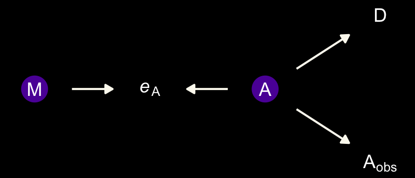
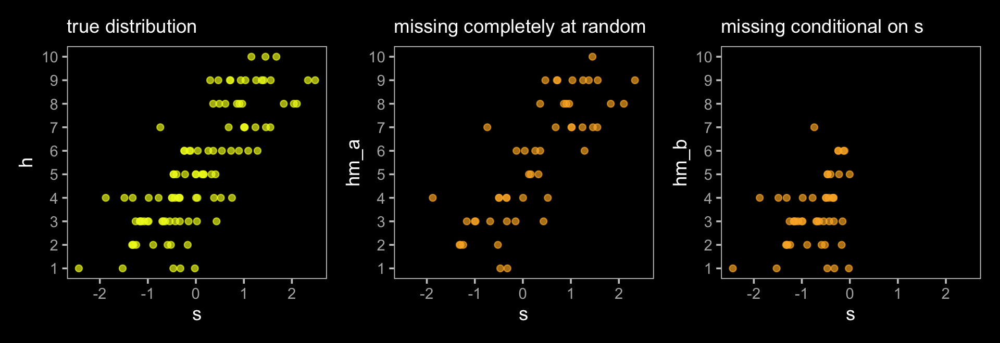
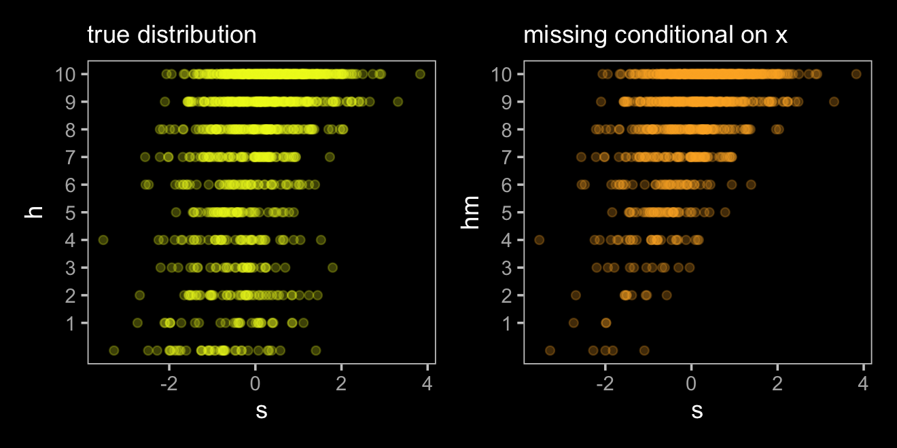
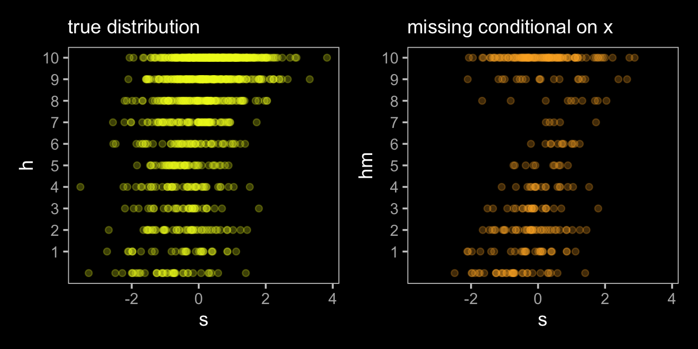
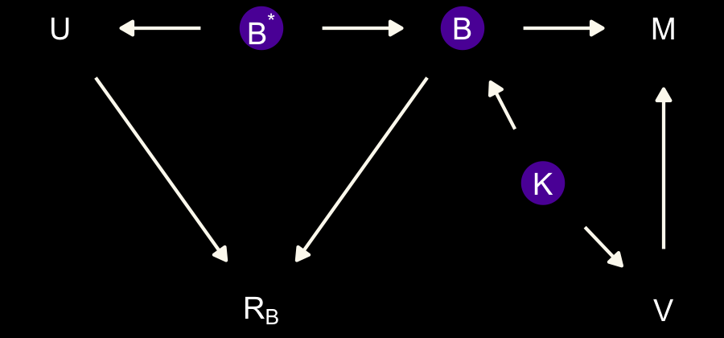
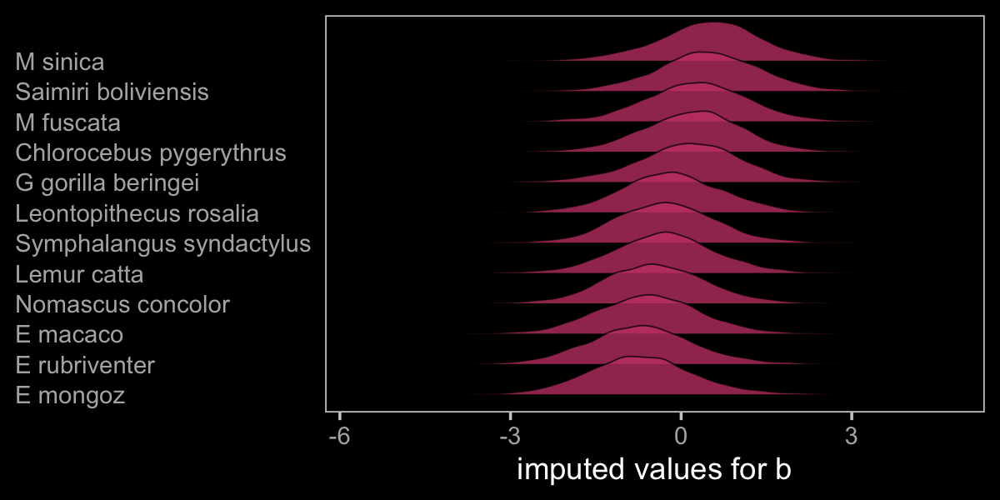
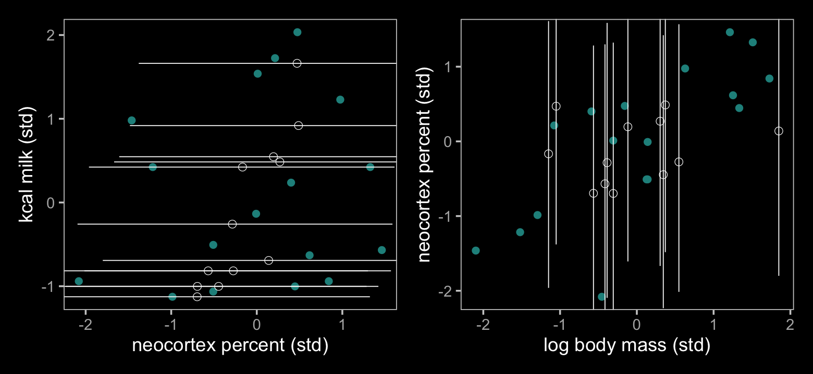
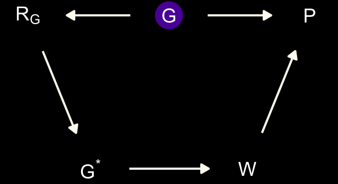

# Missing Data and Other Opportunities

For the opening example, we're playing with the conditional probability

$$
\Pr(\text{burnt down} | \text{burnt up}) = \frac{\Pr(\text{burnt up, burnt down})}{\Pr(\text{burnt up})}.
$$

Given McElreath's setup, it works out that

$$
\Pr(\text{burnt down} | \text{burnt up}) = \frac{1/3}{1/2} = \frac{2}{3}.
$$

We might express the math toward the bottom of page 489 in tibble form like this.


```r
library(tidyverse)

p_pancake <- 1/3
(
  d <-
    tibble(pancake = c("BB", "BU", "UU"),
           p_burnt = c(1, .5, 0)) %>% 
    mutate(p_burnt_up = p_burnt * p_pancake)
)
```

```
## # A tibble: 3 × 3
##   pancake p_burnt p_burnt_up
##   <chr>     <dbl>      <dbl>
## 1 BB          1        0.333
## 2 BU          0.5      0.167
## 3 UU          0        0
```

```r
d %>% 
  summarise(`p (burnt_down | burnt_up)` = p_pancake / sum(p_burnt_up))
```

```
## # A tibble: 1 × 1
##   `p (burnt_down | burnt_up)`
##                         <dbl>
## 1                       0.667
```

I understood McElreath's simulation (**R** code 15.1) better after breaking it apart. The first part of `sim_pancake()` takes one random draw from the integers 1, 2, and 3. It just so happens that if we set `set.seed(1)`, the code returns a 1.


```r
set.seed(1)
sample(x = 1:3, size = 1)
```

```
## [1] 1
```

So here's what it looks like if we use seeds `2:11`.


```r
take_sample <- function(seed) {
  set.seed(seed)
  sample(x = 1:3, size = 1)
}

tibble(seed = 2:11) %>% 
  mutate(value_returned = map_dbl(seed, take_sample))
```

```
## # A tibble: 10 × 2
##     seed value_returned
##    <int>          <dbl>
##  1     2              1
##  2     3              1
##  3     4              3
##  4     5              2
##  5     6              1
##  6     7              2
##  7     8              3
##  8     9              3
##  9    10              3
## 10    11              2
```

Each of those `value_returned` values stands for one of the three pancakes: 1 = BB, 2 = BU, and 3 = UU. In the next line, McElreath made slick use of a matrix to specify that. Here's what the matrix looks like.


```r
matrix(c(1, 1, 1, 0, 0, 0), nrow = 2, ncol = 3)
```

```
##      [,1] [,2] [,3]
## [1,]    1    1    0
## [2,]    1    0    0
```

See how the three columns are identified as `[,1]`, `[,2]`, and `[,3]`? If, say, we wanted to subset the values in the second column, we'd execute


```r
matrix(c(1, 1, 1, 0, 0, 0), nrow = 2, ncol = 3)[, 2]
```

```
## [1] 1 0
```

which returns a numeric vector.


```r
matrix(c(1, 1, 1, 0, 0, 0), nrow = 2, ncol = 3)[, 2] %>% str()
```

```
##  num [1:2] 1 0
```

That `1 0` corresponds to the pancake with one burnt (i.e., 1) and one unburnt (i.e., 0) side. So when McElreath then executed `sample(sides)`, he randomly sampled from one of those two values. In the case of `pancake == 2`, he randomly sampled one the pancake with one burnt and one unburnt side. Had he sampled from `pancake == 1`, he would have sampled from the pancake with both sides burnt.

Going forward, let's amend McElreath's `sim_pancake()` function so it will take a `seed` argument, which will allow us to make the output reproducible.


```r
# simulate a `pancake` and return randomly ordered `sides`
sim_pancake <- function(seed) {
  
  set.seed(seed)
  
  pancake <- sample(x = 1:3, size = 1)
  sides   <- matrix(c(1, 1, 1, 0, 0, 0), nrow = 2, ncol = 3)[, pancake]
  sample(sides)
  
}
```

Let's take this baby for a whirl.


```r
# how many simulations would you like?
n_sim <- 1e4

d <-
  tibble(seed = 1:n_sim) %>% 
  mutate(burnt = map(seed, sim_pancake)) %>% 
  unnest(burnt) %>% 
  mutate(side = rep(c("up", "down"), times = n() / 2))
```

Take a look at what we've done.


```r
head(d, n = 10)
```

```
## # A tibble: 10 × 3
##     seed burnt side 
##    <int> <dbl> <chr>
##  1     1     1 up   
##  2     1     1 down 
##  3     2     1 up   
##  4     2     1 down 
##  5     3     1 up   
##  6     3     1 down 
##  7     4     0 up   
##  8     4     0 down 
##  9     5     1 up   
## 10     5     0 down
```

Now we use `pivot_wider()` and `summarise()` to get the value we've been working for.


```r
d %>% 
  pivot_wider(names_from = side, values_from = burnt) %>% 
  summarise(`p (burnt_down | burnt_up)` = sum(up == 1 & down == 1) / (sum(up)))
```

```
## # A tibble: 1 × 1
##   `p (burnt_down | burnt_up)`
##                         <dbl>
## 1                       0.658
```

The results are within rounding error of the ideal 2/3.

> Probability theory is not difficult mathematically. It is just counting. But it is hard to interpret and apply. Doing so often seems to require some cleverness, and authors have an incentive to solve problems in clever ways, just to show off. But we don't need that cleverness, if we ruthlessly apply conditional probability....
>
> In this chapter, [we'll] meet two commonplace applications of this assume-and-deduce strategy. The first is the incorporation of **measurement error** into our models. The second is the estimation of **missing data** through **Bayesian imputation**....
>
> In neither application do [we] have to intuit the consequences of measurement errors nor the implications of missing values in order to design the models. All [we] have to do is state your information about the error or about the variables with missing values. Logic does the rest. [@mcelreathStatisticalRethinkingBayesian2020, p. 490, **emphasis** in the original]

## Measurement error

Let's grab those `WaffleDivorce` data from back in [Chapter 5][Spurious associations].


```r
data(WaffleDivorce, package = "rethinking")
d <- WaffleDivorce
rm(WaffleDivorce)
```

In anticipation of **R** code 15.3 and 15.5, wrangle the data a little.


```r
d <-
  d %>% 
  mutate(D_obs = (Divorce - mean(Divorce)) / sd(Divorce),
         D_sd  = Divorce.SE / sd(Divorce),
         M     = (Marriage - mean(Marriage)) / sd(Marriage),
         A     = (MedianAgeMarriage - mean(MedianAgeMarriage)) / sd(MedianAgeMarriage),
         M_obs = M,
         M_sd  = Marriage.SE / sd(Marriage))
```

For the plots in this chapter, we'll use the dark themes from the [**ggdark** package](https://CRAN.R-project.org/package=ggdark) [@R-ggdark]. Our primary theme will be `ggdark::dark_theme_bw()`. One way to use the `dark_theme_bw()` function is to make it part of the code for an individual plot, such as `ggplot() + geom_point() + dark_theme_bw()`. Another way is to make `dark_theme_bw()` the default setting with `ggplot2::theme_set()`. That will be our method.


```r
library(ggdark)

theme_set(
  dark_theme_bw() +
    theme(legend.position = "none",
          panel.grid = element_blank())
  )

# to reset the default ggplot2 theme to its default parameters, execute both:
# ggplot2::theme_set(theme_gray())
# ggdark::invert_geom_defaults()
```

For the rest of our color palette, we'll use colors from the [**viridis** package](https://github.com/sjmgarnier/viridis) [@R-viridis], which provides a variety of colorblind-safe color palettes [see @rudisViridisColorPalettes2018].


```r
library(viridis)
```

The `viridis_pal()` function gives a list of colors within a given palette. The colors in each palette fall on a spectrum. Within `viridis_pal()`, the `option` argument allows one to select a given spectrum, "C", in our case. The final parentheses, `()`, allows one to determine how many discrete colors one would like to break the spectrum up by. We'll choose 7.


```r
viridis_pal(option = "C")(7)
```

```
## [1] "#0D0887FF" "#5D01A6FF" "#9C179EFF" "#CC4678FF" "#ED7953FF" "#FDB32FFF" "#F0F921FF"
```

With a little data wrangling, we can put the colors of our palette in a tibble and display them in a plot.


```r
tibble(factor       = "a",
       number       = factor(1:7),
       color_number = str_c(1:7, ". ", viridis_pal(option = "C")(7))) %>% 
  
  ggplot(aes(x = factor, y = number)) +
  geom_tile(aes(fill = number)) +
  geom_text(aes(label = color_number, color = number %in% c("5", "6", "7"))) +
  scale_color_manual(values = c("black", "white")) +
  scale_fill_viridis(option = "C", discrete = T, direction = -1) +
  scale_x_discrete(NULL, breaks = NULL, expand = c(0, 0)) +
  scale_y_discrete(NULL, breaks = NULL, expand = c(0, 0)) +
  ggtitle("Behold: viridis C!")
```


Now, let's make use of our custom theme and reproduce/reimagine Figure 15.1.a.


```r
color <- viridis_pal(option = "C")(7)[7]

p1 <-
  d %>%
  ggplot(aes(x = MedianAgeMarriage, 
             y = Divorce,
             ymin = Divorce - Divorce.SE, 
             ymax = Divorce + Divorce.SE)) +
  geom_pointrange(shape = 20, alpha = 2/3, color = color) +
  labs(x = "Median age marriage" , 
       y = "Divorce rate")
```

Notice how `viridis_pal(option = "C")(7)[7]` called the seventh color in the color scheme, `"#F0F921FF"`. For Figure 15.1.b, we'll select the sixth color in the palette by coding `viridis_pal(option = "C")(7)[6]`. We'll then combine the two subplots with **patchwork**.


```r
color <- viridis_pal(option = "C")(7)[6]

p2 <-
  d %>%
  ggplot(aes(x = log(Population), 
             y = Divorce,
             ymin = Divorce - Divorce.SE, 
             ymax = Divorce + Divorce.SE)) +
  geom_pointrange(shape = 20, alpha = 2/3, color = color) +
  scale_y_continuous(NULL, breaks = NULL) +
  xlab("log population")

library(patchwork)
p1 | p2
```


Just like in the text, our plot shows states with larger populations tend to have smaller measurement error. The relation between measurement error and `MedianAgeMarriage` is less apparent.

#### Rethinking: Generative thinking, Bayesian inference.

> Bayesian models are *generative*, meaning they can be used to simulate observations just as well as they can be used to estimate parameters. One benefit of this fact is that a statistical model can be developed by thinking hard about how the data might have arisen. This includes sampling and measurement, as well as the nature of the process we are studying. Then let Bayesian updating discover the implications. (p. 491, *emphasis* in the original)

### Error on the outcome.

Now make a DAG of our data with **ggdag**.


```r
library(ggdag)

dag_coords <-
  tibble(name = c("A", "M", "D", "Dobs", "eD"),
         x    = c(1, 2, 2, 3, 4),
         y    = c(2, 3, 1, 1, 1))

dagify(M    ~ A,
       D    ~ A + M,
       Dobs ~ D + eD,
       coords = dag_coords) %>%
  tidy_dagitty() %>% 
  mutate(color = ifelse(name %in% c("D", "eD"), "a", "b")) %>% 
  
  ggplot(aes(x = x, y = y, xend = xend, yend = yend)) +
  geom_dag_point(aes(color = color),
                 size = 7, show.legend = F) +
  geom_dag_text(parse = T, label = c("A", "D", "M", expression(italic(e)[D]), expression(D[obs]))) +
  geom_dag_edges(edge_colour = "#FCF9F0") +
  scale_color_manual(values = c(viridis_pal(option = "C")(7)[2], "black")) +
  dark_theme_void()
```


Note our use of the `dark_theme_void()` function. But more to the substance of the matter,

> there's a lot going on here. But we can proceed one step at a time. The left triangle of this DAG is the same system that we worked with back in [Chapter 5][Think before you regress.]. Age at marriage ($A$) influences divorce ($D$) both directly and indirectly, passing through marriage rate ($M$). Then we have the observation model. The true divorce rate $D$ cannot be observed, so it is circled as an unobserved node. However we do get to observe  $D_\text{obs}$, which is a function of both the true rate $D$ and some unobserved error $e_\text{D}$. (p. 492)

To get a better sense of what we're about to do, imagine for a moment that each state's divorce rate is normally distributed with a mean of `Divorce` and standard deviation `Divorce.SE`. Those distributions would be like this.


```r
d %>% 
  mutate(Divorce_distribution = str_c("Divorce ~ Normal(", Divorce, ", ", Divorce.SE, ")")) %>% 
  select(Loc, Divorce_distribution) %>% 
  head()
```

```
##   Loc         Divorce_distribution
## 1  AL Divorce ~ Normal(12.7, 0.79)
## 2  AK Divorce ~ Normal(12.5, 2.05)
## 3  AZ Divorce ~ Normal(10.8, 0.74)
## 4  AR Divorce ~ Normal(13.5, 1.22)
## 5  CA    Divorce ~ Normal(8, 0.24)
## 6  CO Divorce ~ Normal(11.6, 0.94)
```

> Here's how to define the error distribution for each divorce rate. For each observed value $D_{\text{OBS},i}$, there will be one parameter, $D_{\text{TRUE},i}$, defined by:
>
> $$D_{\text{OBS},i} \sim \operatorname{Normal}(D_{\text{TRUE},i}, D_{\text{SE},i})$$
>
> All this does is define the measurement $D_{\text{OBS},i}$ as having the specified Gaussian distribution centered on the unknown parameter $D_{\text{TRUE},i}$. So the above defines a probability for each State $i$'s observed divorce rate, given a known measurement error. (p. 493)

Our model will follow the form

\begin{align*}
\color{#5D01A6FF}{\text{Divorce}_{\text{OBS}, i}} & \color{#5D01A6FF}\sim \color{#5D01A6FF}{\operatorname{Normal}(\text{Divorce}_{\text{TRUE}, i}, \text{Divorce}_{\text{SE}, i})} \\
\color{#5D01A6FF}{\text{Divorce}_{\text{TRUE}, i}} & \sim \operatorname{Normal}(\mu_i, \sigma) \\
\mu     & = \alpha + \beta_1 \text A_i + \beta_2 \text M_i \\
\alpha  & \sim \operatorname{Normal}(0, 0.2) \\
\beta_1 & \sim \operatorname{Normal}(0, 0.5) \\
\beta_2 & \sim \operatorname{Normal}(0, 0.5) \\
\sigma  & \sim \operatorname{Exponential}(1).
\end{align*}

Fire up **brms**.


```r
library(brms)
```

With **brms**, we accommodate measurement error in the criterion using the `mi()` syntax, following the general form `<response> | mi(<se_response>)`. This follows a missing data logic, resulting in Bayesian missing data imputation for the criterion values. The `mi()` syntax is based on the missing data capabilities for **brms**, which we will cover in greater detail in the second half of this chapter.


```r
# put the data into a `list()`
dlist <- list(
  D_obs = d$D_obs,
  D_sd  = d$D_sd,
  M     = d$M,
  A     = d$A)

b15.1 <- 
  brm(data = dlist, 
      family = gaussian,
      D_obs | mi(D_sd) ~ 1 + A + M,
      prior = c(prior(normal(0, 0.2), class = Intercept),
                prior(normal(0, 0.5), class = b),
                prior(exponential(1), class = sigma)),
      iter = 2000, warmup = 1000, cores = 4, chains = 4,
      seed = 15,
      # note this line
      save_pars = save_pars(latent = TRUE),
      file = "fits/b15.01")
```

Check the model summary.


```r
print(b15.1)
```

```
##  Family: gaussian 
##   Links: mu = identity; sigma = identity 
## Formula: D_obs | mi(D_sd) ~ 1 + A + M 
##    Data: dlist (Number of observations: 50) 
##   Draws: 4 chains, each with iter = 2000; warmup = 1000; thin = 1;
##          total post-warmup draws = 4000
## 
## Population-Level Effects: 
##           Estimate Est.Error l-95% CI u-95% CI Rhat Bulk_ESS Tail_ESS
## Intercept    -0.06      0.10    -0.25     0.13 1.00     5458     3312
## A            -0.62      0.16    -0.92    -0.31 1.00     3883     3367
## M             0.05      0.17    -0.28     0.37 1.00     3443     3102
## 
## Family Specific Parameters: 
##       Estimate Est.Error l-95% CI u-95% CI Rhat Bulk_ESS Tail_ESS
## sigma     0.59      0.11     0.40     0.82 1.00     1654     2060
## 
## Draws were sampled using sampling(NUTS). For each parameter, Bulk_ESS
## and Tail_ESS are effective sample size measures, and Rhat is the potential
## scale reduction factor on split chains (at convergence, Rhat = 1).
```

To return the summaries for the `D_true[i]` parameters, you might execute `posterior_summary(b15.1)` or `b15.1$fit`.


```r
posterior_summary(b15.1) %>% 
  round(digits = 2) %>% 
  data.frame()
```

```
##             Estimate Est.Error   Q2.5  Q97.5
## b_Intercept    -0.06      0.10  -0.25   0.13
## b_A            -0.62      0.16  -0.92  -0.31
## b_M             0.05      0.17  -0.28   0.37
## sigma           0.59      0.11   0.40   0.82
## Yl[1]           1.17      0.37   0.49   1.90
## Yl[2]           0.68      0.54  -0.36   1.75
## Yl[3]           0.43      0.33  -0.22   1.09
## Yl[4]           1.40      0.45   0.54   2.30
## Yl[5]          -0.90      0.13  -1.15  -0.65
## Yl[6]           0.65      0.40  -0.13   1.41
## Yl[7]          -1.37      0.36  -2.10  -0.68
## Yl[8]          -0.34      0.48  -1.29   0.56
## Yl[9]          -1.89      0.60  -3.05  -0.69
## Yl[10]         -0.62      0.16  -0.94  -0.30
## Yl[11]          0.77      0.28   0.21   1.33
## Yl[12]         -0.56      0.48  -1.53   0.35
## Yl[13]          0.17      0.50  -0.81   1.15
## Yl[14]         -0.87      0.23  -1.33  -0.42
## Yl[15]          0.55      0.29  -0.01   1.14
## Yl[16]          0.28      0.38  -0.48   1.05
## Yl[17]          0.50      0.42  -0.34   1.30
## Yl[18]          1.26      0.35   0.59   1.93
## Yl[19]          0.43      0.37  -0.28   1.15
## Yl[20]          0.39      0.53  -0.58   1.45
## Yl[21]         -0.55      0.31  -1.14   0.05
## Yl[22]         -1.11      0.26  -1.62  -0.59
## Yl[23]         -0.27      0.26  -0.77   0.23
## Yl[24]         -1.00      0.30  -1.60  -0.41
## Yl[25]          0.43      0.41  -0.36   1.25
## Yl[26]         -0.03      0.32  -0.65   0.59
## Yl[27]         -0.02      0.52  -1.06   1.03
## Yl[28]         -0.15      0.40  -0.96   0.61
## Yl[29]         -0.26      0.50  -1.19   0.75
## Yl[30]         -1.80      0.23  -2.26  -1.33
## Yl[31]          0.16      0.43  -0.68   1.02
## Yl[32]         -1.66      0.16  -1.99  -1.34
## Yl[33]          0.12      0.24  -0.36   0.59
## Yl[34]         -0.06      0.51  -1.08   0.90
## Yl[35]         -0.13      0.23  -0.58   0.33
## Yl[36]          1.28      0.42   0.46   2.15
## Yl[37]          0.23      0.35  -0.44   0.92
## Yl[38]         -1.03      0.22  -1.45  -0.60
## Yl[39]         -0.91      0.54  -1.95   0.18
## Yl[40]         -0.68      0.33  -1.33  -0.03
## Yl[41]          0.24      0.56  -0.86   1.37
## Yl[42]          0.74      0.35   0.06   1.45
## Yl[43]          0.19      0.18  -0.17   0.56
## Yl[44]          0.80      0.42  -0.03   1.60
## Yl[45]         -0.40      0.51  -1.37   0.63
## Yl[46]         -0.39      0.26  -0.91   0.12
## Yl[47]          0.13      0.30  -0.46   0.71
## Yl[48]          0.56      0.47  -0.35   1.49
## Yl[49]         -0.64      0.28  -1.19  -0.11
## Yl[50]          0.86      0.58  -0.30   1.99
## lprior         -1.37      0.46  -2.47  -0.73
## lp__          -78.16      6.55 -91.61 -66.09
```

Our rows `Yl[1]` through `Yl[50]` correspond to what **rethinking** named `D_true[1]` through `D_true[50]`. Here's the code for our Figure 15.2.a.


```r
library(ggrepel)

states <- c("AL", "AR", "ME", "NH", "RI", "DC", "VT", "AK", "SD", "UT", "ID", "ND", "WY")

d_est <-
  posterior_summary(b15.1) %>% 
  data.frame() %>% 
  rownames_to_column("term") %>% 
  mutate(D_est = Estimate) %>% 
  select(term, D_est) %>% 
  filter(str_detect(term, "Yl")) %>% 
  bind_cols(d)

color <- viridis_pal(option = "C")(7)[5]

p1 <-
  d_est %>%
  ggplot(aes(x = D_sd, y = D_est - D_obs)) +
  geom_hline(yintercept = 0, linetype = 2, color = "white") +
  geom_point(alpha = 2/3, color = color) +
  geom_text_repel(data = . %>% filter(Loc %in% states),  
                  aes(label = Loc), 
                  size = 3, seed = 15, color = "white") 
```

We'll use a little `as_draws_df()` + `expand_grid()` magic to help with our version of Figure 15.2.b.


```r
library(tidybayes)

states <- c("AR", "ME", "RI", "ID", "WY", "ND", "MN")

color <- viridis_pal(option = "C")(7)[4]

p2 <-
  as_draws_df(b15.1) %>% 
  expand_grid(A = seq(from = -3.5, to = 3.5, length.out = 50)) %>% 
  mutate(fitted = b_Intercept + b_A * A) %>% 
  
  ggplot(aes(x = A)) +
  stat_lineribbon(aes(y = fitted),
                  .width = .95, size = 1/3, color = "grey50", fill = "grey20") +
  geom_segment(data = d_est,
               aes(xend = A, y = D_obs, yend = D_est),
               linewidth = 1/5) +
  geom_point(data = d_est,
             aes(y = D_obs),
             color = color) +
  geom_point(data = d_est,
             aes(y = D_est),
             shape = 1, stroke = 1/3) +
  geom_text_repel(data = d %>% filter(Loc %in% states),  
                  aes(y = D_obs, label = Loc), 
                  size = 3, seed = 15, color = "white") +
  labs(x = "median age marriage (std)",
       y = "divorce rate (std)") +
  coord_cartesian(xlim = range(d$A), 
                  ylim = range(d$D_obs))
```

Now combine the two ggplots and plot.


```r
p1 | p2
```


If you look closely, our plot on the left is flipped relative to the one in the text. I'm pretty sure my code is correct, which leaves me to believe McElreath accidentally flipped the ordering in his code and made his $y$-axis 'D_obs - D_est.' Happily, our plot on the right matches up nicely with the one in the text.

### Error on both outcome and predictor.

Now we update the DAG to account for measurement error in the predictor.


```r
dag_coords <-
  tibble(name = c("A", "M", "Mobs", "eM", "D", "Dobs", "eD"),
         x    = c(1, 2, 3, 4, 2, 3, 4),
         y    = c(2, 3, 3, 3, 1, 1, 1))

dagify(M    ~ A,
       D    ~ A + M,
       Mobs ~ M + eM,
       Dobs ~ D + eD,
       coords = dag_coords) %>%
  tidy_dagitty() %>% 
  mutate(color = ifelse(name %in% c("A", "Mobs", "Dobs"), "b", "a")) %>% 
  
  ggplot(aes(x = x, y = y, xend = xend, yend = yend)) +
  geom_dag_point(aes(color = color),
                 size = 7, show.legend = F) +
  geom_dag_text(parse = T, label = c("A", "D", "M", 
                                     expression(italic(e)[D]), expression(italic(e)[M]), 
                                     expression(D[obs]), expression(M[obs]))) +
  geom_dag_edges(edge_colour = "#FCF9F0") +
  scale_color_manual(values = c(viridis_pal(option = "C")(7)[2], "black")) +
  dark_theme_void()
```


We will express this DAG in an augmented statistical model following the form

\begin{align*}
\text{Divorce}_{\text{OBS}, i}  & \sim \operatorname{Normal}(\text{Divorce}_{\text{TRUE}, i}, \text{Divorce}_{\text{SE}, i}) \\
\text{Divorce}_{\text{TRUE}, i} & \sim \operatorname{Normal}(\mu_i, \sigma) \\
\mu_i & = \alpha + \beta_1 \text A_i + \beta_2 \color{#5D01A6FF}{\text{Marriage}_{\text{TRUE}, i}} \\
\color{#5D01A6FF}{\text{Marriage}_{\text{OBS}, i}} & \color{#5D01A6FF}\sim \color{#5D01A6FF}{\operatorname{Normal}(\text{Marriage}_{\text{TRUE}, i}, \text{Marriage}_{\text{SE}, i})} \\
\color{#5D01A6FF}{\text{Marriage}_{\text{TRUE}, i}} & \color{#5D01A6FF}\sim \color{#5D01A6FF}{\operatorname{Normal}(0, 1)} \\
\alpha  & \sim \operatorname{Normal}(0, 0.2) \\
\beta_1 & \sim \operatorname{Normal}(0, 0.5) \\
\beta_2 & \sim \operatorname{Normal}(0, 0.5) \\
\sigma  & \sim \operatorname{Exponential}(1).
\end{align*}

The current version **brms** allows users to specify error on predictors with an `me()` statement in the form of `me(predictor, sd_predictor)` where `sd_predictor` is a vector in the data denoting the size of the measurement error, presumed to be in a standard-deviation metric.


```r
# put the data into a `list()`
dlist <- list(
  D_obs = d$D_obs,
  D_sd  = d$D_sd,
  M_obs = d$M_obs,
  M_sd  = d$M_sd,
  A     = d$A)

b15.2 <- 
  brm(data = dlist, 
      family = gaussian,
      D_obs | mi(D_sd) ~ 1 + A + me(M_obs, M_sd),
      prior = c(prior(normal(0, 0.2), class = Intercept),
                prior(normal(0, 0.5), class = b),
                prior(normal(0, 1), class = meanme),
                prior(exponential(1), class = sigma)),
      iter = 2000, warmup = 1000, cores = 4, chains = 4,
      seed = 15,
      # note this line
      save_pars = save_pars(latent = TRUE),
      file = "fits/b15.02")
```


We'll use `posterior_summary()`, again, to get a sense of those `depth=2` summaries.


```r
posterior_summary(b15.2) %>%
 round(digits = 2)
```

Due to space concerns, I'm not going to show the results, here. You can do that on your own. Basically, now in addition to the posterior summaries for the `Yl[i]` parameters (what McElreath called $D_{\text{TRUE}, i}$), we now get posterior summaries for `Xme_meM_obs[i]` (what McElreath called $M_{\text{TRUE}, i}$). Note that you'll need to specify `save_pars = save_pars(latent = TRUE)` in the `brm()` function in order to save the posterior samples of error-adjusted variables obtained by using the `me()` argument. Without doing so, functions like `predict()` may give you trouble. Here's our version of Figure 15.3.


```r
color_y <- viridis_pal(option = "C")(7)[7]
color_p <- viridis_pal(option = "C")(7)[2]

# wrangle
full_join(
  # D
  tibble(Loc   = d %>% pull(Loc),
         D_obs = d %>% pull(D_obs),
         D_est = posterior_summary(b15.2) %>% 
           data.frame() %>% 
           rownames_to_column("term") %>% 
           filter(str_detect(term, "Yl")) %>% 
           pull(Estimate)) %>% 
    pivot_longer(-Loc, values_to = "d") %>% 
    mutate(name = if_else(name == "D_obs", "observed", "posterior")),
  # M
  tibble(Loc   = d %>% pull(Loc),
         M_obs = d %>% pull(M_obs),
         M_est = posterior_summary(b15.2) %>% 
           data.frame() %>% 
           rownames_to_column("term") %>% 
           filter(str_detect(term, "Xme_")) %>% 
           pull(Estimate)) %>% 
    pivot_longer(-Loc, values_to = "m") %>% 
    mutate(name = if_else(name == "M_obs", "observed", "posterior")),
  by = c("Loc", "name")
)  %>% 
  
  # plot!
  ggplot(aes(x = m, y = d)) +
  geom_line(aes(group = Loc),
            linewidth = 1/4) +
  geom_point(aes(color = name)) +
  scale_color_manual(values = c(color_p, color_y)) +
  labs(subtitle = "Shrinkage of both divorce rate and marriage rate", 
       x = "Marriage rate (std)" , 
       y = "Divorce rate (std)")
```


The yellow points are model-implied; the purple ones are of the original data. It turns out our **brms** model regularized just a little more aggressively than McElreath's **rethinking** model.

Anyway,

> The big take home point for this section is that when you have a distribution of values, don't reduce it down to a single value to use in a regression. Instead, use the entire distribution. Anytime we use an average value, discarding the uncertainty around that average, we risk overconfidence and spurious inference. This doesn't only apply to measurement error, but also to cases in which data are averaged before analysis. (p. 497)

### Measurement terrors.

McElreath invited us to consider a few more DAGs. The first is an instance where both sources of measurement error have a common cause, $P$.


```r
dag_coords <-
  tibble(name = c("A", "M", "Mobs", "eM", "D", "Dobs", "eD", "P"),
         x    = c(1, 2, 3, 4, 2, 3, 4, 5),
         y    = c(2, 3, 3, 3, 1, 1, 1, 2))

dagify(M    ~ A,
       D    ~ A + M,
       Mobs ~ M + eM,
       Dobs ~ D + eD,
       eM   ~ P,
       eD   ~ P,
       coords = dag_coords) %>%
  tidy_dagitty() %>% 
  mutate(color = ifelse(name %in% c("A", "Mobs", "Dobs", "P"), "b", "a")) %>% 
  
  ggplot(aes(x = x, y = y, xend = xend, yend = yend)) +
  geom_dag_point(aes(color = color),
                 size = 7, show.legend = F) +
  geom_dag_text(parse = T, label = c("A", "D", "M", "P", 
                                     expression(italic(e)[D]), expression(italic(e)[M]), 
                                     expression(D[obs]), expression(M[obs]))) +
  geom_dag_edges(edge_colour = "#FCF9F0") +
  scale_color_manual(values = c(viridis_pal(option = "C")(7)[2], "black")) +
  dark_theme_void()
```


The second instance is when the true marriage rate $M$ has a causal effect on the measurement error for Divorce, $e_\text{D}$.


```r
dag_coords <-
  tibble(name = c("A", "M", "Mobs", "eM", "D", "Dobs", "eD"),
         x    = c(1, 2, 3, 4, 2, 3, 4),
         y    = c(2, 3, 3, 3, 1, 1, 1))

dagify(M    ~ A,
       D    ~ A + M,
       Mobs ~ M + eM,
       Dobs ~ D + eD,
       eD   ~ M,
       coords = dag_coords) %>%
  tidy_dagitty() %>% 
  mutate(color = ifelse(name %in% c("A", "Mobs", "Dobs"), "b", "a")) %>% 
  
  ggplot(aes(x = x, y = y, xend = xend, yend = yend)) +
  geom_dag_point(aes(color = color),
                 size = 7, show.legend = F) +
  geom_dag_text(parse = T, label = c("A", "D", "M", 
                                     expression(italic(e)[D]), expression(italic(e)[M]), 
                                     expression(D[obs]), expression(M[obs]))) +
  geom_dag_edges(edge_colour = "#FCF9F0") +
  scale_color_manual(values = c(viridis_pal(option = "C")(7)[2], "black")) +
  dark_theme_void()
```


The final example is when we have negligible measurement error for $M$ and $D$, but known nonignorable measurement error for the causal variable $A$.


```r
dag_coords <-
  tibble(name = c("eA", "Aobs", "A", "M", "D"),
         x    = c(1, 2, 3, 4, 4),
         y    = c(2, 2, 2, 3, 1))

dagify(Aobs ~ A + eA,
       M    ~ A,
       D    ~ A,
       coords = dag_coords) %>%
  tidy_dagitty() %>% 
  mutate(color = ifelse(name %in% c("A", "eA"), "a", "b")) %>% 
  
  ggplot(aes(x = x, y = y, xend = xend, yend = yend)) +
  geom_dag_point(aes(color = color),
                 size = 7, show.legend = F) +
  geom_dag_text(parse = T, label = c("A", expression(italic(e)[A]), expression(A[obs]), "D", "M")) +
  geom_dag_edges(edge_colour = "#FCF9F0") +
  scale_color_manual(values = c(viridis_pal(option = "C")(7)[2], "black")) +
  dark_theme_void()
```



On page 498, we read:

> In this circumstance, it can happen that a naive regression of $D$ on $A_\text{obs}$ and $M$ will strongly suggest that $M$ influences $D$. The reason is that $M$ contains information about the true $A$. And $M$ is measured more precisely than $A$ is. It's like a proxy $A$. Here's a small simulation you can toy with that will produce such a frustration:


```r
n <- 500

set.seed(15)

dat <-
  tibble(A = rnorm(n, mean = 0, sd = 1)) %>% 
  mutate(M     = rnorm(n, mean = -A, sd = 1),
         D     = rnorm(n, mean =  A, sd = 1),
         A_obs = rnorm(n, mean =  A, sd = 1))
```

To get a sense of the havoc ignoring measurement error can cause, we'll fit to models. These aren't in the text, but, you know, let's live a little. The first model will include `A`, the true predictor for `D`. The second model will include `A_obs` instead, the version of `A` with measurement error added in.


```r
# the model with A containing no measurement error
b15.2b <- 
  brm(data = dat, 
      family = gaussian,
      D ~ 1 + A + M,
      prior = c(prior(normal(0, 0.2), class = Intercept),
                prior(normal(0, 0.5), class = b),
                prior(exponential(1), class = sigma)),
      iter = 2000, warmup = 1000, cores = 4, chains = 4,
      seed = 15,
      # note this line
      save_pars = save_pars(latent = TRUE),
      file = "fits/b15.02b")

# The model where A has measurement error, but we ignore it
b15.2c <- 
  brm(data = dat, 
      family = gaussian,
      D ~ 1 + A_obs + M,
      prior = c(prior(normal(0, 0.2), class = Intercept),
                prior(normal(0, 0.5), class = b),
                prior(exponential(1), class = sigma)),
      iter = 2000, warmup = 1000, cores = 4, chains = 4,
      seed = 15,
      # note this line
      save_pars = save_pars(latent = TRUE),
      file = "fits/b15.02c")
```

Check the summaries.


```r
print(b15.2b)
```

```
##  Family: gaussian 
##   Links: mu = identity; sigma = identity 
## Formula: D ~ 1 + A + M 
##    Data: dat (Number of observations: 500) 
##   Draws: 4 chains, each with iter = 2000; warmup = 1000; thin = 1;
##          total post-warmup draws = 4000
## 
## Population-Level Effects: 
##           Estimate Est.Error l-95% CI u-95% CI Rhat Bulk_ESS Tail_ESS
## Intercept     0.01      0.04    -0.08     0.09 1.00     3767     2809
## A             0.89      0.06     0.78     1.02 1.00     3063     2879
## M            -0.04      0.04    -0.13     0.04 1.00     3258     2643
## 
## Family Specific Parameters: 
##       Estimate Est.Error l-95% CI u-95% CI Rhat Bulk_ESS Tail_ESS
## sigma     1.00      0.03     0.95     1.07 1.00     3831     2972
## 
## Draws were sampled using sampling(NUTS). For each parameter, Bulk_ESS
## and Tail_ESS are effective sample size measures, and Rhat is the potential
## scale reduction factor on split chains (at convergence, Rhat = 1).
```

```r
print(b15.2c)
```

```
##  Family: gaussian 
##   Links: mu = identity; sigma = identity 
## Formula: D ~ 1 + A_obs + M 
##    Data: dat (Number of observations: 500) 
##   Draws: 4 chains, each with iter = 2000; warmup = 1000; thin = 1;
##          total post-warmup draws = 4000
## 
## Population-Level Effects: 
##           Estimate Est.Error l-95% CI u-95% CI Rhat Bulk_ESS Tail_ESS
## Intercept     0.05      0.05    -0.05     0.15 1.00     3496     2708
## A_obs         0.29      0.04     0.22     0.37 1.00     3357     2843
## M            -0.35      0.04    -0.43    -0.27 1.00     3219     2478
## 
## Family Specific Parameters: 
##       Estimate Est.Error l-95% CI u-95% CI Rhat Bulk_ESS Tail_ESS
## sigma     1.14      0.04     1.07     1.22 1.00     3986     3058
## 
## Draws were sampled using sampling(NUTS). For each parameter, Bulk_ESS
## and Tail_ESS are effective sample size measures, and Rhat is the potential
## scale reduction factor on split chains (at convergence, Rhat = 1).
```

Model `b15.2b`, where `A` contains no measurement error, comes close to reproducing the data-generating parameters. The second model, `b15.2c`, which used `A` infused with measurement error (i.e., `A_obs`), is a disaster. A coefficient plot might help the comparison.


```r
# for annotation
text <-
  tibble(fit      = "b15.2b",
         term     = "beta[0]",
         Estimate = fixef(b15.2b, probs = .99)["Intercept", 3],
         label    = "In this plot, we like the yellow posteriors.")

# wrangle
bind_rows(posterior_summary(b15.2b) %>% data.frame() %>% rownames_to_column("term"),
          posterior_summary(b15.2c) %>% data.frame() %>% rownames_to_column("term")) %>% 
  filter(term != "lp__") %>% 
  filter(term != "lprior") %>% 
  mutate(term = rep(c(str_c("beta[", 0:2, "]"), "sigma"), times = 2),
         fit  = rep(c("b15.2b", "b15.2c"), each = n() / 2)) %>% 
  
  # plot!
  ggplot(aes(x = Estimate, y = fit)) +
  geom_vline(xintercept = 0, linetype = 3, alpha = 1/2) +
  geom_pointrange(aes(xmin = Q2.5, xmax = Q97.5, color = fit)) +
  geom_text(data = text,
            aes(label = label),
            hjust = 0, color = color_y) +
  scale_color_manual(values = c(color_y, "white")) +
  labs(x = "marginal posterior",
       y = NULL) +
  theme(axis.ticks.y = element_blank(),
        strip.background = element_rect(color = "transparent", fill = "transparent")) +
  facet_wrap(~ term, labeller = label_parsed, ncol = 1)
```


## Missing data

> With measurement error, the insight is to realize that any uncertain piece of data can be replaced by a distribution that reflects uncertainty. But sometimes data are simply missing--no measurement is available at all. At first, this seems like a lost cause. What can be done when there is no measurement at all, not even one with error?...

> So what can we do instead? We can think causally about missingness, and we can use
the model to **impute** missing values. A generative model tells you whether the process that
produced the missing values will also prevent the identification of causal effects. (p. 499, **emphasis** in the original)

Starting with [version 2.2.0](https://cran.r-project.org/package=brms/news/news.html), **brms** supports Bayesian missing data imputation using adaptations of the [multivariate syntax](https://cran.r-project.org/package=brms/vignettes/brms_multivariate.html) [@Bürkner2022Multivariate]. Bürkner's [-@Bürkner2022HandleMissingValues] vignette, [*Handle missing values with brms*](https://cran.r-project.org/package=brms/vignettes/brms_missings.html), can provide a nice overview.

#### Rethinking: Missing data are meaningful data.

> The fact that a variable has an unobserved value is still an observation. It is data, just with a very special value. The meaning of this value depends upon the context. Consider for example a questionnaire on personal income. If some people refuse to fill in their income, this may be associated with low (or high) income. Therefore a model that tries to predict the missing values can be enlightening. (p. 499)

### DAG ate my homework.

We'll start this section off with our version of Figure 15.4. It's going to take a bit of effort on our part to make a nice representation those four DAGs. Here we make panels a, b, and d.


```r
# panel a
dag_coords <-
  tibble(name = c("S", "H", "Hs", "D"),
         x    = c(1, 2, 2, 1),
         y    = c(2, 2, 1, 1))

p1 <-
  dagify(H  ~ S,
         Hs ~ H + D,
         coords = dag_coords) %>%
  tidy_dagitty() %>% 
  mutate(color = ifelse(name == "H", "a", "b")) %>% 
  
  ggplot(aes(x = x, y = y, xend = xend, yend = yend)) +
  geom_dag_point(aes(color = color),
                 size = 7, show.legend = F) +
  geom_dag_text(label = c("D", "H", "S", "H*")) +
  geom_dag_edges(edge_colour = "#FCF9F0")

# panel b
p2 <-
  dagify(H  ~ S,
         Hs ~ H + D,
         D  ~ S,
         coords = dag_coords) %>%
  tidy_dagitty() %>% 
  mutate(color = ifelse(name == "H", "a", "b")) %>% 
  
  ggplot(aes(x = x, y = y, xend = xend, yend = yend)) +
  geom_dag_point(aes(color = color),
                 size = 7, show.legend = F) +
  geom_dag_text(label = c("D", "H", "S", "H*")) +
  geom_dag_edges(edge_colour = "#FCF9F0")

# panel d
p4 <-
  dagify(H  ~ S,
         Hs ~ H + D,
         D  ~ H,
         coords = dag_coords) %>%
  tidy_dagitty() %>% 
  mutate(color = ifelse(name == "H", "a", "b")) %>% 
  
  ggplot(aes(x = x, y = y, xend = xend, yend = yend)) +
  geom_dag_point(aes(color = color),
                 size = 7, show.legend = F) +
  geom_dag_text(label = c("D", "H", "S", "H*")) +
  geom_dag_edges(edge_colour = "#FCF9F0")
```

Make panel c.


```r
dag_coords <-
  tibble(name = c("S", "H", "Hs", "D", "X"),
         x    = c(1, 2, 2, 1, 1.5),
         y    = c(2, 2, 1, 1, 1.5))

p3 <-
  dagify(H  ~ S + X,
         Hs ~ H + D,
         D  ~ X,
         coords = dag_coords) %>%
  tidy_dagitty() %>% 
  mutate(color = ifelse(name %in% c("H", "X"), "a", "b")) %>% 
  
  ggplot(aes(x = x, y = y, xend = xend, yend = yend)) +
  geom_dag_point(aes(color = color),
                 size = 7, show.legend = F) +
  geom_dag_text(label = c("D", "H", "S", "X", "H*")) +
  geom_dag_edges(edge_colour = "#FCF9F0")
```

Now combine, adjust a little, and plot.


```r
(p1 + p2 + p3 + p4) +
  plot_annotation(tag_levels = "a", tag_prefix = "(", tag_suffix = ")") &
  scale_color_manual(values = c(viridis_pal(option = "C")(7)[2], "black")) &
  dark_theme_void() +
  theme(panel.background = element_rect(fill = "grey8"),
        plot.margin = margin(0.15, 0.15, 0.15, 0.15, "in"))
```


On page 500, we read:

> Consider a sample of students, all of whom own dogs. The students produce homework ($H$). This homework varies in quality, influenced by how much each student studies ($S$). We could simulate 100 students, their attributes, and their homework like this:


```r
n <- 100

set.seed(15)

d <-
  tibble(s = rnorm(n, mean = 0, sd = 1)) %>% 
  mutate(h   = rbinom(n, size = 10, inv_logit_scaled(s)),
         d_a = rbinom(n, size = 1, prob = .5),
         d_b = ifelse(s > 0, 1, 0)) %>%
  mutate(hm_a = ifelse(d_a == 1, NA, h),
         hm_b = ifelse(d_b == 1, NA, h))

d
```

```
## # A tibble: 100 × 6
##          s     h   d_a   d_b  hm_a  hm_b
##      <dbl> <int> <int> <dbl> <int> <int>
##  1  0.259      6     0     1     6    NA
##  2  1.83       8     0     1     8    NA
##  3 -0.340      4     0     0     4     4
##  4  0.897      6     1     1    NA    NA
##  5  0.488      8     1     1    NA    NA
##  6 -1.26       3     1     0    NA     3
##  7  0.0228     3     1     1    NA    NA
##  8  1.09       6     1     1    NA    NA
##  9 -0.132      6     0     0     6     6
## 10 -1.08       3     1     0    NA     3
## # … with 90 more rows
```

In that code block, we simulated the data corresponding to McElreath's **R** code 15.8 through 15.10. We have two `d` and `hm` variables. `d_a` and `hm_a` correspond to McElreath's **R** code 15.9 and the DAG in panel a. `d_b` and `hm_b` correspond to McElreath's **R** code 15.10 and the DAG in panel b.

This wasn't in the text, but here we'll plot `h`, `hm_a`, and `hm_b` to get a sense of how the first two missing data examples compare to the original data.


```r
p1 <-
  d %>% 
  ggplot(aes(x = s, y = h)) + 
  geom_point(color = viridis_pal(option = "C")(7)[7], alpha = 2/3) +
  scale_y_continuous(breaks = 1:10) +
  labs(subtitle = "true distribution")

p2 <-
  d %>% 
  ggplot(aes(x = s, y = hm_a)) + 
  geom_point(color = viridis_pal(option = "C")(7)[6], alpha = 2/3) +
  scale_y_continuous(breaks = 1:10) +
  labs(subtitle = "missing completely at random")

p3 <-
  d %>% 
  ggplot(aes(x = s, y = hm_b)) + 
  geom_point(color = viridis_pal(option = "C")(7)[6], alpha = 2/3) +
  scale_y_continuous(breaks = 1:10, limits = c(1, 10)) +
  labs(subtitle = "missing conditional on s")

p1 + p2 + p3
```



The left panel is the ideal situation letting us learn what we want to know, what is the effect of studying on the grade you'll get on your homework ($S \rightarrow H$). Once we enter in a missing data process (i.e., dogs $D$ eating homework), we end up with $H^*$, the homework left over after the dogs. Thus the homework outcomes we collect are a combination of the full set of homework and the hungry dogs. The middle panel depicts the scenario where the dogs eat the homework completely at random, $H \rightarrow H^* \leftarrow D$. In the right panel, we consider a scenario where the dogs only and always eat the homework on the occasions the students studied more than average, $H \rightarrow H^* \leftarrow D \leftarrow S$.

The situation in the third DAG is more complicated. Now homework is conditional on both studying and how noisy it is in a students home, $X$. Also, our new variable $X$ isn't measured and whether the dogs eat the homework is also conditional on that unmeasured $X$. Here's the new data simulation.


```r
n <- 1000

set.seed(501)

d <-
  tibble(x = rnorm(n, mean = 0, sd = 1),
         s = rnorm(n, mean = 0, sd = 1)) %>% 
  mutate(h = rbinom(n, size = 10, inv_logit_scaled(2 + s - 2 * x)),
         d = ifelse(x > 1, 1, 0)) %>%
  mutate(hm = ifelse(d == 1, NA, h))

d
```

```
## # A tibble: 1,000 × 5
##          x      s     h     d    hm
##      <dbl>  <dbl> <int> <dbl> <int>
##  1  0.577   1.15     10     0    10
##  2  0.617  -0.786     7     0     7
##  3  0.452   0.958     9     0     9
##  4  0.226   0.754     8     0     8
##  5 -0.845   0.689    10     0    10
##  6 -1.43    0.176    10     0    10
##  7 -1.65    0.280    10     0    10
##  8  0.0356 -0.397     8     0     8
##  9  0.184   0.261     7     0     7
## 10  1.22   -1.01      2     1    NA
## # … with 990 more rows
```

Those data look like this.


```r
p1 <-
  d %>% 
  ggplot(aes(x = s, y = h)) + 
  geom_point(color = viridis_pal(option = "C")(7)[7], alpha = 1/4) +
  scale_y_continuous(breaks = 1:10) +
  labs(subtitle = "true distribution")

p2 <-
  d %>% 
  ggplot(aes(x = s, y = hm)) + 
  geom_point(color = viridis_pal(option = "C")(7)[6], alpha = 1/4) +
  scale_y_continuous(breaks = 1:10) +
  labs(subtitle = "missing conditional on x")

p1 + p2
```



Fit the model using the data with no missingness.


```r
b15.3 <-
  brm(data = d,
      family = binomial,
      h | trials(10) ~ 1 + s,
      prior = c(prior(normal(0, 1), class = Intercept),
                prior(normal(0, 0.5), class = b)),
      iter = 2000, warmup = 1000, chains = 4, cores = 4,
      seed = 15,
      file = "fits/b15.03")
```

Check the results.


```r
print(b15.3)
```

```
##  Family: binomial 
##   Links: mu = logit 
## Formula: h | trials(10) ~ 1 + s 
##    Data: d (Number of observations: 1000) 
##   Draws: 4 chains, each with iter = 2000; warmup = 1000; thin = 1;
##          total post-warmup draws = 4000
## 
## Population-Level Effects: 
##           Estimate Est.Error l-95% CI u-95% CI Rhat Bulk_ESS Tail_ESS
## Intercept     1.11      0.02     1.07     1.16 1.00     2773     2809
## s             0.69      0.03     0.64     0.74 1.00     2422     2162
## 
## Draws were sampled using sampling(NUTS). For each parameter, Bulk_ESS
## and Tail_ESS are effective sample size measures, and Rhat is the potential
## scale reduction factor on split chains (at convergence, Rhat = 1).
```

Since this is not the data-generating model, we shouldn't be all that surprised the coefficient for `s` is off (it should be 1). Because this is an example of where we didn't collect data on $X$, we can think of our incorrect results as a case of **omitted variable bias**. Here's what happens when we run the model on `hm`, the homework variable after the hungry dogs got to it.


```r
b15.4 <-
  brm(data = d %>% filter(d == 0),
      family = binomial,
      h | trials(10) ~ 1 + s,
      prior = c(prior(normal(0, 1), class = Intercept),
                prior(normal(0, 0.5), class = b)),
      iter = 2000, warmup = 1000, chains = 4, cores = 4,
      seed = 15,
      file = "fits/b15.04")
```

Check the results.


```r
print(b15.4)
```

```
##  Family: binomial 
##   Links: mu = logit 
## Formula: h | trials(10) ~ 1 + s 
##    Data: d %>% filter(d == 0) (Number of observations: 820) 
##   Draws: 4 chains, each with iter = 2000; warmup = 1000; thin = 1;
##          total post-warmup draws = 4000
## 
## Population-Level Effects: 
##           Estimate Est.Error l-95% CI u-95% CI Rhat Bulk_ESS Tail_ESS
## Intercept     1.80      0.03     1.73     1.86 1.00     2322     2543
## s             0.83      0.03     0.76     0.89 1.00     2266     2557
## 
## Draws were sampled using sampling(NUTS). For each parameter, Bulk_ESS
## and Tail_ESS are effective sample size measures, and Rhat is the potential
## scale reduction factor on split chains (at convergence, Rhat = 1).
```

Interestingly, both the intercept and the coefficient for `s` are now less biased. Because both $H$ and $D$ are conditional on $X$, omitting cases based on $X$ resulted in a model that conditional on $X$, even though $X$ wasn't directly in the statistical model. This won't always be the case. Consider what happens when we have a different missing data mechanism.


```r
d <-
  d %>% 
  mutate(d = ifelse(abs(x) < 1, 1, 0)) %>%
  mutate(hm = ifelse(d == 1, NA, h))

d
```

```
## # A tibble: 1,000 × 5
##          x      s     h     d    hm
##      <dbl>  <dbl> <int> <dbl> <int>
##  1  0.577   1.15     10     1    NA
##  2  0.617  -0.786     7     1    NA
##  3  0.452   0.958     9     1    NA
##  4  0.226   0.754     8     1    NA
##  5 -0.845   0.689    10     1    NA
##  6 -1.43    0.176    10     0    10
##  7 -1.65    0.280    10     0    10
##  8  0.0356 -0.397     8     1    NA
##  9  0.184   0.261     7     1    NA
## 10  1.22   -1.01      2     0     2
## # … with 990 more rows
```

Here's what then updated data look like.


```r
p1 <-
  d %>% 
  ggplot(aes(x = s, y = h)) + 
  geom_point(color = viridis_pal(option = "C")(7)[7], alpha = 1/4) +
  scale_y_continuous(breaks = 1:10) +
  labs(subtitle = "true distribution")

p2 <-
  d %>% 
  ggplot(aes(x = s, y = hm)) + 
  geom_point(color = viridis_pal(option = "C")(7)[6], alpha = 1/4) +
  scale_y_continuous(breaks = 1:10) +
  labs(subtitle = "missing conditional on x")

p1 + p2
```



McElreath didn't fit this model in the text, but he encouraged us to do so on our own (p. 503). Here it is.


```r
b15.4b <-
  brm(data = d %>% filter(d == 0),
      family = binomial,
      h | trials(10) ~ 1 + s,
      prior = c(prior(normal(0, 1), class = Intercept),
                prior(normal(0, 0.5), class = b)),
      iter = 2000, warmup = 1000, chains = 4, cores = 4,
      seed = 15,
      file = "fits/b15.04b")
```


```r
print(b15.4b)
```

```
##  Family: binomial 
##   Links: mu = logit 
## Formula: h | trials(10) ~ 1 + s 
##    Data: d %>% filter(d == 0) (Number of observations: 307) 
##   Draws: 4 chains, each with iter = 2000; warmup = 1000; thin = 1;
##          total post-warmup draws = 4000
## 
## Population-Level Effects: 
##           Estimate Est.Error l-95% CI u-95% CI Rhat Bulk_ESS Tail_ESS
## Intercept     0.34      0.04     0.27     0.42 1.00     2926     2620
## s             0.49      0.04     0.41     0.57 1.00     3139     2468
## 
## Draws were sampled using sampling(NUTS). For each parameter, Bulk_ESS
## and Tail_ESS are effective sample size measures, and Rhat is the potential
## scale reduction factor on split chains (at convergence, Rhat = 1).
```

Yep, "now missingness makes things worse" (p. 503).

#### Rethinking: Naming completely at random.

McElreath briefly mentioned the terms **missing completely at random** (MCAR), **missing at random** (MAR), and **missing not at random** (MNAR). I share his sentiments; these terms are awful. However, they're peppered throughout the missing data literature and I recommend you familiarize yourself with them. In his endnote #227, McElreath pointed readers to the authoritative work of @rubinInferenceAndMissingData1976 and Little and Rubin [-@littleStatisticalAnalysisMissing2019, though he referenced the second edition, whereas I'm referencing the third]. @baraldiIntroductionToModernMissingData2010 is a nice primer, too. Also, the great [Donald Rubin](https://statistics.fas.harvard.edu/people/donald-b-rubin) has several lectures available online. Here's a [link](https://youtu.be/AH7lvy45k2U) to a talk on causal inference, which includes bits of insights into missing data analysis and lots of historical tidbits, too.

### Imputing primates.

We return to the `milk` data.


```r
data(milk, package = "rethinking")
d <- milk
rm(milk)

# transform
d <-
  d %>%
  mutate(neocortex.prop = neocortex.perc / 100,
         logmass        = log(mass)) %>% 
  mutate(k = (kcal.per.g - mean(kcal.per.g)) / sd(kcal.per.g),
         b = (neocortex.prop - mean(neocortex.prop, na.rm = T)) / sd(neocortex.prop, na.rm = T),
         m = (logmass - mean(logmass)) / sd(logmass))
```

Note how we set `na.rm = T` within the `mean()` and `sd()` functions when computing `b`. See what happens if you leave that part out. As hinted at above and explicated in the text, we're missing 12 values for `neocortex.prop`.


```r
d %>% 
  count(is.na(neocortex.prop))
```

```
##   is.na(neocortex.prop)  n
## 1                 FALSE 17
## 2                  TRUE 12
```

We dropped those values when we fit the models back in [Chapter 5][Masked relationship]. To get a sense of whether this was a bad idea, let's consider the model with a DAG. Ignoring the missing data, we have this.


```r
dag_coords <-
  tibble(name = c("M", "U", "K", "B"),
         x    = c(1, 2, 2, 3),
         y    = c(2, 2, 1, 2))

dagify(M ~ U,
       B ~ U,
       K ~ M + B,
       coords = dag_coords) %>%
  tidy_dagitty() %>% 
  mutate(color = ifelse(name == "U", "a", "b")) %>% 
  
  ggplot(aes(x = x, y = y, xend = xend, yend = yend)) +
  geom_dag_point(aes(color = color),
                 size = 7, show.legend = F) +
  geom_dag_text() +
  geom_dag_edges(edge_colour = "#FCF9F0") +
  scale_color_manual(values = c(viridis_pal(option = "C")(7)[2], "black")) +
  dark_theme_void()
```


"$M$ is body mass, $B$ is neocortex percent, $K$ is milk energy, and $U$ is some unobserved variable that renders $M$ and $B$ positively correlated" (p. 504). Because we have missingness in $B$, our data in hand are actually $B^*$. McElreath considered three processes that may have generated these missing data. Here are the DAGs.


```r
dag_coords <-
  tibble(name = c("M", "U", "K", "B", "RB", "Bs"),
         x    = c(1, 2, 2, 3, 2, 3),
         y    = c(2, 2, 1, 2, 3, 3))

# left
p1 <-
  dagify(M  ~ U,
         B  ~ U,
         K  ~ M + B,
         Bs ~ RB + B,
         coords = dag_coords) %>%
  tidy_dagitty() %>% 
  mutate(color = ifelse(name %in% c("U", "B"), "a", "b")) %>% 
  
  ggplot(aes(x = x, y = y, xend = xend, yend = yend)) +
  geom_dag_point(aes(color = color),
                 size = 7, show.legend = F) +
  geom_dag_text(parse = T, label = c("B", "M", expression(R[B]), "U", expression(B^'*'), "K")) +
  geom_dag_edges(edge_colour = "#FCF9F0")

# middle
p2 <-
  dagify(M  ~ U,
         B  ~ U,
         K  ~ M + B,
         Bs ~ RB + B,
         RB ~ M,
         coords = dag_coords) %>%
  tidy_dagitty() %>% 
  mutate(color = ifelse(name %in% c("U", "B"), "a", "b")) %>% 
  
  ggplot(aes(x = x, y = y, xend = xend, yend = yend)) +
  geom_dag_point(aes(color = color),
                 size = 7, show.legend = F) +
  geom_dag_text(parse = T, label = c("B", "M", expression(R[B]), "U", expression(B^'*'), "K")) +
  geom_dag_edges(edge_colour = "#FCF9F0")

# right
p3 <-
  dagify(M  ~ U,
         B  ~ U,
         K  ~ M + B,
         Bs ~ RB + B,
         RB ~ B,
         coords = dag_coords) %>%
  tidy_dagitty() %>% 
  mutate(color = ifelse(name %in% c("U", "B"), "a", "b")) %>% 
  
  ggplot(aes(x = x, y = y, xend = xend, yend = yend)) +
  geom_dag_point(aes(color = color),
                 size = 7, show.legend = F) +
  geom_dag_text(parse = T, label = c("B", "M", expression(R[B]), "U", expression(B^'*'), "K")) +
  geom_dag_edges(edge_colour = "#FCF9F0")

# combine!
(p1 + p2 + p3) &
  scale_color_manual(values = c(viridis_pal(option = "C")(7)[2], "black")) &
  dark_theme_void() &
  theme(panel.background = element_rect(fill = "black"),
        plot.background = element_rect(fill = "grey8", color = "grey8"),
        plot.margin = margin(0.1, 0.1, 0.1, 0.1, "in"))
```


In each of the DAGs, the new variable $R_B$ simply indicates whether a given species has missingness in $B^*$, much like our dog variable $D$ indicated the missing data in the DAGs from the earlier DAGs. The big difference between then and now is that whereas we had a sense of what was causing the missing data in the earlier examples (i.e., those hungry $D$ dogs), now we only have a generic missing data mechanism, $R_B$. In the middle of page 505, McElreath asked we consider one more missing data mechanism, this time with a new unmeasured causal variable $V$.


```r
dag_coords <-
  tibble(name = c("M", "U", "K", "B", "Bs", "RB", "V"),
         x    = c(1, 2, 2, 3, 4, 4, 3.4),
         y    = c(2, 2, 1, 2, 2, 1, 1.45))

dagify(M  ~ U,
       B  ~ U + V,
       K  ~ M + B,
       Bs ~ RB + B,
       RB ~ V,
       coords = dag_coords) %>%
  tidy_dagitty() %>% 
  mutate(color = ifelse(name %in% c("U", "B", "V"), "a", "b")) %>% 
  
  ggplot(aes(x = x, y = y, xend = xend, yend = yend)) +
  geom_dag_point(aes(color = color),
                 size = 7, show.legend = F) +
  geom_dag_text(parse = T, label = c("B", "M", expression(R[B]), "U", "V", expression(B^'*'), "K")) +
  geom_dag_edges(edge_colour = "#FCF9F0") +
  scale_color_manual(values = c(viridis_pal(option = "C")(7)[2], "black")) +
  dark_theme_void()
```



However, our statistical model will follow the form

\begin{align*}
K_i     & \sim \operatorname{Normal}(\mu_i, \sigma) \\
\mu_i   & = \alpha + \beta_1 \color{#5D01A6FF}{B_i} + \beta_2 \log M_i \\
\color{#5D01A6FF}{B_i} & \color{#5D01A6FF}\sim \color{#5D01A6FF}{\operatorname{Normal}(\nu, \sigma_B)} \\
\alpha  & \sim \operatorname{Normal}(0, 0.5) \\
\beta_1 & \sim \operatorname{Normal}(0, 0.5) \\
\beta_2 & \sim \operatorname{Normal}(0, 0.5) \\
\sigma  & \sim \operatorname{Exponential}(1) \\
\color{#5D01A6FF}\nu & \color{#5D01A6FF}\sim \color{#5D01A6FF}{\operatorname{Normal}(0, 0.5)} \\
\color{#5D01A6FF}{\sigma_B} & \color{#5D01A6FF}\sim \color{#5D01A6FF}{\operatorname{Exponential}(1)},
\end{align*}

where we simply presume the missing values in $B_i$, which was $B^*$ in our DAGs, are unrelated to any of the other variables in the model. But those missing values in $B_i$ values do get their own prior distribution, $\operatorname{Normal}(\nu, \sigma_B)$. If you look closely, you'll discover the prior McElreath reported for $\nu$ $[\operatorname{Normal}(0.5, 1)]$ does not match up with his `rethinking::ulam()` code in his **R** code block 15.17, $\operatorname{Normal}(0, 0.5)$. Here we use the latter.

When writing a multivariate model in **brms**, I find it easier to save the model code by itself and then insert it into the `brm()` function. Otherwise, things start to feel cluttered.


```r
b_model <- 
  # here's the primary `k` model
  bf(k ~ 1 + mi(b) + m) + 
  # here's the model for the missing `b` data 
  bf(b | mi() ~ 1) + 
  # here we set the residual correlations for the two models to zero
  set_rescor(FALSE)
```

Note the `mi(b)` syntax in the `k` model. This indicates that the predictor, `b`, has missing values that are themselves being modeled. To get a sense of how to specify the priors for such a model in **brms**, use the `get_prior()` function.


```r
get_prior(data = d, 
          family = gaussian,
          b_model)
```

```
##                    prior     class coef group resp dpar nlpar lb ub       source
##                   (flat)         b                                       default
##                   (flat) Intercept                                       default
##   student_t(3, 0.2, 2.5) Intercept               b                       default
##     student_t(3, 0, 2.5)     sigma               b             0         default
##                   (flat)         b               k                       default
##                   (flat)         b    m          k                  (vectorized)
##                   (flat)         b  mib          k                  (vectorized)
##  student_t(3, -0.3, 2.5) Intercept               k                       default
##     student_t(3, 0, 2.5)     sigma               k             0         default
```

With the one-step Bayesian imputation procedure in **brms**, you might need to use the `resp` argument when specifying non-default priors. Now fit the model.


```r
b15.5 <- 
  brm(data = d, 
      family = gaussian,
      b_model,  # here we insert the model
      prior = c(prior(normal(0, 0.5), class = Intercept, resp = k),
                prior(normal(0, 0.5), class = Intercept, resp = b),
                prior(normal(0, 0.5), class = b,         resp = k),
                prior(exponential(1), class = sigma,     resp = k),
                prior(exponential(1), class = sigma,     resp = b)),
      iter = 2000, warmup = 1000, chains = 4, cores = 4,
      seed = 15,
      file = "fits/b15.05")
```

With a model like this, `print()` only gives up part of the picture.


```r
print(b15.5)
```

```
##  Family: MV(gaussian, gaussian) 
##   Links: mu = identity; sigma = identity
##          mu = identity; sigma = identity 
## Formula: k ~ 1 + mi(b) + m 
##          b | mi() ~ 1 
##    Data: d (Number of observations: 29) 
##   Draws: 4 chains, each with iter = 2000; warmup = 1000; thin = 1;
##          total post-warmup draws = 4000
## 
## Population-Level Effects: 
##             Estimate Est.Error l-95% CI u-95% CI Rhat Bulk_ESS Tail_ESS
## k_Intercept     0.03      0.16    -0.30     0.34 1.00     3931     2737
## b_Intercept    -0.05      0.21    -0.45     0.37 1.00     3598     3019
## k_m            -0.54      0.20    -0.92    -0.13 1.00     1903     2868
## k_mib           0.49      0.24     0.00     0.93 1.00     1493     2308
## 
## Family Specific Parameters: 
##         Estimate Est.Error l-95% CI u-95% CI Rhat Bulk_ESS Tail_ESS
## sigma_k     0.85      0.14     0.61     1.15 1.00     1719     2810
## sigma_b     1.01      0.17     0.74     1.42 1.00     2439     2637
## 
## Draws were sampled using sampling(NUTS). For each parameter, Bulk_ESS
## and Tail_ESS are effective sample size measures, and Rhat is the potential
## scale reduction factor on split chains (at convergence, Rhat = 1).
```

Note that for the parameters summarized in the 'Population-Level Effects:' section, the criterion is indexed in the prefix. The parameters in the 'Family Specific Parameters:', however, have the criteria indexed in the suffix. I don't know why. Anyway, we can get a summary of the imputed values with `posterior_summary()`.


```r
posterior_summary(b15.5) %>%
  round(digits = 2)
```

```
##               Estimate Est.Error   Q2.5  Q97.5
## b_k_Intercept     0.03      0.16  -0.30   0.34
## b_b_Intercept    -0.05      0.21  -0.45   0.37
## b_k_m            -0.54      0.20  -0.92  -0.13
## bsp_k_mib         0.49      0.24   0.00   0.93
## sigma_k           0.85      0.14   0.61   1.15
## sigma_b           1.01      0.17   0.74   1.42
## Ymi_b[2]         -0.57      0.93  -2.36   1.30
## Ymi_b[3]         -0.70      0.95  -2.50   1.32
## Ymi_b[4]         -0.69      0.96  -2.55   1.28
## Ymi_b[5]         -0.29      0.92  -2.10   1.59
## Ymi_b[9]          0.47      0.93  -1.38   2.28
## Ymi_b[14]        -0.17      0.91  -1.96   1.61
## Ymi_b[15]         0.20      0.89  -1.61   1.95
## Ymi_b[17]         0.27      0.93  -1.67   2.11
## Ymi_b[19]         0.49      0.94  -1.48   2.29
## Ymi_b[21]        -0.45      0.92  -2.23   1.42
## Ymi_b[23]        -0.27      0.90  -2.01   1.57
## Ymi_b[26]         0.14      0.93  -1.80   1.93
## lprior           -4.16      0.80  -6.04  -3.00
## lp__            -81.42      4.06 -90.41 -74.61
```

The imputed `b` values are indexed by occasion number from the original data. This is in contrast with McElreath's `precis()` output, which simply serially indexes the missing values as `B_impute[1]`, `B_impute[2]`, and so on.

Before we move on to the next model, let's plot to get a sense of what we've done.


```r
as_draws_df(b15.5) %>% 
  select(starts_with("Ymi_b")) %>% 
  set_names(filter(d, is.na(b)) %>% pull(species)) %>% 
  pivot_longer(everything(),
               names_to = "species") %>% 
  
  ggplot(aes(x = value, 
             y = reorder(species, value))) +
  stat_slab(fill = viridis_pal(option = "C")(7)[4], 
            alpha = 3/4, height = 1.5, slab_color = "black", slab_size = 1/4) +
  labs(x = "imputed values for b",
       y = NULL) +
  theme(axis.text.y = element_text(hjust = 0),
        axis.ticks.y = element_blank())
```



Here's the model that drops the cases with NAs on `b`.


```r
b15.6 <- 
  brm(data = d, 
      family = gaussian,
      k ~ 1 + b + m,
      prior = c(prior(normal(0, 0.5), class = Intercept),
                prior(normal(0, 0.5), class = b),
                prior(exponential(1), class = sigma)),
      iter = 2000, warmup = 1000, chains = 4, cores = 4,
      seed = 15,
      file = "fits/b15.06")
```

If you run this on your computer, you'll notice the following message at the top: "Rows containing NAs were excluded from the model." This time `print()` gives us the same basic summary information as `posterior_summary()`.


```r
print(b15.6)
```

```
##  Family: gaussian 
##   Links: mu = identity; sigma = identity 
## Formula: k ~ 1 + b + m 
##    Data: d (Number of observations: 17) 
##   Draws: 4 chains, each with iter = 2000; warmup = 1000; thin = 1;
##          total post-warmup draws = 4000
## 
## Population-Level Effects: 
##           Estimate Est.Error l-95% CI u-95% CI Rhat Bulk_ESS Tail_ESS
## Intercept     0.10      0.19    -0.27     0.47 1.00     3526     2465
## b             0.59      0.29    -0.00     1.11 1.00     1895     2382
## m            -0.63      0.25    -1.10    -0.10 1.00     1985     2265
## 
## Family Specific Parameters: 
##       Estimate Est.Error l-95% CI u-95% CI Rhat Bulk_ESS Tail_ESS
## sigma     0.89      0.20     0.60     1.36 1.00     2112     1803
## 
## Draws were sampled using sampling(NUTS). For each parameter, Bulk_ESS
## and Tail_ESS are effective sample size measures, and Rhat is the potential
## scale reduction factor on split chains (at convergence, Rhat = 1).
```

We can't use McElreath's `plot(coeftab())` trick with our **brms** output, but we can still get by.


```r
# wrangle
bind_rows(fixef(b15.5) %>% data.frame() %>% rownames_to_column("term"),
          fixef(b15.6) %>% data.frame() %>% rownames_to_column("term")) %>% 
  slice(c(4:3, 6:7)) %>% 
  mutate(term = str_c("beta[", c(1:2, 1:2), "]"),
         fit  = rep(c("b15.5", "b15.6"), each = n() / 2)) %>% 
  
  # plot!
  ggplot(aes(x = Estimate, y = fit)) +
  geom_vline(xintercept = 0, linetype = 3, alpha = 1/2) +
  geom_pointrange(aes(xmin = Q2.5, xmax = Q97.5)) +
  labs(x = "marginal posterior",
       y = NULL) +
  theme(axis.ticks.y = element_blank(),
        strip.background = element_rect(color = "transparent", fill = "transparent")) +
  facet_wrap(~ term, labeller = label_parsed, ncol = 1)
```


The model using Bayesian imputation (`b15.5`) used more information, resulting in narrower marginal posteriors for $\beta_1$ and $\beta_2$. Because it wasted perfectly good information, the conventional `b15.6` model was less certain.

In order to make our version of Figure 15.5, we'll want to add the summary values for the imputed `b` data from `b15.1` to the primary data file `d`.


```r
d <-
  d %>% 
  mutate(row = 1:n()) %>% 
  left_join(
    posterior_summary(b15.5) %>% 
      data.frame() %>% 
      rownames_to_column("term") %>% 
      filter(str_detect(term, "Ymi")) %>% 
      mutate(row = str_extract(term, "(\\d)+") %>% as.integer()),
    by = "row"
  ) 

d %>% 
  select(species, k:Q97.5) %>% 
  glimpse()
```

```
## Rows: 29
## Columns: 10
## $ species   <fct> Eulemur fulvus, E macaco, E mongoz, E rubriventer, Lemur catta, Alouatta seniculus, A pall…
## $ k         <dbl> -0.9400408, -0.8161263, -1.1259125, -1.0019980, -0.2585112, -1.0639553, -0.5063402, 1.5382…
## $ b         <dbl> -2.080196025, NA, NA, NA, NA, -0.508641289, -0.508641289, 0.010742472, NA, 0.213469683, -1…
## $ m         <dbl> -0.4558357, -0.4150024, -0.3071581, -0.5650254, -0.3874772, 0.1274408, 0.1407505, -0.30715…
## $ row       <int> 1, 2, 3, 4, 5, 6, 7, 8, 9, 10, 11, 12, 13, 14, 15, 16, 17, 18, 19, 20, 21, 22, 23, 24, 25,…
## $ term      <chr> NA, "Ymi_b[2]", "Ymi_b[3]", "Ymi_b[4]", "Ymi_b[5]", NA, NA, NA, "Ymi_b[9]", NA, NA, NA, NA…
## $ Estimate  <dbl> NA, -0.5678872, -0.6967808, -0.6945597, -0.2854329, NA, NA, NA, 0.4708264, NA, NA, NA, NA,…
## $ Est.Error <dbl> NA, 0.9334609, 0.9526624, 0.9647238, 0.9220171, NA, NA, NA, 0.9324121, NA, NA, NA, NA, 0.9…
## $ Q2.5      <dbl> NA, -2.359090, -2.496020, -2.547648, -2.095159, NA, NA, NA, -1.379513, NA, NA, NA, NA, -1.…
## $ Q97.5     <dbl> NA, 1.299267, 1.322437, 1.283558, 1.586077, NA, NA, NA, 2.275757, NA, NA, NA, NA, 1.610158…
```

Now make Figure 15.5.


```r
color <- viridis_pal(option = "D")(7)[4]

# left
p1 <-
  d %>% 
  ggplot(aes(y = k)) +
  geom_point(aes(x = b),
             color = color) +
  geom_pointrange(aes(x = Estimate, xmin = Q2.5, xmax = Q97.5),
                  shape = 1, linewidth = 1/4, fatten = 4, stroke = 1/4) +
  labs(x = "neocortex percent (std)",
       y = "kcal milk (std)") +
  coord_cartesian(xlim = range(d$b, na.rm = T))

# right
p2 <-
  d %>% 
  ggplot(aes(x = m)) +
  geom_point(aes(y = b),
             color = color) +
  geom_pointrange(aes(y = Estimate, ymin = Q2.5, ymax = Q97.5),
                  shape = 1, linewidth = 1/4, fatten = 4, stroke = 1/4) +
  labs(x = "log body mass (std)",
       y = "neocortex percent (std)") +
  coord_cartesian(ylim = range(d$b, na.rm = T))

# combine and plot!
p1 + p2
```



"We can improve this model by changing the imputation model to estimate the relationship between the two predictors" (p. 509). In the text, McElreath accomplished this with the model

\begin{align*}
K_i   & \sim \operatorname{Normal}(\mu_i, \sigma) \\
\mu_i & = \alpha + \beta_1 \color{#5D01A6FF}{B_i} + \beta_2 \log M_i \\
\color{#5D01A6FF}{\begin{bmatrix} M_i \\ B_i \end{bmatrix}} & \color{#5D01A6FF} \sim \color{#5D01A6FF}{\operatorname{MVNormal}
\begin{pmatrix} 
\begin{bmatrix} \mu_M \\\mu_B \end{bmatrix}, 
\mathbf \Sigma \end{pmatrix}} \\
\alpha  & \sim \operatorname{Normal}(0, 0.5) \\
\beta_1 & \sim \operatorname{Normal}(0, 0.5) \\
\beta_2 & \sim \operatorname{Normal}(0, 0.5) \\
\sigma  & \sim \operatorname{Exponential}(1) \\
\color{#5D01A6FF}{\mu_M} & \color{#5D01A6FF} \sim \color{#5D01A6FF}{\operatorname{Normal}(0, 0.5)} \\
\color{#5D01A6FF}{\mu_B} & \color{#5D01A6FF} \sim \color{#5D01A6FF}{\operatorname{Normal}(0, 0.5)} \\
\color{#5D01A6FF}{\mathbf \Sigma} & \color{#5D01A6FF} = \color{#5D01A6FF}{\operatorname{\mathbf S \mathbf R \mathbf S}} \\
\color{#5D01A6FF}{\mathbf S} & \color{#5D01A6FF} = \color{#5D01A6FF}{\begin{bmatrix} \sigma_M & 0 \\ 0 & \sigma_B \end{bmatrix}} \\
\color{#5D01A6FF}{\mathbf R} & \color{#5D01A6FF} = \color{#5D01A6FF}{\begin{bmatrix} 1 & \rho \\ \rho & 1 \end{bmatrix}} \\
\color{#5D01A6FF}{\sigma_M}  & \color{#5D01A6FF} \sim \color{#5D01A6FF}{\operatorname{Exponential}(1)} \\
\color{#5D01A6FF}{\sigma_B}  & \color{#5D01A6FF} \sim \color{#5D01A6FF}{\operatorname{Exponential}(1)} \\
\color{#5D01A6FF} \rho       & \color{#5D01A6FF} \sim \color{#5D01A6FF}{\operatorname{LKJ}(2)},
\end{align*}

which expresses the relationship between the two predictors with a residual correlation matrix, $\mathbf \Sigma$. Importantly, though $\mathbf \Sigma$ involves the variables $B_i$ and $M_i$, it does not directly involve the criterion, $K_i$. As it turns out, the current version of **brms** cannot handle a model of this form. When you fit multivariate models with residual correlations, you have to set them for either all variables or none of them. For a little more on this topic, you can skim through the [*Brms and heterogeneous residual covariance - equivalent of "at.level" function*](https://discourse.mc-stan.org/t/brms-and-heterogeneous-residual-covariance-equivalent-of-at-level-function/6637) thread on the Stan Forums. Bürkner's response to the initial question indicated this kind of model will be available in **brms** version 3.0+, which I suspect will entail a substantial reworking of the multivariate syntax. Until then, we can fit the alternative model

\begin{align*}
K_i   & \sim \operatorname{Normal}(\mu_i, \sigma) \\
\mu_i & = \alpha + \beta_1 \color{#5D01A6FF}{B_i} + \beta_2 \log M_i \\
\color{#5D01A6FF}{B_i}   & \color{#5D01A6FF} \sim \color{#5D01A6FF}{\operatorname{Normal}(\nu_i, \sigma_B)} \\
\color{#5D01A6FF}{\nu_i} & \color{#5D01A6FF} = \color{#5D01A6FF}{\gamma + \delta_1 \log M_i} \\
\alpha  & \sim \operatorname{Normal}(0, 0.5) \\
\beta_1 & \sim \operatorname{Normal}(0, 0.5) \\
\beta_2 & \sim \operatorname{Normal}(0, 0.5) \\
\sigma  & \sim \operatorname{Exponential}(1) \\
\color{#5D01A6FF}\gamma     & \color{#5D01A6FF} \sim \color{#5D01A6FF}{\operatorname{Normal}(0, 0.5)} \\
\color{#5D01A6FF}{\delta_1} & \color{#5D01A6FF} \sim \color{#5D01A6FF}{\operatorname{Normal}(0, 0.5)} \\
\color{#5D01A6FF}{\sigma_B} & \color{#5D01A6FF} \sim \color{#5D01A6FF}{\operatorname{Exponential}(1)},
\end{align*}

which captures the relation among the two predictors as a regression of $M_i$ predicting $B_i$. Here's how to fit the model with **brms**.


```r
b_model <-
  mvbf(bf(k ~ 1 + mi(b) + m), 
       bf(b | mi() ~ 1 + m), 
       rescor = FALSE)

b15.7 <- 
  brm(data = d, 
      family = gaussian,
      b_model,
      prior = c(prior(normal(0, 0.5), class = Intercept, resp = k),
                prior(normal(0, 0.5), class = Intercept, resp = b),
                prior(normal(0, 0.5), class = b, resp = k),
                prior(normal(0, 0.5), class = b, resp = b),
                prior(exponential(1), class = sigma,     resp = k),
                prior(exponential(1), class = sigma,     resp = b)),
      iter = 2000, warmup = 1000, chains = 4, cores = 4,
      seed = 15,
      file = "fits/b15.07")
```

Let's see what we did.


```r
print(b15.7)
```

```
##  Family: MV(gaussian, gaussian) 
##   Links: mu = identity; sigma = identity
##          mu = identity; sigma = identity 
## Formula: k ~ 1 + mi(b) + m 
##          b | mi() ~ 1 + m 
##    Data: d (Number of observations: 29) 
##   Draws: 4 chains, each with iter = 2000; warmup = 1000; thin = 1;
##          total post-warmup draws = 4000
## 
## Population-Level Effects: 
##             Estimate Est.Error l-95% CI u-95% CI Rhat Bulk_ESS Tail_ESS
## k_Intercept     0.03      0.16    -0.29     0.35 1.00     4101     2867
## b_Intercept    -0.05      0.16    -0.37     0.25 1.00     3357     2830
## k_m            -0.65      0.22    -1.08    -0.19 1.00     1951     3038
## b_m             0.60      0.15     0.31     0.88 1.00     4221     2946
## k_mib           0.59      0.26     0.05     1.05 1.00     1623     2359
## 
## Family Specific Parameters: 
##         Estimate Est.Error l-95% CI u-95% CI Rhat Bulk_ESS Tail_ESS
## sigma_k     0.83      0.14     0.60     1.15 1.00     2159     2574
## sigma_b     0.71      0.13     0.51     1.01 1.00     1973     2337
## 
## Draws were sampled using sampling(NUTS). For each parameter, Bulk_ESS
## and Tail_ESS are effective sample size measures, and Rhat is the potential
## scale reduction factor on split chains (at convergence, Rhat = 1).
```

We have two intercepts, `k_Intercept` ($\alpha$) and `b_Intercept` ($\gamma$). Both are near zero because both `k` and `b` are standardized. Our `k_mib` ($\beta_1$) and `k_m` ($\beta_2$) parameters correspond with McElreath's `bB` and `bM` parameters, respectively. Our summaries for them are very similar to his. Notice our summary for `b_m` ($\delta_1$). McElreath doesn't have a parameter exactly like that, but his close analogue is `Rho_BM[1,2]` (also `Rho_BM[2,1]`, which is really the same thing). Also, notice how our summary for `b_m` is almost the same as the summary for McElreath's `Rho_BM[1,2]`. This is because a univariable regression coefficient between two standardized variables is in the same metric as a correlation and McElreath's `Rho_BM[1,2]` is just that--a correlation. If you fit McElreath's model with **rethinking** and execute `precis(m15.7, depth = 3)`, you'll see that our `sigma_k` ($\sigma$) summary corresponds nicely with his summary for `sigma`. However, our `sigma_b` ($\sigma_B$) is not the same as his `Sigma_BM[2]`. Why? Because whereas our `sigma_b` is a residual standard deviation after accounting for the effect of `m` on `b`, McElreath's `Sigma_BM[2]` is just an estimate of the standard deviation of `b`. Also, notice that whereas McElreath's output has a `Sigma_BM[1]` parameter, we have no direct analogue. Why? Because although `m` is a predictor variable for both `k` and `b`, we did not give it its own likelihood. McElreath, in contrast, entered `m` into the bivariate likelihood with `b`.

Our workflow for Figure 15.6 is largely the same as for Figure 15.5. The biggest difference is we need to remove the columns `term` through `upper` from our earlier model before we can replace them with those from the current model. After that, it's basically cut and paste.


```r
d <-
  d %>% 
  select(-(term:Q97.5)) %>% 
  left_join(
    posterior_summary(b15.7) %>% 
      data.frame() %>% 
      rownames_to_column("term") %>% 
      filter(str_detect(term, "Ymi")) %>% 
      mutate(row = str_extract(term, "(\\d)+") %>% as.integer()),
    by = "row"
  ) 

d %>% 
  select(species, k:Q97.5) %>% 
  glimpse()
```

```
## Rows: 29
## Columns: 10
## $ species   <fct> Eulemur fulvus, E macaco, E mongoz, E rubriventer, Lemur catta, Alouatta seniculus, A pall…
## $ k         <dbl> -0.9400408, -0.8161263, -1.1259125, -1.0019980, -0.2585112, -1.0639553, -0.5063402, 1.5382…
## $ b         <dbl> -2.080196025, NA, NA, NA, NA, -0.508641289, -0.508641289, 0.010742472, NA, 0.213469683, -1…
## $ m         <dbl> -0.4558357, -0.4150024, -0.3071581, -0.5650254, -0.3874772, 0.1274408, 0.1407505, -0.30715…
## $ row       <int> 1, 2, 3, 4, 5, 6, 7, 8, 9, 10, 11, 12, 13, 14, 15, 16, 17, 18, 19, 20, 21, 22, 23, 24, 25,…
## $ term      <chr> NA, "Ymi_b[2]", "Ymi_b[3]", "Ymi_b[4]", "Ymi_b[5]", NA, NA, NA, "Ymi_b[9]", NA, NA, NA, NA…
## $ Estimate  <dbl> NA, -0.61615091, -0.65191630, -0.79527056, -0.41939200, NA, NA, NA, -0.21407119, NA, NA, N…
## $ Est.Error <dbl> NA, 0.6623568, 0.6823387, 0.6755403, 0.6484805, NA, NA, NA, 0.6984606, NA, NA, NA, NA, 0.6…
## $ Q2.5      <dbl> NA, -1.8763554, -1.9451787, -2.1405244, -1.6934081, NA, NA, NA, -1.5656393, NA, NA, NA, NA…
## $ Q97.5     <dbl> NA, 0.6848422, 0.6939366, 0.5622082, 0.9034718, NA, NA, NA, 1.1770122, NA, NA, NA, NA, 0.6…
```

Now make Figure 15.6.


```r
color <- viridis_pal(option = "D")(7)[3]

p1 <-
  d %>% 
  ggplot(aes(y = k)) +
  geom_point(aes(x = b),
             color = color) +
  geom_pointrange(aes(x = Estimate, xmin = Q2.5, xmax = Q97.5),
                  shape = 1, linewidth = 1/4, fatten = 4, stroke = 1/4) +
  labs(x = "neocortex percent (std)",
       y = "kcal milk (std)") +
  coord_cartesian(xlim = range(d$b, na.rm = T))

p2 <-
  d %>% 
  ggplot(aes(x = m)) +
  geom_point(aes(y = b),
             color = color) +
  geom_pointrange(aes(y = Estimate, ymin = Q2.5, ymax = Q97.5),
                  shape = 1, linewidth = 1/4, fatten = 4, stroke = 1/4) +
  labs(x = "log body mass (std)",
       y = "neocortex percent (std)") +
  coord_cartesian(ylim = range(d$b, na.rm = T))

p1 + p2
```


The results further show that our fully standardized regression coefficient ($\delta_1$) had the same effect on the Bayesian imputation as McElreath's residual correlation. Our $\delta_1$ coefficient is basically just a correlation in disguise.

#### Rethinking: Multiple imputations.

> Missing data imputation has a messy history. There are many forms of imputation... A common non-Bayesian procedure is **multiple imputation**. Multiple imputation was developed in the context of survey non-response, and it actually has a Bayesian justification. But it was invented when Bayesian imputation on the desktop was impractical, so it tries to approximate the full Bayesian solution to a "missing at random" missingness model. If you aren't comfortable dropping incomplete cases, then you shouldn't be comfortable using multiple imputation either. The procedure performs multiple draws from an approximate posterior distribution of the missing values, performs separate analyses with these draws, and then combines the analyses in a way that approximates full Bayesian imputation. Multiple imputation is more limited than full Bayesian imputation, so now we just use the real thing. (p. 511)

We won't be walking through an example in this ebook, but you should know that **brms** is capable of multiple imputation, too. You can find an example of multiple imputation in Bürkner's [-@Bürkner2022HandleMissingValues] vignette, [*Handle missing values with brms*](https://CRAN.R-project.org/package=brms/vignettes/brms_missings.html). To learn about the origins of this approach, check out the authoritative work by Rubin [-@rubinMultipleImputationNonresponse1987; -@rubinMultipleImputation181996] and Little and Rubin [-@littleStatisticalAnalysisMissing2019].

### Where is your god now?

"Sometimes there are no statistical solutions to scientific problems. But even then, careful statistical thinking can be useful because it will tell us that there is no statistical solution" (p. 512).

Let's load the `Moralizing_gods` data from @whitehouseComplexSocietiesPrecede2019[^8].


```r
data(Moralizing_gods, package = "rethinking")
d <- Moralizing_gods
rm(Moralizing_gods)
```

Take a look at the new data.


```r
glimpse(d)
```

```
## Rows: 864
## Columns: 5
## $ polity          <fct> Big Island Hawaii, Big Island Hawaii, Big Island Hawaii, Big Island Hawaii, Big Isla…
## $ year            <int> 1000, 1100, 1200, 1300, 1400, 1500, 1600, 1700, 1800, -600, -500, -400, -300, -200, …
## $ population      <dbl> 3.729643, 3.729643, 3.598340, 4.026240, 4.311767, 4.205113, 4.373960, 5.157593, 4.99…
## $ moralizing_gods <int> NA, NA, NA, NA, NA, NA, NA, NA, 1, NA, NA, NA, NA, NA, NA, NA, NA, NA, NA, NA, NA, N…
## $ writing         <int> 0, 0, 0, 0, 0, 0, 0, 0, 0, 0, 0, 0, 0, 0, 0, 0, 0, 0, 0, 0, 0, 0, 0, 0, 0, 0, 0, 0, …
```

The bulk of the values for `moralizing_gods` are missing and very few of the remaining values are `0`'s.


```r
d %>% 
  count(moralizing_gods) %>% 
  mutate(`%` = 100 * n / sum(n))
```

```
##   moralizing_gods   n         %
## 1               0  17  1.967593
## 2               1 319 36.921296
## 3              NA 528 61.111111
```

To get a sense of how these values are distributed, here's our version of Figure 15.7.


```r
d %>% 
  mutate(mg = factor(ifelse(is.na(moralizing_gods), 2, 1 - moralizing_gods),
                     levels = 0:2,
                     labels = c("present", "absent", "unknown"))) %>% 
  
  ggplot(aes(x = year, y = population, color = mg)) +
  geom_point(alpha = 2/3) +
  scale_color_manual("Moralizing gods", 
                     values = viridis_pal(option = "D")(7)[c(7, 4, 1)]) +
  labs(subtitle = '"This is a highly non-random missingness pattern" (p. 514).',
       x = "Time (year)",
       y = "Population size (log)") +
  theme(legend.position = c(.125, .67))
```


Here are the counts broken down by gods and literacy status.


```r
d %>% 
  mutate(gods     = moralizing_gods,
         literacy = writing) %>% 
  count(gods, literacy) %>% 
  mutate(`%` = 100 * n / sum(n))
```

```
##   gods literacy   n          %
## 1    0        0  16  1.8518519
## 2    0        1   1  0.1157407
## 3    1        0   9  1.0416667
## 4    1        1 310 35.8796296
## 5   NA        0 442 51.1574074
## 6   NA        1  86  9.9537037
```

The bulk of the missing `moralizing_gods` values are from non-literate polities and the figure above shows that smaller polities also tend to have missing values. We can try to make sense of all this with McElreath's DAG.


```r
dag_coords <-
  tibble(name = c("P", "W", "G", "RG", "Gs"),
         x    = c(1, 2.33, 4, 5.67, 7),
         y    = c(2, 1, 2, 1, 2))

dagify(P  ~ G,
       W  ~ P,
       RG ~ W,
       Gs ~ G + RG,
       coords = dag_coords) %>%
  tidy_dagitty() %>% 
  mutate(color = ifelse(name == "G", "a", "b")) %>% 
  
  ggplot(aes(x = x, y = y, xend = xend, yend = yend)) +
  geom_dag_point(aes(color = color),
                 size = 7, show.legend = F) +
  geom_dag_text(parse = T, label = c("G", "P", expression(R[G]), "W", expression(G^'*'))) +
  geom_dag_edges(edge_colour = "#FCF9F0") +
  scale_color_manual(values = c(viridis_pal(option = "C")(7)[2], "black")) +
  dark_theme_void()
```



> Here $P$ is rate of population growth (not the same as the population size variable in the data), $G$ is the presence of belief in moralizing gods (which is unobserved), $G^*$ is the observed variable with missing values, $W$ is writing, and $R_G$ is the missing values indicator. This is an optimistic scenario, because it assumes there are no unobserved confounds among $P$, $G$, and $W$. These are purely observational data, recall. But the goal is to use this example to think through the impact of missing data. If we can’t recover from missing data with the DAG above, adding confounds isn't going to help. (p. 515)

Consider the case of Hawaii.


```r
d %>% 
  filter(polity == "Big Island Hawaii") %>% 
  select(year, writing, moralizing_gods)
```

```
##   year writing moralizing_gods
## 1 1000       0              NA
## 2 1100       0              NA
## 3 1200       0              NA
## 4 1300       0              NA
## 5 1400       0              NA
## 6 1500       0              NA
## 7 1600       0              NA
## 8 1700       0              NA
## 9 1800       0               1
```

> What happened in 1778? Captain James Cook and his crew finally made contact....
>
> After Captain Cook, Hawaii is correctly coded with 1 for belief in moralizing gods. It is also a fact that Hawaii never developed its own writing system. So there is no direct evidence of when moralizing gods appeared in Hawaii. Any imputation model needs to decide how to fill in those `NA` values. With so much missing data, any imputation model would necessarily make very strong assumptions. (pp. 515--516)

#### Rethinking: Present details about missing data.

> *Clear documentation of missing data and its treatment is necessary*. This is best done with a causal model that makes transparent what is being assumed about the source of missing values and simultaneously justifies how they are handled. But the minimum is to report the counts of missing values in each variable and what was done with them. (p. 516, *emphasis* added)

I strongly agree with McElreath on this point. When doing peer-reviews, I regularly inquire about missing data and how, if present, they were handled.

## Categorical errors and discrete absences

> Discrete unobserved variables require discrete parameters. There are two issues with discrete parameters. First, a discrete variable will not produce a smooth surface for Hamiltonian Monte Carlo to glide around on. HMC just doesn't do discrete variables. Second, other estimation approaches also have problems with discrete parameter spaces, because discrete jumps are difficult to calibrate. Chains tend to get stuck for long periods.
>
> But that doesn’t mean we are stuck. In almost every case, we don't need to sample discrete parameters at all. Instead we can use a special technique, known to experts as a "weighted average," to remove discrete parameters from the model. After sampling the other parameters, we can then use their samples to compute the posterior distribution of any dis- crete parameter that we removed. So no information is given up. (pp. 516--517)

### Discrete cats.

Here is McElreath's next DAG.


```r
dag_coords <-
  tibble(name = c("Rc", "Cs", "C", "N"),
         x    = 1:4,
         y    = 1)

dagify(Cs ~ Rc + C,
       N  ~ C,
       coords = dag_coords) %>%
  tidy_dagitty() %>% 
  mutate(color = ifelse(name == "C", "a", "b")) %>% 
  
  ggplot(aes(x = x, y = y, xend = xend, yend = yend)) +
  geom_dag_point(aes(color = color),
                 size = 7, show.legend = F) +
  geom_dag_text(parse = T, label = c("C",expression(R[C]), expression(C^"*"), "N")) +
  geom_dag_edges(edge_colour = "#FCF9F0") +
  scale_color_manual(values = c(viridis_pal(option = "C")(7)[2], "black")) +
  dark_theme_void()
```


"The presence/absence of a cat $C$ influences the number of sung notes $N$. Because of missing values $R_C$ however, we only observe $C^*$" (p. 517). McElreath's proposed generative model was

\begin{align*}
N_i & \sim \operatorname{Poisson}(\lambda_i) \\
\log \lambda_i & = \alpha + \beta C_i \\
C_i & \sim \operatorname{Bernoulli}(k) \\
R_{C, i} & \sim \operatorname{Bernoulli}(r).
\end{align*}

We can simulate data along those lines with a few lines of code.


```r
set.seed(9)

n_houses <- 1000L 
alpha <- 5
beta <- (-3)
k <- 0.5
r <- 0.2

dat <-
  tibble(cat = rbinom(n_houses, size = 1, prob = k)) %>% 
  mutate(notes = rpois(n_houses, lambda = alpha + beta * cat),
         r_c   = rbinom(n_houses, size = 1, prob = r)) %>% 
  mutate(cat_obs = if_else(r_c == 1, (-9L), cat))

glimpse(dat)
```

```
## Rows: 1,000
## Columns: 4
## $ cat     <int> 0, 0, 0, 0, 0, 0, 0, 0, 1, 1, 0, 0, 1, 0, 0, 1, 0, 1, 0, 0, 1, 0, 0, 0, 1, 1, 0, 0, 1, 1, 0,…
## $ notes   <int> 3, 5, 11, 6, 9, 6, 6, 6, 1, 3, 4, 6, 3, 7, 6, 3, 6, 3, 4, 4, 2, 0, 4, 7, 3, 1, 7, 8, 2, 2, 5…
## $ r_c     <int> 0, 0, 0, 0, 0, 0, 1, 0, 0, 0, 0, 1, 0, 1, 0, 0, 0, 0, 0, 0, 0, 1, 1, 1, 1, 1, 0, 1, 0, 0, 0,…
## $ cat_obs <int> 0, 0, 0, 0, 0, 0, -9, 0, 1, 1, 0, -9, 1, -9, 0, 1, 0, 1, 0, 0, 1, -9, -9, -9, -9, -9, 0, -9,…
```

Note how we constructed `cat_obs` by replacing several values of `cat` with `-9`.

> There is nothing special about this value. The model will skip them. But it is usually good to use some invalid value, so that if you make a mistake in coding, an error will result. In this case, since `cat` has a Bernoulli distribution, if the model ever asks for the probability of observing -9, there should be an error, because -9 is impossible. (p. 518)

😢 Sadly, this is as far as I'm going in this section. I still haven't made sense of McElreath's *weighted average* approach to missing data and I'm not sure whether it's even possible with **brms**. If you have insights in to how one might accommodate categorical missing data with **brms**, share them with the rest of us on [GitHub](https://github.com/ASKurz/Statistical_Rethinking_with_brms_ggplot2_and_the_tidyverse_2_ed/issues).

## Summary

> This chapter has been a quick introduction to the design and implementation of measurement error and missing data models. Measurement error and missing data have causes. Incorporating those causes into the generative model helps us decide how error and missingness impact inference as well as how to design a statistical procedure. (p. 521)

If modern missing data methods are new to you, you might also check out van Burren's great online [-@vanbuurenFlexibleImputationMissing2018] text, [*Flexible imputation of missing data*](https://stefvanbuuren.name/fimd/). I'm also a fan of Enders's [-@enders2022applied] [*Applied missing data analysis*](http://www.appliedmissingdata.com), for which you can download a free sample chapter by clicking [here](https://dl.dropboxusercontent.com/s/mhk6bdxj1lu48ua/Enders2E-Ch1.pdf?dl=1).

## Bonus: Bayesian meta-analysis with odds ratios

If your mind isn't fully blown by those measurement-error and missing-data models, let's keep building. As it turns out, meta-analyses are often just special kinds of multilevel measurement-error models. Thus, you can use `brms::brm()` to fit Bayesian meta-analyses, too.

Before we proceed, I should acknowledge that this section is heavily influenced by [Matti Vourre](https://mvuorre.github.io/#about)'s great blog post, [*Bayesian meta-analysis with R, Stan, and brms*](https://mvuorre.github.io/posts/2016-09-29-bayesian-meta-analysis/). Since neither editions of McElreath's text directly address meta-analyses, we'll also have to borrow a bit from Gelman, Carlin, Stern, Dunson, Vehtari, and Rubin's [-@gelman2013bayesian] [*Bayesian data analysis, Third edition*](https://stat.columbia.edu/~gelman/book/).

### How do meta-analyses fit into the picture?

Let Gelman and colleagues introduce the topic:

> Discussions of meta-analysis are sometimes imprecise about the estimands of interest in the analysis, especially when the primary focus is on testing the null hypothesis of no effect in any of the studies to be combined. Our focus is on estimating meaningful parameters, and for this objective there appear to be three possibilities, accepting the overarching assumption that the studies are comparable in some broad sense. The first possibility is that we view the studies as identical replications of each other, in the sense we regard the individuals in all the studies as independent samples from a common population, with the same outcome measures and so on. A second possibility is that the studies are so different that the results of any one study provide no information about the results of any of the others. A third, more general, possibility is that we regard the studies as exchangeable but not necessarily either identical or completely unrelated; in other words we allow differences from study to study, but such that the differences are not expected *a priori* to have predictable effects favoring one study over another.... this third possibility represents a continuum between the two extremes, and it is this exchangeable model (with unknown hyperparameters characterizing the population distribution) that forms the basis of our Bayesian analysis....
>
> The first potential estimand of a meta-analysis, or a hierarchically structured problem in general, is the mean of the distribution of effect sizes, since this represents the overall 'average' effect across all studies that could be regarded as exchangeable with the observed studies. Other possible estimands are the effect size in any of the observed studies and the effect size in another, comparable (exchangeable) unobserved study. (pp. 125--126, *emphasis* in the original)

The basic version of a Bayesian meta-analysis follows the form

$$y_j \sim \operatorname{Normal}(\theta_j, \sigma_j),$$

where $y_j$ = the point estimate for the effect size of a single study, $j$, which is presumed to have been a draw from a Normal distribution centered on $\theta_j$. The data in meta-analyses are typically statistical summaries from individual studies. The one clear lesson from this chapter is that those estimates themselves come with error and those errors should be fully expressed in the meta-analytic model. The standard error from study $j$ is specified $\sigma_j$, which is also a stand-in for the standard deviation of the Normal distribution from which the point estimate was drawn. Do note, we're not estimating $\sigma_j$, here. Those values we take directly from the original studies.

Building on the model, we further presume that study $j$ is itself just one draw from a population of related studies, each of which have their own effect sizes. As such, we presume $\theta_j$ itself has a distribution following the form

$$\theta_j \sim \operatorname{Normal}(\mu, \tau),$$

where $\mu$ is the meta-analytic effect (i.e., the population mean) and $\tau$ is the variation around that mean, what you might also think of as $\sigma_\tau$.

### We need some data.

Our data in this section come from the second large-scale replication project by the Many Labs team [@kleinManyLabsInvestigating2018]. Of the 28 studies replicated in the study, we will focus on the replication of the trolley experiment from @hauserDissociationMoralJudgments2007. Here's how the study was described by Klein and colleagues:

> According to the principle of double effect, an act that harms other people is more morally permissible if the act is a foreseen side effect rather than the means to the greater good. @hauserDissociationMoralJudgments2007 compared participants' reactions to two scenarios to test whether their judgments followed this principle. In the *foreseen-side-effect* scenario, a person on an out-of-control train changed the train’s trajectory so that the train killed one person instead of five. In the *greater-good* scenario, a person pushed a fat man in front of a train, killing him, to save five people. Whereas $89\%$ of participants judged the action in the foreseen-side-effect scenario as permissible $(95 \% \; \text{CI} = [87\%, 91\%]),$ only $11\%$ of participants in the greater-good scenario judged it as permissible $(95 \% \; \text{CI} = [9\%, 13\%])$. The difference between the percentages was significant$,$ $\chi^2(1, N = 2,646) = 1,615.96,$ $p < .001,$ $w = .78,$ $d = 2.50,$ $95 \% \; \text{CI} = [2.22, 2.86]$. Thus, the results provided evidence for the principle of double effect. (p. 459, *emphasis* in the original)

You can find supporting materials for the replication project on the Open Science Framework at [https://osf.io/8cd4r/](https://osf.io/8cd4r/). The relevant subset of the data for the replication of Hauser et al. come from the `Trolley Dilemma 1 (Hauser et al., 2007)` folder within the `OSFdata.zip` ([https://osf.io/ag2pd/](https://osf.io/ag2pd/)). I've downloaded the file and saved it on GitHub.

Here we load the data.


```r
d <- 
  readr::read_csv("https://raw.githubusercontent.com/ASKurz/Statistical_Rethinking_with_brms_ggplot2_and_the_tidyverse_2_ed/master/data/Hauser_1_study_by_order_all_CLEAN_CASE.csv")

d <- 
  d %>% 
  mutate(y   = ifelse(variable == "Yes", 1, 0),
         loc = factor(Location,
                      levels = distinct(d, Location) %>% pull(Location),
                      labels = 1:59))

glimpse(d)
```

```
## Rows: 6,842
## Columns: 29
## $ uID              <dbl> 65, 68, 102, 126, 145, 263, 267, 298, 309, 318, 350, 356, 376, 431, 438, 447, 483, …
## $ variable         <chr> "Yes", "Yes", "Yes", "Yes", "Yes", "No", "Yes", "Yes", "No", "Yes", "Yes", "Yes", "…
## $ factor           <chr> "SideEffect", "SideEffect", "SideEffect", "SideEffect", "SideEffect", "SideEffect",…
## $ .id              <chr> "ML2_Slate1_Brazil__Portuguese_execution_illegal_r.csv", "ML2_Slate1_Brazil__Portug…
## $ source           <chr> "brasilia", "brasilia", "brasilia", "wilfredlaur", "wilfredlaur", "ubc", "ubc", "to…
## $ haus1.1          <dbl> 1, 1, 1, 1, 1, 2, 1, 1, 2, 1, 1, 1, 1, 1, 1, 2, 1, 1, 2, 1, 1, 2, 1, 1, 1, 1, 1, 2,…
## $ haus1.1t_1       <dbl> 39.054, 36.792, 56.493, 21.908, 25.635, 50.633, 58.661, 50.137, 51.717, 28.122, 41.…
## $ haus2.1          <dbl> NA, NA, NA, NA, NA, NA, NA, NA, NA, NA, NA, NA, NA, NA, NA, NA, NA, NA, NA, NA, NA,…
## $ haus2.1t_1       <dbl> NA, NA, NA, NA, NA, NA, NA, NA, NA, NA, NA, NA, NA, NA, NA, NA, NA, NA, NA, NA, NA,…
## $ Source.Global    <chr> "brasilia", "brasilia", "brasilia", "wilfredlaur", "wilfredlaur", "ubc", "ubc", "to…
## $ Source.Primary   <chr> "brasilia", "brasilia", "brasilia", "wilfredlaur", "wilfredlaur", "ubc", "ubc", "to…
## $ Source.Secondary <chr> "brasilia", "brasilia", "brasilia", "wilfredlaur", "wilfredlaur", "ubc", "ubc", "to…
## $ Country          <chr> "Brazil", "Brazil", "Brazil", "Canada", "Canada", "Canada", "Canada", "Canada", "Ca…
## $ Location         <chr> "Social and Work Psychology Department, University of Brasilia, DF, Brazil", "Socia…
## $ Language         <chr> "Portuguese", "Portuguese", "Portuguese", "English", "English", "English", "English…
## $ Weird            <dbl> 0, 0, 0, 1, 1, 1, 1, 1, 1, 1, 1, 1, 1, 1, 1, 1, 1, 1, 1, 1, 1, 1, 1, 1, 1, 1, 1, 1,…
## $ Execution        <chr> "illegal", "illegal", "illegal", "illegal", "illegal", "illegal", "illegal", "illeg…
## $ SubjectPool      <chr> "No", "No", "No", "Yes", "Yes", "Yes", "Yes", "Yes", "Yes", "Yes", "Yes", "Yes", "Y…
## $ Setting          <chr> "In a classroom", "In a classroom", "In a classroom", "In a lab", "In a lab", "In a…
## $ Tablet           <chr> "Computers", "Computers", "Computers", "Computers", "Computers", "Computers", "Comp…
## $ Pencil           <chr> "No, the whole study was on the computer (except maybe consent/debriefing)", "No, t…
## $ StudyOrderN      <chr> "Hauser|Ross.Slate1|Rottenstrich|Graham|Kay|Inbar|Anderson|VanLange|Huang|Bauer|Cri…
## $ IDiffOrderN      <chr> "ID: Global self-esteem SISE|ID: Mood|ID: Subjective wellbeing|ID: Disgust scale (s…
## $ study.order      <dbl> 1, 1, 1, 1, 1, 1, 1, 1, 1, 1, 1, 1, 1, 1, 1, 1, 1, 1, 1, 1, 1, 1, 1, 1, 1, 1, 1, 1,…
## $ analysis.type    <chr> "Order", "Order", "Order", "Order", "Order", "Order", "Order", "Order", "Order", "O…
## $ subset           <chr> "all", "all", "all", "all", "all", "all", "all", "all", "all", "all", "all", "all",…
## $ case.include     <lgl> TRUE, TRUE, TRUE, TRUE, TRUE, TRUE, TRUE, TRUE, TRUE, TRUE, TRUE, TRUE, TRUE, TRUE,…
## $ y                <dbl> 1, 1, 1, 1, 1, 0, 1, 1, 0, 1, 1, 1, 1, 1, 1, 0, 1, 1, 0, 1, 1, 0, 1, 1, 1, 1, 1, 0,…
## $ loc              <fct> 1, 1, 1, 2, 2, 3, 3, 4, 4, 4, 4, 4, 4, 4, 4, 4, 3, 4, 4, 3, 4, 4, 4, 4, 3, 3, 4, 4,…
```

The total sample size is $N = 6{,}842$.


```r
d %>% 
  distinct(uID) %>% 
  count()
```

```
## # A tibble: 1 × 1
##       n
##   <int>
## 1  6842
```

All cases are to be included.


```r
d %>% 
  count(case.include)
```

```
## # A tibble: 1 × 2
##   case.include     n
##   <lgl>        <int>
## 1 TRUE          6842
```

The data were collected in 59 locations with sample sizes ranging from 34 to 325.


```r
d %>% 
  count(Location) %>% 
  arrange(desc(n))
```

```
## # A tibble: 59 × 2
##    Location                                                                                               n
##    <chr>                                                                                              <int>
##  1 University of Toronto, Scarborough                                                                   325
##  2 MTurk India Workers                                                                                  308
##  3 MTurk US Workers                                                                                     304
##  4 University of Illinois at Urbana-Champaign, Champaign, IL                                            198
##  5 Eotvos Lorand University, in Budapest, Hungary                                                       180
##  6 Department of Social Psychology, Tilburg University, P.O. Box 90153, Tilburg, 5000 LE, Netherlands   173
##  7 Department of Psychology, San Diego State University, San Diego, CA 92182                            171
##  8 Department of Psychology, Pennsylvania State University Abington, Abington, PA 19001                 166
##  9 American University of Sharjah, United Arab Emirates                                                 162
## 10 University of British Columbia, Vancouver, Canada                                                    147
## # … with 49 more rows
```

### Our effect size will be an odds ratio.

Here's how Klein and colleagues summarized their primary results:

> In the aggregate replication sample $(N = 6,842$ after removing participants who responded in less than $4$ s$),$ $71\%$ of participants judged the action in the foreseen-side-effect scenario as permissible, but only $17\%$ of participants in the greater-good scenario judged it as permissible. The difference between the percentages was significant, $p = 2.2 \text e^{-16},$ $\text{OR} = 11.54,$ $d = 1.35,$ $95\% \; \text{CI} = [1.28, 1.41]$. The replication results were consistent with the double-effect hypothesis, and the effect was about half the magnitude of the original $(d = 1.35,$ $95\% \; \text{CI} = [1.28, 1.41],$ vs. original $d = 2.50)$. (p. 459)

Here is the breakdown of the outcome and primary experimental condition, which will confirm the two empirical percentages mentioned, above.


```r
d %>% 
  count(variable, factor) %>% 
  group_by(factor) %>% 
  mutate(percent = 100 * n / sum(n))
```

```
## # A tibble: 4 × 4
## # Groups:   factor [2]
##   variable factor          n percent
##   <chr>    <chr>       <int>   <dbl>
## 1 No       GreaterGood  2781    82.8
## 2 No       SideEffect   1026    29.4
## 3 Yes      GreaterGood   577    17.2
## 4 Yes      SideEffect   2458    70.6
```

Though the authors presented their overall effect size with a $p$-value, an odds-ratio (OR), and a Cohen's $d$ (i.e., a kind of standardized mean difference), we will focus on the OR. The primary data are binomial counts, which are well-handled with logistic regression. When you perform a logistic regression where a control condition is compared with some experimental condition, the difference between those conditions may be expressed as an OR. To get a sense of what that is, we'll first practice fitting a logistic regression model with the frequentist `glm()` function. Here are the results based on the subset of data from the first location.


```r
glm0 <- glm(data = d %>% 
              filter(loc == 1),
            y ~ factor, family = binomial(logit))

summary(glm0)
```

```
## 
## Call:
## glm(formula = y ~ factor, family = binomial(logit), data = d %>% 
##     filter(loc == 1))
## 
## Deviance Residuals: 
##     Min       1Q   Median       3Q      Max  
## -1.5227  -0.6231  -0.6231   0.8677   1.8626  
## 
## Coefficients:
##                  Estimate Std. Error z value Pr(>|z|)    
## (Intercept)       -1.5404     0.3673  -4.194 2.74e-05 ***
## factorSideEffect   2.3232     0.4754   4.887 1.02e-06 ***
## ---
## Signif. codes:  0 '***' 0.001 '**' 0.01 '*' 0.05 '.' 0.1 ' ' 1
## 
## (Dispersion parameter for binomial family taken to be 1)
## 
##     Null deviance: 139.47  on 101  degrees of freedom
## Residual deviance: 110.98  on 100  degrees of freedom
## AIC: 114.98
## 
## Number of Fisher Scoring iterations: 4
```

Just like with **brms**, the base-**R** `glm()` function returns the results of a logistic regression model in the log-odds metric. The intercept is the log-odds probability of selecting *yes* in the study for participants in the `GreaterGood` condition. The 'factorSideEffect' parameter is the difference in log-odds probability for participants in the `SideEffect` condition. Here's what happens when you exponentiate that coefficient.


```r
coef(glm0)[2] %>% exp()
```

```
## factorSideEffect 
##         10.20833
```

That, my friends, is an odds ratio (OR). **Odds ratios are simply exponentiated logistic regression coefficients**. The implication of this particular OR is that those in the `SideEffect` condition have about 10 times the odds of selecting *yes* compared to those in the `GreaterGood` condition. In the case of this subset of the data, that's 18% yeses versus 69%, which seems like a large difference, to me.


```r
d %>% 
  filter(loc == 1) %>% 
  count(variable, factor) %>% 
  group_by(factor) %>% 
  mutate(percent = 100 * n / sum(n)) %>% 
  filter(variable == "Yes")
```

```
## # A tibble: 2 × 4
## # Groups:   factor [2]
##   variable factor          n percent
##   <chr>    <chr>       <int>   <dbl>
## 1 Yes      GreaterGood     9    17.6
## 2 Yes      SideEffect     35    68.6
```

### Log-odds, odds ratios, and modeling effect sizes.

Though it's common for researchers to express their effect sizes as odds ratios, we don't want to work directly with odds ratios in a meta-analysis. *Why?* Well, think back on why we model binomial data with the logit link. The logit link transforms a bounded $[0, 1]$ parameter space into an unbounded parameter space ranging from negative to positive infinity. For us Bayesians, it also provides a context in which our $\beta$ parameters are approximately Gaussian. However, when we exponentiate those approximately Gaussian log-odds coefficients, the resulting odds ratios aren't so Gaussian any more. This is why, even if our ultimate goal is to express a meta-analytic effect as an OR, we want to work with effect sizes in the log-odds metric. It allows us to use the Bayesian meta-analytic framework outlined by Gelman and colleagues, above,

\begin{align*}
y_j      & \sim \operatorname{Normal}(\theta_j, \sigma_j) \\
\theta_j & \sim \operatorname{Normal}(\mu, \tau),
\end{align*}

where $y_j$ is the point estimate in the $j$th study still in the log-odds scale. After fitting the model, we can then exponentiate the meta-analytic parameter $\mu$ into the OR metric.

### Compute the study-specific effect sizes.

Our `d` data from the Klein et al replication study includes the un-aggregated data from all of the study locations combined. Before we compute our meta-analysis, we'll need to compute the study-specific effect sizes and standard errors. Here we do so within a nested tibble.


```r
library(broom)

glms <-
  d %>% 
  select(loc, y, factor) %>% 
  nest(data = c(y, factor)) %>% 
  mutate(glm = map(data, ~update(glm0, data = .))) %>% 
  mutate(coef = map(glm, tidy)) %>% 
  select(-data, -glm) %>% 
  unnest(coef) %>% 
  filter(term == "factorSideEffect")

# what did we do?
glms %>% 
  mutate_if(is.double, round, digits = 3)
```

```
## # A tibble: 59 × 6
##    loc   term             estimate std.error statistic p.value
##    <fct> <chr>               <dbl>     <dbl>     <dbl>   <dbl>
##  1 1     factorSideEffect     2.32     0.475      4.89       0
##  2 2     factorSideEffect     3.64     0.644      5.64       0
##  3 3     factorSideEffect     2.37     0.399      5.96       0
##  4 4     factorSideEffect     2.24     0.263      8.54       0
##  5 5     factorSideEffect     2.02     0.505      4.00       0
##  6 6     factorSideEffect     2.49     0.571      4.36       0
##  7 7     factorSideEffect     2.53     0.658      3.84       0
##  8 8     factorSideEffect     1.78     0.459      3.87       0
##  9 9     factorSideEffect     1.81     0.378      4.79       0
## 10 10    factorSideEffect     2.37     0.495      4.79       0
## # … with 49 more rows
```

In the `estimate` column we have all the $y_j$ values and `std.error` contains the corresponding $\sigma_j$ values. Here they are in a plot.


```r
color <- viridis_pal(option = "C")(7)[5]

glms %>% 
  ggplot(aes(x = std.error, y = estimate)) +
  geom_point(color = color) +
  labs(x = expression(sigma[italic(j)]~("log-odds")),
       y = expression(italic(y[j])~("log-odds")))
```


### Fit the Bayesian meta-analysis.

Now are data are ready, we can express our first Bayesian meta-analysis with the formula

\begin{align*}
\text{estimate}_j & \sim \operatorname{Normal}(\theta_j, \; \text{std.error}_j) \\
\theta_j   & \sim \operatorname{Normal}(\mu, \tau) \\
\mu        & \sim \operatorname{Normal}(0, 1.5) \\
\tau       & \sim \operatorname{Exponential}(1),
\end{align*}

where the last two lines spell out our priors. As we learned in [Section 11.1][Binomial regression], the $\operatorname{Normal}(0, 1.5)$ prior in the log-odds space is just about flat on the probability space. If you wanted to be more conservative, consider something like $\operatorname{Normal}(0, 1)$. Here's how to fit the model with **brms**.


```r
b15.10 <- 
  brm(data = glms, 
      family = gaussian,
      estimate | se(std.error) ~ 1 + (1 | loc),
      prior = c(prior(normal(0, 1.5), class = Intercept),
                prior(exponential(1), class = sd)),
      iter = 2000, warmup = 1000, cores = 4, chains = 4,
      seed = 15,
      file = "fits/b15.10")
```

`se()` is one of the **brms** helper functions designed to provide additional information about the criterion variable. Here it informs `brm()` that each `estimate` value has an associated measurement error defined in the `std.error` column. Unlike the `mi()` function, which we used earlier in the chapter to accommodate measurement error and the Bayesian imputation of missing data, the `se()` function is specially designed to handle meta-analyses. `se()` contains a `sigma` argument which is set to `FALSE` by default. This will return a model with no estimate for sigma, which is what we want. The uncertainty around the `estimate`-value for each study $j$ has already been encoded in the data as `std.error`.

Let's look at the model results.


```r
print(b15.10)
```

```
##  Family: gaussian 
##   Links: mu = identity; sigma = identity 
## Formula: estimate | se(std.error) ~ 1 + (1 | loc) 
##    Data: glms (Number of observations: 59) 
##   Draws: 4 chains, each with iter = 2000; warmup = 1000; thin = 1;
##          total post-warmup draws = 4000
## 
## Group-Level Effects: 
## ~loc (Number of levels: 59) 
##               Estimate Est.Error l-95% CI u-95% CI Rhat Bulk_ESS Tail_ESS
## sd(Intercept)     0.43      0.09     0.26     0.61 1.00     1700     2556
## 
## Population-Level Effects: 
##           Estimate Est.Error l-95% CI u-95% CI Rhat Bulk_ESS Tail_ESS
## Intercept     2.55      0.09     2.38     2.72 1.00     2366     2808
## 
## Family Specific Parameters: 
##       Estimate Est.Error l-95% CI u-95% CI Rhat Bulk_ESS Tail_ESS
## sigma     0.00      0.00     0.00     0.00   NA       NA       NA
## 
## Draws were sampled using sampling(NUTS). For each parameter, Bulk_ESS
## and Tail_ESS are effective sample size measures, and Rhat is the potential
## scale reduction factor on split chains (at convergence, Rhat = 1).
```

Our estimate for heterogeneity across studies, $\tau$, is about 0.4, suggesting modest differences across the studies. The meta-analytic effect, $\mu$, is about 2.5. Both, recall, are in the log-odds metric. Here we exponentiate $\mu$ to get our odds ratio.


```r
fixef(b15.10) %>% exp()
```

```
##           Estimate Est.Error     Q2.5    Q97.5
## Intercept 12.78688  1.091067 10.77015 15.15706
```

If you look back up to the results reported by Klein and colleagues, you'll see this is rather close to their OR estimate of 11.54.

### Fit the Bayesian muiltilevel alternative.

We said earlier that meta-analysis is just a special case of the multilevel model, applied to summary data. We typically perform meta-analyses on data summaries because historically it has not been the norm among researchers to make their data publicly available. So effect size summaries were the best we typically had for aggregating study results. However, times are changing (e.g., [here](https://www.apa.org/monitor/2017/11/trends-open-science.aspx), [here](https://www.blog.google/products/search/making-it-easier-discover-datasets/)). In this case, Klein and colleagues engaged in open-science practices and reported all their data. Thus we can just directly fit the model

\begin{align*}
\text{y}_{ij} & \sim \operatorname{Binomial}(n = 1, p_{ij}) \\
\operatorname{logit}(p_{ij}) & \sim \alpha + \beta \text{factor}_{ij} + u_{\alpha j} + u_{\beta j} \text{factor}_{ij} \\

\begin{bmatrix} u_{\alpha j} \\ u_{\beta j} \end{bmatrix} & \sim \operatorname{MVNormal} \begin{pmatrix} \begin{bmatrix} 0 \\ 0 \end{bmatrix}, \mathbf{SRS} \end{pmatrix} \\

\mathbf S & = \begin{bmatrix} \sigma_\alpha & 0 \\ 0 & \sigma_\beta \end{bmatrix} \\
\mathbf R & = \begin{bmatrix} 0 & \rho_{\alpha \beta} \\ \rho_{\beta \alpha} & 0 \end{bmatrix} \\

\alpha & \sim \operatorname{Normal}(0, 1.5) \\
\beta  & \sim \operatorname{Normal}(0, 1.5) \\
\sigma_\alpha & \sim \operatorname{Exponential}(1) \\
\sigma_\beta  & \sim \operatorname{Exponential}(1) \\
\mathbf R & \sim \operatorname{LKJ}(2),
\end{align*}

where the criterion variable, $y$, is nested in $i$ participants within $j$ locations. The $\beta$ parameter is analogous to the meta-analytic effect ($\mu$) and $\sigma_\beta$ is analogous to the expression of heterogeneity in the meta-analytic effect ($\tau$). Here is how to fit the model with **brms**.


```r
b15.11 <- 
  brm(data = d, 
      family = binomial,
      y | trials(1) ~ 0 + Intercept + factor + (1 + factor | loc),
      prior = c(prior(normal(0, 1.5), class = b),
                prior(exponential(1), class = sd),
                prior(lkj(2), class = cor)),
      iter = 2000, warmup = 1000, cores = 4, chains = 4,
      seed = 15,
      file = "fits/b15.11")
```

The results for the focal parameters are very similar to those from `b15.10`.


```r
print(b15.11)
```

```
##  Family: binomial 
##   Links: mu = logit 
## Formula: y | trials(1) ~ 0 + Intercept + factor + (1 + factor | loc) 
##    Data: d (Number of observations: 6842) 
##   Draws: 4 chains, each with iter = 2000; warmup = 1000; thin = 1;
##          total post-warmup draws = 4000
## 
## Group-Level Effects: 
## ~loc (Number of levels: 59) 
##                                 Estimate Est.Error l-95% CI u-95% CI Rhat Bulk_ESS Tail_ESS
## sd(Intercept)                       0.42      0.07     0.30     0.57 1.00     1593     2426
## sd(factorSideEffect)                0.48      0.09     0.32     0.67 1.00      918     1642
## cor(Intercept,factorSideEffect)    -0.31      0.19    -0.63     0.09 1.01     1014     1909
## 
## Population-Level Effects: 
##                  Estimate Est.Error l-95% CI u-95% CI Rhat Bulk_ESS Tail_ESS
## Intercept           -1.67      0.08    -1.82    -1.53 1.00     1516     1806
## factorSideEffect     2.57      0.09     2.40     2.75 1.00     1509     1846
## 
## Draws were sampled using sampling(NUTS). For each parameter, Bulk_ESS
## and Tail_ESS are effective sample size measures, and Rhat is the potential
## scale reduction factor on split chains (at convergence, Rhat = 1).
```

Here's the multilevel version of the effect size as an odds ratio.


```r
fixef(b15.11)[2, -2] %>% exp()
```

```
## Estimate     Q2.5    Q97.5 
## 13.09258 11.01871 15.70430
```

Here we compare the study specific effect sizes, $\theta_j$, by our two modeling approaches.


```r
color <- viridis_pal(option = "C")(7)[3]

# how many levels are there?
n_loc <- distinct(d, loc) %>% count() %>% pull(n)

# rank by meta-analysis
ranks <-
  tibble(Estimate = coef(b15.10)$loc[, 1, "Intercept"],
         index    = 1:n_loc) %>% 
  arrange(Estimate) %>% 
  mutate(rank = 1:n_loc)

# combine parameter summaries
rbind(coef(b15.10)$loc[, , "Intercept"],
      coef(b15.11)$loc[, , "factorSideEffect"]) %>% 
  data.frame() %>% 
  mutate(index = rep(1:n_loc, times = 2),
         type  = rep(c("meta-analysis", "multilevel model"), each = n_loc)) %>% 
  # add the ranks
  left_join(select(ranks, -Estimate), 
            by = "index") %>% 
  
  ggplot(aes(x = Estimate, xmin = Q2.5, xmax = Q97.5, y = rank)) +
  geom_pointrange(fatten = 1, color = color) +
  scale_x_continuous(expression(log-odds~effect~size~(theta[italic(j)])), limits = c(0, 4.5)) +
  scale_y_continuous(NULL, breaks = NULL) +
  facet_wrap(~ type)
```


The results are very similar. You might be curious how to show these results in a more conventional looking forest plot where the names of the groups (typically studies) for the $\theta_j$ values are listed on the left, the point estimate and 95% interval summaries are listed on the right, and the summary for the population level effect, $\mu$, is listed beneath all all the $\theta_j$'s. That'll require some prep work. First we'll need to reformat the location names. I'll save the results in an object called `labs`.


```r
labs <-
  d %>% 
  mutate(lab = case_when(
    Location == "Social and Work Psychology Department, University of Brasilia, DF, Brazil" ~ "University of Brasilia",
    Location == "Wilfrid Laurier University, Waterloo, Ontario, Canada" ~ "Wilfrid Laurier University",
    Location == "University of British Columbia, Vancouver, Canada" ~ "University of British Columbia",
    Location == "University of Toronto, Scarborough" ~ "University of Toronto",
    Location == "Division of Social Science, The Hong Kong University of Science and Technology, Hong Kong, China" ~ "Hong Kong University of Science and Technology",
    Location == "Chinese Academy of Science, Beijing, China" ~ "Chinese Academy of Science",
    Location == "Shanghai International Studies University, SISU Intercultural Institute, Shanghai, China" ~ "Shanghai International Studies University",
    Location == "Guangdong Literature & Art Vocational College, Guangzhou, China" ~ "Guangdong Literature & Art Vocational College",
    Location == "The University of J. E. Purkyně, Ústí nad Labem, Czech Republic" ~ "The University of J. E. Purkyně",
    Location == "University of Leuven, Belgium" ~ "University of Leuven",
    Location == "Department of Experimental and Applied Psychology, VU Amsterdam, 1081BT, Amsterdam, The Netherlands" ~ "VU Amsterdam",
    Location == "Department of Social Psychology, Tilburg University, P.O. Box 90153, Tilburg, 5000 LE, Netherlands" ~ "Department of Social Psychology, Tilburg University",
    Location == "Eindhoven University of Technology, Eindhoven, Netherlands" ~ "Eindhoven University of Technology",
    Location == "Department of Communication and Information Sciences, P.O. Box 90153, Tilburg, 5000 LE, Netherlands" ~ "Department of Communication and Information Sciences, Tilburg University",
    Location == "University of Navarra, Spain" ~ "University of Navarra",
    Location == "University of Lausanne, Switzerland" ~ "University of Lausanne",
    Location == "Université de Poitiers, France" ~ "Université de Poitiers",
    Location == "Eotvos Lorand University, in Budapest, Hungary" ~ "Eotvos Lorand University",
    Location == "MTurk India Workers" ~ "MTurk India Workers",
    Location == "University of Winchester, Winchester, Hampshire, England" ~ "University of Winchester",
    Location == "Doshisha University, Kyoto, Japan" ~ "Doshisha University",
    Location == "Victoria University of Wellington, New Zealand" ~ "Victoria University of Wellington",
    Location == "University of Social Sciences and Humanities, Wroclaw, Poland" ~ "University of Social Sciences and Humanities",
    Location == "Department of Psychology, SWPS University of Social Sciences and Humanities Campus Sopot, Sopot, Poland" ~ "SWPS University of Social Sciences and Humanities Campus Sopot",
    Location == "badania.net" ~ "badania.net",
    Location == "Universidade do Porto, Portugal" ~ "Universidade do Porto",
    Location == "University of Belgrade, Belgrade, Serbia" ~ "University of Belgrade",
    Location == "University of Johannesburg, Johanneburg, South Africa" ~ "University of Johannesburg",
    Location == "Santiago, Chile" ~ "Santiago, Chile",
    Location == "Universidad de Costa Rica, Costa Rica" ~ "Universidad de Costa Rica",
    Location == "National Autonomous University of Mexico in Mexico City" ~ "National Autonomous University of Mexico",
    Location == "University of the Republic, Montevideo, Uruguay" ~ "University of the Republic",
    Location == "Lund University, Lund, Sweden" ~ "Lund University",
    Location == "Academia Sinica, Taiwan National Taiwan Normal University, Taiwan" ~ "Taiwan National Taiwan Normal University",
    Location == "Bilgi University, Istanbul, Turkey" ~ "Bilgi University",
    Location == "Koç University, Istanbul, Turkey" ~ "Koç University",
    Location == "American University of Sharjah, United Arab Emirates" ~ "American University of Sharjah",
    Location == "University of Hawaii, Honolulu, HI" ~ "University of Hawaii",
    Location == "Social Science and Policy Studies Department, Worcester Polytechnic Institute, Worcester, MA 01609" ~ "Worcester Polytechnic Institute",
    Location == "Department of Psychology, Washington and Lee University, Lexington, VA 24450" ~ "Washington and Lee University",
    Location == "Department of Psychology, San Diego State University, San Diego, CA 92182" ~ "San Diego State University",
    Location == "Tufts" ~ "Tufts",
    Location == "University of Florida, Florida" ~ "University of Florida",
    Location == "University of Illinois at Urbana-Champaign, Champaign, IL" ~ "University of Illinois at Urbana-Champaign",
    Location == "Pacific Lutheran University, Tacoma, WA" ~ "Pacific Lutheran University",
    Location == "University of Virginia, VA" ~ "University of Virginia",
    Location == "Marian University, Indianapolis, IN" ~ "Marian University",
    Location == "Department of Psychology, Ithaca College, Ithaca, NY 14850" ~ "Ithaca College",
    Location == "University of Michigan" ~ "University of Michigan",
    Location == "Department of Psychology, Pennsylvania State University Abington, Abington, PA 19001" ~ "Pennsylvania State University Abington",
    Location == "Department of Psychology, Texas A&M University, College Station, TX 77843" ~ "Texas A&M University",
    Location == "William Paterson University, Wayne, NJ" ~ "William Paterson University",
    Location == "Department of Cognitive Science, Occidental College, Los Angeles, CA" ~ "Occidental College",
    Location == "The Pennsylvania State University" ~ "The Pennsylvania State University",
    Location == "MTurk US Workers" ~ "MTurk US Workers",
    Location == "University of Graz AND the Universty of Vienna" ~ "University of Graz and the Universty of Vienna",
    Location == "University of Potsdam, Germany" ~ "University of Potsdam",
    Location == "Open University of Hong Kong" ~ "Open University of Hong Kong",
    Location == "Concepción, Chile" ~ "Concepción"
  )) %>% 
  distinct(loc, lab)

# what is this?
labs %>% 
  glimpse()
```

```
## Rows: 59
## Columns: 2
## $ loc <fct> 1, 2, 3, 4, 5, 6, 7, 8, 9, 10, 11, 12, 13, 14, 15, 16, 17, 18, 19, 20, 21, 22, 23, 24, 25, 26, 2…
## $ lab <chr> "University of Brasilia", "Wilfrid Laurier University", "University of British Columbia", "Unive…
```

Now we'll do some tricky wrangling with the output from `coef()` and `fixef()` to arrange the odds ratio summaries for the population average and the location-specific results.


```r
# this will help us format the labels on the secondary y-axis
my_format <- function(number) {
  formatC(number, digits = 2, format = "f")
}

# grab the theta_j summaries
groups <-
  coef(b15.11)$loc[, , "factorSideEffect"] %>% 
  data.frame() %>% 
  mutate(loc = distinct(d, loc) %>% pull()) %>% 
  arrange(Estimate)

# grab the mu summary
average <-
  fixef(b15.11) %>% 
  data.frame() %>% 
  slice(2) %>% 
  mutate(loc = "Average")

# combine and wrangle
post <-
  bind_rows(groups, average) %>% 
  mutate(rank     = c(1:59, 0),
         Estimate = exp(Estimate),
         Q2.5     = exp(Q2.5),
         Q97.5    = exp(Q97.5)) %>% 
  left_join(labs, by = "loc") %>% 
  arrange(rank) %>% 
  mutate(label   = ifelse(is.na(lab), "POPULATION AVERAGE", lab),
         summary = str_c(my_format(Estimate), " [", my_format(Q2.5), ", ", my_format(Q97.5), "]"))

# what have we done?
post %>% 
  glimpse()
```

```
## Rows: 60
## Columns: 9
## $ Estimate  <dbl> 13.092577, 5.981954, 7.261304, 7.908484, 7.940200, 7.994296, 8.289460, 8.495253, 8.677920,…
## $ Est.Error <dbl> 0.0923085, 0.2430214, 0.3488498, 0.3550866, 0.3343224, 0.2276796, 0.3426444, 0.3233599, 0.…
## $ Q2.5      <dbl> 11.018709, 3.700239, 3.582407, 3.810026, 4.057040, 5.087872, 4.255794, 4.484809, 4.808533,…
## $ Q97.5     <dbl> 15.704304, 9.587316, 14.224359, 15.928584, 15.237924, 12.512837, 16.466681, 15.919058, 15.…
## $ loc       <chr> "Average", "19", "38", "32", "8", "55", "5", "34", "9", "22", "6", "58", "24", "7", "50", …
## $ rank      <dbl> 0, 1, 2, 3, 4, 5, 6, 7, 8, 9, 10, 11, 12, 13, 14, 15, 16, 17, 18, 19, 20, 21, 22, 23, 24, …
## $ lab       <chr> NA, "MTurk India Workers", "University of Hawaii", "University of the Republic", "Guangdon…
## $ label     <chr> "POPULATION AVERAGE", "MTurk India Workers", "University of Hawaii", "University of the Re…
## $ summary   <chr> "13.09 [11.02, 15.70]", "5.98 [3.70, 9.59]", "7.26 [3.58, 14.22]", "7.91 [3.81, 15.93]", "…
```

Here's our custom forest plot.


```r
post %>% 
  ggplot(aes(x = Estimate, xmin = Q2.5, xmax = Q97.5, y = rank)) +
  geom_interval(aes(color = label == "POPULATION AVERAGE"),
                size = 1/2) +
  geom_point(aes(size = 1 - Est.Error, color = label == "POPULATION AVERAGE"),
             shape = 15) +
  scale_color_viridis_d(option = "C", begin = .33, end = .67) +
  scale_size_continuous(range = c(1, 3.5)) +
  scale_x_continuous("odds ratio", breaks = 1:6 * 10, expand = expansion(mult = c(0.005, 0.005))) +
  scale_y_continuous(NULL, breaks = 0:59, limits = c(-1, 60), expand = c(0, 0),
                     labels = pull(post, label),
                     sec.axis = dup_axis(labels = pull(post, summary))) +
  theme(text = element_text(family = "Times"),
        axis.text.y = element_text(hjust = 0, color = "white", size = 7),
        axis.text.y.right = element_text(hjust = 1, size = 7),
        axis.ticks.y = element_blank(),
        panel.background = element_rect(fill = "grey8"),
        panel.border = element_rect(color = "transparent"))
```


You may have noticed this plot is based on the results of our multilevel model, `b15.11`. We could have done the same basic thing with the results from the more conventional meta-analysis model, `b15.10`, too.

I'm not aware this it typical in random effect meta-analyses, but it might be useful to further clarify the meaning of the two primary parameters, $\mu$ and $\tau$. Like with the forest plot, above, we could examine these with either `b15.10` or `b15.11`. For kicks, we'll use `b15.10` (the conventional Bayesian meta-analysis). In the output from `as_draws_df(b15.10)`, $\mu$ and $\tau$ are in the columns named `b_Intercept` and `sd_loc__Intercept`, respectively.


```r
post <- as_draws_df(b15.10)

post %>% 
  select(b_Intercept:sd_loc__Intercept) %>% 
  head()
```

```
## # A tibble: 6 × 2
##   b_Intercept sd_loc__Intercept
##         <dbl>             <dbl>
## 1        2.53             0.442
## 2        2.50             0.369
## 3        2.68             0.424
## 4        2.50             0.310
## 5        2.48             0.366
## 6        2.61             0.544
```

If you scroll back above, you'll see our random effect meta-analysis explicitly presumed our empirical effect-size estimates $y_j$ are approximations of the true effect sizes $\theta_j$, which are themselves normally distributed in the population of possible effect sizes from similar studies: $\theta_j \sim \operatorname{Normal}(\mu, \tau)$. Why not use our posterior draws to simulate draws from $\operatorname{Normal}(\mu, \tau)$ to get a sense of what this distribution might look like? Recall that the parameters are in the log-odds metric. We'll present the distribution in that metric and as odds ratios.


```r
color <- viridis_pal(option = "C")(7)[6]
set.seed(15)

post %>% 
  transmute(lo = rnorm(n(), mean = b_Intercept, sd = sd_loc__Intercept),
            or = rnorm(n(), mean = b_Intercept, sd = sd_loc__Intercept) %>% exp()) %>% 
  slice(1:1e3) %>% 
  pivot_longer(lo:or, values_to = "effect size") %>% 
  mutate(name = factor(name, labels = c("log-odds", "odds ratio"))) %>% 
  
  ggplot(aes(x = `effect size`, y = 0)) +
  geom_dots(color = color, fill = color) +
  scale_y_continuous(NULL, breaks = NULL) +
  xlab(expression(Normal(mu*', '*tau))) +
  theme(text = element_text(family = "Times"),
        strip.background = element_rect(color = "transparent")) +
  facet_wrap(~ name, scales = "free")
```


Both panels show 1,000 draws, each of which is depicted by a single dot. If we were to run this experiment 1,000 times and compute the effect size separately for each one, this is what we'd expect those distributions of effect sizes to look like. Seems like there's a lot of variation in there, eh? The next time you observe your fellow scientists debating over whether a study replicated or not, keep these distributions in mind. Once you start thinking about distributions, replication becomes a tricky notion.

### Relative to the muiltilevel model, meta-analyses have limitations.

Although the Bayesian meta-analysis and multilevel models produced very similar results for the effect size, the two are not equivalent. Because the meta-analysis was based on summary information from the effect sizes along, it does not offer all of the insights available from the multilevel model. Other than the random effects, the only population parameters offered by the meta-analysis are the effect size, $\mu$, and the standard deviation around that effect size, $\tau$. These parameters are equivalent to our multilevel model parameters $\beta$ and $\sigma_\beta$, respectively. In addition, the multilevel model added group-level parameter for the average performance in the control condition, $\alpha$, the population-level standard deviation around that mean, $\sigma_\alpha$, and the correlation between the group-specific $\alpha_j$'s and $\beta_j$'s, which we called $\rho_{\alpha \beta}$.

To build a sense of why we might to want these parameters, too, we'll extract the posterior draws for the multilevel model `b15.11`.


```r
post <- as_draws_df(b15.11)
```

Here we'll make a scatter plot the posterior means of the random intercepts, $\alpha_j$'s, and the random slopes, $\beta_j$'s.


```r
color <- viridis_pal(option = "C")(7)[7]

c <-
  full_join(
  # intercepts
  post %>% 
    select(`r_loc[1,Intercept]`:`r_loc[59,Intercept]`) %>% 
    set_names(1:59) %>% 
    mutate(iter = 1:n()) %>% 
    pivot_longer(-iter, values_to = "intercepts"),
  # slopes
  post %>% 
    select(`r_loc[1,factorSideEffect]`:`r_loc[59,factorSideEffect]`) %>% 
    set_names(1:59) %>% 
    mutate(iter = 1:n()) %>% 
    pivot_longer(-iter, values_to = "slopes"),
  by = c("iter", "name")
) 

# summarize by the means
c %>% 
  group_by(name) %>% 
  summarise(intercepts = mean(intercepts),
            slopes = mean(slopes)) %>% 
  
  # plot!
  ggplot(aes(x = intercepts, y = slopes)) +
  geom_point(color = color) +
  labs(x = expression(alpha[italic(j)]),
       y = expression(beta[italic(j)]))
```


This provides some information, which we wouldn't get from a meta-analysis. However, the plot is a little deceiving. First, it doesn't provide an expression of the uncertainty on the effects. Second, it doesn't give full justice to the correlation between the two effects, $\rho_{\alpha \beta}$. If you look back up at the `print()` output from [Section 15.5.7][Fit the Bayesian muiltilevel alternative.], you'll see that correlation was about -0.31. We can take some cues from [Section 14.4][Social relations as correlated varying effects] and express the bivariate posteriors as ellipses, rather than simple mean-level points.


```r
c %>% 
  ggplot(aes(x = intercepts, y = slopes)) +
  stat_ellipse(aes(group = name),
               geom = "polygon", level = .05, linewidth = 0, 
               fill = color, alpha = 1/2) +
  stat_ellipse(level = .95, color = color) +
  labs(x = expression(alpha[italic(j)]),
       y = expression(beta[italic(j)]))
```


The small semitransparent ellipses depict the inner-most 5% of each of the $j$-level bivariate posteriors. The larger ellipse is the 95% boundary, collapsing across all levels of $j$. Both kinds of summaries help depict the negative correlation between the $\alpha_j$'s and $\beta_j$'s. That negative correlation means suggests the studies which had larger effect sizes for the control condition tended to have smaller effect sizes for the experimental condition. There's no way you would know that from the meta-analysis approach.

Another way to explore the relation between the model intercepts and slopes is to plot their implications on the probability scale. The way we parameterized the model, the greater-good condition is expressed the $\alpha_j$ and the side-effect condition is expressed as $\alpha_j + \beta_j$. If we were working directly with the `as_draws_df()` output, we'd have to do fancy conversions with the `inv_logit_scaled()` function. An easier way is to just use `fitted()`.


```r
breaks <- c(0, inv_logit_scaled(c(fixef(b15.11)[1, 1], fixef(b15.11)[1, 1] + fixef(b15.11)[2, 1])), 1)

nd <- d %>% distinct(loc, factor)

fitted(b15.11,
       newdata = nd) %>% 
  data.frame() %>% 
  bind_cols(nd) %>% 
  mutate(factor = if_else(factor == "SideEffect", "Side effect", "Greater good")) %>% 
  
  ggplot(aes(x = factor, y = Estimate, group = loc)) +
  geom_line(alpha = 1/2, color = color) +
  scale_y_continuous("probability", limits = 0:1,
                     breaks = breaks, labels = round(breaks, digits = 2)) +
  xlab(NULL) +
  theme(axis.text.y = element_text(hjust = 0),
        axis.ticks.x = element_blank())
```


Each of the 59 levels of our grouping variable `loc` is depicted in one of those 59 lines. Sadly, this approach doesn't do a good job expressing the uncertainty in those lines. Each one is based on the posterior mean. Regardless, this plot offers more insights that were not available from the meta-analysis.

### Parting thoughts.

There are other things you might do with these data. For example, you might inspect how much the effect size varies between those from WEIRD and non-WEIRD countries. You might also model the data as clustered by `Language` rather than by `Location`. But I think we've gone far enough to get you started.

If you'd like to learn more about these methods, do check out Vourre's [*Bayesian meta-analysis with R, Stan, and brms*](https://mvuorre.github.io/posts/2016-09-29-bayesian-meta-analysis/). You might also read Williams, Rast, and Bürkner's [-@williamsBayesianMetaanalysisWeakly2018] manuscript, [*Bayesian meta-analysis with weakly informative prior distributions*](https://psyarxiv.com/7tbrm/). For an alternative workflow, consider the [**baggr** package](https://github.com/wwiecek/baggr) [@R-baggr], which is designed to fit hierarchical Bayesian meta-analyses with Stan under the hood. Also, I'm not aware that **brms** currently offers a convenient way to fit a meta-analysis model that takes selection bias into account. However, the thread in the Stan forums called [*Bayesian random-effects meta-analysis with selection models (publication bias)*](https://discourse.mc-stan.org/t/bayesian-random-effects-meta-analysis-with-selection-models-publication-bias/21419) provides the Stan code for such a model.

## Session info {-}


```r
sessionInfo()
```

```
## R version 4.2.2 (2022-10-31)
## Platform: x86_64-apple-darwin17.0 (64-bit)
## Running under: macOS Big Sur ... 10.16
## 
## Matrix products: default
## BLAS:   /Library/Frameworks/R.framework/Versions/4.2/Resources/lib/libRblas.0.dylib
## LAPACK: /Library/Frameworks/R.framework/Versions/4.2/Resources/lib/libRlapack.dylib
## 
## locale:
## [1] en_US.UTF-8/en_US.UTF-8/en_US.UTF-8/C/en_US.UTF-8/en_US.UTF-8
## 
## attached base packages:
## [1] stats     graphics  grDevices utils     datasets  methods   base     
## 
## other attached packages:
##  [1] broom_1.0.2       tidybayes_3.0.2   ggrepel_0.9.2     brms_2.18.0       Rcpp_1.0.9       
##  [6] ggdag_0.2.7       patchwork_1.1.2   viridis_0.6.2     viridisLite_0.4.1 ggdark_0.2.1     
## [11] forcats_0.5.1     stringr_1.4.1     dplyr_1.0.10      purrr_1.0.1       readr_2.1.2      
## [16] tidyr_1.2.1       tibble_3.1.8      ggplot2_3.4.0     tidyverse_1.3.2  
## 
## loaded via a namespace (and not attached):
##   [1] readxl_1.4.1         backports_1.4.1      plyr_1.8.7           igraph_1.3.4         svUnit_1.0.6        
##   [6] splines_4.2.2        crosstalk_1.2.0      TH.data_1.1-1        rstantools_2.2.0     inline_0.3.19       
##  [11] digest_0.6.31        htmltools_0.5.3      fansi_1.0.3          magrittr_2.0.3       checkmate_2.1.0     
##  [16] googlesheets4_1.0.1  tzdb_0.3.0           graphlayouts_0.8.1   modelr_0.1.8         RcppParallel_5.1.5  
##  [21] matrixStats_0.63.0   vroom_1.5.7          sandwich_3.0-2       xts_0.12.1           prettyunits_1.1.1   
##  [26] colorspace_2.0-3     rvest_1.0.2          ggdist_3.2.1         haven_2.5.1          xfun_0.35           
##  [31] callr_3.7.3          crayon_1.5.2         jsonlite_1.8.4       lme4_1.1-31          survival_3.4-0      
##  [36] zoo_1.8-10           glue_1.6.2           polyclip_1.10-0      gtable_0.3.1         gargle_1.2.0        
##  [41] emmeans_1.8.0        V8_4.2.1             distributional_0.3.1 pkgbuild_1.3.1       rstan_2.21.8        
##  [46] abind_1.4-5          scales_1.2.1         mvtnorm_1.1-3        emo_0.0.0.9000       DBI_1.1.3           
##  [51] miniUI_0.1.1.1       xtable_1.8-4         bit_4.0.4            StanHeaders_2.21.0-7 stats4_4.2.2        
##  [56] DT_0.24              htmlwidgets_1.5.4    httr_1.4.4           threejs_0.3.3        arrayhelpers_1.1-0  
##  [61] posterior_1.3.1      ellipsis_0.3.2       pkgconfig_2.0.3      loo_2.5.1            farver_2.1.1        
##  [66] sass_0.4.2           dbplyr_2.2.1         utf8_1.2.2           tidyselect_1.2.0     labeling_0.4.2      
##  [71] rlang_1.0.6          reshape2_1.4.4       later_1.3.0          munsell_0.5.0        dagitty_0.3-1       
##  [76] cellranger_1.1.0     tools_4.2.2          cachem_1.0.6         cli_3.6.0            generics_0.1.3      
##  [81] evaluate_0.18        fastmap_1.1.0        bit64_4.0.5          processx_3.8.0       knitr_1.40          
##  [86] fs_1.5.2             tidygraph_1.2.1      ggraph_2.0.6         nlme_3.1-160         projpred_2.2.1      
##  [91] mime_0.12            xml2_1.3.3           compiler_4.2.2       bayesplot_1.10.0     shinythemes_1.2.0   
##  [96] rstudioapi_0.13      gamm4_0.2-6          curl_4.3.2           reprex_2.0.2         tweenr_2.0.0        
## [101] bslib_0.4.0          stringi_1.7.8        ps_1.7.2             highr_0.9            Brobdingnag_1.2-8   
## [106] lattice_0.20-45      Matrix_1.5-1         nloptr_2.0.3         markdown_1.1         shinyjs_2.1.0       
## [111] tensorA_0.36.2       vctrs_0.5.1          pillar_1.8.1         lifecycle_1.0.3      jquerylib_0.1.4     
## [116] bridgesampling_1.1-2 estimability_1.4.1   httpuv_1.6.5         R6_2.5.1             bookdown_0.28       
## [121] promises_1.2.0.1     gridExtra_2.3        codetools_0.2-18     boot_1.3-28          colourpicker_1.1.1  
## [126] MASS_7.3-58.1        gtools_3.9.4         assertthat_0.2.1     withr_2.5.0          shinystan_2.6.0     
## [131] multcomp_1.4-20      mgcv_1.8-41          parallel_4.2.2       hms_1.1.1            quadprog_1.5-8      
## [136] grid_4.2.2           minqa_1.2.5          coda_0.19-4          rmarkdown_2.16       googledrive_2.0.0   
## [141] ggforce_0.4.1        shiny_1.7.2          lubridate_1.8.0      base64enc_0.1-3      dygraphs_1.1.1.6
```


[^8]: As it turns out, the article connected to the `Moralizing_gods` data, @whitehouseComplexSocietiesPrecede2019, has been retracted. You can find the details at [*Critique topples Nature paper on belief in gods*](https://retractionwatch.com/2021/07/07/critique-topples-nature-paper-on-belief-in-gods/), on Retraction Watch. It appears the retraction is, in part, a reaction to this [preprint](https://psyarxiv.com/jwa2n/) which, interestingly enough, questions the authors' missing data methods. The preprint has since been published as @beheim2021TreatmentOfMissingData.

