# Generalized Linear Madness

> Applied statistics has to apply to all the sciences, and so it is often much vaguer about models. Instead it focuses on average performance, regardless of the model. The generalized linear models in the preceding chapters are not credible scientific models of most natural processes. They are powerful, geocentric ([Chapter 4][Geocentric Models]) descriptions of associations. In combination with a logic of causal inference, for example DAGs and *do*-calculus, generalized linear models can nevertheless be unreasonably powerful.
>
> But there are problems with this GLMs-plus-DAGs approach. Not everything can be modeled as a GLM—a linear combination of variables mapped onto a non-linear outcome. But if it is the only approach you know, then you have to use it....
>
> In this chapter, I will go **beyond generalized linear madness**. I'll work through examples in which the scientific context provides a causal model that will breathe life into the statistical model. I've chosen examples which are individually distinct and highlight different challenges in developing and translating causal models into *bespoke* (see the Rethinking ~~box~~ [section] below) statistical models. You won't require any specialized scientific expertise to grasp these examples. And the basic strategy is the same as it has been from the start: Define a generative model of a phenomenon and then use that model to design strategies for causal inference and statistical estimation. [@mcelreathStatisticalRethinkingBayesian2020, p. 525, *emphasis* in the original]

McElreath then reported he was going to work with Stan code, via `rstan::stan()`, in this chapter because of the unique demands of some of the models. Our approach will be mixed. We can fit at least a few of the models with **brms**, particularly with help from the non-linear syntax. However, some of the models to come are either beyond the current scope of **brms** or are at least beyond my current skill set. In those cases, we'll follow McElreath's approach and fit the models with `stan()`.

#### Rethinking: Bespoken for.

> Mass production has some advantages, but it also makes our clothes fit badly. Garments bought off-the-shelf are not manufactured with you in mind. They are not *bespoke* products, designed for any particular person with a particular body. Unless you are lucky to have a perfectly average body shape, you will need a tailor to get better.
> 
> Statistical analyses are similar. Generalized linear models are off-the-shelf products, mass produced for a consumer market of impatient researchers with diverse goals. Science asked statisticians for tools that could be used anywhere. And so they delivered. But the clothes don't always fit. (p. 526, *emphasis* in the original)

## Geometric people

> Back in [Chapter 4][Geocentric Models], you met linear regression in the context of building a predictive model of height using weight. You even saw how to measure non-linear associations between the two variables. But nothing in that example was scientifically satisfying. The height-weight model was just a statistical device. It contains no biological information and tells us nothing about how the association between height and weight arises. Consider for example that weight obviously does not *cause* height, at least not in humans. If anything, the causal relationship is the reverse.
>
> So now let's try to do better. Why? Because when the model is scientifically inspired, rather than just statistically required, disagreements between model and data are informative of real causal relationships.
>
> Suppose for example that a person is shaped like a cylinder. Of course a person isn't exactly shaped like a cylinder. There are arms and a head. But let's see how far this cylinder model gets us. The weight of the cylinder is a consequence of the volume of the cylinder. And the volume of the cylinder is a consequence of growth in the height and width of the cylinder. So if we can relate the height to the volume, then we’d have a model to predict weight from height. (p. 526, *emphasis* in the original)

### The scientific model.

If we let $V$ stand for volume, $r$ stand for a radius, and $h$ stand for height, we can solve for volume by

$$V = \pi r^2 h.$$
If we further presume a person's radius is unknown, but some proportion ($p$) of height ($ph$), we can rewrite the formula as

\begin{align*}
V & = \pi (ph)^2 h \\
  & = \pi p^2 h^3.
\end{align*}

Though we're not interested in volume per se, we might presume weight is some proportion of volume. Thus we could include a final parameter $k$ to stand for the conversion form weight to volume, leaving us with the formula

$$W = kV = k \pi p^2 h^3,$$

where $W$ denotes weight.

### The statistical model.

For one last time, together, let's load the `Howell1` data.


```r
library(tidyverse)
data(Howell1, package = "rethinking")
d <- Howell1
rm(Howell1)

# scale observed variables
d <-
  d %>% 
  mutate(w = weight / mean(weight),
         h = height / mean(height))
```

McElreath's proposed statistical model follows the form

\begin{align*}
\text{w}_i  & \sim \operatorname{Log-Normal}(\mu_i, \sigma) \\
\exp(\mu_i) & = k \pi p^2 \text{h}_i^3 \\
k      & \sim \operatorname{Exponential}(0.5) \\
p      & \sim \operatorname{Beta}(2, 18) \\
\sigma & \sim \operatorname{Exponential}(1), && \text{where} \\
\text w_i & = \text{weight}_i \big / \overline{\text{weight}}, && \text{and} \\
\text h_i & = \text{height}_i \big / \overline{\text{height}}.
\end{align*}

The Log-Normal likelihood ensures the predictions for $\text{weight}_i$ will always be non-negative. Because our parameter $p$ is the ratio of radius to height, $p = r / h$, it must be positive. Since people are typically taller than their width, it should also be less than one, and probably substantially less than that. Our next step will be taking a look at our priors.

For the plots in this chapter, we'll give a nod the minimalistic plots in the authoritative text by @gelman2013bayesian, [*Bayesian data analysis: Third edition*](https://stat.columbia.edu/~gelman/book/). Just to be a little kick, we'll set the font to `family = "Times"`. Most of the adjustments will come from `ggthemes::theme_base()`.


```r
library(ggthemes)

theme_set(
  theme_base(base_size = 12) +
    theme(text = element_text(family = "Times"),
          axis.text = element_text(family = "Times"),
          axis.ticks = element_line(linewidth = 0.25),
          axis.ticks.length = unit(0.1, "cm"),
          panel.background = element_rect(linewidth = 0.1),
          plot.background = element_blank(),
          )
  )
```

Now we have our theme, let's get a sense of our priors.


```r
library(tidybayes)
library(brms)

c(prior(beta(2, 18), nlpar = p, coef = italic(p)),
  prior(exponential(0.5), nlpar = p, coef = italic(k)),
  prior(exponential(1), class = sigma, coef = sigma)) %>% 
  
  parse_dist(prior) %>%
  
  ggplot(aes(y = 0, dist = .dist, args = .args)) +
  stat_dist_halfeye(.width = .5, size = 1, p_limits = c(0, 0.9995),
                    n = 2e3, normalize = "xy") +
  scale_y_continuous(NULL, breaks = NULL) +
  xlab(expression(theta)) +
  facet_wrap(~ coef, scales = "free_x", labeller = label_parsed)
```

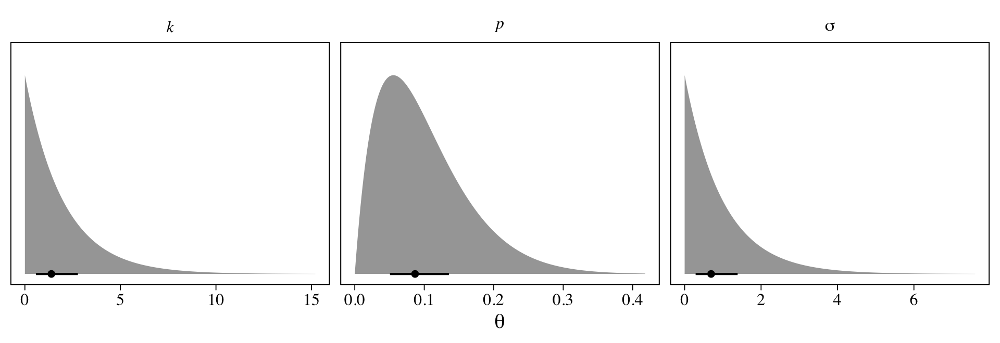

Here the points are the posterior medians and the horizontal lines the quantile-based 50% intervals. Turns out that $\operatorname{Beta}(2, 18)$ prior for $p$ pushes the bulk of the prior mass down near zero. The beta distribution also forces the parameter space for $p$ to range between 0 and 1. If we denote the two parameters of the beta distribution as $\alpha$ and $\beta$, we can compute the mean for any beta distribution as $\alpha / (\alpha + \beta)$. Thus the mean for our $\operatorname{Beta}(2, 18)$ prior is $2 / (2 + 18) = 2 / 20 = 0.1$.

Because we computed our weight and height variables, `w` and `h`, by dividing the original variables by their respective means, each now has a mean of 1.


```r
d %>% 
  pivot_longer(w:h) %>% 
  group_by(name) %>% 
  summarise(mean = mean(value))
```

```
## # A tibble: 2 × 2
##   name   mean
##   <chr> <dbl>
## 1 h         1
## 2 w         1
```

Here's their bivariate distribution in a scatter plot.


```r
d %>% 
  ggplot(aes(x = h, y = w)) +
  geom_vline(xintercept = 1, linetype = 2, linewidth = 1/4, color = "grey50") +
  geom_hline(yintercept = 1, linetype = 2, linewidth = 1/4, color = "grey50") +
  geom_point(size = 1/4)
```

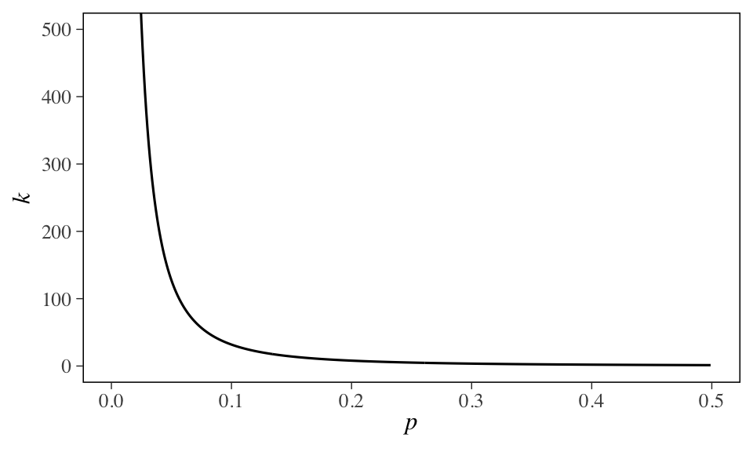

With this scaling, here is the formula for an individual with average weight and height:

\begin{align*}
1 & = k \pi p^2 1^3 \\
  & = k \pi p^2.
\end{align*}

If you assume $p < .5$, $k$ must be greater than 1. $k$ also has to be positive. To get a sense of this, we can further work the algebra:

\begin{align*}
1 & = k \pi p^2 \\
1/k  & = \pi p^2 \\
k  & = 1 / \pi p^2.
\end{align*}

To get a better sense of that relation, we might plot.


```r
tibble(p = seq(from = 0.001, to = 0.499, by = 0.001)) %>% 
  mutate(k = 1 / (pi * p^2)) %>% 
  ggplot(aes(x = p, y = k)) +
  geom_line() +
  labs(x = expression(italic(p)),
       y = expression(italic(k))) +
  coord_cartesian(ylim = c(0, 500))
```

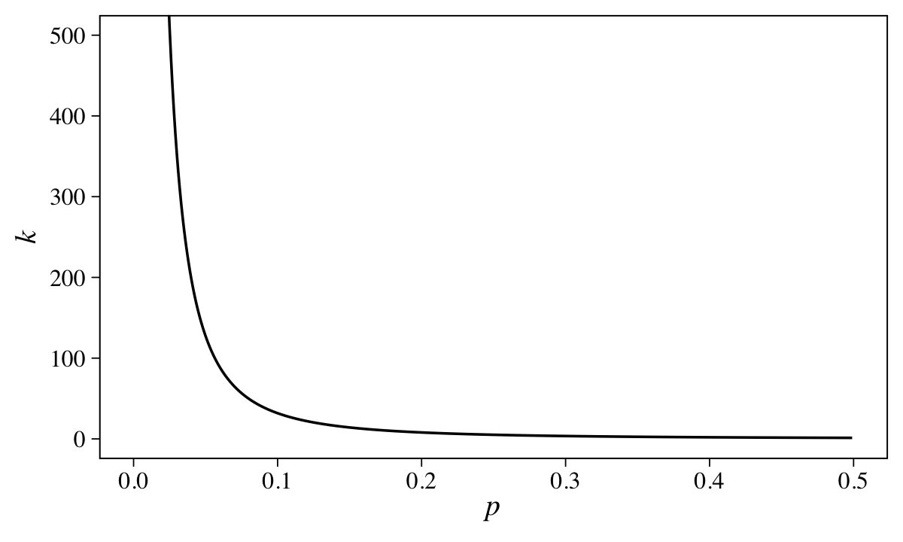

McElreath's quick and dirty solution was to set $k \sim \operatorname{Exponential}(0.5)$, which has a prior predictive mean of 2.

By setting up his model formula as `exp(mu) = ...`, McElreath effectively used the log link. It turns out that **brms** only supports the `identity` and `inverse` links for `family = lognormal`. However, we can sneak in the log link by nesting the right-hand side of the formula within `log()`.


```r
b16.1 <- 
  brm(data = d,
      family = lognormal,
      bf(w ~ log(3.141593 * k * p^2 * h^3),
         k + p ~ 1,
         nl = TRUE),
      prior = c(prior(beta(2, 18), nlpar = p, lb = 0, ub = 1),
                prior(exponential(0.5), nlpar = k, lb = 0),
                prior(exponential(1), class = sigma)),
      iter = 2000, warmup = 1000, chains = 4, cores = 4,
      seed = 16,
      file = "fits/b16.01")
```

Check the parameter summary.


```r
print(b16.1)
```

```
##  Family: lognormal 
##   Links: mu = identity; sigma = identity 
## Formula: w ~ log(3.141593 * k * p^2 * h^3) 
##          k ~ 1
##          p ~ 1
##    Data: d (Number of observations: 544) 
##   Draws: 4 chains, each with iter = 2000; warmup = 1000; thin = 1;
##          total post-warmup draws = 4000
## 
## Population-Level Effects: 
##             Estimate Est.Error l-95% CI u-95% CI Rhat Bulk_ESS Tail_ESS
## k_Intercept     5.80      2.68     2.17    12.28 1.00     1104      976
## p_Intercept     0.25      0.06     0.16     0.37 1.00     1104      979
## 
## Family Specific Parameters: 
##       Estimate Est.Error l-95% CI u-95% CI Rhat Bulk_ESS Tail_ESS
## sigma     0.21      0.01     0.19     0.22 1.00     1222     1335
## 
## Draws were sampled using sampling(NUTS). For each parameter, Bulk_ESS
## and Tail_ESS are effective sample size measures, and Rhat is the potential
## scale reduction factor on split chains (at convergence, Rhat = 1).
```

McElreath didn't show the parameter summary for his `m16.1` in the text. If you fit the model with both **rethinking** and **brms**, you'll see our `b16.1` matches up quite well. To make our version of Figure 16.2, we'll use a `GGally::ggpairs()` workflow. First we'll save our customizes settings for the three subplot types.


```r
my_lower <- function(data, mapping, ...) {
  
  # get the x and y data to use the other code
  x <- eval_data_col(data, mapping$x)
  y <- eval_data_col(data, mapping$y)
  
  # compute the correlations
  corr <- cor(x, y, method = "p", use = "pairwise")
  abs_corr <- abs(corr)
  
  # plot the cor value
  ggally_text(
    label = formatC(corr, digits = 2, format = "f") %>% str_replace(., "0.", "."),
    mapping = aes(),
    size = 3.5, 
    color = "black",
    family = "Times") +
    scale_x_continuous(NULL, breaks = NULL) +
    scale_y_continuous(NULL, breaks = NULL)
}

my_diag <- function(data, mapping, ...) {
  ggplot(data = data, mapping = mapping) + 
    geom_histogram(linewidth = 1/4, color = "white", fill = "grey67", bins = 20) +
    scale_x_continuous(NULL, breaks = NULL) +
    scale_y_continuous(NULL, breaks = NULL)
}

my_upper <- function(data, mapping, ...) {
  ggplot(data = data, mapping = mapping) + 
    geom_point(size = 1/4, alpha = 1/4) +
    scale_x_continuous(NULL, breaks = NULL) +
    scale_y_continuous(NULL, breaks = NULL)
}
```

Now we make our version of Figure 16.2.a.


```r
library(GGally)

as_draws_df(b16.1) %>% 
  select(b_k_Intercept:sigma) %>% 
  set_names(c("italic(k)", "italic(p)", "sigma")) %>% 
  ggpairs(upper = list(continuous = my_upper),
          diag = list(continuous = my_diag),
          lower = list(continuous = my_lower),
          labeller = label_parsed) +
  theme(strip.text = element_text(size = 8),
        strip.text.y = element_text(angle = 0))
```

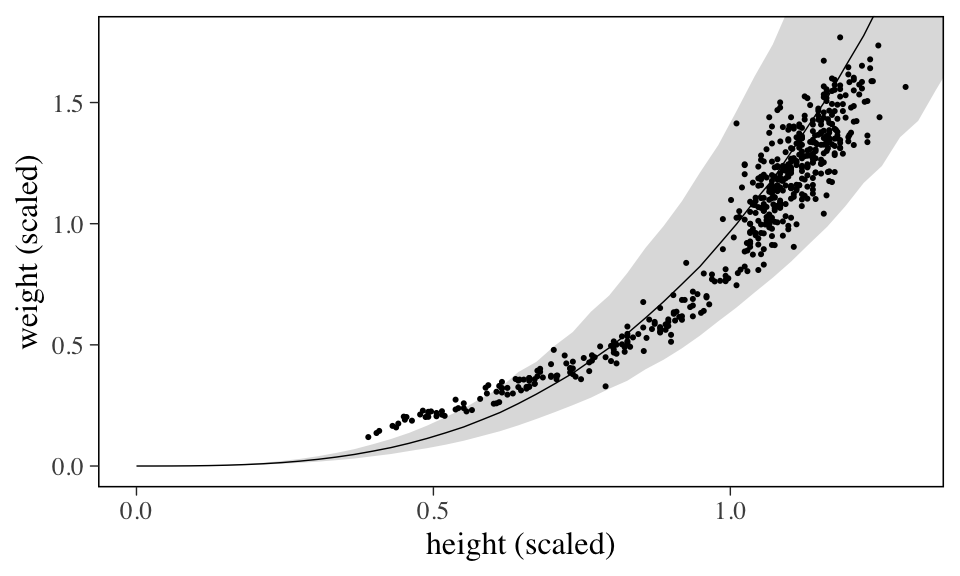

We see the lack of identifiability of $k$ and $p$ resulted in a strong inverse relation between them. Now here's how we might make Figure 16.2.b.


```r
nd <- 
  tibble(h = seq(from = 0, to = 1.5, length.out = 50))

p <-
  predict(b16.1,
          newdata = nd) %>% 
  data.frame() %>% 
  bind_cols(nd)

d %>% 
  ggplot(aes(x = h)) +
  geom_smooth(data = p,
              aes(y = Estimate, ymin = Q2.5, ymax = Q97.5),
              stat = "identity",
              fill = "grey67", color = "black", linewidth = 1/4) +
  geom_point(aes(y = w),
             size = 1/3) +
  coord_cartesian(xlim = c(0, max(d$h)),
                  ylim = c(0, max(d$w))) +
  labs(x = "height (scaled)",
       y = "weight (scaled)")
```

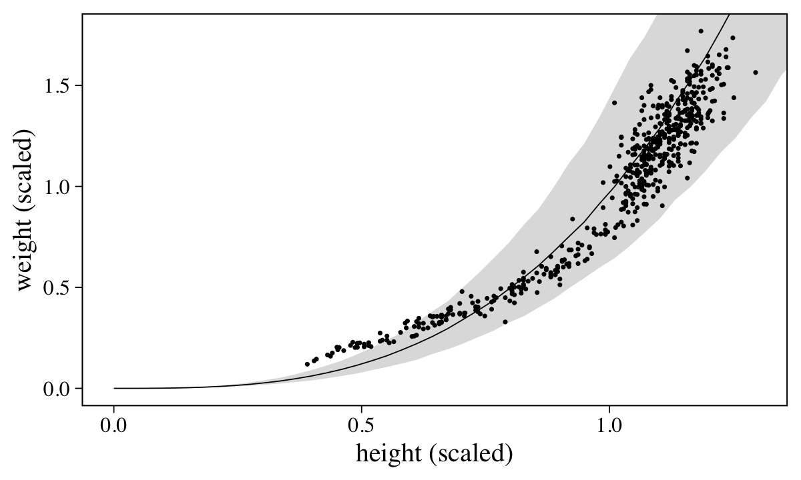

Overall the model did okay, but the poor fit for the cases with lower values of height and weight suggests we might be missing important differences between children and adults.

### GLM in disguise.

Recall that because **brms** does not support the log link for the Log-Normal likelihood, we recast our `b16.1` likelihood as

\begin{align*}
\text{w}_i & \sim \operatorname{Log-Normal}(\mu_i, \sigma) \\
\mu_i      & = \log(k \pi p^2 \text{h}_i^3).
\end{align*}

Because multiplication becomes addition on the log scale, we can also express this as

\begin{align*}
\text{w}_i & \sim \operatorname{Log-Normal}(\mu_i, \sigma) \\
\mu_i      & = \log(k) + \log(\pi) + 2 \log(p) + 3 \log(\text{h}_i),
\end{align*}

which means our fancy non-linear model is just linear regression on the log scale. McElreath pointed this out

> to highlight one of the reasons that generalized linear models are so powerful. Lots of natural relationships are GLM relationships, on a specific scale of measurement. At the same time, the GLM approach wants to simply estimate parameters which may be informed by a proper theory, as in this case. (p. 531)

## Hidden minds and observed behavior

Load the `Boxes` data [@vanleeuwenDevelopmentHumanSocial2018].


```r
data(Boxes, package = "rethinking")
d <- Boxes
rm(Boxes)

rethinking::precis(d)
```

```
##                     mean        sd 5.5% 94.5%      histogram
## y              2.1208267 0.7279860    1     3     ▃▁▁▁▇▁▁▁▁▅
## gender         1.5055644 0.5003669    1     2     ▇▁▁▁▁▁▁▁▁▇
## age            8.0302067 2.4979055    5    13     ▇▃▅▃▃▃▂▂▂▁
## majority_first 0.4848967 0.5001696    0     1     ▇▁▁▁▁▁▁▁▁▇
## culture        3.7519873 1.9603189    1     8 ▃▂▁▇▁▂▁▂▁▂▁▁▁▁
```

The data are from 629 children.


```r
d %>% count()
```

```
##     n
## 1 629
```

Their ages ranged from 4 to 14 years and, as indicated by the histogram above, the bulk were on the younger end.


```r
d %>% 
  summarise(min = min(age),
            max = max(age))
```

```
##   min max
## 1   4  14
```

Here's a depiction of our criterion variable `y`.


```r
# wrangle
d %>% 
  mutate(color = factor(y,
                        levels = 1:3,
                        labels = c("unchosen", "majority", "minority"))) %>%
  mutate(y = str_c(y, " (", color, ")")) %>% 
  count(y) %>% 
  mutate(percent = (100 * n / sum(n))) %>% 
  mutate(label = str_c(round(percent, digits = 1), "%")) %>% 
  
  # plot
  ggplot(aes(y = y)) +
  geom_col(aes(x = n)) +
  geom_text(aes(x = n + 4, label = label),
            hjust = 0, family = "Times") +
  scale_x_continuous(expression(italic(n)), expand = expansion(mult = c(0, 0.1))) +
  labs(title = "The criterion variable y indexes three kinds of color choices",
       subtitle = "Children tended to prefer the 'majority' color.",
       y = NULL) +
  theme(axis.text.y = element_text(hjust = 0),
        axis.ticks.y = element_blank())
```

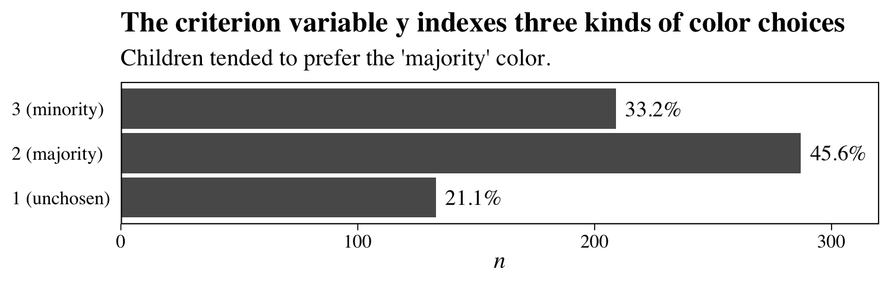

### The scientific model.

> The key, as always, is to think generatively. Consider for example a group of children in which half of them choose at random and the other half follow the majority. If we simulate choices for these children, we can figure out how often we might see the "2" choice, the one that indicates the majority color. (p. 532)

Here's an alternative way to set up McEreath's **R** code 16.6.


```r
set.seed(16)

n <- 30 # number of children

tibble(name  = rep(c("y1", "y2"), each = n / 2),
       value = c(sample(1:3, size = n / 2, replace = T),
                 rep(2, n / 2))) %>% 
  mutate(y = sample(value)) %>% 
  summarise(`number of 2s` = sum(y == 2) / n)
```

```
## # A tibble: 1 × 1
##   `number of 2s`
##            <dbl>
## 1          0.633
```

> We'll consider 5 different strategies children might use.
>
> 1. Follow the Majority: Copy the majority demonstrated color.
> 2. Follow the Minority: Copy the minority demonstrated color.
> 3. Maverick: Choose the color that no demonstrator chose.
> 4. Random: Choose a color at random, ignoring the demonstrators.
> 5. Follow First: Copy the color that was demonstrated first. This was either the majority color (when `majority_first` equals 1) or the minority color (when 0). (p. 533)

### The statistical model.

Our statistical will follow the form

\begin{align*}
y_i & \sim \operatorname{Categorical}(\theta) \\
\theta_j & = \sum_{s = 1}^5 p_s \operatorname{Pr}(j | s) \;\;\; \text{for} \; j = 1, \dots, 3 \\
p & \sim \operatorname{Dirichlet}(4, 4, 4, 4, 4),
\end{align*}

where $s$ indexes one of our five latent strategies and $\operatorname{Pr}(j | s)$ is the probability of one of the three color choices given a child is using the $s$th strategy. The $\sum_{s = 1}^5 p_s$ portion conveys these five probabilities are treated as a simplex, which means they will sum to one. We give these probabilities a Dirichlet prior, which we learned about back in [Section 12.4][Ordered categorical predictors]. Here's what that prior looks like.


```r
set.seed(16)

rdirichlet(n = 1e5, alpha = rep(4, times = 5)) %>% 
  data.frame() %>% 
  set_names(1:5) %>% 
  pivot_longer(everything()) %>% 
  mutate(name  = name %>% as.double(),
         alpha = str_c("alpha[", name, "]")) %>% 
  
  ggplot(aes(x = value, group = name)) + 
  geom_histogram(fill = "grey67", binwidth = .02, boundary = 0) +
  scale_x_continuous(expression(italic(p[s])), limits = c(0, 1),
                     breaks = c(0, .2, .5, 1), labels = c("0", ".2", ".5", "1"), ) +
  scale_y_continuous(NULL, breaks = NULL) +
  labs(subtitle = expression("Dirichlet"*(4*", "*4*", "*4*", "*4*", "*4))) +
  facet_wrap(~ alpha, labeller = label_parsed, nrow = 1)
```

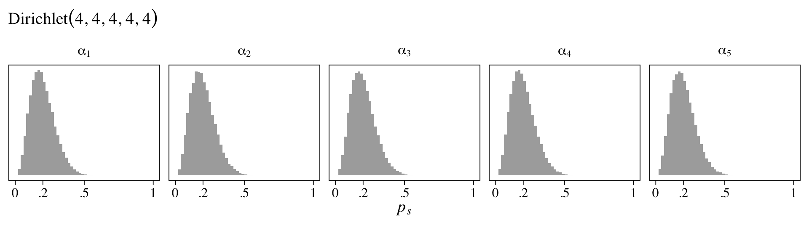

### Coding the statistical model.


Let's take a look at McElreath's Stan code.


```r
library(rethinking)
data(Boxes_model) 
cat(Boxes_model)
```

```
## 
## data{
##     int N;
##     int y[N];
##     int majority_first[N];
## }
## parameters{
##     simplex[5] p;
## }
## model{
##     vector[5] phi;
##     
##     // prior
##     p ~ dirichlet( rep_vector(4,5) );
##     
##     // probability of data
##     for ( i in 1:N ) {
##         if ( y[i]==2 ) phi[1]=1; else phi[1]=0; // majority
##         if ( y[i]==3 ) phi[2]=1; else phi[2]=0; // minority
##         if ( y[i]==1 ) phi[3]=1; else phi[3]=0; // maverick
##         phi[4]=1.0/3.0;                         // random
##         if ( majority_first[i]==1 )             // follow first
##             if ( y[i]==2 ) phi[5]=1; else phi[5]=0;
##         else
##             if ( y[i]==3 ) phi[5]=1; else phi[5]=0;
##         
##         // compute log( p_s * Pr(y_i|s )
##         for ( j in 1:5 ) phi[j] = log(p[j]) + log(phi[j]);
##         // compute average log-probability of y_i
##         target += log_sum_exp( phi );
##     }
## }
```

I'm not aware that one can fit this model directly with **brms**. My guess is that if it's possible, it would require a custom likelihood [see @Bürkner2022Define]. If you can reproduce McElreath's Stan code with this or some other approach in **brms**, please [share your code on GitHub](https://github.com/ASKurz/Statistical_Rethinking_with_brms_ggplot2_and_the_tidyverse_2_ed/issues). In the mean time, we're going to follow along with the text and fit the model with `rstan::stan()`.


```r
# prep data 
dat_list <- list(
  N = nrow(d),
  y = d$y,
  majority_first = d$majority_first )

# run the sampler
m16.2 <-
  stan(model_code = Boxes_model, 
       data = dat_list, 
       chains = 3, cores = 3,
       seed = 16)
```

Here's what it looks like if you `print()` a fit object from the `stan()` function.


```r
print(m16.2)
```

```
## Inference for Stan model: rt_cmdstanr_82e68937d1e417e265d6739ef917f4e6-202209231622-1-5943ce.
## 3 chains, each with iter=1000; warmup=500; thin=1; 
## post-warmup draws per chain=500, total post-warmup draws=1500.
## 
##         mean se_mean   sd    2.5%     25%     50%     75%   97.5% n_eff Rhat
## p[1]    0.25    0.00 0.04    0.18    0.23    0.26    0.28    0.32   461 1.00
## p[2]    0.14    0.00 0.03    0.07    0.12    0.14    0.16    0.20   491 1.00
## p[3]    0.15    0.00 0.03    0.08    0.13    0.15    0.17    0.21   479 1.00
## p[4]    0.20    0.00 0.08    0.07    0.14    0.19    0.26    0.38   383 1.01
## p[5]    0.26    0.00 0.03    0.20    0.24    0.26    0.28    0.32  1485 1.00
## lp__ -667.20    0.08 1.57 -671.21 -667.90 -666.79 -666.05 -665.30   434 1.01
## 
## Samples were drawn using NUTS(diag_e) at Fri Sep 23 16:22:58 2022.
## For each parameter, n_eff is a crude measure of effective sample size,
## and Rhat is the potential scale reduction factor on split chains (at 
## convergence, Rhat=1).
```

Here's the summary with `rethinking::precis()`.


```r
precis(m16.2, depth = 2)
```

```
##           mean         sd       5.5%     94.5%     n_eff    Rhat4
## p[1] 0.2549448 0.03684584 0.19435711 0.3119347  461.2311 1.003343
## p[2] 0.1362634 0.03356588 0.08196556 0.1891432  491.4914 1.000945
## p[3] 0.1463520 0.03118317 0.09309306 0.1954387  478.7917 1.003254
## p[4] 0.2016543 0.08332609 0.08515240 0.3432705  383.1893 1.005160
## p[5] 0.2607854 0.03129491 0.21160172 0.3110984 1484.5903 1.001135
```

Here we show marginal posterior for $p_s$.


```r
label <- c("Majority~(italic(s)[1])", 
           "Minority~(italic(s)[2])",
           "Maverick~(italic(s)[3])", 
           "Random~(italic(s)[4])", 
           "Follow~First~(italic(s)[5])")

precis(m16.2, depth = 2) %>% 
  data.frame() %>% 
  mutate(name = factor(label, levels = label)) %>% 
  mutate(name = fct_rev(name)) %>% 
  
  ggplot(aes(x = mean, xmin = X5.5., xmax = X94.5., y = name)) +
  geom_vline(xintercept = .2, linewidth = 1/4, linetype = 2) +
  geom_pointrange(linewidth = 1/4, fatten = 6/4) +
  scale_x_continuous(expression(italic(p[s])), limits = c(0, 1),
                     breaks = 0:5 / 5) +
  scale_y_discrete(NULL, labels = ggplot2:::parse_safe) +
  theme(axis.text.y = element_text(hjust = 0))
```

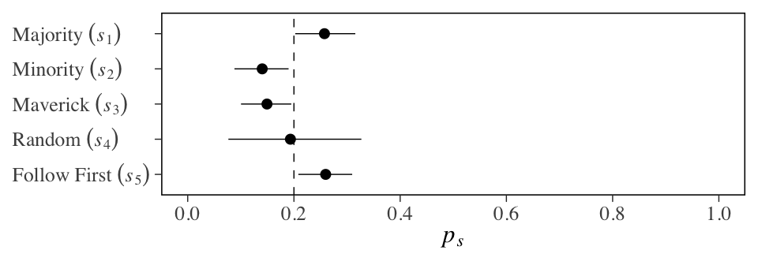

As an alternative, this might be a good time to revisit the `tidybayes::stat_ccdfinterval()` approach (see [Section 12.3.3][Adding predictor variables.]), which will depict those posteriors with a bar plot where the ends of the bars depict our uncertainty in terms of cumulative density curves.


```r
extract.samples(m16.2) %>% 
  data.frame() %>% 
  select(-lp__) %>% 
  set_names(label) %>% 
  pivot_longer(everything()) %>% 
  mutate(name = factor(name, levels = label)) %>% 
  mutate(name = fct_rev(name)) %>% 
  
  ggplot(aes(x = value, y = name)) +
  geom_vline(xintercept = .2, linewidth = 1/4, linetype = 2) +
  stat_ccdfinterval(.width = .95, size = 1/4, alpha = .8) +
  scale_x_continuous(expression(italic(p[s])), expand = c(0, 0), limits = c(0, 1),
                     breaks = 0:5 / 5) +
  scale_y_discrete(NULL, labels = ggplot2:::parse_safe) +
  theme(axis.text.y = element_text(hjust = 0),
        axis.ticks.y = element_blank())
```

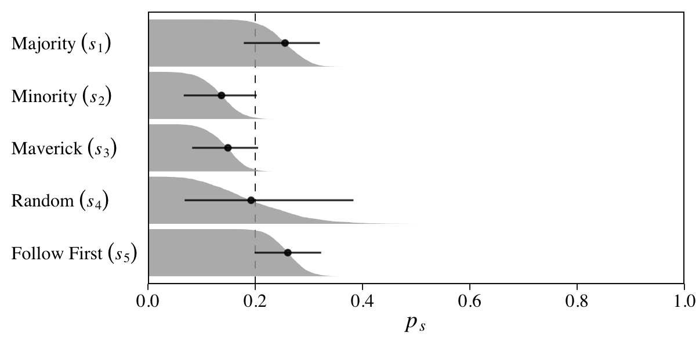

### State space models.

In this section of the text, McElreath mentioned state space models and hidden Markov models. Based on [this thread](https://discourse.mc-stan.org/t/state-space-models-with-brms/4087) in the Stan forums and [this issue](https://github.com/paul-buerkner/brms/issues/173) in the **brms** GitHub repo, it looks like state space models are not supported in **brms** at this time. As for hidden Markov models, I'm not sure whether they are supported by **brms**. The best I could find was [this thread](https://discourse.mc-stan.org/t/modelling-with-non-binary-proportions-as-outcome/12324) on the Stan forums. If you know more about either of these topics, please share your knowledge [on this book's GitHub repo](https://github.com/ASKurz/Statistical_Rethinking_with_brms_ggplot2_and_the_tidyverse_2_ed/issues).

## Ordinary differential nut cracking

Load the `Panda_nuts` data [@boeschLearningCurvesTeaching2019].


```r
data(Panda_nuts, package = "rethinking")
d <- Panda_nuts
rm(Panda_nuts)
```

Anticipating McElreath's **R** code 16.11, we'll wrangle a little.


```r
d <-
  d %>% 
  mutate(n     = nuts_opened,
         age_s = age / max(age))

glimpse(d)
```

```
## Rows: 84
## Columns: 9
## $ chimpanzee  <int> 11, 11, 18, 18, 18, 11, 11, 17, 7, 1, 22, 9, 9, 9, 9, 9, 9, 9, 9, 9, 15, 7, 9, 1, 7, 13,…
## $ age         <int> 3, 3, 4, 4, 4, 4, 4, 5, 5, 5, 5, 6, 6, 6, 6, 6, 6, 6, 6, 6, 6, 6, 6, 6, 6, 6, 6, 6, 6, 6…
## $ sex         <fct> m, m, f, f, f, m, m, f, m, m, m, m, m, m, m, m, m, m, m, m, m, m, m, m, m, m, m, m, m, m…
## $ hammer      <fct> G, G, wood, G, L, Q, Q, wood, G, L, wood, G, G, G, G, G, G, G, G, G, G, G, G, L, G, wood…
## $ nuts_opened <int> 0, 0, 0, 0, 0, 0, 0, 0, 3, 0, 0, 58, 4, 21, 9, 2, 30, 19, 13, 6, 11, 1, 2, 0, 1, 0, 0, 0…
## $ seconds     <dbl> 61.0, 37.0, 20.0, 14.0, 13.0, 24.0, 30.5, 135.0, 24.0, 13.0, 34.0, 66.5, 5.0, 24.0, 20.0…
## $ help        <fct> N, N, N, y, N, N, N, N, N, N, N, N, N, N, N, N, N, N, N, N, N, y, N, N, N, N, N, y, y, N…
## $ n           <int> 0, 0, 0, 0, 0, 0, 0, 0, 3, 0, 0, 58, 4, 21, 9, 2, 30, 19, 13, 6, 11, 1, 2, 0, 1, 0, 0, 0…
## $ age_s       <dbl> 0.1875, 0.1875, 0.2500, 0.2500, 0.2500, 0.2500, 0.2500, 0.3125, 0.3125, 0.3125, 0.3125, …
```

Our criterion is `n`, the number of *Panda* nuts opened by a chimpanzee on a given occasion. The two focal predictor variables are `age` and `seconds`. Here they are depicted in a pairs plot.


```r
d %>% 
  select(n, age, seconds) %>% 
  ggpairs(upper = list(continuous = my_upper),
          diag = list(continuous = my_diag),
          lower = list(continuous = my_lower)) +
  theme(strip.text.y = element_text(hjust = 0, angle = 0))
```

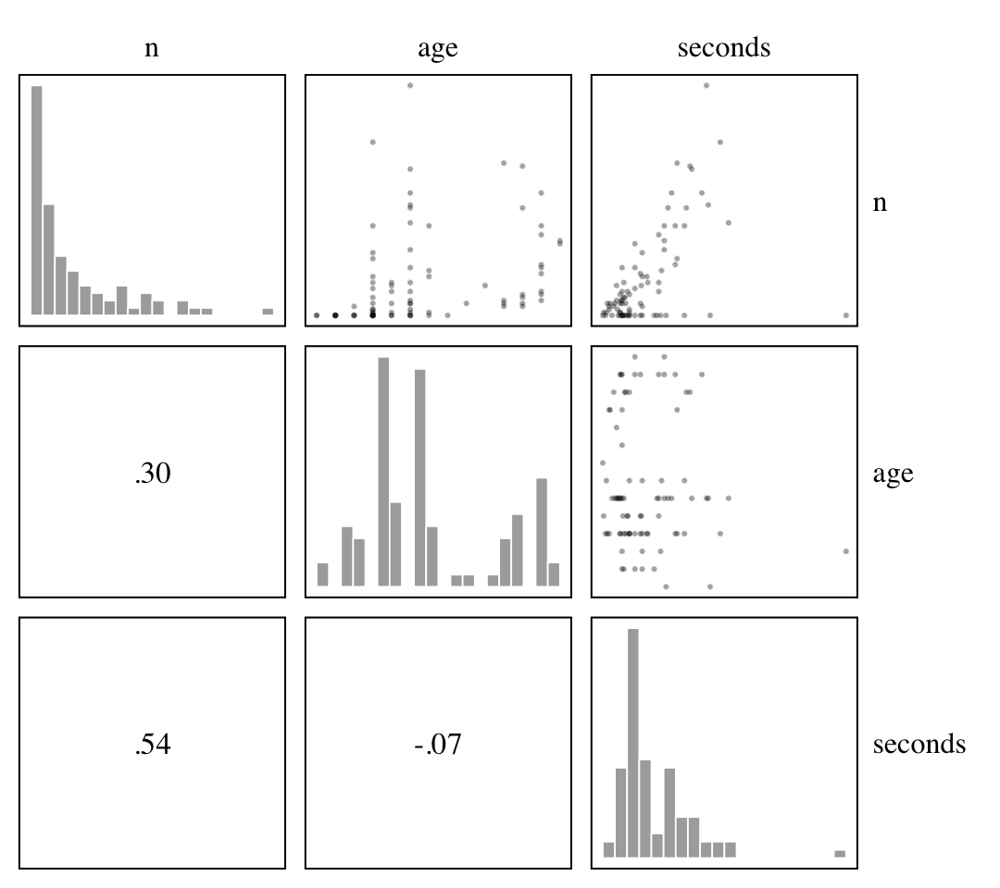

### Scientific model.

As a starting point, McElreath proposed we the strength of a chimpanzee would relate to the number of nuts they might open. We don't have a measure of strength, but we do have `age`, which is a proxy for how close a chimp might be to their maximum body size, and we presume body size would be proportional to strength. If we let $t$ index time, $M_\text{max}$ be the maximum body size (mass), $M_t$ be the current body size, and $k$ stand for the rate of skill gain the comes with age, we can write

$$M_t = M_\text{max} [1 - \exp(-kt) ]$$

to solve for mass at a given age [@vonbertalanffyUntersuchungenUeberGesetzlichkeit1934]. But again, we actually care about strength, not mass. Letting $S_t$ be strength at time $t$, we can express a proportional relation between the two as $S_t = \beta M_t$. Now if we let $\lambda$ stand in for the number of nuts opening, $\alpha$ express the relation of strength to nut opening, we can write

$$\lambda = \alpha S_t^\theta = \alpha \big ( \beta M_\text{max} [1 - \exp(-kt) ]  \big ) ^\theta,$$

"where $\theta$ is some exponent greater than 1" (p. 538). If we rescale $M_\text{max} = 1$, we can simplify the equation to

$$\lambda = \alpha \beta^\theta [1 - \exp(-kt) ]^\theta.$$

As "the product $\alpha \beta^\theta$ in the front just rescales strength to nuts-opened-per-second" (p. 538), we can collapse it to a single parameter, $\phi$, which leaves us with

$$\lambda = \phi [1 - \exp(-kt) ]^\theta.$$

This is our scientific model.

### Statistical model.

Now if we let $n_i$ be the number of nuts opened, we can write our statistical model as

\begin{align*}
n_i & \sim \operatorname{Poisson}(\lambda_i) \\
\lambda_i & = \text{seconds}_i \, \phi [1 - \exp(-k \,\text{age}_i) ]^\theta,
\end{align*}

where we have replaced our time index, $t$, with the variable `age`. By including the variable `seconds` in the equation, we have scaled the results to be nuts per second. McElreath proposed the priors:

\begin{align*}
\phi   & \sim \operatorname{Log-Normal}(\log 1, 0.10) \\
k      & \sim \operatorname{Log-Normal}(\log 2, 0.25) \\
\theta & \sim \operatorname{Log-Normal}(\log 5, 0.25),
\end{align*}

all of which were Log-Normal to ensure the parameters were positive and continuous. To get a sense of what these priors implied, he simulated. Here's our version of his simulations, which make up Figure 16.4.


```r
n <- 1e4

# define the x-axis breaks
at <- 0:6 / 4

# how many prior draws would you like?
n_draws <- 50

# simulate
set.seed(16)

prior <-
  tibble(index = 1:n,
         phi   = rlnorm(n, meanlog = log(1), sdlog = 0.1),
         k     = rlnorm(n, meanlog = log(2), sdlog = 0.25),
         theta = rlnorm(n, meanlog = log(5), sdlog = 0.25)) %>% 
  slice_sample(n = n_draws) %>% 
  expand_grid(age = seq(from = 0, to = 1.5, length.out = 1e2)) %>% 
  mutate(bm = 1 - exp(-k * age),
         ns = phi * (1 - exp(-k * age))^theta) 

# left panel
p1 <-
  prior %>% 
  ggplot(aes(x = age, y = bm, group = index)) +
  geom_line(linewidth = 1/4, alpha = 1/2) +
  scale_x_continuous(breaks = at, labels = round(at * max(d$age))) +
  ylab("body mass")

# right panel
p2 <-
  prior %>% 
  ggplot(aes(x = age, y = ns, group = index)) +
  geom_line(linewidth = 1/4, alpha = 1/2) +
  scale_x_continuous(breaks = at, labels = round(at * max(d$age))) +
  ylab("nuts per second")

# combine and plot
library(patchwork)

p1 + p2 + 
  plot_annotation(title = "Prior predictive simulation for the nut opening model",
                  subtitle = "Each panel shows the results from 50 prior draws.")
```

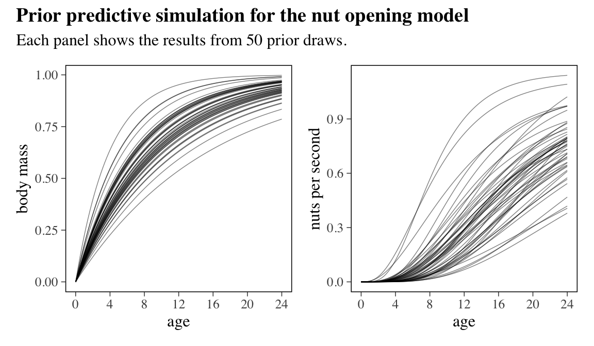

McElreath suggested we inspect the distributions of these priors. Here they are in a series of histograms.


```r
set.seed(16)

tibble(phi         = rlnorm(n, meanlog = log(1), sdlog = 0.1),
       `italic(k)` = rlnorm(n, meanlog = log(2), sdlog = 0.25),
       theta       = rlnorm(n, meanlog = log(5), sdlog = 0.25)) %>% 
  pivot_longer(everything()) %>% 
  
  ggplot(aes(x = value)) +
  geom_histogram(fill = "grey67", bins = 40, boundary = 0) +
  scale_x_continuous("marginal prior", limits = c(0, NA)) +
  scale_y_continuous(NULL, breaks = NULL) +
  facet_wrap(~ name, scales = "free", labeller = label_parsed)
```

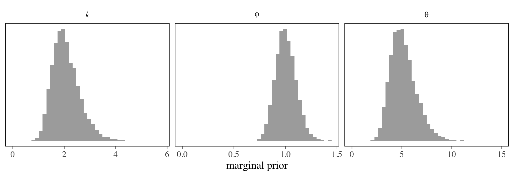

Happily, we can fit this model using the non-linear **brms** syntax.


```r
b16.4 <- 
  brm(data = d,
      family = poisson(link = identity),
      bf(n ~ seconds * phi * (1 - exp(-k * age_s))^theta,
         phi + k + theta ~ 1,
         nl = TRUE),
      prior = c(prior(lognormal(log(1), 0.1), nlpar = phi, lb = 0),
                prior(lognormal(log(2), 0.25), nlpar = k, lb = 0),
                prior(lognormal(log(5), 0.25), nlpar = theta, lb = 0)),
      iter = 2000, warmup = 1000, chains = 4, cores = 4,
      seed = 16,
      file = "fits/b16.04")
```

Check the parameter summary.


```r
print(b16.4)
```

```
##  Family: poisson 
##   Links: mu = identity 
## Formula: n ~ seconds * phi * (1 - exp(-k * age_s))^theta 
##          phi ~ 1
##          k ~ 1
##          theta ~ 1
##    Data: d (Number of observations: 84) 
##   Draws: 4 chains, each with iter = 2000; warmup = 1000; thin = 1;
##          total post-warmup draws = 4000
## 
## Population-Level Effects: 
##                 Estimate Est.Error l-95% CI u-95% CI Rhat Bulk_ESS Tail_ESS
## phi_Intercept       0.87      0.04     0.79     0.95 1.00     1432     1667
## k_Intercept         5.96      0.58     4.87     7.11 1.01     1087     1027
## theta_Intercept     9.83      2.06     6.46    14.48 1.01     1092     1111
## 
## Draws were sampled using sampling(NUTS). For each parameter, Bulk_ESS
## and Tail_ESS are effective sample size measures, and Rhat is the potential
## scale reduction factor on split chains (at convergence, Rhat = 1).
```

No we might get a sense of what this posterior means by plotting nuts per second as a function of `age` in our version of Figure 16.5.


```r
set.seed(16)
as_draws_df(b16.4) %>% 
  slice_sample(n = n_draws) %>% 
  expand_grid(age = seq(from = 0, to = 1.5, length.out = 1e2)) %>% 
  mutate(ns = b_phi_Intercept * (1 - exp(-b_k_Intercept * age))^b_theta_Intercept) %>% 
  
  ggplot() +
  geom_line(aes(x = age, y = ns, group = .draw),
            linewidth = 1/4, alpha = 1/2) +
  geom_jitter(data = d,
              aes(x = age_s, y = n / seconds, size = seconds),
              shape = 1, width = 0.01, color = "grey50") +
  scale_size_continuous(breaks = c(1, 50, 100), limits = c(1, NA)) +
  scale_x_continuous(breaks = at, labels = round(at * max(d$age))) +
  labs(title = "Posterior predictive distribution for the\nnut opening model",
       y = "nuts per second") +
  theme(legend.background = element_blank(),
        legend.position = c(.9, .25))
```

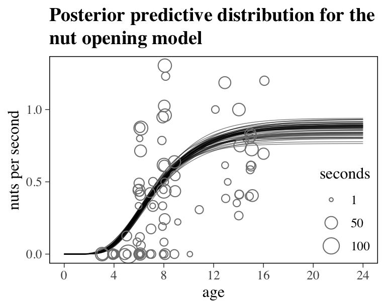

Looks like things flatten out around `age == 16`. Yet since the data drop off at that `age`, we probably shouldn't get overconfident.

## Population dynamics

Load the `Lynx_Hare` population dynamics data [@hewittTheConservation1921].


```r
data(Lynx_Hare, package = "rethinking")

glimpse(Lynx_Hare)
```

```
## Rows: 21
## Columns: 3
## $ Year <int> 1900, 1901, 1902, 1903, 1904, 1905, 1906, 1907, 1908, 1909, 1910, 1911, 1912, 1913, 1914, 1915,…
## $ Lynx <dbl> 4.0, 6.1, 9.8, 35.2, 59.4, 41.7, 19.0, 13.0, 8.3, 9.1, 7.4, 8.0, 12.3, 19.5, 45.7, 51.1, 29.7, …
## $ Hare <dbl> 30.0, 47.2, 70.2, 77.4, 36.3, 20.6, 18.1, 21.4, 22.0, 25.4, 27.1, 40.3, 57.0, 76.6, 52.3, 19.5,…
```

As McElreath indicated in his endnote #238 (p. 570), this example is based on Stan case study by the great [Bob Carpenter](https://bob-carpenter.github.io/), [*Predator-prey population dynamics: The Lotka-Volterra model in Stan*](https://mc-stan.org/users/documentation/case-studies/lotka-volterra-predator-prey.html). You might bookmark that link. It'll come up later in this section.

Figure 6.6 will give us a sense of how the lynx and hare populations ebbed and flowed.


```r
# for annotation
text <-
  tibble(name  = c("Hare", "Lynx"),
         label = c("Lepus", "Lynx"),
         Year  = c(1913.5, 1915.5),
         value = c(78, 52))

# wrangle
Lynx_Hare %>% 
  pivot_longer(-Year) %>% 
  
  # plot!
  ggplot(aes(x = Year, y = value)) +
  geom_line(aes(color = name),
            linewidth = 1/4) +
  geom_point(aes(fill = name),
             size = 3, shape = 21, color = "white") +
  geom_text(data = text,
            aes(label = label, color = name),
            hjust = 0, family = "Times") +
  scale_fill_grey(start = 0, end = .5) +
  scale_color_grey(start = 0, end = .5) +
  scale_y_continuous("thousands of pelts", breaks = 0:4 * 20, limits = c(0, 90)) +
  theme(legend.position = "none")
```

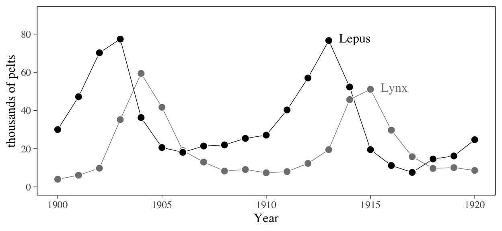

Note, however, that these are numbers of pelts, not of actual animals. This will become important when we start modeling.

A typical way to model evenly-spaced time series data like this would be with an autoregressive model with the basic structure

$$\operatorname{E}(y_t) = \alpha + \beta_1 y_{t-1},$$

where $t$ indexes time and $t - 1$ is the time point immediately before $t$. Models following this form are called first-order autoregressive models, AR(1), meaning that the current time point is only influenced by the previous time point, but none of the earlier ones. You can build on this format by adding other predictors. A natural way would be to use a predictor from $t - 1$ to predict $y_t$, following the form

$$\operatorname{E}(y_t) = \alpha + \beta_1 y_{t-1} + \beta_2 x_{t-1}.$$

But that's still a first-order model. A second-order model, AR(2), would include a term for $y_{t - 2}$, such as

$$\operatorname{E}(y_t) = \alpha + \beta_1 y_{t-1} + \beta_2 x_{t-1} + \beta_3 y_{t-2}.$$

McElreath isn't a huge fan of these models, particularly from the scientific modeling perspective he developed in this chapter. But **brms** can fit them and we'll practice a little in a bonus section, later on. In the mean time, we'll follow along and learn about **ordinary differential equations** (ODEs).

### The scientific model.

We'll start off simple and focus first on hares. If we let $H_t$ be the number of hares at time $t$, we can express the **rate of change** in the hare population as

$$\frac{\mathrm{d} H}{\mathrm{d} t} = H_t \times (\text{birth rate}) - H_t \times (\text{death rate}).$$

If we presume both birth rates and death rates (*mortality* rates) are constants, we might denote them $b_H$ and $m_H$, respectively, and re-express the formula as

$$\frac{\mathrm{d} H}{\mathrm{d} t} = H_t b_H - H_t m_H = H_t (b_H - m_H).$$

Building, if we let $L_t$ stand for the number of lynx present at time $t$, we can allow the mortality rate depend on that variable with the expanded formula

$$\frac{\mathrm{d} H}{\mathrm{d} t} = H_t (b_H - L_t m_H).$$

We can expand this even further to model how the number of hares at a given time influence the birth rate for lynx ($b_L$) to help us model the rate of change in the lynx population as

$$\frac{\mathrm{d} L}{\mathrm{d} t} = L_t (H_t b_L - m_L),$$

where the lynx mortality rate ($m_l$) is now constant. This is called the **Lotka-Volterra model** [@lotkaPrinciplesOfPhysicalBiology1925; @volterraFluctuationsAbundanceSpecies1926]. You may have noticed how the above equations shifted our focus from what were were originally interested in, $\operatorname{E}(H_t)$, to a rate of change, $\mathrm{d} H / \mathrm{d} t$. Happily, our equation for $\mathrm{d} H / \mathrm{d} t$, "tells us how to update $H$ after each tiny unit of passing time $\mathrm d t$" (p. 544). You update by

$$H_{t +\mathrm d t} = H_t + \mathrm d t \frac{\mathrm d H}{\mathrm d t} = H_t + \mathrm d t H_t (b_H - L_t m_H).$$
Here we'll use a custom function called `sim_lynx_hare()` to simulate how this can work. Our version of the function is very similar to the one McElreath displayed in his **R** code 16.14, but we changed it so it returns a tibble which includes a time index, `t`.


```r
sim_lynx_hare <- function(n_steps, init, theta, dt = 0.002) { 
  
  L <- rep(NA, n_steps)
  H <- rep(NA, n_steps)
  
  # set initial values
  L[1] <- init[1]
  H[1] <- init[2]
  
  for (i in 2:n_steps) {
    H[i] <- H[i - 1] + dt * H[i - 1] * (theta[1] - theta[2] * L[i - 1])
    L[i] <- L[i - 1] + dt * L[i - 1] * (theta[3] * H[i - 1] - theta[4])
  }
  
  # return a tibble
  tibble(t = 1:n_steps,
         H = H,
         L = L)
  
}
```

Now we simulate.


```r
# set the four theta values
theta <- c(0.5, 0.05, 0.025, 0.5)

# simulate
z <- sim_lynx_hare(n_steps = 1e4, 
                   init = c(filter(Lynx_Hare, Year == 1900) %>% pull("Lynx"), 
                            filter(Lynx_Hare, Year == 1900) %>% pull("Hare")), 
                   theta = theta)

# what did we do?
glimpse(z)
```

```
## Rows: 10,000
## Columns: 3
## $ t <int> 1, 2, 3, 4, 5, 6, 7, 8, 9, 10, 11, 12, 13, 14, 15, 16, 17, 18, 19, 20, 21, 22, 23, 24, 25, 26, 27,…
## $ H <dbl> 30.00000, 30.01800, 30.03600, 30.05401, 30.07203, 30.09005, 30.10807, 30.12610, 30.14413, 30.16217…
## $ L <dbl> 4.000000, 4.002000, 4.004005, 4.006014, 4.008028, 4.010046, 4.012069, 4.014097, 4.016129, 4.018166…
```

Each row is a stand-in index for time. Here we'll explicitly add a `time` column and them plot the results in our version of Figure 16.7.


```r
z %>% 
  pivot_longer(-t) %>% 
  
  ggplot(aes(x = t, y = value, color = name)) +
  geom_line(linewidth = 1/4) +
  scale_color_grey(start = 0, end = .5) +
  scale_x_continuous(expression(time~(italic(t))), breaks = NULL) +
  scale_y_continuous("number (thousands)", breaks = 0:4 * 10, limits = c(0, 45)) +
  theme(legend.position = "none")
```

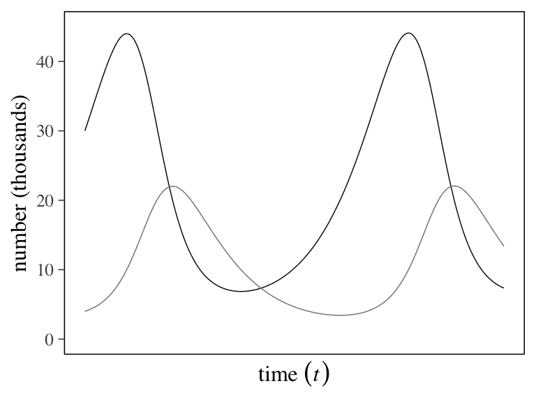

"This model produces cycles, similar to what we see in the data. The model behaves this way, because lynx eat hares. Once the hares are eaten, the lynx begin to die off. Then the cycle repeats (p. 545)."

### The statistical model.

If we continue to let $H_t$ and $L_t$ be the number of hares and lynx at time $t$, we might also want to rehearse the distinction between those numbers and our observations by letting $h_t$ and $l_t$ stand for the observed numbers of hares and lynx. These observed numbers, recall, are from counts of pelts. We want a statistical model that can connect $h_t$ to $H_t$ and connect $l_t$ to $L_t$. Part of that model would include the probability a hare was trapped on a given year, $p_h$, and a similar probability for a lynx getting trapped, $p_l$. To make things worse, further imagine the number of pelts for each, in a given year, was rounded to the nearest $100$ and divided by $1{,}000$. Those are our values.

We practice simulating all this in Figure 16.8. Here we propose a population of $H_t = 10^4$ hares and an average trapping rate of about $10\%$, as expressed by $p_t \sim \operatorname{Beta}(2, 18)$. As described above, we then divide the number of observed pelts by $1{,}000$ and round the results, yielding $h_t$.


```r
n  <- 1e4
Ht <- 1e4

set.seed(16)

# simulate
tibble(pt = rbeta(n, shape1 = 2, shape2 = 18)) %>% 
  mutate(ht = rbinom(n, size = Ht, prob = pt)) %>% 
  mutate(ht = round(ht / 1000, digits = 2)) %>% 
  
  # plot
  ggplot(aes(x = ht)) +
  geom_histogram(linewidth = 1/4, binwidth = 0.1,
                 color = "white", fill = "grey67") +
  scale_y_continuous(NULL, breaks = NULL) +
  xlab(expression(thousand~of~pelts~(italic(h[t]))))
```

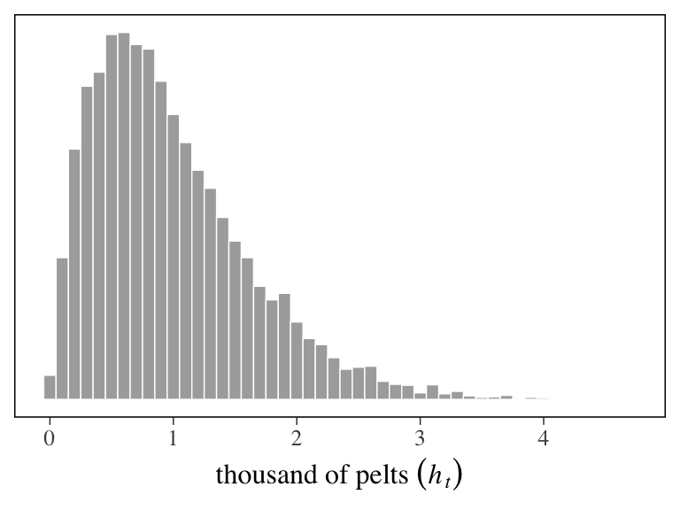

On page 546, McElreath encouraged us to try the simulation with different values of $H_t$ and $p_t$. Here we'll do so with a $3 \times 3$ grid of $H_t = \{5{,}000, 10{,}000, 15{,}000\}$ and $p_t \sim \{ \operatorname{Beta}(2, 18), \operatorname{Beta}(10, 10), \operatorname{Beta}(18, 2) \}$.


```r
set.seed(16)

# define the 3 X 3 grid
tibble(shape1 = c(2, 10, 18),
       shape2 = c(18, 10, 2)) %>% 
  expand_grid(Ht = c(5e3, 1e4, 15e3)) %>% 
  # simulate
  mutate(pt = purrr::map2(shape1, shape2, ~rbeta(n, shape1 = .x, shape2 = .y))) %>% 
  mutate(ht = purrr::map2(Ht, pt, ~rbinom(n, size = .x, prob = .y))) %>% 
  unnest(c(pt, ht)) %>% 
  # wrangle
  mutate(ht    = round(ht / 1000, digits = 2),
         beta  = str_c("italic(p[t])%~%'Beta '(", shape1, ", ", shape2, ")"),
         Htlab = str_c("italic(H[t])==", Ht)) %>%
  mutate(beta  = factor(beta,
                        levels = c("italic(p[t])%~%'Beta '(2, 18)", "italic(p[t])%~%'Beta '(10, 10)", "italic(p[t])%~%'Beta '(18, 2)")),
         Htlab = factor(Htlab,
                        levels = c("italic(H[t])==15000", "italic(H[t])==10000", "italic(H[t])==5000"))) %>% 
  
  # plot!
  ggplot(aes(x = ht)) +
  geom_histogram(aes(fill = beta == "italic(p[t])%~%'Beta '(2, 18)" & Htlab == "italic(H[t])==10000"),
                 linewidth = 1/10, binwidth = 0.25, boundary = 0) +
  geom_vline(aes(xintercept = Ht / 1000), 
             linewidth = 1/4, linetype = 2) +
  scale_fill_grey(start = .67, end = 0, breaks = NULL) +
  scale_y_continuous(NULL, breaks = NULL) +
  xlab(expression(thousand~of~pelts~(italic(h[t])))) +
  facet_grid(Htlab ~ beta, labeller = label_parsed, scales = "free_y")
```


The vertical dashed lines mark off the maximum values in each panel. The histogram in black is of the simulation parameters based on our version of Figure 16.8, above.

McElreath's proposed model is

\begin{align*}
h_t & \sim \operatorname{Log-Normal} \big (\log(p_H H_t), \sigma_H \big) \\
l_t & \sim \operatorname{Log-Normal} \big (\log(p_L L_t), \sigma_L \big) \\
H_1 & \sim \operatorname{Log-Normal}(\log 10, 1) \\
L_1 & \sim \operatorname{Log-Normal}(\log 10, 1) \\
H_{T >1} & = H_1 + \int_1^T H_t (b_H - m_H L_t) \mathrm{d} t \\
L_{T >1} & = L_1 + \int_1^T L_t (b_L H_T - m_L) \mathrm{d} t \\
\sigma_H & \sim \operatorname{Exponential}(1) \\
\sigma_L & \sim \operatorname{Exponential}(1) \\
p_H & \sim \operatorname{Beta}(\alpha_H, \beta_H) \\
p_L & \sim \operatorname{Beta}(\alpha_L, \beta_L) \\
b_H & \sim \operatorname{Half-Normal}(1, 0.5) \\
b_L & \sim \operatorname{Half-Normal}(0.5, 0.5) \\
m_H & \sim \operatorname{Half-Normal}(0.5, 0.5) \\
m_L & \sim \operatorname{Half-Normal}(1, 0.5).
\end{align*}

It's not immediately clear from the text, but if you look closely at the output from `cat(Lynx_Hare_model)` (see below), you'll see $\alpha_H = \alpha_L = 40$ and $\beta_H = \beta_L = 200$. If you're curious, here's a plot of what the $\operatorname{Beta}(40, 200)$ prior looks like.


```r
set.seed(16)

tibble(p = rbeta(n = 1e6, shape1 = 40, shape2 = 200)) %>%
  
  ggplot(aes(x = p)) +
  geom_histogram(linewidth = 1/6, binwidth = 0.005, boundary = 0,
                 color = "white", fill = "grey67") +
  scale_x_continuous(expression(prior~predictive~distribution~of~italic(p[H])~and~italic(p[L])), 
                     breaks = 0:5 / 5, expand = c(0, 0), limits = c(0, 1)) +
  scale_y_continuous(NULL, breaks = NULL, expand = expansion(mult = c(0, 0.05))) +
  labs(subtitle = expression("1,000,000 draws from Beta"*(40*", "*200)))
```

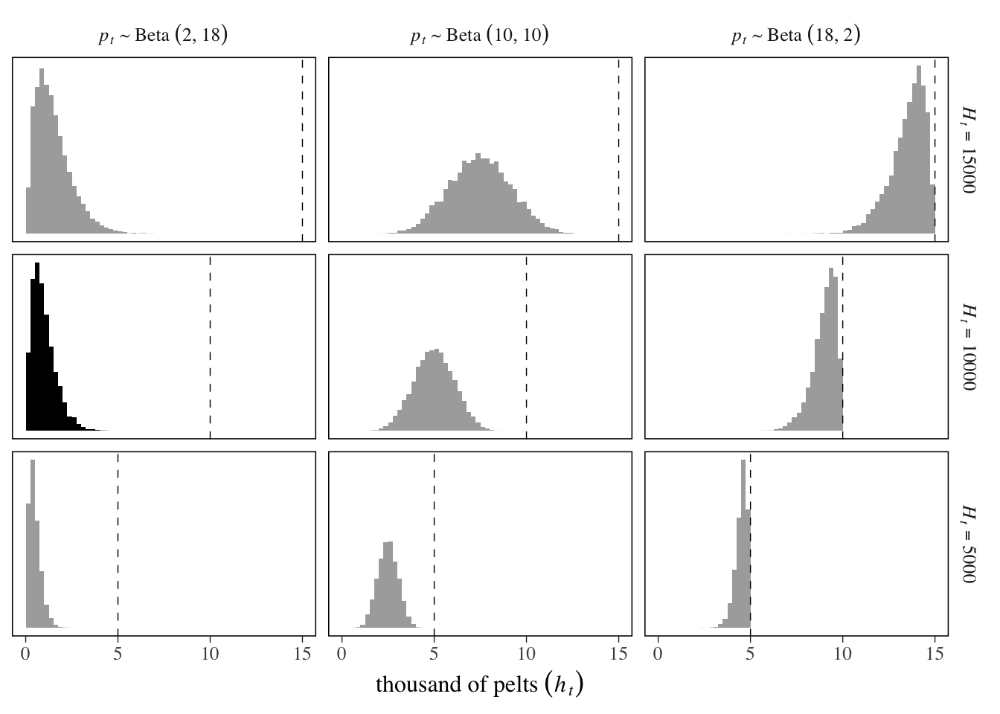

The $\operatorname{Beta}(40, 200)$ prior suggests an average trapping rate near 16%.

⚠️ The content to follow is going to diverge from the text, a bit. As you can see from the equation, above, McElreath's statistical model is a beast. We can fit this model with **brms**, but the workflow is more complicated than usual. To make this material more approachable, I am going to divide the remainder of this section into two subsections. In the first subsection, we'll fit a simplified version of McElreath's `m16.5`, which does not contain the measurement-error portion. In the second subsection, we'll tack on the measurement-error portion and fit the full model. ⚠️

#### The simple Lotka-Volterra model.

Before we get into it, I should acknowledge that this **brms** approach to fitting ODE's is a direct result of the generous contributions from [Markus Gesmann](https://www.magesblog.com/). It was one of his older blog posts, [*PK/PD reserving models*](https://magesblog.com/post/2018-01-30-pkpd-reserving-models/), that led me to believe one could fit an ODE model with **brms**. When I reached out to Gesmann on GitHub (see [Issue #18](https://github.com/ASKurz/Statistical_Rethinking_with_brms_ggplot2_and_the_tidyverse_2_ed/issues/18)), he went so far as to write a new blog post on exactly this model: [*Fitting multivariate ODE models with brms*](https://magesblog.com/post/2021-02-08-fitting-multivariate-ode-models-with-brms/). The workflow to follow is something of a blend of the methods in his blog post, McElreath's model in the text, and the [original post](https://mc-stan.org/users/documentation/case-studies/lotka-volterra-predator-prey.html) by Carpenter that started this all.

As far as the statistical model goes, we might express the revision of McElreath's model omitting the measurement-error portion as

\begin{align*}
h_t & \sim \operatorname{Log-Normal} \big (\log(H_t), \sigma_H \big) \\
l_t & \sim \operatorname{Log-Normal} \big (\log(L_t), \sigma_L \big) \\
H_1 & \sim \operatorname{Log-Normal}(\log 10, 1) \\
L_1 & \sim \operatorname{Log-Normal}(\log 10, 1) \\
H_{T >1} & = H_1 + \int_1^T H_t (b_H - m_H L_t) \mathrm{d} t \\
L_{T >1} & = L_1 + \int_1^T L_t (b_L H_T - m_L) \mathrm{d} t \\
b_H & \sim \operatorname{Half-Normal}(1, 0.5) \\
b_L & \sim \operatorname{Half-Normal}(0.5, 0.5) \\
m_H & \sim \operatorname{Half-Normal}(0.5, 0.5) \\
m_L & \sim \operatorname{Half-Normal}(1, 0.5) \\
\sigma_H & \sim \operatorname{Exponential}(1) \\
\sigma_L & \sim \operatorname{Exponential}(1).
\end{align*}

With the exception of the priors for the $\sigma$ parameters, this is basically the same model Carpenter fit with his original Stan code. Carpenter expressed his model using a different style of notation, but the parts are all there.

As for our **brms**, the first issue we need to address is that, at the time of this writing, **brms** is only set up to fit a univariate ODE model. As Gesmann pointed out, the way around this is to convert the `Lynx_Hare` data into the long format where the pelt values from the `Lynx` and `Hare` columns are all listed in a `pelts` columns and the two animal populations are differentiated in a `population` column. We'll call this long version of the data `Lynx_Hare_long`.


```r
Lynx_Hare_long <-
  Lynx_Hare %>% 
  pivot_longer(-Year,
               names_to = "population", 
               values_to = "pelts") %>% 
  mutate(delta = if_else(population == "Lynx", 1, 0),
         t     = Year - min(Year) + 1) %>% 
  arrange(delta, Year)

# what did we do?
head(Lynx_Hare_long)
```

```
## # A tibble: 6 × 5
##    Year population pelts delta     t
##   <int> <chr>      <dbl> <dbl> <dbl>
## 1  1900 Hare        30       0     1
## 2  1901 Hare        47.2     0     2
## 3  1902 Hare        70.2     0     3
## 4  1903 Hare        77.4     0     4
## 5  1904 Hare        36.3     0     5
## 6  1905 Hare        20.6     0     6
```

You'll note how we converted the information in the `population` column into a dummy variable, `delta`, which is coded 0 = hares, 1 = lynxes. It's that dummy variable that will allow us to adjust our model formula so we express a bivariate model as if it were univariate. You'll see. Also notice how we added a `t` index for *time*. This is because the Stan code to follow will expect us to index time in that way.

The next step is to write a script that will tell **brms** how to tell Stan how to fit a Lotka-Volterra model. In his blog, Gesmann called this `LotkaVolterra`. Our script to follow is a very minor adjustment of his.


```r
LotkaVolterra <- "
// Sepcify dynamical system (ODEs)
real[] ode_LV(real t,         // time
              real [] y,      // the system rate
              real [] theta,  // the parameters (i.e., the birth and mortality rates)
              real [] x_r,    // data constant, not used here
              int [] x_i) {   // data constant, not used here
  // the outcome
  real dydt[2];
  
  // differential equations
  dydt[1] = (theta[1] - theta[2] * y[2]) * y[1]; // Hare process
  dydt[2] = (theta[3] * y[1] - theta[4]) * y[2]; // Lynx process
  
  return dydt;  // return a 2-element array
              }

// Integrate ODEs and prepare output
real LV(real t, real Hare0, real Lynx0, 
        real brHare, real mrHare, 
        real brLynx, real mrLynx,
        real delta) {
        
  real y0[2];     // Initial values
  real theta[4];  // Parameters
  real y[1, 2];   // ODE solution
  // Set initial values
  y0[1] = Hare0; 
  y0[2] = Lynx0;
  // Set parameters
  theta[1] = brHare; 
  theta[2] = mrHare;
  theta[3] = brLynx; 
  theta[4] = mrLynx;
  // Solve ODEs
  y = integrate_ode_rk45(ode_LV, 
                         y0, 0, rep_array(t, 1), theta,
                         rep_array(0.0, 0), rep_array(1, 1),
                         0.001, 0.001, 100); // tolerances, steps
                         
  // Return relevant population values based on our dummy-variable coding method
  return (y[1, 1] * (1 - delta) + 
          y[1, 2] * delta);
}
"
```

If you study this, you'll see echos of Carpenter's [original Stan code](https://mc-stan.org/users/documentation/case-studies/lotka-volterra-predator-prey.html#coding-the-model-stan-program) and connections to McElreath's Stan code (execute `cat(Lynx_Hare_model)` from his **R** code 16.17 block), too. But take special notice of the last two lines, above. Those lines use the `delta` dummy to differentiate the model results for the hare and lynx populations, respectively.

Next we define our `formula` input. To keep from overwhelming the `brm()` code, we'll save it, here, as an independent object called `lv_formula`.


```r
lv_formula <- 
  bf(pelts ~ log(eta),
     # use our LV() function from above
     nlf(eta ~ LV(t, H1, L1, bh, mh, bl, ml, delta)),
     # initial population state
     H1 ~ 1, L1 ~ 1,
     # hare parameters
     bh ~ 1, mh ~ 1,
     # lynx parameters
     bl ~ 1, ml ~ 1,
     # population-based measurement errors
     sigma ~ 0 + population,
     nl = TRUE
  )
```

Note our use of the `LV()` function in the `nlf()` line. That's a function defined in the `LotkaVolterra` script, above, which will allow us to connect the variables and parameters in our `formula` code to the underlying statistical model. Next we define our priors and save them as an independent object called `lv_priors`.


```r
lv_priors <- c(
  prior(lognormal(log(10), 1), nlpar = H1, lb = 0),
  prior(lognormal(log(10), 1), nlpar = L1, lb = 0),
  prior(normal(1, 0.5),     nlpar = bh, lb = 0),
  prior(normal(0.05, 0.05), nlpar = bl, lb = 0),
  prior(normal(0.05, 0.05), nlpar = mh, lb = 0),
  prior(normal(1, 0.5),     nlpar = ml, lb = 0),
  prior(exponential(1), dpar = sigma, lb = 0)
)
```

Now whether you can fit this model in **brms** may depend on which version you're using. For details, see the endnote[^9]. In short, just update to the [current version](https://CRAN.R-project.org/package=brms). Within our `brm()` code, notice our `stanvars` settings. Also, I find these models benefit from setting `init = 0`. Happily, this model fit in just about four minutes on my 2019 MacBook Pro.


```r
b16.5a <- 
  brm(data = Lynx_Hare_long, 
      family = brmsfamily("lognormal", link_sigma = "identity"),
      formula = lv_formula, 
      prior = lv_priors, 
      iter = 2000, warmup = 1000, chains = 4, cores = 4,
      init = 0,
      stanvars = stanvar(scode = LotkaVolterra, block = "functions"),
      file = "fits/b16.05a")
```

On page 548, McElreath recommend we check the chains. Here we'll pretty them up with help from **bayesplot**.


```r
library(bayesplot)

color_scheme_set("gray")

col_names <- c("italic(H)[1]", "italic(L)[1]", str_c("italic(", c("b[H]", "m[H]", "b[L]", "m[L]"), ")"), 
               "sigma[italic(H)]", "sigma[italic(L)]", "Chain")

as_draws_df(b16.5a) %>% 
  select(b_H1_Intercept:b_sigma_populationLynx, .chain) %>%
  set_names(col_names) %>% 
  
  mcmc_trace(facet_args = list(labeller = label_parsed), 
             linewidth = .15) +
  scale_x_continuous(breaks = NULL) +
  theme(legend.key.size = unit(0.15, 'in'),
        legend.position = c(.97, .13))
```

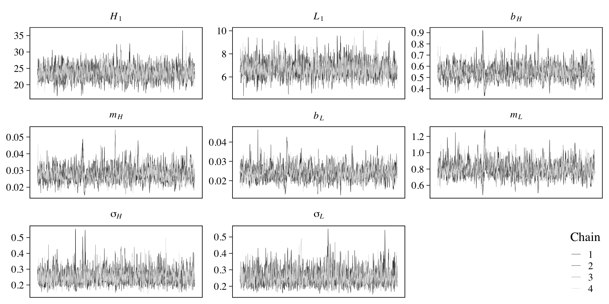

They look like a dream. Now inspect the parameter summary.


```r
print(b16.5a)
```

```
##  Family: lognormal 
##   Links: mu = identity; sigma = identity 
## Formula: pelts ~ log(eta) 
##          eta ~ LV(t, H1, L1, bh, mh, bl, ml, delta)
##          H1 ~ 1
##          L1 ~ 1
##          bh ~ 1
##          mh ~ 1
##          bl ~ 1
##          ml ~ 1
##          sigma ~ 0 + population
##    Data: Lynx_Hare_long (Number of observations: 42) 
##   Draws: 4 chains, each with iter = 2000; warmup = 1000; thin = 1;
##          total post-warmup draws = 4000
## 
## Population-Level Effects: 
##                      Estimate Est.Error l-95% CI u-95% CI Rhat Bulk_ESS Tail_ESS
## H1_Intercept            23.42      2.08    19.40    27.73 1.00     2751     2339
## L1_Intercept             6.69      0.69     5.43     8.13 1.00     2331     2219
## bh_Intercept             0.55      0.06     0.43     0.68 1.00     1028     1594
## mh_Intercept             0.03      0.00     0.02     0.04 1.00     1138     1821
## bl_Intercept             0.02      0.00     0.02     0.03 1.00     1068     1731
## ml_Intercept             0.80      0.09     0.64     0.98 1.00     1026     1751
## sigma_populationHare     0.25      0.05     0.18     0.36 1.00     3088     2284
## sigma_populationLynx     0.25      0.04     0.18     0.36 1.00     2978     2806
## 
## Draws were sampled using sampling(NUTS). For each parameter, Bulk_ESS
## and Tail_ESS are effective sample size measures, and Rhat is the potential
## scale reduction factor on split chains (at convergence, Rhat = 1).
```

As Gesmann [covered in his blog](https://magesblog.com/post/2021-02-08-fitting-multivariate-ode-models-with-brms/#plot-posterior-simulations), we need to use the `brms::expose_functions()` function to expose Stan functions to **R** before we use some of our favorite post-processing functions.


```r
expose_functions(b16.5a, vectorize = TRUE)
```

Now we're ready to plot our results like McElreath did in Figure 16.9a. Our first step will be to use `predict()`.


```r
p <- 
  predict(b16.5a, 
          summary = F, 
          # how many posterior predictive draws would you like?
          ndraws = 21)

str(p)
```

```
##  num [1:21, 1:42] 27.8 59.1 39.8 37.7 21.9 ...
##  - attr(*, "dimnames")=List of 2
##   ..$ : NULL
##   ..$ : NULL
```

We're ready to plot!


```r
# for annotation
text <-
  tibble(population = c("Hare", "Lynx"),
         label      = c("Lepus", "Lynx"),
         Year       = c(1914, 1916.5),
         value      = c(92, 54))

# wrangle
p %>% 
  data.frame() %>% 
  set_names(1:42) %>% 
  mutate(iter = 1:n()) %>% 
  pivot_longer(-iter, names_to = "row") %>% 
  mutate(row = as.double(row)) %>% 
  left_join(Lynx_Hare_long %>% mutate(row  = 1:n()),
            by = "row") %>% 

  # plot!
  ggplot(aes(x = Year, y = value)) +
  geom_line(aes(group = interaction(iter, population), color = population),
            linewidth = 1/3, alpha = 1/2) +
  geom_point(data = . %>% filter(iter == 1),
             aes(x = Year, fill = population),
             size = 3, shape = 21, stroke = 1/5, color = "white") +
  geom_text(data = text,
            aes(label = label, color = population),
            hjust = 0, family = "Times") +
  scale_color_grey(start = 0, end = .5, breaks = NULL) +
  scale_fill_grey(start = 0, end = .5, breaks = NULL) +
  scale_y_continuous("thousands of pelts", breaks = 0:6 * 20) +
  coord_cartesian(ylim = c(0, 120))
```

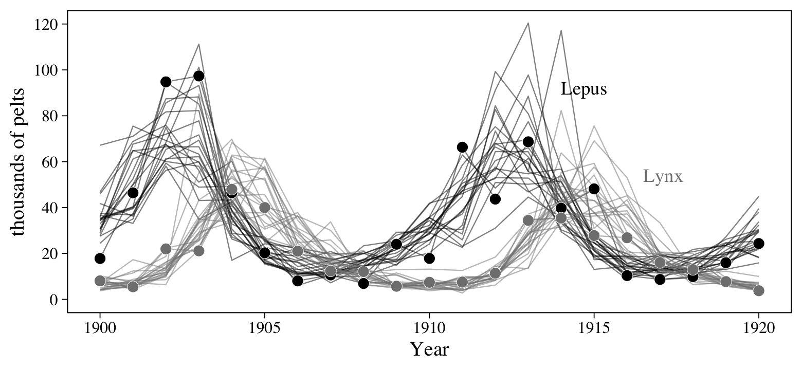

Since this version of the model didn't include a measurement-error process, we don't have a clear way to make an analogue of Figure 16.9b. We'll contend with that in the next section.

#### Add a measurement-error process to the Lotka-Volterra model.

Now we have a sense of what the current Lotka-Volterra workflow looks like for **brms**, we're ready to complicate our model a bit. Happily, we won't need to update our `LotkaVolterra` code. That's good as it is. But we will need to make a couple minor adjustments to our model `formula` object, which we now call `lv_formula_error`. Make special note of the first `bf()` line and the last line before we set `nl = TRUE`. That's where all the measurement-error action is at.


```r
lv_formula_error <- 
  # this is new
  bf(pelts ~ log(eta * p),
     nlf(eta ~ LV(t, H1, L1, bh, mh, bl, ml, delta)),
     H1 ~ 1, L1 ~ 1,
     bh ~ 1, mh ~ 1,
     bl ~ 1, ml ~ 1,
     sigma ~ 0 + population,
     # this is new, too
     p ~ 0 + population,
     nl = TRUE
  )
```

Update the priors and save them as `lv_priors_error`.


```r
lv_priors_error <- c(
  prior(lognormal(log(10), 1), nlpar = H1, lb = 0),
  prior(lognormal(log(10), 1), nlpar = L1, lb = 0),
  prior(normal(1, 0.5),     nlpar = bh, lb = 0),
  prior(normal(0.05, 0.05), nlpar = bl, lb = 0),
  prior(normal(0.05, 0.05), nlpar = mh, lb = 0),
  prior(normal(1, 0.5),     nlpar = ml, lb = 0),
  prior(exponential(1), dpar = sigma, lb = 0),
  # here's our new prior setting
  prior(beta(40, 200), nlpar = p, lb = 0, ub = 1)
)
```

That wasn't all that bad, was it? Okay, fit the full **brms** analogue to McElreath's `m16.5`. If you followed along closely, all should go well.


```r
b16.5b <- 
  brm(data = Lynx_Hare_long, 
      family = brmsfamily("lognormal", link_sigma = "identity"),
      formula = lv_formula_error, 
      prior = lv_priors_error, 
      iter = 2000, warmup = 1000, chains = 4, cores = 4,
      inits = 0,
      stanvars = stanvar(scode = LotkaVolterra, block = "functions"),
      file = "fits/b16.05b")
```

Once again, check the quality of the chains.


```r
col_names <- c("italic(H)[1]", "italic(L)[1]", str_c("italic(", c("b[H]", "m[H]", "b[L]", "m[L]"), ")"), 
               "italic(p[H])", "italic(p[L])", "sigma[italic(H)]", "sigma[italic(L)]", "Chain")

as_draws_df(b16.5b) %>% 
  select(b_H1_Intercept:b_sigma_populationLynx, .chain) %>% 
  set_names(col_names) %>% 
  
  mcmc_trace(facet_args = list(labeller = label_parsed), 
             linewidth = .15) +
  scale_x_continuous(breaks = NULL) +
  theme(legend.key.size = unit(0.15, 'in'),
        legend.position = c(.55, .13))
```


They look great! Now inspect the model parameter summary.


```r
print(b16.5b)
```

```
##  Family: lognormal 
##   Links: mu = identity; sigma = identity 
## Formula: pelts ~ log(eta * p) 
##          eta ~ LV(t, H1, L1, bh, mh, bl, ml, delta)
##          H1 ~ 1
##          L1 ~ 1
##          bh ~ 1
##          mh ~ 1
##          bl ~ 1
##          ml ~ 1
##          sigma ~ 0 + population
##          p ~ 0 + population
##    Data: Lynx_Hare_long (Number of observations: 42) 
##   Draws: 4 chains, each with iter = 2000; warmup = 1000; thin = 1;
##          total post-warmup draws = 4000
## 
## Population-Level Effects: 
##                      Estimate Est.Error l-95% CI u-95% CI Rhat Bulk_ESS Tail_ESS
## H1_Intercept           132.41     21.04    96.90   179.59 1.00     2450     2659
## L1_Intercept            38.49      6.76    27.04    53.13 1.00     2403     2190
## bh_Intercept             0.55      0.06     0.43     0.69 1.00     1828     1923
## mh_Intercept             0.00      0.00     0.00     0.01 1.00     2070     2273
## bl_Intercept             0.00      0.00     0.00     0.01 1.00     1837     2133
## ml_Intercept             0.80      0.09     0.64     1.00 1.00     1783     1953
## p_populationHare         0.18      0.02     0.14     0.23 1.00     2488     2543
## p_populationLynx         0.18      0.02     0.13     0.23 1.00     2294     2328
## sigma_populationHare     0.25      0.04     0.18     0.35 1.00     3245     2396
## sigma_populationLynx     0.25      0.04     0.18     0.36 1.00     3181     2546
## 
## Draws were sampled using sampling(NUTS). For each parameter, Bulk_ESS
## and Tail_ESS are effective sample size measures, and Rhat is the potential
## scale reduction factor on split chains (at convergence, Rhat = 1).
```

If you fit McElreath's `m16.5`, you'll see our parameter summaries are very similar to his. Okay, we're now ready to make the real analogue of McElreath's Figure 16.9. First we'll make and save the plot for the top panel.


```r
p1 <-
  # get the posterior predictive draws
  predict(b16.5b, 
          summary = F, 
          # how many posterior predictive draws would you like?
          ndraws = 21) %>%
  # wrangle
  data.frame() %>% 
  set_names(1:42) %>% 
  mutate(iter = 1:n()) %>% 
  pivot_longer(-iter, names_to = "row") %>% 
  mutate(row = as.double(row)) %>% 
  left_join(Lynx_Hare_long %>% mutate(row = 1:n()),
            by = "row") %>% 

  # plot!
  ggplot(aes(x = Year, y = value)) +
  geom_line(aes(group = interaction(iter, population), color = population),
            linewidth = 1/3, alpha = 1/2) +
  geom_point(data = . %>% filter(iter == 1),
             aes(x = Year, fill = population),
             size = 3, shape = 21, stroke = 1/5, color = "white") +
  geom_text(data = text,
            aes(label = label, color = population),
            hjust = 0, family = "Times") +
  scale_color_grey(start = 0, end = .5, breaks = NULL) +
  scale_fill_grey(start = 0, end = .5, breaks = NULL) +
  scale_y_continuous("thousands of pelts", breaks = 0:6 * 20) +
  scale_x_continuous(NULL, breaks = NULL) +
  coord_cartesian(ylim = c(0, 120))
```

Our workflow for the second panel will differ a bit from above and a lot from McElreath's **rethinking**-based workflow. In essence, we won't get the same kind of output McElreath got when he executed `post <- extract.samples(m16.5)`. Our `post <- as_draws_df(b16.5b)` call only get's us part of the way there. So we'll have to be tricky and supplement those results with a little `fitted()` magic.


```r
post <- as_draws_df(b16.5b)

f <-
  fitted(b16.5b,
         summary = F)
```

Now we're ready to make our version of the bottom panel of Figure 16.9. The trick is to divide our `fitted()` based results by the appropriate posterior draws from our $p$ parameters. This is a way of hand computing the `post$pop` values McElreath showed off in his **R** code 16.20 block.


```r
p2 <-
  cbind(f[, 1:21]  / post$b_p_populationHare,
        f[, 22:42] / post$b_p_populationLynx) %>% 
  data.frame() %>% 
  set_names(1:42) %>% 
  mutate(iter = 1:n()) %>% 
  pivot_longer(-iter, names_to = "row") %>% 
  mutate(row = as.double(row)) %>% 
  left_join(Lynx_Hare_long %>% mutate(row = 1:n()),
            by = "row")  %>% 
  filter(iter < 22) %>% 

  # plot!
  ggplot(aes(x = Year, y = value)) +
  geom_line(aes(group = interaction(iter, population), color = population),
            linewidth = 1/3, alpha = 1/2) +
  scale_color_grey(start = 0, end = .5, breaks = NULL) +
  scale_fill_grey(start = 0, end = .5, breaks = NULL) +
  scale_y_continuous("thousands of animals", breaks = 0:5 * 100) +
  coord_cartesian(ylim = c(0, 500))
```

Now combine the two ggplot2 with **patchwork** to make the full Figure 16.9 in all its glory.


```r
p1 / p2
```

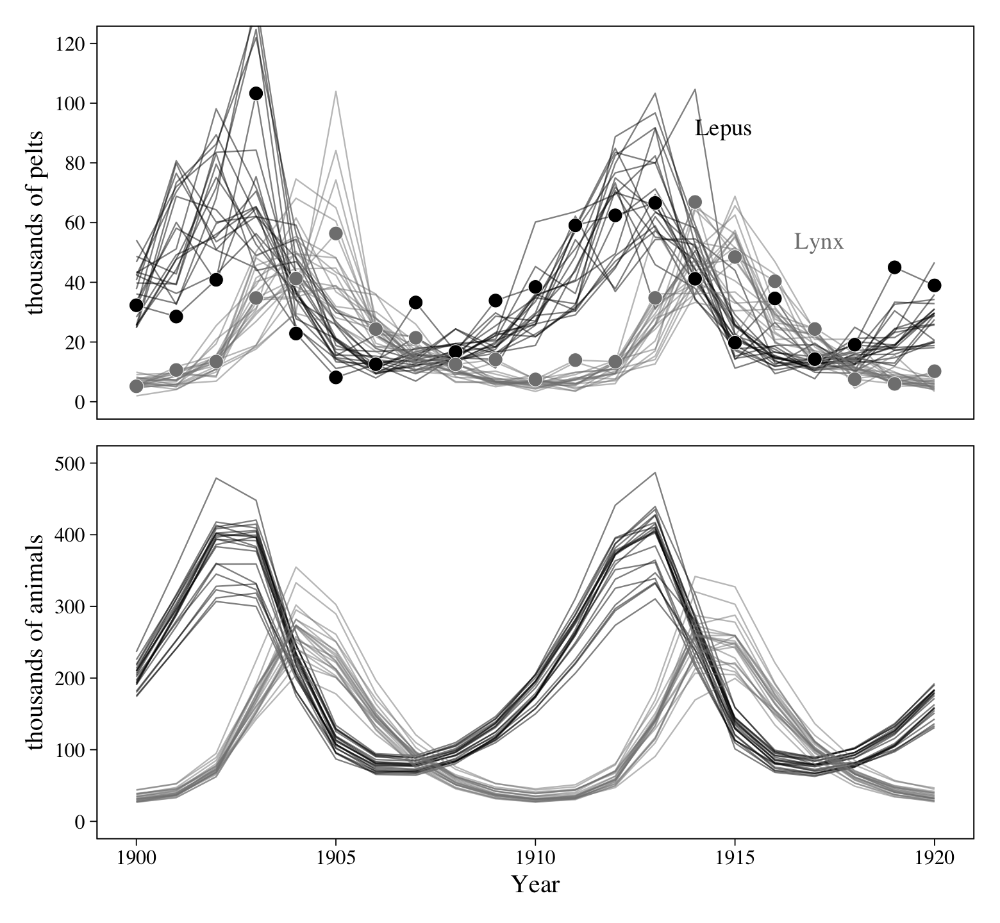

Boom!

### ~~Lynx lessons~~ Bonus: Practice with the autoregressive model.

Back in [Section 16.4][Population dynamics], we briefly discussed how autoregressive models are a typical way to explore processes like those in lynx-hare data. In this bonus section, we'll practice fitting a few of these. To start off, we'll restrict ourselves to focusing on just one of the criteria, `Hare`. Our basic autoregressive model will follow the form

\begin{align*}
\text{Hare}_t & \sim \operatorname{Normal}(\mu_t, \sigma) \\
\mu_t & = \alpha + \beta_1 \text{Hare}_{t - 1} \\
\alpha  & \sim \; ? \\
\beta_1 & \sim \; ? \\
\sigma  & \sim \operatorname{Exponential}(1),
\end{align*}

were $\beta_1$ is the first-order autoregressive coefficient and the question marks in the third and fourth lines indicate we're not wedding ourselves to specific priors, at the moment. Also, note the $t$ subscripts, which denote which time period the observation is drawn from, which in these data is $\text{Year} = 1900, 1901, \dots, 1920$. Conceptually, $t$ is *now* and $t - 1$ the time point just before now. So if we were particularly interested in $\operatorname E (\text{Hare}_{t = 1920})$, $\text{Hare}_{t - 1}$ would be the same as $\text{Hare}_{t = 1919}$.

With **brms**, you can fit a model like this using the `ar()` function. By default, `ar()` presumes the criterion variable (`Hare`, in this case) is ordered chronologically. If you're unsure or just want to be on the safe side, you can enter your *time* variable in the `time` argument. Also, though the `ar()` function presumes a first-order autoregressive structure by default, it is capable of fitting models with higher-order autoregressive structures. You can manually specify this with the `p` argument. Here's how to fit our simple AR(1) model with explicit `ar()` syntax.


```r
b16.6 <-
  brm(data = Lynx_Hare,
      family = gaussian,
      Hare ~ 1 + ar(time = Year, p = 1),
      prior(exponential(0.04669846), class = sigma),
      iter = 2000, warmup = 1000, chains = 4, cores = 4,
      seed = 16,
      file = "fits/b16.06")
```

You may have noticed we just went with the default **brms** priors for $\alpha$ and $\beta_1$. We got the value for the exponential prior for $\sigma$ by executing the following.


```r
1 / sd(Lynx_Hare$Hare)
```

```
## [1] 0.04669846
```

Here's the model summary.


```r
print(b16.6)
```

```
##  Family: gaussian 
##   Links: mu = identity; sigma = identity 
## Formula: Hare ~ 1 + ar(time = Year, p = 1) 
##    Data: Lynx_Hare (Number of observations: 21) 
##   Draws: 4 chains, each with iter = 2000; warmup = 1000; thin = 1;
##          total post-warmup draws = 4000
## 
## Correlation Structures:
##       Estimate Est.Error l-95% CI u-95% CI Rhat Bulk_ESS Tail_ESS
## ar[1]     0.74      0.16     0.41     1.06 1.00     2615     2497
## 
## Population-Level Effects: 
##           Estimate Est.Error l-95% CI u-95% CI Rhat Bulk_ESS Tail_ESS
## Intercept    29.82      9.28     9.70    47.59 1.00     2715     2073
## 
## Family Specific Parameters: 
##       Estimate Est.Error l-95% CI u-95% CI Rhat Bulk_ESS Tail_ESS
## sigma    16.42      2.82    12.05    23.06 1.00     2829     2564
## 
## Draws were sampled using sampling(NUTS). For each parameter, Bulk_ESS
## and Tail_ESS are effective sample size measures, and Rhat is the potential
## scale reduction factor on split chains (at convergence, Rhat = 1).
```

Our autoregressive $\beta_1$ parameter is summarized in the 'Correlation Structures,' in which it's called 'ar[1].' Another more old-school way to fit a autoregressive model is by manually computing a lagged version of your criterion variable. In **R**, you can do this with the `lag()` function.


```r
Lynx_Hare <-
  Lynx_Hare %>% 
  mutate(Hare_1 = lag(Hare))

head(Lynx_Hare)
```

```
##   Year Lynx Hare Hare_1
## 1 1900  4.0 30.0     NA
## 2 1901  6.1 47.2   30.0
## 3 1902  9.8 70.2   47.2
## 4 1903 35.2 77.4   70.2
## 5 1904 59.4 36.3   77.4
## 6 1905 41.7 20.6   36.3
```

Look closely at the relation between the values in the `Hare` and `Hare_1` columns. They are set up such that $\text{Hare}_{\text{Year} = 1901} = \text{Hare_1}_{\text{Year} = 1900}$, $\text{Hare}_{\text{Year} = 1902} = \text{Hare_1}_{\text{Year} = 1901}$, and so on. Unfortunately, this approach does produce a single missing value in the first time point for the lagged variable, `Hare_1`. Here's how you might use such a variable to manually fit an autoregressive model with `brms::brm()`.


```r
b16.7 <-
  brm(data = Lynx_Hare,
      family = gaussian,
      Hare ~ 1 + Hare_1,
      prior = c(prior(normal(0, 1), class = b),
                prior(exponential(0.04669846), class = sigma)),
      iter = 2000, warmup = 1000, chains = 4, cores = 4,
      seed = 16,
      file = "fits/b16.07")
```


```r
print(b16.7)
```

```
##  Family: gaussian 
##   Links: mu = identity; sigma = identity 
## Formula: Hare ~ 1 + Hare_1 
##    Data: Lynx_Hare (Number of observations: 20) 
##   Draws: 4 chains, each with iter = 2000; warmup = 1000; thin = 1;
##          total post-warmup draws = 4000
## 
## Population-Level Effects: 
##           Estimate Est.Error l-95% CI u-95% CI Rhat Bulk_ESS Tail_ESS
## Intercept    10.33      7.57    -4.72    25.08 1.00     3150     2059
## Hare_1        0.68      0.19     0.30     1.04 1.00     3004     2409
## 
## Family Specific Parameters: 
##       Estimate Est.Error l-95% CI u-95% CI Rhat Bulk_ESS Tail_ESS
## sigma    17.08      3.08    12.33    24.50 1.00     2316     1951
## 
## Draws were sampled using sampling(NUTS). For each parameter, Bulk_ESS
## and Tail_ESS are effective sample size measures, and Rhat is the potential
## scale reduction factor on split chains (at convergence, Rhat = 1).
```

Did you notice how the fourth line in the output read 'Number of observations: 20?' That's because we had that one missing value for `Hare_1`. One quick and dirty hack might be to use the missing data syntax we learned from [Chapter 15][Missing Data and Other Opportunities]. Here's how that might look like.


```r
b16.8 <-
  brm(data = Lynx_Hare,
      family = gaussian,
      bf(Hare ~ 1 + mi(Hare_1)) +
        bf(Hare_1 | mi() ~ 1) +
        set_rescor(FALSE),
      prior = c(prior(normal(0, 1), class = b),
                prior(exponential(0.04669846), class = sigma, resp = Hare),
                prior(exponential(0.04669846), class = sigma, resp = Hare1)),
      iter = 2000, warmup = 1000, chains = 4, cores = 4,
      seed = 16,
      file = "fits/b16.08")
```

Check the model summary.


```r
print(b16.8)
```

```
##  Family: MV(gaussian, gaussian) 
##   Links: mu = identity; sigma = identity
##          mu = identity; sigma = identity 
## Formula: Hare ~ 1 + mi(Hare_1) 
##          Hare_1 | mi() ~ 1 
##    Data: Lynx_Hare (Number of observations: 21) 
##   Draws: 4 chains, each with iter = 2000; warmup = 1000; thin = 1;
##          total post-warmup draws = 4000
## 
## Population-Level Effects: 
##                 Estimate Est.Error l-95% CI u-95% CI Rhat Bulk_ESS Tail_ESS
## Hare_Intercept     13.82      6.71     0.21    27.13 1.00     2018     2241
## Hare1_Intercept    33.59      4.77    24.15    42.87 1.00     3223     2781
## Hare_miHare_1       0.61      0.17     0.28     0.95 1.00     2010     2484
## 
## Family Specific Parameters: 
##             Estimate Est.Error l-95% CI u-95% CI Rhat Bulk_ESS Tail_ESS
## sigma_Hare     16.73      2.90    12.08    23.44 1.00     3675     2793
## sigma_Hare1    22.50      3.84    16.41    31.59 1.00     3988     2873
## 
## Draws were sampled using sampling(NUTS). For each parameter, Bulk_ESS
## and Tail_ESS are effective sample size measures, and Rhat is the potential
## scale reduction factor on split chains (at convergence, Rhat = 1).
```

Now we have a model based on all 21 observations, again. I'm still not in love with this fix, because it presumes that value in `Hare_1` was missing at random, with no accounting for the autoregressive structure. This is why, when you can, it's probably better to use the `ar()` syntax.

Anyway, here's how we might use `fitted()` to get a sense of $\operatorname{E}(\text{Hare}_t)$ from our first autoregressive model, `b16.6`.


```r
set.seed(16)

fitted(b16.6,
       summary = F,
       ndraws = 21) %>% 
  data.frame() %>% 
  set_names(1900:1920) %>% 
  mutate(iter = 1:n()) %>% 
  pivot_longer(-iter) %>% 
  mutate(Year = as.integer(name)) %>% 
  
  ggplot(aes(x = Year)) +
  geom_line(aes(y = value, group = iter),
            linewidth = 1/3, alpha = 1/2) +
  geom_point(data = Lynx_Hare,
             aes(y = Hare),
             size = 3, shape = 21, stroke = 1/4, 
             fill = "black", color = "white") +
  annotate(geom = "text",
           x = 1913.5, y = 85,
           label = "Lepus", family = "Times") +
  scale_y_continuous("thousands of hare pelts", breaks = 0:6 * 20, limits = c(0, 120))
```

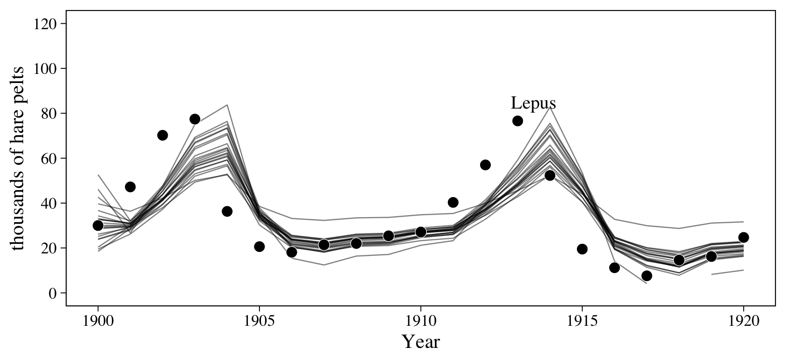

The model did a pretty good job capturing the non-linear trends in the data. But notice how the fitted lines appear to be one step off from the data. This is actually expected behavior for a simple AR(1) model. For insights on why, check out [this thread](https://stats.stackexchange.com/questions/404650/why-is-arima-in-r-one-time-step-off) on Stack Exchange.

So far we've been fitting the autoregressive models with the Gaussian likelihood, which is a typical approach. If you look at McElreath's practice problem 16H3, you'll see he proposed a bivariate autoregressive model using the Log-Normal likelihood. His approach used hand-made lagged predictors and ignored the missing value problem by dropping the first case. That model followed the form

\begin{align*}
L_t & \sim \operatorname{Log-Normal}(\log \mu_{L, t}, \sigma_L) \\
H_t & \sim \operatorname{Log-Normal}(\log \mu_{H, t}, \sigma_H) \\
\mu_{L, t} & = \alpha_L + \beta_{L1} L_{t - 1} + \beta_{L2} H_{t - 1} \\
\mu_{H, t} & = \alpha_H + \beta_{H1} H_{t - 1} + \beta_{H2} L_{t - 1},
\end{align*}

where $\beta_{L1}$ and $\beta_{H1}$ are the autoregressive parameters and $\beta_{L2}$ and $\beta_{H2}$ are what are sometimes called the cross-lag parameters. McElreath left the priors up to us. I propose something like this:

\begin{align*}
\alpha_L & \sim \operatorname{Normal}(\log 10, 1) \\
\alpha_H & \sim \operatorname{Normal}(\log 10, 1) \\
\beta_{L1}, \dots, \beta_{H2} & \sim \operatorname{Normal}(0, 0.5) \\
\sigma_L & \sim \operatorname{Exponential}(1) \\
\sigma_H & \sim \operatorname{Exponential}(1).
\end{align*}

Before we fit the model, we'll need to make a lagged version of `Lynx`.


```r
Lynx_Hare <-
  Lynx_Hare %>% 
  mutate(Lynx_1 = lag(Lynx))
```

Because the predictor variables are not centered at zero, we'll want to use the `0 + Intercept...` syntax. Now fit the bivariate autoregressive model.


```r
b16.9 <-
  brm(data = Lynx_Hare,
      family = lognormal,
      bf(Hare ~ 0 + Intercept + Hare_1 + Lynx_1) +
        bf(Lynx ~ 0 + Intercept + Lynx_1 + Hare_1) +
        set_rescor(FALSE),
      prior = c(prior(normal(log(10), 1), class = b, resp = Hare, coef = Intercept),
                prior(normal(log(10), 1), class = b, resp = Lynx, coef = Intercept),
                prior(normal(0, 0.5), class = b, resp = Hare),
                prior(normal(0, 0.5), class = b, resp = Lynx),
                prior(exponential(1), class = sigma, resp = Hare),
                prior(exponential(1), class = sigma, resp = Lynx)),
      iter = 2000, warmup = 1000, chains = 4, cores = 4,
      seed = 16,
      file = "fits/b16.09")
```

Check the summary.


```r
print(b16.9)
```

```
##  Family: MV(lognormal, lognormal) 
##   Links: mu = identity; sigma = identity
##          mu = identity; sigma = identity 
## Formula: Hare ~ 0 + Intercept + Hare_1 + Lynx_1 
##          Lynx ~ 0 + Intercept + Lynx_1 + Hare_1 
##    Data: Lynx_Hare (Number of observations: 20) 
##   Draws: 4 chains, each with iter = 2000; warmup = 1000; thin = 1;
##          total post-warmup draws = 4000
## 
## Population-Level Effects: 
##                Estimate Est.Error l-95% CI u-95% CI Rhat Bulk_ESS Tail_ESS
## Hare_Intercept     3.02      0.17     2.69     3.35 1.00     2137     2263
## Hare_Hare_1        0.02      0.00     0.01     0.03 1.00     2566     2665
## Hare_Lynx_1       -0.02      0.00    -0.03    -0.01 1.00     3073     2493
## Lynx_Intercept     1.44      0.12     1.19     1.67 1.00     2560     2194
## Lynx_Lynx_1        0.03      0.00     0.02     0.04 1.00     3585     2712
## Lynx_Hare_1        0.02      0.00     0.02     0.03 1.00     3486     2447
## 
## Family Specific Parameters: 
##            Estimate Est.Error l-95% CI u-95% CI Rhat Bulk_ESS Tail_ESS
## sigma_Hare     0.33      0.06     0.24     0.48 1.00     3358     2668
## sigma_Lynx     0.23      0.04     0.17     0.33 1.00     3136     2855
## 
## Draws were sampled using sampling(NUTS). For each parameter, Bulk_ESS
## and Tail_ESS are effective sample size measures, and Rhat is the potential
## scale reduction factor on split chains (at convergence, Rhat = 1).
```

Here we'll use `fitted()` to make a variant of the posterior predictions from the top portion of Figure 16.9.


```r
rbind(fitted(b16.9, resp = "Hare"),
      fitted(b16.9, resp = "Lynx")) %>% 
  data.frame() %>% 
  mutate(name = rep(c("Hare", "Lynx"), each = n() / 2),
         year = rep(1901:1920, times = 2)) %>% 
  
  ggplot(aes(x = year)) +
  geom_ribbon(aes(ymin = Q2.5, ymax = Q97.5, group = name, fill = name),
              alpha = 1/3) +
  geom_line(aes(y = Estimate, group = name, color = name)) +
  geom_point(data = Lynx_Hare %>% pivot_longer(Lynx:Hare),
             aes(x = Year, y = value, color = name),
             size = 2) +
  scale_color_grey(start = 0, end = .5, breaks = NULL) +
  scale_fill_grey(start = 0, end = .5, breaks = NULL) +
  scale_x_continuous(limits = c(1900, 1920)) +
  scale_y_continuous("thousands of pelts", breaks = 0:6 * 20)
```

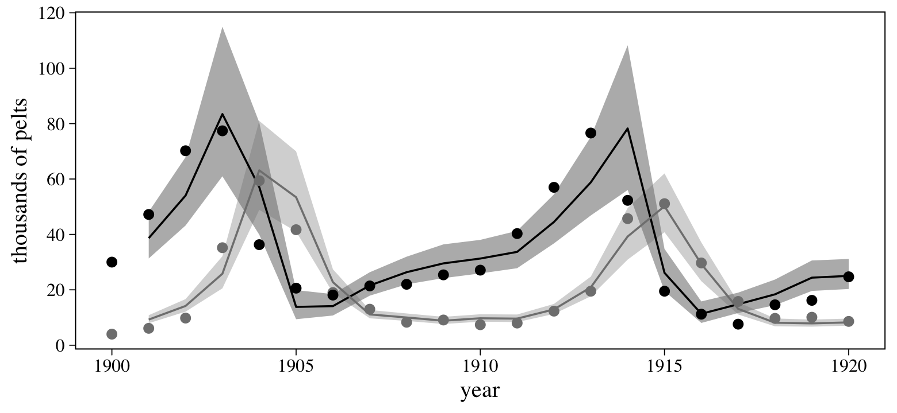

In the next practice problem (16H4), McElreath suggested we "adapt the autoregressive model to use a *two-step* lag variable" (p. 551, *emphasis* added). Using the verbiage from above, we might also refer to that as second-order autoregressive model, AR(2). That would be a straight generalization of the approach we just took. I'll leave the exercise to the interested reader.

The kinds autoregressive models we fit in this section are special cases of what are called **autoregressive moving average** (ARMA) models. If you're in the social sciences, Hamaker and Brose have a nice [-@hamakerIdiographicDataAnalysis2009] chapter explaining AR, ARMA, and other related models, which you can download from ReserachGate [here](https://www.researchgate.net/publication/226943668_Idiographic_Data_Analysis_Quantitative_Methods-From_Simple_to_Advanced). ARMA models are available in **brms** with help from the `arma()` function.

## Session info {-}


```r
sessionInfo()
```

```
## R version 4.2.2 (2022-10-31)
## Platform: x86_64-apple-darwin17.0 (64-bit)
## Running under: macOS Big Sur ... 10.16
## 
## Matrix products: default
## BLAS:   /Library/Frameworks/R.framework/Versions/4.2/Resources/lib/libRblas.0.dylib
## LAPACK: /Library/Frameworks/R.framework/Versions/4.2/Resources/lib/libRlapack.dylib
## 
## locale:
## [1] en_US.UTF-8/en_US.UTF-8/en_US.UTF-8/C/en_US.UTF-8/en_US.UTF-8
## 
## attached base packages:
## [1] parallel  stats     graphics  grDevices utils     datasets  methods   base     
## 
## other attached packages:
##  [1] bayesplot_1.10.0     patchwork_1.1.2      rethinking_2.21      cmdstanr_0.5.3       rstan_2.21.8        
##  [6] StanHeaders_2.21.0-7 GGally_2.1.2         brms_2.18.0          Rcpp_1.0.9           tidybayes_3.0.2     
## [11] ggthemes_4.2.4       forcats_0.5.1        stringr_1.4.1        dplyr_1.0.10         purrr_1.0.1         
## [16] readr_2.1.2          tidyr_1.2.1          tibble_3.1.8         ggplot2_3.4.0        tidyverse_1.3.2     
## 
## loaded via a namespace (and not attached):
##   [1] readxl_1.4.1         backports_1.4.1      RcppEigen_0.3.3.9.3  plyr_1.8.7           igraph_1.3.4        
##   [6] splines_4.2.2        svUnit_1.0.6         crosstalk_1.2.0      TH.data_1.1-1        rstantools_2.2.0    
##  [11] inline_0.3.19        digest_0.6.31        htmltools_0.5.3      fansi_1.0.3          BH_1.78.0-0         
##  [16] magrittr_2.0.3       checkmate_2.1.0      googlesheets4_1.0.1  tzdb_0.3.0           modelr_0.1.8        
##  [21] RcppParallel_5.1.5   matrixStats_0.63.0   xts_0.12.1           sandwich_3.0-2       prettyunits_1.1.1   
##  [26] colorspace_2.0-3     rvest_1.0.2          ggdist_3.2.1         haven_2.5.1          xfun_0.35           
##  [31] callr_3.7.3          crayon_1.5.2         jsonlite_1.8.4       lme4_1.1-31          survival_3.4-0      
##  [36] zoo_1.8-10           glue_1.6.2           gtable_0.3.1         gargle_1.2.0         emmeans_1.8.0       
##  [41] distributional_0.3.1 pkgbuild_1.3.1       shape_1.4.6          abind_1.4-5          scales_1.2.1        
##  [46] mvtnorm_1.1-3        emo_0.0.0.9000       DBI_1.1.3            miniUI_0.1.1.1       xtable_1.8-4        
##  [51] stats4_4.2.2         DT_0.24              htmlwidgets_1.5.4    httr_1.4.4           threejs_0.3.3       
##  [56] RColorBrewer_1.1-3   arrayhelpers_1.1-0   posterior_1.3.1      ellipsis_0.3.2       reshape_0.8.9       
##  [61] pkgconfig_2.0.3      loo_2.5.1            farver_2.1.1         sass_0.4.2           dbplyr_2.2.1        
##  [66] utf8_1.2.2           labeling_0.4.2       tidyselect_1.2.0     rlang_1.0.6          reshape2_1.4.4      
##  [71] later_1.3.0          munsell_0.5.0        cellranger_1.1.0     tools_4.2.2          cachem_1.0.6        
##  [76] cli_3.6.0            generics_0.1.3       broom_1.0.2          evaluate_0.18        fastmap_1.1.0       
##  [81] processx_3.8.0       knitr_1.40           fs_1.5.2             nlme_3.1-160         projpred_2.2.1      
##  [86] mime_0.12            xml2_1.3.3           compiler_4.2.2       shinythemes_1.2.0    rstudioapi_0.13     
##  [91] gamm4_0.2-6          reprex_2.0.2         bslib_0.4.0          stringi_1.7.8        highr_0.9           
##  [96] ps_1.7.2             Brobdingnag_1.2-8    lattice_0.20-45      Matrix_1.5-1         nloptr_2.0.3        
## [101] markdown_1.1         shinyjs_2.1.0        tensorA_0.36.2       vctrs_0.5.1          pillar_1.8.1        
## [106] lifecycle_1.0.3      jquerylib_0.1.4      bridgesampling_1.1-2 estimability_1.4.1   httpuv_1.6.5        
## [111] R6_2.5.1             bookdown_0.28        promises_1.2.0.1     gridExtra_2.3        codetools_0.2-18    
## [116] boot_1.3-28          MASS_7.3-58.1        colourpicker_1.1.1   gtools_3.9.4         assertthat_0.2.1    
## [121] withr_2.5.0          shinystan_2.6.0      multcomp_1.4-20      mgcv_1.8-41          hms_1.1.1           
## [126] grid_4.2.2           minqa_1.2.5          coda_0.19-4          rmarkdown_2.16       googledrive_2.0.0   
## [131] shiny_1.7.2          lubridate_1.8.0      base64enc_0.1-3      dygraphs_1.1.1.6
```


[^9]: We first fit this model with **brms** version 2.14.4. At that time, the only way to get it to run successfully was by using `backend = "cmdstan"`. I'm not really interested in tackling what that setting means, but rest assured that exciting things are happening for **brms** and Stan. If you'd like to learn more, check out the [-@Weber2022WithinChainParallelization] vignette by Webber and Bürkner, [*Running brms models with within-chain parallelization*](https://CRAN.R-project.org/package=brms/vignettes/brms_threading.html). But anyways, the current version of **brms** (2.15.0) no longer requires that `backend` setting and the complications it entails. The default works fine.

