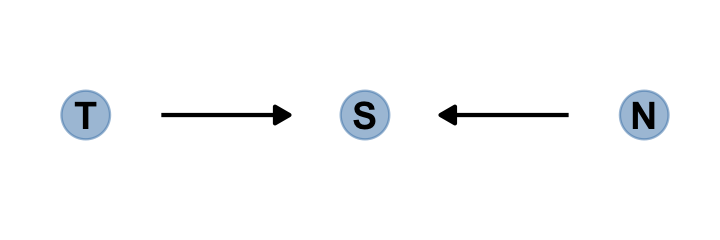
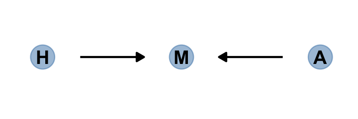
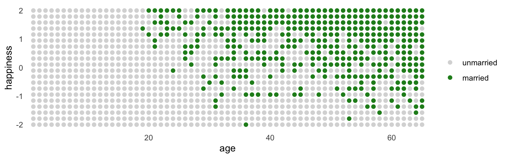

# The Haunted DAG & The Causal Terror

#### Overthinking: Simulated science distortion.

``` r
library(tidyverse)
library(brms)
library(bayesplot)
library(tidybayes)
library(GGally)
library(ggdag)
library(dagitty)


theme_set(theme_minimal())
color_scheme_set("orange")
```

## Multicollinearity

### Multicollinear legs.

### Multicollinear `milk`.

#### Rethinking: Identification guaranteed; comprehension up to you.

#### Overthinking: Simulating collinearity.

## Post-treatment bias

### A prior is born.

### Blocked by consequence.

### Fungus and *d*-separation.

``` r
gg_simple_dag <- function(d) {
  
  d %>% 
    ggplot(aes(x = x, y = y, xend = xend, yend = yend)) +
    geom_dag_point(color = "steelblue", alpha = 1/2, size = 6.5) +
    geom_dag_text(color = "black") +
    geom_dag_edges() + 
    theme_dag()
  
}
```

#### Rethinking: Model selection doesn’t help.

## Collider bias

``` r
dag_coords <-
  tibble(name = c("T", "S", "N"),
         x    = 1:3,
         y    = 1)

dagify(S ~ T + N,
       coords = dag_coords) %>%
  gg_simple_dag()
```



### Collider of false sorrow.

All it takes is a single `mutate()` line in the `dagify()` function to
amend our previous DAG.

``` r
dagify(M ~ H + A,
       coords = dag_coords %>%
         mutate(name = c("H", "M", "A"))) %>%
  gg_simple_dag()
```



In this made-up example,

> happiness (*H*) and age (*A*) both cause marriage (*M*). Marriage is
> therefore a collider. Even though there is no causal association
> between happiness and age, if we condition on marriage–which means
> here, if we include it as a predictor in a regression–then it will
> induce a statistical association between age and happiness. And this
> can mislead us to think that happiness changes with age, when in fact
> it is constant.
>
> To convince you of this, let’s do another simulation. (pp. 176–177)

McElreath simulated the data for this section using his custom
`rethinking::sim_happiness()` function. If you’d like to see the guts of
the function, execute `rethinking::sim_happiness`. Our approach will be
to simulate the data from the ground up. The workflow to follow is based
on help from the great [Randall Pruim](https://github.com/rpruim); I was
initially stumped and he [lent a helping
hand](https://github.com/ASKurz/Statistical_Rethinking_with_brms_ggplot2_and_the_tidyverse_2_ed/issues/26).
The first step is to make a simple `new_borns()` function, which returns
a tibble with `n` unmarried one-year-old’s who have different levels of
happiness. We’ll set the default for `n` at `20`.

``` r
new_borns <- function(n = 20) {
  tibble(a = 1,                                       # 1 year old
         m = 0,                                       # not married
         h = seq(from = -2, to = 2, length.out = n))  # range of happiness scores
}
```

Here’s how it works.

``` r
new_borns()
```

    ## # A tibble: 20 x 3
    ##        a     m      h
    ##    <dbl> <dbl>  <dbl>
    ##  1     1     0 -2    
    ##  2     1     0 -1.79 
    ##  3     1     0 -1.58 
    ##  4     1     0 -1.37 
    ##  5     1     0 -1.16 
    ##  6     1     0 -0.947
    ##  7     1     0 -0.737
    ##  8     1     0 -0.526
    ##  9     1     0 -0.316
    ## 10     1     0 -0.105
    ## 11     1     0  0.105
    ## 12     1     0  0.316
    ## 13     1     0  0.526
    ## 14     1     0  0.737
    ## 15     1     0  0.947
    ## 16     1     0  1.16 
    ## 17     1     0  1.37 
    ## 18     1     0  1.58 
    ## 19     1     0  1.79 
    ## 20     1     0  2

The second step is to make another custom function,
`update_population()`, which takes the input from `new_borns()`. This
function will age up the simulated one-year-old’s from `new_borns()`,
add another cohort of `new_borns()`, and append the cohorts. As you
iterate, the initial cohort of `new_borns()` will eventually hit the age
of 18, which is also the age they’re first eligible to marry
(`aom = 18`). At that age and up, the happier people are more likely to
get married than the less happy folks. You’ll also see that our
simulation follows McElreath’s in that we remove people from the
population after the age of 65. 🤷

``` r
update_population <- function(pop, n_births = 20, aom = 18, max_age = 65) {
  
  pop %>%
    mutate(a = a + 1,  # everyone gets one year older
           # some people get married
           m = ifelse(m >= 1, 1, (a >= aom) * rbinom(n(), 1, rethinking::inv_logit(h - 4)))) %>%
    filter(a <= max_age) %>%        # old people die
    bind_rows(new_borns(n_births))  # new people are born
  
}
```

Here’s what it looks like if we start with an initial `new_borns()` and
pump them into `update_population()`.

``` r
new_borns() %>% 
  update_population()
```

    ## # A tibble: 40 x 3
    ##        a     m      h
    ##    <dbl> <dbl>  <dbl>
    ##  1     2     0 -2    
    ##  2     2     0 -1.79 
    ##  3     2     0 -1.58 
    ##  4     2     0 -1.37 
    ##  5     2     0 -1.16 
    ##  6     2     0 -0.947
    ##  7     2     0 -0.737
    ##  8     2     0 -0.526
    ##  9     2     0 -0.316
    ## 10     2     0 -0.105
    ## # … with 30 more rows

For our final step, we run the population simulation for 1,000 years.

``` r
# this was McElreath's seed
set.seed(1977)

# year 1
d <- new_borns(n = 20)

# years 2 through 1000
for(i in 2:1000) {
  d <- update_population(d, n_births = 20, aom = 18, max_age = 65)
}

# now rename()
d <- 
  d %>% 
  rename(age = a, married = m, happiness = h)

# take a look
glimpse(d)
```

    ## Rows: 1,300
    ## Columns: 3
    ## $ age       <dbl> 65, 65, 65, 65, 65, 65, 65, 65, 65, 65, 65, 65, 65, 65, 65, 65, 65, 65, 65, 65, …
    ## $ married   <dbl> 0, 0, 0, 1, 1, 0, 0, 0, 1, 1, 1, 1, 1, 1, 1, 1, 0, 1, 1, 1, 0, 0, 1, 1, 0, 0, 1,…
    ## $ happiness <dbl> -2.0000000, -1.7894737, -1.5789474, -1.3684211, -1.1578947, -0.9473684, -0.73684…

Summarize the variables.

``` r
d %>% 
  pivot_longer(everything()) %>% 
  group_by(name) %>% 
  mean_qi(value) %>% 
  mutate_if(is.double, round, digits = 2)
```

    ## # A tibble: 3 x 7
    ##   name      value .lower .upper .width .point .interval
    ##   <chr>     <dbl>  <dbl>  <dbl>  <dbl> <chr>  <chr>    
    ## 1 age        33        2     64   0.95 mean   qi       
    ## 2 happiness   0       -2      2   0.95 mean   qi       
    ## 3 married     0.3      0      1   0.95 mean   qi

Here’s our version of Figure 6.5.

``` r
d %>% 
  mutate(married = factor(married, labels = c("unmarried", "married"))) %>% 
  
  ggplot(aes(x = age, y = happiness, color = married)) +
  geom_point(size = 1.75) +
  scale_color_manual(NULL, values = c("grey85", "forestgreen")) +
  scale_x_continuous(expand = c(.015, .015)) +
  theme(panel.grid = element_blank())
```



Here’s the likelihood for the simple Gaussian multivariable model
predicting happiness:

where married\[*i*\] is the marriage status of individual *i*. Here we
make `d2`, the subset of `d` containing only those 18 and up. We then
make a new `age` variable, `a`, which is scaled such that 18 = 0,
65 = 1, and so on.

``` r
d2 <-
  d %>% 
  filter(age > 17) %>% 
  mutate(a = (age - 18) / (65 - 18))

head(d2)
```

    ## # A tibble: 6 x 4
    ##     age married happiness     a
    ##   <dbl>   <dbl>     <dbl> <dbl>
    ## 1    65       0    -2         1
    ## 2    65       0    -1.79      1
    ## 3    65       0    -1.58      1
    ## 4    65       1    -1.37      1
    ## 5    65       1    -1.16      1
    ## 6    65       0    -0.947     1

With respect to priors,

> happiness is on an arbitrary scale, in these data, from  − 2 to  + 2.
> So our imaginary strongest relationship, taking happiness from maximum
> to minimum, has a slope with rise over run of (2 − ( − 2))/1 = 4.
> Remember that 95% of the mass of a normal distribution is contained
> within 2 standard deviations. So if we set the standard deviation of
> the prior to half of 4, we are saying that we expect 95% of plausible
> slopes to be less than maximally strong. That isn’t a very strong
> prior, but again, it at least helps bound inference to realistic
> ranges. Now for the intercepts. Each *α* is the value of
> *μ*<sub>*i*</sub> when *A*<sub>*i*</sub> = 0. In this case, that means
> at age 18. So we need to allow *α* to cover the full range of
> happiness scores. Normal (0, 1) will put 95% of the mass in the  − 2
> to  + 2 interval. (p. 178)

Here we’ll take one last step before fitting our model with **brms**.
Saving the `mid` index variable as a factor will make it easier to
interpret the model results. To see what I mean, skip this step, fit the
model, and compare your results with mine, below.

``` r
d2 <-
  d2 %>% 
  mutate(mid = factor(married + 1, labels = c("single", "married")))

head(d2)
```

    ## # A tibble: 6 x 5
    ##     age married happiness     a mid    
    ##   <dbl>   <dbl>     <dbl> <dbl> <fct>  
    ## 1    65       0    -2         1 single 
    ## 2    65       0    -1.79      1 single 
    ## 3    65       0    -1.58      1 single 
    ## 4    65       1    -1.37      1 married
    ## 5    65       1    -1.16      1 married
    ## 6    65       0    -0.947     1 single

&lt;&lt;refit the models. the data is slightly different&gt;&gt;

## Session info

``` r
sessionInfo()
```

    ## R version 4.0.4 (2021-02-15)
    ## Platform: x86_64-apple-darwin17.0 (64-bit)
    ## Running under: macOS Catalina 10.15.7
    ## 
    ## Matrix products: default
    ## BLAS:   /Library/Frameworks/R.framework/Versions/4.0/Resources/lib/libRblas.dylib
    ## LAPACK: /Library/Frameworks/R.framework/Versions/4.0/Resources/lib/libRlapack.dylib
    ## 
    ## locale:
    ## [1] en_US.UTF-8/en_US.UTF-8/en_US.UTF-8/C/en_US.UTF-8/en_US.UTF-8
    ## 
    ## attached base packages:
    ## [1] stats     graphics  grDevices utils     datasets  methods   base     
    ## 
    ## other attached packages:
    ##  [1] dagitty_0.3-1   ggdag_0.2.3     GGally_2.1.1    tidybayes_2.3.1 bayesplot_1.8.0 brms_2.15.0    
    ##  [7] Rcpp_1.0.6      forcats_0.5.1   stringr_1.4.0   dplyr_1.0.5     purrr_0.3.4     readr_1.4.0    
    ## [13] tidyr_1.1.3     tibble_3.1.0    ggplot2_3.3.3   tidyverse_1.3.0
    ## 
    ## loaded via a namespace (and not attached):
    ##   [1] readxl_1.3.1         backports_1.2.1      plyr_1.8.6           igraph_1.2.6        
    ##   [5] splines_4.0.4        svUnit_1.0.3         crosstalk_1.1.0.1    TH.data_1.0-10      
    ##   [9] rstantools_2.1.1     inline_0.3.17        digest_0.6.27        htmltools_0.5.1.1   
    ##  [13] rethinking_2.13      viridis_0.5.1        rsconnect_0.8.16     fansi_0.4.2         
    ##  [17] magrittr_2.0.1       graphlayouts_0.7.1   modelr_0.1.8         RcppParallel_5.0.2  
    ##  [21] matrixStats_0.57.0   xts_0.12.1           sandwich_3.0-0       prettyunits_1.1.1   
    ##  [25] colorspace_2.0-0     ggrepel_0.9.1        rvest_0.3.6          ggdist_2.4.0.9000   
    ##  [29] haven_2.3.1          xfun_0.22            callr_3.5.1          crayon_1.4.1        
    ##  [33] jsonlite_1.7.2       lme4_1.1-25          survival_3.2-7       zoo_1.8-8           
    ##  [37] glue_1.4.2           polyclip_1.10-0      gtable_0.3.0         emmeans_1.5.2-1     
    ##  [41] V8_3.4.0             distributional_0.2.2 pkgbuild_1.2.0       rstan_2.21.2        
    ##  [45] shape_1.4.5          abind_1.4-5          scales_1.1.1         mvtnorm_1.1-1       
    ##  [49] emo_0.0.0.9000       DBI_1.1.0            miniUI_0.1.1.1       viridisLite_0.3.0   
    ##  [53] xtable_1.8-4         stats4_4.0.4         StanHeaders_2.21.0-7 DT_0.16             
    ##  [57] htmlwidgets_1.5.2    httr_1.4.2           threejs_0.3.3        RColorBrewer_1.1-2  
    ##  [61] arrayhelpers_1.1-0   ellipsis_0.3.1       reshape_0.8.8        farver_2.0.3        
    ##  [65] pkgconfig_2.0.3      loo_2.4.1            dbplyr_2.0.0         utf8_1.1.4          
    ##  [69] labeling_0.4.2       tidyselect_1.1.0     rlang_0.4.10         reshape2_1.4.4      
    ##  [73] later_1.1.0.1        munsell_0.5.0        cellranger_1.1.0     tools_4.0.4         
    ##  [77] cli_2.3.1            generics_0.1.0       broom_0.7.5          ggridges_0.5.2      
    ##  [81] evaluate_0.14        fastmap_1.0.1        yaml_2.2.1           processx_3.4.5      
    ##  [85] knitr_1.31           fs_1.5.0             tidygraph_1.2.0      ggraph_2.0.4        
    ##  [89] nlme_3.1-152         mime_0.10            projpred_2.0.2       xml2_1.3.2          
    ##  [93] compiler_4.0.4       shinythemes_1.1.2    rstudioapi_0.13      gamm4_0.2-6         
    ##  [97] curl_4.3             reprex_0.3.0         tweenr_1.0.1         statmod_1.4.35      
    ## [101] stringi_1.5.3        highr_0.8            ps_1.6.0             Brobdingnag_1.2-6   
    ## [105] lattice_0.20-41      Matrix_1.3-2         nloptr_1.2.2.2       markdown_1.1        
    ## [109] shinyjs_2.0.0        vctrs_0.3.6          pillar_1.5.1         lifecycle_1.0.0     
    ## [113] bridgesampling_1.0-0 estimability_1.3     httpuv_1.5.4         R6_2.5.0            
    ## [117] promises_1.1.1       gridExtra_2.3        codetools_0.2-18     boot_1.3-26         
    ## [121] colourpicker_1.1.0   MASS_7.3-53          gtools_3.8.2         assertthat_0.2.1    
    ## [125] withr_2.4.1          shinystan_2.5.0      multcomp_1.4-16      mgcv_1.8-33         
    ## [129] parallel_4.0.4       hms_0.5.3            grid_4.0.4           coda_0.19-4         
    ## [133] minqa_1.2.4          rmarkdown_2.7        ggforce_0.3.2        shiny_1.5.0         
    ## [137] lubridate_1.7.9.2    base64enc_0.1-3      dygraphs_1.1.1.6
