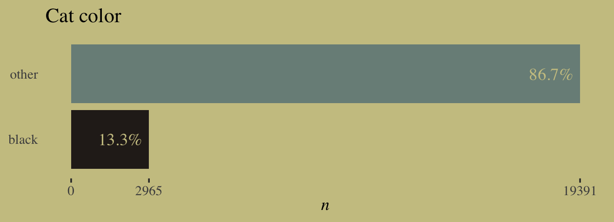
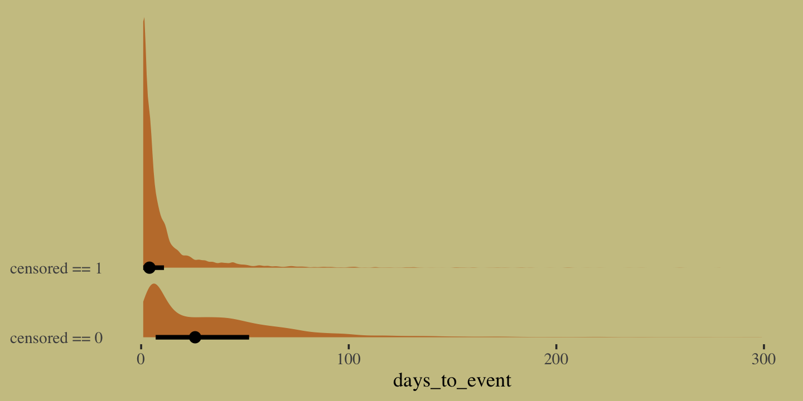
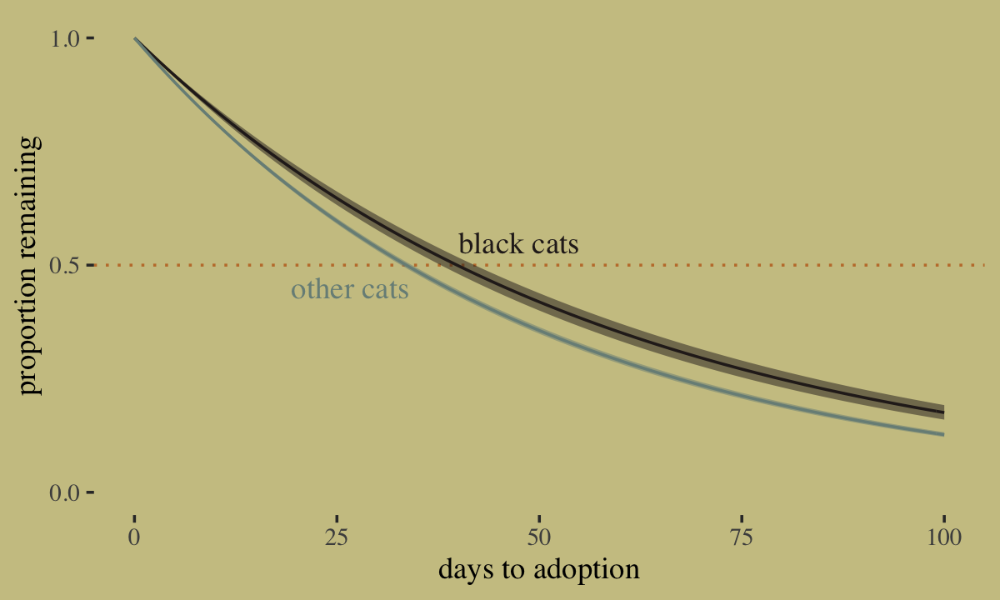
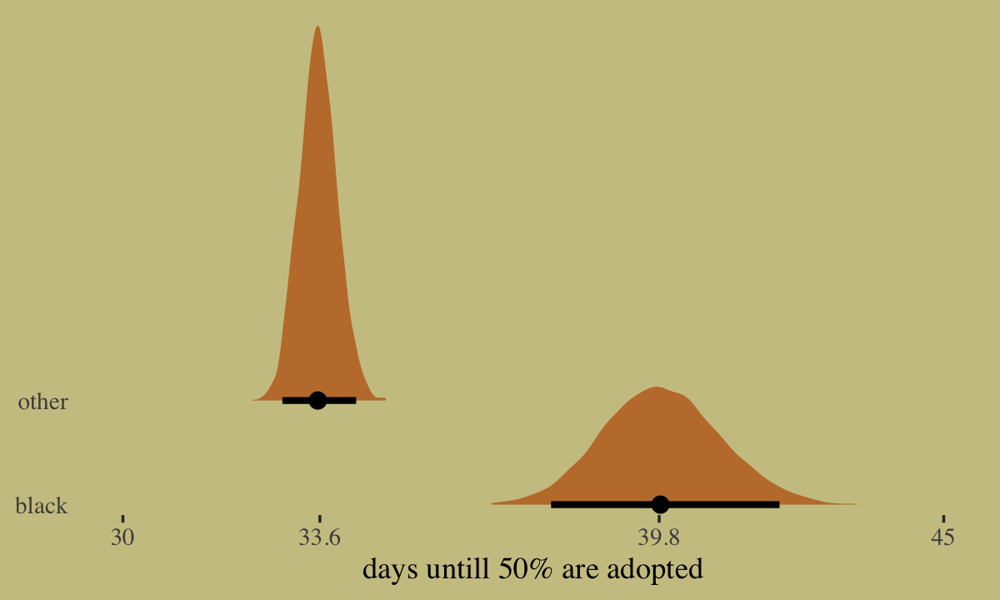

Ch. 11.5 Bonus: Survival analysis
================
A Solomon Kurz
2020-11-10

These will have already been set.

``` r
# install.packages("wesanderson", dependencies = T)
library(tidyverse)
library(wesanderson)
library(ggthemes)
library(brms)
library(tidybayes)

theme_set(
  theme_default() + 
    theme_tufte() +
    theme(plot.background = element_rect(fill = wes_palette("Moonrise2")[3],
                                         color = wes_palette("Moonrise2")[3]))
)
```

## 11.5 Bonus: Survival analysis

In the middle of the [thirteenth lecture of his 2019 lecture
series](https://www.youtube.com/watch?v=p7g-CgGCS34&feature=youtu.be&t=1423),
McElreath briefly covered continuous-time survival analysis. Sadly, the
problem didn’t make it into the text. Here we’ll slip it in as a bonus
section. To fully understand this section, do listen to this section of
the lecture. It’s only about ten minutes.

Now let’s load the `AustinCats` data.

``` r
data(AustinCats, package = "rethinking")
d <- AustinCats
rm(AustinCats)

glimpse(d)
```

    ## Rows: 22,356
    ## Columns: 9
    ## $ id            <fct> A730601, A679549, A683656, A709749, A733551, A756485, A732960, A664571, A727402, A749…
    ## $ days_to_event <int> 1, 25, 4, 41, 9, 4, 4, 5, 24, 2, 34, 27, 3, 151, 106, 4, 55, 1, 4, 30, 18, 5, 34, 1, …
    ## $ date_out      <fct> 07/08/2016 09:00:00 AM, 06/16/2014 01:54:00 PM, 07/17/2014 04:57:00 PM, 09/22/2015 12…
    ## $ out_event     <fct> Transfer, Transfer, Adoption, Transfer, Transfer, Adoption, Adoption, Adoption, Adopt…
    ## $ date_in       <fct> 07/07/2016 12:11:00 PM, 05/22/2014 03:43:00 PM, 07/13/2014 01:20:00 PM, 08/12/2015 06…
    ## $ in_event      <fct> Stray, Stray, Stray, Stray, Stray, Stray, Stray, Owner Surrender, Stray, Stray, Stray…
    ## $ breed         <fct> Domestic Shorthair Mix, Domestic Shorthair Mix, Snowshoe Mix, Domestic Shorthair Mix,…
    ## $ color         <fct> Blue Tabby, Black/White, Lynx Point, Calico, Brown Tabby/White, Blue Tabby, Calico, T…
    ## $ intake_age    <int> 7, 1, 2, 12, 1, 1, 2, 24, 1, 3, 4, 12, 1, 7, 0, 12, 1, 12, 1, 24, 24, 3, 1, 24, 1, 24…

At the moment, it doesn’t look like the **rethinking** package contains
documentation about the `AustinCats`. Based on McElreath’s lecture, he
downloaded them from the website of an animal shelter in Austin, TX. We
have data on 22,356 cats on whether they were adopted and how long it
took. The cats came in a variety of colors.

``` r
d %>% 
  count(color)
```

    ##                         color    n
    ## 1                      Agouti    3
    ## 2          Agouti/Brown Tabby    1
    ## 3                Agouti/White    1
    ## 4                     Apricot    1
    ## 5                       Black 2965
    ## 6                 Black Smoke   83
    ## 7     Black Smoke/Black Tiger    1
    ## 8           Black Smoke/White   21
    ## 9                 Black Tabby  119
    ## 10          Black Tabby/White   43
    ## 11                Black Tiger    2
    ## 12                Black/Black   41
    ## 13          Black/Black Smoke    1
    ## 14                 Black/Blue    2
    ## 15                Black/Brown    2
    ## 16          Black/Brown Tabby    3
    ## 17                 Black/Gray    3
    ## 18               Black/Orange    4
    ## 19               Black/Silver    3
    ## 20         Black/Silver Tabby    1
    ## 21               Black/Tortie    1
    ## 22                Black/White 2113
    ## 23                       Blue  813
    ## 24                 Blue Cream   31
    ## 25      Blue Cream/Blue Tabby    1
    ## 26            Blue Cream/Buff    1
    ## 27          Blue Cream/Tortie    3
    ## 28           Blue Cream/White    2
    ## 29                 Blue Point   38
    ## 30           Blue Point/Cream    1
    ## 31           Blue Point/White    5
    ## 32                 Blue Smoke    8
    ## 33            Blue Smoke/Gray    1
    ## 34           Blue Smoke/White    3
    ## 35                 Blue Tabby  865
    ## 36           Blue Tabby/Black    1
    ## 37      Blue Tabby/Blue Cream    1
    ## 38            Blue Tabby/Buff    1
    ## 39           Blue Tabby/Cream    3
    ## 40          Blue Tabby/Orange    1
    ## 41             Blue Tabby/Tan    1
    ## 42           Blue Tabby/White  432
    ## 43                  Blue/Blue    1
    ## 44                 Blue/Brown    1
    ## 45                Blue/Calico    1
    ## 46                  Blue/Gray    1
    ## 47                Blue/Tortie    2
    ## 48                 Blue/White  621
    ## 49                      Brown   10
    ## 50              Brown Brindle    1
    ## 51                Brown Merle    1
    ## 52                Brown Tabby 3401
    ## 53         Brown Tabby/Agouti    1
    ## 54          Brown Tabby/Black   31
    ## 55  Brown Tabby/Black Brindle    1
    ## 56          Brown Tabby/Brown    5
    ## 57    Brown Tabby/Brown Tabby    1
    ## 58           Brown Tabby/Gray    1
    ## 59         Brown Tabby/Orange    4
    ## 60   Brown Tabby/Orange Tabby    1
    ## 61         Brown Tabby/Tortie    5
    ## 62          Brown Tabby/White 1794
    ## 63                Brown Tiger    5
    ## 64          Brown Tiger/White    2
    ## 65                Brown/Black    3
    ## 66          Brown/Black Tabby    1
    ## 67          Brown/Brown Tabby    2
    ## 68                 Brown/Buff    1
    ## 69                Brown/White    8
    ## 70                       Buff    2
    ## 71          Buff/Orange Tabby    1
    ## 72                 Buff/White    1
    ## 73                     Calico  994
    ## 74               Calico Point   41
    ## 75          Calico Point/Gray    1
    ## 76         Calico Point/White    3
    ## 77               Calico/Black    9
    ## 78          Calico/Blue Cream    3
    ## 79               Calico/Brown    3
    ## 80         Calico/Brown Tabby    4
    ## 81              Calico/Calico    1
    ## 82              Calico/Orange    2
    ## 83            Calico/Tricolor    2
    ## 84               Calico/White   58
    ## 85                  Chocolate   13
    ## 86            Chocolate Point   40
    ## 87      Chocolate Point/White    9
    ## 88            Chocolate/White    4
    ## 89                      Cream   23
    ## 90                Cream Tabby  399
    ## 91    Cream Tabby/Cream Tabby    1
    ## 92         Cream Tabby/Orange    1
    ## 93   Cream Tabby/Orange Tabby    1
    ## 94          Cream Tabby/White  191
    ## 95                Cream/Black    1
    ## 96           Cream/Blue Point    1
    ## 97                Cream/Brown    1
    ## 98               Cream/Orange    2
    ## 99           Cream/Seal Point    2
    ## 100               Cream/White   14
    ## 101                      Fawn    1
    ## 102               Flame Point  142
    ## 103         Flame Point/Cream    1
    ## 104         Flame Point/White    3
    ## 105                      Gray   39
    ## 106                Gray Tabby   80
    ## 107          Gray Tabby/Black   17
    ## 108           Gray Tabby/Gray    2
    ## 109         Gray Tabby/Orange    1
    ## 110          Gray Tabby/White   56
    ## 111                Gray/Black    2
    ## 112                 Gray/Gray    7
    ## 113                  Gray/Tan    1
    ## 114               Gray/Tortie    2
    ## 115                Gray/White   37
    ## 116               Lilac Point   58
    ## 117         Lilac Point/White    6
    ## 118                Lynx Point  327
    ## 119           Lynx Point/Blue    1
    ## 120    Lynx Point/Brown Tabby    1
    ## 121     Lynx Point/Gray Tabby    1
    ## 122            Lynx Point/Tan    1
    ## 123   Lynx Point/Tortie Point    2
    ## 124          Lynx Point/White   41
    ## 125                    Orange   23
    ## 126              Orange Tabby 1562
    ## 127      Orange Tabby/Apricot    1
    ## 128        Orange Tabby/Brown    1
    ## 129        Orange Tabby/Cream    4
    ## 130       Orange Tabby/Orange    1
    ## 131 Orange Tabby/Orange Tabby    1
    ## 132        Orange Tabby/White  858
    ## 133              Orange Tiger    1
    ## 134              Orange/White   33
    ## 135                     Sable    1
    ## 136                Seal Point  262
    ## 137          Seal Point/Brown    1
    ## 138           Seal Point/Buff    1
    ## 139          Seal Point/Cream    1
    ## 140           Seal Point/Gray    1
    ## 141          Seal Point/White   35
    ## 142                    Silver    3
    ## 143         Silver Lynx Point    9
    ## 144   Silver Lynx Point/White    1
    ## 145              Silver Tabby   54
    ## 146        Silver Tabby/Black    1
    ## 147        Silver Tabby/White   19
    ## 148                       Tan    2
    ## 149                 Tan/Brown    2
    ## 150                    Torbie  662
    ## 151              Torbie/Black    2
    ## 152         Torbie/Blue Cream    2
    ## 153         Torbie/Blue Tabby    2
    ## 154              Torbie/Brown    1
    ## 155        Torbie/Brown Tabby    2
    ## 156               Torbie/Gray    2
    ## 157       Torbie/Silver Tabby    1
    ## 158              Torbie/White  146
    ## 159                    Tortie 1057
    ## 160              Tortie Point   47
    ## 161         Tortie Point/Blue    1
    ## 162   Tortie Point/Lynx Point    1
    ## 163        Tortie Point/White    6
    ## 164              Tortie/Black   19
    ## 165        Tortie/Black Smoke    1
    ## 166               Tortie/Blue    2
    ## 167         Tortie/Blue Cream   10
    ## 168         Tortie/Blue Tabby    1
    ## 169              Tortie/Brown    1
    ## 170             Tortie/Calico    1
    ## 171             Tortie/Orange    4
    ## 172             Tortie/Tortie    1
    ## 173              Tortie/White   62
    ## 174                  Tricolor    1
    ## 175           Tricolor/Orange    1
    ## 176                     White  202
    ## 177               White/Black  381
    ## 178         White/Black Smoke    2
    ## 179         White/Black Tabby    7
    ## 180                White/Blue  144
    ## 181          White/Blue Tabby   32
    ## 182               White/Brown   14
    ## 183       White/Brown Brindle    3
    ## 184         White/Brown Tabby  230
    ## 185              White/Calico    4
    ## 186        White/Calico Point    1
    ## 187     White/Chocolate Point    3
    ## 188               White/Cream    9
    ## 189         White/Cream Tabby   12
    ## 190         White/Flame Point    1
    ## 191                White/Gray   46
    ## 192          White/Gray Tabby    7
    ## 193         White/Lilac Point    1
    ## 194          White/Lynx Point    2
    ## 195              White/Orange   40
    ## 196        White/Orange Tabby   85
    ## 197                 White/Red    2
    ## 198          White/Seal Point    3
    ## 199        White/Silver Tabby    1
    ## 200                 White/Tan   10
    ## 201               White/White    5
    ## 202              Yellow/Cream    2
    ## 203             Yellow/Orange    2
    ## 204       Yellow/Orange Tabby    2

McElreath wondered whether it took longer for black cats to be adopted.
If you look at the `color` categories, above, you’ll see the people
doing the data entry were creative with their descriptions. To keep
things simple, we’ll just be comparing cats for whom `color == "Black"`
to all the others.

``` r
d <-
  d %>% 
  mutate(black = ifelse(color == "Black", "black", "other"))

d %>% 
  count(black) %>% 
  mutate(percent = 100 * n / sum(n)) %>% 
  mutate(label = str_c(round(percent, digits = 1), "%")) %>% 
  
  ggplot(aes(y = black)) +
  geom_col(aes(x = n, fill = black)) +
  geom_text(aes(x = n - 250, label = label),
            color = wes_palette("Moonrise2")[3], family = "Times", hjust = 1) +
  scale_fill_manual(values = wes_palette("Moonrise2")[c(4, 1)], breaks = NULL) +
  scale_x_continuous(expression(italic(n)), breaks = c(0, count(d, black) %>% pull(n))) +
  labs(title = "Cat color",
       y = NULL) +
  theme(axis.ticks.y = element_blank())
```



Another variable we need to consider is the `out_event`.

``` r
d %>% 
  count(out_event)
```

    ##    out_event     n
    ## 1   Adoption 11351
    ## 2   Censored   549
    ## 3       Died   369
    ## 4   Disposal     9
    ## 5 Euthanasia   636
    ## 6    Missing    28
    ## 7   Transfer  9414

Happily, most of the cats had `Adoption` as their `out_event`. For our
purposes, all of the other options are the same as if they were
`Censored`. We’ll make a new variable to indicate that.

``` r
d <-
  d %>% 
  mutate(adopted  = ifelse(out_event == "Adoption", 1, 0),
         censored = ifelse(out_event != "Adoption", 1, 0))

glimpse(d)
```

    ## Rows: 22,356
    ## Columns: 12
    ## $ id            <fct> A730601, A679549, A683656, A709749, A733551, A756485, A732960, A664571, A727402, A749…
    ## $ days_to_event <int> 1, 25, 4, 41, 9, 4, 4, 5, 24, 2, 34, 27, 3, 151, 106, 4, 55, 1, 4, 30, 18, 5, 34, 1, …
    ## $ date_out      <fct> 07/08/2016 09:00:00 AM, 06/16/2014 01:54:00 PM, 07/17/2014 04:57:00 PM, 09/22/2015 12…
    ## $ out_event     <fct> Transfer, Transfer, Adoption, Transfer, Transfer, Adoption, Adoption, Adoption, Adopt…
    ## $ date_in       <fct> 07/07/2016 12:11:00 PM, 05/22/2014 03:43:00 PM, 07/13/2014 01:20:00 PM, 08/12/2015 06…
    ## $ in_event      <fct> Stray, Stray, Stray, Stray, Stray, Stray, Stray, Owner Surrender, Stray, Stray, Stray…
    ## $ breed         <fct> Domestic Shorthair Mix, Domestic Shorthair Mix, Snowshoe Mix, Domestic Shorthair Mix,…
    ## $ color         <fct> Blue Tabby, Black/White, Lynx Point, Calico, Brown Tabby/White, Blue Tabby, Calico, T…
    ## $ intake_age    <int> 7, 1, 2, 12, 1, 1, 2, 24, 1, 3, 4, 12, 1, 7, 0, 12, 1, 12, 1, 24, 24, 3, 1, 24, 1, 24…
    ## $ black         <chr> "other", "other", "other", "other", "other", "other", "other", "other", "other", "oth…
    ## $ adopted       <dbl> 0, 0, 1, 0, 0, 1, 1, 1, 1, 0, 1, 1, 0, 0, 1, 0, 1, 0, 1, 1, 0, 1, 1, 0, 1, 0, 1, 0, 1…
    ## $ censored      <dbl> 1, 1, 0, 1, 1, 0, 0, 0, 0, 1, 0, 0, 1, 1, 0, 1, 0, 1, 0, 0, 1, 0, 0, 1, 0, 1, 0, 1, 0…

Here’s what the distribution of `days_to_event` looks like, when grouped
by our new `censored` variable.

``` r
d %>% 
  mutate(censored = factor(censored)) %>% 
  filter(days_to_event < 300) %>% 
  
  ggplot(aes(x = days_to_event, y = censored)) +
  # let's just mark off the 50% intervals
  stat_halfeye(.width = .5, fill = wes_palette("Moonrise2")[2], height = 4) +
  scale_y_discrete(NULL, labels = c("censored == 0", "censored == 1")) +
  coord_cartesian(ylim = c(1.5, 5.1)) +
  theme(axis.ticks.y = element_blank())
```



Do note there is a very long right tail that we’ve cut off for the sake
of the plot. Anyway, the point of this plot is to show that the
distribution for our primary variable, `days_to_event`, looks very
different conditional on whether the data were censored. As McElreath
covered in the lecture, we definitely don’t want to loose that
information by excluding the censored cases from the analysis.

McElreath fit his survival model using the exponential likelihood. We
briefly met the exponential likelihood in \[Chapter 10\]\[Big Entropy
and the Generalized Linear Model\]. As McElreath wrote:

> It is a fundamental distribution of distance and duration, kinds of
> measurements that represent displacement from some point of reference,
> either in time or space. If the probability of an event is constant in
> time or across space, then the distribution of events tends towards
> exponential. The exponential distribution has maximum entropy among
> all non-negative continuous distributions with the same average
> displacement. (p. 314)

If we let \(y\) be a non-negative continuous variable, the probability
density function for the exponential distribution is

\[f(y) = \lambda e^{-\lambda y},\]

where \(\lambda\) is called the rate. The mean of the exponential
distribution is the inverse of the rate

\(\operatorname{E}[y] = \frac{1}{\lambda}.\)

Importantly, **brms** paramaterizes exponential models in terms of
\(\operatorname{E}[y]\). By default, it uses the log link. The is the
same set-up McElreath used for **rethinking** in his lecture. To get a
sense of how this all works, we can write our continuous-time survival
model as

\[
\begin{align*}
\text{days_to_event}_i | \text{censored}_i = 0 & \sim \operatorname{Exponential}(\lambda_i) \\
\text{days_to_event}_i | \text{censored}_i = 1 & \sim \operatorname{Exponential-CCDF}(\lambda_i) \\
\lambda_i & = 1 / \mu_i \\
\log \mu_i & = \alpha_{\text{black}[i]} \\
\alpha & \sim \operatorname{Normal}(0, 1).
\end{align*}
\]

This is the same model McElreath discussed in the lecture. We’ve just
renamed a couple variables. When you fit a continuous-time survival
analysis with `brm()`, you’ll want to tell the software about how the
data have been censored with help from the `cens()` function. For many
of the models in this chapter, we used the `trials()` function to
include the \(n_i\) information into our binomial models. Both
`trials()` and `cens()` are members of a class of functions designed to
provide `brm()` about our criterion variables. The `cens()` function
lets us add in information about censoring. In his lecture, McElreath
mentioned there can be different kinds of censoring. **brms** can handle
variables with left, right, or interval censoring. In the case of our
`days_to_event` data, some of the values have been right censored, which
is typical in survival models. We will feed this information into the
model with the `formula` code `days_to_event | cens(censored)`, where
`censored` is the name of the variable in our data that indexes the
censoring. The `cens()` function has been set up to expect our data to
be coded as either

  - `'left'`, `'none'`, `'right'`, and/or `'interval'`; or
  - `-1`, `0`, `1`, and/or `2`.

Since we coded our `censored` variable as *censored* = 1 and *not
censored* = 0, we have followed the second coding scheme. For more on
the topic, see the `Additional response information` subsection within
the `brmsformula` section of [**brms** reference
manual](https://cran.r-project.org/package=brms/brms.pdf) (Bürkner,
[2020](#ref-brms2020RM)[a](#ref-brms2020RM)). Here’s how to fit our
survival model with **brms**.

``` r
b11.15 <-
  brm(data = d,
      family = exponential,
      days_to_event | cens(censored) ~ 0 + black,
      prior(normal(0, 1), class = b),
      iter = 2000, warmup = 1000, chains = 4, cores = 4,
      seed = 11,
      file = "/Users/solomonkurz/Dropbox/Recoding Statistical Rethinking 2nd ed/fits/b11.15")
```

Check the summary.

``` r
print(b11.15)
```

    ##  Family: exponential 
    ##   Links: mu = log 
    ## Formula: days_to_event | cens(censored) ~ 0 + black 
    ##    Data: d (Number of observations: 22356) 
    ## Samples: 4 chains, each with iter = 2000; warmup = 1000; thin = 1;
    ##          total post-warmup samples = 4000
    ## 
    ## Population-Level Effects: 
    ##            Estimate Est.Error l-95% CI u-95% CI Rhat Bulk_ESS Tail_ESS
    ## blackblack     4.05      0.03     4.00     4.10 1.00     3256     2435
    ## blackother     3.88      0.01     3.86     3.90 1.00     3965     2441
    ## 
    ## Samples were drawn using sampling(NUTS). For each parameter, Bulk_ESS
    ## and Tail_ESS are effective sample size measures, and Rhat is the potential
    ## scale reduction factor on split chains (at convergence, Rhat = 1).

Since we modeled \(\log \mu_i\), we need to transform our \(\alpha\)
parameters back into the \(\lambda\) metric using the formula

\[
\begin{align*}
\log \mu             & = \alpha_\text{black}, && \text{and} \\
\lambda              & = 1 / \mu,             && \text{therefore} \\
\lambda_\text{black} & = 1 / \exp(\alpha_\text{black}).
\end{align*}
\] Here are the posterior means for our two \(\lambda\)’s.

``` r
1 / exp(fixef(b11.15)[, -2])
```

    ##              Estimate       Q2.5      Q97.5
    ## blackblack 0.01740042 0.01832528 0.01650372
    ## blackother 0.02065009 0.02105913 0.02023061

It still might not be clear what any of this all means. To get a better
sense, let’s make our version of one of the plots from McElreath’s
lecture.

``` r
# annotation
text <-
  tibble(color = c("black", "other"),
         days  = c(40, 34),
         p     = c(.55, .45),
         label = c("black cats", "other cats"),
         hjust = c(0, 1))

# wrangle
f <-
  fixef(b11.15) %>% 
  data.frame() %>% 
  rownames_to_column() %>% 
  mutate(color = str_remove(rowname, "black")) %>% 
  expand(nesting(Estimate, Q2.5, Q97.5, color),
         days = 0:100) %>% 
  mutate(m  = 1 - pexp(days, rate = 1 / exp(Estimate)),
         ll = 1 - pexp(days, rate = 1 / exp(Q2.5)),
         ul = 1 - pexp(days, rate = 1 / exp(Q97.5)))
  
  # plot!
f %>% 
  ggplot(aes(x = days)) +
  geom_hline(yintercept = .5, linetype = 3, color = wes_palette("Moonrise2")[2]) +
  geom_ribbon(aes(ymin = ll, ymax = ul, fill = color),
              alpha = 1/2) +
  geom_line(aes(y = m, color = color)) +
  geom_text(data = text,
            aes(y = p, label = label, hjust = hjust, color = color),
            family = "Times") +
  scale_fill_manual(values = wes_palette("Moonrise2")[c(4, 1)], breaks = NULL) +
  scale_color_manual(values = wes_palette("Moonrise2")[c(4, 1)], breaks = NULL) +
  scale_y_continuous("proportion remaining", , breaks = c(0, .5, 1), limits = c(0, 1)) +
  xlab("days to adoption")
```



McElreath’s hypothesis is correct: Black cats are adopted a lower rates
than cats of other colors. Another way to explore this model is to ask:
*About how many days would it take for half of the cats of a given color
to be adopted?* We can do this with help from the `qexp()` function. For
example:

``` r
qexp(p = .5, rate = 1 / exp(fixef(b11.15)[1, 1]))
```

    ## [1] 39.83509

But that’s just using one of the posterior means. Here’s that
information using the full posterior distributions for our two levels of
`black`.

``` r
# wrangle
post <-
  posterior_samples(b11.15) %>% 
  pivot_longer(starts_with("b_")) %>% 
  mutate(color = str_remove(name, "b_black"),
         days  = qexp(p = .5, rate = 1 / exp(value))) 

# axis breaks
medians <-
  group_by(post, color) %>% 
  summarise(med = median(days)) %>% 
  pull(med) %>% 
  round(., digits = 1)

# plot!
post %>% 
  ggplot(aes(x = days, y = color)) +
  stat_halfeye(.width = .95, fill = wes_palette("Moonrise2")[2], height = 4) +
  scale_x_continuous("days untill 50% are adopted",
                     breaks = c(30, medians, 45), labels = c("30", medians, "45"),
                     limits = c(30, 45)) +
  ylab(NULL) +
  coord_cartesian(ylim = c(1.5, 5.1)) +
  theme(axis.ticks.y = element_blank())
```



The model suggests it takes about six days longer for the half of the
black cats to be adopted.

### 11.5.1 Survival summary.

In addition to those with the exponential likelihood, **brms** supports
a variety of survival models. Some of the more popular likelihoods are
the log-Normal, the gamma, and the Weibull. For details, see the
[*Time-to-event
models*](https://cran.r-project.org/web/packages/brms/vignettes/brms_families.html#time-to-event-models)
of Bürkner’s
([2020](#ref-Bürkner2020Parameterization)[b](#ref-Bürkner2020Parameterization))
vignette, [*Parameterization of response distributions in
brms*](https://CRAN.R-project.org/package=brms/vignettes/brms_families.html).
Starting with the release of
[version 2.13.5](https://github.com/paul-buerkner/brms/blob/master/NEWS.md#brms-2135),
**brms** now supports the Cox proportional hazards model via `family =
cox`. If you’re tricky with your coding, you can also fit discrete-time
survival models with the binomial likelihood (see
[here](https://bookdown.org/content/4253/fitting-basic-discrete-time-hazard-models.html)).
For some examples of discrete and continuous-time survival models, you
might check out my
([2020](#ref-kurzAppliedLongitudinalDataAnalysis2019)) ebook translation
of Singer and Willett’s ([2003](#ref-singerAppliedLongitudinalData2003))
text, [*Applied longitudinal data analysis: Modeling change and event
occurrence*](https://oxford.universitypressscholarship.com/view/10.1093/acprof:oso/9780195152968.001.0001/acprof-9780195152968),
the later chapters of which provide an exhaustive introduction to
survival analysis.

## References

<div id="refs" class="references">

<div id="ref-brms2020RM">

Bürkner, P.-C. (2020a). *brms reference manual, Version 2.13.5*.
<https://CRAN.R-project.org/package=brms/brms.pdf>

</div>

<div id="ref-Bürkner2020Parameterization">

Bürkner, P.-C. (2020b). *Parameterization of response distributions in
brms*.
<https://CRAN.R-project.org/package=brms/vignettes/brms_families.html>

</div>

<div id="ref-kurzAppliedLongitudinalDataAnalysis2019">

Kurz, A. S. (2020). *Applied Longitudinal Data Analysis in brms and the
tidyverse* (version 0.0.1). <https://bookdown.org/content/4253/>

</div>

<div id="ref-singerAppliedLongitudinalData2003">

Singer, J. D., & Willett, J. B. (2003). *Applied longitudinal data
analysis: Modeling change and event occurrence*. Oxford University
Press, USA.
<https://oxford.universitypressscholarship.com/view/10.1093/acprof:oso/9780195152968.001.0001/acprof-9780195152968>

</div>

</div>
