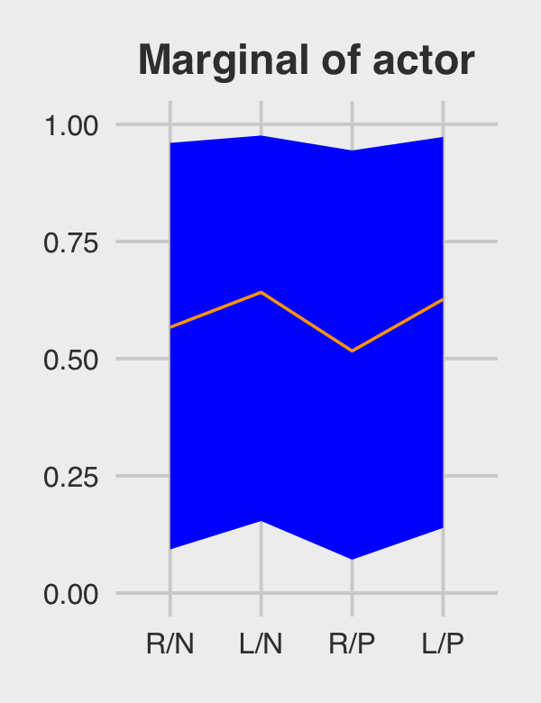
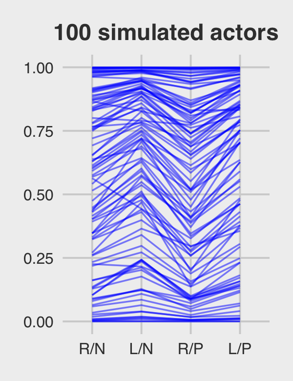
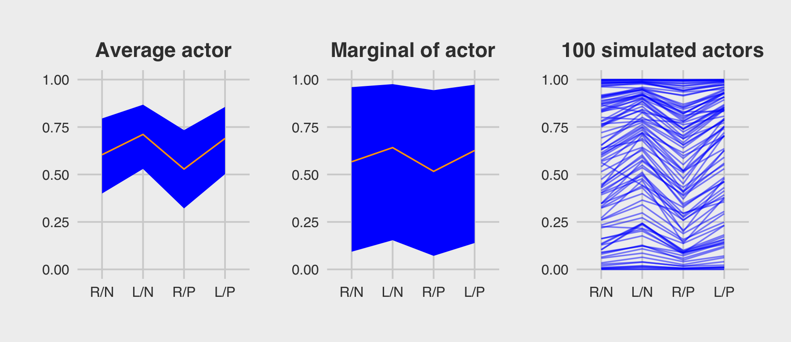

Section 13.5.2.1: Bonus: Let’s use `fitted()` this time.
================
A Solomon Kurz
2021-01-29

``` r
# load the packages that would have already been loaded
library(brms)
library(tidyverse)
library(ggthemes) 
library(tidybayes)
library(bayesplot)
library(posterior)
library(patchwork)

# change the default
theme_set(theme_gray() + theme_fivethirtyeight())

# load and wrangle the data
data(chimpanzees, package = "rethinking")
d <- chimpanzees
rm(chimpanzees)

d <-
  d %>% 
  mutate(actor     = factor(actor),
         block     = factor(block),
         treatment = factor(1 + prosoc_left + 2 * condition))

# load the model
b13.4 <- 
  brm(data = d, 
      family = binomial,
      bf(pulled_left | trials(1) ~ a + b,
         a ~ 1 + (1 | actor) + (1 | block), 
         b ~ 0 + treatment,
         nl = TRUE),
      prior = c(prior(normal(0, 0.5), nlpar = b),
                prior(normal(0, 1.5), class = b, coef = Intercept, nlpar = a),
                prior(exponential(1), class = sd, group = actor, nlpar = a),
                prior(exponential(1), class = sd, group = block, nlpar = a)),
      iter = 2000, warmup = 1000, chains = 4, cores = 4,
      seed = 13,
      file = "/Users/solomonkurz/Dropbox/Recoding Statistical Rethinking 2nd ed/fits/b13.04")

# define the labels
labels <- c("R/N", "L/N", "R/P", "L/P")
```

# Models With Memory

## Example: Multilevel tadpoles

#### Overthinking: Prior for variance components.

## Varying effects and the underfitting/overfitting trade-off

### The model.

### Sumulate survivors.

### Compute the no-pooling estimates.

### Compute the partial-pooling estimates.

#### Overthinking: Repeating the pond simulation.

## More than one type of cluster

#### Rethinking: Cross-classification and hierarchy.

### Multilevel chimpanzees.

### Even more clusters.

## Divergent transitions and non-centered priors

### The Devil’s Funnel.

### Non-centered chimpanzees.

## Multilevel posterior predictions

### Posterior prediction for same clusters.

### Posterior prediction for new clusters.

#### Bonus: Let’s use `fitted()` this time.

We just made those plots using various wrangled versions of `post`, the
data frame returned by `posterior_samples(b.13.4)`. If you followed
along closely, part of what made that a great exercise is that it forced
you to consider what the various vectors in `post` meant with respect to
the model formula. But it’s also handy to see how to do that from a
different perspective. So in this section, we’ll repeat that process by
relying on the `fitted()` function, instead. We’ll go in the same order,
starting with the average actor.

``` r
nd <- distinct(d, treatment)

(
  f <-
  fitted(b13.4,
         newdata = nd,
         re_formula = NA,
         probs = c(.1, .9)) %>% 
  data.frame() %>% 
  bind_cols(nd) %>% 
  mutate(treatment = factor(treatment, labels = labels))
)
```

    ##    Estimate Est.Error       Q10       Q90 treatment
    ## 1 0.6039864 0.1519271 0.3997364 0.7952008       R/N
    ## 2 0.7111121 0.1355745 0.5293721 0.8676832       L/N
    ## 3 0.5284151 0.1584498 0.3213219 0.7336165       R/P
    ## 4 0.6899462 0.1396600 0.5018703 0.8558593       L/P

You should notice a few things. Since `b13.4` is a cross-classified
multilevel model, it had three predictors: `treatment`, `block`, and
`actor`. However, our `nd` data only included the first of those three.
The reason `fitted()` permitted that was because we set `re_formula =
NA`. When you do that, you tell `fitted()` to ignore group-level effects
(i.e., focus only on the fixed effects). This was our `fitted()` version
of ignoring the `r_` vectors returned by `posterior_samples()`. Here’s
the plot.

``` r
p4 <-
  f %>%
  ggplot(aes(x = treatment, y = Estimate, group = 1)) +
  geom_ribbon(aes(ymin = Q10, ymax = Q90), fill = "blue") +
  geom_line(color = "orange1") +
  ggtitle("Average actor") +
  coord_cartesian(ylim = 0:1) +
  theme(plot.title = element_text(size = 14, hjust = .5))

p4
```


For marginal of actor, we can continue using the same `nd` data. This
time we’ll be sticking with the default `re_formula` setting, which will
accommodate the multilevel nature of the model. However, we’ll also be
adding `allow_new_levels = T` and `sample_new_levels = "gaussian"`. The
former will allow us to marginalize across the specific actors and
blocks in our data and the latter will instruct `fitted()` to use the
multivariate normal distribution implied by the random effects. It’ll
make more sense why I say *multivariate* normal by the end of the \[next
chapter\]\[Adventures in Covariance\]. For now, just go with it.

``` r
(
  f <-
  fitted(b13.4,
         newdata = nd,
         probs = c(.1, .9),
         allow_new_levels = T,
         sample_new_levels = "gaussian") %>% 
  data.frame() %>% 
  bind_cols(nd) %>% 
  mutate(treatment = factor(treatment, labels = labels))
  )
```

    ##    Estimate Est.Error        Q10       Q90 treatment
    ## 1 0.5669440 0.3164396 0.09313059 0.9602404       R/N
    ## 2 0.6415670 0.3040294 0.15376498 0.9759026       L/N
    ## 3 0.5163563 0.3185851 0.07131934 0.9441273       R/P
    ## 4 0.6264702 0.3069770 0.13899862 0.9729268       L/P

Here’s our `fitted()`-based marginal of `actor` plot.

``` r
p5 <-
  f %>%
  ggplot(aes(x = treatment, y = Estimate, group = 1)) +
  geom_ribbon(aes(ymin = Q10, ymax = Q90), fill = "blue") +
  geom_line(color = "orange1") +
  ggtitle("Marginal of actor") +
  coord_cartesian(ylim = 0:1) +
  theme(plot.title = element_text(size = 14, hjust = .5))

p5
```



We’ll have to amend our workflow a bit to make a `fitted()` version of
the third panel. First we redefine our `nd` data and execute the
`fitted()` code.

``` r
# how many simulated chimps would you like?
n_chimps <- 100

nd <- 
  distinct(d, treatment) %>% 
  # define 100 new actors
  expand(actor = str_c("new", 1:n_chimps),
         treatment) %>% 
  # this adds a row number, which will come in handy, later
  mutate(row = 1:n())

# fitted
set.seed(13)

f <-
  fitted(b13.4,
         newdata = nd,
         allow_new_levels = T,
         sample_new_levels = "gaussian",
         summary = F,
         nsamples = n_chimps)
```

Our `f` object will need a lot of wrangling. Before I walk out the
wrangling steps, we should reiterate what McElreath originally did in
the text (pp. 429–430). He based the new actors on the deviation scores
from `post$sigma_a`. That was the first working line in his **R** code
13.38. In the remaining lines in that code block, he used the model
formula to compute the actor-level trajectories. Then in his plot code
in **R** code 13.39, he just used the first 100 rows from that output.

In our `fitted()` code, above, we saved a little time and computer
memory by setting `nsamples = n_chimps`, which equaled 100. That’s
functionally the same as when McElreath used the first 100 posterior
draws in the plot. A difficulty for us is the way `brms::fitted()`
returns the output, the 100 new levels of `actor` and the four levels of
`treatment` are confounded in the 400 columns. In the code block, below,
the `data.frame()` through `left_join()` lines are meant to disentangle
those two. After that, we’ll make an `actor_number` variable, which
which we’ll filter the data such that the first row returned by
`fitted()` is only assigned to the new actor \#1, the second row is only
assigned to the new actor \#2, and so on. The result is that we have 100
new simulated actors, each of which corresponds to a different iteration
of the posterior draws from the fixed effects\[1\].

``` r
p6 <-
  f %>%
  data.frame() %>% 
  # name the columns by the `row` values in `nd`
  set_names(pull(nd, row)) %>% 
  # add an iteration index
  mutate(iter = 1:n()) %>% 
  # make it long
  pivot_longer(-iter, names_to = "row") %>% 
  mutate(row = as.double(row)) %>% 
  # add the new data
  left_join(nd, by = "row") %>% 
  # extract the numbers from the names of the new actors
  mutate(actor_number = str_extract(actor, "\\d+") %>% as.double()) %>% 
  # only keep the posterior iterations that match the `actor_number` values
  filter(actor_number == iter) %>% 
  # add the `treatment` labels
  mutate(treatment = factor(treatment, labels = labels)) %>% 
  
  # plot!
  ggplot(aes(x = treatment, y = value, group = actor)) +
  geom_line(alpha = 1/2, color = "blue") +
  ggtitle("100 simulated actors") +
  theme(plot.title = element_text(size = 14, hjust = .5))

p6
```



Here they are altogether.

``` r
p4 | p5 | p6
```



## Session info

``` r
sessionInfo()
```

    ## R version 4.0.3 (2020-10-10)
    ## Platform: x86_64-apple-darwin17.0 (64-bit)
    ## Running under: macOS Catalina 10.15.7
    ## 
    ## Matrix products: default
    ## BLAS:   /Library/Frameworks/R.framework/Versions/4.0/Resources/lib/libRblas.dylib
    ## LAPACK: /Library/Frameworks/R.framework/Versions/4.0/Resources/lib/libRlapack.dylib
    ## 
    ## locale:
    ## [1] en_US.UTF-8/en_US.UTF-8/en_US.UTF-8/C/en_US.UTF-8/en_US.UTF-8
    ## 
    ## attached base packages:
    ## [1] stats     graphics  grDevices utils     datasets  methods   base     
    ## 
    ## other attached packages:
    ##  [1] patchwork_1.1.0 posterior_0.1.3 bayesplot_1.7.2 tidybayes_2.3.1 ggthemes_4.2.0  forcats_0.5.0  
    ##  [7] stringr_1.4.0   dplyr_1.0.2     purrr_0.3.4     readr_1.4.0     tidyr_1.1.2     tibble_3.0.4   
    ## [13] ggplot2_3.3.2   tidyverse_1.3.0 brms_2.14.4     Rcpp_1.0.5     
    ## 
    ## loaded via a namespace (and not attached):
    ##   [1] readxl_1.3.1         backports_1.2.0      plyr_1.8.6           igraph_1.2.6        
    ##   [5] splines_4.0.3        svUnit_1.0.3         crosstalk_1.1.0.1    rstantools_2.1.1    
    ##   [9] inline_0.3.17        digest_0.6.27        htmltools_0.5.0      rsconnect_0.8.16    
    ##  [13] fansi_0.4.1          magrittr_2.0.1       checkmate_2.0.0      modelr_0.1.8        
    ##  [17] RcppParallel_5.0.2   matrixStats_0.57.0   xts_0.12.1           prettyunits_1.1.1   
    ##  [21] colorspace_2.0-0     rvest_0.3.6          ggdist_2.4.0         haven_2.3.1         
    ##  [25] xfun_0.19            callr_3.5.1          crayon_1.3.4         jsonlite_1.7.1      
    ##  [29] lme4_1.1-25          zoo_1.8-8            glue_1.4.2           gtable_0.3.0        
    ##  [33] emmeans_1.5.2-1      V8_3.4.0             distributional_0.2.1 pkgbuild_1.1.0      
    ##  [37] rstan_2.21.2         abind_1.4-5          scales_1.1.1         mvtnorm_1.1-1       
    ##  [41] DBI_1.1.0            miniUI_0.1.1.1       xtable_1.8-4         stats4_4.0.3        
    ##  [45] StanHeaders_2.21.0-6 DT_0.16              htmlwidgets_1.5.2    httr_1.4.2          
    ##  [49] threejs_0.3.3        arrayhelpers_1.1-0   ellipsis_0.3.1       pkgconfig_2.0.3     
    ##  [53] loo_2.3.1            farver_2.0.3         dbplyr_2.0.0         labeling_0.4.2      
    ##  [57] tidyselect_1.1.0     rlang_0.4.9          reshape2_1.4.4       later_1.1.0.1       
    ##  [61] munsell_0.5.0        cellranger_1.1.0     tools_4.0.3          cli_2.2.0           
    ##  [65] generics_0.1.0       broom_0.7.2          ggridges_0.5.2       evaluate_0.14       
    ##  [69] fastmap_1.0.1        yaml_2.2.1           processx_3.4.5       knitr_1.30          
    ##  [73] fs_1.5.0             nlme_3.1-149         mime_0.9             projpred_2.0.2      
    ##  [77] xml2_1.3.2           compiler_4.0.3       shinythemes_1.1.2    rstudioapi_0.13     
    ##  [81] curl_4.3             gamm4_0.2-6          reprex_0.3.0         statmod_1.4.35      
    ##  [85] stringi_1.5.3        ps_1.5.0             Brobdingnag_1.2-6    lattice_0.20-41     
    ##  [89] Matrix_1.2-18        nloptr_1.2.2.2       markdown_1.1         shinyjs_2.0.0       
    ##  [93] vctrs_0.3.5          pillar_1.4.7         lifecycle_0.2.0      bridgesampling_1.0-0
    ##  [97] estimability_1.3     httpuv_1.5.4         R6_2.5.0             promises_1.1.1      
    ## [101] gridExtra_2.3        codetools_0.2-16     boot_1.3-25          colourpicker_1.1.0  
    ## [105] MASS_7.3-53          gtools_3.8.2         assertthat_0.2.1     withr_2.3.0         
    ## [109] shinystan_2.5.0      mgcv_1.8-33          parallel_4.0.3       hms_0.5.3           
    ## [113] grid_4.0.3           coda_0.19-4          minqa_1.2.4          rmarkdown_2.5       
    ## [117] shiny_1.5.0          lubridate_1.7.9.2    base64enc_0.1-3      dygraphs_1.1.1.6

## Endnote

1.  The `fitted()` version of the code for the third panel is
    cumbersome. Indeed, this in one of those cases where it seems more
    straightforward to work directly with the `posterior_samples()`
    output, rather than with `fitted()`. The workflow in this section
    from previous editions of this ebook was more streamlined and
    superficially seemed to work. However, fellow researcher [Ladislas
    Nalborczyk](https://twitter.com/lnalborczyk) kindly pointed out I
    was taking 100 draws from one new simulated `actor`, rather than one
    simulated draw from 100 new levels of `actor`. To my knowledge, if
    you want 100 new levels of `actor` AND want each one to be from a
    different posterior iteration, you’ll need a lot of post-processing
    code when working with `fitted()`.
