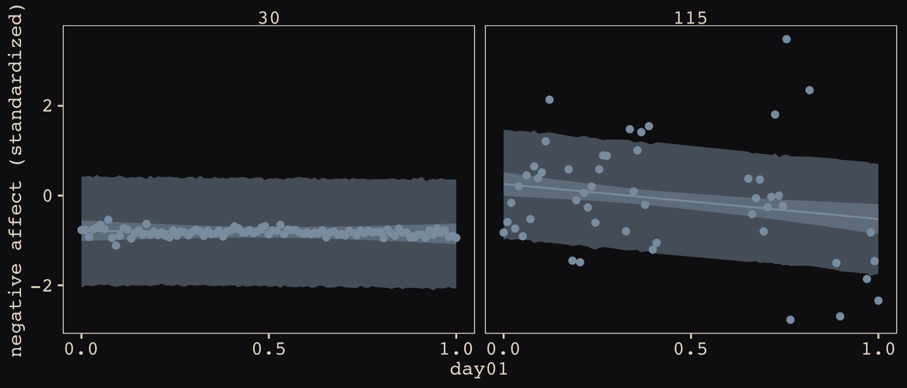
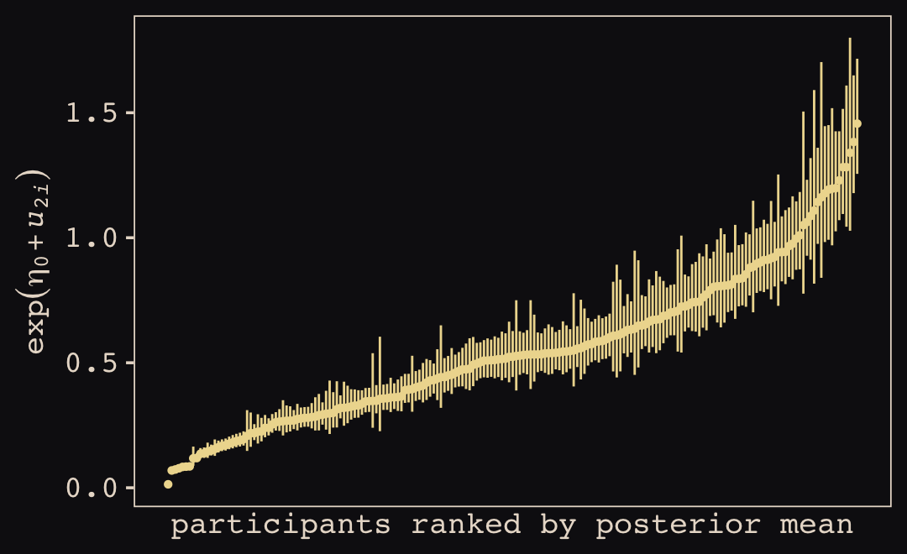
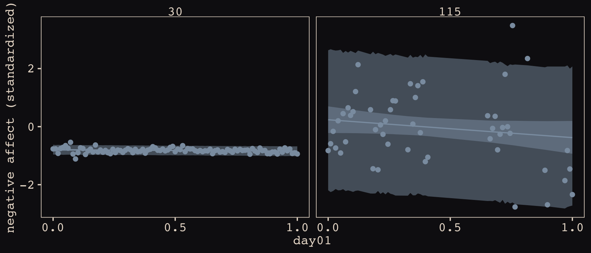
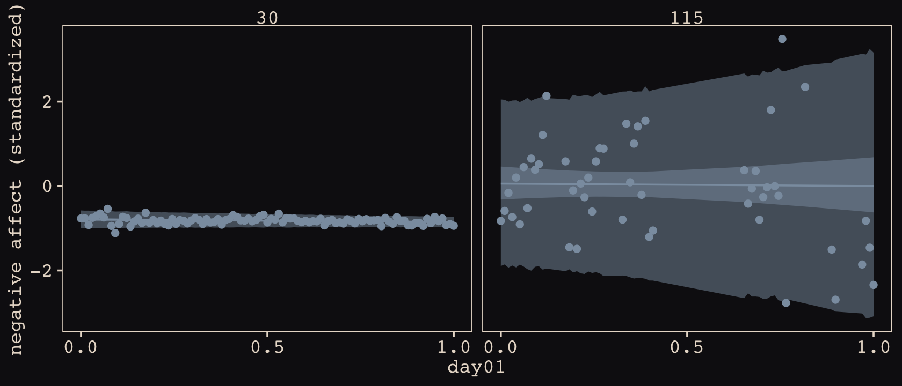
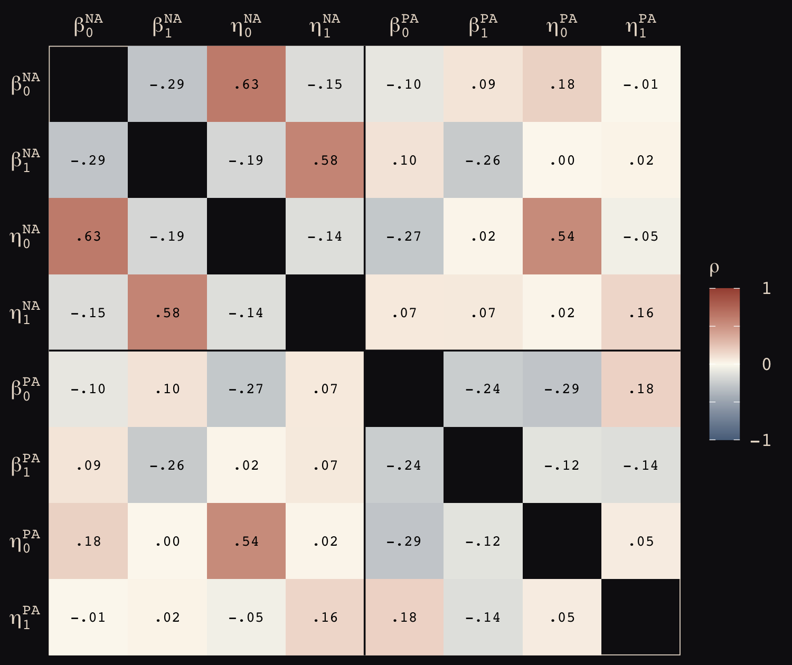
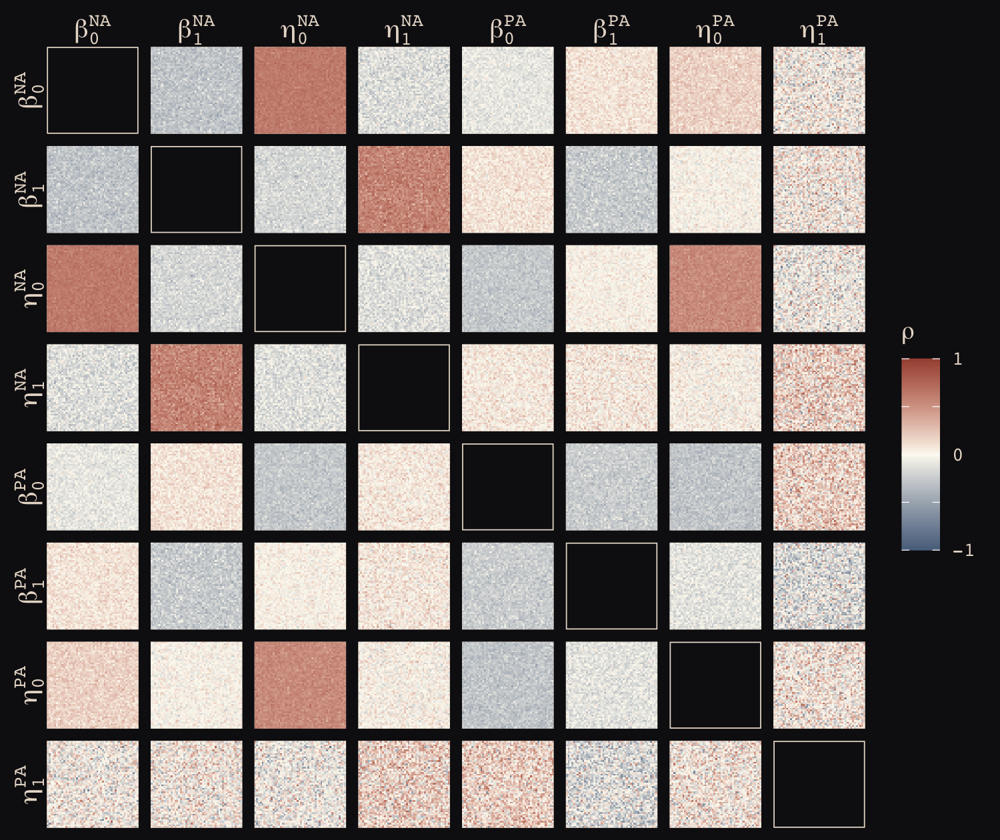

Ch. 14 Adventures in Covariance: Bonus Section
================
A Solomon Kurz
2020-08-09

Preliminary steps.

``` r
library(tidyverse)
library(dutchmasters)
library(brms)

theme_pearl_earring <- function(light_color = "#E8DCCF", 
                                dark_color = "#100F14", 
                                my_family = "Courier",
                                ...) {
  
  theme(line = element_line(color = light_color),
        text = element_text(color = light_color, family = my_family),
        strip.text = element_text(color = light_color, family = my_family),
        axis.text = element_text(color = light_color),
        axis.ticks = element_line(color = light_color),
        axis.line = element_blank(),
        legend.background = element_rect(fill = dark_color, color = "transparent"),
        legend.key = element_rect(fill = dark_color, color = "transparent"),
        panel.background = element_rect(fill = dark_color, color = light_color),
        panel.grid = element_blank(),
        plot.background = element_rect(fill = dark_color, color = dark_color),
        strip.background = element_rect(fill = dark_color, color = "transparent"),
        ...)
  
}

# now set `theme_pearl_earring()` as the default theme
theme_set(theme_pearl_earring())
```

## 14.6. ~~Summary~~ Bonus: Multilevel growth models and the MELSM

To this point in the chapter and most of the text, the data have largely
had a cross-sectional feel. In fairness, we did incorporate an element
of time with the café example from model `b14.1` by looking at the
differences between mornings and evenings. However, even then we
collapsed across longer time spans, such as days, weeks, months, and so
on. One of the two goals of this bonus section to provide a brief
introduction multilevel models designed to express change over time. The
particular brand of multilevel models we’ll focus on are often called
multilevel growth models. Though we will focus on simple linear models,
this basic framework can be generalized along many lines. The second
goal is to build on our appreciation of covariance structures by
introducing a class of multilevel models designed to investigate
variation in variation called the mixed-effects location scale models
(MELSM). For our final model, we get a little fancy and fit a
multivariate MELSM.

### 14.6.1. Borrow some data.

All the models in this bonus section are based on the preprint by
Williams, Liu, et al.
([2019](#ref-williamsBayesianMultivariateMixedeffects2019a)), [*Bayesian
multivariate mixed-effects location scale modeling of longitudinal
relations among affective traits, states, and physical
activity*](https://psyarxiv.com/4kfjp). Williams and colleagues’ data
and supporting scripts are available in the `example_analyses` folder
from their OSF project at <https://osf.io/3bmdh/>. You can also download
the data from the [`data`
folder](https://github.com/ASKurz/Statistical_Rethinking_with_brms_ggplot2_and_the_tidyverse_2_ed/tree/master/data)
of this ebook’s GitHub repo.

Load the data.

``` r
dat <- 
  readr::read_csv("/Users/solomonkurz/Dropbox/Recoding Statistical Rethinking 2nd ed/data/m_melsm_dat.csv") %>% 
  mutate(day01 = (day - 2) / max((day - 2)))

glimpse(dat)
```

    ## Rows: 13,033
    ## Columns: 10
    ## $ X1        <dbl> 2, 3, 4, 5, 6, 7, 8, 9, 10, 11, 12, 13, 14, 15, 16, 17, 18, 19, 20, 21, 24, 25, 26, 27, 2…
    ## $ P_A.std   <dbl> 1.74740876, -0.23109384, 0.34155950, 0.45664827, -0.23484069, 1.12785344, 1.11272629, 0.5…
    ## $ day       <dbl> 2, 3, 4, 5, 6, 7, 8, 9, 10, 11, 12, 13, 14, 15, 16, 17, 18, 19, 20, 21, 24, 25, 26, 27, 2…
    ## $ P_A.lag   <dbl> 0.7478597, 1.4674156, -0.3772641, 0.1286055, 0.3292090, 1.4107233, 0.7696644, 0.7304159, …
    ## $ N_A.lag   <dbl> 0.25399356, -0.85363386, 0.96144592, -0.19620339, -0.16047347, -0.90365575, -0.77502805, …
    ## $ steps.pm  <dbl> 0.955171, 0.955171, 0.955171, 0.955171, 0.955171, 0.955171, 0.955171, 0.955171, 0.955171,…
    ## $ steps.pmd <dbl> 0.5995578, -0.3947168, -1.5193587, -1.3442335, 0.4175970, -0.3231042, 0.3764198, 0.317665…
    ## $ record_id <dbl> 1, 1, 1, 1, 1, 1, 1, 1, 1, 1, 1, 1, 1, 1, 1, 1, 1, 1, 1, 1, 1, 1, 1, 1, 1, 1, 1, 1, 1, 1,…
    ## $ N_A.std   <dbl> -0.73357975, 0.53856559, 0.60161616, 0.27807249, 0.54674641, 0.05660701, -0.08417053, 0.1…
    ## $ day01     <dbl> 0.00000000, 0.01020408, 0.02040816, 0.03061224, 0.04081633, 0.05102041, 0.06122449, 0.071…

These data are from 193 participants.

``` r
distinct(dat, record_id) %>% 
  count()
```

    ## # A tibble: 1 x 1
    ##       n
    ##   <int>
    ## 1   193

Participants were asked to complete self-report ratings once a day for a
few months. People varied by how many days they participated in the
study, with number of days ranging from 8 to 99 and a median of 74.

``` r
dat %>% 
  count(record_id) %>% 
  summarise(median = median(n),
            min = min(n),
            max = max(n))
```

    ## # A tibble: 1 x 3
    ##   median   min   max
    ##    <int> <int> <int>
    ## 1     74     8    99

Here is a plot of that distribution.

``` r
dat %>% 
  count(record_id) %>% 
  
  ggplot(aes(x = n)) +
  geom_bar(fill = "#B1934A") +
  scale_x_continuous("number of days", limits = c(0, NA)) +
  theme_pearl_earring()
```


Our primary variables of interest were taken from the Positive and
Negative Affect Schedule (PANAS, Watson et al.,
[1988](#ref-watsonPANASDevelopment1988)), which is widely used in
certain areas of psychology to measure mood or emotion. In this study,
participants completed the PANAS once a day by endorsing the extent to
which they experienced various positive (e.g., excited, inspired) and
negative (e.g., upset, afraid) emotional states. These responses are
summed into two scores: Positive affect (PA) and negative affect (NA).
In the current data, the standardized versions of these scores are in
the `P_A.std` and `N_A.std` columns, respectively. To get a sense of
what these look like, here are the daily `N_A.std` scores from a random
sample of 16 participants.

``` r
set.seed(14)

dat %>% 
  nest(data = c(X1, P_A.std, day, P_A.lag, N_A.lag, steps.pm, steps.pmd, N_A.std, day01)) %>% 
  sample_n(size = 16) %>% 
  unnest(data) %>% 
  
  ggplot(aes(x = day, y = N_A.lag)) +
  geom_line(color = "#80A0C7") +
  geom_point(color = "#FCF9F0", size = 1/2) +
  ylab("negative affect (standardized)") +
  facet_wrap(~record_id)
```


### 14.6.2. Conventional multilevel growth model.

In the social sciences, a typical way to analyze data like these is with
a multilevel growth model in which participants vary in their intercepts
(starting point) and time slopes (change over time). In the sample of
the data, above, it looks like most participants have fairly constant
levels of NA over time (i.e., near-zero slopes) but some (e.g., \# 128
and 147) show some evidence of systemic decreases in NA (i.e., negative
slopes). There is also some variation in starting points, though most of
the participants in this subset of the data seemed to have endorsed
relatively low levels of NA both at baseline and throughout the study.

We want a model that can capture those kinds of variation. Eventually,
we will fit a model that accounts for both PA and NA. But to keep things
simple while we’re warming up, we will restrict our focus to NA. If we
let \(\text{NA}_{ij}\) be the standardized NA score for the \(i\)th
participant on the \(j\)th day, our first Bayesian multilevel growth
model will follow the form

\[
\begin{align*}
\text{NA}_{ij} & \sim \operatorname{Normal}\begin{pmatrix} \mu_{ij}, \sigma \end{pmatrix} \\
\mu_{ij}       & = \beta_0 + \beta_1 \text{time}_{ij} + u_{0i} + u_{1i} \text{time}_{ij} \\
\sigma & = \sigma_\epsilon \\
\begin{bmatrix} u_{0i} \\ u_{1i} \end{bmatrix} & \sim \operatorname{MVNormal}\begin{pmatrix} \begin{bmatrix} 0 \\ 0 \end{bmatrix}, \mathbf S \mathbf R \mathbf S \end{pmatrix} \\
\mathbf S & = \begin{bmatrix} \sigma_0 & 0 \\ 0 & \sigma_1 \end{bmatrix} \\
\mathbf R & = \begin{bmatrix} 1 & \rho_{12} \\ \rho_{21} & 1 \end{bmatrix} \\
\beta_0   & \sim \operatorname{Normal}(0, 0.2) \\
\beta_1   & \sim \operatorname{Normal}(0, 1) \\
\sigma_0 \text{ and } \sigma_1 & \sim \operatorname{Exponential}(1) \\
\sigma_\epsilon & \sim \operatorname{Exponential}(1) \\
\mathbf R & \sim \operatorname{LKJ}(2),
\end{align*}
\]

where \(\beta_0\) is the intercept (i.e., starting point) and \(u_{0i}\)
captures variations in that intercept across participants. Similarly,
\(\beta_1\) is the slope depicting linear change in \(\text{NA}\) across
time and \(u_{1i}\) captures variations in that linear change across
participants. The \(u_{0i}\) and \(u_{1i}\) parameters are modeled as
multivariate normal with zero means (i.e., they are deviations from the
population parameters) and standard deviations \(\sigma_0\) and
\(\sigma_1\). We express the correlation between those two group-level
\(\sigma\) parameters with \(\mathbf R\), the symmetric correlation
matrix. Here we just have one correlation, \(\rho_{21}\), which is the
same as \(\rho_{12}\). Finally, variation not accounted for by the other
parameters is captured by the single parameter \(\sigma_\epsilon\),
which is often just called \(\epsilon\).

We have two variables measuring time in these data. The `day` variable
measures time by integers, ranging from 2 to 100. To make it a little
easier to set the priors and fit the model with Stan, we have a rescaled
version of the variable, `day01`, which ranges from 0 to 1. In this way,
\(\beta_0\) is the value for the first day in the data set and
\(\beta_1\) is the expected change by the end of the collection (i.e.,
the 100th day). For consistency, we are largely following McElreath’s
weakly-regularizing approach to priors.

You may have noticed my statistical notation differs a bit from
McElreath’s, here. This notation is a blend of sensibilities from
McElreath, Williams, and from the notation I used in [my
translation](https://bookdown.org/content/4253/) of Singer and Willett’s
([2003](#ref-singerAppliedLongitudinalData2003)) text, [*Applied
longitudinal data analysis: Modeling change and event
occurrence*](https://oxford.universitypressscholarship.com/view/10.1093/acprof:oso/9780195152968.001.0001/acprof-9780195152968).
I hope it’s clear.

Here is how to fit the model with **brms**.

``` r
# 5.583446 mins
b14.12 <-
  brm(data = dat,
      family = gaussian,
      N_A.std ~ 1 + day01 + (1 + day01 | record_id),
      prior = c(prior(normal(0, 0.2), class = Intercept),
                prior(normal(0, 1), class = b),
                prior(exponential(1), class = sd),
                prior(exponential(1), class = sigma),
                prior(lkj(2), class = cor)),
      iter = 3000, warmup = 1000, chains = 4, cores = 4,
      seed = 14,
      file = "/Users/solomonkurz/Dropbox/Recoding Statistical Rethinking 2nd ed/fits/b14.12")
```

Check the summary.

``` r
print(b14.12)
```

    ##  Family: gaussian 
    ##   Links: mu = identity; sigma = identity 
    ## Formula: N_A.std ~ 1 + day01 + (1 + day01 | record_id) 
    ##    Data: dat (Number of observations: 13033) 
    ## Samples: 4 chains, each with iter = 3000; warmup = 1000; thin = 1;
    ##          total post-warmup samples = 8000
    ## 
    ## Group-Level Effects: 
    ## ~record_id (Number of levels: 193) 
    ##                      Estimate Est.Error l-95% CI u-95% CI Rhat Bulk_ESS Tail_ESS
    ## sd(Intercept)            0.78      0.04     0.70     0.86 1.00     1396     2647
    ## sd(day01)                0.65      0.05     0.57     0.75 1.00     2952     4640
    ## cor(Intercept,day01)    -0.34      0.08    -0.49    -0.19 1.00     2874     4159
    ## 
    ## Population-Level Effects: 
    ##           Estimate Est.Error l-95% CI u-95% CI Rhat Bulk_ESS Tail_ESS
    ## Intercept     0.03      0.06    -0.08     0.14 1.00      809     1767
    ## day01        -0.16      0.06    -0.27    -0.04 1.00     1778     3357
    ## 
    ## Family Specific Parameters: 
    ##       Estimate Est.Error l-95% CI u-95% CI Rhat Bulk_ESS Tail_ESS
    ## sigma     0.61      0.00     0.60     0.62 1.00    14649     5390
    ## 
    ## Samples were drawn using sampling(NUTS). For each parameter, Bulk_ESS
    ## and Tail_ESS are effective sample size measures, and Rhat is the potential
    ## scale reduction factor on split chains (at convergence, Rhat = 1).

Hopefully it makes sense that the population-level intercept
(\(\beta_0\)) is near zero. It would be odd if it wasn’t given these are
standardized data. The coefficient for `day01` (\(\beta_1\)) is mildly
negative, suggesting an overall trend for participants to endorse lower
NA scores over time.

The two group-level \(\sigma\) parameters are fairly large given the
scale of the data. They suggest participants varied quite a bit in terms
of both intercepts and slopes. They also have a moderate negative
correlation, suggesting that participants with higher intercepts tended
to have more negative slopes.

To get a sense of the model, we’ll plot the posterior means for each
participants’ fitted trajectory across time (thin lines), along with the
population-average trajectory (thick line).

``` r
nd <-
  dat %>% 
  distinct(record_id, day01)

fitted(b14.12,
       newdata = nd) %>% 
  data.frame() %>% 
  bind_cols(nd) %>% 
  
  ggplot(aes(x = day01, y = Estimate, group = record_id)) +
  geom_line(alpha = 1/3, size = 1/3, color = "#8B9DAF") +
  geom_segment(x = 0, xend = 1,
               y = fixef(b14.12)[1, 1],
               yend = fixef(b14.12)[1, 1] + fixef(b14.12)[2, 1],
               size = 3, color = "#80A0C7") +
  scale_x_continuous(breaks = c(0, .5, 1)) +
  ylab("negative affect (standardized)")
```


If you look back up to the model summary from before the plot, the one
parameter we didn’t focus on was the lone `sigma` parameter at the
bottom. That’s our \(\sigma_\epsilon\), which captures the individual
variation not accounted for by the intercepts, slopes, and their
correlation. An important characteristic of the conventional multilevel
growth model is that \(\sigma_\epsilon\) does not vary across persons,
occasions, or other variables. To give a sense of why this might not be
the best assumption, let’s take a focused look at the model implied
trajectories for two participants. Here we will take cues from some
Figure 4.8 from way back in \[Section 4.4.3.5\]\[Prediction
intervals.\]. We will plot the original data atop both the fitted lines
and their 95% intervals, which expresses the mean structure, along with
the 95% posterior predictive interval, which expresses the uncertainty
of the \(\sigma_\epsilon\) parameter.

``` r
nd <-
  dat %>% 
  filter(record_id %in% c(30, 115)) %>% 
  select(record_id, N_A.std, day01)

bind_cols(
  fitted(b14.12,
         newdata = nd) %>% 
    data.frame(),
  predict(b14.12,
          newdata = nd) %>% 
    data.frame() %>% 
    select(Q2.5:Q97.5) %>% 
    set_names("p_lower", "p_upper")
) %>% 
  bind_cols(nd) %>% 
  
  ggplot(aes(x = day01)) +
  geom_smooth(aes(y = Estimate, ymin = Q2.5, ymax = Q97.5),
              stat = "identity",
              fill = "#8B9DAF", color = "#8B9DAF", alpha = 1/2, size = 1/2) +
  geom_ribbon(aes(ymin = p_lower, ymax = p_upper),
              fill = "#8B9DAF", alpha = 1/2) +
  geom_point(aes(y = N_A.std),
             color = "#8B9DAF") +
  scale_x_continuous(breaks = c(0, .5, 1)) +
  ylab("negative affect (standardized)") +
  facet_wrap(~record_id)
```



Because of our fixed \(\sigma_\epsilon\) parameter, the 95% posterior
predictive interval is the same width for both participants. Yet look
how closely participant the data points for participant 30 cluster not
only within the center region of the posterior prediction intervals, but
also almost completely within the 95% interval for the fitted line. In
contrast, notice how much more spread out the data points for
participant 115 are, and how many of them extend well beyond the
posterior predictive interval. This difference in variability is ignored
by conventional growth models. However, there’s no reason we can’t
adjust our model to capture this kind of person-level variability, too.
Enter the MELSM.

### 14.6.3. Learn more about your data with the MELSM.

Mixed-effects location scale models (MELSMs) have their origins in the
work of [Donald
Hedeker](https://health.uchicago.edu/faculty/donald-hedeker-phd) and
colleagues (Hedeker et al.,
[2008](#ref-hedekerApplicationMixedeffectsLocation2008),
[2012](#ref-hedekerModelingWithinsubjectVariance2012)). Rast et al.
([2012](#ref-rastModelingIndividualDifferences2012)) showcased an early
application of the framework to the BUGS/JAGS software. More recently
[Philippe Rast](https://twitter.com/rastlab) and colleagues
(particularly graduate student, [Donald Williams](wdonald_1985)) have
adapted this approach for use within the Stan/**brms** software
ecosystem (Williams, Liu, et al.,
[2019](#ref-williamsBayesianMultivariateMixedeffects2019a); Williams,
Rouder, et al., [2019](#ref-williamsSurfaceUnearthingWithinperson2019);
Williams, Martin, et al.,
[2019](#ref-williamsPuttingIndividualReliability2019); Williams,
Zimprich, et al.,
[2019](#ref-williamsBayesianNonlinearMixedeffects2019a)).

Within the **brms**, MELSMs apply a distributional modeling approach
(see Bürkner,
[2020](#ref-Bürkner2020Distributional)[a](#ref-Bürkner2020Distributional))
to the multilevel growth model. Not only are parameters from the mean
structure allowed to vary across groups, but parameters applied to
\(\sigma\) are allowed to vary across groups, too. Do you remember the
little practice model `b10.1` from \[Section 10.2.2\]\[Linking linear
models to distributions.\]. We simulated Gaussian data for two groups
with the same mean parameter but different parameters for \(\sigma\). If
you check back in that section, you’ll see that the **brms** default was
to model \(\log \sigma\) in that case. This is smart because when you
define a model for \(\sigma\), you want to use a link function that
ensures the predictions will be stay at zero and above. The MELSM
approach of Hedeker, Rast, Williams and friends applies this logic to
\(\sigma_\epsilon\) in multilevel growth models. However, not only can
\(\sigma_\epsilon\) vary across groups in a fixed-effects sort of way,
we can use multilevel partial pooling, too.

To get a sense of what this looks like, we’ll augment our previous
model, but this time allowing \(\sigma_\epsilon\) to vary across
participants. You might express the updated statistical model as

\[
\begin{align*}
\text{NA}_{ij} & \sim \operatorname{Normal}\begin{pmatrix} \mu_{ij}, \sigma_{i} \end{pmatrix} \\
\mu_{ij} & = \beta_0 + \beta_1 \text{time}_{ij} + u_{0i} + u_{1i} \text{time}_{ij} \\ 
\log \begin{pmatrix} \sigma_i \end{pmatrix} & = \eta_0 + u_{2i} \\
\begin{bmatrix} u_{0i} \\ u_{1i} \\ u_{2i} \end{bmatrix} & \sim \operatorname{MVNormal}\begin{pmatrix} \begin{bmatrix} 0 \\ 0 \\ 0 \end{bmatrix}, \mathbf S \mathbf R \mathbf S \end{pmatrix} \\
\mathbf S & = \begin{bmatrix} \sigma_0 & 0 & 0 \\ 0 & \sigma_1 & 0 \\ 0 & 0 & \sigma_2 \end{bmatrix} \\
\mathbf R & = \begin{bmatrix} 1 & \rho_{12} & \rho_{13} \\ \rho_{21} & 1 & \rho_{23} \\ \rho_{31} & \rho_{32} & 1 \end{bmatrix} \\
\beta_0   & \sim \operatorname{Normal}(0, 0.2) \\
\beta_1 \text{and } \eta_0 & \sim \operatorname{Normal}(0, 1) \\
\sigma_0,..., \sigma_2     & \sim \operatorname{Exponential}(1) \\
\mathbf R & \sim \operatorname{LKJ}(2).
\end{align*}
\]

In the opening likelihood statement from the prior model, we simply set
\(\text{NA}_{ij} \sim \operatorname{Normal}\begin{pmatrix} \mu_{ij}, \sigma \end{pmatrix}\).
For our first MELSM, we now refer to \(\sigma_i\), meaning the levels of
variation not accounted for by the mean structure can vary across
participants (hence the \(i\) subscript). Two lines down, we see the
formula for \(\log \begin{pmatrix} \sigma_i \end{pmatrix}\) contains
population-level intercept, \(\eta_0\), and participant-specific
deviations around that parameter, \(u_{2i}\). In the next three lines,
the plot deepens. We see that all three participant-level deviations,
\(u_{0i},...,u_{2i}\) are multivariate normal with means set to zero and
variation expressed in the parameters \(\sigma_0,...,\sigma_2\) of the
\(\mathbf S\) matrix. In the \(R\) matrix, we now have three correlation
parameters, with \(\rho_{31}\) and \(\rho_{32}\) allowing us to assess
the correlations among individual differences in variability and
individual differences in starting points and change over time,
respectively. Let’s fit the model.

``` r
b14.13 <-
  brm(data = dat,
      family = gaussian,
      bf(N_A.std ~ 1 + day01 + (1 + day01 |i| record_id),
         sigma ~ 1 + (1 |i| record_id)),
      prior = c(prior(normal(0, 0.2), class = Intercept),
                prior(normal(0, 1), class = b),
                prior(exponential(1), class = sd),
                
                prior(normal(0, 1), class = Intercept, dpar = sigma),
                prior(exponential(1), class = sd, dpar = sigma),
                
                prior(lkj(2), class = cor)),
      iter = 3000, warmup = 1000, chains = 4, cores = 4,
      seed = 14,
      file = "/Users/solomonkurz/Dropbox/Recoding Statistical Rethinking 2nd ed/fits/b14.13")
```

We should note a few things about the `brm()` syntax. First, because we
modeled both \(\mu_{ij}\) and \(\sigma_i\), we put both model formulas
within the `bf()` function. Second, because the **brms** default is to
use the log link when modeling \(\sigma_i\), there was no need to
explicitly set it that wah in the `family` line. However, we could have
if we wanted to. Third, notice our use of the `|i|` syntax within the
parentheses in the `formula` lines. If we had used the conventional `|`
syntax, that would have not allowed our \(u_{2i}\) parameters to
correlate with \(u_{0i}\) and \(u_{1i}\) from the mean structure. It
would have effectively set \(\rho_{31} = \rho_{32} = 0\). Finally,
notice how within the `prior()` functions, we explicitly referred to
those for the new \(\sigma\) structure with the `dpar = sigma` operator.

Okay, time to check the model summary.

``` r
print(b14.13)
```

    ##  Family: gaussian 
    ##   Links: mu = identity; sigma = log 
    ## Formula: N_A.std ~ 1 + day01 + (1 + day01 | i | record_id) 
    ##          sigma ~ 1 + (1 | i | record_id)
    ##    Data: dat (Number of observations: 13033) 
    ## Samples: 4 chains, each with iter = 3000; warmup = 1000; thin = 1;
    ##          total post-warmup samples = 8000
    ## 
    ## Group-Level Effects: 
    ## ~record_id (Number of levels: 193) 
    ##                                Estimate Est.Error l-95% CI u-95% CI Rhat Bulk_ESS Tail_ESS
    ## sd(Intercept)                      0.76      0.04     0.69     0.85 1.01      652     1475
    ## sd(day01)                          0.61      0.04     0.53     0.69 1.00     1548     2982
    ## sd(sigma_Intercept)                0.70      0.04     0.63     0.77 1.00      679     1170
    ## cor(Intercept,day01)              -0.34      0.08    -0.48    -0.17 1.01      998     2661
    ## cor(Intercept,sigma_Intercept)     0.61      0.05     0.51     0.70 1.01      705     1251
    ## cor(day01,sigma_Intercept)        -0.10      0.08    -0.25     0.06 1.00      747     1939
    ## 
    ## Population-Level Effects: 
    ##                 Estimate Est.Error l-95% CI u-95% CI Rhat Bulk_ESS Tail_ESS
    ## Intercept           0.03      0.05    -0.08     0.14 1.01      288      427
    ## sigma_Intercept    -0.78      0.05    -0.89    -0.68 1.01      481      978
    ## day01              -0.15      0.05    -0.26    -0.05 1.01      769     1532
    ## 
    ## Samples were drawn using sampling(NUTS). For each parameter, Bulk_ESS
    ## and Tail_ESS are effective sample size measures, and Rhat is the potential
    ## scale reduction factor on split chains (at convergence, Rhat = 1).

The ‘sigma\_Intercept’ lines in the ‘Population-Level Effects’ section
is the summary for our \(\eta_0\) parameter. To get a sense of what this
means out of the log space, just exponentiate.

``` r
fixef(b14.13)["sigma_Intercept", c(1, 3:4)] %>% exp()
```

    ##  Estimate      Q2.5     Q97.5 
    ## 0.4577889 0.4126544 0.5058946

To get a sense of the variation in that parameter across participants
\[i.e., \(\exp(\eta_0 + u_{2i})\)\], it’s best to plot.

``` r
coef(b14.13)$record_id[, , "sigma_Intercept"] %>% 
  exp() %>% 
  data.frame() %>% 
  arrange(Estimate) %>% 
  mutate(rank = 1:n()) %>% 
  
  ggplot(aes(x = rank, y = Estimate, ymin = Q2.5, ymax = Q97.5)) +
  geom_pointrange(size = .4, fatten = .3, color = "#EEDA9D") +
  scale_x_continuous("participants ranked by posterior mean", breaks = NULL) +
  ylab(expression(exp(eta[0]+italic(u)[2][italic(i)])))
```



Looks like there’s a lot of variation in a parameter that was formerly
fixed across participants as a single value \(\sigma_\epsilon\). Here’s
what this looks like in terms of our posterior predictive distributions
for participants 30 and 115, from before.

``` r
nd <-
  dat %>% 
  filter(record_id %in% c(30, 115)) %>% 
  select(record_id, N_A.std, day01)

bind_cols(
  fitted(b14.13,
         newdata = nd) %>% 
    data.frame(),
  predict(b14.13,
          newdata = nd) %>% 
    data.frame() %>% 
    select(Q2.5:Q97.5) %>% 
    set_names("p_lower", "p_upper")
) %>% 
  bind_cols(nd) %>% 
  
  ggplot(aes(x = day01)) +
  geom_smooth(aes(y = Estimate, ymin = Q2.5, ymax = Q97.5),
              stat = "identity",
              fill = "#8B9DAF", color = "#8B9DAF", alpha = 1/2, size = 1/2) +
  geom_ribbon(aes(ymin = p_lower, ymax = p_upper),
              fill = "#8B9DAF", alpha = 1/2) +
  geom_point(aes(y = N_A.std),
             color = "#8B9DAF") +
  scale_x_continuous(breaks = c(0, .5, 1)) +
  ylab("negative affect (standardized)") +
  facet_wrap(~record_id)
```



That’s a big improvement. Let’s expand our skill set. Within the MELSM
paradigm, one can use multiple variables to model participant-specific
variation. Here we’ll add in our time variable.

\[
\begin{align*}
\text{NA}_{ij} & \sim \operatorname{Normal}\begin{pmatrix} \mu_{ij}, \sigma_{ij} \end{pmatrix} \\
\mu_{ij} & = \beta_0 + \beta_1 \text{time}_{ij} + u_{0i} + u_{1i} \text{time}_{ij} \\ \log \begin{pmatrix} \sigma_{ij} \end{pmatrix} & = \eta_0 + \eta_1 \text{time}_{ij} + u_{2i} + u_{3i} \text{time}_{ij} \\
\begin{bmatrix} u_{0i} \\ u_{1i} \\ u_{2i} \\ u_{3i} \end{bmatrix} & \sim \operatorname{MVNormal}\begin{pmatrix} \begin{bmatrix} 0 \\ 0 \\ 0 \\ 0 \end{bmatrix}, \mathbf S \mathbf R \mathbf S \end{pmatrix} \\
\mathbf S & = \begin{bmatrix} \sigma_0 & 0 & 0 & 0 \\ 0 & \sigma_1 & 0 & 0 \\ 0 & 0 & \sigma_2 & 0 \\ 0 & 0 & 0 & \sigma_3 \end{bmatrix} \\
\mathbf R & = \begin{bmatrix} 1 & \rho_{12} & \rho_{13} & \rho_{14} \\ \rho_{21} & 1 & \rho_{23} & \rho_{24} \\ \rho_{31} & \rho_{32} & 1 & \rho_{34} \\ \rho_{41} & \rho_{42} & \rho_{43} & 1 \end{bmatrix} \\
\beta_0   & \sim \operatorname{Normal}(0, 0.2) \\
\beta_1, \eta_0, \text{and } \eta_1 & \sim \operatorname{Normal}(0, 1) \\
\sigma_0,..., \sigma_3 & \sim \operatorname{Exponential}(1) \\
\mathbf R & \sim \operatorname{LKJ}(2).
\end{align*}
\]

Note how in the very first line we are not speaking in terms of
\(\sigma_{ij}\). Variation in the criterion \(\text{NA}_{ij}\) not
accounted for by the mean structure can now vary across participants,
\(i\), and time, \(j\). This results in four \(u_{xi}\) terms, a
\(4 \times 4\) \(\mathbf S\) matrix and a \(4 \times 4\) \(\mathbf R\)
matrix. Here’s how you might fit the model with `brms::brm()`.
**Warning**: it’ll probably take a couple hours.

``` r
b14.14 <-
  brm(data = dat,
      family = gaussian,
      bf(N_A.std ~ 1 + day01 + (1 + day01 |i| record_id),
         sigma ~ 1 + day01 + (1 + day01 |i| record_id)),
      prior = c(prior(normal(0, 0.2), class = Intercept),
                prior(normal(0, 1), class = b),
                prior(exponential(1), class = sd),
                
                prior(normal(0, 1), class = Intercept, dpar = sigma),
                prior(normal(0, 1), class = b, dpar = sigma),
                prior(exponential(1), class = sd, dpar = sigma),
                
                prior(lkj(2), class = cor)),
      iter = 3000, warmup = 1000, chains = 4, cores = 4,
      seed = 14,
      file = "/Users/solomonkurz/Dropbox/Recoding Statistical Rethinking 2nd ed/fits/b14.14")
```

At this point, `print()` is starting to return a lot of output.

``` r
print(b14.14)
```

    ##  Family: gaussian 
    ##   Links: mu = identity; sigma = log 
    ## Formula: N_A.std ~ 1 + day01 + (1 + day01 | i | record_id) 
    ##          sigma ~ 1 + day01 + (1 + day01 | i | record_id)
    ##    Data: dat (Number of observations: 13033) 
    ## Samples: 4 chains, each with iter = 3000; warmup = 1000; thin = 1;
    ##          total post-warmup samples = 8000
    ## 
    ## Group-Level Effects: 
    ## ~record_id (Number of levels: 193) 
    ##                                  Estimate Est.Error l-95% CI u-95% CI Rhat Bulk_ESS Tail_ESS
    ## sd(Intercept)                        0.76      0.04     0.68     0.84 1.01     1113     2097
    ## sd(day01)                            0.60      0.04     0.52     0.69 1.00     2368     4274
    ## sd(sigma_Intercept)                  0.70      0.04     0.63     0.78 1.00     1933     3371
    ## sd(sigma_day01)                      0.36      0.04     0.29     0.44 1.00     4282     5832
    ## cor(Intercept,day01)                -0.31      0.08    -0.46    -0.14 1.00     1700     3099
    ## cor(Intercept,sigma_Intercept)       0.64      0.05     0.54     0.72 1.00     1781     3498
    ## cor(day01,sigma_Intercept)          -0.20      0.08    -0.35    -0.04 1.00     1297     2795
    ## cor(Intercept,sigma_day01)          -0.16      0.11    -0.37     0.05 1.00     4531     5944
    ## cor(day01,sigma_day01)               0.61      0.09     0.42     0.76 1.00     4671     5794
    ## cor(sigma_Intercept,sigma_day01)    -0.15      0.10    -0.34     0.04 1.00     3872     5824
    ## 
    ## Population-Level Effects: 
    ##                 Estimate Est.Error l-95% CI u-95% CI Rhat Bulk_ESS Tail_ESS
    ## Intercept           0.03      0.06    -0.08     0.14 1.00      500      949
    ## sigma_Intercept    -0.75      0.05    -0.85    -0.65 1.00      810     2121
    ## day01              -0.15      0.05    -0.25    -0.06 1.00     1416     2760
    ## sigma_day01        -0.11      0.04    -0.19    -0.03 1.00     3920     5043
    ## 
    ## Samples were drawn using sampling(NUTS). For each parameter, Bulk_ESS
    ## and Tail_ESS are effective sample size measures, and Rhat is the potential
    ## scale reduction factor on split chains (at convergence, Rhat = 1).

Our new line for ‘sigma\_day01’ suggests there is a general trend for
less variation in negative affect ratings over time. However, the
‘sd(sigma\_day01)’ line in the ‘Group-Level Effects’ section indicates
even this varies a bit across participants. At this point, a lot of the
action is now in the estimates for the \(\mathbf R\) matrix. Here that
is in a coefficient plot.

``` r
posterior_summary(b14.14) %>% 
  data.frame() %>% 
  rownames_to_column("par") %>% 
  filter(str_detect(par, "cor_")) %>% 
  mutate(rho = str_c("(rho[", c(21, 31, 32, 41, 42, 43), "])")) %>% 
  mutate(par = str_c("'", par, "'~", rho)) %>% 
  
  ggplot(aes(x = Estimate, xmin = Q2.5, xmax = Q97.5, y = par)) +
  geom_vline(xintercept = c(-.5, 0, .5), linetype = c(2, 1, 2), size = c(1/4, 1/2, 1/4), color = "#FCF9F0", alpha = 1/4) +
  geom_pointrange(color = "#B1934A") +
  xlim(-1, 1) +
  scale_y_discrete(labels = ggplot2:::parse_safe) +
  labs(x = "marginal posterior",
       y = NULL) +
  theme(axis.text.y = element_text(hjust = 0, size = 9),
        axis.ticks.y = element_blank())
```


Note how we attached the statistical terms from the lower triangle of
the \(\mathbf R\) matrix to the names from the **brms** output.
Coefficient plots like this are somewhat helpful with MELSM parameter
summaries, like this. But they leave something to be desired and they
won’t scale well. One alternative is to present the posterior means in a
correlation matrix plot. Our first step to prepare for the plot is to
extract and wrangle the posterior summaries.

``` r
levels <- c("beta[0]", "beta[1]", "eta[0]", "eta[1]")

r <-
  posterior_summary(b14.14) %>% 
  data.frame() %>% 
  rownames_to_column("param") %>% 
  filter(str_detect(param, "cor_")) %>% 
  mutate(param = str_remove(param, "cor_record_id__")) %>% 
  separate(param, into = c("left", "right"), sep = "__") %>% 
  mutate(
    left = case_when(
      left == "Intercept"       ~ "beta[0]",
      left == "day01"           ~ "beta[1]",
      left == "sigma_Intercept" ~ "eta[0]"),
    right = case_when(
      right == "day01"           ~ "beta[1]",
      right == "sigma_Intercept" ~ "eta[0]",
      right == "sigma_day01"     ~ "eta[1]"
    )
  ) %>% 
  mutate(label = formatC(Estimate, digits = 2, format = "f") %>% str_replace(., "0.", ".")) %>%
  mutate(left  = factor(left, levels = levels),
         right = factor(right, levels = levels)) %>%
  mutate(right = fct_rev(right))

r
```

    ##      left   right   Estimate  Est.Error       Q2.5       Q97.5 label
    ## 1 beta[0] beta[1] -0.3089508 0.08386411 -0.4629906 -0.13655524  -.31
    ## 2 beta[0]  eta[0]  0.6409912 0.04611116  0.5425778  0.72436842   .64
    ## 3 beta[1]  eta[0] -0.2031949 0.08102187 -0.3532224 -0.04002514  -.20
    ## 4 beta[0]  eta[1] -0.1634277 0.10668266 -0.3686215  0.05152164  -.16
    ## 5 beta[1]  eta[1]  0.6067130 0.08825829  0.4203622  0.76378213   .61
    ## 6  eta[0]  eta[1] -0.1536633 0.09818593 -0.3388578  0.04149388  -.15

Note how instead of naming the correlations in terms of \(\rho_{xx}\),
we are now referring to them as the correlations of the deviations among
the population parameters, \(\beta_0\) through \(\eta_1\). I’m hoping
this will make sense in the plot. Here it is.

``` r
r %>% 
  ggplot(aes(x = left, y = right)) +
  geom_tile(aes(fill = Estimate)) +
  geom_text(aes(label = label),
            family = "Courier", size = 3) +
  scale_fill_gradient2(expression(rho),
                       low = "#59708b", mid = "#FCF9F0", high = "#A65141", midpoint = 0, 
                       labels = c(-1, "", 0, "", 1), limits = c(-1, 1)) +
  scale_x_discrete(NULL, drop = F, labels = ggplot2:::parse_safe, position = "top") +
  scale_y_discrete(NULL, drop = F, labels = ggplot2:::parse_safe) +
  ggtitle(expression("The lower triangle for "*bold(R)),
          subtitle = "Note, each cell is summarized by\nits posterior mean.") +
  theme(axis.text = element_text(size = 12),
        axis.ticks = element_blank(),
        legend.text = element_text(hjust = 1))
```


Interestingly, the strongest two associations involve variation around
our \(\eta\) parameters. The posterior mean for \(\rho_{31}\) indicates
participants with higher baseline levels of \(\text{NA}_{ij}\) tend to
vary more in their responses, particularly in the beginning. The
posterior mean for \(\rho_{42}\) indicates participants who show greater
increases in their \(\text{NA}_{ij}\) responses over time also tend to
show greater relative increases in variation in those responses. You can
get a little bit of a sense for this by returning once again to our
participants 30 and 115.

``` r
nd <-
  dat %>% 
  filter(record_id %in% c(30, 115)) %>% 
  # filter(record_id < 20) %>% 
  select(record_id, N_A.std, day01)

bind_cols(
  fitted(b14.14,
         newdata = nd) %>% 
    data.frame(),
  predict(b14.14,
          newdata = nd) %>% 
    data.frame() %>% 
    select(Q2.5:Q97.5) %>% 
    set_names("p_lower", "p_upper")
) %>% 
  bind_cols(nd) %>% 
  
  ggplot(aes(x = day01)) +
  geom_smooth(aes(y = Estimate, ymin = Q2.5, ymax = Q97.5),
              stat = "identity",
              fill = "#8B9DAF", color = "#8B9DAF", alpha = 1/2, size = 1/2) +
  geom_ribbon(aes(ymin = p_lower, ymax = p_upper),
              fill = "#8B9DAF", alpha = 1/2) +
  geom_point(aes(y = N_A.std),
             color = "#8B9DAF") +
  scale_x_continuous(breaks = c(0, .5, 1)) +
  ylab("negative affect (standardized)") +
  facet_wrap(~record_id)
```



With respect to \(\rho_{31}\), participant 115 showed both a higher
intercept and level of variability toward the beginning of the study.
The meaning of \(\rho_{42}\) is less clear, with these two. But at least
you can get a sense of why you might want to include a \(\eta_1\)
parameter to allow response variability to change over time, and why you
might want to allow that parameter to vary across participants. Whereas
response variability increased quite a bit for participant 115 over
time, it stayed about the same for participant 30, perhaps even
decreasing a bit.

### 14.6.4. Time to go multivariate.

For our final stage in this progression, we will fit what Williams, Liu,
et al. ([2019](#ref-williamsBayesianMultivariateMixedeffects2019a))
called a M-MELSM, a multivariate mixed-effects location scale model.
Recall these data have measures of both negative and positive affect.
The standardized values for PA are waiting for us in the `P_A.std`
column. Within the **brms** framework, this is a combination of
sensibilities from Bürkner’s vignettes on distributional models
(Bürkner,
[2020](#ref-Bürkner2020Distributional)[a](#ref-Bürkner2020Distributional))
and multivariate models (Bürkner,
[2020](#ref-Bürkner2020Multivariate)[b](#ref-Bürkner2020Multivariate)).
We might express the statistical model as

$$  $$

where the \(\text{NA}\) and \(\text{PA}\) superscripts indicate which
variable is connected with which parameter. This is a straight
multivariate generalization from the previous model, `fit3`. Now we have
eight parameters varying across participants, resulting in an
\(8 \times 8\) \(\mathbf S\) matrix and an \(8 \times 8\) \(\mathbf R\)
matrix. Here’s the `brms::brm()` code.

``` r
b14.15 <-
  brm(data = dat,
      family = gaussian,
      bf(mvbind(N_A.std, P_A.std) ~ 1 + day01 + (1 + day01 |i| record_id),
         sigma ~ 1 + day01 + (1 + day01 |i| record_id)) + set_rescor(rescor = FALSE),
      prior = c(prior(normal(0, 0.2), class = Intercept, resp = NAstd),
                prior(normal(0, 1), class = b, resp = NAstd),
                prior(exponential(1), class = sd, resp = NAstd),
                
                prior(normal(0, 1), class = Intercept, dpar = sigma, resp = NAstd),
                prior(normal(0, 1), class = b, dpar = sigma, resp = NAstd),
                prior(exponential(1), class = sd, dpar = sigma, resp = NAstd),
                
                prior(normal(0, 0.2), class = Intercept, resp = PAstd),
                prior(normal(0, 1), class = b, resp = PAstd),
                prior(exponential(1), class = sd, resp = PAstd),
                
                prior(normal(0, 1), class = Intercept, dpar = sigma, resp = PAstd),
                prior(normal(0, 1), class = b, dpar = sigma, resp = PAstd),
                prior(exponential(1), class = sd, dpar = sigma, resp = PAstd),

                prior(lkj(2), class = cor)),
      iter = 3000, warmup = 1000, chains = 4, cores = 4,
      seed = 14,
      file = "/Users/solomonkurz/Dropbox/Recoding Statistical Rethinking 2nd ed/fits/b14.15")
```

Note how we used the `resp` argument to indicate which priors went with
which criterion variables. For the sake of space, I’ll skip showing the
`print()` output. By all means, check that summary out if you fit this
model on your own. Though there may be some substantive insights to
glean from looking at the population-level parameters and the
hierarchical \(\sigma\)’s, I’d argue the main action is in the
\(\mathbf R\) matrix. This time we’ll jump straight to showcasing their
posterior means in a correlation matrix plot.

First we
wrangle.

``` r
levels <- c("beta[0]^'NA'", "beta[1]^'NA'", "eta[0]^'NA'", "eta[1]^'NA'",
            "beta[0]^'PA'", "beta[1]^'PA'", "eta[0]^'PA'", "eta[1]^'PA'")

# two different options for ordering the parameters
# levels <- c("beta[0]^'NA'", "beta[1]^'NA'", "beta[0]^'PA'", "beta[1]^'PA'", "eta[0]^'NA'", "eta[1]^'NA'", "eta[0]^'PA'", "eta[1]^'PA'")
# levels <- c("beta[0]^'NA'", "beta[0]^'PA'", "beta[1]^'NA'", "beta[1]^'PA'","eta[0]^'NA'", "eta[0]^'PA'", "eta[1]^'NA'", "eta[1]^'PA'")

r <-
  posterior_summary(b14.15) %>% 
  data.frame() %>% 
  rownames_to_column("param") %>% 
  filter(str_detect(param, "cor_")) %>% 
  mutate(param = str_remove(param, "cor_record_id__")) %>% 
  separate(param, into = c("left", "right"), sep = "__") %>% 
  mutate(
    left = case_when(
      left == "NAstd_Intercept"       ~ "beta[0]^'NA'",
      left == "NAstd_day01"           ~ "beta[1]^'NA'",
      left == "sigma_NAstd_Intercept" ~ "eta[0]^'NA'",
      left == "sigma_NAstd_day01"     ~ "eta[1]^'NA'",
      left == "PAstd_Intercept"       ~ "beta[0]^'PA'",
      left == "PAstd_day01"           ~ "beta[1]^'PA'",
      left == "sigma_PAstd_Intercept" ~ "eta[0]^'PA'",
      left == "sigma_PAstd_day01"     ~ "eta[1]^'PA'"
      ),
    right = case_when(
      right == "NAstd_Intercept"       ~ "beta[0]^'NA'",
      right == "NAstd_day01"           ~ "beta[1]^'NA'",
      right == "sigma_NAstd_Intercept" ~ "eta[0]^'NA'",
      right == "sigma_NAstd_day01"     ~ "eta[1]^'NA'",
      right == "PAstd_Intercept"       ~ "beta[0]^'PA'",
      right == "PAstd_day01"           ~ "beta[1]^'PA'",
      right == "sigma_PAstd_Intercept" ~ "eta[0]^'PA'",
      right == "sigma_PAstd_day01"     ~ "eta[1]^'PA'"
    )
  ) %>% 
  mutate(label = formatC(Estimate, digits = 2, format = "f") %>% str_replace(., "0.", ".")) %>% 
  mutate(left  = factor(left, levels = levels),
         right = factor(right, levels = levels)) %>% 
  mutate(right = fct_rev(right))

r %>% head()
```

    ##           left        right   Estimate  Est.Error       Q2.5       Q97.5 label
    ## 1 beta[0]^'NA' beta[1]^'NA' -0.2936392 0.08011244 -0.4418254 -0.12977800  -.29
    ## 2 beta[0]^'NA'  eta[0]^'NA'  0.6305495 0.04710695  0.5321697  0.71560820   .63
    ## 3 beta[1]^'NA'  eta[0]^'NA' -0.1861780 0.07788801 -0.3338475 -0.03154498  -.19
    ## 4 beta[0]^'NA'  eta[1]^'NA' -0.1492830 0.10268515 -0.3456739  0.05497218  -.15
    ## 5 beta[1]^'NA'  eta[1]^'NA'  0.5760261 0.09054524  0.3815385  0.73786003   .58
    ## 6  eta[0]^'NA'  eta[1]^'NA' -0.1435354 0.09518244 -0.3287338  0.04559049  -.14

Now we plot\!

``` r
r %>% 
  full_join(rename(r, right = left, left = right),
            by = c("left", "right", "Estimate", "Est.Error", "Q2.5", "Q97.5", "label")) %>%
  
  ggplot(aes(x = left, y = right)) +
  geom_tile(aes(fill = Estimate)) +
  geom_hline(yintercept = 4.5, color = "#100F14") +
  geom_vline(xintercept = 4.5, color = "#100F14") +
  geom_text(aes(label = label),
            family = "Courier", size = 3) +
  scale_fill_gradient2(expression(rho),
                       low = "#59708b", mid = "#FCF9F0", high = "#A65141", midpoint = 0,
                       labels = c(-1, "", 0, "", 1), limits = c(-1, 1)) +
  scale_x_discrete(NULL, expand = c(0, 0), labels = ggplot2:::parse_safe, position = "top") +
  scale_y_discrete(NULL, expand = c(0, 0), labels = ggplot2:::parse_safe) +
  theme(axis.text = element_text(size = 12),
        axis.ticks = element_blank(),
        legend.text = element_text(hjust = 1))
```



The `full_join()` business just before the **ggplot2** code is how we
got the full \(8 \times 8\) matrix. If you’re curious, see what happens
if you run the code without that part.

To help orient you to the plot, I’ve divided it into four quadrants. The
upper left and lower right quadrants are the correlations among the
varying parameters for the `N_A.std` and `P_A.std` ratings,
respectively. The other two quadrants are the correlations for those
parameters between `N_A.std` and `P_A.std`. As a reminder, this matrix,
as with any other correlation matrix, is symmetrical across the
diagonal.

To my eye, a few things pop out. First, the correlations within
`N_A.std` are generally higher than those within `P_A.std`. Second, the
correlations among the parameters between `N_A.std` and `P_A.std` are
generally higher than those within them. Finally, all three of the
largest correlations have to do with variation in the \(\eta\)
parameters. Two of them are basically the same as those we focused on
for `fit3`. The new one, \(\rho_{73}\), indicates that participants’
baseline ratings for `N_A.std` tended to vary in a similar way as their
baseline ratings for `P_A.std`.

#### 14.6.4.1. Plot with uncertainty.

As fond as I am with that last correlation plot, it has a glaring
defect: there is no expression of uncertainty. Sometimes we express
uncertainty with percentile-based intervals. Other times we do so with
marginal densities. But the correlation plots only describe the marginal
posteriors for all the \(\rho\) parameters with their means. No
uncertainty. If you have one or a small few correlations to plot,
coefficient or density plots might do. However, they don’t scale well.
If you don’t believe me, just try. I’m not sure there are any good
solutions to this, but it can be helpful to at least try grappling with
the issue.

Fortunately for us, [Matthew Kay](https://twitter.com/mjskay) (creator
of the [**tidybayes** package](http://mjskay.github.io/tidybayes)) has
already tried his hand at a few approaches. For all the deets, check out
the
[multivariate-regression.md](https://github.com/mjskay/uncertainty-examples/blob/master/multivariate-regression.md)
file in his
[uncertainty-examples](https://github.com/mjskay/uncertainty-examples)
GitHub repo. One of his more imaginative approaches is to use what he
calls dithering. Imagine breaking each of the cells in our correlation
plot, above, into a \(50 \times 50 = 2,500\)-cell grid. Now assign each
of the cells within that grid one of the values from the HMC draws of
that correlation’s posterior distribution. Then color code each of those
cells by that value in the same basic way we color coded our previous
correlation plots. Simultaneously do that for all of the correlations
within the \(\mathbf R\) matrix and plot them in a faceted plot. That’s
the essence of the dithering approach. This is all probably hard to make
sense of in words. Hopefully it will all come together with a little
code and the resulting plot. Hold on to your
hat.

``` r
levels <- c("beta[0]^'NA'", "beta[1]^'NA'", "eta[0]^'NA'", "eta[1]^'NA'",
            "beta[0]^'PA'", "beta[1]^'PA'", "eta[0]^'PA'", "eta[1]^'PA'")

r <-
  posterior_samples(b14.15) %>% 
  select(starts_with("cor_")) %>% 
  sample_n(size = 50 * 50) %>% 
  bind_cols(crossing(x = 1:50, y = 1:50)) %>% 
  pivot_longer(-c(x:y)) %>% 
  mutate(name = str_remove(name, "cor_record_id__")) %>% 
  separate(name, into = c("col", "row"), sep = "__") %>% 
  mutate(
    col = case_when(
      col == "NAstd_Intercept"       ~ "beta[0]^'NA'",
      col == "NAstd_day01"           ~ "beta[1]^'NA'",
      col == "sigma_NAstd_Intercept" ~ "eta[0]^'NA'",
      col == "sigma_NAstd_day01"     ~ "eta[1]^'NA'",
      col == "PAstd_Intercept"       ~ "beta[0]^'PA'",
      col == "PAstd_day01"           ~ "beta[1]^'PA'",
      col == "sigma_PAstd_Intercept" ~ "eta[0]^'PA'",
      col == "sigma_PAstd_day01"     ~ "eta[1]^'PA'"
    ),
    row = case_when(
      row == "NAstd_Intercept"       ~ "beta[0]^'NA'",
      row == "NAstd_day01"           ~ "beta[1]^'NA'",
      row == "sigma_NAstd_Intercept" ~ "eta[0]^'NA'",
      row == "sigma_NAstd_day01"     ~ "eta[1]^'NA'",
      row == "PAstd_Intercept"       ~ "beta[0]^'PA'",
      row == "PAstd_day01"           ~ "beta[1]^'PA'",
      row == "sigma_PAstd_Intercept" ~ "eta[0]^'PA'",
      row == "sigma_PAstd_day01"     ~ "eta[1]^'PA'"
    )
  ) %>% 
  mutate(col = factor(col, levels = levels),
         row = factor(row, levels = levels))

r %>% 
  full_join(rename(r, col = row, row = col),
            by = c("x", "y", "col", "row", "value")) %>%
  
  ggplot(aes(x = x, y = y, fill = value)) +
  geom_raster() +
  scale_fill_gradient2(expression(rho),
                       low = "#59708b", mid = "#FCF9F0", high = "#A65141", midpoint = 0,
                       labels = c(-1, "", 0, "", 1), limits = c(-1, 1)) +
  scale_x_continuous(NULL, breaks = NULL, expand = c(0, 0)) +
  scale_y_continuous(NULL, breaks = NULL, expand = c(0, 0)) +
  theme(strip.text = element_text(size = 12)) +
  facet_grid(row~col, labeller = label_parsed, switch = "y")
```



From Kay’s GitHub repo, we read: “This is akin to something like an icon
array. You should still be able to see the average color (thanks to the
human visual system’s ensembling processing), but also get a sense of
the uncertainty by how ‘dithered’ a square looks.” Hopefully this will
give you a little inspiration to find new and better ways to express the
posterior uncertainty in your Bayesian correlation plots. If you come up
with any great solutions, let the rest of us know\!

### 14.6.5. Growth model/MELSM wrap-up.

This section introduced a lot of material. To learn more about the
conventional multilevel growth model and its extensions, check out

  - Singer and Willett’s
    ([2003](#ref-singerAppliedLongitudinalData2003)) text, [*Applied
    longitudinal data analysis: Modeling change and event
    occurrence*](https://oxford.universitypressscholarship.com/view/10.1093/acprof:oso/9780195152968.001.0001/acprof-9780195152968);
  - My **brms**/**tidyverse** translation of that text, [*Applied
    Longitudinal Data Analysis in brms and the tidyverse
    *](https://bookdown.org/content/4253/); or
  - Hoffman’s ([2015](#ref-hoffmanLongitudinalAnalysisModeling2015))
    text, [*Longitudinal analysis: Modeling within-person fluctuation
    and
    change*](https://www.routledge.com/Longitudinal-Analysis-Modeling-Within-Person-Fluctuation-and-Change/Hoffman/p/book/9780415876025).

To learn more about the MELSM approach and its extensions, check out

  - Hedeker et al.
    ([2008](#ref-hedekerApplicationMixedeffectsLocation2008)), [*An
    application of a mixed-effects location scale model for analysis of
    ecological momentary assessment (EMA)
    data*](https://www.ncbi.nlm.nih.gov/pmc/articles/PMC2424261/);
  - Hedeker et al.
    ([2012](#ref-hedekerModelingWithinsubjectVariance2012)), [*Modeling
    between- and within-subject variance in ecological momentary
    assessment (EMA) data using mixed-effects location scale
    models*](https://www.ncbi.nlm.nih.gov/pmc/articles/PMC3655706/);
  - Williams’ and colleagues’
    ([2019](#ref-williamsBayesianMultivariateMixedeffects2019a))
    preprint, [*Bayesian multivariate mixed-effects location scale
    modeling of longitudinal relations among affective traits, states,
    and physical activity*](https://psyarxiv.com/4kfjp/);
  - Williams’ and colleagues’ (Williams, Rouder, et al.,
    [2019](#ref-williamsSurfaceUnearthingWithinperson2019)) preprint,
    [*Beneath the surface: Unearthing within-person variability and mean
    relations with Bayesian mixed models*](https://osf.io/gwatq);
  - Williams’ and colleagues’ (Williams, Zimprich, et al.,
    [2019](#ref-williamsBayesianNonlinearMixedeffects2019a)) paper, [*A
    Bayesian nonlinear mixed-effects location scale model for
    learning*](https://doi.org/10.3758/s13428-019-01255-9);
  - Williams’ tutorial blog post, [*A defining feature of cognitive
    interference tasks: Heterogeneous within-person
    variance*](https://donaldrwilliams.github.io/2020/04/04/a-defining-feature-of-cognitive-interference-tasks-heterogeneous-within-person-variance/).

From a **brms** standpoint, it might also be helpful to brush up on

  - Bürkner’s
    ([2020](#ref-Bürkner2020Distributional)[a](#ref-Bürkner2020Distributional))
    vignette, [*Estimating distributional models with
    brms*](https://CRAN.R-project.org/package=brms/vignettes/brms_distreg.html)
    and
  - Bürkner’s
    ([2020](#ref-Bürkner2020Multivariate)[b](#ref-Bürkner2020Multivariate))
    vignette, [*Estimating multivariate models with
    brms*](https://CRAN.R-project.org/package=brms/vignettes/brms_multivariate.html).

## Session info

``` r
sessionInfo()
```

    ## R version 3.6.3 (2020-02-29)
    ## Platform: x86_64-apple-darwin15.6.0 (64-bit)
    ## Running under: macOS Catalina 10.15.3
    ## 
    ## Matrix products: default
    ## BLAS:   /Library/Frameworks/R.framework/Versions/3.6/Resources/lib/libRblas.0.dylib
    ## LAPACK: /Library/Frameworks/R.framework/Versions/3.6/Resources/lib/libRlapack.dylib
    ## 
    ## locale:
    ## [1] en_US.UTF-8/en_US.UTF-8/en_US.UTF-8/C/en_US.UTF-8/en_US.UTF-8
    ## 
    ## attached base packages:
    ## [1] stats     graphics  grDevices utils     datasets  methods   base     
    ## 
    ## other attached packages:
    ##  [1] brms_2.13.0        Rcpp_1.0.5         dutchmasters_0.1.0 forcats_0.5.0      stringr_1.4.0     
    ##  [6] dplyr_1.0.1        purrr_0.3.4        readr_1.3.1        tidyr_1.1.1        tibble_3.0.3      
    ## [11] ggplot2_3.3.2      tidyverse_1.3.0   
    ## 
    ## loaded via a namespace (and not attached):
    ##   [1] TH.data_1.0-10       colorspace_1.4-1     ellipsis_0.3.1       ggridges_0.5.2       rsconnect_0.8.16    
    ##   [6] estimability_1.3     markdown_1.1         base64enc_0.1-3      fs_1.4.1             rstudioapi_0.11     
    ##  [11] farver_2.0.3         rstan_2.19.3         DT_0.13              fansi_0.4.1          mvtnorm_1.1-0       
    ##  [16] lubridate_1.7.8      xml2_1.3.1           codetools_0.2-16     splines_3.6.3        bridgesampling_1.0-0
    ##  [21] knitr_1.28           shinythemes_1.1.2    bayesplot_1.7.1      jsonlite_1.7.0       broom_0.5.5         
    ##  [26] dbplyr_1.4.2         shiny_1.4.0.2        compiler_3.6.3       httr_1.4.1           emmeans_1.4.5       
    ##  [31] backports_1.1.8      assertthat_0.2.1     Matrix_1.2-18        fastmap_1.0.1        cli_2.0.2           
    ##  [36] later_1.0.0          htmltools_0.4.0      prettyunits_1.1.1    tools_3.6.3          igraph_1.2.5        
    ##  [41] coda_0.19-3          gtable_0.3.0         glue_1.4.1           reshape2_1.4.4       cellranger_1.1.0    
    ##  [46] vctrs_0.3.2          nlme_3.1-144         crosstalk_1.1.0.1    xfun_0.13            ps_1.3.3            
    ##  [51] rvest_0.3.5          mime_0.9             miniUI_0.1.1.1       lifecycle_0.2.0      gtools_3.8.2        
    ##  [56] MASS_7.3-51.5        zoo_1.8-7            scales_1.1.1         colourpicker_1.0     hms_0.5.3           
    ##  [61] promises_1.1.0       Brobdingnag_1.2-6    sandwich_2.5-1       parallel_3.6.3       inline_0.3.15       
    ##  [66] shinystan_2.5.0      yaml_2.2.1           gridExtra_2.3        loo_2.2.0            StanHeaders_2.21.0-1
    ##  [71] stringi_1.4.6        dygraphs_1.1.1.6     pkgbuild_1.1.0       rlang_0.4.7          pkgconfig_2.0.3     
    ##  [76] matrixStats_0.56.0   evaluate_0.14        lattice_0.20-38      labeling_0.3         rstantools_2.0.0    
    ##  [81] htmlwidgets_1.5.1    tidyselect_1.1.0     processx_3.4.3       plyr_1.8.6           magrittr_1.5        
    ##  [86] R6_2.4.1             generics_0.0.2       multcomp_1.4-13      DBI_1.1.0            pillar_1.4.6        
    ##  [91] haven_2.2.0          withr_2.2.0          xts_0.12-0           survival_3.1-12      abind_1.4-5         
    ##  [96] modelr_0.1.6         crayon_1.3.4         utf8_1.1.4           rmarkdown_2.1        grid_3.6.3          
    ## [101] readxl_1.3.1         callr_3.4.3          threejs_0.3.3        reprex_0.3.0         digest_0.6.25       
    ## [106] xtable_1.8-4         httpuv_1.5.2         stats4_3.6.3         munsell_0.5.0        shinyjs_1.1

<div id="refs" class="references">

<div id="ref-Bürkner2020Distributional">

Bürkner, P.-C. (2020a). *Estimating distributional models with brms*.
<https://CRAN.R-project.org/package=brms/vignettes/brms_distreg.html>

</div>

<div id="ref-Bürkner2020Multivariate">

Bürkner, P.-C. (2020b). *Estimating multivariate models with brms*.
<https://CRAN.R-project.org/package=brms/vignettes/brms_multivariate.html>

</div>

<div id="ref-hedekerApplicationMixedeffectsLocation2008">

Hedeker, D., Mermelstein, R. J., & Demirtas, H. (2008). An application
of a mixed-effects location scale model for analysis of ecological
momentary assessment (EMA) data. *Biometrics*, *64*(2), 627–634.
<https://doi.org/10.1111/j.1541-0420.2007.00924.x>

</div>

<div id="ref-hedekerModelingWithinsubjectVariance2012">

Hedeker, D., Mermelstein, R. J., & Demirtas, H. (2012). Modeling
between- and within-subject variance in ecological momentary assessment
(EMA) data using mixed-effects location scale models. *Statistics in
Medicine*, *31*(27). <https://doi.org/10.1002/sim.5338>

</div>

<div id="ref-hoffmanLongitudinalAnalysisModeling2015">

Hoffman, L. (2015). *Longitudinal analysis: Modeling within-person
fluctuation and change* (1 edition). Routledge.
<https://www.routledge.com/Longitudinal-Analysis-Modeling-Within-Person-Fluctuation-and-Change/Hoffman/p/book/9780415876025>

</div>

<div id="ref-rastModelingIndividualDifferences2012">

Rast, P., Hofer, S. M., & Sparks, C. (2012). Modeling individual
differences in within-person variation of negative and positive affect
in a mixed effects location scale model using BUGS/JAGS. *Multivariate
Behavioral Research*, *47*(2), 177–200.
<https://doi.org/10.1080/00273171.2012.658328>

</div>

<div id="ref-singerAppliedLongitudinalData2003">

Singer, J. D., & Willett, J. B. (2003). *Applied longitudinal data
analysis: Modeling change and event occurrence*. Oxford University
Press, USA.
<https://oxford.universitypressscholarship.com/view/10.1093/acprof:oso/9780195152968.001.0001/acprof-9780195152968>

</div>

<div id="ref-watsonPANASDevelopment1988">

Watson, D., Clark, L. A., & Tellegen, A. (1988). Development and
validation of brief measures of positive and negative affect: The PANAS
scales. *Journal of Personality and Social Psychology*, *54*(6),
1063–1070. <https://doi.org/10.1037/0022-3514.54.6.1063>

</div>

<div id="ref-williamsBayesianMultivariateMixedeffects2019a">

Williams, D. R., Liu, S., Martin, S. R., & Rast, P. (2019). *Bayesian
multivariate mixed-effects location scale modeling of longitudinal
relations among affective traits, states, and physical activity*.
<https://doi.org/10.31234/osf.io/4kfjp>

</div>

<div id="ref-williamsPuttingIndividualReliability2019">

Williams, D. R., Martin, S. R., & Rast, P. (2019). *Putting the
individual into reliability: Bayesian testing of homogeneous
within-person variance in hierarchical models*.
<https://doi.org/10.31234/osf.io/hpq7w>

</div>

<div id="ref-williamsSurfaceUnearthingWithinperson2019">

Williams, D. R., Rouder, J., & Rast, P. (2019). *Beneath the surface:
Unearthing within-Person variability and mean relations with Bayesian
mixed models*. <https://doi.org/10.31234/osf.io/gwatq>

</div>

<div id="ref-williamsBayesianNonlinearMixedeffects2019a">

Williams, D. R., Zimprich, D. R., & Rast, P. (2019). A Bayesian
nonlinear mixed-effects location scale model for learning. *Behavior
Research Methods*, *51*(5), 1968–1986.
<https://doi.org/10.3758/s13428-019-01255-9>

</div>

</div>
