Ch. 14 Adventures in Covariance
================
A Solomon Kurz
2020-08-09

# Adventures in Covariance

> In this chapter, you’ll see how to… specify **varying slopes** in
> combination with the varying intercepts of the previous chapter. This
> will enable pooling that will improve estimates of how different units
> respond to or are influenced by predictor variables. It will also
> improve estimates of intercepts, by borrowing information across
> parameter types. Essentially, varying slopes models are massive
> interaction machines. They allow every unit in the data to have its
> own response to any treatment or exposure or event, while also improv-
> ing estimates via pooling. When the variation in slopes is large, the
> average slope is of less interest. Sometimes, the pattern of variation
> in slopes provides hints about omitted variables that explain why some
> units respond more or less. We’ll see an example in this chapter.
> 
> The machinery that makes such complex varying effects possible will be
> used later in the chapter to extend the varying effects strategy to
> more subtle model types, including the use of continuous categories,
> using **Gaussian process**. Ordinary varying effects work only with
> discrete, unordered categories, such as individuals, countries, or
> ponds. In these cases, each category is equally different from all of
> the others. But it is possible to use pooling with categories such as
> age or location. In these cases, some ages and some locations are more
> similar than others. You’ll see how to model covariation among
> continuous categories of this kind, as well as how to generalize the
> strategy to seemingly unrelated types of models such as phylogenetic
> and network regressions. Finally, we’ll circle back to causal
> inference and use our new powers over covariance to go beyond the
> tools of Chapter 6, introducing **instrumental variables**.
> Instruments are ways of inferring cause without closing backdoor
> paths. However they are very tricky both in design and estimation.
> \[@mcelreathStatisticalRethinkingBayesian2020, pp. 436--437,
> \*\*emphasis\*\* in the original\]

## 4.1 Varying slopes by construction

> How should the robot pool information across intercepts and slopes? By
> modeling the joint population of intercepts and slopes, which means by
> modeling their covariance. In conventional multilevel models, the
> device that makes this possible is a joint multivariate Gaussian
> distribution for all of the varying effects, both intercepts and
> slopes. So instead of having two independent Gaussian distributions of
> intercepts and of slopes, the robot can do better by assigning a
> two-dimensional Gaussian distribution to both the intercepts (first
> dimension) and the slopes (second dimension). (p. 437)

#### 4.1.0.1 Rethinking: Why Gaussian?

> There is no reason the multivariate distribution of intercepts and
> slopes must be Gaussian. But there are both practical and
> epistemological justifications. On the practical side, there aren’t
> many multivariate distributions that are easy to work with. The only
> common ones are multivariate Gaussian and multivariate Student-t
> distributions. On the epistemological side, if all we want to say
> about these intercepts and slopes is their means, variances, and
> covariances, then the maximum entropy distribution is multivariate
> Gaussian.

As it turns out, **brms** does currently allow users to use the
multivariate Student-\(t\) distribution in this way. For details, check
out [this discussion from the brms GitHub
repository](https://github.com/paul-buerkner/brms/issues/231). Bürkner’s
exemplar syntax from his comment on May 13, 2018, was `y ~ x + (x |
gr(g, dist = "student"))`. I haven’t experimented with this, but if you
do, do consider [sharing how it
went](https://github.com/ASKurz/Statistical_Rethinking_with_brms_ggplot2_and_the_tidyverse_2_ed/issues).

### 4.1.1 Simulate the population.

If you follow this section closely, it’s a great template for simulating
multilevel code for any of your future projects. You might think of this
as an alternative to a frequentist power analysis. Vourre has done [some
nice work along these lines](https://gitlab.com/vuorre/bayesplan), I
have a [blog
series](https://solomonkurz.netlify.com/post/bayesian-power-analysis-part-i/)
on Bayesian power analysis, and Kruschke covered the topic in Chapter 13
of his \[-@kruschkeDoingBayesianData2015\]
[text](https://sites.google.com/site/doingbayesiandataanalysis/).

``` r
a       <-  3.5  # average morning wait time
b       <- -1    # average difference afternoon wait time
sigma_a <-  1    # std dev in intercepts
sigma_b <-  0.5  # std dev in slopes
rho     <- -.7   # correlation between intercepts and slopes

# the next three lines of code simply combine the terms, above
mu     <- c(a, b)

cov_ab <- sigma_a * sigma_b * rho
sigma  <- matrix(c(sigma_a^2, cov_ab, 
                   cov_ab, sigma_b^2), ncol = 2)
```

It’s common to refer to a covariance matrix as \(\mathbf \Sigma\). The
mathematical notation for those last couple lines of code is

\[
\mathbf \Sigma = \begin{pmatrix} \sigma_\alpha^2 & \sigma_\alpha \sigma_\beta \rho \\ \sigma_\alpha \sigma_\beta \rho & \sigma_\beta^2 \end{pmatrix}.
\]

Anyway, if you haven’t used the `matirx()` function before, you might
get a sense of the elements like so.

``` r
matrix(1:4, nrow = 2, ncol = 2)
```

    ##      [,1] [,2]
    ## [1,]    1    3
    ## [2,]    2    4

This next block of code will finally yield our café data.

``` r
library(tidyverse)

sigmas <- c(sigma_a, sigma_b)          # standard deviations
rho    <- matrix(c(1, rho,             # correlation matrix
                   rho, 1), nrow = 2)

# now matrix multiply to get covariance matrix
sigma <- diag(sigmas) %*% rho %*% diag(sigmas)

# how many cafes would you like?
n_cafes <- 20

set.seed(5)  # used to replicate example

vary_effects <- 
  MASS::mvrnorm(n_cafes, mu, sigma) %>% 
  data.frame() %>% 
  set_names("a_cafe", "b_cafe")

head(vary_effects)
```

    ##     a_cafe     b_cafe
    ## 1 4.223962 -1.6093565
    ## 2 2.010498 -0.7517704
    ## 3 4.565811 -1.9482646
    ## 4 3.343635 -1.1926539
    ## 5 1.700971 -0.5855618
    ## 6 4.134373 -1.1444539

Let’s make sure we’re keeping this all straight. `a_cafe` = our
café-specific intercepts; `b_cafe` = our café-specific slopes. These
aren’t the actual data, yet. But at this stage, it might make sense to
ask *What’s the distribution of `a_cafe` and `b_cafe`?* Our variant of
Figure 14.2 contains the answer.

For our plots in this chapter, we’ll make our own custom **ggplot2**
theme. The color palette will come from the “pearl\_earring” palette of
the [**dutchmasters** package](https://github.com/EdwinTh/dutchmasters)
\[@R-dutchmasters\]. You can learn more about the original painting,
Vermeer’s \[-@vermeerGirlPearlEarring1665\] *Girl with a Pearl Earring*,
[here](https://en.wikipedia.org/wiki/Girl_with_a_Pearl_Earring).

``` r
# devtools::install_github("EdwinTh/dutchmasters")
library(dutchmasters)

dutchmasters$pearl_earring
```

    ##         red(lips)              skin      blue(scarf1)      blue(scarf2)      white(colar)       gold(dress) 
    ##         "#A65141"         "#E7CDC2"         "#80A0C7"         "#394165"         "#FCF9F0"         "#B1934A" 
    ##      gold(dress2) black(background)      grey(scarf3)    yellow(scarf4)                   
    ##         "#DCA258"         "#100F14"         "#8B9DAF"         "#EEDA9D"         "#E8DCCF"

``` r
scales::show_col(dutchmasters$pearl_earring)
```


We’ll name our custom theme `theme_pearl_earring()`. I cobbled together
this approach to defining a custom **ggplot2** theme with help from

  - [Chapter 17](https://ggplot2-book.org/programming.html) of Wichkam’s
    \[-@wickhamGgplot2ElegantGraphics2016\] *ggplot2: Elegant graphics
    for data
    analysis*;
  - [Section 4.6](https://bookdown.org/rdpeng/RProgDA/building-a-new-theme.html)
    of Peng, Kross, and Anderson’s
    \[-@pengMasteringSoftwareDevelopment2017\] *Mastering Software
    Development in
    R*\](<https://bookdown.org/rdpeng/RProgDA/building-a-new-theme.html>);
  - Lea Waniek’s blog post, [*Custom themes in
    ggplot2*](https://www.statworx.com/de/blog/custom-themes-in-ggplot2/),
    and
  - Joey Stanley’s blog post of the same name, [*Custom themes in
    ggplot2*](https://joeystanley.com/blog/custom-themes-in-ggplot2).

<!-- end list -->

``` r
theme_pearl_earring <- function(light_color = "#E8DCCF", 
                                dark_color = "#100F14", 
                                my_family = "Courier",
                                ...) {
  
  theme(line = element_line(color = light_color),
        text = element_text(color = light_color, family = my_family),
        strip.text = element_text(color = light_color, family = my_family),
        axis.text = element_text(color = light_color),
        axis.ticks = element_line(color = light_color),
        axis.line = element_blank(),
        legend.background = element_rect(fill = dark_color, color = "transparent"),
        legend.key = element_rect(fill = dark_color, color = "transparent"),
        panel.background = element_rect(fill = dark_color, color = light_color),
        panel.grid = element_blank(),
        plot.background = element_rect(fill = dark_color, color = dark_color),
        strip.background = element_rect(fill = dark_color, color = "transparent"),
        ...)
  
}

# now set `theme_pearl_earring()` as the default theme
theme_set(theme_pearl_earring())
```

Note how our custom `theme_pearl_earing()` function has a few adjustable
parameters. Feel free to play around with alternative settings to see
how they work. If we just use the defaults as we have defined them, here
is our Figure 14.2.

``` r
vary_effects %>% 
  ggplot(aes(x = a_cafe, y = b_cafe)) +
  geom_point(color = "#80A0C7") +
  geom_rug(color = "#8B9DAF", size = 1/7)
```

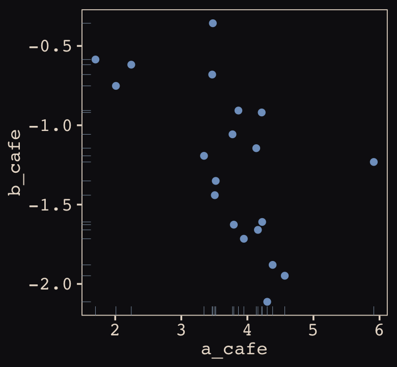

Again, these are not “data.” Figure 14.2 shows a distribution of
*parameters*. Here’s their Pearson’s correlation coefficient.

``` r
cor(vary_effects$a_cafe, vary_effects$b_cafe)
```

    ## [1] -0.5721537

Since there are only 20 rows in our `vary_effects` simulation, it
shouldn’t be a surprise that the Pearson’s correlation is a bit off from
the population value of \(\rho = -.7\). If you rerun the simulation with
`n_cafes <- 200`, the Pearson’s correlation is much closer to the data
generating value.

### 14.1.2 Simulate observations.

Here we put those simulated parameters to use and simulate actual data
from them.

``` r
n_visits <- 10
sigma    <-  0.5  # std dev within cafes

set.seed(22)  # used to replicate example

d <-
  vary_effects %>% 
  mutate(cafe = 1:n_cafes) %>% 
  expand(nesting(cafe, a_cafe, b_cafe), visit = 1:n_visits) %>% 
  mutate(afternoon = rep(0:1, times = n() / 2)) %>% 
  mutate(mu = a_cafe + b_cafe * afternoon) %>% 
  mutate(wait = rnorm(n = n(), mean = mu, sd = sigma))
```

We might peek at the data.

``` r
d %>%
  glimpse()
```

    ## Rows: 200
    ## Columns: 7
    ## $ cafe      <int> 1, 1, 1, 1, 1, 1, 1, 1, 1, 1, 2, 2, 2, 2, 2, 2, 2, 2, 2, 2, 3, 3, 3, 3, 3, 3, 3, 3, 3, 3,…
    ## $ a_cafe    <dbl> 4.223962, 4.223962, 4.223962, 4.223962, 4.223962, 4.223962, 4.223962, 4.223962, 4.223962,…
    ## $ b_cafe    <dbl> -1.6093565, -1.6093565, -1.6093565, -1.6093565, -1.6093565, -1.6093565, -1.6093565, -1.60…
    ## $ visit     <int> 1, 2, 3, 4, 5, 6, 7, 8, 9, 10, 1, 2, 3, 4, 5, 6, 7, 8, 9, 10, 1, 2, 3, 4, 5, 6, 7, 8, 9, …
    ## $ afternoon <int> 0, 1, 0, 1, 0, 1, 0, 1, 0, 1, 0, 1, 0, 1, 0, 1, 0, 1, 0, 1, 0, 1, 0, 1, 0, 1, 0, 1, 0, 1,…
    ## $ mu        <dbl> 4.223962, 2.614606, 4.223962, 2.614606, 4.223962, 2.614606, 4.223962, 2.614606, 4.223962,…
    ## $ wait      <dbl> 3.9678929, 3.8571978, 4.7278755, 2.7610133, 4.1194827, 3.5436522, 4.1909492, 2.5332235, 4…

Now we’ve finally simulated our data, we are ready to make our version
of Figure 14.1, from way back on page 388.

``` r
d %>%
  mutate(afternoon = ifelse(afternoon == 0, "M", "A"),
         day       = rep(rep(1:5, each = 2), times = n_cafes)) %>%
  filter(cafe %in% c(3, 5)) %>%
  mutate(cafe = str_c("café #", cafe)) %>% 
  
  ggplot(aes(x = visit, y = wait, group = day)) +
  geom_point(aes(color = afternoon), size = 2) +
  geom_line(color = "#8B9DAF") +
  scale_color_manual(values = c("#80A0C7", "#EEDA9D")) +
  scale_x_continuous(NULL, breaks = 1:10, labels = rep(c("M", "A"), times = 5)) +
  scale_y_continuous("wait time in minutes", limits = c(0, NA)) +
  theme_pearl_earring(legend.position = "none",
                      axis.ticks.x = element_blank()) +
  facet_wrap(~cafe, ncol = 1)
```

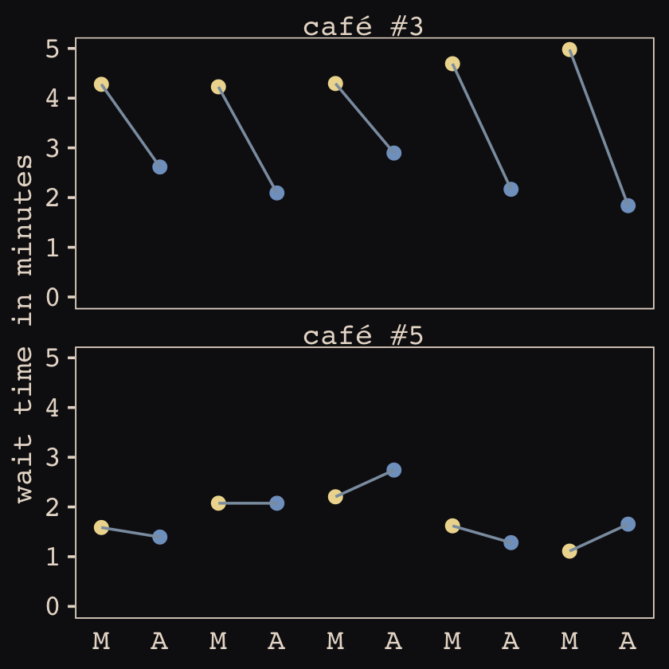

#### 14.1.2.1 Rethinking: Simulation and misspecification.

> In this exercise, we are simulating data from a generative process and
> then analyzing that data with a model that reflects exactly the
> correct structure of that process. But in the real world, we’re never
> so lucky. Instead we are always forced to analyze data with a model
> that is misspecified: The true data-generating process is different
> than the model. Simulation can be used however to explore
> misspecification. Just simulate data from a process and then see how a
> number of models, none of which match exactly the data-generating
> process, perform. And always remember that Bayesian inference does not
> depend upon data-generating assumptions, such as the likelihood, being
> true. (p. 441)

### 14.1.3 The varying slopes model.

The statistical formula for our varying intercepts and slopes café model
follows the form

\[
\begin{align*}
\text{wait}_i & \sim \operatorname{Normal}(\mu_i, \sigma) \\
\mu_i         & = \alpha_{\text{café}[i]} + \beta_{\text{café}[i]} \text{afternoon}_i \\
\begin{bmatrix} \alpha_\text{café} \\ \beta_\text{café} \end{bmatrix} & \sim \operatorname{MVNormal} \begin{pmatrix} \begin{bmatrix} \alpha \\ \beta \end{bmatrix}, \mathbf{S} \end{pmatrix} \\
\mathbf S     & = \begin{pmatrix} \sigma_\alpha & 0 \\ 0 & \sigma_\beta \end{pmatrix} \mathbf R \begin{pmatrix} \sigma_\alpha & 0 \\ 0 & \sigma_\beta \end{pmatrix} \\
\alpha        & \sim \operatorname{Normal}(5, 2) \\
\beta         & \sim \operatorname{Normal}(-1, 0.5) \\
\sigma        & \sim \operatorname{Exponential}(1) \\
\sigma_\alpha & \sim \operatorname{Exponential}(1) \\
\sigma_\beta  & \sim \operatorname{Exponential}(1) \\
\mathbf R     & \sim \operatorname{LKJcorr}(2),
\end{align*}
\]

where \(\mathbf S\) is the covariance matrix and \(\mathbf R\) is the
corresponding correlation matrix, which we might more fully express as

\[\mathbf R = \begin{pmatrix} 1 & \rho \\ \rho & 1 \end{pmatrix}.\]

And according to our prior, \(\mathbf R\) is distributed as
\(\operatorname{LKJcorr}(2)\). We’ll use `rethinking::rlkjcorr()` to get
a better sense of what that even is.

``` r
library(rethinking)

n_sim <- 1e4

set.seed(14)
r_1 <- 
  rlkjcorr(n_sim, K = 2, eta = 1) %>%
  as_tibble()

set.seed(14)
r_2 <- 
  rlkjcorr(n_sim, K = 2, eta = 2) %>%
  as_tibble()

set.seed(14)
r_4 <- 
  rlkjcorr(n_sim, K = 2, eta = 4) %>%
  as_tibble()
```

Here are the \(\text{LKJcorr}\) distributions of Figure 14.3.

``` r
# for annotation
text <-
  tibble(x     = c(.83, .55, .35),
         y     = c(.56, .75, 1.05),
         label = c("eta = 1", "eta = 2", "eta = 4"))

# plot
r_1 %>% 
  ggplot(aes(x = V2)) +
  geom_density(color = "transparent", fill = "#394165", alpha = 2/3, adjust = 1/2) +
  geom_density(data = r_2,
               color = "transparent", fill = "#DCA258", alpha = 2/3, adjust = 1/2) +
  geom_density(data = r_4,
               color = "transparent", fill = "#FCF9F0", alpha = 2/3, adjust = 1/2) +
  geom_text(data = text,
            aes(x = x, y = y, label = label),
            color = "#A65141", family = "Courier") +
  scale_y_continuous(NULL, breaks = NULL) +
  labs(title = expression(LKJcorr(eta)),
       x = "correlation")
```

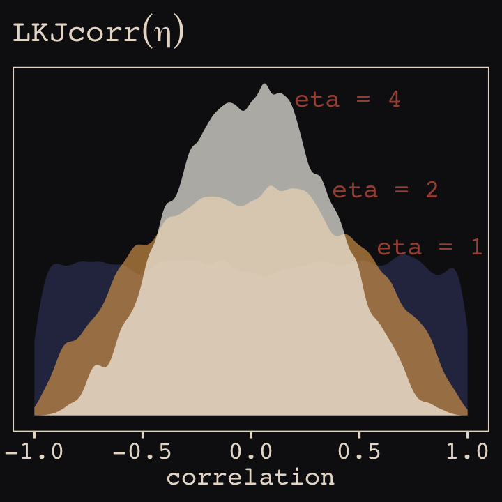

As it turns out, the shape of the LKJ is sensitive to both \(\eta\) and
the \(K\) dimensions of the correlation matrix. Our simulations only
considered the shapes for when \(K = 2\). We can use a combination of
the `parse_dist()` and `stat_dist_halfeye()` functions from the
**tidybayes** package to derive analytic solutions for different
combinations of \(\eta\) and \(K\).

``` r
library(tidybayes)

crossing(k   = 2:5,
         eta = 1:4) %>% 
  mutate(prior = str_c("lkjcorr_marginal(", k, ", ", eta, ")"),
         strip = str_c("K==", k)) %>% 
  parse_dist(prior) %>%
  
  ggplot(aes(y = eta, dist = .dist, args = .args)) +
  stat_dist_halfeye(.width = c(.5, .95),
                    color = "#FCF9F0", fill = "#A65141") +
  scale_x_continuous(expression(rho), limits = c(-1, 1),
                     breaks = c(-1, -.5, 0, .5, 1), labels = c("-1", "-.5", "0", ".5", "1")) +
  scale_y_continuous(expression(eta), breaks = 1:4) +
  ggtitle(expression("Marginal correlation for the LKJ prior relative to K and "*eta)) +
  facet_wrap(~strip, labeller = label_parsed, ncol = 4)
```


To learn more about this method, check out Kay’s
\[-2kayMarginalDistributionSingle2020\] [*Marginal distribution of a
single correlation from an LKJ
distribution*](https://mjskay.github.io/ggdist/reference/lkjcorr_marginal.html).

Okay, let’s get ready to model and switch out **rethinking** for
**brms**.

``` r
detach(package:rethinking, unload = T)
library(brms)
```

As defined above, our first model has both varying intercepts and
`afternoon` slopes. I should point out that the `(1 + afternoon | cafe)`
syntax specifies that we’d like `brm()` to fit the random effects for
`1` (i.e., the intercept) and the `afternoon` slope as correlated. Had
we wanted to fit a model in which they were orthogonal, we’d have coded
`(1 + afternoon || cafe)`.

``` r
 b14.1 <- 
  brm(data = d, 
      family = gaussian,
      wait ~ 1 + afternoon + (1 + afternoon | cafe),
      prior = c(prior(normal(5, 2), class = Intercept),
                prior(normal(-1, 0.5), class = b),
                prior(exponential(1), class = sd),
                prior(exponential(1), class = sigma),
                prior(lkj(2), class = cor)),
      iter = 2000, warmup = 1000, chains = 4, cores = 4,
      seed = 867530,
      file = "/Users/solomonkurz/Dropbox/Recoding Statistical Rethinking 2nd ed/fits/b14.01")
```

With Figure 14.4, we assess how the posterior for the correlation of the
random effects compares to its prior.

``` r
post <- posterior_samples(b14.1)

post %>%
  ggplot() +
  geom_density(data = r_2, aes(x = V2),
               color = "transparent", fill = "#EEDA9D", alpha = 3/4) +
  geom_density(aes(x = cor_cafe__Intercept__afternoon),
               color = "transparent", fill = "#A65141", alpha = 9/10) +
  annotate(geom = "text", x = -0.28, y = 2.25, 
           label = "posterior", color = "#A65141", family = "Courier") +
  annotate(geom = "text", x = 0, y = 0.85, 
           label = "prior", color = "#EEDA9D", alpha = 2/3, family = "Courier") +
  scale_y_continuous(NULL, breaks = NULL) +
  labs(title = "Posterior distribution of the correlation\nbetween intercepts and slopes",
  x = "correlation")
```


McElreath then depicted multidimensional shrinkage by plotting the
posterior mean of the varying effects compared to their raw, unpooled
estimated. With **brms**, we can get the `cafe`-specific intercepts and
`afternoon` slopes with `coef()`, which returns a three-dimensional
list.

``` r
# coef(b14.1) %>% glimpse()
coef(b14.1)
```

    ## $cafe
    ## , , Intercept
    ## 
    ##    Estimate Est.Error     Q2.5    Q97.5
    ## 1  4.217447 0.2018019 3.824741 4.610678
    ## 2  2.157117 0.2023030 1.752369 2.554617
    ## 3  4.374876 0.2055618 3.969601 4.770744
    ## 4  3.247926 0.1974200 2.859321 3.623184
    ## 5  1.876235 0.1987167 1.486781 2.258197
    ## 6  4.263969 0.2049154 3.856609 4.675718
    ## 7  3.612005 0.1947422 3.229293 3.998222
    ## 8  3.947382 0.1989205 3.555953 4.345577
    ## 9  3.986117 0.1973238 3.598177 4.367915
    ## 10 3.561080 0.1994722 3.187764 3.954724
    ## 11 1.930770 0.2012895 1.532160 2.332417
    ## 12 3.842972 0.1981214 3.454764 4.226797
    ## 13 3.881033 0.2005934 3.484184 4.253935
    ## 14 3.173598 0.1989779 2.777426 3.561954
    ## 15 4.455068 0.2068003 4.044761 4.861744
    ## 16 3.388183 0.2032259 2.992205 3.785476
    ## 17 4.214856 0.1958688 3.829784 4.595347
    ## 18 5.746429 0.2031975 5.339666 6.131445
    ## 19 3.242601 0.2074594 2.832662 3.648870
    ## 20 3.739702 0.1991852 3.355478 4.140396
    ## 
    ## , , afternoon
    ## 
    ##      Estimate Est.Error       Q2.5       Q97.5
    ## 1  -1.1564079 0.2611610 -1.6767645 -0.65013377
    ## 2  -0.9076589 0.2694590 -1.4638938 -0.38975992
    ## 3  -1.9373011 0.2785979 -2.4700939 -1.38910869
    ## 4  -1.2396792 0.2628824 -1.7576545 -0.71588756
    ## 5  -0.1331505 0.2790300 -0.6664555  0.41253932
    ## 6  -1.3015290 0.2737102 -1.8296546 -0.75805762
    ## 7  -1.0199397 0.2568145 -1.5313213 -0.52430180
    ## 8  -1.6364944 0.2687794 -2.1668908 -1.12748662
    ## 9  -1.3101210 0.2623046 -1.8215215 -0.79761190
    ## 10 -0.9470151 0.2602688 -1.4644125 -0.43085249
    ## 11 -0.4317661 0.2742758 -0.9794932  0.09951761
    ## 12 -1.1893695 0.2610251 -1.6903426 -0.66509228
    ## 13 -1.8127721 0.2678092 -2.3502321 -1.30977936
    ## 14 -0.9425814 0.2610761 -1.4714922 -0.42861871
    ## 15 -2.1954867 0.2854975 -2.7748484 -1.65267872
    ## 16 -1.0392753 0.2712236 -1.5678736 -0.51128431
    ## 17 -1.2228926 0.2653407 -1.7500057 -0.71077267
    ## 18 -1.0166955 0.2769046 -1.5612484 -0.47911096
    ## 19 -0.2510217 0.2787934 -0.7963454  0.32858114
    ## 20 -1.0668519 0.2665278 -1.5984522 -0.55614157

Here’s the code to extract the relevant elements from the `coef()` list,
convert them to a tibble, and add the `cafe` index.

``` r
partially_pooled_params <-
  # with this line we select each of the 20 cafe's posterior mean (i.e., Estimate)
  # for both `Intercept` and `afternoon`
  coef(b14.1)$cafe[ , 1, 1:2] %>%
  as_tibble() %>%               # convert the two vectors to a tibble
  rename(Slope = afternoon) %>%
  mutate(cafe = 1:nrow(.)) %>%  # add the `cafe` index
  select(cafe, everything())    # simply moving `cafe` to the leftmost position
```

Like McElreath, we’ll compute the unpooled estimates directly from the
data.

``` r
# compute unpooled estimates directly from data
un_pooled_params <-
  d %>%
  # with these two lines, we compute the mean value for each cafe's wait time 
  # in the morning and then the afternoon
  group_by(afternoon, cafe) %>%
  summarise(mean = mean(wait)) %>%
  ungroup() %>%  # ungrouping allows us to alter afternoon, one of the grouping variables
  mutate(afternoon = ifelse(afternoon == 0, "Intercept", "Slope")) %>%
  spread(key = afternoon, value = mean) %>%  # use `spread()` just as in the previous block
  mutate(Slope = Slope - Intercept)          # finally, here's our slope!
```

    ## `summarise()` regrouping output by 'afternoon' (override with `.groups` argument)

``` r
# here we combine the partially-pooled and unpooled means into a single data object, 
# which will make plotting easier.
params <-
  # `bind_rows()` will stack the second tibble below the first
  bind_rows(partially_pooled_params, un_pooled_params) %>%
  # index whether the estimates are pooled
  mutate(pooled = rep(c("partially", "not"), each = nrow(.)/2)) 

# here's a glimpse at what we've been working for
params %>%
  slice(c(1:5, 36:40))
```

    ## # A tibble: 10 x 4
    ##     cafe Intercept   Slope pooled   
    ##    <int>     <dbl>   <dbl> <chr>    
    ##  1     1      4.22 -1.16   partially
    ##  2     2      2.16 -0.908  partially
    ##  3     3      4.37 -1.94   partially
    ##  4     4      3.25 -1.24   partially
    ##  5     5      1.88 -0.133  partially
    ##  6    16      3.37 -1.03   not      
    ##  7    17      4.24 -1.22   not      
    ##  8    18      5.76 -0.877  not      
    ##  9    19      3.12  0.0144 not      
    ## 10    20      3.73 -1.04   not

Finally, here’s our code for Figure 14.5.a, showing shrinkage in two
dimensions.

``` r
p1 <-
  ggplot(data = params, aes(x = Intercept, y = Slope)) +
  stat_ellipse(geom = "polygon", type = "norm", level = 1/10, size = 0, alpha = 1/20, fill = "#E7CDC2") +
  stat_ellipse(geom = "polygon", type = "norm", level = 2/10, size = 0, alpha = 1/20, fill = "#E7CDC2") +
  stat_ellipse(geom = "polygon", type = "norm", level = 3/10, size = 0, alpha = 1/20, fill = "#E7CDC2") +
  stat_ellipse(geom = "polygon", type = "norm", level = 4/10, size = 0, alpha = 1/20, fill = "#E7CDC2") +
  stat_ellipse(geom = "polygon", type = "norm", level = 5/10, size = 0, alpha = 1/20, fill = "#E7CDC2") +
  stat_ellipse(geom = "polygon", type = "norm", level = 6/10, size = 0, alpha = 1/20, fill = "#E7CDC2") +
  stat_ellipse(geom = "polygon", type = "norm", level = 7/10, size = 0, alpha = 1/20, fill = "#E7CDC2") +
  stat_ellipse(geom = "polygon", type = "norm", level = 8/10, size = 0, alpha = 1/20, fill = "#E7CDC2") +
  stat_ellipse(geom = "polygon", type = "norm", level = 9/10, size = 0, alpha = 1/20, fill = "#E7CDC2") +
  stat_ellipse(geom = "polygon", type = "norm", level = .99,  size = 0, alpha = 1/20, fill = "#E7CDC2") +
  geom_point(aes(group = cafe, color = pooled)) +
  geom_line(aes(group = cafe), size = 1/4) +
  scale_color_manual("Pooled?",
                     values = c("#80A0C7", "#A65141")) +
  coord_cartesian(xlim = range(params$Intercept),
                  ylim = range(params$Slope))
p1
```

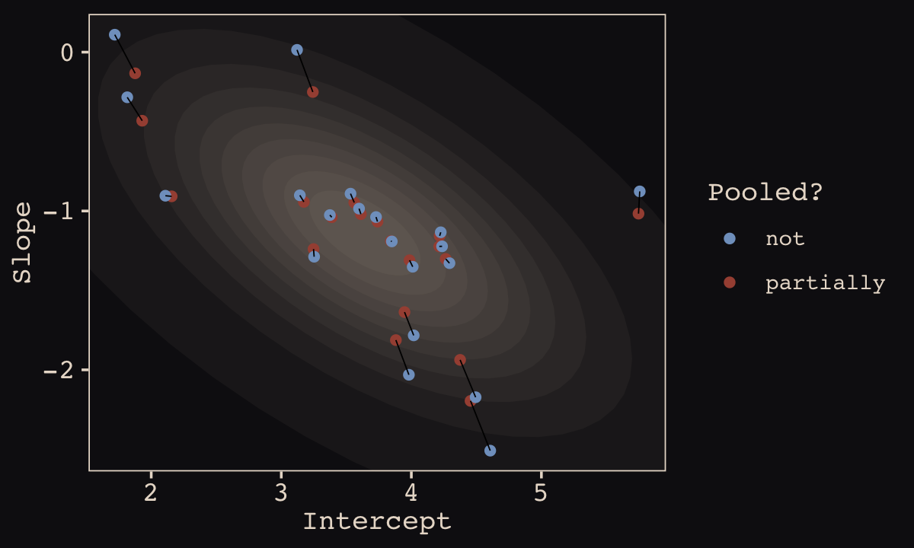

Learn more about `stat_ellipse()`,
[here](https://ggplot2.tidyverse.org/reference/stat_ellipse.html). Let’s
prep for Figure 14.5.b.

``` r
# retrieve the partially-pooled estimates with `coef()`
partially_pooled_estimates <-
  coef(b14.1)$cafe[ , 1, 1:2] %>%
  # convert the two vectors to a tibble
  as_tibble() %>%
  # the Intercept is the wait time for morning (i.e., `afternoon == 0`)
  rename(morning = Intercept) %>%
  # `afternoon` wait time is the `morning` wait time plus the afternoon slope
  mutate(afternoon = morning + afternoon,
         cafe      = 1:n()) %>%  # add the `cafe` index
  select(cafe, everything()) 

# compute unpooled estimates directly from data
un_pooled_estimates <-
  d %>%
  # as above, with these two lines, we compute each cafe's mean wait value by time of day
  group_by(afternoon, cafe) %>% 
  summarise(mean = mean(wait)) %>%
  # ungrouping allows us to alter the grouping variable, afternoon
  ungroup() %>% 
  mutate(afternoon = ifelse(afternoon == 0, "morning", "afternoon")) %>%
  # this seperates out the values into morning and afternoon columns
  spread(key = afternoon, value = mean)

estimates <-
  bind_rows(partially_pooled_estimates, un_pooled_estimates) %>%
  mutate(pooled = rep(c("partially", "not"), each = n() / 2))
```

The code for Figure 14.5.b.

``` r
p2 <-
  ggplot(data = estimates, aes(x = morning, y = afternoon)) +
  # nesting `stat_ellipse()` within `mapply()` is a less redundant way to produce the 
  # ten-layered semitransparent ellipses we did with ten lines of `stat_ellipse()` 
  # functions in the previous plot
  mapply(function(level) {
    stat_ellipse(geom  = "polygon", type = "norm",
                 size  = 0, alpha = 1/20, fill = "#E7CDC2",
                 level = level)
    }, 
    # enter the levels here
    level = c(1:9 / 10, .99)) +
  geom_point(aes(group = cafe, color = pooled)) +
  geom_line(aes(group = cafe), size = 1/4) +
  scale_color_manual("Pooled?", values = c("#80A0C7", "#A65141")) +
  labs(x = "morning wait (mins)",
       y = "afternoon wait (mins)") +
  coord_cartesian(xlim = range(estimates$morning),
                  ylim = range(estimates$afternoon))
```

Here we combine the two subplots together with **patchwork** syntax.

``` r
library(patchwork)

(p1 + theme(legend.position = "none")) + 
  p2 + 
  plot_annotation(title = "Shrinkage in two dimensions")
```

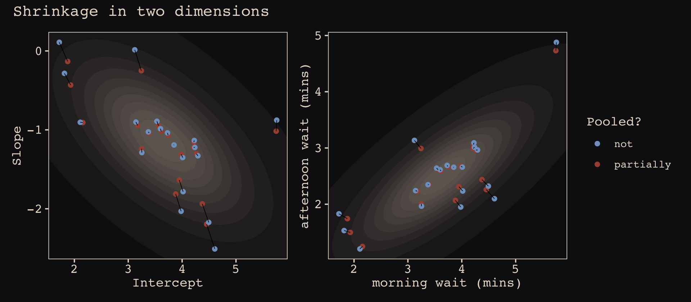

> What I want you to appreciate in this plot is that shrinkage on the
> parameter scale naturally produces shrinkage where we actually care
> about it: on the outcome scale. And it also implies a population of
> wait times, shown by the \[semitransparent ellipses\]. That population
> is now positively correlated–cafés with longer morning waits also tend
> to have longer afternoon waits. They are popular, after all. But the
> population lies mostly below the dashed line where the waits are
> equal. You’ll wait less in the afternoon, on average. (p. 446)

## 14.2 Advanced varying slopes

In \[Section 13.3\]\[More than one type of cluster\] we saw that data
can be considered **cross-classified** if they have multiple grouping
factors. We used the `chipanzees` data in that section and we only
considered cross-cassification by single intercepts. Turns out
cross-classified models can be extended further. Let’s load and wrangle
those data.

``` r
library(rethinking)
data(chimpanzees)
d <- chimpanzees

detach(package:rethinking, unload = T)
library(brms)
rm(chimpanzees)

# wrangle.

d <-
  d %>% 
  mutate(actor     = factor(actor),
         block     = factor(block),
         treatment = factor(1 + prosoc_left + 2 * condition),
         # this will come in handy, later
         labels    = factor(treatment,
                            levels = 1:4,
                            labels = c("r/n", "l/n", "r/p", "l/p")))

glimpse(d)
```

    ## Rows: 504
    ## Columns: 10
    ## $ actor        <fct> 1, 1, 1, 1, 1, 1, 1, 1, 1, 1, 1, 1, 1, 1, 1, 1, 1, 1, 1, 1, 1, 1, 1, 1, 1, 1, 1, 1, 1,…
    ## $ recipient    <int> NA, NA, NA, NA, NA, NA, NA, NA, NA, NA, NA, NA, NA, NA, NA, NA, NA, NA, NA, NA, NA, NA…
    ## $ condition    <int> 0, 0, 0, 0, 0, 0, 0, 0, 0, 0, 0, 0, 0, 0, 0, 0, 0, 0, 0, 0, 0, 0, 0, 0, 0, 0, 0, 0, 0,…
    ## $ block        <fct> 1, 1, 1, 1, 1, 1, 2, 2, 2, 2, 2, 2, 3, 3, 3, 3, 3, 3, 4, 4, 4, 4, 4, 4, 5, 5, 5, 5, 5,…
    ## $ trial        <int> 2, 4, 6, 8, 10, 12, 14, 16, 18, 20, 22, 24, 26, 28, 30, 32, 34, 36, 38, 40, 42, 44, 46…
    ## $ prosoc_left  <int> 0, 0, 1, 0, 1, 1, 1, 1, 0, 0, 0, 1, 0, 1, 0, 1, 1, 0, 1, 0, 0, 0, 1, 1, 0, 0, 1, 1, 0,…
    ## $ chose_prosoc <int> 1, 0, 0, 1, 1, 1, 0, 0, 1, 1, 0, 0, 0, 1, 1, 1, 0, 1, 1, 0, 0, 1, 1, 0, 1, 0, 0, 0, 1,…
    ## $ pulled_left  <int> 0, 1, 0, 0, 1, 1, 0, 0, 0, 0, 1, 0, 1, 1, 0, 1, 0, 0, 1, 1, 1, 0, 1, 0, 0, 1, 0, 0, 0,…
    ## $ treatment    <fct> 1, 1, 2, 1, 2, 2, 2, 2, 1, 1, 1, 2, 1, 2, 1, 2, 2, 1, 2, 1, 1, 1, 2, 2, 1, 1, 2, 2, 1,…
    ## $ labels       <fct> r/n, r/n, l/n, r/n, l/n, l/n, l/n, l/n, r/n, r/n, r/n, l/n, r/n, l/n, r/n, l/n, l/n, r…

If I’m following along correctly with the text, McElreath’s `m14.2` uses
the centered parameterization. Recall from the last chapter that
**brms** only supports the non-centered parameterization. Happily,
McElreath’s `m14.3` appears to use the non-centered parameterization.
Thus, we’ll skip making a `b14/2` and jump directly into making a
`b14.3`. I believe one could describe the statistical model as

\[
\begin{align*}
\text{left_pull}_i & \sim \operatorname{Binomial}(n_i = 1, p_i) \\
\operatorname{logit} (p_i) & = \gamma_{\text{treatment}[i]} + \alpha_{\text{actor}[i], \text{treatment}[i]} + \beta_{\text{block}[i], \text{treatment}[i]} \\
\gamma_j & \sim \operatorname{Normal}(0, 1), \;\;\; \text{for } j = 1..4 \\
\begin{bmatrix} \alpha_{j, 1} \\ \alpha_{j, 2} \\ \alpha_{j, 3} \\ \alpha_{j, 4} \end{bmatrix} & \sim \operatorname{MVNormal} \begin{pmatrix} \begin{bmatrix} 0 \\ 0 \\ 0 \\ 0 \end{bmatrix}, \mathbf \Sigma_\text{actor} \end{pmatrix} \\
\begin{bmatrix} \beta_{j, 1} \\ \beta_{j, 2} \\ \beta_{j, 3} \\ \beta_{j, 4} \end{bmatrix} & \sim \operatorname{MVNormal} \begin{pmatrix} \begin{bmatrix} 0 \\ 0 \\ 0 \\ 0 \end{bmatrix}, \mathbf \Sigma_\text{block} \end{pmatrix} \\
\mathbf \Sigma_\text{actor} & = \mathbf{S_\alpha R_\alpha S_\alpha} \\
\mathbf \Sigma_\text{block} & = \mathbf{S_\beta R_\beta S_\beta} \\
\sigma_{\alpha, [1]}, ..., \sigma_{\alpha, [4]} & \sim \operatorname{Exponential}(1) \\
\sigma_{\beta, [1]}, ..., \sigma_{\beta, [4]}   & \sim \operatorname{Exponential}(1) \\
\mathbf R_\alpha & \sim \operatorname{LKJ}(2) \\
\mathbf R_\beta  & \sim \operatorname{LKJ}(2).
\end{align*}
\]

In this model, we have four population-level intercepts,
\(\gamma_1, ..., \gamma_4\), one for each of the four levels of
`treatment`. There are two higher-level grouping variables, `actor` and
`block`, making this a cross-classified model.

The term \(\alpha_{\text{actor}[i], \text{treatment}[i]}\) is meant to
convey that each of the `treatment` effects can vary by `actor`. The
first line containing the \(\operatorname{MVNormal}(\cdot)\) operator
indicates the `actor`-level deviations from the population-level
estimates for \(\gamma_j\) follow the multivariate normal distribution
where the four means are set to zero (i.e., they are deviations) and
their spread around those zeros are controlled by
\(\Sigma_\text{actor}\). In the first line below the last line
containing \(\operatorname{MVNormal}(\cdot)\), we learn that
\(\Sigma_\text{actor}\) can be decomposed into two terms,
\(\mathbf S_\alpha\) and \(\mathbf R_\alpha\). It may not yet be clear
by the notation, but \(\mathbf S_\alpha\) is a \(4 \times 4\) matrix,

\[
\mathbf S_\alpha = \begin{pmatrix} \sigma_{\alpha, [1]} & 0 & 0 & 0 \\ 0 & \sigma_{\alpha, [2]} & 0 & 0 \\ 0 & 0 & \sigma_{\alpha, [3]} & 0 \\ 0 & 0 & 0 & \sigma_{\alpha, [4]} \end{pmatrix}.
\]

In a similar way, \(\mathbf R_\alpha\) is a \(4 \times 4\) matrix,

\[
\mathbf R_\alpha = \begin{pmatrix} 1 & \rho_{\alpha, [1, 2]} & \rho_{\alpha, [1, 3]} & \rho_{\alpha, [1, 4]} \\ \rho_{\alpha, [2, 1]} & 1 & \rho_{\alpha, [2, 3]} & \rho_{\alpha, [2, 4]} \\ \rho_{\alpha, [3, 1]} & \rho_{\alpha, [3, 2]} & 1 & \rho_{\alpha, [3, 4]} \\ \rho_{\alpha, [4, 1]} & \rho_{\alpha, [4, 2]} & \rho_{\alpha, [4, 3]} & 1 \end{pmatrix}.
\]

The same overall pattern holds true for
\(\beta_{\text{block}[i], \text{treatment}[i]}\) and the associated
\(\beta\) parameters connected to the `block` grouping variable. All the
population parameters
\(\sigma_{\alpha, [1]}, ..., \sigma_{\alpha, [4]}\) and
\(\sigma_{\beta, [1]}, ..., \sigma_{\beta, [4]}\) have individual
\(\operatorname{Exponential}(1)\) priors. The two
\(\mathbf R_{< \cdot >}\) matrices have the priors
\(\operatorname{LKJ}(2)\).

I know; this is a lot. This all takes time to grapple with. Here’s how
to fit such a model with **brms**.

``` r
b14.3 <- 
  brm(data = d, 
      family = binomial,
      pulled_left | trials(1) ~ 0 + treatment + (0 + treatment | actor) + (0 + treatment | block),
      prior = c(prior(normal(0, 1), class = b),
                prior(exponential(1), class = sd, group = actor),
                prior(exponential(1), class = sd, group = block),
                prior(lkj(2), class = cor, group = actor),
                prior(lkj(2), class = cor, group = block)),
      iter = 2000, warmup = 1000, chains = 4, cores = 4,  
      seed = 4387510,
      file = "/Users/solomonkurz/Dropbox/Recoding Statistical Rethinking 2nd ed/fits/b14.03")
```

Happily, we got no warnings about divergent transitions. Since it’s been
a while, we’ll use `bayesplotmcmc_rank_overlay()` to examine the primary
parameters with a trank plot.

``` r
library(bayesplot)

# give the parameters fancy names
names <- 
  c(str_c("treatment[", 1:4, "]"), str_c("sigma['actor[", 1:4, "]']"), str_c("sigma['block[", 1:4, "]']"), str_c("rho['actor:treatment[", c(1, 1:2, 1:3), ",", rep(2:4, times = 1:3), "]']"), str_c("rho['block:treatment[", c(1, 1:2, 1:3), ",", rep(2:4, times = 1:3), "]']"), "chain")

posterior_samples(b14.3, add_chain = T) %>% 
  select(b_treatment1:`cor_block__treatment3__treatment4`, chain) %>% 
  set_names(names) %>% 
  
  mcmc_rank_overlay() +
  scale_color_manual(values = c("#80A0C7", "#B1934A", "#A65141", "#EEDA9D")) +
  scale_x_continuous(breaks = 0:4 * 1e3, labels = c(0, str_c(1:4, "K"))) +
  coord_cartesian(ylim = c(30, NA)) +
  theme(legend.position = "bottom") +
  facet_wrap(~parameter, labeller = label_parsed, ncol = 4)
```

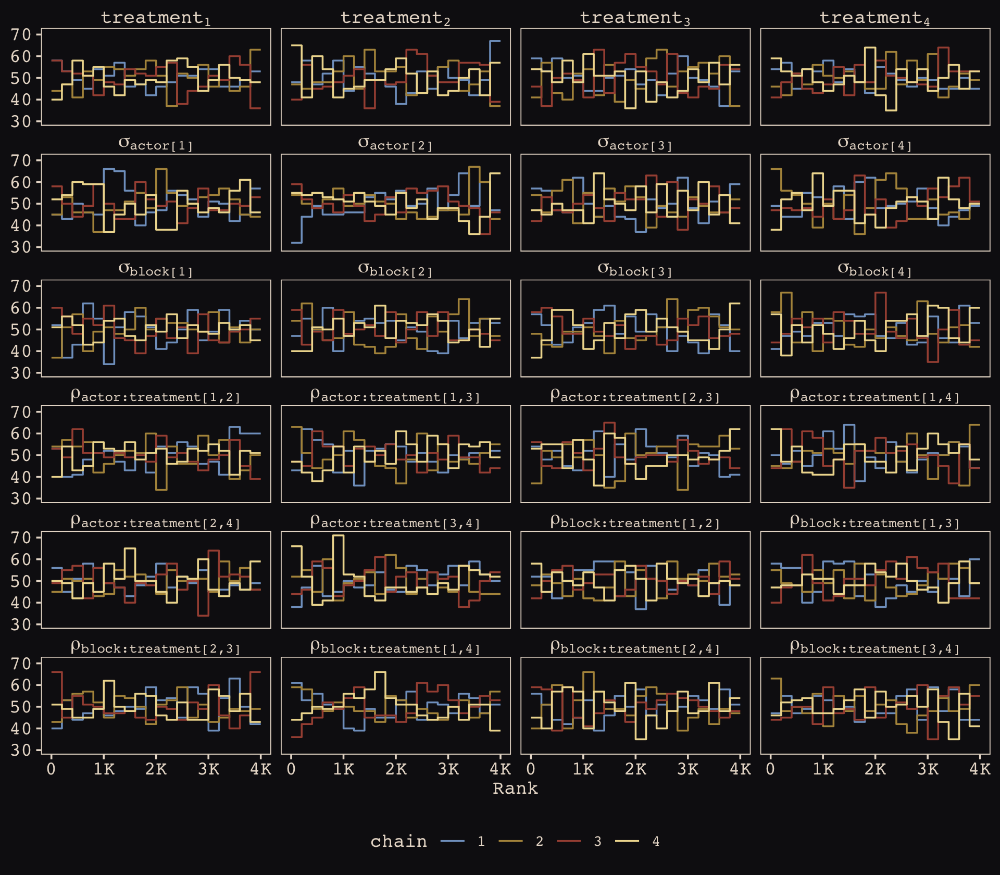

Because we only fit a non-centered version of the model, we aren’t able
to make a faithful version of McElreath’s Figure 14.6. However, we can
still use `posterior::summarise_draws()` to help make histograms of the
two kinds of effective sample sizes for our `b14.3`.

``` r
library(posterior)

posterior_samples(b14.3) %>% 
  summarise_draws() %>% 
  pivot_longer(starts_with("ess")) %>% 
  
  ggplot(aes(x = value)) +
  geom_histogram(binwidth = 250, fill = "#EEDA9D", color = "#DCA258") +
  xlim(0, NA) +
  facet_wrap(~name)
```

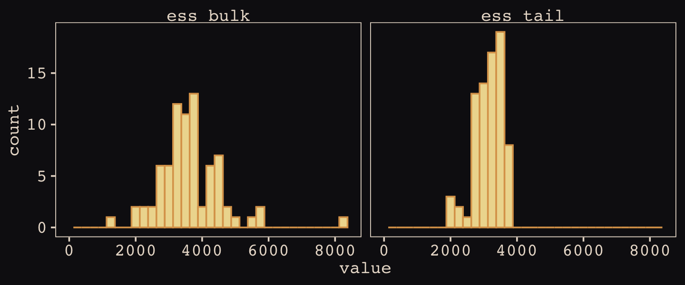

Here is a summary of the model parameters.

``` r
print(b14.3)
```

    ##  Family: binomial 
    ##   Links: mu = logit 
    ## Formula: pulled_left | trials(1) ~ 0 + treatment + (0 + treatment | actor) + (0 + treatment | block) 
    ##    Data: d (Number of observations: 504) 
    ## Samples: 4 chains, each with iter = 2000; warmup = 1000; thin = 1;
    ##          total post-warmup samples = 4000
    ## 
    ## Group-Level Effects: 
    ## ~actor (Number of levels: 7) 
    ##                            Estimate Est.Error l-95% CI u-95% CI Rhat Bulk_ESS Tail_ESS
    ## sd(treatment1)                 1.39      0.48     0.72     2.64 1.00     2201     2815
    ## sd(treatment2)                 0.91      0.40     0.35     1.91 1.00     3282     3127
    ## sd(treatment3)                 1.86      0.56     1.05     3.16 1.00     3399     2236
    ## sd(treatment4)                 1.58      0.58     0.75     2.97 1.00     3663     3013
    ## cor(treatment1,treatment2)     0.44      0.28    -0.16     0.87 1.00     3489     3054
    ## cor(treatment1,treatment3)     0.52      0.25    -0.04     0.90 1.00     2995     2774
    ## cor(treatment2,treatment3)     0.48      0.26    -0.09     0.88 1.00     3492     3420
    ## cor(treatment1,treatment4)     0.44      0.27    -0.17     0.87 1.00     2936     2992
    ## cor(treatment2,treatment4)     0.45      0.27    -0.18     0.88 1.00     3654     2849
    ## cor(treatment3,treatment4)     0.57      0.24     0.01     0.92 1.00     3571     3250
    ## 
    ## ~block (Number of levels: 6) 
    ##                            Estimate Est.Error l-95% CI u-95% CI Rhat Bulk_ESS Tail_ESS
    ## sd(treatment1)                 0.41      0.32     0.02     1.19 1.00     2134     2402
    ## sd(treatment2)                 0.43      0.34     0.02     1.28 1.00     2055     2192
    ## sd(treatment3)                 0.30      0.28     0.01     1.02 1.00     3257     2160
    ## sd(treatment4)                 0.47      0.37     0.02     1.41 1.00     2494     2728
    ## cor(treatment1,treatment2)    -0.07      0.37    -0.73     0.64 1.00     5141     2860
    ## cor(treatment1,treatment3)    -0.01      0.38    -0.72     0.70 1.00     8342     2957
    ## cor(treatment2,treatment3)    -0.03      0.38    -0.73     0.71 1.00     5812     2737
    ## cor(treatment1,treatment4)     0.05      0.37    -0.67     0.72 1.00     5716     2841
    ## cor(treatment2,treatment4)     0.05      0.38    -0.69     0.75 1.00     4646     2892
    ## cor(treatment3,treatment4)     0.01      0.38    -0.70     0.72 1.00     3508     3356
    ## 
    ## Population-Level Effects: 
    ##            Estimate Est.Error l-95% CI u-95% CI Rhat Bulk_ESS Tail_ESS
    ## treatment1     0.22      0.50    -0.72     1.25 1.00     2269     2882
    ## treatment2     0.63      0.40    -0.18     1.44 1.00     2961     2622
    ## treatment3    -0.03      0.58    -1.12     1.15 1.00     3060     2884
    ## treatment4     0.69      0.55    -0.38     1.79 1.00     3378     2795
    ## 
    ## Samples were drawn using sampling(NUTS). For each parameter, Bulk_ESS
    ## and Tail_ESS are effective sample size measures, and Rhat is the potential
    ## scale reduction factor on split chains (at convergence, Rhat = 1).

Like McElreath explained on page 450, our `b14.3` has 76 parameters:

  - 4 average `treatment` effects, as listed in the ‘Population-Level
    Effects’ section;
  - 7 \(\times\) 4 = 28 varying effects on `actor`, as indicated in the
    ‘~actor:treatment (Number of levels: 7)’ header multiplied by the
    four levels of `treatment`;
  - 6 \(\times\) 4 = 24 varying effects on `block`, as indicated in the
    ‘~block:treatment (Number of levels: 6)’ header multiplied by the
    four levels of `treatment`;
  - 8 standard deviations listed in the eight rows beginning with `sd(`;
    and
  - 12 free correlation parameters listed in the eight rows beginning
    with `cor(`.

Compute the WAIC
    estmiate.

``` r
b14.3 <- add_criterion(b14.3, "waic")
```

    ## Automatically saving the model object in '/Users/solomonkurz/Dropbox/Recoding Statistical Rethinking 2nd ed/fits/b14.03.rds'

``` r
waic(b14.3)
```

    ## 
    ## Computed from 4000 by 504 log-likelihood matrix
    ## 
    ##           Estimate   SE
    ## elpd_waic   -272.1  9.9
    ## p_waic        26.7  1.4
    ## waic         544.2 19.7
    ## 
    ## 1 (0.2%) p_waic estimates greater than 0.4. We recommend trying loo instead.

Like the \(p_\text{WAIC}\), our **brms** version of the model has about
27 effective parameters. Now we’ll get a better sense of the model with
a posterior predictive check in the form of our version of Figure 14.7.
McElreath described his **R** code 14.22 as “a big chunk of code”
(p. 451). I’ll leave up to the reader to decide whether our big code
chunk is any better.

``` r
# for annotation
text <-
  distinct(d, labels) %>% 
  mutate(actor = 1,
         prop  = c(.07, .8, .08, .795))

nd <-
  d %>% 
  distinct(actor, condition, labels, prosoc_left, treatment) %>% 
  mutate(block = 5)

# compute and wrangle the posterior predictions
fitted(b14.3,
       newdata = nd) %>% 
  data.frame() %>% 
  bind_cols(nd) %>% 
  # add the empirical proportions
  left_join(
    d %>%
      group_by(actor, treatment) %>%
      mutate(proportion = mean(pulled_left)) %>% 
      distinct(actor, treatment, proportion),
    by = c("actor", "treatment")
  ) %>% 
  mutate(condition = factor(condition)) %>% 
  
  # plot!
  ggplot(aes(x = labels)) +
  geom_hline(yintercept = .5, color = "#E8DCCF", alpha = 1/2, linetype = 2) +
  # empirical proportions
  geom_line(aes(y = proportion, group = prosoc_left),
            size = 1/4, color = "#394165") +
  geom_point(aes(y = proportion, shape = condition),
             color = "#394165", fill = "#100F14", size = 2.5, show.legend = F) + 
  # posterior predictions
  geom_line(aes(y = Estimate, group = prosoc_left),
            size = 3/4, color = "#80A0C7") +
  geom_pointrange(aes(y = Estimate, ymin = Q2.5, ymax = Q97.5, shape = condition),
             color = "#80A0C7", fill = "#100F14", fatten = 8, size = 1/3, show.legend = F) + 
  # annotation for the conditions
  geom_text(data = text,
            aes(y = prop, label = labels), 
            color = "#DCA258", family = "Courier", size = 3) +
  scale_shape_manual(values = c(21, 19)) +
  scale_x_discrete(NULL, breaks = NULL) +
  scale_y_continuous("proportion left lever", breaks = 0:2 / 2, labels = c("0", ".5", "1")) +
  labs(subtitle = "Posterior predictions, in light blue, against the raw data, in dark\nblue, for model b14.3, the cross-classified varying effects model.") +
  facet_wrap(~actor, nrow = 1, labeller = label_both)
```

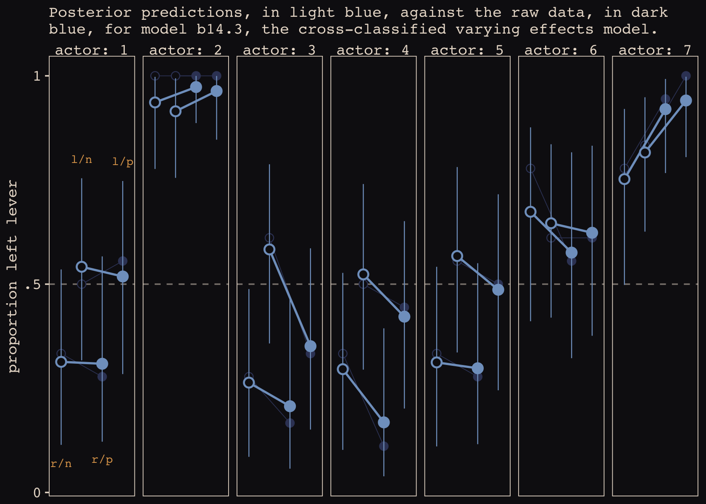

> These chimpanzees simply did not behave in any consistently different
> way in the partner treatments. The model we’ve used here does have
> some advantages, though. Since it allows for some individuals to
> differ in how they respond to the treatments, it could reveal a
> situation in which a treatment has no effect on average, even though
> some of the individuals respond strongly. That wasn’t the case here.
> But often we are more interested in the distribution of responses than
> in the average response, so a model that estimates the distribution of
> treatment effects is very useful. (p. 452)

## 14.3. Instruments and causal designs

> Sometimes it won’t be possible to close all of the non-causal paths or
> rule of unobserved confounds. What can be done in that case? More than
> nothing. If you are lucky, there are ways to exploit a combination of
> natural experiments and clever modeling that allow causal inference
> even when non-causal paths cannot be closed. (p. 445)

### 14.3.1. Instrumental variables.

Say were are interested in the causal impact of education \(E\) on wages
\(W\), \(E \rightarrow W\). Further imagine there is some unmeasured
variable \(U\) that has causal relations with both,
\(E \leftarrow U \rightarrow W\), creating a backdoor path. We might use
good old **ggdag** to plot the DAG.

``` r
library(ggdag)

dag_coords <-
  tibble(name = c("E", "U", "W"),
         x    = c(1, 2, 3),
         y    = c(1, 2, 1))
```

Before we make the plot, we’ll make a custom theme, `theme_pearl_dag()`,
to streamline our DAG plots.

``` r
theme_pearl_dag <- function(...) {
  
  theme_pearl_earring() +
    theme_dag() + 
    theme(panel.background = element_rect(fill = "#100F14"),
          ...)
  
}

dagify(E ~ U,
       W ~ E + U,
       coords = dag_coords) %>%
  
  ggplot(aes(x = x, y = y, xend = xend, yend = yend)) +
  geom_dag_point(aes(color = name == "U"),
                 shape = 21, stroke = 2, fill = "#FCF9F0", size = 6, show.legend = F) +
  geom_dag_text(color = "#100F14", family = "Courier") +
  geom_dag_edges(edge_colour = "#FCF9F0") +
  scale_color_manual(values = c("#EEDA9D", "#A65141")) +
  theme_pearl_dag()
```

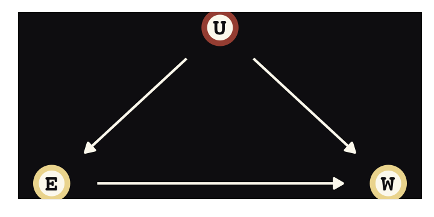

Instrumental variables will solve some of the difficulties we have in
not being able to condition on \(U\). Here we’ll call our instrumental
variable \(Q\). In the terms of the present example, the **instrumental
variable** has the qualities that

  - \(Q\) is independent of \(U\),
  - \(Q\) is not independent of \(E\), and
  - \(Q\) can only influence \(W\) through \(E\) (i.e., the effect of
    \(Q\) on \(W\) is fully mediated by \(E\)).

There is what this looks like in a DAG.

``` r
dag_coords <-
  tibble(name = c("Q", "E", "U", "W"),
         x    = c(0, 1, 2, 3),
         y    = c(2, 1, 2, 1))


dagify(E ~ Q + U,
       W ~ E + U,
       coords = dag_coords) %>%
  
  ggplot(aes(x = x, y = y, xend = xend, yend = yend)) +
  geom_dag_point(aes(color = name == "U"),
                 shape = 21, stroke = 2, fill = "#FCF9F0", size = 6, show.legend = F) +
  geom_dag_text(color = "#100F14", family = "Courier") +
  geom_dag_edges(edge_colour = "#FCF9F0") +
  scale_color_manual(values = c("#EEDA9D", "#A65141")) +
  theme_pearl_dag()
```

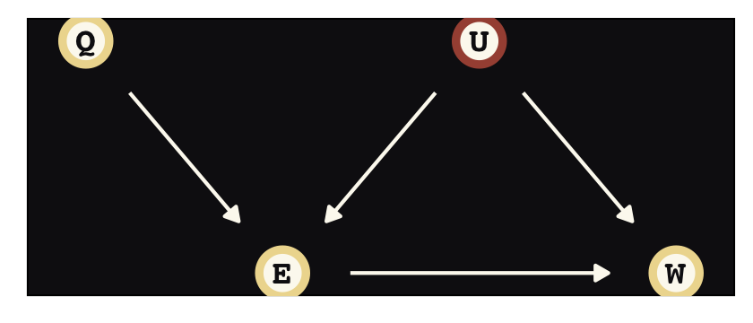

Sadly, our condition that \(Q\) can only influence \(W\) through
\(E\)–often called the **exclusion restriction**–generally cannot be
tested. Given \(U\) is unmeasured, by definition, we also cannot test
that \(Q\) is independent of \(U\). These are model assumptions.

Let’s simulate data based on @angristDoesCompulsorySchool1991 to get a
sense of how this works.

``` r
# make a standardizing function
standardize <- function(x) {
  (x - mean(x)) / sd(x)
}

# simulate
set.seed(73) 

n <- 500

dat_sim <-
  tibble(u_sim = rnorm(n, mean = 0, sd = 1),
         q_sim = sample(1:4, size = n, replace = T)) %>% 
  mutate(e_sim = rnorm(n, mean = u_sim + q_sim, sd = 1)) %>% 
  mutate(w_sim = rnorm(n, mean = u_sim + 0 * e_sim, sd = 1)) %>% 
  mutate(w = standardize(w_sim),
         e = standardize(e_sim),
         q = standardize(q_sim))

dat_sim
```

    ## # A tibble: 500 x 7
    ##      u_sim q_sim e_sim   w_sim       w       e      q
    ##      <dbl> <int> <dbl>   <dbl>   <dbl>   <dbl>  <dbl>
    ##  1 -0.145      1 1.51   0.216   0.173  -0.575  -1.36 
    ##  2  0.291      1 0.664  0.846   0.584  -1.09   -1.36 
    ##  3  0.0938     3 2.44  -0.664  -0.402  -0.0185  0.428
    ##  4 -0.127      3 4.09  -0.725  -0.442   0.978   0.428
    ##  5 -0.847      4 2.62  -1.24   -0.780   0.0939  1.32 
    ##  6  0.141      4 3.54  -0.0700 -0.0146  0.651   1.32 
    ##  7  1.54       2 3.65   1.88    1.26    0.714  -0.464
    ##  8  2.74       3 4.91   2.52    1.67    1.48    0.428
    ##  9  1.55       3 4.18   0.624   0.439   1.04    0.428
    ## 10  0.462      1 0.360  0.390   0.286  -1.27   -1.36 
    ## # … with 490 more rows

\(Q\) in this context is like quarter in the school year, but inversely
scaled such that larger numbers indicate more quarters. In this
simulation, we have set the true effect of education on
wages–\(E \rightarrow W\)–to be zero. Any univariate association is
through the coufounding variable \(U\). Also, \(Q\) has no direct effect
on \(W\) or \(U\), but it does have a causal relation with \(E\), which
is \(Q \rightarrow E \leftarrow U\). First we fit the univariable model
corresponding to \(E \rightarrow W\).

``` r
b14.4 <-
  brm(data = dat_sim,
      family = gaussian,
      w ~ 1 + e,
      prior = c(prior(normal(0, 0.2), class = Intercept),
                prior(normal(0, 0.5), class = b),
                prior(exponential(1), class = sigma)),
      iter = 2000, warmup = 1000, chains = 4, cores = 4,  
      seed = 14,
      file = "/Users/solomonkurz/Dropbox/Recoding Statistical Rethinking 2nd ed/fits/b14.04")
```

``` r
print(b14.4)
```

    ##  Family: gaussian 
    ##   Links: mu = identity; sigma = identity 
    ## Formula: w ~ 1 + e 
    ##    Data: dat_sim (Number of observations: 500) 
    ## Samples: 4 chains, each with iter = 2000; warmup = 1000; thin = 1;
    ##          total post-warmup samples = 4000
    ## 
    ## Population-Level Effects: 
    ##           Estimate Est.Error l-95% CI u-95% CI Rhat Bulk_ESS Tail_ESS
    ## Intercept     0.00      0.04    -0.08     0.08 1.00     3649     2979
    ## e             0.40      0.04     0.32     0.48 1.00     3939     3096
    ## 
    ## Family Specific Parameters: 
    ##       Estimate Est.Error l-95% CI u-95% CI Rhat Bulk_ESS Tail_ESS
    ## sigma     0.92      0.03     0.86     0.98 1.00     4064     2876
    ## 
    ## Samples were drawn using sampling(NUTS). For each parameter, Bulk_ESS
    ## and Tail_ESS are effective sample size measures, and Rhat is the potential
    ## scale reduction factor on split chains (at convergence, Rhat = 1).

Because we have not conditioned on \(U\), then model suggests a
moderately large spurious causal relation for \(E \rightarrow W\). Now
see what happens when we also condition directly on \(Q\), as in
\(Q \rightarrow W \leftarrow E\).

``` r
b14.5 <-
  brm(data = dat_sim,
      family = gaussian,
      w ~ 1 + e + q,
      prior = c(prior(normal(0, 0.2), class = Intercept),
                prior(normal(0, 0.5), class = b),
                prior(exponential(1), class = sigma)),
      iter = 2000, warmup = 1000, chains = 4, cores = 4,  
      seed = 14,
      file = "/Users/solomonkurz/Dropbox/Recoding Statistical Rethinking 2nd ed/fits/b14.05")
```

``` r
print(b14.5)
```

    ##  Family: gaussian 
    ##   Links: mu = identity; sigma = identity 
    ## Formula: w ~ 1 + e + q 
    ##    Data: dat_sim (Number of observations: 500) 
    ## Samples: 4 chains, each with iter = 2000; warmup = 1000; thin = 1;
    ##          total post-warmup samples = 4000
    ## 
    ## Population-Level Effects: 
    ##           Estimate Est.Error l-95% CI u-95% CI Rhat Bulk_ESS Tail_ESS
    ## Intercept     0.00      0.04    -0.08     0.07 1.00     3237     2650
    ## e             0.64      0.05     0.54     0.72 1.00     3398     2874
    ## q            -0.40      0.05    -0.49    -0.32 1.00     3290     2794
    ## 
    ## Family Specific Parameters: 
    ##       Estimate Est.Error l-95% CI u-95% CI Rhat Bulk_ESS Tail_ESS
    ## sigma     0.86      0.03     0.81     0.92 1.00     3915     2920
    ## 
    ## Samples were drawn using sampling(NUTS). For each parameter, Bulk_ESS
    ## and Tail_ESS are effective sample size measures, and Rhat is the potential
    ## scale reduction factor on split chains (at convergence, Rhat = 1).

Holy smokes that’s a mess. This model suggests both \(E\) and \(Q\) have
moderate to strong causal effects on \(W\), even though we know neither
do based on the true data-generating model. Like McElreath said, “bad
stuff happens” when we condition on an instrumental variable this way.

> There is no backdoor path through \(Q\), as you can see. But there is
> a non-causal path from \(Q\) to \(W\) through \(U\):
> \(Q \rightarrow E \leftarrow U \rightarrow W\). This is a non-causal
> path, because changing \(Q\) doesn’t result in any change in W through
> this path. But since we are conditioning on \(E\) in the same model,
> and \(E\) is a collider of \(Q\) and \(U\), the non-causal path is
> open. This confounds the coefficient on \(Q\). It won’t be zero,
> because it’ll pick up the association between \(U\) and \(W\). And
> then, as a result, the coefficient on \(E\) can get even more
> confounded. Used this way, an instrument like \(Q\) might be called a
> **bias amplifier**. (p. 456, **emphasis** in the original)

The statistical solution to this mess is to express the data-generating
DAG as a multivariate statistical model following the form

\[
\begin{align*}
\begin{pmatrix} W_i \\ E_i \end{pmatrix} & \sim \operatorname{MVNormal} \begin{pmatrix} \begin{pmatrix} \mu_{\text w,i} \\ \mu_{\text E,i} \end{pmatrix}, \mathbf S \end{pmatrix} \\
\mu_{\text W,i} & = \alpha_\text W + \beta_\text{EW} E_i \\
\mu_{\text E,i} & = \alpha_\text E + \beta_\text{QE} Q_i \\
\mathbf S & = \begin{pmatrix} \sigma_\text W & 0 \\ 0  & \sigma_\text E \end{pmatrix} \mathbf R \begin{pmatrix} \sigma_\text W & 0 \\ 0  & \sigma_\text E \end{pmatrix} \\
\mathbf R & = \begin{pmatrix} 1 & \rho \\ \rho & 1 \end{pmatrix} \\
\alpha_\text W \text{ and } \alpha_\text E & \sim \operatorname{Normal}(0, 0.2) \\
\beta_\text{EW} \text{ and } \beta_\text{QE} & \sim \operatorname{Normal}(0, 0.5) \\
\sigma_\text W \text{ and } \sigma_\text E & \sim \operatorname{Exponential}(1) \\
\rho & \sim \operatorname{LKJ}(2).
\end{align*}
\]

You might not remember, but we’ve actually fit a model like this
before–`b5.3_A` from way back in Section 5.1.5.3. The big difference
between that earlier model and this one is whereas the former did not
include a residual correlation, \(\rho\), this one will. Thus, this time
we will make sure to set `set_rescor(TRUE)` in the `formula`. Within
**brms** parlance, priors for residual correlations are of `class =
rescor`.

``` r
e_model <- bf(e ~ 1 + q)
w_model <- bf(w ~ 1 + e)

b14.6 <-
  brm(data = dat_sim, 
      family = gaussian,
      e_model + w_model + set_rescor(TRUE),
      prior = c(# E model
                prior(normal(0, 0.2), class = Intercept, resp = e),
                prior(normal(0, 0.5), class = b, resp = e),
                prior(exponential(1), class = sigma, resp = e),
                
                # W model
                prior(normal(0, 0.2), class = Intercept, resp = w),
                prior(normal(0, 0.5), class = b, resp = w),
                prior(exponential(1), class = sigma, resp = w),
                
                # rho
                prior(lkj(2), class = rescor)),
      iter = 2000, warmup = 1000, chains = 4, cores = 4,
      seed = 14,
      file = "/Users/solomonkurz/Dropbox/Recoding Statistical Rethinking 2nd ed/fits/b14.06")
```

``` r
print(b14.6)
```

    ##  Family: MV(gaussian, gaussian) 
    ##   Links: mu = identity; sigma = identity
    ##          mu = identity; sigma = identity 
    ## Formula: e ~ 1 + q 
    ##          w ~ 1 + e 
    ##    Data: dat_sim (Number of observations: 500) 
    ## Samples: 4 chains, each with iter = 2000; warmup = 1000; thin = 1;
    ##          total post-warmup samples = 4000
    ## 
    ## Population-Level Effects: 
    ##             Estimate Est.Error l-95% CI u-95% CI Rhat Bulk_ESS Tail_ESS
    ## e_Intercept    -0.00      0.04    -0.07     0.07 1.00     2772     2681
    ## w_Intercept    -0.00      0.04    -0.08     0.08 1.00     2892     2778
    ## e_q             0.59      0.04     0.52     0.66 1.00     2572     2564
    ## w_e            -0.05      0.08    -0.21     0.09 1.00     1534     2104
    ## 
    ## Family Specific Parameters: 
    ##         Estimate Est.Error l-95% CI u-95% CI Rhat Bulk_ESS Tail_ESS
    ## sigma_e     0.81      0.03     0.76     0.86 1.00     3899     2716
    ## sigma_w     1.02      0.05     0.94     1.12 1.00     1917     2157
    ## 
    ## Residual Correlations: 
    ##             Estimate Est.Error l-95% CI u-95% CI Rhat Bulk_ESS Tail_ESS
    ## rescor(e,w)     0.54      0.05     0.44     0.64 1.00     1676     2040
    ## 
    ## Samples were drawn using sampling(NUTS). For each parameter, Bulk_ESS
    ## and Tail_ESS are effective sample size measures, and Rhat is the potential
    ## scale reduction factor on split chains (at convergence, Rhat = 1).

Now the parameter for \(E \rightarrow W\), `w_e`, is just where it
should be–near zero. The residual correlation between \(E\) and \(Q\) is
positive and large in magnitude, indicating their common influence from
the unmeasured variable \(U\). Next we’ll take McElreath’s direction to
“adjust the simulation and try other scenarios” (p. 459) by adjusting
the causal relations, as in his **R** code 14.28.

``` r
set.seed(73) 

n <- 500

dat_sim <-
  tibble(u_sim = rnorm(n, mean = 0, sd = 1),
         q_sim = sample(1:4, size = n, replace = T)) %>% 
  mutate(e_sim = rnorm(n, mean = u_sim + q_sim, sd = 1)) %>% 
  mutate(w_sim = rnorm(n, mean = -u_sim + 0.2 * e_sim, sd = 1)) %>% 
  mutate(w = standardize(w_sim),
         e = standardize(e_sim),
         q = standardize(q_sim))

dat_sim
```

    ## # A tibble: 500 x 7
    ##      u_sim q_sim e_sim  w_sim       w       e      q
    ##      <dbl> <int> <dbl>  <dbl>   <dbl>   <dbl>  <dbl>
    ##  1 -0.145      1 1.51   0.809  0.248  -0.575  -1.36 
    ##  2  0.291      1 0.664  0.396 -0.0563 -1.09   -1.36 
    ##  3  0.0938     3 2.44  -0.364 -0.615  -0.0185  0.428
    ##  4 -0.127      3 4.09   0.347 -0.0922  0.978   0.428
    ##  5 -0.847      4 2.62   0.976  0.370   0.0939  1.32 
    ##  6  0.141      4 3.54   0.357 -0.0852  0.651   1.32 
    ##  7  1.54       2 3.65  -0.466 -0.690   0.714  -0.464
    ##  8  2.74       3 4.91  -1.98  -1.80    1.48    0.428
    ##  9  1.55       3 4.18  -1.64  -1.55    1.04    0.428
    ## 10  0.462      1 0.360 -0.461 -0.686  -1.27   -1.36 
    ## # … with 490 more rows

We’ll use `update()` to avoid re-compiling the models.

``` r
b14.4x <-
  update(b14.4,
         newdata = dat_sim,
         iter = 2000, warmup = 1000, chains = 4, cores = 4,  
         seed = 14,
         file = "/Users/solomonkurz/Dropbox/Recoding Statistical Rethinking/2nd ed/fits/b14.04x")

b14.6x <-
  update(b14.6,
         newdata = dat_sim,
         iter = 2000, warmup = 1000, chains = 4, cores = 4,  
         seed = 14, 
         file = "/Users/solomonkurz/Dropbox/Recoding Statistical Rethinking/2nd ed/fits/b14.06x")
```

Just for kicks, let’s examine the results with a coefficient plot.

``` r
text <-
  tibble(Estimate = c(fixef(b14.4x)[2, 3], fixef(b14.6x)[4, 4]),
         y        = c(4.3, 3.7),
         hjust    = c(0, 1),
         fit      = c("b14.4x", "b14.6x"))

bind_rows(
  # b_14.4x
  posterior_summary(b14.4x)[1:3, ] %>% 
    data.frame() %>% 
    mutate(param = c("alpha[W]", "beta[EW]", "sigma[W]"),
           fit = "b14.4x"),
  # b_14.6x
  posterior_summary(b14.6x)[1:7, ] %>%  
    data.frame() %>% 
    mutate(param = c("alpha[E]", "alpha[W]", "beta[QE]", "beta[EW]", "sigma[E]", "sigma[W]", "rho"),
           fit = "b14.6x")) %>% 
  mutate(param = factor(param,
                        levels = c("rho", "sigma[W]", "sigma[E]", "beta[EW]", "beta[QE]", "alpha[W]", "alpha[E]"))) %>%
  
  ggplot(aes(x = param, y = Estimate, color = fit)) +
  geom_hline(yintercept = 0, color = "#E8DCCF", alpha = 1/4) +
  geom_pointrange(aes(ymin = Q2.5, ymax = Q97.5),
                  fatten = 2, position = position_dodge(width = 0.5)) +
  geom_text(data = text,
            aes(x = y, label = fit, hjust = hjust)) +
  scale_x_discrete(NULL, labels = ggplot2:::parse_safe) +
  scale_color_manual(NULL, values = c("#E7CDC2", "#A65141")) +
  ylab("marginal posterior") +
  coord_flip() +
  theme(axis.text.y = element_text(hjust = 0),
        axis.ticks.y = element_blank(),
        legend.position = "none")
```

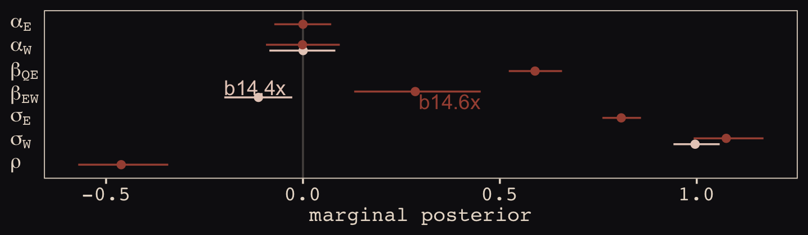

With the help from `b14.6x`, we found “that \(E\) and \(W\) have a
negative correlation in their residual variance, because the confound
positively influences one and negatively influences the other” (p. 459).

One can use the `dagitty()` and `instrumentalVariables()` functions from
the **dagitty** package to first define a DAG and then query whether
there are instrumental variables for a given exposure and outcome.

``` r
library(dagitty)

dagIV <- dagitty("dag{Q -> E <- U -> W <- E}")

instrumentalVariables(dagIV, exposure = "E", outcome = "W")
```

    ##  Q

> The hardest thing about instrumental variables is believing in any
> particular instrument. If you believe in your DAG, they are easy to
> believe. But should you believe in your DAG?…
> 
> In general, it is not possible to statistically prove whether a
> variable is a good instrument. As always, we need scientific knowledge
> outside of the data to make sense of the data. (p. 460)

### 14.3.2. Other designs.

> There are potentially many ways to find natural experiments. Not all
> of them are strictly instrumental variables. But they can provide
> theoretically correct designs for causal inference, if you can believe
> the assumptions. Let’s consider two more.
> 
> In addition to the backdoor criterion you met in Chapter 6, there is
> something called the **front-door criterion**. (p. 460, **emphasis**
> in the original)

To get a sense of the front-door criterion, consider the following DAG
with observed variables \(X\), \(Y\), and \(Z\) and an unobserved
variable, \(U\).

``` r
dag_coords <-
  tibble(name = c("X", "Z", "U", "Y"),
         x    = c(1, 2, 2, 3),
         y    = c(1, 1, 2, 1))

dagify(X ~ U,
       Z ~ X,
       Y ~ U + Z,
       coords = dag_coords) %>%
  
  ggplot(aes(x = x, y = y, xend = xend, yend = yend)) +
  geom_dag_point(aes(color = name == "U"),
                 shape = 21, stroke = 2, fill = "#FCF9F0", size = 6, show.legend = F) +
  geom_dag_text(color = "#100F14", family = "Courier") +
  geom_dag_edges(edge_colour = "#FCF9F0") +
  scale_color_manual(values = c("#EEDA9D", "#A65141")) +
  theme_pearl_dag()
```

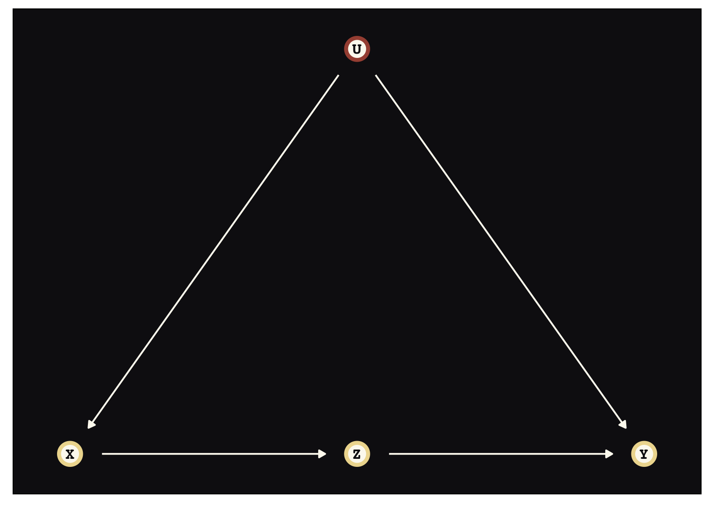

> We are interested, as usual, in the causal influence of \(X\) on
> \(Y\). But there is an unobserved confound \(U\), again as usual. It
> turns out that, if we can find a perfect mediator \(Z\), then we can
> possibly estimate the causal effect of \(X\) on \(Y\). It isn’t crazy
> to think that causes are mediated by other causes. Everything has a
> mechanism. \(Z\) in the DAG above is such a mechanism. If you have a
> believable \(Z\) variable, then the causal effect of \(X\) on \(Y\) is
> estimated by expressing the generative model as a statistical model,
> similar to the instrumental variable example before. (p. 461)

McElreath’s second example is the **regression discontinuity** approach.
If you have a time series where the variable of interest is measured
before and after some relevant intervention variable, you can estimate
intercepts and slopes before and after the intervention, the cuttoff.
However,

> in practice, one trend is fit for individuals above the cutoff and
> another to those below the cutoff. Then an estimate of the causal
> effect is the average difference between individuals just above and
> just below the cutoff. While the difference near the cuttoff if of
> interest, the entire function influences this difference. So some care
> is needed in choosing functions for the overall relationship between
> the exposure and the outcome. (p. 461)

McElreath’s not kidding about the need for care when fitting regression
discontinuity models. Gleman’s blog is littered with awful examples
(e.g.,
[here](https://statmodeling.stat.columbia.edu/2019/06/25/another-regression-discontinuity-disaster-and-what-can-we-learn-from-it/),
[here](https://statmodeling.stat.columbia.edu/2018/08/02/38160/),
[here](https://statmodeling.stat.columbia.edu/2020/07/02/no-i-dont-believe-that-claim-based-on-regression-discontinuity-analysis-that/),
[here](https://statmodeling.stat.columbia.edu/2020/01/13/how-to-get-out-of-the-credulity-rut-regression-discontinuity-edition-getting-beyond-whack-a-mole/),
[here](https://statmodeling.stat.columbia.edu/2020/07/18/please-socially-distance-me-from-this-regression-model/).
See also Gelman and Imbens’ \[-@gelmanWhyHighorderPolynomials2019\]
paper, [*Why high-order polynomials should not be used in regression
discontinuity
designs*](https://amstat.tandfonline.com/doi/pdf/10.1080/07350015.2017.1366909?needAccess=true).

## 14.4. Social relations as correlated varying effects

It looks like **brms** is not set up to fit a model like this, at this
time. See the [Social relations model (SRM)
thread](https://discourse.mc-stan.org/t/social-relations-model-srm/17121)
on the Stan Forums and [issue
\#502](https://github.com/paul-buerkner/brms/issues/502) on the **brms**
GitHub repo for details. In short, the difficulty is **brms** is not set
up to allow covariances among distinct random effects with the same
levels and it looks like this will not change any time soon. So, in this
section we will fit the model with **rethinking**, but still use
**ggplot2** and friends in the post processing.

Let’s load the `kl_dyads` data \[@kosterFoodSharingNetworks2014\].

``` r
library(rethinking)
data(KosterLeckie)
```

Take a look at the data.

``` r
kl_dyads %>% glimpse()
```

    ## Rows: 300
    ## Columns: 13
    ## $ hidA    <int> 1, 1, 1, 1, 1, 1, 1, 1, 1, 1, 1, 1, 1, 1, 1, 1, 1, 1, 1, 1, 1, 1, 1, 1, 2, 2, 2, 2, 2, 2, 2…
    ## $ hidB    <int> 2, 3, 4, 5, 6, 7, 8, 9, 10, 11, 12, 13, 14, 15, 16, 17, 18, 19, 20, 21, 22, 23, 24, 25, 3, …
    ## $ did     <int> 1, 2, 3, 4, 5, 6, 7, 8, 9, 10, 11, 12, 13, 14, 15, 16, 17, 18, 19, 20, 21, 22, 23, 24, 25, …
    ## $ giftsAB <int> 0, 6, 2, 4, 8, 2, 1, 0, 10, 1, 0, 0, 1, 6, 0, 0, 0, 0, 0, 0, 0, 0, 0, 16, 1, 2, 0, 3, 0, 43…
    ## $ giftsBA <int> 4, 31, 5, 2, 2, 1, 2, 1, 110, 0, 0, 6, 11, 0, 1, 4, 0, 2, 0, 7, 0, 13, 0, 2, 3, 1, 1, 0, 1,…
    ## $ offset  <dbl> 0.000, -0.003, -0.019, 0.000, -0.003, 0.000, 0.000, 0.000, -0.186, 0.000, -0.471, -0.019, -…
    ## $ drel1   <int> 0, 0, 0, 0, 1, 0, 0, 0, 1, 0, 0, 0, 0, 0, 0, 0, 0, 0, 0, 0, 0, 0, 0, 0, 0, 0, 0, 0, 0, 1, 1…
    ## $ drel2   <int> 0, 1, 1, 1, 0, 0, 0, 0, 0, 1, 0, 0, 1, 0, 0, 0, 0, 0, 0, 0, 0, 1, 0, 0, 0, 0, 0, 1, 0, 0, 0…
    ## $ drel3   <int> 1, 0, 0, 0, 0, 0, 0, 0, 0, 0, 1, 1, 0, 0, 0, 0, 0, 0, 1, 0, 0, 0, 0, 1, 1, 1, 1, 0, 0, 0, 0…
    ## $ drel4   <int> 0, 0, 0, 0, 0, 0, 1, 1, 0, 0, 0, 0, 0, 0, 0, 1, 0, 1, 0, 1, 1, 0, 0, 0, 0, 0, 0, 0, 0, 0, 0…
    ## $ dlndist <dbl> -2.790, -2.817, -1.886, -1.892, -3.499, -1.853, -1.475, -1.644, -1.897, -2.379, -2.200, -2.…
    ## $ dass    <dbl> 0.000, 0.044, 0.025, 0.011, 0.022, 0.071, 0.046, 0.003, 0.552, 0.018, 0.004, 0.004, 0.036, …
    ## $ d0125   <int> 0, 0, 0, 0, 0, 0, 0, 0, 0, 0, 0, 0, 0, 0, 0, 0, 0, 0, 0, 0, 0, 0, 0, 1, 0, 0, 0, 0, 0, 0, 0…

``` r
# kl_households %>% glimpse()
```

“The variables `hidA` and `hidB` tell us the household IDs in each dyad,
and `did` is a unique dyad ID number” (p. 462). To get a sense of the
interrelation among those three ID variables, we’ll make a tile plot.

``` r
kl_dyads %>% 
  ggplot(aes(x = hidA, y = hidB, label = did)) +
  geom_tile(aes(fill = did),
            show.legend = F) +
  geom_text(size = 2.75, family = "Courier") +
  geom_vline(xintercept = 0:24 + 0.5, color = "#394165", size = 1/5) +
  geom_hline(yintercept = 1:25 + 0.5, color = "#394165", size = 1/5) +
  scale_fill_gradient(low = "#DCA258", high = "#EEDA9D", limits = c(1, NA)) +
  scale_x_continuous(breaks = 1:24) +
  scale_y_continuous(breaks = 2:25) +
  theme(axis.ticks = element_blank())
```

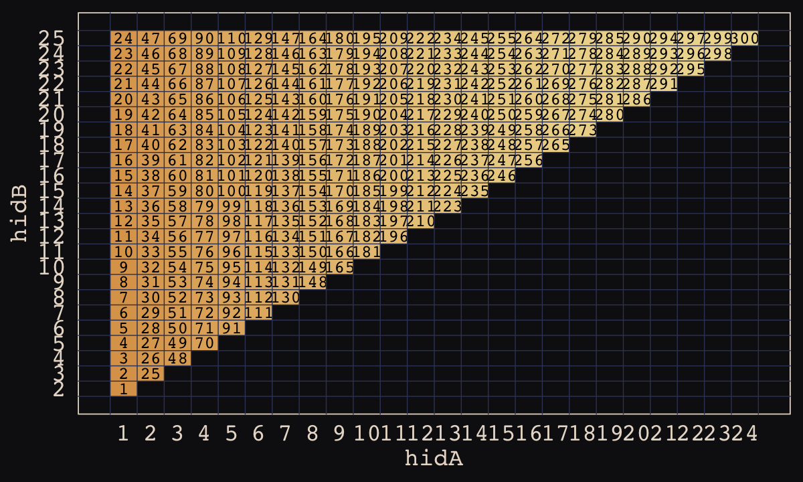

The orange/yellow gradient fill is a little silly, but I couldn’t stop
myself. Here is our version of Figure 14.8, the bivariate distribution
of dyadic gifts, collapsing across dyads.

``` r
kl_dyads %>% 
  ggplot(aes(x = giftsAB, y = giftsBA)) +
  geom_hex(bins = 70) +
  geom_abline(color = "#DCA258", linetype = 3) +
  scale_fill_gradient(low = "#E7CDC2", high = "#A65141", limits = c(1, NA)) +
  scale_x_continuous("gifts household A to household B", limits = c(0, 113)) +
  scale_y_continuous("gifts from B to A", limits = c(0, 113)) +
  ggtitle("Distribution of dyadic gifts") +
  coord_equal()
```

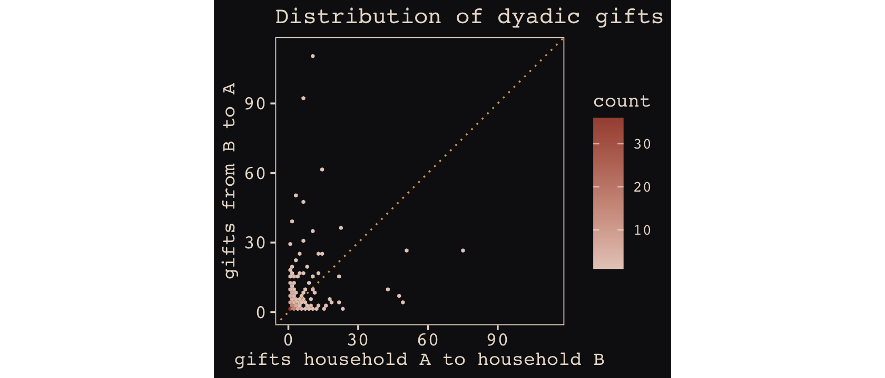

Here’s the overall Pearson’s correlation coefficient, collapsing across
grouping levels.

``` r
cor(kl_dyads$giftsAB, kl_dyads$giftsBA) %>% round(digits = 3)
```

    ## [1] 0.239

However, it would be a mistake to take this correlation seriously. It is
a disentangled mixture of various kinds of associations, none of which
are guaranteed to be even close to \(r = .24\). Remember this as we move
along with the analyses and let the consequences burn a methodological
mark into your soul.

``` r
kl_data <- 
  list(
    N            = nrow(kl_dyads),
    N_households = max(kl_dyads$hidB), 
    did          = kl_dyads$did,
    hidA         = kl_dyads$hidA,
    hidB         = kl_dyads$hidB,
    giftsAB      = kl_dyads$giftsAB, 
    giftsBA      = kl_dyads$giftsBA
  )

m14.7 <- 
  ulam( 
    alist(
      giftsAB ~ poisson(lambdaAB),
      giftsBA ~ poisson(lambdaBA),
      log(lambdaAB) <- a + gr[hidA, 1] + gr[hidB, 2] + d[did, 1] , 
      log(lambdaBA) <- a + gr[hidB, 1] + gr[hidA, 2] + d[did, 2] , 
      a ~ normal(0, 1),
      
      ## gr matrix of varying effects
      vector[2]:gr[N_households] ~ multi_normal(0, Rho_gr, sigma_gr), 
      Rho_gr ~ lkj_corr(4),
      sigma_gr ~ exponential(1),
      
      ## dyad effects
      transpars> matrix[N,2]:d <-
        compose_noncentered(rep_vector(sigma_d, 2), L_Rho_d, z), 
      matrix[2,N]:z ~ normal(0, 1),
      cholesky_factor_corr[2]:L_Rho_d ~ lkj_corr_cholesky(8), 
      sigma_d ~ exponential(1),
      
      ## compute correlation matrix for dyads
      gq> matrix[2, 2]:Rho_d <<- Chol_to_Corr(L_Rho_d)
    ), 
    data = kl_data, 
    chains = 4, cores = 4, iter = 2000
  )
```

    ## Trying to compile a simple C file

    ## Running /Library/Frameworks/R.framework/Resources/bin/R CMD SHLIB foo.c
    ## clang -I"/Library/Frameworks/R.framework/Resources/include" -DNDEBUG   -I"/Library/Frameworks/R.framework/Versions/3.6/Resources/library/Rcpp/include/"  -I"/Library/Frameworks/R.framework/Versions/3.6/Resources/library/RcppEigen/include/"  -I"/Library/Frameworks/R.framework/Versions/3.6/Resources/library/RcppEigen/include/unsupported"  -I"/Library/Frameworks/R.framework/Versions/3.6/Resources/library/BH/include" -I"/Library/Frameworks/R.framework/Versions/3.6/Resources/library/StanHeaders/include/src/"  -I"/Library/Frameworks/R.framework/Versions/3.6/Resources/library/StanHeaders/include/"  -I"/Library/Frameworks/R.framework/Versions/3.6/Resources/library/rstan/include" -DEIGEN_NO_DEBUG  -D_REENTRANT  -DBOOST_DISABLE_ASSERTS -DBOOST_PENDING_INTEGER_LOG2_HPP -include stan/math/prim/mat/fun/Eigen.hpp   -isysroot /Library/Developer/CommandLineTools/SDKs/MacOSX.sdk -I/usr/local/include  -fPIC  -isysroot /Library/Developer/CommandLineTools/SDKs/MacOSX.sdk -c foo.c -o foo.o
    ## In file included from <built-in>:1:
    ## In file included from /Library/Frameworks/R.framework/Versions/3.6/Resources/library/StanHeaders/include/stan/math/prim/mat/fun/Eigen.hpp:13:
    ## In file included from /Library/Frameworks/R.framework/Versions/3.6/Resources/library/RcppEigen/include/Eigen/Dense:1:
    ## In file included from /Library/Frameworks/R.framework/Versions/3.6/Resources/library/RcppEigen/include/Eigen/Core:88:
    ## /Library/Frameworks/R.framework/Versions/3.6/Resources/library/RcppEigen/include/Eigen/src/Core/util/Macros.h:613:1: error: unknown type name 'namespace'
    ## namespace Eigen {
    ## ^
    ## /Library/Frameworks/R.framework/Versions/3.6/Resources/library/RcppEigen/include/Eigen/src/Core/util/Macros.h:613:16: error: expected ';' after top level declarator
    ## namespace Eigen {
    ##                ^
    ##                ;
    ## In file included from <built-in>:1:
    ## In file included from /Library/Frameworks/R.framework/Versions/3.6/Resources/library/StanHeaders/include/stan/math/prim/mat/fun/Eigen.hpp:13:
    ## In file included from /Library/Frameworks/R.framework/Versions/3.6/Resources/library/RcppEigen/include/Eigen/Dense:1:
    ## /Library/Frameworks/R.framework/Versions/3.6/Resources/library/RcppEigen/include/Eigen/Core:96:10: fatal error: 'complex' file not found
    ## #include <complex>
    ##          ^~~~~~~~~
    ## 3 errors generated.
    ## make: *** [foo.o] Error 1

    ## Warning: The largest R-hat is NA, indicating chains have not mixed.
    ## Running the chains for more iterations may help. See
    ## http://mc-stan.org/misc/warnings.html#r-hat

    ## Warning: Bulk Effective Samples Size (ESS) is too low, indicating posterior means and medians may be unreliable.
    ## Running the chains for more iterations may help. See
    ## http://mc-stan.org/misc/warnings.html#bulk-ess

    ## Warning: Tail Effective Samples Size (ESS) is too low, indicating posterior variances and tail quantiles may be unreliable.
    ## Running the chains for more iterations may help. See
    ## http://mc-stan.org/misc/warnings.html#tail-ess

We don’t get a lot of information from the default `precis()` output for
this model, but at least we’ll get a summary for
    \(\alpha\).

``` r
precis(m14.7)
```

    ## 1264 vector or matrix parameters hidden. Use depth=2 to show them.

    ##              mean         sd      5.5%     94.5%    n_eff    Rhat4
    ## a       0.5446461 0.17137682 0.2682604 0.8181348 901.9916 1.002251
    ## sigma_d 1.1038701 0.05742462 1.0154250 1.1989651 920.1281 1.004504

One of the interesting things about this model is we only have one
\(\alpha\) parameter for two criterion variables. This makes \(\alpha\)
like the grand mean of counts. Here is a focused look at the `precis()`
output when you set `depth
    = 3`.

``` r
precis(m14.7, depth = 3, pars = c("Rho_gr", "sigma_gr"))
```

    ##                   mean           sd       5.5%       94.5%     n_eff     Rhat4
    ## Rho_gr[1,1]  1.0000000 0.000000e+00  1.0000000  1.00000000       NaN       NaN
    ## Rho_gr[1,2] -0.4135588 1.930521e-01 -0.7041306 -0.08669183 1158.7012 1.0012146
    ## Rho_gr[2,1] -0.4135588 1.930521e-01 -0.7041306 -0.08669183 1158.7012 1.0012146
    ## Rho_gr[2,2]  1.0000000 8.212175e-17  1.0000000  1.00000000 3970.9526 0.9989995
    ## sigma_gr[1]  0.8308689 1.344879e-01  0.6405030  1.06716375 2346.0462 1.0003311
    ## sigma_gr[2]  0.4189079 9.280046e-02  0.2847344  0.57958105  905.0463 1.0021503

These are the posterior summaries for the part of the model McElreath
defined in the middle of page 463,

\[
\begin{pmatrix} g_i \\ r_i \end{pmatrix} \sim \operatorname{MVNormal}\begin{pmatrix} \begin{pmatrix} 0 \\ 0 \end{pmatrix}, \begin{pmatrix} \sigma_g^2 & \sigma_g \sigma_r \rho_{gr} \\ \sigma_g \sigma_r \rho_{rg} & \sigma_r^2 \end{pmatrix} \end{pmatrix},
\]

the population of household effects. But as per usual with Stan, the
variance parameters are expressed in a \(\sigma\) metric. Also,
`rethinking::precis()` returned the summary for \(\rho_{gr}\) in matrix
form,

\[
\begin{pmatrix} 1 & \rho_{gr} \\ \rho_{rg} & 1 \end{pmatrix},
\]

where \(\rho_{gr} = \rho_{rg}\). The correlation is negative. Let’s view
\(\sigma_g\), \(\sigma_r\), and their correlation in a plot.

``` r
post <- extract.samples(m14.7)

tibble(`sigma[italic(g)]`          = post$sigma_gr[, 1],
       `sigma[italic(r)]`          = post$sigma_gr[, 2],
       `rho[italic(g)][italic(r)]` = post$Rho_gr[, 2, 1]) %>% 
  pivot_longer(everything()) %>% 
  
  ggplot(aes(x = value, y = name, fill = name)) +
  geom_vline(xintercept = 0, color = "#FCF9F0", alpha = 1/3) +
  stat_halfeye(.width = .89, color = "#FCF9F0") + 
  scale_y_discrete(NULL, labels = ggplot2:::parse_safe) +
  scale_fill_manual(values = c("#80A0C7", "#EEDA9D", "#DCA258")) +
  xlab("marginal posterior") +
  coord_cartesian(ylim = c(1.5, 3.5)) +
  theme(legend.position = "none")
```

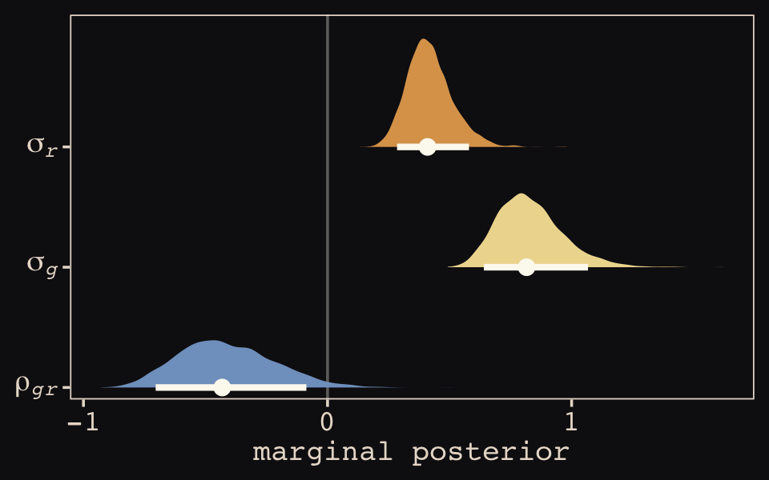

“This implies that individuals who give more across all dyads tend to
receive less\[, and \] clear evidence that rates of giving are more
variable than rates of receiving” (p. 465). McElreath suggested we “try
`plot(exp(g[,1]),exp(r[,1]))` for example to show the posterior
distribution of giving/receiving for household number 1” (p. 465).
Here’s a **tidyverse** version of that plot.

``` r
g <- sapply( 1:25 , function(i) post$a + post$gr[,i,1] ) 
r <- sapply( 1:25 , function(i) post$a + post$gr[,i,2] ) 

tibble(g = exp(g[, 1]),
       r = exp(r[, 1])) %>% 
  ggplot(aes(x = g, y = r)) +
  geom_abline(color = "#FCF9F0", linetype = 2, alpha = 1/3) + # white "#FCF9F0" # gold "#B1934A"
  geom_point(color = "#B1934A", alpha = 1/3, size = 1/3) +
  stat_ellipse(type = "norm", level = .5, size = 1/2, color = "#80A0C7") +
  stat_ellipse(type = "norm", level = .9, size = 1/2, color = "#80A0C7") +
  labs(x = expression(giving[italic(i)==1]),
       y = expression(receiving[italic(i)==1])) +
  coord_equal(xlim = c(0, 5),
              ylim = c(0, 5))
```

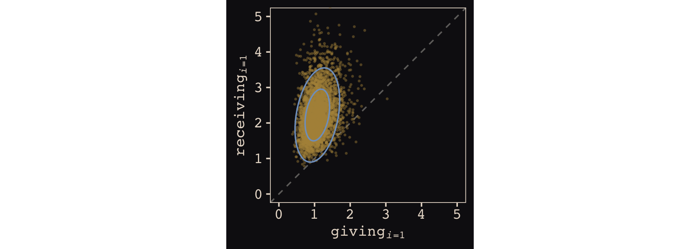

The gold dots are the bivariate posterior draws and the two blue
ellipses mark off the 50% and 90% intervals, presuming a bivariate
Gaussian distribution. Here’s a programmatic way to make our version of
Figure 14.9.a.

``` r
rbind(exp(g), exp(r)) %>% 
  data.frame() %>% 
  set_names(1:25) %>% 
  mutate(parameter = rep(c("g", "r"), each = n() / 2),
         iter      = rep(1:4000, times = 2)) %>% 
  pivot_longer(-c(parameter, iter),
               names_to = "household") %>% 
  pivot_wider(names_from = parameter,
              values_from = value) %>% 
  group_by(household) %>% 
  mutate(mu_g = mean(g),
         mu_r = mean(r)) %>% 
  nest(data = c("g", "r", "iter")) %>% 
  
  ggplot(aes(group = household)) +
  geom_abline(color = "#FCF9F0", linetype = 2, alpha = 1/3) +
  stat_ellipse(data = . %>% unnest(data),
               aes(x = g, y = r),
               type = "norm", level = .5, size = 1/2, alpha = 1/2, color = "#80A0C7") +
  geom_point(aes(x = mu_g, y = mu_r),
             color = "#DCA258") +
  labs(x = "generalized giving",
       y = "generalized receiving") +
  coord_equal(xlim = c(0, 8.5),
              ylim = c(0, 8.5))
```

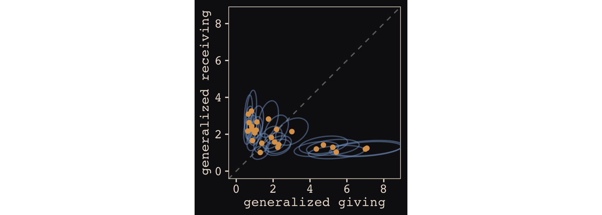

Here is a look at the covariance matrix for the dyadic effects, the
posterior summaries for the part of the model McElreath defined in the
middle of page 463 as,

\[
\begin{pmatrix} d_{ij} \\ d_{ji} \end{pmatrix} \sim \operatorname{MVNormal}\begin{pmatrix} \begin{pmatrix} 0 \\ 0 \end{pmatrix}, \begin{pmatrix} \sigma_d^2 & \sigma_d^2 \rho_d \\ \sigma_d^2 \rho_d & \sigma_d^2 \end{pmatrix} \end{pmatrix},
\]

where there is only one standard deviation parameter \(\sigma_d\)
because the labels for each dyad are
    arbitrary.

``` r
precis(m14.7, depth = 3, pars = c("Rho_d", "sigma_d"))
```

    ##                 mean         sd      5.5%     94.5%     n_eff    Rhat4
    ## Rho_d[1,1] 1.0000000 0.00000000 1.0000000 1.0000000       NaN      NaN
    ## Rho_d[1,2] 0.8819931 0.03335050 0.8242763 0.9289609 1013.6648 1.001648
    ## Rho_d[2,1] 0.8819931 0.03335050 0.8242763 0.9289609 1013.6648 1.001648
    ## Rho_d[2,2] 1.0000000 0.00000000 1.0000000 1.0000000       NaN      NaN
    ## sigma_d    1.1038701 0.05742462 1.0154250 1.1989651  920.1281 1.004504

Here they are in a plot.

``` r
tibble(`sigma[italic(d)]` = post$sigma_d,
       `rho[italic(d)]`   = post$Rho_d[, 2, 1]) %>% 
  pivot_longer(everything()) %>% 
  
  ggplot(aes(x = value, y = name, fill = name)) +
  geom_vline(xintercept = 0, color = "#FCF9F0", alpha = 1/3) +
  stat_halfeye(.width = .89, color = "#FCF9F0") + 
  scale_y_discrete(NULL, labels = ggplot2:::parse_safe) +
  scale_fill_manual(values = c("#A65141", "#B1934A")) +
  xlab("marginal posterior") +
  coord_cartesian(ylim = c(1.5, 2)) +
  theme(legend.position = "none")
```

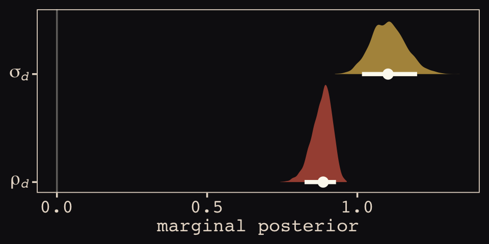

“The correlation here is positive and strong. And there is more
variation among dyads than there is among household in giving rates”
(p. 467). Now make the right hand panel of Figure 14.9.

``` r
tibble(dy1 = apply(post$d[, , 1], 2, mean),
       dy2 = apply(post$d[, , 2], 2, mean)) %>% 
  
  ggplot(aes(x = dy1, y = dy2)) +
  geom_abline(color = "#FCF9F0", linetype = 2, alpha = 1/3) +
  geom_vline(xintercept = 0, color = "#FCF9F0", linetype = 2, alpha = 1/3) +
  geom_hline(yintercept = 0, color = "#FCF9F0", linetype = 2, alpha = 1/3) +
  geom_point(color = "#8B9DAF", alpha = 1/2) +
  geom_text(x = mean(post$d[, 1, 1]),
            y = mean(post$d[, 1, 2]),
            label = "1",
            color = "#EEDA9D", family = "Courier") +
  labs(x = "household A in dyad",
       y = "household B in dyad") +
  coord_equal(xlim = c(-2, 3.5),
              ylim = c(-2, 3.5))
```


As McElreath pointed out, each dot is the posterior mean for one of the
300 levels of `did`. Do you see the yellow \#1 toward the middle? It’s
marking off the posterior mean for `did == 1`. To give a better sense of
the uncertainty in each of the levels of `did`, here is the full
bivariate distribution for `did == 1`.

``` r
tibble(dy1 = post$d[, 1, 1],
       dy2 = post$d[, 1, 2]) %>% 
  
  ggplot(aes(x = dy1, y = dy2)) +
  geom_abline(color = "#FCF9F0", linetype = 2, alpha = 1/3) +
  geom_vline(xintercept = 0, color = "#FCF9F0", linetype = 2, alpha = 1/3) +
  geom_hline(yintercept = 0, color = "#FCF9F0", linetype = 2, alpha = 1/3) +
  geom_point(color = "#8B9DAF", alpha = 1/3, size = 1/3) +
  stat_ellipse(type = "norm", level = .5, size = 1/2, color = "#EEDA9D") +
  stat_ellipse(type = "norm", level = .9, size = 1/2, color = "#EEDA9D") +
  labs(x = expression("household A in dyad"[italic(i)==1]),
       y = expression("household B in dyad"[italic(i)==1])) +
  coord_equal(xlim = c(-2, 3.5),
              ylim = c(-2, 3.5))
```

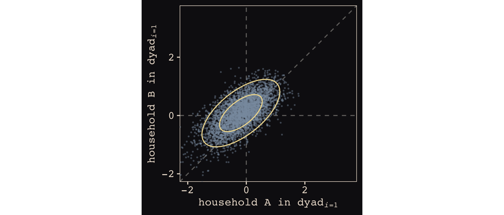

The two yellow ellipses mark off the 50% and 90% intervals, again
presuming a bivariate Gaussian distribution for the posterior.

## 14.5. Continuous categories and the Gaussian process

Under construction.

#### 14.5.2. Example: Phylogenetic distance.

> Consider as an example the causal influence of group size (\(G\)) on
> brain size (\(B\)). Hypotheses connecting these variables are popular,
> because primates (including humans) are unusual in both. Most primates
> live in social groups. Most mammals do not. Second, primates have
> relatively large brains. There is a family of hypotheses linking these
> two features. Suppose for example that group living, whatever its
> cause, could select for larger brains, because once you live with
> others, a larger brain helps to cope with the complexity of
> cooperation and manipulation. (p. 477)

There are also many potential confounds, which we’ll call \(U\). Also
imagine there are two time points, indicated by subscripts 1 and 2. Here
is the basic DAG.

``` r
dag_coords <-
  tibble(name  = c("G1", "B1", "U1", "G2", "B2", "U2"),
         x     = rep(1:2, each = 3),
         y     = rep(3:1, times = 2))

dagify(G2 ~ G1 + U1,
       B2 ~ G1 + B1 + U1,
       U2 ~ U1,
       coords = dag_coords) %>%
  tidy_dagitty() %>% 
  mutate(color = ifelse(name %in% c("G1", "B1"), "a",
                        ifelse(name %in% c("G2", "B2"), "b", "c"))) %>% 
  
  ggplot(aes(x = x, y = y, xend = xend, yend = yend)) +
  geom_dag_point(aes(color = color),
                 shape = 21, stroke = 2, fill = "#FCF9F0", size = 7, show.legend = F) +
  geom_dag_text(color = "#100F14", family = "Courier", parse = T,
                label = c(expression(B[1]), expression(G[1]), expression(U[1]), 
                          expression(B[2]), expression(G[2]), expression(U[2]))) +
  geom_dag_edges(edge_colour = "#FCF9F0") +
  scale_color_manual(values = c("#80A0C7", "#EEDA9D", "#A65141")) +
  theme_pearl_dag()
```

    ## Warning in is.na(x): is.na() applied to non-(list or vector) of type 'expression'

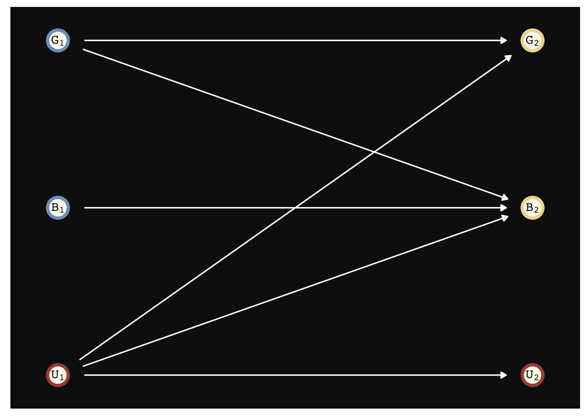

However, this will not be our model. Rather, we’ll consider this one.

``` r
dag_coords <-
  tibble(name = c("G", "U", "M", "P", "B"),
         x    = c(0, 1, 1, 2, 2),
         y    = c(3, 1, 2, 1, 3))

dagify(G ~ U + M,
       U ~ P,
       M ~ U,
       B ~ G + M + U,
       coords = dag_coords) %>%
  
  ggplot(aes(x = x, y = y, xend = xend, yend = yend)) +
  geom_dag_point(aes(color = name == "U"),
                 shape = 21, stroke = 2, fill = "#FCF9F0", size = 6, show.legend = F) +
  geom_dag_text(color = "#100F14", family = "Courier", parse = T) +
  geom_dag_edges(edge_colour = "#FCF9F0") +
  scale_color_manual(values = c("#EEDA9D", "#A65141")) +
  theme_pearl_dag()
```

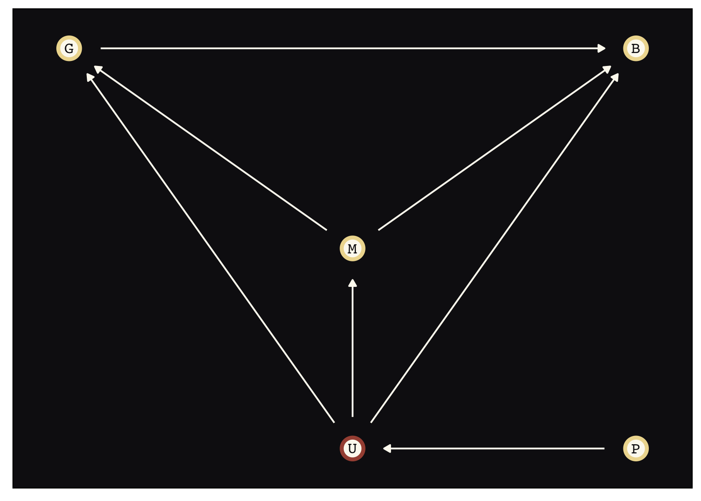

> There’s a lot going on here, but we can take it one piece at a time.
> Again, we’re interested in \(G \rightarrow B\). There is one confound
> we know for sure, body mass (\(M\)). It possibly influences both \(G\)
> and \(B\). So we’ll include that in the model. The unobserved
> confounds \(U\) could potentially influence all three variables.
> Finally, we let the phylogenetic relationships (\(P\)) influence
> \(U\). How is \(P\) causal? If we traveled back in time and delayed a
> split between two species, it could influence the expected differences
> in their traits. So it is really the timing of the split that is
> causal, not the phylogeny. Of course \(P\) may also influence \(G\)
> and \(B\) and \(M\) directly. But those arrows aren’t our concern
> right now, so I’ve omitted them for clarity. (p. 478)

**Phylogenetic regression** models, which “use some function of
phylogenetic distance to model the covariation among species” (p. 478)
attempt to grapple with all this. To see how, load the primates data and
its phylogeny \[see @streetCoevolutionCulturalIntelligence2017\].

``` r
library(rethinking) 
data(Primates301) 
data(Primates301_nex)
```

When working within the **ggplot2** framework, one can plot a phylogeny
with help from the [**ggtree**
package](https://github.com/YuLab-SMU/ggtree)
\[@yuDataIntegrationManipulation2020; @yuUsingGgtreeVisualize2020;
@yuTwoMethodsMapping2018; @yuGgtreePackageVisualization2017\]. To my
knowledge, it is not currently available on CRAN. You can download it
directly from GitHub with
`devtools::install_github("GuangchuangYu/ggtree")`. Here’s a basic plot
for our version of Figure 14.13.

``` r
# devtools::install_github("GuangchuangYu/ggtree")
library(ggtree)

Primates301_nex %>%
  ggtree(layout = "circular", color = "#394165", size = 1/4) + 
  geom_tiplab(size = 1.25, color = "#100F14")
```

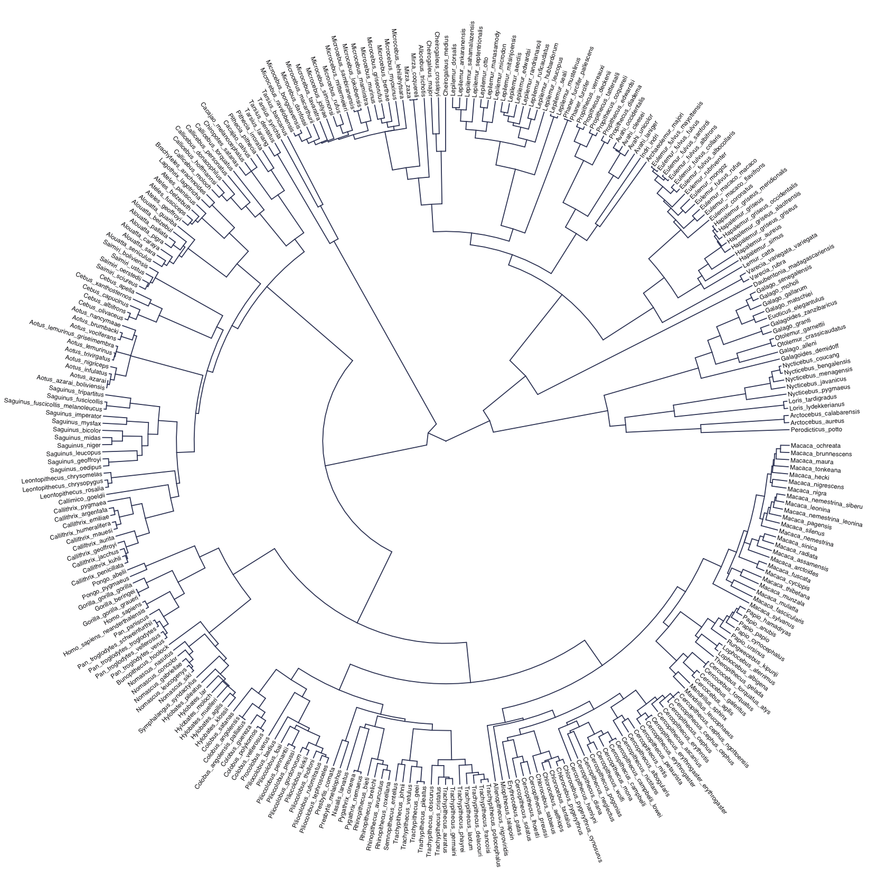

Let’s format the data.

``` r
d <-
  Primates301 %>% 
  mutate(name = as.character(name)) %>% 
  drop_na(group_size, body, brain) %>% 
  mutate(m = log(body) %>% standardize(),
         b = log(brain) %>% standardize(),
         g = log(group_size) %>% standardize())

glimpse(d)
```

    ## Rows: 151
    ## Columns: 19
    ## $ name                <chr> "Allenopithecus_nigroviridis", "Alouatta_belzebul", "Alouatta_caraya", "Alouatt…
    ## $ genus               <fct> Allenopithecus, Alouatta, Alouatta, Alouatta, Alouatta, Alouatta, Alouatta, Aot…
    ## $ species             <fct> nigroviridis, belzebul, caraya, guariba, palliata, pigra, seniculus, azarai, tr…
    ## $ subspecies          <fct> NA, NA, NA, NA, NA, NA, NA, NA, NA, NA, NA, NA, NA, NA, NA, NA, NA, NA, NA, NA,…
    ## $ spp_id              <int> 1, 3, 4, 5, 6, 7, 9, 10, 18, 22, 23, 25, 26, 28, 29, 32, 33, 34, 40, 41, 46, 49…
    ## $ genus_id            <int> 1, 3, 3, 3, 3, 3, 3, 4, 4, 6, 7, 7, 7, 8, 8, 10, 11, 11, 13, 14, 14, 14, 14, 15…
    ## $ social_learning     <int> 0, 0, 0, 0, 3, 0, 0, 0, 0, 0, 0, 2, 0, 0, 0, 0, 0, 0, 0, 0, 2, 0, 0, 1, 17, 5, …
    ## $ research_effort     <int> 6, 15, 45, 37, 79, 25, 82, 22, 58, 1, 12, 58, 30, 10, 6, 24, 11, 8, 43, 16, 161…
    ## $ brain               <dbl> 58.02, 52.84, 52.63, 51.70, 49.88, 51.13, 55.22, 20.67, 16.85, 6.92, 117.02, 10…
    ## $ body                <dbl> 4655, 6395, 5383, 5175, 6250, 8915, 5950, 1205, 989, 309, 8167, 7535, 8280, 120…
    ## $ group_size          <dbl> 40.00, 7.40, 8.90, 7.40, 13.10, 5.50, 7.90, 4.10, 3.15, 1.00, 14.50, 42.00, 20.…
    ## $ gestation           <dbl> NA, NA, 185.92, NA, 185.42, 185.92, 189.90, NA, 133.47, 133.74, 138.20, 226.37,…
    ## $ weaning             <dbl> 106.15, NA, 323.16, NA, 495.60, NA, 370.04, 229.69, 76.21, 109.26, NA, 816.35, …
    ## $ longevity           <dbl> 276.0, NA, 243.6, NA, 300.0, 240.0, 300.0, NA, 303.6, 156.0, 336.0, 327.6, 453.…
    ## $ sex_maturity        <dbl> NA, NA, 1276.72, NA, 1578.42, NA, 1690.22, NA, 736.60, 298.91, NA, 2104.57, 210…
    ## $ maternal_investment <dbl> NA, NA, 509.08, NA, 681.02, NA, 559.94, NA, 209.68, 243.00, NA, 1042.72, 1033.5…
    ## $ m                   <dbl> 0.36958768, 0.57601585, 0.46403740, 0.43842259, 0.56110778, 0.79196303, 0.52913…
    ## $ b                   <dbl> 0.4039485, 0.3285765, 0.3253670, 0.3109981, 0.2821147, 0.3020630, 0.3640841, -0…
    ## $ g                   <dbl> 1.397272713, 0.003132082, 0.155626096, 0.003132082, 0.475005322, -0.242029791, …

Our first model, which we might call the naïve model, explores the
conditional relations of \(\log(\text{body mass})\) and
\(\log(\text{group size})\) on \(\log(\text{brain size})\) without
accounting for phylogenetic relationships.

``` r
b14.9 <-
  brm(data = d,
      family = gaussian,
      b ~ 1 + m + g,
      prior = c(prior(normal(0, 1), class = Intercept),
                prior(normal(0, 0.5), class = b),
                prior(exponential(1), class = sigma)),
      iter = 2000, warmup = 1000, chains = 4, cores = 4,
      seed = 14,
      file = "/Users/solomonkurz/Dropbox/Recoding Statistical Rethinking 2nd ed/fits/b14.09")
```

Check the summary of the naïve model.

``` r
print(b14.9)
```

    ##  Family: gaussian 
    ##   Links: mu = identity; sigma = identity 
    ## Formula: b ~ 1 + m + g 
    ##    Data: d (Number of observations: 151) 
    ## Samples: 4 chains, each with iter = 2000; warmup = 1000; thin = 1;
    ##          total post-warmup samples = 4000
    ## 
    ## Population-Level Effects: 
    ##           Estimate Est.Error l-95% CI u-95% CI Rhat Bulk_ESS Tail_ESS
    ## Intercept    -0.00      0.02    -0.04     0.03 1.00     3775     2475
    ## m             0.89      0.02     0.85     0.94 1.00     3044     2485
    ## g             0.12      0.02     0.08     0.17 1.00     3207     2158
    ## 
    ## Family Specific Parameters: 
    ##       Estimate Est.Error l-95% CI u-95% CI Rhat Bulk_ESS Tail_ESS
    ## sigma     0.22      0.01     0.19     0.24 1.00     3971     2911
    ## 
    ## Samples were drawn using sampling(NUTS). For each parameter, Bulk_ESS
    ## and Tail_ESS are effective sample size measures, and Rhat is the potential
    ## scale reduction factor on split chains (at convergence, Rhat = 1).

If you want \(\sigma\) in the \(\sigma^2\) metric, you can square that
by hand.

``` r
posterior_samples(b14.9) %>% 
  mutate(sigma_sq = sigma^2) %>% 
  mean_qi(sigma_sq) %>% 
  mutate_if(is.double, round, digits = 2)
```

    ##   sigma_sq .lower .upper .width .point .interval
    ## 1     0.05   0.04   0.06   0.95   mean        qi

The oldest and most conservative way to include information about
phylogenetic relationships is with a Brownian motion model.

> Brownian motion just means Gaussian random walks. If species traits
> drift randomly with respect to one another after speciation, then the
> covariance between a pair of species ends up being linearly related to
> the phylogenetic branch distance between them–the further apart, the
> less covariance, as a proportion of distance. (p. 481)

We’ll use functions from the [**ape**
package](https://CRAN.R-project.org/package=ape) \[@R-ape; @ape2019\] to
make the covariance matrix (`V`) and the distance matrix (`Dmat`).

``` r
library(ape)

spp_obs <- d$name

tree_trimmed <- keep.tip(Primates301_nex, spp_obs)
Rbm <- corBrownian(phy = tree_trimmed)

V <- vcv(Rbm)
Dmat <- cophenetic( tree_trimmed )
```

Here’s the distance by covariance scatter plot McElreath alluded to but
did not show in the text.

``` r
full_join(
  Dmat %>% 
    as_tibble(rownames = "row") %>% 
    pivot_longer(-row,
                 names_to = "col",
                 values_to = "distance"),
  V %>% 
    as_tibble(rownames = "row") %>% 
    pivot_longer(-row,
                 names_to = "col",
                 values_to = "covariance"),
  by = c("row", "col")
) %>% 
  
  ggplot(aes(x = distance, y = covariance)) +
  geom_point(color = "#80A0C7", alpha = 1/10) +
  labs(subtitle = "These variables are the inverse of one another.",
       x = "phylogenetic distance", 
       y = "covariance")
```

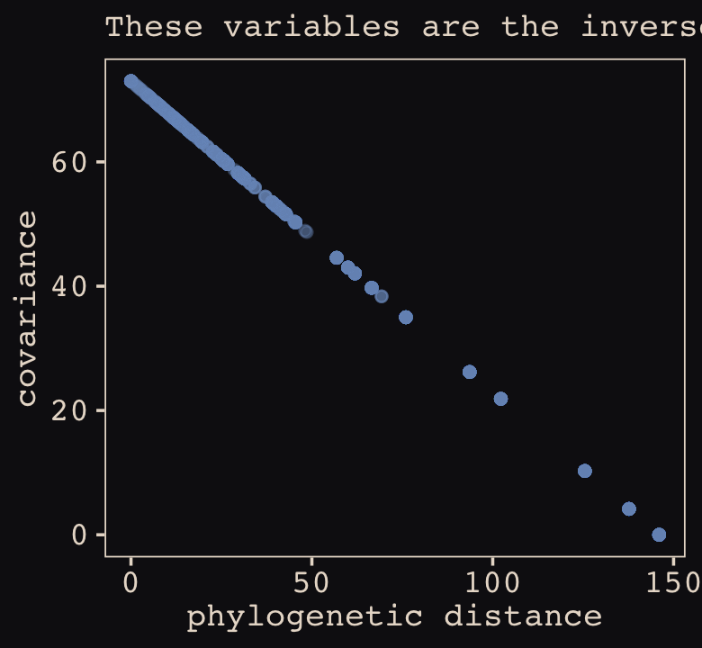

McElreath suggested executing `image(V)` and `image(Dmat)` to plot heat
maps of each matrix. We’ll have to work a little harder to make
decent-looking head maps within our **tidyverse** workflow.

``` r
# headmap of Dmat
p1 <-
  Dmat %>% 
  as_tibble(rownames = "row") %>% 
  pivot_longer(-row,
               names_to = "col",
               values_to = "distance") %>%
  
  ggplot(aes(x = col, y = row, fill = distance)) +
  geom_tile() +
  scale_fill_gradient(low = "#100F14", high = "#EEDA9D") +
  scale_x_discrete(NULL, breaks = NULL) +
  scale_y_discrete(NULL, breaks = NULL) +
  theme(legend.position = "top")

# headmap of V
p2 <-
  V %>% 
  as_tibble(rownames = "row") %>% 
  pivot_longer(-row,
               names_to = "col",
               values_to = "covariance") %>% 
  
  ggplot(aes(x = col, y = row, fill = covariance)) +
  geom_tile() +
  scale_fill_gradient(low = "#100F14", high = "#EEDA9D") +
  scale_x_discrete(NULL, breaks = NULL) +
  scale_y_discrete(NULL, breaks = NULL) +
  theme(legend.position = "top")

# combine
(p1 | p2) + plot_annotation(subtitle = "Again, distance is the inverse of covariance.")
```

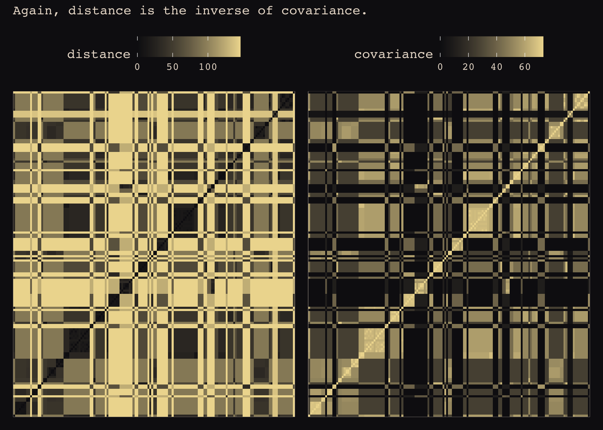

Within the **brms** paradigm, one inserts a known covariance matrix into
a model using the `fcor()` function. For any longer-term **brms** users,
`fcor()` is the replacement for the now-depreciated `cor_fixed()`
function. Along with `fcor()`, one tells **brms** about the data with
the `data2` function. Here’s how to use it for our version of
McElreath’s `m14.10`.

``` r
R <- V[spp_obs, spp_obs] / max(V)

b14.10 <-
  brm(data = d,
      data2 = list(R = R),
      family = gaussian,
      b ~ 1 + m + g + fcor(R),
      prior = c(prior(normal(0, 1), class = Intercept),
                prior(normal(0, 0.5), class = b),
                prior(exponential(1), class = sigma)),
      iter = 2000, warmup = 1000, chains = 4, cores = 4,
      seed = 14,
      file = "/Users/solomonkurz/Dropbox/Recoding Statistical Rethinking 2nd ed/b14.10")
```

Check the summary of the Brownian model.

``` r
print(b14.10)
```

    ##  Family: gaussian 
    ##   Links: mu = identity; sigma = identity 
    ## Formula: b ~ 1 + m + g + fcor(R) 
    ##    Data: d (Number of observations: 151) 
    ## Samples: 4 chains, each with iter = 2000; warmup = 1000; thin = 1;
    ##          total post-warmup samples = 4000
    ## 
    ## Population-Level Effects: 
    ##           Estimate Est.Error l-95% CI u-95% CI Rhat Bulk_ESS Tail_ESS
    ## Intercept    -0.19      0.16    -0.51     0.12 1.00     4451     3315
    ## m             0.70      0.04     0.63     0.77 1.00     4336     2704
    ## g            -0.01      0.02    -0.05     0.03 1.00     3996     2711
    ## 
    ## Family Specific Parameters: 
    ##       Estimate Est.Error l-95% CI u-95% CI Rhat Bulk_ESS Tail_ESS
    ## sigma     0.40      0.02     0.36     0.45 1.00     4152     2551
    ## 
    ## Samples were drawn using sampling(NUTS). For each parameter, Bulk_ESS
    ## and Tail_ESS are effective sample size measures, and Rhat is the potential
    ## scale reduction factor on split chains (at convergence, Rhat = 1).

Since our residual variance is still in the \(\sigma\) metric, it will
be easier to compare it to McElreath’s `sigma_sq` parameter after
transforming the posterior samples.

``` r
posterior_samples(b14.10) %>% 
  transmute(sigma_sq = sigma^2) %>% 
  mean_hdi(sigma_sq, .width = .89) %>% 
  mutate_if(is.double, round, 2)
```

    ##   sigma_sq .lower .upper .width .point .interval
    ## 1     0.16   0.13   0.19   0.89   mean       hdi

McElreath introduced the Ornstein–Uhlenbeck (OU) process as an
alternative to the Brownian motion model. The OU model proposes the
covariance between two species \(i\) and \(j\) is

\[K(i, j) = \eta^2 \exp(\rho^2 D_{ij}),\]

where, in our case, \(D_{ij}\) is the distance matrix we’ve saved above
as `Dmat`. Sadly for us, **brms** only supports the
exponentiated-quadratic kernel for Gaussian process models, at this
time. However, the Ornstein–Uhlenbeck kernel is one of the alternative
kernels Bürkner has on his to-do list (see [GitHub issue
\#234](https://github.com/paul-buerkner/brms/issues/234)). To follow
along with McElreath, we will have to use **rethinking** or raw Stan.
Our approach will be the former. First we make the `dat_list`.

``` r
dat_list <- 
  list(
    N_spp = nrow(d),
    M     = standardize(log(d$body)),
    B     = standardize(log(d$brain)),
    G     = standardize(log(d$group_size)), Imat = diag(nrow(d)),
    V     = V[spp_obs, spp_obs],
    R     = V[spp_obs, spp_obs] / max(V[spp_obs, spp_obs]),
    Dmat  = Dmat[spp_obs, spp_obs] / max(Dmat)
  )
```

Now fit the `rethinking::ulam()` model.

``` r
m14.11 <- 
  ulam( 
    alist(
      B ~ multi_normal(mu, SIGMA),
      mu <- a + bM * M + bG * G,
      matrix[N_spp,N_spp]: SIGMA <- cov_GPL1(Dmat, etasq, rhosq, 0.01), 
      a ~ normal(0, 1),
      c(bM,bG) ~ normal(0, 0.5),
      etasq ~ half_normal(1, 0.25),
      rhosq ~ half_normal(3, 0.25)
    ), 
    data = dat_list, 
    chains = 4, cores = 4)
```

    ## Trying to compile a simple C file

    ## Running /Library/Frameworks/R.framework/Resources/bin/R CMD SHLIB foo.c
    ## clang -I"/Library/Frameworks/R.framework/Resources/include" -DNDEBUG   -I"/Library/Frameworks/R.framework/Versions/3.6/Resources/library/Rcpp/include/"  -I"/Library/Frameworks/R.framework/Versions/3.6/Resources/library/RcppEigen/include/"  -I"/Library/Frameworks/R.framework/Versions/3.6/Resources/library/RcppEigen/include/unsupported"  -I"/Library/Frameworks/R.framework/Versions/3.6/Resources/library/BH/include" -I"/Library/Frameworks/R.framework/Versions/3.6/Resources/library/StanHeaders/include/src/"  -I"/Library/Frameworks/R.framework/Versions/3.6/Resources/library/StanHeaders/include/"  -I"/Library/Frameworks/R.framework/Versions/3.6/Resources/library/rstan/include" -DEIGEN_NO_DEBUG  -D_REENTRANT  -DBOOST_DISABLE_ASSERTS -DBOOST_PENDING_INTEGER_LOG2_HPP -include stan/math/prim/mat/fun/Eigen.hpp   -isysroot /Library/Developer/CommandLineTools/SDKs/MacOSX.sdk -I/usr/local/include  -fPIC  -isysroot /Library/Developer/CommandLineTools/SDKs/MacOSX.sdk -c foo.c -o foo.o
    ## In file included from <built-in>:1:
    ## In file included from /Library/Frameworks/R.framework/Versions/3.6/Resources/library/StanHeaders/include/stan/math/prim/mat/fun/Eigen.hpp:13:
    ## In file included from /Library/Frameworks/R.framework/Versions/3.6/Resources/library/RcppEigen/include/Eigen/Dense:1:
    ## In file included from /Library/Frameworks/R.framework/Versions/3.6/Resources/library/RcppEigen/include/Eigen/Core:88:
    ## /Library/Frameworks/R.framework/Versions/3.6/Resources/library/RcppEigen/include/Eigen/src/Core/util/Macros.h:613:1: error: unknown type name 'namespace'
    ## namespace Eigen {
    ## ^
    ## /Library/Frameworks/R.framework/Versions/3.6/Resources/library/RcppEigen/include/Eigen/src/Core/util/Macros.h:613:16: error: expected ';' after top level declarator
    ## namespace Eigen {
    ##                ^
    ##                ;
    ## In file included from <built-in>:1:
    ## In file included from /Library/Frameworks/R.framework/Versions/3.6/Resources/library/StanHeaders/include/stan/math/prim/mat/fun/Eigen.hpp:13:
    ## In file included from /Library/Frameworks/R.framework/Versions/3.6/Resources/library/RcppEigen/include/Eigen/Dense:1:
    ## /Library/Frameworks/R.framework/Versions/3.6/Resources/library/RcppEigen/include/Eigen/Core:96:10: fatal error: 'complex' file not found
    ## #include <complex>
    ##          ^~~~~~~~~
    ## 3 errors generated.
    ## make: *** [foo.o] Error 1

Happily, our results are much like those in the
    text.

``` r
precis(m14.11)
```

    ##              mean          sd        5.5%      94.5%    n_eff     Rhat4
    ## a     -0.06638438 0.078344681 -0.19051395 0.05450598 2200.584 0.9997226
    ## bG     0.04986559 0.023760241  0.01191601 0.08838642 2220.862 0.9994549
    ## bM     0.83377068 0.029534536  0.78505726 0.87987868 2239.769 0.9986113
    ## etasq  0.03499902 0.006986796  0.02496290 0.04677212 2070.002 0.9991239
    ## rhosq  2.79505986 0.246262081  2.38562963 3.19136895 2029.710 0.9989561

To get a sense of the covariance function implied by `etasq` and
`rhosq`, here we’ll plot the posterior against the prior for our
**tidyverse** variant of Figure 14.14.

``` r
post <- extract.samples(m14.11)

set.seed(14)

left_join(
  # posterior
  post %>% 
    data.frame() %>% 
    sample_n(size = 30) %>% 
    mutate(iter = 1:n()) %>% 
    tidyr::expand(nesting(iter, etasq, rhosq),
                  d_seq = seq(from = 0, to = 1, length.out = 50)),
  # prior
  tibble(eta = abs(rnorm(1e5, mean = 1, sd = 0.25)),
         rho = abs(rnorm(1e5, mean = 3, sd = 0.25))) %>% 
    tidyr::expand(nesting(eta, rho), 
                  d_seq = seq(from = 0, to = 1, length.out = 50)) %>% 
    mutate(k = eta * exp(-rho * d_seq)) %>% 
    group_by(d_seq) %>% 
    mean_hdi(k, .width = .89),
  # join them
  by = "d_seq") %>% 
  
  # plot!
  ggplot(aes(x = d_seq)) +
  geom_line(aes(y = etasq * exp(-rhosq * d_seq), group = iter),
            color = "#80A0C7", alpha = 1/2) +
  geom_lineribbon(data = . %>% filter(iter == 1),
            aes(y = k, ymin = .lower, ymax = .upper),
            color = "#A65141", fill = "#E7CDC2") +
  annotate(geom = "text",
           x = c(0.2, 0.5), y = c(0.1, 0.5),
           label = c("posterior", "prior"),
           color = c("#80A0C7", "#E7CDC2"),
           family = "Courier") +
  labs(x = "phylogenetic distance", 
       y = "covariance") +
  ylim(0, 1.5)
```

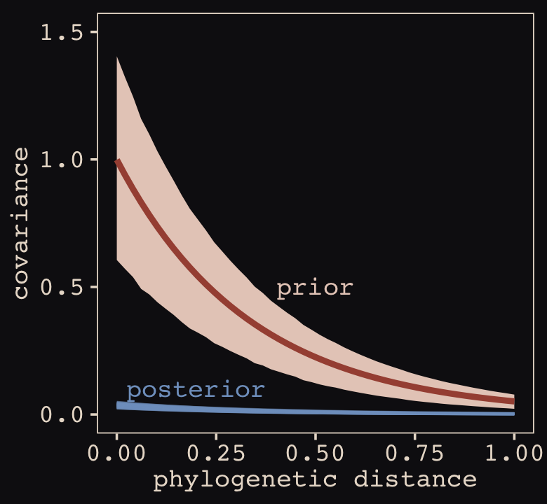

> There just isn’t a lot of phylogenetic covariance for brain sizes, at
> least according to this model and these data. As a result, the
> phylogenetic distance doesn’t completely explain away the association
> between group size and brain size, as it did in the Brownian motion
> model. (p. 485)

## ~~Summary~~ Bonus: Multilevel growth models and the MELSM

To this point in the chapter and most of the text, the data have largely
had a cross-sectional feel. In fairness, we did incorporate an element
of time with the café example from model `b14.1` by looking at the
differences between mornings and evenings. However, even then we
collapsed across longer time spans, such as days, weeks, months, and so
on. One of the two goals of this bonus section to provide a brief
introduction multilevel models designed to express change over time. The
particular brand of multilevel models we’ll focus on are often called
multilevel growth models. Though we will focus on simple linear models,
this basic framework can be generalized along many lines. The second
goal is to build on our appreciation of covariance structures by
introducing a class of multilevel models designed to investigate
variation in variation called the mixed-effects location scale models
(MELSM). For our final model, we get a little fancy and fit a
multivariate MELSM.

### Borrow some data.

All the models in this bonus section are based on the preprint by
@williamsBayesianMultivariateMixedeffects2019a, [*Bayesian multivariate
mixed-effects location scale modeling of longitudinal relations among
affective traits, states, and physical
activity*](https://psyarxiv.com/4kfjp). Williams and colleagues’ data
and supporting scripts are available in the `example_analyses` folder
from their OSF project at <https://osf.io/3bmdh/>. Load the data.

``` r
library(tidyverse)
library(brms)
library(patchwork)

dat <- 
  readr::read_csv("/Users/solomonkurz/Dropbox/Recoding Statistical Rethinking 2nd ed/data/m_melsm_dat.csv") %>% 
  mutate(day01 = (day - 2) / max((day - 2)))

glimpse(dat)
```

    ## Rows: 13,033
    ## Columns: 10
    ## $ X1        <dbl> 2, 3, 4, 5, 6, 7, 8, 9, 10, 11, 12, 13, 14, 15, 16, 17, 18, 19, 20, 21, 24, 25, 26, 27, 2…
    ## $ P_A.std   <dbl> 1.74740876, -0.23109384, 0.34155950, 0.45664827, -0.23484069, 1.12785344, 1.11272629, 0.5…
    ## $ day       <dbl> 2, 3, 4, 5, 6, 7, 8, 9, 10, 11, 12, 13, 14, 15, 16, 17, 18, 19, 20, 21, 24, 25, 26, 27, 2…
    ## $ P_A.lag   <dbl> 0.7478597, 1.4674156, -0.3772641, 0.1286055, 0.3292090, 1.4107233, 0.7696644, 0.7304159, …
    ## $ N_A.lag   <dbl> 0.25399356, -0.85363386, 0.96144592, -0.19620339, -0.16047347, -0.90365575, -0.77502805, …
    ## $ steps.pm  <dbl> 0.955171, 0.955171, 0.955171, 0.955171, 0.955171, 0.955171, 0.955171, 0.955171, 0.955171,…
    ## $ steps.pmd <dbl> 0.5995578, -0.3947168, -1.5193587, -1.3442335, 0.4175970, -0.3231042, 0.3764198, 0.317665…
    ## $ record_id <dbl> 1, 1, 1, 1, 1, 1, 1, 1, 1, 1, 1, 1, 1, 1, 1, 1, 1, 1, 1, 1, 1, 1, 1, 1, 1, 1, 1, 1, 1, 1,…
    ## $ N_A.std   <dbl> -0.73357975, 0.53856559, 0.60161616, 0.27807249, 0.54674641, 0.05660701, -0.08417053, 0.1…
    ## $ day01     <dbl> 0.00000000, 0.01020408, 0.02040816, 0.03061224, 0.04081633, 0.05102041, 0.06122449, 0.071…

These data are from 193 participants.

``` r
distinct(dat, record_id) %>% 
  count()
```

    ## # A tibble: 1 x 1
    ##       n
    ##   <int>
    ## 1   193

Participants were asked to complete self-report ratings once a day for a
few months. People varied by how many days they participated in the
study, with number of days ranging from 8 to 99 and a median of 74.

``` r
dat %>% 
  count(record_id) %>% 
  summarise(median = median(n),
            min = min(n),
            max = max(n))
```

    ## # A tibble: 1 x 3
    ##   median   min   max
    ##    <int> <int> <int>
    ## 1     74     8    99

Here is a plot of that distribution.

``` r
dat %>% 
  count(record_id) %>% 
  
  ggplot(aes(x = n)) +
  geom_bar(fill = "#B1934A") +
  scale_x_continuous("number of days", limits = c(0, NA)) +
  theme_pearl_earring()
```


Our primary variables of interest were taken from the Positive and
Negative Affect Schedule \[PANAS, @watsonPANASDevelopment1988\], which
is widely used in certain areas of psychology to measure mood or
emotion. Participants completing the PANAS endorse the extent to which
they experienced various positive (e.g., excited, inspired) and negative
(e.g., upset, afraid) emotional states. These responses are summed into
two scores: Positive affect (PA) and negative affect (NA). In the
current data, the standardized versions of these scores are in the
`P_A.std` and `N_A.std` columns, respectively. To get a sense of what
these look like, here are the daily `N_A.std` scores from a random
sample of 16 participants.

``` r
set.seed(14)

dat %>% 
  nest(data = c(X1, P_A.std, day, P_A.lag, N_A.lag, steps.pm, steps.pmd, N_A.std, day01)) %>% 
  sample_n(size = 16) %>% 
  unnest(data) %>% 
  
  ggplot(aes(x = day, y = N_A.lag)) +
  geom_line(color = "#80A0C7") +
  geom_point(color = "#FCF9F0", size = 1/2) +
  ylab("negative affect (standardized)") +
  facet_wrap(~record_id)
```

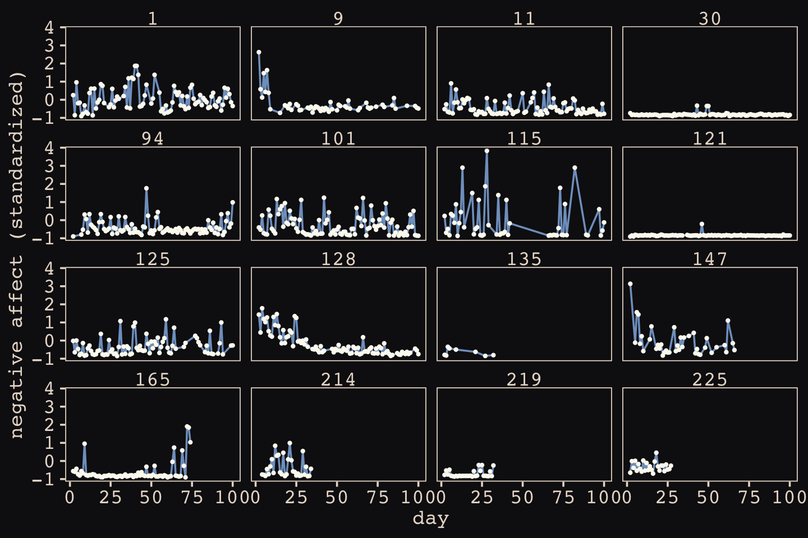

### Conventional multilevel growth model.

In the social sciences, a typical way to analyze data like these is with
a multilevel growth model in which participants vary in their intercepts
(starting point) and time slopes (change over time). In the sample of
the data, above, it looks like most participants have fairly constant
levels of NA over time (i.e., near-zero slopes) but some (e.g., \# 128
and 147) show some evidence of systemic decreases in NA (i.e., negative
slopes). There is also some variation in starting points, though most of
the participants in this subset of the data seemed to have endorsed
relatively low levels of NA both at baseline and throughout the study.

Anyway, we want a model that can capture those kinds of variation.
Eventually, we will fit a model that accounts for both PA and NA. But to
keep things simple while we’re warming up, we will restrict our focus to
NA. If we let \(\text{NA}_{ij}\) be the standardized NA score for the
\(i\)th participant on the \(j\)th day, our first Bayesian multilevel
growth model will follow the form

\[
\begin{align*}
\text{NA}_{ij} & \sim \operatorname{Normal}\begin{pmatrix} \mu_{ij}, \sigma \end{pmatrix} \\
\mu_{ij}       & = \beta_0 + \beta_1 \text{time}_{ij} + u_{0i} + u_{1i} \text{time}_{ij} \\
\sigma & = \sigma_\epsilon \\
\begin{bmatrix} u_{0i} \\ u_{1i} \end{bmatrix} & \sim \operatorname{MVNormal}\begin{pmatrix} \begin{bmatrix} 0 \\ 0 \end{bmatrix}, \mathbf S \mathbf R \mathbf S \end{pmatrix} \\
\mathbf S & = \begin{bmatrix} \sigma_0 & 0 \\ 0 & \sigma_1 \end{bmatrix} \\
\mathbf R & = \begin{bmatrix} 1 & \rho_{12} \\ \rho_{21} & 1 \end{bmatrix} \\
\beta_0   & \sim \operatorname{Normal}(0, 0.2) \\
\beta_1   & \sim \operatorname{Normal}(0, 1) \\
\sigma_0 \text{ and } \sigma_1 & \sim \operatorname{Exponential}(1) \\
\sigma_\epsilon & \sim \operatorname{Exponential}(1) \\
\mathbf R & \sim \operatorname{LKJ}(2),
\end{align*}
\]

where \(\beta_0\) is the intercept (i.e., starting point) and \(u_{0i}\)
captures variations in that intercept across participants. Similarly,
\(\beta_1\) is the slope depicting linear change in \(\text{NA}\) across
time and \(u_{1i}\) captures variations in that linear change across
participants. The \(u_{0i}\) and \(u_{1i}\) parameters are modeled as
multivariate normal with zero means (i.e., they are deviations from the
population parameters) and standard deviations \(\sigma_0\) and
\(\sigma_1\). We express the correlation between those two group-level
\(\sigma\) parameters with \(\mathbf R\), the symmetric correlation
matrix. Here we just have one correlation, \(\rho_{21}\), which is the
same as \(\rho_{12}\). Finally, variation not accounted for by the other
parameters is captured by the single parameter \(\sigma_\epsilon\),
which is often just called \(\epsilon\).

We have two variables measuring time in these data. The `day` variable
measures time by integers, ranging from 2 to 100. To make it a little
easier to set the priors and fit the model with Stan, we have a rescaled
version of the variable, `day01`, which ranges from 0 to 1. In this way,
\(\beta_0\) is the value for the first day in the data set and
\(\beta_1\) is the expected change by the end of the collection (i.e.,
the 100th day). For consistency, we are largely following McElreath’s
weakly-regularizing approach to priors.

You may have noticed my statistical notation differs a bit from
McElreath’s, here. This notation is a blend of sensibilities from
McElreath, Williams, and from the notation I used in [my
translation](https://bookdown.org/content/4253/) of Singer and Willett’s
\[-@singerAppliedLongitudinalData2003\] text, [*Applied longitudinal
data analysis: Modeling change and event
occurrence*](https://oxford.universitypressscholarship.com/view/10.1093/acprof:oso/9780195152968.001.0001/acprof-9780195152968).
I hope it’s clear.

Here is how to fit the model with **brms**.

``` r
# 5.583446 mins
b14.12 <-
  brm(data = dat,
      family = gaussian,
      N_A.std ~ 1 + day01 + (1 + day01 | record_id),
      prior = c(prior(normal(0, 0.2), class = Intercept),
                prior(normal(0, 1), class = b),
                prior(exponential(1), class = sd),
                prior(exponential(1), class = sigma),
                prior(lkj(2), class = cor)),
      iter = 3000, warmup = 1000, chains = 4, cores = 4,
      seed = 14,
      file = "/Users/solomonkurz/Dropbox/Recoding Statistical Rethinking 2nd ed/fits/b14.12")
```

Check the summary.

``` r
print(b14.12)
```

    ##  Family: gaussian 
    ##   Links: mu = identity; sigma = identity 
    ## Formula: N_A.std ~ 1 + day01 + (1 + day01 | record_id) 
    ##    Data: dat (Number of observations: 13033) 
    ## Samples: 4 chains, each with iter = 3000; warmup = 1000; thin = 1;
    ##          total post-warmup samples = 8000
    ## 
    ## Group-Level Effects: 
    ## ~record_id (Number of levels: 193) 
    ##                      Estimate Est.Error l-95% CI u-95% CI Rhat Bulk_ESS Tail_ESS
    ## sd(Intercept)            0.78      0.04     0.70     0.86 1.00     1396     2647
    ## sd(day01)                0.65      0.05     0.57     0.75 1.00     2952     4640
    ## cor(Intercept,day01)    -0.34      0.08    -0.49    -0.19 1.00     2874     4159
    ## 
    ## Population-Level Effects: 
    ##           Estimate Est.Error l-95% CI u-95% CI Rhat Bulk_ESS Tail_ESS
    ## Intercept     0.03      0.06    -0.08     0.14 1.00      809     1767
    ## day01        -0.16      0.06    -0.27    -0.04 1.00     1778     3357
    ## 
    ## Family Specific Parameters: 
    ##       Estimate Est.Error l-95% CI u-95% CI Rhat Bulk_ESS Tail_ESS
    ## sigma     0.61      0.00     0.60     0.62 1.00    14649     5390
    ## 
    ## Samples were drawn using sampling(NUTS). For each parameter, Bulk_ESS
    ## and Tail_ESS are effective sample size measures, and Rhat is the potential
    ## scale reduction factor on split chains (at convergence, Rhat = 1).

Hopefully it makes sense that the population-level intercept
(\(\beta_0\)) is near zero. It would be odd if it wasn’t given these are
standardized data. The coefficient for `day01` (\(\beta_1\)) is mildly
negative, suggesting an overall trend for participants to endorse lower
NA scores over time.

The two group-level \(\sigma\) parameters are fairly large given the
scale of the data. They suggest participants varied quite a bit in terms
of both intercepts and slopes. They also have a moderate negative
correlation, suggesting that participants with higher intercepts tended
to have more negative slopes.

To get a sense of the model, we’ll plot the posterior means for each
participants’ fitted trajectory across time (thin lines), along with the
population-average trajectory (thick line).

``` r
nd <-
  dat %>% 
  distinct(record_id, day01)

fitted(b14.12,
       newdata = nd) %>% 
  data.frame() %>% 
  bind_cols(nd) %>% 
  
  ggplot(aes(x = day01, y = Estimate, group = record_id)) +
  geom_line(alpha = 1/3, size = 1/3, color = "#8B9DAF") +
  geom_segment(x = 0, xend = 1,
               y = fixef(b14.12)[1, 1],
               yend = fixef(b14.12)[1, 1] + fixef(b14.12)[2, 1],
               size = 3, color = "#80A0C7") +
  ylab("negative affect (standardized)")
```

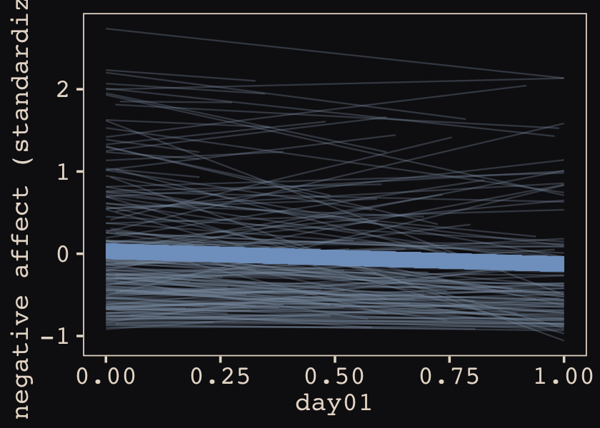

If you look back up to the model summary from before the plot, the one
parameter we didn’t focus on was the lone `sigma` parameter at the
bottom. That’s our \(\sigma_\epsilon\), which captures the individual
variation not accounted for by the intercepts, slopes, and their
correlation. An important characteristic of the conventional multilevel
growth model is that \(\sigma_\epsilon\) does not vary across persons,
occasions, or other variables. To give a sense of why this might not be
the best assumption, let’s take a focused look at the model implied
trajectories for two participants. Here we will take cues from some
Figure 4.8 from way back in \[Section 4.4.3.5\]\[Prediction
intervals.\]. We will plot the original data atop both the fitted lines
and their 95% intervals, which expresses the mean structure, along with
the 95% posterior predictive interval, which expresses the uncertainty
of the \(\sigma_\epsilon\) parameter.

``` r
nd <-
  dat %>% 
  filter(record_id %in% c(30, 115)) %>% 
  select(record_id, N_A.std, day01)

bind_cols(
  fitted(b14.12,
         newdata = nd) %>% 
    data.frame(),
  predict(b14.12,
          newdata = nd) %>% 
    data.frame() %>% 
    select(Q2.5:Q97.5) %>% 
    set_names("p_lower", "p_upper")
) %>% 
  bind_cols(nd) %>% 
  
  ggplot(aes(x = day01)) +
  geom_smooth(aes(y = Estimate, ymin = Q2.5, ymax = Q97.5),
              stat = "identity",
              fill = "#8B9DAF", color = "#8B9DAF", alpha = 1/2, size = 1/2) +
  geom_ribbon(aes(ymin = p_lower, ymax = p_upper),
              fill = "#8B9DAF", alpha = 1/2) +
  geom_point(aes(y = N_A.std),
             color = "#8B9DAF") +
  ylab("negative affect (standardized)") +
  facet_wrap(~record_id)
```

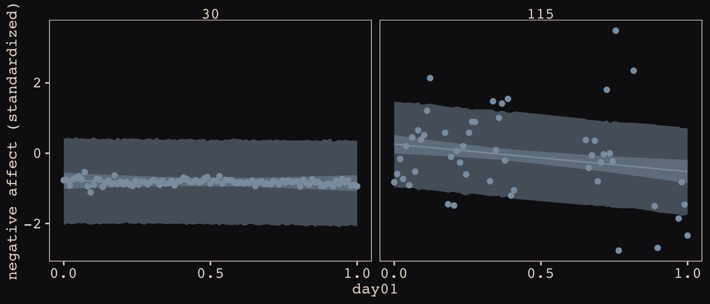

Because of our fixed \(\sigma_\epsilon\) parameter, the 95% posterior
predictive interval is the same width for both participants. Yet look
how closely participant the data points for participant 30 cluster not
only within the center region of the posterior prediction intervals, but
also almost completely within the 95% interval for the fitted line. In
contrast, notice how much more spread out the data points for
participant 115 are, and how many of them extend well beyond the
posterior predictive interval. This difference in variability is ignored
by conventional growth models. However, there’s no reason we can’t
adjust our model to capture this kind of person-level variability, too.
Enter the MELSM.

### Learn more about your data with the MELSM.

Mixed-effects location scale models (MELSMs) have their origins in the
work of [Donald
Hedeker](https://health.uchicago.edu/faculty/donald-hedeker-phd) and
colleagues \[@hedekerApplicationMixedeffectsLocation2008;
@hedekerModelingWithinsubjectVariance2012\].
@rastModelingIndividualDifferences2012 showcased an early application of
the framework to the BUGS/JAGS software. More recently [Philippe
Rast](https://twitter.com/rastlab) and colleagues (particularly graduate
student, [Donald Williams](wdonald_1985)) have adapted this approach for
use within the Stan/**brms** software ecosystem
\[@williamsBayesianNonlinearMixedeffects2019a,
@williamsSurfaceUnearthingWithinperson2019,
@williamsBayesianMultivariateMixedeffects2019a,
@williamsPuttingIndividualReliability2019\].

Within the **brms**, MELSMs apply a distributional modeling approach
\[see @Bürkner2020Distributional\] to the multilevel growth model. Not
only are parameters from the mean structure allowed to vary across
groups, but parameters applied to \(\sigma\) are allowed to vary across
groups, too. Do you remember the little practice model `b10.1` from
\[Section 10.2.2\]\[Linking linear models to distributions.\]. We
simulated Gaussian data for two groups with the same mean parameter but
different parameters for \(\sigma\). If you check back in that section,
you’ll see that the **brms** default was to model \(\log \sigma\) in
that case. This is smart because when you define a model for \(\sigma\),
you want to use a link function that ensures the predictions will be
stay at zero and above. The MELSM approach of Hedeker, Rast, Williams
and friends applies this logic to \(\sigma_\epsilon\) in multilevel
growth models. However, not only can \(\sigma_\epsilon\) vary across
groups in a fixed-effects sort of way, we can use multilevel partial
pooling, too.

To get a sense of what this looks like, we’ll augment our previous
model, but this time allowing \(\sigma_\epsilon\) to vary across
participants. You might express the updated statistical model as

\[
\begin{align*}
\text{NA}_{ij} & \sim \operatorname{Normal}\begin{pmatrix} \mu_{ij}, \sigma_{i} \end{pmatrix} \\
\mu_{ij} & = \beta_0 + \beta_1 \text{time}_{ij} + u_{0i} + u_{1i} \text{time}_{ij} \\ 
\log \begin{pmatrix} \sigma_i \end{pmatrix} & = \eta_0 + u_{2i} \\
\begin{bmatrix} u_{0i} \\ u_{1i} \\ u_{2i} \end{bmatrix} & \sim \operatorname{MVNormal}\begin{pmatrix} \begin{bmatrix} 0 \\ 0 \\ 0 \end{bmatrix}, \mathbf S \mathbf R \mathbf S \end{pmatrix} \\
\mathbf S & = \begin{bmatrix} \sigma_0 & 0 & 0 \\ 0 & \sigma_1 & 0 \\ 0 & 0 & \sigma_2 \end{bmatrix} \\
\mathbf R & = \begin{bmatrix} 1 & \rho_{12} & \rho_{13} \\ \rho_{21} & 1 & \rho_{23} \\ \rho_{31} & \rho_{32} & 1 \end{bmatrix} \\
\beta_0   & \sim \operatorname{Normal}(0, 0.2) \\
\beta_1 \text{and } \eta_0 & \sim \operatorname{Normal}(0, 1) \\
\sigma_0,..., \sigma_2     & \sim \operatorname{Exponential}(1) \\
\mathbf R & \sim \operatorname{LKJ}(2).
\end{align*}
\]

In the opening likelihood statement from the prior model, we simply set
\(\text{NA}_{ij} \sim \operatorname{Normal}\begin{pmatrix} \mu_{ij}, \sigma \end{pmatrix}\).
For our first MELSM, we now refer to \(\sigma_i\), meaning the levels of
variation not accounted for by the mean structure can vary across
participants (hence the \(i\) subscript). Two lines down, we see the
formula for \(\log \begin{pmatrix} \sigma_i \end{pmatrix}\) contains
population-level intercept, \(\eta_0\), and participant-specific
deviations around that parameter, \(u_{2i}\). In the next three lines,
the plot deepens. We see that all three participant-level deviations,
\(u_{0i},...,u_{2i}\) are multivariate normal with means set to zero and
variation expressed in the parameters \(\sigma_0,...,\sigma_2\) of the
\(\mathbf S\) matrix. In the \(R\) matrix, we now have three correlation
parameters, with \(\rho_{31}\) and \(\rho_{32}\) allowing us to assess
the correlations among individual differences in variability and
individual differences in starting points and change over time,
respectively. Let’s fit the model.

``` r
b14.13 <-
  brm(data = dat,
      family = gaussian,
      bf(N_A.std ~ 1 + day01 + (1 + day01 |i| record_id),
         sigma ~ 1 + (1 |i| record_id)),
      prior = c(prior(normal(0, 0.2), class = Intercept),
                prior(normal(0, 1), class = b),
                prior(exponential(1), class = sd),
                
                prior(normal(0, 1), class = Intercept, dpar = sigma),
                prior(exponential(1), class = sd, dpar = sigma),
                
                prior(lkj(2), class = cor)),
      iter = 3000, warmup = 1000, chains = 4, cores = 4,
      seed = 14,
      file = "/Users/solomonkurz/Dropbox/Recoding Statistical Rethinking 2nd ed/fits/b14.13")
```

We should note a few things about the `brm()` syntax. First, because we
modeled both \(\mu_{ij}\) and \(\sigma_i\), we put both model formulas
within the `bf()` function. Second, because the **brms** default is to
use the log link when modeling \(\sigma_i\), there was no need to
explicitly set it that wah in the `family` line. However, we could have
if we wanted to. Third, notice our use of the `|i|` syntax within the
parentheses in the `formula` lines. If we had used the conventional `|`
syntax, that would have not allowed our \(u_{2i}\) parameters to
correlate with \(u_{0i}\) and \(u_{1i}\) from the mean structure. It
would have effectively set \(\rho_{31} = \rho_{32} = 0\). Finally,
notice how within the `prior()` functions, we explicitly referred to
those for the new \(\sigma\) structure with the `dpar = sigma` operator.

Okay, time to check the model summary.

``` r
print(b14.13)
```

    ##  Family: gaussian 
    ##   Links: mu = identity; sigma = log 
    ## Formula: N_A.std ~ 1 + day01 + (1 + day01 | i | record_id) 
    ##          sigma ~ 1 + (1 | i | record_id)
    ##    Data: dat (Number of observations: 13033) 
    ## Samples: 4 chains, each with iter = 3000; warmup = 1000; thin = 1;
    ##          total post-warmup samples = 8000
    ## 
    ## Group-Level Effects: 
    ## ~record_id (Number of levels: 193) 
    ##                                Estimate Est.Error l-95% CI u-95% CI Rhat Bulk_ESS Tail_ESS
    ## sd(Intercept)                      0.76      0.04     0.69     0.85 1.01      652     1475
    ## sd(day01)                          0.61      0.04     0.53     0.69 1.00     1548     2982
    ## sd(sigma_Intercept)                0.70      0.04     0.63     0.77 1.00      679     1170
    ## cor(Intercept,day01)              -0.34      0.08    -0.48    -0.17 1.01      998     2661
    ## cor(Intercept,sigma_Intercept)     0.61      0.05     0.51     0.70 1.01      705     1251
    ## cor(day01,sigma_Intercept)        -0.10      0.08    -0.25     0.06 1.00      747     1939
    ## 
    ## Population-Level Effects: 
    ##                 Estimate Est.Error l-95% CI u-95% CI Rhat Bulk_ESS Tail_ESS
    ## Intercept           0.03      0.05    -0.08     0.14 1.01      288      427
    ## sigma_Intercept    -0.78      0.05    -0.89    -0.68 1.01      481      978
    ## day01              -0.15      0.05    -0.26    -0.05 1.01      769     1532
    ## 
    ## Samples were drawn using sampling(NUTS). For each parameter, Bulk_ESS
    ## and Tail_ESS are effective sample size measures, and Rhat is the potential
    ## scale reduction factor on split chains (at convergence, Rhat = 1).

The ‘sigma\_Intercept’ lines in the ‘Population-Level Effects’ section
is the summary for our \(\eta_0\) parameter. To get a sense of what this
means out of the log space, just exponentiate.

``` r
fixef(b14.13)["sigma_Intercept", c(1, 3:4)] %>% exp()
```

    ##  Estimate      Q2.5     Q97.5 
    ## 0.4577889 0.4126544 0.5058946

To get a sense of the variation in that parameter across participants
\[i.e., \(\exp(\eta_0 + u_{2i})\)\], it’s best to plot.

``` r
coef(b14.13)$record_id[, , "sigma_Intercept"] %>% 
  exp() %>% 
  data.frame() %>% 
  arrange(Estimate) %>% 
  mutate(rank = 1:n()) %>% 
  
  ggplot(aes(x = rank, y = Estimate, ymin = Q2.5, ymax = Q97.5)) +
  geom_pointrange(size = .4, fatten = .4, color = "#EEDA9D") +
  scale_x_continuous("participants ranked by posterior mean", breaks = NULL) +
  ylab(expression(exp(eta[0]+italic(u)[2][italic(i)])))
```

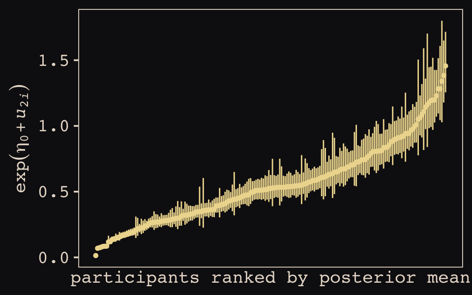

Looks like there’s a lot of variation in a parameter that was formerly
fixed across participants as a single value \(\sigma_\epsilon\). Here’s
what this looks like in terms of our posterior predictive distributions
for participants 30 and 115, from before.

``` r
nd <-
  dat %>% 
  filter(record_id %in% c(30, 115)) %>% 
  select(record_id, N_A.std, day01)

bind_cols(
  fitted(b14.13,
         newdata = nd) %>% 
    data.frame(),
  predict(b14.13,
          newdata = nd) %>% 
    data.frame() %>% 
    select(Q2.5:Q97.5) %>% 
    set_names("p_lower", "p_upper")
) %>% 
  bind_cols(nd) %>% 
  
  ggplot(aes(x = day01)) +
  geom_smooth(aes(y = Estimate, ymin = Q2.5, ymax = Q97.5),
              stat = "identity",
              fill = "#8B9DAF", color = "#8B9DAF", alpha = 1/2, size = 1/2) +
  geom_ribbon(aes(ymin = p_lower, ymax = p_upper),
              fill = "#8B9DAF", alpha = 1/2) +
  geom_point(aes(y = N_A.std),
             color = "#8B9DAF") +
  ylab("negative affect (standardized)") +
  facet_wrap(~record_id)
```

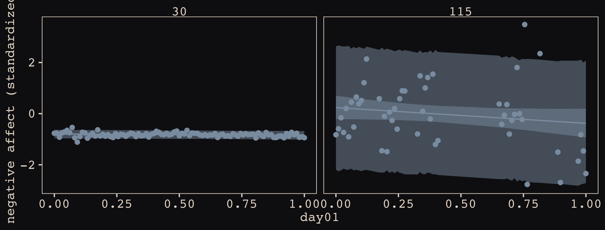

That’s a big improvement. Let’s expand our skill set. Within the MELSM
paradigm, one can use multiple variables to model participant-specific
variation. Here we’ll add in our time variable.

\[
\begin{align*}
\text{NA}_{ij} & \sim \operatorname{Normal}\begin{pmatrix} \mu_{ij}, \sigma_{ij} \end{pmatrix} \\
\mu_{ij} & = \beta_0 + \beta_1 \text{time}_{ij} + u_{0i} + u_{1i} \text{time}_{ij} \\ \log \begin{pmatrix} \sigma_{ij} \end{pmatrix} & = \eta_0 + \eta_1 \text{time}_{ij} + u_{2i} + u_{3i} \text{time}_{ij} \\
\begin{bmatrix} u_{0i} \\ u_{1i} \\ u_{2i} \\ u_{3i} \end{bmatrix} & \sim \operatorname{MVNormal}\begin{pmatrix} \begin{bmatrix} 0 \\ 0 \\ 0 \\ 0 \end{bmatrix}, \mathbf S \mathbf R \mathbf S \end{pmatrix} \\
\mathbf S & = \begin{bmatrix} \sigma_0 & 0 & 0 & 0 \\ 0 & \sigma_1 & 0 & 0 \\ 0 & 0 & \sigma_2 & 0 \\ 0 & 0 & 0 & \sigma_3 \end{bmatrix} \\
\mathbf R & = \begin{bmatrix} 1 & \rho_{12} & \rho_{13} & \rho_{14} \\ \rho_{21} & 1 & \rho_{23} & \rho_{24} \\ \rho_{31} & \rho_{32} & 1 & \rho_{34} \\ \rho_{41} & \rho_{42} & \rho_{43} & 1 \end{bmatrix} \\
\beta_0   & \sim \operatorname{Normal}(0, 0.2) \\
\beta_1, \eta_0, \text{and } \eta_1 & \sim \operatorname{Normal}(0, 1) \\
\sigma_0,..., \sigma_3 & \sim \operatorname{Exponential}(1) \\
\mathbf R & \sim \operatorname{LKJ}(2).
\end{align*}
\]

Note how in the very first line we are not speaking in terms of
\(\sigma_{ij}\). Variation in the criterion \(\text{NA}_{ij}\) not
accounted for by the mean structure can now vary across participants,
\(i\), and time, \(j\). This results in four \(u_{xi}\) terms, a
\(4 \times 4\) \(\mathbf S\) matrix and a \(4 \times 4\) \(\mathbf R\)
matrix. Here’s how you might fit the model with `brms::brm()`.
**Warning**: it’ll probably take a couple hours.

5:35

``` r
# 1.64888 hours
b14.14 <-
  brm(data = dat,
      family = gaussian,
      bf(N_A.std ~ 1 + day01 + (1 + day01 |i| record_id),
         sigma ~ 1 + day01 + (1 + day01 |i| record_id)),
      prior = c(prior(normal(0, 0.2), class = Intercept),
                prior(normal(0, 1), class = b),
                prior(exponential(1), class = sd),
                
                prior(normal(0, 1), class = Intercept, dpar = sigma),
                prior(normal(0, 1), class = b, dpar = sigma),
                prior(exponential(1), class = sd, dpar = sigma),
                
                prior(lkj(2), class = cor)),
      iter = 3000, warmup = 1000, chains = 4, cores = 4,
      seed = 14,
      file = "/Users/solomonkurz/Dropbox/Recoding Statistical Rethinking 2nd ed/fits/b14.14")
```

At this point, `print()` is starting to return a lot of output.

``` r
print(b14.14)
```

    ##  Family: gaussian 
    ##   Links: mu = identity; sigma = log 
    ## Formula: N_A.std ~ 1 + day01 + (1 + day01 | i | record_id) 
    ##          sigma ~ 1 + day01 + (1 + day01 | i | record_id)
    ##    Data: dat (Number of observations: 13033) 
    ## Samples: 4 chains, each with iter = 3000; warmup = 1000; thin = 1;
    ##          total post-warmup samples = 8000
    ## 
    ## Group-Level Effects: 
    ## ~record_id (Number of levels: 193) 
    ##                                  Estimate Est.Error l-95% CI u-95% CI Rhat Bulk_ESS Tail_ESS
    ## sd(Intercept)                        0.76      0.04     0.68     0.84 1.01     1113     2097
    ## sd(day01)                            0.60      0.04     0.52     0.69 1.00     2368     4274
    ## sd(sigma_Intercept)                  0.70      0.04     0.63     0.78 1.00     1933     3371
    ## sd(sigma_day01)                      0.36      0.04     0.29     0.44 1.00     4282     5832
    ## cor(Intercept,day01)                -0.31      0.08    -0.46    -0.14 1.00     1700     3099
    ## cor(Intercept,sigma_Intercept)       0.64      0.05     0.54     0.72 1.00     1781     3498
    ## cor(day01,sigma_Intercept)          -0.20      0.08    -0.35    -0.04 1.00     1297     2795
    ## cor(Intercept,sigma_day01)          -0.16      0.11    -0.37     0.05 1.00     4531     5944
    ## cor(day01,sigma_day01)               0.61      0.09     0.42     0.76 1.00     4671     5794
    ## cor(sigma_Intercept,sigma_day01)    -0.15      0.10    -0.34     0.04 1.00     3872     5824
    ## 
    ## Population-Level Effects: 
    ##                 Estimate Est.Error l-95% CI u-95% CI Rhat Bulk_ESS Tail_ESS
    ## Intercept           0.03      0.06    -0.08     0.14 1.00      500      949
    ## sigma_Intercept    -0.75      0.05    -0.85    -0.65 1.00      810     2121
    ## day01              -0.15      0.05    -0.25    -0.06 1.00     1416     2760
    ## sigma_day01        -0.11      0.04    -0.19    -0.03 1.00     3920     5043
    ## 
    ## Samples were drawn using sampling(NUTS). For each parameter, Bulk_ESS
    ## and Tail_ESS are effective sample size measures, and Rhat is the potential
    ## scale reduction factor on split chains (at convergence, Rhat = 1).

Our new line for ‘sigma\_day01’ suggests there is a general trend for
less variation in negative affect ratings over time. However, the
‘sd(sigma\_day01)’ line in the ‘Group-Level Effects’ section indicates
even this varies a bit across participants. At this point, a lot of the
action is now in the estimates for the \(\mathbf R\) matrix. Here that
is in a coefficient plot.

``` r
posterior_summary(b14.14) %>% 
  data.frame() %>% 
  rownames_to_column("par") %>% 
  filter(str_detect(par, "cor_")) %>% 
  mutate(rho = str_c("(rho[", c(21, 31, 32, 41, 42, 43), "])")) %>% 
  mutate(par = str_c("'", par, "'~", rho)) %>% 
  
  ggplot(aes(x = Estimate, xmin = Q2.5, xmax = Q97.5, y = par)) +
  geom_vline(xintercept = c(-.5, 0, .5), linetype = c(2, 1, 2), size = c(1/4, 1/2, 1/4), color = "#FCF9F0", alpha = 1/4) +
  geom_pointrange(color = "#B1934A") +
  xlim(-1, 1) +
  scale_y_discrete(labels = ggplot2:::parse_safe) +
  labs(x = "marginal posterior",
       y = NULL) +
  theme(axis.text.y = element_text(hjust = 0),
        axis.ticks.y = element_blank())
```

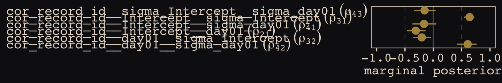

Note how we attached the statistical terms from the lower triangle of
the \(\mathbf R\) matrix to the names from the **brms** output.
Coefficient plots like this are somewhat helpful with MELSM parameter
summaries, like this. But they leave something to be desired and they
won’t scale well. One alternative is to present the posterior means in a
correlation matrix plot. Our first step to prepare for the plot is to
extract and wrangle the posterior summaries.

``` r
levels <- c("beta[0]", "beta[1]", "eta[0]", "eta[1]")

r <-
  posterior_summary(b14.14) %>% 
  data.frame() %>% 
  rownames_to_column("param") %>% 
  filter(str_detect(param, "cor_")) %>% 
  mutate(param = str_remove(param, "cor_record_id__")) %>% 
  separate(param, into = c("left", "right"), sep = "__") %>% 
  mutate(
    left = case_when(
      left == "Intercept"       ~ "beta[0]",
      left == "day01"           ~ "beta[1]",
      left == "sigma_Intercept" ~ "eta[0]"),
    right = case_when(
      right == "day01"           ~ "beta[1]",
      right == "sigma_Intercept" ~ "eta[0]",
      right == "sigma_day01"     ~ "eta[1]"
    )
  ) %>% 
  mutate(label = formatC(Estimate, digits = 2, format = "f") %>% str_replace(., "0.", ".")) %>%
  mutate(left  = factor(left, levels = levels),
         right = factor(right, levels = levels)) %>%
  mutate(right = fct_rev(right))

r
```

    ##      left   right   Estimate  Est.Error       Q2.5       Q97.5 label
    ## 1 beta[0] beta[1] -0.3089508 0.08386411 -0.4629906 -0.13655524  -.31
    ## 2 beta[0]  eta[0]  0.6409912 0.04611116  0.5425778  0.72436842   .64
    ## 3 beta[1]  eta[0] -0.2031949 0.08102187 -0.3532224 -0.04002514  -.20
    ## 4 beta[0]  eta[1] -0.1634277 0.10668266 -0.3686215  0.05152164  -.16
    ## 5 beta[1]  eta[1]  0.6067130 0.08825829  0.4203622  0.76378213   .61
    ## 6  eta[0]  eta[1] -0.1536633 0.09818593 -0.3388578  0.04149388  -.15

Note how instead of naming the correlations in terms of \(\rho_{xx}\),
we are now referring to them as the correlations of the deviations among
the population parameters, \(\beta_0\) through \(\eta_1\). I’m hoping
this will make sense in the plot. Here it is.

``` r
r %>% 
  ggplot(aes(x = left, y = right)) +
  geom_tile(aes(fill = Estimate)) +
  geom_text(aes(label = label),
            family = "Courier", size = 3) +
  scale_fill_gradient2(expression(rho),
                       low = "#59708b", mid = "#FCF9F0", high = "#A65141", midpoint = 0, 
                       labels = c(-1, "", 0, "", 1), limits = c(-1, 1)) +
  scale_x_discrete(NULL, drop = F, labels = ggplot2:::parse_safe, position = "top") +
  scale_y_discrete(NULL, drop = F, labels = ggplot2:::parse_safe) +
  ggtitle(expression("The lower triangle for "*bold(R)),
          subtitle = "Note, each cell is summarized by its posterior mean.") +
  theme(axis.text = element_text(size = 12),
        axis.ticks = element_blank(),
        legend.text = element_text(hjust = 1))
```

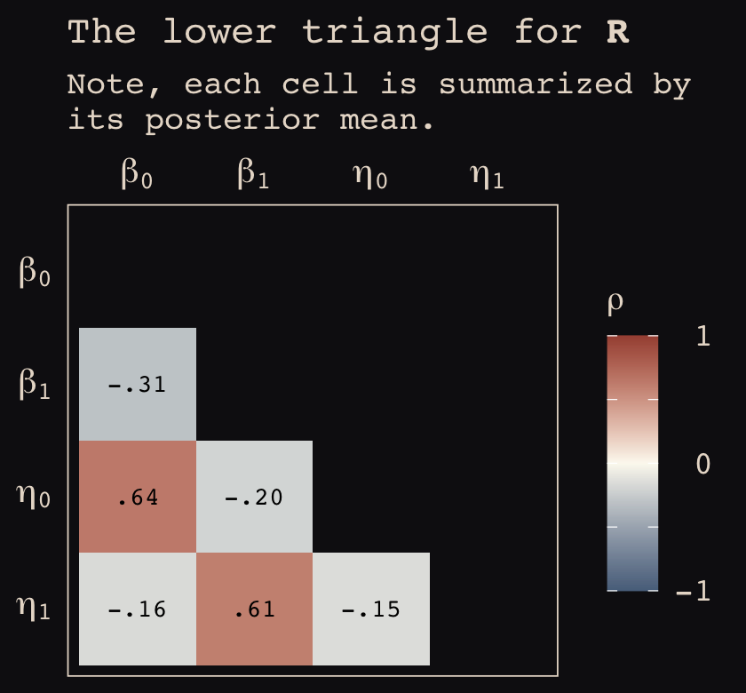

Interestingly, the strongest two associations involve variation around
our \(\eta\) parameters. The posterior mean for \(\rho_{31}\) indicates
participants with higher baseline levels of \(\text{NA}_{ij}\) tend to
vary more in their responses, particularly in the beginning. The
posterior mean for \(\rho_{42}\) indicates participants who show greater
increases in their \(\text{NA}_{ij}\) responses over time also tend to
show greater relative increases in variation in those responses. You can
get a little bit of a sense for this by returning once again to our
participants 30 and 115.

``` r
nd <-
  dat %>% 
  filter(record_id %in% c(30, 115)) %>% 
  # filter(record_id < 20) %>% 
  select(record_id, N_A.std, day01)

bind_cols(
  fitted(b14.14,
         newdata = nd) %>% 
    data.frame(),
  predict(b14.14,
          newdata = nd) %>% 
    data.frame() %>% 
    select(Q2.5:Q97.5) %>% 
    set_names("p_lower", "p_upper")
) %>% 
  bind_cols(nd) %>% 
  
  ggplot(aes(x = day01)) +
  geom_smooth(aes(y = Estimate, ymin = Q2.5, ymax = Q97.5),
              stat = "identity",
              fill = "#8B9DAF", color = "#8B9DAF", alpha = 1/2, size = 1/2) +
  geom_ribbon(aes(ymin = p_lower, ymax = p_upper),
              fill = "#8B9DAF", alpha = 1/2) +
  geom_point(aes(y = N_A.std),
             color = "#8B9DAF") +
  ylab("negative affect (standardized)") +
  facet_wrap(~record_id)
```

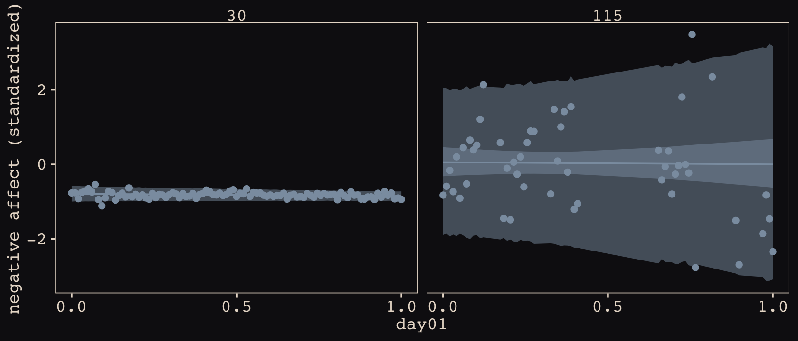

With respect to \(\rho_{31}\), participant 115 showed both a higher
intercept and level of variability toward the beginning of the study.
The meaning of \(\rho_{42}\) is less clear, with these two. But at least
you can get a sense of why you might want to include a \(\eta_1\)
parameter to allow response variability to change over time, and why you
might want to allow that parameter to vary across participants. Whereas
response variability increased quite a bit for participant 115 over
time, it stayed about the same for participant 30, perhaps even
decreasing a bit.

### Time to go multivariate.

For our final stage in this progression, we will fit what
@williamsBayesianMultivariateMixedeffects2019a called a M-MELSM, a
multivariate mixed-effects location scale model. Recall these data have
measures of both negative and positive affect. The standardized values
for PA are waiting for us in the `P_A.std` column. Within the **brms**
framework, this is a combination of sensibilities from Bürkner’s
vignettes on distributional models \[@Bürkner2020Distributional\] and
multivariate models \[@Bürkner2020Multivariate\]. We might express the
statistical model as

$$  $$

where the \(\text{NA}\) and \(\text{PA}\) superscripts indicate which
variable is connected with which parameter. This is a straight
multivariate generalization from the previous model, `fit3`. Now we have
eight parameters varying across participants, resulting in an
\(8 \times 8\) \(\mathbf S\) matrix and an \(8 \times 8\) \(\mathbf R\)
matrix. Here’s the `brms::brm()` code.

``` r
# 3.460296 hours
b14.15 <-
  brm(data = dat,
      family = gaussian,
      bf(mvbind(N_A.std, P_A.std) ~ 1 + day01 + (1 + day01 |i| record_id),
         sigma ~ 1 + day01 + (1 + day01 |i| record_id)) + set_rescor(rescor = FALSE),
      prior = c(prior(normal(0, 0.2), class = Intercept, resp = NAstd),
                prior(normal(0, 1), class = b, resp = NAstd),
                prior(exponential(1), class = sd, resp = NAstd),
                
                prior(normal(0, 1), class = Intercept, dpar = sigma, resp = NAstd),
                prior(normal(0, 1), class = b, dpar = sigma, resp = NAstd),
                prior(exponential(1), class = sd, dpar = sigma, resp = NAstd),
                
                prior(normal(0, 0.2), class = Intercept, resp = PAstd),
                prior(normal(0, 1), class = b, resp = PAstd),
                prior(exponential(1), class = sd, resp = PAstd),
                
                prior(normal(0, 1), class = Intercept, dpar = sigma, resp = PAstd),
                prior(normal(0, 1), class = b, dpar = sigma, resp = PAstd),
                prior(exponential(1), class = sd, dpar = sigma, resp = PAstd),

                prior(lkj(2), class = cor)),
      iter = 3000, warmup = 1000, chains = 4, cores = 4,
      seed = 14,
      file = "/Users/solomonkurz/Dropbox/Recoding Statistical Rethinking 2nd ed/fits/b14.15")
```

Note how we used the `resp` argument to indicate which priors went with
which criterion variables. For the sake of space, I’ll skip showing the
`print()` output. By all means, check that summary out if you fit this
model on your own. Though there may be some substantive insights to
glean from looking at the population-level parameters and the
hierarchical \(\sigma\)s, I’d argue the main action is in the
\(\mathbf R\) matrix. This time we’ll jump straight to showcasing their
posterior means in a correlation matrix plot.

First we
wrangle.

``` r
levels <- c("beta[0]^'NA'", "beta[1]^'NA'", "eta[0]^'NA'", "eta[1]^'NA'",
            "beta[0]^'PA'", "beta[1]^'PA'", "eta[0]^'PA'", "eta[1]^'PA'")

# two different options for ordering the parameters
# levels <- c("beta[0]^'NA'", "beta[1]^'NA'", "beta[0]^'PA'", "beta[1]^'PA'", "eta[0]^'NA'", "eta[1]^'NA'", "eta[0]^'PA'", "eta[1]^'PA'")
# levels <- c("beta[0]^'NA'", "beta[0]^'PA'", "beta[1]^'NA'", "beta[1]^'PA'","eta[0]^'NA'", "eta[0]^'PA'", "eta[1]^'NA'", "eta[1]^'PA'")

r <-
  posterior_summary(b14.15) %>% 
  data.frame() %>% 
  rownames_to_column("param") %>% 
  filter(str_detect(param, "cor_")) %>% 
  mutate(param = str_remove(param, "cor_record_id__")) %>% 
  separate(param, into = c("left", "right"), sep = "__") %>% 
  mutate(
    left = case_when(
      left == "NAstd_Intercept"       ~ "beta[0]^'NA'",
      left == "NAstd_day01"           ~ "beta[1]^'NA'",
      left == "sigma_NAstd_Intercept" ~ "eta[0]^'NA'",
      left == "sigma_NAstd_day01"     ~ "eta[1]^'NA'",
      left == "PAstd_Intercept"       ~ "beta[0]^'PA'",
      left == "PAstd_day01"           ~ "beta[1]^'PA'",
      left == "sigma_PAstd_Intercept" ~ "eta[0]^'PA'",
      left == "sigma_PAstd_day01"     ~ "eta[1]^'PA'"
      ),
    right = case_when(
      right == "NAstd_Intercept"       ~ "beta[0]^'NA'",
      right == "NAstd_day01"           ~ "beta[1]^'NA'",
      right == "sigma_NAstd_Intercept" ~ "eta[0]^'NA'",
      right == "sigma_NAstd_day01"     ~ "eta[1]^'NA'",
      right == "PAstd_Intercept"       ~ "beta[0]^'PA'",
      right == "PAstd_day01"           ~ "beta[1]^'PA'",
      right == "sigma_PAstd_Intercept" ~ "eta[0]^'PA'",
      right == "sigma_PAstd_day01"     ~ "eta[1]^'PA'"
    )
  ) %>% 
  mutate(label = formatC(Estimate, digits = 2, format = "f") %>% str_replace(., "0.", ".")) %>% 
  mutate(left  = factor(left, levels = levels),
         right = factor(right, levels = levels)) %>% 
  mutate(right = fct_rev(right))

r
```

    ##            left        right     Estimate  Est.Error        Q2.5       Q97.5 label
    ## 1  beta[0]^'NA' beta[1]^'NA' -0.293639200 0.08011244 -0.44182538 -0.12977800  -.29
    ## 2  beta[0]^'NA'  eta[0]^'NA'  0.630549464 0.04710695  0.53216975  0.71560820   .63
    ## 3  beta[1]^'NA'  eta[0]^'NA' -0.186177950 0.07788801 -0.33384753 -0.03154498  -.19
    ## 4  beta[0]^'NA'  eta[1]^'NA' -0.149283043 0.10268515 -0.34567389  0.05497218  -.15
    ## 5  beta[1]^'NA'  eta[1]^'NA'  0.576026104 0.09054524  0.38153850  0.73786003   .58
    ## 6   eta[0]^'NA'  eta[1]^'NA' -0.143535384 0.09518244 -0.32873383  0.04559049  -.14
    ## 7  beta[0]^'NA' beta[0]^'PA' -0.096040714 0.07085317 -0.23131868  0.04248907  -.10
    ## 8  beta[1]^'NA' beta[0]^'PA'  0.095280757 0.07593373 -0.05177504  0.24128281   .10
    ## 9   eta[0]^'NA' beta[0]^'PA' -0.272715598 0.06763072 -0.40132179 -0.13887980  -.27
    ## 10  eta[1]^'NA' beta[0]^'PA'  0.066016291 0.09753013 -0.12168034  0.25508209   .07
    ## 11 beta[0]^'NA' beta[1]^'PA'  0.090747367 0.07984696 -0.06944456  0.24633320   .09
    ## 12 beta[1]^'NA' beta[1]^'PA' -0.256178140 0.08425198 -0.41381929 -0.08407010  -.26
    ## 13  eta[0]^'NA' beta[1]^'PA'  0.017989029 0.07644506 -0.13048565  0.16669279   .02
    ## 14  eta[1]^'NA' beta[1]^'PA'  0.066735970 0.11415649 -0.15242112  0.29055349   .07
    ## 15 beta[0]^'PA' beta[1]^'PA' -0.243179375 0.07214914 -0.38091444 -0.09930360  -.24
    ## 16 beta[0]^'NA'  eta[0]^'PA'  0.179895867 0.07284398  0.03218645  0.31925576   .18
    ## 17 beta[1]^'NA'  eta[0]^'PA'  0.004249080 0.08355895 -0.15769813  0.16716190   .00
    ## 18  eta[0]^'NA'  eta[0]^'PA'  0.538683754 0.05507839  0.42269373  0.64081322   .54
    ## 19  eta[1]^'NA'  eta[0]^'PA'  0.017356292 0.10425667 -0.18929856  0.22009184   .02
    ## 20 beta[0]^'PA'  eta[0]^'PA' -0.293076104 0.07067936 -0.42571410 -0.15422281  -.29
    ## 21 beta[1]^'PA'  eta[0]^'PA' -0.117928280 0.08273863 -0.27704116  0.04633652  -.12
    ## 22 beta[0]^'NA'  eta[1]^'PA' -0.007058752 0.21927234 -0.45456002  0.41999508  -.01
    ## 23 beta[1]^'NA'  eta[1]^'PA'  0.022193009 0.22494711 -0.42999230  0.47126246   .02
    ## 24  eta[0]^'NA'  eta[1]^'PA' -0.045575738 0.21552726 -0.47521790  0.39255928  -.05
    ## 25  eta[1]^'NA'  eta[1]^'PA'  0.158556413 0.24596889 -0.37513239  0.58942474   .16
    ## 26 beta[0]^'PA'  eta[1]^'PA'  0.175353825 0.22330743 -0.31931737  0.58769692   .18
    ## 27 beta[1]^'PA'  eta[1]^'PA' -0.143503490 0.23096985 -0.57415506  0.33951409  -.14
    ## 28  eta[0]^'PA'  eta[1]^'PA'  0.054920864 0.22844514 -0.38507267  0.51552836   .05

Now we plot\!

``` r
r %>% 
  full_join(rename(r, right = left, left = right),
            by = c("left", "right", "Estimate", "Est.Error", "Q2.5", "Q97.5", "label")) %>%
  
  ggplot(aes(x = left, y = right)) +
  geom_tile(aes(fill = Estimate)) +
  geom_hline(yintercept = 4.5, color = "#100F14") +
  geom_vline(xintercept = 4.5, color = "#100F14") +
  geom_text(aes(label = label),
            family = "Courier", size = 3) +
  scale_fill_gradient2(expression(rho),
                       low = "#59708b", mid = "#FCF9F0", high = "#A65141", midpoint = 0,
                       labels = c(-1, "", 0, "", 1), limits = c(-1, 1)) +
  scale_x_discrete(NULL, expand = c(0, 0), labels = ggplot2:::parse_safe, position = "top") +
  scale_y_discrete(NULL, expand = c(0, 0), labels = ggplot2:::parse_safe) +
  theme(axis.text = element_text(size = 12),
        axis.ticks = element_blank(),
        legend.text = element_text(hjust = 1))
```

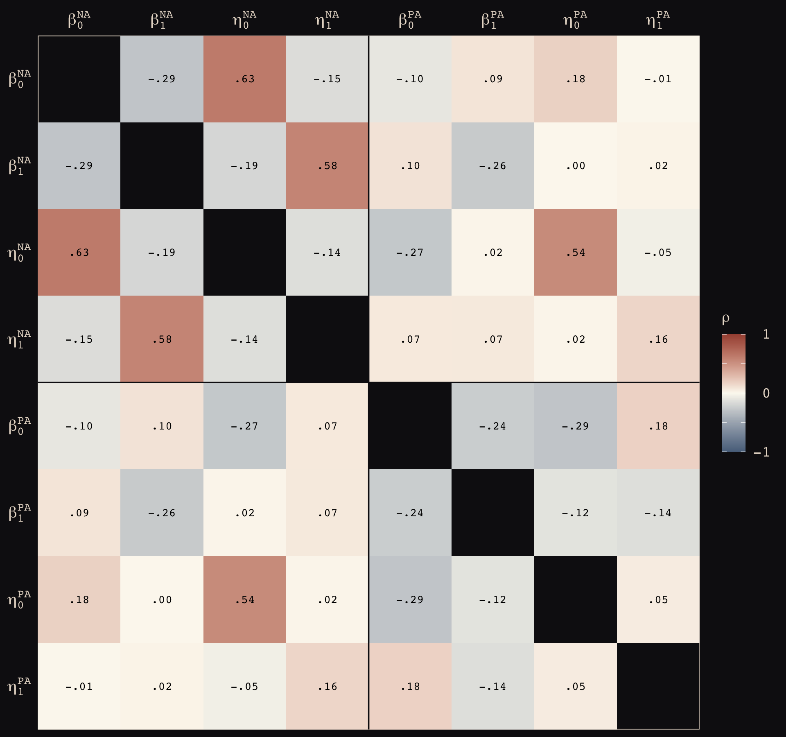

The `full_join()` business just before the **ggplot2** code is how we
got the full \(8 \times 8\) matrix. If you’re curious, see what happens
if you run the code without that part.

To help orient you to the plot, I’ve divided it into four quadrants. The
upper left and lower right quadrants are the correlations among the
varying parameters for the `N_A.std` and `P_A.std` ratings,
respectively. The other two quadrants are the correlations for those
parameters between `N_A.std` and `P_A.std`. As a reminder, this matrix,
as with any other correlation matrix, is symmetrical across the
diagonal.

To my eye, a few things pop out. First, the correlations within
`N_A.std` are generally higher than those within `P_A.std`. Second, the
correlations among the parameters between `N_A.std` and `P_A.std` are
generally higher than those within them. Finally, all three of the
largest correlations have to do with variation in the \(\eta\)
parameters. Two of them are basically the same as those we focused on
for `fit3`. The new one, \(\rho_{73}\), indicates that participants’
baseline ratings for `N_A.std` tended to vary in a similar way as their
baseline ratings for `P_A.std`.

### Plot with uncertainty.

As fond as I am with that last correlation plot, it has a glaring
defect: there is no expression of uncertainty. Sometimes we express
uncertainty with percentile-based intervals. Other times we do so with
marginal densities. But the correlation plots only describe the marginal
posteriors for all the \(\rho\) parameters with their means. No
uncertainty. If you have one or a small few correlations to plot,
coefficient or density plots might do. However, they don’t scale well.
If you don’t believe me, just try. I’m not sure there are any good
solutions to this, but it can be helpful to at least try grappling with
the issue.

Fortunately for us, [Matthew Kay](https://twitter.com/mjskay) (creator
of the [**tidybayes** package](http://mjskay.github.io/tidybayes)) has
already tried his hand at a few approaches. For all the deets, check out
the
[multivariate-regression.md](https://github.com/mjskay/uncertainty-examples/blob/master/multivariate-regression.md)
file in his
[uncertainty-examples](https://github.com/mjskay/uncertainty-examples)
GitHub repo. One of his more imaginative approaches is to use what he
calls dithering. Imagine breaking each of the cells in our correlation
plot, above, into a \(50 \times 50 = 2500\)-cell grid. Now assign each
of the cells within that grid one of the values from the HMC draws of
that correlation’s posterior distribution. Then color code each of those
cells by that value in the same basic way we color coded our previous
correlation plots. Simultaneously do that for all of the correlations
within the \(\mathbf R\) matrix and plot them in a faceted plot. That’s
the essence of the dithering approach. This is all probably hard to make
sense of in words. Hopefully it will all come together with a little
code and the resulting plot. Hold on to your
hat.

``` r
levels <- c("beta[0]^'NA'", "beta[1]^'NA'", "eta[0]^'NA'", "eta[1]^'NA'",
            "beta[0]^'PA'", "beta[1]^'PA'", "eta[0]^'PA'", "eta[1]^'PA'")

r <-
  posterior_samples(b14.15) %>% 
  select(starts_with("cor_")) %>% 
  sample_n(size = 50 * 50) %>% 
  bind_cols(crossing(x = 1:50, y = 1:50)) %>% 
  pivot_longer(-c(x:y)) %>% 
  mutate(name = str_remove(name, "cor_record_id__")) %>% 
  separate(name, into = c("col", "row"), sep = "__") %>% 
  mutate(
    col = case_when(
      col == "NAstd_Intercept"       ~ "beta[0]^'NA'",
      col == "NAstd_day01"           ~ "beta[1]^'NA'",
      col == "sigma_NAstd_Intercept" ~ "eta[0]^'NA'",
      col == "sigma_NAstd_day01"     ~ "eta[1]^'NA'",
      col == "PAstd_Intercept"       ~ "beta[0]^'PA'",
      col == "PAstd_day01"           ~ "beta[1]^'PA'",
      col == "sigma_PAstd_Intercept" ~ "eta[0]^'PA'",
      col == "sigma_PAstd_day01"     ~ "eta[1]^'PA'"
    ),
    row = case_when(
      row == "NAstd_Intercept"       ~ "beta[0]^'NA'",
      row == "NAstd_day01"           ~ "beta[1]^'NA'",
      row == "sigma_NAstd_Intercept" ~ "eta[0]^'NA'",
      row == "sigma_NAstd_day01"     ~ "eta[1]^'NA'",
      row == "PAstd_Intercept"       ~ "beta[0]^'PA'",
      row == "PAstd_day01"           ~ "beta[1]^'PA'",
      row == "sigma_PAstd_Intercept" ~ "eta[0]^'PA'",
      row == "sigma_PAstd_day01"     ~ "eta[1]^'PA'"
    )
  ) %>% 
  mutate(col = factor(col, levels = levels),
         row = factor(row, levels = levels))

r %>% 
  full_join(rename(r, col = row, row = col),
            by = c("x", "y", "col", "row", "value")) %>%
  
  ggplot(aes(x = x, y = y, fill = value)) +
  geom_raster() +
  scale_fill_gradient2(expression(rho),
                       low = "#59708b", mid = "#FCF9F0", high = "#A65141", midpoint = 0,
                       labels = c(-1, "", 0, "", 1), limits = c(-1, 1)) +
  scale_x_continuous(NULL, breaks = NULL, expand = c(0, 0)) +
  scale_y_continuous(NULL, breaks = NULL, expand = c(0, 0)) +
  theme(strip.text = element_text(size = 12)) +
  facet_grid(row~col, labeller = label_parsed, switch = "y")
```

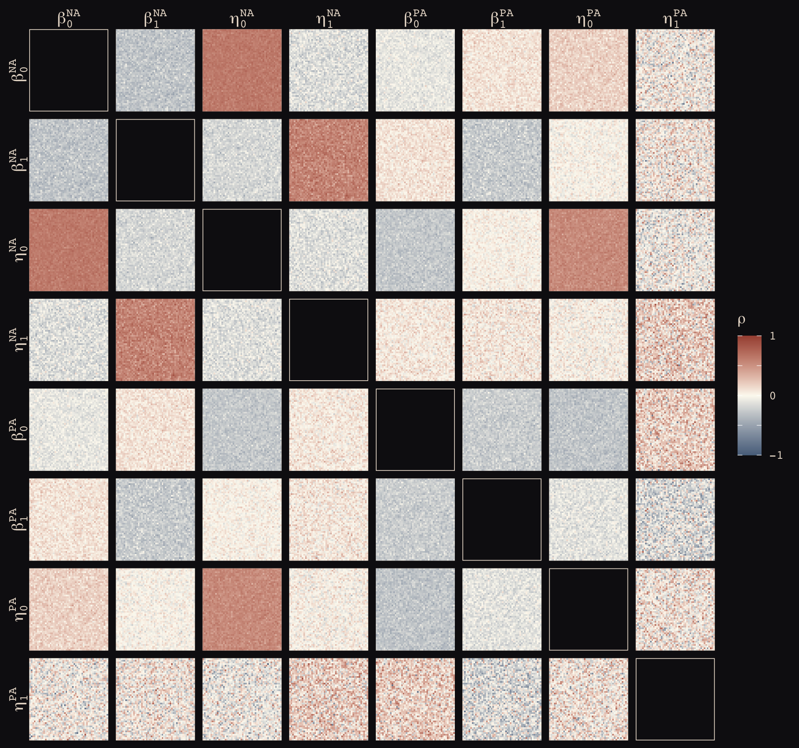

From Kay’s GitHub repo, we read: “This is akin to something like an icon
array. You should still be able to see the average color (thanks to the
human visual system’s ensembling processing), but also get a sense of
the uncertainty by how ‘dithered’ a square looks.” Hopefully this will
give you a little inspiration to find new and better ways to express the
posterior uncertainty in your Bayesian correlation plots. If you come up
with any great solutions, let the rest of us know\!

This section introduced a lot of material. To learn more about the
conventional multilevel growth model and its extensions, check out

  - Singer and Willett’s \[-@singerAppliedLongitudinalData2003\] text,
    [*Applied longitudinal data analysis: Modeling change and event
    occurrence*](https://oxford.universitypressscholarship.com/view/10.1093/acprof:oso/9780195152968.001.0001/acprof-9780195152968);
  - \[My **brms**/**tidyverse** translation of that text, [*Applied
    Longitudinal Data Analysis in brms and the tidyverse
    *](https://bookdown.org/content/4253/); or
  - Hoffman’s \[-@hoffmanLongitudinalAnalysisModeling2015\] text,
    [*Longitudinal analysis: Modeling within-person fluctuation and
    change*](https://www.routledge.com/Longitudinal-Analysis-Modeling-Within-Person-Fluctuation-and-Change/Hoffman/p/book/9780415876025).

To learn more about the MELSM approach and its extensions, check out

  - @hedekerApplicationMixedeffectsLocation2008, [*An application of a
    mixed-effects location scale model for analysis of ecological
    momentary assessment (EMA)
    data*](https://www.ncbi.nlm.nih.gov/pmc/articles/PMC2424261/);
  - @hedekerModelingWithinsubjectVariance2012, [*Modeling between- and
    within-subject variance in ecological momentary assessment (EMA)
    data using mixed-effects location scale
    models*](https://www.ncbi.nlm.nih.gov/pmc/articles/PMC3655706/);
  - Williams’ and colleagues’
    \[-@williamsBayesianMultivariateMixedeffects2019a\] preprint,
    [*Bayesian multivariate mixed-effects location scale modeling of
    longitudinal relations among affective traits, states, and physical
    activity*](https://psyarxiv.com/4kfjp/);
  - Williams’ and colleagues’
    \[@williamsSurfaceUnearthingWithinperson2019\] preprint, [*Beneath
    the surface: Unearthing within-person variability and mean relations
    with Bayesian mixed models*](https://osf.io/gwatq);
  - Williams’ and colleagues’
    \[@williamsBayesianNonlinearMixedeffects2019a\] paper, [*A Bayesian
    nonlinear mixed-effects location scale model for
    learning*](https://doi.org/10.3758/s13428-019-01255-9);
  - Williams’ tutorial blog post, [*A defining feature of cognitive
    interference tasks: Heterogeneous within-person
    variance*](https://donaldrwilliams.github.io/2020/04/04/a-defining-feature-of-cognitive-interference-tasks-heterogeneous-within-person-variance/).

From a **brms** standpoint, it might also be helpful to brush up on

  - Bürkner’s \[-@Bürkner2020Distributional\] vignette, [*Estimating
    distributional models with
    brms*](https://CRAN.R-project.org/package=brms/vignettes/brms_distreg.html)
    and
  - Bürkner’s \[-@Bürkner2020Multivariate\] vignette, [*Estimating
    multivariate models with
    brms*](https://CRAN.R-project.org/package=brms/vignettes/brms_multivariate.html).

## Session info

``` r
sessionInfo()
```

    ## R version 3.6.3 (2020-02-29)
    ## Platform: x86_64-apple-darwin15.6.0 (64-bit)
    ## Running under: macOS Catalina 10.15.3
    ## 
    ## Matrix products: default
    ## BLAS:   /Library/Frameworks/R.framework/Versions/3.6/Resources/lib/libRblas.0.dylib
    ## LAPACK: /Library/Frameworks/R.framework/Versions/3.6/Resources/lib/libRlapack.dylib
    ## 
    ## locale:
    ## [1] en_US.UTF-8/en_US.UTF-8/en_US.UTF-8/C/en_US.UTF-8/en_US.UTF-8
    ## 
    ## attached base packages:
    ## [1] parallel  stats     graphics  grDevices utils     datasets  methods   base     
    ## 
    ## other attached packages:
    ##  [1] ape_5.4              ggtree_2.3.3.993     rethinking_2.01      ggdag_0.2.2          posterior_0.1.0     
    ##  [6] bayesplot_1.7.1      patchwork_1.0.1      brms_2.13.0          Rcpp_1.0.5           tidybayes_2.1.1     
    ## [11] dagitty_0.2-2        rstan_2.19.3         StanHeaders_2.21.0-1 dutchmasters_0.1.0   forcats_0.5.0       
    ## [16] stringr_1.4.0        dplyr_1.0.1          purrr_0.3.4          readr_1.3.1          tidyr_1.1.1         
    ## [21] tibble_3.0.3         ggplot2_3.3.2        tidyverse_1.3.0     
    ## 
    ## loaded via a namespace (and not attached):
    ##   [1] readxl_1.3.1         backports_1.1.8      plyr_1.8.6           igraph_1.2.5         lazyeval_0.2.2      
    ##   [6] splines_3.6.3        svUnit_1.0.3         crosstalk_1.1.0.1    TH.data_1.0-10       rstantools_2.0.0    
    ##  [11] inline_0.3.15        digest_0.6.25        htmltools_0.4.0      viridis_0.5.1        rsconnect_0.8.16    
    ##  [16] fansi_0.4.1          magrittr_1.5         checkmate_2.0.0      graphlayouts_0.7.0   modelr_0.1.6        
    ##  [21] matrixStats_0.56.0   xts_0.12-0           sandwich_2.5-1       prettyunits_1.1.1    colorspace_1.4-1    
    ##  [26] ggrepel_0.8.2        rvest_0.3.5          ggdist_2.1.1         haven_2.2.0          xfun_0.13           
    ##  [31] hexbin_1.28.1        callr_3.4.3          crayon_1.3.4         jsonlite_1.7.0       survival_3.1-12     
    ##  [36] zoo_1.8-7            glue_1.4.1           polyclip_1.10-0      gtable_0.3.0         emmeans_1.4.5       
    ##  [41] V8_3.0.2             pkgbuild_1.1.0       shape_1.4.4          abind_1.4-5          scales_1.1.1        
    ##  [46] mvtnorm_1.1-0        DBI_1.1.0            miniUI_0.1.1.1       viridisLite_0.3.0    xtable_1.8-4        
    ##  [51] HDInterval_0.2.0     tidytree_0.3.3       stats4_3.6.3         DT_0.13              htmlwidgets_1.5.1   
    ##  [56] httr_1.4.1           threejs_0.3.3        arrayhelpers_1.1-0   ellipsis_0.3.1       pkgconfig_2.0.3     
    ##  [61] loo_2.2.0            farver_2.0.3         dbplyr_1.4.2         utf8_1.1.4           tidyselect_1.1.0    
    ##  [66] labeling_0.3         rlang_0.4.7          reshape2_1.4.4       later_1.0.0          munsell_0.5.0       
    ##  [71] cellranger_1.1.0     tools_3.6.3          cli_2.0.2            generics_0.0.2       broom_0.5.5         
    ##  [76] ggridges_0.5.2       evaluate_0.14        fastmap_1.0.1        yaml_2.2.1           processx_3.4.3      
    ##  [81] knitr_1.28           fs_1.4.1             tidygraph_1.2.0      ggraph_2.0.3         nlme_3.1-144        
    ##  [86] mime_0.9             aplot_0.0.5          xml2_1.3.1           compiler_3.6.3       shinythemes_1.1.2   
    ##  [91] rstudioapi_0.11      curl_4.3             treeio_1.13.1        reprex_0.3.0         tweenr_1.0.1        
    ##  [96] stringi_1.4.6        ps_1.3.3             Brobdingnag_1.2-6    lattice_0.20-38      Matrix_1.2-18       
    ## [101] markdown_1.1         shinyjs_1.1          vctrs_0.3.2          pillar_1.4.6         lifecycle_0.2.0     
    ## [106] BiocManager_1.30.10  bridgesampling_1.0-0 estimability_1.3     httpuv_1.5.2         R6_2.4.1            
    ## [111] promises_1.1.0       gridExtra_2.3        codetools_0.2-16     boot_1.3-24          colourpicker_1.0    
    ## [116] MASS_7.3-51.5        gtools_3.8.2         assertthat_0.2.1     withr_2.2.0          shinystan_2.5.0     
    ## [121] multcomp_1.4-13      hms_0.5.3            grid_3.6.3           coda_0.19-3          rvcheck_0.1.8       
    ## [126] rmarkdown_2.1        ggforce_0.3.1        shiny_1.4.0.2        lubridate_1.7.8      base64enc_0.1-3     
    ## [131] dygraphs_1.1.1.6
