Ch 15. Missing Data and Other Opportunities
================
A Solomon Kurz
2020-10-31

# Missing Data and Other Opportunities

For the opening example, we’re playing with the conditional probability

\[
\text{Pr(burnt down | burnt up)} = \frac{\text{Pr(burnt up, burnt down)}}{\text{Pr(burnt up)}}.
\]

Given McElreath’s setup, it works out that

\[
\text{Pr(burnt down | burnt up)} = \frac{1/3}{1/2} = \frac{2}{3}.
\]

We might express the math toward the bottom of page 489 in tibble form
like this.

``` r
library(tidyverse)

p_pancake <- 1/3
(
  d <-
    tibble(pancake = c("BB", "BU", "UU"),
           p_burnt = c(1, .5, 0)) %>% 
    mutate(p_burnt_up = p_burnt * p_pancake)
)
```

    ## # A tibble: 3 x 3
    ##   pancake p_burnt p_burnt_up
    ##   <chr>     <dbl>      <dbl>
    ## 1 BB          1        0.333
    ## 2 BU          0.5      0.167
    ## 3 UU          0        0

``` r
d %>% 
  summarise(`p (burnt_down | burnt_up)` = p_pancake / sum(p_burnt_up))
```

    ## # A tibble: 1 x 1
    ##   `p (burnt_down | burnt_up)`
    ##                         <dbl>
    ## 1                       0.667

I understood McElreath’s simulation (**R** code 15.1) better after
breaking it apart. The first part of `sim_pancake()` takes one random
draw from the integers 1, 2, and 3. It just so happens that if we set
`set.seed(1)`, the code returns a 1.

``` r
set.seed(1)
sample(x = 1:3, size = 1)
```

    ## [1] 1

So here’s what it looks like if we use seeds `2:11`.

``` r
take_sample <- function(seed) {
  set.seed(seed)
  sample(x = 1:3, size = 1)
}
tibble(seed = 2:11) %>% 
  mutate(value_returned = map_dbl(seed, take_sample))
```

    ## # A tibble: 10 x 2
    ##     seed value_returned
    ##    <int>          <dbl>
    ##  1     2              1
    ##  2     3              1
    ##  3     4              3
    ##  4     5              2
    ##  5     6              1
    ##  6     7              2
    ##  7     8              3
    ##  8     9              3
    ##  9    10              3
    ## 10    11              2

Each of those `value_returned` values stands for one of the three
pancakes: 1 = BB, 2 = BU, and 3 = UU. In the next line, McElreath made
slick use of a matrix to specify that. Here’s what the matrix looks
like.

``` r
matrix(c(1, 1, 1, 0, 0, 0), nrow = 2, ncol = 3)
```

    ##      [,1] [,2] [,3]
    ## [1,]    1    1    0
    ## [2,]    1    0    0

See how the three columns are identified as `[,1]`, `[,2]`, and `[,3]`?
If, say, we wanted to subset the values in the second column, we’d
execute

``` r
matrix(c(1, 1, 1, 0, 0, 0), nrow = 2, ncol = 3)[, 2]
```

    ## [1] 1 0

which returns a numeric vector.

``` r
matrix(c(1, 1, 1, 0, 0, 0), nrow = 2, ncol = 3)[, 2] %>% str()
```

    ##  num [1:2] 1 0

That `1 0` corresponds to the pancake with one burnt (i.e., 1) and one
unburnt (i.e., 0) side. So when McElreath then executed `sample(sides)`,
he randomly sampled from one of those two values. In the case of
`pancake == 2`, he randomly sampled one the pancake with one burnt and
one unburnt side. Had he sampled from `pancake == 1`, he would have
sampled from the pancake with both sides burnt.

Going forward, let’s amend McElreath’s `sim_pancake()` function so it
will take a `seed` argument, which will allow us to make the output
reproducible.

``` r
# simulate a `pancake` and return randomly ordered `sides`
sim_pancake <- function(seed) {
  
  set.seed(seed)
  
  pancake <- sample(x = 1:3, size = 1)
  sides   <- matrix(c(1, 1, 1, 0, 0, 0), nrow = 2, ncol = 3)[, pancake]
  sample(sides)
  
}
```

Let’s take this baby for a whirl.

``` r
# how many simulations would you like?

n_sim <- 1e4
d <-
  tibble(seed = 1:n_sim) %>% 
  mutate(burnt = map(seed, sim_pancake)) %>% 
  unnest(burnt) %>% 
  mutate(side = rep(c("up", "down"), times = n() / 2))
```

Take a look at what we’ve done.

``` r
head(d, n = 10)
```

    ## # A tibble: 10 x 3
    ##     seed burnt side 
    ##    <int> <dbl> <chr>
    ##  1     1     1 up   
    ##  2     1     1 down 
    ##  3     2     1 up   
    ##  4     2     1 down 
    ##  5     3     1 up   
    ##  6     3     1 down 
    ##  7     4     0 up   
    ##  8     4     0 down 
    ##  9     5     1 up   
    ## 10     5     0 down

Now we use `pivot_wider()` and `summarise()` to get the value we’ve been
working for.

``` r
d %>% 
  pivot_wider(names_from = side, values_from = burnt) %>% 
  summarise(`p (burnt_down | burnt_up)` = sum(up == 1 & down == 1) / (sum(up)))
```

    ## # A tibble: 1 x 1
    ##   `p (burnt_down | burnt_up)`
    ##                         <dbl>
    ## 1                       0.658

The results are within rounding error of the ideal 2/3.

> Probability theory is not difficult mathematically. It is just
> counting. But it is hard to interpret and apply. Doing so often seems
> to require some cleverness, and authors have an incentive to solve
> problems in clever ways, just to show off. But we don’t need that
> cleverness, if we ruthlessly apply conditional probability….
> 
> In this chapter, \[we’ll\] meet two commonplace applications of this
> assume-and-deduce strategy. The first is the incorporation of
> **measurement error** into our models. The second is the estimation of
> **missing data** through **Bayesian imputation**….
> 
> In neither application do \[we\] have to intuit the consequences of
> measurement errors nor the implications of missing values in order to
> design the models. All \[we\] have to do is state your information
> about the error or about the variables with missing values. Logic does
> the rest. (McElreath,
> [2020](#ref-mcelreathStatisticalRethinkingBayesian2020), p. 490,
> **emphasis** in the original)

## Measurement error

Let’s grab those `WaffleDivorce` data from back in \[Chapter
5\]\[Spurious associations\].

``` r
data(WaffleDivorce, package = "rethinking")
d <- WaffleDivorce
rm(WaffleDivorce)
```

In anticipation of **R** code 15.3 and 15.5, wrangle the data a little.

``` r
d <-
  d %>% 
  mutate(D_obs = (Divorce - mean(Divorce)) / sd(Divorce),
         D_sd  = Divorce.SE / sd(Divorce),
         M     = (Marriage - mean(Marriage)) / sd(Marriage),
         A     = (MedianAgeMarriage - mean(MedianAgeMarriage)) / sd(MedianAgeMarriage),
         M_obs = M,
         M_sd  = Marriage.SE / sd(Marriage))
```

For the plots in this chapter, we’ll use the dark themes from the
[**ggdark** package](https://CRAN.R-project.org/package=ggdark)
(<span class="citeproc-not-found" data-reference-id="R-ggdark">**???**</span>).
Our primary theme will be `ggdark::dark_theme_bw()`. One way to use the
`dark_theme_bw()` function is to make it part of the code for an
individual plot, such as `ggplot() + geom_point() + dark_theme_bw()`.
Another way is to make `dark_theme_bw()` the default setting with
`ggplot2::theme_set()`. That will be our method.

``` r
library(ggdark)

theme_set(
  dark_theme_bw() +
    theme(legend.position = "none",
          panel.grid = element_blank())
  )

# to reset the default ggplot2 theme to its default parameters,
# execute `ggplot2::theme_set(theme_gray())` and `ggdark::invert_geom_defaults()`
```

For the rest of our color palette, we’ll use colors from the
[**viridis** package](https://github.com/sjmgarnier/viridis)
(<span class="citeproc-not-found" data-reference-id="R-viridis">**???**</span>),
which provides a variety of colorblind-safe color palettes (see
<span class="citeproc-not-found" data-reference-id="rudisViridisColorPalettes2018">**???**</span>).

``` r
# install.packages("viridis")
library(viridis)
```

The `viridis_pal()` function gives a list of colors within a given
palette. The colors in each palette fall on a spectrum. Within
`viridis_pal()`, the `option` argument allows one to select a given
spectrum, “C”, in our case. The final parentheses, `()`, allows one to
determine how many discrete colors one would like to break the spectrum
up by. We’ll choose 7.

``` r
viridis_pal(option = "C")(7)
```

    ## [1] "#0D0887FF" "#5D01A6FF" "#9C179EFF" "#CC4678FF" "#ED7953FF" "#FDB32FFF" "#F0F921FF"

With a little data wrangling, we can put the colors of our palette in a
tibble and display them in a plot.

``` r
tibble(factor       = "a",
       number       = factor(1:7),
       color_number = str_c(1:7, ". ", viridis_pal(option = "C")(7))) %>% 
  
  ggplot(aes(x = factor, y = number)) +
  geom_tile(aes(fill  = number)) +
  geom_text(aes(color = number, label = color_number)) +
  scale_color_manual(values = c(rep("black", times = 4), 
                                rep("white", times = 3))) +
  scale_fill_viridis(option = "C", discrete = T, direction = -1) +
  scale_x_discrete(NULL, breaks = NULL, expand = c(0, 0)) +
  scale_y_discrete(NULL, breaks = NULL, expand = c(0, 0)) +
  ggtitle("Behold: viridis C!")
```

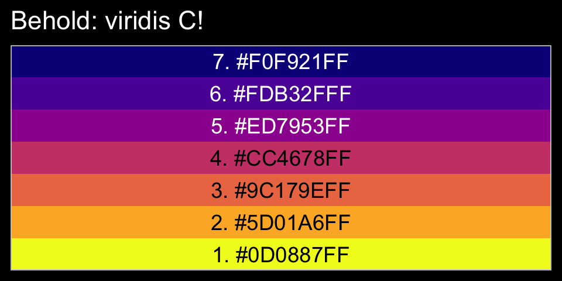

Now, let’s make use of our custom theme and reproduce/reimagine Figure
15.1.a.

``` r
color <- viridis_pal(option = "C")(7)[7]

p1 <-
  d %>%
  ggplot(aes(x = MedianAgeMarriage, 
             y = Divorce,
             ymin = Divorce - Divorce.SE, 
             ymax = Divorce + Divorce.SE)) +
  geom_pointrange(shape = 20, alpha = 2/3, color = color) +
  labs(x = "Median age marriage" , 
       y = "Divorce rate")
```

Notice how `viridis_pal(option = "C")(7)[7]` called the seventh color in
the color scheme, `"#F0F921FF"`. For Figure 15.1.b, we’ll select the
sixth color in the palette by coding `viridis_pal(option = "C")(7)[6]`.
We’ll then combine the two subplots with patchwork.

``` r
color <- viridis_pal(option = "C")(7)[6]

p2 <-
  d %>%
  ggplot(aes(x = log(Population), 
             y = Divorce,
             ymin = Divorce - Divorce.SE, 
             ymax = Divorce + Divorce.SE)) +
  geom_pointrange(shape = 20, alpha = 2/3, color = color) +
  scale_y_continuous(NULL, breaks = NULL) +
  xlab("log population")

library(patchwork)
p1 | p2
```

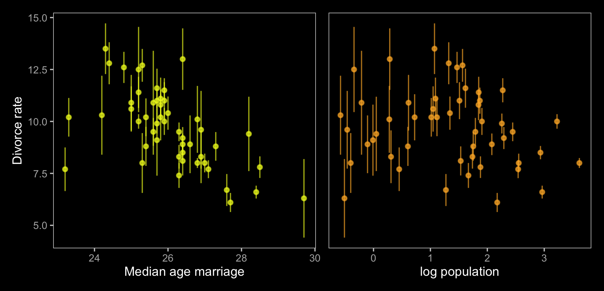

Just like in the text, our plot shows states with larger populations
tend to have smaller measurement error. The relation between measurement
error and `MedianAgeMarriage` is less apparent.

#### Rethinking: Generative thinking, Bayesian inference.

> Bayesian models are *generative*, meaning they can be used to simulate
> observations just as well as they can be used to estimate parameters.
> One benefit of this fact is that a statistical model can be developed
> by thinking hard about how the data might have arisen. This includes
> sampling and measurement, as well as the nature of the process we are
> studying. Then let Bayesian updating discover the implications.
> (p. 491, *emphasis* in the original)

### Error on the outcome.

Now make a DAG of our data with **ggdag**.

``` r
library(ggdag)

dag_coords <-
  tibble(name = c("A", "M", "D", "Dobs", "eD"),
         x    = c(1, 2, 2, 3, 4),
         y    = c(2, 3, 1, 1, 1))

dagify(M    ~ A,
       D    ~ A + M,
       Dobs ~ D + eD,
       coords = dag_coords) %>%
  tidy_dagitty() %>% 
  mutate(color = ifelse(name %in% c("D", "eD"), "a", "b")) %>% 
  
  ggplot(aes(x = x, y = y, xend = xend, yend = yend)) +
  geom_dag_point(aes(color = color),
                 size = 10, show.legend = F) +
  geom_dag_text(parse = T, label = c("A", "D", "M", expression(italic(e)[D]), expression(D[obs]))) +
  geom_dag_edges(edge_colour = "#FCF9F0") +
  scale_color_manual(values = c(viridis_pal(option = "C")(7)[2], "black")) +
  dark_theme_void()
```

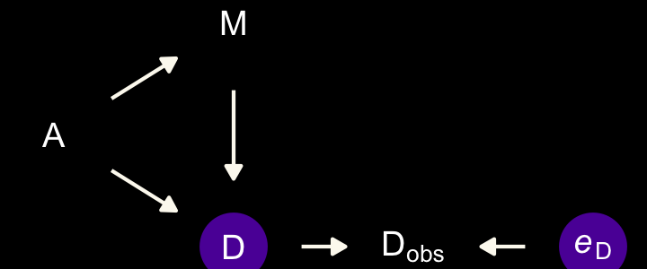

Note our use of the `dark_theme_void()` function. But more to the
substance of the matter,

> there’s a lot going on here. But we can proceed one step at a time.
> The left triangle of this DAG is the same system that we worked with
> back in \[Chapter 5\]\[Think before you regress.\]. Age at marriage
> (\(A\)) influences divorce (\(D\)) both directly and indirectly,
> passing through marriage rate (\(M\)). Then we have the observation
> model. The true divorce rate \(D\) cannot be observed, so it is
> circled as an unobserved node. However we do get to observe
> \(D_\text{obs}\), which is a function of both the true rate \(D\) and
> some unobserved error \(e_\text{D}\). (p. 492)

To get a better sense of what we’re about to do, imagine for a moment
that each state’s divorce rate is normally distributed with a mean of
`Divorce` and standard deviation `Divorce.SE`. Those distributions would
be like this.

``` r
d %>% 
  mutate(Divorce_distribution = str_c("Divorce ~ Normal(", Divorce, ", ", Divorce.SE, ")")) %>% 
  select(Loc, Divorce_distribution) %>% 
  head()
```

    ##   Loc         Divorce_distribution
    ## 1  AL Divorce ~ Normal(12.7, 0.79)
    ## 2  AK Divorce ~ Normal(12.5, 2.05)
    ## 3  AZ Divorce ~ Normal(10.8, 0.74)
    ## 4  AR Divorce ~ Normal(13.5, 1.22)
    ## 5  CA    Divorce ~ Normal(8, 0.24)
    ## 6  CO Divorce ~ Normal(11.6, 0.94)

> Here’s how to define the error distribution for each divorce rate. For
> each observed value \(D_{\text{OBS},i}\), there will be one parameter,
> \(D_{\text{TRUE},i}\), defined by:
> 
> \[D_{\text{OBS},i} \sim \operatorname{Normal}(D_{\text{TRUE},i}, D_{\text{SE},i})\]
> 
> All this does is define the measurement \(D_{\text{OBS},i}\) as having
> the specified Gaussian distribution centered on the unknown parameter
> \(D_{\text{TRUE},i}\). So the above defines a probability for each
> State \(i\)’s observed divorce rate, given a known measurement error.
> (p. 493)

Our model will follow the form

\[
\begin{align*}
\color{#5D01A6FF}{\text{Divorce}_{\text{OBS}, i}} & \color{#5D01A6FF}\sim \color{#5D01A6FF}{\operatorname{Normal}(\text{Divorce}_{\text{TRUE}, i}, \text{Divorce}_{\text{SE}, i})} \\
\color{#5D01A6FF}{\text{Divorce}_{\text{TRUE}, i}} & \sim \operatorname{Normal}(\mu_i, \sigma) \\
\mu     & = \alpha + \beta_1 \text A_i + \beta_2 \text M_i \\
\alpha  & \sim \operatorname{Normal}(0, 0.2) \\
\beta_1 & \sim \operatorname{Normal}(0, 0.5) \\
\beta_2 & \sim \operatorname{Normal}(0, 0.5) \\
\sigma  & \sim \operatorname{Exponential}(1).
\end{align*}
\]

Fire up **brms**.

``` r
library(brms)
```

With **brms**, we accommodate measurement error in the criterion using
the `mi()` syntax, following the general form `<response> |
mi(<se_response>)`. This follows a missing data logic, resulting in
Bayesian missing data imputation for the criterion values. The `mi()`
syntax is based on the missing data capabilities for **brms**, which we
will cover in greater detail in the second half of this chapter.

``` r
# put the data into a `list()`
dlist <- list(
  D_obs = d$D_obs,
  D_sd  = d$D_sd,
  M     = d$M,
  A     = d$A)

b15.1 <- 
  brm(data = dlist, 
      family = gaussian,
      D_obs | mi(D_sd) ~ 1 + A + M,
      prior = c(prior(normal(0, 0.2), class = Intercept),
                prior(normal(0, 0.5), class = b),
                prior(exponential(1), class = sigma)),
      iter = 2000, warmup = 1000, cores = 4, chains = 4,
      seed = 15,
      # note this line
      save_mevars = TRUE,
      file = "/Users/solomonkurz/Dropbox/Recoding Statistical Rethinking 2nd ed/fits/b15.01")
```

Check the model summary.

``` r
print(b15.1)
```

    ##  Family: gaussian 
    ##   Links: mu = identity; sigma = identity 
    ## Formula: D_obs | mi(D_sd) ~ 1 + A + M 
    ##    Data: dlist (Number of observations: 50) 
    ## Samples: 4 chains, each with iter = 2000; warmup = 1000; thin = 1;
    ##          total post-warmup samples = 4000
    ## 
    ## Population-Level Effects: 
    ##           Estimate Est.Error l-95% CI u-95% CI Rhat Bulk_ESS Tail_ESS
    ## Intercept    -0.06      0.10    -0.23     0.14 1.00     5130     3528
    ## A            -0.61      0.16    -0.92    -0.31 1.00     3953     3313
    ## M             0.05      0.17    -0.28     0.38 1.00     3801     2979
    ## 
    ## Family Specific Parameters: 
    ##       Estimate Est.Error l-95% CI u-95% CI Rhat Bulk_ESS Tail_ESS
    ## sigma     0.58      0.11     0.39     0.81 1.00     1615     1962
    ## 
    ## Samples were drawn using sampling(NUTS). For each parameter, Bulk_ESS
    ## and Tail_ESS are effective sample size measures, and Rhat is the potential
    ## scale reduction factor on split chains (at convergence, Rhat = 1).

To return the summaries for the `D_true[i]` parameters, you might
execute `posterior_summary(b15.1)` or `b15.1$fit`. Here we’ll use the
`broom::tidy()` method, instead.

``` r
library(broom)

tidy(b15.1, prob = .89) %>%
  mutate_if(is.numeric, round, digits = 2)
```

    ##           term estimate std.error  lower  upper
    ## 1  b_Intercept    -0.06      0.10  -0.21   0.10
    ## 2          b_A    -0.61      0.16  -0.86  -0.36
    ## 3          b_M     0.05      0.17  -0.22   0.31
    ## 4        sigma     0.58      0.11   0.42   0.76
    ## 5        Yl[1]     1.16      0.36   0.58   1.75
    ## 6        Yl[2]     0.69      0.57  -0.21   1.58
    ## 7        Yl[3]     0.42      0.34  -0.12   0.96
    ## 8        Yl[4]     1.42      0.48   0.65   2.22
    ## 9        Yl[5]    -0.90      0.13  -1.10  -0.69
    ## 10       Yl[6]     0.65      0.40   0.04   1.30
    ## 11       Yl[7]    -1.37      0.35  -1.93  -0.82
    ## 12       Yl[8]    -0.35      0.49  -1.13   0.42
    ## 13       Yl[9]    -1.89      0.59  -2.81  -0.95
    ## 14      Yl[10]    -0.62      0.16  -0.88  -0.37
    ## 15      Yl[11]     0.77      0.29   0.31   1.22
    ## 16      Yl[12]    -0.55      0.48  -1.33   0.18
    ## 17      Yl[13]     0.17      0.49  -0.64   0.94
    ## 18      Yl[14]    -0.87      0.22  -1.23  -0.52
    ## 19      Yl[15]     0.55      0.29   0.09   1.03
    ## 20      Yl[16]     0.29      0.37  -0.31   0.87
    ## 21      Yl[17]     0.50      0.43  -0.17   1.17
    ## 22      Yl[18]     1.25      0.35   0.71   1.80
    ## 23      Yl[19]     0.42      0.39  -0.18   1.06
    ## 24      Yl[20]     0.40      0.54  -0.42   1.28
    ## 25      Yl[21]    -0.55      0.32  -1.05  -0.03
    ## 26      Yl[22]    -1.10      0.25  -1.50  -0.70
    ## 27      Yl[23]    -0.27      0.26  -0.68   0.14
    ## 28      Yl[24]    -1.00      0.29  -1.47  -0.53
    ## 29      Yl[25]     0.42      0.41  -0.22   1.09
    ## 30      Yl[26]    -0.03      0.31  -0.52   0.47
    ## 31      Yl[27]    -0.01      0.50  -0.82   0.81
    ## 32      Yl[28]    -0.15      0.38  -0.78   0.45
    ## 33      Yl[29]    -0.27      0.50  -1.06   0.51
    ## 34      Yl[30]    -1.80      0.23  -2.18  -1.43
    ## 35      Yl[31]     0.17      0.43  -0.53   0.87
    ## 36      Yl[32]    -1.66      0.16  -1.92  -1.39
    ## 37      Yl[33]     0.12      0.24  -0.27   0.51
    ## 38      Yl[34]    -0.05      0.51  -0.88   0.75
    ## 39      Yl[35]    -0.13      0.23  -0.49   0.24
    ## 40      Yl[36]     1.28      0.40   0.65   1.92
    ## 41      Yl[37]     0.23      0.34  -0.31   0.79
    ## 42      Yl[38]    -1.02      0.22  -1.38  -0.66
    ## 43      Yl[39]    -0.93      0.54  -1.77  -0.03
    ## 44      Yl[40]    -0.68      0.31  -1.17  -0.18
    ## 45      Yl[41]     0.25      0.54  -0.62   1.14
    ## 46      Yl[42]     0.73      0.35   0.19   1.29
    ## 47      Yl[43]     0.19      0.18  -0.09   0.49
    ## 48      Yl[44]     0.80      0.43   0.10   1.47
    ## 49      Yl[45]    -0.40      0.54  -1.26   0.46
    ## 50      Yl[46]    -0.39      0.26  -0.81   0.02
    ## 51      Yl[47]     0.14      0.31  -0.35   0.62
    ## 52      Yl[48]     0.55      0.47  -0.20   1.28
    ## 53      Yl[49]    -0.64      0.28  -1.09  -0.20
    ## 54      Yl[50]     0.85      0.60  -0.12   1.83
    ## 55        lp__   -78.11      6.47 -89.01 -68.05

Our rows `Yl[1]` through `Yl[50]` correspond to what **rethinking**
named `D_true[1]` through `D_true[50]`. Here’s the code for our Figure
15.2.a.

``` r
library(ggrepel)

states <- c("AL", "AR", "ME", "NH", "RI", "DC", "VT", "AK", "SD", "UT", "ID", "ND", "WY")

d_est <-
  tidy(b15.1) %>% 
  mutate(D_est = estimate) %>% 
  select(term, D_est) %>% 
  filter(str_detect(term, "Yl")) %>% 
  bind_cols(d)

color <- viridis_pal(option = "C")(7)[5]

p1 <-
  d_est %>%
  ggplot(aes(x = D_sd, y = D_est - D_obs)) +
  geom_hline(yintercept = 0, linetype = 2, color = "white") +
  geom_point(alpha = 2/3, color = color) +
  geom_text_repel(data = . %>% filter(Loc %in% states),  
                  aes(label = Loc), 
                  size = 3, seed = 15, color = "white") 
```

We’ll use a little `posterior_samples()` + `expand()` magic to help with
our version of Figure 15.2.b.

``` r
library(tidybayes)

states <- c("AR", "ME", "RI", "ID", "WY", "ND", "MN")

color <- viridis_pal(option = "C")(7)[4]

p2 <-
  posterior_samples(b15.1) %>% 
  expand(nesting(b_Intercept, b_A),
         A = seq(from = -3.5, to = 3.5, length.out = 50)) %>% 
  mutate(fitted = b_Intercept + b_A * A) %>% 
  
  ggplot(aes(x = A)) +
  stat_lineribbon(aes(y = fitted),
                  .width = .95, size = 1/3, color = "grey50", fill = "grey20") +
  geom_segment(data = d_est,
               aes(xend = A,
                   y = D_obs, yend = D_est),
               size = 1/5) +
  geom_point(data = d_est,
             aes(y = D_obs),
             color = color) +
  geom_point(data = d_est,
             aes(y = D_est),
             shape = 1, stroke = 1/3) +
  geom_text_repel(data = d %>% filter(Loc %in% states),  
                  aes(y = D_obs, label = Loc), 
                  size = 3, seed = 15, color = "white") +
  labs(x = "median age marriage (std)",
       y = "divorce rate (std)") +
  coord_cartesian(xlim = range(d$A), 
                  ylim = range(d$D_obs))
```

Now combine the two ggplots and plot.

``` r
p1 | p2
```

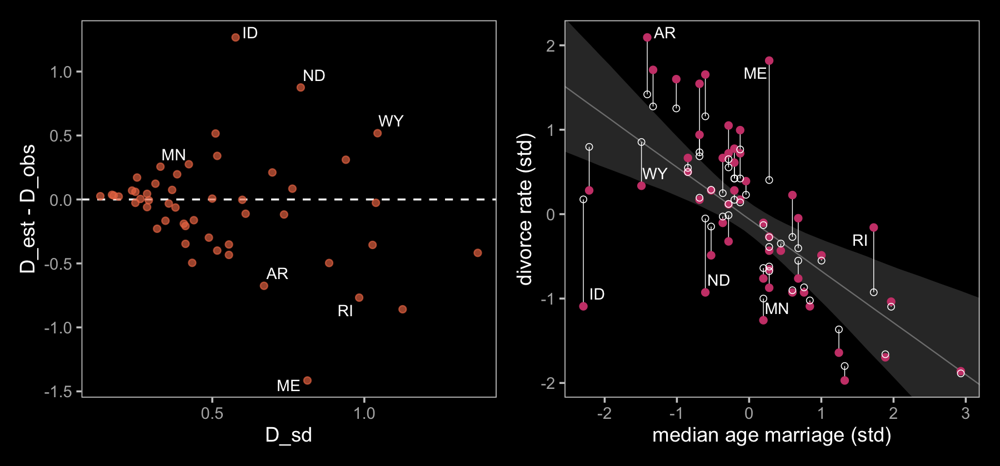

If you look closely, our plot on the left is flipped relative to the one
in the text. I’m pretty sure my code is correct, which leaves me to
believe McElreath accidentally flipped the ordering in his code and made
his \(y\)-axis ‘D\_obs - D\_est.’ Happily, our plot on the right matches
up nicely with the one in the text.

### Error on both outcome and predictor.

Now we update the DAG to account for measurement error in the predictor.

``` r
dag_coords <-
  tibble(name = c("A", "M", "Mobs", "eM", "D", "Dobs", "eD"),
         x    = c(1, 2, 3, 4, 2, 3, 4),
         y    = c(2, 3, 3, 3, 1, 1, 1))

dagify(M    ~ A,
       D    ~ A + M,
       Mobs ~ M + eM,
       Dobs ~ D + eD,
       coords = dag_coords) %>%
  tidy_dagitty() %>% 
  mutate(color = ifelse(name %in% c("A", "Mobs", "Dobs"), "b", "a")) %>% 
  
  ggplot(aes(x = x, y = y, xend = xend, yend = yend)) +
  geom_dag_point(aes(color = color),
                 size = 10, show.legend = F) +
  geom_dag_text(parse = T, label = c("A", "D", "M", 
                                     expression(italic(e)[D]), expression(italic(e)[M]), 
                                     expression(D[obs]), expression(M[obs]))) +
  geom_dag_edges(edge_colour = "#FCF9F0") +
  scale_color_manual(values = c(viridis_pal(option = "C")(7)[2], "black")) +
  dark_theme_void()
```

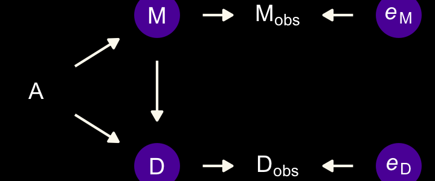

We will express this DAG in an augmented statistical model following the
form

\[
\begin{align*}
\text{Divorce}_{\text{OBS}, i}  & \sim \operatorname{Normal}(\text{Divorce}_{\text{TRUE}, i}, \text{Divorce}_{\text{SE}, i}) \\
\text{Divorce}_{\text{TRUE}, i} & \sim \operatorname{Normal}(\mu_i, \sigma) \\
\mu_i & = \alpha + \beta_1 \text A_i + \beta_2 \color{#5D01A6FF}{\text{Marriage}_{\text{TRUE}, i}} \\
\color{#5D01A6FF}{\text{Marriage}_{\text{OBS}, i}} & \color{#5D01A6FF}\sim \color{#5D01A6FF}{\operatorname{Normal}(\text{Marriage}_{\text{TRUE}, i}, \text{Marriage}_{\text{SE}, i})} \\
\color{#5D01A6FF}{\text{Marriage}_{\text{TRUE}, i}} & \color{#5D01A6FF}\sim \color{#5D01A6FF}{\operatorname{Normal}(0, 1)} \\
\alpha  & \sim \operatorname{Normal}(0, 0.2) \\
\beta_1 & \sim \operatorname{Normal}(0, 0.5) \\
\beta_2 & \sim \operatorname{Normal}(0, 0.5) \\
\sigma  & \sim \operatorname{Exponential}(1).
\end{align*}
\]

The current version **brms** allows users to specify error on predictors
with an `me()` statement in the form of `me(predictor, sd_predictor)`
where `sd_predictor` is a vector in the data denoting the size of the
measurement error, presumed to be in a standard-deviation metric.

``` r
# put the data into a `list()`
dlist <- list(
  D_obs = d$D_obs,
  D_sd  = d$D_sd,
  M_obs = d$M_obs,
  M_sd  = d$M_sd,
  A     = d$A)

b15.2 <- 
  brm(data = dlist, 
      family = gaussian,
      D_obs | mi(D_sd) ~ 1 + A + me(M_obs, M_sd),
      prior = c(prior(normal(0, 0.2), class = Intercept),
                prior(normal(0, 0.5), class = b),
                prior(normal(0, 1), class = meanme),
                prior(exponential(1), class = sigma)),
      iter = 2000, warmup = 1000, cores = 4, chains = 4,
      seed = 15,
      # note this line
      save_mevars = TRUE,
      file = "/Users/solomonkurz/Dropbox/Recoding Statistical Rethinking 2nd ed/fits/b15.02")
```

We’ll use `broom::tidy()`, again, to get a sense of `depth=2` summaries.

``` r
tidy(b15.2) %>%
  mutate_if(is.numeric, round, digits = 2)
```

Due to space concerns, I’m not going to show the results, here. You can
do that on your own. Basically, now in addition to the posterior
summaries for the `Yl[i]` parameters (what McElreath called
\(D_{\text{TRUE}, i}\)), we now get posterior summaries for
`Xme_meM_obs[i]` (what McElreath called \(M_{\text{TRUE}, i}\)). Note
that you’ll need to specify `save_mevars = TRUE` in the `brm()` function
in order to save the posterior samples of error-adjusted variables
obtained by using the `me()` argument. Without doing so, functions like
`predict()` may give you trouble. Here’s our version of Figure 15.3.

``` r
color_y <- viridis_pal(option = "C")(7)[7]
color_p <- viridis_pal(option = "C")(7)[2]

# wrangle
full_join(
  tibble(Loc   = d %>% pull(Loc),
         D_obs = d %>% pull(D_obs),
         D_est = tidy(b15.2) %>% filter(str_detect(term, "Yl")) %>% pull(estimate)) %>% 
    pivot_longer(-Loc, values_to = "d") %>% 
    mutate(name = if_else(name == "D_obs", "observed", "posterior")),
  
  tibble(Loc   = d %>% pull(Loc),
         M_obs = d %>% pull(M_obs),
         M_est = tidy(b15.2) %>% filter(str_detect(term, "Xme_")) %>% pull(estimate)) %>% 
    pivot_longer(-Loc, values_to = "m") %>% 
    mutate(name = if_else(name == "M_obs", "observed", "posterior")),
  by = c("Loc", "name")
)  %>% 
  
  # plot!
  ggplot(aes(x = m, y = d)) +
  geom_line(aes(group = Loc),
            size = 1/4) +
  geom_point(aes(color = name)) +
  scale_color_manual(values = c(color_p, color_y)) +
  labs(subtitle = "Shrinkage of both divorce rate and marriage rate", 
       x = "Marriage rate (std)" , 
       y = "Divorce rate (std)")
```


The yellow points are model-implied; the purple ones are of the original
data. It turns out our **brms** model regularized just a little more
aggressively than McElreath’s **rethinking** model.

Anyway,

> The big take home point for this section is that when you have a
> distribution of values, don’t reduce it down to a single value to use
> in a regression. Instead, use the entire distribution. Anytime we use
> an average value, discarding the uncertainty around that average, we
> risk overconfidence and spurious inference. This doesn’t only apply to
> measurement error, but also to cases in which data are averaged before
> analysis. (p. 497)

### Measurement terrors.

McElreath invited us to consider a few more DAGs. The first is an
instance where both sources of measurement error have a common cause,
\(P\).

``` r
dag_coords <-
  tibble(name = c("A", "M", "Mobs", "eM", "D", "Dobs", "eD", "P"),
         x    = c(1, 2, 3, 4, 2, 3, 4, 5),
         y    = c(2, 3, 3, 3, 1, 1, 1, 2))

dagify(M    ~ A,
       D    ~ A + M,
       Mobs ~ M + eM,
       Dobs ~ D + eD,
       eM ~ P,
       eD ~ P,
       coords = dag_coords) %>%
  tidy_dagitty() %>% 
  mutate(color = ifelse(name %in% c("A", "Mobs", "Dobs", "P"), "b", "a")) %>% 
  
  ggplot(aes(x = x, y = y, xend = xend, yend = yend)) +
  geom_dag_point(aes(color = color),
                 size = 10, show.legend = F) +
  geom_dag_text(parse = T, label = c("A", "D", "M", "P", 
                                     expression(italic(e)[D]), expression(italic(e)[M]), 
                                     expression(D[obs]), expression(M[obs]))) +
  geom_dag_edges(edge_colour = "#FCF9F0") +
  scale_color_manual(values = c(viridis_pal(option = "C")(7)[2], "black")) +
  dark_theme_void()
```

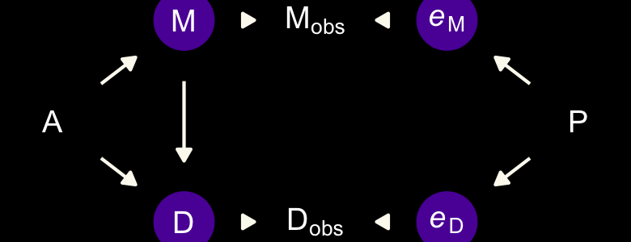

The second instance is when the true marriage rate \(M\) has a causal
effect on the measurement error for Divorce, \(e_\text{D}\).

``` r
dag_coords <-
  tibble(name = c("A", "M", "Mobs", "eM", "D", "Dobs", "eD"),
         x    = c(1, 2, 3, 4, 2, 3, 4),
         y    = c(2, 3, 3, 3, 1, 1, 1))

dagify(M    ~ A,
       D    ~ A + M,
       Mobs ~ M + eM,
       Dobs ~ D + eD,
       eD ~ M,
       coords = dag_coords) %>%
  tidy_dagitty() %>% 
  mutate(color = ifelse(name %in% c("A", "Mobs", "Dobs"), "b", "a")) %>% 
  
  ggplot(aes(x = x, y = y, xend = xend, yend = yend)) +
  geom_dag_point(aes(color = color),
                 size = 10, show.legend = F) +
  geom_dag_text(parse = T, label = c("A", "D", "M", 
                                     expression(italic(e)[D]), expression(italic(e)[M]), 
                                     expression(D[obs]), expression(M[obs]))) +
  geom_dag_edges(edge_colour = "#FCF9F0") +
  scale_color_manual(values = c(viridis_pal(option = "C")(7)[2], "black")) +
  dark_theme_void()
```

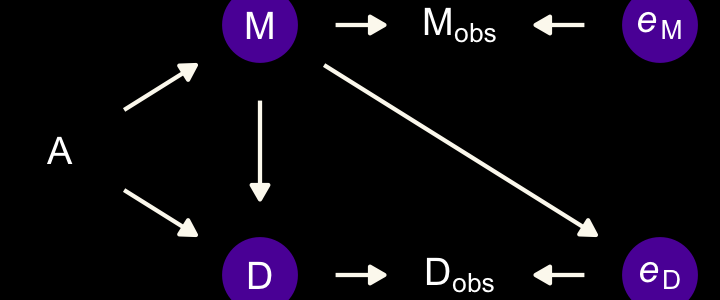

The final example is when we have negligible measurement error for \(M\)
and \(D\), but known nonignorable measurement error for the causal
variable \(A\).

``` r
dag_coords <-
  tibble(name = c("eA", "Aobs", "A", "M", "D"),
         x    = c(1, 2, 3, 4, 4),
         y    = c(2, 2, 2, 3, 1))

dagify(Aobs ~ A + eA,
       M    ~ A,
       D    ~ A,
       coords = dag_coords) %>%
  tidy_dagitty() %>% 
  mutate(color = ifelse(name %in% c("A", "eA"), "a", "b")) %>% 
  
  ggplot(aes(x = x, y = y, xend = xend, yend = yend)) +
  geom_dag_point(aes(color = color),
                 size = 10, show.legend = F) +
  geom_dag_text(parse = T, label = c("A", expression(italic(e)[A]), expression(A[obs]), "D", "M")) +
  geom_dag_edges(edge_colour = "#FCF9F0") +
  scale_color_manual(values = c(viridis_pal(option = "C")(7)[2], "black")) +
  dark_theme_void()
```

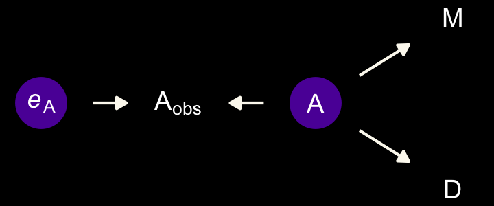

On page 498, we read:

> In this circumstance, it can happen that a naive regression of \(D\)
> on \(A_\text{obs}\) and \(M\) will strongly suggest that \(M\)
> influences \(D\). The reason is that \(M\) contains information about
> the true \(A\). And \(M\) is measured more precisely than \(A\) is.
> It’s like a proxy \(A\). Here’s a small simulation you can toy with
> that will produce such a frustration:

``` r
n <- 500

set.seed(15)

dat <-
  tibble(A = rnorm(n, mean = 0, sd = 1)) %>% 
  mutate(M     = rnorm(n, mean = -A, sd = 1),
         D     = rnorm(n, mean =  A, sd = 1),
         A_obs = rnorm(n, mean =  A, sd = 1))
```

To get a sense of the havoc ignoring measurement error can cause, we’ll
fit to models. These aren’t in the text, but, you know, let’s live a
little. The first model will include `A`, the true predictor for `D`.
The second model will include `A_obs` instead, the version of `A` with
measurement error added in.

``` r
# the model with A containing no measurement error
b15.2b <- 
  brm(data = dat, 
      family = gaussian,
      D ~ 1 + A + M,
      prior = c(prior(normal(0, 0.2), class = Intercept),
                prior(normal(0, 0.5), class = b),
                prior(exponential(1), class = sigma)),
      iter = 2000, warmup = 1000, cores = 4, chains = 4,
      seed = 15,
      # note this line
      save_mevars = TRUE,
      file = "/Users/solomonkurz/Dropbox/Recoding Statistical Rethinking 2nd ed/fits/b15.02b")

# The model where A has measurement error, but we ignore it
b15.2c <- 
  brm(data = dat, 
      family = gaussian,
      D ~ 1 + A_obs + M,
      prior = c(prior(normal(0, 0.2), class = Intercept),
                prior(normal(0, 0.5), class = b),
                prior(exponential(1), class = sigma)),
      iter = 2000, warmup = 1000, cores = 4, chains = 4,
      seed = 15,
      # note this line
      save_mevars = TRUE,
      file = "/Users/solomonkurz/Dropbox/Recoding Statistical Rethinking 2nd ed/fits/b15.02c")
```

Check the summaries.

``` r
print(b15.2b)
```

    ##  Family: gaussian 
    ##   Links: mu = identity; sigma = identity 
    ## Formula: D ~ 1 + A + M 
    ##    Data: dat (Number of observations: 500) 
    ## Samples: 4 chains, each with iter = 2000; warmup = 1000; thin = 1;
    ##          total post-warmup samples = 4000
    ## 
    ## Population-Level Effects: 
    ##           Estimate Est.Error l-95% CI u-95% CI Rhat Bulk_ESS Tail_ESS
    ## Intercept     0.01      0.04    -0.08     0.10 1.00     3560     2284
    ## A             0.89      0.06     0.77     1.01 1.00     2945     2386
    ## M            -0.04      0.04    -0.13     0.04 1.00     2780     2563
    ## 
    ## Family Specific Parameters: 
    ##       Estimate Est.Error l-95% CI u-95% CI Rhat Bulk_ESS Tail_ESS
    ## sigma     1.01      0.03     0.94     1.07 1.00     3818     2871
    ## 
    ## Samples were drawn using sampling(NUTS). For each parameter, Bulk_ESS
    ## and Tail_ESS are effective sample size measures, and Rhat is the potential
    ## scale reduction factor on split chains (at convergence, Rhat = 1).

``` r
print(b15.2c)
```

    ##  Family: gaussian 
    ##   Links: mu = identity; sigma = identity 
    ## Formula: D ~ 1 + A_obs + M 
    ##    Data: dat (Number of observations: 500) 
    ## Samples: 4 chains, each with iter = 2000; warmup = 1000; thin = 1;
    ##          total post-warmup samples = 4000
    ## 
    ## Population-Level Effects: 
    ##           Estimate Est.Error l-95% CI u-95% CI Rhat Bulk_ESS Tail_ESS
    ## Intercept     0.05      0.05    -0.05     0.15 1.00     4127     2880
    ## A_obs         0.29      0.04     0.21     0.37 1.00     3101     3149
    ## M            -0.35      0.04    -0.43    -0.28 1.00     3444     3460
    ## 
    ## Family Specific Parameters: 
    ##       Estimate Est.Error l-95% CI u-95% CI Rhat Bulk_ESS Tail_ESS
    ## sigma     1.14      0.04     1.08     1.22 1.00     4141     3161
    ## 
    ## Samples were drawn using sampling(NUTS). For each parameter, Bulk_ESS
    ## and Tail_ESS are effective sample size measures, and Rhat is the potential
    ## scale reduction factor on split chains (at convergence, Rhat = 1).

`b15.2b`, the model where `A` contains no measurement error, comes close
to reproducing the data-generating parameters. The second model,
`b15.2c`, which used `A` infused with measurement error (i.e., `A_obs`),
is a disaster. A coefficient plot might help the comparison.

``` r
# for annotation
text <-
  tibble(fit      = "b15.2b",
         term     = "beta[0]",
         estimate = fixef(b15.2b, probs = .99)["Intercept", 3],
         label    = "In this plot, we like the yellow posteriors.")

# wrangle
bind_rows(
  tidy(b15.2b) %>% filter(term != "lp__") %>% mutate(term = c(str_c("beta[", 0:2, "]"), "sigma")),
  tidy(b15.2c) %>% filter(term != "lp__") %>% mutate(term = c(str_c("beta[", 0:2, "]"), "sigma"))
  ) %>% 
  mutate(fit = rep(c("b15.2b", "b15.2c"), each = n() / 2)) %>% 
  
  # plot!
  ggplot(aes(x = estimate, y = fit)) +
  geom_vline(xintercept = 0, linetype = 3, alpha = 1/2) +
  geom_pointrange(aes(xmin = lower, xmax = upper, color = fit)) +
  geom_text(data = text,
            aes(label = label),
            hjust = 0, color = color_y) +
  scale_color_manual(values = c(color_y, "white")) +
  labs(x = "marginal posterior",
       y = NULL) +
  theme(axis.ticks.y = element_blank(),
        strip.background = element_rect(color = "transparent", fill = "transparent")) +
  facet_wrap(~term, labeller = label_parsed, ncol = 1)
```

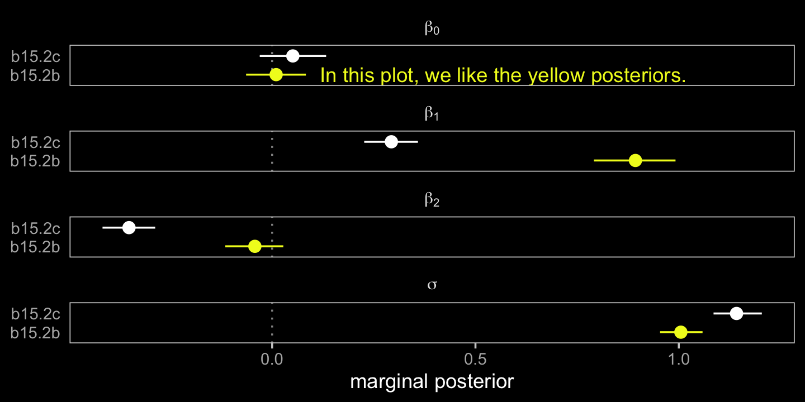

## Missing data

> With measurement error, the insight is to realize that any uncertain
> piece of data can be replaced by a distribution that reflects
> uncertainty. But sometimes data are simply missing–no measurement is
> available at all. At first, this seems like a lost cause. What can be
> done when there is no measurement at all, not even one with error?…

> So what can we do instead? We can think causally about missingness,
> and we can use the model to **impute** missing values. A generative
> model tells you whether the process that produced the missing values
> will also prevent the identification of causal effects. (p. 499,
> **emphasis** in the original)

Starting with
[version 2.2.0](https://cran.r-project.org/package=brms/news/news.html),
**brms** supports Bayesian missing data imputation using adaptations of
the [multivariate
syntax](https://cran.r-project.org/package=brms/vignettes/brms_multivariate.html)
(Bürkner, [2020](#ref-Bürkner2020Multivariate)). Bürkner’s
(<span class="citeproc-not-found" data-reference-id="Bürkner2020HandleMissingValues">**???**</span>)
vignette, [*Handle missing values with
brms*](https://cran.r-project.org/package=brms/vignettes/brms_missings.html),
can provide a nice overview.

#### Rethinking: Missing data are meaningful data.

> The fact that a variable has an unobserved value is still an
> observation. It is data, just with a very special value. The meaning
> of this value depends upon the context. Consider for example a
> questionnaire on personal income. If some people refuse to fill in
> their income, this may be associated with low (or high) income.
> Therefore a model that tries to predict the missing values can be
> enlightening. (p. 499)

### DAG ate my homework.

We’ll start this section off with our versio of Figure 15.4. It’s going
to take a bit of effort on our part to make a nice representation those
four DAGs. Here we make panels a, b, and d.

``` r
# panel a
dag_coords <-
  tibble(name = c("S", "H", "Hs", "D"),
         x    = c(1, 2, 2, 1),
         y    = c(2, 2, 1, 1))

p1 <-
  dagify(H ~ S,
         Hs ~ H + D,
         coords = dag_coords) %>%
  tidy_dagitty() %>% 
  mutate(color = ifelse(name == "H", "a", "b")) %>% 
  
  ggplot(aes(x = x, y = y, xend = xend, yend = yend)) +
  geom_dag_point(aes(color = color),
                 size = 7, show.legend = F) +
  geom_dag_text(label = c("D", "H", "S", "H*")) +
  geom_dag_edges(edge_colour = "#FCF9F0")

# panel b
p2 <-
  dagify(H ~ S,
         Hs ~ H + D,
         D ~ S,
         coords = dag_coords) %>%
  tidy_dagitty() %>% 
  mutate(color = ifelse(name == "H", "a", "b")) %>% 
  
  ggplot(aes(x = x, y = y, xend = xend, yend = yend)) +
  geom_dag_point(aes(color = color),
                 size = 7, show.legend = F) +
  geom_dag_text(label = c("D", "H", "S", "H*")) +
  geom_dag_edges(edge_colour = "#FCF9F0")

# panel d
p4 <-
  dagify(H ~ S,
         Hs ~ H + D,
         D ~ H,
         coords = dag_coords) %>%
  tidy_dagitty() %>% 
  mutate(color = ifelse(name == "H", "a", "b")) %>% 
  
  ggplot(aes(x = x, y = y, xend = xend, yend = yend)) +
  geom_dag_point(aes(color = color),
                 size = 7, show.legend = F) +
  geom_dag_text(label = c("D", "H", "S", "H*")) +
  geom_dag_edges(edge_colour = "#FCF9F0")
```

Make panel c.

``` r
dag_coords <-
  tibble(name = c("S", "H", "Hs", "D", "X"),
         x    = c(1, 2, 2, 1, 1.5),
         y    = c(2, 2, 1, 1, 1.5))

p3 <-
  dagify(H ~ S + X,
         Hs ~ H + D,
         D ~ X,
         coords = dag_coords) %>%
  tidy_dagitty() %>% 
  mutate(color = ifelse(name %in% c("H", "X"), "a", "b")) %>% 
  
  ggplot(aes(x = x, y = y, xend = xend, yend = yend)) +
  geom_dag_point(aes(color = color),
                 size = 7, show.legend = F) +
  geom_dag_text(label = c("D", "H", "S", "X", "H*")) +
  geom_dag_edges(edge_colour = "#FCF9F0")
```

Now combine, adjust a little, and plot.

``` r
(p1 + p2 + p3 + p4) +
  plot_annotation(tag_levels = "a", tag_prefix = "(", tag_suffix = ")") &
  scale_color_manual(values = c(viridis_pal(option = "C")(7)[2], "black")) &
  dark_theme_void() +
  theme(panel.background = element_rect(fill = "grey8"),
        plot.margin = margin(0.2, 0.2, 0.2, 0.2, "in"))
```

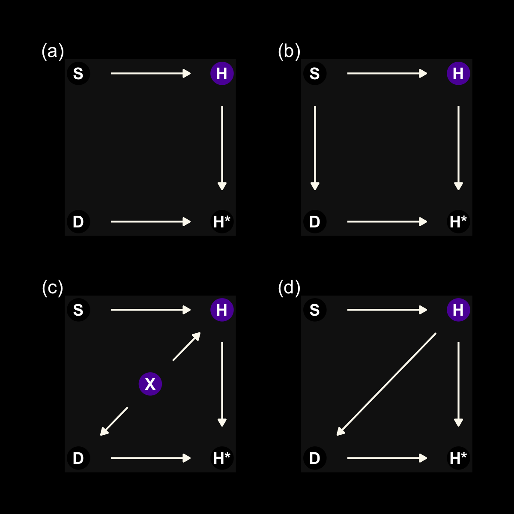

On page 500, we read:

> Consider a sample of students, all of whom own dogs. The students
> produce homework
> (\(Hv). This homework varies in quality, influenced by how much each student studies (\)S$).
> We could simulate 100 students, their attributes, and their homework
> like this:

``` r
n <- 100

set.seed(15)

d <-
  tibble(s = rnorm(n, mean = 0, sd = 1)) %>% 
  mutate(h = rbinom(n, size = 10, inv_logit_scaled(s)),
         d_a = rbinom(n, size = 1, prob = .5),
         d_b = ifelse(s > 0, 1, 0)) %>%
  mutate(hm_a = ifelse(d_a == 1, NA, h),
         hm_b = ifelse(d_b == 1, NA, h))

d
```

    ## # A tibble: 100 x 6
    ##          s     h   d_a   d_b  hm_a  hm_b
    ##      <dbl> <int> <int> <dbl> <int> <int>
    ##  1  0.259      6     0     1     6    NA
    ##  2  1.83       8     0     1     8    NA
    ##  3 -0.340      4     0     0     4     4
    ##  4  0.897      6     1     1    NA    NA
    ##  5  0.488      8     1     1    NA    NA
    ##  6 -1.26       3     1     0    NA     3
    ##  7  0.0228     3     1     1    NA    NA
    ##  8  1.09       6     1     1    NA    NA
    ##  9 -0.132      6     0     0     6     6
    ## 10 -1.08       3     1     0    NA     3
    ## # … with 90 more rows

In that code block, we simulated the data corresponding to McElreath’s
**R** code 15.8 through 15.10. We have two `d` and `hm` variables. `d_a`
and `hm_a` correspond to McElreath’s **R** code 15.9 and the DAG in
panel a. `d_b` and `hm_b` correspond to McElreath’s **R** code 15.10 and
the DAG in panel b.

This wasn’t in the text, but here we’ll plot `h`, `hm_a`, and `hm_b` to
get a sense of how the first two missing data examples compare to the
original data.

``` r
p1 <-
  d %>% 
  ggplot(aes(x = s, y = h)) + 
  geom_point(color = viridis_pal(option = "C")(7)[7], alpha = 2/3) +
  scale_y_continuous(breaks = 1:10) +
  labs(subtitle = "true distribution")

p2 <-
  d %>% 
  ggplot(aes(x = s, y = hm_a)) + 
  geom_point(color = viridis_pal(option = "C")(7)[6], alpha = 2/3) +
  scale_y_continuous(breaks = 1:10) +
  labs(subtitle = "missing completely at random")

p3 <-
  d %>% 
  ggplot(aes(x = s, y = hm_b)) + 
  geom_point(color = viridis_pal(option = "C")(7)[6], alpha = 2/3) +
  scale_y_continuous(breaks = 1:10, limits = c(1, 10)) +
  labs(subtitle = "missing conditional on s")

p1 + p2 + p3
```

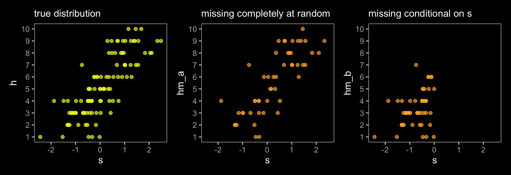

The left panel is the ideal situation letting us learn what we want to
know, what is the effect of studying on the grade you’ll get on your
homework (\(S \rightarrow H\)). Once we enter in a missing data process
(i.e., dogs \(D\) eating homework), we end up with \(H^*\), the homework
left over after the dogs. Thus the homework outcomes we collect are a
combination of the full set of homework and the hungry dogs. The middle
panel depicts the scenario where the dogs eat the homework completely at
random, \(H \rightarrow H^* \leftarrow D\). In the right panel, we
consider a scenario where the dogs only and always eat the homework on
the occasions the students studied more than average,
\(H \rightarrow H^* \leftarrow D \leftarrow S\).

The situation in the third DAG is more complicated. Now homework is
conditional on both studying and how noisy it is in a students home,
\(X\). Also, our new variable \(X\) isn’t measured and whether the dogs
eat the homework is also conditional on that unmeasured \(X\). Here’s
the new data simulation.

``` r
n <- 1000

set.seed(501)

d <-
  tibble(x = rnorm(n, mean = 0, sd = 1),
         s = rnorm(n, mean = 0, sd = 1)) %>% 
  mutate(h = rbinom(n, size = 10, inv_logit_scaled(2 + s - 2 * x)),
         d = ifelse(x > 1, 1, 0)) %>%
  mutate(hm = ifelse(d == 1, NA, h))

d
```

    ## # A tibble: 1,000 x 5
    ##          x      s     h     d    hm
    ##      <dbl>  <dbl> <int> <dbl> <int>
    ##  1  0.577   1.15     10     0    10
    ##  2  0.617  -0.786     7     0     7
    ##  3  0.452   0.958     9     0     9
    ##  4  0.226   0.754     8     0     8
    ##  5 -0.845   0.689    10     0    10
    ##  6 -1.43    0.176    10     0    10
    ##  7 -1.65    0.280    10     0    10
    ##  8  0.0356 -0.397     8     0     8
    ##  9  0.184   0.261     7     0     7
    ## 10  1.22   -1.01      2     1    NA
    ## # … with 990 more rows

Those data look like this.

``` r
p1 <-
  d %>% 
  ggplot(aes(x = s, y = h)) + 
  geom_point(color = viridis_pal(option = "C")(7)[7], alpha = 1/4) +
  scale_y_continuous(breaks = 1:10) +
  labs(subtitle = "true distribution")

p2 <-
  d %>% 
  ggplot(aes(x = s, y = hm)) + 
  geom_point(color = viridis_pal(option = "C")(7)[6], alpha = 1/4) +
  scale_y_continuous(breaks = 1:10) +
  labs(subtitle = "missing conditional on x")

p1 + p2
```

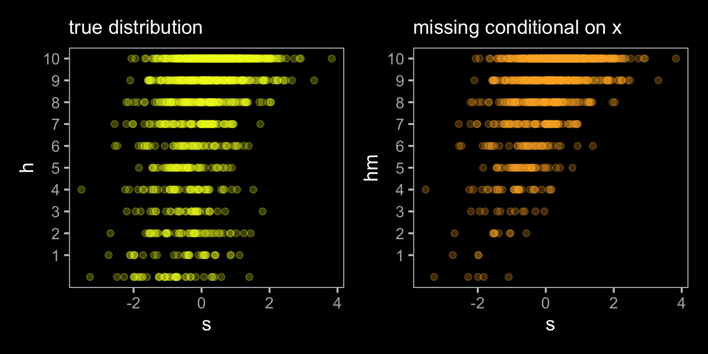

Fit the model using the data with no missingness.

``` r
b15.3 <-
  brm(data = d,
      family = binomial,
      h ~ 1 + s,
      prior = c(prior(normal(0, 1), class = Intercept),
                prior(normal(0, 0.5), class = b)),
      iter = 2000, warmup = 1000, chains = 4, cores = 4,
      seed = 15,
      file = "/Users/solomonkurz/Dropbox/Recoding Statistical Rethinking 2nd ed/fits/b15.03")
```

Check the results.

``` r
print(b15.3)
```

    ##  Family: binomial 
    ##   Links: mu = logit 
    ## Formula: h ~ 1 + s 
    ##    Data: d (Number of observations: 1000) 
    ## Samples: 4 chains, each with iter = 2000; warmup = 1000; thin = 1;
    ##          total post-warmup samples = 4000
    ## 
    ## Population-Level Effects: 
    ##           Estimate Est.Error l-95% CI u-95% CI Rhat Bulk_ESS Tail_ESS
    ## Intercept     1.11      0.02     1.06     1.16 1.00     2839     2619
    ## s             0.69      0.03     0.64     0.74 1.00     2702     2456
    ## 
    ## Samples were drawn using sampling(NUTS). For each parameter, Bulk_ESS
    ## and Tail_ESS are effective sample size measures, and Rhat is the potential
    ## scale reduction factor on split chains (at convergence, Rhat = 1).

Since this is not the data-generating model, we shouldn’t be all that
surprised the coefficient for `s` is off (it should be 1). Because this
is an example of where we didn’t collect data on \(X\), we can think of
our incorrect results as a case of **omitted variable bias**. Here’s
what happens when we run the model on `hm`, the homework variable after
the hungry dogs got to it.

``` r
b15.4 <-
  brm(data = d %>% filter(d == 0),
      family = binomial,
      h ~ 1 + s,
      prior = c(prior(normal(0, 1), class = Intercept),
                prior(normal(0, 0.5), class = b)),
      iter = 2000, warmup = 1000, chains = 4, cores = 4,
      seed = 15,
      file = "/Users/solomonkurz/Dropbox/Recoding Statistical Rethinking 2nd ed/fits/b15.04")
```

Check the results.

``` r
print(b15.4)
```

    ##  Family: binomial 
    ##   Links: mu = logit 
    ## Formula: h ~ 1 + s 
    ##    Data: d %>% filter(d == 0) (Number of observations: 820) 
    ## Samples: 4 chains, each with iter = 2000; warmup = 1000; thin = 1;
    ##          total post-warmup samples = 4000
    ## 
    ## Population-Level Effects: 
    ##           Estimate Est.Error l-95% CI u-95% CI Rhat Bulk_ESS Tail_ESS
    ## Intercept     1.80      0.03     1.73     1.86 1.00     2064     2123
    ## s             0.83      0.03     0.76     0.89 1.00     1845     2386
    ## 
    ## Samples were drawn using sampling(NUTS). For each parameter, Bulk_ESS
    ## and Tail_ESS are effective sample size measures, and Rhat is the potential
    ## scale reduction factor on split chains (at convergence, Rhat = 1).

Interestingly, both the intercept and the coefficient for `s` are now
less biased. Because both \(H\) and \(D\) are conditional on \(X\),
omitting cases based on \(X\) resulted in a model that conditional on
\(X\), even though \(X\) wasn’t directly in the statistical model. This
won’t always be the case. Consider what happens when we have a different
missing data mechanism.

``` r
d <-
  d %>% 
  mutate(d = ifelse(abs(x) < 1, 1, 0)) %>%
  mutate(hm = ifelse(d == 1, NA, h))

d
```

    ## # A tibble: 1,000 x 5
    ##          x      s     h     d    hm
    ##      <dbl>  <dbl> <int> <dbl> <int>
    ##  1  0.577   1.15     10     1    NA
    ##  2  0.617  -0.786     7     1    NA
    ##  3  0.452   0.958     9     1    NA
    ##  4  0.226   0.754     8     1    NA
    ##  5 -0.845   0.689    10     1    NA
    ##  6 -1.43    0.176    10     0    10
    ##  7 -1.65    0.280    10     0    10
    ##  8  0.0356 -0.397     8     1    NA
    ##  9  0.184   0.261     7     1    NA
    ## 10  1.22   -1.01      2     0     2
    ## # … with 990 more rows

Here’s what then updated data look like.

``` r
p1 <-
  d %>% 
  ggplot(aes(x = s, y = h)) + 
  geom_point(color = viridis_pal(option = "C")(7)[7], alpha = 1/4) +
  scale_y_continuous(breaks = 1:10) +
  labs(subtitle = "true distribution")

p2 <-
  d %>% 
  ggplot(aes(x = s, y = hm)) + 
  geom_point(color = viridis_pal(option = "C")(7)[6], alpha = 1/4) +
  scale_y_continuous(breaks = 1:10) +
  labs(subtitle = "missing conditional on x")

p1 + p2
```

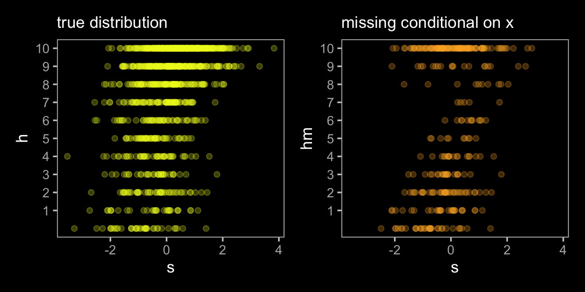
McElreath didn’t fit this model in the text, but he encouraged us to do
so on our own (p. 503). Here it is.

``` r
b15.4b <-
  brm(data = d %>% filter(d == 0),
      family = binomial,
      h ~ 1 + s,
      prior = c(prior(normal(0, 1), class = Intercept),
                prior(normal(0, 0.5), class = b)),
      iter = 2000, warmup = 1000, chains = 4, cores = 4,
      seed = 15,
      file = "/Users/solomonkurz/Dropbox/Recoding Statistical Rethinking 2nd ed/fits/b15.04b")
```

``` r
print(b15.4b)
```

    ##  Family: binomial 
    ##   Links: mu = logit 
    ## Formula: h ~ 1 + s 
    ##    Data: d %>% filter(d == 0) (Number of observations: 307) 
    ## Samples: 4 chains, each with iter = 2000; warmup = 1000; thin = 1;
    ##          total post-warmup samples = 4000
    ## 
    ## Population-Level Effects: 
    ##           Estimate Est.Error l-95% CI u-95% CI Rhat Bulk_ESS Tail_ESS
    ## Intercept     0.34      0.04     0.27     0.42 1.00     3312     2749
    ## s             0.49      0.04     0.41     0.57 1.00     3664     2767
    ## 
    ## Samples were drawn using sampling(NUTS). For each parameter, Bulk_ESS
    ## and Tail_ESS are effective sample size measures, and Rhat is the potential
    ## scale reduction factor on split chains (at convergence, Rhat = 1).

Yep, “now missingness makes things worse” (p. 503).

#### Rethinking: Naming completely at random.

McElreath briefly mentioned the terms **missing completely at random**
(MCAR), **missing at random** (MAR), and **missing not at random**
(MNAR). I share his sentiments; these terms are awful. However, they’re
peppered throughout the missing data literature and I recommend you
familiarize yourself with them. In his endnote \#227, McElreath pointed
readers to the authoritative work of
(<span class="citeproc-not-found" data-reference-id="rubinInferenceAndMissingData1976">**???**</span>)
and
(<span class="citeproc-not-found" data-reference-id="littleStatisticalAnalysisMissing2019">**???**</span>)
(though he referenced the second edition, whereas I’m referencing the
third).
(<span class="citeproc-not-found" data-reference-id="baraldiIntroductionToModernMissingData2010">**???**</span>)
is a nice primer, too. Also, the great Donald Rubin has several lectures
available online. Here’s a
[link](https://www.youtube.com/watch?v=AH7lvy45k2U) to a talk on causal
inference, which includes bits of insights into missing data analysis
and lots of historical tidbits, too.

### Imputing primates.

We return to the `milk` data.

``` r
data(milk, package = "rethinking")
d <- milk
rm(milk)

# transform
d <-
  d %>%
  mutate(neocortex.prop = neocortex.perc / 100,
         logmass        = log(mass)) %>% 
  mutate(k = (kcal.per.g - mean(kcal.per.g)) / sd(kcal.per.g),
         b = (neocortex.prop - mean(neocortex.prop, na.rm = T)) / sd(neocortex.prop, na.rm = T),
         m = (logmass - mean(logmass)) / sd(logmass))
```

Note how we set `na.rm = T` within the `mean()` and `sd()` functions
when computing `b`. See what happens if you leave that part out. As
hinted at above and explicated in the text, we’re missing 12 values for
`neocortex.prop`.

``` r
d %>% 
  count(is.na(neocortex.prop))
```

    ##   is.na(neocortex.prop)  n
    ## 1                 FALSE 17
    ## 2                  TRUE 12

We dropped those values when we fit the models back in \[Chapter
5\]\[Masked relationship\]. To get a sense of whether this was a bad
idea, let’s consider the model with a DAG. Ignoring the missing data, we
have this.

``` r
dag_coords <-
  tibble(name = c("M", "U", "K", "B"),
         x    = c(1, 2, 2, 3),
         y    = c(2, 2, 1, 2))

dagify(M ~ U,
       B ~ U,
       K ~ M + B,
       coords = dag_coords) %>%
  tidy_dagitty() %>% 
  mutate(color = ifelse(name == "U", "a", "b")) %>% 
  
  ggplot(aes(x = x, y = y, xend = xend, yend = yend)) +
  geom_dag_point(aes(color = color),
                 size = 10, show.legend = F) +
  geom_dag_text() +
  geom_dag_edges(edge_colour = "#FCF9F0") +
  scale_color_manual(values = c(viridis_pal(option = "C")(7)[2], "black")) +
  dark_theme_void()
```

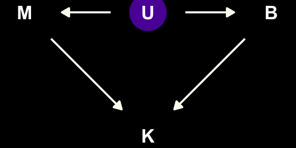

“\(M\) is body mass, \(B\) is neocortex percent, \(K\) is milk energy,
and \(U\) is some unobserved variable that renders \(M\) and \(B\)
positively correlated” (p. 504). Because we have missingness in \(B\),
our data in hand are actually \(B^*\). McElreath considered three
processes that may have generated these missing data. Here are the DAGs.

``` r
dag_coords <-
  tibble(name = c("M", "U", "K", "B", "RB", "Bs"),
         x    = c(1, 2, 2, 3, 2, 3),
         y    = c(2, 2, 1, 2, 3, 3))

# left
p1 <-
  dagify(M ~ U,
         B ~ U,
         K ~ M + B,
         Bs ~ RB + B,
         coords = dag_coords) %>%
  tidy_dagitty() %>% 
  mutate(color = ifelse(name %in% c("U", "B"), "a", "b")) %>% 
  
  ggplot(aes(x = x, y = y, xend = xend, yend = yend)) +
  geom_dag_point(aes(color = color),
                 size = 10, show.legend = F) +
  geom_dag_text(parse = T, label = c("B", "M", expression(R[B]), "U", expression(B^'*'), "K")) +
  geom_dag_edges(edge_colour = "#FCF9F0")

# middle
p2 <-
  dagify(M ~ U,
         B ~ U,
         K ~ M + B,
         Bs ~ RB + B,
         RB ~ M,
         coords = dag_coords) %>%
  tidy_dagitty() %>% 
  mutate(color = ifelse(name %in% c("U", "B"), "a", "b")) %>% 
  
  ggplot(aes(x = x, y = y, xend = xend, yend = yend)) +
  geom_dag_point(aes(color = color),
                 size = 10, show.legend = F) +
  geom_dag_text(parse = T, label = c("B", "M", expression(R[B]), "U", expression(B^'*'), "K")) +
  geom_dag_edges(edge_colour = "#FCF9F0")

# right
p3 <-
  dagify(M ~ U,
         B ~ U,
         K ~ M + B,
         Bs ~ RB + B,
         RB ~ B,
         coords = dag_coords) %>%
  tidy_dagitty() %>% 
  mutate(color = ifelse(name %in% c("U", "B"), "a", "b")) %>% 
  
  ggplot(aes(x = x, y = y, xend = xend, yend = yend)) +
  geom_dag_point(aes(color = color),
                 size = 10, show.legend = F) +
  geom_dag_text(parse = T, label = c("B", "M", expression(R[B]), "U", expression(B^'*'), "K")) +
  geom_dag_edges(edge_colour = "#FCF9F0")

# combine!
(p1 + p2 + p3) &
  scale_color_manual(values = c(viridis_pal(option = "C")(7)[2], "black")) &
  dark_theme_void() &
  theme(panel.background = element_rect(fill = "black"),
        plot.background = element_rect(fill = "grey8", color = "grey8"),
        plot.margin = margin(0.1, 0.1, 0.1, 0.1, "in"))
```

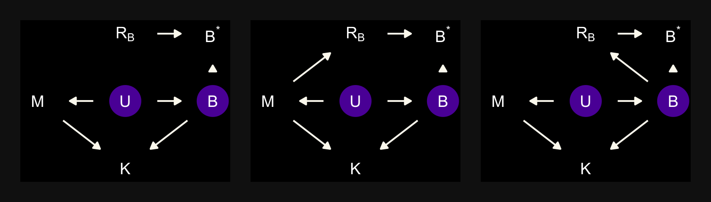

In each of the DAGs, the new variable \(R_B\) simply indicates whether a
given species has missingness in \(B^*\), much like our dog variable
\(D\) indicated the missing data in the DAGs from the earlier DAGs. The
big difference between then and now is that whereas we had a sense of
what was causing the missing data in the earlier examples (i.e., those
hungry \(D\) dogs), now we only have a generic missing data mechanism,
\(R_B\). In the middle of page 505, McElreath asked we consider one more
missing data mechanism, this time with a new unmeasured causal variable
\(V\).

``` r
dag_coords <-
  tibble(name = c("M", "U", "K", "B", "Bs", "RB", "V"),
         x    = c(1, 2, 2, 3, 4, 4, 3.4),
         y    = c(2, 2, 1, 2, 2, 1, 1.45))

dagify(M ~ U,
       B ~ U + V,
       K ~ M + B,
       Bs ~ RB + B,
       RB ~ V,
       coords = dag_coords) %>%
  tidy_dagitty() %>% 
  mutate(color = ifelse(name %in% c("U", "B", "V"), "a", "b")) %>% 
  
  ggplot(aes(x = x, y = y, xend = xend, yend = yend)) +
  geom_dag_point(aes(color = color),
                 size = 10, show.legend = F) +
  geom_dag_text(parse = T, label = c("B", "M", expression(R[B]), "U", "V", expression(B^'*'), "K")) +
  geom_dag_edges(edge_colour = "#FCF9F0") +
  scale_color_manual(values = c(viridis_pal(option = "C")(7)[2], "black")) +
  dark_theme_void()
```


However, our statistical model will follow the form

\[
\begin{align*}
K_i     & \sim \operatorname{Normal}(\mu_i, \sigma) \\
\mu_i   & = \alpha + \beta_1 \color{#5D01A6FF}{B_i} + \beta_2 \log M_i \\
\color{#5D01A6FF}{B_i} & \color{#5D01A6FF}\sim \color{#5D01A6FF}{\operatorname{Normal}(\nu, \sigma_B)} \\
\alpha  & \sim \operatorname{Normal}(0, 0.5) \\
\beta_1 & \sim \operatorname{Normal}(0, 0.5) \\
\beta_2 & \sim \operatorname{Normal}(0, 0.5) \\
\sigma  & \sim \operatorname{Exponential}(1) \\
\color{#5D01A6FF}\nu & \color{#5D01A6FF}\sim \color{#5D01A6FF}{\operatorname{Normal}(0, 0.5)} \\
\color{#5D01A6FF}{\sigma_B} & \color{#5D01A6FF}\sim \color{#5D01A6FF}{\operatorname{Exponential}(1)},
\end{align*}
\]

where we simply presume the missing values in \(B_i\), which was \(B^*\)
in our DAGs, are unrelated to any of the other variables in the model.
But those missing values in \(B_i\) values do get their own prior
distribution, \(\operatorname{Normal}(\nu, \sigma_B)\). If you look
closely, you’ll discover the prior McElreath reported for \(\nu\)
\([\operatorname{Normal}(0.5, 1)]\) does not match up with his
`rethinking::ulam()` code in his **R** code block 15.17,
\(\operatorname{Normal}(0, 0.5)\). Here we use the latter.

When writing a multivariate model in **brms**, I find it easier to save
the model code by itself and then insert it into the `brm()` function.
Otherwise, things start to feel cluttered.

``` r
b_model <- 
  # here's the primary `k` model
  bf(k ~ 1 + mi(b) + m) + 
  # here's the model for the missing `b` data 
  bf(b | mi() ~ 1) + 
  # here we set the residual correlations for the two models to zero
  set_rescor(FALSE)
```

Note the `mi(b)` syntax in the `k` model. This indicates that the
predictor, `b`, has missing values that are themselves being modeled. To
get a sense of how to specify the priors for such a model in **brms**,
use the `get_prior()` function.

``` r
get_prior(data = d, 
          family = gaussian,
          b_model)
```

    ##                    prior     class coef group resp dpar nlpar bound       source
    ##                   (flat)         b                                       default
    ##                   (flat) Intercept                                       default
    ##   student_t(3, 0.2, 2.5) Intercept               b                       default
    ##     student_t(3, 0, 2.5)     sigma               b                       default
    ##                   (flat)         b               k                  (vectorized)
    ##                   (flat)         b    m          k                  (vectorized)
    ##                   (flat)         b  mib          k                  (vectorized)
    ##  student_t(3, -0.3, 2.5) Intercept               k                       default
    ##     student_t(3, 0, 2.5)     sigma               k                       default

With the one-step Bayesian imputation procedure in **brms**, you might
need to use the `resp` argument when specifying non-default priors. Now
fit the model.

``` r
b15.5 <- 
  brm(data = d, 
      family = gaussian,
      b_model,  # here we insert the model
      prior = c(prior(normal(0, 0.5), class = Intercept, resp = k),
                prior(normal(0, 0.5), class = Intercept, resp = b),
                prior(normal(0, 0.5), class = b,         resp = k),
                prior(exponential(1), class = sigma,     resp = k),
                prior(exponential(1), class = sigma,     resp = b)),
      iter = 2000, warmup = 1000, chains = 4, cores = 4,
      seed = 15,
      file = "/Users/solomonkurz/Dropbox/Recoding Statistical Rethinking 2nd ed/fits/b15.05")
```

With a model like this, `print()` only gives up part of the picture.

``` r
print(b15.5)
```

    ##  Family: MV(gaussian, gaussian) 
    ##   Links: mu = identity; sigma = identity
    ##          mu = identity; sigma = identity 
    ## Formula: k ~ 1 + mi(b) + m 
    ##          b | mi() ~ 1 
    ##    Data: d (Number of observations: 29) 
    ## Samples: 4 chains, each with iter = 2000; warmup = 1000; thin = 1;
    ##          total post-warmup samples = 4000
    ## 
    ## Population-Level Effects: 
    ##             Estimate Est.Error l-95% CI u-95% CI Rhat Bulk_ESS Tail_ESS
    ## k_Intercept     0.03      0.16    -0.31     0.33 1.00     3841     3213
    ## b_Intercept    -0.05      0.21    -0.46     0.37 1.00     3503     2561
    ## k_m            -0.55      0.21    -0.93    -0.13 1.00     1846     2497
    ## k_mib           0.50      0.24    -0.00     0.94 1.00     1553     2294
    ## 
    ## Family Specific Parameters: 
    ##         Estimate Est.Error l-95% CI u-95% CI Rhat Bulk_ESS Tail_ESS
    ## sigma_k     0.84      0.15     0.60     1.16 1.00     1951     2629
    ## sigma_b     1.01      0.17     0.74     1.43 1.00     2185     2374
    ## 
    ## Samples were drawn using sampling(NUTS). For each parameter, Bulk_ESS
    ## and Tail_ESS are effective sample size measures, and Rhat is the potential
    ## scale reduction factor on split chains (at convergence, Rhat = 1).

Note that for the parameters summarized in the ‘Population-Level
Effects:’ section, the criterion is indexed in the prefix. The
parameters in the ‘Family Specific Parameters:’, however, have the
criteria indexed in the suffix. I don’t know why. Anyway, we can get a
summary of the imputed values with `tidy()`.

``` r
tidy(b15.5) %>%
  mutate_if(is.numeric, round, digits = 2)
```

    ##             term estimate std.error  lower  upper
    ## 1  b_k_Intercept     0.03      0.16  -0.24   0.27
    ## 2  b_b_Intercept    -0.05      0.21  -0.39   0.30
    ## 3          b_k_m    -0.55      0.21  -0.88  -0.21
    ## 4      bsp_k_mib     0.50      0.24   0.09   0.87
    ## 5        sigma_k     0.84      0.15   0.63   1.10
    ## 6        sigma_b     1.01      0.17   0.78   1.33
    ## 7       Ymi_b[2]    -0.57      0.93  -2.09   0.90
    ## 8       Ymi_b[3]    -0.69      0.92  -2.17   0.83
    ## 9       Ymi_b[4]    -0.70      0.95  -2.20   0.90
    ## 10      Ymi_b[5]    -0.31      0.91  -1.79   1.18
    ## 11      Ymi_b[9]     0.47      0.91  -0.99   1.92
    ## 12     Ymi_b[14]    -0.18      0.88  -1.59   1.25
    ## 13     Ymi_b[15]     0.20      0.87  -1.20   1.62
    ## 14     Ymi_b[17]     0.27      0.89  -1.25   1.70
    ## 15     Ymi_b[19]     0.53      0.90  -0.95   1.96
    ## 16     Ymi_b[21]    -0.46      0.91  -1.96   1.05
    ## 17     Ymi_b[23]    -0.30      0.88  -1.74   1.11
    ## 18     Ymi_b[26]     0.15      0.92  -1.36   1.62
    ## 19          lp__   -81.18      4.00 -88.49 -75.36

The imputed `b` values are indexed by occasion number from the original
data. This is in contrast with McElreath’s `precis()` output, which
simply serially indexes the missing values as `B_impute[1]`,
`B_impute[2]`, and so on.

Before we move on to the next model, let’s plot to get a sense of what
we’ve done.

``` r
posterior_samples(b15.5) %>% 
  select(starts_with("Ymi_b")) %>% 
  set_names(filter(d, is.na(b)) %>% pull(species)) %>% 
  pivot_longer(everything(),
               names_to = "species") %>% 
  
  ggplot(aes(x = value, 
             y = reorder(species, value))) +
  stat_slab(fill = viridis_pal(option = "C")(7)[4], 
            alpha = 3/4, height = 1.5, slab_color = "black") +
  labs(x = "imputed values for b",
       y = NULL) +
  theme(axis.text.y = element_text(hjust = 0),
        axis.ticks.y = element_blank())
```

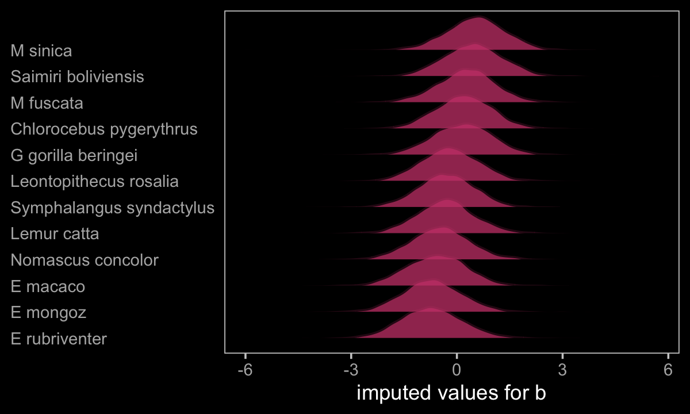

Here’s the model that drops the cases with NAs on `b`.

``` r
b15.6 <- 
  brm(data = d, 
      family = gaussian,
      k ~ 1 + b + m,
      prior = c(prior(normal(0, 0.5), class = Intercept),
                prior(normal(0, 0.5), class = b),
                prior(exponential(1), class = sigma)),
      iter = 2000, warmup = 1000, chains = 4, cores = 4,
      seed = 15,
      file = "/Users/solomonkurz/Dropbox/Recoding Statistical Rethinking 2nd ed/fits/b15.06")
```

If you run this on your computer, you’ll notice the following message at
the top: “Rows containing NAs were excluded from the model.” This time
`print()` gives us the same basic summary information as `tidy()`.

``` r
print(b15.6)
```

    ##  Family: gaussian 
    ##   Links: mu = identity; sigma = identity 
    ## Formula: k ~ 1 + b + m 
    ##    Data: d (Number of observations: 17) 
    ## Samples: 4 chains, each with iter = 2000; warmup = 1000; thin = 1;
    ##          total post-warmup samples = 4000
    ## 
    ## Population-Level Effects: 
    ##           Estimate Est.Error l-95% CI u-95% CI Rhat Bulk_ESS Tail_ESS
    ## Intercept     0.11      0.20    -0.28     0.50 1.00     3093     2745
    ## b             0.60      0.29    -0.01     1.11 1.00     2125     2191
    ## m            -0.64      0.26    -1.11    -0.10 1.00     2173     1715
    ## 
    ## Family Specific Parameters: 
    ##       Estimate Est.Error l-95% CI u-95% CI Rhat Bulk_ESS Tail_ESS
    ## sigma     0.87      0.18     0.60     1.31 1.00     2440     2291
    ## 
    ## Samples were drawn using sampling(NUTS). For each parameter, Bulk_ESS
    ## and Tail_ESS are effective sample size measures, and Rhat is the potential
    ## scale reduction factor on split chains (at convergence, Rhat = 1).

We can’t use McElreath’s `plot(coeftab())` trick with our **brms**
output, but we can still get by.

``` r
# wrangle
bind_rows(
  tidy(b15.5) %>% slice(3:4) %>% mutate(term = str_c("beta[", 2:1, "]")),
  tidy(b15.6) %>% slice(2:3) %>% mutate(term = str_c("beta[", 1:2, "]"))
  ) %>% 
  mutate(fit = rep(c("b15.5", "b15.6"), each = n() / 2)) %>% 
  
  # plot!
  ggplot(aes(x = estimate, y = fit)) +
  geom_vline(xintercept = 0, linetype = 3, alpha = 1/2) +
  geom_pointrange(aes(xmin = lower, xmax = upper)) +
  labs(x = "marginal posterior",
       y = NULL) +
  theme(axis.ticks.y = element_blank(),
        strip.background = element_rect(color = "transparent")) +
  facet_wrap(~term, labeller = label_parsed, ncol = 1)
```

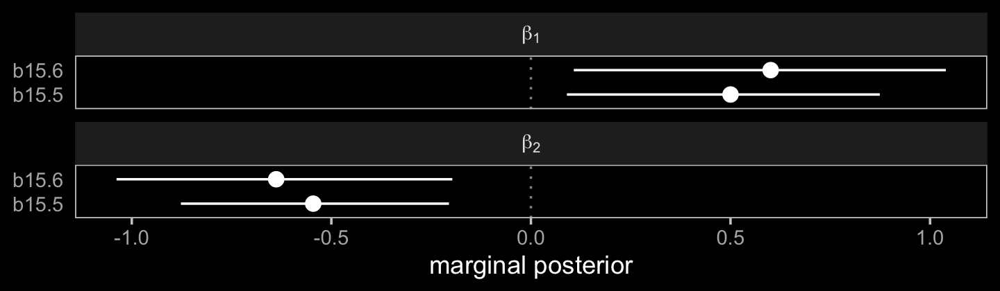

The model using Bayesian imputation (`b15.5`) used more information,
resulting in narrower marginal posteriors for \(\beta_1\) and
\(\beta_2\). Because it wasted perfectly good information, the
conventional `b15.6` model was less certain.

In order to make our version of Figure 15.5, we’ll want to add the
summary values for the imputed `b` data from `b15.1` to the primary data
file `d`.

``` r
d <-
  d %>% 
  mutate(row = 1:n()) %>% 
  left_join(
    tidy(b15.5) %>%
      filter(str_detect(term, "Ymi")) %>% 
      mutate(row = str_extract(term, "(\\d)+") %>% as.integer()),
    by = "row"
  ) 

d %>% 
  select(species, k:upper)
```

    ##                     species          k            b          m row      term   estimate std.error
    ## 1            Eulemur fulvus -0.9400408 -2.080196025 -0.4558357   1      <NA>         NA        NA
    ## 2                  E macaco -0.8161263           NA -0.4150024   2  Ymi_b[2] -0.5749477 0.9324091
    ## 3                  E mongoz -1.1259125           NA -0.3071581   3  Ymi_b[3] -0.6944976 0.9228088
    ## 4             E rubriventer -1.0019980           NA -0.5650254   4  Ymi_b[4] -0.6971893 0.9491488
    ## 5               Lemur catta -0.2585112           NA -0.3874772   5  Ymi_b[5] -0.3109926 0.9071429
    ## 6        Alouatta seniculus -1.0639553 -0.508641289  0.1274408   6      <NA>         NA        NA
    ## 7                A palliata -0.5063402 -0.508641289  0.1407505   7      <NA>         NA        NA
    ## 8              Cebus apella  1.5382486  0.010742472 -0.3071581   8      <NA>         NA        NA
    ## 9       Saimiri boliviensis  1.6621631           NA -1.0508443   9  Ymi_b[9]  0.4672010 0.9053457
    ## 10               S sciureus  1.7241203  0.213469683 -1.0762697  10      <NA>         NA        NA
    ## 11         Cebuella pygmaea  0.9806335 -1.461961806 -2.0978301  11      <NA>         NA        NA
    ## 12        Callimico goeldii -1.1259125 -0.986139263 -1.2937974  12      <NA>         NA        NA
    ## 13       Callithrix jacchus  0.4230184 -1.215673377 -1.5201893  13      <NA>         NA        NA
    ## 14   Leontopithecus rosalia  0.4230184           NA -1.1499822  14 Ymi_b[14] -0.1798095 0.8780077
    ## 15  Chlorocebus pygerythrus  0.5469328           NA -0.1164199  15 Ymi_b[15]  0.2008992 0.8685935
    ## 16      Miopithecus talpoin  0.2371467  0.401118009 -0.5910392  16      <NA>         NA        NA
    ## 17                M fuscata  0.4849756           NA  0.3035582  17 Ymi_b[17]  0.2671356 0.8947905
    ## 18                M mulatta  2.0339065  0.474836995 -0.1568095  18      <NA>         NA        NA
    ## 19                 M sinica  0.9186762           NA  0.3710728  19 Ymi_b[19]  0.5275948 0.9009136
    ## 20                Papio spp  1.2284624  0.975791010  0.6288397  20      <NA>         NA        NA
    ## 21        Nomascus concolor -1.0019980           NA  0.3445228  21 Ymi_b[21] -0.4597269 0.9136425
    ## 22            Hylobates lar -0.1345968 -0.007687274  0.1407505  22      <NA>         NA        NA
    ## 23 Symphalangus syndactylus -0.8161263           NA  0.5478687  23 Ymi_b[23] -0.3005577 0.8758410
    ## 24           Pongo pygmaeus -0.6302546  0.617248671  1.2527355  24      <NA>         NA        NA
    ## 25  Gorilla gorilla gorilla -0.9400408  0.841756491  1.7273591  25      <NA>         NA        NA
    ## 26       G gorilla beringei -0.6922119           NA  1.8494033  26 Ymi_b[26]  0.1506520 0.9163016
    ## 27             Pan paniscus -1.0019980  0.446354659  1.3341500  27      <NA>         NA        NA
    ## 28            P troglodytes -0.5682974  1.461666141  1.2120204  28      <NA>         NA        NA
    ## 29             Homo sapiens  0.4230184  1.325956191  1.5103660  29      <NA>         NA        NA
    ##         lower     upper
    ## 1          NA        NA
    ## 2  -2.0860335 0.8984407
    ## 3  -2.1670638 0.8300672
    ## 4  -2.2020067 0.8955370
    ## 5  -1.7941190 1.1842070
    ## 6          NA        NA
    ## 7          NA        NA
    ## 8          NA        NA
    ## 9  -0.9883637 1.9236680
    ## 10         NA        NA
    ## 11         NA        NA
    ## 12         NA        NA
    ## 13         NA        NA
    ## 14 -1.5877832 1.2482712
    ## 15 -1.1967632 1.6160646
    ## 16         NA        NA
    ## 17 -1.2530396 1.6951857
    ## 18         NA        NA
    ## 19 -0.9480372 1.9627365
    ## 20         NA        NA
    ## 21 -1.9561780 1.0470102
    ## 22         NA        NA
    ## 23 -1.7394954 1.1092264
    ## 24         NA        NA
    ## 25         NA        NA
    ## 26 -1.3579624 1.6193640
    ## 27         NA        NA
    ## 28         NA        NA
    ## 29         NA        NA

Now make Figure 15.5.

``` r
color <- viridis_pal(option = "D")(7)[4]

# left
p1 <-
  d %>% 
  ggplot(aes(y = k)) +
  geom_point(aes(x = b),
             color = color) +
  geom_pointrange(aes(x = estimate, xmin = lower, xmax = upper),
                  shape = 1, size = 1/4, fatten = 8, stroke = 1/4) +
  labs(x = "neocortex percent (std)",
       y = "kcal milk (std)") +
  coord_cartesian(xlim = range(d$b, na.rm = T))

# right
p2 <-
  d %>% 
  ggplot(aes(x = m)) +
  geom_point(aes(y = b),
             color = color) +
  geom_pointrange(aes(y = estimate, ymin = lower, ymax = upper),
                  shape = 1, size = 1/4, fatten = 8, stroke = 1/4) +
  labs(x = "log body mass (std)",
       y = "neocortex percent (std)") +
  coord_cartesian(ylim = range(d$b, na.rm = T))

# combine and plot!
p1 + p2
```

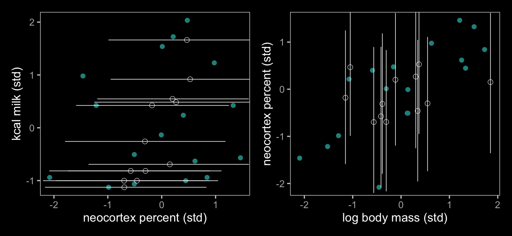

“We can improve this model by changing the imputation model to estimate
the relationship between the two predictors” (p. 509). In the text,
McElreath accomplished this with the model

\[
\begin{align*}
K_i   & \sim \operatorname{Normal}(\mu_i, \sigma) \\
\mu_i & = \alpha + \beta_1 \color{#5D01A6FF}{B_i} + \beta_2 \log M_i \\
\color{#5D01A6FF}{\begin{bmatrix} M_i \\ B_i \end{bmatrix}} & \color{#5D01A6FF} \sim \color{#5D01A6FF}{\operatorname{MVNormal}
\begin{pmatrix} 
\begin{bmatrix} \mu_M \\\mu_B \end{bmatrix}, 
\mathbf \Sigma \end{pmatrix}} \\
\alpha  & \sim \operatorname{Normal}(0, 0.5) \\
\beta_1 & \sim \operatorname{Normal}(0, 0.5) \\
\beta_2 & \sim \operatorname{Normal}(0, 0.5) \\
\sigma  & \sim \operatorname{Exponential}(1) \\
\color{#5D01A6FF}{\mu_M} & \color{#5D01A6FF} \sim \color{#5D01A6FF}{\operatorname{Normal}(0, 0.5)} \\
\color{#5D01A6FF}{\mu_B} & \color{#5D01A6FF} \sim \color{#5D01A6FF}{\operatorname{Normal}(0, 0.5)} \\
\color{#5D01A6FF}{\mathbf \Sigma} & \color{#5D01A6FF} = \color{#5D01A6FF}{\operatorname{\mathbf S \mathbf R \mathbf S}} \\
\color{#5D01A6FF}{\mathbf S} & \color{#5D01A6FF} = \color{#5D01A6FF}{\begin{bmatrix} \sigma_M & 0 \\ 0 & \sigma_B \end{bmatrix}} \\
\color{#5D01A6FF}{\mathbf R} & \color{#5D01A6FF} = \color{#5D01A6FF}{\begin{bmatrix} 1 & \rho \\ \rho & 1 \end{bmatrix}} \\
\color{#5D01A6FF}{\sigma_M}  & \color{#5D01A6FF} \sim \color{#5D01A6FF}{\operatorname{Exponential}(1)} \\
\color{#5D01A6FF}{\sigma_B}  & \color{#5D01A6FF} \sim \color{#5D01A6FF}{\operatorname{Exponential}(1)} \\
\color{#5D01A6FF} \rho       & \color{#5D01A6FF} \sim \color{#5D01A6FF}{\operatorname{LKJ}(2)},
\end{align*}
\]

which expresses the relationship between the two predictors with a
residual correlation matrix, \(\mathbf \Sigma\). Importantly, though
\(\mathbf \Sigma\) involves the variables \(B_i\) and \(M_i\), it does
not directly involve the criterion, \(K_i\). As it turns out, **brms**
cannot handle a model of this form. When you fit multivariate models
with residual correlations, you have to set them for either all
variables or none of them. For a little more on this topic, you can skim
through the [*Brms and heterogeneous residual covariance - equivalent of
“at.level”
function*](https://discourse.mc-stan.org/t/brms-and-heterogeneous-residual-covariance-equivalent-of-at-level-function/6637)
thread on the Stan Forums. Bürkner’s response to the initial question
indicated this kind of model will be available in **brms** version 3.0+,
which I believe will entail a substantial reworkign of the multivariate
syntax. Until then, we can fit the alternative model

\[
\begin{align*}
K_i   & \sim \operatorname{Normal}(\mu_i, \sigma) \\
\mu_i & = \alpha + \beta_1 \color{#5D01A6FF}{B_i} + \beta_2 \log M_i \\
\color{#5D01A6FF}{B_i}   & \color{#5D01A6FF} \sim \color{#5D01A6FF}{\operatorname{Normal}(\nu_i, \sigma_B)} \\
\color{#5D01A6FF}{\nu_i} & \color{#5D01A6FF} = \color{#5D01A6FF}{\gamma + \delta_1 \log M_i} \\
\alpha  & \sim \operatorname{Normal}(0, 0.5) \\
\beta_1 & \sim \operatorname{Normal}(0, 0.5) \\
\beta_2 & \sim \operatorname{Normal}(0, 0.5) \\
\sigma  & \sim \operatorname{Exponential}(1) \\
\color{#5D01A6FF}\gamma     & \color{#5D01A6FF} \sim \color{#5D01A6FF}{\operatorname{Normal}(0, 0.5)} \\
\color{#5D01A6FF}{\delta_1} & \color{#5D01A6FF} \sim \color{#5D01A6FF}{\operatorname{Normal}(0, 0.5)} \\
\color{#5D01A6FF}{\sigma_B} & \color{#5D01A6FF} \sim \color{#5D01A6FF}{\operatorname{Exponential}(1)},
\end{align*}
\]

which captures the relation among the two predictors as a regression of
\(M_i\) predicting \(B_i\). Here’s how to fit the model with **brms**.

``` r
b_model <-
  mvbf(bf(k ~ 1 + mi(b) + m), 
       bf(b | mi() ~ 1 + m), 
       rescor = FALSE)

b15.7 <- 
  brm(data = d, 
      family = gaussian,
      b_model,
      prior = c(prior(normal(0, 0.5), class = Intercept, resp = k),
                prior(normal(0, 0.5), class = Intercept, resp = b),
                prior(normal(0, 0.5), class = b, resp = k),
                prior(normal(0, 0.5), class = b, resp = b),
                prior(exponential(1), class = sigma,     resp = k),
                prior(exponential(1), class = sigma,     resp = b)),
      iter = 2000, warmup = 1000, chains = 4, cores = 4,
      seed = 15,
      file = "/Users/solomonkurz/Dropbox/Recoding Statistical Rethinking 2nd ed/fits/b15.07")
```

Let’s see what we did.

``` r
print(b15.7)
```

    ##  Family: MV(gaussian, gaussian) 
    ##   Links: mu = identity; sigma = identity
    ##          mu = identity; sigma = identity 
    ## Formula: k ~ 1 + mi(b) + m 
    ##          b | mi() ~ 1 + m 
    ##    Data: d (Number of observations: 29) 
    ## Samples: 4 chains, each with iter = 2000; warmup = 1000; thin = 1;
    ##          total post-warmup samples = 4000
    ## 
    ## Population-Level Effects: 
    ##             Estimate Est.Error l-95% CI u-95% CI Rhat Bulk_ESS Tail_ESS
    ## k_Intercept     0.03      0.16    -0.29     0.33 1.00     4147     3012
    ## b_Intercept    -0.05      0.16    -0.37     0.26 1.00     3735     3243
    ## k_m            -0.65      0.23    -1.08    -0.20 1.00     2084     2911
    ## b_m             0.60      0.15     0.30     0.88 1.00     4515     3473
    ## k_mib           0.59      0.26     0.03     1.07 1.00     1765     2708
    ## 
    ## Family Specific Parameters: 
    ##         Estimate Est.Error l-95% CI u-95% CI Rhat Bulk_ESS Tail_ESS
    ## sigma_k     0.83      0.14     0.60     1.12 1.00     2317     2776
    ## sigma_b     0.71      0.13     0.51     0.99 1.00     1888     2626
    ## 
    ## Samples were drawn using sampling(NUTS). For each parameter, Bulk_ESS
    ## and Tail_ESS are effective sample size measures, and Rhat is the potential
    ## scale reduction factor on split chains (at convergence, Rhat = 1).

We have two intercepts, `k_Intercept` (\(\alpha\)) and `b_Intercept`
(\(\gamma\)). Both are near zero because both `k` and `b` are
standardized. Our `k_mib` (\(\beta_1\)) and `k_m` (\(\beta_2\))
parameters correspond with McElreath’s `bB` and `bM` parameters,
respectively. Our summaries for them are very similar to his. Notice our
summary for `b_m` (\(\delta_1\)). McElreath doesn’t have a parameter
exactly like that, but his close analogue is `Rho_BM[1,2]` (also
`Rho_BM[2,1]`, which is really the same thing). Also, notice how our
summary for `b_m` is almost the same as the summary for McElreath’s
`Rho_BM[1,2]`. This is because a univariable regression coefficient
between two standardized variables is in the same metric as a
correlation and McElreath’s `Rho_BM[1,2]` is just that–a correlation. If
you fit McElreath’s model with **rethinking** and execute `precis(m15.7,
depth = 3)`, you’ll see that our `sigma_k` (\(\sigma\)) summary
corresponds nicely with his summary for `sigma`. However, our `sigma_b`
(\(\sigma_B\)) is not the same as his `Sigma_BM[2]`. Why? Because
whereas our `sigma_b` is a residual standard deviation after accounting
for the effect of `m` on `b`, McElreath’s `Sigma_BM[2]` is just an
estimate of the standard deviation of `b`. Also, notice that whereas
McElreath’s output has a `Sigma_BM[1]` parameter, we have no direct
analogue. Why? Because although `m` is a predictor variable for both `k`
and `b`, we did not give it its own likelihood. McElreath, in contrast,
entered `m` into the bivariate likelihood with `b`.

Our workflow for Figure 15.6 is largely the same as for Figure 15.5. The
biggest difference is we need to remove the columns `term` through
`upper` from our earlier model before we can replace them with those
from the current model. After that, it’s basically cut and paste.

``` r
d <-
  d %>% 
  select(-(term:upper)) %>% 
  left_join(
    tidy(b15.7) %>%
      filter(str_detect(term, "Ymi")) %>% 
      mutate(row = str_extract(term, "(\\d)+") %>% as.integer()),
    by = "row"
  ) 

d %>% 
  select(species, k:upper)
```

    ##                     species          k            b          m row      term    estimate std.error
    ## 1            Eulemur fulvus -0.9400408 -2.080196025 -0.4558357   1      <NA>          NA        NA
    ## 2                  E macaco -0.8161263           NA -0.4150024   2  Ymi_b[2] -0.59675787 0.6844536
    ## 3                  E mongoz -1.1259125           NA -0.3071581   3  Ymi_b[3] -0.64115105 0.6769265
    ## 4             E rubriventer -1.0019980           NA -0.5650254   4  Ymi_b[4] -0.77746004 0.6791844
    ## 5               Lemur catta -0.2585112           NA -0.3874772   5  Ymi_b[5] -0.39920411 0.6573925
    ## 6        Alouatta seniculus -1.0639553 -0.508641289  0.1274408   6      <NA>          NA        NA
    ## 7                A palliata -0.5063402 -0.508641289  0.1407505   7      <NA>          NA        NA
    ## 8              Cebus apella  1.5382486  0.010742472 -0.3071581   8      <NA>          NA        NA
    ## 9       Saimiri boliviensis  1.6621631           NA -1.0508443   9  Ymi_b[9] -0.22797476 0.6922921
    ## 10               S sciureus  1.7241203  0.213469683 -1.0762697  10      <NA>          NA        NA
    ## 11         Cebuella pygmaea  0.9806335 -1.461961806 -2.0978301  11      <NA>          NA        NA
    ## 12        Callimico goeldii -1.1259125 -0.986139263 -1.2937974  12      <NA>          NA        NA
    ## 13       Callithrix jacchus  0.4230184 -1.215673377 -1.5201893  13      <NA>          NA        NA
    ## 14   Leontopithecus rosalia  0.4230184           NA -1.1499822  14 Ymi_b[14] -0.70536844 0.6513383
    ## 15  Chlorocebus pygerythrus  0.5469328           NA -0.1164199  15 Ymi_b[15]  0.05392785 0.6624942
    ## 16      Miopithecus talpoin  0.2371467  0.401118009 -0.5910392  16      <NA>          NA        NA
    ## 17                M fuscata  0.4849756           NA  0.3035582  17 Ymi_b[17]  0.32686418 0.6453317
    ## 18                M mulatta  2.0339065  0.474836995 -0.1568095  18      <NA>          NA        NA
    ## 19                 M sinica  0.9186762           NA  0.3710728  19 Ymi_b[19]  0.51607282 0.6740093
    ## 20                Papio spp  1.2284624  0.975791010  0.6288397  20      <NA>          NA        NA
    ## 21        Nomascus concolor -1.0019980           NA  0.3445228  21 Ymi_b[21] -0.12615622 0.6514182
    ## 22            Hylobates lar -0.1345968 -0.007687274  0.1407505  22      <NA>          NA        NA
    ## 23 Symphalangus syndactylus -0.8161263           NA  0.5478687  23 Ymi_b[23]  0.06913218 0.6675002
    ## 24           Pongo pygmaeus -0.6302546  0.617248671  1.2527355  24      <NA>          NA        NA
    ## 25  Gorilla gorilla gorilla -0.9400408  0.841756491  1.7273591  25      <NA>          NA        NA
    ## 26       G gorilla beringei -0.6922119           NA  1.8494033  26 Ymi_b[26]  1.00632208 0.6773180
    ## 27             Pan paniscus -1.0019980  0.446354659  1.3341500  27      <NA>          NA        NA
    ## 28            P troglodytes -0.5682974  1.461666141  1.2120204  28      <NA>          NA        NA
    ## 29             Homo sapiens  0.4230184  1.325956191  1.5103660  29      <NA>          NA        NA
    ##         lower     upper
    ## 1          NA        NA
    ## 2  -1.7347268 0.5560776
    ## 3  -1.7224015 0.4656298
    ## 4  -1.8658769 0.3531543
    ## 5  -1.4873119 0.6803921
    ## 6          NA        NA
    ## 7          NA        NA
    ## 8          NA        NA
    ## 9  -1.3433468 0.9092902
    ## 10         NA        NA
    ## 11         NA        NA
    ## 12         NA        NA
    ## 13         NA        NA
    ## 14 -1.7517185 0.3557948
    ## 15 -1.0417258 1.1307781
    ## 16         NA        NA
    ## 17 -0.7293230 1.3998026
    ## 18         NA        NA
    ## 19 -0.6189157 1.5914316
    ## 20         NA        NA
    ## 21 -1.1904479 0.9023740
    ## 22         NA        NA
    ## 23 -1.0352259 1.1573161
    ## 24         NA        NA
    ## 25         NA        NA
    ## 26 -0.1272335 2.1082426
    ## 27         NA        NA
    ## 28         NA        NA
    ## 29         NA        NA

Now make Figure 15.6.

``` r
color <- viridis_pal(option = "D")(7)[3]

p1 <-
  d %>% 
  ggplot(aes(y = k)) +
  geom_point(aes(x = b),
             color = color) +
  geom_pointrange(aes(x = estimate, xmin = lower, xmax = upper),
                  shape = 1, size = 1/4, fatten = 8, stroke = 1/4) +
  labs(x = "neocortex percent (std)",
       y = "kcal milk (std)") +
  coord_cartesian(xlim = range(d$b, na.rm = T))

p2 <-
  d %>% 
  ggplot(aes(x = m)) +
  geom_point(aes(y = b),
             color = color) +
  geom_pointrange(aes(y = estimate, ymin = lower, ymax = upper),
                  shape = 1, size = 1/4, fatten = 8, stroke = 1/4) +
  labs(x = "log body mass (std)",
       y = "neocortex percent (std)") +
  coord_cartesian(ylim = range(d$b, na.rm = T))

p1 + p2
```

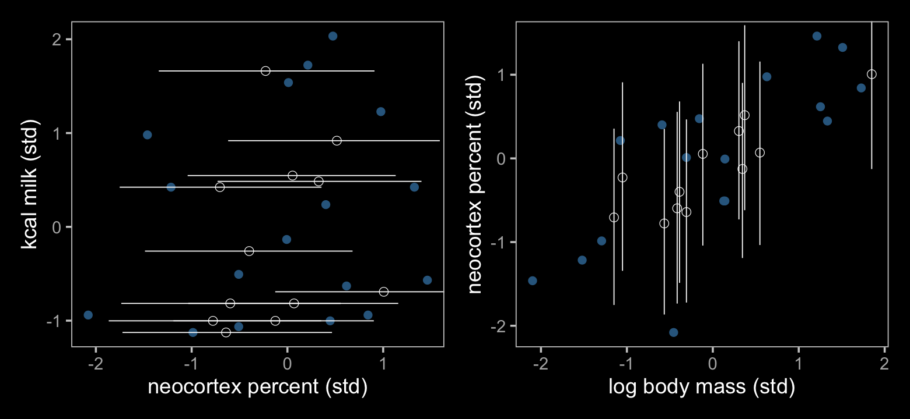

The results further show that our fully standardized regression
coefficient (\(\delta_1\)) had the same effect on the Bayesian
imputation as McElreath’s residual correlation. Our \(\delta_1\)
coefficient is basically just a correlation in disguise.

#### Rethinking: Multiple imputations.

> Missing data imputation has a messy history. There are many forms of
> imputation… A common non-Bayesian procedure is **multiple
> imputation**. Multiple imputation was developed in the context of
> survey non-response, and it actually has a Bayesian justification. But
> it was invented when Bayesian imputation on the desktop was
> impractical, so it tries to approximate the full Bayesian solution to
> a “missing at random” missingness model. If you aren’t comfortable
> dropping incomplete cases, then you shouldn’t be comfortable using
> multiple imputation either. The procedure performs multiple draws from
> an approximate posterior distribution of the missing values, performs
> separate analyses with these draws, and then combines the analyses in
> a way that approximates full Bayesian imputation. Multiple imputation
> is more limited than full Bayesian imputation, so now we just use the
> real thing. (p. 511)

We won’t be walking through an example in this ebook, but you should
know that **brms** is capable of multiple imputation, too. You can find
an example of multiple imputation in Bürkner’s
(<span class="citeproc-not-found" data-reference-id="Bürkner2020HandleMissingValues">**???**</span>)
vignette, [*Handle missing values with
brms*](https://CRAN.R-project.org/package=brms/vignettes/brms_missings.html).
To learn about the origins of this approach, check out the authoritative
work by Rubin
(<span class="citeproc-not-found" data-reference-id="rubinMultipleImputationNonresponse1987">**???**</span>;
<span class="citeproc-not-found" data-reference-id="rubinMultipleImputation181996">**???**</span>;
<span class="citeproc-not-found" data-reference-id="littleStatisticalAnalysisMissing2019">**???**</span>).

### 15.2.3. Where is your god now?

“Sometimes there are no statistical solutions to scientific problems.
But even then, careful statistical thinking can be useful because it
will tell us that there is no statistical solution” (p. 512).

Let’ load the `Moralizing_gods` data from
(<span class="citeproc-not-found" data-reference-id="whitehouseComplexSocietiesPrecede2019">**???**</span>).

``` r
data(Moralizing_gods, package = "rethinking")
d <- Moralizing_gods
rm(Moralizing_gods)
```

Take a look at the new data.

``` r
glimpse(d)
```

    ## Rows: 864
    ## Columns: 5
    ## $ polity          <fct> Big Island Hawaii, Big Island Hawaii, Big Island Hawaii, Big Island Hawai…
    ## $ year            <int> 1000, 1100, 1200, 1300, 1400, 1500, 1600, 1700, 1800, -600, -500, -400, -…
    ## $ population      <dbl> 3.729643, 3.729643, 3.598340, 4.026240, 4.311767, 4.205113, 4.373960, 5.1…
    ## $ moralizing_gods <int> NA, NA, NA, NA, NA, NA, NA, NA, 1, NA, NA, NA, NA, NA, NA, NA, NA, NA, NA…
    ## $ writing         <int> 0, 0, 0, 0, 0, 0, 0, 0, 0, 0, 0, 0, 0, 0, 0, 0, 0, 0, 0, 0, 0, 0, 0, 0, 0…

The bulk of the values for `moralizing_gods` are missing and very few
are `0`’s.

``` r
d %>% 
  count(moralizing_gods) %>% 
  mutate(`%` = 100 * n / sum(n))
```

    ##   moralizing_gods   n         %
    ## 1               0  17  1.967593
    ## 2               1 319 36.921296
    ## 3              NA 528 61.111111

To get a sense of how these values are distributed, here’s our version
of Figure 15.7.

``` r
d %>% 
  mutate(mg = factor(ifelse(is.na(moralizing_gods), 2, 1 - moralizing_gods),
                     levels = 0:2,
                     labels = c("present", "absent", "unknown"))) %>% 
  
  ggplot(aes(x = year, y = population, color = mg)) +
  geom_point(alpha = 2/3) +
  scale_color_manual("Moralizing gods", 
                     values = viridis_pal(option = "D")(7)[c(7, 4, 1)]) +
  labs(subtitle = '"This is a highly non-random missingness pattern" (p. 514).',
       x = "Time (year)",
       y = "Population size (log)") +
  theme(legend.position = c(.125, .75))
```

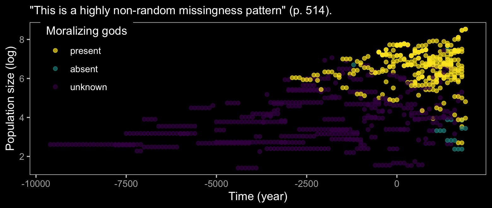

Here are the counts broken down by gods and literacy status.

``` r
d %>% 
  mutate(gods     = moralizing_gods,
         literacy = writing) %>% 
  count(gods, literacy) %>% 
  mutate(`%` = 100 * n / sum(n))
```

    ##   gods literacy   n          %
    ## 1    0        0  16  1.8518519
    ## 2    0        1   1  0.1157407
    ## 3    1        0   9  1.0416667
    ## 4    1        1 310 35.8796296
    ## 5   NA        0 442 51.1574074
    ## 6   NA        1  86  9.9537037

The bulk of the missing `moralizing_gods` values are from non-literate
polities and the figure above shows that smaller polities also tend to
have missing values. We can try to make sense of all this with
McElreath’s DAG.

``` r
dag_coords <-
  tibble(name = c("P", "W", "G", "RG", "Gs"),
         x    = c(1, 2.33, 4, 5.67, 7),
         y    = c(2, 1, 2, 1, 2))

dagify(P ~ G,
       W ~ P,
       RG ~ W,
       Gs ~ G + RG,
       coords = dag_coords) %>%
  tidy_dagitty() %>% 
  mutate(color = ifelse(name == "G", "a", "b")) %>% 
  
  ggplot(aes(x = x, y = y, xend = xend, yend = yend)) +
  geom_dag_point(aes(color = color),
                 size = 10, show.legend = F) +
  geom_dag_text(parse = T, label = c("G", "P", expression(R[G]), "W", expression(G^'*'))) +
  geom_dag_edges(edge_colour = "#FCF9F0") +
  scale_color_manual(values = c(viridis_pal(option = "C")(7)[2], "black")) +
  dark_theme_void()
```

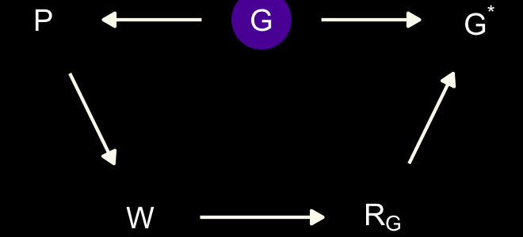

> Here \(P\) is rate of population growth (not the same as the
> population size variable in the data), \(G\) is the presence of belief
> in moralizing gods (which is unobserved), \(G^*\) is the observed
> variable with missing values, \(W\) is writing, and \(R_G\) is the
> missing values indicator. This is an optimistic scenario, because it
> assumes there are no unobserved confounds among \(P\), \(G\), and
> \(W\). These are purely observational data, recall. But the goal is to
> use this example to think through the impact of missing data. If we
> can’t recover from missing data with the DAG above, adding confounds
> isn’t going to help. (p. 515)

Consider the case of Hawaii.

``` r
d %>% 
  filter(polity == "Big Island Hawaii") %>% 
  select(year, writing, moralizing_gods)
```

    ##   year writing moralizing_gods
    ## 1 1000       0              NA
    ## 2 1100       0              NA
    ## 3 1200       0              NA
    ## 4 1300       0              NA
    ## 5 1400       0              NA
    ## 6 1500       0              NA
    ## 7 1600       0              NA
    ## 8 1700       0              NA
    ## 9 1800       0               1

> What happened in 1778? Captain James Cook and his crew finally made
> contact….
> 
> After Captain Cook, Hawaii is correctly coded with 1 for belief in
> moralizing gods. It is also a fact that Hawaii never developed its own
> writing system. So there is no direct evidence of when moralizing gods
> appeared in Hawaii. Any imputation model needs to decide how to fill
> in those `NA` values. With so much missing data, any imputation model
> would necessarily make very strong assumptions. (pp. 515–516)

#### Rethinking: Present details about missing data.

> Clear documentation of missing data and its treatment is necessary.
> This is best done with a causal model that makes transparent what is
> being assumed about the source of missing values and simultaneously
> justifies how they are handled. But the minimum is to report the
> counts of missing values in each variable and what was done with them.
> (p. 516)

## 15.3. Categorical errors and discrete absences

### 15.3.1. Discrete cats.

``` r
set.seed(9)

n_houses <- 1000L 
alpha <- 5
beta <- (-3)
k <- 0.5
r <- 0.2

dat <-
  tibble(cat = rbinom(n_houses, size = 1, prob = k)) %>% 
  mutate(notes   = rpois(n_houses, lambda = alpha + beta * cat),
         r_c     = rbinom(n_houses, size = 1, prob = r)) %>% 
  mutate(cat_obs = if_else(r_c == 1, (-9L), cat))

dat
```

    ## # A tibble: 1,000 x 4
    ##      cat notes   r_c cat_obs
    ##    <int> <int> <int>   <int>
    ##  1     0     3     0       0
    ##  2     0     5     0       0
    ##  3     0    11     0       0
    ##  4     0     6     0       0
    ##  5     0     9     0       0
    ##  6     0     6     0       0
    ##  7     0     6     1      -9
    ##  8     0     6     0       0
    ##  9     1     1     0       1
    ## 10     1     3     0       1
    ## # … with 990 more rows

If you execute `log_sum_exp`, you’ll discover it’s a custom function
defined like this.

``` r
log_sum_exp <- function (x) {
    xmax <- max(x)
    xsum <- sum(exp(x - xmax))
    xmax + log(xsum)
}
```

“This function just takes a vector of log-probabilities, exponentiates
them, sums them, and then returns the log of the sum. But it does all of
this in a numerically stable way” (p. 519). For example here’s what it
does with the vector of log probabilities, \(\log [.1, .2, .3]\).

``` r
log(1:3 / 10) %>% 
  log_sum_exp()
```

    ## [1] -0.5108256

``` r
log(-3)
```

    ## Warning in log(-3): NaNs produced

    ## [1] NaN

``` r
library(rethinking)

dat <- 
  list(notes = dat$notes,
       cat   = dat$cat_obs,
       RC    = dat$r_c,
       N     = as.integer(n_houses))

m15.8 <- ulam( 
  alist(
    # singing bird model
    ## cat known present/absent: 
    notes | RC == 0 ~ poisson(lambda), 
    log(lambda) <- a + b * cat,
    
    ## cat NA:
    notes | RC == 1 ~ custom(log_sum_exp(
      log(k) + poisson_lpmf(notes | exp(a + b)),
      log(1 - k) + poisson_lpmf(notes | exp(a)) 
    )),
    
    # priors
    a ~ normal(0, 1), 
    b ~ normal(0, 0.5),
    
    # sneaking cat model 
    cat | RC == 0 ~ bernoulli(k),
    k ~ beta(2, 2)
  ), 
  data = dat, chains = 4, cores = 4)
```

Here’s a look at the posterior summary.

``` r
precis(m15.8)
```

``` r
extract.samples(m15.8) %>% 
  data.frame() %>% 
  mutate(N  = exp(a),
         Nc = exp(a + b)) %>% 
  pivot_longer(k:Nc) %>%
  mutate(name = factor(name,
                      levels = c("N", "Nc", "k"),
                      labels = c("italic(N[i])*' | '*no~cat", "italic(N[i])*' | '*cat", "probability~of~a~cat"))) %>% 
  
  ggplot(aes(x = value)) +
  stat_halfeye(.width = .95, normalize = "panels",
               color = "white", fill = viridis_pal(option = "C")(7)[3]) +
  scale_y_continuous(NULL, breaks = NULL) +
  xlab("marginal posterior") +
  facet_wrap(~name, scales = "free", labeller = label_parsed)
```

``` r
exp(c(1.59, -0.93))
```

    ## [1] 4.9037489 0.3945537

### Improving the imputation model

Like McElreath, we’ll update the imputation line of our statistical
model to:

which includes the updated priors

As far as the brms code goes, adding `logmass` as a predictor to the
`neocortex` submodel is pretty simple.

``` r
# define the model
b_model <- 
  bf(kcal ~ 1 + mi(neocortex) + logmass) + 
  bf(neocortex | mi() ~ 1 + logmass) + # here's the big difference
  set_rescor(FALSE)
# fit the model
b14.4 <- 
  brm(data = data_list, 
      family = gaussian,
      b_model,
      prior = c(prior(normal(0, 100), class = Intercept, resp = kcal),
                prior(normal(0.5, 1), class = Intercept, resp = neocortex),
                prior(normal(0, 10),  class = b,         resp = kcal),
                prior(normal(0, 10),  class = b,         resp = neocortex),
                prior(cauchy(0, 1),   class = sigma,     resp = kcal),
                prior(cauchy(0, 1),   class = sigma,     resp = neocortex)),
      iter = 1e4, chains = 2, cores = 2,
      seed = 14,
      file = "fits/b14.04")
```

Behold the parameter estimates.

``` r
tidy(b14.4) %>%
  mutate_if(is.numeric, round, digits = 2)
```

Here’s our pre-Figure 14.5 data wrangling.

``` r
f_b14.4 <-
  fitted(b14.4, newdata = nd) %>%
  as_tibble() %>%
  bind_cols(nd)
f_b14.4_mi <-
  tidy(b14.4) %>%
  filter(str_detect(term, "Ymi")) %>%
  bind_cols(
    data_list %>%
      as_tibble() %>%
      filter(is.na(neocortex))
    )
f_b14.4 %>%
  glimpse()
f_b14.4_mi %>%
  glimpse()
```

For our final plots, let’s play around with colors from
`viridis_pal(option = "D")`. Here’s the code for Figure 14.5.a.

``` r
color <- viridis_pal(option = "D")(7)[3]
p1 <-
  f_b14.4 %>% 
  ggplot(aes(x = neocortex)) +
  geom_smooth(aes(y = Estimate.kcal, ymin = Q2.5.kcal, ymax = Q97.5.kcal),
              stat = "identity",
              fill = color, color = color, alpha = 1/2, size = 1/2) +
  geom_point(data = data_list %>% as_tibble(),
             aes(y = kcal),
             color = "white") +
  geom_point(data = f_b14.4_mi,
             aes(x = estimate, y = kcal),
             color = color, shape = 1) +
  geom_segment(data = f_b14.4_mi, 
               aes(x = lower, xend = upper,
                   y = kcal, yend = kcal),
               color = color, size = 1/4) +
  labs(subtitle = "Note: For the regression line in this plot,\nlog(mass) has been set to its median, 1.244.",
       x = "neocortex proportion",
       y = "kcal per gram") +
  coord_cartesian(xlim = c(.55, .8),
                  ylim = range(data_list$kcal, na.rm = T))
```

Make the code for Figure 14.5.b, combine it with Figure 14.5.a, and
plot.

``` r
color <- viridis_pal(option = "D")(7)[3]
p2 <-
  data_list %>% 
  as_tibble() %>% 
  
  ggplot(aes(x = logmass, y = neocortex)) +
  geom_point(color = "white") +
  geom_pointrange(data = f_b14.4_mi,
                  aes(y = estimate, ymin = lower, ymax = upper),
                  color = color, size = 1/3, shape = 1) +
  scale_x_continuous("log(mass)", breaks = -2:4) +
  ylab("neocortex proportion") +
  coord_cartesian(xlim = range(data_list$logmass, na.rm = T),
                  ylim = c(.55, .8))
p1 | p2
```

If modern missing data methods are new to you, you might also check out
van Burren’s great online text, [*Flexible Imputation of Missing Data.
Second Edition*](https://stefvanbuuren.name/fimd/). I’m also a fan of
Enders’s [*Applied Missing Data
Analysis*](http://www.appliedmissingdata.com), for which you can find a
free sample chapter
[here](http://www.appliedmissingdata.com/sample-chapter.pdf). I’ll also
quickly mention that [brms accommodates multiple
imputation](https://cran.r-project.org/package=brms/vignettes/brms_missings.html),
too.

## ~~Summary~~ Bonus: Bayesian meta-analysis with odds ratios

If your mind isn’t fully blown by those measurement-error and
missing-data models, let’s keep building. As it turns out, meta-analyses
are often just special kinds of multilevel measurement-error models.
Thus, you can use `brms::brm()` to fit Bayesian meta-analyses, too.

Before we proceed, I should acknowledge that this section is heavily
influenced by [Matti Vourre](https://mvuorre.github.io/#about)’s great
blog post, [*Meta-analysis is a special case of Bayesian multilevel
modeling*](https://mvuorre.github.io/post/2016/09/29/meta-analysis-is-a-special-case-of-bayesian-multilevel-modeling/).
Since neither editions of McElreath’s text directly address
meta-analyses, we’ll also have to borrow a bit from Gelman, Carlin,
Stern, Dunson, Vehtari, and Rubin’s ([2013](#ref-gelman2013bayesian))
[*Bayesian data analysis, Third
edition*](https://stat.columbia.edu/~gelman/book/).

### How do meta-analyses fit into the picture?

Let Gelman and colleagues introduce the topic:

> Discussions of meta-analysis are sometimes imprecise about the
> estimands of interest in the analysis, especially when the primary
> focus is on testing the null hypothesis of no effect in any of the
> studies to be combined. Our focus is on estimating meaningful
> parameters, and for this objective there appear to be three
> possibilities, accepting the overarching assumption that the studies
> are comparable in some broad sense. The first possibility is that we
> view the studies as identical replications of each other, in the sense
> we regard the individuals in all the studies as independent samples
> from a common population, with the same outcome measures and so on. A
> second possibility is that the studies are so different that the
> results of any one study provide no information about the results of
> any of the others. A third, more general, possibility is that we
> regard the studies as exchangeable but not necessarily either
> identical or completely unrelated; in other words we allow differences
> from study to study, but such that the differences are not expected *a
> priori* to have predictable effects favoring one study over another….
> this third possibility represents a continuum between the two
> extremes, and it is this exchangeable model (with unknown
> hyperparameters characterizing the population distribution) that forms
> the basis of our Bayesian analysis….
> 
> The first potential estimand of a meta-analysis, or a hierarchically
> structured problem in general, is the mean of the distribution of
> effect sizes, since this represents the overall ‘average’ effect
> across all studies that could be regarded as exchangeable with the
> observed studies. Other possible estimands are the effect size in any
> of the observed studies and the effect size in another, comparable
> (exchangeable) unobserved study. (pp. 125–126, *emphasis* in the
> original)

The basic version of a Bayesian meta-analysis follows the form

\[y_j \sim \operatorname{Normal}(\theta_j, \sigma_j),\]

where \(y_j\) = the point estimate for the effect size of a single
study, \(j\), which is presumed to have been a draw from a Normal
distribution centered on \(\theta_j\). The data in meta-analyses are
typically statistical summaries from individual studies. The one clear
lesson from this chapter is that those estimates themselves come with
error and those errors should be fully expressed in the meta-analytic
model. The standard error from study \(j\) is specified \(\sigma_j\),
which is also a stand-in for the standard deviation of the Normal
distribution from which the point estimate was drawn. Do note, we’re not
estimating \(\sigma_j\), here. Those values we take directly from the
original studies.

Building on the model, we further presume that study \(j\) is itself
just one draw from a population of related studies, each of which have
their own effect sizes. As such, we presume \(\theta_j\) itself has a
distribution following the form

\[\theta_j \sim \operatorname{Normal}(\mu, \tau),\]

where \(\mu\) is the meta-analytic effect (i.e., the population mean)
and \(\tau\) is the variation around that mean, what you might also
think of as \(\sigma_\tau\).

### We need some data.

Our data in this section come from the second large-scale replication
project by the Many Labs team
(<span class="citeproc-not-found" data-reference-id="kleinManyLabsInvestigating2018">**???**</span>).
Of the 28 studies replicated in the study, we will focus on the
replication of the trolley experiment from
(<span class="citeproc-not-found" data-reference-id="hauserDissociationMoralJudgments2007">**???**</span>).
Here’s how the study was described by Klein and colleagues:

> According to the principle of double effect, an act that harms other
> people is more morally permissible if the act is a foreseen side
> effect rather than the means to the greater good.
> (<span class="citeproc-not-found" data-reference-id="hauserDissociationMoralJudgments2007">**???**</span>)
> compared participants’ reactions to two scenarios to test whether
> their judgments followed this principle. In the *foreseen-side-effect*
> scenario, a person on an out-of-control train changed the train’s
> trajectory so that the train killed one person instead of five. In the
> *greater-good* scenario, a person pushed a fat man in front of a
> train, killing him, to save five people. Whereas \(89\%\) of
> participants judged the action in the foreseen-side-effect scenario as
> permissible \((95 \% \; \text{CI} = [87\%, 91\%]),\) only \(11\%\) of
> participants in the greater-good scenario judged it as permissible
> \((95 \% \; \text{CI} = [9\%, 13\%])\). The difference between the
> percentages was significant\(, \chi^2(1, N = 2,646) = 1,615.96,\)
> \(p < .001,\) \(w = .78,\) \(d = 2.50,\)
> \(95 \% \; \text{CI} = [2.22, 2.86]\). Thus, the results provided
> evidence for the principle of double effect. (p. 459, *emphasis* in
> the original)

You can find supporting materials for the replication project on the
Open Science Framework at <https://osf.io/8cd4r/>. The relevant subset
of the data for the replication of Hauser et al. come from the `Trolley
Dilemma 1 (Hauser et al., 2007)` folder within the `OSFdata.zip`
(<https://osf.io/ag2pd/>). I’ve downloaded the file and saved it on
GitHub.

Here we load the data.

``` r
d <- 
  readr::read_csv("https://raw.githubusercontent.com/ASKurz/Statistical_Rethinking_with_brms_ggplot2_and_the_tidyverse_2_ed/master/data/Hauser_1_study_by_order_all_CLEAN_CASE.csv")

d <- 
  d %>% 
  mutate(y   = ifelse(variable == "Yes", 1, 0),
         loc = factor(Location,
                      levels = distinct(d, Location) %>% pull(Location),
                      labels = 1:59))

glimpse(d)
```

    ## Rows: 6,842
    ## Columns: 29
    ## $ uID              <dbl> 65, 68, 102, 126, 145, 263, 267, 298, 309, 318, 350, 356, 376, 431, 438,…
    ## $ variable         <chr> "Yes", "Yes", "Yes", "Yes", "Yes", "No", "Yes", "Yes", "No", "Yes", "Yes…
    ## $ factor           <chr> "SideEffect", "SideEffect", "SideEffect", "SideEffect", "SideEffect", "S…
    ## $ .id              <chr> "ML2_Slate1_Brazil__Portuguese_execution_illegal_r.csv", "ML2_Slate1_Bra…
    ## $ source           <chr> "brasilia", "brasilia", "brasilia", "wilfredlaur", "wilfredlaur", "ubc",…
    ## $ haus1.1          <dbl> 1, 1, 1, 1, 1, 2, 1, 1, 2, 1, 1, 1, 1, 1, 1, 2, 1, 1, 2, 1, 1, 2, 1, 1, …
    ## $ haus1.1t_1       <dbl> 39.054, 36.792, 56.493, 21.908, 25.635, 50.633, 58.661, 50.137, 51.717, …
    ## $ haus2.1          <dbl> NA, NA, NA, NA, NA, NA, NA, NA, NA, NA, NA, NA, NA, NA, NA, NA, NA, NA, …
    ## $ haus2.1t_1       <dbl> NA, NA, NA, NA, NA, NA, NA, NA, NA, NA, NA, NA, NA, NA, NA, NA, NA, NA, …
    ## $ Source.Global    <chr> "brasilia", "brasilia", "brasilia", "wilfredlaur", "wilfredlaur", "ubc",…
    ## $ Source.Primary   <chr> "brasilia", "brasilia", "brasilia", "wilfredlaur", "wilfredlaur", "ubc",…
    ## $ Source.Secondary <chr> "brasilia", "brasilia", "brasilia", "wilfredlaur", "wilfredlaur", "ubc",…
    ## $ Country          <chr> "Brazil", "Brazil", "Brazil", "Canada", "Canada", "Canada", "Canada", "C…
    ## $ Location         <chr> "Social and Work Psychology Department, University of Brasilia, DF, Braz…
    ## $ Language         <chr> "Portuguese", "Portuguese", "Portuguese", "English", "English", "English…
    ## $ Weird            <dbl> 0, 0, 0, 1, 1, 1, 1, 1, 1, 1, 1, 1, 1, 1, 1, 1, 1, 1, 1, 1, 1, 1, 1, 1, …
    ## $ Execution        <chr> "illegal", "illegal", "illegal", "illegal", "illegal", "illegal", "illeg…
    ## $ SubjectPool      <chr> "No", "No", "No", "Yes", "Yes", "Yes", "Yes", "Yes", "Yes", "Yes", "Yes"…
    ## $ Setting          <chr> "In a classroom", "In a classroom", "In a classroom", "In a lab", "In a …
    ## $ Tablet           <chr> "Computers", "Computers", "Computers", "Computers", "Computers", "Comput…
    ## $ Pencil           <chr> "No, the whole study was on the computer (except maybe consent/debriefin…
    ## $ StudyOrderN      <chr> "Hauser|Ross.Slate1|Rottenstrich|Graham|Kay|Inbar|Anderson|VanLange|Huan…
    ## $ IDiffOrderN      <chr> "ID: Global self-esteem SISE|ID: Mood|ID: Subjective wellbeing|ID: Disgu…
    ## $ study.order      <dbl> 1, 1, 1, 1, 1, 1, 1, 1, 1, 1, 1, 1, 1, 1, 1, 1, 1, 1, 1, 1, 1, 1, 1, 1, …
    ## $ analysis.type    <chr> "Order", "Order", "Order", "Order", "Order", "Order", "Order", "Order", …
    ## $ subset           <chr> "all", "all", "all", "all", "all", "all", "all", "all", "all", "all", "a…
    ## $ case.include     <lgl> TRUE, TRUE, TRUE, TRUE, TRUE, TRUE, TRUE, TRUE, TRUE, TRUE, TRUE, TRUE, …
    ## $ y                <dbl> 1, 1, 1, 1, 1, 0, 1, 1, 0, 1, 1, 1, 1, 1, 1, 0, 1, 1, 0, 1, 1, 0, 1, 1, …
    ## $ loc              <fct> 1, 1, 1, 2, 2, 3, 3, 4, 4, 4, 4, 4, 4, 4, 4, 4, 3, 4, 4, 3, 4, 4, 4, 4, …

The total sample size is \(N = 6,842\).

``` r
d %>% 
  distinct(uID) %>% 
  count()
```

    ## # A tibble: 1 x 1
    ##       n
    ##   <int>
    ## 1  6842

All cases are to be included.

``` r
d %>% 
  count(case.include)
```

    ## # A tibble: 1 x 2
    ##   case.include     n
    ##   <lgl>        <int>
    ## 1 TRUE          6842

The data were collected in 59 locations with sample sizes ranging from
34 to 325.

``` r
d %>% 
  count(Location) %>% 
  arrange(desc(n))
```

    ## # A tibble: 59 x 2
    ##    Location                                                                                        n
    ##    <chr>                                                                                       <int>
    ##  1 University of Toronto, Scarborough                                                            325
    ##  2 MTurk India Workers                                                                           308
    ##  3 MTurk US Workers                                                                              304
    ##  4 University of Illinois at Urbana-Champaign, Champaign, IL                                     198
    ##  5 Eotvos Lorand University, in Budapest, Hungary                                                180
    ##  6 Department of Social Psychology, Tilburg University, P.O. Box 90153, Tilburg, 5000 LE, Net…   173
    ##  7 Department of Psychology, San Diego State University, San Diego, CA 92182                     171
    ##  8 Department of Psychology, Pennsylvania State University Abington, Abington, PA 19001          166
    ##  9 American University of Sharjah, United Arab Emirates                                          162
    ## 10 University of British Columbia, Vancouver, Canada                                             147
    ## # … with 49 more rows

### Our effect size will be an odds ratio.

Here’s how Klein and colleagues summarized their primary results:

> In the aggregate replication sample \((N = 6,842\) after removing
> participants who responded in less than \(4\) s\(), 71\%\) of
> participants judged the action in the foreseen-side-effect scenario as
> permissible, but only \(17\%\) of participants in the greater-good
> scenario judged it as permissible. The difference between the
> percentages was significant, \(p = 2.2 \text e^{-16},\)
> \(\text{OR} = 11.54,\) \(d = 1.35,\)
> \(95\% \; \text{CI} = [1.28, 1.41]\). The replication results were
> consistent with the double-effect hypothesis, and the effect was about
> half the magnitude of the original \((d = 1.35,\)
> \(95\% \; \text{CI} = [1.28, 1.41],\) vs. original \(d = 2.50)\).
> (p. 459)

Here is the breakdown of the outcome and primary experimental condition,
which will confirm the two empirical percentages mentioned, above.

``` r
d %>% 
  count(variable, factor) %>% 
  group_by(factor) %>% 
  mutate(percent = 100 * n / sum(n))
```

    ## # A tibble: 4 x 4
    ## # Groups:   factor [2]
    ##   variable factor          n percent
    ##   <chr>    <chr>       <int>   <dbl>
    ## 1 No       GreaterGood  2781    82.8
    ## 2 No       SideEffect   1026    29.4
    ## 3 Yes      GreaterGood   577    17.2
    ## 4 Yes      SideEffect   2458    70.6

Though the authors presented their overall effect size with a
\(p\)-value, an odds-ratio (OR), and a Cohen’s \(d\) (i.e., a kind of
standardized mean difference), we will focus on the OR. The primary data
are binomial counts, which are well-handled with logistic regression.
When you perform a logistic regression where a control condition is
compared with some experimental condition, the difference between those
conditions may be expressed as an OR. To get a sense of what that is,
we’ll first practice fitting a logistic regression model with the
frequentist `glm()` function. Here are the results based on the subset
of data from the first location.

``` r
glm0 <- glm(y ~ factor, family = binomial(logit), data = d %>% filter(loc == 1))

summary(glm0)
```

    ## 
    ## Call:
    ## glm(formula = y ~ factor, family = binomial(logit), data = d %>% 
    ##     filter(loc == 1))
    ## 
    ## Deviance Residuals: 
    ##     Min       1Q   Median       3Q      Max  
    ## -1.5227  -0.6231  -0.6231   0.8677   1.8626  
    ## 
    ## Coefficients:
    ##                  Estimate Std. Error z value Pr(>|z|)    
    ## (Intercept)       -1.5404     0.3673  -4.194 2.74e-05 ***
    ## factorSideEffect   2.3232     0.4754   4.887 1.02e-06 ***
    ## ---
    ## Signif. codes:  0 '***' 0.001 '**' 0.01 '*' 0.05 '.' 0.1 ' ' 1
    ## 
    ## (Dispersion parameter for binomial family taken to be 1)
    ## 
    ##     Null deviance: 139.47  on 101  degrees of freedom
    ## Residual deviance: 110.98  on 100  degrees of freedom
    ## AIC: 114.98
    ## 
    ## Number of Fisher Scoring iterations: 4

Just like with **brms**, the base-**R** `glm()` function returns the
results of a logistic regression model in the log-odds metric. The
intercept is the log-odds probability of selecting *yes* in the study
for participants in the `GreaterGood` condition. The ‘factorSideEffect’
parameter is the difference in log-odds probability for participants in
the `SideEffect` condition. Here’s what happens when you exponentiate
that coefficient.

``` r
coef(glm0)[2] %>% exp()
```

    ## factorSideEffect 
    ##         10.20833

That, my friends, is an odds ratio (OR). **Odds ratios are simply
exponentiated logistic regression coefficients**. The implication of
this particular OR is that those in the `SideEffect` condition have
about 10 times the odds of selecting *yes* compared to those in the
`GreaterGood` condition. In the case of this subset of the data, that’s
18% yeses versus 69%, which seems like a large difference, to me.

``` r
d %>% 
  filter(loc == 1) %>% 
  count(variable, factor) %>% 
  group_by(factor) %>% 
  mutate(percent = 100 * n / sum(n)) %>% 
  filter(variable == "Yes")
```

    ## # A tibble: 2 x 4
    ## # Groups:   factor [2]
    ##   variable factor          n percent
    ##   <chr>    <chr>       <int>   <dbl>
    ## 1 Yes      GreaterGood     9    17.6
    ## 2 Yes      SideEffect     35    68.6

### Log-odds, odds ratios, and modeling effect sizes.

Though it’s common for researchers to express their effect sizes as odds
ratios, we don’t want to work directly with odds ratios in a
meta-analysis. *Why?* Well, think back on why we model binomial data
with the logit link. The logit link transforms a bounded \([0, 1]\)
parameter space into an unbounded parameter space ranging from negative
to positive infinity. For us Bayesians, it also provides a context in
which our \(\beta\) parameters are approximately Gaussian. However, when
we exponentiate those approximately Gaussian log-odds coefficients, the
resulting odds ratios aren’t so Gaussian any more. This is why, even if
our ultimate goal is to express a meta-analytic effect as an OR, we want
to work with effect sizes in the log-odds metric. It allows us to use
the Bayesian meta-analytic framework outlined by Gelman and colleagues,
above,

where \(y_j\) is the point estimate in the \(j\)th study still in the
log-odds scale. After fitting the model, we can then exponentiate the
meta-analytic parameter \(\mu\) into the OR metric.

### Compute the study-specific effect sizes.

Our `d` data from the Klein et al replication study includes the
un-aggregated data from all of the study locations combined. Before we
compute our meta-analysis, we’ll need to compute the study-specific
effect sizes and standard errors. Here we do so within a nested tibble.

``` r
glms <-
  d %>% 
  select(loc, y, factor) %>% 
  nest(data = c(y, factor)) %>% 
  mutate(glm = map(data, ~update(glm0, data = .))) %>% 
  mutate(coef = map(glm, tidy)) %>% 
  select(-data, -glm) %>% 
  unnest(coef) %>% 
  filter(term == "factorSideEffect")

# what did we do?
glms %>% 
  mutate_if(is.double, round, digits = 3)
```

    ## # A tibble: 59 x 6
    ##    loc   term             estimate std.error statistic p.value
    ##    <fct> <chr>               <dbl>     <dbl>     <dbl>   <dbl>
    ##  1 1     factorSideEffect     2.32     0.475      4.89       0
    ##  2 2     factorSideEffect     3.64     0.644      5.64       0
    ##  3 3     factorSideEffect     2.37     0.399      5.96       0
    ##  4 4     factorSideEffect     2.24     0.263      8.54       0
    ##  5 5     factorSideEffect     2.02     0.505      4.00       0
    ##  6 6     factorSideEffect     2.49     0.571      4.36       0
    ##  7 7     factorSideEffect     2.53     0.658      3.84       0
    ##  8 8     factorSideEffect     1.78     0.459      3.87       0
    ##  9 9     factorSideEffect     1.81     0.378      4.79       0
    ## 10 10    factorSideEffect     2.37     0.495      4.79       0
    ## # … with 49 more rows

In the `estimate` column we have all the \(y_j\) values and `std.error`
contains the corresponding \(\sigma_j\) values. Here they are in a plot.

``` r
color <- viridis_pal(option = "C")(7)[5]

glms %>% 
  ggplot(aes(x = std.error, y = estimate)) +
  geom_point(color = color) +
  labs(x = expression(sigma[italic(j)]~("log-odds")),
       y = expression(italic(y[j])~("log-odds")))
```


### Fit the Bayesian meta-analysis.

Now are data are ready, we can express our first Bayesian meta-analysis
with the formula

where the last two lines spell out our priors. As we learned in
\[Section 11.1\]\[Binomial regression\], the
\(\operatorname{Normal}(0, 1.5)\) prior in the log-odds space is just
about flat on the probability space. If you wanted to be more
conservative, consider something like \(\operatorname{Normal}(0, 1)\).
Here’s how to fit the model with **brms**.

``` r
b15.10 <- 
  brm(data = glms, 
      family = gaussian,
      estimate | se(std.error) ~ 1 + (1 | loc),
      prior = c(prior(normal(0, 1.5), class = Intercept),
                prior(exponential(1), class = sd)),
      iter = 2000, warmup = 1000, cores = 4, chains = 4,
      seed = 15,
      file = "/Users/solomonkurz/Dropbox/Recoding Statistical Rethinking 2nd ed/fits/b15.10")
```

`se()` is one of the **brms** helper functions designed to provide
additional information about the criterion variable. Here it informs
`brm()` that each `estimate` value has an associated measurement error
defined in the `std.error` column. Unlike the `mi()` function, which we
used earlier in the chapter to accommodate measurement error and the
Bayesian imputation of missing data, the `se()` function is specially
designed to handle meta-analyses. `se()` contains a `sigma` argument
which is set to `FALSE` by default. This will return a model with no
estimate for sigma, which is what we want. The uncertainty around the
`estimate`-value for each study \(j\) has already been encoded in the
data as `std.error`.

Let’s look at the model results.

``` r
print(b15.10)
```

    ##  Family: gaussian 
    ##   Links: mu = identity; sigma = identity 
    ## Formula: estimate | se(std.error) ~ 1 + (1 | loc) 
    ##    Data: glms (Number of observations: 59) 
    ## Samples: 4 chains, each with iter = 2000; warmup = 1000; thin = 1;
    ##          total post-warmup samples = 4000
    ## 
    ## Group-Level Effects: 
    ## ~loc (Number of levels: 59) 
    ##               Estimate Est.Error l-95% CI u-95% CI Rhat Bulk_ESS Tail_ESS
    ## sd(Intercept)     0.43      0.09     0.26     0.62 1.00     1956     2389
    ## 
    ## Population-Level Effects: 
    ##           Estimate Est.Error l-95% CI u-95% CI Rhat Bulk_ESS Tail_ESS
    ## Intercept     2.55      0.09     2.38     2.72 1.00     3443     2631
    ## 
    ## Family Specific Parameters: 
    ##       Estimate Est.Error l-95% CI u-95% CI Rhat Bulk_ESS Tail_ESS
    ## sigma     0.00      0.00     0.00     0.00 1.00     4000     4000
    ## 
    ## Samples were drawn using sampling(NUTS). For each parameter, Bulk_ESS
    ## and Tail_ESS are effective sample size measures, and Rhat is the potential
    ## scale reduction factor on split chains (at convergence, Rhat = 1).

Our estimate for heterogeneity across studies, \(\tau\), is about 0.4,
suggesting modest differences across the studies. The meta-analytic
effect, \(\mu\), is about 2.5. Both, recall, are in the log-odds metric.
Here we exponentiate \(\mu\) to get our odds ratio.

``` r
fixef(b15.10) %>% exp()
```

    ##           Estimate Est.Error     Q2.5    Q97.5
    ## Intercept 12.79272  1.091829 10.85899 15.25431

If you look back up to the results reported by Klein and colleagues,
you’ll see this is rather close to their OR estimate of 11.54.

### Fit the Bayesian muiltilevel alternative.

We said earlier that meta-analysis is just a special case of the
multilevel model, applied to summary data. We typically perform
meta-analyses on data summaries because historically it has not been the
norm among researchers to make their data publicly available. So effect
size summaries were the best we typically had for aggregating study
results. However, times are changing (e.g.,
[here](https://www.apa.org/monitor/2017/11/trends-open-science.aspx),
[here](https://www.blog.google/products/search/making-it-easier-discover-datasets/)).
In this case, Klein and colleagues engaged in open-science practices and
reported all their data. Thus we can just directly fit the model

where the criterion variable, \(y\), is nested in \(i\) participants
within \(j\) locations. The \(\beta\) parameter is analogous to the
meta-analytic effect (\(\mu\)) and \(\sigma_\beta\) is analogous to the
expression of heterogeneity in the meta-analytic effect (\(\tau\)). Here
is how to fit the model with **brms**.

``` r
b15.11 <- 
  brm(data = d, 
      family = binomial,
      y | trials(1) ~ 0 + Intercept + factor + (1 + factor | loc),
      prior = c(prior(normal(0, 1.5), class = b),
                prior(exponential(1), class = sd),
                prior(lkj(2), class = cor)),
      iter = 2000, warmup = 1000, cores = 4, chains = 4,
      seed = 15,
      file = "/Users/solomonkurz/Dropbox/Recoding Statistical Rethinking 2nd ed/fits/b15.11")
```

The results for the focal parameters are very similar to those from
`b15.10`.

``` r
print(b15.11)
```

    ##  Family: binomial 
    ##   Links: mu = logit 
    ## Formula: y | trials(1) ~ 0 + Intercept + factor + (1 + factor | loc) 
    ##    Data: d (Number of observations: 6842) 
    ## Samples: 4 chains, each with iter = 2000; warmup = 1000; thin = 1;
    ##          total post-warmup samples = 4000
    ## 
    ## Group-Level Effects: 
    ## ~loc (Number of levels: 59) 
    ##                                 Estimate Est.Error l-95% CI u-95% CI Rhat Bulk_ESS Tail_ESS
    ## sd(Intercept)                       0.42      0.07     0.30     0.57 1.00     2120     2870
    ## sd(factorSideEffect)                0.48      0.09     0.32     0.66 1.01     1107     2010
    ## cor(Intercept,factorSideEffect)    -0.31      0.19    -0.62     0.08 1.00     1487     2276
    ## 
    ## Population-Level Effects: 
    ##                  Estimate Est.Error l-95% CI u-95% CI Rhat Bulk_ESS Tail_ESS
    ## Intercept           -1.66      0.08    -1.82    -1.52 1.00     2012     2675
    ## factorSideEffect     2.57      0.09     2.39     2.76 1.00     2044     2623
    ## 
    ## Samples were drawn using sampling(NUTS). For each parameter, Bulk_ESS
    ## and Tail_ESS are effective sample size measures, and Rhat is the potential
    ## scale reduction factor on split chains (at convergence, Rhat = 1).

Here’s the multilevel version of the effect size as an odds ratio.

``` r
fixef(b15.11)[2, -2] %>% exp()
```

    ## Estimate     Q2.5    Q97.5 
    ## 13.02704 10.93772 15.73129

Here we compare the study specific effect sizes, \(\theta_j\), by our
two modeling approaches.

``` r
color <- viridis_pal(option = "C")(7)[3]

# how many levels are there?
n_loc <- distinct(d, loc) %>% count() %>% pull(n)

# rank by meta-analysis
ranks <-
  tibble(Estimate = coef(b15.10)$loc[, 1, "Intercept"],
         index    = 1:n_loc) %>% 
  arrange(Estimate) %>% 
  mutate(rank = 1:n_loc)

rbind(coef(b15.10)$loc[, , "Intercept"],
      coef(b15.11)$loc[, , "factorSideEffect"]) %>% 
  data.frame() %>% 
  mutate(index = rep(1:n_loc, times = 2),
         type  = rep(c("meta-analysis", "multilevel model"), each = n_loc)) %>% 
  left_join(select(ranks, -Estimate), 
            by = "index") %>% 
  
  ggplot(aes(x = Estimate, xmin = Q2.5, xmax = Q97.5, y = rank)) +
  geom_pointrange(fatten = 1, color = color) +
  scale_x_continuous(expression(log-odds~effect~size~(theta[italic(j)])), limits = c(0, 4.5)) +
  scale_y_continuous(NULL, breaks = NULL) +
  facet_wrap(~type)
```

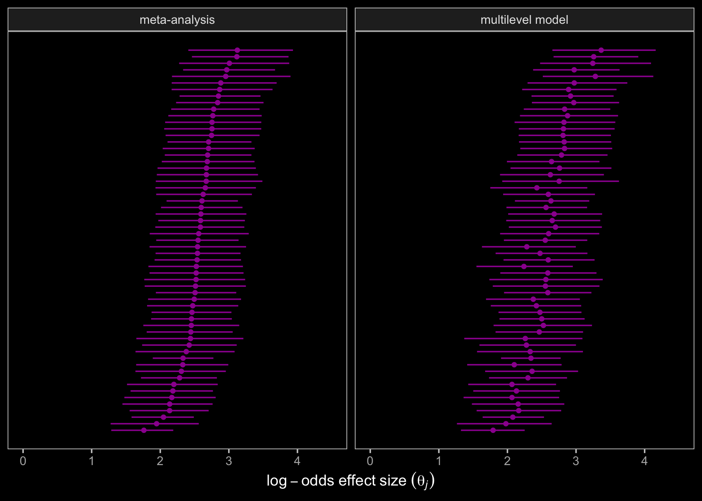

The results are very similar. You might be curious how to show these
results in a more conventional looking forest plot where the names of
the groups (typically studies) for the \(\theta_j\) values are listed on
the left, the point estimate and 95% interval summaries are listed on
the right, and the summary for the population level effect, \(\mu\), is
listed beneath all all the \(\theta_j\)’s. That’ll require some prep
work. First we’ll need to reformat the location names. I’ll save the
results in an object called `labs`.

``` r
labs <-
  d %>% 
  mutate(lab = case_when(
    Location == "Social and Work Psychology Department, University of Brasilia, DF, Brazil" ~ "University of Brasilia",
    Location == "Wilfrid Laurier University, Waterloo, Ontario, Canada" ~ "Wilfrid Laurier University",
    Location == "University of British Columbia, Vancouver, Canada" ~ "University of British Columbia",
    Location == "University of Toronto, Scarborough" ~ "University of Toronto",
    Location == "Division of Social Science, The Hong Kong University of Science and Technology, Hong Kong, China" ~ "Hong Kong University of Science and Technology",
    Location == "Chinese Academy of Science, Beijing, China" ~ "Chinese Academy of Science",
    Location == "Shanghai International Studies University, SISU Intercultural Institute, Shanghai, China" ~ "Shanghai International Studies University",
    Location == "Guangdong Literature & Art Vocational College, Guangzhou, China" ~ "Guangdong Literature & Art Vocational College",
    Location == "The University of J. E. Purkyně, Ústí nad Labem, Czech Republic" ~ "The University of J. E. Purkyně",
    Location == "University of Leuven, Belgium" ~ "University of Leuven",
    Location == "Department of Experimental and Applied Psychology, VU Amsterdam, 1081BT, Amsterdam, The Netherlands" ~ "VU Amsterdam",
    Location == "Department of Social Psychology, Tilburg University, P.O. Box 90153, Tilburg, 5000 LE, Netherlands" ~ "Department of Social Psychology, Tilburg University",
    Location == "Eindhoven University of Technology, Eindhoven, Netherlands" ~ "Eindhoven University of Technology",
    Location == "Department of Communication and Information Sciences, P.O. Box 90153, Tilburg, 5000 LE, Netherlands" ~ "Department of Communication and Information Sciences, Tilburg University",
    Location == "University of Navarra, Spain" ~ "University of Navarra",
    Location == "University of Lausanne, Switzerland" ~ "University of Lausanne",
    Location == "Université de Poitiers, France" ~ "Université de Poitiers",
    Location == "Eotvos Lorand University, in Budapest, Hungary" ~ "Eotvos Lorand University",
    Location == "MTurk India Workers" ~ "MTurk India Workers",
    Location == "University of Winchester, Winchester, Hampshire, England" ~ "University of Winchester",
    Location == "Doshisha University, Kyoto, Japan" ~ "Doshisha University",
    Location == "Victoria University of Wellington, New Zealand" ~ "Victoria University of Wellington",
    Location == "University of Social Sciences and Humanities, Wroclaw, Poland" ~ "University of Social Sciences and Humanities",
    Location == "Department of Psychology, SWPS University of Social Sciences and Humanities Campus Sopot, Sopot, Poland" ~ "SWPS University of Social Sciences and Humanities Campus Sopot",
    Location == "badania.net" ~ "badania.net",
    Location == "Universidade do Porto, Portugal" ~ "Universidade do Porto",
    Location == "University of Belgrade, Belgrade, Serbia" ~ "University of Belgrade",
    Location == "University of Johannesburg, Johanneburg, South Africa" ~ "University of Johannesburg",
    Location == "Santiago, Chile" ~ "Santiago, Chile",
    Location == "Universidad de Costa Rica, Costa Rica" ~ "Universidad de Costa Rica",
    Location == "National Autonomous University of Mexico in Mexico City" ~ "National Autonomous University of Mexico",
    Location == "University of the Republic, Montevideo, Uruguay" ~ "University of the Republic",
    Location == "Lund University, Lund, Sweden" ~ "Lund University",
    Location == "Academia Sinica, Taiwan National Taiwan Normal University, Taiwan" ~ "Taiwan National Taiwan Normal University",
    Location == "Bilgi University, Istanbul, Turkey" ~ "Bilgi University",
    Location == "Koç University, Istanbul, Turkey" ~ "Koç University",
    Location == "American University of Sharjah, United Arab Emirates" ~ "American University of Sharjah",
    Location == "University of Hawaii, Honolulu, HI" ~ "University of Hawaii",
    Location == "Social Science and Policy Studies Department, Worcester Polytechnic Institute, Worcester, MA 01609" ~ "Worcester Polytechnic Institute",
    Location == "Department of Psychology, Washington and Lee University, Lexington, VA 24450" ~ "Washington and Lee University",
    Location == "Department of Psychology, San Diego State University, San Diego, CA 92182" ~ "San Diego State University",
    Location == "Tufts" ~ "Tufts",
    Location == "University of Florida, Florida" ~ "University of Florida",
    Location == "University of Illinois at Urbana-Champaign, Champaign, IL" ~ "University of Illinois at Urbana-Champaign",
    Location == "Pacific Lutheran University, Tacoma, WA" ~ "Pacific Lutheran University",
    Location == "University of Virginia, VA" ~ "University of Virginia",
    Location == "Marian University, Indianapolis, IN" ~ "Marian University",
    Location == "Department of Psychology, Ithaca College, Ithaca, NY 14850" ~ "Ithaca College",
    Location == "University of Michigan" ~ "University of Michigan",
    Location == "Department of Psychology, Pennsylvania State University Abington, Abington, PA 19001" ~ "Pennsylvania State University Abington",
    Location == "Department of Psychology, Texas A&M University, College Station, TX 77843" ~ "Texas A&M University",
    Location == "William Paterson University, Wayne, NJ" ~ "William Paterson University",
    Location == "Department of Cognitive Science, Occidental College, Los Angeles, CA" ~ "Occidental College",
    Location == "The Pennsylvania State University" ~ "The Pennsylvania State University",
    Location == "MTurk US Workers" ~ "MTurk US Workers",
    Location == "University of Graz AND the Universty of Vienna" ~ "University of Graz and the Universty of Vienna",
    Location == "University of Potsdam, Germany" ~ "University of Potsdam",
    Location == "Open University of Hong Kong" ~ "Open University of Hong Kong",
    Location == "Concepción, Chile" ~ "Concepción"
  )) %>% 
  distinct(loc, lab)

# what is this?
labs %>% 
  glimpse()
```

    ## Rows: 59
    ## Columns: 2
    ## $ loc <fct> 1, 2, 3, 4, 5, 6, 7, 8, 9, 10, 11, 12, 13, 14, 15, 16, 17, 18, 19, 20, 21, 22, 23, 24…
    ## $ lab <chr> "University of Brasilia", "Wilfrid Laurier University", "University of British Columb…

Now we’ll do some tricky wrangling with the output from `coef()` and
`fixef()` to arrange the odds ratio summaries for the population average
and the location-specific results.

``` r
# this will help us format the labels on the secondary y-axis
my_format <- function(number) {
  formatC(number, digits = 2, format = "f")
}

# grab the theta_j summaries
groups <-
  coef(b15.11)$loc[, , "factorSideEffect"] %>% 
  data.frame() %>% 
  mutate(loc = distinct(d, loc) %>% pull()) %>% 
  arrange(Estimate)

# grab the mu summary
average <-
  fixef(b15.11) %>% 
  data.frame() %>% 
  slice(2) %>% 
  mutate(loc = "Average")

# combine and wrangle
post <-
  bind_rows(groups, average) %>% 
  mutate(rank     = c(1:59, 0),
         Estimate = exp(Estimate),
         Q2.5     = exp(Q2.5),
         Q97.5    = exp(Q97.5)) %>% 
  left_join(labs, by = "loc") %>% 
  arrange(rank) %>% 
  mutate(label   = ifelse(is.na(lab), "POPULATION AVERAGE", lab),
         summary = str_c(my_format(Estimate), " [", my_format(Q2.5), ", ", my_format(Q97.5), "]"))

# what have we done?
post %>% 
  glimpse()
```

    ## Rows: 60
    ## Columns: 9
    ## $ Estimate  <dbl> 13.027040, 5.994537, 7.225509, 7.894728, 7.896201, 7.989348, 8.158148, 8.425675…
    ## $ Est.Error <dbl> 0.09183827, 0.23712115, 0.35418533, 0.32549107, 0.35978096, 0.23125168, 0.34382…
    ## $ Q2.5      <dbl> 10.937724, 3.752456, 3.537577, 4.170577, 3.898701, 5.147465, 4.109451, 4.488119…
    ## $ Q97.5     <dbl> 15.731289, 9.501053, 14.080042, 15.016368, 15.701244, 12.588834, 16.272517, 15.…
    ## $ loc       <chr> "Average", "19", "38", "8", "32", "55", "5", "34", "22", "9", "6", "58", "24", …
    ## $ rank      <dbl> 0, 1, 2, 3, 4, 5, 6, 7, 8, 9, 10, 11, 12, 13, 14, 15, 16, 17, 18, 19, 20, 21, 2…
    ## $ lab       <chr> NA, "MTurk India Workers", "University of Hawaii", "Guangdong Literature & Art …
    ## $ label     <chr> "POPULATION AVERAGE", "MTurk India Workers", "University of Hawaii", "Guangdong…
    ## $ summary   <chr> "13.03 [10.94, 15.73]", "5.99 [3.75, 9.50]", "7.23 [3.54, 14.08]", "7.89 [4.17,…

Here’s our custom forest plot.

``` r
post %>% 
  ggplot(aes(x = Estimate, xmin = Q2.5, xmax = Q97.5, y = rank)) +
  geom_interval(aes(color = label == "POPULATION AVERAGE"),
                size = 1/2) +
  geom_point(aes(size = 1 - Est.Error, color = label == "POPULATION AVERAGE"),
             shape = 15) +
  scale_color_viridis_d(option = "C", begin = .33, end = .67) +
  scale_size_continuous(range = c(1, 3.5)) +
  scale_x_continuous("odds ratio", breaks = 1:6 * 10, expand = expansion(mult = c(0.005, 0.005))) +
  scale_y_continuous(NULL, breaks = 0:59, limits = c(-1, 60), expand = c(0, 0),
                     labels = pull(post, label),
                     sec.axis = dup_axis(labels = pull(post, summary))) +
  theme(text = element_text(family = "Times"),
        axis.text.y = element_text(hjust = 0, color = "white", size = 7),
        axis.text.y.right = element_text(hjust = 1, size = 7),
        axis.ticks.y = element_blank(),
        panel.background = element_rect(fill = "grey8"),
        panel.border = element_rect(color = "transparent"))
```

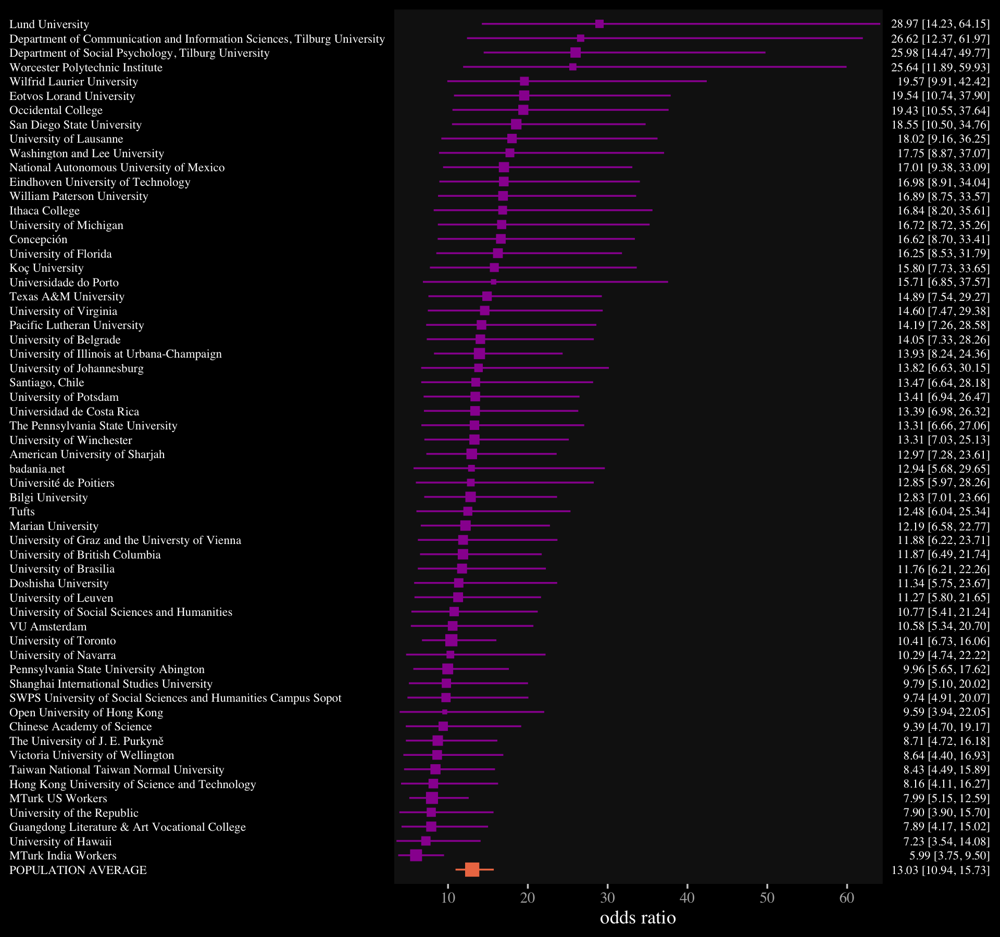

You may have noticed this plot is based on the results of our multilevel
model, `b15.11`. We could have done the same basic thing with the
results from the more conventional meta-analysis model, `b15.10`, too.

I’m not aware this it typical in random effect meta-analyses, but it
might be useful to further clarify the meaning of the two primary
parameters, \(\mu\) and \(\tau\). Like with the forest plot, above, we
could examine these with either `b15.10` or `b15.11`. For kicks, we’ll
use `b15.10` (the conventional Bayesian meta-analysis). In the output
from `posterior_samples(b15.10)`, \(\mu\) and \(\tau\) are in the
columns named `b_Intercept` and `sd_loc__Intercept`, respectively.

``` r
post <- posterior_samples(b15.10)

post %>% 
  select(b_Intercept:sd_loc__Intercept) %>% 
  head()
```

    ##   b_Intercept sd_loc__Intercept
    ## 1    2.378526         0.4688289
    ## 2    2.562858         0.4555103
    ## 3    2.435846         0.3252279
    ## 4    2.658129         0.3895584
    ## 5    2.451356         0.3583352
    ## 6    2.672061         0.5595212

If you scroll back above, you’ll see our random effect meta-analysis
explicitly presumed our empirical effect-size estimates \(y_j\) are
approximations of the true effect sizes \(\theta_j\), which are
themselves normally distributed in the population of possible effect
sizes from similar studies:
\(\theta_j \sim \operatorname{Normal}(\mu, \tau)\). Why not use our
posterior samples to simulate draws from
\(\operatorname{Normal}(\mu, \tau)\) to get a sense of what this
distribution might look like? Recall that the parameters are in the
log-odds metric. We’ll present the distribution in that metric and as
odds ratios.

``` r
color <- viridis_pal(option = "C")(7)[6]
set.seed(15)

post %>% 
  transmute(lo = rnorm(n(), mean = b_Intercept, sd = sd_loc__Intercept),
            or = rnorm(n(), mean = b_Intercept, sd = sd_loc__Intercept) %>% exp()) %>% 
  slice(1:1e3) %>% 
  pivot_longer(lo:or, values_to = "effect size") %>% 
  mutate(name = factor(name, labels = c("log-odds", "odds ratio"))) %>% 
  
  ggplot(aes(x = `effect size`, y = 0)) +
  geom_dots(color = color, fill = color) +
  scale_y_continuous(NULL, breaks = NULL) +
  xlab(expression(Normal(mu*', '*tau))) +
  theme(text = element_text(family = "Times"),
        strip.background = element_rect(color = "transparent")) +
  facet_wrap(~name, scales = "free")
```

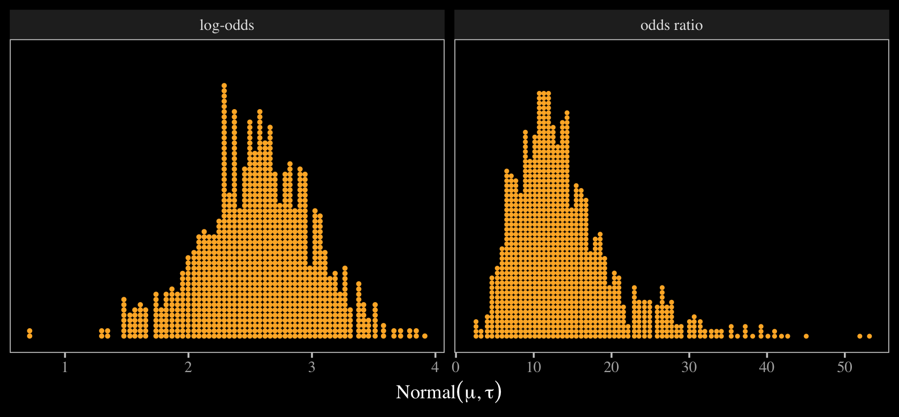

Both panels show 1,000 draws, each of which is depicted by a single dot.
If we were to run this experiment 1,000 times and compute the effect
size separately for each one, this is what we’d expect those
distributions of effect sizes to look like. Seems like there’s a lot of
variation in there, eh? The next time you observe your fellow scientists
debating over whether a study replicated or not, keep these
distributions in mind. Once you start thinking about distributions,
replication becomes a tricky notion.

### Parting thoughts.

There are other things you might do with these data. For example, you
might inspect how much the effect size varies between those from WEIRD
and non-WEIRD countries. You might also model the data as clustered by
`Language` rather than by `Location`. But I think we’ve gone far enough
to get you started.

If you’d like to learn more about these methods, do check out Vourre’s
[*Meta-analysis is a special case of Bayesian multilevel
modeling*](https://mvuorre.github.io/post/2016/09/29/meta-analysis-is-a-special-case-of-bayesian-multilevel-modeling/).
You might also read Williams, Rast, and Bürkner’s
(<span class="citeproc-not-found" data-reference-id="williamsBayesianMetaanalysisWeakly2018">**???**</span>)
manuscript, [*Bayesian meta-analysis with weakly informative prior
distributions*](https://psyarxiv.com/7tbrm/). For an alternative
workflow, consider the [**baggr**
package](https://github.com/wwiecek/baggr)
(<span class="citeproc-not-found" data-reference-id="R-baggr">**???**</span>),
which is designed to fit hierarchical Bayesian meta-analyses with Stan
under the hood.

## Session info

``` r
sessionInfo()
```

    ## R version 3.6.3 (2020-02-29)
    ## Platform: x86_64-apple-darwin15.6.0 (64-bit)
    ## Running under: macOS Catalina 10.15.3
    ## 
    ## Matrix products: default
    ## BLAS:   /Library/Frameworks/R.framework/Versions/3.6/Resources/lib/libRblas.0.dylib
    ## LAPACK: /Library/Frameworks/R.framework/Versions/3.6/Resources/lib/libRlapack.dylib
    ## 
    ## locale:
    ## [1] en_US.UTF-8/en_US.UTF-8/en_US.UTF-8/C/en_US.UTF-8/en_US.UTF-8
    ## 
    ## attached base packages:
    ## [1] stats     graphics  grDevices utils     datasets  methods   base     
    ## 
    ## other attached packages:
    ##  [1] tidybayes_2.1.1      ggrepel_0.8.2        broom_0.5.5          brms_2.14.0         
    ##  [5] Rcpp_1.0.5           ggdag_0.2.2          patchwork_1.0.1.9000 viridis_0.5.1       
    ##  [9] viridisLite_0.3.0    ggdark_0.2.1         forcats_0.5.0        stringr_1.4.0       
    ## [13] dplyr_1.0.1          purrr_0.3.4          readr_1.3.1          tidyr_1.1.1         
    ## [17] tibble_3.0.3         ggplot2_3.3.2        tidyverse_1.3.0     
    ## 
    ## loaded via a namespace (and not attached):
    ##   [1] readxl_1.3.1         backports_1.1.9      plyr_1.8.6           igraph_1.2.5        
    ##   [5] svUnit_1.0.3         splines_3.6.3        crosstalk_1.1.0.1    TH.data_1.0-10      
    ##   [9] rstantools_2.1.1     inline_0.3.15        digest_0.6.25        htmltools_0.5.0     
    ##  [13] rsconnect_0.8.16     fansi_0.4.1          magrittr_1.5         graphlayouts_0.7.0  
    ##  [17] modelr_0.1.6         matrixStats_0.56.0   xts_0.12-0           sandwich_2.5-1      
    ##  [21] prettyunits_1.1.1    colorspace_1.4-1     rvest_0.3.5          ggdist_2.1.1        
    ##  [25] haven_2.2.0          xfun_0.13            callr_3.4.4          crayon_1.3.4        
    ##  [29] jsonlite_1.7.0       survival_3.1-12      zoo_1.8-7            glue_1.4.2          
    ##  [33] polyclip_1.10-0      gtable_0.3.0         emmeans_1.4.5        V8_3.0.2            
    ##  [37] pkgbuild_1.1.0       rstan_2.19.3         abind_1.4-5          scales_1.1.1        
    ##  [41] mvtnorm_1.1-0        DBI_1.1.0            miniUI_0.1.1.1       xtable_1.8-4        
    ##  [45] stats4_3.6.3         StanHeaders_2.21.0-1 DT_0.13              htmlwidgets_1.5.1   
    ##  [49] httr_1.4.1           threejs_0.3.3        arrayhelpers_1.1-0   ellipsis_0.3.1      
    ##  [53] pkgconfig_2.0.3      loo_2.3.1            farver_2.0.3         dbplyr_1.4.2        
    ##  [57] utf8_1.1.4           tidyselect_1.1.0     labeling_0.3         rlang_0.4.7         
    ##  [61] reshape2_1.4.4       later_1.1.0.1        munsell_0.5.0        dagitty_0.2-2       
    ##  [65] cellranger_1.1.0     tools_3.6.3          cli_2.0.2            generics_0.0.2      
    ##  [69] ggridges_0.5.2       evaluate_0.14        fastmap_1.0.1        yaml_2.2.1          
    ##  [73] processx_3.4.4       knitr_1.28           fs_1.4.1             tidygraph_1.2.0     
    ##  [77] ggraph_2.0.3         nlme_3.1-144         mime_0.9             xml2_1.3.1          
    ##  [81] compiler_3.6.3       bayesplot_1.7.1      shinythemes_1.1.2    rstudioapi_0.11     
    ##  [85] curl_4.3             reprex_0.3.0         tweenr_1.0.1         stringi_1.4.6       
    ##  [89] ps_1.3.4             Brobdingnag_1.2-6    lattice_0.20-38      Matrix_1.2-18       
    ##  [93] markdown_1.1         shinyjs_1.1          vctrs_0.3.4          pillar_1.4.6        
    ##  [97] lifecycle_0.2.0      bridgesampling_1.0-0 estimability_1.3     httpuv_1.5.4        
    ## [101] R6_2.4.1             promises_1.1.1       gridExtra_2.3        codetools_0.2-16    
    ## [105] boot_1.3-24          colourpicker_1.0     MASS_7.3-51.5        gtools_3.8.2        
    ## [109] assertthat_0.2.1     withr_2.2.0          shinystan_2.5.0      multcomp_1.4-13     
    ## [113] parallel_3.6.3       hms_0.5.3            grid_3.6.3           coda_0.19-3         
    ## [117] rmarkdown_2.1        ggforce_0.3.1        shiny_1.5.0          lubridate_1.7.8     
    ## [121] base64enc_0.1-3      dygraphs_1.1.1.6

<div id="refs" class="references">

<div id="ref-Bürkner2020Multivariate">

Bürkner, P.-C. (2020). *Estimating multivariate models with brms*.
<https://CRAN.R-project.org/package=brms/vignettes/brms_multivariate.html>

</div>

<div id="ref-gelman2013bayesian">

Gelman, A., Carlin, J. B., Stern, H. S., Dunson, D. B., Vehtari, A., &
Rubin, D. B. (2013). *Bayesian data analysis*. CRC press.
<https://stat.columbia.edu/~gelman/book/>

</div>

<div id="ref-mcelreathStatisticalRethinkingBayesian2020">

McElreath, R. (2020). *Statistical rethinking: A Bayesian course with
examples in R and Stan* (Second edition). CRC Press.
<https://xcelab.net/rm/statistical-rethinking/>

</div>

</div>
