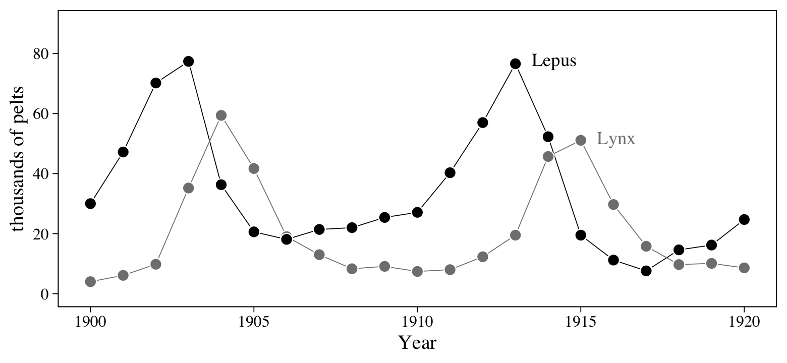
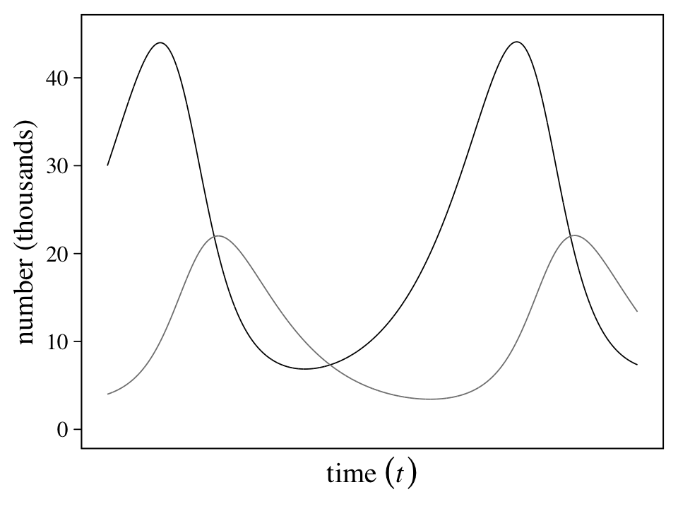
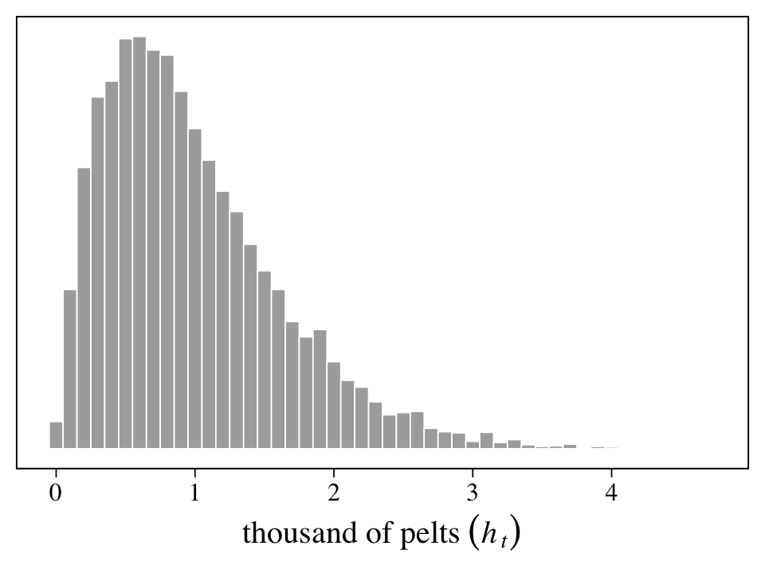
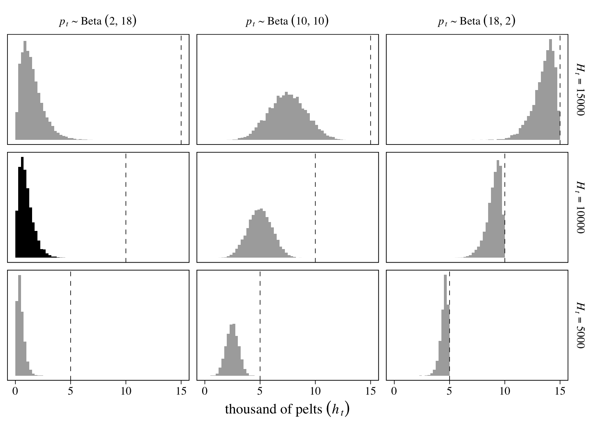
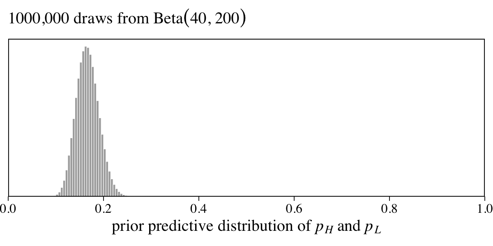
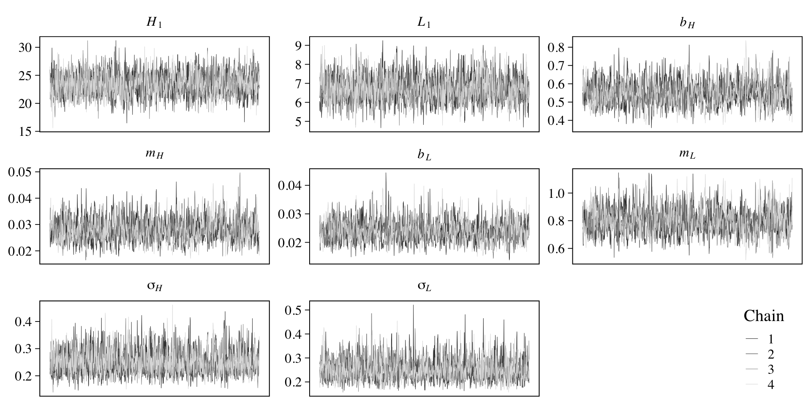
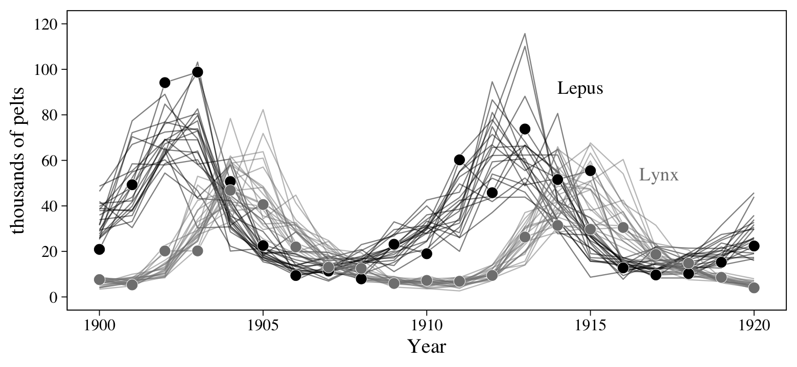
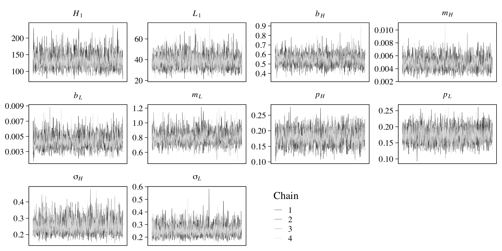
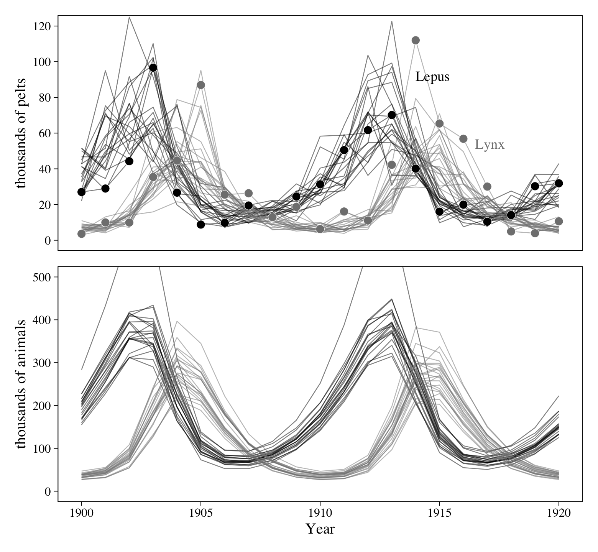

Ch. 16 Generalized Linear Madness
================
A Solomon Kurz
2021-02-10

# Generalized Linear Madness

#### Rethinking: Bespoken for.

## Geometric people

### The scientific model.

### The statistical model.

``` r
library(tidyverse)
library(ggthemes)
library(tidybayes)
library(brms)
library(GGally)
library(rethinking)
library(patchwork)

theme_set(
  theme_base(base_size = 12) +
    theme(text = element_text(family = "Times"),
          axis.text = element_text(family = "Times"),
          axis.ticks = element_line(size = 0.25),
          axis.ticks.length = unit(0.1, "cm"),
          panel.background = element_rect(size = 0.1),
          plot.background = element_blank(),
          )
  )
```

### GLM in disguise.

## Hidden minds and observed behavior

### The scientific model.

### The statistical model.

### Coding the statistical model.

### State space models.

## Ordinary differential nut cracking

### Scientific model.

### Statistical model.

## Population dynamics

Load the `Lynx_Hare` population dynamics data (Hewitt,
[1921](#ref-hewittTheConservation1921)).

``` r
data(Lynx_Hare, package = "rethinking")

glimpse(Lynx_Hare)
```

    ## Rows: 21
    ## Columns: 3
    ## $ Year <int> 1900, 1901, 1902, 1903, 1904, 1905, 1906, 1907, 1908, 1909, 1910, 1911, 1912, 1913, 1914, 1915…
    ## $ Lynx <dbl> 4.0, 6.1, 9.8, 35.2, 59.4, 41.7, 19.0, 13.0, 8.3, 9.1, 7.4, 8.0, 12.3, 19.5, 45.7, 51.1, 29.7,…
    ## $ Hare <dbl> 30.0, 47.2, 70.2, 77.4, 36.3, 20.6, 18.1, 21.4, 22.0, 25.4, 27.1, 40.3, 57.0, 76.6, 52.3, 19.5…

As McElreath indicated in his endnote \#238 (p. 570), this example is
based on Stan case study by the great [Bob
Carpenter](https://bob-carpenter.github.io/), [*Predator-prey population
dynamics: The Lotka-Volterra model in
Stan*](https://mc-stan.org/users/documentation/case-studies/lotka-volterra-predator-prey.html).
You might bookmark that link. It’ll come up later in this section.

Figure 6.6 will give us a sense of how the lynx and hare populations
ebbed and flowed.

``` r
# for annotation
text <-
  tibble(name  = c("Hare", "Lynx"),
         label = c("Lepus", "Lynx"),
         Year  = c(1913.5, 1915.5),
         value = c(78, 52))

# wrangle
Lynx_Hare %>% 
  pivot_longer(-Year) %>% 
  
  # plot!
  ggplot(aes(x = Year, y = value)) +
  geom_line(aes(color = name),
            size = 1/4) +
  geom_point(aes(fill = name),
             size = 3, shape = 21, color = "white") +
  geom_text(data = text,
            aes(label = label, color = name),
            hjust = 0, family = "Times") +
  scale_fill_grey(start = 0, end = .5) +
  scale_color_grey(start = 0, end = .5) +
  scale_y_continuous("thousands of pelts", breaks = 0:4 * 20, limits = c(0, 90)) +
  theme(legend.position = "none")
```



Note, however, that these are numbers of pelts, not of actual animals.
This will become important when we start modeling.

A typical way to model evenly-spaced time series data like this would be
with an autoregressive model with the basic structure

\[\operatorname{E}(y_t) = \alpha + \beta_1 y_{t-1},\]

where \(t\) indexes time and \(t - 1\) is the time point immediately
before \(t\). Models following this form are called first-order
autoregressive models, AR(1), meaning that the current time point is
only influenced by the previous time point, but none of the earlier
ones. You can build on this format by adding other predictors. A natural
way would be to use a predictor from \(t - 1\) to predict \(y_t\),
following the form

\[\operatorname{E}(y_t) = \alpha + \beta_1 y_{t-1} + \beta_2 x_{t-1}.\]

But that’s still a first-order model. A second-order model, AR(2), would
include a term for \(y_{t - 2}\), such as

\[\operatorname{E}(y_t) = \alpha + \beta_1 y_{t-1} + \beta_2 x_{t-1} + \beta_3 y_{t-2}.\]

McElreath isn’t a huge fan of these models, particularly from the
scientific modeling perspective he developed in this chapter. But
**brms** can fit them and we’ll practice a little in a bonus section,
later on. In the mean time, we’ll follow along and learn about
**ordinary differential equations** (ODEs).

### The scientific model.

We’ll start off simple and focus first on hares. If we let \(H_t\) be
the number of hares at time \(t\), we can express the **rate of change**
in the hare population as

\[\frac{\mathrm{d} H}{\mathrm{d} t} = H_t \times (\text{birth rate}) - H_t \times (\text{death rate}).\]

If we presume both birth rates and death rates (*mortality* rates) are
constants, we might denote them \(b_H\) and \(m_H\), respectively, and
re-express the formula as

\[\frac{\mathrm{d} H}{\mathrm{d} t} = H_t b_H - H_t m_H = H_t (b_H - m_H).\]

Building, if we let \(L_t\) stand for the number of lynx present at time
\(t\), we can allow the mortality rate depend on that variable with the
expanded formula

\[\frac{\mathrm{d} H}{\mathrm{d} t} = H_t (b_H - L_t m_H).\]

We can expand this even further to model how the number of hares at a
given time influence the birth rate for lynx (\(b_L\)) to help us model
the rate of change in the lynx population as

\[\frac{\mathrm{d} L}{\mathrm{d} t} = L_t (H_t b_L - m_L),\]

where the lynx mortality rate (\(m_l\)) is now constant. This is called
the **Lotka-Volterra model** (Lotka,
[1925](#ref-lotkaPrinciplesOfPhysicalBiology1925); Volterra,
[1926](#ref-volterraFluctuationsAbundanceSpecies1926)). You may have
noticed how the above equations shifted our focus from what were were
originally interested in, \(\operatorname{E}(H_t)\), to a rate of
change, \(\mathrm{d} H / \mathrm{d} t\). Happily, our equation for
\(\mathrm{d} H / \mathrm{d} t\), “tells us how to update \(H\) after
each tiny unit of passing time \(\mathrm d t\)” (p. 544). You update by

\[H_{t +\mathrm d t} = H_t + \mathrm d t \frac{\mathrm d H}{\mathrm d t} = H_t + \mathrm d t H_t (b_H - L_t m_H).\]
Here we’ll use a custom function called `sim_lynx_hare()` to simulate
how this can work. Our version of the function is very similar to the
one McElreath displayed in his **R** code 16.14, but we changed it so it
returns a tibble which includes a time index, `t`.

``` r
sim_lynx_hare <- function(n_steps, init, theta, dt = 0.002) { 
  
  L <- rep(NA, n_steps)
  H <- rep(NA, n_steps)
  
  # set initial values
  L[1] <- init[1]
  H[1] <- init[2]
  
  for (i in 2:n_steps) {
    H[i] <- H[i - 1] + dt * H[i - 1] * (theta[1] - theta[2] * L[i - 1])
    L[i] <- L[i - 1] + dt * L[i - 1] * (theta[3] * H[i - 1] - theta[4])
  }
  
  # return a tibble
  tibble(t = 1:n_steps,
         H = H,
         L = L)
  
}
```

Now we simulate.

``` r
# set the four theta values
theta <- c(0.5, 0.05, 0.025, 0.5)

# simulate
z <- sim_lynx_hare(n_steps = 1e4, 
                   init = c(filter(Lynx_Hare, Year == 1900) %>% pull("Lynx"), 
                            filter(Lynx_Hare, Year == 1900) %>% pull("Hare")), 
                   theta = theta)

# what did we do?
glimpse(z)
```

    ## Rows: 10,000
    ## Columns: 3
    ## $ t <int> 1, 2, 3, 4, 5, 6, 7, 8, 9, 10, 11, 12, 13, 14, 15, 16, 17, 18, 19, 20, 21, 22, 23, 24, 25, 26, 27…
    ## $ H <dbl> 30.00000, 30.01800, 30.03600, 30.05401, 30.07203, 30.09005, 30.10807, 30.12610, 30.14413, 30.1621…
    ## $ L <dbl> 4.000000, 4.002000, 4.004005, 4.006014, 4.008028, 4.010046, 4.012069, 4.014097, 4.016129, 4.01816…

Now plot the results in our version of Figure 16.7.

``` r
z %>% 
  pivot_longer(-t) %>% 
  
  ggplot(aes(x = t, y = value, color = name)) +
  geom_line(size = 1/4) +
  scale_color_grey(start = 0, end = .5) +
  scale_x_continuous(expression(time~(italic(t))), breaks = NULL) +
  scale_y_continuous("number (thousands)", breaks = 0:4 * 10, limits = c(0, 45)) +
  theme(legend.position = "none")
```



“This model produces cycles, similar to what we see in the data. The
model behaves this way, because lynx eat hares. Once the hares are
eaten, the lynx begin to die off. Then the cycle repeats (p. 545).”

### The statistical model.

If we continue to let \(H_t\) and \(L_t\) be the number of hares and
lynx at time \(t\), we might also want to rehearse the distinction
between those numbers and our observations by letting \(h_t\) and
\(l_t\) stand for the observed numbers of hares and lynx. These observed
numbers, recall, are from counts of pelts. We want a statistical model
that can connect \(h_t\) to \(H_t\) and connect \(l_t\) to \(L_t\). Part
of that model would include the probability a hare was trapped on a
given year, \(p_h\), and a similar probability for a lynx getting
trapped, \(p_l\). To make things worse, further imagine the number of
pelts for each, in a given year, was rounded to the nearest \(100\) and
divided by \(1{,}000\). Those are our values.

We practice simulating all this in Figure 16.8. Here we propose a
population of \(H_t = 10^4\) hares and an average trapping rate of about
\(10\%\), as expressed by \(p_t \sim \operatorname{Beta}(2, 18)\). As
described above, we then divide the number of observed pelts by
\(1{,}000\) and round the results, yielding \(h_t\).

``` r
n <- 1e4
Ht <- 1e4

set.seed(16)

# simulate
tibble(pt = rbeta(n, shape1 = 2, shape2 = 18)) %>% 
  mutate(ht = rbinom(n, size = Ht, prob = pt)) %>% 
  mutate(ht = round(ht / 1000, digits = 2)) %>% 
  
  # plot
  ggplot(aes(x = ht)) +
  geom_histogram(size = 1/4, binwidth = 0.1,
                 color = "white", fill = "grey67") +
  scale_y_continuous(NULL, breaks = NULL) +
  xlab(expression(thousand~of~pelts~(italic(h[t]))))
```



On page 546, McElreath encouraged us to try the simulation with
different values of \(H_t\) and \(p_t\). Here we’ll do so with a
\(3 \times 3\) grid of \(H_t = \{5{,}000, 10{,}000, 15{,}000\}\) and
\(p_t \sim \{ \operatorname{Beta}(2, 18), \operatorname{Beta}(10, 10), \operatorname{Beta}(18, 2) \}\).

``` r
set.seed(16)

# define the 3X3 grid
tibble(shape1 = c(2, 10, 18),
       shape2 = c(18, 10, 2)) %>% 
  expand(nesting(shape1, shape2),
         Ht = c(5e3, 1e4, 15e3)) %>% 
  # simulate
  mutate(pt = purrr::map2(shape1, shape2, ~rbeta(n, shape1 = .x, shape2 = .y))) %>% 
  mutate(ht = purrr::map2(Ht, pt, ~rbinom(n, size = .x, prob = .y))) %>% 
  unnest(c(pt, ht)) %>% 
  # wrangle
  mutate(ht    = round(ht / 1000, digits = 2),
         beta  = str_c("italic(p[t])%~%'Beta '(", shape1, ", ", shape2, ")"),
         Htlab = str_c("italic(H[t])==", Ht)) %>%
  mutate(beta  = factor(beta,
                        levels = c("italic(p[t])%~%'Beta '(2, 18)", "italic(p[t])%~%'Beta '(10, 10)", "italic(p[t])%~%'Beta '(18, 2)")),
         Htlab = factor(Htlab,
                        levels = c("italic(H[t])==15000", "italic(H[t])==10000", "italic(H[t])==5000"))) %>% 
  
  # plot!
  ggplot(aes(x = ht)) +
  geom_histogram(aes(fill = beta == "italic(p[t])%~%'Beta '(2, 18)" & Htlab == "italic(H[t])==10000"),
                 size = 1/10, binwidth = 0.25, boundary = 0) +
  geom_vline(aes(xintercept = Ht / 1000), 
             size = 1/4, linetype = 2) +
  scale_fill_grey(start = .67, end = 0, breaks = NULL) +
  scale_y_continuous(NULL, breaks = NULL) +
  xlab(expression(thousand~of~pelts~(italic(h[t])))) +
  facet_grid(Htlab ~ beta, labeller = label_parsed, scales = "free_y")
```



The vertical dashed lines mark off the maximum values in each panel. The
histogram in black is of the simulation parameters based on our version
of Figure 16.8, above.

McElreath’s proposed model is

\[
\begin{align*}
h_t & \sim \operatorname{Log-Normal} \big (\log(p_H H_t), \sigma_H \big) \\
l_t & \sim \operatorname{Log-Normal} \big (\log(p_L L_t), \sigma_L \big) \\
H_1 & \sim \operatorname{Log-Normal}(\log 10, 1) \\
L_1 & \sim \operatorname{Log-Normal}(\log 10, 1) \\
H_{T >1} & = H_1 + \int_1^T H_t (b_H - m_H L_t) \mathrm{d} t \\
L_{T >1} & = L_1 + \int_1^T L_t (b_L H_T - m_L) \mathrm{d} t \\
\sigma_H & \sim \operatorname{Exponential}(1) \\
\sigma_L & \sim \operatorname{Exponential}(1) \\
p_H & \sim \operatorname{Beta}(\alpha_H, \beta_H) \\
p_L & \sim \operatorname{Beta}(\alpha_L, \beta_L) \\
b_H & \sim \operatorname{Half-Normal}(1, 0.5) \\
b_L & \sim \operatorname{Half-Normal}(0.5, 0.5) \\
m_H & \sim \operatorname{Half-Normal}(0.5, 0.5) \\
m_L & \sim \operatorname{Half-Normal}(1, 0.5).
\end{align*}
\]

It’s not immediately clear from the text, but if you look closely at the
output from `cat(Lynx_Hare_model)` (see below), you’ll see
\(\alpha_H = \alpha_L = 40\) and \(\beta_H = \beta_L = 200\). If you’re
curious, here’s a plot of what the \(\operatorname{Beta}(40, 200)\)
prior looks like.

``` r
set.seed(16)

tibble(p = rbeta(n = 1e6, shape1 = 40, shape2 = 200)) %>%
  
  ggplot(aes(x = p)) +
  geom_histogram(size = 1/6, binwidth = 0.005, boundary = 0,
                 color = "white", fill = "grey67") +
  scale_x_continuous(expression(prior~predictive~distribution~of~italic(p[H])~and~italic(p[L])), 
                     breaks = 0:5 / 5, expand = c(0, 0), limits = c(0, 1)) +
  scale_y_continuous(NULL, breaks = NULL, expand = expansion(mult = c(0, 0.05))) +
  labs(subtitle = expression("1000,000 draws from Beta"*(40*", "*200)))
```



The \(\operatorname{Beta}(40, 200)\) prior suggests an average trapping
rate near 16%.

⚠️ The content to follow is going to diverge from the text, a bit. As
you can see from the equation, above, McElreath’s statistical model is a
beast. We can fit this model with **brms**, but the workflow is more
complicated than usual. To make this material more approachable, I am
going to divide the remainder of this section into two subsections. In
the first subsection, we’ll fit a simplified version of McElreath’s
`m16.5`, which does not contain the measurement-error portion. In the
second subsection, we’ll tack on the measurement-error portion and fit
the full model. ⚠️

#### 16.4.2.1 The simple Lotka-Volterra model

Before we get into it, I should acknowledge that this **brms** approach
to fitting ODE’s is a direct result of the generous contributions from
[Markus Gesmann](https://twitter.com/MarkusGesmann). It was one of his
older blog posts, [*PK/PD reserving
models*](https://magesblog.com/post/2018-01-30-pkpd-reserving-models/),
that led me to believe one could fit an ODE model with **brms**. When I
reached out to Gesmann on GitHub (see [Issue
\#18](https://github.com/ASKurz/Statistical_Rethinking_with_brms_ggplot2_and_the_tidyverse_2_ed/issues/18)),
he went so far as to write a new blog post on exactly this model:
[*Fitting multivariate ODE models with
brms*](https://magesblog.com/post/2021-02-08-fitting-multivariate-ode-models-with-brms/).
The workflow to follow is something of a blend of the methods in his
blog post, McElreath’s model in the text, and the [original
post](https://mc-stan.org/users/documentation/case-studies/lotka-volterra-predator-prey.html)
by Carpenter that started this all.

As far as the statistical model goes, we might express the revision of
McElreath’s model omitting the measurement-error portion as

\[
\begin{align*}
h_t & \sim \operatorname{Log-Normal} \big (\log(H_t), \sigma_H \big) \\
l_t & \sim \operatorname{Log-Normal} \big (\log(L_t), \sigma_L \big) \\
H_1 & \sim \operatorname{Log-Normal}(\log 10, 1) \\
L_1 & \sim \operatorname{Log-Normal}(\log 10, 1) \\
H_{T >1} & = H_1 + \int_1^T H_t (b_H - m_H L_t) \mathrm{d} t \\
L_{T >1} & = L_1 + \int_1^T L_t (b_L H_T - m_L) \mathrm{d} t \\
b_H & \sim \operatorname{Half-Normal}(1, 0.5) \\
b_L & \sim \operatorname{Half-Normal}(0.5, 0.5) \\
m_H & \sim \operatorname{Half-Normal}(0.5, 0.5) \\
m_L & \sim \operatorname{Half-Normal}(1, 0.5) \\
\sigma_H & \sim \operatorname{Exponential}(1) \\
\sigma_L & \sim \operatorname{Exponential}(1).
\end{align*}
\]

With the exception of the priors for the \(\sigma\) parameters, this is
basically the same model Carpenter fit with his original Stan code.
Carpenter expressed his model using a different style of notation, but
the parts are all there.

As for our **brms**, the first issue we need to address is that, at the
time of this writing, **brms** is only set up to fit a univariate ODE
model. As Gesmann pointed out, the way around this is to convert the
`Lynx_Hare` data into the long format where the pelt values from the
`Lynx` and `Hare` columns are all listed in a `pelts` columns and the
two animal populations are differentiated in a `population` column.
We’ll call this long version of the data `Lynx_Hare_long`.

``` r
Lynx_Hare_long <-
  Lynx_Hare %>% 
  pivot_longer(-Year,
               names_to = "population", 
               values_to = "pelts") %>% 
  mutate(delta = if_else(population == "Lynx", 1, 0),
         t     = Year - min(Year) + 1) %>% 
  arrange(delta, Year)

# what did we do?
head(Lynx_Hare_long)
```

    ## # A tibble: 6 x 5
    ##    Year population pelts delta     t
    ##   <int> <chr>      <dbl> <dbl> <dbl>
    ## 1  1900 Hare        30       0     1
    ## 2  1901 Hare        47.2     0     2
    ## 3  1902 Hare        70.2     0     3
    ## 4  1903 Hare        77.4     0     4
    ## 5  1904 Hare        36.3     0     5
    ## 6  1905 Hare        20.6     0     6

You’ll note how we converted the information in the `population` column
into a dummy variable, `delta`, which is coded 0 = hares, 1 = lynxes.
It’s that dummy variable that will allow us to adjust our model
formula so we express a bivariate model as if it were univariate. You’ll
see. Also notice how we added a `t` index for *time*. This is because
the Stan code to follow will expect us to index time in that way.

The next step is to write a script that will tell **brms** how to tell
Stan how to fit a Lotka-Volterra model. In his blog, Gesmann called this
`LotkaVolterra`. Our script to follow is a very minor adjustment of his.

``` r
LotkaVolterra <- "
// Sepcify dynamical system (ODEs)
real[] ode_LV(real t,         // time
              real [] y,      // the system rate
              real [] theta,  // the parameters (i.e., the birth and mortality rates)
              real [] x_r,    // data constant, not used here
              int [] x_i) {   // data constant, not used here
  // the outcome
  real dydt[2];
  
  // differential equations
  dydt[1] = (theta[1] - theta[2] * y[2]) * y[1]; // Hare process
  dydt[2] = (theta[3] * y[1] - theta[4]) * y[2]; // Lynx process
  
  return dydt;  // return a 2-element array
              }

// Integrate ODEs and prepare output
real LV(real t, real Hare0, real Lynx0, 
        real brHare, real mrHare, 
        real brLynx, real mrLynx,
        real delta) {
        
  real y0[2];     // Initial values
  real theta[4];  // Parameters
  real y[1, 2];   // ODE solution
  // Set initial values
  y0[1] = Hare0; 
  y0[2] = Lynx0;
  // Set parameters
  theta[1] = brHare; 
  theta[2] = mrHare;
  theta[3] = brLynx; 
  theta[4] = mrLynx;
  // Solve ODEs
  y = integrate_ode_rk45(ode_LV, 
                         y0, 0, rep_array(t, 1), theta,
                         rep_array(0.0, 0), rep_array(1, 1),
                         0.001, 0.001, 100); // tolerances, steps
                         
  // Return relevant population values based on our dummy-variable coding method
  return (y[1, 1] * (1 - delta) + 
          y[1, 2] * delta);
}
"
```

If you study this, you’ll see echos of Carpenter’s [original Stan
code](https://mc-stan.org/users/documentation/case-studies/lotka-volterra-predator-prey.html#coding-the-model-stan-program)
and connections to McElreath’s Stan code (execute `cat(Lynx_Hare_model)`
from his **R** code 16.17 block), too. But take special notice of the
last two lines, above. Those lines use the `delta` dummy to
differentiate the model results for the hare and lynx populations,
respectively.

Next we define our `formula` input. To keep from overwhelming the
`brm()` code, we’ll save it, here, as an independent object called
`lv_formula`.

``` r
lv_formula <- 
  bf(pelts ~ log(eta),
     # use our LV() function from above
     nlf(eta ~ LV(t, H1, L1, bh, mh, bl, ml, delta)),
     # initial population state
     H1 ~ 1, L1 ~ 1,
     # hare parameters
     bh ~ 1, mh ~ 1,
     # lynx parameters
     bl ~ 1, ml ~ 1,
     # population-based measurement errors
     sigma ~ 0 + population,
     nl = TRUE
  )
```

Note our use of the `LV()` function in the `nlf()` line. That’s a
function defined in the `LotkaVolterra` script, above, which will allow
us to connect the variables and parameters in our `formula` code to the
underlying statistical model. Next we define our priors and save them as
an independent object called `lv_priors`.

``` r
lv_priors <- c(
  prior(lognormal(log(10), 1), nlpar = H1, lb = 0),
  prior(lognormal(log(10), 1), nlpar = L1, lb = 0),
  prior(normal(1, 0.5),     nlpar = bh, lb = 0),
  prior(normal(0.05, 0.05), nlpar = bl, lb = 0),
  prior(normal(0.05, 0.05), nlpar = mh, lb = 0),
  prior(normal(1, 0.5),     nlpar = ml, lb = 0),
  prior(exponential(1), dpar = sigma, lb = 0)
)
```

We’re finally ready to fit our model with **brms**\! Are you excited?
Notice our `stanvars` and `backend` settings\[1\]. For the current
version of **brms**, these are crucial. Also, I find these models
benefit from setting `inits = 0`. Happily, this model fit in just about
four minutes on my 2019 MacBook Pro.

``` r
b16.5a <- 
  brm(data = Lynx_Hare_long, 
      family = brmsfamily("lognormal", link_sigma = "identity"),
      formula = lv_formula, 
      prior = lv_priors, 
      iter = 2000, warmup = 1000, chains = 4, cores = 4,
      inits = 0,
      stanvars = stanvar(scode = LotkaVolterra, block = "functions"),
      backend = "cmdstan",
      file = "/Users/solomonkurz/Dropbox/Recoding Statistical Rethinking 2nd ed/fits/b16.05a")
```

On page 548, McElreath recommend we check the chains. Here we’ll pretty
them up with help from **bayesplot**.

``` r
library(bayesplot)

color_scheme_set("gray")

col_names <- c("italic(H)[1]", "italic(L)[1]", str_c("italic(", c("b[H]", "m[H]", "b[L]", "m[L]"), ")"), 
               "sigma[italic(H)]", "sigma[italic(L)]", "lp__", "chain", "iter")

posterior_samples(b16.5a, add_chain = T) %>% 
  set_names(col_names) %>% 
  
  mcmc_trace(pars = vars(-iter, -lp__),
             facet_args = list(labeller = label_parsed), 
             size = .15) +
  scale_x_continuous(breaks = NULL) +
  theme(legend.key.size = unit(0.15, 'in'),
        legend.position = c(.97, .13))
```



They look like a dream. Now inspect the parameter summary.

``` r
print(b16.5a)
```

    ##  Family: lognormal 
    ##   Links: mu = identity; sigma = identity 
    ## Formula: pelts ~ log(eta) 
    ##          eta ~ LV(t, H1, L1, bh, mh, bl, ml, delta)
    ##          H1 ~ 1
    ##          L1 ~ 1
    ##          bh ~ 1
    ##          mh ~ 1
    ##          bl ~ 1
    ##          ml ~ 1
    ##          sigma ~ 0 + population
    ##    Data: Lynx_Hare_long (Number of observations: 42) 
    ## Samples: 4 chains, each with iter = 2000; warmup = 1000; thin = 1;
    ##          total post-warmup samples = 4000
    ## 
    ## Population-Level Effects: 
    ##                      Estimate Est.Error l-95% CI u-95% CI Rhat Bulk_ESS Tail_ESS
    ## H1_Intercept            23.40      2.04    19.61    27.58 1.00     2234     2496
    ## L1_Intercept             6.70      0.67     5.48     8.12 1.00     1862     2393
    ## bh_Intercept             0.55      0.06     0.43     0.69 1.00     1075     1499
    ## mh_Intercept             0.03      0.00     0.02     0.04 1.00     1231     1665
    ## bl_Intercept             0.02      0.00     0.02     0.03 1.00     1180     1544
    ## ml_Intercept             0.80      0.09     0.63     0.99 1.00     1105     1551
    ## sigma_populationHare     0.25      0.04     0.18     0.35 1.00     2552     2613
    ## sigma_populationLynx     0.25      0.04     0.18     0.36 1.00     2662     2257
    ## 
    ## Samples were drawn using sample(hmc). For each parameter, Bulk_ESS
    ## and Tail_ESS are effective sample size measures, and Rhat is the potential
    ## scale reduction factor on split chains (at convergence, Rhat = 1).

As Gesmann [covered in his
blog](https://magesblog.com/post/2021-02-08-fitting-multivariate-ode-models-with-brms/#plot-posterior-simulations),
we need to use the `brms::expose_functions()` function to expose Stan
functions to **R** before we use some of our favorite post-processing
functions. But the current version of **brms** will not allow one to do
so for a model fit with `backend = "cmdstan"`. So we need an
intermediary step where we compile the model with `backend = "rstan"`.
Note the `chains = 0` setting.

``` r
b16.5a_rstan <- 
  brm(data = Lynx_Hare_long, 
      family = brmsfamily("lognormal", link_sigma = "identity"),
      formula = lv_formula, 
      prior = lv_priors, 
      chains = 0,
      stanvars = stanvar(scode = LotkaVolterra, block = "functions"),
      backend = "rstan",
      file = "/Users/solomonkurz/Dropbox/Recoding Statistical Rethinking 2nd ed/fits/b16.05a_rstan")

expose_functions(b16.5a_rstan, vectorize = TRUE)
```

Now we’re ready to plot our results like McElreath did in Figure 16.9a.
Our first step will be to use `predict()`.

``` r
p <- 
  predict(b16.5a, 
          summary = F, 
          # how many posterior predictive draws would you like?
          nsamples = 21)

str(p)
```

    ##  num [1:21, 1:42] 28.7 40.3 32.4 28.3 50.5 ...
    ##  - attr(*, "dimnames")=List of 2
    ##   ..$ : NULL
    ##   ..$ : NULL

We’re ready to plot\!

``` r
# for annotation
text <-
  tibble(population = c("Hare", "Lynx"),
         label      = c("Lepus", "Lynx"),
         Year       = c(1914, 1916.5),
         value      = c(92, 54))

# wrangle
p %>% 
  data.frame() %>% 
  set_names(1:42) %>% 
  mutate(iter = 1:n()) %>% 
  pivot_longer(-iter, names_to = "row") %>% 
  mutate(row = as.double(row)) %>% 
  left_join(Lynx_Hare_long %>% mutate(row  = 1:n()),
            by = "row") %>% 

  # plot!
  ggplot(aes(x = Year, y = value)) +
  geom_line(aes(group = interaction(iter, population), color = population),
            size = 1/3, alpha = 1/2) +
  geom_point(data = . %>% filter(iter == 1),
             aes(x = Year, fill = population),
             size = 3, shape = 21, stroke = 1/5, color = "white") +
  geom_text(data = text,
            aes(label = label, color = population),
            hjust = 0, family = "Times") +
  scale_color_grey(start = 0, end = .5, breaks = NULL) +
  scale_fill_grey(start = 0, end = .5, breaks = NULL) +
  scale_y_continuous("thousands of pelts", breaks = 0:6 * 20) +
  coord_cartesian(ylim = c(0, 120))
```



Since this version of the model didn’t include a measurement-error
process, we don’t have a clear way to make an analogue of Figure 16.9b.
We’ll contend with that in the next section.

#### 16.4.2.2 Add a measurement-error process to the Lotka-Volterra model

Now we have a sense of what the current Lotka-Volterra workflow looks
like for **brms**, we’re ready to complicate our model a bit. Happily,
we won’t need to update our `LotkaVolterra` code. That’s good as it is.
But we will need to make a couple minor adjustments to our model
`formula` object, which we now call `lv_formula_error`. Make special
note of the first `bf()` line and the last line before we set `nl =
TRUE`. That’s where all the measurement-error action is at.

``` r
lv_formula_error <- 
  # this is new
  bf(pelts ~ log(eta * p),
     nlf(eta ~ LV(t, H1, L1, bh, mh, bl, ml, delta)),
     H1 ~ 1, L1 ~ 1,
     bh ~ 1, mh ~ 1,
     bl ~ 1, ml ~ 1,
     sigma ~ 0 + population,
     # this is new, too
     p ~ 0 + population,
     nl = TRUE
  )
```

Update the priors and save them as `lv_priors_error`.

``` r
lv_priors_error <- c(
  prior(lognormal(log(10), 1), nlpar = H1, lb = 0),
  prior(lognormal(log(10), 1), nlpar = L1, lb = 0),
  prior(normal(1, 0.5),     nlpar = bh, lb = 0),
  prior(normal(0.05, 0.05), nlpar = bl, lb = 0),
  prior(normal(0.05, 0.05), nlpar = mh, lb = 0),
  prior(normal(1, 0.5),     nlpar = ml, lb = 0),
  prior(exponential(1), dpar = sigma, lb = 0),
  # here's our new prior setting
  prior(beta(40, 200), nlpar = p, lb = 0, ub = 1)
)
```

That wasn’t all that bad, was it? Okay, fit the full **brms** analogue
to McElreath’s `m16.5`. If you followed along closely, all should go
well.

``` r
b16.5b <- 
  brm(data = Lynx_Hare_long, 
      family = brmsfamily("lognormal", link_sigma = "identity"),
      formula = lv_formula_error, 
      prior = lv_priors_error, 
      iter = 2000, warmup = 1000, chains = 4, cores = 4,
      inits = 0,
      stanvars = stanvar(scode = LotkaVolterra, block = "functions"),
      backend = "cmdstan",
      file = "/Users/solomonkurz/Dropbox/Recoding Statistical Rethinking 2nd ed/fits/b16.05b")
```

Once again, check the quality of the chains.

``` r
col_names <- c("italic(H)[1]", "italic(L)[1]", str_c("italic(", c("b[H]", "m[H]", "b[L]", "m[L]"), ")"), 
               "italic(p[H])", "italic(p[L])", "sigma[italic(H)]", "sigma[italic(L)]", "lp__", "chain", "iter")

posterior_samples(b16.5b, add_chain = T) %>% 
  set_names(col_names) %>% 
  
  mcmc_trace(pars = vars(-iter, -lp__),
             facet_args = list(labeller = label_parsed), 
             size = .15) +
  scale_x_continuous(breaks = NULL) +
  theme(legend.key.size = unit(0.15, 'in'),
        legend.position = c(.55, .13))
```


They look great\! Now inspect the model parameter summary.

``` r
print(b16.5b)
```

    ##  Family: lognormal 
    ##   Links: mu = identity; sigma = identity 
    ## Formula: pelts ~ log(eta * p) 
    ##          eta ~ LV(t, H1, L1, bh, mh, bl, ml, delta)
    ##          H1 ~ 1
    ##          L1 ~ 1
    ##          bh ~ 1
    ##          mh ~ 1
    ##          bl ~ 1
    ##          ml ~ 1
    ##          sigma ~ 0 + population
    ##          p ~ 0 + population
    ##    Data: Lynx_Hare_long (Number of observations: 42) 
    ## Samples: 4 chains, each with iter = 2000; warmup = 1000; thin = 1;
    ##          total post-warmup samples = 4000
    ## 
    ## Population-Level Effects: 
    ##                      Estimate Est.Error l-95% CI u-95% CI Rhat Bulk_ESS Tail_ESS
    ## H1_Intercept           132.23     22.26    95.45   181.93 1.00     2641     2422
    ## L1_Intercept            38.72      6.60    27.81    53.75 1.00     2685     2516
    ## bh_Intercept             0.55      0.06     0.43     0.67 1.00     1820     1996
    ## mh_Intercept             0.00      0.00     0.00     0.01 1.00     2143     2529
    ## bl_Intercept             0.00      0.00     0.00     0.01 1.00     1889     1913
    ## ml_Intercept             0.80      0.09     0.65     0.99 1.00     1788     1865
    ## p_populationHare         0.18      0.02     0.13     0.23 1.00     2527     1989
    ## p_populationLynx         0.17      0.02     0.13     0.22 1.00     2717     2563
    ## sigma_populationHare     0.25      0.04     0.18     0.36 1.00     3395     2465
    ## sigma_populationLynx     0.25      0.05     0.18     0.37 1.00     3350     2008
    ## 
    ## Samples were drawn using sample(hmc). For each parameter, Bulk_ESS
    ## and Tail_ESS are effective sample size measures, and Rhat is the potential
    ## scale reduction factor on split chains (at convergence, Rhat = 1).

If you fit McElreath’s `m16.5`, you’ll see our parameter summaries are
very similar to his. Okay, we’re now ready to make the real analogue of
McElreath’s Figure 16.9. First we’ll make and save the plot for the top
panel.

``` r
p1 <-
  # get the posterior predictive draws
  predict(b16.5b, 
          summary = F, 
          # how many posterior predictive draws would you like?
          nsamples = 21) %>%
  # wrangle
  data.frame() %>% 
  set_names(1:42) %>% 
  mutate(iter = 1:n()) %>% 
  pivot_longer(-iter, names_to = "row") %>% 
  mutate(row = as.double(row)) %>% 
  left_join(Lynx_Hare_long %>% mutate(row = 1:n()),
            by = "row") %>% 

  # plot!
  ggplot(aes(x = Year, y = value)) +
  geom_line(aes(group = interaction(iter, population), color = population),
            size = 1/3, alpha = 1/2) +
  geom_point(data = . %>% filter(iter == 1),
             aes(x = Year, fill = population),
             size = 3, shape = 21, stroke = 1/5, color = "white") +
  geom_text(data = text,
            aes(label = label, color = population),
            hjust = 0, family = "Times") +
  scale_color_grey(start = 0, end = .5, breaks = NULL) +
  scale_fill_grey(start = 0, end = .5, breaks = NULL) +
  scale_y_continuous("thousands of pelts", breaks = 0:6 * 20) +
  scale_x_continuous(NULL, breaks = NULL) +
  coord_cartesian(ylim = c(0, 120))
```

Our workflow for the second panel will differ a bit from above and a lot
from McElreath’s **rethinking**-based workflow. In essence, we won’t get
the same kind of output McElreath got when he executed `post <-
extract.samples(m16.5)`. Our `post <- posterior_samples(b16.5b)` call
only get’s us part of the way there. So we’ll have to be tricky and
suppliment those results with a little `fitted()` magic.

``` r
post <- posterior_samples(b16.5b)

f <-
  fitted(b16.5b,
         summary = F)
```

Now we’re ready to make our version of the bottom panel of Figure 16.9.
The trick is to divide our `fitted()` based results by the appropriate
posterior draws from our \(p\) parameters. This is a way of hand
computing the `post$pop` values McElreath showed off in his **R** code
16.20 block.

``` r
p2 <-
  cbind(f[, 1:21]  / post$b_p_populationHare,
        f[, 22:42] / post$b_p_populationLynx) %>% 
  data.frame() %>% 
  set_names(1:42) %>% 
  mutate(iter = 1:n()) %>% 
  pivot_longer(-iter, names_to = "row") %>% 
  mutate(row = as.double(row)) %>% 
  left_join(Lynx_Hare_long %>% mutate(row = 1:n()),
            by = "row")  %>% 
  filter(iter < 22) %>% 

  # plot!
  ggplot(aes(x = Year, y = value)) +
  geom_line(aes(group = interaction(iter, population), color = population),
            size = 1/3, alpha = 1/2) +
  scale_color_grey(start = 0, end = .5, breaks = NULL) +
  scale_fill_grey(start = 0, end = .5, breaks = NULL) +
  scale_y_continuous("thousands of animals", breaks = 0:5 * 100) +
  coord_cartesian(ylim = c(0, 500))
```

Now combine the two ggplot2 with **patchwork** to make the full Figure
16.9 in all its glory.

``` r
p1 / p2
```



Boom\!

### ~~Lynx lessons~~ Bonus: Practice with the autoregressive model.

## Session info

``` r
sessionInfo()
```

    ## R version 4.0.3 (2020-10-10)
    ## Platform: x86_64-apple-darwin17.0 (64-bit)
    ## Running under: macOS Catalina 10.15.7
    ## 
    ## Matrix products: default
    ## BLAS:   /Library/Frameworks/R.framework/Versions/4.0/Resources/lib/libRblas.dylib
    ## LAPACK: /Library/Frameworks/R.framework/Versions/4.0/Resources/lib/libRlapack.dylib
    ## 
    ## locale:
    ## [1] en_US.UTF-8/en_US.UTF-8/en_US.UTF-8/C/en_US.UTF-8/en_US.UTF-8
    ## 
    ## attached base packages:
    ## [1] parallel  stats     graphics  grDevices utils     datasets  methods   base     
    ## 
    ## other attached packages:
    ##  [1] bayesplot_1.7.2      patchwork_1.1.0      rethinking_2.13      rstan_2.21.2         StanHeaders_2.21.0-6
    ##  [6] GGally_2.0.0         brms_2.14.4          Rcpp_1.0.5           tidybayes_2.3.1      ggthemes_4.2.0      
    ## [11] forcats_0.5.0        stringr_1.4.0        dplyr_1.0.2          purrr_0.3.4          readr_1.4.0         
    ## [16] tidyr_1.1.2          tibble_3.0.4         ggplot2_3.3.2        tidyverse_1.3.0     
    ## 
    ## loaded via a namespace (and not attached):
    ##   [1] readxl_1.3.1         backports_1.2.0      RcppEigen_0.3.3.7.0  plyr_1.8.6           igraph_1.2.6        
    ##   [6] splines_4.0.3        svUnit_1.0.3         crosstalk_1.1.0.1    rstantools_2.1.1     inline_0.3.17       
    ##  [11] digest_0.6.27        htmltools_0.5.0      rsconnect_0.8.16     fansi_0.4.1          BH_1.72.0-3         
    ##  [16] magrittr_2.0.1       modelr_0.1.8         RcppParallel_5.0.2   matrixStats_0.57.0   xts_0.12.1          
    ##  [21] prettyunits_1.1.1    colorspace_2.0-0     rvest_0.3.6          ggdist_2.4.0         haven_2.3.1         
    ##  [26] xfun_0.19            callr_3.5.1          crayon_1.3.4         jsonlite_1.7.1       lme4_1.1-25         
    ##  [31] zoo_1.8-8            glue_1.4.2           gtable_0.3.0         emmeans_1.5.2-1      V8_3.4.0            
    ##  [36] distributional_0.2.1 pkgbuild_1.1.0       shape_1.4.5          abind_1.4-5          scales_1.1.1        
    ##  [41] mvtnorm_1.1-1        emo_0.0.0.9000       DBI_1.1.0            miniUI_0.1.1.1       xtable_1.8-4        
    ##  [46] stats4_4.0.3         DT_0.16              htmlwidgets_1.5.2    httr_1.4.2           threejs_0.3.3       
    ##  [51] arrayhelpers_1.1-0   RColorBrewer_1.1-2   ellipsis_0.3.1       pkgconfig_2.0.3      reshape_0.8.8       
    ##  [56] loo_2.3.1            farver_2.0.3         dbplyr_2.0.0         utf8_1.1.4           labeling_0.4.2      
    ##  [61] tidyselect_1.1.0     rlang_0.4.9          reshape2_1.4.4       later_1.1.0.1        munsell_0.5.0       
    ##  [66] cellranger_1.1.0     tools_4.0.3          cli_2.2.0            generics_0.1.0       broom_0.7.2         
    ##  [71] ggridges_0.5.2       evaluate_0.14        fastmap_1.0.1        yaml_2.2.1           processx_3.4.5      
    ##  [76] knitr_1.30           fs_1.5.0             nlme_3.1-149         mime_0.9             projpred_2.0.2      
    ##  [81] xml2_1.3.2           compiler_4.0.3       shinythemes_1.1.2    rstudioapi_0.13      gamm4_0.2-6         
    ##  [86] curl_4.3             reprex_0.3.0         statmod_1.4.35       stringi_1.5.3        ps_1.5.0            
    ##  [91] Brobdingnag_1.2-6    lattice_0.20-41      Matrix_1.2-18        nloptr_1.2.2.2       markdown_1.1        
    ##  [96] shinyjs_2.0.0        vctrs_0.3.5          pillar_1.4.7         lifecycle_0.2.0      bridgesampling_1.0-0
    ## [101] estimability_1.3     httpuv_1.5.4         R6_2.5.0             promises_1.1.1       gridExtra_2.3       
    ## [106] codetools_0.2-16     boot_1.3-25          colourpicker_1.1.0   MASS_7.3-53          gtools_3.8.2        
    ## [111] assertthat_0.2.1     withr_2.3.0          shinystan_2.5.0      mgcv_1.8-33          hms_0.5.3           
    ## [116] grid_4.0.3           coda_0.19-4          minqa_1.2.4          cmdstanr_0.2.1       rmarkdown_2.5       
    ## [121] shiny_1.5.0          lubridate_1.7.9.2    base64enc_0.1-3      dygraphs_1.1.1.6

<div id="refs" class="references">

<div id="ref-hewittTheConservation1921">

Hewitt, C. G. (1921). *The conservation of the wild life of Canada*.
Charles Scribner’s Sons.

</div>

<div id="ref-lotkaPrinciplesOfPhysicalBiology1925">

Lotka, A. J. (1925). *Principles of physical biology*. Waverly.

</div>

<div id="ref-volterraFluctuationsAbundanceSpecies1926">

Volterra, V. (1926). Fluctuations in the abundance of a species
considered mathematically. *Nature*, *118*(2972), 558–560.
<https://doi.org/10.1038/118558a0>

</div>

<div id="ref-Weber2020WithinChainParallelization">

Weber, S., & Bürkner, P.-C. (2020). *Running brms models with
within-chain parallelization*.
<https://CRAN.R-project.org/package=brms/vignettes/brms_threading.html>

</div>

</div>

1.  I’m really not interested in tackling the meaning of `backend =
    "cmdstan"`, at this time. Rest assured that exciting things are
    happening for **brms** and Stan. If you’d like to learn more, check
    out the ([2020](#ref-Weber2020WithinChainParallelization)) vignette
    by Webber and Bürkner, [*Running brms models with within-chain
    parallelization*](https://CRAN.R-project.org/package=brms/vignettes/brms_threading.html).
