Ch. 16 Generalized Linear Madness
================
A Solomon Kurz
2020-11-08

# Generalized Linear Madness

> Applied statistics has to apply to all the sciences, and so it is
> often much vaguer about models. Instead it focuses on average
> performance, regardless of the model. The generalized linear models in
> the preceding chapters are not credible scientific models of most
> natural processes. They are powerful, geocentric (\[Chapter
> 4\]\[Geocentric Models\]) descriptions of associations. In combination
> with a logic of causal inference, for example DAGs and *do*-calculus,
> generalized linear models can nevertheless be unreasonably powerful.
> 
> But there are problems with this GLMs-plus-DAGs approach. Not
> everything can be modeled as a GLM—a linear combination of variables
> mapped onto a non-linear outcome. But if it is the only approach you
> know, then you have to use it….
> 
> In this chapter, I will go **beyond generalized linear madness**. I’ll
> work through examples in which the scientific context provides a
> causal model that will breathe life into the statistical model. I’ve
> chosen examples which are individually distinct and highlight
> different challenges in developing and translating causal models into
> *bespoke* (see the Rethinking ~~box~~ \[section\] below) statistical
> models. You won’t require any specialized scientific expertise to
> grasp these examples. And the basic strategy is the same as it has
> been from the start: Define a generative model of a phenomenon and
> then use that model to design strategies for causal inference and
> statistical estimation. (McElreath,
> [2020](#ref-mcelreathStatisticalRethinkingBayesian2020), p. 525,
> *emphasis* in the original)

McElreath then reported he was going to work with Stan code, via
`rstan::stan()`, in this chapter because of the unique demands of some
of the models. Our approach will be mixed. We can fit at least a few of
the models with **brms**, particularly with help from the non-linear
syntax. However, some of the models to ome are either beyond the current
scope of **brms** or are at least beyond my current skill set. In those
cases, we’ll follow McElreath’s approach and fit the models with
`stan()`.

#### Rethinking: Bespoken for.

> Mass production has some advantages, but it also makes our clothes fit
> badly. Garments bought off-the-shelf are not manufactured with you in
> mind. They are not *bespoke* products, designed for any particular
> person with a particular body. Unless you are lucky to have a
> perfectly average body shape, you will need a tailor to get better.
> 
> Statistical analyses are similar. Generalized linear models are
> off-the-shelf products, mass produced for a consumer market of
> impatient researchers with diverse goals. Science asked statisticians
> for tools that could be used anywhere. And so they delivered. But the
> clothes don’t always fit. (p. 526, *emphasis* in the original)

## 16.1. Geometric people

> Back in \[Chapter 4\]\[Geocentric Models\], you met linear regression
> in the context of building a predictive model of height using weight.
> You even saw how to measure non-linear associations between the two
> variables. But nothing in that example was scientifically satisfying.
> The height-weight model was just a statistical device. It contains no
> biological information and tells us nothing about how the association
> between height and weight arises. Consider for example that weight
> obviously does not *cause* height, at least not in humans. If
> anything, the causal relationship is the reverse.
> 
> So now let’s try to do better. Why? Because when the model is
> scientifically inspired, rather than just statistically required,
> disagreements between model and data are informative of real causal
> relationships.
> 
> Suppose for example that a person is shaped like a cylinder. Of course
> a person isn’t exactly shaped like a cylinder. There are arms and a
> head. But let’s see how far this cylinder model gets us. The weight of
> the cylinder is a consequence of the volume of the cylinder. And the
> volume of the cylinder is a consequence of growth in the height and
> width of the cylinder. So if we can relate the height to the volume,
> then we’d have a model to predict weight from height. (p. 526,
> *emphasis* in the original)

### 16.1.1. The scientific model.

If we let \(V\) stand for volume, \(r\) stand for a radius, and \(h\)
stand for height, we can solve for volume by

\[V = \pi r^2 h.\] If we further presume a person’s radius is unknown,
but some proportion (\(p\)) of height (\(ph\)), we can rewrite the
formula as

\[
\begin{align*}
V & = \pi (ph)^2 h \\
  & = \pi p^2 h^3.
\end{align*}
\]

Though we’re not interested in volume per se, we might presume weight is
some proportion of volume. Thus we could include a final parameter \(k\)
to stand for the conversion form weight to volume, leaving us with the
formula

\[W = kV = k \pi p^2 h^3,\]

where \(W\) denotes weight.

### 16.1.2. The statistical model.

For one last time, together, let’s load the `Howell1` data.

``` r
library(tidyverse)
data(Howell1, package = "rethinking")
d <- Howell1
rm(Howell1)

# scale observed variables
d <-
  d %>% 
  mutate(w = weight / mean(weight),
         h = height / mean(height))
```

McElreath’s proposed statistical model follows the form

\[
\begin{align*}
\text{w}_i  & \sim \operatorname{Log-Normal}(\mu_i, \sigma) \\
\exp(\mu_i) & = k \pi p^2 \text{h}_i^3 \\
k      & \sim \operatorname{Exponential}(0.5) \\
p      & \sim \operatorname{Beta}(2, 18) \\
\sigma & \sim \operatorname{Exponential}(1), && \text{where} \\
\text w_i & = \text{weight}_i \big / \overline{\text{weight}}, && \text{and} \\
\text h_i & = \text{height}_i \big / \overline{\text{height}}.
\end{align*}
\]

The Log-Normal likelihood ensures the predictions for
\(\text{weight}_i\) will always be non-negative. Because our parameter
\(p\) is the ratio of radius to height, \(p = r / h\), it must be
positive. Since people are typically taller than their width, it should
also be less than one, and probably substantially less than that. Here’s
a look at our priors.

For the plots in this chapter, we’ll give a nod the minimalistic plots
in the authoritative text by Gelman et al.
([2013](#ref-gelman2013bayesian)), [*Bayesian data analysis: Third
edition*](https://stat.columbia.edu/~gelman/book/). Just to be a little
kick, we’ll set the font to `family = "Times"`. Most of the adjustments
will come from `ggthemes::theme_base()`.

``` r
library(ggthemes)

theme_set(
  theme_base(base_size = 12) +
    theme(text = element_text(family = "Times"),
          axis.text = element_text(family = "Times"),
          axis.ticks = element_line(size = 0.25),
          axis.ticks.length = unit(0.1, "cm"),
          panel.background = element_rect(size = 0.1),
          plot.background = element_blank(),
          )
  )
```

Now we have our theme, let’s get a sense of our priors.

``` r
library(tidybayes)
library(brms)

c(prior(beta(2, 18), nlpar = p, coef = italic(p)),
  prior(exponential(0.5), nlpar = p, coef = italic(k)),
  prior(exponential(1), class = sigma, coef = sigma)) %>% 
  
  parse_dist(prior) %>%
  
  ggplot(aes(y = 0, dist = .dist, args = .args)) +
  stat_dist_halfeye(.width = .5, size = 1, p_limits = c(0, 0.9995),
                    n = 2e3, normalize = "xy") +
  scale_y_continuous(NULL, breaks = NULL) +
  xlab(expression(theta)) +
  facet_wrap(~coef, scales = "free_x", labeller = label_parsed)
```

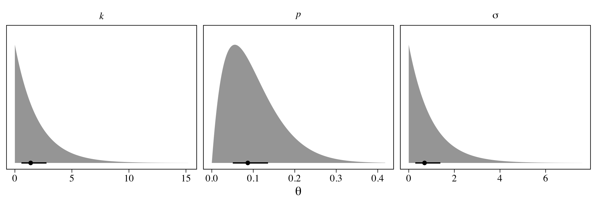

Here the points are the posterior medians and the horizontal lines the
quantile-based 50% intervals. Turns out that
\(\operatorname{Beta}(2, 18)\) prior for \(p\) pushes the bulk of the
prior mass down near zero. The beta distribution also forces the
parameter space for \(p\) to range between 0 and 1. If we denote the two
parameters of the beta distribution as \(\alpha\) and \(beta\), we can
compute the mean for any beta distribution as
\(\alpha / (\alpha + \beta)\). Thus the mean for our
\(\operatorname{Beta}(2, 18)\) prior is \(2 / (2 + 18) = 2 / 20 = 0.1\).

Because we computed our weight and height variables, `w` and `h`, by
dividing the original variables by their respective means, each now has
a mean of 1.

``` r
d %>% 
  pivot_longer(w:h) %>% 
  group_by(name) %>% 
  summarise(mean = mean(value))
```

    ## # A tibble: 2 x 2
    ##   name   mean
    ##   <chr> <dbl>
    ## 1 h         1
    ## 2 w         1

Here’s their bivariate distribution in a scatter plot.

``` r
d %>% 
  ggplot(aes(x = h, y = w)) +
  geom_vline(xintercept = 1, linetype = 2, size = 1/4, color = "grey50") +
  geom_hline(yintercept = 1, linetype = 2, size = 1/4, color = "grey50") +
  geom_point(size = 1/4)
```

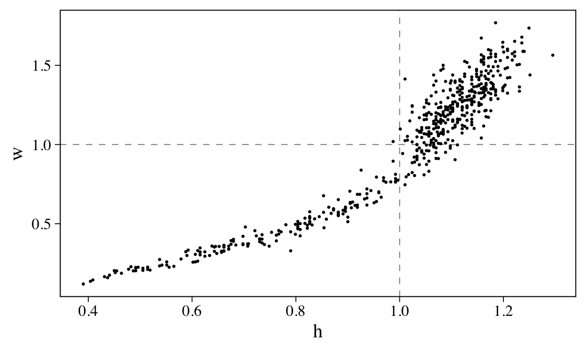

With this scaling, here is the formula for an individual with average
weight and height:

\[
\begin{align*}
1 & = k \pi p^2 1^3 \\
  & = k \pi p^2.
\end{align*}
\]

If you assume \(p < .5\), \(k\) must be greater than 1. \(k\) also has
to be positive. To get a sense of this, we can further work the algebra:

\[
\begin{align*}
1 & = k \pi p^2 \\
1/k  & = \pi p^2 \\
k  & = 1 / \pi p^2.
\end{align*}
\]

To get a better sense of that relation, we might plot.

``` r
tibble(p = seq(from = 0.001, to = 0.499, by = 0.001)) %>% 
  mutate(k = 1 / (pi * p^2)) %>% 
  ggplot(aes(x = p, y = k)) +
  geom_line() +
  labs(x = expression(italic(p)),
       y = expression(italic(k))) +
  coord_cartesian(ylim = c(0, 500))
```

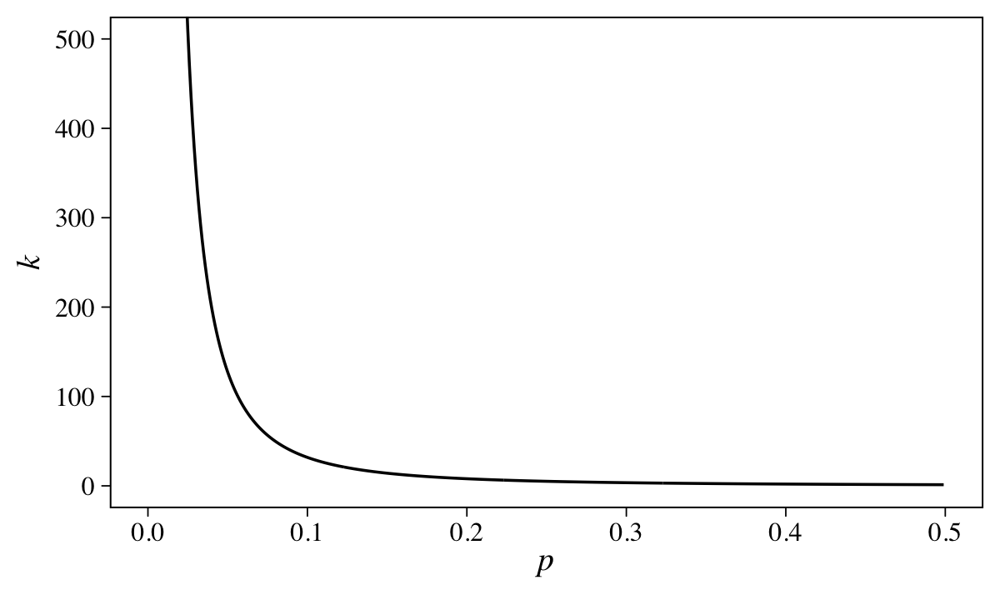

McElreath’s quick and dirty solution was to set
\(k \sim \operatorname{Exponential}(0.5)\), which has a prior predictive
mean of 2.

By setting up his model formula as `exp(mu) = ...`, McElreath
effectively used the log link. It turns out that **brms** only supports
the `identity` and `inverse` links for `family = lognormal`. However, we
can sneak in the log link by nesting the right-hand side of the formula
within `log()`.

``` r
b16.1 <- 
  brm(data = d,
      family = lognormal,
      bf(w ~ log(3.141593 * k * p^2 * h^3),
         k + p ~ 1,
         nl = TRUE),
      prior = c(prior(beta(2, 18), nlpar = p, lb = 0, ub = 1),
                prior(exponential(0.5), nlpar = k, lb = 0),
                prior(exponential(1), class = sigma)),
      iter = 2000, warmup = 1000, chains = 4, cores = 4,
      seed = 16,
      file = "/Users/solomonkurz/Dropbox/Recoding Statistical Rethinking 2nd ed/fits/b16.01")
```

Check the parameter summary.

``` r
print(b16.1)
```

    ##  Family: lognormal 
    ##   Links: mu = identity; sigma = identity 
    ## Formula: w ~ log(3.141593 * k * p^2 * h^3) 
    ##          k ~ 1
    ##          p ~ 1
    ##    Data: d (Number of observations: 544) 
    ## Samples: 4 chains, each with iter = 2000; warmup = 1000; thin = 1;
    ##          total post-warmup samples = 4000
    ## 
    ## Population-Level Effects: 
    ##             Estimate Est.Error l-95% CI u-95% CI Rhat Bulk_ESS Tail_ESS
    ## k_Intercept     5.79      2.72     2.16    12.49 1.00     1177     1488
    ## p_Intercept     0.25      0.06     0.16     0.37 1.00     1178     1459
    ## 
    ## Family Specific Parameters: 
    ##       Estimate Est.Error l-95% CI u-95% CI Rhat Bulk_ESS Tail_ESS
    ## sigma     0.21      0.01     0.19     0.22 1.00     1345     1133
    ## 
    ## Samples were drawn using sampling(NUTS). For each parameter, Bulk_ESS
    ## and Tail_ESS are effective sample size measures, and Rhat is the potential
    ## scale reduction factor on split chains (at convergence, Rhat = 1).

McElreath didn’t show the parameter summary for his `m16.1` in the text.
If you fit the model with both **rethinking** and **brms**, you’ll see
our `b16.1` matches up quite well. To make our version of Figure 16.2,
we’ll use a `GGally::ggpairs()` workflow. First we’ll save our
customizes settings for the three subplot types.

``` r
my_lower <- function(data, mapping, ...) {
  
  # get the x and y data to use the other code
  x <- eval_data_col(data, mapping$x)
  y <- eval_data_col(data, mapping$y)
  
  # compute the correlations
  corr <- cor(x, y, method = "p", use = "pairwise")
  abs_corr <- abs(corr)
  
  # plot the cor value
  ggally_text(
    label = formatC(corr, digits = 2, format = "f") %>% str_replace(., "0.", "."),
    mapping = aes(),
    size = 3.5, 
    color = "black",
    family = "Times") +
    scale_x_continuous(NULL, breaks = NULL) +
    scale_y_continuous(NULL, breaks = NULL)
}

my_diag <- function(data, mapping, ...) {
  ggplot(data = data, mapping = mapping) + 
    geom_histogram(size = 1/4, color = "white", fill = "grey67", bins = 20) +
    scale_x_continuous(NULL, breaks = NULL) +
    scale_y_continuous(NULL, breaks = NULL)
}

my_upper <- function(data, mapping, ...) {
  ggplot(data = data, mapping = mapping) + 
    geom_point(size = 1/4, alpha = 1/4) +
    scale_x_continuous(NULL, breaks = NULL) +
    scale_y_continuous(NULL, breaks = NULL)
}
```

Now we make our version of Figure 16.2.a.

``` r
library(GGally)

posterior_samples(b16.1) %>% 
  select(-lp__) %>% 
  set_names(c("italic(k)", "italic(p)", "sigma")) %>% 
  ggpairs(upper = list(continuous = my_upper),
          diag = list(continuous = my_diag),
          lower = list(continuous = my_lower),
          labeller = label_parsed) +
  theme(strip.text = element_text(size = 8),
        strip.text.y = element_text(angle = 0))
```

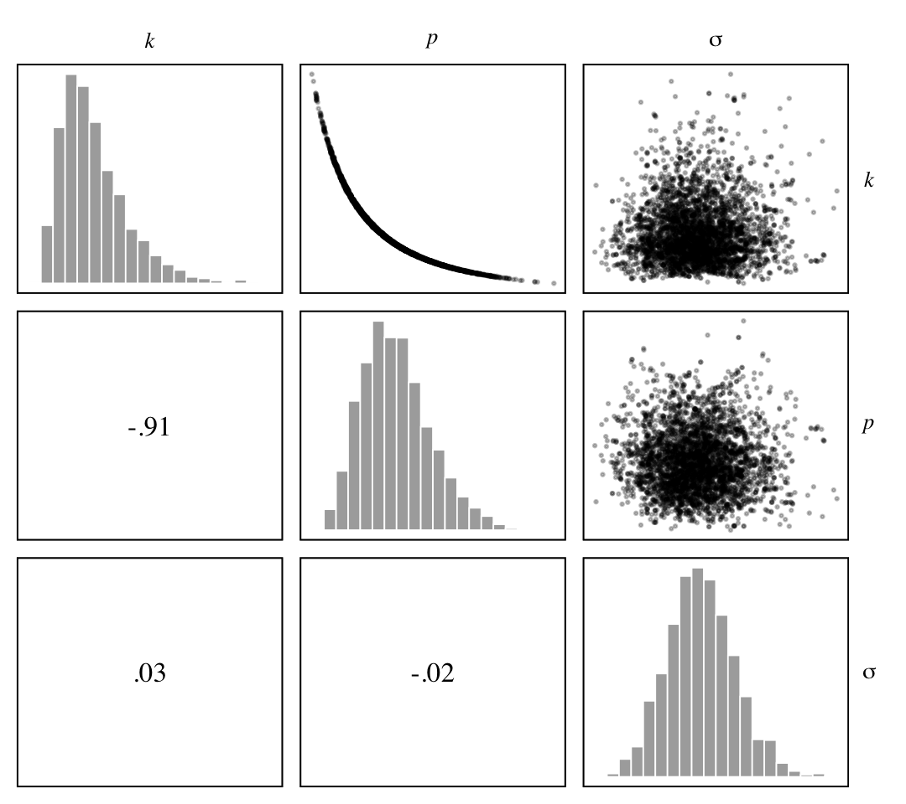

We see the lack of identifiability of \(k\) and \(p\) resulted in a
strong inverse relation between them. Now here’s how we might make
Figure 16.2.b.

``` r
nd <- 
  tibble(h = seq(from = 0, to = 1.5, length.out = 50))

p <-
  predict(b16.1,
          newdata = nd) %>% 
  data.frame() %>% 
  bind_cols(nd)

d %>% 
  ggplot(aes(x = h)) +
  geom_smooth(data = p,
              aes(y = Estimate, ymin = Q2.5, ymax = Q97.5),
              stat = "identity",
              fill = "grey67", color = "black", size = 1/4) +
  geom_point(aes(y = w),
             size = 1/3) +
  coord_cartesian(xlim = c(0, max(d$h)),
                  ylim = c(0, max(d$w))) +
  labs(x = "height (scaled)",
       y = "weight (scaled)")
```

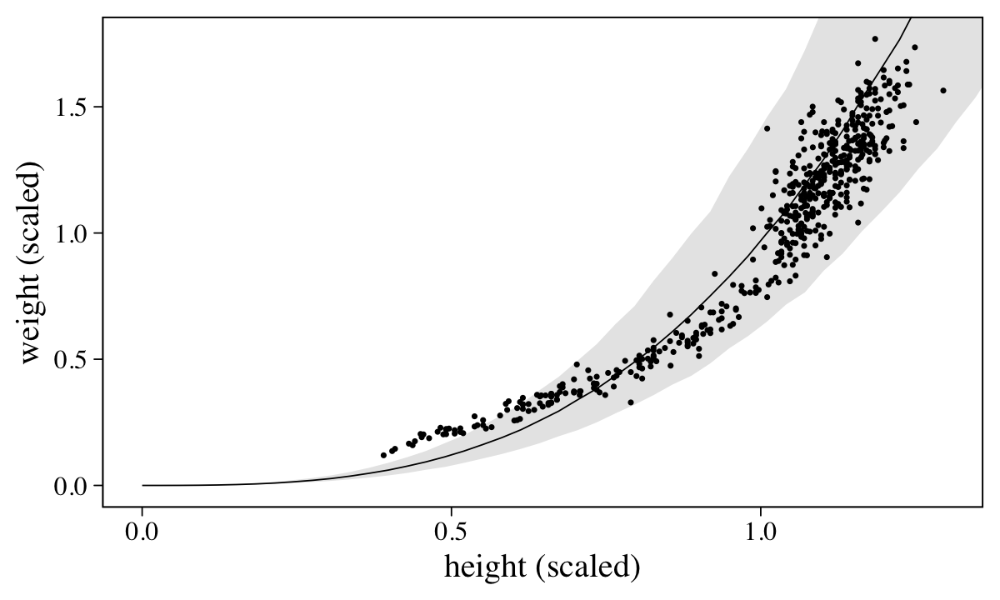

Overall the model did okay, but the poor fit for the cases with lower
values of height and weight suggests we might be missing important
differences between children and adults.

### 16.1.3. GLM in disguise.

Recall that because **brms** does not support the log link for the
Log-Normal likelihood, we recast our `b16.1` likelihood as

\[
\begin{align*}
\text{w}_i & \sim \operatorname{Log-Normal}(\mu_i, \sigma) \\
\mu_i      & = \log(k \pi p^2 \text{h}_i^3).
\end{align*}
\]

Because multiplication becomes addition on the log scale, we can also
express this as

\[
\begin{align*}
\text{w}_i & \sim \operatorname{Log-Normal}(\mu_i, \sigma) \\
\mu_i      & = \log(k) + \log(\pi) + 2 \log(p) + 3 \log(\text{h}_i),
\end{align*}
\]

which means our fancy non-linear model is just linear regression on the
log scale. McElreath pointed this out

> to highlight one of the reasons that generalized linear models are so
> powerful. Lots of natural relationships are GLM relationships, on a
> specific scale of measurement. At the same time, the GLM approach
> wants to simply estimate parameters which may be informed by a proper
> theory, as in this case. (p. 531)

## 16.2. Hidden minds and observed behavior

Load the `Boxes` data (van Leeuwen et al.,
[2018](#ref-vanleeuwenDevelopmentHumanSocial2018)).

``` r
data(Boxes, package = "rethinking")
d <- Boxes
rm(Boxes)

rethinking::precis(d)
```

    ##                     mean        sd 5.5% 94.5%      histogram
    ## y              2.1208267 0.7279860    1     3     ▃▁▁▁▇▁▁▁▁▅
    ## gender         1.5055644 0.5003669    1     2     ▇▁▁▁▁▁▁▁▁▇
    ## age            8.0302067 2.4979055    5    13     ▇▃▅▃▃▃▂▂▂▁
    ## majority_first 0.4848967 0.5001696    0     1     ▇▁▁▁▁▁▁▁▁▇
    ## culture        3.7519873 1.9603189    1     8 ▃▂▁▇▁▂▁▂▁▂▁▁▁▁

The data are from 629 children.

``` r
d %>% count()
```

    ##     n
    ## 1 629

Their ages ranged from 4 to 14 years and, as indicated by the histogram
above, the bulk were on the younger end.

``` r
d %>% 
  summarise(min = min(age),
            max = max(age))
```

    ##   min max
    ## 1   4  14

Here’s a depiction of our criterion variable `y`.

``` r
# wrangle
d %>% 
  mutate(color = factor(y,
                        levels = 1:3,
                        labels = c("unchosen", "majority", "minority"))) %>%
  mutate(y = str_c(y, " (", color, ")")) %>% 
  count(y) %>% 
  mutate(percent = (100 * n / sum(n))) %>% 
  mutate(label = str_c(round(percent, digits = 1), "%")) %>% 
  
  # plot
  ggplot(aes(y = y)) +
  geom_col(aes(x = n)) +
  geom_text(aes(x = n + 4, label = label),
            hjust = 0, family = "Times") +
  scale_x_continuous(expression(italic(n)), expand = expansion(mult = c(0, 0.1))) +
  labs(title = "The criterion variable y indexes three kinds of color choices",
       subtitle = "Children tended to prefer the 'majority' color.",
       y = NULL) +
  theme(axis.text.y = element_text(hjust = 0),
        axis.ticks.y = element_blank())
```

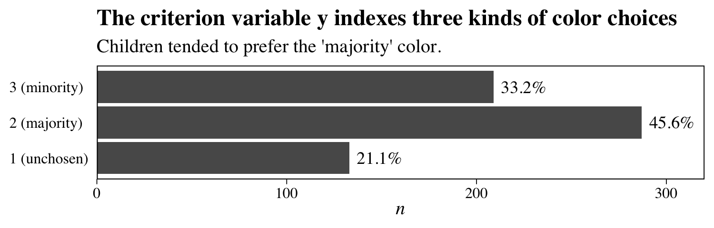

### 16.2.1. The scientific model.

> The key, as always, is to think generatively. Consider for example a
> group of children in which half of them choose at random and the other
> half follow the majority. If we simulate choices for these children,
> we can figure out how often we might see the “2” choice, the one that
> indicates the majority color. (p. 532)

Here’s an alternative way to set up McEreath’s **R** code 16.6.

``` r
set.seed(16)

n <- 30 # number of children

tibble(name  = rep(c("y1", "y2"), each = n / 2),
       value = c(sample(1:3, size = n / 2, replace = T),
                 rep(2, n / 2))) %>% 
  mutate(y = sample(value)) %>% 
  summarise(`number of 2s` = sum(y == 2) / n)
```

    ## # A tibble: 1 x 1
    ##   `number of 2s`
    ##            <dbl>
    ## 1          0.633

> We’ll consider 5 different strategies children might use.
> 
> 1.  Follow the Majority: Copy the majority demonstrated color.
> 2.  Follow the Minority: Copy the minority demonstrated color.
> 3.  Maverick: Choose the color that no demonstrator chose.
> 4.  Random: Choose a color at random, ignoring the demonstrators.
> 5.  Follow First: Copy the color that was demonstrated first. This was
>     either the majority color (when `majority_first` equals 1) or the
>     minority color (when 0). (p. 533)

### 16.2.2. The statistical model.

Our statistical will follow the form

\[
\begin{align*}
y_i & \sim \operatorname{Categorical}(\theta) \\
\theta_j & = \sum_{s = 1}^5 p_s \operatorname{Pr}(j | s) \;\;\; \text{for} \; j = 1, \dots, 3 \\
p & \sim \operatorname{Dirichlet}(4, 4, 4, 4, 4),
\end{align*}
\]

where \(s\) indexes one of our five latent strategies and
\(\operatorname{Pr}(j | s)\) is the probability of one of the three
color choices given a child is using the \(s\)th strategy. The
\(\sum_{s = 1}^5 p_s\) portion conveys these five probabilities are
treated as a simplex, which means they will sum to one. We give these
probabilities a Dirichlet prior, which we learned about back in
\[Section 12.4\]\[Ordered categorical predictors\]. Here’s what that
prior looks like.

``` r
set.seed(16)

rdirichlet(n = 1e5, alpha = rep(4, times = 5)) %>% 
  data.frame() %>% 
  set_names(1:5) %>% 
  pivot_longer(everything()) %>% 
  mutate(name  = name %>% as.double(),
         alpha = str_c("alpha[", name, "]")) %>% 
  
  ggplot(aes(x = value, group = name)) + 
  geom_histogram(fill = "grey67", binwidth = .02, boundary = 0) +
  scale_x_continuous(expression(italic(p[s])), limits = c(0, 1),
                     breaks = c(0, .2, .5, 1), labels = c("0", ".2", ".5", "1"), ) +
  scale_y_continuous(NULL, breaks = NULL) +
  labs(subtitle = expression("Dirichlet"*(4*", "*4*", "*4*", "*4*", "*4))) +
  facet_wrap(~alpha, labeller = label_parsed, nrow = 1)
```

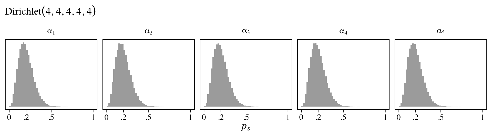

### 16.2.3. Coding the statistical model.

Let’s take a look at McElreath’s Stan code.

``` r
library(rethinking)
data(Boxes_model) 
cat(Boxes_model)
```

    ## 
    ## data{
    ##     int N;
    ##     int y[N];
    ##     int majority_first[N];
    ## }
    ## parameters{
    ##     simplex[5] p;
    ## }
    ## model{
    ##     vector[5] phi;
    ##     
    ##     // prior
    ##     p ~ dirichlet( rep_vector(4,5) );
    ##     
    ##     // probability of data
    ##     for ( i in 1:N ) {
    ##         if ( y[i]==2 ) phi[1]=1; else phi[1]=0; // majority
    ##         if ( y[i]==3 ) phi[2]=1; else phi[2]=0; // minority
    ##         if ( y[i]==1 ) phi[3]=1; else phi[3]=0; // maverick
    ##         phi[4]=1.0/3.0;                         // random
    ##         if ( majority_first[i]==1 )             // follow first
    ##             if ( y[i]==2 ) phi[5]=1; else phi[5]=0;
    ##         else
    ##             if ( y[i]==3 ) phi[5]=1; else phi[5]=0;
    ##         
    ##         // compute log( p_s * Pr(y_i|s )
    ##         for ( j in 1:5 ) phi[j] = log(p[j]) + log(phi[j]);
    ##         // compute average log-probability of y_i
    ##         target += log_sum_exp( phi );
    ##     }
    ## }

I’m not aware that one can fit this model directly with **brms**. My
guess is that if it’s possible, it would require a custom likelihood
(see Bürkner, [2020](#ref-Bürkner2020Define)). If you can reproduce
McElreath’s Stan code with this or some other approach in **brms**,
please [share your code on
GitHub](https://github.com/ASKurz/Statistical_Rethinking_with_brms_ggplot2_and_the_tidyverse_2_ed/issues).
In the mean time, we’re going to follow along with the text and fit the
model with `rstan::stan()`.

``` r
# prep data 
dat_list <- list(
  N = nrow(d),
  y = d$y,
  majority_first = d$majority_first )

# run the sampler
m16.2 <-
  stan(model_code = Boxes_model, 
       data = dat_list, 
       chains = 3, cores = 3,
       seed = 16)
```

Here’s what it looks like if you `print()` a fit object from the
`stan()` function.

``` r
print(m16.2)
```

    ## Inference for Stan model: 27b25f2c261c65f6230541a266cbbdbd.
    ## 3 chains, each with iter=2000; warmup=1000; thin=1; 
    ## post-warmup draws per chain=1000, total post-warmup draws=3000.
    ## 
    ##         mean se_mean   sd    2.5%     25%     50%     75%   97.5% n_eff Rhat
    ## p[1]    0.26    0.00 0.04    0.19    0.23    0.26    0.28    0.32   986 1.00
    ## p[2]    0.14    0.00 0.03    0.07    0.12    0.14    0.16    0.20  1087 1.01
    ## p[3]    0.15    0.00 0.03    0.09    0.13    0.15    0.17    0.20  1066 1.01
    ## p[4]    0.20    0.00 0.08    0.07    0.14    0.19    0.25    0.37   792 1.01
    ## p[5]    0.26    0.00 0.03    0.20    0.24    0.26    0.28    0.32  2559 1.00
    ## lp__ -667.17    0.04 1.44 -670.69 -667.91 -666.81 -666.12 -665.32  1203 1.00
    ## 
    ## Samples were drawn using NUTS(diag_e) at Sat Nov  7 14:32:59 2020.
    ## For each parameter, n_eff is a crude measure of effective sample size,
    ## and Rhat is the potential scale reduction factor on split chains (at 
    ## convergence, Rhat=1).

Here’s the summary with `rethinking::precis()`.

``` r
precis(m16.2, depth = 2)
```

    ##           mean         sd       5.5%     94.5%     n_eff     Rhat4
    ## p[1] 0.2576792 0.03642940 0.19925939 0.3143086  985.7502 1.0042274
    ## p[2] 0.1390785 0.03299730 0.08584531 0.1916790 1086.6851 1.0056198
    ## p[3] 0.1479720 0.03021546 0.09678031 0.1942334 1066.2915 1.0066600
    ## p[4] 0.1961164 0.07966720 0.08178310 0.3356874  791.8116 1.0078264
    ## p[5] 0.2591538 0.03212438 0.20681421 0.3103560 2559.2139 0.9991496

Here we show marginal posterior for \(p_s\).

``` r
label <- c("Majority~(italic(s)[1])", 
           "Minority~(italic(s)[2])",
           "Maverick~(italic(s)[3])", 
           "Random~(italic(s)[4])", 
           "Follow~First~(italic(s)[5])")

precis(m16.2, depth = 2) %>% 
  data.frame() %>% 
  mutate(name = factor(label, levels = label)) %>% 
  mutate(name = fct_rev(name)) %>% 
  
  ggplot(aes(x = mean, xmin = X5.5., xmax = X94.5., y = name)) +
  geom_vline(xintercept = .2, size = 1/4, linetype = 2) +
  geom_pointrange(size = 1/4, fatten = 6/4) +
  scale_x_continuous(expression(italic(p[s])), limits = c(0, 1),
                     breaks = 0:5 / 5) +
  scale_y_discrete(NULL, labels = ggplot2:::parse_safe) +
  theme(axis.text.y = element_text(hjust = 0))
```

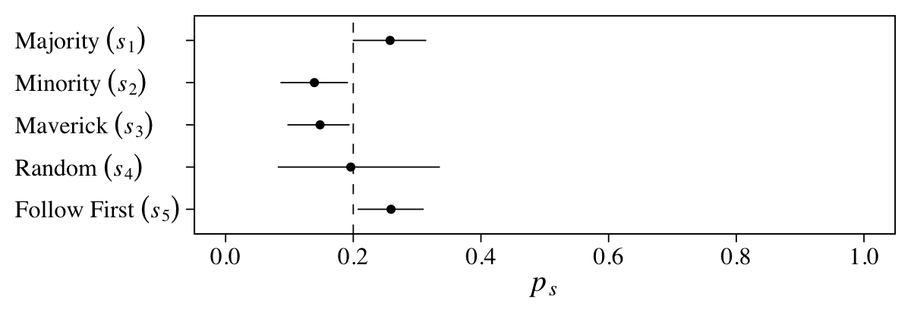

As an alternative, this might be a good time to revisit the
`tidybayes::stat_ccdfinterval()` approach (see \[Section
12.3.3\]\[Adding predictor variables.\]), which will depict those
posteriors with a bar plot where the ends of the bars depict our
uncertainty in terms of cumulative density curves.

``` r
extract.samples(m16.2) %>% 
  data.frame() %>% 
  select(-lp__) %>% 
  set_names(label) %>% 
  pivot_longer(everything()) %>% 
  mutate(name = factor(name, levels = label)) %>% 
  mutate(name = fct_rev(name)) %>% 
  
  ggplot(aes(x = value, y = name)) +
  geom_vline(xintercept = .2, size = 1/4, linetype = 2) +
  stat_ccdfinterval(.width = .95, size = 1/4, alpha = .8) +
  scale_x_continuous(expression(italic(p[s])), expand = c(0, 0), limits = c(0, 1),
                     breaks = 0:5 / 5) +
  scale_y_discrete(NULL, labels = ggplot2:::parse_safe) +
  theme(axis.text.y = element_text(hjust = 0),
        axis.ticks.y = element_blank())
```

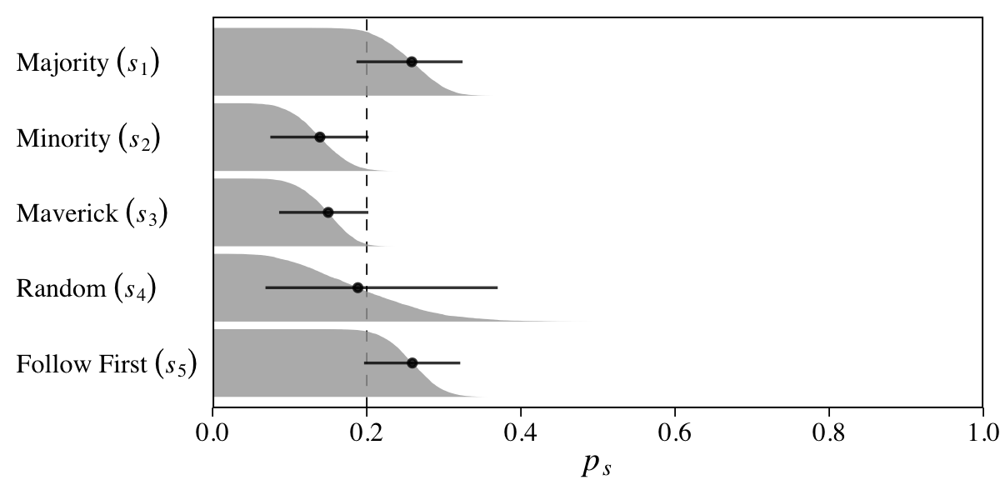

### 16.2.4. State space models.

In this section of the text, McElreath mentioned state space models and
hidden Markov models. Based on [this
thread](https://discourse.mc-stan.org/t/state-space-models-with-brms/4087)
in the Stan forums and [this
issue](https://github.com/paul-buerkner/brms/issues/173) in the **brms**
GitHub repo, it looks like state space models are not supported in
**brms** at this time. As for hidden Markov models, I’m not sure whether
they are supported by **brms**. The best I could find was [this
thread](https://discourse.mc-stan.org/t/modelling-with-non-binary-proportions-as-outcome/12324)
on the Stan forums. If you know more about either of these topics,
please share your knowledge [on this book’s GitHub
repo](https://github.com/ASKurz/Statistical_Rethinking_with_brms_ggplot2_and_the_tidyverse_2_ed/issues).

## 16.3. Ordinary differential nut cracking

Load the `Panda_nuts` data (Boesch et al.,
[2019](#ref-boeschLearningCurvesTeaching2019)).

``` r
data(Panda_nuts, package = "rethinking")
d <- Panda_nuts
rm(Panda_nuts)
```

Anticipating McElreath’s **R** code 16.11, we’ll wrangle a little.

``` r
d <-
  d %>% 
  mutate(n     = nuts_opened,
         age_s = age / max(age))

glimpse(d)
```

    ## Rows: 84
    ## Columns: 9
    ## $ chimpanzee  <int> 11, 11, 18, 18, 18, 11, 11, 17, 7, 1, 22, 9, 9, 9, 9, 9, 9, 9, 9, 9, 15, 7, 9, 1, 7, 13…
    ## $ age         <int> 3, 3, 4, 4, 4, 4, 4, 5, 5, 5, 5, 6, 6, 6, 6, 6, 6, 6, 6, 6, 6, 6, 6, 6, 6, 6, 6, 6, 6, …
    ## $ sex         <fct> m, m, f, f, f, m, m, f, m, m, m, m, m, m, m, m, m, m, m, m, m, m, m, m, m, m, m, m, m, …
    ## $ hammer      <fct> G, G, wood, G, L, Q, Q, wood, G, L, wood, G, G, G, G, G, G, G, G, G, G, G, G, L, G, woo…
    ## $ nuts_opened <int> 0, 0, 0, 0, 0, 0, 0, 0, 3, 0, 0, 58, 4, 21, 9, 2, 30, 19, 13, 6, 11, 1, 2, 0, 1, 0, 0, …
    ## $ seconds     <dbl> 61.0, 37.0, 20.0, 14.0, 13.0, 24.0, 30.5, 135.0, 24.0, 13.0, 34.0, 66.5, 5.0, 24.0, 20.…
    ## $ help        <fct> N, N, N, y, N, N, N, N, N, N, N, N, N, N, N, N, N, N, N, N, N, y, N, N, N, N, N, y, y, …
    ## $ n           <int> 0, 0, 0, 0, 0, 0, 0, 0, 3, 0, 0, 58, 4, 21, 9, 2, 30, 19, 13, 6, 11, 1, 2, 0, 1, 0, 0, …
    ## $ age_s       <dbl> 0.1875, 0.1875, 0.2500, 0.2500, 0.2500, 0.2500, 0.2500, 0.3125, 0.3125, 0.3125, 0.3125,…

Our criterion is `n`, the number of *Panda* nuts opened by a chimpanzee
on a given occasion. The two focal predictor variables are `age` and
`seconds`. Here they are depicted in a pairs plot.

``` r
d %>% 
  select(n, age, seconds) %>% 
  ggpairs(upper = list(continuous = my_upper),
          diag = list(continuous = my_diag),
          lower = list(continuous = my_lower)) +
  theme(strip.text.y = element_text(hjust = 0, angle = 0))
```

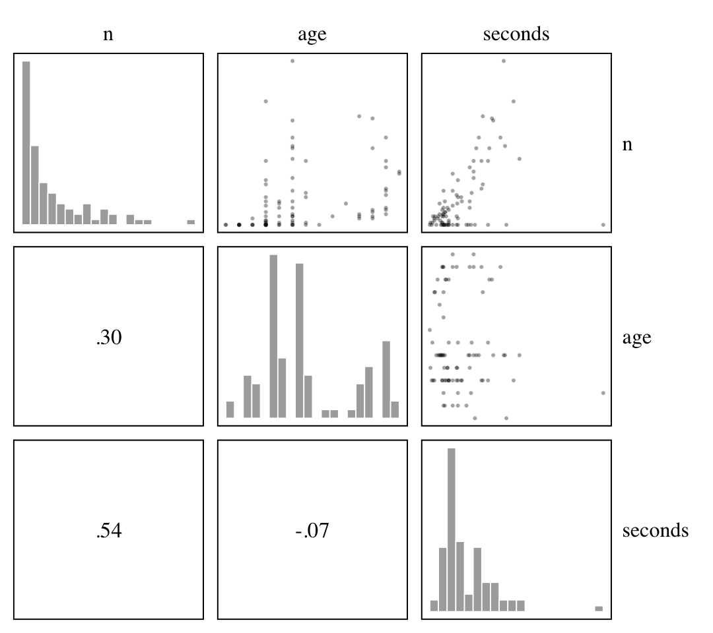

### 16.3.1. Scientific model.

As a starting point, McElreath proposed we the strength of a chimpanzee
would relate to the number of nuts they might open. We don’t have a
measure of strength, but we do have `age`, which is a proxy for how
close a chimp might be to their maximum body size, and we presume body
size would be proportional to strength. If we let \(t\) index time,
\(M_\text{max}\) be the maximum body size (mass), \(M_t\) be the current
body size, and \(k\) stand for the rate of skill gain the comes with
age, we can write

\[M_t = M_\text{max} [1 - \exp(-kt) ]\]

to solve for mass at a given age (von Bertalanffy,
[1934](#ref-vonbertalanffyUntersuchungenUeberGesetzlichkeit1934)). But
again, we actually care about strength, not mass. Letting \(S_t\) be
strength at time \(t\), we can express a proportional relation between
the two as \(S_t = \beta M_t\). Now if we let \(\lambda\) stand in for
the number of nuts opening, \(\alpha\) express the relation of strength
to nut opening, we can write

\[\lambda = \alpha S_t^\theta = \alpha \big ( \beta M_\text{max} [1 - \exp(-kt) ]  \big ) ^\theta,\]

“where \(\theta\) is some exponent greater than 1” (p. 538). If we
rescale \(M_\text{max} = 1\), we can simplify the equation to

\[\lambda = \alpha \beta^\theta [1 - \exp(-kt) ]^\theta.\]

As “the product \(\alpha \beta^\theta\) in the front just rescales
strength to nuts-opened-per-second” (p. 538), we can colapse it to a
single parameter, \(\phi\), which leaves us with

\[\lambda = \phi [1 - \exp(-kt) ]^\theta.\]

This is our scientific model.

### 16.3.2. Statistical model.

Now if we let \(n_i\) be the number of nuts opened, we can write our
statistical model as

\[
\begin{align*}
n_i & \sim \operatorname{Poisson}(\lambda_i) \\
\lambda_i & = \text{seconds}_i \, \phi [1 - \exp(-k \,\text{age}_i) ]^\theta,
\end{align*}
\]

where we have replaced our time index, \(t\), with the variable `age`.
By including the variable `seconds` in the equation, we have scaled the
results to be nuts per second. McElreath proposed the priors:

\[
\begin{align*}
\phi   & \sim \operatorname{Log-Normal}(\log 1, 0.10) \\
k      & \sim \operatorname{Log-Normal}(\log 2, 0.25) \\
\theta & \sim \operatorname{Log-Normal}(\log 5, 0.25),
\end{align*}
\]

all of which were Log-Normal to ensure the parameters were positive and
continuous. To get a sense of what these priors implied, he simulated.
Here’s our version of his simulations, which make up Figure 16.4.

``` r
n <- 1e4

# define the x-axis breaks
at <- 0:6 / 4

# how many prior draws would you like?
sample_n <- 50

# simulate
set.seed(16)

prior <-
  tibble(index = 1:n,
         phi   = rlnorm(n, meanlog = log(1), sdlog = 0.1),
         k     = rlnorm(n, meanlog = log(2), sdlog = 0.25),
         theta = rlnorm(n, meanlog = log(5), sdlog = 0.25)) %>% 
  sample_n(size = sample_n) %>% 
  expand(nesting(index, phi, k, theta),
         age = seq(from = 0, to = 1.5, length.out = 1e2)) %>% 
  mutate(bm = 1 - exp(-k * age),
         ns = phi * (1 - exp(-k * age))^theta) 

# left panel
p1 <-
  prior %>% 
  ggplot(aes(x = age, y = bm, group = index)) +
  geom_line(size = 1/4, alpha = 1/2) +
  scale_x_continuous(breaks = at, labels = round(at * max(d$age))) +
  ylab("body mass")

# right panel
p2 <-
  prior %>% 
  ggplot(aes(x = age, y = ns, group = index)) +
  geom_line(size = 1/4, alpha = 1/2) +
  scale_x_continuous(breaks = at, labels = round(at * max(d$age))) +
  ylab("nuts per second")

# combine and plot
library(patchwork)

p1 + p2 + 
  plot_annotation(title = "Prior predictive simulation for the nut opening model",
                  subtitle = "Each panel shows the results from 50 prior draws.")
```

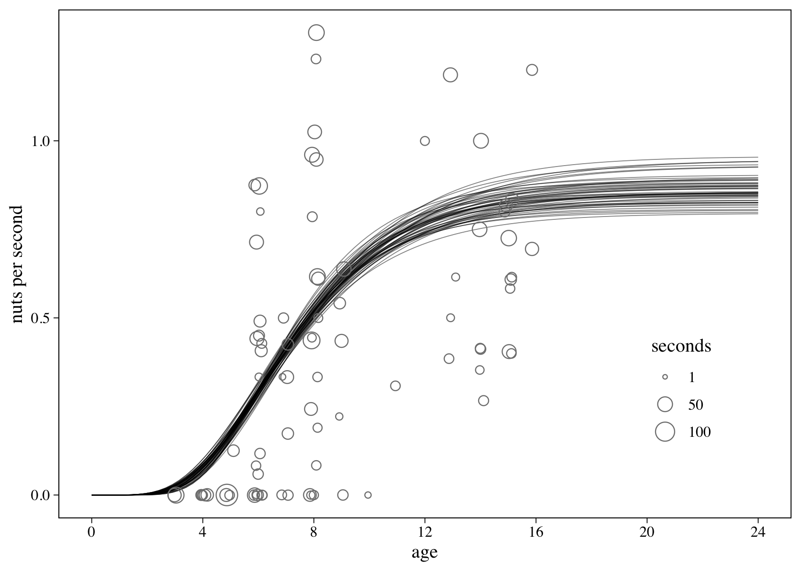

McElreath suggested we inspect the distributions of these priors. Here
they are in a series of histograms.

``` r
set.seed(16)

tibble(phi         = rlnorm(n, meanlog = log(1), sdlog = 0.1),
       `italic(k)` = rlnorm(n, meanlog = log(2), sdlog = 0.25),
       theta       = rlnorm(n, meanlog = log(5), sdlog = 0.25)) %>% 
  pivot_longer(everything()) %>% 
  
  ggplot(aes(x = value)) +
  geom_histogram(fill = "grey67", bins = 40, boundary = 0) +
  scale_y_continuous(NULL, breaks = NULL) +
  scale_x_continuous("marginal prior", limits = c(0, NA)) +
  facet_wrap(~name, scales = "free", labeller = label_parsed)
```

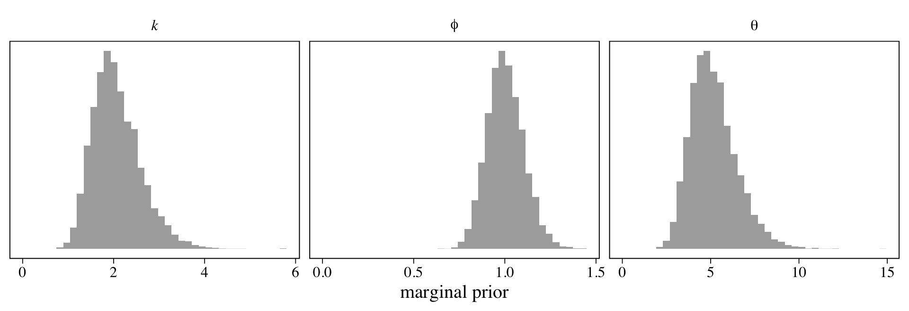

Happily, we can fit this model using the non-linear **brms** syntax.

``` r
b16.4 <- 
  brm(data = d,
      family = poisson(link = identity),
      bf(n ~ seconds * phi * (1 - exp(-k * age_s))^theta,
         phi + k + theta ~ 1,
         nl = TRUE),
      prior = c(prior(lognormal(log(1), 0.1), nlpar = phi, lb = 0),
                prior(lognormal(log(2), 0.25), nlpar = k, lb = 0),
                prior(lognormal(log(5), 0.25), nlpar = theta, lb = 0)),
      iter = 2000, warmup = 1000, chains = 4, cores = 4,
      seed = 16,
      file = "/Users/solomonkurz/Dropbox/Recoding Statistical Rethinking 2nd ed/fits/b16.04")
```

Check the parameter summary.

``` r
print(b16.4)
```

    ##  Family: poisson 
    ##   Links: mu = identity 
    ## Formula: n ~ seconds * phi * (1 - exp(-k * age_s))^theta 
    ##          phi ~ 1
    ##          k ~ 1
    ##          theta ~ 1
    ##    Data: d (Number of observations: 84) 
    ## Samples: 4 chains, each with iter = 2000; warmup = 1000; thin = 1;
    ##          total post-warmup samples = 4000
    ## 
    ## Population-Level Effects: 
    ##                 Estimate Est.Error l-95% CI u-95% CI Rhat Bulk_ESS Tail_ESS
    ## phi_Intercept       0.86      0.04     0.79     0.95 1.00     1045     1589
    ## k_Intercept         5.97      0.56     4.88     7.09 1.00      787     1151
    ## theta_Intercept     9.81      2.00     6.50    14.31 1.00      858     1276
    ## 
    ## Samples were drawn using sampling(NUTS). For each parameter, Bulk_ESS
    ## and Tail_ESS are effective sample size measures, and Rhat is the potential
    ## scale reduction factor on split chains (at convergence, Rhat = 1).

No we might get a sense of what this posterior means by plotting nuts
per second as a function of `age` in our version of Figure 16.5.

``` r
posterior_samples(b16.4) %>% 
  mutate(iter = 1:n()) %>% 
  sample_n(sample_n) %>% 
  expand(nesting(iter, b_phi_Intercept, b_k_Intercept, b_theta_Intercept),
         age = seq(from = 0, to = 1.5, length.out = 1e2)) %>% 
  mutate(ns = b_phi_Intercept * (1 - exp(-b_k_Intercept * age))^b_theta_Intercept) %>% 
  
  ggplot() +
  geom_line(aes(x = age, y = ns, group = iter),
            size = 1/4, alpha = 1/2) +
  geom_jitter(data = d,
              aes(x = age_s, y = n / seconds, size = seconds),
              shape = 1, width = 0.01, color = "grey50") +
  scale_size_continuous(breaks = c(1, 50, 100), limits = c(1, NA)) +
  scale_x_continuous(breaks = at, labels = round(at * max(d$age))) +
  labs(title = "Posterior predictive distribution for the\nnut opening model",
       y = "nuts per second") +
  theme(legend.background = element_blank(),
        legend.position = c(.9, .25))
```

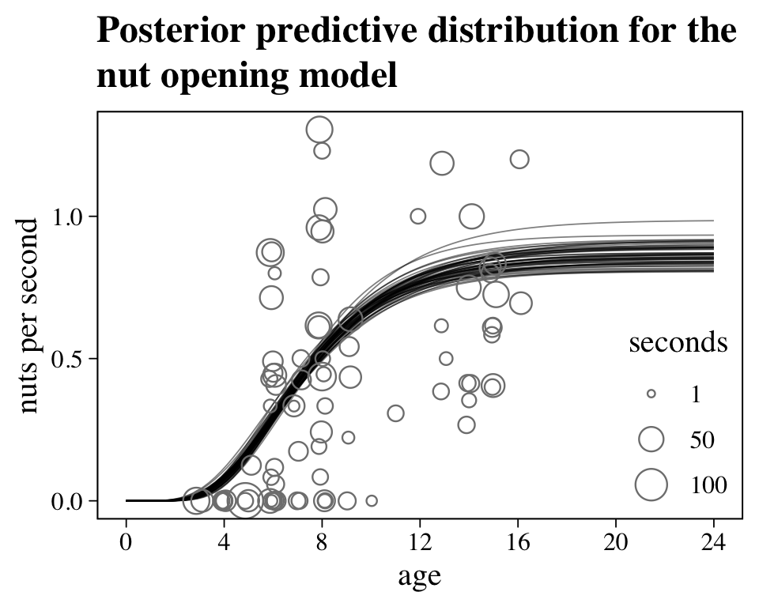

Looks like things flatten out around `age == 16`. Yet since the data
drop off at that `age`, we probably shouldn’t get overconfident.

## 16.4. Population dynamics

Load the `Lynx_Hare` population dynamics data (Hewitt,
[1921](#ref-hewittTheConservation1921)).

``` r
data(Lynx_Hare, package = "rethinking")

glimpse(Lynx_Hare)
```

    ## Rows: 21
    ## Columns: 3
    ## $ Year <int> 1900, 1901, 1902, 1903, 1904, 1905, 1906, 1907, 1908, 1909, 1910, 1911, 1912, 1913, 1914, 1915…
    ## $ Lynx <dbl> 4.0, 6.1, 9.8, 35.2, 59.4, 41.7, 19.0, 13.0, 8.3, 9.1, 7.4, 8.0, 12.3, 19.5, 45.7, 51.1, 29.7,…
    ## $ Hare <dbl> 30.0, 47.2, 70.2, 77.4, 36.3, 20.6, 18.1, 21.4, 22.0, 25.4, 27.1, 40.3, 57.0, 76.6, 52.3, 19.5…

Figure 6.6 will give us a sense of how the lynx and hare populations
ebbed and flowed.

``` r
# for annotation
text <-
  tibble(name  = c("Hare", "Lynx"),
         label = c("Lepus", "Lynx"),
         Year  = c(1913.5, 1915.5),
         value = c(78, 52))

# wrangle
Lynx_Hare %>% 
  pivot_longer(-Year) %>% 
  
  # plot!
  ggplot(aes(x = Year, y = value)) +
  geom_line(aes(color = name),
            size = 1/4) +
  geom_point(aes(fill = name),
             size = 3, shape = 21, color = "white") +
  geom_text(data = text,
            aes(label = label, color = name),
            hjust = 0, family = "Times") +
  scale_fill_grey(start = 0, end = .5) +
  scale_color_grey(start = 0, end = .5) +
  scale_y_continuous("thousands of pelts", breaks = 0:4 * 20, limits = c(0, 90)) +
  theme(legend.position = "none")
```


Note, however, that these are numbers of pelts, not of actual animals.

A typical way to model evenly-spaced time series data like this would be
with an autoregressive model with the basic structure

\[\operatorname{E}(y_t) = \alpha + \beta_1 y_{t-1},\]

where \(t\) indexes time and \(t - 1\) is the time point immediately
before \(t\). Models following this form are called first-order
autoregressive models, AR(1), meaning that the current time point is
only influenced by the previous time point, but none of the earlier
ones. You can build on this format by adding other predictors. A natural
way would be to use a predictor from \(t - 1\) to predict \(y_t\),
following the form

\[\operatorname{E}(y_t) = \alpha + \beta_1 y_{t-1} + \beta_2 x_{t-1}.\]

But that’s still a first-order model. A second-order model, AR(2), would
include a term for \(y_{t - 2}\), such as

\[\operatorname{E}(y_t) = \alpha + \beta_1 y_{t-1} + \beta_2 x_{t-1} + \beta_3 y_{t-2}.\]

McElreath isn’t a huge fan of these models, particularly from the
scientific modeling perspective he developed in this chapter. But
**brms** can fit them and we’ll practice a little in a bonus section,
later on. In the mean time, we’ll follow along and learn about
**ordinary differential equations** (ODEs).

### 16.4.1. The scientific model.

If we let \(H_t\) be the number of hares at time \(t\), we can express
the **rate of change** in the hare population as

\[\frac{\mathrm{d} H}{\mathrm{d} t} = H_t \times (\text{birth rate}) - H_t \times (\text{death rate}).\]

If we presume both birth rates and death rates (*mortality* rates) are
constants, we might denote them \(b_H\) and \(m_H\), respectively, and
re-express the formula as

\[\frac{\mathrm{d} H}{\mathrm{d} t} = H_t b_H - H_t m_H = H_t (b_H - m_H).\]

If we let \(L_t\) stand for the number of lynx present at time \(t\), we
can allow the mortality rate depend on that variable with the expanded
formula

\[\frac{\mathrm{d} H}{\mathrm{d} t} = H_t (b_H - L_t m_H).\]

We can expand this even further to model how the number of hares at a
given time influence the birth rate for lynx (\(b_L\)) to help us model
the rate of change in the lynx population as

\[\frac{\mathrm{d} L}{\mathrm{d} t} = L_t (H_t b_L - m_L),\]

where the lynx mortality rate (\(m_l\)) is now constant. This is called
the **Lotka-Volterra model** (Lotka,
[1925](#ref-lotkaPrinciplesOfPhysicalBiology1925); Volterra,
[1926](#ref-volterraFluctuationsAbundanceSpecies1926)). You may have
noticed how the above equations shifted our focus from what were were
originally interested in, \(\operatorname{E}(H_t)\), to a rate of
change, \(\mathrm{d} H / \mathrm{d} t\). Happily, our equation for
\(\mathrm{d} H / \mathrm{d} t\), “tells us how to update \(H\) after
each tiny unit of passing time \(\mathrm d t\)” (p. 544). You update by

\[H_{t +\mathrm d t} = H_t + \mathrm d t \frac{\mathrm d H}{\mathrm d t} = H_t + \mathrm d t H_t (b_H - L_t m_H).\]
Here we’ll use the custom `sim_lynx_hare()` function to simulate how
this can work. Our version of the function is very similar to the one
McElreath displayed in his **R** code 16.14, but we changed it so it
returns a tibble.

``` r
sim_lynx_hare <- function(n_steps, init, theta, dt = 0.002) { 
  
  L <- rep(NA, n_steps)
  H <- rep(NA, n_steps)
  L[1] <- init[1]
  H[1] <- init[2]
  
  for (i in 2:n_steps) {
    H[i] <- H[i - 1] + dt * H[i - 1] * (theta[1] - theta[2] * L[i - 1])
    L[i] <- L[i - 1] + dt * L[i - 1] * (theta[3] * H[i - 1] - theta[4])
  }
  
  # return a tibble
  tibble(H = H,
         L = L)
  
}
```

Now we simulate.

``` r
theta <- c(0.5, 0.05, 0.025, 0.5)

# simulate
z <- sim_lynx_hare(n_steps = 1e4, 
                   init = as.numeric(Lynx_Hare[1, 2:3]), 
                   theta)

# what did we do?
glimpse(z)
```

    ## Rows: 10,000
    ## Columns: 2
    ## $ H <dbl> 30.00000, 30.01800, 30.03600, 30.05401, 30.07203, 30.09005, 30.10807, 30.12610, 30.14413, 30.1621…
    ## $ L <dbl> 4.000000, 4.002000, 4.004005, 4.006014, 4.008028, 4.010046, 4.012069, 4.014097, 4.016129, 4.01816…

Each row is a stand-in index for time. Here we’ll explicitly add a
`time` column and them plot the results in our version of Figure 16.7.

``` r
z %>% 
  mutate(time = 1:n()) %>% 
  pivot_longer(-time) %>% 
  
  ggplot(aes(x = time, y = value)) +
  geom_line(aes(color = name),
            size = 1/4) +
  scale_color_grey(start = 0, end = .5) +
  scale_x_continuous(breaks = NULL) +
  scale_y_continuous("number (thousands)", breaks = 0:4 * 10, limits = c(0, 45)) +
  theme(legend.position = "none")
```

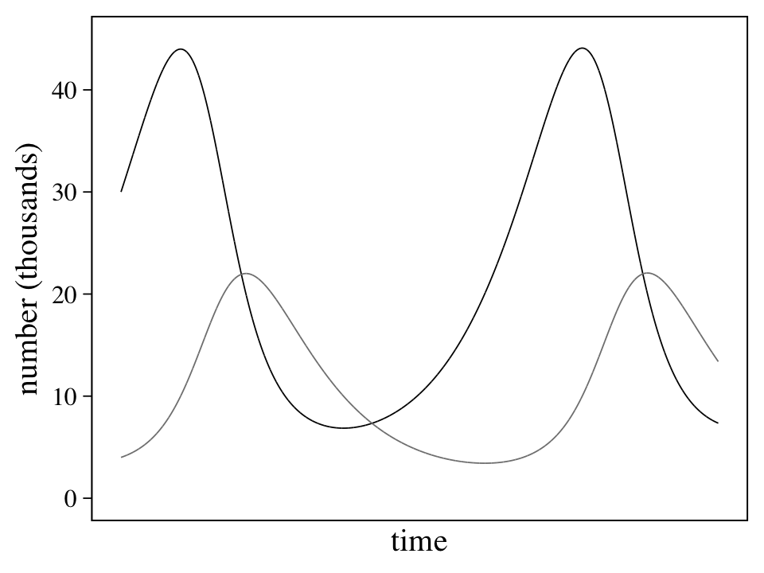

“This model produces cycles, similar to what we see in the data. The
model behaves this way, because lynx eat hares. Once the hares are
eaten, the lynx begin to die off. Then the cycle repeats (p. 545).”

### 16.4.2. The statistical model.

If we continue to let \(H_t\) and \(L_t\) be the number of hares and
lynx at time \(t\), we might also want to acknowledge the distinction
between those numbers and our observations by letting \(h_t\) and
\(l_t\) stand for the observed numbers of hares and lynx. These observed
numbers, recall, are from counts of pelts. We want a statistical model
that can connect \(h_t\) to \(H_t\) and connect \(l_t\) to \(L_t\). Part
of that model would include the probability a hare was trapped on a
given year, \(p_h\), and a similar probability for a lynx getting
trapped, \(p_l\). To make things worse, further imagine the number of
pelts for each, in a given year, was rounded to the nearest \(100\) and
divided by \(1{,}000\). Those are our values.

We practice simulating all this in Figure 16.8. Here we propose a
population of \(H_t = 10^4\) hares and an average trapping rate of about
\(10\%\), as expressed by \(p_t \sim \operatorname{Beta}(2, 18)\). As
described above, we then divide the number of observed pelts by
\(1{,}000\) and round the results, yielding \(h_t\).

``` r
n <- 1e4
Ht <- 1e4

set.seed(16)

# simulate
tibble(pt = rbeta(n, shape1 = 2, shape2 = 18)) %>% 
  mutate(ht = rbinom(n, size = Ht, prob = pt)) %>% 
  mutate(ht = round(ht / 1000, digits = 2)) %>% 
  
  # plot
  ggplot(aes(x = ht)) +
  geom_histogram(size = 1/4, binwidth = 0.1,
                 color = "white", fill = "grey67") +
  scale_y_continuous(NULL, breaks = NULL) +
  xlab(expression(thousand~of~pelts~(italic(h[t]))))
```

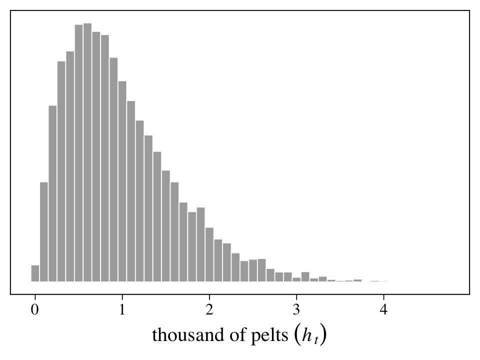

On page 546, McElreath encouraged us to try the simulation with
different values of \(H_t\) and \(p_t\). Here we’ll do so with a
\(3 \times 3\) grid of \(H_t = \{5{,}000, 10{,}000, 15{,}000\}\) and
\(p_t \sim \{ \operatorname{Beta}(2, 18), \operatorname{Beta}(10, 10), \operatorname{Beta}(18, 2) \}\).

``` r
set.seed(16)

# define the 3X3 grid
tibble(shape1 = c(2, 10, 18),
       shape2 = c(18, 10, 2)) %>% 
  expand(nesting(shape1, shape2),
         Ht = c(5e3, 1e4, 15e3)) %>% 
  # simulate
  mutate(pt = purrr::map2(shape1, shape2, ~rbeta(n, shape1 = .x, shape2 = .y))) %>% 
  mutate(ht = purrr::map2(Ht, pt, ~rbinom(n, size = .x, prob = .y))) %>% 
  unnest(c(pt, ht)) %>% 
  # wrangle
  mutate(ht    = round(ht / 1000, digits = 2),
         beta  = str_c("italic(p[t])%~%'Beta '(", shape1, ", ", shape2, ")"),
         Htlab = str_c("italic(H[t])==", Ht)) %>%
  mutate(beta  = factor(beta,
                        levels = c("italic(p[t])%~%'Beta '(2, 18)", "italic(p[t])%~%'Beta '(10, 10)", "italic(p[t])%~%'Beta '(18, 2)")),
         Htlab = factor(Htlab,
                        levels = c("italic(H[t])==15000", "italic(H[t])==10000", "italic(H[t])==5000"))) %>% 
  
  # plot!
  ggplot(aes(x = ht)) +
  geom_histogram(aes(fill = beta == "italic(p[t])%~%'Beta '(2, 18)" & Htlab == "italic(H[t])==10000"),
                 size = 1/10, binwidth = 0.25) +
  geom_vline(aes(xintercept = Ht / 1000), 
             size = 1/4, linetype = 2) +
  scale_fill_grey(start = .67, end = 0, breaks = NULL) +
  scale_y_continuous(NULL, breaks = NULL) +
  xlab(expression(thousand~of~pelts~(italic(h[t])))) +
  facet_grid(Htlab~beta, labeller = label_parsed, scales = "free_y")
```

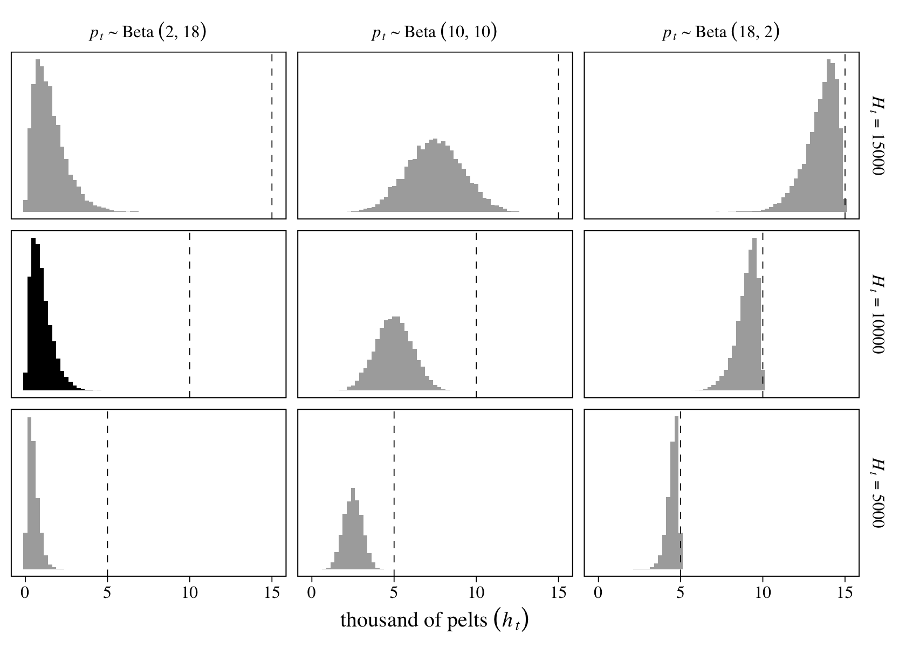

The vertical dashed lines mark off the maximum values in each panel. The
histogram in black is of the simulation parameters based on our version
of Figure 16.8, above.

McElreath’s proposed model is

\[
\begin{align*}
h_t & \sim \operatorname{Log-Normal} \big (\log(p_H H_t), \sigma_H \big) \\
l_t & \sim \operatorname{Log-Normal} \big (\log(p_L L_t), \sigma_L \big) \\
H_1 & \sim \operatorname{Log-Normal}(\log 10, 1) \\
L_1 & \sim \operatorname{Log-Normal}(\log 10, 1) \\
H_{T >1} & = H_1 + \int_1^T H_t (b_H - m_H L_t) \mathrm{d} t \\
L_{T >1} & = L_1 + \int_1^T L_t (b_L H_T - m_L) \mathrm{d} t \\
\sigma_H & \sim \operatorname{Exponential}(1) \\
\sigma_L & \sim \operatorname{Exponential}(1) \\
p_H & \sim \operatorname{Beta}(\alpha_H, \beta_H) \\
p_L & \sim \operatorname{Beta}(\alpha_L, \beta_L) \\
b_H & \sim \operatorname{Half-Normal}(1, 0.5) \\
b_L & \sim \operatorname{Half-Normal}(0.5, 0.5) \\
m_H & \sim \operatorname{Half-Normal}(0.5, 0.5) \\
m_L & \sim \operatorname{Half-Normal}(1, 0.5).
\end{align*}
\]

It’s not immediately clear from the text, but if you look closely at the
output from `cat(Lynx_Hare_model)` (see below), you’ll see
\(\alpha_H = \alpha_L = 40\) and \(\beta_H = \beta_L = 200\).

Happily, Stan has built-in functions for solving differential equations
(Stan Development Team,
[2020](#ref-standevelopmentteamStanReferenceManual2020), Chapter 13) and
using them is, in principle, possible with **brms**, For an example of
an ODE model with **brms**, see [Markus
Gesmann](https://twitter.com/MarkusGesmann)’s blog post, [*PK/PD
reserving
models*](https://magesblog.com/post/2018-01-30-pkpd-reserving-models/).
However, this model is beyond my current skill set. Instead of
attempting to fit the model with `brms::brm()`, we’ll follow McElreath’s
example and load his pre-written Stan code.

``` r
data(Lynx_Hare_model) 
cat(Lynx_Hare_model)
```

    ## functions {
    ##   real[] dpop_dt( real t,                 // time
    ##                 real[] pop_init,          // initial state {lynx, hares}
    ##                 real[] theta,             // parameters
    ##                 real[] x_r, int[] x_i) {  // unused
    ##     real L = pop_init[1];
    ##     real H = pop_init[2];
    ##     real bh = theta[1];
    ##     real mh = theta[2];
    ##     real ml = theta[3];
    ##     real bl = theta[4];
    ##     // differential equations
    ##     real dH_dt = (bh - mh * L) * H;
    ##     real dL_dt = (bl * H - ml) * L;
    ##     return { dL_dt , dH_dt };
    ##   }
    ## }
    ## data {
    ##   int<lower=0> N;              // number of measurement times
    ##   real<lower=0> pelts[N,2];    // measured populations
    ## }
    ## transformed data{
    ##   real times_measured[N-1];    // N-1 because first time is initial state
    ##   for ( i in 2:N ) times_measured[i-1] = i;
    ## }
    ## parameters {
    ##   real<lower=0> theta[4];      // { bh, mh, ml, bl }
    ##   real<lower=0> pop_init[2];   // initial population state
    ##   real<lower=0> sigma[2];      // measurement errors
    ##   real<lower=0,upper=1> p[2];  // trap rate
    ## }
    ## transformed parameters {
    ##   real pop[N, 2];
    ##   pop[1,1] = pop_init[1];
    ##   pop[1,2] = pop_init[2];
    ##   pop[2:N,1:2] = integrate_ode_rk45(
    ##     dpop_dt, pop_init, 0, times_measured, theta,
    ##     rep_array(0.0, 0), rep_array(0, 0),
    ##     1e-5, 1e-3, 5e2);
    ## }
    ## model {
    ##   // priors
    ##   theta[{1,3}] ~ normal( 1 , 0.5 );    // bh,ml
    ##   theta[{2,4}] ~ normal( 0.05, 0.05 ); // mh,bl
    ##   sigma ~ exponential( 1 );
    ##   pop_init ~ lognormal( log(10) , 1 );
    ##   p ~ beta(40,200);
    ##   // observation model
    ##   // connect latent population state to observed pelts
    ##   for ( t in 1:N )
    ##     for ( k in 1:2 )
    ##       pelts[t,k] ~ lognormal( log(pop[t,k]*p[k]) , sigma[k] );
    ## }
    ## generated quantities {
    ##   real pelts_pred[N,2];
    ##   for ( t in 1:N )
    ##     for ( k in 1:2 )
    ##       pelts_pred[t,k] = lognormal_rng( log(pop[t,k]*p[k]) , sigma[k] );
    ## }

Fit the model directly with `rstan::stan()`.

``` r
dat_list <- list(
  N     = nrow(Lynx_Hare), 
  pelts = Lynx_Hare[, 2:3])

m16.5 <- 
  stan(model_code = Lynx_Hare_model, 
       data = dat_list,
       chains = 3, cores = 3,
       seed = 16,
       control = list(adapt_delta = .95))
```

Check the model summary.

``` r
precis(m16.5, depth = 2)
```

    ##                     mean           sd         5.5%        94.5%    n_eff     Rhat4
    ## theta[1]    5.302960e-01 6.213675e-02 4.373223e-01 6.337997e-01 1423.953 1.0010038
    ## theta[2]    4.763520e-03 9.846471e-04 3.360071e-03 6.445385e-03 1512.500 1.0000350
    ## theta[3]    8.125347e-01 9.350351e-02 6.751197e-01 9.678926e-01 1366.636 1.0016958
    ## theta[4]    4.336111e-03 9.126261e-04 3.047285e-03 5.888605e-03 1343.215 1.0011623
    ## pop_init[1] 3.654094e+01 6.423735e+00 2.733513e+01 4.753749e+01 1866.678 0.9996136
    ## pop_init[2] 1.416329e+02 2.378115e+01 1.078512e+02 1.824840e+02 1452.160 1.0002786
    ## sigma[1]    2.630953e-01 4.485646e-02 2.009274e-01 3.446896e-01 2453.048 0.9999045
    ## sigma[2]    2.516346e-01 4.442872e-02 1.914259e-01 3.293270e-01 2258.857 0.9994789
    ## p[1]        1.753958e-01 2.455033e-02 1.386690e-01 2.149848e-01 1740.960 0.9993156
    ## p[2]        1.794219e-01 2.460429e-02 1.424884e-01 2.198799e-01 1545.822 1.0005882

For a more elaborate summary, execute `precis(m16.5, depth = 3)`. Here
we extract the posterior samples with `extract.samples()`. Since this
differs a bit from our typical **brms** workflow, we’ll want to inspect
the structure of its contents.

``` r
post <- extract.samples(m16.5) 

post %>% 
  glimpse()
```

    ## List of 7
    ##  $ theta     : num [1:3000, 1:4] 0.572 0.587 0.637 0.61 0.54 ...
    ##  $ pop_init  : num [1:3000, 1:2] 42.2 38 43.5 30.1 39 ...
    ##  $ sigma     : num [1:3000, 1:2] 0.262 0.237 0.421 0.287 0.292 ...
    ##  $ p         : num [1:3000, 1:2] 0.171 0.183 0.139 0.21 0.171 ...
    ##  $ pop       : num [1:3000, 1:21, 1:2] 42.2 38 43.5 30.1 39 ...
    ##  $ pelts_pred: num [1:3000, 1:21, 1:2] 8.34 9.96 3.63 9.88 10.57 ...
    ##  $ lp__      : num [1:3000(1d)] -200 -200 -207 -202 -199 ...

To make our version of the top portion of Figure 16.9, we’ll want to
draw from the contents of `post$pelts_pred`.

``` r
# for annotation
text <-
  tibble(name  = c("Hare", "Lynx"),
         label = c("Lepus", "Lynx"),
         year  = c(1914, 1916.5),
         value = c(92, 54))

# subset the relevant posterior draws
p1 <-
  rbind(post$pelts_pred[1:21, 1:21, 2],
        post$pelts_pred[1:21, 1:21, 1])%>% 
  # wrangle
  data.frame() %>% 
  set_names(1900:1920) %>% 
  mutate(iter = rep(1:21, times = 2),
         name = rep(c("Hare", "Lynx"), each = 21)) %>% 
  pivot_longer(-c(iter, name),
               names_to = "year") %>% 
  mutate(year = as.numeric(year)) %>% 
  
  # plot
  ggplot(aes(x = year, y = value)) +
  geom_line(aes(group = interaction(iter, name), color = name),
            size = 1/3, alpha = 1/2) +
  geom_point(data = Lynx_Hare %>% pivot_longer(Lynx:Hare),
             aes(x = Year, fill = name),
             size = 3, shape = 21, stroke = 1/4, color = "white") +
  geom_text(data = text,
            aes(label = label, color = name),
            hjust = 0, family = "Times") +
  scale_fill_grey(start = 0, end = .5, breaks = NULL) +
  scale_color_grey(start = 0, end = .5, breaks = NULL) +
  scale_x_continuous(NULL, breaks = NULL) +
  scale_y_continuous("thousands of pelts", breaks = 0:6 * 20) +
  coord_cartesian(ylim = c(0, 120))
```

The workflow for the bottom portion of Figure 16.9 will be very similar.
The main difference is this time we’re subsetting the posterior draws
from `post$pop`.

``` r
# subset the relevant posterior draws
p2 <-
  rbind(post$pop[1:21, 1:21, 2],
        post$pop[1:21, 1:21, 1])%>% 
  # wrangle
  data.frame() %>% 
  set_names(1900:1920) %>% 
  mutate(iter = rep(1:21, times = 2),
         name = rep(c("Hare", "Lynx"), each = 21)) %>% 
  pivot_longer(-c(iter, name),
               names_to = "year") %>% 
  mutate(year = as.numeric(year)) %>% 
  
  # plot
  ggplot(aes(x = year, y = value)) +
  geom_line(aes(group = interaction(iter, name), color = name),
            size = 1/3, alpha = 1/2) +
  scale_color_grey(start = 0, end = .5, breaks = NULL) +
  scale_y_continuous("thousands of animals", breaks = 0:5 * 100) +
  coord_cartesian(ylim = c(0, 500))

# combine and add a title
p1 / p2 + 
  plot_annotation(title = "Posterior predictions for the lynx-hare model")
```

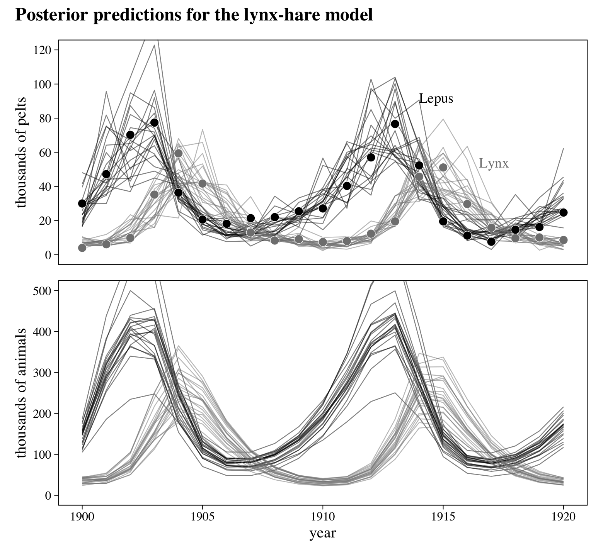

### 16.4.3. ~~Lynx lessons~~ Bonus: Practice with the autoregressive model.

Back in \[Section 16.4\]\[Population dynamics\], we briefly discussed
how autoregressive models are a typical way to explore processes like
those in lynx-hare data. In this bonus section, we’ll practice fitting a
few of these. To start off, we’ll restrict ourselves to focusing on just
one of the criteria, `Hare`. Our basic autoregressive model will follow
the form

\[
\begin{align*}
\text{Hare}_t & \sim \operatorname{Normal}(\mu_t, \sigma) \\
\mu_t & = \alpha + \beta_1 \text{Hare}_{t - 1} \\
\alpha  & \sim \; ? \\
\beta_1 & \sim \; ? \\
\sigma  & \sim \operatorname{Exponential}(1),
\end{align*}
\]

were \(\beta_1\) is the first-order autoregressive coefficient and the
question marks in the third and fourth lines indicate we’re not wedding
ourselves to specific priors, at the moment. Also, note the \(t\)
subscripts, which denote which time period the observation is drawn
from, which in these data is \(\text{Year} = 1900, 1901, \dots, 1920\).
Conceptually, \(t\) is *now* and \(t - 1\) the time point just before
now. So if we were particularly interested in
\(\operatorname E (\text{Hare}_{t = 1920})\), \(\text{Hare}_{t - 1}\)
would be the same as \(\text{Hare}_{t = 1919}\).

With **brms**, you can fit a model like this using the `ar()` function.
By default, `ar()` presumes the criterion variable (`Hare`, in this
case) is ordered chronologically. If you’re unsure or just want to be on
the safe side, you can enter your *time* variable in the `time`
argument. Also, though the `ar()` function presumes a first-order
autoregressive structure by default, it is capable of fitting models
with higher-order autoregressive structures. You can manually specify
this with the `p` argument. Here’s how to fit our simple AR(1) model
with explicit `ar()` syntax.

``` r
b16.6 <-
  brm(data = Lynx_Hare,
      family = gaussian,
      Hare ~ 1 + ar(time = Year, p = 1),
      prior(exponential(0.04669846), class = sigma),
      iter = 2000, warmup = 1000, chains = 4, cores = 4,
      seed = 16,
      file = "/Users/solomonkurz/Dropbox/Recoding Statistical Rethinking 2nd ed/fits/b16.06")
```

You may have noticed we just went with the default **brms** priors for
\(\alpha\) and \(\beta_1\). We got the value for the exponential prior
for \(\sigma\) by executing the following.

``` r
1 / sd(Lynx_Hare$Hare)
```

    ## [1] 0.04669846

Here’s the model summary.

``` r
print(b16.6)
```

    ##  Family: gaussian 
    ##   Links: mu = identity; sigma = identity 
    ## Formula: Hare ~ 1 + ar(time = Year, p = 1) 
    ##    Data: Lynx_Hare (Number of observations: 21) 
    ## Samples: 4 chains, each with iter = 2000; warmup = 1000; thin = 1;
    ##          total post-warmup samples = 4000
    ## 
    ## Correlation Structures:
    ##       Estimate Est.Error l-95% CI u-95% CI Rhat Bulk_ESS Tail_ESS
    ## ar[1]     0.74      0.17     0.38     1.05 1.00     2313     1813
    ## 
    ## Population-Level Effects: 
    ##           Estimate Est.Error l-95% CI u-95% CI Rhat Bulk_ESS Tail_ESS
    ## Intercept    30.22      9.68     9.34    48.88 1.00     2044     1739
    ## 
    ## Family Specific Parameters: 
    ##       Estimate Est.Error l-95% CI u-95% CI Rhat Bulk_ESS Tail_ESS
    ## sigma    16.42      2.87    12.00    23.19 1.00     2516     1985
    ## 
    ## Samples were drawn using sampling(NUTS). For each parameter, Bulk_ESS
    ## and Tail_ESS are effective sample size measures, and Rhat is the potential
    ## scale reduction factor on split chains (at convergence, Rhat = 1).

Our autoregressive \(\beta_1\) parameter is summarized in the
‘Correlation Structures,’ in which it’s called ‘ar\[1\].’ Another more
old-school way to fit a autoregressive model is by manually computing a
lagged version of your criterion variable. In **R**, you can do this
with the `lag()` function.

``` r
Lynx_Hare <-
  Lynx_Hare %>% 
  mutate(Hare_1 = lag(Hare))

head(Lynx_Hare)
```

    ##   Year Lynx Hare Hare_1
    ## 1 1900  4.0 30.0     NA
    ## 2 1901  6.1 47.2   30.0
    ## 3 1902  9.8 70.2   47.2
    ## 4 1903 35.2 77.4   70.2
    ## 5 1904 59.4 36.3   77.4
    ## 6 1905 41.7 20.6   36.3

Look closely at the relation between the values in the `Hare` and
`Hare_1` columns. They are set up such that
\(\text{Hare}_{\text{Year} = 1901} = \text{Hare_1}_{\text{Year} = 1900}\),
\(\text{Hare}_{\text{Year} = 1902} = \text{Hare_1}_{\text{Year} = 1901}\),
and so on. Unfortunately, this approach does produce a single missing
value in the first time point for the lagged variable, `Hare_1`. Here’s
how you might use such a variable to manually fit an autoregressive
model with `brms::brm()`.

``` r
b16.7 <-
  brm(data = Lynx_Hare,
      family = gaussian,
      Hare ~ 1 + Hare_1,
      prior = c(prior(normal(0, 1), class = b),
                prior(exponential(0.04669846), class = sigma)),
      iter = 2000, warmup = 1000, chains = 4, cores = 4,
      seed = 16,
      file = "/Users/solomonkurz/Dropbox/Recoding Statistical Rethinking 2nd ed/fits/b16.07")
```

``` r
print(b16.7)
```

    ##  Family: gaussian 
    ##   Links: mu = identity; sigma = identity 
    ## Formula: Hare ~ 1 + Hare_1 
    ##    Data: Lynx_Hare (Number of observations: 20) 
    ## Samples: 4 chains, each with iter = 2000; warmup = 1000; thin = 1;
    ##          total post-warmup samples = 4000
    ## 
    ## Population-Level Effects: 
    ##           Estimate Est.Error l-95% CI u-95% CI Rhat Bulk_ESS Tail_ESS
    ## Intercept    10.17      7.36    -4.65    24.86 1.00     3244     2561
    ## Hare_1        0.68      0.18     0.32     1.04 1.00     3123     2681
    ## 
    ## Family Specific Parameters: 
    ##       Estimate Est.Error l-95% CI u-95% CI Rhat Bulk_ESS Tail_ESS
    ## sigma    16.96      2.99    12.33    23.87 1.00     2777     2193
    ## 
    ## Samples were drawn using sampling(NUTS). For each parameter, Bulk_ESS
    ## and Tail_ESS are effective sample size measures, and Rhat is the potential
    ## scale reduction factor on split chains (at convergence, Rhat = 1).

Did you notice how the fourth line in the output read ‘Number of
observations: 20?’ That’s because we had that one missing value for
`Hare_1`. One quick and dirty hack might be to use the missing data
syntax we learned from \[Chapter 15\]\[Missing Data and Other
Opportunities\]. Here’s how that might look like.

``` r
b16.8 <-
  brm(data = Lynx_Hare,
      family = gaussian,
      bf(Hare ~ 1 + mi(Hare_1)) +
        bf(Hare_1 | mi() ~ 1) +
        set_rescor(FALSE),
      prior = c(prior(normal(0, 1), class = b),
                prior(exponential(0.04669846), class = sigma, resp = Hare),
                prior(exponential(0.04669846), class = sigma, resp = Hare1)),
      iter = 2000, warmup = 1000, chains = 4, cores = 4,
      seed = 16,
      file = "/Users/solomonkurz/Dropbox/Recoding Statistical Rethinking 2nd ed/fits/b16.08")
```

Check the model summary.

``` r
print(b16.8)
```

    ##  Family: MV(gaussian, gaussian) 
    ##   Links: mu = identity; sigma = identity
    ##          mu = identity; sigma = identity 
    ## Formula: Hare ~ 1 + mi(Hare_1) 
    ##          Hare_1 | mi() ~ 1 
    ##    Data: Lynx_Hare (Number of observations: 21) 
    ## Samples: 4 chains, each with iter = 2000; warmup = 1000; thin = 1;
    ##          total post-warmup samples = 4000
    ## 
    ## Population-Level Effects: 
    ##                 Estimate Est.Error l-95% CI u-95% CI Rhat Bulk_ESS Tail_ESS
    ## Hare_Intercept     11.90      7.06    -2.36    25.76 1.00     2430     2477
    ## Hare1_Intercept    34.44      5.12    24.39    44.43 1.00     3926     2758
    ## Hare_miHare_1       0.65      0.17     0.29     0.98 1.00     2317     2319
    ## 
    ## Family Specific Parameters: 
    ##             Estimate Est.Error l-95% CI u-95% CI Rhat Bulk_ESS Tail_ESS
    ## sigma_Hare     16.80      2.81    12.32    23.21 1.00     2660     2192
    ## sigma_Hare1    22.43      3.65    16.67    30.67 1.00     3394     2674
    ## 
    ## Samples were drawn using sampling(NUTS). For each parameter, Bulk_ESS
    ## and Tail_ESS are effective sample size measures, and Rhat is the potential
    ## scale reduction factor on split chains (at convergence, Rhat = 1).

Now we have a model based on all 21 observations, again. I’m still not
in love with this fix, because it presumes that value in `Hare_1` was
missing at random, with no accounting for the autoregressive structure.
This is why, when you can, it’s probably better to use the `ar()`
syntax.

Anyway, here’s how we might use `fitted()` to get a sense of
\(\operatorname{E}(\text{Hare}_t)\) from our first autoregressive model,
`b16.6`.

``` r
set.seed(16)

fitted(b16.6,
       summary = F,
       nsamples = 21) %>% 
  data.frame() %>% 
  set_names(1900:1920) %>% 
  mutate(iter = 1:n()) %>% 
  pivot_longer(-iter) %>% 
  mutate(Year = as.integer(name)) %>% 
  
  ggplot(aes(x = Year)) +
  geom_line(aes(y = value, group = iter),
            size = 1/3, alpha = 1/2) +
  geom_point(data = Lynx_Hare,
             aes(y = Hare),
             size = 3, shape = 21, stroke = 1/4, 
             fill = "black", color = "white") +
  annotate(geom = "text",
           x = 1913.5, y = 85,
           label = "Lepus", family = "Times") +
  scale_y_continuous("thousands of hare pelts", breaks = 0:6 * 20, limits = c(0, 120))
```

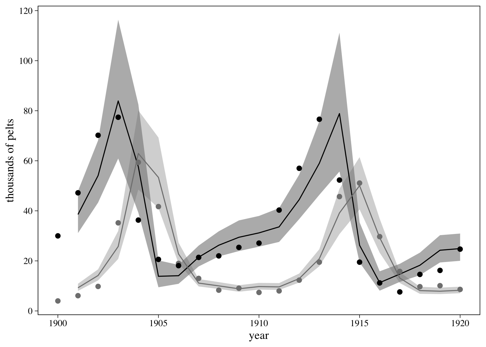

The model did a pretty good job capturing the non-linear trends in the
data. But notice how the fitted lines appear to be one step off from the
data. This is actually expected behavior for a simple AR(1) model. For
insights on why, check out [this
thread](https://stats.stackexchange.com/questions/404650/why-is-arima-in-r-one-time-step-off)
on Stack Exchange.

So far we’ve been fitting the autoregressive models with the Gaussian
likelihood, which is a typical approach. If you look at McElreath’s
practice problem 16H3, you’ll see he proposed a bivariate autoregressive
model using the Log-Normal likelihood. His approach used hand-made
lagged predictors and ignored the missing value problem by dropping the
first case. That model followed the form

\[
\begin{align*}
L_t & \sim \operatorname{Log-Normal}(\log \mu_{L, t}, \sigma_L) \\
H_t & \sim \operatorname{Log-Normal}(\log \mu_{H, t}, \sigma_H) \\
\mu_{L, t} & = \alpha_L + \beta_{L1} L_{t - 1} + \beta_{L2} H_{t - 1} \\
\mu_{H, t} & = \alpha_H + \beta_{H1} H_{t - 1} + \beta_{H2} L_{t - 1},
\end{align*}
\]

where \(\beta_{L1}\) and \(\beta_{H1}\) are the autoregressive
parameters and \(\beta_{L2}\) and \(\beta_{H2}\) are what are sometimes
called the cross-lag parameters. McElreath left the priors up to us. I
propose something like this:

\[
\begin{align*}
\alpha_L & \sim \operatorname{Normal}(\log 10, 1) \\
\alpha_H & \sim \operatorname{Normal}(\log 10, 1) \\
\beta_{L1}, \dots, \beta_{H2} & \sim \operatorname{Normal}(0, 0.5) \\
\sigma_L & \sim \operatorname{Exponential}(1) \\
\sigma_H & \sim \operatorname{Exponential}(1).
\end{align*}
\]

Before we fit the model, we’ll need to make a lagged version of `Lynx`.

``` r
Lynx_Hare <-
  Lynx_Hare %>% 
  mutate(Lynx_1 = lag(Lynx))
```

Because the predictor variables are not centered at zero, we’ll want to
use the `0 + Intercept...` syntax. Now fit the bivariate autoregressive
model.

``` r
b16.9 <-
  brm(data = Lynx_Hare,
      family = lognormal,
      bf(Hare ~ 0 + Intercept + Hare_1 + Lynx_1) +
        bf(Lynx ~ 0 + Intercept + Lynx_1 + Hare_1) +
        set_rescor(FALSE),
      prior = c(prior(normal(log(10), 1), class = b, resp = Hare, coef = Intercept),
                prior(normal(log(10), 1), class = b, resp = Lynx, coef = Intercept),
                prior(normal(0, 0.5), class = b, resp = Hare),
                prior(normal(0, 0.5), class = b, resp = Lynx),
                prior(exponential(1), class = sigma, resp = Hare),
                prior(exponential(1), class = sigma, resp = Lynx)),
      iter = 2000, warmup = 1000, chains = 4, cores = 4,
      seed = 16,
      file = "/Users/solomonkurz/Dropbox/Recoding Statistical Rethinking 2nd ed/fits/b16.09")
```

Check the summary.

``` r
print(b16.9)
```

    ##  Family: MV(lognormal, lognormal) 
    ##   Links: mu = identity; sigma = identity
    ##          mu = identity; sigma = identity 
    ## Formula: Hare ~ 0 + Intercept + Hare_1 + Lynx_1 
    ##          Lynx ~ 0 + Intercept + Lynx_1 + Hare_1 
    ##    Data: Lynx_Hare (Number of observations: 20) 
    ## Samples: 4 chains, each with iter = 2000; warmup = 1000; thin = 1;
    ##          total post-warmup samples = 4000
    ## 
    ## Population-Level Effects: 
    ##                Estimate Est.Error l-95% CI u-95% CI Rhat Bulk_ESS Tail_ESS
    ## Hare_Intercept     3.01      0.17     2.68     3.34 1.00     2253     2480
    ## Hare_Hare_1        0.02      0.00     0.02     0.03 1.00     3418     2454
    ## Hare_Lynx_1       -0.02      0.00    -0.03    -0.01 1.00     2884     2557
    ## Lynx_Intercept     1.44      0.12     1.21     1.69 1.00     2663     2450
    ## Lynx_Lynx_1        0.03      0.00     0.02     0.04 1.00     4299     2897
    ## Lynx_Hare_1        0.02      0.00     0.02     0.03 1.00     3921     2789
    ## 
    ## Family Specific Parameters: 
    ##            Estimate Est.Error l-95% CI u-95% CI Rhat Bulk_ESS Tail_ESS
    ## sigma_Hare     0.33      0.06     0.23     0.47 1.00     3030     3019
    ## sigma_Lynx     0.23      0.04     0.17     0.34 1.00     3151     2663
    ## 
    ## Samples were drawn using sampling(NUTS). For each parameter, Bulk_ESS
    ## and Tail_ESS are effective sample size measures, and Rhat is the potential
    ## scale reduction factor on split chains (at convergence, Rhat = 1).

Here we’ll use `fitted()` to make a variant of the posterior predictions
from the top portion of Figure 16.9.

``` r
rbind(fitted(b16.9, resp = "Hare"),
      fitted(b16.9, resp = "Lynx")) %>% 
  data.frame() %>% 
  mutate(name = rep(c("Hare", "Lynx"), each = n() / 2),
         year = rep(1901:1920, times = 2)) %>% 
  
  ggplot(aes(x = year)) +
  geom_ribbon(aes(ymin = Q2.5, ymax = Q97.5, group = name, fill = name),
              alpha = 1/3) +
  geom_line(aes(y = Estimate, group = name, color = name)) +
  geom_point(data = Lynx_Hare %>% pivot_longer(Lynx:Hare),
             aes(x = Year, y = value, color = name),
             size = 2) +
  scale_fill_grey(start = 0, end = .5, breaks = NULL) +
  scale_color_grey(start = 0, end = .5, breaks = NULL) +
  scale_x_continuous(limits = c(1900, 1920)) +
  scale_y_continuous("thousands of pelts", breaks = 0:6 * 20)
```

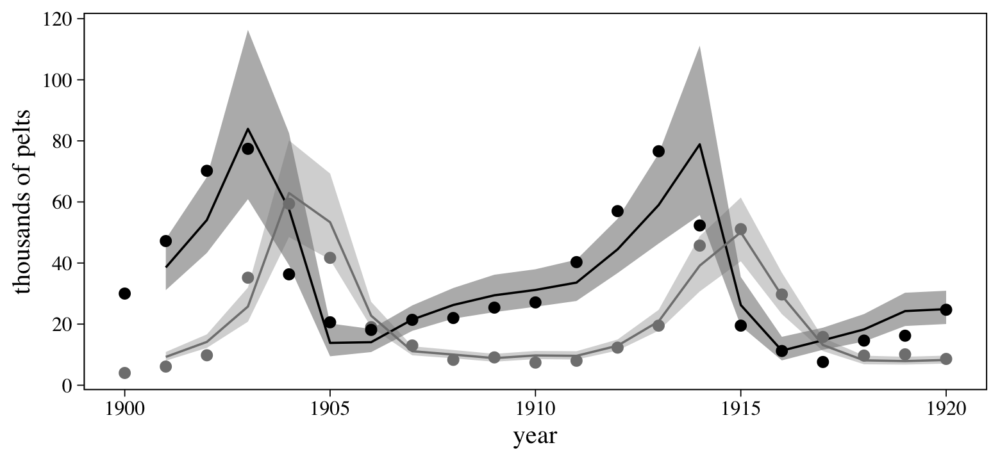

In the next practice problem (16H4), McElreath suggested we “adapt the
autoregressive model to use a *two-step* lag variable” (p. 551,
*emphasis* added). Using the verbiage from above, we might also refer to
that as second-order autoregressive model, AR(2). That would be a
straight generalization of the approach we just took. I’ll leave the
exercise to the interested reader.

The kinds autoregressive models we fit in this section are special cases
of what are called **autoregressive moving average** (ARMA) models.
Those are available in **brms** with help from the `arma()` function.
However, if you want to dive deep into models of this kind, you might
want to check out the [**varstan**
package](https://github.com/asael697/varstan) (Matamoros & Torres,
[2020](#ref-matamorosVarstanPackageBayesian2020)), which is designed to
fit a variety of Bayesian structured time series models.

## Session info

``` r
sessionInfo()
```

    ## R version 3.6.3 (2020-02-29)
    ## Platform: x86_64-apple-darwin15.6.0 (64-bit)
    ## Running under: macOS Catalina 10.15.3
    ## 
    ## Matrix products: default
    ## BLAS:   /Library/Frameworks/R.framework/Versions/3.6/Resources/lib/libRblas.0.dylib
    ## LAPACK: /Library/Frameworks/R.framework/Versions/3.6/Resources/lib/libRlapack.dylib
    ## 
    ## locale:
    ## [1] en_US.UTF-8/en_US.UTF-8/en_US.UTF-8/C/en_US.UTF-8/en_US.UTF-8
    ## 
    ## attached base packages:
    ## [1] parallel  stats     graphics  grDevices utils     datasets  methods   base     
    ## 
    ## other attached packages:
    ##  [1] patchwork_1.0.1.9000 rethinking_2.01      dagitty_0.2-2        rstan_2.21.2         StanHeaders_2.21.0-6
    ##  [6] GGally_2.0.0         brms_2.14.4          Rcpp_1.0.5           tidybayes_2.1.1      ggthemes_4.2.0      
    ## [11] forcats_0.5.0        stringr_1.4.0        dplyr_1.0.2          purrr_0.3.4          readr_1.3.1         
    ## [16] tidyr_1.1.1          tibble_3.0.4         ggplot2_3.3.2        tidyverse_1.3.0     
    ## 
    ## loaded via a namespace (and not attached):
    ##   [1] readxl_1.3.1         backports_1.2.0      plyr_1.8.6           igraph_1.2.5         splines_3.6.3       
    ##   [6] svUnit_1.0.3         crosstalk_1.1.0.1    TH.data_1.0-10       rstantools_2.1.1     inline_0.3.16       
    ##  [11] digest_0.6.27        htmltools_0.5.0      rsconnect_0.8.16     fansi_0.4.1          magrittr_1.5        
    ##  [16] modelr_0.1.6         RcppParallel_5.0.2   matrixStats_0.57.0   xts_0.12.1           sandwich_2.5-1      
    ##  [21] prettyunits_1.1.1    colorspace_1.4-1     rvest_0.3.5          ggdist_2.1.1         haven_2.2.0         
    ##  [26] xfun_0.19            callr_3.5.1          crayon_1.3.4         jsonlite_1.7.1       lme4_1.1-23         
    ##  [31] survival_3.1-12      zoo_1.8-8            glue_1.4.2           gtable_0.3.0         emmeans_1.4.5       
    ##  [36] V8_3.4.0             pkgbuild_1.1.0       shape_1.4.4          abind_1.4-5          scales_1.1.1        
    ##  [41] mvtnorm_1.1-1        DBI_1.1.0            miniUI_0.1.1.1       xtable_1.8-4         stats4_3.6.3        
    ##  [46] DT_0.13              htmlwidgets_1.5.1    httr_1.4.1           threejs_0.3.3        RColorBrewer_1.1-2  
    ##  [51] arrayhelpers_1.1-0   ellipsis_0.3.1       reshape_0.8.8        pkgconfig_2.0.3      loo_2.3.1           
    ##  [56] farver_2.0.3         dbplyr_1.4.2         utf8_1.1.4           tidyselect_1.1.0     labeling_0.4.2      
    ##  [61] rlang_0.4.8          reshape2_1.4.4       later_1.1.0.1        munsell_0.5.0        cellranger_1.1.0    
    ##  [66] tools_3.6.3          cli_2.1.0            generics_0.1.0       broom_0.5.5          ggridges_0.5.2      
    ##  [71] evaluate_0.14        fastmap_1.0.1        yaml_2.2.1           processx_3.4.4       knitr_1.30          
    ##  [76] fs_1.4.1             nlme_3.1-144         mime_0.9             projpred_2.0.2       xml2_1.3.1          
    ##  [81] compiler_3.6.3       bayesplot_1.7.2      shinythemes_1.1.2    rstudioapi_0.11      gamm4_0.2-6         
    ##  [86] curl_4.3             reprex_0.3.0         statmod_1.4.34       stringi_1.5.3        ps_1.4.0            
    ##  [91] Brobdingnag_1.2-6    lattice_0.20-38      Matrix_1.2-18        nloptr_1.2.2.1       markdown_1.1        
    ##  [96] shinyjs_1.1          vctrs_0.3.4          pillar_1.4.6         lifecycle_0.2.0      bridgesampling_1.0-0
    ## [101] estimability_1.3     httpuv_1.5.4         R6_2.5.0             promises_1.1.1       gridExtra_2.3       
    ## [106] codetools_0.2-16     boot_1.3-24          colourpicker_1.0     MASS_7.3-51.5        gtools_3.8.2        
    ## [111] assertthat_0.2.1     withr_2.3.0          shinystan_2.5.0      multcomp_1.4-13      mgcv_1.8-31         
    ## [116] hms_0.5.3            grid_3.6.3           coda_0.19-4          minqa_1.2.4          rmarkdown_2.5       
    ## [121] shiny_1.5.0          lubridate_1.7.8      base64enc_0.1-3      dygraphs_1.1.1.6

<div id="refs" class="references">

<div id="ref-boeschLearningCurvesTeaching2019">

Boesch, C., Bombjaková, D., Meier, A., & Mundry, R. (2019). Learning
curves and teaching when acquiring nut-cracking in humans and
chimpanzees. *Scientific Reports*, *9*(1), 1515.
<https://doi.org/10.1038/s41598-018-38392-8>

</div>

<div id="ref-Bürkner2020Define">

Bürkner, P.-C. (2020). *Define custom response distributions with brms*.
<https://CRAN.R-project.org/package=brms/vignettes/brms_customfamilies.html>

</div>

<div id="ref-gelman2013bayesian">

Gelman, A., Carlin, J. B., Stern, H. S., Dunson, D. B., Vehtari, A., &
Rubin, D. B. (2013). *Bayesian data analysis* (Third Edition). CRC
press. <https://stat.columbia.edu/~gelman/book/>

</div>

<div id="ref-hewittTheConservation1921">

Hewitt, C. G. (1921). *The conservation of the wild life of Canada*.
Charles Scribner’s Sons.

</div>

<div id="ref-lotkaPrinciplesOfPhysicalBiology1925">

Lotka, A. J. (1925). *Principles of physical biology*. Waverly.

</div>

<div id="ref-matamorosVarstanPackageBayesian2020">

Matamoros, I. A. A., & Torres, C. A. C. (2020). varstan: An R package
for Bayesian analysis of structured time series models with Stan.
*arXiv:2005.10361 \[Stat\]*. <http://arxiv.org/abs/2005.10361>

</div>

<div id="ref-mcelreathStatisticalRethinkingBayesian2020">

McElreath, R. (2020). *Statistical rethinking: A Bayesian course with
examples in R and Stan* (Second Edition). CRC Press.
<https://xcelab.net/rm/statistical-rethinking/>

</div>

<div id="ref-standevelopmentteamStanReferenceManual2020">

Stan Development Team. (2020). *Stan reference manual, Version 2.25*.
<https://mc-stan.org/docs/2_25/reference-manual/>

</div>

<div id="ref-vanleeuwenDevelopmentHumanSocial2018">

van Leeuwen, E. J. C., Cohen, E., Collier-Baker, E., Rapold, C. J.,
Schäfer, M., Schütte, S., & Haun, D. B. M. (2018). The development of
human social learning across seven societies. *Nature Communications*,
*9*(1), 2076. <https://doi.org/10.1038/s41467-018-04468-2>

</div>

<div id="ref-volterraFluctuationsAbundanceSpecies1926">

Volterra, V. (1926). Fluctuations in the abundance of a species
considered mathematically. *Nature*, *118*(2972), 558–560.
<https://doi.org/10.1038/118558a0>

</div>

<div id="ref-vonbertalanffyUntersuchungenUeberGesetzlichkeit1934">

von Bertalanffy, L. (1934). Untersuchungen Über die Gesetzlichkeit des
Wachstums. *Wilhelm Roux’ Archiv Für Entwicklungsmechanik Der
Organismen*, *131*(4), 613–652. <https://doi.org/10.1007/BF00650112>

</div>

</div>
