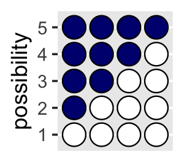
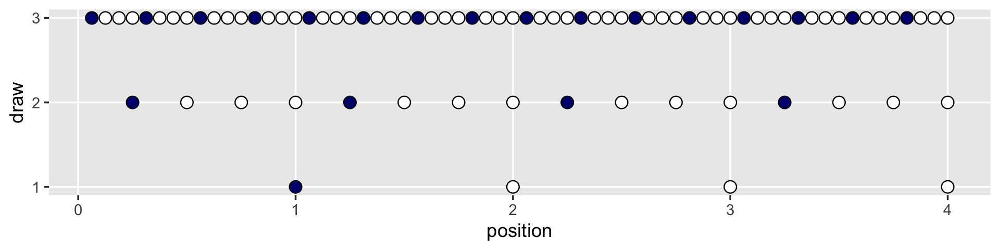
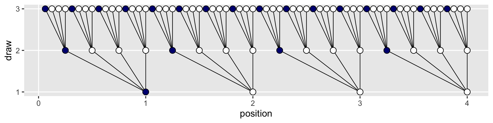
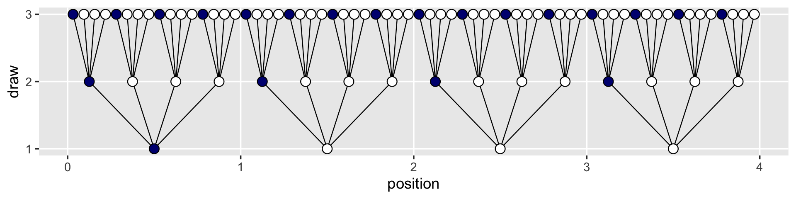
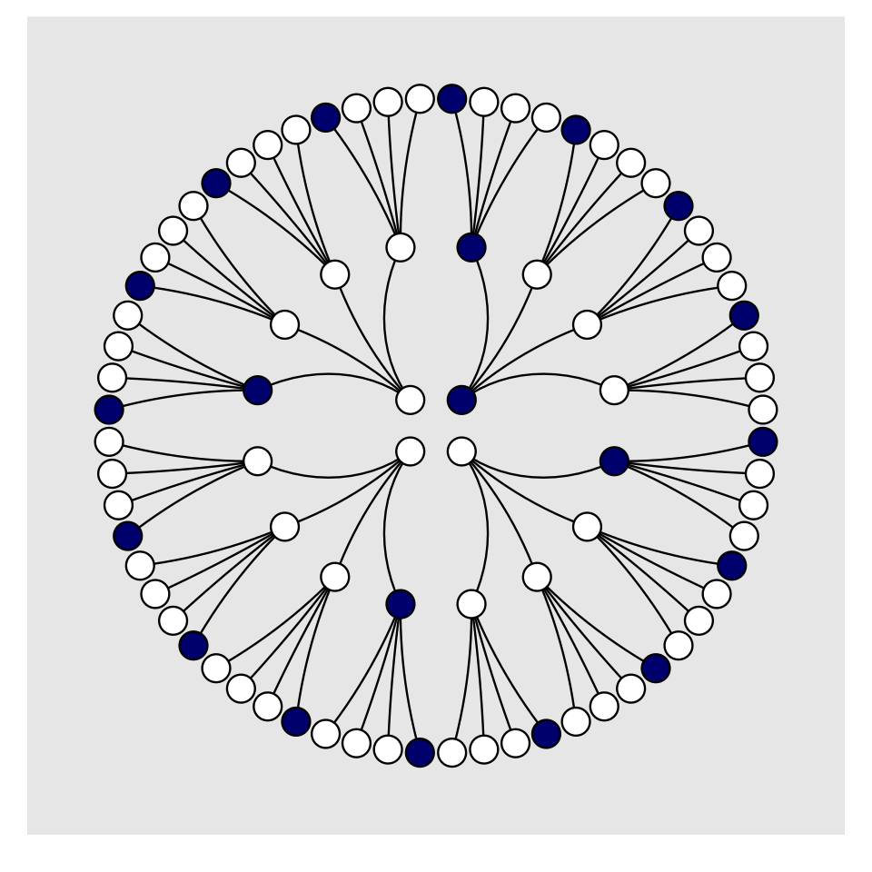
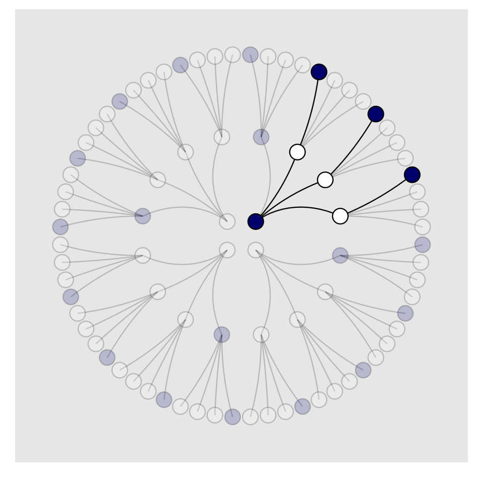

Chapter 02. Small Worlds and Large Worlds
================
A Solomon Kurz
2021-03-12

&lt;Note, flextable tables will not render with github\_document. They
should be fine for the final book.&gt;

# Small Worlds and Large Worlds

## The garden of forking data

### Counting possibilities.

Throughout this project, we’ll make extensive use packages from the
[**tidyverse**](https://www.tidyverse.org) for data wrangling and
plotting.

``` r
library(tidyverse)
```

If you are new to **tidyverse**-style syntax, possibly the oddest
component is the pipe (i.e., `%>%`). I’m not going to explain the `%>%`
in this project, but you might learn more about in [this brief
clip](https://www.youtube.com/watch?v=9yjhxvu-pDg), starting around
[minute 21:25 in this talk by
Wickham](https://www.youtube.com/watch?v=K-ss_ag2k9E&t=1285s), or in
[Section
5.6.1](https://r4ds.had.co.nz/transform.html#combining-multiple-operations-with-the-pipe)
from Grolemund and Wickham’s ([2017](#ref-grolemundDataScience2017)) *R
for data science*. Really, all of Chapter 5 of *R4DS* is just great for
new **R** and new **tidyverse** users. And *R4DS* Chapter 3 is a nice
introduction to plotting with **ggplot2** ([Wickham,
2016](#ref-wickhamGgplot2ElegantGraphics2016); [Wickham et al.,
2020](#ref-R-ggplot2)).

Other than the pipe, the other big thing to be aware of is
[tibbles](https://tibble.tidyverse.org) ([Müller & Wickham,
2020](#ref-R-tibble)). For our purposes, think of a tibble as a data
object with two dimensions defined by rows and columns. Importantly,
tibbles are just special types of [data
frames](https://bookdown.org/rdpeng/rprogdatascience/r-nuts-and-bolts.html#data-framesbookdown::preview_chapter(%2206.Rmd%22)).
So, whenever we talk about data frames, we’re usually talking about
tibbles. For more on the topic, check out [*R4SD*, Chapter
10](https://r4ds.had.co.nz/tibbles.html).

If we’re willing to code the marbles as 0 = “white” 1 = “blue,” we can
arrange the possibility data in a tibble as follows.

``` r
d <-
  tibble(p1 = 0,
         p2 = rep(1:0, times = c(1, 3)),
         p3 = rep(1:0, times = c(2, 2)),
         p4 = rep(1:0, times = c(3, 1)),
         p5 = 1)

head(d)
```

    ## # A tibble: 4 x 5
    ##      p1    p2    p3    p4    p5
    ##   <dbl> <int> <int> <int> <dbl>
    ## 1     0     1     1     1     1
    ## 2     0     0     1     1     1
    ## 3     0     0     0     1     1
    ## 4     0     0     0     0     1

You might depict the possibility data in a plot.

``` r
d %>% 
  set_names(1:5) %>% 
  mutate(x = 1:4) %>% 
  pivot_longer(-x, names_to = "possibility") %>% 
  mutate(value = value %>% as.character()) %>% 
  
  ggplot(aes(x = x, y = possibility, fill = value)) +
  geom_point(shape = 21, size = 5) +
  scale_fill_manual(values = c("white", "navy")) +
  scale_x_discrete(NULL, breaks = NULL) +
  theme(legend.position = "none")
```



As a quick aside, check out Suzan Baert’s blog post [*Data wrangling
part 2: Transforming your columns into the right
shape*](https://suzan.rbind.io/2018/02/dplyr-tutorial-2/) for an
extensive discussion on `dplyr::mutate()` and `tidyr::gather()`. The
`tidyr::pivot_longer()` function is an updated variant of `gather()`,
which we’ll be making extensive use of throughout this project. If
you’re new to reshaping data with pivoting, check out the vignettes
[here](https://tidyr.tidyverse.org/reference/pivot_longer.html) and
[here](https://tidyr.tidyverse.org/articles/pivot.html) ([*Pivot Data
from Wide to Long Pivot\_longer*, 2020](#ref-PivotDataWide2020);
[*Pivoting*, 2020](#ref-Pivoting2020)).

Here’s the basic structure of the possibilities per marble draw.

``` r
library(flextable)

tibble(draw    = 1:3,
       marbles = 4) %>% 
  mutate(possibilities = marbles ^ draw) %>% 
  flextable()
```

Note our use of the **flextable** package ([Gohel,
2021a](#ref-R-flextable), [2021b](#ref-gohelUsingFlextable2021)) to
format the output into a nice table. We’ll get more practice with this
throughout this chapter.

If you walk that out a little, you can structure the data required to
approach Figure 2.2.

``` r
(
  d <-
  tibble(position = c((1:4^1) / 4^0, 
                      (1:4^2) / 4^1, 
                      (1:4^3) / 4^2),
         draw     = rep(1:3, times = c(4^1, 4^2, 4^3)),
         fill     = rep(c("b", "w"), times = c(1, 3)) %>% 
           rep(., times = c(4^0 + 4^1 + 4^2)))
)
```

    ## # A tibble: 84 x 3
    ##    position  draw fill 
    ##       <dbl> <int> <chr>
    ##  1     1        1 b    
    ##  2     2        1 w    
    ##  3     3        1 w    
    ##  4     4        1 w    
    ##  5     0.25     2 b    
    ##  6     0.5      2 w    
    ##  7     0.75     2 w    
    ##  8     1        2 w    
    ##  9     1.25     2 b    
    ## 10     1.5      2 w    
    ## # … with 74 more rows

See what I did there with the parentheses? If you assign a value to an
object in **R** (e.g., `dog <- 1`) and just hit return, nothing will
immediately pop up in the
[console](http://r4ds.had.co.nz/introduction.html#rstudio). You have to
actually execute `dog` before **R** will return `1`. But if you wrap the
code within parentheses (e.g., `(dog <- 1)`), **R** will perform the
assignment and return the value as if you had executed `dog`.

But we digress. Here’s the initial plot.

``` r
d %>% 
  ggplot(aes(x = position, y = draw, fill = fill)) +
  geom_point(shape = 21, size = 3) +
  scale_fill_manual(values  = c("navy", "white")) +
  scale_y_continuous(breaks = 1:3) +
  theme(legend.position = "none",
        panel.grid.minor = element_blank())
```



To my mind, the easiest way to connect the dots in the appropriate way
is to make two auxiliary tibbles.

``` r
# these will connect the dots from the first and second draws
(
  lines_1 <-
  tibble(x    = rep((1:4), each = 4),
         xend = ((1:4^2) / 4),
         y    = 1,
         yend = 2)
  )
```

    ## # A tibble: 16 x 4
    ##        x  xend     y  yend
    ##    <int> <dbl> <dbl> <dbl>
    ##  1     1  0.25     1     2
    ##  2     1  0.5      1     2
    ##  3     1  0.75     1     2
    ##  4     1  1        1     2
    ##  5     2  1.25     1     2
    ##  6     2  1.5      1     2
    ##  7     2  1.75     1     2
    ##  8     2  2        1     2
    ##  9     3  2.25     1     2
    ## 10     3  2.5      1     2
    ## 11     3  2.75     1     2
    ## 12     3  3        1     2
    ## 13     4  3.25     1     2
    ## 14     4  3.5      1     2
    ## 15     4  3.75     1     2
    ## 16     4  4        1     2

``` r
# these will connect the dots from the second and third draws
(
  lines_2 <-
  tibble(x    = rep(((1:4^2) / 4), each = 4),
         xend = (1:4^3) / (4^2),
         y    = 2,
         yend = 3)
  )
```

    ## # A tibble: 64 x 4
    ##        x   xend     y  yend
    ##    <dbl>  <dbl> <dbl> <dbl>
    ##  1  0.25 0.0625     2     3
    ##  2  0.25 0.125      2     3
    ##  3  0.25 0.188      2     3
    ##  4  0.25 0.25       2     3
    ##  5  0.5  0.312      2     3
    ##  6  0.5  0.375      2     3
    ##  7  0.5  0.438      2     3
    ##  8  0.5  0.5        2     3
    ##  9  0.75 0.562      2     3
    ## 10  0.75 0.625      2     3
    ## # … with 54 more rows

We can use the `lines_1` and `lines_2` data in the plot with two
`geom_segment()` functions.

``` r
d %>% 
  ggplot(aes(x = position, y = draw)) +
  geom_segment(data = lines_1,
               aes(x = x, xend = xend,
                   y = y, yend = yend),
               size  = 1/3) +
  geom_segment(data = lines_2,
               aes(x = x, xend = xend,
                   y = y, yend = yend),
               size  = 1/3) +
  geom_point(aes(fill = fill),
             shape = 21, size = 3) +
  scale_fill_manual(values  = c("navy", "white")) +
  scale_y_continuous(breaks = 1:3) +
  theme(legend.position  = "none",
        panel.grid.minor = element_blank())
```



We’ve generated the values for `position` (i.e., the *x*-axis), in such
a way that they’re all justified to the right, so to speak. But we’d
like to center them. For `draw == 1`, we’ll need to subtract 0.5 from
each. For `draw == 2`, we need to reduce the scale by a factor of 4 and
we’ll then need to reduce the scale by another factor of 4 for
`draw == 3`. The `ifelse()` function will be of use for that.

``` r
d <-
  d %>% 
  mutate(denominator = ifelse(draw == 1, .5,
                              ifelse(draw == 2, .5 / 4,
                                     .5 / 4^2))) %>% 
  mutate(position = position - denominator)

d
```

    ## # A tibble: 84 x 4
    ##    position  draw fill  denominator
    ##       <dbl> <int> <chr>       <dbl>
    ##  1    0.5       1 b           0.5  
    ##  2    1.5       1 w           0.5  
    ##  3    2.5       1 w           0.5  
    ##  4    3.5       1 w           0.5  
    ##  5    0.125     2 b           0.125
    ##  6    0.375     2 w           0.125
    ##  7    0.625     2 w           0.125
    ##  8    0.875     2 w           0.125
    ##  9    1.12      2 b           0.125
    ## 10    1.38      2 w           0.125
    ## # … with 74 more rows

We’ll follow the same logic for the `lines_1` and `lines_2` data.

``` r
(
  lines_1 <-
  lines_1 %>% 
  mutate(x    = x - 0.5,
         xend = xend - 0.5 / 4^1)
)
```

    ## # A tibble: 16 x 4
    ##        x  xend     y  yend
    ##    <dbl> <dbl> <dbl> <dbl>
    ##  1   0.5 0.125     1     2
    ##  2   0.5 0.375     1     2
    ##  3   0.5 0.625     1     2
    ##  4   0.5 0.875     1     2
    ##  5   1.5 1.12      1     2
    ##  6   1.5 1.38      1     2
    ##  7   1.5 1.62      1     2
    ##  8   1.5 1.88      1     2
    ##  9   2.5 2.12      1     2
    ## 10   2.5 2.38      1     2
    ## 11   2.5 2.62      1     2
    ## 12   2.5 2.88      1     2
    ## 13   3.5 3.12      1     2
    ## 14   3.5 3.38      1     2
    ## 15   3.5 3.62      1     2
    ## 16   3.5 3.88      1     2

``` r
(
  lines_2 <-
  lines_2 %>% 
  mutate(x    = x - 0.5 / 4^1,
         xend = xend - 0.5 / 4^2)
)
```

    ## # A tibble: 64 x 4
    ##        x   xend     y  yend
    ##    <dbl>  <dbl> <dbl> <dbl>
    ##  1 0.125 0.0312     2     3
    ##  2 0.125 0.0938     2     3
    ##  3 0.125 0.156      2     3
    ##  4 0.125 0.219      2     3
    ##  5 0.375 0.281      2     3
    ##  6 0.375 0.344      2     3
    ##  7 0.375 0.406      2     3
    ##  8 0.375 0.469      2     3
    ##  9 0.625 0.531      2     3
    ## 10 0.625 0.594      2     3
    ## # … with 54 more rows

Now the plot’s looking closer.

``` r
d %>% 
  ggplot(aes(x = position, y = draw)) +
  geom_segment(data = lines_1,
               aes(x = x, xend = xend,
                   y = y, yend = yend),
               size  = 1/3) +
  geom_segment(data = lines_2,
               aes(x = x, xend = xend,
                   y = y, yend = yend),
               size  = 1/3) +
  geom_point(aes(fill = fill),
             shape = 21, size = 3) +
  scale_fill_manual(values  = c("navy", "white")) +
  scale_y_continuous(breaks = 1:3) +
  theme(legend.position  = "none",
        panel.grid.minor = element_blank())
```



For the final step, we’ll use `coord_polar()` to change the [coordinate
system](http://sape.inf.usi.ch/quick-reference/ggplot2/coord), giving
the plot a mandala-like feel.

``` r
d %>% 
  ggplot(aes(x = position, y = draw)) +
  geom_segment(data = lines_1,
               aes(x = x, xend = xend,
                   y = y, yend = yend),
               size = 1/3) +
  geom_segment(data = lines_2,
               aes(x = x, xend = xend,
                   y = y, yend = yend),
               size = 1/3) +
  geom_point(aes(fill = fill),
             shape = 21, size = 4) +
  scale_fill_manual(values = c("navy", "white")) +
  scale_x_continuous(NULL, limits = c(0, 4), breaks = NULL) +
  scale_y_continuous(NULL, limits = c(0.75, 3), breaks = NULL) +
  coord_polar() +
  theme(legend.position = "none",
        panel.grid = element_blank())
```



To make our version of Figure 2.3, we’ll have to add an index to tell us
which paths remain logically valid after each choice. We’ll call the
index `remain`.

``` r
lines_1 <-
  lines_1 %>% 
  mutate(remain = c(rep(0:1, times = c(1, 3)),
                    rep(0,   times = 4 * 3)))
lines_2 <-
  lines_2 %>% 
  mutate(remain = c(rep(0,   times = 4),
                    rep(1:0, times = c(1, 3)) %>% rep(., times = 3),
                    rep(0,   times = 12 * 4)))
d <-
  d %>% 
  mutate(remain = c(rep(1:0, times = c(1, 3)),
                    rep(0:1, times = c(1, 3)),
                    rep(0,   times = 4 * 4),
                    rep(1:0, times = c(1, 3)) %>% rep(., times = 3),
                    rep(0,   times = 12 * 4))) 
# finally, the plot:
d %>% 
  ggplot(aes(x = position, y = draw)) +
  geom_segment(data = lines_1,
               aes(x = x, xend = xend,
                   y = y, yend = yend,
                   alpha = remain %>% as.character()),
               size = 1/3) +
  geom_segment(data = lines_2,
               aes(x = x, xend = xend,
                   y = y, yend = yend,
                   alpha = remain %>% as.character()),
               size = 1/3) +
  geom_point(aes(fill = fill, alpha = remain %>% as.character()),
             shape = 21, size = 4) +
  # it's the alpha parameter that makes elements semitransparent
  scale_fill_manual(values = c("navy", "white")) +
  scale_alpha_manual(values = c(1/5, 1)) +
  scale_x_continuous(NULL, limits = c(0, 4), breaks = NULL) +
  scale_y_continuous(NULL, limits = c(0.75, 3), breaks = NULL) +
  coord_polar() +
  theme(legend.position = "none",
        panel.grid = element_blank())
```



Letting “w” = a white dot and “b” = a blue dot, we might recreate the
table in the middle of page 23 like so.

``` r
# if we make two custom functions, here, 
# it will simplify the `mutate()` code, below
n_blue  <- function(x) rowSums(x == "b")
n_white <- function(x) rowSums(x == "w")

# make the data
t <-
  tibble(d1 = rep(c("w", "b"), times = c(1, 4)),
         d2 = rep(c("w", "b"), times = c(2, 3)),
         d3 = rep(c("w", "b"), times = c(3, 2)),
         d4 = rep(c("w", "b"), times = c(4, 1))) %>% 
  mutate(blue1 = n_blue(.),
         white = n_white(.),
         blue2 = n_blue(.)) %>% 
  mutate(product = blue1 * white * blue2)

# format the table
t %>%
  transmute(conjecture = str_c("[", d1, " ", d2, " ", d3, " ", d4, "]"),
            `Ways to produce [w b w]` = str_c(blue1, " * ", white, " * ", blue2, " = ", product)) %>% 
  flextable() %>% 
  width(j = 1:2, width = c(1, 2)) %>% 
  align(align = "center", part = "all")
```

    ## PhantomJS not found. You can install it with webshot::install_phantomjs(). If it is installed, please make sure the phantomjs executable can be found via the PATH variable.

We’ll need new data for Figure 2.4. Here’s the initial primary data,
`d`.

``` r
d <-
  tibble(position = c((1:4^1) / 4^0, 
                      (1:4^2) / 4^1, 
                      (1:4^3) / 4^2),
         draw     = rep(1:3, times = c(4^1, 4^2, 4^3)))

(
  d <-
  d %>% 
  bind_rows(
    d, d
  ) %>% 
  # here are the fill colors
  mutate(fill = c(rep(c("w", "b"), times = c(1, 3)) %>% rep(., times = c(4^0 + 4^1 + 4^2)),
                  rep(c("w", "b"), each  = 2)       %>% rep(., times = c(4^0 + 4^1 + 4^2)),
                  rep(c("w", "b"), times = c(3, 1)) %>% rep(., times = c(4^0 + 4^1 + 4^2)))) %>% 
  # now we need to shift the positions over in accordance with draw, like before
  mutate(denominator = ifelse(draw == 1, .5,
                              ifelse(draw == 2, .5 / 4,
                                     .5 / 4^2))) %>% 
  mutate(position = position - denominator) %>% 
  # here we'll add an index for which pie wedge we're working with
  mutate(pie_index = rep(letters[1:3], each = n()/3)) %>% 
  # to get the position axis correct for pie_index == "b" or "c", we'll need to offset
  mutate(position = ifelse(pie_index == "a", position,
                           ifelse(pie_index == "b", position + 4,
                                  position + 4 * 2)))
)
```

    ## # A tibble: 252 x 5
    ##    position  draw fill  denominator pie_index
    ##       <dbl> <int> <chr>       <dbl> <chr>    
    ##  1    0.5       1 w           0.5   a        
    ##  2    1.5       1 b           0.5   a        
    ##  3    2.5       1 b           0.5   a        
    ##  4    3.5       1 b           0.5   a        
    ##  5    0.125     2 w           0.125 a        
    ##  6    0.375     2 b           0.125 a        
    ##  7    0.625     2 b           0.125 a        
    ##  8    0.875     2 b           0.125 a        
    ##  9    1.12      2 w           0.125 a        
    ## 10    1.38      2 b           0.125 a        
    ## # … with 242 more rows

Both `lines_1` and `lines_2` require adjustments for `x` and `xend`. Our
current approach is a nested `ifelse()`. Rather than copy and paste that
multi-line `ifelse()` code for all four, let’s wrap it in a compact
function, which we’ll call `move_over()`.

``` r
move_over <- function(position, index) {
  ifelse(
    index == "a", position,
    ifelse(
      index == "b", position + 4, position + 4 * 2
    )
  )
}
```

If you’re new to making your own **R** functions, check out [Chapter
19](http://r4ds.had.co.nz/functions.html) of *R4DS* or [Chapter
14](https://bookdown.org/rdpeng/rprogdatascience/functions.html) of *R
programming for data science* ([Peng,
2019](#ref-pengProgrammingDataScience2019)).

Anyway, now we’ll make our new `lines_1` and `lines_2` data, for which
we’ll use `move_over()` to adjust their `x` and `xend` positions to the
correct spots.

``` r
(
  lines_1 <-
  tibble(x    = rep((1:4), each = 4) %>% rep(., times = 3),
         xend = ((1:4^2) / 4)        %>% rep(., times = 3),
         y    = 1,
         yend = 2) %>% 
  mutate(x    = x - .5,
         xend = xend - .5 / 4^1) %>% 
  # here we'll add an index for which pie wedge we're working with
  mutate(pie_index = rep(letters[1:3], each = n()/3)) %>% 
  # to get the position axis correct for `pie_index == "b"` or `"c"`, we'll need to offset
  mutate(x    = move_over(position = x,    index = pie_index),
         xend = move_over(position = xend, index = pie_index))
)
```

    ## # A tibble: 48 x 5
    ##        x  xend     y  yend pie_index
    ##    <dbl> <dbl> <dbl> <dbl> <chr>    
    ##  1   0.5 0.125     1     2 a        
    ##  2   0.5 0.375     1     2 a        
    ##  3   0.5 0.625     1     2 a        
    ##  4   0.5 0.875     1     2 a        
    ##  5   1.5 1.12      1     2 a        
    ##  6   1.5 1.38      1     2 a        
    ##  7   1.5 1.62      1     2 a        
    ##  8   1.5 1.88      1     2 a        
    ##  9   2.5 2.12      1     2 a        
    ## 10   2.5 2.38      1     2 a        
    ## # … with 38 more rows

``` r
(
  lines_2 <-
  tibble(x    = rep(((1:4^2) / 4), each = 4)  %>% rep(., times = 3),
         xend = (1:4^3 / 4^2)                 %>% rep(., times = 3),
         y    = 2,
         yend = 3) %>% 
  mutate(x    = x - .5 / 4^1,
         xend = xend - .5 / 4^2) %>% 
  # here we'll add an index for which pie wedge we're working with
  mutate(pie_index = rep(letters[1:3], each = n()/3)) %>% 
  # to get the position axis correct for `pie_index == "b"` or `"c"`, we'll need to offset
  mutate(x    = move_over(position = x,    index = pie_index),
         xend = move_over(position = xend, index = pie_index))
)
```

    ## # A tibble: 192 x 5
    ##        x   xend     y  yend pie_index
    ##    <dbl>  <dbl> <dbl> <dbl> <chr>    
    ##  1 0.125 0.0312     2     3 a        
    ##  2 0.125 0.0938     2     3 a        
    ##  3 0.125 0.156      2     3 a        
    ##  4 0.125 0.219      2     3 a        
    ##  5 0.375 0.281      2     3 a        
    ##  6 0.375 0.344      2     3 a        
    ##  7 0.375 0.406      2     3 a        
    ##  8 0.375 0.469      2     3 a        
    ##  9 0.625 0.531      2     3 a        
    ## 10 0.625 0.594      2     3 a        
    ## # … with 182 more rows

For the last data wrangling step, we add the `remain` indices to help us
determine which parts to make semitransparent. I’m not sure of a slick
way to do this, so these are the result of brute force counting.

``` r
d <- 
  d %>% 
  mutate(remain = c(#pie_index == "a"
                    rep(0:1, times = c(1, 3)),
                    rep(0,   times = 4),
                    rep(1:0, times = c(1, 3)) %>% rep(., times = 3),
                    rep(0,   times = 4 * 4),
                    rep(c(0, 1, 0), times = c(1, 3, 4 * 3)) %>% rep(., times = 3),
                    # pie_index == "b"
                    rep(0:1, each = 2),
                    rep(0,   times = 4 * 2),
                    rep(1:0, each = 2) %>% rep(., times = 2),
                    rep(0,   times = 4 * 4 * 2),
                    rep(c(0, 1, 0, 1, 0), times = c(2, 2, 2, 2, 8)) %>% rep(., times = 2),
                    # pie_index == "c",
                    rep(0:1, times = c(3, 1)),
                    rep(0,   times = 4 * 3),
                    rep(1:0, times = c(3, 1)), 
                    rep(0,   times = 4 * 4 * 3),
                    rep(0:1, times = c(3, 1)) %>% rep(., times = 3),
                    rep(0,   times = 4)
                    )
         )

lines_1 <-
  lines_1 %>% 
  mutate(remain = c(rep(0,   times = 4),
                    rep(1:0, times = c(1, 3)) %>% rep(., times = 3),
                    rep(0,   times = 4 * 2),
                    rep(1:0, each  = 2) %>% rep(., times = 2),
                    rep(0,   times = 4 * 3),
                    rep(1:0, times = c(3, 1))
                    )
         )

lines_2 <-
  lines_2 %>% 
  mutate(remain = c(rep(0,   times = 4 * 4),
                    rep(c(0, 1, 0), times = c(1, 3, 4 * 3)) %>% rep(., times = 3),
                    rep(0,   times = 4 * 8),
                    rep(c(0, 1, 0, 1, 0), times = c(2, 2, 2, 2, 8)) %>% rep(., times = 2),
                    rep(0,   times = 4 * 4 * 3),
                    rep(0:1, times = c(3, 1)) %>% rep(., times = 3),
                    rep(0,   times = 4)
                    )
         )
```

We’re finally ready to plot our Figure 2.4.

``` r
d %>% 
  ggplot(aes(x = position, y = draw)) +
  geom_vline(xintercept = c(0, 4, 8), color = "white", size = 2/3) +
  geom_segment(data = lines_1,
               aes(x = x, xend = xend,
                   y = y, yend = yend,
                   alpha = remain %>% as.character()),
               size = 1/3) +
  geom_segment(data = lines_2,
               aes(x = x, xend = xend,
                   y = y, yend = yend,
                   alpha = remain %>% as.character()),
               size = 1/3) +
  geom_point(aes(fill = fill, size = draw, alpha = remain %>% as.character()),
             shape = 21) +
  scale_fill_manual(values = c("navy", "white")) +
  scale_size_continuous(range = c(3, 1.5)) +
  scale_alpha_manual(values = c(0.2, 1)) +
  scale_x_continuous(NULL, limits = c(0, 12), breaks = NULL) +
  scale_y_continuous(NULL, limits = c(0.75, 3.5), breaks = NULL) +
  coord_polar() +
  theme(legend.position = "none",
        panel.grid = element_blank())
```


### Combining other information.

> We may have additional information about the relative plausibility of
> each conjecture. This information could arise from knowledge of how
> the contents of the bag were generated. It could also arise from
> previous data. Whatever the source, it would help to have a way to
> combine different sources of information to update the plausibilities.
> Luckily there is a natural solution: Just multiply the counts. (p. 25)

Here’s how to make a version of the table in the middle of page 25.

``` r
# update t
t <-
  t %>% 
  mutate(nc = blue1 * product)

# format the table
t %>%
  transmute(Conjecture            = str_c("[", d1, " ", d2, " ", d3, " ", d4, "]"),
            `Ways to produce [b]` = blue1,
            `Prior counts`        = product,
            `New count`           = str_c(blue1, " * ", product, " = ", nc)) %>% 
  flextable() %>% 
  width(width = c(1, 1, 0.8, 1)) %>% 
  align(align = "center", part = "all") %>% 
  align(j = 4, align = "left", part = "all") %>% 
  valign(valign = "bottom", part = "header")
```

    ## PhantomJS not found. You can install it with webshot::install_phantomjs(). If it is installed, please make sure the phantomjs executable can be found via the PATH variable.

We might update to reproduce the table a the top of page 26, like this.

``` r
# update t
t <-
  t %>% 
  rename(pc = nc) %>% 
  mutate(fc = c(0, 3:0)) %>% 
  mutate(nc = pc * fc) 

# format the table
t %>% 
  transmute(Conjecture      = str_c("[", d1, " ", d2, " ", d3, " ", d4, "]"),
            `Prior count`   = pc,
            `Factory count` = fc,
            `New count`     = str_c(pc, " * ", fc, " = ", nc)) %>% 
  flextable() %>% 
  width(width = c(1, 1, 0.8, 1)) %>% 
  align(align = "center", part = "all") %>% 
  align(j = 4, align = "left", part = "all") %>% 
  valign(valign = "bottom", part = "header")
```

    ## PhantomJS not found. You can install it with webshot::install_phantomjs(). If it is installed, please make sure the phantomjs executable can be found via the PATH variable.

To learn more about `dplyr::select()` and `dplyr::rename()`, check out
Baert’s exhaustive blog post, [*Data wrangling part 1: Basic to advanced
ways to select
columns*](https://suzan.rbind.io/2018/01/dplyr-tutorial-1/).

#### Rethinking: Original ignorance.

> Which assumption should we use, when there is no previous information
> about the conjectures? The most common solution is to assign an equal
> number of ways that each conjecture could be correct, before seeing
> any data. This is sometimes known as the **principle of
> indifference**: When there is no reason to say that one conjecture is
> more plausible than another, weigh all of the conjectures equally.
> This book does not use nor endorse “ignorance” priors. As we’ll see in
> later chapters, the structure of the model and the scientific context
> always provide information that allows us to do better than ignorance.
> (p. 26, **emphasis** in the original)

### From counts to probability.

The opening sentences in this subsection are important: “It is helpful
to think of this strategy as adhering to a principle of honest
ignorance: *When we don’t know what caused the data, potential causes
that may produce the data in more ways are more plausible*” (p. 26,
*emphasis* in the original).

We can define our updated plausibility as

<center>

plausibility of  after seeing


∝

ways  can produce 

×

prior plausibility of .

</center>

In other words,

<center>

plausibility of *p* after *D*<sub>new</sub> ∝ ways *p* can produce
*D*<sub>new</sub>× prior plausibility of *p*.

</center>

But since we have to standardize the results to get them into a
probability metric, the full equation is

$$\\text{plausibility of } p \\text{ after } D\_\\text{new} = \\frac{\\text{ ways } p \\text{ can produce } D\_\\text{new} \\times \\text{ prior plausibility of } p}{\\text{sum of the products}}.$$

You might make a version of the table in the middle of page 27 like
this.

``` r
# update t
t %>% 
  rename(ways = product) %>% 
  mutate(p = blue1 / 4) %>% 
  mutate(pl = ways / sum(ways)) %>% 
  transmute(`Possible composition` = str_c("[", d1, " ", d2, " ", d3, " ", d4, "]"),
            p                      = p,
            `Ways to produce data` = ways,
            `Plausibility`         = pl) %>% 
  
  # format for the table
  flextable() %>% 
  width(width = c(1.8, 1, 1.2, 1)) %>% 
  align(align = "center", part = "all") %>% 
  valign(valign = "bottom", part = "header") %>% 
  italic(j = 2, part = "header")
```

    ## PhantomJS not found. You can install it with webshot::install_phantomjs(). If it is installed, please make sure the phantomjs executable can be found via the PATH variable.

We just computed the plausibilities, but here’s McElreath’s **R** code
2.1.

``` r
ways <- c(0, 3, 8, 9, 0)

ways / sum(ways)
```

    ## [1] 0.00 0.15 0.40 0.45 0.00

## Building a model

## Session info

``` r
sessionInfo()
```

    ## R version 4.0.4 (2021-02-15)
    ## Platform: x86_64-apple-darwin17.0 (64-bit)
    ## Running under: macOS Catalina 10.15.7
    ## 
    ## Matrix products: default
    ## BLAS:   /Library/Frameworks/R.framework/Versions/4.0/Resources/lib/libRblas.dylib
    ## LAPACK: /Library/Frameworks/R.framework/Versions/4.0/Resources/lib/libRlapack.dylib
    ## 
    ## locale:
    ## [1] en_US.UTF-8/en_US.UTF-8/en_US.UTF-8/C/en_US.UTF-8/en_US.UTF-8
    ## 
    ## attached base packages:
    ## [1] stats     graphics  grDevices utils     datasets  methods   base     
    ## 
    ## other attached packages:
    ##  [1] flextable_0.6.4 forcats_0.5.1   stringr_1.4.0   dplyr_1.0.4     purrr_0.3.4     readr_1.4.0    
    ##  [7] tidyr_1.1.2     tibble_3.1.0    ggplot2_3.3.3   tidyverse_1.3.0
    ## 
    ## loaded via a namespace (and not attached):
    ##  [1] Rcpp_1.0.6        lubridate_1.7.9.2 assertthat_0.2.1  digest_0.6.27     utf8_1.1.4       
    ##  [6] R6_2.5.0          cellranger_1.1.0  backports_1.2.1   reprex_0.3.0      evaluate_0.14    
    ## [11] httr_1.4.2        pillar_1.5.1      gdtools_0.2.2     rlang_0.4.10      readxl_1.3.1     
    ## [16] uuid_0.1-4        rstudioapi_0.13   data.table_1.14.0 rmarkdown_2.7     labeling_0.4.2   
    ## [21] webshot_0.5.2     munsell_0.5.0     broom_0.7.5       compiler_4.0.4    modelr_0.1.8     
    ## [26] xfun_0.21         pkgconfig_2.0.3   systemfonts_1.0.1 base64enc_0.1-3   htmltools_0.5.0  
    ## [31] tidyselect_1.1.0  fansi_0.4.2       crayon_1.4.1      dbplyr_2.0.0      withr_2.4.1      
    ## [36] grid_4.0.4        jsonlite_1.7.2    gtable_0.3.0      lifecycle_1.0.0   DBI_1.1.0        
    ## [41] magrittr_2.0.1    scales_1.1.1      zip_2.1.1         cli_2.3.1         stringi_1.5.3    
    ## [46] farver_2.0.3      fs_1.5.0          xml2_1.3.2        ellipsis_0.3.1    generics_0.1.0   
    ## [51] vctrs_0.3.6       tools_4.0.4       glue_1.4.2        officer_0.3.17    hms_0.5.3        
    ## [56] yaml_2.2.1        colorspace_2.0-0  rvest_0.3.6       knitr_1.30        haven_2.3.1

<div id="refs" class="references csl-bib-body hanging-indent"
line-spacing="2">

<div id="ref-R-flextable" class="csl-entry">

Gohel, D. (2021a). *<span class="nocase">flextable</span>: Functions for
tabular reporting* \[Manual\].
<https://CRAN.R-project.org/package=flextable>

</div>

<div id="ref-gohelUsingFlextable2021" class="csl-entry">

Gohel, D. (2021b). *Using the flextable R package*.
<https://ardata-fr.github.io/flextable-book/>

</div>

<div id="ref-grolemundDataScience2017" class="csl-entry">

Grolemund, G., & Wickham, H. (2017). *R for data science*. O’Reilly.
<https://r4ds.had.co.nz>

</div>

<div id="ref-R-tibble" class="csl-entry">

Müller, K., & Wickham, H. (2020). *<span class="nocase">tibble</span>:
Simple data frames*. <https://CRAN.R-project.org/package=tibble>

</div>

<div id="ref-pengProgrammingDataScience2019" class="csl-entry">

Peng, R. D. (2019). *R programming for data science*.
<https://bookdown.org/rdpeng/rprogdatascience/>

</div>

<div id="ref-PivotDataWide2020" class="csl-entry">

*Pivot data from wide to long pivot\_longer*. (2020).
<https://tidyr.tidyverse.org/reference/pivot_longer.html>

</div>

<div id="ref-Pivoting2020" class="csl-entry">

*Pivoting*. (2020). <https://tidyr.tidyverse.org/articles/pivot.html>

</div>

<div id="ref-wickhamGgplot2ElegantGraphics2016" class="csl-entry">

Wickham, H. (2016). *<span class="nocase">ggplot2</span>: Elegant
graphics for data analysis*. Springer-Verlag New York.
<https://ggplot2-book.org/>

</div>

<div id="ref-R-ggplot2" class="csl-entry">

Wickham, H., Chang, W., Henry, L., Pedersen, T. L., Takahashi, K.,
Wilke, C., Woo, K., Yutani, H., & Dunnington, D. (2020). *<span
class="nocase">ggplot2</span>: Create elegant data visualisations using
the grammar of graphics*. <https://CRAN.R-project.org/package=ggplot2>

</div>

</div>
