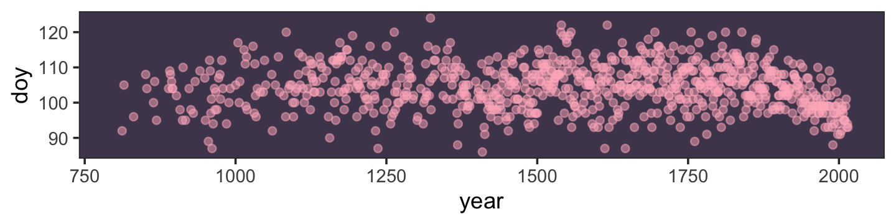
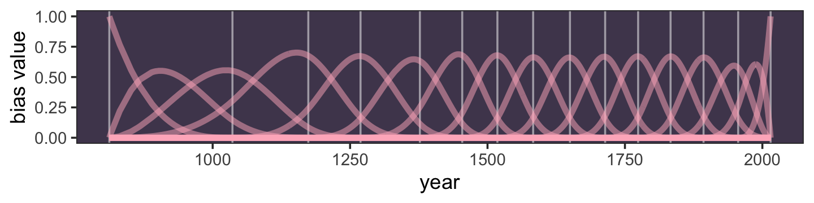
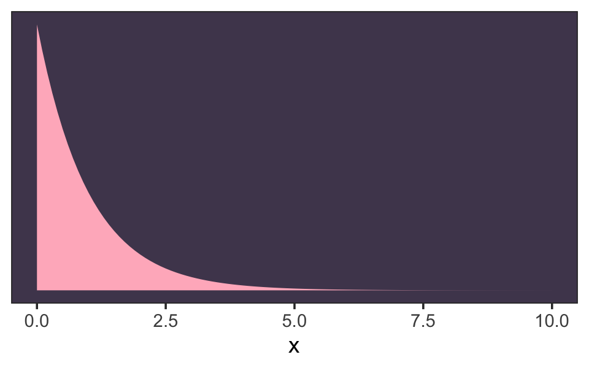
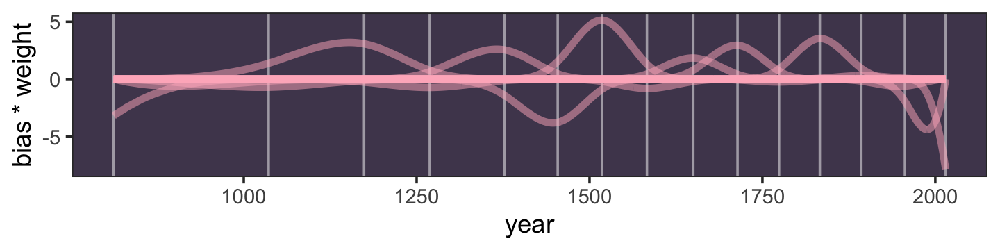
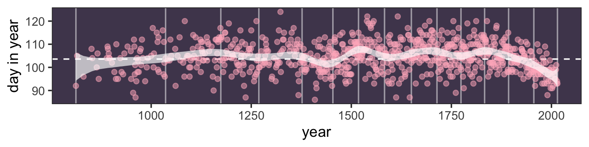
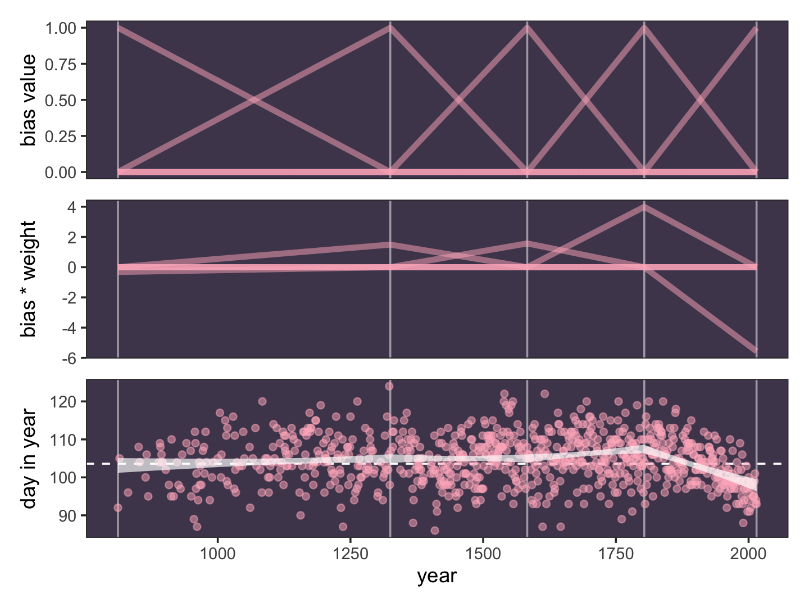
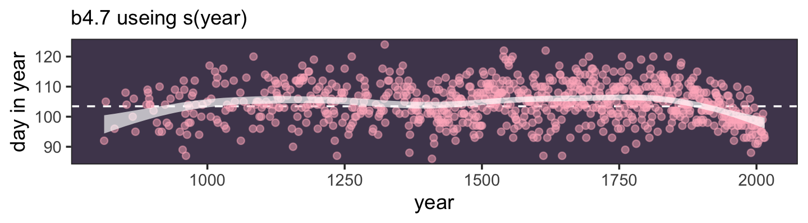
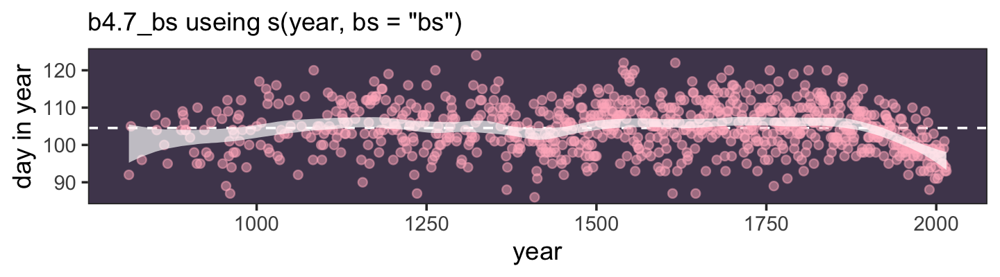

Section 4.5.2: Splines
================
A Solomon Kurz
2021-02-05

# Geocentric Models

## Why normal distributions are normal

### Normal by addition.

``` r
library(tidyverse)
library(patchwork)
library(brms)
```

### Normal by multiplication.

### Normal by log-multiplication.

### Using Gaussian distributions.

#### Ontological justification.

#### Epistemological justification.

#### Rethinking: Heavy tails.

#### Overthinking: Gaussian distribution.

## A language for describing models

### Re-describing the globe tossing model.

#### Overthinking: From model definition to Bayes’ theorem.

## A Gaussian model of height

### The data.

#### Overthinking: Data frames and indexes.

### The model.

#### Rethinking: A farewell to epsilon.

### Grid approximation of the posterior distribution.

### Sampling from the posterior.

#### Overthinking: Sample size and the normality of \(\sigma\)’s posterior.

### Finding the posterior distribution with ~~`quap`~~ `brm()`.

### Sampling from a ~~`quap()`~~ `brm()` fit.

#### Overthinking: Start values for ~~`quap()`~~ `brm()`.

#### Overthinking: Under the hood with multivariate sampling.

## Linear prediction

### The linear model strategy.

#### Probability of the data

#### Linear model

##### Rethinking: Nothing special or natural about linear models.

#### Priors

##### Rethinking: What’s the correct prior?

##### Rethinking: Prior predictive simulation and \(p\)-hacking

### Finding the posterior distribution.

#### Overthinking: Logs and exps, oh my.

### Interpreting the posterior distribution.

##### Rethinking: What do parameters mean?

#### Tables of marginal distributions.

#### Plotting posterior inference against the data.

#### Adding uncertainty around the mean.

#### Plotting regression intervals and contours.

##### Rethinking: Overconfident intervals.

##### Overthinking: How ~~link~~ `fitted()` works.

#### Prediction intervals.

##### Overthinking: Rolling your own ~~sim~~ `predict()`.

## Curves from lines

### Polynomial regression.

##### Overthinking: Converting back to natural scale.

### Splines.

Load the `cherry_blossoms` data (Aono,
[2012](#ref-aonoLongTermChange2012); Aono & Kazui,
[2008](#ref-aonoPhenologicalDataSeries2008); Aono & Saito,
[2010](#ref-aonoClarifyingSpringtimeTemperature2010)).

``` r
library(rethinking)

data(cherry_blossoms)
d <- cherry_blossoms
rm(cherry_blossoms)
detach(package:rethinking, unload = T)
```

Minus the mini histograms, here is our ground-up **tidyverse** way to
summarize our new `d` data the way McElreath did with his `precis()`.

``` r
d %>% 
  gather() %>% 
  group_by(key) %>% 
  summarise(mean = mean(value, na.rm = T),
            sd   = sd(value, na.rm = T),
            ll   = quantile(value, prob = .055, na.rm = T),
            ul   = quantile(value, prob = .945, na.rm = T)) %>% 
  mutate_if(is.double, round, digits = 2)
```

    ## # A tibble: 5 x 5
    ##   key           mean     sd     ll      ul
    ##   <chr>        <dbl>  <dbl>  <dbl>   <dbl>
    ## 1 doy         105.     6.41  94.4   115   
    ## 2 temp          6.14   0.66   5.15    7.29
    ## 3 temp_lower    5.1    0.85   3.79    6.37
    ## 4 temp_upper    7.19   0.99   5.9     8.9 
    ## 5 year       1408    351.   868.   1948.

McElreath encouraged us to plot `doy` against `year`.

``` r
d %>% 
  ggplot(aes(x = year, y = doy)) +
  # color from here: https://www.colorhexa.com/ffb7c5
  geom_point(color = "#ffb7c5", alpha = 1/2) +
  theme_bw() +
  theme(panel.grid = element_blank(),
        # color from here: https://www.colordic.org/w/, inspired by https://chichacha.netlify.com/2018/11/29/plotting-traditional-colours-of-japan/
        panel.background = element_rect(fill = "#4f455c"))
```



It looks like there are some wiggly trends, but it’s hard to tell with a
scatter plot.

> Our goal is to approximate the blossom trend with a wiggly function.
> With B-splines, just like with polynomial regression, we do this by
> generating new predictor variables and using those in the linear
> model, \(\mu_i\). Unlike polynomial regression, B-splines do not
> directly transform the predictor by squaring or cubing it. Instead
> they invent a series of entirely new, synthetic predictor variables.
> Each of these synthetic variables exists only to gradually turn a
> specific parameter on and off within a specific range of the real
> predictor variable. Each of the synthetic variables is called a
> **basis function**. The linear model ends up looking very familiar:
> 
> \[\mu_i = \alpha + w_1 B_{i, 1} + w_2 B_{i, 2} + w_3 B_{i, 3} + \dots\]
> 
> where \(B_{i,n}\) is the \(n\)-th basis function’s value on row \(i\),
> and the \(w\) parameters are corresponding weights for each. The
> parameters act like slopes, adjusting the influence of each basis
> function on the mean \(\mu_i\). So really this is just another linear
> regression, but with some fancy, synthetic predictor variables.
> (p. 115, **emphasis** in the original)

It turns out there are cases with missing data for the `doy` variable.

``` r
d %>% 
  count(is.na(doy)) %>% 
  mutate(percent = 100 * n / sum(n))
```

    ##   is.na(doy)   n  percent
    ## 1      FALSE 827 68.06584
    ## 2       TRUE 388 31.93416

Let’s follow McElreath and make a subset of the data that excludes cases
with missing data in `doy`. Within the **tidyverse**, we might do so
with the `tidyr::drop_na()` function.

``` r
d2 <-
  d %>% 
  drop_na(doy)
```

On page 117 in the text, McElreath indirectly explained how to make
Figure 4.12 by walking through the workflow for making Figure 4.13. Here
we mimic that ordering.

> First, we choose the knots. Remember, the knots are just values of
> year that serve as pivots for our spline. Where should the knots go?
> There are different ways to answer this question. You can, in
> principle, put the knots wherever you like. Their locations are part
> of the model, and you are responsible for them. Let’s do what we did
> in the simple example above, place the knots at different
> evenly-spaced quantiles of the predictor variable. This gives you more
> knots where there are more observations. We used only 5 knots in the
> first example. Now let’s go for 15:

``` r
num_knots <- 15
knot_list <- quantile(d2$year, probs = seq(from = 0, to = 1, length.out = num_knots))
```

Our `knot_list` contains 15 `year` values.

``` r
knot_list
```

    ##        0% 7.142857% 14.28571% 21.42857% 28.57143% 35.71429% 42.85714%       50% 57.14286% 64.28571% 
    ##       812      1036      1174      1269      1377      1454      1518      1583      1650      1714 
    ## 71.42857% 78.57143% 85.71429% 92.85714%      100% 
    ##      1774      1833      1893      1956      2015

Here’s what it looks like if we use those `knot_list` values to chop up
our `year`/`doy` scatter plot, from above.

``` r
d %>% 
  ggplot(aes(x = year, y = doy)) +
  geom_vline(xintercept = knot_list, color = "white", alpha = 1/2) +
  geom_point(color = "#ffb7c5", alpha = 1/2) +
  theme_bw() +
  theme(panel.background = element_rect(fill = "#4f455c"),
        panel.grid = element_blank())
```


> The next choice is polynomial degree. This determines how basis
> functions combine, which determines how the parameters interact to
> produce the spline. For degree 1, as in Figure 4.12, two basis
> functions combine at each point. For degree 2, three functions combine
> at each point. For degree 3, four combine. R already has a nice
> function that will build basis functions for any list of knots and
> degree. This code will construct the necessary basis functions for a
> degree 3 (cubic) spline: (p. 117)

``` r
library(splines)

B <- bs(d2$year,
        knots = knot_list[-c(1, num_knots)], 
        degree = 3, 
        intercept = TRUE)
```

Look closely at McElreath’s tricky `knot_list[-c(1, num_knots)]` code.
Whereas `knot_list` contains 15 ordered `year` values, McElreath shaved
off the first and last `year` values with `knot_list[-c(1, num_knots)]`,
leaving 13. This is because, by default, the `bs()` function places
knots at the boundaries. Since the first and 15<sup>th</sup> values in
`knot_list` were boundary values for `year`, we removed them to avoid
redundancies. We can confirm this with the code, below.

``` r
B %>% str()
```

    ##  'bs' num [1:827, 1:17] 1 0.96 0.767 0.563 0.545 ...
    ##  - attr(*, "dimnames")=List of 2
    ##   ..$ : NULL
    ##   ..$ : chr [1:17] "1" "2" "3" "4" ...
    ##  - attr(*, "degree")= int 3
    ##  - attr(*, "knots")= Named num [1:13] 1036 1174 1269 1377 1454 ...
    ##   ..- attr(*, "names")= chr [1:13] "7.142857%" "14.28571%" "21.42857%" "28.57143%" ...
    ##  - attr(*, "Boundary.knots")= int [1:2] 812 2015
    ##  - attr(*, "intercept")= logi TRUE

Look at the second to last line, `- attr(*, "Boundary.knots")= int
[1:2] 812 2015`. Those default `"Boundary.knots"` are the same as
`knot_list[c(1, num_knots)]`. Let’s confirm.

``` r
knot_list[c(1, num_knots)]
```

    ##   0% 100% 
    ##  812 2015

By the `degree = 3` argument, we indicated we wanted a cubic spline.
McElreath used `degree = 1` for Figure 4.12. For reasons I’m not
prepared to get into, here, splines don’t always include intercept
parameters. Indeed, the `bs()` default is `intercept = FALSE`.
McElreath’s code indicated he wanted to fit a B-spline that included
an intercept. Thus: `intercept = TRUE`.

Here’s how we might make our version of the top panel of Figure 4.13.

``` r
# wrangle a bit
b <-
  B %>% 
  data.frame() %>% 
  set_names(str_c(0, 1:9), 10:17) %>%  
  bind_cols(select(d2, year)) %>% 
  pivot_longer(-year,
               names_to = "bias_function",
               values_to = "bias")

# plot
b %>% 
  ggplot(aes(x = year, y = bias, group = bias_function)) +
  geom_vline(xintercept = knot_list, color = "white", alpha = 1/2) +
  geom_line(color = "#ffb7c5", alpha = 1/2, size = 1.5) +
  ylab("bias value") +
  theme_bw() +
  theme(panel.background = element_rect(fill = "#4f455c"),
        panel.grid = element_blank())
```



To elucidate what’s going on in that plot, we might break it up with
`facet_wrap()`.

``` r
b %>% 
  mutate(bias_function = str_c("bias function ", bias_function)) %>% 
  
  ggplot(aes(x = year, y = bias)) +
  geom_vline(xintercept = knot_list, color = "white", alpha = 1/2) +
  geom_line(color = "#ffb7c5", size = 1.5) +
  ylab("bias value") +
  theme_bw() +
  theme(panel.background = element_rect(fill = "#4f455c"),
        panel.grid = element_blank(),
        strip.background = element_rect(fill = scales::alpha("#ffb7c5", .25), color = "transparent"),
        strip.text = element_text(size = 8, margin = margin(0.1, 0, 0.1, 0, "cm"))) +
  facet_wrap(~bias_function, ncol = 1)
```


> Now to get the parameter weights for each basis function, we need to
> actually define the model and make it run. The model is just a linear
> regression. The synthetic basis functions do all the work. We’ll use
> each column of the matrix `B` as a variable. We’ll also have an
> intercept to capture the average blossom day. This will make it easier
> to define priors on the basis weights, because then we can just
> conceive of each as a deviation from the intercept. (p. 117)

That last line is another indication for why we set `intercept = TRUE`.
Our model will follow the form

where \(\alpha\) is the intercept, \(B_{k, i}\) is the value of the
\(k^\text{th}\) bias function on the \(i^\text{th}\) row of the data,
and \(w_k\) is the estimated regression weight for the corresponding
\(k^\text{th}\) bias function.

Throughout this chapter, I’ve griped a bit about using the uniform prior
for \(\sigma\). Now that McElreath has introduced the exponential
distribution as an alternative, those gripes are coming to an end. The
exponential distribution is controlled by a single parameter,
\(\lambda\), which is also called the rate. As it turns out, the mean of
the exponential distribution is the inverse of the rate,
\(1 / \lambda\). Here we use the `dexp()` function to get a sense of
what that prior looks like.

``` r
tibble(x = seq(from = 0, to = 10, by = 0.1)) %>% 
  mutate(d = dexp(x, rate = 1)) %>% 
  
  ggplot(aes(x = x, ymin = 0, ymax = d)) +
  geom_ribbon(fill = "#ffb7c5") +
  scale_y_continuous(NULL, breaks = NULL) +
  theme_bw() +
  theme(panel.background = element_rect(fill = "#4f455c"),
        panel.grid = element_blank())
```



“We’ll use exponential priors for the rest of the book, in place of
uniform priors. It is much more common to have a sense of the average
deviation than of the maximum” (p. 119). 🎉

**Acknowledgment**: The workflow to follow is heavily influenced by the
[helpful
contributions](https://github.com/ASKurz/Statistical_Rethinking_with_brms_ggplot2_and_the_tidyverse_2_ed/issues/22)
from [Stephen Wild](https://github.com/sjwild). My first pass through
the material in this section was a mess. Wild’s insights knocked it out
of the park and I couldn’t be more grateful. 🍻

Before fitting this model in **brms**, well take a minor detour on the
data structure. In his **R** code 4.76, McElreath defined his data in a
list, `list( D=d2$doy , B=B )`. Our approach will be a little different.
Here, we’ll add the `B` matrix to our `d2` data frame and name the
results as `d3`.

``` r
d3 <-
  d2 %>% 
  mutate(B = B) 

# take a look at the structure of `d3
d3 %>% glimpse()
```

    ## Rows: 827
    ## Columns: 6
    ## $ year       <int> 812, 815, 831, 851, 853, 864, 866, 869, 889, 891, 892, 894, 895, 896, 902, 908…
    ## $ doy        <int> 92, 105, 96, 108, 104, 100, 106, 95, 104, 109, 108, 106, 104, 104, 102, 98, 95…
    ## $ temp       <dbl> NA, NA, NA, 7.38, NA, 6.42, 6.44, NA, 6.83, 6.98, 7.11, 6.98, 7.08, 7.20, 7.50…
    ## $ temp_upper <dbl> NA, NA, NA, 12.10, NA, 8.69, 8.11, NA, 8.48, 8.96, 9.11, 8.40, 8.57, 8.69, 8.9…
    ## $ temp_lower <dbl> NA, NA, NA, 2.66, NA, 4.14, 4.77, NA, 5.19, 5.00, 5.11, 5.55, 5.58, 5.72, 6.06…
    ## $ B          <dbl[,17]> <matrix[33 x 17]>

In our `d3` data, columns `year` through `temp_lower` are all standard
data columns. The `B` column is a *matrix column*, which contains the
same number of rows as the others, but also smuggled in 17 columns
*within* that column. Each of those 17 columns corresponds to one of our
synthetic \(B_k\) variables. The advantage of such a data structure is
we can simply define our `formula` argument as `doy ~ 1 + B`, where `B`
is a stand-in for `B.1 + B.2 + ... + B.17`.

Here’s how to fit the model.

``` r
b4.7 <- 
  brm(data = d3,
      family = gaussian,
      doy ~ 1 + B,
      prior = c(prior(normal(100, 10), class = Intercept),
                prior(normal(0, 10), class = b),
                prior(exponential(1), class = sigma)),
      iter = 2000, warmup = 1000, chains = 4, cores = 4,
      seed = 4,
      file = "/Users/solomonkurz/Dropbox/Recoding Statistical Rethinking 2nd ed/fits/b04.07")
```

Here’s the model summary.

``` r
print(b4.7)
```

    ##  Family: gaussian 
    ##   Links: mu = identity; sigma = identity 
    ## Formula: doy ~ 1 + B 
    ##    Data: d3 (Number of observations: 827) 
    ## Samples: 4 chains, each with iter = 2000; warmup = 1000; thin = 1;
    ##          total post-warmup samples = 4000
    ## 
    ## Population-Level Effects: 
    ##           Estimate Est.Error l-95% CI u-95% CI Rhat Bulk_ESS Tail_ESS
    ## Intercept   103.59      2.49    98.58   108.45 1.01      761     1071
    ## B1           -3.19      3.88   -10.80     4.21 1.00     1591     2435
    ## B2           -1.11      3.92    -8.82     6.62 1.00     1463     1859
    ## B3           -1.27      3.68    -8.58     6.07 1.00     1332     1833
    ## B4            4.56      2.96    -1.13    10.54 1.00     1046     1648
    ## B5           -1.08      2.99    -6.89     4.78 1.00      954     1399
    ## B6            4.03      3.02    -1.86    10.07 1.00     1056     1515
    ## B7           -5.55      2.91   -11.23     0.30 1.00      981     1672
    ## B8            7.57      2.92     1.92    13.29 1.00     1005     1583
    ## B9           -1.22      2.97    -6.90     4.58 1.01     1001     1458
    ## B10           2.79      3.03    -3.17     9.02 1.00     1019     1527
    ## B11           4.42      3.00    -1.49    10.27 1.00     1056     1846
    ## B12          -0.37      2.99    -5.98     5.70 1.00     1013     1551
    ## B13           5.28      2.99    -0.52    11.07 1.00     1024     1768
    ## B14           0.46      3.09    -5.44     6.74 1.00     1036     1712
    ## B15          -1.05      3.37    -7.77     5.59 1.00     1215     2147
    ## B16          -7.25      3.44   -14.01    -0.49 1.00     1287     1936
    ## B17          -7.88      3.26   -14.24    -1.29 1.00     1246     1824
    ## 
    ## Family Specific Parameters: 
    ##       Estimate Est.Error l-95% CI u-95% CI Rhat Bulk_ESS Tail_ESS
    ## sigma     5.94      0.14     5.67     6.23 1.00     4173     2921
    ## 
    ## Samples were drawn using sampling(NUTS). For each parameter, Bulk_ESS
    ## and Tail_ESS are effective sample size measures, and Rhat is the potential
    ## scale reduction factor on split chains (at convergence, Rhat = 1).

Look at that. Each of the 17 columns in our `B` matrix was assigned its
own parameter. If you fit this model using McElreath’s **rethinking**
code, you’ll see the results are very similar. Anyway, McElreath’s
comments are in line with the general consensus on spline modes: the
parameter estimates are very difficult to interpret directly. It’s often
easier to just plot the results. First we’ll use `posterior_samples()`.

``` r
post <- posterior_samples(b4.7)

glimpse(post)
```

    ## Rows: 4,000
    ## Columns: 20
    ## $ b_Intercept <dbl> 103.74086, 104.25796, 103.13392, 104.66690, 105.20821, 105.41704, 105.65525, …
    ## $ b_B1        <dbl> -6.4826048, -5.4990824, -2.1646605, 0.4607746, -9.0040921, -7.3966727, -11.50…
    ## $ b_B2        <dbl> 3.74875270, -0.53550232, -0.42138745, -8.06386888, 0.66505588, 0.72880418, 2.…
    ## $ b_B3        <dbl> -4.22042929, -2.26081740, -0.95183959, -1.78965585, -8.02914674, -9.16372510,…
    ## $ b_B4        <dbl> 5.8833689, 4.7218957, 3.5397449, 3.2324508, 5.1640256, 5.9370012, 2.3368581, …
    ## $ b_B5        <dbl> -4.6338971, -2.0490845, -1.7740736, -1.4582729, -4.3913120, -3.1619283, -4.30…
    ## $ b_B6        <dbl> 6.00593380, 2.37093832, 6.60788828, 0.95493974, 2.78863329, 2.14199241, 1.683…
    ## $ b_B7        <dbl> -6.9436490, -3.8421888, -7.9974119, -6.7766133, -5.6201809, -6.7678482, -8.33…
    ## $ b_B8        <dbl> 7.316514, 5.119854, 8.393274, 5.799375, 6.329872, 5.731784, 5.708979, 6.76073…
    ## $ b_B9        <dbl> -1.9490036, -0.2646558, -1.4861210, -1.3906578, -3.7449285, -3.6035334, -4.00…
    ## $ b_B10       <dbl> 3.9720418, 2.9088482, 4.1508398, 1.3121326, 2.3465406, 3.1685000, 1.6009567, …
    ## $ b_B11       <dbl> 3.6933735, 3.2552081, 2.3290076, 3.5780345, 1.4853387, 1.4431854, 1.8636113, …
    ## $ b_B12       <dbl> -0.2419564, -2.2181982, -0.6924766, -1.5380999, -1.3345390, -1.7848732, -1.19…
    ## $ b_B13       <dbl> 5.416313, 3.645593, 6.208850, 4.199717, 4.373958, 3.727896, 1.780963, 4.05696…
    ## $ b_B14       <dbl> 1.5023931, 2.6503143, 1.1680142, 1.9840733, -3.6880151, -4.3624263, -1.345643…
    ## $ b_B15       <dbl> -1.51102386, -4.81636227, 1.75411291, -3.42256204, -1.68102337, -2.74340145, …
    ## $ b_B16       <dbl> -8.4839941, -7.0335783, -8.7948696, -4.4579658, -10.4273168, -10.3023468, -13…
    ## $ b_B17       <dbl> -9.947067, -10.641582, -8.199229, -8.768240, -7.976792, -8.981154, -7.529841,…
    ## $ sigma       <dbl> 6.077514, 5.949900, 6.119600, 5.906621, 5.937513, 5.884939, 5.901013, 5.99208…
    ## $ lp__        <dbl> -2711.191, -2710.897, -2714.579, -2714.185, -2711.390, -2713.697, -2712.118, …

With a little wrangling, we can use summary information from `post` to
make our version of the middle panel of Figure 4.13.

``` r
post %>% 
  select(b_B1:b_B17) %>% 
  set_names(c(str_c(0, 1:9), 10:17)) %>% 
  pivot_longer(everything(), names_to = "bias_function") %>% 
  group_by(bias_function) %>% 
  summarise(weight = mean(value)) %>% 
  full_join(b, by = "bias_function") %>% 
  
  # plot
  ggplot(aes(x = year, y = bias * weight, group = bias_function)) +
  geom_vline(xintercept = knot_list, color = "white", alpha = 1/2) +
  geom_line(color = "#ffb7c5", alpha = 1/2, size = 1.5) +
  theme_bw() +
  theme(panel.background = element_rect(fill = "#4f455c"),
        panel.grid = element_blank()) 
```



In case you missed it, the main action in the **ggplot2** code was `y =
bias * weight`, where we defined the \(y\)-axis as the product of `bias`
and `weight`. This is fulfillment of the \(w_k B_{k, i}\) parts of the
model. Now here’s how we might use `brms::fitted()` to make the lower
plot of Figure 4.13.

``` r
f <- fitted(b4.7)

f %>% 
  data.frame() %>% 
  bind_cols(d2) %>% 
  
  ggplot(aes(x = year)) + 
  geom_vline(xintercept = knot_list, color = "white", alpha = 1/2) +
  geom_hline(yintercept = fixef(b4.7)[1, 1], color = "white", linetype = 2) +
  geom_point(aes(y = doy),
             color = "#ffb7c5", alpha = 1/2) +
  geom_ribbon(aes(ymin = Q2.5, ymax = Q97.5),
              fill = "white", alpha = 2/3) +
  labs(x = "year",
       y = "day in year") +
  theme_bw() +
  theme(panel.background = element_rect(fill = "#4f455c"),
        panel.grid = element_blank())
```



If it wasn’t clear, the dashed horizontal line intersecting a little
above 100 on the \(y\)-axis is the poster mean for the intercept. Now
let’s use our skills to remake the simpler model expressed in Figure
4.12. This model, recall, is based on 5 knots.

``` r
# redo the `B` splines
num_knots <- 5
knot_list <- quantile(d2$year, probs = seq(from = 0, to = 1, length.out = num_knots))

B <- bs(d2$year,
        knots = knot_list[-c(1, num_knots)], 
        # this makes the splines liner rater than cubic
        degree = 1, 
        intercept = TRUE)

# define a new `d4 data
d4 <- 
  d2 %>% 
  mutate(B   = B)

b4.8 <- 
  brm(data = d4,
      family = gaussian,
      formula = doy ~ 1 + B,
      prior = c(prior(normal(100, 10), class = Intercept),
                prior(normal(0, 10), class = b),
                prior(exponential(1), class = sigma)),
      iter = 2000, warmup = 1000, chains = 4, cores = 4,
      seed = 4,
      file = "/Users/solomonkurz/Dropbox/Recoding Statistical Rethinking 2nd ed/fits/b04.08")
```

Review the new model summary.

``` r
print(b4.8)
```

    ##  Family: gaussian 
    ##   Links: mu = identity; sigma = identity 
    ## Formula: doy ~ 1 + B 
    ##    Data: d4 (Number of observations: 827) 
    ## Samples: 4 chains, each with iter = 2000; warmup = 1000; thin = 1;
    ##          total post-warmup samples = 4000
    ## 
    ## Population-Level Effects: 
    ##           Estimate Est.Error l-95% CI u-95% CI Rhat Bulk_ESS Tail_ESS
    ## Intercept   103.46      4.57    94.27   112.27 1.01      673     1077
    ## B1           -0.32      4.65    -9.48     9.16 1.01      694     1124
    ## B2            1.49      4.60    -7.52    10.84 1.01      692     1048
    ## B3            1.57      4.60    -7.40    10.90 1.01      681     1117
    ## B4            3.99      4.59    -5.00    13.02 1.01      689     1140
    ## B5           -5.56      4.63   -14.64     3.76 1.01      685     1175
    ## 
    ## Family Specific Parameters: 
    ##       Estimate Est.Error l-95% CI u-95% CI Rhat Bulk_ESS Tail_ESS
    ## sigma     6.10      0.15     5.82     6.41 1.00     2537     1993
    ## 
    ## Samples were drawn using sampling(NUTS). For each parameter, Bulk_ESS
    ## and Tail_ESS are effective sample size measures, and Rhat is the potential
    ## scale reduction factor on split chains (at convergence, Rhat = 1).

Here we do all the work to make and save the three subplots for Figure
4.12 in bulk.

``` r
## top
# wrangle a bit
b <-
  invoke(data.frame, d4) %>% 
  pivot_longer(starts_with("B"),
               names_to = "bias_function",
               values_to = "bias")

# plot
p1 <- 
  b %>% 
  ggplot(aes(x = year, y = bias, group = bias_function)) +
  geom_vline(xintercept = knot_list, color = "white", alpha = 1/2) +
  geom_line(color = "#ffb7c5", alpha = 1/2, size = 1.5) +
  scale_x_continuous(NULL, breaks = NULL) +
  ylab("bias value")

## middle
# wrangle
p2 <-
  posterior_samples(b4.8) %>% 
  select(b_B1:b_B5) %>% 
  set_names(str_c("B.", 1:5)) %>% 
  pivot_longer(everything(), names_to = "bias_function") %>% 
  group_by(bias_function) %>% 
  summarise(weight = mean(value)) %>% 
  full_join(b, by = "bias_function") %>% 
  
  # plot
  ggplot(aes(x = year, y = bias * weight, group = bias_function)) +
  geom_vline(xintercept = knot_list, color = "white", alpha = 1/2) +
  geom_line(color = "#ffb7c5", alpha = 1/2, size = 1.5) +
  scale_x_continuous(NULL, breaks = NULL)

## bottom
# wrangle
f <- fitted(b4.8)

p3 <-
  f %>% 
  data.frame() %>% 
  bind_cols(d2) %>% 
  
  # plot
  ggplot(aes(x = year)) + 
  geom_vline(xintercept = knot_list, color = "white", alpha = 1/2) +
  geom_hline(yintercept = fixef(b4.7)[1, 1], color = "white", linetype = 2) +
  geom_point(aes(y = doy),
             color = "#ffb7c5", alpha = 1/2) +
  geom_ribbon(aes(ymin = Q2.5, ymax = Q97.5),
              fill = "white", alpha = 2/3) +
  labs(x = "year",
       y = "day in year")
```

Now combine the subplots with **patchwork** syntax and plot.

``` r
(p1 / p2 / p3) &
  theme_bw() &
  theme(panel.background = element_rect(fill = "#4f455c"),
        panel.grid = element_blank())
```



### Smooth functions for a rough world.

> The splines in the previous section are just the beginning. A entire
> class of models, **generalized additive models** (GAMs), focuses on
> predicting an outcome variable using smooth functions of some
> predictor variables. The topic is deep enough to deserve its own book.
> (p. 120, **emphasis** in the original)

McElreath ended that block quote with a reference to his endnote \#78.
On page 562, we read: “A very popular and comprehensive text is Wood
([2017](#ref-woodGeneralizedAdditiveModels2017)[b](#ref-woodGeneralizedAdditiveModels2017)).”

## ~~Summary~~ Smooth functions with `brms::s()`

It’s convenient for us how McElreath ended that last section with a
reference to Simon Wood’s work because **brms** allows for a variety of
non-linear models by borrowing functions from Woods’s [**mgcv**
package](https://CRAN.R-project.org/package=mgcv) (Wood,
[2003](#ref-mgcv2003), [2004](#ref-mgcv2004), [2011](#ref-mgcv2011),
[2017](#ref-mgcv2017)[a](#ref-mgcv2017), [2019](#ref-R-mgcv); Wood et
al., [2016](#ref-mgcv2016)). The two smooth functions **brms** imports
from **mgcv** are `s()` and `t2()`. We’ll be exploring `s()`. We might
use the `brms::get_prior()` function to get a sense of how to set up the
priors when using `s()`.

``` r
get_prior(data = d2,
          family = gaussian,
          doy ~ 1 + s(year))
```

    ##                   prior     class    coef group resp dpar nlpar bound       source
    ##                  (flat)         b                                          default
    ##                  (flat)         b syear_1                             (vectorized)
    ##  student_t(3, 105, 5.9) Intercept                                          default
    ##    student_t(3, 0, 5.9)       sds                                          default
    ##    student_t(3, 0, 5.9)       sds s(year)                             (vectorized)
    ##    student_t(3, 0, 5.9)     sigma                                          default

We have an overall intercept (`class = Intercept`), a single \(\beta\)
parameter for `year` (`class = b`), a \(\sigma\) parameter (`class =
sigma`), and an unfamiliar parameter of `class = sds`. I’m not going to
go into that last parameter in any detail, here. We’ll need to work our
way up through \[Chapter 13\]\[Models With Memory\] and the multilevel
model to get a full picture of what it means. The important thing to
note here is that the priors for our `s()`-based alternative to the
B-spline models, above, are going to look a little different. Here’s how
we might fit an alternative to `b4.7`

``` r
b4.9 <-
  brm(data = d2,
      family = gaussian,
      doy ~ 1 + s(year),
      prior = c(prior(normal(100, 10), class = Intercept),
                prior(normal(0, 10), class = b),
                prior(student_t(3, 0, 5.9), class = sds),
                prior(exponential(1), class = sigma)),
      iter = 2000, warmup = 1000, chains = 4, cores = 4,
      seed = 4,
      control = list(adapt_delta = .99),
      file = "/Users/solomonkurz/Dropbox/Recoding Statistical Rethinking 2nd ed/fits/b04.09")
```

Check out the model summary.

``` r
print(b4.9)
```

    ##  Family: gaussian 
    ##   Links: mu = identity; sigma = identity 
    ## Formula: doy ~ 1 + s(year) 
    ##    Data: d2 (Number of observations: 827) 
    ## Samples: 4 chains, each with iter = 2000; warmup = 1000; thin = 1;
    ##          total post-warmup samples = 4000
    ## 
    ## Smooth Terms: 
    ##              Estimate Est.Error l-95% CI u-95% CI Rhat Bulk_ESS Tail_ESS
    ## sds(syear_1)    22.36      7.56    11.87    40.48 1.00     1115     1863
    ## 
    ## Population-Level Effects: 
    ##           Estimate Est.Error l-95% CI u-95% CI Rhat Bulk_ESS Tail_ESS
    ## Intercept   104.54      0.22   104.13   104.98 1.00     4095     2264
    ## syear_1      -9.87      8.94   -27.42     7.43 1.00     3123     2818
    ## 
    ## Family Specific Parameters: 
    ##       Estimate Est.Error l-95% CI u-95% CI Rhat Bulk_ESS Tail_ESS
    ## sigma     6.04      0.15     5.75     6.36 1.00     4305     2900
    ## 
    ## Samples were drawn using sampling(NUTS). For each parameter, Bulk_ESS
    ## and Tail_ESS are effective sample size measures, and Rhat is the potential
    ## scale reduction factor on split chains (at convergence, Rhat = 1).

Our intercept and \(\sigma\) summaries are similar to those we got from
`b4.7`. The rest looks different. Here’s what happens when we use
`brms::fitted()` to plot the implications of the model.

``` r
fitted(b4.9) %>% 
  data.frame() %>% 
  bind_cols(select(d2, year, doy)) %>% 
  
  ggplot(aes(x = year, y = doy, ymin = Q2.5, ymax = Q97.5)) +
  geom_hline(yintercept = fixef(b4.8)[1, 1], color = "white", linetype = 2) +
  geom_point(color = "#ffb7c5", alpha = 1/2) +
  geom_ribbon(fill = "white", alpha = 2/3) +
  labs(subtitle = "b4.7 useing s(year)",
       y = "day in year") +
  theme_bw() +
  theme(panel.grid = element_blank(),
        panel.background = element_rect(fill = "#4f455c"))
```



That smooth doesn’t look quite the same. Hopefully this isn’t terribly
surprising. We used a function from a different package and ended up
with a underlying statistical model. In fact, we didn’t even use a
B-spline. The default for `s()` is to use what’s called a *thin plate*
regression spline. If we’d like to fit a B-spline, we have to set `bs =
"bs"`. Here’s an example.

``` r
b4.10 <-
  brm(data = d2,
      family = gaussian,
      doy ~ 1 + s(year, bs = "bs", k = 19),
      prior = c(prior(normal(100, 10), class = Intercept),
                prior(normal(0, 10), class = b),
                prior(student_t(3, 0, 5.9), class = sds),
                prior(exponential(1), class = sigma)),
      iter = 2000, warmup = 1000, chains = 4, cores = 4,
      seed = 4,
      control = list(adapt_delta = .99),
      file = "/Users/solomonkurz/Dropbox/Recoding Statistical Rethinking 2nd ed/fits/b04.10")
```

``` r
print(b4.10)
```

    ##  Family: gaussian 
    ##   Links: mu = identity; sigma = identity 
    ## Formula: doy ~ 1 + s(year, bs = "bs", k = 19) 
    ##    Data: d2 (Number of observations: 827) 
    ## Samples: 4 chains, each with iter = 2000; warmup = 1000; thin = 1;
    ##          total post-warmup samples = 4000
    ## 
    ## Smooth Terms: 
    ##              Estimate Est.Error l-95% CI u-95% CI Rhat Bulk_ESS Tail_ESS
    ## sds(syear_1)     1.31      0.59     0.54     2.80 1.01      622      988
    ## 
    ## Population-Level Effects: 
    ##           Estimate Est.Error l-95% CI u-95% CI Rhat Bulk_ESS Tail_ESS
    ## Intercept   104.54      0.20   104.14   104.95 1.00     5150     2533
    ## syear_1      -0.09      0.33    -0.75     0.57 1.00     1873     2216
    ## 
    ## Family Specific Parameters: 
    ##       Estimate Est.Error l-95% CI u-95% CI Rhat Bulk_ESS Tail_ESS
    ## sigma     5.98      0.15     5.70     6.28 1.00     4065     3050
    ## 
    ## Samples were drawn using sampling(NUTS). For each parameter, Bulk_ESS
    ## and Tail_ESS are effective sample size measures, and Rhat is the potential
    ## scale reduction factor on split chains (at convergence, Rhat = 1).

Now here’s the depiction of our `s()`-based B-spline model.

``` r
fitted(b4.10) %>% 
  data.frame() %>% 
  bind_cols(select(d2, year, doy)) %>% 
  
  ggplot(aes(x = year, y = doy, ymin = Q2.5, ymax = Q97.5)) +
  geom_hline(yintercept = fixef(b4.10)[1, 1], color = "white", linetype = 2) +
  geom_point(color = "#ffb7c5", alpha = 1/2) +
  geom_ribbon(fill = "white", alpha = 2/3) +
  labs(subtitle = 'b4.7_bs useing s(year, bs = "bs")',
       y = "day in year") +
  theme_bw() +
  theme(panel.grid = element_blank(),
        panel.background = element_rect(fill = "#4f455c"))
```



There are still other important differences between the underlying
statistical model for `b4.10` and the earlier `b4.7` that I’m just not
going to go into, here.

For more on the B-splines and smooths, more generally, check out the
blog post by the great [Gavin Simpson](https://twitter.com/ucfagls),
[*Extrapolating with B splines and
GAMs*](https://fromthebottomoftheheap.net/2020/06/03/extrapolating-with-gams/).
For a high-level introduction to the models you can fit with **mgcv**,
check out the nice talk by [Noam Ross](https://twitter.com/noamross),
[*Nonlinear models in R: The wonderful world of
mgcv*](https://www.youtube.com/watch?v=q4_t8jXcQgc), or the equally-nice
presentation by Simpson, [*Introduction to generalized additive models
with R and mgcv*](https://www.youtube.com/watch?v=sgw4cu8hrZM). Ross
also has a free online course covering **mgcv** called [GAMS in
R](https://noamross.github.io/gams-in-r-course/). And for specific
examples of fitting various GAMS with **brms**, check out Simpson’s blog
post, [**Fitting GAMs with brms:
part 1**](https://fromthebottomoftheheap.net/2018/04/21/fitting-gams-with-brms/).

## Session info

``` r
sessionInfo()
```

    ## R version 4.0.3 (2020-10-10)
    ## Platform: x86_64-apple-darwin17.0 (64-bit)
    ## Running under: macOS Catalina 10.15.7
    ## 
    ## Matrix products: default
    ## BLAS:   /Library/Frameworks/R.framework/Versions/4.0/Resources/lib/libRblas.dylib
    ## LAPACK: /Library/Frameworks/R.framework/Versions/4.0/Resources/lib/libRlapack.dylib
    ## 
    ## locale:
    ## [1] en_US.UTF-8/en_US.UTF-8/en_US.UTF-8/C/en_US.UTF-8/en_US.UTF-8
    ## 
    ## attached base packages:
    ## [1] splines   parallel  stats     graphics  grDevices utils     datasets  methods   base     
    ## 
    ## other attached packages:
    ##  [1] rstan_2.21.2         StanHeaders_2.21.0-6 brms_2.14.4          Rcpp_1.0.5          
    ##  [5] patchwork_1.1.0      forcats_0.5.0        stringr_1.4.0        dplyr_1.0.2         
    ##  [9] purrr_0.3.4          readr_1.4.0          tidyr_1.1.2          tibble_3.0.4        
    ## [13] ggplot2_3.3.2        tidyverse_1.3.0     
    ## 
    ## loaded via a namespace (and not attached):
    ##   [1] minqa_1.2.4          colorspace_2.0-0     ellipsis_0.3.1       ggridges_0.5.2      
    ##   [5] rsconnect_0.8.16     estimability_1.3     markdown_1.1         base64enc_0.1-3     
    ##   [9] fs_1.5.0             rstudioapi_0.13      farver_2.0.3         DT_0.16             
    ##  [13] fansi_0.4.1          mvtnorm_1.1-1        lubridate_1.7.9.2    xml2_1.3.2          
    ##  [17] codetools_0.2-16     bridgesampling_1.0-0 knitr_1.30           shinythemes_1.1.2   
    ##  [21] bayesplot_1.7.2      projpred_2.0.2       jsonlite_1.7.1       nloptr_1.2.2.2      
    ##  [25] broom_0.7.2          dbplyr_2.0.0         shiny_1.5.0          compiler_4.0.3      
    ##  [29] httr_1.4.2           emmeans_1.5.2-1      backports_1.2.0      assertthat_0.2.1    
    ##  [33] Matrix_1.2-18        fastmap_1.0.1        cli_2.2.0            later_1.1.0.1       
    ##  [37] prettyunits_1.1.1    htmltools_0.5.0      tools_4.0.3          igraph_1.2.6        
    ##  [41] coda_0.19-4          gtable_0.3.0         glue_1.4.2           reshape2_1.4.4      
    ##  [45] V8_3.4.0             cellranger_1.1.0     vctrs_0.3.5          nlme_3.1-149        
    ##  [49] crosstalk_1.1.0.1    xfun_0.19            ps_1.5.0             lme4_1.1-25         
    ##  [53] rvest_0.3.6          mime_0.9             miniUI_0.1.1.1       lifecycle_0.2.0     
    ##  [57] gtools_3.8.2         statmod_1.4.35       MASS_7.3-53          zoo_1.8-8           
    ##  [61] scales_1.1.1         colourpicker_1.1.0   hms_0.5.3            promises_1.1.1      
    ##  [65] Brobdingnag_1.2-6    inline_0.3.17        shinystan_2.5.0      curl_4.3            
    ##  [69] gamm4_0.2-6          yaml_2.2.1           gridExtra_2.3        loo_2.3.1           
    ##  [73] stringi_1.5.3        dygraphs_1.1.1.6     pkgbuild_1.1.0       boot_1.3-25         
    ##  [77] shape_1.4.5          rlang_0.4.9          pkgconfig_2.0.3      matrixStats_0.57.0  
    ##  [81] evaluate_0.14        lattice_0.20-41      labeling_0.4.2       rstantools_2.1.1    
    ##  [85] htmlwidgets_1.5.2    processx_3.4.5       tidyselect_1.1.0     plyr_1.8.6          
    ##  [89] magrittr_2.0.1       R6_2.5.0             generics_0.1.0       DBI_1.1.0           
    ##  [93] pillar_1.4.7         haven_2.3.1          withr_2.3.0          mgcv_1.8-33         
    ##  [97] xts_0.12.1           abind_1.4-5          modelr_0.1.8         crayon_1.3.4        
    ## [101] utf8_1.1.4           rmarkdown_2.5        emo_0.0.0.9000       grid_4.0.3          
    ## [105] readxl_1.3.1         callr_3.5.1          threejs_0.3.3        reprex_0.3.0        
    ## [109] digest_0.6.27        xtable_1.8-4         httpuv_1.5.4         RcppParallel_5.0.2  
    ## [113] stats4_4.0.3         munsell_0.5.0        shinyjs_2.0.0

<div id="refs" class="references">

<div id="ref-aonoLongTermChange2012">

Aono, Y. (2012). Long-term change in climate and floral phenophase.
*Chikyu Kankyo (Global Environment)*, *17*.
<http://atmenv.envi.osakafu-u.ac.jp/aono/kyophenotemp4/>

</div>

<div id="ref-aonoPhenologicalDataSeries2008">

Aono, Y., & Kazui, K. (2008). Phenological data series of cherry tree
flowering in Kyoto, Japan, and its application to reconstruction of
springtime temperatures since the 9th century. *International Journal of
Climatology*, *28*(7), 905–914. <https://doi.org/10.1002/joc.1594>

</div>

<div id="ref-aonoClarifyingSpringtimeTemperature2010">

Aono, Y., & Saito, S. (2010). Clarifying springtime temperature
reconstructions of the medieval period by gap-filling the cherry blossom
phenological data series at Kyoto, Japan. *International Journal of
Biometeorology*, *54*(2), 211–219.
<https://doi.org/10.1007/s00484-009-0272-x>

</div>

<div id="ref-mgcv2003">

Wood, S. N. (2003). Thin-plate regression splines. *Journal of the Royal
Statistical Society (B)*, *65*(1), 95–114.
<https://doi.org/10.1111/1467-9868.00374>

</div>

<div id="ref-mgcv2004">

Wood, S. N. (2004). Stable and efficient multiple smoothing parameter
estimation for generalized additive models. *Journal of the American
Statistical Association*, *99*(467), 673–686.
<https://doi.org/10.1198/016214504000000980>

</div>

<div id="ref-mgcv2011">

Wood, S. N. (2011). Fast stable restricted maximum likelihood and
marginal likelihood estimation of semiparametric generalized linear
models. *Journal of the Royal Statistical Society (B)*, *73*(1), 3–36.
<https://doi.org/10.1111/j.1467-9868.2010.00749.x>

</div>

<div id="ref-mgcv2017">

Wood, S. N. (2017a). *Generalized additive models: An introduction with
r* (Second). Chapman and Hall/CRC.
<https://www.routledge.com/Generalized-Additive-Models-An-Introduction-with-R-Second-Edition/Wood/p/book/9781498728331?utm_source=crcpress.com\&utm_medium=referral>

</div>

<div id="ref-R-mgcv">

Wood, S. N. (2019). *mgcv: Mixed GAM computation vehicle with automatic
smoothness estimation*. <https://CRAN.R-project.org/package=mgcv>

</div>

<div id="ref-woodGeneralizedAdditiveModels2017">

Wood, S. N. (2017b). *Generalized additive models: An introduction with
R* (Second Edition). CRC Press.
<https://www.routledge.com/Generalized-Additive-Models-An-Introduction-with-R-Second-Edition/Wood/p/book/9781498728331>

</div>

<div id="ref-mgcv2016">

Wood, S. N., Pya, N., & Säfken, B. (2016). Smoothing parameter and model
selection for general smooth models (with discussion). *Journal of the
American Statistical Association*, *111*, 1548–1575.
<https://doi.org/10.1080/01621459.2016.1180986>

</div>

</div>
