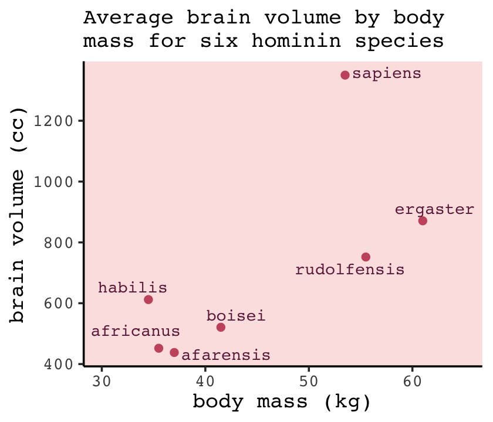
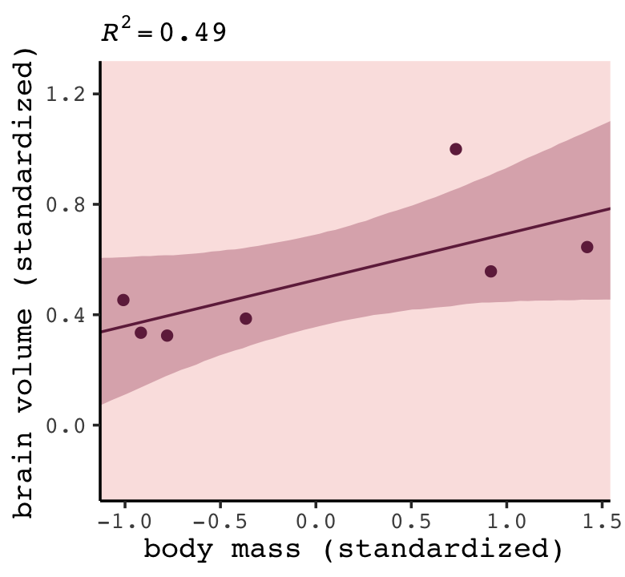
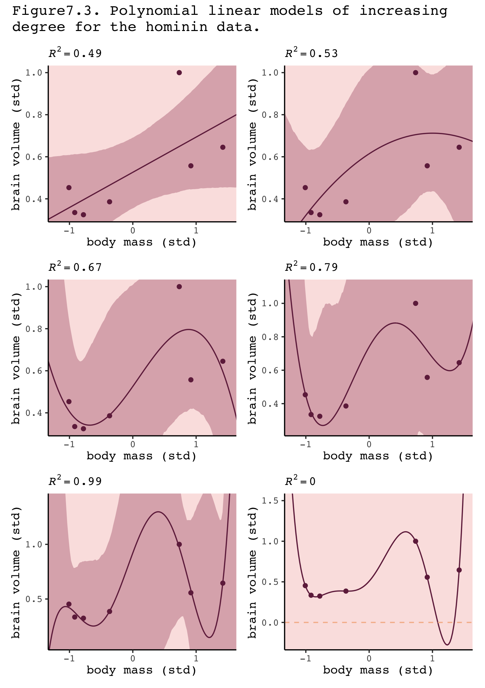
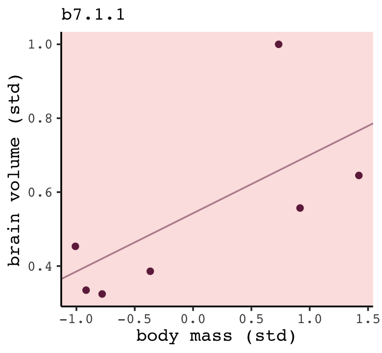
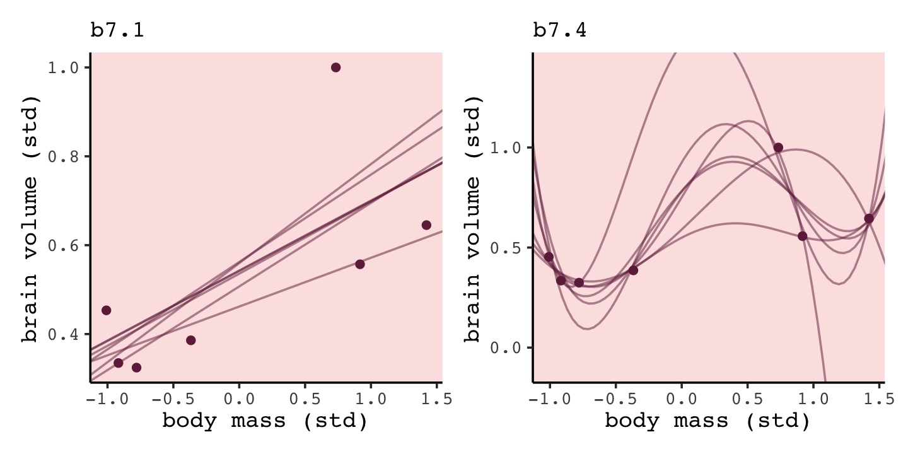

Section 7.1.1: More parameters (almost) always improve fit
================
A Solomon Kurz
2021-01-28

# Ulysses’ Compass

#### Rethinking stargazing.

## The problem with parameters

### 7.1.1 More parameters (almost) always improve fit.

We’ll start off by making the data with brain size and body size for
seven `species`.

``` r
library(tidyverse)

(
  d <- 
  tibble(species = c("afarensis", "africanus", "habilis", "boisei", "rudolfensis", "ergaster", "sapiens"), 
         brain   = c(438, 452, 612, 521, 752, 871, 1350), 
         mass    = c(37.0, 35.5, 34.5, 41.5, 55.5, 61.0, 53.5))
  )
```

    ## # A tibble: 7 x 3
    ##   species     brain  mass
    ##   <chr>       <dbl> <dbl>
    ## 1 afarensis     438  37  
    ## 2 africanus     452  35.5
    ## 3 habilis       612  34.5
    ## 4 boisei        521  41.5
    ## 5 rudolfensis   752  55.5
    ## 6 ergaster      871  61  
    ## 7 sapiens      1350  53.5

Let’s get ready for Figure 7.2. The plots in this chapter will be
characterized by `theme_classic() + theme(text = element_text(family =
"Courier"))`. Our color palette will come from the [**rcartocolor**
package](https://CRAN.R-project.org/package=rcartocolor) (Nowosad,
[2019](#ref-R-rcartocolor)), which provides color schemes [designed by
‘CARTO’](https://carto.com/carto-colors/).

``` r
# install.packages("rcartocolor", dependencies = T)
library(rcartocolor)
```

The specific palette we’ll be using is “BurgYl.” In addition to
palettes, the **rcartocolor** package offers a few convenience functions
which make it easier to use their palettes. The `carto_pal()` function
will return the HEX numbers associated with a given palette’s colors and
the `display_carto_pal()` function will display the actual colors.

``` r
carto_pal(7, "BurgYl")
```

    ## [1] "#fbe6c5" "#f5ba98" "#ee8a82" "#dc7176" "#c8586c" "#9c3f5d" "#70284a"

``` r
display_carto_pal(7, "BurgYl")
```


We’ll be using a diluted version of the third color for the panel
background (i.e., `theme(panel.background = element_rect(fill =
alpha(carto_pal(7, "BurgYl")[3], 1/4)))`) and the darker purples for
other plot elements. Here’s the plot.

``` r
library(ggrepel)

theme_set(
  theme_classic() +
    theme(text = element_text(family = "Courier"),
          panel.background = element_rect(fill = alpha(carto_pal(7, "BurgYl")[3], 1/4)))
)

d %>%
  ggplot(aes(x =  mass, y = brain, label = species)) +
  geom_point(color = carto_pal(7, "BurgYl")[5]) +
  geom_text_repel(size = 3, color = carto_pal(7, "BurgYl")[7], family = "Courier", seed = 438) +
  labs(subtitle = "Average brain volume by body\nmass for six hominin species",
       x = "body mass (kg)",
       y = "brain volume (cc)") +
  xlim(30, 65)
```



Before fitting our models,

> we want to standardize body mass–give it mean zero and standard
> deviation one–and rescale the outcome, brain volume, so that the
> largest observed value is 1. Why not standardize brain volume as well?
> Because we want to preserve zero as a reference point: No brain at
> all. You can’t have negative brain. I don’t think. (p. 195)

``` r
d <-
  d %>% 
  mutate(mass_std  = (mass - mean(mass)) / sd(mass),
         brain_std = brain / max(brain))
```

Our first statistical model will follow the form

> This simply says that the average brain volume \(b_i\) of species
> \(i\) is a linear function of its body mass \(m_i\). Now consider what
> the priors imply. The prior for \(\alpha\) is just centered on the
> mean brain volume (rescaled) in the data. So it says that the average
> species with an average body mass has a brain volume with an 89%
> credible interval from about −1 to 2. That is ridiculously wide and
> includes impossible (negative) values. The prior for \(\beta\) is very
> flat and centered on zero. It allows for absurdly large positive and
> negative relationships. These priors allow for absurd inferences,
> especially as the model gets more complex. And that’s part of the
> lesson. (p. 196)

<delete or replact old paragraph>

Fire up **brms**.

``` r
library(brms)
```

If study McElreath’s **R** code 7.3, you’ll see he is modeling
`log_sigma`, rather than \(\sigma\). With `brms::brm()` probably the
easiest way to do this is with the distributional-modeling syntax.
Though we won’t return to the distributinoal-modeling paradigm until
\[Section 10.2.2\]\[Linking linear models to distributions.\], you can
learn all about it in Bürkner’s
([2020](#ref-Bürkner2020Distributional)[b](#ref-Bürkner2020Distributional))
vignette, [*Estimating distributional models with
brms*](https://cran.r-project.org/package=brms/vignettes/brms_distreg.html).
In short, the distributional-modeling paradigm allows one to define
linear models for all parameters within a likelihood. When using the
Gaussian likelihood, we typically focus on modeling \(\mu\). Turns out
you can model \(\sigma\), too–which we will in later chapters. But for
now, we’ll simply use the distributional-modeling syntax to model
\(\sigma\) with just an intercept, much like we usuallly do. The benefit
from this approach is **brms**, be default, will use the log link for
sigma, which is exactly what McElreath did with his `exp(log_sigma)`
trick.

``` r
b7.1 <- 
  brm(data = d, 
      family = gaussian,
      bf(brain_std ~ 1 + mass_std,
         sigma ~ 1),
      prior = c(prior(normal(0.5, 1), class = Intercept),
                prior(normal(0, 10), class = b),
                prior(normal(0, 1), class = Intercept, dpar = sigma)),
      iter = 2000, warmup = 1000, chains = 4, cores = 4,
      seed = 7,
      file = "/Users/solomonkurz/Dropbox/Recoding Statistical Rethinking 2nd ed/fits/b07.01")
```

Check the model summary.

``` r
print(b7.1)
```

    ##  Family: gaussian 
    ##   Links: mu = identity; sigma = log 
    ## Formula: brain_std ~ 1 + mass_std 
    ##          sigma ~ 1
    ##    Data: d (Number of observations: 7) 
    ## Samples: 4 chains, each with iter = 2000; warmup = 1000; thin = 1;
    ##          total post-warmup samples = 4000
    ## 
    ## Population-Level Effects: 
    ##                 Estimate Est.Error l-95% CI u-95% CI Rhat Bulk_ESS Tail_ESS
    ## Intercept           0.53      0.11     0.30     0.74 1.00     2603     1888
    ## sigma_Intercept    -1.39      0.37    -2.02    -0.58 1.00     1494     1998
    ## mass_std            0.17      0.11    -0.07     0.39 1.00     2436     1780
    ## 
    ## Samples were drawn using sampling(NUTS). For each parameter, Bulk_ESS
    ## and Tail_ESS are effective sample size measures, and Rhat is the potential
    ## scale reduction factor on split chains (at convergence, Rhat = 1).

If you want to see what `sigma_Intercept` looks like when it’s not in
the log metric, just exponentiate.

``` r
fixef(b7.1)["sigma_Intercept", -2] %>% exp()
```

    ##  Estimate      Q2.5     Q97.5 
    ## 0.2500054 0.1320790 0.5577091

As we’ll learn later on, **brms** already has a convenience function for
computing the Bayesian \(R^2\). At this point in the chapter, we’ll
follow along and make a **brms**-centric version of McElreath’s
`R2_is_bad()`. But because part of our version of `R2_is_bad()` will
contain the `brms::predict()` function, I’m going to add a `seed`
argument to make the results more reproducible.

``` r
R2_is_bad <- function(brm_fit, seed = 7, ...) {
  
  set.seed(seed)
  p <- predict(brm_fit, summary = F, ...)
  r <- apply(p, 2, mean) - d$brain_std
  1 - rethinking::var2(r) / rethinking::var2(d$brain_std)
  
}
```

Here’s the estimate for our \(R^2\).

``` r
R2_is_bad(b7.1)
```

    ## [1] 0.4910989

Do note that,

> in principle, the Bayesian approach mandates that we do this for each
> sample from the posterior. But \(R^2\) is traditionally computed only
> at the mean prediction. So we’ll do that as well here. Later in the
> chapter you’ll learn a properly Bayesian score that uses the entire
> posterior distribution. (p. 197)

Now fit the quadratic through the fifth-order polynomial models using
`update()`.

``` r
# quadratic
b7.2 <- 
  update(b7.1,
         newdata = d, 
         formula = bf(brain_std ~ 1 + mass_std + I(mass_std^2),
                      sigma ~ 1),
         iter = 2000, warmup = 1000, chains = 4, cores = 4,
         seed = 7,
         file = "/Users/solomonkurz/Dropbox/Recoding Statistical Rethinking 2nd ed/fits/b07.02")

# cubic
b7.3 <- 
  update(b7.1,
         newdata = d, 
         formula = bf(brain_std ~ 1 + mass_std + I(mass_std^2) + I(mass_std^3),
                      sigma ~ 1),
         iter = 2000, warmup = 1000, chains = 4, cores = 4,
         seed = 7,
         control = list(adapt_delta = .99),
         file = "/Users/solomonkurz/Dropbox/Recoding Statistical Rethinking 2nd ed/fits/b07.03")

# fourth-order
b7.4 <- 
  update(b7.1,
         newdata = d, 
         formula = bf(brain_std ~ 1 + mass_std + I(mass_std^2) + I(mass_std^3) + I(mass_std^4),
                      sigma ~ 1),
         iter = 2000, warmup = 1000, chains = 4, cores = 4,
         seed = 7,
         control = list(adapt_delta = .99),
         file = "/Users/solomonkurz/Dropbox/Recoding Statistical Rethinking 2nd ed/fits/b07.04")

# fifth-order
b7.5 <- 
  update(b7.1,
         newdata = d, 
         formula = bf(brain_std ~ 1 + mass_std + I(mass_std^2) + I(mass_std^3) + I(mass_std^4) + I(mass_std^5),
                      sigma ~ 1),
         iter = 2000, warmup = 1000, chains = 4, cores = 4,
         seed = 7,
         control = list(adapt_delta = .999,
                        max_treedepth = 11),
         file = "/Users/solomonkurz/Dropbox/Recoding Statistical Rethinking 2nd ed/fits/b07.05")
```

You may have noticed we fiddled with the `adapt_delta` and
`max_treedepth` settings for some of the models. When you try to fit
complex models with few data points and wide priors, that can cause
difficulties for Stan. I’m not going to get into the details on what
`adapt_delta` and `max_treedepth` do, right now. But they’ll make
appearances in later chapters and we’ll more formally introduce them in
\[Section 13.4.2\]\[Non-centered chimpanzees.\].

Now returning to the text,

> That last model, `m7.6`, has one trick in it. The standard deviation
> is replaced with a constant value 0.001. The model will not work
> otherwise, for a very important reason that will become clear as we
> plot these monsters. (p. 198)

By “last model, `m7.6`,” McElreath was referring to the sixth-order
polynomial, fit on page 199. McElreath’s **rethinking** package is set
up so the syntax is simple to replacing \(\sigma\) with a constant
value. We can do this with **brms**, too, but it’ll take more effort. If
we want to fix \(\sigma\) to a constant, we’ll need to define a custom
likelihood. Bürkner explained how to do so in his
([2020](#ref-Bürkner2020Define)[a](#ref-Bürkner2020Define)) vignette,
[*Define custom response distributions with
brms*](https://CRAN.R-project.org/package=brms/vignettes/brms_customfamilies.html).
I’m not going to explain this in great detail, here. In brief, first we
use the `custom_family()` function to define the name and parameters of
a `custom_normal()` likelihood that will set \(\sigma\) to a constant
value, 0.001. Second, we’ll define some functions for Stan which are not
defined in Stan itself and save them as `stan_funs`. Third, we make a
`stanvar()` statement which will allow us to pass our `stan_funs` to
`brm()`.

``` r
custom_normal <- custom_family(
  "custom_normal", dpars = "mu",
  links = "identity",
  type = "real"
)

stan_funs  <- "real custom_normal_lpdf(real y, real mu) {
  return normal_lpdf(y | mu, 0.001);
}
real custom_normal_rng(real mu) {
  return normal_rng(mu, 0.001);
}
" 

stanvars <- stanvar(scode = stan_funs, block = "functions")
```

Now we can fit the model by setting `family = custom_normal`. Note that
since we’ve set \(\sigma = 0.001\), we don’t need to include a prior for
\(\sigma\). Also notice our `stanvars = stanvars` line.

``` r
b7.6 <- 
  brm(data = d, 
      family = custom_normal,
      brain_std ~ 1 + mass_std + I(mass_std^2) + I(mass_std^3) + I(mass_std^4) + I(mass_std^5) + I(mass_std^6),
      prior = c(prior(normal(0.5, 1), class = Intercept),
                prior(normal(0, 10), class = b)),
      iter = 2000, warmup = 1000, chains = 4, cores = 4,
      seed = 7,
      stanvars = stanvars,
      file = "/Users/solomonkurz/Dropbox/Recoding Statistical Rethinking 2nd ed/fits/b07.06")
```

Before we can do our variant of Figure 7.3, we’ll need to define a few
more custom functions to work with `b7.6`. The
`posterior_epred_custom_normal()` function is required for
`brms::fitted()` to work with our `family = custom_normal` `brmsfit`
object. Same thing for `posterior_predict_custom_normal()` and
`brms::predict()`. Though we won’t need it until [Section
7.2.5](#scoring-the-right-data.), we’ll also define
`log_lik_custom_normal` so we can use the `log_lik()` function for any
models fit with `family = custom_normal`. Before all that, we need to
throw in a line with the `expose_functions()` function. If you want to
understand why, read up in Bürkner’s
([2020](#ref-Bürkner2020Define)[a](#ref-Bürkner2020Define)) vignette.
For now, just go with it.

``` r
expose_functions(b7.6, vectorize = TRUE)

posterior_epred_custom_normal <- function(prep) {
  mu <- prep$dpars$mu
  mu 
}

posterior_predict_custom_normal <- function(i, prep, ...) {
  mu <- prep$dpars$mu
  mu 
  custom_normal_rng(mu)
}

log_lik_custom_normal <- function(i, prep) {
  mu <- prep$dpars$mu
  y <- prep$data$Y[i]
  custom_normal_lpdf(y, mu)
}
```

Okay, here’s how we might plot the result for the first model, `b7.1`.

``` r
library(tidybayes)

nd <- tibble(mass_std = seq(from = -2, to = 2, length.out = 100))

fitted(b7.1, 
       newdata = nd, 
       probs = c(.055, .945)) %>% 
  data.frame() %>% 
  bind_cols(nd) %>% 
  
  ggplot(aes(x = mass_std, y = Estimate)) +
  geom_lineribbon(aes(ymin = Q5.5, ymax = Q94.5),
                  color = carto_pal(7, "BurgYl")[7], size = 1/2, 
                  fill = alpha(carto_pal(7, "BurgYl")[6], 1/3)) +
  geom_point(data = d,
             aes(y = brain_std),
             color = carto_pal(7, "BurgYl")[7]) +
  labs(subtitle = bquote(italic(R)^2==.(round(R2_is_bad(b7.1), digits = 2))),
       x = "body mass (standardized)",
       y = "brain volume (standardized)") +
  coord_cartesian(xlim = range(d$mass_std))
```



To slightly repurpose a quote from McElreath:

> We’ll want to do this for the next several models, so let’s write a
> function to make it repeatable. If you find yourself writing code more
> than once, it is usually saner to write a function and call the
> function more than once instead. (p. 197)

Our `make_figure7.3()` function will wrap the simulation, data
wrangling, and plotting code all in one. It takes two arguments, the
first of which defines which fit object we’d like to plot. If you look
closely at Figure 7.3 in the text, you’ll notice that the range of the
\(y\)-axis changes in the last three plots. Our second argument, `ylim`,
will allow us to vary those parameters across subplots.

``` r
make_figure7.3 <- function(brms_fit, ylim = range(d$brain_std)) {
  
  # compute the R2
  r2 <- R2_is_bad(brms_fit)
  
  # define the new data 
  nd <- tibble(mass_std = seq(from = -2, to = 2, length.out = 200))
  
  # simulate and wrangle
  fitted(brms_fit, newdata = nd, probs = c(.055, .945)) %>% 
    data.frame() %>% 
    bind_cols(nd) %>% 
    
    # plot!  
    ggplot(aes(x = mass_std)) +
    geom_lineribbon(aes(y = Estimate, ymin = Q5.5, ymax = Q94.5),
                    color = carto_pal(7, "BurgYl")[7], size = 1/2, 
                    fill = alpha(carto_pal(7, "BurgYl")[6], 1/3)) +
    geom_point(data = d,
               aes(y = brain_std),
               color = carto_pal(7, "BurgYl")[7]) +
    labs(subtitle = bquote(italic(R)^2==.(round(r2, digits = 2))),
         x = "body mass (std)",
         y = "brain volume (std)") +
    coord_cartesian(xlim = c(-1.2, 1.5),
                    ylim = ylim)
  
}
```

Here we make and save the six subplots in bulk.

``` r
p1 <- make_figure7.3(b7.1)
p2 <- make_figure7.3(b7.2)
p3 <- make_figure7.3(b7.3)
p4 <- make_figure7.3(b7.4, ylim = c(.25, 1.1))
p5 <- make_figure7.3(b7.5, ylim = c(.1, 1.4))
p6 <- make_figure7.3(b7.6, ylim = c(-0.25, 1.5)) +
  geom_hline(yintercept = 0, color = carto_pal(7, "BurgYl")[2], linetype = 2) 
```

Now use **patchwork** syntax to bundle them all together.

``` r
library(patchwork)

((p1 | p2) / (p3 | p4) / (p5 | p6)) +
  plot_annotation(title = "Figure7.3. Polynomial linear models of increasing\ndegree for the hominin data.")
```



It’s not clear, to me, why our **brms**-based 89% intervals are so much
broader than those in the text. But if you do fit the size models with
`rethinking::quap()` and compare the summaries, you’ll see our
**brms**-based parameters are systemically less certain than those fit
with `quap()`. In you have an answer or perhaps even an alternative
workflow to solve the issue, [share on
GitHub](https://github.com/ASKurz/Statistical_Rethinking_with_brms_ggplot2_and_the_tidyverse_2_ed/issues).

If you really what the axes scaled in the original metrics of the
variables rather than their standardized form, you can use the
re-scaling techniques from back in \[Section 4.5.1.0.1\]\[Overthinking:
Converting back to natural scale.\].

“This is a general phenomenon: If you adopt a model family with enough
parameters, you can fit the data exactly. But such a model will make
rather absurd predictions for yet-to-be-observed cases” (pp. 199–201).

#### Rethinking: Model fitting as compression.

> Another perspective on the absurd model just above is to consider that
> model fitting can be considered a form of **data compression**.
> Parameters summarize relationships among the data. These summaries
> compress the data into a simpler form, although with loss of
> information (“lossy” compression) about the sample. The parameters can
> then be used to generate new data, effectively decompressing the data.
> (p. 201, **emphasis** in the original)

### Too few parameters hurts, too.

> The overfit polynomial models fit the data extremely well, but they
> suffer for this within-sample accuracy by making nonsensical
> out-of-sample predictions. In contrast, **underfitting** produces
> models that are inaccurate both within and out of sample. They learn
> too little, failing to recover regular features of the sample.
> (p. 201, **emphasis** in the original)

To explore the distinctions between overfitting and underfitting, we’ll
need to refit `b7.1` and `b7.4` several times after serially dropping
one of the rows in the data. You can `filter()` by `row_number()` to
drop rows in a [**tidyverse** kind of
way](https://dplyr.tidyverse.org/reference/slice.html). For example, we
can drop the second row of `d` like this.

``` r
 d %>%
  mutate(row = 1:n()) %>% 
  filter(row_number() != 2)
```

    ## # A tibble: 6 x 6
    ##   species     brain  mass mass_std brain_std   row
    ##   <chr>       <dbl> <dbl>    <dbl>     <dbl> <int>
    ## 1 afarensis     438  37     -0.779     0.324     1
    ## 2 habilis       612  34.5   -1.01      0.453     3
    ## 3 boisei        521  41.5   -0.367     0.386     4
    ## 4 rudolfensis   752  55.5    0.917     0.557     5
    ## 5 ergaster      871  61      1.42      0.645     6
    ## 6 sapiens      1350  53.5    0.734     1         7

In his **Overthinking: Dropping rows** box (p. 202), McElreath
encouraged us to take a look at the `brain_loo_plot()` function to get a
sense of how he made his Figure 7.4. Here it is.

``` r
library(rethinking)
brain_loo_plot
```

    ## function (fit, atx = c(35, 47, 60), aty = c(450, 900, 1300), 
    ##     xlim, ylim, npts = 100) 
    ## {
    ##     post <- extract.samples(fit)
    ##     n <- dim(post$b)[2]
    ##     if (is.null(n)) 
    ##         n <- 1
    ##     if (missing(xlim)) 
    ##         xlim <- range(d$mass_std)
    ##     else xlim <- (xlim - mean(d$mass))/sd(d$mass)
    ##     if (missing(ylim)) 
    ##         ylim <- range(d$brain_std)
    ##     else ylim <- ylim/max(d$brain)
    ##     plot(d$brain_std ~ d$mass_std, xaxt = "n", yaxt = "n", xlab = "body mass (kg)", 
    ##         ylab = "brain volume (cc)", col = rangi2, pch = 16, xlim = xlim, 
    ##         ylim = ylim)
    ##     axis_unscale(1, atx, d$mass)
    ##     axis_unscale(2, at = aty, factor = max(d$brain))
    ##     d <- as.data.frame(fit@data)
    ##     for (i in 1:nrow(d)) {
    ##         di <- d[-i, ]
    ##         m_temp <- quap(fit@formula, data = di, start = list(b = rep(0, 
    ##             n)))
    ##         xseq <- seq(from = xlim[1] - 0.2, to = xlim[2] + 0.2, 
    ##             length.out = npts)
    ##         l <- link(m_temp, data = list(mass_std = xseq), refresh = 0)
    ##         mu <- apply(l, 2, mean)
    ##         lines(xseq, mu, lwd = 2, col = col.alpha("black", 0.3))
    ##     }
    ##     model_name <- deparse(match.call()[[2]])
    ##     mtext(model_name, adj = 0)
    ## }
    ## <bytecode: 0x1265694e0>
    ## <environment: namespace:rethinking>

Though we’ll be taking a slightly different route than the one outlined
in McElreath’s `brain_loo_plot()` function, we can glean some great
insights. For example, we’ll be refitting our **brms** models with
`update()`.

``` r
b7.1.1 <- 
  update(b7.1,
         newdata = filter(d, row_number() != 1), 
         iter = 2000, warmup = 1000, chains = 4, cores = 4,
         seed = 7,
         file = "/Users/solomonkurz/Dropbox/Recoding Statistical Rethinking 2nd ed/fits/b07.01.1")

print(b7.1.1)
```

    ##  Family: gaussian 
    ##   Links: mu = identity; sigma = log 
    ## Formula: brain_std ~ 1 + mass_std 
    ##          sigma ~ 1
    ##    Data: filter(d, row_number() != 1) (Number of observations: 6) 
    ## Samples: 4 chains, each with iter = 2000; warmup = 1000; thin = 1;
    ##          total post-warmup samples = 4000
    ## 
    ## Population-Level Effects: 
    ##                 Estimate Est.Error l-95% CI u-95% CI Rhat Bulk_ESS Tail_ESS
    ## Intercept           0.54      0.15     0.25     0.84 1.00     1699     1297
    ## sigma_Intercept    -1.24      0.43    -1.95    -0.28 1.00      990      990
    ## mass_std            0.16      0.15    -0.16     0.46 1.00     2306     1347
    ## 
    ## Samples were drawn using sampling(NUTS). For each parameter, Bulk_ESS
    ## and Tail_ESS are effective sample size measures, and Rhat is the potential
    ## scale reduction factor on split chains (at convergence, Rhat = 1).

You can see by the `newdata` statement that `b7.1.1` is fit on the `d`
data after dropping the first row. Here’s how we might amend out
plotting strategy from before to visualize the posterior mean for the
model-implied trajectory.

``` r
fitted(b7.1.1, 
       newdata = nd) %>% 
  data.frame() %>% 
  bind_cols(nd) %>% 
  
  ggplot(aes(x = mass_std)) +
  geom_line(aes(y = Estimate),
            color = carto_pal(7, "BurgYl")[7], size = 1/2, alpha = 1/2) +
  geom_point(data = d,
             aes(y = brain_std),
             color = carto_pal(7, "BurgYl")[7]) +
  labs(subtitle = "b7.1.1",
       x = "body mass (std)",
       y = "brain volume (std)") +
  coord_cartesian(xlim = range(d$mass_std),
                  ylim = range(d$brain_std))
```



``` r
brain_loo_lines <- function(brms_fit, row, ...) {
  
  # refit the model
  new_fit <- 
    update(brms_fit,
           newdata = filter(d, row_number() != row), 
           iter = 2000, warmup = 1000, chains = 4, cores = 4,
           seed = 7,
           refresh = 0,
           ...)
  
  # pull the lines values
  fitted(new_fit, 
         newdata = nd) %>% 
    data.frame() %>% 
    select(Estimate) %>% 
    bind_cols(nd)
  
}
```

Here’s how `brain_loo_lines()` works.

``` r
brain_loo_lines(b7.1, row = 1) %>% 
  glimpse()
```

    ## Rows: 100
    ## Columns: 2
    ## $ Estimate <dbl> 0.2278528, 0.2342173, 0.2405819, 0.2469465, 0.2533110, 0.2596756, 0.2660402, 0.2…
    ## $ mass_std <dbl> -2.0000000, -1.9595960, -1.9191919, -1.8787879, -1.8383838, -1.7979798, -1.75757…

Working within the **tidyverse** paradigm, we’ll make a tibble with the
predefined `row` values. We will then use `purrr::map()` to plug those
`row` values into `brain_loo_lines()`, which will return the desired
posterior `mean` values for each corresponding value of `mass_std`. Here
we do that for both `b7.1` and `b7.4`.

``` r
b7.1_fits <-
  tibble(row = 1:7) %>% 
  mutate(post = purrr::map(row, ~brain_loo_lines(brms_fit = b7.1, row = .))) %>% 
  unnest(post)

b7.4_fits <-
  tibble(row = 1:7) %>% 
  mutate(post = purrr::map(row, ~brain_loo_lines(brms_fit = b7.4, 
                                                 row = ., 
                                                 control = list(adapt_delta = .99)))) %>% 
  unnest(post)
```

Now for each, pump those values into `ggplot()`, customize the settings,
and combine the two ggplots to make the full Figure 7.4.

``` r
# left
p1 <-
  b7.1_fits %>%  
  
  ggplot(aes(x = mass_std)) +
  geom_line(aes(y = Estimate, group = row),
            color = carto_pal(7, "BurgYl")[7], size = 1/2, alpha = 1/2) +
  geom_point(data = d,
             aes(y = brain_std),
             color = carto_pal(7, "BurgYl")[7]) +
  labs(subtitle = "b7.1",
       x = "body mass (std)",
       y = "brain volume (std)") +
  coord_cartesian(xlim = range(d$mass_std),
                  ylim = range(d$brain_std))

# right
p2 <-
  b7.4_fits %>%  
  
  ggplot(aes(x = mass_std, y = Estimate)) +
  geom_line(aes(group = row),
            color = carto_pal(7, "BurgYl")[7], size = 1/2, alpha = 1/2) +
  geom_point(data = d,
             aes(y = brain_std),
             color = carto_pal(7, "BurgYl")[7]) +
  labs(subtitle = "b7.4",
       x = "body mass (std)",
       y = "brain volume (std)") +
  coord_cartesian(xlim = range(d$mass_std),
                  ylim = c(-0.1, 1.4))

# combine
p1 + p2
```



“Notice that the straight lines hardly vary, while the curves fly about
wildly. This is a general contrast between underfit and overfit models:
sensitivity to the exact composition of the sample used to fit the
model” (p. 201).

#### Rethinking: Bias and variance.

> The underfitting/overfitting dichotomy is often described as the
> **bias-variance trade-off**. While not exactly the same distinction,
> the bias-variance trade-off addresses the same problem. “Bias” is
> related to underfitting, while “variance” is related to overfitting.
> These terms are confusing, because they are used in many different
> ways in different contexts, even within statistics. The term “bias”
> also sounds like a bad thing, even though increasing bias often leads
> to better predictions. (p. 201, **emphasis** in the original)

Take a look at Yarkoni & Westfall
([2017](#ref-yarkoniChoosingPredictionExplanation2017)) for more on the
bias-variance trade-off. As McElreath indicated in his endnote \#104
(p. 563), Hastie, Tibshirani and Friedman
([2009](#ref-hastie2009elements)) broadly cover these ideas in their
freely-downloadable text, [*The elements of statistical
learning*](https://link.springer.com/book/10.1007%2F978-0-387-84858-7).

## Entropy and accuracy

> So how do we navigate between the hydra of overfitting and the vortex
> of underfitting? Whether you end up using regularization or
> information criteria or both, the first thing you must do is pick a
> criterion of model performance. What do you want the model to do well
> at? We’ll call this criterion the *target*, and in this section you’ll
> see how information theory provides a common and useful target.
> (p. 202, *emphasis* in the original)

### Firing the weatherperson.

If you let rain = 1 and sun = 0, here’s a way to make a plot of the
first table of page 203, the weatherperson’s predictions.

``` r
weatherperson <-
  tibble(day        = 1:10,
         prediction = rep(c(1, 0.6), times = c(3, 7)),
         observed   = rep(c(1, 0), times = c(3, 7))) 

weatherperson %>% 
  pivot_longer(-day) %>%
  
  ggplot(aes(x = day, y = name, fill = value)) +
  geom_tile(color = "white") +
  geom_text(aes(label = value, color = value == 0)) +
  scale_x_continuous(breaks = 1:10, expand = c(0, 0)) +
  scale_y_discrete(NULL, expand = c(0, 0)) +
  scale_fill_viridis_c(direction = -1) +
  scale_color_manual(values = c("white", "black")) +
  theme(legend.position = "none",
        axis.ticks.y = element_blank())
```


Here’s how the newcomer fared:

``` r
newcomer <-
  tibble(day        = 1:10,
         prediction = 0,
         observed   = rep(c(1, 0), times = c(3, 7)))

newcomer %>% 
  pivot_longer(-day) %>%
  
  ggplot(aes(x = day, y = name, fill = value)) +
  geom_tile(color = "white") +
  geom_text(aes(label = value, color = value == 0)) +
  scale_x_continuous(breaks = 1:10, expand = c(0, 0)) +
  scale_y_discrete(NULL, expand = c(0, 0)) +
  scale_fill_viridis_c(direction = -1) +
  scale_color_manual(values = c("white", "black")) +
  theme(legend.position = "none",
        axis.ticks.y = element_blank())
```


If we do the math entailed in the tibbles, we’ll see why the newcomer
could boast “I’m the best person for the job” (p. 203).

``` r
weatherperson %>% 
  bind_rows(newcomer) %>% 
  mutate(person = rep(c("weatherperson", "newcomer"), each = n()/2),
         hit    = ifelse(prediction == observed, 1, 1 - prediction - observed)) %>% 
  group_by(person) %>% 
  summarise(hit_rate = mean(hit))
```

    ## # A tibble: 2 x 2
    ##   person        hit_rate
    ##   <chr>            <dbl>
    ## 1 newcomer          0.7 
    ## 2 weatherperson     0.58

#### Costs and benefits.

Our new `points` variable doesn’t fit into the nice color-based
`geom_tile()` plots from above, but we can still do the math.

``` r
bind_rows(weatherperson,
          newcomer) %>% 
  mutate(person = rep(c("weatherperson", "newcomer"), each = n()/2),
         points = ifelse(observed == 1 & prediction != 1, -5,
                         ifelse(observed == 1 & prediction == 1, -1,
                                -1 * prediction))) %>% 
  group_by(person) %>% 
  summarise(happiness = sum(points))
```

    ## # A tibble: 2 x 2
    ##   person        happiness
    ##   <chr>             <dbl>
    ## 1 newcomer          -15  
    ## 2 weatherperson      -7.2

#### Measuring accuracy.

> Consider computing the probability of predicting the exact sequence of
> days. This means computing the probability of a correct prediction for
> each day. Then multiply all of these probabilities together to get the
> joint probability of correctly predicting the observed sequence. This
> is the same thing as the joint likelihood, which you’ve been using up
> to this point to fit models with Bayes’ theorem. This is the
> definition of accuracy that is maximized by the correct model.
> 
> In this light, the newcomer looks even worse. (p. 204)

``` r
bind_rows(weatherperson,
          newcomer) %>% 
  mutate(person = rep(c("weatherperson", "newcomer"), each = n() / 2),
         hit    = ifelse(prediction == observed, 1, 1 - prediction - observed)) %>% 
  count(person, hit) %>% 
  mutate(power = hit ^ n,
         term  = rep(letters[1:2], times = 2)) %>% 
  select(person, term, power) %>% 
  pivot_wider(names_from = term,
              values_from = power) %>% 
  mutate(probability_correct_sequence = a * b)
```

    ## # A tibble: 2 x 4
    ##   person              a     b probability_correct_sequence
    ##   <chr>           <dbl> <dbl>                        <dbl>
    ## 1 newcomer      0           1                      0      
    ## 2 weatherperson 0.00164     1                      0.00164

### Information and uncertainty.

Within the context of information theory (Shannon,
[1948](#ref-shannonMathematicalTheoryCommunication1948); also Cover &
Thomas, [2006](#ref-cover2006elements)), information is “the reduction
in uncertainty when we learn an outcome” (p. 205). **Information
entropy** is a way of measuring that uncertainty in a way that is (a)
continuous, (b) increases as the number of possible events increases,
and (c) is additive. The formula for information entropy is:

\[H(p) = - \text E \log (p_i) = - \sum_{i = 1}^n p_i \log (p_i).\]

McElreath put it in words as: “The uncertainty contained in a
probability distribution is the average log-probability of an event.”
(p. 206). We’ll compute the information entropy for weather at the first
unnamed location, which we’ll call `McElreath's house`, and `Abu Dhabi`
at once.

``` r
tibble(place  = c("McElreath's house", "Abu Dhabi"),
       p_rain = c(.3, .01)) %>% 
  mutate(p_shine = 1 - p_rain) %>% 
  group_by(place) %>% 
  mutate(h_p = (p_rain * log(p_rain) + p_shine * log(p_shine)) %>% mean() * -1)
```

    ## # A tibble: 2 x 4
    ## # Groups:   place [2]
    ##   place             p_rain p_shine    h_p
    ##   <chr>              <dbl>   <dbl>  <dbl>
    ## 1 McElreath's house   0.3     0.7  0.611 
    ## 2 Abu Dhabi           0.01    0.99 0.0560

Did you catch how we used the equation
\(H(p) = - \sum_{i = 1}^n p_i \log (p_i)\) in our `mutate()` code,
there? Our computation indicated the uncertainty is less in Abu Dhabi
because it rarely rains, there. If you have sun, rain and snow, the
entropy for weather is:

``` r
p <- c(.7, .15, .15)
-sum(p * log(p))
```

    ## [1] 0.8188085

“These entropy values by themselves don’t mean much to us, though.
Instead we can use them to build a measure of accuracy. That comes next”
(p. 206).

### From entropy to accuracy.

> How can we use information entropy to say how far a model is from the
> target? The key lies in **divergence**:
> 
> > **Divergence**: The additional uncertainty induced by using
> > probabilities from one distribution to describe another
> > distribution.
> 
> This is often known as *Kullback-Leibler divergence* or simply KL
> divergence. (p. 207, **emphasis** in the original, see Kullback &
> Leibler, [1951](#ref-kullbackInformationSufficiency1951))

The formula for the KL divergence is

\[D_\text{KL} (p, q) = \sum_i p_i \big ( \log (p_i) - \log (q_i) \big ) = \sum_i p_i \log \left ( \frac{p_i}{q_i} \right ),\]

which is what McElreath described in plainer language as “the average
difference in log probability between the target (\(p\)) and model
(\(q\))” (p. 207).

In McElreath’s initial example

  - \(p_1 = .3\),
  - \(p_2 = .7\),
  - \(q_1 = .25\), and
  - \(q_2 = .75\).

With those values, we can compute \(D_\text{KL} (p, q)\) within a tibble
like so:

``` r
tibble(p_1 = .3,
       p_2 = .7,
       q_1 = .25,
       q_2 = .75) %>%
  mutate(d_kl = (p_1 * log(p_1 / q_1)) + (p_2 * log(p_2 / q_2)))
```

    ## # A tibble: 1 x 5
    ##     p_1   p_2   q_1   q_2    d_kl
    ##   <dbl> <dbl> <dbl> <dbl>   <dbl>
    ## 1   0.3   0.7  0.25  0.75 0.00640

Our systems in this section are binary (e.g., \(q = \{ q_i, q_2 \}\)).
Thus if you know \(q_1 = .3\) you know of a necessity \(q_2 = 1 - q_1\).
Therefore we can code the tibble for the next example, for when
\(p = q\), like this.

``` r
tibble(p_1 = .3) %>% 
  mutate(p_2 = 1 - p_1,
         q_1 = p_1) %>% 
  mutate(q_2 = 1 - q_1) %>%
  mutate(d_kl = (p_1 * log(p_1 / q_1)) + (p_2 * log(p_2 / q_2)))
```

    ## # A tibble: 1 x 5
    ##     p_1   p_2   q_1   q_2  d_kl
    ##   <dbl> <dbl> <dbl> <dbl> <dbl>
    ## 1   0.3   0.7   0.3   0.7     0

Building off of that, you can make the data required for Figure 7.6 like
this.

``` r
t <- 
  tibble(p_1 = .3,
         p_2 = .7,
         q_1 = seq(from = .01, to = .99, by = .01)) %>% 
  mutate(q_2 = 1 - q_1) %>%
  mutate(d_kl = (p_1 * log(p_1 / q_1)) + (p_2 * log(p_2 / q_2)))

head(t)
```

    ## # A tibble: 6 x 5
    ##     p_1   p_2   q_1   q_2  d_kl
    ##   <dbl> <dbl> <dbl> <dbl> <dbl>
    ## 1   0.3   0.7  0.01  0.99 0.778
    ## 2   0.3   0.7  0.02  0.98 0.577
    ## 3   0.3   0.7  0.03  0.97 0.462
    ## 4   0.3   0.7  0.04  0.96 0.383
    ## 5   0.3   0.7  0.05  0.95 0.324
    ## 6   0.3   0.7  0.06  0.94 0.276

Now we have the data, plotting Figure 7.6 is a just `geom_line()` with
stylistic flourishes.

``` r
t %>% 
  ggplot(aes(x = q_1, y = d_kl)) +
  geom_vline(xintercept = .3, color = carto_pal(7, "BurgYl")[5], linetype = 2) +
  geom_line(color = carto_pal(7, "BurgYl")[7], size = 1.5) +
  annotate(geom = "text", x = .4, y = 1.5, label = "q = p",
           color = carto_pal(7, "BurgYl")[5], family = "Courier", size = 3.5) +
  labs(x = "q[1]",
       y = "Divergence of q from p")
```


> What divergence can do for us now is help us contrast different
> approximations to \(p\). As an approximating function \(q\) becomes
> more accurate, \(D_\text{KL} (p, q)\) will shrink. So if we have a
> pair of candidate distributions, then the candidate that minimizes the
> divergence will be closest to the target. Since predictive models
> specify probabilities of events (observations), we can use divergence
> to compare the accuracy of models. (p. 208)

#### Rethinking: Divergence depends upon direction.

Here we see \(H(p, q) \neq H(q, p)\). That is, direction matters.

``` r
tibble(direction = c("Earth to Mars", "Mars to Earth"),
       p_1       = c(.01, .7),
       q_1       = c(.7, .01)) %>% 
  mutate(p_2 = 1 - p_1,
         q_2 = 1 - q_1) %>%
  mutate(d_kl = (p_1 * log(p_1 / q_1)) + (p_2 * log(p_2 / q_2)))
```

    ## # A tibble: 2 x 6
    ##   direction       p_1   q_1   p_2   q_2  d_kl
    ##   <chr>         <dbl> <dbl> <dbl> <dbl> <dbl>
    ## 1 Earth to Mars  0.01  0.7   0.99  0.3   1.14
    ## 2 Mars to Earth  0.7   0.01  0.3   0.99  2.62

The \(D_\text{KL}\) was double when applying Martian estimates to Terran
estimates.

> An important practical consequence of this asymmetry, in a model
> fitting context, is that if we use a distribution with high entropy to
> approximate an unknown true distribution of events, we will reduce the
> distance to the truth and therefore the error. This fact will help us
> build generalized linear models, later on in \[Chapter 10\]\[Big
> Entropy and the Generalized Linear Model\]. (p. 209)

### Estimating divergence.

> The point of all the preceding material about information theory and
> divergence is to establish both:
> 
> 1.  How to measure the distance of a model from our target.
>     Information theory gives us the distance measure we need, the KL
>     divergence.
> 
> 2.  How to estimate the divergence. Having identified the right
>     measure of distance, we now need a way to estimate it in real
>     statistical modeling tasks. (p. 209)

Now we’ll start working on item \#2.

Within the context of science, say we’ve labeled the true model for our
topic of interest as \(p\). We don’t actually know what \(p\) is–we
wouldn’t need the scientific method if we did. But say what we do have
are two candidate models \(q\) and \(r\). We would at least like to know
which is closer to \(p\). It turns out we don’t even need to know the
absolute value of \(p\) to achieve this. Just the relative values of
\(q\) and \(r\) will suffice. We express model \(q\)’s average
log-probability as \(\text E \log (q_i)\). Extrapolating, the difference
\(\text E \log (q_i) - \text E \log (r_i)\) gives us a sense about the
divergence of both \(q\) and \(r\) from the target \(p\). That is, “we
can compare the average log-probability from each model to get an
estimate of the relative distance of each model from the target”
(p. 210). **Deviance** and related statistics can help us towards this
end. We define deviance as

\[D(q) = -2 \sum_i \log (q_i),\]

where \(i\) indexes each case and \(q_i\) is the likelihood for each
case. Here’s the deviance from the OLS version of model `m7.1`.

``` r
lm(data = d, brain_std ~ mass_std) %>% 
  logLik() * -2
```

    ## 'log Lik.' -5.985049 (df=3)

In our \(D(q)\) formula, did you notice how we ended up multiplying
\(\sum_i \log (p_i)\) by \(-2\)? Frequentists and Bayesians alike make
use of information theory, KL divergence, and deviance. It turns out
that the differences between two \(D(q)\) values follows a \(\chi^2\)
distribution (Wilks,
[1938](#ref-wilksLargesampleDistributionLikelihood1938)), which
frequentists like to reference for the purpose of null-hypothesis
significance testing. Many Bayesians, however, are not into all that
significance-testing stuff and they aren’t as inclined to multiply
\(\sum_i \log (p_i)\) by \(-2\) for the simple purpose of scaling the
associated difference distribution to follow the \(\chi^2\). If we leave
that part out of the equation, we end up with

\[S(q) = \sum_i \log (q_i),\]

which we can think of as a log-probability score which is “the gold
standard way to compare the predictive accuracy of different models. It
is an estimate of \(\text E \log (q_i)\), just without the final step of
dividing by the number of observations” (p. 210). When Bayesians compute
\(S(q)\), they do so over the entire posterior distribution. “Doing this
calculation correctly requires a little subtlety. The **rethinking**
package has a function called
`lppd`–**log-pointwise-predictive-density**–to do this calculation for
quap models” (p. 210, **emhasis** in the original for the second time,
but not the first). However, I’m now aware of a similar function within
**brms**. If you’re willing to roll up your sleeves, a little, you can
do it by hand. Here’s an example with `b7.1`.

``` r
log_lik(b7.1) %>% 
  data.frame() %>% 
  set_names(pull(d, species)) %>% 
  pivot_longer(everything(),
               names_to = "species",
               values_to = "logprob") %>% 
  mutate(prob = exp(logprob)) %>% 
  group_by(species) %>% 
  summarise(log_probability_score = mean(prob) %>% log())
```

    ## # A tibble: 7 x 2
    ##   species     log_probability_score
    ##   <chr>                       <dbl>
    ## 1 afarensis                   0.370
    ## 2 africanus                   0.393
    ## 3 boisei                      0.384
    ## 4 ergaster                    0.205
    ## 5 habilis                     0.308
    ## 6 rudolfensis                 0.251
    ## 7 sapiens                    -0.583

“If you sum these values, you’ll have the total log-probability score
for the model and data” (p. 210). Here we sum those \(\log (q_i)\)
values up to compute \(S(q)\).

``` r
log_lik(b7.1) %>% 
  data.frame() %>% 
  set_names(pull(d, species)) %>% 
  pivot_longer(everything(),
               names_to = "species",
               values_to = "logprob") %>% 
  mutate(prob = exp(logprob)) %>% 
  group_by(species) %>% 
  summarise(log_probability_score = mean(prob) %>% log()) %>% 
  summarise(total_log_probability_score = sum(log_probability_score))
```

    ## # A tibble: 1 x 1
    ##   total_log_probability_score
    ##                         <dbl>
    ## 1                        1.33

#### Overthinking: Computing the lppd.

The Bayesian version of the log-probability score, what we’ve been
calling the lppd, has to account for the data and the posterior
distribution. It follows the form

\[\text{lppd}(y, \Theta) = \sum_i \log \frac{1}{S} \sum_s p (y_i | \Theta_s),\]

> where \(S\) is the number of samples and \(\Theta_s\) is the \(s\)-th
> set of sampled parameter values in the posterior distribution. While
> in principle this is easy–you just need to compute the probability
> (density) of each observation \(i\) for each sample \(s\), take the
> average, and then the logarithm–in practice it is not so easy. The
> reason is that doing arithmetic in a computer often requires some
> tricks to retain precision. (p. 210)

Our approach to McElreath’s **R** code 7.14 code will look very
different. Going step by step, first we use the `brms::log_lik()`
function.

``` r
log_prob <- log_lik(b7.1) 

log_prob %>%
  glimpse()
```

    ##  num [1:4000, 1:7] 0.389 0.448 0.346 0.175 -0.117 ...
    ##  - attr(*, "dimnames")=List of 2
    ##   ..$ : NULL
    ##   ..$ : NULL

The `log_lik()` function returned a matrix. Each occasion in the
original data, \(y_i\), got a column and each HMC chain iteration gets a
row. Given we used the **brms** default of 4,000 HMC iterations, which
corresponds to \(S = 4{,}000\) in the formula. Note the each of these
\(7 \times 4{,}000\) values is a log-probability, not a probability
itself. Thus, if we want to start summing these \(s\) iterations within
cases, we’ll need to exponentiate them into probabilities.

``` r
prob <-
  log_prob %>% 
  # make it a data frame
  data.frame() %>% 
  # add case names, for convenience
  set_names(pull(d, species)) %>% 
  # add an s iteration index, for convenience
  mutate(s = 1:n()) %>% 
  # make it long
  pivot_longer(-s,
               names_to = "species",
               values_to = "logprob") %>% 
  # compute the probability scores
  mutate(prob = exp(logprob))

prob
```

    ## # A tibble: 28,000 x 4
    ##        s species     logprob  prob
    ##    <int> <chr>         <dbl> <dbl>
    ##  1     1 afarensis    0.389  1.48 
    ##  2     1 africanus    0.409  1.51 
    ##  3     1 habilis      0.291  1.34 
    ##  4     1 boisei       0.350  1.42 
    ##  5     1 rudolfensis  0.0436 1.04 
    ##  6     1 ergaster    -0.0679 0.934
    ##  7     1 sapiens     -0.0725 0.930
    ##  8     2 afarensis    0.448  1.56 
    ##  9     2 africanus    0.345  1.41 
    ## 10     2 habilis     -0.198  0.821
    ## # … with 27,990 more rows

Now for each case, we take the average of each of the probability sores,
and then take the log of that.

``` r
prob <-
  prob %>% 
  group_by(species) %>% 
  summarise(log_probability_score = mean(prob) %>% log())

prob
```

    ## # A tibble: 7 x 2
    ##   species     log_probability_score
    ##   <chr>                       <dbl>
    ## 1 afarensis                   0.370
    ## 2 africanus                   0.393
    ## 3 boisei                      0.384
    ## 4 ergaster                    0.205
    ## 5 habilis                     0.308
    ## 6 rudolfensis                 0.251
    ## 7 sapiens                    -0.583

For our last step, we sum those values up.

``` r
prob %>% 
  summarise(total_log_probability_score = sum(log_probability_score))
```

    ## # A tibble: 1 x 1
    ##   total_log_probability_score
    ##                         <dbl>
    ## 1                        1.33

That, my friends, is the log-pointwise-predictive-density,
\(\text{lppd}(y, \Theta)\).

### Scoring the right data.

Since we don’t have a `lppd()` function for **brms**, we’ll have to turn
our workflow from the last two sections into a custom function. We’ll
call it `my_lppd()`

``` r
my_lppd <- function(brms_fit) {
  
  log_lik(brms_fit) %>% 
    data.frame() %>% 
    pivot_longer(everything(),
                 values_to = "logprob") %>% 
    mutate(prob = exp(logprob)) %>% 
    group_by(name) %>% 
    summarise(log_probability_score = mean(prob) %>% log()) %>% 
    summarise(total_log_probability_score = sum(log_probability_score))
  
}
```

Here’s a **tidyverse**-style approach for computing the lppd for each of
our six **brms** models.

``` r
tibble(name = str_c("b7.", 1:6)) %>% 
  mutate(brms_fit = purrr::map(name, get)) %>% 
  mutate(lppd = purrr::map(brms_fit, ~my_lppd(.))) %>% 
  unnest(lppd)
```

    ## # A tibble: 6 x 3
    ##   name  brms_fit  total_log_probability_score
    ##   <chr> <list>                          <dbl>
    ## 1 b7.1  <brmsfit>                       1.33 
    ## 2 b7.2  <brmsfit>                       0.731
    ## 3 b7.3  <brmsfit>                       0.622
    ## 4 b7.4  <brmsfit>                      -0.211
    ## 5 b7.5  <brmsfit>                       2.10 
    ## 6 b7.6  <brmsfit>                      25.9

> When we usually have data and use it to fit a statistical model, the
> data comprise a **training sample**. Parameters are estimated from it,
> and then we can imagine using those estimates to predict outcomes in a
> new sample, called the **test sample**. R is going to do all of this
> for you. But here’s the full procedure, in outline:
> 
> 1.  Suppose there’s a training sample of size \(N\).
> 2.  Compute the posterior distribution of a model for the training
>     sample, and compute the score on the training sample. Call this
>     score \(D_\text{train}\).
> 3.  Suppose another sample of size \(N\) from the same process. This
>     is the test sample.
> 4.  Compute the score on the test sample, using the posterior trained
>     on the training sample. Call this new score \(D_\text{test}\).
> 
> The above is a thought experiment. It allows us to explore the
> distinction between accuracy measured in and out of sample, using a
> simple prediction scenario. (p. 211, **emphasis** in the original)

We’ll see how to carry out such a thought experiment in the next
section.

#### Overthinking: Simulated training and testing.

<div id="refs" class="references">

<div id="ref-Bürkner2020Define">

Bürkner, P.-C. (2020a). *Define custom response distributions with
brms*.
<https://CRAN.R-project.org/package=brms/vignettes/brms_customfamilies.html>

</div>

<div id="ref-Bürkner2020Distributional">

Bürkner, P.-C. (2020b). *Estimating distributional models with brms*.
<https://CRAN.R-project.org/package=brms/vignettes/brms_distreg.html>

</div>

<div id="ref-cover2006elements">

Cover, T. M., & Thomas, J. A. (2006). *Elements of information theory*
(2nd Edition). John Wiley & Sons.
<https://www.wiley.com/en-us/Elements+of+Information+Theory\%2C+2nd+Edition-p-9780471241959>

</div>

<div id="ref-hastie2009elements">

Hastie, T., Tibshirani, R., & Friedman, J. (2009). *The elements of
statistical learning: Data mining, inference, and prediction*. Springer
Science & Business Media. <https://doi.org/10.1007/978-0-387-84858-7>

</div>

<div id="ref-kullbackInformationSufficiency1951">

Kullback, S., & Leibler, R. A. (1951). On information and sufficiency.
*Annals of Mathematical Statistics*, *22*(1), 79–86.
<https://doi.org/10.1214/aoms/1177729694>

</div>

<div id="ref-R-rcartocolor">

Nowosad, J. (2019). *rcartocolor: ’CARTOColors’ palettes*.
<https://CRAN.R-project.org/package=rcartocolor>

</div>

<div id="ref-shannonMathematicalTheoryCommunication1948">

Shannon, C. E. (1948). A mathematical theory of communication. *Bell
System Technical Journal*, *27*(3), 379–423.
<https://doi.org/10.1002/j.1538-7305.1948.tb01338.x>

</div>

<div id="ref-wilksLargesampleDistributionLikelihood1938">

Wilks, S. S. (1938). The large-sample distribution of the likelihood
ratio for testing composite hypotheses. *The Annals of Mathematical
Statistics*, *9*(1), 60–62. <https://doi.org/10.1214/aoms/1177732360>

</div>

<div id="ref-yarkoniChoosingPredictionExplanation2017">

Yarkoni, T., & Westfall, J. (2017). Choosing prediction over explanation
in psychology: Lessons from machine learning. *Perspectives on
Psychological Science : A Journal of the Association for Psychological
Science*, *12*(6), 1100–1122. <https://doi.org/10.1177/1745691617693393>

</div>

</div>
