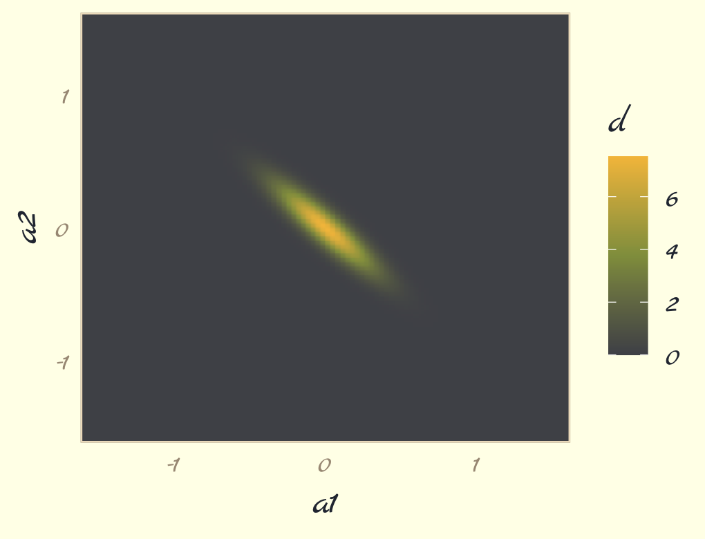
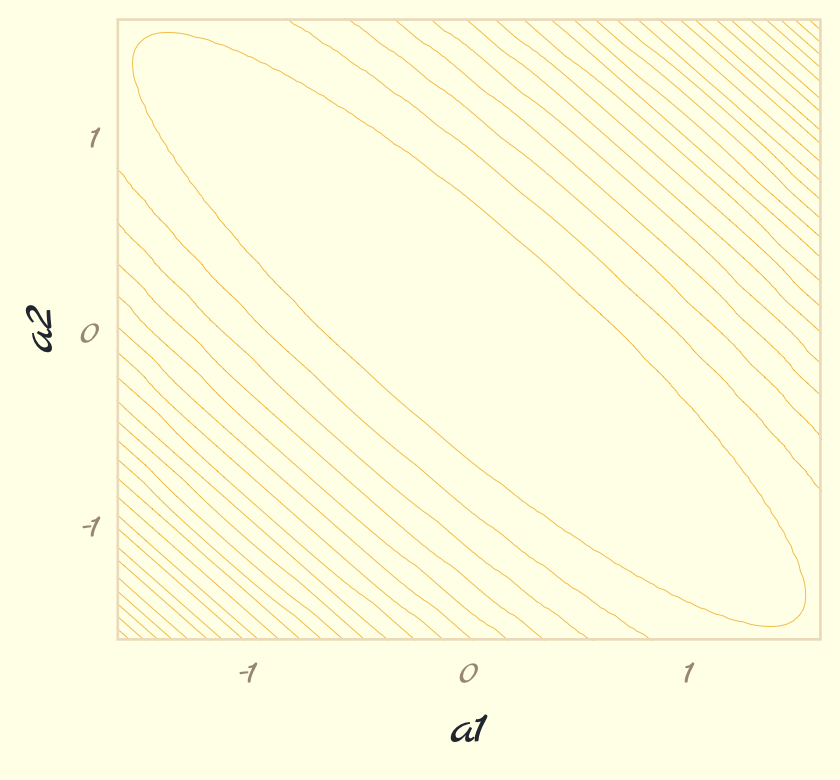
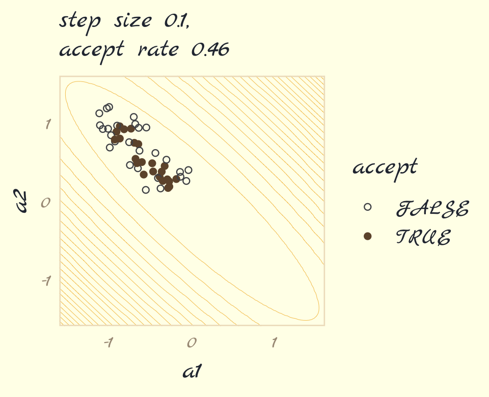
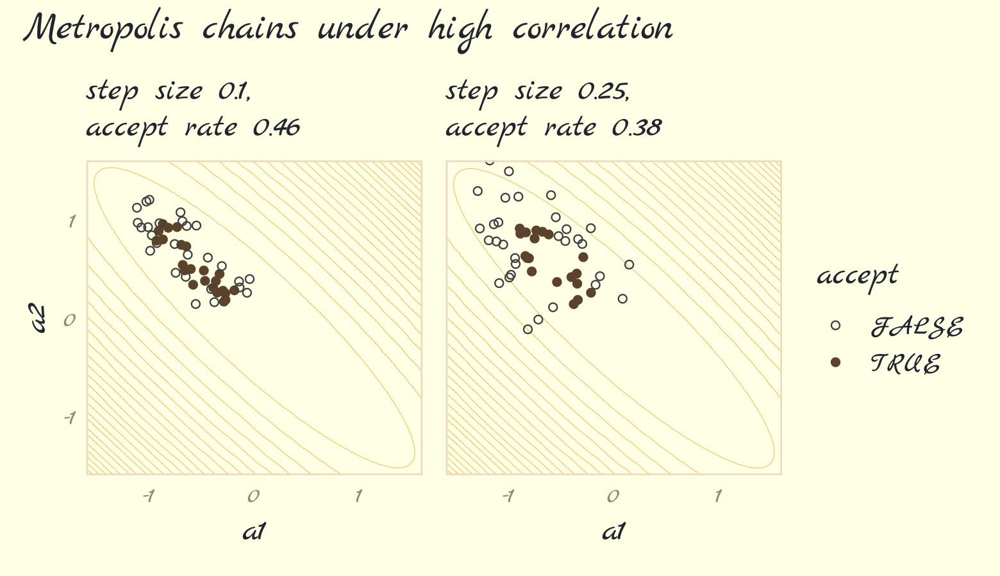
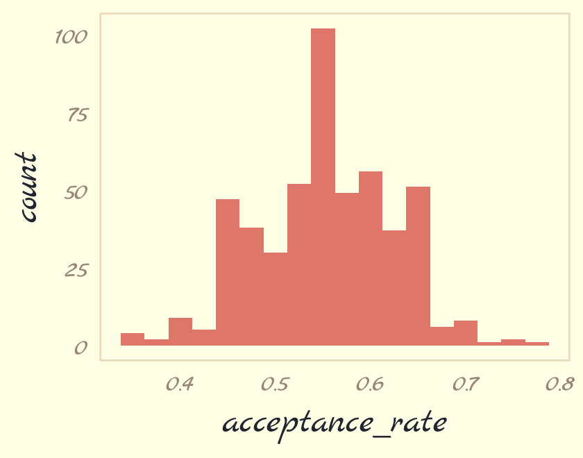

Section 9.2.2: High-dimensional problems
================
A Solomon Kurz
2021-01-04

These packages will already have been loaded.

``` r
library(tidyverse)
library(ggpomological)
pomological_palette <- ggpomological:::pomological_palette
```

## 9.2 Metropolis algorithms

### 9.2.1 Gibbs sampling.

### 9.2.2 High-dimensional problems.

The Gibbs sampler is limited in that (a) you might not want to use
conjugate priors and (b) it can be quite inefficient with complex
hierarchical models, which we’ll be fitting soon.

Earlier versions of this ebook did not focus on McElreath’s example of
the pathology high autocorrelations can create when using the Metropolis
algorithm, which is depicted in Figure 9.3. However, [James
Henegan](https://gist.github.com/jameshenegan) kindly reached out with a
[**tidyverse** workflow for reproducing this
example](https://gist.github.com/jameshenegan/2048c8cb19f54b917e4fcd740a7031b9).
Here is a slightly amended version of that workflow.

The first step is to simulate a bivariate distribution “with a strong
negative correlation of -0.9” (p. 268). Henagen simulated the from a
distribution where the two variables \(\text a_1\) and \(\text a_2\)
folowed the bivariate normal distribution

\[
\begin{align*}
\begin{bmatrix} \text a_1 \\ \text a_2 \end{bmatrix} & \sim \operatorname{MVNormal} \left (\begin{bmatrix} 0 \\ 0 \end{bmatrix}, \mathbf \Sigma \right) \\
\mathbf \Sigma & = \mathbf{SRS} \\
\mathbf S & = \begin{bmatrix} 0.22 & 0 \\ 0 & 0.22 \end{bmatrix} \\
\mathbf R & = \begin{bmatrix} 1 & -.9 \\ -.9 & 1 \end{bmatrix},
\end{align*}
\]

where the variance/covariance matrix is decomposed into a \(2 \times 2\)
matrix of standard deviations and a \(2 \times 2\) correlation matrix.
In this example, both variables (\(\text a_1\) and \(\text a_2\)) have
standard deviations of 0.22. We’ll have more practice with data of this
kind in Chapter 14. For now, just go with it. Here’s how to simulate
from this distribution.

``` r
# mean vector
mu <- c(0, 0)

# variance/covariance matrix
sd_a1 <- 0.22
sd_a2 <- 0.22
rho   <- -.9

Sigma <- matrix(data = c(sd_a1^2,
                         rho * sd_a1 * sd_a2,
                         rho * sd_a1 * sd_a2,
                         sd_a2^2),
                nrow = 2)

# sample from the distribution with the `mvtnorm::rmvnorm()` function
set.seed(9)

my_samples <- mvtnorm::rmvnorm(n = 1000, mean = mu, sigma = Sigma)
```

Check the sample correlation.

``` r
data.frame(my_samples) %>% 
  set_names(str_c("a", 1:2)) %>% 
  summarise(rho = cor(a1, a2))
```

    ##          rho
    ## 1 -0.9106559

We won’t actually be using the values from this sumulation. Instead, we
can evaluate the *density function* for this distribution using the
`mvtnorm::dmvnorm()` function. But even before that, we’ll want to
create a grid of values for the contour lines in Figure 9.3. Here we do
so with a custom function called `x_y_grid()`.

``` r
x_y_grid <- function(x_start = -1.6,
                     x_stop = 1.6,
                     x_length = 100,
                     y_start = -1.6,
                     y_stop = 1.6,
                     y_length = 100) {
  
  x_domain <- seq(from = x_start, to = x_stop, length.out = x_length)
  y_domain <- seq(from = y_start, to = y_stop, length.out = y_length)
  
  x_y_grid_tibble <- tidyr::expand_grid(a1 = x_domain, a2 = y_domain)
  
  return(x_y_grid_tibble)
  
}

contour_plot_dat <- x_y_grid()

str(contour_plot_dat)
```

    ## tibble [10,000 × 2] (S3: tbl_df/tbl/data.frame)
    ##  $ a1: num [1:10000] -1.6 -1.6 -1.6 -1.6 -1.6 -1.6 -1.6 -1.6 -1.6 -1.6 ...
    ##  $ a2: num [1:10000] -1.6 -1.57 -1.54 -1.5 -1.47 ...

Now compute the density values for each combination of `a1` and `a2`.

``` r
contour_plot_dat <- 
  contour_plot_dat %>% 
  mutate(d = mvtnorm::dmvnorm(as.matrix(contour_plot_dat), mean = mu, sigma = Sigma))

head(contour_plot_dat)
```

    ## # A tibble: 6 x 3
    ##      a1    a2         d
    ##   <dbl> <dbl>     <dbl>
    ## 1  -1.6 -1.6  1.47e-229
    ## 2  -1.6 -1.57 6.08e-225
    ## 3  -1.6 -1.54 2.24e-220
    ## 4  -1.6 -1.50 7.38e-216
    ## 5  -1.6 -1.47 2.17e-211
    ## 6  -1.6 -1.44 5.68e-207

To get a sense of what we’ve done, here are those data as a 2D density
plot.

``` r
contour_plot_dat %>% 
  ggplot(aes(x = a1, y = a2, fill = d)) +
  geom_raster(interpolate = T) +
  scale_fill_gradientn(colors = pomological_palette[c(8, 2, 4)],
                       limits = c(0, NA)) +
  scale_x_continuous(expand = c(0, 0)) +
  scale_y_continuous(expand = c(0, 0)) +
  theme_pomological_fancy(base_family = "Marck Script")
```



But we don’t want a density plot. We want contour lines.

``` r
contour_plot <- 
  contour_plot_dat %>% 
  ggplot() + 
  geom_contour(aes(x = a1, y = a2, z = d), 
               size = 1/8, color = pomological_palette[4],
               breaks = 9^(-(10 * 1:25))) +
  theme_pomological_fancy(base_family = "Marck Script")

contour_plot
```



Note how we saved that plot as `contour_plot`, which will serve as the
base for the two panels in our Figure 9.3. Next we use the Metropolis
algorithm to sample from the posterior defined, above. Henagen’s
implementation is wrapped in a custom function he called `metropolis()`,
which is designed to track

  - coordinates of candidate (i.e., proposal) points, and
  - whether or not the candidate points were accepted.

Here we define `metropolis()` with slight amendments to Henagen’s
original.

``` r
metropolis <- function(num_proposals = 50,
                       step_size = 0.1,
                       starting_point = c(-1, 1)) {
  
  # Initialize vectors where we will keep track of relevant
  candidate_x_history <- rep(-Inf, num_proposals)
  candidate_y_history <- rep(-Inf, num_proposals)
  did_move_history <- rep(FALSE, num_proposals)
  
  # Prepare to begin the algorithm...
  current_point <- starting_point
  
  for(i in 1:num_proposals) {
    
    # "Proposals are generated by adding random Gaussian noise
    # to each parameter"
    
    noise <- rnorm(n = 2, mean = 0, sd = step_size)
    candidate_point <- current_point + noise
    
    # store coordinates of the proposal point
    candidate_x_history[i] <- candidate_point[1]
    candidate_y_history[i] <- candidate_point[2]
    
    # evaluate the density of our posterior at the proposal point
    candidate_prob <- mvtnorm::dmvnorm(candidate_point, mean = mu, sigma = Sigma)
    
    # evaluate the density of our posterior at the current point
    current_prob <- mvtnorm::dmvnorm(current_point, mean = mu, sigma = Sigma)
    
    # Decide whether or not we should move to the candidate point
    acceptance_ratio <- candidate_prob / current_prob
    should_move <- ifelse(runif(n = 1) < acceptance_ratio, TRUE, FALSE)
    
    # Keep track of the decision
    did_move_history[i] <- should_move
    
    # Move if necessary
    if(should_move) {
      current_point <- candidate_point
    }
  }
  
  # once the loop is complete, store the relevant results in a tibble
  results <- tibble::tibble(
    candidate_x = candidate_x_history,
    candidate_y = candidate_y_history,
    accept = did_move_history
  )
  
  # compute the "acceptance rate" by dividing the total number of "moves"
  # by the total number of proposals
  
  number_of_moves <- results %>% dplyr::pull(accept) %>% sum(.)
  acceptance_rate <- number_of_moves/num_proposals
  
  return(list(results = results, acceptance_rate = acceptance_rate))
  
}
```

Run the algorithm for the panel on the left, which uses a setp size of
0.1.

``` r
set.seed(9)

round_1 <- metropolis(num_proposals = 50,
                      step_size = 0.1,
                      starting_point = c(-1,1))
```

Make Figure 9.3a.

``` r
p1 <-
  contour_plot + 
  geom_point(data = round_1$results,
             aes(x = candidate_x, y = candidate_y, 
                 color = accept, shape = accept)) +
  labs(subtitle = str_c("step size 0.1,\naccept rate ", round_1$acceptance_rate),
       x = "a1",
       y = "a2") +
  scale_shape_manual(values = c(21, 19)) +
  scale_color_manual(values = pomological_palette[8:9]) +
  scale_x_continuous(expand = c(0, 0)) +
  scale_y_continuous(expand = c(0, 0)) +
  theme_pomological_fancy(base_family = "Marck Script")

p1
```



Now run the algorithm with step size set to 0.25. Then make Figure 9.3b,
combine the two ggplots, and return the our full version of Figure 9.3.

``` r
set.seed(9)

round_2 <- metropolis(num_proposals = 50,
                      step_size = 0.25,
                      starting_point = c(-1,1))

p2 <-
  contour_plot + 
  geom_point(data = round_2$results,
             mapping = aes(x = candidate_x, y = candidate_y, 
                           color = accept, shape = accept)) +
  labs(subtitle = str_c("step size 0.25,\naccept rate ", round_2$acceptance_rate),
       x = "a1") +
  scale_shape_manual(values = c(21, 19)) +
  scale_color_manual(values = pomological_palette[8:9]) +
  scale_x_continuous(expand = c(0, 0)) +
  scale_y_continuous(NULL, breaks = NULL, expand = c(0, 0)) +
  theme_pomological_fancy(base_family = "Marck Script")

library(patchwork)
(p1 + p2) + 
  plot_annotation(theme = theme_pomological_fancy(base_family = "Marck Script"),
                  title = "Metropolis chains under high correlation") +
  plot_layout(guides = "collect")
```



Our acceptance rates differ from McElreat’s due to simulation variance.
If you want to get a sense of stability in the acceptance rates, just
simulate some more. For example, we might wrap `metropolis()` inside
another function that takes a simulation seed value.

``` r
metropolis_with_seed <- function(seed) {
  
  set.seed(seed)
  
  met <-
    metropolis(num_proposals = 50,
               step_size = 0.1,
               starting_point = c(-1,1))
  
  return(met$acceptance_rate)
  
}
```

Kick the times and iterate 500 times.

``` r
ars <-
  tibble(seed = 1:500) %>% 
  mutate(acceptance_rate = map_dbl(seed, metropolis_with_seed)) 
```

Now summarize the results in a histogram.

``` r
ars %>% 
  ggplot(aes(x = acceptance_rate)) +
  geom_histogram(binwidth = .025, fill = pomological_palette[5]) +
  theme_pomological_fancy(base_family = "Marck Script")
```


